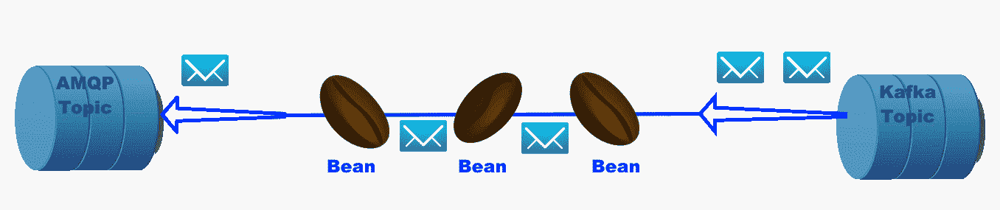

# MicroProfile 响应式消息传递架构

使用响应式消息传递的应用由 CDI Bean 组成，这些 Bean 消费、生产和处理消息。消息可以是应用内部的，也可以通过外部消息代理发送和接收，如下图所示：

此图显示了一个 Kafka 主题将消息发布到第一个 Bean，该 Bean 进行一些处理后将其发布到第二个 Bean，第二个 Bean 进行自己的处理/过滤，最后将消息作为 AMQP 主题发布。

正如我们将在研究 MP-RM 示例时看到的那样，应用 Bean 包含带有 `@Incoming` 和/或 `@Outgoing ...` 注解的方法。

