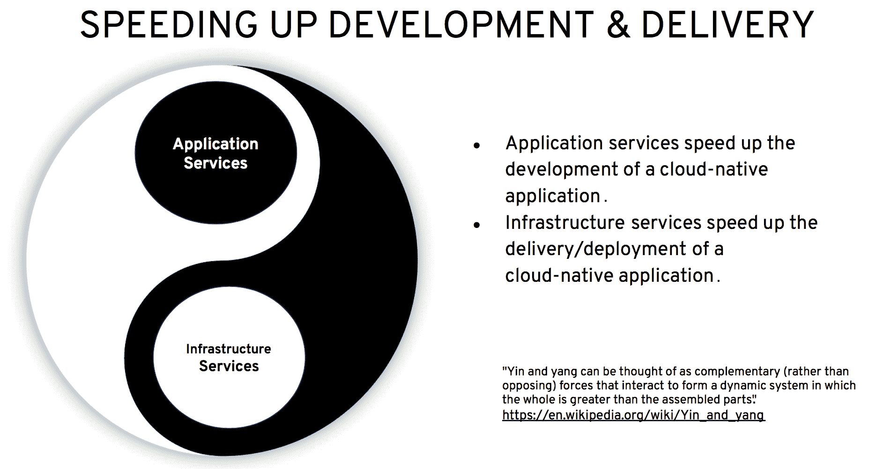
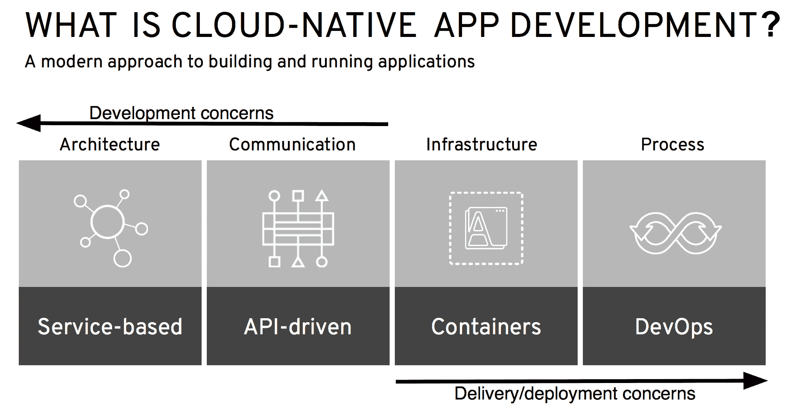

# 云原生应用开发

云原生应用开发有两个互补的方面或组成部分：应用服务和基础设施服务。应用服务加速云原生应用业务逻辑的开发，而基础设施服务则加速其交付和部署。这两个方面是互补的，并且是云原生应用开发不可或缺的组成部分。两者缺一不可。它们本质上是云原生应用开发的阴阳两面，如下图所示：

正如我们在本章前面提到的，云原生应用开发是一种构建和运行应用的方法，它充分利用了云计算模型，该模型基于四个关键原则：

*   基于服务的架构（迷你服务、微服务、SOA 服务等）
*   用于服务间通信的 API 驱动方法
*   基于容器的基础设施
*   DevOps 流程

下图描绘了云原生应用开发的四个关键原则：

如上图所示，架构和通信方面与云原生应用的开发关注点相关，而基础设施和流程方面则与其交付/部署相关。

正在采用云原生应用开发的组织可以从八个步骤中受益，如电子书《通往云原生应用之路：**指导您旅程的 8 个步骤**》所述。

要获取电子书《通往云原生应用之路：**指导您旅程的 8 个步骤**》，请参考 [`www.redhat.com/en/resources/path-to-cloud-native-applications-ebook`](https://www.redhat.com/en/resources/path-to-cloud-native-applications-ebook)。让我们讨论一下 Eclipse MicroProfile 如何在这八个步骤中发挥作用：

1.  **发展 DevOps 文化与实践**：“*通过拥抱 DevOps 的原则和文化价值观，并围绕这些价值观组织你的团队，来利用新技术、更快速的方法以及更紧密的协作。*”尽管这是一个与组织和流程相关的步骤，但 Eclipse MicroProfile 作为微服务规范，非常适合这种文化与流程的适配，因为微服务因其特性，能够紧密支持 DevOps 流程。
2.  **使用快速单体加速现有应用**：“*通过迁移到现代化的、基于容器的平台来加速现有应用——并将单体应用拆分为微服务或迷你服务，以获得额外的效率提升。*”在将单体应用拆分为微服务时，Eclipse MicroProfile 能提供巨大帮助。当你在单体应用中识别出限界上下文时，可以考虑使用 Eclipse MicroProfile 来实现每个微服务，这些微服务负责实现每个限界上下文的逻辑。
3.  **使用应用服务加速开发**：“*通过可重用性加速软件开发。云原生应用服务是开箱即用的开发者工具。然而，这些可重用组件必须经过优化并集成到底层云原生基础设施中，才能最大化其效益。*”**内存数据网格**和消息代理是能够加速业务逻辑开发的应用服务。使用 Eclipse MicroProfile 开发的微服务，可以通过在其方法体内调用这些应用服务来利用它们。Eclipse MicroProfile 在集成应用服务（如内存数据网格或消息代理）时，不会施加任何限制。
4.  **为正确的任务选择正确的工具**：“*使用一个支持框架、语言和架构最佳组合的、基于容器的应用平台——并且该平台可以根据你的特定业务应用需求进行定制。*”Eclipse MicroProfile 是开发者在为正确任务选择正确工具时可以使用的一个工具。例如，红帽应用运行时是一系列运行时和工具的集合，其中包括 Eclipse MicroProfile、Node.js、Spring Boot 和 Vertex。
5.  **为开发者提供自助式、按需的基础设施**：“*使用容器和容器编排技术来简化对底层基础设施的访问，赋予 IT 运维团队控制权和可见性，并在各种基础设施环境（如数据中心、私有云和公有云）中提供强大的应用生命周期管理。*”你使用 Eclipse MicroProfile 开发的微服务可以部署到一个或多个容器中。通过轻松管理这些容器以及运行在其上的微服务架构，你可以加速开发周期，从而更快地为业务交付价值。
6.  **自动化 IT 以加速应用交付**：“*创建自动化沙盒以学习自动化语言和流程，跨组织建立协作对话以定义服务需求，创建自助服务目录以赋能用户并加速交付，并使用计量、监控和计费策略及流程。*”Eclipse MicroProfile 提供了指标、容错和健康检查等功能，所有这些都可以作为 IT 自动化流程的输入。
7.  **实施持续交付和高级部署技术**：“*通过自动化交付、CI/CD 流水线、滚动蓝绿部署和金丝雀部署以及 A/B 测试，加速云原生应用的交付。*”将微服务与 CI/CD 结合使用可以促进高级部署技术。例如，你可以引入一个基于 MicroProfile 的、带有新功能的微服务，作为蓝绿部署或金丝雀部署的一部分投入生产，一旦证明新功能按预期工作，就将所有流量切换到该服务。
8.  **发展更模块化的架构**：“*选择一种适合你特定需求的模块化设计，可以使用微服务、单体优先方法、迷你服务或它们的组合。*”对于这一步，你可以使用 Eclipse MicroProfile 为新应用开发微服务，或者在将单体应用中的特定限界上下文拆分为微服务时使用它。

现在我们已经讨论了 Eclipse MicroProfile 如何促进云原生应用开发，以及它如何在八个步骤中的每一步提供帮助，以指导你踏上云原生应用之旅，接下来让我们转向跨云运行基于 MicroProfile 的应用这一主题。

