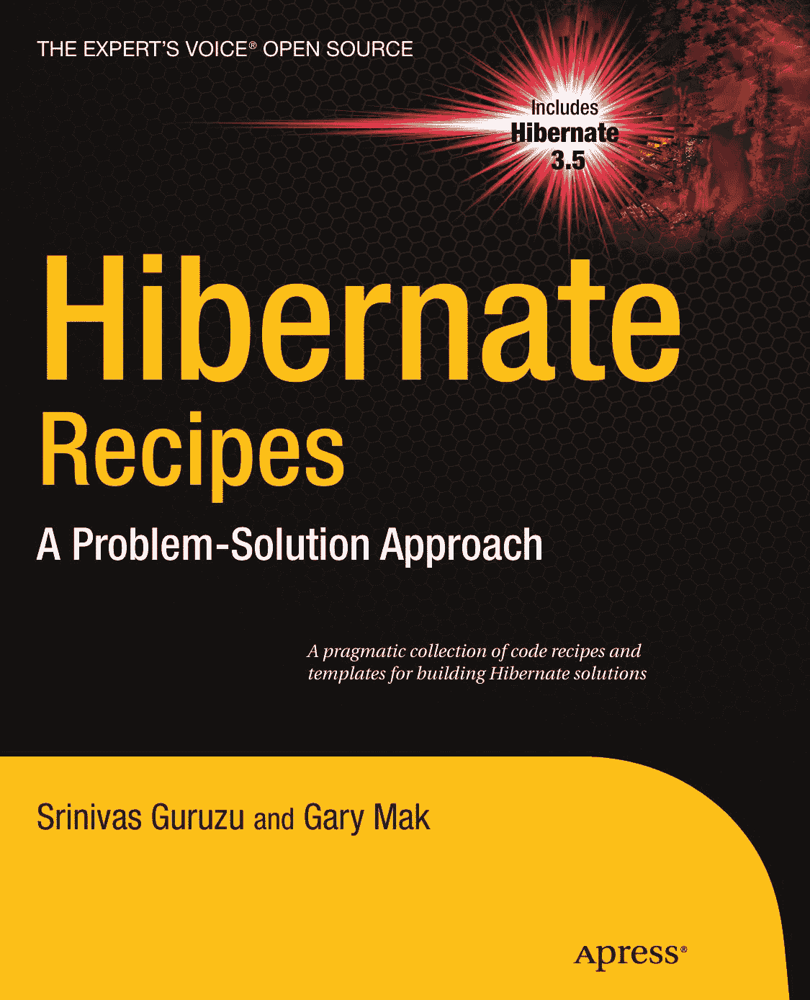
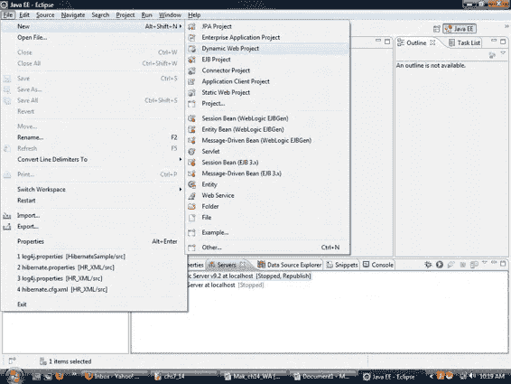
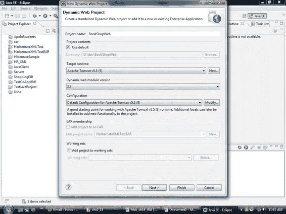
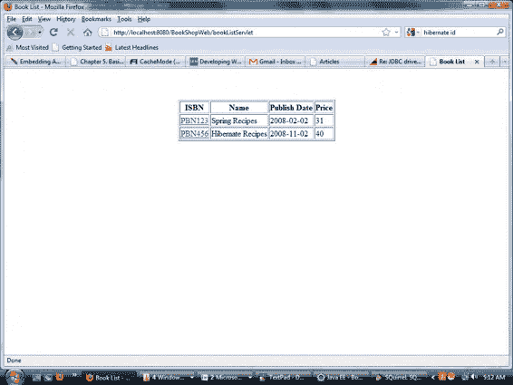
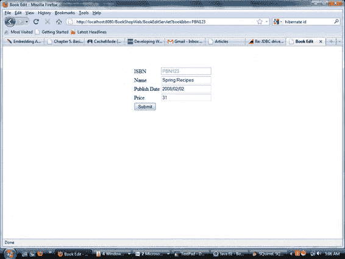
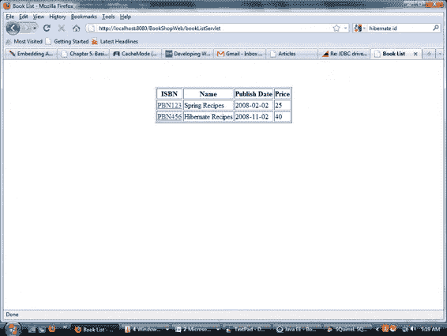
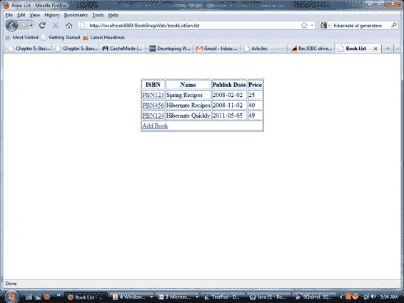
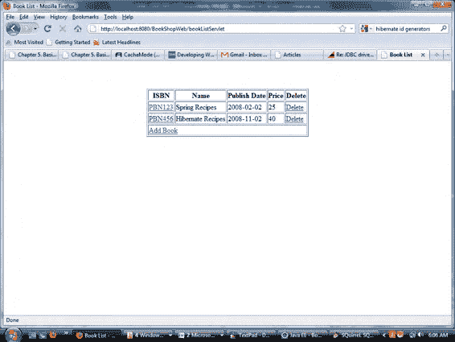

专家之声® 开源

****包含

******Hibernate

**3.5**

**********Hibernate

实战食谱

******问题解决方案

***实用的代码食谱与*

**构建 Hibernate 解决方案的模板*

****斯里尼瓦斯·古鲁祖**

**加里·马克**

****************************Hibernate 实战食谱：

问题解决方案

■ ■ ■

**斯里尼瓦斯·古鲁祖**

**加里·马克**

**Hibernate 实战食谱：问题解决方案

版权所有 © 2010，斯里尼瓦斯·古鲁祖与加里·马克

保留所有权利。未经版权所有者及出版人事先书面许可，不得以任何形式或任何方式（电子或机械，包括影印、录制或任何信息存储与检索系统）复制或传播本作品的任何部分。

ISBN-13（平装）：978-1-4302-2796-0

ISBN-13（电子版）：978-1-4302-2797-7

在美国印刷并装订 9 8 7 6 5 4 3 2 1

本书中可能出现商标名称、标识和图像。我们并非在每次出现商标名称、标识或图像时都使用商标符号，而是仅以编辑方式使用这些名称、标识和图像，以维护商标所有者的利益，且无意侵犯商标权。

本出版物中对商品名称、商标、服务标记及类似术语的使用（即使未明确标识）不应被视为对其是否受专有权利保护的看法表达。

总裁与出版人：保罗·曼宁

首席编辑：史蒂夫·安格林

技术审校：苏米特·帕尔与迪奥尼西奥斯·G·西诺迪诺斯

编辑委员会：克莱·安德烈斯、史蒂夫·安格林、马克·贝克纳、尤安·白金汉、加里·康奈尔、乔纳森·根尼克、乔纳森·哈塞尔、米歇尔·洛曼、马修·穆迪、邓肯·帕克斯、杰弗里·佩珀、弗兰克·波尔曼、道格拉斯·庞迪克、本·雷诺-克拉克、多米尼克·谢克沙夫特、马特·韦德、汤姆·韦尔什

协调编辑：安妮塔·卡斯特罗

文字编辑：蒂芙尼·泰勒

排版：金伯利·伯顿

索引编制：BIM 索引与校对服务

插图：阿普丽尔·米尔恩

封面设计：安娜·伊什琴科

全球图书贸易由 Springer Science+Business Media, LLC 发行，地址：233 Spring Street,

6th Floor, New York, NY 10013。电话：1-800-SPRINGER，传真：(201) 348-4505，电子邮件：**orders-ny@springer-**

**sbm.com**，或访问 **www.springeronline.com**。

如需翻译相关信息，请发送电子邮件至 **rights@apress.com**，或访问 **www.apress.com**。

Apress 及 friends of ED 的书籍可批量购买用于学术、企业或促销用途。

大多数图书也提供电子书版本和许可证。更多信息，请参考我们的特别批量销售–电子书许可证网页：[**www.apress.com/info/bulksales**](http://www.apress.com/info/bulksales)。

本书中的信息按“原样”分发，不提供任何担保。尽管在编写本作品时已采取所有预防措施，但作者和 Apress 均不对因本作品所含信息直接或间接造成的任何损失或损害承担任何责任。

本书的源代码可在 [**www.apress.com**](http://www.apress.com) 上供读者获取。您需要回答与本书相关的问题才能成功下载代码。

*献给我亲爱的妻子，乌莎*

*—— 斯里尼瓦斯·古鲁祖*

*****内容速览**

■**关于作者............................................................................................................. xix**

■**关于技术审校....................................................................................................... xx**

■**致谢.................................................................................................................. xxi**

■**第 1 章：Hibernate 入门.......................................................................................... 1**

■**第 2 章：基本映射与对象标识.................................................................................. 33**

■**第 3 章：组件映射.................................................................................................. 49**

■**第 4 章：继承与自定义映射.................................................................................... 69**

■**第 5 章：多对一与一对一映射................................................................................... 95**

■**第 6 章：集合映射................................................................................................ 115**

■**第 7 章：多值关联................................................................................................. 137**

■**第 8 章：HQL 与 JPA 查询语言................................................................................ 155**

■**第 9 章：使用 Criteria 与 Example 进行查询............................................................. 167**

■**第 10 章：对象操作............................................................................................... 179**

■**第 11 章：批处理与原生 SQL.................................................................................. 193**

■**第 12 章：Hibernate 中的缓存................................................................................ 203**

■**第 13 章：事务与并发............................................................................................ 219**

■**第 14 章：Web 应用程序......................................................................................... 237**

■ **索引................................................................................................................... 265**

iv

**目录**

■**关于作者............................................................................................................. xix**

■**关于技术审校....................................................................................................... xx**

■**致谢.................................................................................................................. xxi**

■**第 1 章：Hibernate 入门.......................................................................................... 1**

1.1 设置 Hibernate............................................................................................................ 3

问题 .................................................................................................................................................... 3

解决方案 .................................................................................................................................................... 3

工作原理 ................................................................................................................................................ 4

安装 JDK ................................................................................................................................................ 4

安装 Eclipse Web 工具平台 (WTP) ............................................................................................................. 5


安装 Derby ................................................................................................................................................... 5

1.2 使用基本 JDBC 进行编程.................................................................................... 7

问题 .................................................................................................................................................... 7

解决方案 .................................................................................................................................................... 7

工作原理 ............................................................................................................................................ 7

创建 Eclipse 项目 ................................................................................................................................. 7

JDBC 初始化与清理 .......................................................................................................................... 8

使用 JDBC 查询数据库 ........................................................................................................................ 8

使用 JDBC 更新数据库 ...................................................................................................................... 8

创建领域模型................................................................................................................................. 9

检索对象图................................................................................................................................... 10

持久化对象图................................................................................................................................... 11

使用 JDBC 时的问题................................................................................................................................ 12

1.3 配置 Hibernate................................................................................................ 12

v

■ 目录

问题 .................................................................................................................................................. 12

解决方案 .................................................................................................................................................. 12

工作原理 .......................................................................................................................................... 12

获取所需的 JAR 包 ................................................................................................................................. 13

创建映射定义............................................................................................................................ 13

配置..................................................................................................................................................... 14

编程式配置 ............................................................................................................................. 14

XML 配置............................................................................................................................................. 15

打开和关闭会话 .......................................................................................................................... 16

检索对象 ............................................................................................................................................. 16

1.4 配置 JPA 项目 .......................................................................................... 17

问题 .................................................................................................................................................. 17

解决方案 .................................................................................................................................................. 17

工作原理 .......................................................................................................................................... 17

打开会话............................................................................................................................................. 22

1.5 使用实体管理器................................................................................................. 23

问题 .................................................................................................................................................. 23

解决方案 .................................................................................................................................................. 23

工作原理 .......................................................................................................................................... 23

1.6 在 Hibernate 中启用日志记录................................................................................... 27

问题 .................................................................................................................................................. 27

解决方案 .................................................................................................................................................. 27

工作原理 .......................................................................................................................................... 28

检查 Hibernate 发出的 SQL 语句 ........................................................................................ 28

配置 Log4j .............................................................................................................................................. 28

启用实时统计信息 ............................................................................................................................. 28

1.7 使用 Hibernate 生成数据库模式...................................................... 29

问题 .................................................................................................................................................. 29

解决方案 .................................................................................................................................................. 29


工作原理 .......................................................................................................................................... 29

vi

■ 目录

创建 Ant 构建文件 .......................................................................................................................................... 29

使用 SchemaExport 生成数据库模式 ......................................................................................... 30

使用 SchemaUpdate 更新数据库模式 ........................................................................................ 30

指定数据库模式的详细信息 .................................................................................................. 30

小结 ......................................................................................................................... 31

■**第 2 章：基本映射与对象标识 ...................................................... 33**

2.1 为持久化提供标识符 ........................................................................................................ 33

问题 ............................................................................................................................................................. 33

解决方案 ............................................................................................................................................................. 33

工作原理 ..................................................................................................................................................... 33

2.2 在 Hibernate 中创建复合键 ............................................................................................ 38

问题 ............................................................................................................................................................. 38

解决方案 ............................................................................................................................................................. 39

工作原理 ..................................................................................................................................................... 39

2.3 Hibernate 中的 SaveOrUpdate .............................................................................................................. 42

问题 ............................................................................................................................................................. 42

解决方案 ............................................................................................................................................................. 42

工作原理 ..................................................................................................................................................... 43

2.4 Hibernate 中的动态 SQL 生成 .............................................................................................. 43

问题 ............................................................................................................................................................. 43

解决方案 ............................................................................................................................................................. 44

工作原理 ..................................................................................................................................................... 44

2.5 Hibernate 中的实体命名 ............................................................................................................ 45

问题 ............................................................................................................................................................. 45

解决方案 ............................................................................................................................................................. 45

工作原理 ..................................................................................................................................................... 46

小结 ................................................................................................................................................ 48

■**第 3 章：组件映射 ............................................................................ 49**

3.1 将值类型实现为组件 ............................................................................................................................. 49

问题 .................................................................................................................................................. 49

vii

■ 目录

解决方案 .................................................................................................................................................. 49

工作原理 .......................................................................................................................................... 49

使用 JPA 注解 ........................................................................................................................... 52

3.2 嵌套组件 .......................................................................................................................................... 55

问题 .................................................................................................................................................. 55

解决方案 .................................................................................................................................................. 55

工作原理 .......................................................................................................................................... 56

3.3 在组件中添加引用 .......................................................................................................................................... 58

问题 .................................................................................................................................................. 58

解决方案 .................................................................................................................................................. 58

工作原理 .......................................................................................................................................... 58

3.4 映射组件集合 .......................................................................................................................................... 61


问题 .................................................................................................................................................. 61

解决方案 .................................................................................................................................................. 61

工作原理 .......................................................................................................................................... 61

3.5 将组件用作映射的键 ......................................................................... 66

问题 .................................................................................................................................................. 66

解决方案 .................................................................................................................................................. 66

工作原理 .......................................................................................................................................... 66

总结 ......................................................................................................................... 67

■**第 4 章：继承与自定义映射 ........................................................ 69**

4.1 使用每个类层次结构一张表映射实体 ...................................................... 70

问题 .................................................................................................................................................. 70

解决方案 .................................................................................................................................................. 70

工作原理 .......................................................................................................................................... 72

4.2 使用每个子类一张表映射实体 ................................................................. 74

问题 .................................................................................................................................................. 74

解决方案 .................................................................................................................................................. 75

viii

■ 目录

工作原理 .......................................................................................................................................... 75

4.3 使用每个具体类一张表映射实体 ....................................................... 78

问题 .................................................................................................................................................. 78

解决方案 .................................................................................................................................................. 78

工作原理 .......................................................................................................................................... 78

4.4 自定义映射 ...................................................................................................... 81

问题 .................................................................................................................................................. 81

解决方案 .................................................................................................................................................. 81

工作原理 .......................................................................................................................................... 81

4.5 CompositeUserType 映射 .................................................................................. 87

问题 .................................................................................................................................................. 87

解决方案 .................................................................................................................................................. 87

工作原理 .......................................................................................................................................... 87

总结 ......................................................................................................................... 93

■**第 5 章：多对一与一对一映射 ............................................... 95**

5.1 使用多对一关联 .............................................................................. 95

问题 .................................................................................................................................................. 95

解决方案 .................................................................................................................................................. 96

工作原理 .......................................................................................................................................... 96

5.2 使用带连接表的多对一关联 ................................................. 99

问题 .................................................................................................................................................. 99

解决方案 ................................................................................................................................................ 100

工作原理 ........................................................................................................................................ 100

5.3 在多对一关联上使用延迟初始化 ........................................... 102

问题 ................................................................................................................................................ 102

解决方案 ................................................................................................................................................ 102

工作原理 ........................................................................................................................................ 103

5.4 共享主键关联 ........................................................................... 104

ix

■ 目录


问题 ................................................................................................................................................ 104

解决方案 ................................................................................................................................................ 104

工作原理 ........................................................................................................................................ 104

5.5 使用外键创建一对一关联 ..................................................................................................... 107

问题 ................................................................................................................................................ 107

解决方案 ................................................................................................................................................ 107

工作原理 ........................................................................................................................................ 107

5.6 使用连接表创建一对一关联 ................................................................................................... 109

问题 ................................................................................................................................................ 109

解决方案 ................................................................................................................................................ 109

工作原理 ........................................................................................................................................ 109

小结 ................................................................................................................................................ 113

■**第 6 章：集合映射 ........................................................................................................... 115**

6.1 映射集合（Set） .................................................................................................................. 115

问题 ................................................................................................................................................ 115

解决方案 ................................................................................................................................................ 115

工作原理 ........................................................................................................................................ 116

6.2 映射包（Bag） ..................................................................................................................... 118

问题 ................................................................................................................................................ 118

解决方案 ................................................................................................................................................ 118

工作原理 ........................................................................................................................................ 118

6.3 映射列表（List） ................................................................................................................. 122

问题 ................................................................................................................................................ 122

解决方案 ................................................................................................................................................ 122

工作原理 ........................................................................................................................................ 122

6.4 映射数组（Array） ............................................................................................................ 124

问题 ................................................................................................................................................ 124

解决方案 ................................................................................................................................................ 124

x

■ 目录

工作原理 ........................................................................................................................................ 124

6.5 映射映射（Map） ............................................................................................................ 126

问题 ................................................................................................................................................ 126

解决方案 ................................................................................................................................................ 126

工作原理 ........................................................................................................................................ 126

6.6 对集合进行排序 ................................................................................................................... 128

问题 ................................................................................................................................................ 128

解决方案 ................................................................................................................................................ 128

工作原理 ........................................................................................................................................ 129

使用自然顺序 ........................................................................................................................................... 129

编写自定义比较器 ..................................................................................................................................... 130

在数据库中进行排序 ................................................................................................................................... 132

6.6 使用延迟初始化 ................................................................................................................... 133

问题 ................................................................................................................................................ 133

解决方案 ................................................................................................................................................ 133

工作原理 ........................................................................................................................................ 134


摘要 ................................................................................................................................ 135

■**第 7 章：多值关联........................................................................................ 137**

7.1 使用外键映射一对多关联...................................................................................... 137

问题 ................................................................................................................................................ 137

解决方案 ................................................................................................................................................ 137

工作原理 ........................................................................................................................................ 138

7.2 使用外键映射一对多双向关联................................................................................ 142

问题 ................................................................................................................................................ 142

解决方案 ................................................................................................................................................ 142

工作原理 ........................................................................................................................................ 143

7.3 使用连接表映射一对多双向关联........................................................................... 145

问题 ................................................................................................................................................ 145

xi

■ 目录

解决方案 ................................................................................................................................................ 145

工作原理 ........................................................................................................................................ 145

7.4 使用连接表映射多对多单向关联........................................................................... 148

问题 ................................................................................................................................................ 148

解决方案 ................................................................................................................................................ 149

工作原理 ........................................................................................................................................ 149

7.5 使用连接表创建多对多双向关联........................................................................... 150

问题 ................................................................................................................................................ 150

解决方案 ................................................................................................................................................ 150

工作原理 ........................................................................................................................................ 151

摘要 ........................................................................................................................ 153

■**第 8 章：HQL 与 JPA 查询语言........................................................................ 155**

8.1 使用查询对象........................................................................................................ 155

问题 ................................................................................................................................................ 155

解决方案 ................................................................................................................................................ 155

工作原理 ........................................................................................................................................ 156

创建查询对象 .......................................................................................................................................... 156

from 子句 .............................................................................................................................................. 156

where 子句 ............................................................................................................................................ 157

分页 ....................................................................................................................................................... 157

参数绑定 .......................................................................................................................................... 158

命名查询 ................................................................................................................................................ 160

8.2 使用 Select 子句..................................................................................................... 161

问题 ................................................................................................................................................ 161

解决方案 ................................................................................................................................................ 161

工作原理 ........................................................................................................................................ 161

8.3 连接....................................................................................................................... 163

问题 ................................................................................................................................................ 163

解决方案 ................................................................................................................................................ 163

xii

■ 目录

工作原理 ........................................................................................................................................ 163

显式连接 ................................................................................................................................................... 163

隐式连接 ................................................................................................................................................... 164


外连接 ...................................................................................................................................................... 164

匹配文本.................................................................................................................................................. 164

获取关联 ..................................................................................................................................................... 165

8.4 创建报表查询........................................................................................... 165

问题 ................................................................................................................................................ 165

解决方案 ................................................................................................................................................ 165

工作原理 ........................................................................................................................................ 165

使用聚合函数的投影 ........................................................................................................... 165

对聚合结果进行分组.......................................................................................................................... 166

小结 ....................................................................................................................... 166

■**第 9 章：使用 Criteria 和 Example 进行查询 ................................................. 167**

9.1 使用 Criteria ........................................................................................................... 168

问题 ................................................................................................................................................ 168

解决方案 ................................................................................................................................................ 168

工作原理 ........................................................................................................................................ 168

9.2 使用 Restrictions.................................................................................................... 169

问题 ................................................................................................................................................ 169

解决方案 ................................................................................................................................................ 169

工作原理 ........................................................................................................................................ 169

编写子查询.......................................................................................................................................... 171

9.3 在关联中使用 Criteria .................................................................................. 172

问题 ................................................................................................................................................ 172

解决方案 ................................................................................................................................................ 172

工作原理 ........................................................................................................................................ 172

9.4 使用 Projections..................................................................................................... 174

问题 ................................................................................................................................................ 174

xiii

■ 目录

解决方案 ................................................................................................................................................ 174

工作原理 ........................................................................................................................................ 174

使用 Projections 的聚合函数与分组 .................................................................................... 175

9.5 按示例查询 ............................................................................................... 176

问题 ................................................................................................................................................ 176

解决方案 ................................................................................................................................................ 176

工作原理 ........................................................................................................................................ 176

小结 ....................................................................................................................... 177

■**第 10 章：处理对象....................................................................... 179**

10.1 识别持久化对象状态....................................................................... 179

问题 ................................................................................................................................................ 179

解决方案 ................................................................................................................................................ 179

工作原理 ........................................................................................................................................ 179

瞬态对象 ............................................................................................................................................ 179

持久化对象 ........................................................................................................................................... 180

游离对象 ............................................................................................................................................ 180

已删除对象 ............................................................................................................................................ 181

10.2 处理持久化对象............................................................................ 182


问题 ................................................................................................................................................ 182

解决方案 ................................................................................................................................................ 182

工作原理 ........................................................................................................................................ 182

创建持久化对象 .................................................................................................................................... 182

检索持久化对象 ................................................................................................................................. 184

修改持久化对象 ................................................................................................................................. 185

删除持久化对象 .................................................................................................................................... 185

10.3 持久化游离对象 .................................................................................. 186

问题 ................................................................................................................................................ 186

解决方案 ................................................................................................................................................ 186

工作原理 ........................................................................................................................................ 186

xiv

■ 目录

重新关联游离对象 ............................................................................................................................... 186

合并游离对象 ..................................................................................................................................... 186

10.4 使用数据过滤器 ................................................................................................... 187

问题 ................................................................................................................................................ 187

解决方案 ................................................................................................................................................ 187

工作原理 ........................................................................................................................................ 188

10.5 使用拦截器 .................................................................................................. 190

问题 ................................................................................................................................................ 190

解决方案 ................................................................................................................................................ 190

工作原理 ........................................................................................................................................ 190

小结 ....................................................................................................................... 192

■**第 11 章：批处理与原生 SQL .................................................... 193**

11.1 执行批量插入 ....................................................................................... 194

问题 ................................................................................................................................................ 194

解决方案 ................................................................................................................................................ 194

工作原理 ........................................................................................................................................ 194

11.2 执行批量更新与删除 ......................................................................... 195

问题 ................................................................................................................................................ 195

解决方案 ................................................................................................................................................ 195

工作原理 ........................................................................................................................................ 195

11.3 使用原生 SQL ................................................................................................... 197

问题 ................................................................................................................................................ 197

解决方案 ................................................................................................................................................ 197

工作原理 ........................................................................................................................................ 198

11.4 使用命名 SQL 查询 ..................................................................................... 199

问题 ................................................................................................................................................ 199

解决方案 ................................................................................................................................................ 199

工作原理 ........................................................................................................................................ 199

xv

■ 目录

小结 ....................................................................................................................... 201

■**第 12 章：Hibernate 中的缓存 ........................................................................ 203**

在 Hibernate 中使用二级缓存 .......................................................................... 204

并发策略 ....................................................................................................... 205

缓存提供者 ............................................................................................................. 205

什么是缓存区域？ .............................................................................................. 207


缓存查询结果....................................................................................................... 207

12.1 使用一级缓存........................................................................................... 207

问题 ................................................................................................................................................ 207

解决方案 ................................................................................................................................................ 208

工作原理 ................................................................................................................................................ 208

12.2 配置二级缓存........................................................................................... 209

问题 ................................................................................................................................................ 209

解决方案 ................................................................................................................................................ 209

工作原理 ................................................................................................................................................ 209

12.3 缓存关联................................................................................................... 212

问题 ................................................................................................................................................ 212

解决方案 ................................................................................................................................................ 212

工作原理 ................................................................................................................................................ 212

12.4 缓存集合................................................................................................... 213

问题 ................................................................................................................................................ 213

解决方案 ................................................................................................................................................ 213

工作原理 ................................................................................................................................................ 213

12.5 缓存查询................................................................................................... 215

问题 ................................................................................................................................................ 215

解决方案 ................................................................................................................................................ 215

工作原理 ................................................................................................................................................ 215

小结 ........................................................................................................................... 217

xvi

■ 目录

■**第 13 章：事务与并发 ................................................................................... 219**

13.1 在独立 Java 应用程序中使用编程式事务........................................................ 220

问题 ................................................................................................................................................ 220

解决方案 ................................................................................................................................................ 220

工作原理 ................................................................................................................................................ 221

13.2 结合 JTA 使用编程式事务.......................................................................... 223

问题 ................................................................................................................................................ 223

解决方案 ................................................................................................................................................ 223

工作原理 ................................................................................................................................................ 224

13.3 启用乐观并发控制....................................................................................... 228

问题 ................................................................................................................................................ 228

解决方案 ................................................................................................................................................ 228

工作原理 ................................................................................................................................................ 231

13.4 使用悲观并发控制....................................................................................... 234

问题 ................................................................................................................................................ 234

解决方案 ................................................................................................................................................ 234

工作原理 ................................................................................................................................................ 234

小结 ........................................................................................................................... 236

■**第 14 章：Web 应用程序 ................................................................................ 237**

14.1 为书店 Web 应用程序创建控制器................................................................... 238

问题 ................................................................................................................................................ 238

解决方案 ................................................................................................................................................ 238

工作原理 ................................................................................................................................................ 238


创建动态 Web 项目........................................................................................................................ 238

配置连接池................................................................................................................................ 241

开发在线书店................................................................................................................................ 242

创建全局会话工厂........................................................................................................................ 242

列出持久化对象............................................................................................................................ 242

更新持久化对象............................................................................................................................ 244

xvii

■ 目录

创建持久化对象........................................................................................................................... 249

删除持久化对象........................................................................................................................... 252

14.2 创建数据访问层........................................................................................................ 254

问题........................................................................................................................................ 254

解决方案.................................................................................................................................... 254

工作原理.................................................................................................................................... 255

在数据访问对象中组织数据访问................................................................................................ 255

使用通用数据访问对象.............................................................................................................. 257

使用工厂集中管理 DAO 检索...................................................................................................... 259

处理延迟关联.............................................................................................................................. 261

使用视图模式中的开放会话....................................................................................................... 262

总结................................................................................................................................ 264

■ **索引................................................................................................................... 265**

xviii


**关于作者**

■ Srinivas Guruzu 是一位拥有超过 8 年编程经验的开发者。在完成机械工程硕士学位后，Srinivas 在银行领域从事高流量支付系统的开发工作。他还在保险领域积累了经验。最近，他一直在使用 Spring 和 Hibernate 构建应用程序，这些应用程序作为大型客户注册和文件传输系统的一部分，与其他产品集成。

■ **Gary Mak，Meta-Archit Software Technology Limited 的创始人兼首席顾问，在企业级 Java 平台上担任技术架构师和应用开发者超过七年。他是 Apress 出版社《Spring Recipes: A Problem-Solution Approach》和《Pro SpringSource dm Server》两本书的作者。在他的职业生涯中，Gary 开发了许多基于 Java 的软件项目，其中大部分是应用框架、系统基础设施和软件工具。他喜欢设计和实现软件项目中复杂的部分。Gary 拥有计算机科学硕士学位。他的研究兴趣包括面向对象技术、面向方面技术、设计模式、软件复用和领域驱动开发。**

**Gary 专长于使用 Spring、Hibernate、JPA、JSF、Portlet、AJAX 和 OSGi 等技术构建企业级应用。自 Spring 1.0 版本以来，他已经在项目中使用 Spring 框架五年。Gary 曾担任企业级 Java、Spring、Hibernate、Web Services 和敏捷开发课程的讲师。他编写了一系列 Spring 和 Hibernate 教程作为课程材料，其中部分内容已向公众开放，并在 Java 社区中广受欢迎。**

**在业余时间，他喜欢打网球和观看网球比赛。**

xix


**关于技术审校者**

Sumit Pal 在包括 Java、J2EE 在内的多种平台上拥有约 16 年的软件架构、设计与开发经验。Sumit 曾在微软的 SQL Server 复制组工作过两年，并在 Oracle 的 OLAP 服务器组工作过七年。除了拥有 IEEE-CSDP 和 J2EE 架构师等认证外，Sumit 还获得了泰国亚洲理工学院的计算机科学硕士学位。

Sumit 对数据库内核、算法和搜索引擎技术、数据挖掘及机器学习有浓厚的兴趣。他发明了用于判断数字之间整除性的基本通用算法，以及小于 100 的质数的整除性规则。

Sumit 热爱羽毛球和游泳，是一名业余天体物理学家，并在日常生活中培养环保习惯。

Sumit 目前在 Leapfrogrx.com 担任架构师。

xx

**致谢**

我还会再做一次吗？我是说写书。当然，会的！然而，任何认为写书项目是件简单事的人，都不了解其中付出的努力。这需要大量的投入、专注，以及家人和朋友的支持。

Josh Long，非常感谢你，非常感谢你把我介绍给 Apress；感谢你信任我，并指导我这样一个新作者需要了解的一切。Gary Mak，感谢你信任我，并让我成为这本书的合著者。感谢 Apress 和 Steve Anglin 给我写这本书的机会，并信任 Josh Long 的判断。Tom Welsh、Sumit Pal 和 Dionysios G. Synodinos，感谢你们审阅并提供出色的建议。作为第一次写作者，这些建议对本书的编写帮助巨大。Anita Castro 非常耐心地回答了与本书相关及无关的问题。Tiffany Taylor 帮助我纠正了全书中的语法、拼写和一致性问题。我非常感谢 Apress 团队提供的支持和帮助。

致我亲爱的妻子 Usha，没有她，我无法完成这本书。

Srinivas Guruzu

*亚利桑那州斯科茨代尔*

xxi

**第 1 章**

■ ■ ■

**Hibernate 入门**


*对象模型*运用了抽象、封装、模块化、层次结构、类型化、并发、多态和持久化等原则。对象模型使你能够创建结构良好、复杂的系统。在对象模型系统中，*对象*是系统的组成部分。对象是类的实例，而类通过继承关系与其他类相关联。对象具有标识、状态和行为。对象模型有助于你创建可重用的应用程序框架和能够随时间演进的系统。此外，面向对象系统通常比非面向对象实现更小。

*关系模型*定义了数据的结构、数据操作和数据完整性。数据以表的形式组织，不同的表通过参照完整性（外键）关联。主键、唯一检查约束和非空等完整性约束用于在关系模型中维护实体的完整性。

关系数据模型并不专注于支持实体类型的继承：来自对象模型的基于实体的多态关联无法转换为关系模型中的类似实体。在对象模型中，你使用模型的状态来定义对象之间的相等性。但在关系模型中，你使用实体的主键来定义实体的相等性。对象引用用于在对象模型中关联不同的对象，而外键则用于在关系模型中建立关联。对象模型中的对象引用有助于更轻松地遍历对象图。

由于这两种模型截然不同，你需要一种方法将对象实体（Java 对象）持久化到关系数据库中。图 1-1 和图 1-2 提供了对象模型和关系模型的简单表示。

*图 1-1\. Book 和 Publisher 的实体关系（ER）图*

第 1 章 ■ 从 Hibernate 开始

*图 1-2\. Book 和 Publisher 的类图*

对象/关系映射（ORM）框架帮助你利用对象模型（如 Java）和关系模型（如数据库管理系统 [DBMS]）中的特性。借助 ORM 框架，你可以使用描述对象与数据库之间映射的元数据，将 Java 中的对象持久化到关系表中。元数据屏蔽了直接处理 SQL 的复杂性，并帮助你以业务对象的方式开发解决方案。

ORM 解决方案可以在不同层次实现：

• *纯关系型：* 应用程序围绕关系模型设计。

• *轻量对象映射：* 实体表示为类，并手动映射到关系表。

• *中等对象映射：* 应用程序使用对象模型设计，并在构建时通过代码生成工具生成 SQL。

• *完全对象映射：* 此映射支持复杂的对象建模，包括组合、继承、多态以及通过可达性实现的持久化。

使用 ORM 框架的好处如下：

• *生产力：* 由于你使用元数据来持久化和查询数据，开发时间减少，生产力提高。

• *原型开发：* 使用 ORM 框架对于快速原型开发极为有用。

• *可维护性：* 由于大部分工作通过配置完成，你的代码行数更少，因此维护需求也更少。

第 1 章 ■ 从 Hibernate 开始

• *供应商无关性：* ORM 将应用程序与底层 SQL 数据库和 SQL 方言抽象开来。这为你提供了支持多个数据库的可移植性。

ORM 框架也有一些缺点：

• *学习曲线：* 在学习如何映射以及可能学习新的查询语言时，你可能会经历陡峭的学习曲线。

• *开销：* 对于使用单一数据库且数据没有复杂查询业务需求的简单应用程序，ORM 框架可能是额外的开销。

• *性能较慢：* 对于大型批量更新，性能较慢。

Hibernate 是业界使用最广泛的 ORM 框架之一。它提供了 ORM 解决方案的所有好处，并实现了 Enterprise JavaBeans (EJB) 3.0 规范中定义的 Java Persistence API (JPA)。

其主要组件如下：

• *Hibernate Core：* Core 生成 SQL，使你免于手动处理 Java 数据库连接（JDBC）结果集和对象转换。元数据在简单的 XML 文件中定义。Core 提供了多种编写查询的选项：纯 SQL；Hibernate 特有的 Hibernate 查询语言（HQL）；编程式条件查询，或按示例查询（QBE）。它可以通过各种抓取和缓存选项来优化对象加载。

• *Hibernate Annotations：* 随着 JDK 5.0 中注解的引入，Hibernate 提供了使用注解定义元数据的选项。这减少了使用 XML 文件的配置，并使得直接在 Java 源代码中定义所需的元数据变得简单。

• *Hibernate EntityManager：* JPA 规范定义了编程接口、持久化对象的生命周期规则以及查询特性。Hibernate 对 JPA 这一部分的实现以 Hibernate EntityManager 的形式提供。

本书为每个问题提供了使用 Hibernate Core 和 Annotations 的解决方案。使用的 Hibernate 版本是 3.3.2。

1.1 设置 Hibernate

问题

设置 Hibernate 并开始使用需要哪些工具和库？

解决方案

你需要 JDK 1.5+、一个 IDE（如 Eclipse）、一个数据库（本书使用 Apache Derby）以及 SQL Squirrel 来提供使用数据库的 GUI。你也可以使用 Maven 来配置你的项目。Maven 是一个软件项目管理和理解工具。基于项目对象模型（POM）的概念，Maven 可以从一个中心信息点管理项目的构建、报告和文档。在 Maven 中，POM.XML 是存储所有信息的核心文件。

Hibernate 3.3.2 设置需要以下库：

• **Hibernate3.jar**

• **Hibernate-commons-annotations.jar**

• **Hibernate-annotations.jar**

• **Hibernate-entitymanager.jar**

• **Antlr-2.7.6.jar**

• **Commons-collections-3.1.jar**

• **Dom4j-1.6.1.jar**

• **Javassist-3.9.0.GA.jar**

• **Jta-1.1.jar**

• **Slf4j-api-1.5.8.jar**

• **Ejb3-persistence.jar**

• **Slf4j-simple1.5.8.jar**

Derby 设置需要以下库：

• **Derby.jar**

• **Derbyclient.jar**

• **Derbynet.jar**

• **Derbytools**。

工作原理

接下来的几节将描述如何设置每个必需的工具，然后提供问题的解决方案。所有解决方案均在 Windows 平台上提供。它们也可以在 UNIX 上实现，前提是你安装并下载适用于 UNIX 平台的库和可执行文件（如适用）。

安装 JDK

JDK 是为 Java 应用程序开发提供的基本工具包。你可以访问 [**http://java.sun.com/j2se/1.5.0/download.jsp**](http://java.sun.com/j2se/1.5.0/download.jsp) 下载 JDK 5.0。将其安装到诸如 **C:\jdk1.5.0** 的文件夹中。

第 1 章 ■ 从 Hibernate 开始

安装 Eclipse Web 工具平台（WTP）

Eclipse 是用于开发 Java 应用程序的 IDE。最新版本是 Galileo。你可以从以下 URL 安装它：

[**www.eclipse.org/downloads/download.php?file=/technology/epp/downloads/release/galileo/SR1/ecli**](http://www.eclipse.org/downloads/download.php?file=/technology/epp/downloads/release/galileo/SR1/ecli)

**pse-jee-galileo-SR1-win32.zip**。

**安装 Derby

Derby 是一个用 Java 编写的开源 SQL 关系数据库引擎。你可以访问


请访问[**http://db.apache.org/derby/derby_downloads.html** 并下载](http://db.apache.org/derby/derby_downloads.html)最新版本。Derby 还为 Eclipse 提供了插件。该插件不仅提供了开发所需的 jar 文件，还在 Eclipse 中提供了一个命令提示符（**ij**），用于执行数据定义语言（DDL）和数据操作语言（DML）语句。

创建 Derby 数据库实例

要在 **ij** 提示符下创建一个名为 BookShopDB 的新 Derby 数据库，请使用以下命令：

****connect 'jdbc:derby://localhost:1527/BookShopDB;create=true;**

**user=book;password=book';**

**数据库创建完成后，请执行下一节中的 SQL 脚本来创建表。

创建表（关系模型）

这些解决方案以书店为例。图书由出版社出版，图书的内容由章节定义。**Book**、**Publisher** 和 **Chapter** 这些实体存储在数据库中；您可以执行各种操作，例如读取、更新和删除。

由于 ORM 是对象模型和关系模型之间的映射，因此您首先通过执行 DDL 语句来创建关系模型，从而在数据库中创建表/实体。稍后您将看到 Java 中的对象模型，最后看到关系模型与对象模型之间的映射。

使用以下 SQL 语句为在线书店创建表：

**CREATE TABLE PUBLISHER (**

**CODE VARCHAR(4) NOT NULL ,**

**PUBLISHER_NAME VARCHAR(100) NOT NULL, ADDRESS VARCHAR(200), PRIMARY KEY**

**(CODE)**

**);**

******CREATE TABLE BOOK**

**(ISBN VARCHAR(50) NOT NULL,**

**BOOK_NAME VARCHAR(100) NOT NULL,**

**PUBLISHER_CODE VARCHAR(4), PUBLISH_DATE DATE,**

**PRICE integer,**

**PRIMARY KEY (ISBN), FOREIGN KEY (PUBLISHER_CODE)**

**REFERENCES PUBLISHER (CODE)**

**);**

第 1 章 ■ 开始使用 Hibernate

****CREATE TABLE CHAPTER**

**(BOOK_ISBN VARCHAR(50) NOT NULL,**

**IDX integer NOT NULL,**

**TITLE VARCHAR(100) NOT NULL,**

**NUM_OF_PAGES integer,**

**PRIMARY KEY (BOOK_ISBN, IDX),**

**FOREIGN KEY (BOOK_ISBN)**

**REFERENCES BOOK (ISBN)**

**);**

**图 1-3 显示了示例表结构的实体模型。

*图 1-3\. 书店的关系模型图*

接下来，让我们使用以下 SQL 语句为这些表输入一些数据：**insert into PUBLISHER(code, publisher_name, address)**

**values ('001', 'Apress', 'New York ,New York');**

**insert into PUBLISHER(code, publisher_name, address)**

**values ('002', 'Manning', 'San Francisco', 'CA')**

**insert into book(isbn, book_name, publisher_code, publish_date, price)**

**values ('PBN123', 'Spring Recipes', '001', DATE('2008-02-02'), 30)**

**insert into book(isbn, book_name, publisher_code, publish_date, price)**

**values ('PBN456', 'Hibernate Recipes', '002', DATE('2008-11-02'), 40)**

第 1 章 ■ 开始使用 Hibernate

1.2 使用基本 JDBC 进行编程

问题

访问关系数据库的传统方式是使用 Java 数据库连接（JDBC）。直接使用 JDBC 的一些常见问题如下：

• 您必须手动处理数据库连接。始终存在连接未关闭的风险，这可能导致其他问题。

• 您必须编写大量冗长的代码，因为插入、更新和查询所需的所有字段都必须显式提及。

• 您必须手动处理关联。对于复杂数据，这可能是一个主要问题。

• 代码不可移植到其他数据库。

解决方案

本节展示了如何使用 JDBC 执行基本的创建、读取、更新和删除（CRUD）操作，并描述了使用基本 JDBC 时的问题。您将看到对象模型如何转换为关系数据模型。

工作原理

首先，您需要创建一个 Eclipse 项目。您需要安装 Derby jar 包并配置创建 Eclipse 项目


要开始开发 Java 应用程序，你需要在 Eclipse 中创建一个书店项目。要设置 Derby 数据库，你可以安装核心和 UI 插件，或者下载 Derby jar 文件并将其添加到 Eclipse 项目的类路径中。

要安装 Eclipse 的 Derby 插件，请执行以下操作：

1.  从 [**http://db.apache.org/derby/releases/release-**](http://db.apache.org/derby/releases/release-10.5.3.0.cgi) 下载插件

[**10.5.3.0.cgi**](http://db.apache.org/derby/releases/release-10.5.3.0.cgi)。

2.  将 zip 文件解压到你的 Eclipse 主目录。如果 Eclipse 位于 **C:\eclipse**，则将 zip 文件解压到同一位置。

3.  重启 Eclipse。你应该会看到 Derby jar 文件——**derby.jar**、

**derbyclient.jar**、**derbynet.jar** 和 **derbytools.jar**——已添加到项目的类路径中。

4.  选择你的项目，然后右键单击。选择 Apache Derby，然后选择 Add Network Server。

5.  单击“Start Derby Network Server”按钮。

第 1 章 ■ 从 Hibernate 开始

6.  服务器启动后，选择 **ij** 选项。SQL 提示符将出现在控制台窗口中。

7.  在提示符下，执行上一节“创建表（关系模型）”中的 SQL 语句。

JDBC 初始化和清理

在执行任何 SQL 语句之前，必须加载 JDBC 驱动程序并创建到该数据库的连接。Derby 的 JDBC 驱动程序位于 **derby.jar** 文件中，该文件在 Derby 安装期间已添加到项目的构建路径中。请注意：你必须记住关闭该连接（无论是否引发异常）。连接是一种昂贵的资源——如果在使用后不关闭，应用程序将耗尽连接并停止工作：

**Class.forName("org.apache.derby.jdbc.EmbeddedDriver");**

**Connection connection = DriverManager.getConnection(**

**"jdbc:derby://localhost:1527/BookShopDB", "book", "book");**

**try {**

**// 使用连接查询或更新数据库**

**} finally {**

**connection.close();**

**}**

使用 JDBC 查询数据库

出于演示目的，让我们查询 ISBN 为 1932394419 的书籍。以下是此任务的 JDBC 代码：

****PreparedStatement stmt = connection.prepareStatement**

**("SELECT * FROM BOOK WHERE ISBN = ?");**

**stmt.setString(1, "1932394419");**

**ResultSet rs = stmt.executeQuery();**

**while (rs.next())**

**{**

**System.out.println("ISBN : " + rs.getString("ISBN"));** **System.out.println("Book Name : " + rs.getString("BOOK_NAME"));** **System.out.println("Publisher Code : " +**

**rs.getString("PUBLISHER_CODE"));**

**System.out.println("Publish Date : " + rs.getDate("PUBLISH_DATE"));** **System.out.println("Price : " + rs.getInt("PRICE"));** **System.out.println();**

**}**

**rs.close();**

**stmt.close();**

使用 JDBC 更新数据库

让我们更新 ISBN 为 1932394419 的书籍的标题。以下是 JDBC 代码：

**8

第 1 章 ■ 从 Hibernate 开始

**PreparedStatement stmt = connection.prepareStatement(**

**"UPDATE BOOK SET BOOK_NAME = ? WHERE ISBN = ?");**

**stmt.setString(1, "Hibernate Quickly 2nd Edition");**

**stmt.setString(2, "1932394419");**

**int count = stmt.executeUpdate();**

**System.out.println("Updated count : " + count);**

**stmt.close();**

创建领域模型

你可以使用普通的 JavaBean 来构建对象/领域模型。这些 JavaBean 被称为 Plain Old Java Objects (POJOs)。这个术语用于将它们与 Enterprise JavaBeans (EJBs) 区分开来。EJB 是实现 **javax.ejb** 接口之一并需要部署在 EJB 容器中的 Java 对象。请注意，每个 POJO 都必须有一个无参构造函数：

**public class Publisher {**

**private String code;**

**private String name;**

**private String address;**

**// Getters and Setters**

**}**

**public class Book {**

**private String isbn;**

**private String name;**

**private Publisher publisher;**

**private Date publishDate;**

**private int price;**

**private List chapters;**

**// Getters and Setters**

**}**

**public class Chapter {**


**private int index;**

**private String title;**

**private int numOfPages;**

**// Getters 和 Setters**

**}**

你使用外键从 BOOK 表引用 PUBLISHER，但在 **Book** 类中，这是通过章节列表表示的多对一关联。你使用外键从 CHAPTER 表引用 BOOK，但 **Chapter** 类中没有任何内容引用 **Book** 类。相反，**Book** 对象包含一个 **Chapter** 对象列表（一对多关联）。这是一个*对象-关系不匹配*的案例，其核心在于两个类或表在其对应模型中的关联方式。为了处理这些模型的不兼容性，在检索和保存对象模型时，你需要进行一些转换/翻译工作。这被称为对象/关系映射（O/R Mapping 或 ORM）。

假设你的书店销售音频和视频光盘。在面向对象模型中，这可以通过使用一个 **Disc** 超类和两个名为 **AudioDisc** 和 **VideoDisc** 的子类来表示（见图 1-4）。在关系数据库方面，你无法映射这种继承关系。

这是一个主要的对象-关系系统不匹配问题。

第 1 章 ■ 从 Hibernate 开始

你可能还想使用一个*多态查询*来引用 **Disc** 类，并让查询返回其子类。SQL 不支持这种需求——这是另一个对象-关系系统不匹配问题。

*图 1-4\. 对象模型中的继承*

你可以看到对象模型和关系模型之间存在差异。对象模型基于对业务领域的分析，因此构成了领域模型。关系模型或表则是根据数据在行和列中的组织方式来定义的。像 Hibernate 这样的 ORM 框架提供了策略来克服关联不匹配、继承不匹配和多态不匹配问题。

检索对象图

假设你的应用程序中有一个网页，用于显示一本书的详细信息（包括 ISBN、书名、出版商名称、出版商地址、出版日期以及书中的所有章节）。你可以使用以下 JDBC 代码片段来获取结果集：

**PreparedStatement stmt = connection.prepareStatement(**

**"SELECT * FROM BOOK, PUBLISHER WHERE BOOK.PUBLISHER_CODE = PUBLISHER.CODE**

**AND BOOK.ISBN = ?");**

**stmt.setString(1, isbn);**

**ResultSet rs = stmt.executeQuery();**

**Book book = new Book();**

**if (rs.next())**

**{**

**book.setIsbn(rs.getString("ISBN"));**

**book.setName(rs.getString("BOOK_NAME"));**

**book.setPublishDate(rs.getDate("PUBLISH_DATE"));**

**book.setPrice(rs.getInt("PRICE"));**

****Publisher publisher = new Publisher();**

**publisher.setCode(rs.getString("PUBLISHER_CODE"));**

**publisher.setName(rs.getString("PUBLISHER_NAME"));**

**publisher.setAddress(rs.getString("ADDRESS"));**

**book.setPublisher(publisher);**

**}**

**rs.close();**

**stmt.close();**

第 1 章 ■ 从 Hibernate 开始

**List chapters = new ArrayList();**

**stmt = connection.prepareStatement("SELECT * FROM CHAPTER WHERE BOOK_ISBN = ?");** **stmt.setString(1, isbn);**

**rs = stmt.executeQuery();**

**while (rs.next()) {**

**Chapter chapter = new Chapter();**

**chapter.setIndex(rs.getInt("IDX"));**

**chapter.setTitle(rs.getString("TITLE"));**

**chapter.setNumOfPages(rs.getInt("NUM_OF_PAGES"));**

**chapters.add(chapter);**

**}**

**book.setChapters(chapters);**

**rs.close();**

**stmt.close();**

**return book;**

**必须遍历结果集来创建 **book** 和 **publisher** 对象。为了检索章节，你必须根据书的 **ISBN** 属性执行另一条 SQL 语句。具有这种关联的一组对象被称为*对象图*。

持久化对象图

假设你想提供一个网页，让用户可以输入一本书的信息，包括出版商和章节。当用户完成输入后，整个对象图将被保存到数据库中：**PreparedStatement stmt = connection.prepareStatement(**


**"INSERT INTO PUBLISHER (CODE, PUBLISHER_NAME, ADDRESS) VALUES (?, ?, ?)");** **stmt.setString(1, book.getPublisher().getCode());**

**stmt.setString(2, book.getPublisher().getName());**

**stmt.setString(3, book.getPublisher().getAddress());**

**stmt.executeUpdate();**

**stmt.close();**

****stmt = connection.prepareStatement(**

**"INSERT INTO BOOK (ISBN, BOOK_NAME, PUBLISHER_CODE, PUBLISH_DATE, PRICE)**

**VALUES (?, ?, ?, ?, ?)");**

**stmt.setString(1, book.getIsbn());**

**stmt.setString(2, book.getName());**

**stmt.setString(3, book.getPublisher().getCode());**

****stmt.setDate(4, new java.sql.Date(book.getPublishDate().getTime()));**

**stmt.setInt(5, book.getPrice());**

**stmt.executeUpdate();**

**stmt.close();**

****stmt = connection.prepareStatement(**

**"INSERT INTO CHAPTER (BOOK_ISBN, IDX, TITLE, NUM_OF_PAGES) VALUES (?, ?, ?, ?)");** **for (Iterator iter = book.getChapters().iterator(); iter.hasNext();)**

**{**

**Chapter chapter = (Chapter) iter.next();**

第 1 章 ■ 从 Hibernate 开始

**stmt.setString(1, book.getIsbn());**

**stmt.setInt(2, chapter.getIndex());**

**stmt.setString(3, chapter.getTitle());**

**stmt.setInt(4, chapter.getNumOfPages());**

**stmt.executeUpdate();**

**}**

**stmt.close();**

使用 JDBC 的问题

使用 JDBC 意味着你可以执行任何类型的 SQL 语句。对于一个简单的任务，你必须重复编写许多**SELECT**、**INSERT**、**UPDATE**和**DELETE**语句。这会导致以下问题：

• *过多的复制代码：* 当执行对象检索时，你需要将**ResultSet**中的字段复制到对象的属性中。当执行对象持久化时，你需要将对象的属性复制到**PreparedStatement**的参数中。

• *手动处理关联：* 当执行对象检索时，你必须执行表连接或从多个表中读取数据以获取对象图。当执行对象持久化时，你必须相应地更新多个表。

• *数据库依赖性：* 你为一个数据库编写的 SQL 语句可能无法在另一种品牌的数据库上运行。虽然可能性很小，但你可能需要迁移到另一个数据库。

1.3 配置 Hibernate

问题

如何配置一个使用像 Hibernate 这样的对象/关系框架作为持久化框架的 Java 项目？如何以编程方式配置 Hibernate？

解决方案

Hibernate 是一个用于开发 Java 应用程序的强大 ORM 框架。你需要将所需的 jar 包导入到项目的类路径中，并创建映射文件，将 Java 实体的状态映射到其对应表的列。从你的 Java 应用程序中，你对对象实体执行 CRUD 操作。Hibernate 负责将对象状态从对象模型转换为关系模型。

工作原理

要配置一个 Java 项目以使用 Hibernate 框架，你需要从下载所需的 jar 包并将其配置到构建路径开始。

第 1 章 ■ 从 Hibernate 开始

获取所需的 Jar 包

你可以访问[**www.hibernate.org/**](http://www.hibernate.org)并下载 Hibernate Core 3.3.2。下载完压缩的 Hibernate 发行版后，将其解压到一个目录，例如**C:\hibernate**。在 Eclipse 中，转到 Windows  Preferences  Java  Build Path  User Libraries，添加一个名为**Hibernate**的自定义库，并将以下 jar 包添加到其中：

****${Hibernate_Install_Dir}/hibernate3.jar**

**${Hibernate_Install_Dir}/lib/antlr.jar**

**${Hibernate_Install_Dir}/lib/asm.jar**

**${Hibernate_Install_Dir}/lib/asm-attrs.jars**

**${Hibernate_Install_Dir}/lib/cglib.jar**

**${Hibernate_Install_Dir}/lib/commons-collections.jar**

**${Hibernate_Install_Dir}/lib/commons-logging.jar**

**${Hibernate_Install_Dir}/lib/dom4j.jar**

**${Hibernate_Install_Dir}/lib/ehcache.jar**

**${Hibernate_Install_Dir}/lib/jta.jar**

**${Hibernate_Install_Dir}/lib/log4j.jar**

**以这种方式定义自定义库可以使其易于在其他项目中重用。如果你有另一个使用 Hibernate 的项目，可以将此用户库导入到该项目中。按照以下步骤将此用户库添加到项目的构建路径：

1. 在 Eclipse 中右键单击你的项目。
2. 选择 BuildPath  Configure Build Path  Libraries 选项卡。
3. 单击 Add Library 按钮。
4. 选择 User Library，然后单击 Next。
5. 选择 Hibernate，然后单击 Finish。

现在，自定义库已配置到项目的构建路径中。

创建映射定义

首先，你让 Hibernate 为你检索和持久化 book 对象。为简单起见，我们暂时忽略 publisher 和 chapters。你在与**Book**类相同的包中创建一个 XML 文件**Book.hbm.xml**。这个文件被称为**Book**类的*映射定义*。**Book**对象被称为*持久化对象*或*实体*，因为它们可以持久化到数据库中，并代表现实世界中的实体：

****<?xml version="1.0" encoding="UTF-8"?>**

**<!DOCTYPE hibernate-mapping PUBLIC**

**"-//Hibernate/Hibernate Mapping DTD 3.0//EN"**

[**"http://hibernate.sourceforge.net/hibernate-mapping-3.0.dtd">**](http://hibernate.sourceforge.net/hibernate-mapping-3.0.dtd)

**<hibernate-mapping package="com.metaarchit.bookshop">**

**<class name="Book" table="BOOK">**

**<id name="isbn" type="string" column="ISBN" />**

**<property name="name" type="string" column="BOOK_NAME" />**

**<property name="publishDate" type="date" column="PUBLISH_DATE"/>** 13

第 1 章 ■ 从 Hibernate 开始

**<property name="price" type="int" column="PRICE" />**

**</class>**

**</hibernate-mapping>**

**每个持久化对象必须有一个标识符。Hibernate 用它来唯一标识该对象。在这里，你使用 ISBN 作为**Book**对象的标识符。

配置

在 Hibernate 可以为你检索和持久化对象之前，你需要告诉它你的应用程序设置。

例如，哪些类型的对象是持久化对象？你使用哪种数据库？你如何连接到数据库？你可以通过三种方式配置 Hibernate：

• *编程式配置：* 使用 API 加载**hbm**文件，加载数据库驱动程序，并指定数据库连接详细信息。

• *XML 配置：* 在与**hbm**文件一起加载的 XML 文件中指定数据库连接详细信息。默认文件名是**hibernate.cfg.xml**。你可以通过显式指定名称来使用其他名称。

• *属性文件配置：* 这与 XML 配置类似，但使用**.properties**文件。默认名称是**hibernate.properties**。

本解决方案仅介绍前两种方法（编程式和 XML 配置）。属性文件配置与 XML 配置非常相似。

编程式配置

以下代码以编程方式加载配置。**Configuration**类提供了加载**hbm**文件、指定用于数据库连接的驱动程序以及提供其他连接详细信息的 API：

****Configuration configuration = new Configuration()**

**.addResource("com/metaarchit/bookshop/Book.hbm.xml")**

**.setProperty("hibernate.dialect", "org.hibernate.dialect.DerbyDialect")**

**.setProperty("hibernate.connection.driver_class", "org.apache.derby.jdbc.EmbeddedDriver")**

**.setProperty("hibernate.connection.url", "jdbc:derby://localhost:1527/BookShopDB")**

**.setProperty("hibernate.connection.username", "book")**

**.setProperty("hibernate.connection.password", "book");**

**SessionFactory factory = configuration.buildSessionFactory();**

**除了使用**addResource()**添加映射文件，你还可以使用**addClass()**添加一个持久化类，并让 Hibernate 加载该类的映射定义：

****Configuration configuration = new Configuration()**

**.addClass(com.metaarchit.bookshop.Book.class)**


**.setProperty("hibernate.dialect", "org.hibernate.dialect.DerbyDialect")**

**.setProperty("hibernate.connection.driver_class", "org.apache.derby.jdbc.EmbeddedDriver")**

**.setProperty("hibernate.connection.url", "jdbc:derby://localhost:1527/BookShopDB")**

**.setProperty("hibernate.connection.username", "book")**

第 1 章 ■ 初识 Hibernate

**.setProperty("hibernate.connection.password", "book");**

**SessionFactory factory = configuration.buildSessionFactory();**

**如果你的应用程序有成百上千个映射定义，你可以将它们打包成一个 jar 文件，并添加到 Hibernate 配置中。这个 jar 文件必须位于应用程序的类路径下：**Configuration configuration = new Configuration()**

**.addJar(new File("mapping.jar"))**

**.setProperty("hibernate.dialect", "org.hibernate.dialect.DerbyDialect")**

**.setProperty("hibernate.connection.driver_class", "org.apache.derby.jdbc.EmbeddedDriver")**

**.setProperty("hibernate.connection.url", "jdbc:derby://localhost:1527/BookShopDB")**

**.setProperty("hibernate.connection.username", "book")**

**.setProperty("hibernate.connection.password", "book");**

**SessionFactory factory = configuration.buildSessionFactory();**

SessionFactory

以下语句创建了一个 Hibernate **SessionFactory**：

****SessionFactory factory = configuration.buildSessionFactory();**

**一个*会话工厂*是用于维护**org.hibernate.Session**对象的全局对象。它只被实例化一次，并且是线程安全的。你可以从**ApplicationServer**或其他任何位置的 Java 命名和目录接口（JNDI）上下文中查找**SessionFactory**。

XML 配置

另一种配置 Hibernate 的方式是使用 XML 文件。你在源目录中创建**hibernate.cfg.xml**文件，这样 Eclipse 会将其复制到类路径的根目录下：

****<?xml version="1.0" encoding="UTF-8"?>**

**<!DOCTYPE hibernate-configuration PUBLIC**

**"-//Hibernate/Hibernate Configuration DTD 3.0//EN"**

[**"http://hibernate.sourceforge.net/hibernate-configuration-3.0.dtd">**](http://hibernate.sourceforge.net/hibernate-configuration-3.0.dtd)

**<hibernate-configuration>**

**<session-factory>**

**<property name="connection.driver_class">**

**org.apache.derby.jdbc.EmbeddedDriver**

**</property>**

**<property name="connection.url">jdbc:derby://localhost:1527/BookShopDB</property>**

**<property name="connection.username">book</property>**

**<property name="connection.password">book</property>**

**<property name="dialect">org.hibernate.dialect.DerbyDialect</property>**

**<mapping resource="com/metaarchit/bookshop/Book.hbm.xml" />**

**</session-factory>**

**</hibernate-configuration>**

**现在，构建会话工厂的代码片段可以简化。配置从类路径的根目录加载你的**hibernate.cfg.xml**文件：

**15

第 1 章 ■ 初识 Hibernate

**Configuration configuration = new Configuration().configure();**

**此方法从根类路径加载默认的**hibernate.cfg.xml**。**new Configuration()**加载**hibernate.properties**文件，而**configure()**方法在未找到**hibernate.properties**时加载**hibernate.cfg.xml**。如果你需要加载位于其他位置（不在根类路径中）的配置文件，可以使用以下代码：

****new Configuration().configure("/config/recipes.cfg.xml")**

**此代码会在类路径的**config**子目录中查找**recipes.cfg.xml**。

打开和关闭会话

一个 Hibernate **Session**对象代表一个工作单元，并绑定到当前线程。它代表数据库中的一个事务。当在当前线程上首次调用**getCurrentSession()**时，会话开始。**Session**对象随后被绑定到当前线程。当事务以提交或回滚结束时，Hibernate 会将会话从线程中解除绑定并关闭它。


就像使用 JDBC 时需要做一些初始化清理工作一样，使用 Hibernate 也需要。首先，你需要让会话工厂为你打开一个新的会话。完成工作后，必须记得关闭会话：

**Session session = factory.openSession();**

**try {**

**// 使用会话检索对象**

**}catch(Exception e)**

**{**

**e.printStackTrace();**

**} finally {**

**session.close();**

**}**

检索对象

给定一本书的 ID（此处为 ISBN），你可以从数据库中检索唯一的 **Book** 对象。

有两种方法可以实现：

**Book book = (Book) session.load(Book.class, isbn);**

**以及**

**Book book = (Book) session.get(Book.class, isbn);**

**load()** 和 **get()** 有什么区别？首先，当给定的 ID 找不到时，**load()** 会抛出异常 **org.hibernate.ObjectNotFoundException**，而 **get()** 则返回 null 对象。其次，**load()** 默认只返回一个代理；直到首次调用该代理时才会访问数据库。**get()** 会立即访问数据库。当你只需要一个代理而不需要发起数据库调用时，**load** 方法非常有用。当你在某个会话中需要在持久化之前关联一个实体时，你只需要一个代理。

第 1 章 ■ 开始使用 Hibernate

就像你可以使用 SQL 查询数据库一样，你也可以使用 Hibernate 通过 Hibernate 查询语言（HQL）来查询对象。例如，以下代码查询所有 **Book** 对象：**Query query = session.createQuery("from Book");**

**List books = query.list();**

**如果你确定只有一个对象会匹配，可以使用 **uniqueResult()** 方法来检索唯一的结果对象：

**Query query = session.createQuery("from Book where isbn = ?");**

**query.setString(0, isbn);**

**Book book = (Book) query.uniqueResult();**

1.4 配置 JPA 项目

问题

如何管理 ORM 所需的元数据？除了在 XML 文件中指定元数据之外，还能使用其他机制吗？如何配置一个 JPA 项目？

解决方案

EJB3.0 规范定义了 Java 持久化 API（JPA），它通过使用 Java 领域模型来管理关系数据库，从而提供 ORM 功能。不同的供应商实现了这个 API：

• *TopLink:* 这是一个目前由 Oracle 拥有的 Java ORM 解决方案。以下是关于 TopLink 更多详情的网址：

[**www.oracle.com/technology/products/ias/toplink/index.html**。](http://www.oracle.com/technology/products/ias/toplink/index.html)

• *JDO:* JDO API 是一种基于标准接口的 Java 模型持久化抽象，由 Java 社区流程开发。当前的 JDO 2.0 是 Java 规范请求 243。从 JDO 2.0 开始，该 API 的开发在 Apache JDO 开源项目中进行。

• *Hibernate:* 这是一个非常流行的 ORM 框架。Hibernate 提供了 Hibernate 注解，它实现了 JPA 标准，同时也提供了更高级的映射特性。我们将演示如何配置一个使用 Hibernate 注解的 JPA 项目。

工作原理

要使用 Hibernate 注解，请从 Hibernate 网站下载 **HibernateAnnotation** 包：

[**www.hibernate.org/6.html**。](http://www.hibernate.org/6.html)除了 Hibernate 核心 jar 文件之外，以下 jar 文件也需要放在你的 Eclipse 项目构建路径中：

第 1 章 ■ 开始使用 Hibernate

• **hibernate-annotations.jar**

• **lib/hibernate-comons-annotations.jar**

• **lib/ejb3-persistence.jar**

在 **hibernate.cfg.xml** 中配置会话工厂。（注意，如果你将此文件的名称更改为 **hibernate.cfg.xml** 以外的任何名称，则必须以编程方式上传该文件。）**dialect** 属性用于定义数据库的名称。这使得 Hibernate 能够生成针对特定关系数据库优化的 SQL。本例中你使用 Derby 作为数据库，因此使用 **org.hibernate.dialect.DerbyDialect**。此外，如果你更换了数据库——例如，从 Derby 换成 Oracle——则必须将值从 **org.hibernate.dialect.DerbyDialect** 改为


**org.hibernate.dialect.Oracle9Dialect**。这就是使用 Hibernate 实现可移植性的方式。Hibernate 支持的一些常见方言如下：

• DB2Dialect（支持 DB2）
• FrontBaseDialect
• HSQLDialect
• InformixDialect
• IngresDialect
• InterbaseDialect
• MySQLDialect
• Oracle8Dialect
• Oracle9Dialect
• Oracle10Dialect
• PointbaseDialect
• PostgreSQLDialect
• ProgressDialect
• ProgressDialect
• SybaseDialect

以下是数据库 BookShopDB 的示例配置：

**<?xml version='1.0' encoding='utf-8'?>**
**<!DOCTYPE hibernate-configuration PUBLIC**
**"-//Hibernate/Hibernate Configuration DTD 3.0//EN"**
[**"http://hibernate.sourceforge.net/hibernate-configuration-3.0.dtd">**](http://hibernate.sourceforge.net/hibernate-configuration-3.0.dtd)
**<hibernate-configuration>**
**<session-factory>**
**<!-- 数据库连接设置 -->**
**<property name="connection.driver_class">**
**org.apache.derby.jdbc.EmbeddedDriver**
第 1 章 ■ HIBERNATE 入门
**</property>**
**<property name="connection.url">**
**jdbc:derby://localhost:1527/BookShopDB**
**</property>**
**<property name="connection.username">book</property>**
**<property name="connection.password">book</property>**
**<!-- JDBC 连接池（使用内置连接池） -->**
**<property name="connection.pool_size">1</property>**
**<!-- SQL 方言 -->**
**<property name="dialect">**
**org.hibernate.dialect.DerbyDialect**
**</property>**
**<!-- 启用 Hibernate 的自动会话上下文管理 -->**
**<property name="current_session_context_class">thread</property>**
**<!-- 禁用二级缓存 -->**
**<property name="cache.provider_class">**
**org.hibernate.cache.NoCacheProvider**
**</property>**
**<!-- 将所有执行的 SQL 输出到标准输出 -->**
**<property name="show_sql">true</property>**
**<!-- 启动时删除并重新创建数据库模式 -->**
**<!-- property name="hbm2ddl.auto">update</property> -->**
**<mapping class="com.hibernaterecipes.annotations.domain.Book"/>**
**</session-factory>**
**</hibernate-configuration>**

当您使用注解时，不需要额外的映射文件（***.hbm.xml**）。ORM 的元数据在单独的类中指定。您只需要在 **hibernate.cfg.xml** 中添加类映射。在上面的例子中，这一行

**<mapping class="com.hibernaterecipes.annotations.domain.Book"/>**

负责处理类映射。接下来，让我们看看带有表名、列名和其他属性注解的 **Book.java**：

**package com.hibernaterecipes.annotations.domain**;
**import java.util.Date**;
**import javax.persistence.Column**;
**import javax.persistence.*;**
**import javax.persistence.Entity**;
**import javax.persistence.Table**;
**/** * @author Guruzu * */**
**@Entity**
**@Table (name="BOOK")**
第 1 章 ■ HIBERNATE 入门
**public class Book {**
**@Column (name="isbn")**
**@Id**
**String isbn;**
**@Column (name="book_Name")**
**String bookName;**
**@Column (name="publisher_code")**
**String publisherCode;**
**@Column (name="publish_date")**
**Date publishDate;**
**@Column (name="price")**
**Long price;**
**/** * @return the isbn */**
**public String getIsbn() {**
**return isbn;**
**}**
**/** * @param isbn the isbn to set */**
**public void setIsbn(String isbn) {**
**this.isbn = isbn; }**
**/** * @return the bookName */**
**public String getBookName() {**
**return bookName;**
**}**
**/** * @param bookName the bookName to set */**
**public void setBookName(String bookName) {**
**this.bookName = bookName;**
**}**
**/** * @return the publisherCode */**
**public String getPublisherCode() {**
**return publisherCode;**
**}**
**/** * @param publisherCode the publisherCode to set */**
**public void setPublisherCode(String publisherCode) {**
**this.publisherCode = publisherCode;**
第 1 章 ■ HIBERNATE 入门
**}**
**/** * @return the publishDate */ public Date getPublishDate() {**
**return publishDate;**
**}**
**/** * @param publishDate the publishDate to set */**
**public void setPublishDate(Date publishDate) {**
**this.publishDate = publishDate;**
**}**
**/** * @return the price */**
**public Long getPrice() {**
**return price;**
**}**
**/** * @param price the price to set */**
**public void setPrice(Long price) {**
**this.price = price;**
**}**
**}**


*** @param publishDate 要设置的发布日期**

***/**

**public void setPublishDate(Date publishDate) {**

**this.publishDate = publishDate;**

**}**

**/****

*** @return 价格**

***/**

**public Long getPrice() {**

**return price;**

**}**

**/****

*** @param price 要设置的价格**

***/**

**public void setPrice(Long price) {**

**this.price = price;**

**}**

****}**

**@Entity** 由 EJB3.0 规范定义，用于注解实体 Bean。实体代表一个轻量级的持久化领域对象。

实体类必须有一个公共或受保护的无参构造方法。它也可以有其他构造方法。实体类应为顶层类，且不能是 final 类型。如果实体需要通过值传递（即通过远程接口），则必须实现 **Serializable**。

实体的状态由其实例变量表示。实例变量只能从实体类内部访问。实体的客户端不应直接访问实体的状态。实例变量必须具有 private、protected 或 package 可见性。

每个实体都必须有一个主键。主键在实体层次结构中只能声明一次。

你可以使用 Eclipse IDE 生成 set 和 get 方法。选择需要生成方法的实例变量，右键单击所选内容，然后选择 Source → Generate Getters and Setters。此时会显示所有需要生成方法的变量。选择所需的变量，然后单击 OK。getter 和 setter 就会生成在你的源代码中。

在前面的类中，表名 BOOK 是通过 **Table** 注解的 **name** 属性指定的。变量 **isbn** 是主键，由 **@Id** 标签指定。其余列由 **@column** 注解指定。如果未指定 **@column** 注解，则实例变量的名称将被视为列名。除非指定了 **@Transient**，否则实体 Bean 的每个非静态且非瞬时的属性都被视为持久化属性。当你映射持久化属性时，**@Transient** 属性会被 EntityManager 忽略。

第 1 章 ■ 开始使用 Hibernate

打开会话

打开会话与在常规 Hibernate 中打开会话类似，区别在于你需要使用 **AnnotationConfiguration** 来构建会话工厂：

**public class SessionManager {**

****private static final SessionFactory sessionFactory = buildSessionFactory();**

****private static SessionFactory buildSessionFactory() {**

**try {**

**// 从 hibernate.cfg.xml 创建 SessionFactory**

**return new**

********AnnotationConfiguration()**

**.configure().buildSessionFactory();**

**}**

**catch (Throwable ex) {**

**// 确保记录异常，因为它可能被吞掉** **ex.printStackTrace();**

****throw new ExceptionInInitializerError(ex);**

**}**

**}**

****public static SessionFactory getSessionFactory() {**

**return sessionFactory;**

**}**

**}**

如果配置文件名不是 **hibernate.cfg.xml**（在本例中，它被命名为 **annotation.cfg.xml**），则使用以下语句构建会话工厂：

**new AnnotationConfiguration()**

**.configure("annotation.cfg.xml")**

**.buildSessionFactory();**

还有其他重载的 **configure()** 方法可供你适当使用。

本节使用数据访问对象（DAO）进行数据库操作。DAO 是一种设计模式，用于抽象和封装对数据源的所有访问。在本例中，它包含创建 **SessionFactory** 和 **Session** 对象以及从数据库中获取和更新数据的代码：

**public **class **BookDAO {****

******/****

*** 查询一本书的所有详细信息**

***** @return

***/**

**public **List<Book> readAll() {****

**********Session session = SessionManager.** *getSessionFactory***().getCurrentSession();** **session.beginTransaction();**

**List<Book> booksList = session.createQuery("from Book").list();** 22

第 1 章 ■ 开始使用 Hibernate


**session.getTransaction().commit();**

**return **booksList;****

****}**

****/****

*** 创建一本书**

***** @return

***/**

**public **void **create(Book bookObj) {******

********Session session=SessionManager.** *getSessionFactory***().getCurrentSession();** **session.beginTransaction();**

**session.saveOrUpdate(bookObj);**

**session.getTransaction().commit();**

****}**

****}**

**readAll** 方法从映射在 **hibernate.cfg.xml** 中的 BOOK 表中查询所有数据。**create** 方法向 BOOK 表中插入新的一行。

1.5 使用实体管理器

问题

是否存在一种通用机制来配置 ORM，从而减少对 Hibernate、TopLink 等特定提供商的依赖？

解决方案

JPA 规范将*持久化上下文*定义为一组受管理的实体实例，其中实体实例及其生命周期由实体管理器管理。每个 ORM 供应商都提供自己的实体管理器，它是对核心 API 的封装，因此支持 JPA 编程接口、JPA 实体实例生命周期以及查询语言。这为对象/关系开发与配置提供了一种通用机制。

工作原理

您从实体管理器工厂获取 Hibernate EntityManager。当使用容器管理的实体管理器时，应用程序不会直接与实体管理器工厂交互。此类实体管理器主要通过 JNDI 查找获得。对于应用程序管理的实体管理器，应用程序必须使用实体管理器工厂来管理实体管理器和持久化上下文的生命周期。本示例使用应用程序管理的实体管理器。

**EntityManagerFactory** 与 Hibernate 中的 **SessionFactory** 角色相同。它充当工厂类，向应用程序提供 **EntityManager** 类。它可以通过编程方式或使用 XML 进行配置。当您使用 XML 进行配置时，文件必须命名为 **persistence.xml**，并且必须位于您的类路径中。

以下是 **Book** 示例的 **persistence.xml** 文件：

****<?xml version="1.0" encoding="UTF-8"?>**

[**<persistence**](http://java.sun.com/xml/ns/persistence)

[](http://www.w3.org/2001/XMLSchema-instance)

****xsi:schemaLocation=**

[**"http://java.sun.com/xml/ns/persistence**](http://www.w3.org/2001/XMLSchema-instance)

[**http://java.sun.com/xml/ns/persistence/persistence_1_0.xsd"**](http://www.w3.org/2001/XMLSchema-instance)

**version="1.0">**

**<persistence-unit name="book" transaction-type="RESOURCE_LOCAL">

<provider>org.hibernate.ejb.HibernatePersistence</provider>

<class>com.hibernaterecipes.annotations.domain.Book</class>

****<properties>**

**<property name="hibernate.connection.driver_class"**

**value="org.apache.derby.jdbc.EmbeddedDriver"/>**

**<property name="hibernate.connection.username"**

**value="book"/>**

**<property name="hibernate.connection.password"**

**value="book"/>**

**<property name="hibernate.connection.url"**

**value="jdbc:derby://localhost:1527/BookShopDB"/>**

**<property name="hibernate.dialect"**

**value="org.hibernate.dialect.DerbyDialect"/>**

**</properties>**

**</persistence-unit>**

**</persistence>**

**在此 **persistence.xml** 文件中，整个单元由 **<persistence-unit>** 定义。此名称应与创建 **EntityManagerFactory** 时使用的名称匹配。

此处使用了事务类型 **RESOURCE_LOCAL**。两种事务类型定义了事务行为：JTA 和 **RESOURCE_LOCAL**。JTA 用于 J2EE 管理的应用程序，其中容器负责事务传播。对于应用程序管理的事务，您可以使用 **RESOURCE_LOCAL**。

**<provider>** 标签指定您使用的第三方 ORM 实现。在此例中，它被配置为使用 Hibernate Persistence 提供程序。

实体实例通过 **<class>** 标签进行配置。


其余属性与你之前在 **hibernate.cfg.xml** 中配置的内容类似，包括所连接数据库的驱动类、连接 URL、用户名、密码以及方言。

以下是从配置创建 **EntityManagerFactory**（EMF**）** 并从 EMF 获取 **EntityManager** 的代码：

****package com.hibernaterecipes.annotations.dao;**

****import javax.persistence.EntityManager;**

**import javax.persistence.EntityManagerFactory;**

**import javax.persistence.Persistence;**

第 1 章 ■ 从 Hibernate 开始

****public class SessionManager {**

****public static EntityManager getEntityManager() {**

**EntityManagerFactory managerFactory =**

**Persistence.createEntityManagerFactory("book");**

**EntityManager manager = managerFactory.createEntityManager();**

****return manager;**

**}**

**}**

****Persistence.createEntityManagerFactory** 用于创建 EMF。它接受的参数是持久化单元的名称——在本例中为“book”。该名称应与 **persistence.xml** 文件中 **persistence-unit** 标签指定的名称一致：

****<persistence-unit name="book" transaction-type="RESOURCE_LOCAL">**

实体实例 **Book** 与 JPA 中定义的一致：

**package com.hibernaterecipes.annotations.domain;**

****import java.util.Date;**

****import javax.persistence.Column;**

**import javax.persistence.Id;**

**import javax.persistence.Entity;**

**import javax.persistence.Table;**

****@Entity**

**@Table (name="BOOK")**

**public class Book {**

**@Column (name="isbn")**

**@Id**

**String isbn;**

****@Column (name="book_Name")**

**String bookName;**

****@Column (name="publisher_code")**

**String publisherCode;**

****@Column (name="publish_date")**

**Date publishDate;**

****@Column (name="price")**

**Long price;**

****/****

*** @return isbn**

***/**

第 1 章 ■ 从 Hibernate 开始

**public String getIsbn() {**

**return isbn;**

**}**

**/****

*** @param isbn 要设置的 isbn**

***/**

**public void setIsbn(String isbn) {**

**this.isbn = isbn;**

**}**

**/****

*** @return bookName**

***/**

**public String getBookName() {**

**return bookName;**

**}**

**/****

*** @param bookName 要设置的 bookName**

***/**

**public void setBookName(String bookName) {**

**this.bookName = bookName;**

**}**

**/****

*** @return publisherCode**

***/**

**public String getPublisherCode() {**

**return publisherCode;**

**}**

**/****

*** @param publisherCode 要设置的 publisherCode**

***/**

**public void setPublisherCode(String publisherCode) {**

**this.publisherCode = publisherCode;**

**}**

**/****

*** @return publishDate**

***/**

**public Date getPublishDate() {**

**return publishDate;**

**}**

**/****

*** @param publishDate 要设置的 publishDate**

***/**

**public void setPublishDate(Date publishDate) {**

**this.publishDate = publishDate;**

**}**

**/****

*** @return price**

***/**

**public Long getPrice() {**

**return price;**

**}**

**/****

第 1 章 ■ 从 Hibernate 开始

*** @param price 要设置的 price**

***/**

**public void setPrice(Long price) {**

**this.price = price;**

**}**

**}**

**以下是用于获取 **Book** 详情的 DAO 调用：

****public List<Book> readFromManager() {**

****EntityManager manager = SessionManager.getEntityManager();**

**EntityTransaction tran = manager.getTransaction();**

**tran.begin();**

**Query query = manager.createQuery("select b from Book b");** **List<Book> list = query.getResultList();**

**tran.commit();**

**manager.close();**

**return list;**

**}**

**在 main 方法中，你调用 DAO 方法来列出 **Book** 的详情：

**List<Book> list = bookDAO.readFromManager();**

**System.out.println("List of Books - " + list.size());** 1.6 在 Hibernate 中启用日志记录

问题

如何确定 Hibernate 正在执行哪个 SQL 查询？如何查看 Hibernate 的内部运行机制？如何启用日志记录来排查与 Hibernate 相关的复杂问题？

解决方案


Hibernate 使用 Java 简易日志门面（SLF4J）来记录各种系统事件。SLF4J 以自由软件许可证的形式发布。它抽象了应用程序所使用的实际日志框架。

SLF4J 可以将你的日志输出定向到多个日志框架：

• *NOP:* 空日志记录器实现

• *Simple:* 一个非常易于使用的反日志框架，它试图在一个包中解决所有日志问题

• *Log4j 版本 1.2:* 一个广泛使用的开源日志框架

• *JDK 1.4 日志:* Java 提供的一个日志 API

第 1 章 ■ 开始使用 Hibernate

• *JCL:* 一个开源的 Commons 日志框架，它为其他日志工具提供了带有薄包装器实现的接口

• *Logback:* 一个可序列化的日志记录器，使用时，它会根据你选择的绑定在反序列化后进行日志记录

要设置日志，你需要在类路径中包含 **slf4j-api.jar** 以及你首选绑定的 jar 文件——如果使用 log4j，则是 **slf4j-log4j12.jar**。你还可以启用一个名为 **showsql** 的属性来查看正在执行的确切查询。你可以配置像 Apache log4j 这样的日志层来启用 Hibernate 类级别或包级别的日志记录。并且你可以使用 Hibernate 提供的 Statistics 接口来获取一些详细信息。

工作原理

你需要配置 Hibernate 属性 `show_sql` 和 log4J 来启用日志记录。

检查 Hibernate 发出的 SQL 语句

Hibernate 会生成 SQL 语句，让你在后台访问数据库。你可以在 **hibernate.cfg.xml** XML 配置文件中将 **show_sql** 属性设置为 true，以将 SQL 语句打印到标准输出：

**<property name="show_sql">true</property>**

配置 Log4j

Hibernate 也可以使用 log4j 日志库来记录 SQL 语句和参数。确保 **log4j.jar** 文件包含在你的项目类路径中。在源根文件夹中创建一个名为 **log4j.properties** 的属性文件；该文件用于配置 log4j 库：

**### 将日志消息直接输出到标准输出 ###**

**log4j.appender.stdout=org.apache.log4j.ConsoleAppender**

**log4j.appender.stdout.Target=System.out**

**log4j.appender.stdout.layout=org.apache.log4j.PatternLayout**

**log4j.appender.stdout.layout.ConversionPattern=%d{yyyy-MM-dd HH:mm:ss} %5p %c{1}:%L - %m%n**

**### 将消息直接输出到文件 hibernate.log ###**

**#log4j.appender.file=org.apache.log4j.FileAppender**

**#log4j.appender.file.File=hibernate.log**

**#log4j.appender.file.layout=org.apache.log4j.PatternLayout**

**#log4j.appender.file.layout.ConversionPattern=%d{yyyy-MM-dd HH:mm:ss} %5p %c{1}:%L - %m%n** **log4j.rootLogger=error, stdout**

**log4j.logger.org.hibernate.SQL=debug**

**log4j.logger.org.hibernate.type=debug**

启用实时统计

你可以通过在配置文件中设置属性 **hibernate.generate_statistics** *来启用实时统计：*

*28

第 1 章 ■ 开始使用 Hibernate

****<property name="hibernate.generate_statistics">true</property>**

**你也可以通过使用 Statistics 接口以编程方式启用实时统计：

****Statistics stats = sessionFactory.getStatistics();**

**stats.setStatisticsEnabled(true);**

**Transaction tx = session.beginTransaction();**

**List<Book> books = session.createQuery("from Book").list();**

**for(Book bo : books)**

**{**

**System.out.println(bo);**

**}**

**stats.getSessionOpenCount();**

**stats.logSummary();**

**session.close();**

1.7 使用 Hibernate 生成数据库模式

问题

Hibernate 如何帮助你生成或更新模式？

解决方案

Hibernate 使用 Apache Ant 任务定义来创建和更新数据库模式。

工作原理

创建 Ant 构建文件

你使用 Apache Ant 来定义构建过程。（有关 Ant 的更多信息，请参见

[**http://ant.apache.org/**](http://ant.apache.org)）在项目根目录下创建以下 **build.xml** 文件：

**<project name="BookShop" default="schemaexport">**

**<property name="build.dir" value="bin" />**

**<property name="hibernate.home" value="c:/hibernate-3.1" />**

**<property name="derby.home" value="c:/derby" />**

**<path id="hibernate-Classpath">**

**<fileset dir="${hibernate.home}">**

**<include name="**/*.jar" />**

**</fileset>**

**<fileset dir="${derby.home}">**

**<include name="lib/*.jar" />**

**</fileset>**

第 1 章 ■ 开始使用 Hibernate

**<pathelement path="${build.dir}" />**

**</path>**

**<!-- 定义 Ant 目标 -->**

**</project>**

使用 SchemaExport 生成数据库模式

你使用 Hibernate 提供的 **schemaexport** 任务来生成创建数据库模式的 SQL 语句。它会从 Hibernate 配置文件（**hibernate.cfg.xml**）中读取 **dialect** 属性，以确定你正在使用的数据库类型：

**<target name="schemaexport">**

**<taskdef name="schemaexport"**

**classname="org.hibernate.tool.hbm2ddl.SchemaExportTask"**

**Classpathref="hibernate-Classpath" />**

**<schemaexport config="${build.dir}/hibernate.cfg.xml"**

**output="BookShop.sql" />**

**</target>**

使用 SchemaUpdate 更新数据库模式

在开发周期中，你可能会频繁更改对象模型。每次都销毁并重建模式效率不高。**schemaupdate** 任务用于更新现有的数据库模式：

**<target name="schemaupdate">**

**<taskdef name="schemaupdate"**

**classname="org.hibernate.tool.hbm2ddl.SchemaUpdateTask"**

**Classpathref="hibernate-Classpath" />**

**<schemaupdate config="${build.dir}/hibernate.cfg.xml" text="no"/>**

**</target>**

指定数据库模式的详细信息

在前面的映射示例中，你省略了一些表细节，例如列长度和非空约束。如果从此映射生成数据库模式，则必须提供这些类型的详细信息：

**<hibernate-mapping package="com.hibernaterecipes.bookshop">**

**<class name="Book" table="BOOK">**

**<id name="isbn" type="string">**

**<column name="ISBN" length="50" />**

**</id>**

**<property name="name" type="string">**

**<column name="BOOK_NAME" length="100" not-null="true" />**

**</property>**

**<property name="publishDate" type="date" column="PUBLISH_DATE" />**

**<property name="price" type="int" column="PRICE" />** 30

第 1 章 ■ 开始使用 Hibernate

**</class>**

**</hibernate-mapping>**

总结

在本章中，你了解了什么是对象/关系映射，以及它相对于 JDBC 的优势。

Hibernate 是业界使用最广泛的 ORM 框架之一。直接使用 JDBC 有许多缺点，包括对 **ResultSet** 的复杂处理以及它在不同数据库之间不可移植的事实。为了克服这些问题，你可以使用 ORM 来简化开发并高效维护软件。

要配置 Hibernate，你需要各种第三方 jar 包，这些 jar 包必须在类路径中指定。

需要 **.hbm** 和 **.hibernate.cfg.cml** XML 文件来配置映射到表的对象；它们还包含数据库连接详细信息。你使用

**org.hibernate.SessionFactory** 来创建代表工作单元的 **org.hibernate.Session** 对象。

其他数据库操作使用 **Session** 对象执行。

你也可以使用注解来执行 Hibernate 配置和数据库操作。这些是 Hibernate 注解，它们实现了 EJB3.0 规范定义的 Java 持久化标准，因此所有细节都可以通过注解来指定。

**第 2 章**

■ ■ ■

**基本映射与对象标识**


数据库表中的主键用于唯一标识该表中的一条记录。主键值不能为空，并且在表内是唯一的。主键还用于建立两个表之间的关系——它在关联表中被定义为外键。由于主键用于标识特定记录，因此它也可以被称为*数据库标识符*。Hibernate 通过持久化实体的标识符属性将数据库标识符暴露给应用程序。本章讨论为数据库记录生成标识符（主键）的各种方法。你将了解元数据配置及其对持久化机制的影响。

2.1 为持久化提供 ID

问题

如何为数据库实体生成标识符？有哪些可行的策略？

解决方案

使用 id 元素（**<id>** ）在 Hibernate XML 文件中创建映射。id 元素具有诸如 **column**、**type** 和 **generator** 等属性，用于生成标识符。JPA 规范要求每个实体都必须有一个主键。从 JPA 的角度来看，**@id** 用于定义标识符的生成方式。

当使用继承映射时，多个类可以映射到同一个表。这些类（子类和超类）被称为处于一个*实体层次结构*中。主键必须在实体层次结构中精确地定义一次，要么在作为实体层次结构根的实体上定义，要么在实体层次结构的映射超类上定义。诸如 **@GeneratedValue** 和 **@column** 等属性用于定义列映射和策略。

工作原理

你需要在持久化到数据库之前，让 Hibernate 为你生成这个 ID。Hibernate 提供了许多内置的 ID 生成策略：

第 2 章 ■ 基本映射与对象标识

• 数据库序列

• 原生生成器

• 递增生成器

• HiLo 生成器

其中一些策略仅适用于特定的数据库；例如，序列策略在 MYSQL 中不受支持，但由 Oracle 提供。

JPA 也提供了一种生成标识符的方式。

Hibernate XML 映射

我们将依次介绍每种策略，从数据库序列开始。在本节中，我们将向数据库中插入三本书。以下是用于向 **Book** 表插入记录的 **Launch** 类：

****package com.hibernaterecipes.chapter2;**

****import java.util.Date;**

**import java.util.List;**

****import org.hibernate.Session;**

**import org.hibernate.SessionFactory;**

**import org.hibernate.Transaction;**

**import org.hibernate.cfg.Configuration;**

**import org.hibernate.stat.Statistics;**

******/****

*** @author Guruzu**

*****

***/**

**public class Launch_2_1 {**

**private static SessionFactory sessionFactory;**

****public static Session getSession() {**

**if(sessionFactory == null)**

**{**

**sessionFactory = new Configuration().configure()**

**.buildSessionFactory();**

**}**

**Session hibernateSession = sessionFactory.openSession();**

**return hibernateSession;**

**}**

****public static void main(String[] args) {**

**Session session = getSession();**

**Statistics stats = sessionFactory.getStatistics();**

**stats.setStatisticsEnabled(true);**

**Transaction tx = session.beginTransaction();**

第 2 章 ■ 基本映射与对象标识

****for(int i =0;i<3;i++)**

**{**

**BookCh2 book = new BookCh2();**

**book.setName("Book Name "+(i+1));**

**book.setPrice(39);**

**book.setPublishDate(new Date());**

**session.save(book);**

**}**

**tx.commit();**

**stats.getSessionOpenCount();**

**stats.logSummary();**

**session.close();**

**}**

**}**

**使用数据库序列**

生成 ID 最常用的方式是使用自动递增的序列号。对于某些类型的数据库，包括超结构化查询语言数据库（HSQLDB），你可以使用序列/生成器来生成这个序列号。HSQLDB 是一个用 Java 编写的关系数据库管理系统；它支持 SQL-92 和 SQL-2003 标准的大部分子集。这种策略被称为*序列*。

让我们再次以书店为例。由于一个持久化对象不能拥有多个 ID，你需要将 ISBN 改为一个简单的属性，并对其添加非空和唯一约束。

****<?xml version="1.0" encoding="UTF-8"?>**

**<!DOCTYPE hibernate-mapping PUBLIC**

**"-//Hibernate/Hibernate Mapping DTD 3.0//EN"**

[**"http://hibernate.sourceforge.net/hibernate-mapping-3.0.dtd">**](http://hibernate.sourceforge.net/hibernate-mapping-3.0.dtd)

**<hibernate-mapping package="com.hibernaterecipes.chapter2" auto-import="false" >**

**<import class="BookCh2" rename="bkch2"/>**

**<class name="BookCh2" table="BOOK" dynamic-insert="true" dynamic-update="true">**

**<id name="isbn" column="isbn" type="long">**

<generator class="sequence">

<param name="sequence">BOOK_SEQUENCE</param>

</generator>

**</id>**

**<property name="name" type="string" column="BOOK_NAME" />**

**<property name="publishDate" type="date" column="PUBLISH_DATE" />**

**<property name="price" type="int" column="PRICE" />**

**</class>**

**</hibernate-mapping>**

**使用原生生成器**

原生生成器提供了可移植性，因为 Hibernate 可以确定底层数据库支持的生成器方法。使用原生类的生成器会根据可用的数据库支持，使用 identity 或 sequence 列。如果这两种方法都不受支持，原生生成器会回退到 hi/lo 生成器方法来创建唯一的主键值。

第 2 章 ■ 基本映射与对象标识

让我们看看这是如何工作的。在 **BookCh2.java** 类中，将 **isbn** 属性的类型从 **String** 改为 **long**，如下所示：

****public class BookCh2 {**

private long isbn;

****private String name;**

**private Date publishDate;**

**private int price;**

**private Publisher publisher;**

**private List chapters;**

****// getters and setters**

**}**

**然后编辑 **Book.xml** 映射文件，使其包含 **id** 元素：

****<?xml version="1.0" encoding="UTF-8"?>**

**<!DOCTYPE hibernate-mapping PUBLIC**

**"-//Hibernate/Hibernate Mapping DTD 3.0//EN"**

[**"http://hibernate.sourceforge.net/hibernate-mapping-3.0.dtd">**](http://hibernate.sourceforge.net/hibernate-mapping-3.0.dtd)

**<hibernate-mapping package="com.hibernaterecipes.chapter2" auto-import="false">**

**<class name="BookCh2" table="BOOK">**

<id column="ISBN" type="long">

<generator class="native">

</generator>

</id>

**<property name="name" type="string" column="BOOK_NAME" />**

**<property name="publishDate" type="date" column="PUBLISH_DATE" />**

**<property name="price" type="int" column="PRICE" />**

**</class>**

**</hibernate-mapping>**

**你在这里使用的原生生成器会使用其他标识生成器，例如 identity、sequence、hilo 和 increment。选择使用哪个生成器取决于底层数据库。**Identifier** 的类型为 **long**、**short** 或 **int**。

**使用递增生成器**

递增生成器会从表中读取主键列的最大值，并将该值加一。当应用程序部署在服务器集群中时，不建议使用此方法，因为每个服务器都会生成一个 ID，并且可能会与其他服务器上生成的 ID 发生冲突。递增生成器在 JPA 中不可用。

按如下方式编辑 **Book.xml** Hibernate 映射文件：

****<?xml version="1.0" encoding="UTF-8"?>**

**<!DOCTYPE hibernate-mapping PUBLIC**

**"-//Hibernate/Hibernate Mapping DTD 3.0//EN"**

[**"http://hibernate.sourceforge.net/hibernate-mapping-3.0.dtd">**](http://hibernate.sourceforge.net/hibernate-mapping-3.0.dtd)


**<hibernate-mapping package="com.hibernaterecipes.chapter2" auto-import="false">**

**<class name="BookCh2" table="BOOK">**

第 2 章 ■ 基本映射与对象标识

<id column="ISBN" type="long">

<generator class="increment">

</generator>

</id>

**<property name="name" type="string" column="BOOK_NAME" />**

**<property name="publishDate" type="date" column="PUBLISH_DATE" />**

**<property name="price" type="int" column="PRICE" />**

**</class>**

**</hibernate-mapping>**

**标识符**的类型为**long**、**short**或**int**。

使用 increment 生成器时，记录所在表的主键会递增。而使用 sequence 生成器时，数据库序列会递增。你也可以使用一个序列为多个表生成主键，而 increment 生成器只能用于为其自身表创建主键。

**使用 Hilo 生成器**

hilo 生成器采用 hi/lo 算法生成特定数据库唯一的标识符。它从全局源（默认是 **hibernate_unique_key** 表和 **next_hi** 列）获取高位值，并从本地源获取低位值。**max_lo** 值选项用于定义在获取高位值之前，需要添加多少个低位值。这两个值相加后生成一个唯一的标识符。

按如下所示编辑 **Book.xml** 映射文件：

**<?xml version="1.0" encoding="UTF-8"?>**

**<!DOCTYPE hibernate-mapping PUBLIC**

**"-//Hibernate/Hibernate Mapping DTD 3.0//EN"**

[**"http://hibernate.sourceforge.net/hibernate-mapping-3.0.dtd">**](http://hibernate.sourceforge.net/hibernate-mapping-3.0.dtd)

**<hibernate-mapping package="com.hibernaterecipes.chapter2" auto-import="false">**

**<class name="BookCh2" table="BOOK">**

<id column="ISBN" type="long">

<generator class="hilo">

</generator>

</id>

**<property name="name" type="string" column="BOOK_NAME" />**

**<property name="publishDate" type="date" column="PUBLISH_DATE" />**

**<property name="price" type="int" column="PRICE" />**

**</class>**

**</hibernate-mapping>**

**hilo 生成器的类型为 **long**。

此生成器*不应*与用户提供的连接一起使用。高位值*必须*在与 **Session** 事务分离的单独事务中获取，因此生成器必须能够获取新连接并提交它。因此，当用户提供连接时，可能无法使用此实现。在这种情况下，**SequenceHiLoGenerator** 是更好的选择（在支持的情况下）。

hilo 生成器用于批量操作。当 Hibernate 使用应用服务器数据源获取与 JTA 绑定的连接时，你必须正确配置

**hibernate.transaction.manager_lookup_property**。**hibernate.transaction.manager_lookup** 是 **TransactionManagerLookup** 的类名。

第 2 章 ■ 基本映射与对象标识

使用 JPA 生成标识符

对于使用 JPA 注解的实体类，按如下所示更新 **Book** 类，添加 **@id**、**@GeneratedValue** 和

**@column** 注解。**GeneratedValue** 的 **strategy** 值为 **GenerationType.AUTO**，这对应于 Hibernate XML 映射中的 native 选项：

**package com.hibernaterecipes.annotations.domain;**

****import java.util.Date;**

**import javax.persistence.Column;**

**import javax.persistence.Entity;**

**import javax.persistence.GeneratedValue;**

**import javax.persistence.GenerationType;**

**import javax.persistence.Id;**

**import javax.persistence.Table;**

****@Entity**

**@Table (name="BOOK")**

**public class BookCh2 {**

**@Id

@GeneratedValue (strategy=GenerationType.AUTO)

@Column (name="ISBN")

**private long isbn;**

****@Column (name="book_Name")**

**private String bookName;**

****/*@Column (name="publisher_code")**

**String publisherCode;*/**

****@Column (name="publish_date")**

**private Date publishDate;**

****@Column (name="price")**

**private Long price;**

****// getters and setters**

**}**

2.2 在 Hibernate 中创建复合键

问题


如何在 Hibernate 中创建复合主键？

第 2 章 ■ 基本映射与对象标识

解决方案

包含复合主键的表可以通过将类的多个属性映射为标识属性来实现。**<composite-id>** 元素接受 **<key-property>** 属性映射和 **<key-many-to-one>** 映射作为子元素。持久化类必须重写 **equals()** 和 **hashCode()** 方法以实现复合标识的相等性判断，同时必须实现 **Serializable** 接口。

工作原理

在某些情况下，你可能需要使用 Hibernate 访问包含 *复合主键*（由多个列组成的主键）的遗留数据库表。对于这类遗留表，添加一个用作主键的 ID 列并不容易。假设你有一个使用以下 SQL 语句创建的遗留 **CUSTOMER** 表：

**CREATE TABLE CUSTOMER (**

**COUNTRY_CODE VARCHAR(2) NOT NULL,**

**ID_CARD_NO VARCHAR(30) NOT NULL,**

**FIRST_NAME VARCHAR(30) NOT NULL,**

**LAST_NAME VARCHAR(30) NOT NULL,**

**ADDRESS VARCHAR(100),**

**EMAIL VARCHAR(30),**

**PRIMARY KEY (COUNTRY_CODE, ID_CARD_NO)**

**);**

**然后你使用以下 SQL 语句向该表插入了一些数据：

**INSERT INTO CUSTOMER (COUNTRY_CODE, ID_CARD_NO, FIRST_NAME, LAST_NAME, ADDRESS, EMAIL)**

**VALUES ('mo', '1234567(8)', 'Gary', 'Mak', 'Address for Gary', 'gary@mak.com');**

对于对象模型，你为 **CUSTOMER** 表开发了以下持久化类。每个列都映射为一个 **String** 类型的属性：

**public class Customer {**

**private String countryCode;**

**private String idCardNo;**

**private String firstName;**

**private String lastName;**

**private String address;**

**private String email;**

**// Getters 和 Setters**

**}**

**然后，你为 **Customer** 类创建映射定义。使用 **<composite-id>** 来定义对象 ID，该 ID 由两个属性 **countryCode** 和 **idCardNo** 组成：

**<hibernate-mapping>**

**<class name="Customer" table="CUSTOMER">**

<composite-id>

<key-property name="countryCode" type="string" column="COUNTRY_CODE" /> 39

第 2 章 ■ 基本映射与对象标识

<key-property name="idCardNo" type="string" column="ID_CARD_NO"/>

</composite-id>

**<property name="firstName" type="string" column="FIRST_NAME" />**

**<property name="lastName" type="string" column="LAST_NAME" />**

**<property name="address" type="string" column="ADDRESS" />**

**<property name="email" type="string" column="EMAIL" />**

**</class>**

**</hibernate-mapping>**

**当新的持久化对象被添加到应用程序中时，你需要在 **hibernate.cfg.xml** 配置文件中定义它：

**<mapping resource="com/metaarchit/bookshop/Customer.hbm.xml" />**

**当你使用 **load()** 或 **get()** 从数据库中检索指定对象时，需要提供该对象的 ID。那么应该传递哪种类型的对象作为 ID 呢？目前，你可以传递一个设置了 **countryCode** 和 **idCardNo** 的新创建的 **Customer** 对象。请注意，Hibernate 要求任何 ID 类都必须实现 **java.io.Serializable** 接口：

**public class Customer implements Serializable {**

**...**

**}**

**Customer customerId = new Customer();**

**customerId.setCountryCode("mo");**

**customerId.setIdCardNo("1234567(8)");**

**Customer customer = (Customer) session.get(Customer.class, customerId);**

**将整个持久化对象作为 ID 传递并不合理。更好的做法是将构成 ID 的字段提取出来，作为一个单独的类：

**public class CustomerId implements Serializable {**

**private String countryCode;**

**private String idCardNo;**

**public CustomerId(String countryCode, String idCardNo) {**

**this.countryCode = countryCode;**

**this.idCardNo = idCardNo;**

**}**

**}**

**然后，修改 **Customer** 持久化类以使用这个新的 ID 类：

**public class Customer implements Serializable {**

private CustomerId id;

**private String firstName;**

**private String lastName;**

**private String address;**

**private String email;**


**// 获取器和设置器**

**}**

**映射定义也应修改为使用 ID 类：

第 2 章 ■ 基本映射与对象标识

****<hibernate-mapping>**

**<class name="Customer" table="CUSTOMER">**

<composite-id name="id" class="CustomerId">

<key-property name="countryCode" type="string" column="COUNTRY_CODE" />

<key-property name="idCardNo" type="string" column="ID_CARD_NO"/>

</composite-id>

**<property name="firstName" type="string" column="FIRST_NAME" />**

**<property name="lastName" type="string" column="LAST_NAME" />**

**<property name="address" type="string" column="ADDRESS" />**

**<property name="email" type="string" column="EMAIL" />**

**</class>**

**</hibernate-mapping>**

**要检索一个**Customer**对象，你需要指定 ID。这次，你传入一个**CustomerId**类型的实例：

****CustomerId customerId = new CustomerId("mo", "1234567(8)");** **Customer customer = (Customer) session.get(Customer.class, customerId);**

**要持久化一个**Customer**对象，你使用一个**CustomerId**类型的实例作为其 ID：

****Customer customer = new Customer();**

**customer.setId(new CustomerId("mo", "9876543(2)"));**

**customer.setFirstName("Peter");**

**customer.setLastName("Lou");**

**customer.setAddress("Address for Peter");**

**customer.setEmail("peter@lou.com");**

**session.save(customer);**

**为了使 Hibernate 缓存正常工作，你需要重写自定义 ID 类的**equals()**和**hashCode()**方法。**equals()**方法用于比较两个对象是否相等，而**hashCode()**方法提供对象的哈希码。你可以使用**EqualsBuilder**和**HashCodeBuilder**来简化**equals()**和**hashCode()**的实现。这些类由 Jakarta Commons Lang 库提供；你可以从以下网址下载：

[**http://jakarta.apache.org/site/downloads/downloads_commons-lang.cgi**。下载该库后，](http://jakarta.apache.org/site/downloads/downloads_commons-lang.cgi)将**commons-lang-2.1.jar**包含到项目的 Java 构建路径中：

****public class CustomerId implements Serializable {**

**...**

**public boolean equals(Object obj) {**

**if (!(obj instanceof CustomerId)) return false;**

**CustomerId other = (CustomerId) obj;**

**return new EqualsBuilder().append(countryCode, other.countryCode)**

**.append(idCardNo, other.idCardNo)**

**.isEquals();**

**}**

****public int hashCode() {**

**return new HashCodeBuilder().append(countryCode)**

**.append(idCardNo)**

第 2 章 ■ 基本映射与对象标识

**.toHashCode();**

**}**

**}**

**然而，如果这个**Customer**持久化类是从头开始设计的，你应该为其提供一个自动生成的主 ID。将业务键**countryCode**和**idCardNo**定义为非空，并添加一个多列唯一约束。**<properties>**标签可用于将多个属性分组：**public class Customer {**

**private Long id;**

**private String countryCode;**

**private String idCardNo;**

**private String firstName;**

**private String lastName;**

**private String address;**

**private String email;**

**// 获取器和设置器**

**}**

****<hibernate-mapping>**

**<class name="Customer" table="CUSTOMER">**

**<id name="id" type="long" column="ID">**

**<generator class="native"/>**

**</id>**

**<properties name="customerKey" unique="true">**

**<property name="countryCode" type="string" column="COUNTRY_CODE" not-null="true" />**

**<property name="idCardNo" type="string" column="ID_CARD_NO" not-null="true" />**

**</properties>**

**...**

**</class>**

**</hibernate-mapping>**

2.3 Hibernate 中的 SaveOrUpdate

问题

在 Hibernate 中，**saveOrUpdate()**方法的保存和更新是如何工作的？

解决方案

Hibernate 提供了一个用于持久化对象的方法**saveOrUpdate()**。它决定一个对象应该被保存还是更新。这个方法对于传递性对象持久化非常有用。

****session.saveOrUpdate(book);**

第 2 章 ■ 基本映射与对象标识

工作原理


如果使用自动生成 ID 类型的持久化对象，在调用 **saveOrUpdate()** 方法时传入空的 ID 值，它会被视为需要插入数据库的新对象。Hibernate 会先为该对象生成一个 ID，然后执行 **INSERT** 语句。反之，如果 ID 值不为空，Hibernate 会将其视为已存在的对象，并为其执行 **UPDATE** 语句。

Hibernate 如何判断 ID 为空？对于 **Book** 类，**isbn** 类型是原始类型 **long**。你需要指定一个数字作为未保存的值。通常，你会选择“0”作为未保存的值，因为它是 **long** 数据类型的默认值。但问题在于，你无法拥有一个 ID 值真正为“0”的对象：

****<id name="isbn" type="long" column="ISBN" unsaved-value="0">**

**<generator class="native"/>**

**</id>**

**这个问题的解决方案是使用原始类型的包装类作为你的 ID 类型（本例中为 **java.lang.Long**）。这样，null 就会被视为未保存的值。你可以使用 **long** 数据类型范围内的任何数字作为 ID 值：

****public class Book {**

private Long isbn;

**private String name;**

**private Publisher publisher;**

**private Date publishDate;**

**private int price;**

**private List chapters;**

**// Getters and Setters**

**}**

**其他持久化属性也是如此，例如 **Book** 类中的 **price** 属性。

当一本书的价格未知时，应该给这个字段赋什么值？是“0”还是负数？两者似乎都不合适。相反，你可以将类型改为原始类型的包装类（本例中为 **java.lang.Integer**），并使用 null 来表示未知值：

****public class Book {**

**private Long isbn;**

**private String name;**

**private Publisher publisher;**

**private Date publishDate;**

private Integer price;

**private List chapters;**

**// Getters and Setters**

**}**

2.4 Hibernate 中的动态 SQL 生成

问题

动态 SQL 生成是什么意思？为什么需要启用它，以及如何启用？

第 2 章 ■ 基本映射与对象标识

解决方案

在应用程序启动时，Hibernate 会为其每个持久化类创建 SQL 语句。这意味着 Hibernate 会为创建、读取、更新和删除（CRUD）操作创建 SQL 语句，但不会执行这些语句。因此，在应用程序启动时，会创建一条插入语句（创建）、一条删除语句、一条读取语句和一条更新语句。更新语句用于更新每一个字段。在运行时，如果值没有改变，则会用旧值进行更新。这些 CRUD 语句会被 Hibernate 缓存在内存中。

动态 SQL 生成意味着关闭 Hibernate 的这一特性。你可能想要这样做，因为该特性可能导致应用程序启动时间变长。启动时间的长短取决于应用程序中实体类的数量。将这些 SQL 语句缓存在内存中，可能会在不必要的内存占用方面影响对性能敏感的应用程序。

工作原理

对于 class 元素，添加 **dynamic-insert** 和 **dynamic-update** 属性，并将其设置为 true。**Book.xml** 映射文件变为以下内容：

****<?xml version= *"1.0"*** **encoding= *"UTF-8"*** **?>**

**<!DOCTYPE hibernate-mapping PUBLIC**

**"-//Hibernate/Hibernate Mapping DTD 3.0//EN"**

[**"http://hibernate.sourceforge.net/hibernate-mapping-3.0.dtd">**](http://hibernate.sourceforge.net/hibernate-mapping-3.0.dtd)

**<hibernate-mapping package="com.hibernaterecipes.chapter2" auto-import="false">**

<class name="BookCh2" table="BOOK" dynamic-insert="true" dynamic-update="true">

**<id column="isbn" type="long">**

**<generator class="native">**

**</generator>**

**</id>**

**<property name="name" type="string" column="BOOK_NAME" />**

**<property name="publishDate" type="date" column="PUBLISH_DATE" />**

**<property name="price" type="int" column="PRICE" />**

**</class>**

**</hibernate-mapping>**

**注解映射如下：

****package com.hibernaterecipes.annotations.domain;**


```java
import java.util.Date;
import javax.persistence.Column;
import javax.persistence.Entity;
import javax.persistence.GeneratedValue;
import javax.persistence.GenerationType;
import javax.persistence.Id;
import javax.persistence.Table;
import org.hibernate.annotations.AccessType;
```

/**

第 2 章 ■ 基本映射与对象标识

* @author Guruzu

*

*/

@Entity

@org.hibernate.annotations.Entity(dynamicInsert = true, dynamicUpdate = true)

@Table (name="BOOK")

public class BookCh2 {

    @Id

    @GeneratedValue (strategy=GenerationType.TABLE)

    @Column (name="ISBN")

    private long isbn;

    @Column (name="book_Name")

    private String bookName;

    @Column (name="publish_date")

    private Date publishDate;

    @Column (name="price")

    private Long price;

    // getters and setters

}

将 **dynamic-insert** 属性设置为 **true** 后，Hibernate 在 **INSERT** 操作期间*不会*包含属性（即应用程序未设置的属性）的 null 值。将 **dynamic-update** 属性设置为 true 后，Hibernate 在 **UPDATE** 操作期间*不会*包含未修改的属性。

2.5 在 Hibernate 中为实体命名

问题

当两个实体同名时，如何区分它们？**hibernate-mapping** 元素中的 **Package** 属性有什么用途？

解决方案

关闭 **auto-import** 选项可以防止 Hibernate 在启动时加载类名。你可以使用 **import** 元素（**hibernate-mapping** 的子元素）将实体重命名为更独特的名称。**package** 选项让你在每次访问实体时无需输入完整的包名。

第 2 章 ■ 基本映射与对象标识

工作原理

在 **Book.xml** 映射文件中，将 **auto-import** 设置为 false，提供包名，并添加 **import** 元素，如下所示：

```xml
<?xml version="1.0" encoding="UTF-8"?>
<!DOCTYPE hibernate-mapping PUBLIC
    "-//Hibernate/Hibernate Mapping DTD 3.0//EN"
    "http://hibernate.sourceforge.net/hibernate-mapping-3.0.dtd">
<hibernate-mapping package="com.hibernaterecipes.chapter2" auto-import="false" >
    <import class="BookCh2" rename="bkch2"/>
    <class name="BookCh2" table="BOOK" dynamic-insert="true" dynamic-update="true">
        <id name="isbn" column="isbn" type="long">
            <generator class="native">
            </generator>
        </id>
        <property name="name" type="string" column="BOOK_NAME" />
        <property name="publishDate" type="date" column="PUBLISH_DATE" />
        <property name="price" type="int" column="PRICE" />
    </class>
</hibernate-mapping>
```

现在，你可以按如下方式访问该实体：

```java
package com.hibernaterecipes.chapter2;

import java.util.List;
import org.hibernate.Session;
import org.hibernate.SessionFactory;
import org.hibernate.Transaction;
import org.hibernate.cfg.Configuration;

public class Launch_2_4 {
    private static SessionFactory sessionFactory;

    public static Session getSession() {
        if(sessionFactory == null)
        {
            sessionFactory = new Configuration().configure()
                    .buildSessionFactory();
        }
        Session hibernateSession = sessionFactory.openSession();
        return hibernateSession;
    }

    public static void main(String[] args) {
        Session session = getSession();
        List<BookCh2> booksList = session.createQuery("from bkch2").list();
        for(BookCh2 bo : booksList)
        {
```

第 2 章 ■ 基本映射与对象标识

```java
            System.out.println(bo);
        }
        session.close();
    }
}
```

在 JPA 实体中，你需要添加以下内容：

```java
@Entity (name="bkch2")
@org.hibernate.annotations.Entity(dynamicInsert = true, dynamicUpdate = true)
@Table (name="BOOK")
public class BookCh2 {
    //所有常规字段
}
```

然后，**BookDAO** 类可以使用该实体名称来访问它：

/**


*** Book DAO**

***/**

**package com.hibernaterecipes.annotations.dao.ch2;**

****import java.util.List;**

****import javax.persistence.Query;**

**import javax.persistence.EntityManager;**

**import javax.persistence.EntityTransaction;**

**import org.hibernate.Session;**

**import com.hibernaterecipes.annotations.dao.SessionManager;**

**import com.hibernaterecipes.annotations.domain.BookCh2;**

******/****

*** @author Guruzu**

*****

***/**

**public class BookDAO {**

****/****

*** 查询一本书的所有详细信息**

*** @return**

***/**

**public List<BookCh2> readAll() {**

****Session session = SessionManager.getSessionFactory().getCurrentSession();**

****session.beginTransaction();**

**List<BookCh2> booksList = session.createQuery("from bkch2").list(); 47

第 2 章 ■ 基本映射与对象标识

****session.getTransaction().commit();**

****return booksList;**

**}**

****public List<BookCh2> readFromManager() {**

****EntityManager manager = SessionManager.getEntityManager();**

**EntityTransaction tran = manager.getTransaction();**

**tran.begin();**

Query query = manager.createQuery("select b from bkch2 b");

**List<BookCh2> list = query.getResultList();**

**return list;**

**}**

**}**

总结

在本章中，你学习了如何以及何时使用各种标识符生成器。本章还演示了复合键的实现。你已经了解了 Hibernate 如何保存持久化实体并在数据库中创建新记录。并且你学会了如何使用像 **dynamic-insert** 和 **dynamic-update** 这样的元数据来配置你的持久化机制。

**第 3 章**

■ ■ ■

**组件映射**

Hibernate 使得采用细粒度领域模型变得简单。这意味着你可以拥有比表更多的类。换句话说，你可以将表中的一条记录映射到多个类。这是通过让一个类属于**实体**类型，而其他类属于**值**类型来实现的。

Hibernate 将对象分为**实体**类型和**值**类型。**实体**类型的对象是一个独立的实体，拥有自己的生命周期。它有自己的主键，因此也有自己的数据库标识。**值**类型没有标识符。**值**类型属于某个实体。**值**类型对象的生命周期受所属实体实例的生命周期约束。当持久化一个**值**类型时，该**值**类型的状态会被持久化到所属实体的表行中。Hibernate 使用 **component** 元素，而 JPA 则使用 **@Embeddable** 和 **@Embedded** 注解来实现细粒度模型。本章将详细介绍其实现细节。

3.1 将值类型实现为组件

问题

如何创建一个组件？如何创建一个细粒度的对象模型来映射关系模型中的单行数据？

解决方案

**组件**元素（**<Component>** ）用于映射**值**类型对象。你从“组合”（*Composition*）一词中得到**名称**组件，因为该组件包含在一个实体中。在 JPA 的情况下，则使用可嵌入和嵌入注解。

工作原理

我们将在下面的章节中探讨 Hibernate 和 JPA 如何解决这个问题。然而，两种解决方案都需要一个新的订单表。使用以下 **CREATE** 语句创建一个名为 **ORDERS** 的新表：

****CREATE TABLE ORDERS (id bigint NOT NULL, WEEKDAY_RECIPIENT varchar(100),WEEKDAY_PHONE**

**varchar(100),WEEKDAY_ADDRESS varchar(100), HOLIDAY_RECIPIENT varchar(100),HOLIDAY_PHONE**

**varchar(100),HOLIDAY_ADDRESS varchar(100),PRIMARY KEY (id));**

第 3 章 ■ 组件映射

使用 Hibernate XML 映射

在在线书店应用中，客户可以下订单购买一些书籍。你的员工处理订单并配送书籍。客户可以为不同时间段（工作日和节假日）指定不同的收件人和联系方式。

首先，你向应用添加一个新的持久化类 **Orders**：

****package com.hibernaterecipes.chapter3;**

****import com.hibernaterecipes.bookstore.Book;**

****/****

*** @author Guruzu**

*****

***/**

**public class Orders {**

****private Long id;**

**private BookCh2 book;**

**private String weekdayRecipient;**

**private String weekdayPhone;**

**private String weekdayAddress;**

**private String holidayRecipient;**

**private String holidayPhone;**

**private String holidayAddress;**

****// getters and setters**

**}**

**然后，你为这个持久化类创建一个映射定义。你像往常一样映射该类的属性：

****<?xml version="1.0" encoding="UTF-8"?>**

**<!DOCTYPE hibernate-mapping PUBLIC**

**"-//Hibernate/Hibernate Mapping DTD 3.0//EN"**

[**"http://hibernate.sourceforge.net/hibernate-mapping-3.0.dtd">**](http://hibernate.sourceforge.net/hibernate-mapping-3.0.dtd)

**<hibernate-mapping package="com.hibernaterecipes.chapter3">**

**<class name="Orders" table="ORDERS">**

**<id name="id" type="long" column="ID">**

**<generator class="native" />**

**</id>**

**<property name="weekdayRecipient" type="string" column="WEEKDAY_RECIPIENT" />**

**<property name="weekdayPhone" type="string" column="WEEKDAY_PHONE" />**

**<property name="weekdayAddress" type="string" column="WEEKDAY_ADDRESS" />**

**<property name="holidayRecipient" type="string" column="HOLIDAY_RECIPIENT" />**

**<property name="holidayPhone" type="string" column="HOLIDAY_PHONE" />**

**<property name="holidayAddress" type="string" column="HOLIDAY_ADDRESS" />**

**<many-to-one name="book" class="com.hibernaterecipes.chapter2.BookCh2"**

**column="isbn" cascade="save-update"/>**

**</class>**

**</hibernate-mapping>**

**50

第 3 章 ■ 组件映射

你可能会觉得 **Orders** 类的设计不佳，因为 **recipient**、**phone** 和 **address** 属性在工作日和节假日是重复的。从面向对象的角度来看，你应该创建一个类（比如叫做 **Contact**）来封装它们：

**package com.hibernaterecipes.chapter3;**

****public class Contact {**

**private long id;**

**private String recipient;**

**private String phone;**

**private String address;**

****// getters and setters**

**}**

****package com.hibernaterecipes.chapter3;**

****import com.hibernaterecipes.bookstore.Book;**

****public class Orders {**

****private Long id;**

**private Book book;**

private Contact weekdayContact;

private Contact holidayContact;

****// getters and setters**

**}**

**现在 Java 方面的修改已经完成。但是如何修改 Hibernate 映射定义以反映这些变化呢？根据你学到的技术，你可以将 **Contact** 指定为一个新的持久化类，并使用一对一关联（最简单的方法是使用带有 **unique="true"** 的 **<many-to-one>** 关联）来关联 **Orders** 和 **Contact**：

****<hibernate-mapping package=" com.hibernaterecipes.chapter3">**

**<class name="Contact" table="CONTACT">**

**<id name="id" type="long" column="ID">**

**<generator class="native" />**

**</id>**

**<property name="recipient" type="string" column="RECIPIENT" />**

**<property name="phone" type="string" column="PHONE" />**

**<property name="address" type="string" column="ADDRESS" />**

**</class>**

**</hibernate-mapping>**

****<hibernate-mapping package="com.hibernaterecipes.chapter3">**

**<class name="Orders" table="ORDERS">**

**...**

<many-to-one name="weekdayContact" class="Contact" column="CONTACT_ID"

unique="true" />

<many-to-one name="holidayContact" class="Contact" column="CONTACT_ID"

第 3 章 ■ 组件映射

unique="true" />

**</class>**

**</hibernate-mapping>**


**在这种情况下，将 **Contact** 类建模为独立的持久化类似乎没有必要。这是因为 **Contact** 对象一旦与订单对象分离就失去了意义。**Contact** 类的功能是提供某种逻辑分组。联系详情完全依赖于 **Orders** 类。对于书店应用程序而言，将联系信息作为独立实体（具有数据库标识或主键的实体）来保存并没有太大意义。对于这种可以将一个对象与一个依赖对象关联的需求，你可以使用 Hibernate 所谓的*组件*：

****<?xml version="1.0" encoding="UTF-8"?>**

**<!DOCTYPE hibernate-mapping PUBLIC**

**"-//Hibernate/Hibernate Mapping DTD 3.0//EN"**

[**"http://hibernate.sourceforge.net/hibernate-mapping-3.0.dtd">**](http://hibernate.sourceforge.net/hibernate-mapping-3.0.dtd)

**<hibernate-mapping package="com.hibernaterecipes.chapter3">**

**<class name="Orders" table="ORDERS">**

**<id name="id" type="long" column="ID">**

**<generator class="native" />**

**</id>**

<component name="weekdayContact" class="Contact">

<property name="recipient" type="string" column="WEEKDAY_RECIPIENT" />

<property name="phone" type="string" column="WEEKDAY_PHONE" />

<property name="address" type="string" column="WEEKDAY_ADDRESS" />

</component>

<component name="holidayContact" class="Contact">

<property name="recipient" type="string" column="HOLIDAY_RECIPIENT" />

<property name="phone" type="string" column="HOLIDAY_PHONE" />

<property name="address" type="string" column="HOLIDAY_ADDRESS" />

</component>

**</class>**

**</hibernate-mapping>**

**没有引入新的持久化对象。为这些组件映射的所有列都与它们的父对象位于同一张表中。组件没有标识，并且仅当父对象存在时才存在。它们最适合将多个属性分组为单个对象。

使用 JPA 注解

当使用 JPA 注解时，对于 **Contact** 类，你需要将该类注解为 **Embeddable**。

你还需要将列映射到常规的默认数据库列：

****package com.hibernaterecipes.annotations.domain;**

****import javax.persistence.Column;**

**import javax.persistence.Embeddable;**

**import javax.persistence.Entity;**

**@Embeddable

**public class Contact {**

第 3 章 ■ 组件映射

****private String recipient;**

**private String phone;**

**private String address;**

**/****

*** @return 收件人**

***/**

@Column (name = "WEEKDAY_RECIPIENT")

**public String getRecipient() {**

**return recipient;**

**}**

**/****

*** @param recipient 要设置的收件人**

***/**

**public void setRecipient(String recipient) {**

**this.recipient = recipient;**

**}**

**/****

*** @return 电话**

***/**

@Column (name = "WEEKDAY_PHONE")

**public String getPhone() {**

**return phone;**

**}**

**/****

*** @param phone 要设置的电话**

***/**

**public void setPhone(String phone) {**

**this.phone = phone;**

**}**

**/****

*** @return 地址**

***/**

@Column (name = "WEEKDAY_ADDRESS")

**public String getAddress() {**

**return address;**

**}**

**/****

*** @param address 要设置的地址**

***/**

**public void setAddress(String address) {**

**this.address = address;**

**}**

**/* (非 Javadoc)**

*** @see java.lang.Object#toString()**

***/**

**@Override**

**public String toString() {**

**return "Contact [address=" + address + ", phone=" + phone**

**+ ", recipient=" + recipient + "]";**

第 3 章 ■ 组件映射

**}**

****}**

**对于 **Orders** 类，你将工作日联系人注解为嵌入式。对于假日联系人，你将访问器注解为嵌入式，并覆盖 **Contact** 类中提供的值，如下所示：

****package com.hibernaterecipes.annotations.domain;**

****import javax.persistence.AttributeOverride;**

**import javax.persistence.AttributeOverrides;**

**import javax.persistence.Column;**

**import javax.persistence.Embedded;**

**import javax.persistence.Entity;**

**import javax.persistence.GeneratedValue;**


**import javax.persistence.GenerationType;**

**import javax.persistence.Id;**

**import javax.persistence.Table;**

**@Entity

@org.hibernate.annotations.Entity(dynamicInsert = true, dynamicUpdate = true)

@Table (name="ORDERS")

**public class Orders {**

****private Long id;**

**private Contact weekdayContact;**

**private Contact holidayContact;**

**/****

*** @return the id**

***/**

**@Id**

**@GeneratedValue (strategy=GenerationType.AUTO)**

**@Column (name="ID")**

**public Long getId() {**

**return id;**

**}**

**/****

*** @param id the id to set**

***/**

**public void setId(Long id) {**

**this.id = id;**

**}**

****/****

*** @return the weekdayContact**

***/**

@Embedded

**public Contact getWeekdayContact() {**

**return weekdayContact;**

**}**

**/****

第 3 章 ■ 组件映射

*** @param weekdayContact the weekdayContact to set**

***/**

**public void setWeekdayContact(Contact weekdayContact) {**

**this.weekdayContact = weekdayContact;**

**}**

**/****

*** @return the holidayContact**

***/**

@Embedded

@AttributeOverrides({@AttributeOverride(name="recipient",

column=@Column(name="HOLIDAY_RECIPIENT")),

@AttributeOverride(name="phone",

column=@Column(name="HOLIDAY_PHONE")),

@AttributeOverride(name="address",

column=@Column(name="HOLIDAY_ADDRESS"))})

**public Contact getHolidayContact() {**

**return holidayContact;**

**}**

**/****

*** @param holidayContact the holidayContact to set**

***/**

**public void setHolidayContact(Contact holidayContact) {**

**this.holidayContact = holidayContact;**

**}**

**/* (non-Javadoc)**

*** @see java.lang.Object#toString()**

***/**

**@Override**

**public String toString() {**

**return "Orders [holidayContact=" + holidayContact + ", id=" + id**

**+ ", weekdayContact=" + weekdayContact + "]";**

**}**

******}**

3.2 嵌套组件

问题

如何在一个组件中嵌套另一个组件？

解决方案

组件可以被定义为*嵌套*的——即嵌入到其他组件中。根据 JPA 规范，仅要求支持一层嵌入。

第 3 章 ■ 组件映射

工作原理

你可以将 **Phone** 属性定义为一个组件，并将其嵌入到 contact 组件中：

****package com.hibernaterecipes.chapter3;**

**public class Phone {

****private String areaCode;**

**private String telNo;**

****// getters and setters**

**}**

**将 **phone** 的类型从 **String** 改为 **Phone**。

****package com.hibernaterecipes.chapter3;**

****public class Contact {**

**private String recipient;**

private Phone phone;

**private String address;**

****// getters and setters**

**}**

**同时创建一个名为 **Orders.xml** 的新 XML 文件，并按如下所示添加嵌套组件：

****<?xml version="1.0" encoding="UTF-8"?>**

**<!DOCTYPE hibernate-mapping PUBLIC**

**"-//Hibernate/Hibernate Mapping DTD 3.0//EN"**

[**"http://hibernate.sourceforge.net/hibernate-mapping-3.0.dtd">**](http://hibernate.sourceforge.net/hibernate-mapping-3.0.dtd)

**<hibernate-mapping package="com.hibernaterecipes.chapter3">**

**<class name="Orders" table="BOOK_ORDERS">**

**<id name="id" type="long" column="ID">**

**<generator class="native" />**

**</id>**

**<component name="weekdayContact" class="Contact">**

**<property name="recipient" type="string" column="WEEKDAY_RECIPIENT" />**

<component name="phone" class="Phone">

<property name="areaCode" type="string" column="WEEKDAY_AREACODE" />

<property name="telNo" type="string" column="WEEKDAY_TELEPHONE" />

</component>

**<property name="address" type="string" column="WEEKDAY_ADDRESS" />**

**</component>**

<component name="holidayContact" class="Contact">

**<property name="recipient" type="string" column="HOLIDAY_RECIPIENT" />**

<component name="phone" class="Phone">

<property name="areaCode" type="string" column="HOLIDAY_AREACODE" />

<property name="telNo" type="string" column="HOLIDAY_TELEPHONE" />

</component>

第 3 章 ■ 组件映射

**<property name="address" type="string" column="HOLIDAY_ADDRESS" />**

</component>

**</class>**

**</hibernate-mapping>**


**现在，将这个新的 XML 添加到 Hibernate XML 映射文件中。你可以在 main 方法中像这样使用嵌套组件：

****package com.hibernaterecipes.chapter3;**

****import org.hibernate.Session;**

**import org.hibernate.SessionFactory;**

**import org.hibernate.Transaction;**

**import org.hibernate.cfg.Configuration;**

**import org.hibernate.stat.Statistics;**

****public class Launch {**

**private static SessionFactory sessionFactory;**

****public static Session getSession() {**

**if(sessionFactory == null)**

**{**

**sessionFactory = new Configuration().configure()**

**.buildSessionFactory();**

**}**

**Session hibernateSession = sessionFactory.openSession();**

**return hibernateSession;**

**}**

**public static void main(String[] args) {**

**Session session = getSession();**

**Statistics stats = sessionFactory.getStatistics();**

**stats.setStatisticsEnabled(true);**

**Transaction tx = session.beginTransaction();**

**Orders ord = new Orders();**

**Phone wdPhn = new Phone();**

**Phone hlPhn = new Phone();**

**wdPhn.setAreaCode("480");**

**wdPhn.setTelNo("5463152");**

**hlPhn.setAreaCode("702");**

**hlPhn.setTelNo("5643569");**

**Contact cnt = new Contact();**

**Contact weekDayCnt = new Contact();**

**cnt.setAddress("132,vacation street, Miami, Fl - 23232");**

**cnt.setPhone(wdPhn);**

**cnt.setRecipient("John Doe 1");**

**weekDayCnt.setRecipient("John Doe");**

**weekDayCnt.setAddress("512364, Permanent home, Scottsdale, AZ - 85254");** **weekDayCnt.setPhone(hlPhn);**

**ord.setWeekdayContact(weekDayCnt);**

**ord.setHolidayContact(cnt);**

**session.save(ord);**

**tx.commit();**

第 3 章 ■ 组件映射

**stats.getSessionOpenCount();**

**stats.logSummary();**

**session.close();**

****}**

****}**

3.3 在组件中添加引用

问题

如何添加对组件父对象的引用？如何在组件内提供关联？

解决方案

你可以通过使用 **<parent>** 标签来添加对父对象的引用。组件标签允许与其他表建立多对一和一对一关联。

工作原理

一个组件可以通过 **<parent>** 映射来拥有对其父对象的引用：

****public class Contact {**

private Orders order;

**private String recipient;**

**private Phone phone;**

**private String address;**

**// 获取器和设置器**

**}**

**<?xml version="1.0" encoding="UTF-8"?>**

**<!DOCTYPE hibernate-mapping PUBLIC**

**"-//Hibernate/Hibernate Mapping DTD 3.0//EN"**

[**"http://hibernate.sourceforge.net/hibernate-mapping-3.0.dtd">**](http://hibernate.sourceforge.net/hibernate-mapping-3.0.dtd)

**<hibernate-mapping package="com.hibernaterecipes.chapter3">**

**<class name="Orders" table="ORDERS">**

**<id name="id" type="long" column="ID">**

**<generator class="native" />**

**</id>**

**<component name="weekdayContact" class="Contact">**

<parent name="order" />

**<property name="recipient" type="string" column="WEEKDAY_RECIPIENT" />**

**<property name="phone" type="string" column="WEEKDAY_PHONE" />**

**<property name="address" type="string" column="WEEKDAY_ADDRESS" />**

**</component>**

第 3 章 ■ 组件映射

**<component name="holidayContact" class="Contact">**

<parent name="order" />

**<property name="recipient" type="string" column="HOLIDAY_RECIPIENT" />**

**<property name="phone" type="string" column="HOLIDAY_PHONE" />**

**<property name="address" type="string" column="HOLIDAY_ADDRESS" />**

**</component>**

**</class>**

**</hibernate-mapping>**

**在 JPA 中，你添加对父实体的引用，并使用 **@Parent** 注解访问器方法：

****package com.hibernaterecipes.annotations.domain;**

****import javax.persistence.Column;**

**import javax.persistence.Embeddable;**

**import javax.persistence.Entity;**

****import org.hibernate.annotations.Parent;**

**@Embeddable

**public class Contact {**

****private String recipient;**

**private String phone;**

**private String address;**

**private Orders order;**

**@Parent

**public Orders getOrder() {**

**return order;**

**}**

****// 其他获取器和设置器**

**}**

**组件不仅可以用于对普通属性进行分组，还可以用于多对一和一对一关联。假设你想将订单的地址与客户数据库中的地址关联起来。为此，请使用以下查询创建一个地址表：

****CREATE TABLE ADDRESS (id bigint NOT NULL,STREET_ADDRESS_1 varchar(100),STREET_ADDRESS_2**

**varchar(100),CITY varchar(100),STATE varchar(2),ZIP_CODE INT,PRIMARY KEY (id))**

**现在，创建实体类和 Hibernate 映射 XML 文件：

****package com.hibernaterecipes.chapter3;**

****public class Address {**

**private Long id;**

**private String address1;**

**private String address2;**

**private String city;**

第 3 章 ■ 组件映射

**private String state;**

**private Integer zipCode;**

****// 获取器和设置器**

**}**

******<?xml version="1.0" encoding="UTF-8"?>**

**<!DOCTYPE hibernate-mapping PUBLIC**

**"-//Hibernate/Hibernate Mapping DTD 3.0//EN"**

[**"http://hibernate.sourceforge.net/hibernate-mapping-3.0.dtd">**](http://hibernate.sourceforge.net/hibernate-mapping-3.0.dtd)

**<hibernate-mapping package="com.hibernaterecipes.chapter3">**

**<class name="Address" table="ADDRESS">**

**<id name="id" type="long" column="ID">**

**<generator class="native" />**

**</id>**

**<property name="address1" type="string" column="STREET_ADDRESS_1" />**

**<property name="address2" type="string" column="STREET_ADDRESS_2" />**

**<property name="city" type="string" column="CITY" />**

**<property name="state" type="string" column="STATE" />**

**<property name="zipCode" type="integer" column="ZIP_CODE" />**

**</class>**

**</hibernate-mapping>**

**现在，按如下方式编辑 **Contact** 类：

****package com.hibernaterecipes.chapter3;**

****public class Contact {**

**private String recipient;**

**private Phone phone;**

private Address address;

****// 获取器和设置器**

**}**

**修改 **Orders** XML 映射文件以包含关联：

****<?xml version="1.0" encoding="UTF-8"?>**

**<!DOCTYPE hibernate-mapping PUBLIC**

**"-//Hibernate/Hibernate Mapping DTD 3.0//EN"**

[**"http://hibernate.sourceforge.net/hibernate-mapping-3.0.dtd">**](http://hibernate.sourceforge.net/hibernate-mapping-3.0.dtd)

**<hibernate-mapping package="com.hibernaterecipes.chapter3">**

**<class name="Orders" table="ORDERS">**

**<id name="id" type="long" column="ID">**

**<generator class="native" />**

**</id>**

**<component name="weekdayContact" class="Contact">**

**<property name="recipient" type="string" column="WEEKDAY_RECIPIENT" />**

**<component name="phone" class="Phone">**

**<property name="areaCode" type="string" column="WEEKDAY_AREACODE" />** 60

第 3 章 ■ 组件映射

**<property name="telNo" type="string" column="WEEKDAY_TELEPHONE" />**

**</component>**

<many-to-one name="address" class="Address" column="WEEKDAY_ADDRESS_ID" />

**</component>**

**<component name="holidayContact" class="Contact">**

**<property name="recipient" type="string" column="HOLIDAY_RECIPIENT" />**

**<component name="phone" class="Phone">**

**<property name="areaCode" type="string" column="HOLIDAY_AREACODE" />**

**<property name="telNo" type="string" column="HOLIDAY_TELEPHONE" />**

**</component>**

<many-to-one name="address" class="Address" column="HOLIDAY_ADDRESS_ID" />

**</component>**

**</class>**

**</hibernate-mapping>**

3.4 映射组件集合

问题

Hibernate 是否支持映射依赖对象的集合？如何映射组件集合？

解决方案

Hibernate 提供了 **<composite-element>** 来映射组件集合。集合元素/标签 **<set>** 、 **<list>** 、 **<map>** 、 **<bag>** 和 **<idbag>** 可以容纳 **<composite-element>** 来映射依赖对象的集合。

工作原理


假设你需要为图书订单支持一种更灵活的联系机制。客户可以为一次图书配送指定多个联系点，因为他们可能不确定在特定时间段内哪个联系点最合适。你的员工在配送图书时会逐一尝试这些联系点。你可以使用 **java.util.Set** 来保存一个订单的所有联系点：

**public class Orders {**

**private Contact weekdayContact;**

**private Contact holidayContact;**

private Set contacts;

**// Getters 和 Setters**

**}**

**你需要创建一个单独的表，如下所示：

**CREATE TABLE ORDERS_CONTACT (ORDER_ID bigint NOT NULL, RECIPIENT varchar(100),AREACODE**

**varchar(100),TELEPHONE varchar(100),ADDRESS varchar(100))**

第 3 章 ■ 组件映射

**要在 Hibernate 中映射一个订单的多个联系点，你可以使用组件集合。你使用 **<composite-element>** 来定义集合中的组件。为简单起见，首先将你的 Contact 类恢复为其原始形式：

**public class Contact {**

**private String recipient;**

**private String phone;**

**private String address;**

**// Getters 和 Setters**

**// equals 和 hashCode 实现**

**}**

****<?xml version="1.0" encoding="UTF-8"?>**

**<!DOCTYPE hibernate-mapping PUBLIC**

**"-//Hibernate/Hibernate Mapping DTD 3.0//EN"**

[**"http://hibernate.sourceforge.net/hibernate-mapping-3.0.dtd">**](http://hibernate.sourceforge.net/hibernate-mapping-3.0.dtd)

**<hibernate-mapping package="com.hibernaterecipes.chapter3">**

**<class name="Orders" table="ORDERS">**

**<id name="id" type="long" column="ID">**

**<generator class="native" />**

**</id>**

<set name="contacts" table="ORDERS_CONTACT">

**<key column="ORDER_ID" />**

**<composite-element class="Contact">**

**<property name="recipient" type="string" column="RECIPIENT" />**

**<property name="phone" type="string" column="TELEPHONE" />**

**<property name="address" type="string" column="ADDRESS" />**

**</composite-element>**

</set>

**</class>**

**</hibernate-mapping>**

**在这个实现中，你使用了 **<set>** 标签。因为 **java.util.Set** 不允许重复元素，所以你需要实现 **equals()** 和 **hashCode()** 方法。在 **equals()** 和 **hashCode()** 的实现中，不应仅使用数据库主键作为比较属性。

如果在 **equals()** 和 **hashCode()** 的实现中仅使用数据库主键，那么用户将无法向 **set** 中添加多个 **contacts**，因为在持久化之前主键将为 **null**。建议你同时使用其他属性来确保对象间的唯一性。

因此，需要正确实现 **equals()** 和 **hashCode()** 以确保不会添加重复元素。请注意，当外层集合标签是 **<set>** 时，**<composite-element>** 不允许空值，因为对于删除操作，Hibernate 需要识别每个复合元素才能删除该特定元素。

除了普通属性之外，你还可以在集合中定义嵌套组件和关联。你使用 **<nested-composite-element>** 来定义集合中的嵌套组件。首先对 **Contact** 类进行必要的修改：

**public class Contact {**

**private String recipient;**

**private Phone phone;**

**private Address address;**

第 3 章 ■ 组件映射

**// Getters 和 Setters**

**}**

**<hibernate-mapping package=" com.hibernaterecipes.chapter3">**

**<class name="Orders" table="ORDERS">**

<set name="contacts" table="ORDERS_CONTACT">

**<key column="ORDER_ID" />**

**<composite-element class="Contact">**

**<property name="recipient" type="string" column="RECIPIENT" />**

**<property name="phone" type="string" column="PHONE" />**

<nested-composite-element name="phone" class="Phone">

**<property name="areaCode" type="string" column="PHONE_AREA_CODE" />**

**<property name="telNo" type="string" column="PHONE_TEL_NO" />**

</nested-composite-element>


**<property name="address" type="string" column="ADDRESS" />**

**<many-to-one name="address" class="Address" column="ADDRESS_ID" />**

**</composite-element>**

</set>

**</class>**

**</hibernate-mapping>**

**在 JPA 中，按如下所示修改 **Orders** 类：

****package com.hibernaterecipes.annotations.domain;**

****import java.io.Serializable;**

**import java.util.Set;**

**import javax.persistence.CascadeType;**

**import javax.persistence.Column;**

**import javax.persistence.Entity;**

**import javax.persistence.FetchType;**

**import javax.persistence.GeneratedValue;**

**import javax.persistence.GenerationType;**

**import javax.persistence.Id;**

**import javax.persistence.JoinColumn;**

**import javax.persistence.JoinTable;**

**import javax.persistence.OneToMany;**

**import javax.persistence.Table;**

**import org.hibernate.annotations.CollectionOfElements;**

**import org.hibernate.annotations.Target;**

****@Entity**

**@org.hibernate.annotations.Entity(dynamicInsert = true, dynamicUpdate = true)**

**@Table (name="ORDERS")**

**public class Orders implements Serializable{**

****private Long id;**

**private Set<Contact> contacts;**

****/****

*** @return the id**

***/**

第 3 章 ■ 组件映射

**@Id**

**@GeneratedValue (strategy=GenerationType.AUTO)**

**@Column (name="ID")**

**public Long getId() {**

**return id;**

**}**

****public void setId(Long id) {**

**this.id = id;**

**}**

**/****

*** @return the contacts**

***/**

@CollectionOfElements (targetElement=Contact.class,fetch=FetchType.EAGER)

@JoinTable (name = "ORDERS_CONTACT" ,

joinColumns = @JoinColumn(name="ORDER_ID"))

**public Set<Contact> getContacts() {**

**return contacts;**

**}**

****public void setContacts(Set<Contact> contacts) {**

**this.contacts = contacts;**

**}**

**/* (non-Javadoc)**

*** @see java.lang.Object#toString()**

***/**

**@Override**

**public String toString() {**

**return "Orders [contacts=" + contacts + ", id=" + id + "]";**

**}**

**}**

**必须为 **Contact** 表提供新的表名。另请注意，新表 **ORDERS_CONTACT** 仍然没有主键：

****package com.hibernaterecipes.annotations.domain;**

****import java.io.Serializable;**

**import javax.persistence.Column;**

**import javax.persistence.Embeddable;**

**import javax.persistence.Table;**

**import org.hibernate.annotations.Parent;**

****@Embeddable**

@Table (name="ORDERS_CONTACT")

**public class Contact implements Serializable{**

****private String recipient;**

**private String phone;**

**private String address;**

**private Orders order;**

第 3 章 ■ 组件映射

**/****

*** @return the recipient**

***/**

**@Column (name = "RECIPIENT")**

**public String getRecipient() {**

**return recipient;**

**}**

**/****

*** @param recipient the recipient to set**

***/**

**public void setRecipient(String recipient) {**

**this.recipient = recipient;**

**}**

**/****

*** @return the phone**

***/**

**@Column (name = "TELEPHONE")**

**public String getPhone() {**

**return phone;**

**}**

**/****

*** @param phone the phone to set**

***/**

**public void setPhone(String phone) {**

**this.phone = phone;**

**}**

**/****

*** @return the address**

***/**

**@Column (name = "ADDRESS")**

**public String getAddress() {**

**return address;**

**}**

**/****

*** @param address the address to set**

***/**

**public void setAddress(String address) {**

**this.address = address;**

**}**

****/****

*** @return the order**

***/**

**@Parent**

public Orders getOrder() {

**return order;**

**}**

**/****

*** @param order the order to set**

***/**

public void setOrder(Orders order) {

**this.order = order;**

第 3 章 ■ 组件映射

**}**

**/* (non-Javadoc)**

*** @see java.lang.Object#toString()**

***/**

**@Override**

**public String toString() {**

**return "Contact [address=" + address + ", phone=" + phone**

**+ ", recipient=" + recipient + "]";**

**}**

**}**

3.5 将组件用作 Map 的键

问题


通常情况下，Map 的键可以是 **String**、**Long**、**Integer** 等类型。但如果你需要实现自定义的 Map 键呢？Hibernate 是否允许将组件类映射为 Map 的键？如果允许，又该如何将组件映射为 Map 的键？

解决方案

Hibernate 提供了 **<composite-map-key>** 元素，允许你将组件用作 Map 的键。

工作原理

假设你想将联系人集合扩展为 **java.util.Map** 类型。你可以使用日期区间作为 Map 的键。创建一个 **Period** 类来封装区间的开始日期和结束日期，并将其用作 Map 的键类型。然后在 **Orders** 类中将该周期定义为一个组件。这样，客户就可以为特定的日期区间指定最合适的联系人：

**public class Period {**

**private Date startDate;**

**private Date endDate;**

**// Getter 和 Setter 方法**

**}**

**<hibernate-mapping package="com.metaarchit.bookshop">**

**<class name="Orders" table="ORDERS">**

**...**

**<map name="contacts" table="ORDERS_CONTACT">**

**<key column="ORDER_ID" />**

<composite-map-key class="Period">

<key-property name="startDate" type="date" column="START_DATE" />

<key-property name="endDate" type="date" column="END_DATE" />

</composite-map-key>

**<composite-element class="Contact">**

**<property name="recipient" type="string" column="RECIPIENT" />** 66

第 3 章 ■ 组件映射

**<nested-composite-element name="phone" class="Phone">**

**<property name="areaCode" type="string" column="PHONE_AREA_CODE" />**

**<property name="telNo" type="string" column="PHONE_TEL_NO" />**

**</nested-composite-element>**

**<many-to-one name="address" class="Address" column="ADDRESS_ID" />**

**</composite-element>**

**</map>**

**</class>**

**</hibernate-mapping>**

**为了使 map-key 组件正常工作，你需要重写组件类的 **equals()** 和 **hashCode()** 方法：

**public class Period {**

**...**

**public boolean equals(Object obj) {**

**if (!(obj instanceof Period)) return false;**

**Period other = (Period) obj;**

**return new EqualsBuilder().append(startDate, other.startDate)**

**.append(endDate, other.endDate)**

**.isEquals();**

**}**

**public int hashCode() {**

**return new HashCodeBuilder().append(startDate)**

**.append(endDate)**

**.toHashCode();**

**}**

**}**

总结

在本章中，你学习了通过将值类型用作组件来实现更细粒度对象模型的方法。你实际上创建了一个用于应用程序的对象图，但在数据库中它仅表示为表中的一条记录。你还了解了通过使用简单的 **value** 类型来弥合关系模型与对象模型之间差距的方法。你学习了如何在其他组件中嵌套组件，以及如何在组件中添加父引用。此外，你还看到了如何在实体中映射组件集合，以及如何将组件用作 **java.util.Map** 的键。

**第 4 章**

■ ■ ■

**继承与自定义映射**

实体支持继承、多态关联和多态查询。JPA 规范指出，具体类和抽象类都可以作为实体，并可以使用 Entity 注解进行映射。非实体类和实体类可以相互继承。Hibernate 提供了 MappedSuperClass 注解（@MappedSuperclass）来实现继承映射，并允许你映射抽象或具体的实体子类。映射的超类没有自己独立的表。

Hibernate 提供了四种映射继承层次结构的策略：

• *每个类层次结构一张表：* 整个类层次结构表示在一张表中。使用一个鉴别器列来标识类型和子类。

• *每个子类一张表：* 超类有一张表，每个子类也有一张表，该表仅包含未继承的属性：子类表的主键是超类表的外键。


*   **按具体类联合（Table per concrete class with unions）：** 超类可以是抽象类，甚至可以是接口。如果超类是具体类，则需要一个额外的表来映射该类的属性。

*   **按具体类隐式多态（Table per concrete class with implicit polymorphism）：** 每个表都包含具体类的所有属性以及从其超类继承的属性。在这里，所有子类都被映射为独立的实体。

*本章将详细讨论这些策略，并展示如何实现它们。

所有持久化实体的属性都属于特定类型，例如 `String`。Hibernate 支持的一些重要基本类型如下：

*   `integer`、`long`、`short`、`float`、`double`、`character`、`byte`、`boolean`、`yes_no` 和 `true_false`。用于 Java 基本类型和包装类的类型映射。
*   `string`。从 `java.lang.String` 到类似 `VARCHAR` 的类型映射。
*   `date`、`time` 和 `timestamp`。从 `java.util.Date` 及其子类到相应 SQL 类型的类型映射。

Hibernate 支持的其他基本映射包括 `calendar`、`calendar_date`、`big_decimal`、`big_integer`、`locale`、`timezone`、`currency`、`class`、`binary`、`text` 和 `serializable`。Hibernate 还提供了一个 API 来实现你自己的自定义类型。你可以使用 `org.hibernate.type` 和 `org.hibernate.userType` 这两个包来定义对象类型。你可以通过直接实现 `org.hibernate.type.Type`，或扩展 `org.hibernate.type` 包中提供的某个抽象类，或实现 `org.hibernate.userType` 包中的某个接口来定义自己的自定义类型。本章将讨论 Hibernate 的 `org.hibernate.userType` 包中可用的自定义映射类型。你将了解 `userType` 和 `CompositeUserType` 扩展的实现细节。

### 4.1 使用每个类层次结构一张表映射实体

#### 问题

如何使用每个类层次结构一张表的策略来映射实体？以及何时应该使用它？

#### 解决方案

要使用每个类层次结构一张表的策略，你需要创建一个包含完整类层次结构状态的单一表。关键在于，子类的状态不能有非空约束。这是一个缺点，因为数据完整性会受到影响。由于所有状态都在同一个表中，因此这是一个非规范化的模型。

使用此策略，你可以获得在多态和非多态查询中都具有良好性能的优势。在关系模型中对类层次结构进行非规范化可能会导致数据稳定性和可维护性问题，因此最好与你的 DBA 沟通一下。

你将使用书店中的音频和视频部分来了解继承映射。假设你的书店也销售 CD 和 DVD。图 4-1 显示了你要映射为每个类层次结构一张表的对象模型的类图。

*图 4-1. 对象模型的类图*

首先，创建一个 `Disc` 类并为其提供映射定义：

```java
public class Disc {

    private Long id;

    private String name;

    private Integer price;

    // Getters and Setters

}
```

```xml
<hibernate-mapping package="com.hibernaterecipes.chapter4.tablePerClassHierarchy">

    <class name="Disc" table="Disc_1">

        <id name="discId" type="long" column="DISC_ID">

            <generator class="native"/>

        </id>

        <discriminator column="DISC_TYPE" type="string" />

        <property name="name" type="java.lang.String" column="NAME" />

        <property name="price" type="java.lang.Integer" column="PRICE" />

    </class>

</hibernate-mapping>
```

你主要销售两种光盘：音频光盘和视频光盘。每种光盘都有不同的属性。

从面向对象的角度来看，你应该将这两种光盘 `AudioDisc` 和 `VideoDisc` 建模为 `Disc` 的*子类*，以表示“是一个”关系。在 Java 中，你使用 `extends` 关键字来定义一个类的子类。相反，类 `Disc` 被称为 `AudioDisc` 和 `VideoDisc` 的*超类*或*父类*：

```java
public class AudioDisc extends Disc {
```


private String singer;

private Integer numOfSongs;

// Getters and Setters（获取器和设置器）

}

public class VideoDisc extends Disc {

private String director;

private String language;

// Getters and Setters（获取器和设置器）

}

子类（如 AudioDisc 或 VideoDisc）与其父类（Disc）之间的关系称为*继承*。所有子类及其父类共同构成一个*类层次结构*。关系模型没有继承的概念——这意味着你必须定义一种映射机制来持久化对象模型中的继承关系。

对于光盘层次结构，你可以使用以下查询来查找系统中所有类型的光盘，包括音频和视频。这种查询称为*多态查询*：

Session session = factory.openSession();

try {

Query query = session.createQuery("from Disc");

List discs = query.list();

return discs;

第 4 章 ■ 继承与自定义映射

} finally {

session.close();

}

假设你想为在线书店支持光盘预订功能。你可以创建一个 Reservation 类，并定义与 Disc 类的多对一关联。由于光盘的具体类可能是 AudioDisc 或 VideoDisc，且这只能在运行时确定，因此这种关联称为*多态关联*：

public class Reservation {

private Long id;

private Disc disc;

private Customer customer;

private int quantity;

}

工作原理

在 Hibernate 中，`subclass` 元素用于创建每个类层次结构一张表的映射。`discriminator` 元素用于将子类与超类关联起来。以下查询用于创建该表：

CREATE TABLE "BOOK"."DISC_1"

( "DISC_ID" BIGINT NOT NULL ,

"NAME" VARCHAR(250 ) NOT NULL ,

"PRICE" BIGINT,

"DISC_TYPE" VARCHAR(50),

"SINGER" VARCHAR(50),

"NO_OF_SONGS" BIGINT,

"DIRECTOR" VARCHAR(50),

"LANGUAGE" VARCHAR(50),

CONSTRAINT "DISC_1_PK" PRIMARY KEY ("DISC_ID") );

Hibernate 映射文件如下所示：

<hibernate-mapping package="com.hibernaterecipes.chapter4.tablePerClassHierarchy">

<class name="Disc" table="Disc_1">

<id name="discId" type="long" column="DISC_ID">

<generator class="native"/>

</id>

<discriminator column="DISC_TYPE" type="string" />

<property name="name" type="java.lang.String" column="NAME" />

<property name="price" type="java.lang.Integer" column="PRICE" />

<subclass name="AudioDisc" discriminator-value="AUDIO">

<property name="singer" type="java.lang.String" column="SINGER" />

<property name="noOfSongs" type="java.lang.Integer" column="NO_OF_SONGS" />

</subclass>

<subclass name="VideoDisc" discriminator-value="VIDEO">

<property name="director" type="java.lang.String" column="DIRECTOR" />

<property name="language" type="java.lang.String" column="LANGUAGE" /> 72

第 4 章 ■ 继承与自定义映射

</subclass>

</class>

</hibernate-mapping>

该类被映射到顶层类 Disc。持久化类 AudioDisc 和 VideoDisc 通过鉴别器（映射到 DISC_TYPE 列）相互区分。超类的其他属性使用 `property` 元素进行映射。

持久化类使用 `subclass` 元素进行映射，该元素包含一个 `discriminator-value` 属性，用于将其与其他持久化类区分开来。因此，当保存一个 AudioDisc 时，该记录的 DISC_TYPE 列的值为 AUDIO。类似地，对于 VideoDisc 记录，DISC_TYPE 列的值为 VIDEO。`subclass` 元素包含持久化类的属性。它还可以包含嵌套的 `subclass` 元素；集合元素如 list、map 和 set；以及一对一或多对一元素。

要在 JPA 中实现这一点，你需要让 Disc 类使用 `@Inheritance` 和 `@DiscriminatorColumn` 注解，如下所示：

@Entity

@Inheritance (strategy=InheritanceType.SINGLE_TABLE)

@DiscriminatorColumn(name="DISC_TYPE",

discriminatorType=DiscriminatorType.STRING)

public class Disc_1 implements Serializable {

@Id

@GeneratedValue (strategy=GenerationType.AUTO)

@Column (name="DISC_ID")

private Long discId;

@Column (name="NAME")

private String name;

@Column (name="PRICE")


private Integer price;

//Getters and Setters

}

这种继承策略通过继承类型 `SINGLE_TABLE` 来描述；鉴别器列的名称和类型也在父类中定义。像 `AudioDisc` 这样的子类使用 `Discriminator` 注解来描述要使用的值：

@Entity

@DiscriminatorValue ("AUDIO")

public class AudioDisc_1 extends Disc_1 implements Serializable {

private static final long serialVersionUID = 8510682776718466795L;

@Column (name="NO_OF_SONGS")

private Integer noOfSongs;

@Column (name="SINGER")

private String singer;

第 4 章 ■ 继承与自定义映射

//Getters and Setters

}

类似地，`VideoDisc` 类如下所示：

@Entity

@DiscriminatorValue ("VIDEO")

public class VideoDisc_1 extends Disc_1 implements Serializable {

private static final long serialVersionUID = -3637473456207740684L;

@Column (name="DIRECTOR")

private String director;

@Column (name="LANGUAGE")

private String language;

//Getters and Setters

}

为了保存一条音频光盘记录，Hibernate 会执行一条类似这样的 SQL 语句：

insert into Disc_1 (NAME, PRICE, SINGER, NO_OF_SONGS, DISC_TYPE, DISC_ID)

values (?, ?, ?, ?, 'AUDIO', ?)

如果你要查询音频光盘，可以使用类似 `session.createQuery("from AudioDisc").list();` 的查询语句。Hibernate 会将其转换为如下查询：`select a.DISC_ID, a.NAME , a.PRICE , a.SINGER , a.NO_OF_SONGS from Disc_1 a where a.DISC_TYPE='AUDIO'`

如果你使用 `session.createQuery("from Disc").list();` 查询父类 `Disc`，Hibernate 执行的查询语句是：

select a.DISC_ID , a.NAME, a.PRICE , a.SINGER , a.NO_OF_SONGS , a.DIRECTOR, a.LANGUAGE , a.DISC_TYPE from Disc_1 a _

你可以看到，使用这种策略进行多态查询非常容易。对于所有简单问题，这应该是你的默认选择。当子类属性较少且继承了大部分属性时，也应使用此策略。其理念是尽量减少所有子类中可为空的列。

4.2 使用每个子类一张表的策略映射实体

问题

如何使用每个子类一张表的策略来映射实体？以及何时应该使用它？

第 4 章 ■ 继承与自定义映射

解决方案

要使用每个子类一张表的策略，你需要创建一个父类 `Disc`（以及对应的表），并为每个子类创建一个只包含未继承属性的表。这两个表通过外键关联：子类表的主键是父类表的外键。这种策略的优势在于模型是规范化的。

工作原理

首先，使用以下查询语句创建表：

CREATE TABLE "BOOK"."DISC_2"

( "DISC_ID" BIGINT NOT NULL ,

"NAME" VARCHAR(250 ) NOT NULL ,

"PRICE" BIGINT,

CONSTRAINT "DISC_2_PK" PRIMARY KEY ("DISC_ID") )

CREATE TABLE "BOOK"."AUDIO_DISC_2"

( "DISC_ID" BIGINT NOT NULL ,

"SINGER" VARCHAR(50),"NO_OF_SONGS" BIGINT,

CONSTRAINT "DISC_2_FK" FOREIGN KEY ("DISC_ID") REFERENCES DISC_2(DISC_ID)) CREATE TABLE "BOOK"."VIDEO_DISC_2"

( "DISC_ID" BIGINT NOT NULL ,

"DIRECTOR" VARCHAR(50),"LANGUAGE" VARCHAR(50),

CONSTRAINT "DISC_2_1_FK" FOREIGN KEY ("DISC_ID") REFERENCES DISC_2(DISC_ID)) 在 Hibernate 中，父类元素如下所示：

public class Disc_2 implements Serializable {

private static final long *serialVersionUID* = -5119119376751110049L;

private Long discId;

private String name;

private Integer price;

// getters and setters

}

而音频和视频子类如下所示：

public class AudioDisc_2 extends Disc_2 implements Serializable {

private static final long *serialVersionUID* = 1542177945025584005L;

private Integer noOfSongs;

private String singer;

// getters and setters

第 4 章 ■ 继承与自定义映射

}

public class VideoDisc_2 extends Disc_2 implements Serializable {

private static final long *serialVersionUID* = 3052184294723526581L;

private String director;

private String language;

// getters and setters

}

映射文件如下所示：

<hibernate-mapping package="com.hibernaterecipes.chapter4.tablePerSubClass">

<class name="Disc_2" table="Disc_2">


<id name="discId" type="long" column="DISC_ID">

<generator class="native"/>

</id>

<property name="name" type="java.lang.String" column="NAME" />

<property name="price" type="java.lang.Integer" column="PRICE" />

<joined-subclass name="AudioDisc_2" table="AUDIO_DISC_2">

<key column="DISC_ID"></key>

<property name="singer" type="java.lang.String" column="SINGER" />

<property name="noOfSongs" type="java.lang.Integer" column="NO_OF_SONGS" />

</joined-subclass>

<joined-subclass name="VideoDisc_2" table="VIDEO_DISC_2">

<key column="DISC_ID"></key>

<property name="director" type="java.lang.String" column="DIRECTOR" />

<property name="language" type="java.lang.String" column="LANGUAGE" />

</joined-subclass>

</class>

</hibernate-mapping>

超类 Disc 被定义为根类，并拥有一个主键 DISC_ID。子类使用 `joined-subclass` 元素进行映射，该元素通过 `table` 属性定义了子类的表。像 AudioDisc 这样的 `joined-subclass` 类包含一个 `key` 元素，用于建立自身与父类之间的关联。

使用 JPA 注解时，超类（此处为 Disc）使用 `@Inheritance` 注解，并将继承策略类型指定为 `JOINED`：

@Entity

@Inheritance (strategy=InheritanceType. *JOINED*)

public abstract class Disc_2 implements Serializable {

private static final long *serialVersionUID* = 3087285416805917315L;

@Id

@GeneratedValue (strategy=GenerationType. *AUTO*)

@Column (name="DISC_ID")

private Long discId;

@Column (name="NAME")

第 4 章 ■ 继承与自定义映射

private String name;

@Column (name="PRICE")

private Integer price;

// getters and setters

}

音频和视频子类像普通实体类一样进行注解，并通过 `@PrimaryKeyJoinColumn` 注解与父类关联。仅当子类中列的名称与超类不同时，才需要使用 `@PrimaryKeyJoinColumn`。当两个类中主列的名称相同时，Hibernate 会从超类继承属性和列：

@Entity

@Table (name="AUDIO_DISC_2")

@PrimaryKeyJoinColumn (name="DISC_ID")

public class AudioDisc_2 extends Disc_2 implements Serializable {

private static final long *serialVersionUID* = 8510682776718466795L;

@Column (name="NO_OF_SONGS")

private Integer noOfSongs;

@Column (name="SINGER")

private String singer;

// getter and setters

}

@Entity

@Table (name="VIDEO_DISC_2")

@PrimaryKeyJoinColumn (name="DISC_ID")

public class VideoDisc_2 extends Disc_2 implements Serializable {

private static final long *serialVersionUID* = -3637473456207740684L;

@Column (name="DIRECTOR")

private String director;

@Column (name="LANGUAGE")

private String language;

// getter and setters

}

如果你查询一个 disc，Hibernate 会使用外连接来确定相关的子类。所使用的查询如下所示；如你所见，它可能并不简单——至少不像你提供给 Hibernate 的映射看起来那么简单：

select a.DISC_ID , a.NAME , a.PRICE , b.SINGER , b.NO_OF_SONGS , c.DIRECTOR , c.LANGUAGE , case when b.DISC_ID is not null then 1

when c.DISC_ID is not null then 2

when a.DISC_ID is not null then 0 else -1 end as clazz_

from Disc_2 a

第 4 章 ■ 继承与自定义映射

left outer join AUDIO_DISC_2 b on a.DISC_ID=b.DISC_ID

left outer join VIDEO_DISC_2 c on a.DISC_ID=c.DISC_ID

为了查询子类，Hibernate 使用以下内连接：

select b.DISC_ID , a.NAME , a.PRICE , b.SINGER b.NO_OF_SONGS

from AUDIO_DISC_2 b inner join Disc_2 a

on b.DISC_ID=a.DISC_ID

当需要使用多态关联和多态查询时，你应该采用这种策略。子类的状态差异很大：即一个子类所持有的属性与其他子类所持有的属性非常不同。此外，当类层次结构跨越多个类（继承深度较大）时，这种策略可能会对性能产生影响。

4.3 使用每个具体类一张表的方式映射实体

问题


如何使用每个具体类一张表的策略来映射实体？以及何时应该使用这种策略？

解决方案

你可以通过两种方式使用每个具体类一张表的策略：

• 每个具体类一张表，采用隐式多态

• 每个具体类一张表，采用联合

采用隐式多态的每个具体类一张表策略时，表中包含具体类的所有属性以及从其超类继承的属性。所有子类都映射为独立的实体。当对多态关联或多态查询的需求最小时，应使用此策略。该策略的另一个问题是列会被重复；这可能导致维护问题，因为对超类的更改需要你修改多个表。

这种映射与常规实体类似，因此这里不通过示例进行讲解。

采用联合的每个具体类一张表策略时，超类可以是抽象类，甚至可以是接口。子类使用 `union-subclass` 元素进行映射。如果超类是具体的，则需要一个额外的表来映射该类的属性。

工作原理

首先，使用以下数据定义语言（DDL）创建表：

```sql
CREATE TABLE "BOOK"."AUDIO_DISC_3"
( "DISC_ID" BIGINT NOT NULL ,
"NAME" VARCHAR(250 ) NOT NULL ,
"PRICE" BIGINT,
"SINGER" VARCHAR(50),"NO_OF_SONGS" BIGINT,
CONSTRAINT "DISC_3_0_PK" PRIMARY KEY ("DISC_ID") )

CREATE TABLE "BOOK"."VIDEO_DISC_3"
( "DISC_ID" BIGINT NOT NULL ,
"NAME" VARCHAR(250 ) NOT NULL ,
"PRICE" BIGINT,
"DIRECTOR" VARCHAR(50),"LANGUAGE" VARCHAR(50),
CONSTRAINT "DISC_3_1_PK" PRIMARY KEY ("DISC_ID") )
```

`Disc`、`AudioDisc` 和 `VideoDisc` 类如下所示：

```java
public abstract class Disc_3 implements Serializable {
    private static final long serialVersionUID = -5119119376751110049L;
    private Long discId;
    private String name;
    private Integer price;
    //getters and setters
}

public class AudioDisc3 extends Disc_3 implements Serializable {
    private static final long serialVersionUID = -8314602929677976050L;
    private Integer noOfSongs;
    private String singer;
    //getters and setters
}

public class VideoDisc_3 extends Disc_3 implements Serializable {
    private static final long serialVersionUID = -6857479057343664829L;
    private String director;
    private String language;
    //getters and setters
}
```

请注意，`Disc_3` 类是一个抽象类。Hibernate 映射文件如下：

```xml
<hibernate-mapping package="com.hibernaterecipes.chapter4.tablePerClassHierarchy">
    <class name="Disc_3" abstract="true">
        <id name="discId" type="long" column="DISC_ID">
            <generator class="native"/>
        </id>
        <property name="name" type="java.lang.String" column="NAME" />
        <property name="price" type="java.lang.Integer" column="PRICE" />
        <union-subclass name="AudioDisc_3" table="AUDIO_DISC_3">
            <property name="singer" type="java.lang.String" column="SINGER" />
            <property name="noOfSongs" type="java.lang.Integer" column="NO_OF_SONGS" />
        </union-subclass>
        <union-subclass name="VideoDisc_3" table="VIDEO_DISC_3">
            <property name="director" type="java.lang.String" column="DIRECTOR" />
            <property name="language" type="java.lang.String" column="LANGUAGE" />
        </union-subclass>
    </class>
</hibernate-mapping>
```

超类 `Disc_3` 必须声明为 `abstract="true"`。如果你选择不使用抽象超类，那么你需要一个单独的表来存放超类的属性。主键在层次结构中的所有具体类之间共享。主键和继承的属性使用根类元素进行映射。这样，就不需要在每个子类中重复继承的属性。

具体类映射到单个表，就像 `AudioDisc_3` 映射到 `AUDIO_DISC_3` 表一样；它继承了超类的属性和标识符。具体类使用 `union-subclass` 元素进行映射。


JPA 规范指出，每个具体类一张表的策略是可选的。不过，Hibernate 提供了该策略的实现。在 JPA 注解中，你需要让超类 Disc（如下例中的 Disc_4）使用`Inheritance`注解，并指定`TABLE_PER_CLASS`继承类型策略：

```java
@Entity
@Inheritance(strategy=InheritanceType.TABLE_PER_CLASS)
public abstract class Disc_4 implements Serializable {
    private static final long serialVersionUID = 3087285416805917315L;
    @Id
    @GeneratedValue(strategy=GenerationType.AUTO)
    @Column(name="DISC_ID")
    private Long discId;
    @Column(name="NAME")
    private String name;
    @Column(name="PRICE")
    private Integer price;
    // getters and setters
}
```

所有具体类只需使用`@Entity`注解声明自身为实体即可：

```java
@Entity
@Table(name="AUDIO_DISC_4")
public class AudioDisc_4 extends Disc_4 implements Serializable {
    private static final long serialVersionUID = 8510682776718466795L;
    @Column(name="NO_OF_SONGS")
    private Integer noOfSongs;
    @Column(name="SINGER")
    private String singer;
    // getters and setters
}
```

由于映射策略是每个具体类一张表，因此创建的查询直接针对具体类。如果你需要多态查询能力，则必须将超类设为持久化类（拥有自己的表）。

**第 4 章 ■ 继承与自定义映射**

### 4.4 自定义映射

**问题**

Hibernate 提供了哪些扩展来实现自定义映射类型？如何创建`UserType`自定义映射？

**解决方案**

Hibernate 提供了一个接口，你可以通过实现该接口来定义自己的自定义映射类型。这些扩展列在`org.hibernate.usertype`包中，具体如下：

*   **`CompositeUserType`**：此用户类型向 Hibernate 暴露值类型的内部结构，允许你查询特定的内部属性。
*   **`EnhancedUserType`**：当需要将值类型与 XML 进行编组/解组时使用。它允许你在标识符和鉴别器映射中使用自定义类型。
*   **`LoggableUserType`**：当你希望对相应的值类型进行自定义日志记录时使用此类型。
*   **`ParameterizedType`**：你可以通过为映射文件中的`property`元素使用嵌套的`type`元素，或通过定义`typedef`来为类型设置参数。
*   **`UserCollectionType`**：当你想要实现自定义集合映射类型，并且必须持久化非 JDK 类型的集合时，使用此类型。
*   **`UserType`**：这是一个基本的扩展点。它提供了一个基本框架，用于实现值类型实例的自定义加载和存储。
*   **`UserVersionType`**：此类型用于版本属性。

**工作原理**

假设你的对象模型中有一个电话对象。该电话对象有两个属性：`areaCode`和`telNo`。数据库中针对此电话对象只有一个列，格式为`areaCode-telNo`。Hibernate 建议将电话类设为不可变，这意味着你需要将属性设为`final`，并提供一个在初始化时设置这些属性的构造函数。使用不可变类可以使实现更简单。

以下示例演示了可变类的实现：

```java
public class PhoneCh4_4 {
    private String areaCode;
    private String telNo;
    // getters and setters
}
```

**第 4 章 ■ 继承与自定义映射**

你可以编写自己的、实现了`UserType`接口的电话类型。该实现（稍后展示）使用了以下方法：

*   **`assemble`**：从可缓存的表示形式重建对象。如果对象是不可变的，那么你可以直接返回缓存的对象。对于可变对象，至少期望执行一次深拷贝。
*   **`disassemble`**：当 Hibernate 将对象作为序列化对象存储到二级内存或缓存中时调用。（缓存将在第 12 章进一步讨论。）对于不可变对象，你将对象类型转换为`Serializable`并返回。对于可变对象，你应该返回一个深拷贝。此外，如果可变对象有其他关联，情况可能不会这么简单。关联应作为标识符值进行缓存。


• deepCopy：返回对象的持久化状态。对于不可变对象，可以直接返回对象本身。

• Equals：检查两个实例的持久化状态是否相等。

• hashCode：为实例实现哈希码。

• isMutable：指定此类型的对象是否为可变对象。

• nullSafeGet：从 JDBC 结果集中检索对象。

• nullSafeSet：将对象属性值写入 JDBC 预处理语句。

• replace：在合并分离实例时使用。对于不可变对象，可以返回第一个参数（原始对象）。对于可变对象，返回第一个参数的副本。如果可变对象包含组件字段，则应执行递归复制。

• returnedClass：指定 `nullSafeGet` 方法返回的类。

• sqlTypes：返回此类型映射的列的 SQL 类型。类型以代码标识，代码定义在 `java.sql.Types` 中。

实现如下：

```java
package com.hibernaterecipes.chapter4.custommappings;

import java.io.Serializable;

import java.sql.PreparedStatement;

import java.sql.ResultSet;

import java.sql.SQLException;

import java.util.StringTokenizer;

import org.hibernate.Hibernate;

import org.hibernate.HibernateException;

import org.hibernate.type.SerializationException;

import org.hibernate.usertype.UserType;

import com.hibernaterecipes.chapter4.custommappings.PhoneCh4_4;

/**

CHAPTER 4 ■ INHERITANCE AND CUSTOM MAPPING

* @author Guruzu

*

*/

public class PhoneUserType implements UserType {

/* (non-Javadoc)

* @see org.hibernate.usertype.UserType#assemble(java.io.Serializable, java.lang.Object)

*/

@Override

public Object assemble(Serializable cached, Object owner)

throws HibernateException {

return deepCopy(cached);

}

/* (non-Javadoc)

* @see org.hibernate.usertype.UserType#deepCopy(java.lang.Object)

*/

@Override

public Object deepCopy(Object value) throws HibernateException {

if(value==null)

return null;

PhoneCh4_4 phoneValue = (PhoneCh4_4)value;

PhoneCh4_4 phoneCopied = new PhoneCh4_4();

phoneCopied.setAreaCode(phoneValue.getAreaCode());

phoneCopied.setTelNo(phoneValue.getTelNo());

return phoneCopied;

}

/* (non-Javadoc)

* @see org.hibernate.usertype.UserType#disassemble(java.lang.Object)

*/

@Override

public Serializable disassemble(Object value) throws HibernateException {

Object deepCopy = deepCopy(value);

if (!(deepCopy instanceof Serializable)) {

throw new SerializationException(value.getClass().getName()

+ " is not serializable ",null);

}

return (Serializable) deepCopy;

}

/* (non-Javadoc)

* @see org.hibernate.usertype.UserType#equals(java.lang.Object, java.lang.Object)

*/

@Override

public boolean equals(Object x, Object y) throws HibernateException {

if(x == y)

return true;

CHAPTER 4 ■ INHERITANCE AND CUSTOM MAPPING

if(x ==null || y == null)

return false;

return x.equals(y);

}

/* (non-Javadoc)

* @see org.hibernate.usertype.UserType#hashCode(java.lang.Object)

*/

@Override

public int hashCode(Object PhoneCh4_4) throws HibernateException {

assert (PhoneCh4_4 != null);

return PhoneCh4_4.hashCode();

}

/* (non-Javadoc)

* @see org.hibernate.usertype.UserType#isMutable()

*/

@Override

public boolean isMutable() {

return true;

}

/* (non-Javadoc)

* @see org.hibernate.usertype.UserType#nullSafeGet(java.sql.ResultSet,

java.lang.String[], java.lang.Object)

*/

@Override

public Object nullSafeGet(ResultSet resultSet, String[] names, Object owner)

throws HibernateException, SQLException {

String completeTelNo = resultSet.getString(names[0]);

if(resultSet.wasNull()) {

return null;

}

String areaCode = null;

String telNo = null;

StringTokenizer st = new StringTokenizer(completeTelNo,"-");

while (st.hasMoreTokens()) {

if(areaCode == null)

{

areaCode = st.nextToken();

}else

{

telNo = st.nextToken();

}

}

PhoneCh4_4 phn = new PhoneCh4_4();

phn.setAreaCode(areaCode);

CHAPTER 4 ■ INHERITANCE AND CUSTOM MAPPING

phn.setTelNo(telNo);

return phn;

}

/* (non-Javadoc)

* @see org.hibernate.usertype.UserType#nullSafeSet(java.sql.PreparedStatement,

java.lang.Object, int)

*/

@Override


public void nullSafeSet(PreparedStatement statement, Object value, int index)

throws HibernateException, SQLException {

if(value == null) {

statement.setNull(index, Hibernate.STRING.sqlType());

} else {

PhoneCh4_4 phone = (PhoneCh4_4)value;

statement.setString(index, phone.convertToCompleteTelNum());

}

}

/* (non-Javadoc)

* @see org.hibernate.usertype.UserType#replace(java.lang.Object, java.lang.Object, java.lang.Object)

*/

@Override

public Object replace(Object original, Object target, Object owner)

throws HibernateException {

return deepCopy(original);

}

/* (non-Javadoc)

* @see org.hibernate.usertype.UserType#returnedClass()

*/

@Override

public Class returnedClass() {

return com.hibernaterecipes.chapter4.custommappings.PhoneCh4_4.class;

}

/* (non-Javadoc)

* @see org.hibernate.usertype.UserType#sqlTypes()

*/

@Override

public int[] sqlTypes() {

return new int [] {java.sql.Types.VARCHAR};

第 4 章 ■ 继承与自定义映射

}

}

现在你已经完成了`UserType`接口的实现，订单类的 Hibernate 映射文件如下所示：

<hibernate-mapping package="com.hibernaterecipes.chapter4.custommappings">

<class name="OrdersCh4_4" table="ORDERS">

<id name="id" type="long" column="ID">

<generator class="native" />

</id>

<property name="weekdayRecipient" type="string" column="WEEKDAY_RECIPIENT" />

<property name="weekdayPhone"

type="com.hibernaterecipes.chapter4.custommappings.PhoneUserType"

column="WEEKDAY_PHONE" />

<property name="weekdayAddress" type="string" column="WEEKDAY_ADDRESS" />

<property name="holidayRecipient" type="string" column="HOLIDAY_RECIPIENT" />

<property name="holidayPhone" type="string" column="HOLIDAY_PHONE" />

<property name="holidayAddress" type="string" column="HOLIDAY_ADDRESS" />

</class>

</hibernate-mapping>

在 JPA 注解中，订单类使用注解`org.hibernate.annotations.Type`并将类型定义为`PhoneUserType`：

@Entity (name="OrderCh4_4")

@Table (name="ORDERS")

public class OrdersCh4_4 {

@Id

@GeneratedValue (strategy=GenerationType. *AUTO*)

@Column (name="ID")

private Long id;

//private Book book;

@Column (name="WEEKDAY_RECIPIENT")

private String weekdayRecipient;

@org.hibernate.annotations.Type

(type = "com.hibernaterecipes.annotations.custommapping.PhoneUserType")

@Column (name="WEEKDAY_PHONE")

private PhoneCh4_4 weekdayPhone;

@Column (name="WEEKDAY_ADDRESS")

private String weekdayAddress;

@Column (name="HOLIDAY_RECIPIENT")

private String holidayRecipient;

@org.hibernate.annotations.Type

(type = "com.hibernaterecipes.annotations.custommapping.PhoneUserType")

@Column (name="HOLIDAY_PHONE")

private PhoneCh4_4 holidayPhone;

第 4 章 ■ 继承与自定义映射

@Column (name="HOLIDAY_ADDRESS")

private String holidayAddress;

// getters and setters

}

你可以使用这个`UserType`来处理遗留数据库带来的问题。它还可以执行验证或与 LDAP 目录通信。该实现不支持正确的查询，这意味着你无法创建条件对象并搜索所有具有特定区号的订单。此外，要缓存`UserType`类型的对象，该对象必须是可序列化的。

4.5 CompositeUserType 映射

问题

如果你只想查询一个电话号码，或者获取所有属于同一区号的电话号码，该怎么办？你之前实现了`UserType`接口来映射到单个数据库列，这使得在这种场景下查询不够灵活。`CompositeUserType`接口允许你将属性映射到多个列。如何创建`CompositeUserType`自定义映射呢？

解决方案

你需要实现`CompositeUserType`接口，以获得 Hibernate 查询的能力。通过实现`CompositeUserType`接口，`UserType`的属性将对 Hibernate 查询暴露。在这里，你将电话对象的属性映射到两个独立的列：一个用于区号，一个用于电话号码。

工作原理


`CompositeUserType` 的实现方法与 `UserType` 非常相似，但它没有 `sqlTypes()` 方法。具体实现如下：

```java
package com.hibernaterecipes.chapter4.custommappings;

import java.io.Serializable;

import java.sql.PreparedStatement;

import java.sql.ResultSet;

import java.sql.SQLException;

import org.hibernate.Hibernate;

import org.hibernate.HibernateException;

import org.hibernate.engine.SessionImplementor;

import org.hibernate.type.SerializationException;

import org.hibernate.type.Type;

import org.hibernate.usertype.CompositeUserType;

// 第 4 章 继承与自定义映射

import com.hibernaterecipes.chapter4.custommappings.PhoneCh4_4;

/**

* @author Guruzu

*

*/

public class PhoneCompositeUserType implements CompositeUserType {

    /* (non-Javadoc)
     * @see org.hibernate.usertype.CompositeUserType#assemble(java.io.Serializable,
     * org.hibernate.engine.SessionImplementor, java.lang.Object)
     */
    @Override
    public Object assemble(Serializable cached, SessionImplementor implementor,
                           Object obj) throws HibernateException {
        return deepCopy(cached);
    }

    /* (non-Javadoc)
     * @see org.hibernate.usertype.CompositeUserType#deepCopy(java.lang.Object)
     */
    @Override
    public Object deepCopy(Object value) throws HibernateException {
        if(value==null)
            return null;
        PhoneCh4_4 phoneValue = (PhoneCh4_4)value;
        PhoneCh4_4 phoneCopied = new PhoneCh4_4();
        phoneCopied.setAreaCode(phoneValue.getAreaCode());
        phoneCopied.setTelNo(phoneValue.getTelNo());
        return phoneCopied;
    }

    /* (non-Javadoc)
     * @see org.hibernate.usertype.CompositeUserType#disassemble(java.lang.Object,
     * org.hibernate.engine.SessionImplementor)
     */
    @Override
    public Serializable disassemble(Object value, SessionImplementor implementor)
            throws HibernateException {
        Object deepCopy = deepCopy(value);
        if (!(deepCopy instanceof Serializable)) {
            throw new SerializationException(value.getClass().getName()
                    + " is not serializable ",null);
        }
        return (Serializable) deepCopy;
    }

    /* (non-Javadoc)
     * @see org.hibernate.usertype.CompositeUserType#equals(java.lang.Object,
     * java.lang.Object)
     */
    @Override
    public boolean equals(Object x, Object y) throws HibernateException {
        if(x == y)
            return true;
        if(x ==null || y == null)
            return false;
        return x.equals(y);
    }

    /* (non-Javadoc)
     * @see org.hibernate.usertype.CompositeUserType#getPropertyNames()
     */
    @Override
    public String[] getPropertyNames() {
        return new String[]{"areaCode", "telNo"};
    }

    /* (non-Javadoc)
     * @see org.hibernate.usertype.CompositeUserType#getPropertyTypes()
     */
    @Override
    public Type[] getPropertyTypes() {
        return new Type[] {Hibernate.STRING, Hibernate.STRING};
    }

    /* (non-Javadoc)
     * @see org.hibernate.usertype.CompositeUserType#getPropertyValue(java.lang.Object, int)
     */
    @Override
    public Object getPropertyValue(Object component, int property)
            throws HibernateException {
        PhoneCh4_4 phone = (PhoneCh4_4)component;
        if(property == 0)
            return phone.getAreaCode();
        else
            return phone.getTelNo();
    }

    /* (non-Javadoc)
     * @see org.hibernate.usertype.CompositeUserType#hashCode(java.lang.Object)
     */
    @Override
    public int hashCode(Object phone) throws HibernateException {
        assert (phone != null);
        return phone.hashCode();
    }

    /* (non-Javadoc)
     * @see org.hibernate.usertype.CompositeUserType#isMutable()
     */
    @Override
    public boolean isMutable() {
        return true;
    }

    /* (non-Javadoc)
     * @see org.hibernate.usertype.CompositeUserType#nullSafeGet(java.sql.ResultSet,
     * java.lang.String[], org.hibernate.engine.SessionImplementor, java.lang.Object)
     */
    @Override
    public Object nullSafeGet(ResultSet resultSet, String[] names,
                             SessionImplementor session, Object owner) throws HibernateException,
            SQLException {
        String areaCode = resultSet.getString(names[0]);
        if(resultSet.wasNull()) {
            return null;
        }
        String telNo = resultSet.getString(names[1]);
        return new PhoneCh4_4(areaCode, telNo);
    }

    /* (non-Javadoc)
     * @see org.hibernate.usertype.CompositeUserType#nullSafeSet(java.sql.PreparedStatement, java.lang.Object, int, org.hibernate.engine.SessionImplementor)
     */
    @Override
```


public void nullSafeSet(PreparedStatement statement, Object value, int index,

SessionImplementor session) throws HibernateException, SQLException {

if(value == null) {

statement.setNull(index, Hibernate.STRING.sqlType());

statement.setNull(index+1, Hibernate.STRING.sqlType());

} else {

PhoneCh4_4 phone = (PhoneCh4_4)value;

statement.setString(index, phone.getAreaCode());

statement.setString(index+1, phone.getTelNo());

}

}

/* (non-Javadoc)

* @see org.hibernate.usertype.CompositeUserType#replace(java.lang.Object,

java.lang.Object, org.hibernate.engine.SessionImplementor, java.lang.Object)

*/

@Override

第 4 章 ■ 继承与自定义映射

public Object replace(Object original, Object target, SessionImplementor owner,

Object arg3) throws HibernateException {

return deepCopy(original);

}

/* (non-Javadoc)

* @see org.hibernate.usertype.CompositeUserType#returnedClass()

*/

@Override

public Class returnedClass() {

return com.hibernaterecipes.chapter4.custommappings.PhoneCh4_4.class;

}

/* (non-Javadoc)

* @see org.hibernate.usertype.CompositeUserType#setPropertyValue(java.lang.Object, int, java.lang.Object)

*/

@Override

public void setPropertyValue(Object component, int index, Object value)

throws HibernateException {

String columnValue = (String) value;

PhoneCh4_4 phone = (PhoneCh4_4)component;

if(index == 0)

{

phone.setAreaCode(columnValue);

}else if (index == 1)

{

phone.setTelNo(columnValue);

}else

{

throw new IllegalArgumentException("未知属性 - "+index);

}

}

}

`nullSafetGet` 和 `nullSafetSet` 方法已更新，用于处理两个属性。以下是新增的方法：

• `getPropertyNames`：指定查询中使用的属性名称。显然，它们必须与对象属性的名称匹配。

• `getPropertyValue`：获取属性值。

• `setPropertyValue`：设置属性值。

订单类的 Hibernate 映射现在如下所示：

<hibernate-mapping package="com.hibernaterecipes.chapter4.custommappings">

<class name="OrdersCh4_5" table="BOOK_ORDERS_2">

<id name="id" type="long" column="ID">

<generator class="native" />

第 4 章 ■ 继承与自定义映射

</id>

<component name="weekdayContact" class="ContactCh4_5">

<property name="recipient" type="string" column="WEEKDAY_RECIPIENT" />

<property name="phone"

type="com.hibernaterecipes.chapter4.custommappings.PhoneCompositeUserType">

<column name="WEEKDAY_AREACODE"></column>

<column name="WEEKDAY_TELEPHONE"></column>

</property>

<many-to-one name="address" class="com.hibernaterecipes.chapter3.Address"

column="WEEKDAY_ADDRESS_ID" />

</component>

<component name="holidayContact" class="ContactCh4_5">

<property name="recipient" type="string" column="HOLIDAY_RECIPIENT" />

<property name="phone"

type="com.hibernaterecipes.chapter4.custommappings.PhoneCompositeUserType">

<column name="HOLIDAY_AREACODE"></column>

<column name="HOLIDAY_TELEPHONE"></column>

</property>

<many-to-one name="address" class="com.hibernaterecipes.chapter3.Address"

column="HOLIDAY_ADDRESS_ID" />

</component>

</class>

</hibernate-mapping>

现在，phone 对象映射到两个列：一个用于存储区号，另一个用于存储电话号码。

使用 JPA 注解，订单类如下所示：

@Entity

@org.hibernate.annotations.Entity(dynamicInsert = true, dynamicUpdate = true)

@Table (name="BOOK_ORDERS_2")

public class OrdersCh4_5 {

private Long id;

private ContactCh4_5 weekdayContact;

private ContactCh4_5 holidayContact;

@Id

@GeneratedValue (strategy=GenerationType.AUTO)

@Column (name="ID")

public Long getId() {

return id;

}

public void setId(Long id) {

this.id = id;

}

@Embedded

@AttributeOverrides (

第 4 章 ■ 继承与自定义映射

{@AttributeOverride(name="recipient",column=@Column(name="WEEKDAY_RECIPIENT")),

@AttributeOverride(name="phone.areaCode",column=@Column(name="WEEKDAY_AREACODE")),

@AttributeOverride(name="phone.telNo",column=@Column(name="WEEKDAY_TELEPHONE")),

@AttributeOverride(name="address",column=@Column(name="ADDRESS"))}

)

public ContactCh4_5 getWeekdayContact() {

return weekdayContact;

}


public void setWeekdayContact(ContactCh4_5 weekdayContact) {

this.weekdayContact = weekdayContact;

}

@Embedded

@AttributeOverrides (

{@AttributeOverride(name="recipient",column=@Column(name="HOLIDAY_RECIPIENT")),

@AttributeOverride(name="phone.areaCode",column=@Column(name="HOLIDAY_AREACODE")),

@AttributeOverride(name="phone.telNo",column=@Column(name="HOLIDAY_TELEPHONE")),

@AttributeOverride(name="address",column=@Column(name="HOLIDAY_ADDRESS"))}

)

public ContactCh4_5 getHolidayContact() {

return holidayContact;

}

public void setHolidayContact(ContactCh4_5 holidayContact) {

this.holidayContact = holidayContact;

}

}

**总结**

在本章中，你学习了四种基本的继承策略：每个类层次结构一张表、每个子类一张表、每个具体类一张表（使用联合）以及每个具体类一张表（使用隐式多态）。

你了解了这四种继承映射策略的实现方式，并学习了如何选择合适的策略。表 4-1 总结了继承策略与多态关联之间的关系。

**第 4 章 ■ 继承与自定义映射**

*表 4-1. 各种继承策略支持的多态关联*

| **继承策略** | **多态多对一** | **多态一对一** | **多态一对多** | **多态多对多** |
| :--- | :--- | :--- | :--- | :--- |
| 每个类层次结构一张表 | `<many-to-one>` | `<one-to-one>` | `<one-to-many>` | `<many-to-many>` |
| 每个子类一张表 | `<many-to-one>` | `<one-to-one>` | `<one-to-many>` | `<many-to-many>` |
| 每个具体类一张表（使用联合） | `<many-to-one>` | `<one-to-one>` | `<one-to-many>`（仅限 `Inverse="true"`） | `<many-to-many>` |
| 每个具体类一张表（使用隐式多态） | `<any>` | 不支持 | 不支持 | `<many-to-any>` |

你已经了解了继承映射如何实现多态查询；表 4-2 总结了各种继承策略支持的多态查询能力。你还学习了 Hibernate 支持的基本数据类型以及一些自定义数据类型的实现。

*表 4-2. 各种继承策略支持的多态查询*

| **继承策略** | **多态 load()/get()** | **多态查询** | **多态连接** | **外连接抓取** |
| :--- | :--- | :--- | :--- | :--- |
| 每个类层次结构一张表 | 支持 | 支持 | 支持 | 支持 |
| 每个子类一张表 | 支持 | 支持 | 支持 | 支持 |
| 每个具体类一张表（使用联合） | 支持 | 支持 | 支持 | 支持 |
| 每个具体类一张表（使用隐式多态） | 支持 | 支持 | 不支持 | 不支持 |

**第 5 章**

■ ■ ■

**多对一和一对一映射**

通常，实体之间是相互关联的。例如，一个**客户**与一个**地址**相关联。一个**客户**可以有一个或多个**地址**（例如，**账单地址**和**送货地址**）。这些关系或关联在关系模型和领域/对象模型中的表示方式不同。

在关系模型中，外键列表示一个表对另一个表的依赖关系。**客户**表有一个**AddressId**作为外键列，它是**地址**表的主键。

从**客户**的角度来看，因为一个**客户**可以有多个地址，所以这是一个多对一关系。另一方面，从**地址**的角度来看，一个地址只能属于一个客户，所以这是一个一对一关系。

在对象模型中，相同的关系通过类和属性来表示。**客户**类有一个属性来保存属于该**客户**的多个地址（在 Java 中，这表示为集合——**List**、**Set**等）。**地址**类有一个**Customer**类型的属性。

在**客户**和**地址**的例子中，你同时从**客户**实体和**地址**实体的角度来考虑关联，因此这是一个*双向关联*。如果你只从一个实体的角度使用关联，那么它是一个*单向关联*。在对象/关系映射（ORM）框架中，这些关系通过配置文件中的元数据以及实体/对象来表示。

本章将向你展示这些关联在 Hibernate 中是如何表示的，并讨论以下特性：

• 使用多对一和一对一映射的各种方法

• 如何将单向关联转换为双向关联

• 如何使用延迟初始化和级联等特性

• 如何映射关联表或连接表

**5.1 使用多对一关联**

**问题**

回到在线书店的例子，一个出版商可以出版多本书。书籍和出版商之间的关系是多对一关系。在这种情况下，如何使用多对一关联来映射对象？如何使用级联选项来持久化类层次结构？

**解决方案**

如前所述，从书籍到出版商的关联是多对一关联。由于这种关联只能从书籍导航到出版商，因此它也是一个单向关联。你使用 **<many-to-one>** 元素来建立这种关联。

**工作原理**

你的应用程序有一个尚未映射到数据库的 **Publisher** 类。遵循第 4 章讨论的对象标识符最佳实践，你可以在该类上添加一个自动生成的 **id** 属性。图 5-1 展示了多对一单向关联的实体关系图。

*图 5-1. 展示多对一单向关联的实体关系图*

```java
public class Publisher implements Serializable{
    private Long publisher_id;
    private String code;
    private String name;
    private String address;
    // getters and setters
}
```

```xml
<hibernate-mapping package="com.hibernaterecipes.chapter5">
    <class name="Publisher" table="Publisher" schema="BOOK5">
        <id name="Publisher_id" type="long" column="PUBLISHER_ID" >
            <generator class="native">
            </generator>
        </id>
        <property name="code" type="string">
            <column name="CODE" length="4" not-null="true" unique="true" />
        </property>
        <property name="name" type="string">
            <column name="PUBLISHER_NAME" length="100" not-null="true" />
        </property>
        <property name="address" type="string">
            <column name="ADDRESS" length="200" />
        </property>
    </class>
</hibernate-mapping>
```

因为你向应用程序添加了一个新的持久化对象，所以需要在 Hibernate 配置文件中指定它：

```xml
<mapping resource="com/hibernaterecipes/chapter5/Publisher.xml" />
```

对于 **Book** 类，你已经有一个类型为 **Publisher** 的 **Publisher** 属性，该属性在之前的示例中未被使用：

```java
public class Book_5_1 implements Serializable{
    private Long book_id;
    private String isbn;
    private String name;
    private Publisher publisher;
    private Date publishDate;
    private Integer price;
    // getters and setters
}
```

```xml
<hibernate-mapping package="com.hibernaterecipes/chapter5">
    <class name="Book_5_1" table="Book" schema="BOOK5">
        <id name="book_id" type="long" column="BOOK_ID" >
            <generator class="native">
            </generator>
        </id>
        <property name="isbn" type="string">
            <column name="ISBN" length="50" not-null="true" unique="true" />
        </property>
        <property name="name" type="string">
            <column name="BOOK_NAME" length="100" not-null="true" />
        </property>
        <property name="publishDate" type="date" column="PUBLISH_DATE" />
```


******<property name="price" type="int" column="PRICE" />**

<many-to-one name="publisher" class="Publisher" column="PUBLISHER_ID"/>

********</class>**

**</hibernate-mapping>**

**当你创建了一个新的 **book** 对象和一个新的 **publisher** 对象后，你想将它们保存到数据库中。Hibernate 会在保存 **book** 对象时自动保存 **publisher** 对象吗？

遗憾的是，如果只保存 **book** 对象，就会发生异常。这意味着你必须逐个保存它们：

**Session session = factory.openSession();**

**Transaction tx = null;**

**try {**

第 5 章 ■ 多对一与一对一映射

**tx = session.beginTransaction();**

session.save(publisher);

session.save(book);

**tx.commit();**

**} catch (HibernateException e) {**

**if (tx != null) tx.rollback();**

**throw e;**

**} finally {**

**session.close();**

**}**

**逐个保存所有对象非常麻烦，尤其是当对象图很大时。因此，Hibernate 提供了一种一次性保存它们的方法。让我们在 **<many-to-one>** 映射中添加一个 **cascade="save-update"** 属性，让 Hibernate 将保存/更新操作级联到关联对象：

****<hibernate-mapping package="com.hibernaterecipes.chapter5">**

****<class name="Book_5_1" table="Book" schema="BOOK5">**

**.**

**.**

**.**

**.**

**.**

**.**

<many-to-one name="publisher" class="Publisher" column="PUBLISHER_ID"

cascade="save-update"/>

********</class>**

**</hibernate-mapping>**

**当你持久化一个对象图时，其中一些对象是新创建的，另一些是已更新的，此时保存/更新级联非常有用。你可以使用 **saveOrUpdate()** 方法，让 Hibernate 决定哪些对象应该被创建，哪些应该被更新：

**session.saveOrUpdate(book);**

**除了保存/更新级联，你还可以**级联**删除操作：

****<many-to-one name="publisher" class="Publisher" column="PUBLISHER_ID" cascade="save-update,delete" />**

**在 JPA 中，book 和 publisher 类的注解如下：

****@Entity**

@Table (name="PUBLISHER", schema="BOOK5")

public class Publisher implements Serializable{

******@Id**

****@Column**

**(name="PUBLISHER_ID")**

**@GeneratedValue**

**(strategy=GenerationType.AUTO)**

****private Long publisher_id;**

第 5 章 ■ 多对一与一对一映射

**@Column**

**(name="CODE")**

****private String code;**

**@Column**

**(name="PUBLISHER_NAME")**

****private String name;**

**@Column**

**(name="ADDRESS")**

****private String address;**

****// getters and setters**

**}**

****@Entity**

**@Table (name="BOOK", schema="BOOK5")**

public class Book_5_1 implements Serializable{

**@Id**

****@Column**

**(name="BOOK_ID")**

**@GeneratedValue**

**(strategy=GenerationType.AUTO)**

****private Long book_id;**

**@Column**

**(name="isbn")**

****private String isbn;**

**@Column**

**(name="BOOK_NAME")**

****private String name;**

@ManyToOne

@Cascade

(value=CascadeType.SAVE_UPDATE)

@JoinColumn

(name="PUBLISHER_ID")

****private Publisher publisher;**

******@Column**

**(name="price")**

****private Integer price;**

****// getters and setters**

}

5.2 使用连接表实现多对一关联

问题

假设有一组书已被确定将要出版，但尚未为这些书分配出版商。同样，你可能有一些出版商已准备好出版书籍，但书籍尚未编写完成。在这种情况下，如果你使用相同的 **Book** 和 **Publisher** 实体，那么在 **PUBLISHER** 表中会出现 **Book_Id** 为 null 的行，在 **BOOK** 表中也会出现 **Publisher_Id** 为 null 的行。这不是在关系数据库中存储数据的有效方式，也无法提供规范化的模式。

在这种情况下，你可以使用一个额外的表，称为*连接表*，该表包含外键 **Book_id** 和 **Publisher_Id** 作为列。这个表包含了所有 **Book** 有 **Publisher** 且 **Publisher** 已出版 **Book** 的行。


如何在 Hibernate 中表示这种数据结构？它又提供了哪些额外功能来管理这种关联？

第 5 章 ■ 多对一和一对一映射

解决方案

Hibernate 提供了 **<join>** 映射元素来表示连接表。

工作原理

使用以下 SQL 查询来生成表：

****CREATE TABLE "BOOK5"."BOOK_PUBLISHER"**

**(**

**BOOK_ID bigint PRIMARY KEY NOT NULL,**

**PUBLISHER_ID bigint NOT NULL**

**);**

**;**

**CREATE UNIQUE INDEX SQL091217230605770 ON BOOK_PUBLISHER(BOOK_ID)**

**;CREATE TABLE "BOOK5"."BOOK5_2"**

**(**

**BOOK_ID bigint PRIMARY KEY NOT NULL,**

**ISBN varchar(50) NOT NULL,**

**BOOK_NAME varchar(100) NOT NULL,**

**PUBLISH_DATE date,**

**PRICE int**

**);**

****CREATE UNIQUE INDEX SQL091217225248451 ON BOOK5_2(BOOK_ID);**

****CREATE UNIQUE INDEX SQL091217225248450 ON BOOK5_2(ISBN);**

******CREATE TABLE "BOOK5"."PUBLISHER5_2"**

**(**

**PUBLISHER_ID bigint PRIMARY KEY NOT NULL,**

**CODE varchar(4) NOT NULL,**

**PUBLISHER_NAME varchar(100) NOT NULL,**

**ADDRESS varchar(200)**

**);**

****CREATE UNIQUE INDEX SQL091217225248980 ON PUBLISHER5_2(CODE);**

****CREATE UNIQUE INDEX SQL091217225248981 ON PUBLISHER5_2(PUBLISHER_ID);**

**书籍映射文件如下：

****<hibernate-mapping package="com.hibernaterecipes.chapter5">**

****<class name="Book5_2" table="Book5_2" schema="BOOK5">**

******<id name="book_id" type="long" column="BOOK_ID" >**

**<generator**

**class="native">**

**</generator>**

**</id>**

**<property**

**name="isbn"**

**type="string">**

第 5 章 ■ 多对一和一对一映射

******<column name="ISBN" length="50" not-null="true" unique="true" />**

**</property>**

**<property**

**name="name"**

**type="string">**

******<column name="BOOK_NAME" length="100" not-null="true" />**

**</property>**

******<property name="publishDate" type="date" column="PUBLISH_DATE" />**

******<property name="price" type="int" column="PRICE" />**

<join table="BOOK_PUBLISHER" optional="true" schema="BOOK5">

<key

column="BOOK_ID"

unique="true"

/>

<many-to-one

name="publisher"

class="Publisher5_2"

column="PUBLISHER_ID" not-null="true"

cascade="save-update"

lazy="false"/>

</join>

********</class>**

**</hibernate-mapping>**

**在 **<join>** 映射元素中，**table** 属性保存连接表的名称——此处为 **BOOK_PUBLISHER**。通过设置 **optional=true**，你告诉 Hibernate 仅当映射分组的属性非空时，才向连接表中插入一行。**Book_Id** 是连接表中的主键，并且隐式唯一。**<many-to-one>** 属性指定该连接表与 **Publisher** 实体之间存在多对一关系，且键列为 **Publisher_id**。图 5-2 展示了带连接表的多对一关联的实体关系图。

*图 5-2\. 展示带连接表的多对一关联的实体关系图* 书籍类的 JPA 映射如下。你使用 **JoinTable** 注解来映射连接表 **BOOK_PUBLISHER**：

**@Entity**

**@Table (name="BOOK5_2", schema="BOOK5")**

**public class Book_5_2 implements Serializable{**

**@Id**

****@Column**

**(name="BOOK_ID")**

**@GeneratedValue**

**(strategy=GenerationType.AUTO)**

****private Long book_id;**

第 5 章 ■ 多对一和一对一映射

**@Column**

**(name="isbn")**

****private String isbn;**

**@Column**

**(name="BOOK_NAME")**

****private String name;**

@ManyToOne

@Cascade

(value=CascadeType.SAVE_UPDATE)

@JoinTable

(schema="BOOK5",name="BOOK_PUBLISHER",

joinColumns=@JoinColumn(name="BOOK_ID"),

inverseJoinColumns=@JoinColumn(name="PUBLISHER_ID"))

****private Publisher5_2 publisher;**

******@Column**

**(name="price")**

****private Integer price;**

**// getters and setters**

**}**

**连接表 **BOOK_PUBLISHER** 有一个名为 **PUBLISHER_ID** 的外键列，指向由 **inverseJoinColumns** 具体化的 **PUBLISHER** 表；还有一个名为 **BOOK_ID** 的外键列，指向由 **joinColumns** 属性具体化的 **BOOK** 表。


5.3 在多对一关联中使用懒加载

问题

在 ORM 框架中两个实体之间的关联里，当从数据库加载一个实体的数据时，依赖实体的数据可能会被一并获取，也可能按需加载。

例如，在**图书**和**出版社**的案例中，**图书**表包含外键列**出版社 ID**。如果从数据库获取**图书**详情，是否应该同时加载**出版社**详情？还是只在显式获取时才检索**出版社**详情？当依赖对象的详情仅在需要时加载，这被称为*懒加载*。通过懒加载数据，可以提升性能，因为不必要的查询不会被执行。

Hibernate 是如何实现懒加载的？在检索对象图时它有什么影响？又有哪些处理方式？

解决方案

启用懒加载定义了在脱管对象上哪些对象是可用的。它通过关键字**lazy**来定义，这与关键字**fetch**不同。关键字**fetch**用于定义获取策略以优化性能。

Hibernate 提供了对集合、关联、甚至属性或值类型的懒加载。你将在下一章学习集合的懒加载。实体的值类型也可以懒加载，但通常不需要；它可用于拥有数百列数据的数据库。

第五章 ■ 多对一和一对一映射

工作原理

假设你有一个根据**ID**检索**图书**对象的方法。因为你添加了**<many-to-one>**映射，与**图书**相关的**出版社**对象应该同时被检索：

**Session session = factory.openSession();**

**try {**

**Book book = (Book) session.get(Book.class, id);**

**return book;**

**} finally {**

**session.close();**

**}**

**但是当你在该方法外部通过**book.getPublisher()**访问**出版社**对象时，会发生异常：

****System.out.println(book.getName());**

**System.out.println(book.getPublisher().getName());**

**如果将访问代码放在方法体的**try**块内，一切正常。这个异常的原因是什么？这是因为 Hibernate 直到你在**session**关闭前首次访问**出版社**时，才会从数据库加载**出版社**对象。这种懒加载可以避免不必要的数据库查询，从而提升性能。由于**出版社**是在**session**（已关闭）外部首次被访问，因此抛出了异常。

如果希望从**session**外部访问**出版社**对象，有两种可能的解决方案。一种是通过调用**Hibernate.initialize()**方法显式初始化**出版社**。

这样做会强制从数据库加载**出版社**对象：

****Session session = factory.openSession();**

**try {**

**Book book = (Book) session.get(Book.class, id);**

**Hibernate.initialize(book.getPublisher());**

**return book;**

**} finally {**

**session.close();**

**}**

**另一种解决方案是关闭此关联的懒加载。这样做可能会降低性能，因为每次都会将**出版社**对象与**图书**对象一起加载：

****<hibernate-mapping package="com.hibernaterecipes.chapter5">**

****<class name="Book_5_1" table="Book" schema="BOOK5">**

**.**

**.**

**.**

**.**

**.**

<many-to-one name="publisher" class="Publisher" column="PUBLISHER_ID"

cascade="save-update" lazy="false" />

第五章 ■ 多对一和一对一映射

********</class>**

**</hibernate-mapping>**

5.4 共享主键关联

问题

在什么场景下需要共享主键，以及如何映射它？

解决方案


当两个表中的行与某一行的主键值相关联时，就称它们*共享*主键。当两个对象之间需要紧密耦合时，可以使用这种实现方式。

工作原理

让我们使用 **Customer** 和 **Address** 类，通过共享主键来创建一对一映射：

****public class Customer5_1 implements Serializable {**

******private static final long *serialVersionUID*** **= -3534434932962734600L;**

****private Long id;**

****private String countryCode;**

****private String idCardNo;**

****private String firstName;**

****private String lastName;**

****private Address5_1 address;**

**private String email;**

**//getters and setters**

**}**

****public class Address5_1 implements Serializable{**

********private static final long *serialVersionUID*** **= -605474766287314591L;**

****private Long id;**

****private String city;**

****private String street;**

****private String doorplate;**

****private Customer5_1 customer;**

**//getters and setters**

**}**

**Customer** 类的映射方式与常规类相同。它还包含一个一对一映射元素，用于将 **Customer** 映射到 **Address**。你将 **cascade** 选项设置为 **save-update**，因为希望在保存 **Customer** 对象时也保存 **Address**：

第 5 章 ■ 多对一和一对一映射

**<hibernate-mapping package="com.hibernaterecipes.chapter5">**

****<class name="Customer5_1" table="CUSTOMER" schema="BOOK5">**

******<id name="id" type="long" column="ID">**

**<generator**

**class="native"></generator>**

**</id>**

******<property name="firstName" type="string" column="FIRST_NAME" />**

******<property name="lastName" type="string" column="LAST_NAME" />**

******<property name="idCardNo" type="string" column="ID_CARD_NO" />**

******<property name="countryCode" type="string" column="COUNTRY_CODE" />**

******<property name="email" type="string" column="EMAIL" />**

<one-to-one

name="address"

class="com.hibernaterecipes.chapter5.Address5_1"

cascade="save-update"></one-to-one>

**</class>**

**</hibernate-mapping>**

**仅凭这个映射，只要 **Address** 类被映射为独立的实体，就能建立单向的一对一映射。为了实现主键共享，你需要像下面这样映射 **Address** 类：

****<hibernate-mapping package="com.hibernaterecipes.chapter5">**

****<class name="Address5_1" table="ADDRESS" schema="BOOK5">**

<id name="id" type="long" column="ID" >

<generator

class="foreign">

<param

name="property">customer</param>

</generator>

</id>

******<property name="city" type="string" column="CITY" />**

******<property name="street" type="string" column="STREET" />**

******<property name="doorplate" type="string" column="DOOR_PLATE" />**

<one-to-one name="customer" class="Customer5_1" constrained="true"></one-to-one>

********</class>**

**</hibernate-mapping>**

**在 **Address** 映射文件中，你通过 one-to-one 元素建立了双向关联。同时请注意，你将 **constrained** 设置为 **true**，这会添加一个外键约束。该约束将 **ADDRESS** 表的主键链接到 **CUSTOMER** 表的主键。**Address** 类的主键 **generator** 被设置为 **foreign**，并带有一个指向 **Customer** 实例的属性映射；这会导致 **Customer** 和 **Address** 类之间共享主键。此外，你不能在不删除 **Address** 类的情况下删除 **Customer** 类。

JPA 规范没有处理共享主键的方法。它在建立双向关联和外键方面存在严重问题。在 JPA 注解中，**Customer** 类的 **Address** 属性必须使用 **OneToOne** 和 **PrimaryKeyJoinColumn** 注解进行映射：

**@Entity**

**@Table (name="CUSTOMER",schema="BOOK5")**

**public class Customer5_1 implements Serializable {**

******private static final long *serialVersionUID*** **= -3534434932962734600L;**

**@Column**

**(name="ID")**


第 5 章 ■ 多对一与一对一映射

**@Id**

**@GeneratedValue**

**(strategy=GenerationType. *AUTO*)**

****private Long id;**

******@Column**

**(name="COUNTRY_CODE")**

****private String countryCode;**

******@Column**

**(name="ID_CARD_NO")**

****private String idCardNo;**

******@Column**

**(name="FIRST_NAME")**

****private String firstName;**

******@Column**

**(name="LAST_NAME")**

****private String lastName;**

****@OneToOne

@PrimaryKeyJoinColumn

(name="ID")

****private Address5_1 address;**

**// getters 和 setters**

**}**

**Address** 类的 **ID** 属性没有使用任何标识生成策略进行注解。同时请注意，**Address** 类没有将 **customer** 作为属性：

****@Entity**

**@Table (name="ADDRESS",schema="BOOK5")**

**public class Address5_1 implements Serializable**

**{**

********private static final long *serialVersionUID*** **= -605474766287314591L;**

@Id

@Column

(name="ADDRESS_ID")

****private Long id;**

******@Column(name="CITY")**

****private String city;**

******@Column(name="STREET")**

****private String street;**

******@Column(name="DOOR_PLATE")**

****private String doorplate;**

**// getters 和 setters**

**}**

**要持久化 **Address** 对象，你必须手动将关联的 **Customer** ID 设置为 **Address** 对象的主键。

第 5 章 ■ 多对一与一对一映射

5.5 使用外键创建一对一关联

问题

假设一个 **Customer** 只有一个 **Address**，并且一个 **Address** 只属于一个 **Customer**。这意味着 **Customer** 和 **Address** 之间存在一对一关系。如何在 Hibernate 中表示一对一关联？

解决方案

映射一对一关联最简单的方法是将其视为多对一关联，但为其添加唯一约束。你可以以相同的方式声明 **lazy**、**fetch** 和 **cascade** 属性。

工作原理

你可以使用 **Customer** 和 **Address** 类通过外键关联创建一对一映射。（**Customer** 和 **Address** 类保持不变——为了演示目的而重命名。）**Customer** 的 Hibernate 映射将 **Address** 属性映射为多对一关联。

将 **unique** 约束设置为 **true**，以将此关联从多对一更改为一对一：

****<hibernate-mapping package="com.hibernaterecipes.chapter5">**

****<class name="Customer5_2" table="CUSTOMER" schema="BOOK5">**

******<id name="id" type="long" column="ID">**

**<generator**

**class="native"></generator>**

**</id>**

******<property name="firstName" type="string" column="FIRST_NAME" />**

******<property name="lastName" type="string" column="LAST_NAME" />**

******<property name="idCardNo" type="string" column="ID_CARD_NO" />**

******<property name="countryCode" type="string" column="COUNTRY_CODE" />**

******<property name="email" type="string" column="EMAIL" />**

<many-to-one

name="address"

class="com.hibernaterecipes.chapter5.Address5_2"

column="ADDRESS_ID"

cascade="save-update"

unique="true">

</many-to-one>

**</class>**

**</hibernate-mapping>**

**为了实现双向性，你在 **Address** 类的 **customer** 属性中添加一个一对一映射。你使用 **property_ref** 属性来指示 Hibernate 关联所指向的属性；这被称为*反向属性引用*：

****<hibernate-mapping package="com.hibernaterecipes.chapter5">**

****<class name="Address5_2" table="ADDRESS" schema="BOOK5">**

******<id name="id" type="long" column="ADDRESS_ID" >**

**<generator**

**class="native">**

第 5 章 ■ 多对一与一对一映射

**</generator>**

**</id>**

******<property name="city" type="string" column="CITY" />**

******<property name="street" type="string" column="STREET" />**

******<property name="doorplate" type="string" column="DOOR_PLATE" />**

<one-to-one name="customer" class="Customer5_2" property-

ref="address"></one-to-one>

********</class>**

**</hibernate-mapping>**


**在 JPA 注解中，**Customer** 类的 **Address** 属性通过 **OneToOne** 和 **JoinColumn** 注解进行映射。同时请注意，你启用了 **cascade** 特性，该特性会保存与客户关联的地址：

****@Entity**

**@Table (name="CUSTOMER",schema="BOOK5")**

**public class Customer5_2 implements Serializable {**

******private static final long *serialVersionUID*** **= -3534434932962734600L;**

@Column

(name="ID")

@Id

@GeneratedValue

(strategy=GenerationType. *AUTO*)

****private Long id;**

******@Column**

**(name="COUNTRY_CODE")**

****private String countryCode;**

******@Column**

**(name="ID_CARD_NO")**

****private String idCardNo;**

******@Column**

**(name="FIRST_NAME")**

****private String firstName;**

******@Column**

**(name="LAST_NAME")**

****private String lastName;**

****@OneToOne

(cascade=CascadeType. *ALL*)

@JoinColumn

(name="ADDRESS_ID")

****private Address5_2 address;**

******@Column**

**(name="EMAIL")**

****private String email;**

**// getters and setters**

**}**

**如下所示是 **Address** 类。**customer** 通过另一个一对一注解进行映射，从而形成双向关联。反向属性引用通过 **mappedBy** 属性实现：

第 5 章 ■ 多对一和一对一映射

**@Entity**

**@Table (name="ADDRESS",schema="BOOK5")**

**public class Address5_2 implements Serializable**

**{**

********private static final long *serialVersionUID*** **= -605474766287314591L;**

**@Id**

****@Column**

**(name="ADDRESS_ID")**

**@GeneratedValue**

**(strategy=GenerationType. *AUTO*)**

****private Long id;**

******@Column(name="CITY")**

****private String city;**

******@Column(name="STREET")**

****private String street;**

******@Column(name="DOOR_PLATE")**

****private String doorplate;**

****@OneToOne

(mappedBy="address")

****private Customer5_2 customer;**

****// getters and setters**

**}**

5.6 使用连接表创建一对一关联

问题

另一种表示一对一关联的策略是使用连接表。如配方 5.2 所述，在某些场景下，表中的外键为空。为了避免存储带有空外键的行，你可以创建一个连接表，用于保存两个依赖实体的 ID。如何在 Hibernate 中使用连接表来建立一对一关联？

解决方案

映射一对一关联的最后一种方法是在多对一关联中使用连接表元素。除非 **<key>** 和 **<many-to-one>** 映射都需要唯一约束，否则没有区别。这种方法很少使用。

工作原理

你需要通过脚本创建表，而不是将 **hbm2ddl.auto** 选项设置为 Create。你按如下方式创建 **ADDRESS**、**CUSTOMER** 和连接表（**CUSTOMERADDRESS**）：**create table "BOOK5"."ADDRESS" ( address_Id bigint not null primary key,** 109

第 5 章 ■ 多对一和一对一映射

**CITY**

**VARCHAR(50),**

**STREET**

**VARCHAR(50),**

****DOOR_PLATE**

**VARCHAR(50));**

******************create table "BOOK5"."CUSTOMER" ( Id bigint not null primary key,** **FIRST_NAME**

**VARCHAR(50),**

**LAST_NAME**

**VARCHAR(50),**

****ID_CARD_NO**

**VARCHAR(50),**

**COUNTRY_CODE**

**VARCHAR(50),**

**EMAIL**

**VARCHAR(50));**

****************************create table "BOOK5"."CUSTOMERADDRESS" ( Id bigint not null primary key,**

**********address_Id bigint not null unique );**

**用于单向关联的 **Address** 和 **Customer** 类如下所示：public class Address5_3 implements Serializable{

********private static final long serialVersionUID = -605474766287314591L;**

****private Long addressId;**

****private String city;**

****private String street;**

****private String doorplate;**

**// getters and setters**

**}**

**public class Customer5_3 implements Serializable {

******private static final long serialVersionUID = -3534434932962734600L;**

****private Long id;**

****private String countryCode;**

****private String idCardNo;**

****private String firstName;**

****private String lastName;**

****private Address5_3 address;**


****private String email;**

**// getters 和 setters**

**}**

**Address** 类的 Hibernate 映射文件与任何简单的实体映射文件类似，因为这是一个单向映射：

****<hibernate-mapping package="com.hibernaterecipes.chapter5">**

<class name="Address5_3" table="Address" schema="BOOK5">

******<id name="addressId" type="long" column="ADDRESS_ID" >**

**<generator**

**class="native">**

**</generator>**

**</id>**

第 5 章 ■ 多对一和一对一映射

******<property name="city" type="string" column="CITY" />**

******<property name="street" type="string" column="STREET" />**

******<property name="doorplate" type="string" column="DOOR_PLATE" />**

****************</class>**

**</hibernate-mapping>**

客户的 Hibernate 映射文件包含 **join** 元素。**join** 元素映射到 **CUSTOMERADDRESS** 连接表；它被映射为以客户 **ID** 作为主键（参见创建查询）。

连接表包含映射到 **ADDRESS** 表的 **many-to-one** 元素。在 **many-to-one** 映射元素中，**unique** 属性被设置为 **true**，该属性与键列一起建立了一对一映射。另请注意，由于您正在处理多个模式，因此在 **join** 元素中使用了 **schema** 属性：

****<hibernate-mapping package="com.hibernaterecipes.chapter5">**

<class name="Customer5_3" table="Customer" schema="BOOK5">

******<id name="id" type="long" column="ID">**

**<generator**

**class="native"></generator>**

**</id>**

******<property name="firstName" type="string" column="FIRST_NAME" />**

******<property name="lastName" type="string" column="LAST_NAME" />**

******<property name="idCardNo" type="string" column="ID_CARD_NO" />**

******<property name="countryCode" type="string" column="COUNTRY_CODE" />**

******<property name="email" type="string" column="EMAIL" />**

<join table="CustomerAddress" optional="true" schema="BOOK5" >

<key

column="ID"

unique="true">

**</key>**

<many-to-one

name="address"

**column="ADDRESS_ID"**

****not-null="true"**

**cascade="save-update"**

**unique="true">**

**</many-to-one>**

**</join>**

********</class>**

**</hibernate-mapping>**

现在，谈到双向性，您必须在 **address** 对象中添加 **customer** 作为属性：

****public class Address5_3 implements Serializable{**

********private static final long *serialVersionUID*** **= -605474766287314591L;**

****private Long addressId;**

****private String city;**

****private String street;**

****private String doorplate;**

private Customer5_3 customer;

**// getters 和 setters**

**}**

第 5 章 ■ 多对一和一对一映射

并且地址映射文件必须包含一个与 **CUSTOMER** 表中类似的 **join** 元素，以使其成为双向一对一映射：

****<hibernate-mapping package="com.hibernaterecipes.chapter5">**

<class name="Address5_3" table="Address" schema="BOOK5">

******<id name="addressId" type="long" column="ADDRESS_ID" >**

**<generator**

**class="native">**

**</generator>**

**</id>**

******<property name="city" type="string" column="CITY" />**

******<property name="street" type="string" column="STREET" />**

******<property name="doorplate" type="string" column="DOOR_PLATE" />**

<join table="CustomerAddress" optional="true" inverse="true">

<key

column="ADDRESS_ID"

unique="true"

/>

**<many-to-one**

**name="customer"**

**class="com.hibernaterecipes.chapter5.Customer5_3"**

**column="ID"**

**unique="true"

**not-null="true">**

**</many-to-one>**

**</join>**

**************</class>**

**</hibernate-mapping>**

使用 JPA 注解，**Address** 类通过 **OneToOne** 注解映射到其 **customer** 属性：

****@Entity**

**@Table (name="ADDRESS",schema="BOOK5")**

**public class Address5_3 implements Serializable**

**{**

****private static final long *serialVersionUID*** **= -605474766287314591L;**

**@Id**

****@Column**

**(name="ADDRESS_ID")**

**@GeneratedValue**

**(strategy=GenerationType. *AUTO*)**

****private Long id;**

******@Column(name="CITY")**

****private String city;**


**@Column(name="STREET")**

****private String street;**

**@Column(name="DOOR_PLATE")**

****private String doorplate;**

****@OneToOne

(mappedBy="address")

private Customer5_2 customer;

**// getters and setters**

**}**

第 5 章 ■ 多对一和一对一映射

**Customer** 表使用 **JoinTable** 注解来映射 **address** 对象：

****@Entity**

**@Table (name="CUSTOMER",schema="BOOK5")**

**public class Customer5_3 implements Serializable {**

******private static final long *serialVersionUID*** **= -3534434932962734600L;**

**@Column**

**(name="ID")**

**@Id**

**@GeneratedValue**

**(strategy=GenerationType. *AUTO*)**

****private Long id;**

******@Column**

**(name="COUNTRY_CODE")**

****private String countryCode;**

**@Column**

**(name="ID_CARD_NO")**

****private String idCardNo;**

**@Column**

**(name="FIRST_NAME")**

****private String firstName;**

******@Column**

**(name="LAST_NAME")**

****private String lastName;**

******@Column**

**(name="EMAIL")**

****private String email;**

****@OneToOne

(cascade=CascadeType. *ALL*)

@JoinTable (name="CustomerAddress", schema="BOOK5",

joinColumns=@JoinColumn(name="ID"),

inverseJoinColumns=@JoinColumn(name="ADDRESS_ID"))

private Address5_3 address;

******// getters and setters**

**}**

总结

在本章中，你了解了如何使用 Hibernate 表示和处理多对一和一对一关联。对于多对一关联，你在关系中处于“多”方的类中定义 **<many-to-one>** 映射元素。当外键值可能为空时，你使用连接表来映射两个依赖对象；连接表包含两个依赖对象的 ID。

你了解到可以使用延迟初始化来提高性能：依赖对象的数据仅在需要时才从数据库中检索。你还了解到，当两个表中的行通过主键关联相关联时，会使用共享主键。

你看到了如何使用 **<many-to-one>** 元素映射一对一关联，然后对“一”方关系设置唯一约束。一对一关联也可以使用连接表进行映射。

**第 6 章**

■ ■ ■

**集合映射**

**值**类型的对象没有数据库标识，并且**值**类型的对象依赖于所属的实体对象。**值**类型的生命周期受所属实体生命周期的约束。拥有**值**类型集合的实体需要映射到 Java API 中适当的集合接口。为了让实体拥有**值**类型的集合，你需要一个单独的表，该表以实体的主键作为外键。

Hibernate 支持 Java API 提供的大部分集合接口。建议使用集合接口来声明属性的类型，并使用匹配的实现。

Hibernate 建议使用接口来声明集合，因为它支持 Java 集合、映射和数组；它有一个 **<set>** 标签来支持所有 **java.util.Set** 集合，以及 **<bag>** 或 **<idbag>** 来支持 **java.util.Collection**。你应该在声明时初始化实现，以避免未初始化的集合。以下代码将 **chapters** 声明为 **java.util.Set** 类型（这是一个接口），并将匹配的实现声明为 **java.util.HashSet**：

**Private Set<String> chapters = new HashSet<String>();**

本章向你展示如何为**值**类型映射集合。在 Hibernate 中，集合可以被延迟初始化，这意味着集合对象的状态仅在应用程序需要时才从数据库加载。这种初始化对用户来说是透明的。本章还涉及在内存和数据库级别对集合进行排序。作为示例，你向 **Book** 类添加了一个章节集合。

6.1 映射 Set

问题

如何将**值**类型映射为 **java.util.Set** 类型的集合？

解决方案

**<set>** 映射是最常用的集合映射。你使用 **<set>** 元素来映射 **java.util.Set**。该属性应初始化为 **HashSet**。该实现不允许重复元素，并且不保留元素的顺序。

第 6 章 ■ 集合映射

工作原理

**Book** 类有一个名为 **chapters** 的属性，其类型为 **java.util.Set**。该属性被初始化为 **HashSet**：

****public class Book6_1 implements Serializable{**

****private Long book_id;**

**private String isbn;**

**private String name;**

**private Date publishDate;**

**private Integer price;**

private Set chapters = new HashSet();

**// getters and setters**

**}**

**图 6-1 展示了本方案中 **BOOK** 表和 **BOOK_CHAPTER** 表之间的关联。

*图 6-1\. **BOOK** 和 **BOOK_CHAPTER** 之间具有集合关联的实体关系图* 在 **Book** 的 Hibernate 映射文件中，**<set>** 元素将章节与书籍关联起来。

**<set>** 元素包含 **key** 列元素，该元素设置**书籍**的 ID（主键作为外键）。

该关联映射到一个单独的表，该表以书籍 ID 和章节名称的组合键作为主键。

****<hibernate-mapping package="com.hibernaterecipes.chapter6">**

**<class name="Book6_1" table="Book6_1" schema="BOOK6">**

**<id name="book_id" type="long" column="BOOK_ID" >**

**<generator class="native">**

**</generator>**

**</id>**

**<property name="isbn" type="string">**

**<column name="ISBN" length="50" not-null="true" unique="true" />**

**</property>**

**<property name="name" type="string">**

**<column name="BOOK_NAME" length="100" not-null="true" />**

**</property>**

**<property name="publishDate" type="date" column="PUBLISH_DATE" />**

**<property name="price" type="int" column="PRICE" />**

<set name="chapters" table="Book61_Chapter" schema="BOOK6">

<key column="BOOK_ID"></key>

<element type="string" column="CHAPTER_NAME" not-null="true"></element> 116

第 6 章 ■ 集合映射

</set>

**</class>**

**</hibernate-mapping>**

**如果你从数据库 GUI 工具（本例中为 Squirrel）打印 **CREATE TABLE** 脚本，它看起来像这样：

****CREATE TABLE "BOOK6"."BOOK61_CHAPTER"**

**(**

**BOOK_ID bigint NOT NULL,**

**CHAPTER_NAME varchar(255) NOT NULL,**

CONSTRAINT SQL091222210546110 PRIMARY KEY (BOOK_ID,CHAPTER_NAME)

**);**

**ALTER TABLE BOOK61_CHAPTER**

**ADD CONSTRAINT FK3C070E729C936CD9**

FOREIGN KEY (BOOK_ID)

REFERENCES BOOK6_1(BOOK_ID);

**CREATE UNIQUE INDEX SQL091222210546110 ON BOOK61_CHAPTER**

**(**

**BOOK_ID,**

## CHAPTER_NAME

**);**

**CREATE INDEX SQL091222210548040 ON BOOK61_CHAPTER(BOOK_ID);**

**在 JPA 中，**Book** 类具有以下注解：

****@Entity**

**@Table (name="BOOK6_1", schema="BOOK6")**

**public class Book_6_1 implements Serializable{**

****@Id**

**@Column (name="BOOK_ID")**

**@GeneratedValue (strategy=GenerationType.AUTO)**

**private Long book_id;**

****@Column (name="isbn")**

**private String isbn;**

****@Column (name="BOOK_NAME")**

**private String name;**

****@Column (name="price")**

**private Integer price;**

**@CollectionOfElements (targetElement=java.lang.String.class)

@JoinTable(

name="Book61_Chapter",

schema="BOOK6",

joinColumns=@JoinColumn(name="BOOK_ID")

)

@Column(name="chapter_name")

第 6 章 ■ 集合映射

private Set chapters;

**// getters and setters**

**}**

**@CollectionOfElements** 注解用于声明正在映射的集合中存放的对象类型。**@JoinTable** 注解提供了关联表的详细信息，并包含用于映射两个表的连接列。**@Column** 注解提供了列名。

6.2 映射 Bag

问题


*包（bag）*是一个允许包含重复对象的集合。它没有任何顺序。它有点像 **ArrayList**，但不保留索引。如何将**值**类型映射为**包**类型的集合？**包**和**标识包（idbag）**之间有什么区别？如何使用**标识包**进行映射？

解决方案

Java 集合 API 中并没有称为**包**的东西。想要使用类似包语义的 Java 开发者会使用 **java.util.List** 实现。Hibernate 也采用相同方式，要求实现为 **ArrayList**。Hibernate 建议使用 **java.util.Collection** 或 **java.util.List** 作为映射**包**的接口。当使用 **<bag>** 元素进行映射时，连接表没有主键。**标识包**与**包**类似，但它为连接表添加了一个主键。

工作原理

**Book** 类有一个名为 **chapters** 的属性，其类型为 **java.util.Collection**。该属性被初始化为 **ArrayList**：

```java
public class Book6_2 implements Serializable{

    private Long book_id;

    private String isbn;

    private String name;

    private Date publishDate;

    private Integer price;

    private Collection chapters = new ArrayList();

    // getters and setters

}
```

在书的 Hibernate 映射文件中，使用 **bag** 元素将章节与书关联起来。该关联映射到一个没有主键的单独表中。这就是允许集合中存在重复元素所带来的影响：

```xml
<!-- 第 6 章 集合映射 -->
<hibernate-mapping package="com.hibernaterecipes.chapter6">
    <class name="Book6_2" table="Book6_2" schema="BOOK6">
        <id name="book_id" type="long" column="BOOK_ID" >
            <generator class="native">
            </generator>
        </id>
        <property name="isbn" type="string">
            <column name="ISBN" length="50" not-null="true" unique="true" />
        </property>
        <property name="name" type="string">
            <column name="BOOK_NAME" length="100" not-null="true" />
        </property>
        <property name="publishDate" type="date" column="PUBLISH_DATE" />
        <property name="price" type="int" column="PRICE" />
        <bag name="chapters" table="Book62_Chapter" schema="BOOK6">
            <key column="BOOK_ID"></key>
            <element type="string" column="CHAPTER_NAME" not-null="true"></element>
        </bag>
    </class>
</hibernate-mapping>
```

在 JPA 中，**Book** 类具有以下注解：

```java
@Entity
@Table (name="BOOK6_2", schema="BOOK6")
public class Book_6_2 implements Serializable{

    @Id
    @Column (name="BOOK_ID")
    @GeneratedValue (strategy=GenerationType.AUTO)
    private Long book_id;

    @Column (name="isbn")
    private String isbn;

    @Column (name="BOOK_NAME")
    private String name;

    @Column (name="price")
    private Integer price;

    @CollectionOfElements (targetElement=java.lang.String.class)
    @JoinTable(
        name="Book62_Chapter",
        schema="BOOK6",
        joinColumns=@JoinColumn(name="BOOK_ID")
    )
    @Column(name="chapter_name")
    private Collection chapters;

    // getters and setters
}
```

**CREATE TABLE** 查询如下所示。请注意，它没有主键，并且书 ID 是连接表中的外键：

```sql
CREATE TABLE "BOOK6"."BOOK62_CHAPTER"
(
    BOOK_ID bigint NOT NULL,
    CHAPTER_NAME varchar(255) NOT NULL
);

ALTER TABLE BOOK62_CHAPTER
    ADD CONSTRAINT FKD04B7D739C936CDA
    FOREIGN KEY (BOOK_ID)
    REFERENCES BOOK6_2(BOOK_ID);

CREATE INDEX SQL091227211955140 ON BOOK62_CHAPTER(BOOK_ID);
```

当使用**标识包**进行映射时，Hibernate XML 文件包含 **collection-id** 元素：

```xml
<hibernate-mapping package="com.hibernaterecipes.chapter6">
    <class name="Book6_21" table="Book6_21" schema="BOOK6">
        <id name="book_id" type="long" column="BOOK_ID" >
            <generator class="native">
            </generator>
        </id>
        <property name="isbn" type="string">
            <column name="ISBN" length="50" not-null="true" unique="true" />
        </property>
        <property name="name" type="string">
```


**<column name="BOOK_NAME" length="100" not-null="true" />**

**</property>**

**<property name="publishDate" type="date" column="PUBLISH_DATE" />**

**<property name="price" type="int" column="PRICE" />**

<idbag name="chapters" table="Book621_Chapter" schema="BOOK6">

<collection-id type="long" column="Book621_Chapter_id">

<generator class="hilo"></generator>

</collection-id>

<key column="BOOK_ID"></key>

<element type="string" column="CHAPTER_NAME" not-null="true"></element>

</idbag>

**</class>**

**</hibernate-mapping>**

图 6-2 展示了**BOOK**表与**BOOK_CHAPTER**表之间的关联。

第 6 章 ■ 集合映射

*图 6-2\. **BOOK**与**BOOK_CHAPTER**之间通过**idbag**关联的实体关系图* JPA 注解的**Book**类使用**CollectionId**和**GenericGenerator**注解来定义主键：

****@Entity**

**@Table (name="BOOK6_21", schema="BOOK6")**

**public class Book_6_21 implements Serializable{**

****@Id**

**@Column (name="BOOK_ID")**

**@GeneratedValue (strategy=GenerationType.AUTO)**

**private Long book_id;**

****@Column (name="isbn")**

**private String isbn;**

****@Column (name="BOOK_NAME")**

**private String name;**

****@Column (name="price")**

**private Integer price;**

**@CollectionOfElements (targetElement=java.lang.String.class)
@JoinTable(
name="Book621_Chapter",
schema="BOOK6",
joinColumns=@JoinColumn(name="BOOK_ID")
)
@GenericGenerator (name="hilo-gen",strategy="hilo")
@CollectionId (columns=@Column(name = "Book621_Chapter_id"),
type=@Type(type="long"),
generator="hilo-gen")
@Column(name="chapter_name")
private Collection chapters = new ArrayList();

**// getters and setters**

**}**

**CREATE TABLE**查询语句大致如下：

第 6 章 ■ 集合映射

**CREATE TABLE "BOOK6"."BOOK621_CHAPTER"**
**(**
**BOOK_ID bigint NOT NULL,**
**CHAPTER_NAME varchar(255) NOT NULL,**
BOOK621_CHAPTER_ID bigint PRIMARY KEY NOT NULL
**);**

**ALTER TABLE BOOK621_CHAPTER**
**ADD CONSTRAINT FK574F883A8233ACD9**
**FOREIGN KEY (BOOK_ID)**
**REFERENCES BOOK6_21(BOOK_ID);**

**CREATE INDEX SQL091227214019670 ON BOOK621_CHAPTER(BOOK_ID);**
**CREATE UNIQUE INDEX SQL091227214017400 ON BOOK621_CHAPTER(BOOK621_CHAPTER_ID);** 6.3 映射列表（List）

问题

*列表*是一组对象的列表，它是一个有序集合。列表的使用者可以精确控制每个元素在列表中的插入位置。使用者可以通过元素的整数索引（在列表中的位置）来访问元素，并在列表中搜索元素。如何将**值**类型映射为**list**类型的集合？

解决方案

使用列表元素**<list>**来映射**java.util.List**属性。该属性必须初始化为**ArrayList**。列表的索引会被保留，并且会添加一个额外的列来定义该索引。

工作原理

**Book** Java 类有一个名为**chapters**的属性，其类型为**java.util.List**。该属性被初始化为**ArrayList**：

****public class Book6_3 implements Serializable{**
****private Long book_id;**
**private String isbn;**
**private String name;**
**private Date publishDate;**
**private Integer price;**
private List chapters;

**// getters and setters**
**}**

**<list>**元素映射了 chapters，而**index**元素定义了**list**的索引。**key**元素将图书 ID 定义为外键：

第 6 章 ■ 集合映射

**<hibernate-mapping package="com.hibernaterecipes.chapter6">**
**<class name="Book6_3" table="Book6_3" schema="BOOK6">**
**<id name="book_id" type="long" column="BOOK_ID" >**
**<generator class="native">**
**</generator>**
**</id>**
**<property name="isbn" type="string">**
**<column name="ISBN" length="50" not-null="true" unique="true" />**
**</property>**
**<property name="name" type="string">**
**<column name="BOOK_NAME" length="100" not-null="true" />**
**</property>**
**<property name="publishDate" type="date" column="PUBLISH_DATE" />**
**<property name="price" type="int" column="PRICE" />**
<list name="chapters" table="Book63_Chapter" schema="BOOK6">


<key column="BOOK_ID"></key>

<index column="CHAPTER_INDEX"></index>

<element type="string" column="CHAPTER_NAME" not-null="true"></element>

</list>

**</class>**

**</hibernate-mapping>**

**在 JPA 注解映射的 **Book** 类中，**IndexColumn** 定义了列表的索引。请注意注解的 **Base** 属性：它使索引从 1 或你希望的任何数字开始。该属性的默认值为零。所有其他注解与 **set** 映射的注解非常相似：**

****@Entity**

**@Table (name="BOOK6_3", schema="BOOK6")**

**public class Book_6_3 implements Serializable{**

****@Id**

**@Column (name="BOOK_ID")**

**@GeneratedValue (strategy=GenerationType.AUTO)**

**private Long book_id;**

****@Column (name="isbn")**

**private String isbn;**

****@Column (name="BOOK_NAME")**

**private String name;**

****@Column (name="price")**

**private Integer price;**

**@CollectionOfElements (targetElement=java.lang.String.class)
@JoinTable(
name="Book63_Chapter",
schema="BOOK6",
joinColumns=@JoinColumn(name="BOOK_ID")
)
@IndexColumn(
name="CHAPTER_INDEX",
base=0)
@Column(name="chapter_name")
**private List chapters;**

**// getters and setters**

**}**

**CREATE TABLE 查询语句如下：**

****CREATE TABLE "BOOK6"."BOOK63_CHAPTER"**

**(**

**BOOK_ID bigint NOT NULL,**

**CHAPTER_NAME varchar(255) NOT NULL,**

CHAPTER_INDEX int NOT NULL,

CONSTRAINT SQL091227211951510 PRIMARY KEY (BOOK_ID,CHAPTER_INDEX)

**);**

**ALTER TABLE BOOK63_CHAPTER**

**ADD CONSTRAINT FK648FEC749C936CDB**

FOREIGN KEY (BOOK_ID)

**REFERENCES BOOK6_3(BOOK_ID);**

**CREATE INDEX SQL091227214019790 ON BOOK63_CHAPTER(BOOK_ID);**

**CREATE UNIQUE INDEX SQL091227211951510 ON BOOK63_CHAPTER**

**(**

**BOOK_ID,**

## CHAPTER_INDEX

**);**

6.4 映射数组

问题

如何将**值**类型映射为**数组**？

解决方案

**<array>** 的用法与 **<list>** 相同。唯一的区别在于它对应 Java 中的数组类型，而不是 **java.util.List**。除非你是在为遗留应用程序进行映射，否则很少使用它。大多数情况下，你应该使用 **<list>**，因为数组的大小不能动态增加或减少，而列表可以。

工作原理

**Book** Java 类有一个名为 **chapters** 的属性，其类型为 **String[]**：

**public class Book6_4 implements Serializable{**

****private Long book_id;**

**private String isbn;**

**private String name;**

**private Date publishDate;**

**private Integer price;**

private String[] chapters;

**// getters and setters**

**}**

**你使用 **<array>** 元素来映射该属性。所有其他映射元素与 **List** 映射的元素类似：**

****<hibernate-mapping package="com.hibernaterecipes.chapter6">**

**<class name="Book6_4" table="Book6_4" schema="BOOK6">**

**<id name="book_id" type="long" column="BOOK_ID" >**

**<generator class="native">**

**</generator>**

**</id>**

**<property name="isbn" type="string">**

**<column name="ISBN" length="50" not-null="true" unique="true" />**

**</property>**

**<property name="name" type="string">**

**<column name="BOOK_NAME" length="100" not-null="true" />**

**</property>**

**<property name="publishDate" type="date" column="PUBLISH_DATE" />**

**<property name="price" type="int" column="PRICE" />**

<array name="chapters" table="Book64_Chapter" schema="BOOK6">

<key column="BOOK_ID"></key>

<index column="CHAPTER_INDEX"></index>

<element type="string" column="CHAPTER_NAME" not-null="true"></element>

</array>

****</class>**

**</hibernate-mapping>**

**JPA 注解与 **List** 映射注解完全相同。**chapters** 的类型从 **List** 改为 **String[]**，并且在数据库层面上的创建查询与 **List** 相同：**

****@Entity**

**@Table (name="BOOK6_4", schema="BOOK6")**

**public class Book_6_4 implements Serializable{**

****@Id**

**@Column (name="BOOK_ID")**

**@GeneratedValue (strategy=GenerationType.AUTO)**

**private Long book_id;**

****@Column (name="isbn")**

**private String isbn;**


****@Column (name="BOOK_NAME")**

**private String name;**

****@Column (name="price")**

**private Integer price;**

**@CollectionOfElements (targetElement=java.lang.String.class)

@JoinTable(

name="Book64_Chapter",

schema="BOOK6",

joinColumns=@JoinColumn(name="BOOK_ID")

)

@IndexColumn(

name="CHAPTER_INDEX",

base=0)

@Column(name="chapter_name")

private String[] chapters;

**// getters and setters**

**}**

6.5 映射 Map

问题

如何将**值**类型映射为**映射**？

解决方案

**<map>** 与 **<list>** 非常相似。区别在于，映射使用任意键来索引集合，而不是列表中所用的整数索引。映射以键/值对的形式存储条目。你可以通过键来查找值，键可以是任意数据类型。与 **<map>** 对应的 Java 类型是 **java.util.Map**。

工作原理

在 **Book** 类中，**chapters** 属性被声明为 **Map** 类型：

****public class Book6_5 implements Serializable{**

****private Long book_id;**

**private String isbn;**

**private String name;**

**private Date publishDate;**

**private Integer price;**

第 6 章 ■ 集合映射

private Map chapters;

**// getters and settes**

**}**

**你可以使用 **<map>** 元素来映射 chapters。**<map-key>** 元素定义了每个章节的键。所有其他元素与 **List** 实现中的元素类似：

****<hibernate-mapping package="com.hibernaterecipes.chapter6">**

**<class name="Book6_5" table="Book6_5" schema="BOOK6">**

**<id name="book_id" type="long" column="BOOK_ID" >**

**<generator class="native">**

**</generator>**

**</id>**

**<property name="isbn" type="string">**

**<column name="ISBN" length="50" not-null="true" unique="true" />**

**</property>**

**<property name="name" type="string">**

**<column name="BOOK_NAME" length="100" not-null="true" />**

**</property>**

**<property name="publishDate" type="date" column="PUBLISH_DATE" />**

**<property name="price" type="int" column="PRICE" />**

<map name="chapters" table="Book65_Chapter" schema="BOOK6">

<key column="BOOK_ID" />

<map-key column="CHAPTER_KEY" type="string" />

<element column="CHAPTER" type="string" length="100" />

</map>

****</class>**

**</hibernate-mapping>**

**在 JPA 中，**MapKey** 注解定义了键：

****@Entity**

**@Table (name="BOOK6_5", schema="BOOK6")**

**public class Book_6_5 implements Serializable{**

**@Id**

**@Column (name="BOOK_ID")**

**@GeneratedValue (strategy=GenerationType.AUTO)**

**private Long book_id;**

****@Column (name="isbn")**

**private String isbn;**

****@Column (name="BOOK_NAME")**

**private String name;**

****@Column (name="price")**

**private Integer price;**

**@CollectionOfElements (targetElement=java.lang.String.class)

@JoinTable(name="Book65_Chapter",

第 6 章 ■ 集合映射

schema="BOOK6",

joinColumns=@JoinColumn(name="BOOK_ID")

)

@MapKey (columns=@Column(name="CHAPTER_KEY"),

targetElement=java.lang.String.class)

@Column(name="chapter")

private Map chapters;

**// getters and setters**

**}**

**CREATE TABLE** 查询语句大致如下：

****CREATE TABLE "BOOK6"."BOOK65_CHAPTER"**

**(**

**BOOK_ID bigint NOT NULL,**

**CHAPTER varchar(100),**

CHAPTER_KEY varchar(255) NOT NULL,

CONSTRAINT SQL091227211951730 PRIMARY KEY (BOOK_ID,CHAPTER_KEY)

**);**

**ALTER TABLE BOOK65_CHAPTER**

**ADD CONSTRAINT FK8D18CA769C936CDD**

**FOREIGN KEY (BOOK_ID)**

REFERENCES BOOK6_5(BOOK_ID);

**CREATE INDEX SQL091227214020070 ON BOOK65_CHAPTER(BOOK_ID);**

**CREATE UNIQUE INDEX SQL091227211951730 ON BOOK65_CHAPTER**

**(**

**BOOK_ID,**

## CHAPTER_KEY

**);**

6.6 对集合进行排序

问题

有哪些方法可以对集合进行排序？

解决方案

一种方法是使用 Java 集合框架提供的排序功能。

当 Hibernate 从数据库读取数据后，排序操作会在 Java 虚拟机（JVM）的内存中进行。请注意，对于大型集合，这种排序方式可能效率不高。

只有 **<set>** 和 **<map>** 支持这种排序方式。


你也可以在查询层面使用 **order-by** 子句对集合进行排序。如果集合非常大，在数据库中进行排序效率更高。你可以指定 **order-by** 条件，在检索时对该集合进行排序。请注意，**order-by** 属性应为 SQL 列名，而非 Hibernate 中的属性名。

第 6 章 ■ 集合映射

工作原理

我们将介绍多种对集合进行排序的方法，首先从自然顺序开始。

使用自然顺序

要对集合进行自然顺序排序，你需要在集合中将 **sort** 属性定义为 **natural**。

Hibernate 使用 **java.lang.Comparable** 接口中定义的 **compareTo()** 方法来比较元素。许多基本数据类型，如 **String**、**Integer** 和 **Double**，都实现了该接口。

**chapters** 的实现从 **HashSet** 变更为 **TreeSet**。对于 **Map** 的情况，实现类需要变更为 **TreeMap**：

**public class Book6_1 implements Serializable{**

****private Long book_id;**

**private String isbn;**

**private String name;**

**private Date publishDate;**

**private Integer price;**

private Set chapters = new TreeSet();

**// getters 和 setters**

**}**

**在 Hibernate 映射文件中，属性 **sort** 被定义为 **natural**：

****<hibernate-mapping package="com.hibernaterecipes.chapter6">**

**<class name="Book6_1" table="Book6_1" schema="BOOK6">**

**<id name="book_id" type="long" column="BOOK_ID" >**

**<generator class="native">**

**</generator>**

**</id>**

**<property name="isbn" type="string">**

**<column name="ISBN" length="50" not-null="true" unique="true" />**

**</property>**

**<property name="name" type="string">**

**<column name="BOOK_NAME" length="100" not-null="true" />**

**</property>**

**<property name="publishDate" type="date" column="PUBLISH_DATE" />**

**<property name="price" type="int" column="PRICE" />**

<set name="chapters" table="Book61_Chapter" schema="BOOK6" sort="natural" lazy="false">

<key column="BOOK_ID"></key>

<element type="string" column="CHAPTER_NAME" not-null="true"></element>

</set>

**</class>**

**</hibernate-mapping>**

**在 JPA 映射文件中，你需要将实现类变更为 **TreeSet**，并将注解 **sort** 声明为 **natural**。同时请注意，你禁用了延迟加载。（延迟加载将在本章后面讨论。）

**129

第 6 章 ■ 集合映射

**@Entity**

**@Table (name="BOOK6_1", schema="BOOK6")**

**public class Book_6_1 implements Serializable{**

**@Id**

**@Column (name="BOOK_ID")**

**@GeneratedValue (strategy=GenerationType.AUTO)**

**private Long book_id;**

**@Column (name="isbn")**

**private String isbn;**

**@Column (name="BOOK_NAME")**

**private String name;**

**@Column (name="price")**

**private Integer price;**

@CollectionOfElements (targetElement=java.lang.String.class)

@JoinTable(

name="Book61_Chapter",

schema="BOOK6",

joinColumns=@JoinColumn(name="BOOK_ID")

)

@Column(name="chapter_name")

@Sort (type=SortType.NATURAL)

@LazyCollection (LazyCollectionOption.FALSE)

private Set chapters = new TreeSet();

**// getters 和 setters**

**}**

编写你自己的比较器

如果你对自然顺序不满意，可以通过实现 **java.util.Comparator** 接口来编写自己的比较器。比较逻辑应放在重写的 **compare()** 方法中。要使用此比较器，你需要将其传递给集合的 **sort** 属性。以下是比较器的一个示例实现：

**public class ChapterComparator implements Comparator<String> {**

****public int compare(String o1, String o2) {**

**// 如果 o1 和 o2 不是同一个类的实例，则抛出异常**

**// 如果 o1 小于 o2，返回负数**

**// 如果 o1 等于 o2，返回零**

**// 如果 o1 大于 o2，返回正数**

**if(o1.compareTo(o2)<1)**

**{**

**return 1;**

**}else**

**{**

**return -1;**

**}**

**}**

**}**

第 6 章 ■ 集合映射


**在 Hibernate XML 映射文件中，你通过声明比较器实现来指定排序机制：**

****<hibernate-mapping package="com.hibernaterecipes.chapter6">**

**<class name="Book6_1" table="Book6_1" schema="BOOK6">**

**<id name="book_id" type="long" column="BOOK_ID" >**

**<generator class="native">**

**</generator>**

**</id>**

**<property name="isbn" type="string">**

**<column name="ISBN" length="50" not-null="true" unique="true" />**

**</property>**

**<property name="name" type="string">**

**<column name="BOOK_NAME" length="100" not-null="true" />**

**</property>**

**<property name="publishDate" type="date" column="PUBLISH_DATE" />**

**<property name="price" type="int" column="PRICE" />**

**<set name="chapters" table="Book61_Chapter" schema="BOOK6"**

sort="com.hibernaterecipes.annotations.dao.ch6.ChapterComparator"

**lazy="false">**

**<key column="BOOK_ID"></key>**

**<element type="string" column="CHAPTER_NAME" not-null="true"></element>**

**</set>**

**</class>**

**</hibernate-mapping>**

**同样，在 JPA 注解中，你也通过声明比较器实现来指定排序机制：**

****@Entity**

**@Table (name="BOOK6_1", schema="BOOK6")**

**public class Book_6_1 implements Serializable{**

**@Id**

**@Column (name="BOOK_ID")**

**@GeneratedValue (strategy=GenerationType.AUTO)**

**private Long book_id;**

**@Column (name="isbn")**

**private String isbn;**

**@Column (name="BOOK_NAME")**

**private String name;**

**@Column (name="price")**

**private Integer price;**

**@CollectionOfElements (targetElement=java.lang.String.class)**

**@JoinTable(**

**name="Book61_Chapter",**

**schema="BOOK6",**

**joinColumns=@JoinColumn(name="BOOK_ID")**

****)**

**@Column(name="chapter_name")**

第 6 章 ■ 集合映射

@Sort (type=SortType.COMPARATOR,

comparator=com.hibernaterecipes.annotations.dao.ch6.ChapterComparator.class)

**@LazyCollection (LazyCollectionOption.FALSE)**

**private Set chapters = new TreeSet();**

**// getters and setters**

**}**

在数据库中进行排序

如果你的集合非常大，那么在数据库中进行排序效率更高。你可以在检索集合时指定 **order-by** 条件来进行排序。请注意，**order-by** 属性应使用 SQL 列名，而不是属性名：

****<hibernate-mapping package="com.hibernaterecipes.chapter6">**

**<class name="Book6_1" table="Book6_1" schema="BOOK6">**

**:**

**:**

**<set name="chapters" table="Book61_Chapter" schema="BOOK6"**

lazy="false" order-by=" CHAPTER_NAME">

**<key column="BOOK_ID"></key>**

**<element type="string" column="CHAPTER_NAME" not-null="true"></element>**

**</set>**

**</class>**

**</hibernate-mapping>**

**你可以在此 **order-by** 属性中使用任何在 **order by** 子句中有效的 SQL 表达式——例如，使用逗号分隔多个列，或使用 **asc** 或 **desc** 指定升序或降序排序。Hibernate 在生成 SQL 时会将 **order-by** 属性复制到 **order by** 子句中：**

****<hibernate-mapping package="com.hibernaterecipes.chapter6">**

**<class name="Book6_1" table="Book6_1" schema="BOOK6">**

**<id name="book_id" type="long" column="BOOK_ID" >**

**<generator class="native">**

**</generator>**

**</id>**

**<property name="isbn" type="string">**

**<column name="ISBN" length="50" not-null="true" unique="true" />**

**</property>**

**<property name="name" type="string">**

**<column name="BOOK_NAME" length="100" not-null="true" />**

**</property>**

**<property name="publishDate" type="date" column="PUBLISH_DATE" />**

**<property name="price" type="int" column="PRICE" />**

**<set name="chapters" table="Book61_Chapter" schema="BOOK6"**

lazy="false" order-by="CHAPTER_NAME desc">

**<key column="BOOK_ID"></key>**

**<element type="string" column="CHAPTER_NAME" not-null="true"></element>**

**</set>**

**</class>**

第 6 章 ■ 集合映射

**</hibernate-mapping>**

**在 JPA 注解中，你使用 **OrderBy** 注解来声明列名：**

****@Entity**

**@Table (name="BOOK6_1", schema="BOOK6")**

**public class Book_6_1 implements Serializable{**


**@Id**

**@Column (name="BOOK_ID")**

**@GeneratedValue (strategy=GenerationType.AUTO)**

**private Long book_id;**

**@Column (name="isbn")**

**private String isbn;**

**@Column (name="BOOK_NAME")**

**private String name;**

**@Column (name="price")**

**private Integer price;**

**@CollectionOfElements (targetElement=java.lang.String.class)**

**@JoinTable(**

**name="Book61_Chapter",**

**schema="BOOK6",**

**joinColumns=@JoinColumn(name="BOOK_ID")**

****)**

**@Column(name="chapter_name")**

@OrderBy (clause="chapter_name asc")

**@LazyCollection (LazyCollectionOption.FALSE)**

**private Set chapters = new TreeSet();**

**//getters and setters**

**}**

6.6 使用延迟初始化

问题

延迟初始化在集合中是如何工作的？如何避免 **LazyInitializationException**？

解决方案

实体的映射集合并非每次将实体从数据库加载到 JVM 内存时都需要用到。这个映射集合会在内存中占用不必要的空间。为了解决这个问题，Hibernate 提供了*延迟初始化*的概念，即关联和映射集合只有在用户/应用程序需要时才会被检索。映射集合的检索对应用程序来说是透明的。Hibernate 默认将延迟初始化设置为 true，这节省了大量内存使用。

因此，当获取一本书时，章节集合不会被检索。如果会话仍然打开，你可以使用 **Hibernate.initialize(book.getChapters())** 获取章节集合。如果会话未打开，则必须在加载拥有实体时加载该集合；你可以通过在拥有实体的映射文件中将属性 **lazy** 设置为 **false** 来配置这一点。

**工作原理

你可以使用以下代码从数据库中检索一个 **book** 对象。章节集合会同时被检索：

****Session session = factory.openSession();**

**try {**

**Book book = (Book) session.get(Book.class, id);**

**return book;**

**} finally {**

**session.close();**

**}**

**但是，当你在会话外部通过 **book.getChapters()** 访问章节集合时，会发生异常：

**for (Iterator iter = book.getChapters().iterator(); iter.hasNext();) {**

String chapter = (String) iter.next();

**System.out.println(chapter);**

**}**

**发生此异常的原因是集合的延迟初始化。你可以显式地初始化它，以便在会话外部访问：

****Session session = factory.openSession();**

**try {**

**Book book = (Book) session.get(Book.class, id);**

Hibernate.initialize(book.getChapters());

**return book;**

**} finally {**

**session.close();**

**}**

**或者，你可以关闭此集合的延迟初始化。在这样做之前，你必须仔细考虑，特别是对于集合：

**<hibernate-mapping package="com.hibernaterecipes.chapter6">**

**<class name="Book6_1" table="Book6_1" schema="BOOK6">**

**<id name="book_id" type="long" column="BOOK_ID" >**

**<generator class="native">**

**</generator>**

**</id>**

**<property name="isbn" type="string">**

**<column name="ISBN" length="50" not-null="true" unique="true" />**

**</property>**

**<property name="name" type="string">**

**<column name="BOOK_NAME" length="100" not-null="true" />** 134

第 6 章 ■ 集合映射

**</property>**

**<property name="publishDate" type="date" column="PUBLISH_DATE" />**

**<property name="price" type="int" column="PRICE" />**

**<set name="chapters" table="Book61_Chapter" schema="BOOK6"**

lazy="false" order-by="CHAPTER_NAME desc">

**<key column="BOOK_ID"></key>**

**<element type="string" column="CHAPTER_NAME" not-null="true"></element>**

**</set>**

**</class>**

**</hibernate-mapping>**

**在 JPA 中，则简单如下：

**@Entity**

**@Table (name="BOOK6_1", schema="BOOK6")**

**public class Book_6_1 implements Serializable{**

**@Id**

**@Column (name="BOOK_ID")**

**@GeneratedValue (strategy=GenerationType.AUTO)**

**private Long book_id;**

****@CollectionOfElements (targetElement=java.lang.String.class)**

**@JoinTable(**


**name="Book61_Chapter",**

**schema="BOOK6",**

**joinColumns=@JoinColumn(name="BOOK_ID")**

****)**

**@Column(name="chapter_name")**

**@OrderBy (clause="chapter_name asc")**

@LazyCollection (LazyCollectionOption.FALSE)

**private Set chapters = new TreeSet();**

**// getters and setters**

**}**

总结

本章展示了如何将**值**类型对象的集合映射到实体。你已经了解了 **<set>**、**<bag>**、**<idbag>**、**<list>** 和 **<map>** 元素的实现及其对应的 JPA 注解。你学习了每种集合映射元素的优势，以及何时适合使用这些元素。你还了解了如何使用比较器和 **order-by** 子句对集合进行排序。最后，你学习了何时以及如何关闭延迟初始化。

**第 7 章**

■ ■ ■

**多值关联**

多值关联，顾名思义，是对实体的引用集合。在 Java 中，该集合可以是 **List**、**Set**、**Map** 等类型。

为什么需要引用集合？当存在父/子关系，且一个父对象可以与多个子对象关联时，父对象会包含一个对子实体引用的集合。在关系模型中，假设两个表相互依赖，这可以通过在依赖表中添加一个外键列来表示。对于父表中的一行，子表中存在多行与之对应。

你在前面的章节中已经看到如何指定使用集合。本章详细讨论一对多和多对多关系，包括它们的定义方式，以及如何在 Hibernate 中使用 XML 配置和 JPA 注解来表示它们。你还将学习在定义此类关系时，如何从数据库加载和更新数据。

一对多关联是最常见且最重要的类型。多对多关联可以表示为两个多对一关联。这种模型更具扩展性，因此在应用程序中使用更广泛。这些关联可以是单向的，也可以是双向的。

7.1 使用外键映射一对多关联

问题

如何使用外键通过一对多关联映射对象？能否仅从一个方向建立此关联（单向关联）？当对父对象执行更新等操作时，用户有时希望子对象也能被更新；这在 Hibernate 中称为*级联*。如何在一对多关联中使用级联功能？

解决方案

在数据库中，可以通过两种方式实现一对多关系：在依赖表中设置外键列，或者在两个表之间创建连接表。每种关系都可以是单向或双向的。单向的一对多关系并不常见，也不是 Hibernate 推荐使用的映射方式。

第 7 章 ■ 多值关联

实现原理

在之前的示例中，你将一本书的每一章都视为一个字符串，并将其存储在集合中。现在，你将扩展这个方案，使每一章成为一个持久化对象类型。由于一个 **book** 对象可以关联多个 **chapter** 对象，因此从 **book** 到 **chapter** 的关联是一对多关联。你首先将此关联定义为单向的——仅能从 **book** 导航到 **chapter**——然后将其扩展为双向的。

请记住，你的应用程序中有一个尚未映射到数据库的 **Chapter** 类。你首先为其创建一个 Hibernate 映射，然后定义一个自动生成的标识符：

****public class Chapter {**

****private Long id;**

**private String title;**

**private int noOfPages;**

**// getters and setters**

**}**

****<hibernate-mapping package="com.hibernaterecipes.chapter7">**

**<class name="Chapter" table="CHAPTER" dynamic-insert="true" dynamic-update="true"**

**schema="BookShop">**

****<id name="id" column="id" type="long">**

**<generator class="native">**

**</generator>**

**</id>**

**<property name="title" type="string" column="title" />**

**<property name="noOfPages" type="int" column="NUM_OF_PAGES" />**

****</class>**

**</hibernate-mapping>**

**由于你向应用程序添加了一个新的持久化对象，因此还需要在 Hibernate 配置文件中指定它：

****<mapping resource="com/hibernaterecipes/chapter7/chapter.xml" />**

**对于 **Book** 类，你已经有一个用于存储章节的集合，尽管之前只存储了标题。你仍然可以使用这个集合，但这次存储的是 **chapter** 对象。应该使用哪种集合类型？由于一本书不能包含重复的章节，你选择 **<set>** 集合类型：

****public class Book {**

****private Long book_id;**

****private String isbn;**

****private String bookName;**

****private Date publishDate;**

**138

第 7 章 ■ 多值关联

**private Long price;**

**private Set chapters;

**// getters and setters**

**}**

**要告诉 Hibernate 你在集合中存储的是 **chapter** 对象而不是字符串，可以使用 **<one-to-many>** 映射元素代替 **<element>**：

**<hibernate-mapping package="com.hibernaterecipes.chapter7">**

**<class name="Book" table="BOOK" schema="BookShop7">**

**<id name="book_id" column="BOOK_ID" type="long">**

**<generator class="native">**

**</generator>**

**</id>**

**<property name="isbn" type="string" column="ISBN" />**

**<property name="bookName" type="string" column="BOOK_NAME" />**

**<property name="publishDate" type="date" column="PUBLISH_DATE" />**

**<property name="price" type="long" column="PRICE" />**

<set name="chapters">

<key column="BOOK_ID" />

<one-to-many class="Chapter" />

</set>

**</class>**

**</hibernate-mapping>**

**以下是保存 **book** 和 **chapter** 对象的示例代码：**Transaction tx = session.beginTransaction();**

****Book book = new Book();**

**book.setIsbn("234234wef2323");**

**book.setBookName("Hibernate Recipes ");**

**book.setPrice(79l);**

**book.setPublishDate(new Date());**

session.save(book);

****Chapter chapter = new Chapter();**

**chapter.setBook_id(book.getBook_id());**

**chapter.setNoOfPages(10);**

**chapter.setTitle("One-To-Many Association");**

session.save(chapter);

****Set chapters = new HashSet<Chapter>();**

**chapters.add(chapter);**

book.setChapters(chapters);

**在这段代码中，你分别保存了 **book** 和 **chapter**：**session.save(book)** 和 **session.save(chapter)**。

同时，你通过编程方式将章节与书籍关联起来：**book.setChapters(chapters)**。

Hibernate 将这些语句解析为三个查询，并按如下方式执行：

**139

第 7 章 ■ 多值关联

**insert into BookShop7.BOOK (ISBN, BOOK_NAME, PUBLISH_DATE, PRICE, BOOK_ID) values (?, ?, ?,**

**?, ?)**

****insert into BookShop7.CHAPTER (BOOK_ID, title, NUM_OF_PAGES, id) values (?, ?, ?, ?)**

****update BookShop7.CHAPTER set BOOK_ID=? where id=?**

**第一条 SQL 语句将 **book** 记录插入到 **BOOK** 表中。这是直接的 SQL 操作，与语句 **session.save(book)** 相关联。

第二条 SQL 语句将 **chapter** 对象插入到 **CHAPTER** 表中。对应的代码是 **session.save(chapter)**。

第三条 SQL 语句是值得关注的部分。它在分别加载 **book** 和 **chapter** 对象后，将它们关联起来。这是一条 **update** 语句，用 **book_id** 更新 **CHAPTER** 表中的外键列，从而将 **Book** 和 **Chapter** 绑定在一起。


现在，让我们看看如何使用 **cascade** 选项进行保存。该选项指定了哪些操作应从父对象级联到关联对象。例如，如果你想将 **chapter** 与 **book** 一起保存，可以使用 **cascade=saveUpdate**。使用此选项，你无需调用 **session.save**，而只需传递 **book** 对象，调用一次 **session.saveUpdate** 即可。**chapters** 集合被设置到 **book** 对象上，最后 **book** 对象被插入：

****<hibernate-mapping package="com.hibernaterecipes.chapter7">**

**<class name="Book" table="BOOK" schema="BookShop7">**

**<id name="book_id" column="BOOK_ID" type="long">**

**<generator class="native">**

**</generator>**

**</id>**

**<property name="isbn" type="string" column="ISBN" />**

**<property name="bookName" type="string" column="BOOK_NAME" />**

**<property name="publishDate" type="date" column="PUBLISH_DATE" />**

**<property name="price" type="long" column="PRICE" />**

<set name="chapters" cascade="save-update">

**<key column="BOOK_ID" />**

**<one-to-many class="Chapter" />**

**</set>**

**</class>**

**</hibernate-mapping>**

**以下是代码示例：

****Book book = new Book();**

**book.setIsbn("234234wef2323");**

**book.setBookName("Hibernate Recipes ");**

**book.setPrice(79l);**

**book.setPublishDate(new Date());**

****Chapter chapter = new Chapter();**

**chapter.setBook_id(book.getBook_id());**

**chapter.setNoOfPages(10);**

**chapter.setTitle("One-To-Many Association");**

****Set chapters = new HashSet<Chapter>();**

第 7 章 ■ 多值关联

**chapters.add(chapter);**

****book.setChapters(chapters);**

session.saveOrUpdate(book);

**语句 **session.saveOrUpdate** 生成了两个查询，而不是你在之前示例中看到的三个：

****insert into BookShop7.BOOK7_1 (ISBN, BOOK_NAME, PUBLISH_DATE, PRICE, BOOK_ID) values (?, ?,**

**?, ?, ?)**

**insert into BookShop7.CHAPTER7_1 (title, NUM_OF_PAGES, book_id, id) values (?, ?, ?, ?)**

**现在，假设你对 **book** 调用 **delete**，如下所示：

****Transaction tx = session.beginTransaction();**

**Book book = (Book) session.load(com.hibernaterecipes.chapter7.Book.class, new Long(294913));**

****session.delete(book);**

**tx.commit();**

**Hibernate 针对此 **delete** 操作发出了两条 SQL 语句：

• 一条用于更新关联的章节记录，将其书籍 ID 设为 null

• 一条用于删除书籍

**delete** 完成后，你会留下一个孤立的章节记录。这并非理想情况。为了避免此类孤立记录，你需要在 **cascade** 上使用 **delete-orphan** 选项，如下所示：

**<hibernate-mapping package="com.hibernaterecipes.chapter7">**

**<class name="Book7_1" table="BOOK7_1" schema="BookShop7">**

**<id name="book_id" column="BOOK_ID" type="long">**

**<generator class="native">**

**</generator>**

**</id>**

**<property name="isbn" type="string" column="ISBN" />**

**<property name="bookName" type="string" column="BOOK_NAME" />**

**<property name="publishDate" type="date" column="PUBLISH_DATE" />**

**<property name="price" type="long" column="PRICE" />**

<set name="chapters" cascade="save-update,delete-orphan">

**<key column="BOOK_ID" />**

**<one-to-many class="Chapter" />**

**</set>**

**</class>**

**</hibernate-mapping>**

**在 JPA 中，映射如下：

****@Entity (name="bkch2")**

**@Table (name="BOOK7_1", schema="BOOKSHOP")**

**public class Book7_1 {**

**141

第 7 章 ■ 多值关联

**@Id**

**@GeneratedValue (strategy=GenerationType. *TABLE*)**

**@Column (name="BOOK_ID")**

**private long book_id;**

****@Column (name="ISBN")**

**private String isbn;**

****@Column (name="book_Name")**

**private String bookName;**

****/*@Column (name="publisher_code")**

**String publisherCode;*/**

****@Column (name="publish_date")**

**private Date publishDate;**

****@Column (name="price")**

**private Long price;**

**@OneToMany(targetEntity=Chapter7_1.class)

@JoinColumn(name="book_id")

@Cascade (value={CascadeType. *SAVE_UPDATE*,CascadeType. *DELETE_ORPHAN*}) Set chapters;

****// setters and gettes**

**}**


7.2 使用外键映射一对多双向关联

问题

如何使用外键通过一对多双向关联来映射对象？

解决方案

在某些情况下，你需要让关联是双向的。假设有一个页面用于显示**书籍**中某个**章节**的详细信息。给定一个**章节**对象，你需要知道这个**章节**属于哪本**书籍**。你可以通过在**章节**类中添加对**书籍**的引用来实现这一点。这种关联是一对多关联。书籍到章节以及章节到书籍的关联组合起来就形成了一个双向关联。

第 7 章 ■ 多值关联

实现原理

在前面的示例中，你将**书籍**的每个章节都视为一个字符串，并将其存储在一个集合中。现在，你通过将每个**章节**设为持久化对象类型来扩展这个方案。一个**书籍**对象可以关联多个**章节**对象，因此这是一对多关联。你首先将此关联定义为单向的——仅能从**书籍**导航到**章节**——然后将其扩展为双向的。

**章节**类更新后，包含对**书籍**的引用，如下所示：

**public class Chapter7_1 {**

****private Long id;**

private Book7_1 book;

**private String title;**

**private int noOfPages;**

**// Getters 和 Setters**

****}**

**章节**的 Hibernate 映射如下：

****<hibernate-mapping package="com.hibernaterecipes.chapter7">**

**<class**

**name="Chapter7_1"**

**table="CHAPTER7_1"**

**dynamic-insert="true"**

**dynamic-**

**update="true" schema="BookShop7">**

****<id name="id" column="id" type="long">**

**<generator class="native">**

**</generator>**

**</id>**

**<property name="title" type="string" column="title" />**

**<property name="noOfPages" type="int" column="NUM_OF_PAGES" />**

<many-to-one name="book"

column="book_id" class="Book7_1"

></many-to-one>

**</class>**

**</hibernate-mapping>**

**从单向关联保存一本带有一个章节的书籍时，你会得到三条 SQL 语句。理想情况下，你希望避免更新查询。这可以通过在书籍映射类中将 **inverse** 属性设置为 **true** 来实现：

****<hibernate-mapping package="com.hibernaterecipes.chapter7">**

**<class name="Book7_1" table="BOOK7_1" schema="BookShop7">**

**<id name="book_id" column="BOOK_ID" type="long">**

**<generator class="native">**

**</generator>**

**</id>**

**<property name="isbn" type="string" column="ISBN" />**

**<property name="bookName" type="string" column="BOOK_NAME" />**

**<property name="publishDate" type="date" column="PUBLISH_DATE" />**

**<property name="price" type="long" column="PRICE" />**

<set name="chapters" inverse="true">

第 7 章 ■ 多值关联

**<key column="BOOK_ID" />**

**<one-to-many class="Chapter7_1" />**

**</set>**

**</class>**

**</hibernate-mapping>**

**外键 **BOOK_ID** 在内存中有两种表示形式：**章节**的 **Book** 属性和**书籍**持有的 **chapters** 集合中的元素。假设你向一个**书籍**对象添加了一个**章节**。同时，假设你最初没有设置 **inverse="true"** ，并且你按如下方式建立了双向性：

****chapter.setBook(book);**

**book.getChapters().add(chapter);**

**如果你保存**章节**对象，会执行两条 SQL 语句，因为 Hibernate 不知道**书籍**和**章节**映射文件中的 **BOOK_ID** 映射指向的是同一个数据库列。

执行的 SQL 语句如下所示：

****insert into BookShop7.CHAPTER7_1 (title, NUM_OF_PAGES, book_id, id) values (?, ?, ?, ?)** **update BookShop7.CHAPTER7_1 set BOOK_ID=? where id=?**

**现在，添加 **inverse="true"** 。当你保存**章节**时，你会发现只对**章节**执行了一次插入操作。这是因为你告诉 Hibernate，**BOOK_ID** 在两个映射文件中是相同的。

在 JPA 中，**章节**类如下所示：

****@Entity (name="chapter")**

**@Table (name="Chapter7_1", schema="BOOKSHOP")**

**public class Chapter7_1 {**

****@Id**


**@GeneratedValue (strategy=GenerationType. *TABLE*)**

**@Column (name="id")**

**private long id;**

**@ManyToOne

@JoinColumn (name="book_id")

private Book7_1 book;

****@Column (name="title")**

**private String title;**

****@Column (name="NUM_OF_PAGES")**

**private int numOfPages;**

****// getters and setters**

**}**

**在注解中，**inverse** 属性被 **mappedBy** 属性所取代：

****@Entity (name="bkch2")**

**@Table (name="BOOK7_1", schema="BOOKSHOP")**

**public class Book7_1 {**

第 7 章 ■ 多值关联

****@Id**

**@GeneratedValue (strategy=GenerationType. *TABLE*)**

**@Column (name="BOOK_ID")**

**private long book_id;**

****@Column (name="ISBN")**

**private String isbn;**

****@Column (name="book_Name")**

**private String bookName;**

****/*@Column (name="publisher_code")**

**String publisherCode;*/**

****@Column (name="publish_date")**

**private Date publishDate;**

****@Column (name="price")**

**private Long price;**

**@OneToMany(targetEntity=Chapter7_1.class,mappedBy="book")

**@JoinColumn(name="BOOK_ID")**

**@Cascade (value={CascadeType. *SAVE_UPDATE*,CascadeType. *DELETE_ORPHAN*})** **Set chapters;**

**// getters and setters**

**}**

**7.3 使用连接表映射一对多双向关联**

**问题**

如何使用连接表通过一对多关联来映射对象？

**解决方案**

请记住，你可以为多对一关联以及一对多关联使用连接表。具体做法是使用 **<many-to-many>** 关联类型，并标记 **unique="true"**。

**工作原理**

一个 **book** 对象可以关联多个 **chapter** 对象，因此从 **Book** 到 **Chapter** 的关联是一对多的。你首先将此关联定义为单向的（仅能从 **book** 导航到 **chapter**），然后将其扩展为双向的。

第 7 章 ■ 多值关联

**Book** 的映射如下：

****<hibernate-mapping package="com.hibernaterecipes.chapter7">**

**<class name="Book7_3" table="BOOK7_3" schema="BookShop7">**

**<id name="book_id" column="BOOK_ID" type="long">**

**<generator class="native">**

**</generator>**

**</id>**

**<property name="isbn" type="string" column="ISBN" />**

**<property name="bookName" type="string" column="BOOK_NAME" />**

**<property name="publishDate" type="date" column="PUBLISH_DATE" />**

**<property name="price" type="long" column="PRICE" />**

<set name="chapters" table="BOOK_CHAPTER" schema="BookShop7" cascade="save-update,delete-orphan">

<key column="BOOK_ID" />

<many-to-many column="CHAPTER_ID" class="Chapter7_3" unique="true"/>

</set>

**</class>**

**</hibernate-mapping>**

****连接表 **BOOK_CHAPTER** 被定义为集合表。**BOOK_ID** 和 **CHAPTER_ID** 构成了连接表的复合主键。你需要使用 **<many-to-many>** 元素，而不是一对多，因为一对多不了解连接表。通过将 **unique** 属性设置为 **true**，你表明一个 **Book** 只能拥有一个 **Chapter** 一次（由 **hashCode()** 和 **equals()** 方法决定），从而间接实现了一对多关联。

使用 JPA 注解时，**Book** 类的映射如下。请注意，**mappedby** 属性未被设置，因为这是一个单向示例。此外，**Chapter** 不包含 **Book** 的实例：

**@Entity (name="bkch73")**

**@Table (name="BOOK7_3", schema="BOOKSHOP7")**

**public class Book7_3 {**

****@Id**

**@GeneratedValue (strategy=GenerationType.TABLE)**

**@Column (name="BOOK_ID")**

**private long book_id;**

****@Column (name="ISBN")**

**private String isbn;**

****@Column (name="book_Name")**

**private String bookName;**

****/*@Column (name="publisher_code")**

**String publisherCode;*/**

****@Column (name="publish_date")**

**private Date publishDate;**

****@Column (name="price")**

第 7 章 ■ 多值关联

**private Long price;**

**@OneToMany(targetEntity=Chapter7_3.class)

@JoinTable(name = "Book_Chapter",schema="BOOKSHOP7",

joinColumns = {

@JoinColumn(name="book_id")

}

)


@Cascade (value={CascadeType.SAVE_UPDATE,CascadeType.DELETE_ORPHAN})

private Set chapters;

****// getters and setters**

**}**

**如果你想使用连接表建立双向的一对多/多对一关联，可以像之前一样定义多对一端。需要注意的是，你应该将双向关联的一端标记为 **inverse**。这次，我们将 **Chapter** 端设为 inverse，但选择另一端也是可以的：

**<hibernate-mapping package="com.hibernaterecipes.chapter7">**

**<class**

**name="Chapter7_3"**

**table="CHAPTER7_3"**

**dynamic-insert="true"**

**dynamic-**

**update="true" schema="BookShop7">**

**<id name="id" column="id" type="long">**

**<generator class="native">**

**</generator>**

**</id>**

**<property name="title" type="string" column="title" />**

**<property name="noOfPages" type="int" column="NUM_OF_PAGES" />**

**<join**

table="BOOK_CHAPTER"

optional="true"

inverse="true"

schema="BookShop7">

<key column="CHAPTER_ID" unique="true" />

<many-to-one name="book" class="Book7_3" column="BOOK_ID" not-null="true" />

</join>

**</class>**

**</hibernate-mapping>**

**在 JPA 中，你使用 **mappedBy** 属性更新 **Book** 类：

****@Entity (name="bkch73")**

**@Table (name="BOOK7_3", schema="BOOKSHOP7")**

**public class Book7_3 {**

****.**

**.**

**.**

**.**

**.**

****147

第 7 章 ■ 多值关联

**@OneToMany(targetEntity=Chapter7_3.class,mappedBy="book")**

**@JoinTable(name = "Book_Chapter",schema="BOOKSHOP7",** **joinColumns = {**

**@JoinColumn(name="book_id")**

**}**

**)**

**@Cascade (value={CascadeType.SAVE_UPDATE,CascadeType.DELETE_ORPHAN})**

**private Set chapters;**

****// getters and setters**

**}**

**而 Chapter 类如下所示：

****@Entity (name="chapter73")**

**@Table (name="Chapter7_3", schema="BOOKSHOP7")**

**public class Chapter7_3 {**

****@Id**

**@GeneratedValue (strategy=GenerationType. *TABLE*)**

**@Column (name="id")**

**private long id;**

**@ManyToOne

@JoinTable(

name="Book_Chapter",

schema="BOOKSHOP7",

joinColumns=@JoinColumn(name="id")

)

@JoinColumn (name="book_id")

private Book7_3 book;

****@Column (name="title")**

**private String title;**

****@Column (name="NUM_OF_PAGES")**

**private int numOfPages;**

**// getters and setters**

**}**

7.4 使用连接表映射多对多单向关联

问题

如何使用连接表通过多对多单向关联来映射对象？

第 7 章 ■ 多值关联

解决方案

本章讨论的最后一种关联类型是多对多关联。假设 **Book** 和 **Chapter** 可以存在多对多关系。这意味着一个章节可以属于多本书。这种情况并不常见，但确实是可能的。让我们看看它是如何工作的。

工作原理

**Book** 的 XML 映射文件使用带有 many-to-many 关联的 **set** 元素 **(<set>** ) 来映射一组章节。**Chapter** 类和 XML 文件都没有引用 **book**，因为这种关联是单向的：

**<hibernate-mapping package="com.hibernaterecipes.chapter7">**

**<class name="Book7_4" table="BOOK7_4" schema="BookShop7">**

**<id name="book_id" column="BOOK_ID" type="long">**

**<generator class="native">**

**</generator>**

**</id>**

**<property name="isbn" type="string" column="ISBN" />**

**<property name="bookName" type="string" column="BOOK_NAME" />**

**<property name="publishDate" type="date" column="PUBLISH_DATE" />**

**<property name="price" type="long" column="PRICE" />**

<set name="chapters" table="BOOK_CHAPTER" schema="BookShop7" cascade="save-update,delete-orphan">

<key column="BOOK_ID" />

<many-to-many column="ID" class="Chapter7_4" unique="true"/>

</set>

**</class>**

**</hibernate-mapping>**

**Chapter** 的 XML 文件保持不变：

****<hibernate-mapping package="com.hibernaterecipes.chapter7">**

**<class**

**name="Chapter7_4"**

**table="CHAPTER7_4"**

**dynamic-insert="true"**

**dynamic-**

**update="true" schema="BookShop7">**

**<id name="id" column="id" type="long">**

**<generator class="native">**

**</generator>**

**</id>**


**<property name="title" type="string" column="title" />**

**<property name="noOfPages" type="int" column="NUM_OF_PAGES" />**

****</class>**

**</hibernate-mapping>**

在 JPA 中，**Book** 类如下所示：

**@Entity (name="bkch74")**

**@Table (name="BOOK7_4", schema="BOOKSHOP7")**

**public class Book7_4 {**

第 7 章 ■ 多值关联

****@Id**

**@GeneratedValue (strategy=GenerationType. *TABLE*)**

**@Column (name="BOOK_ID")**

**private long book_id;**

****@Column (name="ISBN")**

**private String isbn;**

****@Column (name="book_Name")**

**private String bookName;**

****/*@Column (name="publisher_code")**

**String publisherCode;*/**

****@Column (name="publish_date")**

**private Date publishDate;**

****@Column (name="price")**

**private Long price;**

**@ManyToMany(targetEntity=Chapter7_4.class)

@JoinTable(name = "Book_Chapter",schema="BOOKSHOP7",

joinColumns = {@JoinColumn(name="book_id")},

inverseJoinColumns={@JoinColumn(name="chapter_id")}

)

@Cascade (value={CascadeType. *SAVE_UPDATE*,CascadeType. *DELETE_ORPHAN*}) private Set chapters;

**}**

**连接表 **BOOK_CHAPTER** 包含两列，这两列构成了该表的复合主键。

7.5 使用连接表创建多对多双向关联

问题

如何使用连接表通过多对多双向关联来映射对象？

解决方案

要实现双向性，你需要更新 **Chapter** 类，使其包含一个 **book** 对象的集合。你使用 **set** 元素来映射双方。

第 7 章 ■ 多值关联

工作原理

更新 **Chapter** 类，使其包含一个集合：

**public class Chapter7_41 {**

****private Long id;**

private Set book;

**private String title;**

**private int noOfPages;**

**// getters and setters**

**}**

**Chapter** 类的 XML 映射如下：

****<hibernate-mapping package="com.hibernaterecipes.chapter7">**

**<class name="Chapter7_41" table="CHAPTER7_41" dynamic-insert="true" dynamic-update="true" schema="BookShop7">**

**<id name="id" column="id" type="long">**

**<generator class="native">**

**</generator>**

**</id>**

**<property name="title" type="string" column="title" />**

**<property name="noOfPages" type="int" column="NUM_OF_PAGES" />**

<set name="book" table="BOOK_CHAPTER" inverse="true" cascade="save-update">

<key column="id"></key>

<many-to-many class="Book7_41" column="BOOK_ID" />

</set>

**</class>**

**</hibernate-mapping>**

**Book** 类的 XML 如下：

****<hibernate-mapping package="com.hibernaterecipes.chapter7">**

****<class name="Book7_41" table="BOOK7_41" schema="BookShop7">**

******<id name="book_id" column="BOOK_ID" type="long">**

**<generator**

**class="native">**

**</generator>**

**</id>**

******<property name="isbn" type="string" column="ISBN" />**

******<property name="bookName" type="string" column="BOOK_NAME" />**

******<property name="publishDate" type="date" column="PUBLISH_DATE" />**

******<property name="price" type="long" column="PRICE" />**

******<set name="chapters" table="BOOK_CHAPTER" schema="BookShop7" cascade="save-update,delete-orphan">**

**<key**

**column="BOOK_ID"**

**/>**

**<many-to-many**

**column="ID"**

**class="Chapter7_41"**

**unique="true"/>**

**</set>**

**</class>**

**</hibernate-mapping>**

第 7 章 ■ 多值关联

**在 JPA 中，**Book** 和 **Chapter** 类如下所示：

****@Entity (name="bkch741")**

**@Table (name="BOOK7_41", schema="BOOKSHOP7")**

**public class Book7_41 {**

****@Id**

**@GeneratedValue (strategy=GenerationType. *TABLE*)**

**@Column (name="BOOK_ID")**

**private long book_id;**

****@Column (name="ISBN")**

**private String isbn;**

****@Column (name="book_Name")**

**private String bookName;**

****/*@Column (name="publisher_code")**

**String publisherCode;*/**

****@Column (name="publish_date")**

**private Date publishDate;**

****@Column (name="price")**

**private Long price;**

**@ManyToMany

@JoinTable(name = "Book_Chapter",schema="BOOKSHOP7",

joinColumns = {@JoinColumn(name="book_id")},

inverseJoinColumns={@JoinColumn(name="id")}

)

@Cascade (value={CascadeType. *SAVE_UPDATE*})


private Set<Chapter7_41> chapters = new HashSet<Chapter7_41>();

**// getters and setters（获取器和设置器）**

**}**

******@Entity (name="chapter741")**

**@Table (name="Chapter7_41", schema="BOOKSHOP7")**

**public class Chapter7_41 {**

****@Id**

**@GeneratedValue (strategy=GenerationType. *TABLE*)**

**@Column (name="id")**

**private long id;**

**@ManyToMany (mappedBy="chapters")

private Set<Book7_41> book = new HashSet<Book7_41>();

****@Column (name="title")**

第 7 章 ■ 多值关联

**private String title;**

****@Column (name="NUM_OF_PAGES")**

**private int numOfPages;**

**// getters and setters（获取器和设置器）**

**}**

总结

在本章中，您学习了如何创建和使用多值关联。多值关联包括一对多关联和多对多关联。其中使用更广泛的是**一对多关联**。一对多和多对多关联都可以通过两种方式进行映射：使用外键或使用连接表。

当使用外键时，您需要在父表中使用 **<set>** 映射元素来映射该键，并将 key 属性作为外键列。与之关联的类通过 **<one-to-many>** 映射元素指定。使用 **cascade** 选项时，操作会从父实体级联到关联实体。

多对多关联使用连接表进行映射。您需要创建一个连接表来保存父实体和关联实体的 ID。

在一对多和多对多映射中，双向关联使用 **inverse="true"** 表示，这指定了从关联实体到父实体的反向方向映射可以被遍历。

**第 8 章**

■ ■ ■

**HQL 与 JPA 查询语言**

当您使用 JDBC 访问数据库时，需要编写 SQL 语句来执行查询和更新任务。在这种情况下，您处理的是表、列和连接。当您使用 Hibernate 时，大多数更新任务可以通过 Hibernate 提供的 API 完成。然而，您仍然需要使用查询语言来执行查询任务。Hibernate 提供了一种强大的查询语言，称为 Hibernate 查询语言（HQL）。

HQL 与数据库无关，并在运行时由 Hibernate 转换为 SQL。当您编写 HQL 时，可以专注于对象和属性，而无需了解底层数据库的太多细节。您可以将 HQL 视为 SQL 的面向对象变体。

在本章中，您将了解如何使用 HQL 和 JPA 查询语言（JPA QL）查询数据库。

Hibernate 基本上提供了三种查询数据库的方式：

• HQL 和 JPA QL（后者是 HQL 的子集）
• Criteria API（Criteria 和 Example）
• 直接 SQL

本章将介绍 HQL、JPA QL 和直接 SQL。您将学习如何构建查询、绑定参数（命名参数和位置参数）以及执行查询。您还将学习如何操作结果集，这有助于处理大型结果集。此外，您还将学习如何查询关联对象。

8.1 使用查询对象

问题

如何在 Hibernate 中创建 **Query** 对象？如何启用分页？将参数绑定到查询有哪些不同方式？

解决方案

**Query** 是实际查询的面向对象表示。Hibernate 接口 **org.hibernate.Query** 和 JPA 接口 **javax.persistence.Query** 提供了控制查询执行以及将值绑定到查询参数的方法。在 Hibernate 中，您可以通过调用 **Session.createQuery()** 来获取 **Query** 对象的实例。而在 JPA 中，EntityManager 通过调用 **EntityManager.createQuery()** 来提供 **Query** 对象的实例。

第 8 章 ■ HQL 与 JPA 查询语言

工作原理

让我们看看如何使用 **Query** 对象，首先从如何创建它开始。

创建查询对象

在前面的章节中，您已经看到了一些用于查询对象的基本 HQL 语句。例如，回到书店示例，您可以使用以下 HQL 查询所有书籍，然后调用 **list()** 方法来检索包含 **book** 对象的结果列表：


****Query query = session.createQuery("from Book");**

**List books = query.list();**

from 子句

现在，让我们来看一下 **from** **子句**，它是 HQL 语句中唯一必需的部分。以下 HQL 语句用于查询名称为“Hibernate”的书籍。请注意，**name** 是 **Book** 对象的一个属性：

****from Book**

**where name = 'Hibernate'**

**或者，你可以为对象指定一个别名。当你在一个查询中查询多个对象时，这非常有用。你应该遵循 Java 中类和实例的命名约定。请注意，**as** 关键字是可选的：

****from Book as book**

**where book.name = 'Hibernate'**

**然后，你可以将别名与查询整合在一起：

****Query query = session.createQuery("from Book where book.name='Hibernate'");** **List books = query.list();**

**在 JPA QL 中，你需要使用 EntityManager 来创建一个 **javax.persistence.Query** 实例。在 Java 持久化中，**select** 子句是必需的，如下所示：

**public List<Book> readFromManager() {**

****EntityManager manager = SessionManager.getEntityManager();**

**EntityTransaction tran = manager.getTransaction();**

**tran.begin();**

Query query = manager.createQuery("select b from Book b");

**List<Book> list = query.getResultList();**

**return list;**

**}**

**请注意，你需要将 **persistence.xml** 文件放置在 **META-INF** 文件夹中。同时，记得将所有必需的 jar 包放在类路径中。

第 8 章 ■ HQL 和 JPA 查询语言

where 子句

在 HQL 中，你可以像在 SQL 中一样使用 **where** 子句来过滤结果。对于多个条件，你可以使用 ***and***、***or*** 和 ***not*** 来组合它们。这被称为*应用限制条件*：

****from Book book**

**where book.name like '%Hibernate%' and book.price between 100 and 200**

**你可以通过使用 **is null** 或 **is not null** 来检查关联对象是否为空：

****from Book book**

**where book.publisher is not null**

**请注意，不能对集合执行空值检查。因此，如果你执行如下查询，Hibernate 会抛出异常：

****from Book8_1 book**

**where book.chapters is not null**

**Hibernate 提供了 **empty** 关键字，你可以用它来检查集合是否为空：

****from Book8_1 book**

**where book.chapters is not empty**

**假设你想检索所有由出版社“Apress”和“friendsOfED”出版的书籍。用技术术语来说，你想基于关联（publisher）的属性（出版社名称）进行检索。对于这种需求，你可以在 **where** 子句中使用*隐式连接*。你可以通过使用 **.** *点*运算符来创建隐式连接：

****from Book book**

**where book.publisher.name in ('Apress', 'friendsOfED')**

**请记住，对于集合关联，如果你多次引用它，应该使用*显式连接*来避免重复连接。显式连接需要使用 **join** 关键字。本章后面会详细描述使用连接进行查询。

Hibernate 提供了一个函数，让你可以检查集合的大小。你可以使用特殊属性 **size** 或特殊的 **size()** 函数。Hibernate 使用 **select count(...)** 子查询来获取集合的大小：

****from Book book**

**where book.chapters.size > 10**

**from Book book**

**where size(book.chapters) > 10**

分页

当查询返回的记录数很大时，只检索实际记录数的一个子集是可取的。这个子集通常等于页面大小（记录数）；这个特性被称为*分页*。Hibernate 和 JPA 的 **Query** 接口提供了两个方法来实现分页：157

第 8 章 ■ HQL 和 JPA 查询语言

• **setFirstResult(int beginPoint)**：设置起始行为给定的 **beginPoint**

• **setMaxResult(int size)**：设置返回的结果集大小

实现如下所示：

****public List<Book> readFromManager() {**

****EntityManager manager = SessionManager.getEntityManager();**

**EntityTransaction tran = manager.getTransaction();**

**tran.begin();**

**Query query = manager.createQuery("select b from Book b");**

query.setFirstResult(5);

query.setMaxResults(15);

**List<Book> list = query.getResultList();**

**return list;**

**}**

**在这个例子中，检索的是从第五行开始及其后的 15 条记录。

参数绑定

你使用*参数绑定*来将值绑定到查询参数。参数绑定使代码看起来更整洁；代码也更安全。不建议使用字符串拼接将用户输入注入到查询中；这可能导致一个称为 *SQL 注入*的安全问题。

**SQL 注入**

SQL 注入攻击是通过用户输入将 SQL 查询“注入”到应用程序中。成功的 SQL 注入攻击可以（除其他外）从数据库读取敏感数据、修改数据库数据（插入/更新/删除）以及在数据库上执行管理操作。

让我们看一个简单的例子。下面的 **main()** 方法调用了一个名为 **exampleSQLInjection()** 的方法，该方法接收一个用户输入的字符串：

****public static void main(String[] args) {**

****List books = exampleSQLInjection("Hibernate");**

**if(books!=null)**

**{**

**System.out.println("Size- "+books.size());**

**Iterator it = books.iterator();**

**while(it.hasNext())**

**{**

**System.out.println("book- "+it.next());**

**}**

**}**

第 8 章 ■ HQL 和 JPA 查询语言

**}**

**exampleSQLInjection()** 方法的实现如下：

****public static List exampleSQLInjection(String userInput)**

**{**

**Session session = getSession();**

**String q="from Book8_1 book where book.bookName='"+userInput+"'";** **Query query = session.createQuery(q);**

**List books = query.list();**

**return books;**

**}**

****exampleSQLInjection()** 本应只返回名称为“Hibernate”的书籍列表。如果用户输入从“Hibernate”变为类似

****Hibernate' or 'x'='x**

**并且方法像这样被调用

****List books = exampleSQLInjection("Hibernate' or 'x'='x");**

**那么它将返回表中的所有书籍，这违反了查询的初衷。想象一下对包含密码或其他安全信息的用户表进行类似的攻击。

这是一个非常基础的 SQL 注入示例。当然，用户输入在到达这一点之前应该被验证，但你绝不应该完全依赖它被正确验证。因此，使用参数绑定是一个非常好的习惯。

Hibernate 和 JPA 支持两种类型的参数绑定：

• 命名参数绑定

• 位置参数绑定

你可以像为 SQL 查询指定参数一样指定查询参数。如果你确定只有一个唯一对象会作为结果返回，你可以调用 **uniqueResult()** 方法来检索它。如果没有匹配项，则返回 null：

**159

第 8 章 ■ HQL 和 JPA 查询语言

**query = session.createQuery("from Book where isbn = ?");**

**query.setLong(0, 520);**

**Book bookCh8 = (Book) query.uniqueResult();**

这个例子使用 **?** 来表示一个查询参数，并通过索引（从零开始，而不是像 JDBC 那样从一开始）来设置它。这种参数绑定被称为*位置*参数绑定。你也可以对查询使用*命名*参数绑定。使用命名参数的优点是它们易于理解，并且可以多次出现：

**Query query = session.createQuery("from Book where isbn =:isbn");**

**query.setLong("isbn", 520);**

**Book bookCh8 = (Book) query.uniqueResult();**

**System.out.println(bookCh8);**

命名查询


你可以在任何映射定义中放置查询语句，并在代码中通过名称引用它们。这些被称为*命名查询*。但为了便于维护，你应该将所有命名查询集中在一个映射定义中，例如 **NamedQuery.hbm.xml**。此外，建立命名查询的机制也很有益——你需要为每个查询分配一个唯一的名称。你还应将查询字符串放在

**<![CDATA[...]]>** 块中，以避免与特殊的 XML 字符冲突。命名查询不一定是 HQL 或 JPA QL 字符串——它们可以是原生 SQL 查询：

****<hibernate-mapping>**

**<query name="Book.by.isbn">**

**<![CDATA[from Book where isbn = ?]]>**

**</query>**

**</hibernate-mapping>**

**要引用命名查询，你可以使用 **session.getNamedQuery()** 方法：

****Query query = session.getNamedQuery("Book.by.isbn");**

**query.setString(0, "1932394419");**

**Book book = (Book) query.uniqueResult();**

JPA 规定了 **@NamedQuery** 和 **@NamedNativeQuery** 注解。**name** 和 **query** 属性是必需的。你可以将这些注解放在特定实体的元数据中，或放入 JPA XML 文件中：

**@NamedQueries({**

**@NamedQuery(**

name="Book.by.isbn",

query="from Book where isbn = ?"

)

})

**@Entity (name="book")**

**@Table (name="BOOK", schema="BOOKSHOP")**

**public class Book{…}**

第 8 章 ■ HQL 和 JPA 查询语言

8.2 使用 Select 子句

问题

在何处以及如何使用 **select** 子句？

解决方案

前面的示例查询的是整个持久化对象。你可以通过使用 **select** 子句来查询特定字段。**select** 子句选择要在查询结果集中返回哪些对象和属性。

工作原理

以下查询返回一个包含所有书名的列表：

****select book.name**

**from Book book**

**你可以在 HQL 中使用 SQL 聚合函数，例如 **count()**、**sum()**、**avg()**、**max()** 和 **min()**。

它们会被转换到生成的 SQL 中：

****select avg(book.price)**

**from Book book**

**隐式连接也可以在 **select** 子句中使用。此外，你可以使用关键字 **distinct** 来返回不重复的结果：

****select distinct book.publisher.name**

**from Book book**

**要查询多个字段，请使用逗号分隔它们。结果列表包含 **Object[]** 类型的元素：

****select book.isbn, book.name, book.publisher.name**

**from Book book**

**你可以创建自定义类型并在 **select** 子句中指定它们来封装结果。例如，让我们为 **bookIsbn**、**bookName** 和 **publisherName** 字段创建一个 **BookSummary** 类。自定义类型必须有一个包含所有字段的构造函数：

****public class BookSummary {**

**private String bookIsbn;**

**private String bookName;**

**private String publisherName;**

**public BookSummary(String bookIsbn, String bookName, String publisherName) {**

**this.bookIsbn = bookIsbn;**

第 8 章 ■ HQL 和 JPA 查询语言

**this.bookName = bookName;**

**this.publisherName = publisherName;**

**}**

**// Getters 和 Setters**

**}**

****select new BookSummary(book.isbn, book.name, book.publisher.name)**

**from Book book**

**结果可以封装在集合中，例如列表和映射。然后，查询结果就是一个集合的列表。例如，如果你使用列表，结果就是一个 **List** 的 **List** 对象，如下所示： **String queryString = “select new list(book.isbn, book.name, book.publisher.name)** **from Book book”;**

**Query query = session.createQuery(queryString);**

**List books = query.list();**

****if(books!=null)**

**{**

**System.out.println("Size- "+books.size());**

**Iterator it = books.iterator();**

**while(it.hasNext())**

**{**

**List book = (List)it.next();**

**Iterator listIt = book.iterator();**

**while(listIt.hasNext())**

**{**

**System.out.println("Inside book- "+listIt.next());**

**}//第二个（内部）while 循环结束**

**System.out.println(" ");**

**}//第一个 while 循环结束**

**}//if 结束**


**对于映射集合，你需要使用关键字 **as** 为每个字段指定映射键。在映射的情况下，结果是一个 **Map** 对象的 **List** 列表：

**String queryString =**

**"select new map("**

**book.isbn as bookIsbn, book.name as bookName, book.publisher.name as publisherName**

**) from Book book";**

**Query query = session.createQuery(queryString);**

**List books = query.list();**

****if(books!=null)**

**{**

**System.out.println("Size- "+books.size());**

**Iterator it = books.iterator();**

**while(it.hasNext())**

**{**

**Map book = (Map)it.next();**

**Set bookSet = book.keySet();**

第 8 章 ■ HQL 与 JPA 查询语言

**Iterator listIt = bookSet.iterator();**

**while(listIt.hasNext())**

**{**

**String key = (String)listIt.next();**

**System.out.println("Inside chapter{ Key- "+key+" },{ Value- "+book.get(key)+"}");**

**}**

**System.out.println(" ");**

**}**

**}**

8.3 连接

问题

如何在 HQL 和 JPA QL 中创建各种类型的连接？

解决方案

Hibernate 和 JPA 都支持内连接和外连接。你可以使用点运算符（**.**）来表示隐式关联连接。

**工作原理

让我们看看你可以利用的所有不同类型的连接。

显式连接

在 HQL 中，你可以使用 **join** 关键字来连接关联对象。以下查询查找所有由出版社“Apress”出版的书籍。结果以 **Objects(Object[])** 数组的形式包含一组对象对。每一对由一个 **book** 对象和一个 **publisher** 对象组成：

****from Book book join book.publisher publisher**

**where publisher.name = 'Apress'**

**除了多对一关联，所有其他类型的关联都可以进行连接。例如，你可以连接从 **book** 到 **chapters** 的一对多关联。以下查询查找所有包含标题为“Hibernate 基础”章节的书籍。结果包含一组对象对；每一对由一个 **book** 对象和一个 **chapter** 集合组成：

****from Book book join book.chapters chapter**

**where chapter.title = 'Hibernate Basics'**

第 8 章 ■ HQL 与 JPA 查询语言

隐式连接

在前面的连接中，你指定了 **join** 关键字来连接关联对象。这种连接称为*显式连接*。你也可以直接通过名称引用关联：这会导致*隐式连接*。例如，前面的两个查询可以表示如下。结果只包含一个 **book** 对象的列表，因为在 **from** 子句中没有指定连接：

****from Book book**

**where book.publisher.name = 'Manning'**

**请注意，隐式连接是沿着多对一或一对一关联进行的。它们永远不会沿着多对多关联进行。这意味着你永远不能使用类似这样的写法：

**String QueryString3 =

"from Book8_1 book where book.chapters.title = 'Many-To-Many Association'"; **Query query1 = session.createQuery(QueryString3);**

**List<Chapter8_1> chptrs = query1.list();**

**正确的用法如下：

**String queryString =

"from Book8_1 book join book.chapters chapter where chapter.title=:title"; **Query query = session.createQuery(queryString);**

**query.setString("title", "Many-To-Many Association");**

**List books = query.list();**

外连接

如果你使用以下 HQL 查询与出版社连接的书籍，则不会包含出版社为空的书籍。这种连接称为*内连接*，如果你不指定连接类型或指定 **inner join**，则它是默认的连接方式。它与 SQL 中的内连接含义相同：

****from Book book join book.publisher**

**如果你想获取所有书籍，无论出版社是否为空，你可以通过指定 **left join** 或 **left outer join** 来使用左连接：

****from Book book left join book.publisher**

**HQL 支持另外两种类型的连接：右连接和全连接。它们与 SQL 中的含义相同，但很少使用。

匹配文本


以下 HQL 查询用于检索书籍及其关联章节，其中至少一个章节标题包含单词 *Hibernate*。结果由**书籍**和**章节**组成的配对构成：

****from Book book join book.chapters chapter**

**where chapter.title like '%Hibernate%'**

第 8 章 ■ HQL 与 JPA 查询语言

获取关联

你可以使用 **join fetch** 强制初始化一个懒加载的关联。它与纯 **join** 的区别在于，结果中只包含父对象：

****from Book book join fetch book.publisher publisher**

**一个 **inner join fetch** 查询不会返回 **publisher** 为 null 的 **book** 对象。如果你想包含它们，必须使用 **left join fetch**：

****from Book book left join fetch book.publisher publisher**

8.4 创建报表查询

问题

如何创建对数据进行分组和聚合的查询？

解决方案

使用 **select** 子句来生成报表查询。**groupby** 和 **having** 子句用于聚合。本章前面部分已经介绍了如何使用 **select** 子句。

工作原理

让我们看看如何聚合和分组数据。

使用聚合函数进行投影

HQL 和 JPA QL 支持聚合函数 **count()**、**min()**、**max()**、**sum()** 和 **avg()**。如果你想知道书店里有多少本书，可以这样做：

****String q2 = "select count(i) from Book i";**

**Query query = session.createQuery(q2);**

**Long count = (Long) query.uniqueResult();**

**要查找书店中书籍的最低和最高价格，可以使用如下查询：

****String q3 = "select min(i.price),max(i.price) from Book i";**

**Query query = session.createQuery(q3);**

**Object[] count = (Object[]) query.uniqueResult();**

**System.out.println("最低价格- "+count[0]);**

**System.out.println("最高价格- "+count[1]);**

**165

第 8 章 ■ HQL 与 JPA 查询语言

请注意，此查询的返回类型是一个 **Object[]** 数组。

对聚合结果进行分组

你可以使用 **order by** 子句对结果列表进行排序。可以指定多个字段以及升序/降序：

****from Book book**

**order by book.name asc, book.publishDate desc**

**HQL 也支持 **group by** 和 **having** 子句。它们会被 Hibernate 转换为 SQL：

****select book.publishDate, avg(book.price)**

**from Book book**

group by book.publishDate

**select book.publishDate, avg(book.price)**

**from Book book group by book.publishDate**

having avg(book.price) > 10

总结

在本章中，你学习了如何使用 Hibernate 查询语言查询数据库。你了解了如何使用构成大多数查询核心的 **from**、**select** 和 **where** 子句。并且你学习了如何将参数绑定到查询参数。你应该能够通过使用命名查询来外部化查询。如果结果集很大，你可以使用分页来检索原始结果集的子集。你学习了使用点（**.**）运算符创建隐式连接，以及使用 **join** 关键字创建显式连接。你还了解了如何使用聚合函数，如 **min()**、**max()**、**avg()**、**count()** 和 **sum()**。

**第 9 章**

■ ■ ■

**使用 Criteria 和 Example**

**进行查询**

在上一章中，你了解了如何使用 Hibernate 查询语言（HQL）和 Java 持久化查询语言（JPA QL）。HQL 强制你使用类似 SQL 的语法与数据库交互。你必须具备一些 SQL 知识才能创建复杂的查询，这使得开发使用多条件查询的应用程序变得困难。

使用 HQL 和 JPA QL，很容易在字符串拼接和 SQL 语法上犯错。

有时，错误仅仅是因为 SQL 中两个子句之间没有空格而导致的。

因为这些错误只在运行时才会被发现，如果你没有单元测试，就必须经历在应用服务器上构建和部署的漫长过程来捕获它们。

与 HQL 不同，Hibernate Criteria 是完全面向对象的。它使用对象及其接口从 Hibernate 支持的数据库中加载数据。它提供了一种优雅且更清晰的方式来构建动态查询。例如，以下代码调用 Criteria API，根据给定的书名和出版商从数据库中获取 **Book** 详细信息：

****Criteria criteria = session.createCriteria(Book.class);**

**if (startDate != null) {**

**criteria.add(Expression.ge("bookName",bookName);**

**}**

**if (endDate != null) {**

**criteria.add(Expression.le("publisher",publisher);**

**}**

**List results = criteria.list();**

**同样的代码在使用 HQL 时，必须处理字符串拼接和设置参数：

****String queryString = "from Book where bookName=? and publisher=?";**

****Session session = SessionManager.getSessionFactory().getCurrentSession();** **Query query = session.createQuery(arg0);**

****query.setParameter(0, "Recipes");**

**query.setParameter(1, "APress");**

**List<Book7_1> list = query.getResultList();**

**如你所见，使用 Criteria 访问数据更简单、更容易。

**在本章中，你将学习如何使用 Criteria 和 Example API。Java 持久化 API 2.0 版本（JSR-317 JPA 2.0）引入了类似的 Criteria API 来支持动态查询。这仍在 167

第 9 章 ■ 使用 Criteria 和 Example 进行查询

发展中；你可以在以下位置找到文档：

[**http://openjpa.apache.org/builds/latest/docs/manual/jpa_overview_criteria.html**](http://openjpa.apache.org/builds/latest/docs/manual/jpa_overview_criteria.html)

本章展示了如何将限制条件应用于 criterion 对象以获取数据。这些限制条件的作用类似于 HQL 或 SQL 中的 **where** 子句。你将学习如何使用不在会话中的 **criteria** 对象：这被称为 **DetachedCriteria**。

9.1 使用 Criteria

问题

如何创建一个基本的 **criteria** 对象并使用它从数据库加载数据？

解决方案

与 HQL 类似，你从会话中获取 **criteria** 对象。如果你没有会话来创建 **criteria** 对象，那么可以使用 **DetachedCriteria**。这个 **DetachedCriteria** 对象稍后会与会话一起使用以获取结果。本方案演示了 Criteria API 的基本实现。

工作原理

一个基本的 Criteria 查询如下所示：

****Criteria criteria = session.createCriteria(Book.class)**

**List books = criteria.list();**

**此查询对应于以下 HQL 查询：

****from Book book**

**Criteria** 类中的大多数方法都返回自身的实例，因此你可以像下面这样构建你的 criteria。这里你向 criteria 添加了一个限制条件，该条件表示书名应等于“Hibernate Quickly”：

****Criteria criteria = session.createCriteria(Book.class)**

**.add(Restrictions.eq("name", "Hibernate Quickly"));**

**List books = criteria.list();**

**如果你没有打开的会话，你可以通过使用 **forClass()** 方法实例化一个 detached criteria，然后将其附加到一个会话上执行。当你有一个会话来运行查询时，你调用 **getExecutableCriteria()** 并将会话作为方法参数传递。**getExecutableCriteria()** 方法返回一个可执行的 **criteria** 实例：

****DetachedCriteria criteria = DetachedCriteria.forClass(Book.class);**

**List books = criteria.getExecutableCriteria(session).list();**

第 9 章 ■ 使用 Criteria 和 Example 进行查询

9.2 使用限制条件

问题

使用 criteria 时如何过滤数据？如何将限制条件应用于 criteria？

解决方案

你可以向 Criteria 查询添加一系列限制条件来过滤结果，就像在 HQL 中构建 **where** 子句一样。**Restrictions** 类提供了多种方法来构建限制条件。

工作原理


您添加的每个限制条件都被视为逻辑合取。**Criterion** 接口是查询条件的面向对象表示，可用作 Criteria 查询中的限制条件。**Restrictions** 类提供了返回内置条件类型的静态工厂方法。**org.hibernate.criterion** 包提供了用于创建复杂查询的 API：

****Criteria criteria = session.createCriteria(Book.class);**

Criterion nameRest = Restrictions.eq("name", "Hibernate Recipes"); criteria.add(nameRest);

**List books = criteria.list();**

**这等价于以下 HQL：

****from Book book where name='Hibernate Recipes'**

****eq** 是一个相等性实现，它接受两个输入方法参数：**Book** 类的属性名称和要与之比较的值。要获取唯一结果，可以使用 **uniqueResult()** 方法：

****Criteria criteria = session.createCriteria(Book.class);**

**Criterion nameRest = Restrictions.eq("name", "Hibernate Recipes");** **criteria.add(nameRest);**

Book book = (Book)criteria.uniqueResult();

**您可以使用 **ignoreCase()** 方法为查询添加不区分大小写的功能：

**Criterion nameRest = Restrictions.eq("name", "Hibernate Recipes").ignoreCase();

**Restrictions** 类还有许多其他方法，包括以下方法：

• **gt**（大于）

• **lt**（小于）

• **ge**（大于或等于）

第 9 章 ■ 使用 Criteria 和 Example 进行查询

• **idEq**（ID 等于）

• **ilike**（不区分大小写的 **like**，类似于 PostgreSQL 的 **ilike** 运算符）

• **isNull**

• **isNotNull**

• **isEmpty**

• **isNotEmpty**

• **between**

• **in**（对指定属性应用“in”约束）

• **le**（小于或等于）

以下是一个示例：

****Criteria criteria = session.createCriteria(Book.class)**

.add(Restrictions.like("name", "%Hibernate%"))

.add(Restrictions.between("price", new Integer(100), new Integer(200))); **List books = criteria.list();**

**此 Criteria 查询对应于以下 HQL 查询：

****from Book book**

**where (book.name like '%Hibernate%') and (book.price between 100 and 200)**

**%** 字符是一个通配符。由于它被添加在单词 *Hibernate* 的前后，因此可以搜索所有书名中包含单词 *Hibernate* 的书籍。如果您想查找所有书名以 *Hibernate* 开头的书籍，查询如下：

****Criteria criteria = session.createCriteria(Book.class)**

.add(Restrictions.like("name", "Hibernate%"))

**.add(Restrictions.between("price", new Integer(100), new Integer(200)));** **List books = criteria.list();**

**请注意，搜索字符串中单词 *Hibernate* 之前没有 **%** 字符。您还可以使用逻辑析取对某些限制条件进行分组。如何使用 Criteria API 实现以下查询？

****from Book book**

**where (book.name like '%Hibernate%' or book.name like '%Java%') and (book.price between 100**

**and 200)**

**您可以直接将其翻译为如下形式：

****Criteria criteria = session.createCriteria(Book.class)**

.add(Restrictions.or(

**Restrictions.like("name", "%Hibernate%"),** **Restrictions.like("name", "%Java%")**

**)**

第 9 章 ■ 使用 Criteria 和 Example 进行查询

**)**

.add(Restrictions.between("price", new Integer(100), new Integer(200))); **List books = criteria.list();**

**此查询也可以使用 **Restrictions** 的 **disjunction()** 方法来编写：

****Criteria criteria = session.createCriteria(Book.class)**

.add(Restrictions.disjunction()

.add(Restrictions.like("name", "%Hibernate%"))

.add(Restrictions.like("name", "%Java%"))

)

.add(Restrictions.between("price", new Integer(100), new Integer(200))); **List books = criteria.list();**

**如果您想使用通配符进行搜索，可以使用 **MatchMode** 类。它提供了一种便捷的方式来表达子字符串匹配，而无需使用字符串操作：

****Criteria criteria = session.createCriteria(Book.class);**


条件名称限制 = Restrictions.like("name", "Hibernate", MatchMode.START); **criteria.add(nameRest);**

**Book books = (Book)criteria.uniqueResult();**

**这条 Criteria 语句等同于：

**Criterion nameRest = Restrictions.like("name", "Hibernate%");

**以下 **MatchMode** 值可供使用：

• **START**：将字符串开头与模式匹配
• **END**：将字符串结尾与模式匹配
• **ANYWHERE**：将模式匹配到字符串中的任意位置
• **EXACT**：将模式与字符串完全匹配

编写子查询

使用 Criteria，你还可以执行子查询。*子查询*是嵌套在另一个查询内部的查询，也被称为*内查询*或*内层 select*。

例如，以下是 SQL 中的子查询：

**select publisher_name, address from Publisher pub where pub.code=(select publisher_code from** **Book book where book.publish_date=current_timestamp)**

**该查询获取任何在今天有图书出版的出版社的名称和地址。第二个 **select** 查询嵌套在主 SQL 查询中。

你可以使用 Criteria 编写如下：

**171

第 9 章 ■ 使用 Criteria 和示例进行查询

**DetachedCriteria todaysBook = DetachedCriteria.forClass(Book.class)**

**.setProjection( (Projection) Property.forName("publishDate").eq("current_timestamp") );** **List =manager.createCriteria(Publisher.class)**

**.add( Property.forName("publisherCode").eq(todaysBook) )**

**.list();**

9.3 在关联中使用 Criteria

问题

当存在关联对象时，如何使用 Criteria API 表达连接限制？如何使用动态抓取？

解决方案

当存在关联对象时，你需要连接它们以从中检索数据。在 HQL 中，你在 **where** 子句中使用别名和基于外键的等值连接：

****from Book b, Publisher p where b.publisherId = p.publisherId**

**该查询通过 **publisherId**（即 **Book** 中的外键）连接 **Publisher** 对象和 **Book** 对象。

让我们看看如何使用 Criteria API 实现这一点。Hibernate 提供了两种方法来启用关联实体的连接：**createCriteria()** 和 **createAlias()**。两者的区别在于，**createCriteria()** 返回一个新的 **Criteria** 实例，这意味着你可以嵌套调用 **createCriteria()**。而 **createAlias()** 方法不会创建新的 **Criteria** 实例，它与你在 HQL 的 **from** 子句中声明的别名非常相似。

工作原理

你可以通过引用关联属性的名称来触发隐式连接。例如，假设你有一个 **Order** 类，其中包含一个 **Price** 对象，该对象持有 **unitPrice** 和 **currency** 等详细信息：

****public class Order {**

****Price price;**

**}**

****public class Price {**

****String currency;**

**float unitPrice;**

**}**

**如果你需要获取 **Order** 的 **unitPrice**，可以在 HQL 中使用 **Order.price.unitPrice**：

**172

第 9 章 ■ 使用 Criteria 和示例进行查询

**from Order order where order.price.unitPrice > 50**

**使用 **Criteria** 能否实现相同的隐式连接？

****Criteria criteria = session.createCriteria(Book.class,”book”)**

**.add(Restrictions.like("name", "%Hibernate%"))**

**.add(Restrictions.eq("book.publisher.name", "Manning"));**

**List books = criteria.list();**

**如果执行这段代码，会抛出以下异常：

**Exception in thread "main" org.hibernate.QueryException: could not resolve property: publisher.name of: com.hibernaterecipes.chapter5.Book

at

org.hibernate.persister.entity.AbstractPropertyMapping.propertyException(AbstractPropertyMap ping.java:67)

**Hibernate 无法解析属性 **publisher.name**。这意味着 Criteria 查询不支持隐式连接。要显式连接关联，你需要为其创建一个新的 **criteria** 对象：

****Criteria criteria = session.createCriteria(Book.class)**

**.add(Restrictions.like("name", "%Hibernate%"))**

.createCriteria("publisher")

**.add(Restrictions.eq("name", "Manning"));**


**List books = criteria.list();**

**在这个例子中，**createCriteria()** 方法有一个 **string** 类型的属性，你需要在此传入关联属性的名称。由于你正在 **Book** 对象的 **publisher** 属性上创建 **criteria**，因此在这种情况下需要传入 "publisher"。你也可以使用 **createAlias()** 来生成相同的查询：

****Criteria criteria = session.createCriteria(Book.class)**

.createAlias("publisher", "publisherAlias")

**.add(Restrictions. *like*("name", "%Hibernate%"))**

.add(Restrictions.eq("publisherAlias.name", "Manning"));

**List books = criteria.list();**

**在 HQL 中，查询语句如下：

****from Book book**

**where book.name like '%Hibernate%' and book.publisher.name = 'Manning'**

**与 HQL 一样，你可以指定 Hibernate 在加载关联数据时应遵循的抓取策略。该策略也可以在元数据配置文件中设置。如果需要覆盖配置，那么在使用 **Criteria** 检索数据时，可以使用 FetchMode **API**。

以下是可用的 FetchMode 选项：

• **DEFAULT**：使用配置文件中的默认设置。

• **EAGER**：已弃用。请改用 **FetchMode.JOIN**。

• **JOIN**：通过使用外连接检索关联对象的数据。

第 9 章 ■ 使用 Criteria 和 Example 进行查询

• **LAZY**：已弃用。请改用 **FetchMode.SELECT**。

• **SELECT**：通过额外的 **SELECT** *查询进行立即抓取。除非在配置文件中显式禁用了 **lazy** 选项，否则在访问关联时会执行第二个 **SELECT** *查询。**

**以下代码使用了 **FetchMode.JOIN** 和 **FetchMode.SELECT** 选项：

****Criteria criteria = session.createCriteria(Book.class)**

**.add(Restrictions.like("name", "%Hibernate%"))**

.setFetchMode("publisher", FetchMode.JOIN)

.setFetchMode("chapters", FetchMode.SELECT);

**List books = criteria.list();**

**在这种情况下，关联的 **Publisher** 对象通过外连接进行抓取，而 **Chapters** 则通过第二个 **SELECT** 查询进行检索。

9.4 使用 Projections

问题

什么是 projections，如何在 Criteria API 中使用它们？

解决方案

到目前为止，当你使用 Criteria 检索对象时，你获取的是结果集中的完整对象。

如果你只想获取表中的某些字段或列，而不需要完整的对象，该怎么办？

Projections 帮助你过滤数据，只返回你需要的那些字段。当你不需要获取整个实体及其关联时，可以使用 projections。当需要以扁平方式（而非对象图形式）获取结果时，也可以使用它们。这种方法能提升性能，尤其是在处理大量列且对象图非常深的情况下。

工作原理

要自定义结果的字段，你可以使用 projections 来指定要返回的字段：

****Criteria criteria = session.createCriteria(Book.class)**

.setProjection(Projections.property("name"));

**List books = criteria.list();**

**这类似于以下 SQL 语句：

****select book.name from Book book**

**174

第 9 章 ■ 使用 Criteria 和 Example 进行查询

这比

**from Book book

**更好，因为后者会获取完整的 **book** 对象，尽管你只需要书名。

使用 Projections 的聚合函数和分组

SQL 中的聚合函数通过计算列中的值来汇总数据并返回单个值。以下是一些示例：

• **SUM**：返回应用该函数的列值的总和

• **AVG**：返回列值的平均值

• **MIN**：返回指定列值的最小值

• **MAX**：返回指定列值的最大值

在 HQL 中，你可以像在 SQL 中一样直接使用它们：

****select min(book.price) from Book book**

**此查询返回 **BOOK** 表中所有书籍的最低价格。


当您使用 Criteria API 进行查询时，可以利用投影来应用聚合函数。这些函数被封装在 **Projections** 类中，作为静态方法：

****Criteria criteria = session.createCriteria(Book.class)**

.setProjection(Projections.avg("price"));

**List books = criteria.list();**

**这类似于以下 SQL：

****select avg(book.price) from Book book**

**结果可以按升序或降序排序：

****Criteria criteria = session.createCriteria(Book.class)**

.addOrder(Order.asc("name"))

.addOrder(Order.desc("publishDate"));

**List books = criteria.list();**

**这类似于

****from Book book**

**order by book.name asc, book.publishDate desc**

**Criteria 查询也支持分组。您可以将任何属性指定为分组属性，它们会出现在 **group by** 子句中：

****Criteria criteria = session.createCriteria(Book.class)**

**.setProjection(Projections.projectionList()**

第 9 章 ■ 使用 Criteria 和 Example 进行查询

.add(Projections.groupProperty("publishDate"))

**.add(Projections.avg("price")));**

**List books = criteria.list();**

**这将产生

****select book.publishDate, avg(book.price)**

**from Book book**

**group by book.publishDate**

9.5 通过示例进行查询

问题

什么是示例查询（QBE），以及如何使用它来检索数据？

解决方案

假设您需要根据不同的输入来检索数据。搜索条件可能是在多个列上进行复杂的过滤。使用 **Criteria**，代码可能如下所示：

****Criteria criteria = getSession().createCriteria(Book.class);**

**criteria.add(Restrictions.eq(“name”, “Hibernate”)).**

**add(Restrictions.eq(“price”,100))**

**如果有更多需要过滤的列，列表会随之增加。QBE 为您简化了这一过程。

QBE 根据被查询类实例上设置的属性返回结果集。您还可以指定需要排除的属性。这种方法大大减少了您需要编写的代码量。

工作原理

可以通过 **Example** 对象来构建 Criteria 查询。该对象应该是您要查询的持久化类的一个实例。默认情况下，所有 null 属性都会被忽略：

****Book book = new Book();**

**book.setName("Hibernate");**

**book.setPrice(new Integer(100));**

Example exampleBook = Example.create(book);

**Criteria criteria = session.createCriteria(Book.class)**

**.add(exampleBook);**

**List books = criteria.list();**

**对应的 HQL 类似于以下内容：

****from Book book**

第 9 章 ■ 使用 Criteria 和 Example 进行查询

**where book.name = 'Hibernate' and book.price = 100**

**在这个例子中，创建了 **Book** 的实例，并设置了搜索条件：包括 **name** 和 **price**。然后，在创建 **Example** 对象时传入了这个 **Book** 实例。最后，**Criteria** 接口接受 **Example** 实例，根据 **Book** 实例上设置的值来检索数据。

您可以为 **Example** 对象的构建指定创建规则。例如，您可以排除某些属性，或者为字符串比较启用 **like**：

****Book book = new Book();**

**book.setName("%Hibernate%");**

**book.setPrice(new Integer(100));**

Example exampleBook = Example.create(book)

.excludeProperty("price")

.enableLike();

**Criteria criteria = session.createCriteria(Book.class)**

**.add(exampleBook);**

**List books = criteria.list();**

**对应的 HQL 如下：

****from Book book**

**where book.name like '%Hibernate%'**

总结

本章介绍了 Criteria API 以及如何使用它来检索数据。您可以使用限制条件来过滤数据。**Restrictions** 接口提供了多种方法来过滤数据：**equal**、**like**、**greater than** 和 **less than**。它还提供了析取功能。**MatchMode** 接口提供了可用于字符串比较的变量。子查询也可以使用 **DetachedCriteria** 对象来实现。

当存在关联对象时，您可以使用 **createCriteria()** 和 **createAlias()** 方法来获取数据。并且，您可以使用投影来实现聚合函数和分组。最后，当需要根据多种搜索条件过滤数据时，示例查询（QBE）使得数据获取变得简单。

**第 10 章**

■ ■ ■

**处理对象**

本章讨论对象在其生命周期中所经历的状态。在 Hibernate 中，会话负责管理对象状态，而在 Java Persistence 中，EntityManager 执行相同的职责。

Hibernate 提供了一种对实体和应用程序透明的持久化机制；应用程序需要了解对象的状态。

本章还讨论了 Hibernate 提供的持久化上下文。持久化上下文管理对象并在事务（工作单元）内缓存对象状态。您将学习如何使用数据过滤和拦截器。

10.1 识别持久化对象状态

问题

在 Hibernate 中，对象可以有哪些状态？对象生命周期是如何工作的？

解决方案

Hibernate 定义了四种对象状态：瞬时态、持久态、游离态和移除态。我们将逐一探讨每种状态，以及 Hibernate 或 JPA 中哪些方法会将对象带入该状态。

**工作原理

让我们从瞬时对象开始，然后再看其他状态。

瞬时对象

使用 **new** 运算符实例化的对象称为*瞬时对象*。Hibernate 持久化上下文不感知对瞬时对象执行的操作。当它们不被任何其他对象引用时，其状态就会丢失，并变得可供垃圾回收。它们与任何数据库表行都没有关联。JPA 没有这种状态。图 10-1 提供了图形化表示。

第 10 章 ■ 处理对象

*图 10-1\. 使用 **new** 运算符实例化的对象称为瞬时对象*

持久对象

具有关联数据库标识的对象称为*持久对象*。对象处于持久状态的关键是要与*持久化上下文*相关联。持久化上下文会缓存对象状态，并能识别所做的任何更改（如果有的话）。

您可以通过两种方式创建持久对象：您可以通过调用 API 方法（如 **get()**、**load()** 和 **list()**）将数据库表行作为实体检索出来；或者，您可以使用 API 方法（如 **save()** 和 **saveOrUpdate()**）持久化一个瞬时对象。图 10-2 说明了对象变为持久状态的可能方式。

*图 10-2\. 对象变为持久状态的可能方式*

游离对象

在上一节中，您了解到持久对象与持久化上下文相关联。事务关闭后，持久化上下文不再存在。如果应用程序保留了对持久对象的引用，则该对象被称为处于*游离态*。游离对象的状态可以被修改，并且可以持久化回数据库。这在处理具有多层架构的应用程序时非常常见。

第 10 章 ■ 处理对象

Hibernate 提供了重新关联模式和合并模式来使游离对象变为持久对象。

JPA 只有合并模式。图 10-3 说明了游离对象和持久对象之间的关系。

*图 10-3\. 游离对象和持久对象之间的关系*

移除对象

当对持久对象调用 **delete()** 或 **remove()** 操作时，该对象被视为处于*移除态*。**delete()** 方法由 Hibernate 会话提供，而 **remove()** 方法由 JPA EntityManager 提供。


请注意，当对象被移除时，持久化上下文会将该对象从数据库中删除。这意味着你不应在应用程序中使用任何对已移除对象的引用。例如，在以下代码中，**book** 对象被删除后，代码试图调用 **update()** 来使用对已删除书籍的引用，但这是不正确的：

****public static void deletePersistentObject()**

**{**

**Session session = getSession();**

**Transaction tx = session.beginTransaction();**

**Book book = (Book) session.get(Book.class, new Long(294912));**

**session.delete(book);**

**tx.commit();**

// 无法使用对 book 的引用，因为它已从数据库中删除。

session.update(book);

**session.close();**

**}**

**图 10-4 展示了如何进入移除状态。

第 10 章 ■ 处理对象

*图 10-4\. 创建处于移除状态的对象*

10.2 处理持久化对象

问题

如何创建一个持久化对象？如何对其执行 CRUD 操作？

解决方案

**Session** 接口提供了对实体执行 CRUD 操作的方法，使其成为持久化对象。

**工作原理

让我们先看看如何创建一个持久化对象，然后对其执行其他操作。

创建持久化对象

在 Hibernate 中，你需要从应用程序的会话工厂中获取一个会话实例。会话是事务的工厂，并跟踪其范围内对象的所有更改。会话工厂是单个数据库已编译映射的不可变缓存；它是提供会话实例的工厂。因此，如果你的应用程序与两个数据库交互，你需要配置两个独立的会话工厂。

以下是在 Hibernate 中的实现方式：

****sessionFactory = new Configuration().configure().buildSessionFactory();**

**Session hibernateSession = sessionFactory.openSession();**

**这段代码的第一行会在其路径中查找 **hibernate.cfg.xml** 文件。它会编译并加载该文件中列出的映射。创建会话工厂是一项昂贵的任务，因此你应该只创建一次——最好在应用程序启动时进行。创建会话相对廉价；它甚至不会打开数据库连接。

让我们创建持久化对象：

**Transaction tx = session.beginTransaction();

**Book book = new Book();**

**book.setName("Book Name - hibernate ");**

**book.setPrice(79);**

**book.setPublishDate(new Date());**

Serializable bookId = session.save(book);

tx.commit();

session.close();

**在第一行，从会话中获取了一个 **Transaction** 实例。默认情况下，会话提供 Java 数据库连接 (JDBC) 事务。会话可以提供的另外两种可能的事务类型是 Java 事务 API (JTA) 和容器管理事务。要让会话提供这两种类型中的任何一种，你需要在 **hibernate.cfg.xml** 文件中声明 **hibernate.transaction_factory** 属性。

接下来的几行使用 **new** 关键字创建了一个临时的 **book** 对象。通过调用 **save()** 方法，你将临时对象变为持久化对象。然后，**book** 对象与会话及其持久化上下文关联。请注意，直到此时，尚未创建数据库记录。

**save()** 方法返回新插入记录的主键。只有对事务调用 **commit()** 时，才会创建数据库连接并将记录插入数据库。最后一行关闭会话，这意味着其持久化上下文不再活动。**book** 对象现在处于脱管状态。

接下来，这是在 JPA 中的实现方式：

****EntityManagerFactory managerFactory = Persistence.createEntityManagerFactory("book");** **EntityManager manager = managerFactory.createEntityManager();**

**在 JPA 中，你使用 **javax.persistence.Persistence** 类的 **createEntityManagerFactory()** 方法来获取 **EntityManagerFactory** 类的实例。此方法调用会在 **META-INF** 文件夹中查找 **persistence.xml** 文件。**EntityManagerFactory** 类似于 Hibernate 的 **sessionFactory** 类；它为你提供一个 EntityManager。EntityManager 拥有一个新的持久化上下文，用于保存和加载对象：

****Book newBook = new Book();**

**newBook.setBookName("HIbernate Recipes Phase1");**

**newBook.setPublishDate(new Date());**

**newBook.setPrice(50l);**

EntityTransaction tran = manager.getTransaction();

tran.begin();

manager.persist(book);

tran.commit();

manager.close();

**在 JPA 中，EntityManager 取代了会话：它是一个提供事务（此处为 **EntityTransaction**）的工厂。**save()** 方法被 **persist()** 方法取代，后者将 **book** 对象从临时状态转变为持久化状态。调用 **persist()** 方法后，**book** 对象的状态由持久化上下文管理。请注意，**persist()** 不会返回新创建记录的可序列化 ID。

检索持久化对象

在 Hibernate 中，你需要一个会话实例来通过 ID 检索实体。Hibernate 为此提供了两种方法：**get()** 和 **load()**。这两种方法都将实体类和 ID 作为输入参数：

****Session session = getSession();**

**Transaction tx = session.beginTransaction();**

//Book book = (Book) session.load(Book.class, new Long(294912));

Book book1 = (Book) session.get(Book.class, new Long(294912));

**tx.commit();**

**session.close();**

**System.out.println(book1);**

**get()** 方法会调用数据库并查找主键。如果找到主键，它会检索并返回该对象。如果找不到，则返回 **null**。

另一方面，**load()** 方法会在当前持久化上下文中查找。如果它能找到该实体，则返回实体对象。如果该对象不在当前持久化上下文中管理，则会返回一个代理占位符，而不会访问数据库。这意味着，如果你请求一个数据库中不存在的实体对象（或者当然，也不在当前持久化上下文中），那么 **load()** 方法会返回一个代理。当你尝试在同一持久化上下文中读取/检索除主键之外的属性时，会得到一个 **org.hibernate.ObjectNotFoundException**；当你尝试在会话关闭后（持久化上下文已结束）读取/检索属性时，会得到一个 **org.hibernate.LazyInitializationException**。当你只需要一个代理且无需进行数据库调用时，**load()** 方法非常有用。当你需要在给定的持久化上下文中，在持久化之前关联一个实体时，你只需要一个代理。

在 JPA 中，你使用 EntityManager 来读取/检索持久化实体。JPA 提供了两种方法：**find()** 和 **getReference()**。这两种方法都将实体类和 ID 作为输入参数：

****EntityManager manager = SessionManager.getEntityManager();**

**EntityTransaction tran = manager.getTransaction();**

**tran.begin();**

Book book = manager.find(Book.class, new Long(294912));

//Book book1 = manager.getReference(Book.class, new Long(294912));

**tran.commit();**

**manager.close();**

**find()** 方法类似于 Hibernate 中的 **get()** 方法。调用此方法时会进行数据库调用。如果找不到持久化实体，**find()** 方法返回 **null**。请注意，你没有对 **find()** 方法的返回值进行强制类型转换。这不是必需的，因为 **find()** 是一个泛型方法，并且第一个参数被设置为返回类型。

**getReference()** 方法类似于 Hibernate 中的 **load()** 方法。当你只需要一个代理时，应该使用它。

第 10 章 ■ 处理对象

修改持久化对象


您可以修改与会话和持久化上下文关联的任何持久化对象。其状态随后会与数据库同步：

****Session session = getSession();**

**Transaction tx = session.beginTransaction();**

**Book book = (Book) session.get(Book.class, new Long(294912));**

book.setName("Book Name - hibernate 2");

**tx.commit();**

**session.close();**

**该实体从数据库中检索，并在同一事务中进行修改。当调用 **commit()** 方法时，这些修改会传播到数据库。持久化上下文会识别出对实体状态所做的更改，并与数据库同步。这被称为*自动脏检查*。

在 JPA 中的实现如下：

****EntityManager manager = SessionManager.getEntityManager();**

**EntityTransaction tran = manager.getTransaction();**

**tran.begin();**

**Book book = manager.find(Book.class, new Long(294912));**

**book.setBookName("Book Name - hibernate 22");**

**tran.commit();**

**manager.close();**

删除持久化对象

您可以删除数据库中与会话和持久化上下文关联的任何持久化对象。为此，需要调用 **delete()** 方法：

****Session session = getSession();**

**Transaction tx = session.beginTransaction();**

**Book book = (Book) session.get(Book.class, new Long(294912));**

session.delete(book);

**tx.commit();**

**session.close();**

**调用 **delete()** 后，实体处于已移除状态。事务提交后，数据库记录被删除，会话关闭后，对象处于瞬时状态。

在 JPA 中，**remove()** 方法执行与 **delete()** 方法相同的功能：

****EntityManager manager = SessionManager.getEntityManager();**

**EntityTransaction tran = manager.getTransaction();**

**tran.begin();**

**Book book = manager.find(Book.class, new Long(294912));**

manager.remove(book);

**tran.commit();**

**manager.close();**

第 10 章 ■ 处理对象

10.3 持久化游离对象

问题

如何持久化一个游离对象？

解决方案

您可以通过两种方式持久化游离对象：重新附加或合并。

**工作原理

首先重新附加一个游离对象，然后合并另一个。

重新附加游离对象

在 Hibernate 中，您使用会话的 **update()** 方法将游离对象重新附加到会话和持久化上下文：

****Session session = getSession();**

**Transaction tx = session.beginTransaction();**

**Book book = (Book) session.get(Book.class, new Long(294912));**

**tx.commit();**

**session.close();**

book.setName("Detached Hibernate");

Session session2 = getSession();

Transaction tx2 = session2.beginTransaction();

session2.update(book);

tx2.commit();

**session2.close();**

**Hibernate 会跟踪对游离对象所做的修改。因此，当调用 **update()** 方法时，它总是会调度一个 **update** SQL 命令。如果您不想执行 **update** 调用，可以将类映射配置为 **select-before-update='true'**。**然后，在调用 **update()** 方法之前，会先执行一次 **get()** 调用来检查对象是否已被更新。**

**JPA 没有 **update()** 方法。它只支持合并游离对象。

合并游离对象

在 Hibernate 中，您使用会话的 **merge()** 方法来持久化游离对象。调用 **merge()** 方法会导致一系列复杂的操作。Hibernate 首先会检查该实体的实例是否存在于当前持久化上下文中。如果找到与游离对象相等的实体实例，则会将游离对象的状态复制到持久化上下文中的实例：

****Session session = getSession();**

第 10 章 ■ 处理对象

**Transaction tx = session.beginTransaction();**

**Book book = (Book) session.get(Book.class, new Long(294912));**

**tx.commit();**

**session.close();**

**book.setName("Detached Hibernate");**

Session session2 = getSession();


Transaction tx2 = session2.beginTransaction();

Book book2 = (Book) session2.merge(book);

**tx2.commit();**

**session2.close();**

如果持久化上下文中不包含该实体的等效实例，Hibernate 会在内部调用 **get()** 方法，将持久化实体对象加载到持久化上下文中。然后，将脱管对象的状态复制到新创建的持久化实体对象上。

请注意，如果将一个瞬时对象传递给 **merge()** 方法，则会创建一个新的持久化实例，并将状态复制到该新实例。这同样适用于 JPA。以下是实现代码：

****EntityManager manager = SessionManager.getEntityManager();**

**EntityTransaction tran = manager.getTransaction();**

**tran.begin();**

**Book book = manager.find(Book.class, new Long(262144));**

**tran.commit();**

**manager.close();**

book.setBookName("Detached Hibernate merged");

EntityManager manager2 = SessionManager.getEntityManager();

EntityTransaction tran2 = manager2.getTransaction();

tran2.begin();

Book book2 = (Book) manager2.merge(book);

tran2.commit();

**manager2.close();**

10.4 使用数据过滤器

问题

假设你的书店有很多儿童和青少年用户。你想通过根据用户的年龄段对用户进行分类，使书店对儿童友好。（你不希望儿童能够购买面向成人读者的书籍。）如何利用 Hibernate 提供的数据过滤机制来实现这一点？

解决方案

每个 **Book** 类都有一个 **UserRank** 类，用于指定可以访问某本书的最低等级。成人书籍的用户等级为 3，儿童书籍的用户等级为 1。

你在元数据中定义一个过滤器定义（**<filter-def>**），只要位于 **<hibernate-mapping>** 元素内，就可以在任何 XML 映射文件中声明该定义。你需要为过滤器定义提供一个全局唯一的名称。你在 **Book** 的映射 XML 文件中应用并实现该过滤器。最后，你在用于查询的会话上启用该过滤器。

工作原理

首先，创建 **UserRank** 类和 **Book** 类。**UserRank** 类包含用户等级和用户类型。**Book** 类与 **UserRank** 类关联：

****public class UserRank {**

****private long rank;**

**private String userType;**

****// getters and setters**

**}**

****public class Book {**

****private Long book_id;**

**private String isbn;**

**private String name;**

**private String publisher;**

**private Date publishDate;**

**private Integer price;**

**private UserRank userRank;**

**// getters and setters**

**}**

**接下来是 **UserRank** 和 **Book** 的映射文件。你在 **UserRank** 映射文件中定义过滤器，提供一个全局唯一的名称及其所需的过滤器参数。你使用 **<filter-def>** 元素和 **<filter-param>** 元素来定义过滤器：

**<hibernate-mapping package="com.hibernaterecipes.chapter10" auto-import="false" >

**<import class="UserRank" rename="userRank"/>**

**<class name="UserRank" table="UserRank" dynamic-insert="true" dynamic-update="true"**

**schema="BOOK">**

**<id name="rank" column="RANK" type="long">**

**<generator class="assigned">**

**</generator>**

**</id>**

**<property name="userType" type="string" column="USERTYPE" />**

****</class>**

<filter-def name="filterByRank">

<filter-param name="currentRank" type="long"/>

<filter-param name="requestedRank" type="long"/>

</filter-def>

</hibernate-mapping>

**188

第 10 章 ■ 处理对象

在 **Book** 映射类中，你将定义的过滤器应用于 **Book** 类的实例。你使用 **<filter>** 来实现过滤器。**condition** 属性是一个 SQL 表达式，如果结果必须通过过滤器，则该表达式必须求值为 true。在这种情况下，你将用户的等级与用户请求的书籍的等级进行比较。如果用户的当前等级大于或等于请求书籍的等级，则结果将返回给用户：


****<hibernate-mapping package="com.hibernaterecipes.chapter10" auto-import="false" >**

**<import class="Book" rename="book"/>**

**<class name="Book" table="Book" dynamic-insert="true" dynamic-update="true" schema="BOOK">**

**<id name="isbn" type="string" column="ISBN" />**

**<property name="name" type="string" column="BOOK_NAME" />**

**<property name="publishDate" type="date" column="PUBLISH_DATE" />**

**<property name="price" type="int" column="PRICE" />**

**<many-to-one name="userRank" class="UserRank" column="RANK" cascade="save-update"/>**

**<filter name="filterByRank"

condition=":currentRank>=(select distinct(b.RANK)

from Book b

where b.rank=:requestedRank)">

</filter>

**</class>**

**</hibernate-mapping>**

到目前为止，你所做的只是定义并应用了过滤器。查询结果只有在应用程序中为特定会话启用过滤器并设置参数后，才会被过滤。`EntityManager` 不支持此 API，因此你必须使用 Hibernate 提供的接口。你可以通过调用会话上的 **`enableFilter()`** 方法来启用过滤器，该方法将全局唯一的过滤器名称作为输入参数，并返回一个 **`Filter`** 实例。返回的 **`Filter`** 实例接受运行时参数；你可以设置已定义的参数。会话还提供了其他方法：**`getEnabledFilter(String filterName)`** 和 **`disableFilter(String filterName)`**。实现方法如下：

****static void fetchKidsbooks(Long userRank,Long requestedRank)**

**{**

**Session session = getSession();**

Filter filter = session.enableFilter("filterByRank");

filter.setParameter("currentRank", userRank);

filter.setParameter("requestedRank", requestedRank);

**List<Book> books =**

**session.createQuery("from book where userRank<="+requestedRank.toString()).list();** **if(books != null)**

**{**

**for(Book book:books)**

**{**

**System.out.println("Name "+book.getName());**

**}**

**}**

**}**

**189

第 10 章 对象操作

**`Filter`** 提供的其他方法如下：

• **`getFilterDefinition()`** 获取包含过滤器附加信息（如其默认条件和预期参数名称/类型）的过滤器定义。

• **`validate()`** 执行过滤器状态的验证。此方法用于在启用过滤器后、使用前验证其状态。如果过滤器无效，则会抛出 Hibernate 异常。

你还可以将过滤器应用于集合：

****<set ...>**
**<filter name="myFilter" condition=":myFilterParam = MY_FILTERED_COLUMN"/>**
**</set>**

数据过滤也可用于过滤区域或时间数据。

10.5 使用拦截器

问题

你希望在向 **`BookShop`** 数据库执行任何插入操作时保存日期。例如，如果插入了一个新的出版商，你希望保存创建日期。对于书籍也是如此：如果向数据库添加了一本新书，你希望通过查看创建日期来了解其创建时间。如何使用 Hibernate 提供的拦截器来实现这一点？

解决方案

由于创建日期是许多类中都会使用的属性，你可以创建一个 **`Auditable`** 类，并让所有需要创建日期的类继承该类。然后创建一个继承 Hibernate 的 **`EmptyInterceptor`** 的拦截器，并重写 **`onSave()`** 方法。在 **`onSave()`** 方法中，如果对象是 **`Auditable`** 的实例，则为其分配日期。由于拦截器是会话作用域的，因此每次从 **`sessionFactory`** 请求会话时，都需要在打开会话时将拦截器分配给该会话。

**工作原理**

首先创建一个简单的 **`Auditable`** 类，其中包含一个属性：**`createDate`**。需要在数据库中持久化创建日期的实体类继承此类：

****public class Auditable {**
**private Date createDate;**
**// getter 和 setter**
**}**

在此案例中，我们使用 **`Book`** 类。更新 **`Book`** 类，使其继承 **`Auditable`**：

190

第 10 章 对象操作


****public class Book extends Auditable implements Serializable{**

**...**

**}**

**然后，更新 XML 映射文件以包含创建日期：

****<hibernate-mapping package="com.hibernaterecipes.chapter10" auto-import="false" >**

**<import class="Book" rename="book"/>**

**<class name="Book" table="Book" dynamic-insert="true" dynamic-update="true" schema="BOOK">**

**<id name="isbn" type="string" column="ISBN" />**

**<property name="name" type="string" column="BOOK_NAME" />**

**<property name="publishDate" type="date" column="PUBLISH_DATE" />**

**<property name="price" type="int" column="PRICE" />**

<property name="createDate" type="date" column="CREATE_DATE" />

**</class>**

**</hibernate-mapping>**

**现在，创建拦截器类。对于书店应用程序，它被命名为**BookShopInterceptor**，并继承 Hibernate 的 **EmptyInterceptor** 类。**EmptyInterceptor** 不执行任何操作——它由 Hibernate 提供，用作应用程序自定义拦截器的基类。

在 **BookShopInterceptor** 实现中，你需要重写 **onSave()** 方法。在此方法中，如果对象是 **Auditable** 类型，则设置 **createDate**：

****public class BookShopInterceptor extends EmptyInterceptor {**

****@Override**

**public boolean onSave(Object entity, Serializable id, Object[] state,**

**String[] propertyNames, Type[] types) {**

**if ( entity instanceof Auditable ) {**

**for ( int i=0; i<propertyNames.length; i++ ) {**

**if ( "createDate".equals( propertyNames[i] ) ) {**

**state[i] = new Date();**

**return true;**

**}**

**}**

**}**

**return false;**

**}**

**}**

**打开会话时，你需要将拦截器分配给 Hibernate **session**：

****Session hibernateSession = sessionFactory.openSession(new BookShopInterceptor());** **Transaction tx = session.beginTransaction();**

**System.out.println(" 已开始 ");**

**Book2 book = new Book2();**

**book.setIsbn("PBN123");**

**book.setName("Spring Recipes ");**

**book.setPrice(30);**

**book.setPublishDate(new Date());**

第 10 章 ■ 处理对象

**book.setPublisher("Apress");**

**session.saveOrUpdate(book);**

**tx.commit();**

**session.close();**

**如果必须使用 **sessionFactory.getCurrentSession()**，则无法控制会话的打开。你必须编写一个继承 Hibernate 的 **CurrentSessionContext** 实现的实现。

你也可以在全局级别分配拦截器。如果选择这样做，则所有会话都将分配该拦截器：

****Configuration config = new Configuration();**

config.setInterceptor(new BookShopInterceptor());

**sessionFactory = config.configure().buildSessionFactory();**

**Session hibernateSession = sessionFactory.openSession();**

**拦截器也用于审计日志记录。

总结

现在你已经很好地理解了持久化生命周期以及对象在其生命周期中可以拥有的状态。当处理分离对象时，你可以重新附加或合并该对象。

你应该能够使用动态数据过滤来提供安全性或访问时间/区域数据。

你还学会了使用拦截器来持久化公共属性，例如创建日期和创建者。

**第 11 章**

■ ■ ■

**批处理与原生 SQL**

*批处理* 是执行一系列程序。从应用程序的角度来看，批处理意味着从持久化存储中读取数据，对数据进行处理，然后可能将处理后的数据存储回持久化存储。批处理允许自动化和共享计算机资源。它通常在计算机资源不太繁忙时运行。

假设对于书店应用程序，你希望通过在每月的 27 日和 28 日对商店中的所有图书进行促销来增加销售额。这是实现批处理的经典案例。

在 27 日的前一晚，你列出所有库存图书并实施所需的折扣。然后在 28 日的晚上，移除折扣。


在批量处理过程中，通常需要大量插入、更新和删除数据库记录。

本章讨论 Hibernate 的批量更新和批量删除功能。例如，以下代码片段尝试插入一百万本书。这不是一个好方法——它可能导致 **OutOfMemory** 问题，因为 Hibernate 会在其缓存中缓存这些实例：

****Session session = getSession();**

**Transaction tx = session.beginTransaction();**

for(int i =0;i<100000;i++)

**{**

**BookCh2 book = new BookCh2();**

**book.setName("Book Name "+(i+1));**

**book.setPrice(79);**

**book.setPublishDate(new Date());**

session.save(book);

**}**

****tx.commit();**

**session.close();**

如果你在一个会话中处理一百万本书，你应该在每处理 100 或 200 本书后调用 **session** 的 **flush()** 和 **clear()** 方法；**flush()** 和 **clear()** 会清除一级缓存。如果在实体级别启用了二级缓存，并且你希望为批量插入方法禁用它，则需要调用 **session.setCacheMode (CacheMode.IGNORE)**。通过将 **session** 的 **cacheMode** 设置为 **IGNORE**，你告诉 Hibernate 不要与该特定会话的二级缓存进行交互。

在全局级别，你可以通过设置 **jdbc.batch_size** 属性（推荐值为 5 到 30）来启用 JDBC 批量大小。你还可以在映射文件中通过将 **cache.use_second_level_cache** 属性设置为 **false** 来在全局级别禁用二级缓存：

**193

第 11 章 ■ 批量处理与原生 SQL

<property name="hibernate.jdbc.batch_size">25</property>

<property name="hibernate.cache.use_second_level_cache">false</property>

**本章还探讨了使用原生 SQL 查询数据库。当你想要使用数据库特定的功能时，原生 SQL 非常有用。你可以使用在映射文档中定义的命名 SQL 查询，其使用方式与 Hibernate Query 相同。

11.1 执行批量插入

问题

如何执行批量插入？

解决方案

要执行批量插入，你可以使用 Session API 的 **flush()** 和 **clear()** 方法。定期调用这些方法可以控制一级缓存的大小。要让 Hibernate 不与二级缓存交互，你需要调用 **session.setCacheMode.(CacheMode.IGNORE)**。

**工作原理

批量插入的代码如下所示。添加了一个额外的 **if** 条件，以便在迭代达到 JDBC 批量大小时调用 **flush()** 和 **clear()** 方法：

****Session session = getSession();**

**Transaction tx = session.beginTransaction();**

session.setCacheMode(CacheMode.IGNORE);

**for(int i =0;i<100;i++)**

**{**

****BookCh2 book = new BookCh2();**

**book.setName("Book Name "+(i+1));**

**book.setPrice(79);**

**book.setPublishDate(new Date());**

**session.save(book);**

if(i % 25 == 0)

**{**

**System.out.println("Flushing in batches");**

session.flush();

session.clear();

**System.out.println("get isbn "+book.getIsbn());**

**}**

****}**

**tx.commit();**

**session.close();**

第 11 章 ■ 批量处理与原生 SQL

通过将 **CacheMode** 设置为 **Ignore**，你告诉 Hibernate 不要与二级缓存交互。仅当在全局或实体级别启用了二级缓存时，才需要执行此操作。

11.2 执行批量更新和删除

问题

如何执行批量更新和删除？

解决方案

可以通过两种方式完成批量更新。一种方式是使用 **flush()** 和 **clear()** 方法来释放一级缓存并分批保存。第二种方式是使用带有 **where** 子句的 **update** 语句。

**工作原理

假设你正在为在线书店中的 Hibernate 书籍策划一次促销活动。所有名称中包含 *Hibernate* 一词的书籍都将享受 10 美元的折扣。你可以先查询匹配的书籍，然后逐一更新它们：

****Session session = getSession();**

**Transaction tx = null;**

**try {**

**tx = session.beginTransaction();**


Query query = session.createQuery("from bkch2 where name like ?");

**query.setString(0, "%Hibernate%");**

**List books = query.list();**

for (Iterator iter = books.iterator(); iter.hasNext();)

**{**

**BookCh2 book = (BookCh2) iter.next();**

**book.setPrice(new Integer(book.getPrice()- 10));**

session.saveOrUpdate(book);

**}**

**tx.commit();**

**} catch (HibernateException e) {**

**if (tx != null)**

**tx.rollback();**

****throw e;**

**} finally {**

**session.close();**

**}**

**195

第 11 章 ■ 批处理与原生 SQL

这种技术的缺点在于，你会将**query.list()**返回的完整结果集加载到内存中，然后逐条保存记录。相反，你可以使用**session.flush()**和**session.clear()**方法进行批量更新。你也可以使用**scroll**来获取一个 JDBC **ResultSet**，它是一个代表数据库结果集的数据表，通常由执行查询数据库的语句生成。默认的**ResultSet**维护一个从第一行导航到最后一行的游标。设置**CacheMode.IGNORE**会使 Hibernate 在特定会话中不与二级缓存交互：

****Session session = getSession();**

**Transaction tx = null;**

**tx = session.beginTransaction();**

**ScrollableResults books = session.createQuery("from bkch2 where name like 'Book%'")**

**.setCacheMode(CacheMode.IGNORE)**

.scroll(ScrollMode.FORWARD_ONLY);

****int count=0;**

**while ( books.next() ) {**

**BookCh2 book = (BookCh2) books.get(0);**

**book.setPrice(new Integer(book.getPrice()- 10));**

**if ( ++count % 25 == 0 ) {**

**//刷新一批更新并释放内存：**

**System.out.println("正在分批刷新");**

session.flush();

session.clear();

**}**

**}**

**tx.commit();**

**session.close();**

**你也可以通过使用**UPDATE**查询来完成批量更新。该查询在 SQL 级别执行，不涉及更改内存中的对象状态。HQL 支持参数绑定。**UPDATE**或**DELETE**的语法如下：

****( UPDATE | DELETE ) FROM? EntityName (WHERE where_conditions)?.**

**以下规则适用于此查询：

• **FROM**子句是可选的。

• **WHERE**子句是可选的。

• 在批量 HQL 查询中，不能指定隐式或显式的连接。

• **FROM**子句中只能命名一个实体。

所以这里是**UPDATE**：

****Session session = getSession();**

**Transaction tx = null;**

**try {**

**tx = session.beginTransaction();**

Query query = session.createQuery("update bkch2 set price = price - ? where name like ?"); 196

第 11 章 ■ 批处理与原生 SQL

query.setInteger(0, 10);

query.setString(1, "%Hibernate%");

**int count = query.executeUpdate();**

****tx.commit();**

**} catch (HibernateException e) {**

**if (tx != null)**

**tx.rollback();**

****throw e;**

**} finally {**

**session.close();**

**}**

**DELETE**查询看起来与**UPDATE**查询非常相似：

****Session session = getSession();**

**Transaction tx = null;**

**try {**

**tx = session.beginTransaction();**

Query query = session.createQuery("delete from Book where name like ?"); query.setString(0, "%Hibernate%");

int count = query.executeUpdate();

**tx.commit();**

**} catch (HibernateException e) {**

**if (tx != null) tx.rollback();**

**throw e;**

**} finally {**

**session.close();**

**}**

11.3 使用原生 SQL

问题

Hibernate 提供了 HQL，并且支持 JPA QL 和条件查询来执行大多数查询。但如果需要使用数据库特定的功能，比如查询提示或关键字，该怎么办？在这种情况下，你需要使用 Hibernate 对原生 SQL 的支持。如何使用原生 SQL 进行查询？

解决方案

Session API 提供了**createSQLQuery()**方法，该方法返回**SQLQuery**接口。此接口提供了你可以用来使用原生 SQL 查询数据库的方法。

第 11 章 ■ 批处理与原生 SQL

工作原理


假设你需要为畅销书籍编译一些统计数据。这个过程非常复杂，需要用到数据库提供的一些原生特性。在这种情况下，HQL 的帮助不大。但 Hibernate 支持使用原生 SQL 来查询对象。为了演示，本技巧不实现复杂的统计——你只需创建一个视图来模拟查询结果。通过连接 **BOOK** 和 **PUBLISHER** 表，创建视图 **TOP_SELLING_BOOK**：

****CREATE VIEW TOP_SELLING_BOOK (**

**ID, ISBN, BOOK_NAME, PUBLISH_DATE, PRICE,**

**PUBLISHER_ID, PUBLISHER_CODE, PUBLISHER_NAME, PUBLISHER_ADDRESS**

**) AS**

**SELECT book.ID, book.ISBN, book.BOOK_NAME, book.PUBLISH_DATE, book.PRICE,**

**book.PUBLISHER_ID, pub.CODE, pub.PUBLISHER_NAME, pub.ADDRESS**

**FROM BOOK book LEFT OUTER JOIN PUBLISHER pub ON book.PUBLISHER_ID = pub.ID**

**首先，你仅从该视图中检索 **book** 对象，并忽略关联的出版商。你使用原生 SQL 来选择与书籍相关的所有列。**addEntity()** 方法指定了结果持久化对象的类型：

****String sql = "SELECT ID, ISBN, BOOK_NAME, PUBLISH_DATE, PRICE, PUBLISHER_ID**

**FROM TOP_SELLING_BOOK**

**WHERE BOOK_NAME LIKE ?";**

Query query = session.createSQLQuery(sql)

.addEntity(Book.class)

**.setString(0, "%Hibernate%");**

**List books = query.list();**

**由于结果中的所有列名与 **Book** 映射定义中的列名相同，你可以在 **SELECT** 子句中指定 **{book.*}**。Hibernate 会将 **{book.*}** 替换为映射定义中的所有列名：

****String sql = "SELECT {book.*}**

**FROM TOP_SELLING_BOOK book**

**WHERE BOOK_NAME LIKE ?";**

Query query = session.createSQLQuery(sql)

.addEntity("book", Book.class)

.setString(0, "%Hibernate%");

**List books = query.list();**

**接下来，考虑关联的出版商。由于并非所有列名都与 **Publisher** 映射定义中的列名相同，你需要在 SQL **SELECT** 子句中手动映射它们。

**addjoin()** 方法指定了连接的关联：

****String sql = "SELECT {book.*},**

**book.PUBLISHER_ID as {publisher.id},**

**book.PUBLISHER_CODE as {publisher.code},**

**book.PUBLISHER_NAME as {publisher.name},**

**book.PUBLISHER_ADDRESS as {publisher.address}**

**FROM TOP_SELLING_BOOK book**

**WHERE BOOK_NAME LIKE ?";**

第 11 章 ■ 批处理与原生 SQL

Query query = session.createSQLQuery(sql)

.addEntity("book", Book.class)

.addJoin("publisher", "book.publisher")

.setString(0, "%Hibernate%");

**List books = query.list();**

**如果你只想查询一些简单的值，可以使用 **addScalar()** 方法：**String sql = "SELECT max(book.PRICE) as maxPrice**

**FROM TOP_SELLING_BOOK book**

**WHERE BOOK_NAME LIKE ?";**

Query query = session.createSQLQuery(sql)

.addScalar("maxPrice", Hibernate.INTEGER)

**.setString(0, "%Hibernate%");**

**Integer maxPrice = (Integer) query.uniqueResult();**

11.4 使用命名 SQL 查询

问题

如何使用命名查询？

解决方案

你可以在映射文档中定义命名 SQL 查询，并像调用命名 HQL 查询一样调用它们。

工作原理

原生 SQL 语句也可以放在映射定义中，并在 Java 代码中通过名称引用。你可以使用 **<return>** 和 **<return-join>** 来描述结果对象。**return-join** 元素用于连接关联。注意，Hibernate 不支持对存储过程使用 **return-join**。在以下查询中，书籍的出版商与书籍一起被检索：

****<hibernate-mapping package="com.hibernaterecipes.bookstore">**

<sql-query name="TopSellingBook.by.name">

<return alias="book" class="Book" />

<return-join alias="publisher" property="book.publisher"/>

<![CDATA[

SELECT {book.*},

book.PUBLISHER_ID as {publisher.id},

book.PUBLISHER_CODE as {publisher.code},

book.PUBLISHER_NAME as {publisher.name},

book.PUBLISHER_ADDRESS as {publisher.address}

FROM TOP_SELLING_BOOK book

WHERE BOOK_NAME LIKE ?

]]>


第 11 章 ■ 批处理与原生 SQL

</sql-query>

**</hibernate-mapping>**

**Query query = session.getNamedQuery("TopSellingBook.by.name")**

**.setString(0, "%Hibernate%");**

**List books = query.list();**

**你也可以将返回简单值的查询包装为命名查询。此时，应使用**<return-scalar>**代替：

****<hibernate-mapping package="com.hibernaterecipes.bookstore">**

**...**

**<sql-query name="TopSellingBook.maxPrice.by.name">**

<return-scalar column="maxPrice" type="int" />

**<![CDATA[**

**SELECT max(book.PRICE) as maxPrice**

**FROM TOP_SELLING_BOOK book**

**WHERE BOOK_NAME LIKE ?**

**]]>**

**</sql-query>**

**</hibernate-mapping>**

**Query query = session.getNamedQuery("TopSellingBook.maxPrice.by.name")**

**.setString(0, "%Hibernate%");**

**Integer maxPrice = (Integer) query.uniqueResult();**

**对于命名 SQL 查询，你可以将**<return>**和**<return-join>**分组到一个*结果集映射*中，并在**<sql-query>**中引用它们。结果集映射的优势在于它可以被多个查询复用：

****<hibernate-mapping package=" com.hibernaterecipes.bookstore ">**

<resultset name="bookPublisher">

<return alias="book" class="Book" />

<return-join alias="publisher" property="book.publisher" />

</resultset>

**<sql-query name="TopSellingBook.by.name" resultset-ref="bookPublisher">**

**<![CDATA[**

**SELECT {book.*},**

**book.PUBLISHER_ID as {publisher.id},**

**book.PUBLISHER_CODE as {publisher.code},**

**book.PUBLISHER_NAME as {publisher.name},**

**book.PUBLISHER_ADDRESS as {publisher.address}**

**FROM TOP_SELLING_BOOK book**

**WHERE BOOK_NAME LIKE ?**

**]]>**

**</sql-query>**

**</hibernate-mapping>**

**在结果集映射中，你可以进一步将每个数据库列映射到对象属性。这样做可以通过从**SELECT**子句中移除映射来简化你的 SQL 语句：

****<hibernate-mapping package=" com.hibernaterecipes.bookstore ">**

<resultset name="bookPublisher">

第 11 章 ■ 批处理与原生 SQL

<return alias="book" class="Book" />

<return-join alias="publisher" property="book.publisher">

<return-property name="id" column="PUBLISHER_ID" />

<return-property name="code" column="PUBLISHER_CODE" />

<return-property name="name" column="PUBLISHER_NAME" />

<return-property name="address" column="PUBLISHER_ADDRESS" />

</return-join>

</resultset>

**<sql-query name="TopSellingBook.by.name" resultset-ref="bookPublisher">**

**<![CDATA[**

**SELECT {book.*},**

**book.PUBLISHER_ID as {publisher.id},**

**book.PUBLISHER_CODE as {publisher.code},**

**book.PUBLISHER_NAME as {publisher.name},**

**book.PUBLISHER_ADDRESS as {publisher.address}**

**FROM TOP_SELLING_BOOK book**

**WHERE BOOK_NAME LIKE ?**

**]]>**

**</sql-query>**

**</hibernate-mapping>**

**将列映射移至结果集映射后，你可以将**SELECT**子句简化为“全选”：

****<hibernate-mapping package=" com.hibernaterecipes.bookstore ">**

**...**

**<sql-query name="TopSellingBook.by.name" resultset-ref="bookPublisher">**

**<![CDATA[**

**SELECT ***

**FROM TOP_SELLING_BOOK book**

**WHERE BOOK_NAME LIKE ?**

**]]>**

**</sql-query>**

**</hibernate-mapping>**

本章小结

在本章中，你已经了解了何时使用批处理。你学习了如何执行批量插入、更新和删除。你还学习了如何在批处理过程中管理一级和二级缓存。现在，你可以将原生 SQL 和命名查询与其他 Hibernate HQL 和条件查询结合使用了。

**第 12 章**

■ ■ ■

**Hibernate 中的缓存**

缓存是应用程序为获得更好性能而实现的重要特性之一。从 ORM 的角度来看，从数据库检索到的数据会被缓存在内存或磁盘中，这样就不必为每个请求都调用数据库。*缓存*是数据库信息的本地副本，在以下情况下可用于避免数据库调用：

• 应用程序通过标识符执行查找。

• 持久化层延迟解析关联或集合。

在图 12-1 中，当应用程序查询数据时，第一次 Hibernate 会从数据库获取数据；此后，如果请求相同的数据，它会从缓存中获取数据。

*图 12-1. Hibernate 如何缓存*

Hibernate 提供了在类级别、集合级别以及查询结果集级别配置缓存的方法。缓存数据在应用程序中可在三个不同的范围内使用：203

第 12 章 ■ HIBERNATE 中的缓存

• *事务范围：* 正如你在前面章节中所见，事务被定义为一个工作单元。缓存如何影响事务中的数据？如果在一个会话中获取了数据，并且在该工作单元完成之前，同一会话中再次执行了相同的查询，这些数据会存储在内存/磁盘中吗？这会避免对数据库的调用吗？是的。默认情况下，这些数据会存储在内存/磁盘中，因此避免了第二次查询对数据库的调用。由于一个工作单元对应一个请求，这些数据不会被共享或并发访问。

• *进程范围：* 数据在会话之间或工作单元之间被缓存。如果在一个会话中执行了一个查询，并且在关闭第一个会话后，在第二个会话中执行了相同的查询，这些数据会被缓存，从而避免第二次对数据库的调用。由于两个请求在这两个会话中可以访问相同的数据，因此这些数据会被并发访问。使用此范围时应谨慎。

• *集群范围：* 数据在同一台机器或集群中不同机器上的多个进程之间共享。

进程范围的缓存使得在一个工作单元中从数据库检索到的数据对另一个工作单元可见。这可能会带来一些需要避免的不良后果。如果应用程序对数据库具有非独占访问权限，则不应使用进程范围。这意味着应用程序可以并发访问数据库，并且一个请求可以与另一个请求共享数据。

在这种情况下，当数据不经常更改，并且本地缓存过期时可以安全刷新时，应使用进程范围。

任何设计为可扩展的应用程序都应支持集群级别的缓存。进程范围不维护机器之间数据的一致性，因此应使用集群级别的缓存。

Hibernate 具有两级缓存架构：

• 一级缓存是*持久化上下文缓存*。它处于工作单元级别。对于单个请求，它对应于 Hibernate 中的一个会话，并且默认情况下对 Hibernate 会话启用。

• 二级缓存要么处于*进程范围*，要么处于*集群范围*。这是持久化实体状态的缓存。缓存并发策略定义了特定数据项的事务隔离细节，而缓存提供程序则代表了物理缓存的实现。

Hibernate 还实现了查询结果集的缓存。这需要两个额外的物理缓存区域，用于保存缓存的查询结果集以及表最后更新的时间戳。

本章首先介绍如何使用和配置二级缓存，然后介绍 Hibernate 中的查询级缓存。

在 Hibernate 中使用二级缓存

在二级缓存中，所有从同一个**SessionFactory**启动的持久化上下文共享相同的缓存数据。不同类型的数据需要不同的缓存策略：例如，在驱逐数据之前缓存应维持多长时间、数据应在什么范围内缓存、数据是否应缓存在内存中等等。缓存策略涉及设置以下内容：

• 是否启用二级缓存

• Hibernate 并发策略

第 12 章 ■ HIBERNATE 中的缓存

• 缓存过期策略（例如超时、最近最少使用和内存敏感）


• 缓存的物理格式（内存、索引文件或集群复制）需要重申的是，当经常更新的数据较少时，二级缓存更为有用。换句话说，当只读数据较多时，它很有用。

设置二级缓存需要两个步骤。首先，你必须决定并发策略；然后，使用缓存提供程序配置缓存过期时间和物理缓存属性。

并发策略

有四种内置的并发策略：

• *事务型（Transactional）：* 当需要读取较多数据时应使用此策略。它能防止并发策略中出现过期数据。它等同于隔离级别：可重复读。

• *读写型（Read-write）：* 此策略维护读已提交隔离级别。

• *非严格读写型（Non-strict read-write）：* 此策略不保证你不会读到过期数据。它不保证缓存与数据库之间的一致性。

• *只读型（Read-only）：* 此策略适用于从不更改的数据。

缓存提供程序

Hibernate 中提供了以下内置提供程序：

• *EHCache：* 这是一个基于标准的开源缓存，支持进程范围缓存。它可以在内存或磁盘中进行缓存，并支持查询缓存。

EHCache Distributed 支持集群范围缓存。它有自己的配置文件（**ehcache.xml**），其中设置了缓存所需的所有参数。你可以查看 [**http://ehcache.org/**](http://ehcache.org) 上的教程。

• *OSCache：* 这也是一个开源缓存提供程序，可写入内存和磁盘。它还支持集群缓存。文档位于 [**www.opensymphony.com/oscache/**](http://www.opensymphony.com/oscache)。

• *SwarmCache：* 这是一个简单但有效的分布式缓存。它使用 IP 多播与分布式系统中的任意数量的主机进行通信。文档位于 [**http://swarmcache.sourceforge.net**](http://swarmcache.sourceforge.net)。

• *JBoss cache：* 这是一个分布式缓存系统。它在分布式系统中的不同节点之间复制数据。状态始终与系统中的其他服务器保持同步。文档位于 [**www.jboss.org/jbosscache/**](http://www.jboss.org/jbosscache)。

表 12-1 总结了这些缓存提供程序。

第 12 章 ■ HIBERNATE 中的缓存

*表 12-1. 缓存提供程序*

**缓存提供程序**

**类**

**类型 集群**

**查询缓存**

**安全**

**支持**

Hashtable

**org.hibernate.cache.HashtableCacheProvider** 内存 是

EHCache

**org.hibernate.cache.EHCacheProvider**

内存，

是

磁盘

OSCache

**org.hibernate.cache.OSCacheProvider**

内存，

是

磁盘

JBoss Cache

**org.hibernate.cache.JBossCacheProvider**

集群化，

是

IP 多播

SwarmCache

**org.hibernate.cache.SwarmCacheProvider**

集群化，

是

IP 多播

你可以通过实现 **org.hibernate.cache.CacheProvider** 为你的应用程序开发适配器。所有列出的缓存提供程序都实现了此接口。

并非每个缓存提供程序都与每种并发策略兼容。兼容性矩阵如表 12-2 所示。

*表 12-2. 缓存提供程序的并发策略*

**缓存提供程序 只读型 非严格读写型 读写型 事务型**

EHCache 是 是

是

OSCache 是 是

是

SwarmCache 是

是

是

JBoss Cache

是

是

你可以为特定的类或集合配置缓存。**<cache>** 元素用于在 **hibernate.cfg.xml** 文件中配置缓存。**<cache>** 元素的定义如下：

****<cache usage="transactional|read-write|nonstrict-read-write|read-only"**

**region="RegionName" include="all|lazy"/>**

**表 12-3 定义了其属性。

第 12 章 ■ HIBERNATE 中的缓存

*表 12-3. **<cache>** 元素属性*

**属性 描述**

**usage**

缓存策略。

**region**

区域名称。区域名称是对实际缓存数据的引用。

**include**

指定当启用了属性级别的**延迟加载**时，映射了 **lazy=true** 的实体的属性不能被缓存。

什么是缓存区域？


*缓存区域*是用于在缓存提供程序配置中引用类和集合，并设置适用于该区域的过期策略的句柄。区域是两种类型的数据桶：一种包含实体实例的反汇编数据，另一种仅包含通过集合链接的实体的标识符。

对于类缓存，区域名称是类名；对于集合缓存，区域名称是类名加上属性名。

缓存查询结果

可以配置查询的结果集进行缓存。默认情况下，缓存是禁用的，每个 HQL、JPA QL 和 Criteria 查询都会访问数据库。按如下方式启用查询缓存：

****hibernate.cache.use_query_cache = true**

**除了设置此配置属性外，还应使用 **org.hibernate.Query** 接口：

****Query bookQuery = session.createQuery("from Book book where book.name < ?");** **bookQuery.setString("name","HibernateRecipes");**

**bookQuery.setCacheable(true);**

**setCacheable()** 方法用于启用结果缓存。

12.1 使用一级缓存

问题

什么是一级缓存？它在 Hibernate 中如何使用？

第 12 章 ■ HIBERNATE 中的缓存

解决方案

一级缓存位于事务级别或工作单元级别。它在 Hibernate 中默认启用。

一级缓存与会话相关联。如果在同一会话中多次执行相同的查询，与该查询关联的数据会被缓存。

工作原理

缓存持久化对象的一般概念是，当对象首次从外部存储读取时，其副本会存储在缓存中。后续对同一对象的读取可以直接从缓存中获取。由于缓存通常存储在内存或本地磁盘中，从缓存读取对象比从外部存储更快。如果使用得当，缓存可以显著提高应用程序的性能。

作为一个高性能的 ORM 框架，Hibernate 支持在不同级别缓存持久化对象。假设你在一个会话中多次检索同一个对象：Hibernate 会随着查询的调用次数而多次查询数据库吗？

****Session session = factory.openSession();**

**try {**

**Book book1 = (Book) session.get(Book.class, id);**

**Book book2 = (Book) session.get(Book.class, id);**

**} finally {**

**session.close();**

**}**

**如果你检查 Hibernate 执行的 SQL 语句，你会发现只执行了一次数据库查询。这意味着 Hibernate 在同一会话中缓存了你的对象。这种缓存称为*一级缓存*，其缓存范围是一个会话。

但是，在两个不同的会话中多次获取具有相同标识符的对象会怎样呢？

****Session session1 = factory.openSession();**

**try {**

**Book book1 = (Book) session1.get(Book.class, id);**

**} finally {**

**session1.close();**

**}**

**Session session2 = factory.openSession();**

**try {**

**Book book2 = (Book) session2.get(Book.class, id);**

**} finally {**

**session2.close();**

**}**

**这里执行了两次数据库查询。这意味着 Hibernate 默认不会跨不同会话缓存持久化对象。你需要启用这种*二级缓存*，其缓存范围是一个会话工厂。

第 12 章 ■ HIBERNATE 中的缓存

12.2 配置二级缓存

问题

什么是二级缓存？它在 Hibernate 中如何配置和使用？

解决方案

二级缓存配置在进程级别或集群级别。在 Hibernate 中，你可以为特定类或集合配置它以提高性能。你可以将二级缓存用于可能经常加载的大型复杂对象图。它与一个 **SessionFactory** 相关联，并且可以在从同一 **SessionFactory** 创建的多个 **Session** 中重用。

工作原理


要开启二级缓存，第一步是在 Hibernate 配置文件 **hibernate.cfg.xml** 中选择一个缓存提供者。如前所述，Hibernate 支持多种缓存实现，例如 EHCache、OSCache、SwarmCache 和 JBoss Cache。在非分布式环境中，你可以选择 EHCache，它是 Hibernate 的默认缓存提供者：

****<hibernate-configuration>**

**<session-factory>**

**...**

<property name="cache.provider_class">

org.hibernate.cache.EhCacheProvider

</property>

**...**

**</session-factory>**

**</hibernate-configuration>**

**你可以通过位于源码根目录的配置文件 **ehcache.xml** 来配置 EHCache。你可以为不同的缓存区域指定不同的设置，这些区域用于存储不同类型的对象。如果参数 **eternal** 设置为 false，元素将在一定时间后过期。参数 **timeToIdleSeconds** 是元素过期前的空闲时间；它表示元素在过期前两次访问之间的最大时间间隔，并且仅在元素不是永久的时才生效。

参数 **timeToLiveSeconds** 是元素过期前的存活时间；它表示从创建到元素过期之间的最大时间，并且仅在元素不是永久的时才生效：

****<ehcache>**

**<diskStore path="java.io.tmpdir" />**

**<defaultCache maxElementsInMemory="10000" eternal="false" timeToIdleSeconds="120"**

**timeToLiveSeconds="120" overflowToDisk="true"**

**/>**

**<cache name="com.metaarchit.bookshop.Book" maxElementsInMemory="10000"**

**eternal="false" timeToIdleSeconds="300" timeToLiveSeconds="600"**

**overflowToDisk="true"**

**/>**

第 12 章 ■ HIBERNATE 中的缓存

**</ehcache>**

要在运行时监控 Hibernate 的缓存活动，请将以下行添加到 log4j 配置文件 **log4j.properties** 中：

****log4j.logger.org.hibernate.cache=debug**

**现在，你需要为特定的持久化类启用缓存。让我们看看在 Hibernate 中启用缓存时，幕后发生了什么。

当你为一个类启用二级缓存时，Hibernate 并不会在缓存中存储实际的实例。相反，它会缓存该对象的各个属性。在示例中，**Book** 的实例并未被缓存——而是 **book** 对象中的属性（如 **name** 和 **price**）被缓存了。缓存的对象存储在与持久化类同名的区域中，例如

**com.metaarchit.bookshop.Book**。

你可以为持久化类选择几种缓存用法。如果持久化对象是只读的且从不修改，最高效的用法是 **read-only**：

****<hibernate-mapping package="com.metaarchit.bookshop">**

**<class name="Book" table="BOOK">**

<cache usage="read-only" />

**...**

**</class>**

**</hibernate-mapping>**

**当 **Book** 类被缓存后，即使 **book** 对象在两个不同的会话中被多次加载，也只会执行一次 SQL 查询。由于避免了对数据库的第二次调用，查询性能得到了提升：

****Session session1 = factory.openSession();**

**try {**

**Book book1 = (Book) session1.get(Book.class, id);**

**} finally {**

**session1.close();**

**}**

**Session session2 = factory.openSession();**

**try {**

**Book book2 = (Book) session2.get(Book.class, id);**

**} finally {**

**session2.close();**

**}**

**然而，如果你在一个会话中修改了 **book** 对象并刷新更改，将会抛出一个异常，提示更新只读对象。

****Session session1 = factory.openSession();**

**try {**

**Book book1 = (Book) session1.get(Book.class, id);**

book1.setName("New Book");

session1.save(book1);

session1.flush();

**} finally {**

第 12 章 ■ HIBERNATE 中的缓存

****session1.close();**

**}**

**因此，对于可更新的对象，你应该选择另一种缓存用法：**read-write**。Hibernate 会在对象更新前将其从缓存中失效：

****<hibernate-mapping package="com.metaarchit.bookshop">**

**<class name="Book" table="BOOK">**

<cache usage="read-write" />

**...**


**</class>**

**</hibernate-mapping>**

**在某些情况下，例如当数据库被其他应用程序更新时，你可能希望手动使缓存对象失效。你可以通过会话工厂提供的方法来实现。你可以使持久化类的单个实例或所有实例失效：

****factory.evict(Book.class);**

**factory.evict(Book.class, id);**

**factory.evictEntity("com.metaarchit.bookshop.Book");**

**factory.evictEntity("com.metaarchit.bookshop.Book", id);**

**缓存对象从缓存中逐出后，当你需要从数据库获取数据时，会执行查询并检索更新后的数据。这可以避免缓存中出现过时数据。请注意，从二级缓存中逐出是非事务性的，这意味着在逐出过程中缓存区域不会被锁定。

**提供了**CacheMode**选项来控制 Hibernate 与二级缓存的交互：

****Session session1 = factory.openSession();**

Session.setCacheMode(CacheMode.IGNORE);

**try {**

**Book book1 = new Book();**

**book1.setName("New Book");**

**session1.save(book1);**

**session1.flush();**

**} finally {**

**session1.close();**

**}**

****CacheMode.IGNORE**告诉 Hibernate 在该会话中不要与二级缓存交互。**CacheMode**中可用的选项如下：

• **CacheMode.NORMAL**：默认行为。

• **CacheMode.IGNORE**：Hibernate 不与二级缓存交互。当二级缓存中缓存的实体被更新时，Hibernate 会使它们失效。

• **CacheMode.GET**：Hibernate 仅从二级缓存读取，不添加条目。当二级缓存中缓存的实体被更新时，Hibernate 会使它们失效。

第 12 章 ■ HIBERNATE 中的缓存

• **CacheMode.PUT**：Hibernate 仅向二级缓存添加条目，不从二级缓存读取。当二级缓存中缓存的实体被更新时，Hibernate 会使它们失效。

• **CacheMode.REFRESH**：Hibernate 仅向二级缓存添加条目，不从二级缓存读取。在此模式下，会绕过 **hibernate.cache.use_minimal_puts** 的设置，因为强制进行了刷新。

12.3 缓存关联

问题

关联对象可以被缓存吗？如何配置？

解决方案

关联对象在数据库中具有父子关系。在这种情况下，缓存是如何工作的？

如果父对象被缓存，子对象是否也被缓存？默认情况下，关联对象不会被缓存。如果需要缓存这些对象，可以显式配置。缓存关联的主要原因是避免对数据库的额外调用。

工作原理

当**图书**的父对象**book**被缓存时，其关联的**publisher**对象是否也被缓存？

****<hibernate-mapping package="com.metaarchit.bookshop">**

**<class name="Book" table="BOOK">**

**<cache usage="read-write" />**

**...**

**<many-to-one name="publisher" class="Publisher" column="PUBLISHER_ID" />**

**</class>**

**</hibernate-mapping>**

**如果你在两个不同的会话中初始化该关联，那么每次初始化时都会加载它。这是因为 Hibernate 仅在**Book**的区域中缓存了**publisher**的标识符：

****Session session1 = factory.openSession();**

**try {**

**Book book1 = (Book) session1.get(Book.class, id);**

Hibernate.initialize(book1.getPublisher());

**} finally {**

**session1.close();**

**}**

**Session session2 = factory.openSession();**

**try {**

**Book book2 = (Book) session2.get(Book.class, id);**

Hibernate.initialize(book2.getPublisher());

第 12 章 ■ HIBERNATE 中的缓存

**} finally {**

**session2.close();**

**}**

**要将**publisher**对象缓存到它们自己的区域中，你需要为**Publisher**类启用缓存。你可以采用与**Book**类相同的方式来实现。缓存的**publisher**对象存储在一个名为**com.metaarchit.bookshop.Publisher**的区域中：

****<hibernate-mapping package="com.metaarchit.bookshop">**

**<class name="Publisher" table="PUBLISHER">**

<cache usage="read-write" />

**...**

**</class>**


**</hibernate-mapping>**

**当 **Publisher** 类与 **Book** 一起配置为缓存时，对于 **Publisher** 和 **Book** 之间的所有连接查询，如果 **Publisher** 数据已被缓存，则不会从数据库获取数据，而是从缓存中获取。

12.4 缓存集合

问题

如何缓存集合？

解决方案

在 Hibernate 中，集合也可以显式地缓存。如果一个持久化对象在集合中包含关联对象，那么该集合也可以显式地缓存。如果集合包含**值**类型，则按值存储。如果集合包含对象，则缓存对象的标识符。

工作原理

为了缓存一本书的关联章节，你需要为 **Chapter** 类启用缓存。缓存的 **chapter** 对象存储在一个名为 **com.metaarchit.bookshop.Chapter** 的区域中：

****<hibernate-mapping package="com.metaarchit.bookshop">**

**<class name="Book" table="BOOK">**

**<cache usage="read-write" />**

**...**

**<set name="chapters" table="BOOK_CHAPTER">**

**<key column="BOOK_ID" />**

**<one-to-many class="Chapter" />**

**</set>**

**</class>**

**</hibernate-mapping>**

第 12 章 ■ HIBERNATE 中的缓存

**<hibernate-mapping package="com.metaarchit.bookshop">**

**<class name="Chapter" table="CHAPTER">**

<cache usage="read-write" />

**...**

**<many-to-one name="book" class="Book" column="BOOK_ID" />**

**</class>**

**</hibernate-mapping>**

**然后，你可以尝试在两个不同的会话中初始化该集合。第二个会话不应执行任何查询：

****Session session1 = factory.openSession();**

**try {**

**Book book1 = (Book) session1.get(Book.class, id);**

Hibernate.initialize(book1.getChapters());

**} finally {**

**session1.close();**

**}**

**Session session2 = factory.openSession();**

**try {**

**Book book2 = (Book) session2.get(Book.class, id);**

Hibernate.initialize(book2.getChapters());

**} finally {**

**session2.close();**

**}**

**检查 SQL 语句，你会发现仍然执行了一个查询。原因是，与多对一关联不同，集合默认不会被缓存。你需要通过为集合指定缓存用法来手动开启缓存。对于一本书的章节集合，它存储在一个名为 **com.metaarchit.bookshop.Book.chapters** 的区域中。

Hibernate 如何缓存集合？如果集合存储的是简单值，则缓存这些值本身。如果集合存储的是持久化对象，则对象的标识符会被缓存在集合区域中，而持久化对象则缓存在它们自己的区域中：

****<hibernate-mapping package="com.metaarchit.bookshop">**

**<class name="Book" table="BOOK">**

**<cache usage="read-write" />**

**...**

**<set name="chapters" table="BOOK_CHAPTER">**

<cache usage="read-write" />

**<key column="BOOK_ID" />**

**<one-to-many class="Chapter" />**

**</set>**

**</class>**

**</hibernate-mapping>**

**要使特定集合或某个区域中的所有集合失效，你可以使用会话工厂提供的以下方法：

****factory.evictCollection("com.metaarchit.bookshop.Book.chapters");**

**factory.evictCollection("com.metaarchit.bookshop.Book.chapters", id);** 214

第 12 章 ■ HIBERNATE 中的缓存

**对于双向的一对多/多对一关联，你应该在单端更新后，在集合端调用 **evictCollection()** 方法。这意味着你需要先从 **Chapter** 中移除 **Book** 引用，并首先更新 **Chapter**。然后，调用 **evictCollection()** 方法：

****Session session1 = factory.openSession();**

**try {**

**Book book1 = (Book) session1.get(Book.class, id);**

Chapter chapter = (Chapter) book1.getChapters().iterator().next();

chapter.setBook(null);

session1.saveOrUpdate(chapter);

session1.flush();

factory.evictCollection("com.metaarchit.bookshop.Book.chapters", id);

**} finally {**

**session1.close();**

**}**

**Session session2 = factory.openSession();**

**try {**

**Book book2 = (Book) session2.get(Book.class, id);**


**Hibernate.initialize(book2.getChapters());**

**} finally {**

**session2.close();**

**}**

12.5 缓存查询

问题

查询可以被缓存吗？在 Hibernate 中如何实现？

解决方案

查询结果集可以被缓存。当你经常使用相同参数运行特定查询时，这非常有用。

工作原理

除了缓存由会话加载的对象外，使用 HQL 的查询也可以被缓存。假设你在两个不同的会话中运行相同的查询：

****Session session1 = factory.openSession();**

**try {**

**Query query = session1.createQuery("from Book where name like ?");** **query.setString(0, "%Hibernate%");**

**List books = query.list();**

**} finally {**

第 12 章 ■ HIBERNATE 中的缓存

**session1.close();**

**}**

**Session session2 = factory.openSession();**

**try {**

**Query query = session2.createQuery("from Book where name like ?");** **query.setString(0, "%Hibernate%");**

**List books = query.list();**

**} finally {**

**session2.close();**

**}**

**默认情况下，HQL 查询不会被缓存。你必须先在 Hibernate 配置文件中启用查询缓存：

****<hibernate-configuration>**

**<session-factory>**

**...**

<property name="cache.use_query_cache">true</property>

**...**

**</session-factory>**

**</hibernate-configuration>**

**设置项 **cache.use_query_cache** 会创建两个缓存区域：一个用于存放缓存的查询结果集，另一个用于存放对可查询表进行最近更新的时间戳。

默认情况下，查询不会被缓存。除了使用上述设置外，要启用缓存，你还需要调用 **Query.setCacheable(true)**。这允许查询查找现有的缓存结果，或将查询结果添加到缓存中。

然后，你需要在执行前将查询设置为可缓存。默认情况下，查询结果会缓存在名为 **org.hibernate.cache.QueryCache** 的区域中。

Hibernate 如何缓存查询？如果查询返回简单值，则缓存这些值本身。如果查询返回持久化对象，则对象的标识符会缓存在查询区域中，而持久化对象则缓存在它们自己的区域中：

****Session session1 = factory.openSession();**

**try {**

**Query query = session1.createQuery("from Book where name like ?");** **query.setString(0, "%Hibernate%");**

query.setCacheable(true);

**List books = query.list();**

**} finally {**

**session1.close();**

**}**

**Session session2 = factory.openSession();**

**try {**

**Query query = session2.createQuery("from Book where name like ?");** **query.setString(0, "%Hibernate%");**

query.setCacheable(true);

**List books = query.list();**

**} finally {**

**session2.close();**

**}**

第 12 章 ■ HIBERNATE 中的缓存

**你也可以为查询指定缓存区域。这样做可以将查询缓存分离到不同的区域，并减少特定区域中的缓存数量：

****...**

**query.setCacheable(true);**

query.setCacheRegion("com.metaarchit.bookshop.BookQuery");

总结

在本章中，你已经了解了什么是缓存以及 Hibernate 中不同级别的缓存。缓存可以在事务级别启用，此时数据为一个工作单元缓存；这是 Hibernate 中的默认行为。特定会话中的多个查询共享缓存数据。

你已经了解到，在第二级别，缓存是为一个进程启用的，并且缓存与 **SessionFactory** 相关联。一个 **SessionFactory** 内的多个会话共享相同的数据。配置二级缓存是一个两步过程：首先，你决定并发策略，然后你选择实现该缓存策略的提供者。

你还了解到，你可以使用四种并发策略：只读、读写、事务性和非严格读写。有许多开源缓存提供者，包括 OSCache、EHCache、SwarmCache 和 JBoss Cache。每个都提供不同的并发策略。

查询结果集也可以被缓存。你可以通过配置并调用 **setCacheable(true)** 来实现。关联的对象和集合也可以被显式缓存。

**第 13 章**

■ ■ ■

**事务与并发**

假设一个买家登录到书店应用程序并购买一本书。购买事件中应发生以下操作：

• 向买家收取书款

• 减少该书的库存

如果信用卡扣款失败，则不应减少库存。同样，当书缺货时，不应向买家收费。这意味着要么两个操作都成功完成，要么它们都不产生任何影响。这些操作合起来称为一个*事务*或*工作单元*。本质上，事务提供了一种“要么全做，要么全不做”的机制。

事务的概念继承自数据库管理系统。根据定义，一个事务必须满足原子性、一致性、隔离性和持久性（ACID）：

• *原子性*意味着如果一步失败，则整个工作单元失败。

• *一致性*意味着事务操作的数据集在事务前后是一致的。事务之后数据必须是干净的。

从数据库的角度来看，干净且一致的状态由完整性约束来维护。从应用程序的角度来看，一致的状态由业务规则来维护。

• *隔离性*意味着一个事务对其他事务不可见。隔离性确保一个事务的执行不会影响其他事务。

• *持久性*意味着当数据被持久化后，它不会丢失。

在应用程序中，你需要识别事务何时开始以及何时结束。事务的起点和终点被称为*事务边界*，而在应用程序中识别它们的技术称为*事务划分*。你可以通过编程方式或声明式方式来设置事务边界。本章将向你展示如何操作。

像数据库这样的多用户系统需要实现并发控制以维护数据完整性。

有两种主要的并发控制方法：

• *乐观锁：* 涉及某种版本控制来实现控制

• *悲观锁：* 使用锁定机制来获得控制

并发控制中使用的一些方法如下：

第 13 章 ■ 事务与并发

• *两阶段锁定：* 这是一种锁定机制，使用两个不同的阶段来实现并发。在事务执行的第一阶段，称为*扩展阶段*，获取锁，并且不释放任何锁。在第二阶段，称为*收缩阶段*，释放锁，并且不获取新锁。这保证了可串行化。事务按照获取锁的顺序被串行化。*严格两阶段锁定*是两阶段锁定的一个子集。所有写锁仅在结束时（提交或中止后）释放，而读锁在阶段 2 中正常释放。对于这两种锁定机制，都可能发生死锁，但如果你保持获取锁的规范顺序，则可以避免死锁。因此，如果两个进程需要对 A 和 B 加锁，那么它们都应该先请求 A，然后请求 B。

• *串行化：* *事务调度*是两个或多个并发事务的顺序表示。事务调度具有一个称为*可串行化*的属性。两个更新同一条记录的事务会一个接一个地执行，并且在时间上不重叠。

• *基于时间戳的控制：* 这是一种用于并发控制的非锁定机制。每个事务在启动时都会被赋予一个时间戳。数据库中的每个对象或记录也有一个读取时间戳和一个写入时间戳。这三个时间戳用于定义此类并发控制中使用的隔离规则。


•   *多版本并发控制*：当事务对数据库执行读取操作时，会创建一个快照，并从该快照中读取数据。这会将数据与其他并发事务隔离开来。当事务修改一条记录时，数据库会创建一个新的记录版本，而不是覆盖旧记录。这种机制性能良好，因为它最大限度地减少了并发事务之间的锁争用——实际上，它消除了读锁和写锁之间的锁争用，这意味着读锁永远不会阻塞写锁。目前大多数数据库，如 Oracle、MySQL、SQL Server 和 PostgreSQL，都实现了多版本并发控制。

本章展示了 Hibernate 如何实现乐观并发和悲观并发方法。

13.1 在独立 Java 应用程序中使用编程式事务

问题

如果你正在开发一个独立的 Java 应用程序，如何实现事务划分？

解决方案

在多用户应用程序中，你需要多个连接来支持多个并发用户。当你需要与数据库交互时，创建新连接的成本也很高。为此，你需要一个连接池来创建和管理数据库连接。每个需要与数据库交互的线程都会从池中请求一个连接并执行其查询。完成后，连接会返回给池。然后，如果另一个线程请求连接，连接池可能会为其提供同一个连接。

通常，应用服务器会提供连接池。当你在独立的 Java 应用程序中工作时，你需要使用提供连接池的第三方解决方案。Hibernate 自带了一个名为 C3P0 的开源第三方连接池框架。Apache 也提供了一个名为 Commons DBCP 的连接池框架。你需要配置 Hibernate 来使用这些框架之一。配置好连接池后，你可以使用 Hibernate 的 Transaction API 进行事务划分，并使用连接池中的连接。

工作原理

你需要将 Hibernate 附带的 Java **c3p0-0.9.1.jar** 文件添加到构建路径中。在你的 Eclipse IDE 中，选择你的 Java 项目，右键单击以编辑构建路径。（如果你在将 jar 添加到构建路径时遇到问题，请参阅第 1 章中的说明。）在 **Hibernate.cfg.xml** 文件中，添加以下配置：

**<property name="connection.provider_class">org.hibernate.connection.C3P0ConnectionProvider</property>**

**<property name="hibernate.c3p0.min_size">5</property>**

**<property name="hibernate.c3p0.max_size">10</property>**

**<property name="hibernate.c3p0.timeout">300</property>**

**<property name="hibernate.c3p0.max_statements">50</property>**

**<property name="hibernate.c3p0.acquire_increment">1</property>**

**<property name="hibernate.c3p0.idle_test_period">3000</property>**

**以下是你设置的每个参数的说明：

• **connection.provider_class** 指定 **C3P0ConnectionProvider** 是提供连接的类。

• **min_size** 是始终保持就绪状态的最小连接数。

• **max_size** 是池中的最大连接数。这是启用 C3P0 所需的唯一属性。

• **timeout** 是连接的最大空闲时间，超过此时间后连接将从池中移除。

• **max_statements** 是可以缓存的最大预编译语句数。

• **idle_test_period** 是自动验证连接之前的时间（以秒为单位）。

• **acquire_increment** 是池耗尽时获取的连接数。

这些是配置文件中所需的所有设置。Hibernate 还提供了一个名为 **hibernate.transaction.factory_class** 的属性，你可以在配置文件中设置它。它提供了用于实例化事务的工厂，默认为 **JDBCTransactionFactory**：

**SessionFactory sessionFactory = new Configuration().configure().buildSessionFactory();**
**Session session = sessionFactory.openSession();**

**Transaction tx = null;**

**try {**

**tx = session.beginTransaction();**

**BookCh2 book = new BookCh2();**

**book.setName("Hibernate Recipes Book ");**

**book.setPrice(200);**

**book.setPublishDate(new Date());**

**session.saveOrUpdate(book);**

**tx.commit();**

**} catch (RuntimeException e) {**

**try{**

**if(tx != null)**

**{**

**tx.rollback();**

**}**

**}catch(RuntimeException ex)**

**{**

**log.error("Cannot rollback transaction");**

**}**

**throw e;**

**} finally {**

**session.close();**

**}**

**session** 由 **sessionFactory.openSession()** 调用提供。创建会话时不会打开数据库连接；这使会话创建成为一项低成本任务。当调用 **session.beginTransaction()** 时，会从连接池中检索数据库连接，并且所有查询都使用此连接执行。要持久化的实体被缓存在会话的持久化上下文中。**Transaction** 上的 **commit()** 会刷新持久化上下文并完成实体的保存。在当前 **Transaction** 提交后，可以打开另一个 **Transaction**。然后，连接池会提供一个新连接。当在 **Session** 上调用 **close()** 时，所有资源和连接都会被释放。

Hibernate 抛出的异常是 **RuntimeExceptions** 及其子类型。这些异常是致命的，因此你必须回滚事务。因为回滚事务也可能抛出异常，所以你必须在 **try/catch** 块中调用 **rollback** 方法。

在 JPA 中，你必须定义与 Hibernate 相同的配置，并使用 EntityTransaction API 来管理事务：

**EntityManager manager = null;**
**EntityTransaction tx = null;**

**try {**

**EntityManagerFactory managerFactory =**

**Persistence.createEntityManagerFactory("book");**

**manager = managerFactory.createEntityManager();**

**tx = manager.getTransaction();**

**tx.begin();**

**BookCh2 newBook = new BookCh2();**

**newBook.setBookName("Hibernate Recipes Phase1");**

**newBook.setPublishDate(new Date());**

**newBook.setPrice(new Long(50));**

**manager.persist(newBook);**

**tx.commit();**

**log.debug("Transaction committed");**

**}catch (RuntimeException e)**

**{**

**try**

**{**

**if(tx != null)**

**{**

**tx.rollback();**

**}**

**}catch(RuntimeException ex)**

**{**

**log.error("Cannot rollback transaction");**

**}**

**throw e;**

**} finally**

**{**

**manager.close();**

**}**

在 EntityManager 上调用 **getTransaction()** 来获取一个事务。实际连接是在事务的 **begin()** 方法中从池中请求的。事务上的 **commit()** 会刷新持久化上下文并完成实体的保存。在 **finally** 块中调用 EntityManager 的 **close()** 方法，以确保即使在发生异常的情况下也会关闭会话。

13.2 使用 JTA 进行编程式事务

问题

假设你正在使用一个提供资源管理支持的应用服务器。像 WebLogic、WebSphere 和 JBoss 这样的应用服务器可以从连接池提供连接并管理事务。如何使用 Java 事务 API (JTA) 实现编程式事务划分？

解决方案


你需要配置一个以 Hibernate 作为持久化框架的 Java 企业级应用。同时，还需要配置 Hibernate 使用 **JTATransactionFactory** 来提供 **JTATransaction** 对象。接着，你需要通过 **UserTransaction** 接口以编程方式管理事务。

第 13 章 ■ 事务与并发

工作原理

我们使用 WebLogic（9.2 版本）作为应用服务器来演示如何利用 JTA 进行编程式事务划分。前提是你已熟练掌握应用的构建与部署流程。

首先，你需要在应用服务器上配置数据源。为此，需要启动 WebLogic 服务器，登录控制台，然后配置数据源。你还必须将数据库驱动程序添加到服务器库中。对于 Derby，你需要将 **derbyClient.jar** 添加到服务器库。请确保从控制台测试连接！

你需要提供以下信息（请填入你自己的值）：

• *JNDI 名称：* **local_derby**。应用通过此名称获取数据库连接。

• *数据库名称：* **BookShopDB**

• *主机名：* **localhost**。如果你指向的是远程数据库，则该值应为该机器的 IP 地址。

• *端口：* **1527**。

• *用户：* **book**。

• *密码：* **book**。

在应用服务器上成功配置数据源后，你需要配置 Hibernate。需要提供的关键属性如下：

• **Hibernate.connection.datasource**：此属性的值必须与你配置在应用服务器上的数据源的 JNDI 名称一致。

• **Hibernate.transaction.factory_class**：此属性的默认值是 **JDBCTransactionFactory**。但由于你想使用 JTA 事务进行事务划分，你需要将其定义为 **JTATransactionFactory**。

• **Hibernate.transaction.manager_lookup_class**：此事务管理器的值取决于应用服务器。每个应用服务器都有不同的 JTA 实现，因此你必须告知 Hibernate 使用哪个 JTA 实现。Hibernate 支持大多数主流应用服务器的实现；对于 WebLogic，你使用 **org.hibernate.transaction.WeblogicTransactionManagerLookup**。

以下是 Hibernate 的配置：

****<?xml version="1.0" encoding="UTF-8"?>**

**<!DOCTYPE hibernate-configuration PUBLIC**

**"-//Hibernate/Hibernate Configuration DTD 3.0//EN"**

[**"http://hibernate.sourceforge.net/hibernate-configuration-3.0.dtd">**](http://hibernate.sourceforge.net/hibernate-configuration-3.0.dtd)

**<hibernate-configuration>**

**<session-factory name="book">**

<property name="hibernate.connection.datasource">local_derby</property>

<property

name="hibernate.transaction.factory_class">org.hibernate.transaction.JTATransactionFactory</

property>

第 13 章 ■ 事务与并发

<property

name="hibernate.transaction.manager_lookup_class">org.hibernate.transaction.WeblogicTransact ionManagerLookup</property>

**<property name="hibernate.dialect">org.hibernate.dialect.DerbyDialect</property>**

**<property name="hibernate.show_sql">true</property>**

**<property name="hibernate.cache.use_second_level_cache">false</property>**

**<mapping resource="book.xml" />**

****</session-factory>**

**</hibernate-configuration>**

现在，你需要编写一个类，为整个应用提供 **SessionFactory**。为此，你定义了一个工具类，其中包含一个返回 **SessionFactory** 的 **static** 方法。以下是代码实现：

****import org.hibernate.SessionFactory;**

**import org.hibernate.cfg.Configuration;**

****public class HibernateUtil {**

****private HibernateUtil(){}**

****public static SessionFactory getSessionFactory()**

**{**

**SessionFactory factory = null;;**

**try {**

****factory = new Configuration().configure().buildSessionFactory();**

****} catch (Exception e) {**

****e.printStackTrace();**

**}**

**return factory;**

**}**

**}**


**现在你已经准备好使用 JTA 进行事务划分了。你需要通过查找 JNDI 注册表来获取 **UserTransaction**：**

```java
public void saveBook(Book book) throws NotSupportedException, SystemException, NamingException, Exception {

    System.out.println("Enter DAO Impl");

    Session session = null;

    UserTransaction tx = (UserTransaction)new InitialContext()
            .lookup("java:comp/UserTransaction");

    try {

        SessionFactory factory = HibernateUtil.getSessionFactory();
        tx.begin();

        session = factory.openSession();

        // CHAPTER 13 ■ TRANSACTIONS AND CONCURRENCY

        session.saveOrUpdate(book);

        session.flush();

        tx.commit();

    }catch (RuntimeException e) {

        try
        {
            tx.rollback();
        }catch(RuntimeException ex)
        {
            System.out.println(" RuntimeException in BookDaoImpl ");
        }

        throw e;

    }finally
    {
        session.close();
    }

}
```

**请注意，你显式调用了 `session.flush()`。你需要执行显式刷新，因为 Hibernate 的默认实现不会刷新会话。不过，你可以通过配置 `hibernate.transaction.flush_before_completion` 属性来覆盖默认实现。你还可以配置 `hibernate.transaction.auto_close_session` 属性，以避免在每个方法中显式调用 `session.close()`。Hibernate 配置文件如下：**

```xml
<session-factory name="book">
    <property name="hibernate.connection.datasource">local_derby</property>
    <property
            name="hibernate.transaction.factory_class">org.hibernate.transaction.JTATransactionFactory</
            property>
    <property
            name="hibernate.transaction.manager_lookup_class">org.hibernate.transaction.WeblogicTransactionManagerLookup</property>
    <property name="hibernate.transaction.flush_before_completion">true</property>
    <property name="hibernate.transaction.auto_close_session">true</property>
    <property name="hibernate.dialect">org.hibernate.dialect.DerbyDialect</property>
    <property name="hibernate.show_sql">true</property>
    <property name="hibernate.cache.use_second_level_cache">false</property>
    <!--<property name="hbm2ddl.auto">create</property>-->
    <mapping resource="book.xml" />
</session-factory>
```

**代码看起来会稍微简洁一些，如下所示：**

```java
Session session = null;

UserTransaction tx = (UserTransaction)new InitialContext()
        .lookup("java:comp/UserTransaction");

try {

    SessionFactory factory = HibernateUtil.getSessionFactory();
    tx.begin();

    session = factory.openSession();

    session.saveOrUpdate(book);

    tx.commit();

}catch (RuntimeException e) {

    try
    {
        tx.rollback();
    }catch(RuntimeException ex)
    {
        System.out.println(" RuntimeException in BookDaoImpl ");
    }

    throw e;

}
```

**在 JPA 中，实现方式与 Hibernate 非常相似：**

```java
EntityManager manager = null;

UserTransaction tx = (UserTransaction)new InitialContext()
        .lookup("java:comp/UserTransaction");

try {

    EntityManagerFactory managerFactory = HibernateUtil.getFactory();

    manager = managerFactory.createEntityManager();

    tx.begin();

    manager.persist(book);

    tx.commit();

}catch (RuntimeException e)
{
    try
    {
        if(tx != null)
        {
            tx.rollback();
        }
    }catch(RuntimeException ex)
    {
        System.out.println ("Cannot rollback transaction");
    }

    throw e;

} finally {

    manager.close();

}
```

**13.3 启用乐观并发控制**

**问题**

假设两个事务正在尝试更新数据库中的一条记录。第一个事务成功更新并提交。第二个事务尝试更新但失败，因此该事务被回滚。问题是第一次更新丢失了。或者，如果第二个事务成功更新，如表 13-1 所示，会发生什么？第一个事务所做的更改会被覆盖。

*表 13-1. 丢失更新：事务 1 的更新丢失*


**时间事务**

**账户**

T1

事务 1 开始。

T2

事务 2 开始。

T3

事务 1 更新记录 R1。

T4

事务 2 更新记录 R1。

T5

事务 1 提交。

T6

事务 2 提交。

如何处理此类更新丢失的情况？以及如何在 Hibernate 中启用版本控制？

解决方案

你需要理解隔离级别，以便选择合适的并发控制机制。对数据库记录的访问分为读取和写入。并发控制机制定义了决定何时允许读取和写入的规则。

当一个事务读取了另一个事务尚未提交的更改时，就会发生*脏读*（参见表 13-2）。基本上，脏读意味着读取未提交的数据。

第 13 章 ■ 事务与并发

*表 13-2. 脏读：事务读取未提交的数据*

**时间 事务**

**账户**

T1

事务 1 开始。

T2

事务 2 开始。

T3

事务 1 更新记录 R1。

T4

事务 2 读取未提交的记录 R1。

T5

事务 1 回滚其更新。

T6

事务 2 提交。

当一个事务两次读取同一条记录，且第一次和第二次读取时记录的状态不同，就会发生*不可重复读*。这通常发生在两次读取之间，另一个事务更新了该记录的状态（参见表 13-3）。

*表 13-3. 不可重复读：事务两次读取同一条记录*

**时间 事务**

**账户**

T1

事务 1 开始。

T2

事务 1 读取记录 R1。

T3

事务 2 开始。

T4

事务 2 更新记录 R1。

T5

事务 2 提交。

T6

事务 1 读取记录 R1（在时间 T2 读取的记录 R1

与在时间 T6 读取时的状态不同）。

T7

事务 1 提交。

当一个事务执行两个相同的查询，而第二个查询返回的行集合与第一个不同时，就会发生*幻读*。这通常发生在两次读取之间，另一个事务向表中插入了记录或删除了记录。

第 13 章 ■ 事务与并发

*表 13-4. 幻读：在事务期间读取大小发生变化的数据范围* **时间 事务**

**账户**

T1

事务 1 开始。

T2

事务 1 读取记录范围 RG1。

T3

事务 2 开始。

T4

事务 2 插入记录。

T5

事务 2 提交。

T6

事务 1 读取记录范围 RG1

（RG1 的大小从时间 T2 到 T6 发生了变化）。

T7

事务 1 提交。

*隔离性*定义了一个事务所做的更改如何以及何时对其他事务可见。隔离性是 ACID 属性之一。为了获得更好的性能和并发控制，ANSI SQL 标准将隔离性划分为多个级别，这些级别定义了选择数据时的锁定程度。四个隔离级别如下（另见表 13-5）：

• *可串行化：* 事务串行执行，一个接一个。此隔离级别允许事务对其影响的整个数据范围获取读锁或写锁。可串行化隔离级别可防止脏读、不可重复读和幻读，但可能导致应用程序出现可伸缩性问题。

• *可重复读：* 获取读锁和写锁。此隔离级别不允许脏读或不可重复读。它也不获取范围锁，这意味着它允许幻读。读锁可防止其他并发事务获取任何写锁。此级别仍可能存在一些可伸缩性问题。

• *读已提交：* 读锁被获取并立即释放，写锁在事务结束时获取并释放。此隔离级别不允许脏读，但允许不可重复读和幻读。通过结合使用持久化上下文和版本控制，你可以实现可重复读隔离级别。


• *读未提交：* 一个事务所做的更改在提交之前就对其他事务可见。允许所有类型的读取，包括脏读。不建议使用此隔离级别。如果事务未提交的更改被回滚，其他并发事务可能会受到严重影响。

第 13 章 ■ 事务与并发

*表 13-5\. 总结各种隔离级别允许的读取操作* **隔离级别**

**脏读**

**不可重复读**

**幻读**

可序列化

- - -

可重复读

- - 允许

读已提交

-

允许

允许

读未提交

允许 允许 允许

每个数据库管理系统都有默认的隔离级别设置。你可以在数据库管理系统配置中更改默认隔离级别。在 JDBC 上，你可以通过名为**hibernate.connection.isolation**的属性来设置隔离级别。Hibernate 使用以下值来设置特定的隔离级别：

• 8：可序列化隔离

• 4：可重复读隔离

• 2：读已提交隔离

• 1：读未提交隔离

此设置仅当连接不是从应用服务器获取时适用。在这种情况下，你需要在应用服务器配置中更改隔离级别。

现在，让我们回到本方案开头描述的丢失更新案例（也在表 13-1 中）。你已经看到了一个案例，其中事务 1 所做的更新在事务 2 提交时丢失。大多数应用程序使用读已提交隔离的数据库连接，并采用乐观并发控制。实现乐观控制的一种方法是使用版本控制。

工作原理

Hibernate 提供自动版本控制。每个实体都可以有一个版本，可以是数字或时间戳。当实体被修改时，Hibernate 会递增该数字。如果你使用旧版本进行保存（就像丢失更新问题中的事务 2 那样），Hibernate 会自动比较版本并抛出异常。

要向实体添加版本号，你需要添加一个名为**version**、类型为**int**或**Integer**的属性：

**public class BookCh2 {**

**private long isbn;**

**private String name;**

**private Date publishDate;**

**private int price;**

private int version;

**}**

**231

第 13 章 ■ 事务与并发

在**book.xml**配置文件中，添加**version**元素。请注意，**version**元素必须紧跟在**id**元素之后：

**<hibernate-mapping package="com.hibernaterecipes.chapter2" auto-import="false" >**

**<import class="BookCh2" rename="bkch2"/>**

**<class name="BookCh2" table="BOOK" dynamic-insert="true" dynamic-update="true"**

**schema="BOOK">**

**<id name="isbn" column="isbn" type="long">**

**<generator class="hilo">**

**</generator>**

**</id>**

<version name="version" access="field" column="version"></version>

**<property name="name" type="string" column="BOOK_NAME" />**

**<property name="publishDate" type="date" column="PUBLISH_DATE" />**

**<property name="price" type="int" column="PRICE" />**

**</class>**

**</hibernate-mapping>**

**在**BOOK**表中会创建一个名为**version**的新列。使用 JPA 时，将**version**变量添加到**Book**类，并使用**Version**元素对其进行注解：

**@Entity (name="bkch2")**

**@org.hibernate.annotations.Entity(dynamicInsert = true, dynamicUpdate = true)**

**@Table (name="BOOK")**

**public class BookCh2 {**

****@Id**

**@GeneratedValue (strategy=GenerationType.TABLE)**

**@Column (name="ISBN")**

**private long isbn;**

**@Version

@Column (name="version")

private Integer version;

****@Column (name="book_Name")**

**private String bookName;**

****/*@Column (name="publisher_code")**

**String publisherCode;*/**

****@Column (name="publish_date")**

**private Date publishDate;**

****@Column (name="price")**

**private Long price;**

**// getters and setters**

**}**

**你也可以通过添加**Date**类型的变量来使用时间戳进行版本控制：

**232

第 13 章 ■ 事务与并发

**public class BookCh2 implements Serializable{**

**private long isbn;**

**private String name;**

**private Date publishDate;**

**private int price;**

**private Date timestamp;**

**// getters and setters**

**}**

**XML 映射文件包含一个**timestamp**元素，如下所示：

**<hibernate-mapping package="com.hibernaterecipes.chapter2" auto-import="false" >**

**<import class="BookCh2" rename="bkch2"/>**

**<class name="BookCh2" table="BOOK" dynamic-insert="true" dynamic-update="true"**

**schema="BOOK">**

**<id name="isbn" column="isbn" type="long">**

**<generator class="hilo">**

**</generator>**

**</id>**

<timestamp name="timestamp" access="field" column="timestamp"></timestamp>

**<property name="name" type="string" column="BOOK_NAME" />**

**<property name="publishDate" type="date" column="PUBLISH_DATE" />**

**<property name="price" type="int" column="PRICE" />**

**</class>**

**</hibernate-mapping>**

**你也可以通过在类映射上使用**optimistic-lock**属性来实现版本控制，而无需版本或时间戳。这仅在实体在同一会话中被检索和修改时有效。它不适用于分离对象。如果你需要对分离对象使用乐观并发控制，则必须使用版本或时间戳：

**<hibernate-mapping package="com.hibernaterecipes.chapter2" auto-import="false" >**

**<import class="BookCh2" rename="bkch2"/>**

<class name="BookCh2" table="BOOK" dynamic-insert="true" dynamic-update="true"

schema="BOOK" optimistic-lock="all">

**<id name="isbn" column="isbn" type="long">**

**<generator class="hilo">**

**</generator>**

**</id>**

**<property name="name" type="string" column="BOOK_NAME" />**

**<property name="publishDate" type="date" column="PUBLISH_DATE" />**

**<property name="price" type="int" column="PRICE" />**

**</class>**

**</hibernate-mapping>**

**这不是一个流行的选项，因为它速度较慢且实现复杂。此外，JPA 并未标准化此技术。因此，如果你需要在 JPA 中使用乐观锁定，则必须使用 Hibernate 的注解，如下所示：

**@Entity (name="bkch2")**

@org.hibernate.annotations.Entity

第 13 章 ■ 事务与并发

(dynamicInsert = true, dynamicUpdate = true,

optimisticLock=org.hibernate.annotations.OptimisticLockType.ALL)

**@Table (name="BOOK")**

**public class BookCh2 {**

****@Id**

**@GeneratedValue (strategy=GenerationType.TABLE)**

**@Column (name="ISBN")**

**private long isbn;**

****@Version**

**@Column (name="version")**

**private Integer version;**

****@Column (name="book_Name")**

**private String bookName;**

****/*@Column (name="publisher_code")**

**String publisherCode;*/**

****@Column (name="publish_date")**

**private Date publishDate;**

****@Column (name="price")**

**private Long price;**

**// getters and setters**

**}**

13.4 使用悲观并发控制

问题

如何在应用程序中实现悲观并发控制以保存**book**实体？

解决方案

大多数应用程序的隔离级别是读已提交。此隔离级别允许不可重复读，这是不可取的。避免不可重复读的一种方法是在应用程序中实现版本控制。这种将隔离级别从读已提交升级到可重复读的做法会带来可扩展性问题。因此，作为应用程序开发者，你可能不希望进行全应用范围的版本控制升级——你可能只想按单元升级隔离级别。为此，Hibernate 在 Hibernate **session**对象中提供了**lock()**方法。

第 13 章 ■ 事务与并发

工作原理


以下代码演示了不可重复读是如何发生的。首先使用 **session.get()** 获取图书对象，然后通过查询读取图书名称。如果在这两次调用之间，另一个并发事务更新了数据库中该图书记录，就会发生不可重复读的情况：

****Session session = getSession();**

**Transaction tx = null;**

**tx = session.beginTransaction();**

**BookCh2 book = (BookCh2)session.get(BookCh2.class, new Long(32769));**

**String name = (String) session.createQuery("select b.name from bkch2 b where b.isbn =**

**:isbn")**

**.setParameter("isbn", book.getIsbn()).uniqueResult();** **System.out.println("BOOk's Name- "+name);**

**tx.commit();**

**session.close();**

你可以使用 **session.lock** 来提升隔离级别。上述代码更新如下：

****Session session = getSession();**

**Transaction tx = null;**

**tx = session.beginTransaction();**

**BookCh2 book = (BookCh2)session.get(BookCh2.class, new Long(32769));**

session.lock(book, LockMode.UPGRADE);

**String name = (String) session.createQuery("select b.name from bkch2 b where b.isbn =**

**:isbn")**

**.setParameter("isbn", book.getIsbn()).uniqueResult();** **System.out.println("BOOk's Name- "+name);**

**tx.commit();**

**session.close();**

或者，你也可以直接调用

**BookCh2 book = (BookCh2)session.get(BookCh2.class, new Long(32769),LockMode.UPGRADE); **LockMode.UPGRADE** 会在数据库中对特定图书记录创建锁。这样一来，其他并发事务就无法修改该图书记录了。

Hibernate 支持以下锁模式：

• **LockMode.NONE**：这是默认的锁模式。如果以该锁模式请求对象，当需要从数据库（而非缓存）读取状态时，会获取一个 **READ** 锁。

• **LockMode.READ**：在该锁模式下，对象从数据库中被读取。对象的版本会被检查，就像在内存中一样。

• **LockMode.UPGRADE**：以该锁模式加载的对象，会通过 SQL 语句 **select ... for update** 实现。它等同于 Java Persistence 中的 **LockModeType.READ**。

第 13 章 ■ 事务与并发

• **LockMode.UPGRADE_NOWAIT**：该锁模式尝试使用 Oracle 风格的 **select for update nowait** 来获取升级锁。一旦获取成功，该锁模式的语义与 **UPGRADE** 相同。

• **LockMode.FORCE**：该锁模式会导致强制版本递增。它等同于 Java Persistence 中的 **LockModeType.Write**。

• **LockMode.WRITE**：当对象被更新或插入时，会获取一个 **WRITE** 锁。该锁模式仅供内部使用，不是 **load()** 或 **lock()** 方法的有效模式。

小结

在本章中，你了解了如何以编程方式管理事务。你学会了使用 Hibernate Transaction API 和 Java Transaction API 进行事务划分。

乐观并发控制和悲观并发控制是实现并发控制的两种方法。乐观并发控制涉及使用版本号或时间戳，将版本作为数据库列来维护。悲观控制则基于每个事务进行，通过使用 **session.lock()** 并指定锁模式为 **UPGRADE** 或 **UPGRADE_NOWAIT** 来实现。

**第 14 章**

■ ■ ■

**Web 应用程序**

软件工程师使用分层来分解复杂的应用程序或系统。*分层* 是将代码组织成独立的功能组件，这些组件以某种顺序和层次化的方式相互交互。每一层都位于另一层之上，并且通常只与紧邻的上下层交互。每一层都可以被视为一个单一的、连贯的组件，可用于提供许多高级服务。你可以在不了解其他层细节的情况下处理某一层。通过将层之间的依赖关系保持在最低限度，可以轻松地重构或替换单个层，而不会影响所有其他层。添加过多的层可能会对性能产生影响。

*模式* 用于创建层并为每一层增加结构。流行的模式包括模型-视图-控制器（MVC）模式、单例模式、工厂模式、观察者模式和装饰器模式等。毫无疑问，MVC 是用于创建分层 Web 应用程序的最流行模式。MVC 将代码拆分为三个不同的组件：数据访问代码、业务逻辑代码和表示层代码（见图 14-1）。通过将代码分类到这三个层中，可以实现层之间的解耦。解耦使得维护某一层更容易，而无需更改其他层。依赖关系的方向非常重要：模型不依赖于视图/表示层或控制器。如果你在模型层工作，你无需了解视图层。

*图 14-1\. 模型-视图-控制器模式将代码拆分为三个不同的角色* 本章演示了如何基于此模型构建 Web 应用程序。

第 14 章 ■ Web 应用程序

14.1 为书店 Web 应用程序创建控制器

问题

如何创建一个使用数据库作为持久化存储的简单 Web 应用程序？

解决方案

要访问 Web 应用程序，你需要部署它。Web 应用程序部署在应用服务器上。常见的应用服务器包括 WebLogic、WebSphere、JBoss 和 Tomcat。在本方案中，你将在 Tomcat 服务器上进行安装和部署。

工作原理

Tomcat 是一个用于运行 J2EE Web 应用程序的开源应用服务器。你可以访问

[**http://tomcat.apache.org/**](http://tomcat.apache.org) 并下载 Tomcat 5.5。将其安装到名为 **C:\Tomcat** 的文件夹中。请注意，在安装过程中，你需要指定 Java 开发工具包（JDK）的安装路径，而不是 Java 运行时环境（JRE）。

创建动态 Web 项目

要开发 Web 应用程序，首先在 Eclipse Web 工具平台（WTP）中创建一个动态 Web 项目 **BookShopWeb**。为此，选择 File  New  Dynamic Web Project，如图 14-2 所示。



第 14 章 ■ Web 应用程序

*图 14-2\. 在 Eclipse IDE 中创建动态 Web 项目*

将打开一个向导，你可以在其中创建动态 Web 项目。对于项目名称，输入 BookShopWeb。使用默认的项目目录，并选择 Apache Tomcat 作为目标运行时（见图 14-3）。点击 Finish 按钮。



第 14 章 ■ Web 应用程序

*图 14-3\. Eclipse IDE 中的新建动态 Web 项目向导*

你需要为此应用程序配置一个 Apache Tomcat v5.5 运行时环境。完成向导后，将以下 jar 包复制到 **WebContent/WEB-INF/lib** 目录。它们会自动添加到项目的 **CLASSPATH** 中：

****${Hibernate_Install_Dir}/hibernate3.jar**

**${Hibernate_Install_Dir}/lib/antlr.jar**

**${Hibernate_Install_Dir}/lib/asm.jar**

**${Hibernate_Install_Dir}/lib/asm-attrs.jars**

**${Hibernate_Install_Dir}/lib/cglib.jar**

**${Hibernate_Install_Dir}/lib/commons-collections.jar**

**${Hibernate_Install_Dir}/lib/commons-logging.jar**

**${Hibernate_Install_Dir}/lib/dom4j.jar**

**${Hibernate_Install_Dir}/lib/ehcache.jar**

**${Hibernate_Install_Dir}/lib/jta.jar**

**${Hibernate_Install_Dir}/lib/log4j.jar**

**${Hsqldb_Install_Dir}/lib/hsqldb.jar**


**${Tomcat_Install_Dir}/common/lib/servlet-api.jar**

第 14 章 ■ WEB 应用程序

**${Tomcat_Install_Dir}/webapps/jsp-examples/WEB-INF/lib/standard.jar**

**${Tomcat_Install_Dir}/webapps/jsp-examples/WEB-INF/lib/jstl.jar**

**本章开发的 Web 应用程序仅涉及**Book**、**Publisher**和**Chapter**持久化类。请将这三个类及其相关映射文件复制到新项目中。不要忘记同时复制**hibernate.cfg.xml**、**log4j.properties**和**ehcache.xml**文件。

配置连接池

在之前的方案中，每次创建会话时都会建立数据库连接，并在会话结束时关闭该连接。由于创建物理数据库连接非常耗时，应使用连接池来复用连接，尤其是在多用户环境中。

作为 Web 应用服务器，Tomcat 支持连接池。要在 Tomcat 中配置连接池，首先需要将以下 JDBC 驱动程序复制到**${Tomcat_Install_Dir}/common/lib**目录：

**${Hsqldb_Install_Dir}/lib/hsqldb.jar**

**从 WTP 首次启动 Tomcat 后，会创建一个名为**Servers**的新项目。您可以在此处修改 Tomcat 运行时的设置。打开**server.xml**配置文件，找到**BookShopWeb**上下文。通过在该上下文的**<Context>**节点内添加以下资源定义来创建连接池：

**<Resource name="jdbc/BookShopDB"**

**type="javax.sql.DataSource"**

**driverClassName="org.hsqldb.jdbcDriver"**

**url="jdbc:hsqldb:hsql://localhost/BookShopDB"**

**username="sa"**

**password=""**

**maxActive="5"**

**maxIdle="2" />**

**现在连接池已准备就绪。您需要修改**hibernate.cfg.xml**文件，使用此连接池，而不是每次都创建新的数据库连接。对于**connection.datasource**属性，请提供与 Tomcat 配置的连接池对应的 Java 命名和目录接口（JNDI）名称。同时请注意，需要在 JNDI 名称前添加命名空间**java:/comp/env/**：

**<hibernate-configuration>**

**<session-factory>**

**<property name="connection.driver_class">org.hsqldb.jdbcDriver</property>**

**<property name="connection.url">jdbc:hsqldb:hsql://localhost/BookShopDB</property>**

**<property name="connection.username">sa</property>**

**<property name="connection.password"></property>**

<property name="connection.datasource">java:/comp/env/jdbc/BookShopDB</property>

**<property name="dialect">org.hibernate.dialect.HSQLDialect</property>**

**...**

**</session-factory>**

**</hibernate-configuration>**

第 14 章 ■ WEB 应用程序

开发在线书店

在本节中，您将使用典型的 MVC 模式实现基于 Web 的在线书店应用程序。此应用程序的目的是演示如何在 Web 环境中使用 Hibernate，因此不会使用 Struts、Spring 和 Tapestry 等任何 Web 框架。您将使用 JSP、Servlet 和标签库来实现它，这是开发 J2EE Web 应用程序的标准方式。

创建全局会话工厂

对于使用 Hibernate 作为对象/关系映射（ORM）框架的应用程序，您需要创建一个全局会话工厂，并通过特定接口访问它。此处使用静态变量来存储会话工厂。当该类首次加载时，该变量会在**static**块中初始化：

**public class HibernateUtil {**

**private static final SessionFactory sessionFactory;**

**static {**

**try {**

Configuration configuration = new Configuration().configure();

sessionFactory = configuration.buildSessionFactory();

**} catch (Throwable e) {**

**e.printStackTrace();**

**throw new ExceptionInInitializerError(e);**

**}**

**}**

**public static SessionFactory getSessionFactory() {**

**return sessionFactory;**

**}**

**}**

列出持久化对象


你为在线书店实现的第一个函数用于列出所有可用的书籍。你创建了一个名为 **BookListServlet** 的 Servlet 作为控制器，并在完成书籍查询后转发至视图 **booklist.jsp**。请注意，从数据库获取的书籍列表通过 **setAttribute()** 方法设置为 **request** 对象的一个属性。JSP 拥有隐式变量来简化代码：可用的变量包括 **request**、**response**、**out**、**session**、**application**、**config**、**pageContext** 和 **page**。你将数据库返回的书籍列表设置为 **books** 属性。在 JSP 中，你从该属性读取数据：

public class BookListServlet extends HttpServlet {

protected void doGet(HttpServletRequest request, HttpServletResponse response)

throws ServletException, IOException {

**SessionFactory factory = HibernateUtil.getSessionFactory();**

**Session session = factory.openSession();**

**try {**

第 14 章 ■ Web 应用程序

**Query query = session.createQuery("from Book");**

**List books = query.list();**

**request.setAttribute("books", books);**

**} finally {**

**session.close();**

**}**

**RequestDispatcher dispatcher = request.getRequestDispatcher("booklist.jsp");** **dispatcher.forward(request, response);**

**}**

**}**

**视图 **booklist.jsp** 非常简单。它的职责是将 Servlet 查询到的书籍以 HTML 表格形式显示出来。目前，你只显示书籍的简单属性。关联属性的显示将在后面讨论：

**[**<%@ taglib prefix="c" uri="http://java.sun.com/jstl/core_rt" %>**](http://java.sun.com/jstl/core_rt)

**<html>**

**<head>**

**<title>书籍列表</title>**

**</head>**

**<body>**

**<table border="1">**

**<th>ISBN</th>**

**<th>书名</th>**

**<th>出版日期</th>**

**<th>价格</th>**

**<c:forEach var="book" items="${books}">**

**<tr>**

**<td>${book.isbn}</td>**

**<td>${book.name}</td>**

**<td>${book.publishDate}</td>**

**<td>${book.price}</td>**

**</tr>**

**</c:forEach>**

**</table>**

**</body>**

**</html>**

**图 14-4 展示了书店中的书籍列表。



第 14 章 ■ Web 应用程序

*图 14-4. 书店中的书籍列表*

更新持久化对象

接下来，你允许管理员通过点击书籍 ISBN 上的超链接来更新书籍详情。这会触发另一个 Servlet **BookEditServlet**，它显示一个用于编辑的表单，并传入书籍的标识符：

**[**<%@ taglib prefix="c" uri="http://java.sun.com/jstl/core_rt" %>**](http://java.sun.com/jstl/core_rt)

**<html>**

**<head>**

**<title>书籍列表</title>**

**</head>**

**<body>**

**<table border="1">**

**<th>ISBN</th>**

**<th>书名</th>**

**<th>出版日期</th>**

**<th>价格</th>**

第 14 章 ■ Web 应用程序

**<c:forEach var="book" items="${books}">**

**<tr>**

<td><a href="BookEditServlet?bookId=${book.id}">${book.isbn}</a></td>

**<td>${book.name}</td>**

**<td>${book.publishDate}</td>**

**<td>${book.price}</td>**

**</tr>**

**</c:forEach>**

**</table>**

**</body>**

**</html>**

**当用户点击 ISBN 上的超链接时，会调用 **BookEditServlet** 的 **doGet()** 方法。

你根据传入的标识符从数据库加载 **book** 对象，然后将其转发至视图 **bookedit.jsp** 以显示表单（见图 14-5）：

**public class BookEditServlet extends HttpServlet {

**protected void doGet(HttpServletRequest request, HttpServletResponse response)

throws ServletException, IOException {

**String bookId= request.getParameter("bookId");**

**SessionFactory factory = HibernateUtil.getSessionFactory();**

**Session session = factory.openSession();**

**try {**

**Book book = (Book) session.get(Book.class, Integer.parseInt(bookId));**

**request.setAttribute("book", book);**

**} finally {**

**session.close();**

**}**

**RequestDispatcher dispatcher = request.getRequestDispatcher("bookedit.jsp");** **dispatcher.forward(request, response);**

**}**

**}**

**视图 **bookedit.jsp** 通过一系列表单字段显示书籍的详细信息：


**[**<%@ taglib prefix="c" uri="http://java.sun.com/jstl/core_rt" %>**](http://java.sun.com/jstl/core_rt)

[**<%@ taglib prefix="fmt" uri="http://java.sun.com/jstl/fmt_rt" %>**](http://java.sun.com/jstl/fmt_rt)

**<html>**

**<head>**

**<title>图书编辑</title>**

**</head>**

**<body>**

**<form method="post">**

**<table>**

**<tr>**

**<td>ISBN</td>**

**<td><input type="text" name="isbn" value="${book.isbn}"></td>**

**</tr>**

**<tr>**

**<td>名称</td>**

第 14 章 ■ Web 应用程序

**<td><input type="text" name="name" value="${book.name}"></td>**

**</tr>**

**<tr>**

**<td>出版日期</td>**

**<td>**

**<input type="text" name="publishDate"**

**value="<fmt:formatDate value="${book.publishDate}" pattern="yyyy/MM/dd"/>">**

**</td>**

**</tr>**

**<tr>**

**<td>价格</td>**

**<td><input type="text" name="price" value="${book.price}"></td>**

**</tr>**

**<tr>**

**<td colspan="2">**

**<input type="hidden" name="bookId" value="${book. id}">**

**<input type="submit" value="提交"></td>**

**</tr>**

**</table>**

**</form>**

**</body>**

**</html>**



第 14 章 ■ Web 应用程序

*图 14-5. 用户可编辑图书属性的表单*

当点击“提交”按钮时，会调用 **BookEditServlet** 的 **doPost()** 方法来处理表单提交。首先从数据库加载 **book** 对象，然后根据请求参数更新其属性。最后，用户会被重定向到图书列表页面（见图 14-6）：

**public class BookEditServlet extends HttpServlet {

**...**

protected void doPost(HttpServletRequest request, HttpServletResponse response)

throws ServletException, IOException {

****String bookId = request.getParameter("bookId ");**

**String isbn = request.getParameter("isbn");**

**String name = request.getParameter("name");**

**String publishDate = request.getParameter("publishDate");**

**String price = request.getParameter("price");**

**SessionFactory factory = HibernateUtil.getSessionFactory();**

**Session session = factory.openSession();**

**Transaction tx = null;**

第 14 章 ■ Web 应用程序

****try {**

**tx = session.beginTransaction();**

**Book book = (Book) session.get(Book.class, bookId);**

**book.setIsbn(isbn);**

**book.setName(name);**

**book.setPublishDate(parseDate(publishDate));**

**book.setPrice(Integer.parseInt(price));**

**session.update(book);**

**tx.commit();**

****} catch (HibernateException e) {**

**if (tx != null) tx.rollback();**

**throw e;**

**} finally {**

**session.close();**

**}**

****response.sendRedirect("bookListServlet");**

**}**

**private Date parseDate(String date) {

**try {**

**return new SimpleDateFormat("yyyy/MM/dd").parse(date);**

**} catch (ParseException e) {**

**return null;**

**}**

**}**

**}**



第 14 章 ■ Web 应用程序

*图 14-6. 图书《Spring Recipes》价格更新后的图书列表* 创建持久化对象

你还应该允许用户创建新图书。首先在图书列表页面上创建一个用于添加新图书的超链接。目标 Servlet 与更新时相同，但无需传入图书标识符：

**[**<%@ taglib prefix="c" uri="http://java.sun.com/jstl/core_rt" %>**](http://java.sun.com/jstl/core_rt)

**<html>**

**<head>**

**<title>图书列表</title>**

**</head>**

**<body>**

**<table border="1">**

**<th>ISBN</th>**

**<th>名称</th>**

**<th>出版日期</th>**

**<th>价格</th>**

第 14 章 ■ Web 应用程序

**<c:forEach var="book" items="${books}">**

**<tr>**

**<td>${book.isbn}</td>**

**<td>${book.name}</td>**

**<td>${book.publishDate}</td>**

**<td>${book.price}</td>**

**</tr>**

**</c:forEach>**

**<tr ><td colspan="4">**

<a href="BookEditServlet">添加图书</a>

**</td></tr>**

**</table>**

**</body>**

**</html>**


**添加新书的过程与更新现有书籍非常相似（见图 14-7）。你可以通过检查书籍标识符（isbn）是否为空来复用**BookEditServlet**这个 Servlet。如果为空，则执行**添加**操作；否则执行**更新**操作。标识符的生成取决于你选择的策略：你可以让 Hibernate 自动生成，也可以让应用程序自行生成。**session.saveOrUpdate()**方法对于区分正确操作非常有用：

**public class BookEditServlet extends HttpServlet {

protected void doGet(HttpServletRequest request, HttpServletResponse response)

throws ServletException, IOException {

**String bookId = request.getParameter("bookId");**

****if (bookId != null) {**

**SessionFactory factory = HibernateUtil.getSessionFactory();**

**Session session = factory.openSession();**

**try {**

**Book book = (Book) session.get(Book.class, Integer.parseInt(bookId));**

**request.setAttribute("book", book);**

**} finally {**

**session.close();**

**}**

**}**

****RequestDispatcher dispatcher = request.getRequestDispatcher("bookedit.jsp");** **dispatcher.forward(request, response);**

**}**

**protected void doPost(HttpServletRequest request, HttpServletResponse response)

throws ServletException, IOException {

****String bookId = request.getParameter("bookId");**

**String isbn = request.getParameter("isbn");**

**String name = request.getParameter("name");**

**String publishDate = request.getParameter("publishDate");**

**String price = request.getParameter("price");**

第 14 章 ■ WEB 应用程序

**SessionFactory factory = HibernateUtil.getSessionFactory();**

**Session session = factory.openSession();**

**Transaction tx = null;**

****try {**

**tx = session.beginTransaction();**

**Book book = new Book();**

**if (bookId!=null && !bookId.equals("")) {**

**book = (Book) session.get(Book.class, bookId);**

**}**

**book.setIsbn(isbn);**

**book.setName(name);**

**book.setPublishDate(parseDate(publishDate));**

**book.setPrice(Integer.parseInt(price));**

**session.saveOrUpdate(book);**

**tx.commit();**

**} catch (HibernateException e) {**

**if (tx != null) tx.rollback();**

**throw e;**

**} finally {**

**session.close();**

**}**

****response.sendRedirect("bookListServlet");**

**}**

**}**



第 14 章 ■ WEB 应用程序

*图 14-7. 添加新书后的书籍列表*

删除持久化对象

最后一个书籍管理功能允许用户删除书籍。我们在每行的最后一列添加一个超链接：

**[**<%@ taglib prefix="c" uri="http://java.sun.com/jstl/core_rt" %>**](http://java.sun.com/jstl/core_rt)

**<html>**

**<head>**

**<title>书籍列表</title>**

**</head>**

**<body>**

**<table border="1">**

**第 10 页，共 10 页**

**<th>ISBN</th>**

**<th>书名</th>**

**<th>出版日期</th>**

第 14 章 ■ WEB 应用程序

**<th>价格</th>**

**<c:forEach var="book" items="${books}">**

**<tr>**

**<td>${book.isbn}</td>**

**<td>${book.name}</td>**

**<td>${book.publishDate}</td>**

**<td>${book.price}</td>**

**<td><a href="BookDeleteServlet?bookId=${book.isbn}">删除</a></td>**

**</tr>**

**</c:forEach>**

**</table>**

**<a href="BookEditServlet">添加书籍</a>**

**</body>**

**</html>**

**要从数据库中删除一本书，你必须首先通过会话加载它。这是因为 Hibernate 需要处理关联的级联操作。你可能会担心在删除前加载对象带来的开销。但别忘了，你的**book**对象是缓存在二级缓存中的，因此对性能影响不大（见图 14-8）：

**public class BookDeleteServlet extends HttpServlet {

protected void doGet(HttpServletRequest request, HttpServletResponse response)

throws ServletException, IOException {

****String bookId = request.getParameter("bookId");**

**SessionFactory factory = HibernateUtil.getSessionFactory();**

**Session session = factory.openSession();**

**Transaction tx = null;**

**try {**

**tx = session.beginTransaction();**

**Book book = (Book) session.get(Book.class, bookId);**


**session.delete(book);**

**tx.commit();**

**} catch (HibernateException e) {**

**if (tx != null) tx.rollback();**

**throw e;**

**} finally {**

**session.close();**

**}**

**response.sendRedirect("bookListServlet");**

**}**

**}**



第 14 章 ■ Web 应用程序

*图 14-8\. 带有删除链接的图书列表*

14.2 创建数据访问层

问题

什么是数据访问层？既然之前的方案看起来运行良好，为什么还需要数据访问层？如何为之前的方案添加数据访问层？

解决方案

数据访问对象（DAO）层抽象了对持久化存储中数据的访问。持久化存储可以是数据库或文件系统。DAO 层对应用程序隐藏了持久化存储的细节。DAO 层可以返回对象的引用，而不是数据库中的字段行，这实现了 254

第 14 章 ■ Web 应用程序

更高层次的抽象。它实现了与数据源交互的机制。业务层使用 DAO 提供的接口来与数据源进行交互。

工作原理

让我们看看如何创建数据访问层。

在数据访问对象中组织数据访问

到目前为止，你将 Hibernate 相关的代码放在了 servlet 内部。换句话说，你将表示逻辑和数据访问逻辑混在了一起。这绝对不是一个好习惯。在多层的应用程序中，表示逻辑和数据访问逻辑应该分离，以实现更好的可重用性和可维护性。DAO 设计模式封装了数据访问逻辑。它管理与数据源的连接，以存储、检索和更新数据。使用此模式的一个良好实践是为每个持久化类创建一个 DAO，并将与该类相关的所有数据操作都放在这个 DAO 内部：

**public class HibernateBookDao {

public Book findById(Integer id) {

**SessionFactory factory = HibernateUtil.getSessionFactory();**

**Session session = factory.openSession();**

**try {**

**Book book = (Book) session.get(Book.class, id);**

**return book;**

**} finally {**

**session.close();**

**}**

**}**

**public void saveOrUpdate(Book book) {

****SessionFactory factory = HibernateUtil.getSessionFactory();**

**Session session = factory.openSession();**

**Transaction tx = null;**

****try {**

**tx = session.beginTransaction();**

**session.saveOrUpdate(book);**

**tx.commit();**

**} catch (HibernateException e) {**

**if (tx != null) tx.rollback();**

**throw e;**

**} finally {**

**session.close();**

**}**

**}**

**public void delete(Book book) {

第 14 章 ■ Web 应用程序

**SessionFactory factory = HibernateUtil.getSessionFactory();**

**Session session = factory.openSession();**

**Transaction tx = null;**

****try {**

**tx = session.beginTransaction();**

**session.delete(book);**

**tx.commit();**

**} catch (HibernateException e) {**

**if (tx != null) tx.rollback();**

**throw e;**

**} finally {**

**session.close();**

**}**

**}**

**public List findAll() {

**SessionFactory factory = HibernateUtil.getSessionFactory();**

**Session session = factory.openSession();**

**try {**

**Query query = session.createQuery("from Book");**

**List books = query.list();**

**return books;**

**} finally {**

**session.close();**

**}**

**}**

**public Book findByIsbn(String isbn) {

**...**

**}**

**public List findByPriceRange(int fromPrice, int toPrice) {

**...**

**}**

**}**

**根据面向对象的原则，你应该针对接口编程，而不是针对实现。因此，你提取出一个**BookDao**接口，并允许使用除 Hibernate 之外的其他实现。此 DAO 的客户端只需知道**BookDao**接口，无需关心其具体实现：

**public interface BookDao {

**public Book findById(Long id);

public void saveOrUpdate(Book book);

public void delete(Book book);

public List findAll();

public Book findByIsbn(String isbn);

第 14 章 ■ Web 应用程序

public List findByPriceRange(int fromPrice, int toPrice);

****}**

**public class HibernateBookDao implements BookDao {

**...**

**}**


使用通用数据访问对象

由于不同的 DAO 共享常见操作（例如 **findById**、**saveOrUpdate**、**delete** 和 **findAll**），你应该为这些操作提取一个通用 DAO 以避免代码重复：

**public interface GenericDao {

**public Object findById(Long id);

public void saveOrUpdate(Object book);

public void delete(Object book);

public List findAll();

**}**

**然后，创建一个抽象类 **HibernateGenericDao** 来实现此接口。你需要将持久化类泛化为构造函数的参数。不同的子类传入其对应的持久化类以创建具体的 DAO。对于 **findAll()** 方法，你使用 Criteria 查询，因为它可以接受一个类作为查询目标：

**public abstract class HibernateGenericDao implements GenericDao {

**private Class persistentClass;

**public HibernateGenericDao(Class persistentClass) {

****this.persistentClass = persistentClass;**

**}**

**public Object findById(Long id) {

****SessionFactory factory = HibernateUtil.getSessionFactory();**

**Session session = factory.openSession();**

**try {**

**Object object = (Object) session.get(persistentClass, id);**

**return object;**

**} finally {**

**session.close();**

**}**

**}**

**public void saveOrUpdate(Object object) {

****SessionFactory factory = HibernateUtil.getSessionFactory();**

第 14 章 ■ Web 应用程序

**Session session = factory.openSession();**

**Transaction tx = null;**

**try {**

**tx = session.beginTransaction();**

**session.saveOrUpdate(object);**

**tx.commit();**

**} catch (HibernateException e) {**

**if (tx != null) tx.rollback();**

**throw e;**

**} finally {**

**session.close();**

**}**

**}**

**public void delete(Object object) {

****SessionFactory factory = HibernateUtil.getSessionFactory();**

**Session session = factory.openSession();**

**Transaction tx = null;**

**try {**

**tx = session.beginTransaction();**

**session.delete(object);**

**tx.commit();**

**} catch (HibernateException e) {**

**if (tx != null) tx.rollback();**

**throw e;**

**} finally {**

**session.close();**

**}**

**}**

**public List findAll() {

**SessionFactory factory = HibernateUtil.getSessionFactory();**

**Session session = factory.openSession();**

**try {**

**Criteria criteria = session.createCriteria(persistentClass);**

**List objects = criteria.list();**

**return objects;**

**} finally {**

**session.close();**

**}**

**}**

**}**

**对于 **Book** 持久化类，你可以将 **BookDao** 和 **HibernateBookDao** 简化如下：

**public interface BookDao extends GenericDao {

**public Book findByIsbn(String isbn);

public List findByPriceRange(int fromPrice, int toPrice);

第 14 章 ■ Web 应用程序

****}**

**public class HibernateBookDao extends HibernateGenericDao implements BookDao {

**public HibernateBookDao() {

**super(Book.class);**

**}**

**public Book findByIsbn(String isbn) {

**...**

**}**

**public List findByPriceRange(int fromPrice, int toPrice) {

**...**

**}**

**}**

使用工厂集中管理 DAO 的获取

使用 DAO 时的另一个问题涉及它们的获取。请记住，DAO 的创建应该集中进行，以便于实现切换。在这里，你应用一种称为抽象工厂的面向对象设计模式来创建 **DaoFactory**，作为 DAO 创建的集中点：

**public abstract class DaoFactory {

**private static DaoFactory instance = new HibernateDaoFactory();

**public static DaoFactory getInstance() {

**return instance;**

**}**

**public abstract BookDao getBookDao();

**}**

**public class HibernateDaoFactory extends DaoFactory {

**public BookDao getBookDao() {

**return new HibernateBookDao();**

**}**

**}**

**现在 DAO 和工厂已准备就绪，你可以按如下方式简化 Servlet。请注意，Servlet 中不再有任何与 Hibernate 相关的代码：

**public class BookListServlet extends HttpServlet {

**protected void doGet(HttpServletRequest request, HttpServletResponse response)

throws ServletException, IOException {

**BookDao dao = DaoFactory.getInstance().getBookDao();**

第 14 章 ■ Web 应用程序


**List books = dao.findAll();**

**request.setAttribute("books", books);**

**RequestDispatcher dispatcher = request.getRequestDispatcher("booklist.jsp");** **dispatcher.forward(request, response);**

**}**

**}**

**public class BookEditServlet extends HttpServlet {

protected void doGet(HttpServletRequest request, HttpServletResponse response)

throws ServletException, IOException {

**String bookId = request.getParameter("bookId");**

**if (bookId != null) {**

**BookDao dao = DaoFactory.getInstance().getBookDao();**

**Book book = (Book) dao.findById(Long.parseLong(bookId));**

**request.setAttribute("book", book);**

**}**

**RequestDispatcher dispatcher = request.getRequestDispatcher("bookedit.jsp");** **dispatcher.forward(request, response);**

**}**

**protected void doPost(HttpServletRequest request, HttpServletResponse response)

throws ServletException, IOException {

****String bookId = request.getParameter("bookId");**

**String isbn = request.getParameter("isbn");**

**String name = request.getParameter("name");**

**String publishDate = request.getParameter("publishDate");**

**String price = request.getParameter("price");**

**BookDao dao = DaoFactory.getInstance().getBookDao();**

**Book book = new Book();**

**if (!bookId.equals("")) {**

**book = (Book) dao.findById(Long.parseLong(bookId));**

**}**

**book.setIsbn(isbn);**

**book.setName(name);**

**book.setPublishDate(parseDate(publishDate));**

**book.setPrice(Integer.parseInt(price));**

**dao.saveOrUpdate(book);**

**response.sendRedirect("bookListServlet");**

**}**

**}**

**public class BookDeleteServlet extends HttpServlet {

**protected void doGet(HttpServletRequest request, HttpServletResponse response)

throws ServletException, IOException {

****String bookId = request.getParameter("bookId");**

**BookDao dao = DaoFactory.getInstance().getBookDao();**

**Book book = (Book) dao.findById(Long.parseLong(bookId));**

第 14 章 ■ WEB 应用程序

**dao.delete(book);**

**response.sendRedirect("bookListServlet");**

**}**

**}**

导航惰性关联

假设你想在图书编辑页面中包含出版商和章节信息，但仅用于查看：

**[**<%@ taglib prefix="c" uri="http://java.sun.com/jstl/core_rt" %>**](http://java.sun.com/jstl/core_rt)

[**<%@ taglib prefix="fmt" uri="http://java.sun.com/jstl/fmt_rt" %>**](http://java.sun.com/jstl/fmt_rt)

**<html>**

**<head>**

**<title>图书编辑</title>**

**</head>**

**<body>**

**<form method="post">**

**<table>**

**...**

**<tr>**

**<td>出版商</td>**

**<td>${book.publisher.name}</td>**

**</tr>**

**<tr>**

**<td>章节</td>**

**<td>**

**<c:forEach var="chapter" items="${book.chapters}">${chapter.title}<br></c:forEach>**

**</td>**

**</tr>**

**...**

**</table>**

**<input type="hidden" name="bookId" value="${book.id}">**

**</form>**

**</body>**

**</html>**

由于这两个关联是惰性的，访问此页面时会引发惰性初始化异常。为避免此异常，你需要显式初始化这些关联。为此，创建一个新的 `findById()` 方法，以区分新的关联与原始关联：

**public interface BookDao extends GenericDao {

**...**

public Book findWithPublisherAndChaptersById(Long id);

**}**

**public class HibernateBookDao extends HibernateGenericDao implements BookDao {

**...**

public Book findWithPublisherAndChaptersById(Long id) {

**261

第 14 章 ■ WEB 应用程序

**SessionFactory factory = HibernateUtil.getSessionFactory();**

**Session session = factory.openSession();**

**try {**

**Book book = (Book) session.get(Book.class, id);**

**Hibernate.initialize(book.getPublisher());**

**Hibernate.initialize(book.getChapters());**

**return book;**

**} finally {**

**session.close();**

**}**

**}**

**}**

**public class BookEditServlet extends HttpServlet {

**...**

protected void doGet(HttpServletRequest request, HttpServletResponse response)

throws ServletException, IOException {

**String bookId = request.getParameter("bookId");**

**if (bookId != null) {**

**BookDao dao = DaoFactory.getInstance().getBookDao();**


**Book book = (Book)dao.findWithPublisherAndChaptersById(Long.parseLong(bookId));** **request.setAttribute("book", book);**

**}**

**RequestDispatcher dispatcher = request.getRequestDispatcher("bookedit.jsp");** **dispatcher.forward(request, response);**

**}**

**}**

使用视图中的开放会话模式

显式初始化惰性关联是否很麻烦？如何让关联在首次访问时按需初始化？

惰性初始化异常的根本原因在于，在 JSP 渲染期间首次访问惰性关联之前，会话已经关闭。如果你能在整个请求处理过程（包括 Servlet 处理和 JSP 渲染）中保持会话打开，那么该异常应该能够解决。要实现这个想法，你可以在 J2EE Web 应用程序中使用一个*过滤器*。

过滤器是在用户请求到达 Servlet 或 JSP 之前被调用的代码。你可以将一个过滤器附加到一个或多个 Servlet 或 JSP 上；它会查看**请求**对象，并在允许请求传递到 Servlet 或 JSP 之前验证该请求。你在过滤器中打开和关闭 Hibernate 会话，使得它在整个请求处理过程中都可访问。这被称为“视图中的开放会话”模式。

Hibernate 提供了 **factory.getCurrentSession()** 方法来检索当前会话。第一次调用此方法时会打开一个新会话，当事务完成时（无论提交还是回滚）会关闭该会话。但*当前会话*是什么意思？你需要告诉 Hibernate，这是绑定到当前线程的会话：

****<hibernate-configuration>**

**<session-factory>**

**...**

<property name="current_session_context_class">thread</property>

**...**

第 14 章 ■ Web 应用程序

**</session-factory>**

**</hibernate-configuration>**

****public class HibernateSessionFilter implements Filter {**

**...**

public void doFilter(ServletRequest request, ServletResponse response, FilterChain chain) throws IOException, ServletException {

****SessionFactory factory = HibernateUtil.getSessionFactory();**

**Session session = factory.getCurrentSession();**

**try {**

**session.beginTransaction();**

**chain.doFilter(request, response);**

**session.getTransaction().commit();**

**} catch (Throwable e) {**

**if (session.getTransaction().isActive()) {**

**session.getTransaction().rollback();**

**}**

**throw new ServletException(e);**

**}**

**}**

**}**

**要将此过滤器应用于你的应用程序，请修改 **web.xml** 以添加以下过滤器定义和映射：

****<filter>**

**<filter-name>HibernateSessionFilter</filter-name>**

**<filter-class>com.metaarchit.bookshop.HibernateSessionFilter</filter-class>**

**</filter>**

**<filter-mapping>**

**<filter-name>HibernateSessionFilter</filter-name>**

**<url-pattern>/*</url-pattern>**

**</filter-mapping>**

**任意对象都可以通过 **factory.getCurrentSession()** 方法访问当前会话。这将返回绑定到当前线程的会话。请注意，你可以省略事务管理代码，因为如果没有抛出异常，事务将由过滤器提交：

**public abstract class HibernateGenericDao implements GenericDao {

**...**

public Object findById(Long id) {

**SessionFactory factory = HibernateUtil.getSessionFactory();**

**Session session = factory.getCurrentSession();**

**Object object = (Object) session.get(persistentClass, id);**

**return object;**

**}**

**public void saveOrUpdate(Object object) {

**SessionFactory factory = HibernateUtil.getSessionFactory();**

**Session session = factory.getCurrentSession();**

第 14 章 ■ Web 应用程序

**session.saveOrUpdate(object);**

**}**

**public void delete(Object object) {

**SessionFactory factory = HibernateUtil.getSessionFactory();**

**Session session = factory.getCurrentSession();**

**session.delete(object);**

**}**

**public List findAll() {

**SessionFactory factory = HibernateUtil.getSessionFactory();**

**Session session = factory.getCurrentSession();**

**Criteria criteria = session.createCriteria(persistentClass);**

**List objects = criteria.list();**

**return objects;**

**}**

**}**

总结

在本章中，你学习了如何创建一个 Web 应用程序。现在，你可以查看你的图书列表，通过 Web 浏览器向该列表添加图书，以及从浏览器更新图书信息。你还学习了创建多层应用程序以及在各层之间保持松散耦合的重要性。

****索引**

■ **特殊字符**

${Tomcat_Install_Dir}/common/lib 目录，

and 运算符, 157

241

annotation.cfg.xml 文件, 22

% 字符, 170

AnnotationConfiguration, 22

注解, JPA, 52–54

■

Antlr-2.7.6.jar 库, 4

**A**

ANYWHERE 值, MatchMode 类, 171

abstract 属性, 80

Apache Tomcat 运行时, 239

ACID (原子性、一致性、隔离性和

应用程序变量, 242

持久性), 219

应用程序. *参见* Web 应用程序

acquire_increment 参数, 221

ApplicationServer, 15

添加库按钮, 13

areaCode 属性, 81

addClass( ) 方法, 14

areaCode-telNo 列, 81

addEntity( ) 方法, 198

<array> 元素, 124–125

addjoin( ) 方法, 198

ArrayList 集合, 118, 122

addResource( ) 方法, 14

数组, 映射, 124–125

Address 类, 95, 104–108, 110, 112

as 关键字, 156, 162

Address 实体, 95, 107

asc 属性, 132

Address 映射文件, 105

Assemble 方法, 82

address 对象, 112

关联

Address 属性, Customer 类, 105, 107–108

缓存, 212–213

ADDRESS 表, 105, 109, 111

抓取, 165

AddressId 外键列, 95

addScalar( ) 方法, 199

惰性, 导航, 261

聚合函数, 175–176

多对一

聚合函数, 165–166

问题, 95–96

265

■ 索引

解决方案, 96

big_decimal 类型映射, 69

在上使用惰性初始化, 95–98, 102–

big_integer 类型映射, 69

103

binary 类型映射, 69

与连接表一起使用, 99–102

绑定, 参数, 158–160

多值. *参见* 多值关联


Book 类, 13, 115, 122, 124, 147, 151, 188, 190,

213, 241

一对一

Book 实体, 5, 99, 102–103

使用外键创建, 107–108

Book 映射类, 189

使用连接表创建, 109–113

Book 对象 s, 9, 11, 13–14, 16–17, 25, 27, 97

主键，共享, 104–106

Book 属性, 144

在条件中使用, 172–174

BOOK 表 e, 9, 21, 23, 99, 102, 116, 120–121,

140, 175, 198

原子性、一致性、隔离性和持久性

(ACID), 219

Book XML 文件, 149

原子性 y, 219

BOOK_CHAPTER 表 e, 116, 120–121, 146, 150

AUDIO_DISC_3 表, 80

Book_Id 列 lumn, 99, 101–102, 140, 146

AudioDisc 类, 9, 71–73, 76, 79

BOOK_ID 外键, 144

Auditable 类, 190–191

BOOK_PUBLISHER 表 e, 101–102

auto-import 选项, 45–46

BookCh2.java 类, 36

AVG 聚合函数, 175

BookDAO 类 s, 47

avg( ) 函数, 161, 165

BookDao 接口 rface, 256, 258

bookedit.jsp 视图 iw, 245

BookEditServlet, 244–245, 247, 250

■ **B**

book.getChapters( ) 方法, 134

book.getPublisher( ) 方法, 103

bag 集合 n, 118

Book.hbm.xml 文件, 13

bag 类型 pe, 118

bookIsbn 字段 eld, 161

<bag> 元素, 61, 115, 118

Book.java 文件, 19

bags，映射, 118–121

booklist.jsp 视图 iw, 242–243

Base 属性 e, 123

bookName 字段, 161

批处理

books 属性 e, 242

概述 iew, 193

book.setChapters(chapters) 方法, 139

执行批量插入 s, 194–195

bookshop 应用程序，创建控制器

执行批量更新和删除 es, 195–

配置连接池, 241

197


创建动态 Web 项目, 238–241

begin( ) 方法, 223

beginPoint 属性, 158

创建全局会话工厂, 242

between 方法, 170

创建持久化对象, 249–250

266

■ 索引

删除持久化对象, 252–253

配置, 209–211

开发在线书店, 242

概述, 204

列出持久化对象, 242–243

使用一级缓存, 207–208

更新持久化对象, 244–247

日历类型映射, 69

BookShopDB 数据库, 18, 190

calendar_date 类型映射, 69

BookShopInterceptor 类, 191

级联选项, 104, 107–108, 140–141

BookShopWeb 项目, 238

cascade="save-update" 属性, 98

BookSummary 类, 161

<![CDATA[[...]]> 块, 160](#index_split_005.html#p184)

Book.xml 文件, 36–37, 44, 46, 232

Chapter 类, 9, 138, 142–144, 149–152, 213

布尔类型映射, 69

CHAPTER 表, 9, 140

build.xml 文件, 29

Chapter XML 文件, 149

字节类型映射, 69

CHAPTER_ID 列, 146

chapters 集合, 140, 144

chapters 属性，Book 类, 116, 118, 122,

■ **C**

124–126, 129

字符类型映射, 69

c3p0-0.9.1.jar 文件, 221

C:\hibernate 目录, 13

C3P0ConnectionProvider 类, 221

类层次结构，将实体与表映射

<cache> 元素, 206–207

per, 70–74

CacheMode 类, 211

类类型映射, 69

CacheMode.GET 选项, 211

<class> 标签, 24

CacheMode.IGNORE 选项, 211

子句

CacheMode.IGNORE 属性, 196

from, 156

CacheMode.NORMAL 选项, 211

select, 161–162

CacheMode.PUT 选项, 212

where, 157

CacheMode.REFRESH 选项, 212

clear( ) 方法, 193–195

cache.use_query_cache 设置, 216

close( ) 方法, 222–223

cache.use_second_level_cache 属性, 193

集群范围, 204

缓存，二级

集合映射


缓存提供程序，205–207

数组，124–125

缓存区域，207

包，118–121

缓存关联性，212–213

[列]表，122–1](#index_split_003.html#p146)23

缓存集合，213–215

映射，126–128

缓存查询，215–217

[集]合，115–12](#index_split_002.html#p139)1

缓存查询结果，207

排序集合

并发策略，205

267

■ 索引

在数据库中，132–133

将值类型实现为，49–54

概述，128

使用 Hibernate XML 映射文件，50–52

使用自然顺序，129

使用 JPA 注解 s，52–54

编写比较器，130–131

映射集合的，61–64

使用延迟初始化，133–135

映射，66–67

CollectionId 注解，120–121

嵌套，55–57

CollectionOfElements 注解，118

复合主键，在 Hibernate 中创建，38–42

集合，缓存，213–215

复合元素标签，49, 61–62

Column 注解，118

<composite-id> 元素，39

列属性，33

<composite-map-key> 标签，66

com.metaarchit.bookshop.Book 类，210

CompositeUserType 映射，87–94

com.metaarchit.bookshop.Book.chapters

具体类，使用每张表映射实体，

区域，214

78–80

com.metaarchit.bookshop.Chapter 区域，213

并发

com.metaarchit.bookshop.Publisher 区域，

启用乐观控制，228–233

213

概述，219

commit( ) 方法，183, 185, 222–223

Commons-collections-3.1.jar 库，4

策略，205

commons-lang-2.1.jar 库，41

使用悲观控制，234–236

比较器，编写，130–131

在独立 Java 应用程序中使用编程式事务

compare( ) 方法，130

，220–223

compareTo( ) 方法，129

使用 JTA 进行编程式事务，

223–227

组件类，67

组件元素，49

条件属性，189

组件映射，49–67

配置子目录，16


在组件中添加引用，58–60

配置变量，242

配置类，14

将值类型实现为组件

Configuration() 方法，16

概述，49

configure() 方法，16, 22

使用 Hibernate XML 映射，50–52

连接池，配置，241

使用 JPA 注解，52–54

connection.datasource 属性，241

映射组件集合，61–64

connection.provider_class 参数，221

嵌套组件，55–57

constrained 属性，105

将组件用作映射的键，66–67

Contact 类，51–52, 54, 60, 62

Contact 对象，52

组件

Contact 表，64

在组件中添加引用，58–60

<Context> 节点，241

268

■ 索引

在书店应用程序中创建控制器

货币类型映射，69

配置连接池，241

CurrentSessionContext 类，192

创建动态 Web 项目，238–241

自定义映射

创建全局会话工厂，242

CompositeUserType 映射，87–94](#index_split_002.html#p111)

创建持久化对象，249–250

使用每个类一张表映射实体

层次结构，70–74

删除持久化对象，252–253

使用每个具体类一张表映射实体

开发在线书店，242

类，78–80

列出持久化对象，242–243

使用每个子类一张表映射实体，

74–78

更新持久化对象，244–247

概述，69

控件

乐观并发，启用，228–233

问题，81

悲观并发，234–236

解决方案，81

count() 函数，161, 165

Customer 类，39–40, 42, 95, 104–105, 107–108, 110

countryCode 业务键，42

Customer 实体，95, 107

countryCode 属性，39–40

Customer 对象，40–41

create 方法，23

customer 属性，Address 类，106–107, 111–112

创建、读取、更新和删除 (CRUD)，7, 44

111–112

CREATE 语句，49

CUSTOMER 表，39, 105, 109, 112


CREATE TABLE 查询，120–121, 124, 128

客户类型属性，95, 112

createAlias( ) 方法，172–173

CUSTOMERADDRESS 表，109, 111

createCriteria( ) 方法，172–173

CustomerId 对象，41

createDate 属性，190–191

createEntityManagerFactory( ) 方法，183

createSQLQuery( ) 方法，197

■ **D**

Criteria

DaoFactory 类，259

在关联中，172–174

数据访问对象 (DAO)

概述，168

组织方式，255–256

Criteria API，168, 170, 172

使用工厂集中检索，259

Criteria 类，168

数据定义语言 (DDL)，5, 78

Criteria 接口，177

数据过滤器，187–190

Criteria 查询，168–169

数据操作语言 (DML)，5

Criteria 语句，171

数据访问层，创建

Criterion 接口，169

导航延迟关联，261

CRUD（创建、读取、更新和删除），7, 44

在数据访问对象中组织，255–256

货币字段，172

269

■ 索引

概述，254

分离对象

使用工厂集中化 DAO 检索，

合并，186–187

259

概述，180–181

使用泛型对象，257–258

重新关联，186

在视图模式中使用开放会话，262–

方言属性，18, 30

264

disableFilter(String filterName) 方法，189

数据库管理系统 (DBMS)，2

Disassemble 方法，82

数据库名称属性，224

Disc 类，9–10, 71–76, 79–80

数据库序列，35

Disc_3 类，79–80

数据库，排序方式，132–133

Disc_4 类，80

日期数据类型，232

DISC_ID 主键，76

日期类型映射，69

DISC_TYPE 列，73

DB2Dialect，18

Discriminator 注解，73

DBMS（数据库管理系统），2

DiscriminatorColumn 注解，73

DDL（数据定义语言），5, 78

discriminator-value 属性，73

deepCopy 方法，82

disjunction( ) 方法，171

DEFAULT FetchMode 选项，173


distinct 关键字，161

删除链接, 254

DML（数据操作语言），5

delete( ) 方法, 141, 181, 185

doGet( ) 方法, 245

删除操作, 257

Dom4j-1.6.1.jar 库, 4

DELETE 查询, 196–197

doPost( ) 方法, 247

DELETE 语句, 12

.dot 运算符, 157, 163

delete-orphan 选项, 141

Double 数据类型, 129

删除

double 类型映射, 69

批处理, 195–197

Hibernate 中的动态 SQL 生成, 43–45

持久化对象, 185, 252–253

动态 Web 项目，创建, 238–241

derbyclient.jar 文件, 7

dynamic-insert 属性, 44–45

derbyClient.jar 文件, 224

dynamic-update 属性, 44–45

Derbyclient.jar 库, 4

derby.jar 文件, 7–8

Derby.jar 库, 4

■ **E**

derbynet.jar 文件, 7

EAGER FetchMode 选项, 173

Derbynet.jar 库, 4

EHCache, 205–206

Derbytools 库, 4

ehcache.xml 文件, 205, 209, 241

derbytools.jar 文件, 7

EJB（企业级 JavaBean），3, 9

desc 属性, 132

Ejb3-persistence.jar 库, 4

270

■ 索引

<element> 标签, 139

■ **F**

Embeddable 属性, 52

工厂

EMF（EntityManagerFactory），24

全局会话，创建, 242

empty 关键字, 157

EmptyInterceptor 类, 190–191

用于集中化 DAO 检索, 259

enableFilter( ) 方法, 189

factory.getCurrentSession( ) 方法, 262–263

END 值，MatchMode 类, 171

特性，分页, 157–158

EnhancedUserType 扩展, 81

fetch 属性, 107

企业级 JavaBean（EJB），3, 9

fetch 关键字, 102

实体

获取关联, 165

按每个类层次结构映射表, 70–

FetchMode API, 173

74

FetchMode 选项, 173

按每个具体类映射表, 78–

FetchMode.JOIN 选项, 173–174

80

FetchMode.SELECT 选项, 174

按每个子类映射表, 74–78

过滤器定义, 187

Hibernate 中的命名, 45–48


`<filter>` 元素，189

实体注解，69, 80

`<filter-def>` 元素，187–188

实体类类型，49

`<filter-param>` 元素，188

`EntityManager` 类，21, 23–24, 223

`finally` 块，223

`EntityManager.createQuery()` 方法，155

`find()` 方法，184

`EntityManagerFactory` (EMF)，24

`findAll()` 方法，257

`EntityManagerFactory` 类，23, 183

`findById()` 方法，257, 261

实体-关系 (ER)，1

一级缓存，207–208

`equals()` 方法，39, 41, 62, 67, 82, 146, 169

浮点类型映射，69

`EqualsBuilder` 类，41

`flush()` 方法，193–195

ER（实体-关系），1

`forClass()` 方法，168

`evictCollection()` 方法，215

外键

`EXACT` 值，171

使用外键创建一对一关联，

107–108

示例，通过外键查询，176–177

`exampleSQLInjection()` 方法，158–159

使用外键映射一对多关联，

137–141

显式连接，163

使用外键映射一对多双向关联

`extends` 关键字，71

142–144

可扩展标记语言 (XML)，Hibernate 映射，

34–37, 50–52

`from` 子句，164, 172, 196

`FrontBaseDialect`，18

271

■ 索引

■ **G**

Hibernate 查询语言 (HQL)

创建报表查询，165–166

`get()` 方法，169

连接

`GeneratedValue` 注解，38

`generator` 属性，33

生成器

显式连接，163

获取关联，165

`hilo` 生成器，37

隐式连接，164

`increment` 生成器，36–37

匹配文本，164

`native` 生成器，35–36

外连接，164

泛型对象，257–258

概述，155

`GenericGenerator` 注解，121

使用查询对象

`get()` 方法，16, 180, 184, 186–187

`from` 子句，156

`getCurrentSession()` 方法，16

创建查询，156

`getEnabledFilter(String filterName)` 方法，

189

命名查询，160

`getExecutableCriteria()` 方法，168


概览，155

getFilterDefinition( ) 方法, 190

分页功能，157–158

getPropertyNames 方法, 91

参数绑定，158–160

getPropertyValue 方法, 91

where 子句，157

getReference( ) 方法, 184

使用 select 子句，161–162

getTransaction( ) 方法, 223

Hibernate XML 映射，50–52

全局会话工厂，创建，242

hibernate_unique_key 表，37

group by 子句，165–166, 175

Hibernate3.jar 库，4

分组，175–176

HibernateAnnotation 包，17

gt 方法, 169

Hibernate-annotations.jar 库，4

hibernate-annotations.jar 库，18

■ **H**

HibernateBookDao 类，258

hibernate.cache.use_minimal_puts 设置，212

hashCode( ) 方法, 39, 41, 62, 67, 82, 146

hibernate.cfg.xml 文件，14–15, 18, 22–24, 30, 182–

HashCodeBuilder 类，41

183, 209

HashSet 数据类型，129

Hibernate-commons-annotations.jar 库，4

HashSet 属性, 115–116

Hibernate.connection.datasource 属性, 224

Hashtable 缓存，206

hibernate.connection.isolation 属性，231

having 子句，165–166

Hibernate-entitymanager.jar 库，4

hbm 文件，14

hibernate.generate_statistics 属性，28

hbm2ddl.auto 选项，109

HibernateGenericDao 类，257

Hibernate 库，13

272

■ 索引

Hibernate.initialize( ) 方法, 103

ID，用于持久化

Hibernate.initialize(book.getChapters( ))

Hibernate XML 映射，34–37

方法, 133

概述，33

hibernate-mapping 元素，45, 187

使用 hilo 生成器，37

hibernate.properties 文件，14, 16

hibernate.transaction_factory 属性, 183

使用 increment 生成器，36–37

hibernate.transaction.auto_close_session

使用 JPA 生成标识符，38

属性, 226

使用 native 生成器, 35–36

hibernate.transaction.factory_class 属性，

ignoreCase( ) 方法, 169

221, 224

ilike 方法, 170

hibernate.transaction.flush_before_completion

属性, 226

隐式连接，164

hibernate.transaction.manager_lookup

import 元素，45–46

属性, 224


in method, 170

hibernate.transaction.manager_lookup_proper

include 属性, <cache> 元素, 207

ty, 37

increment 生成器, 36–37

hilo 生成器, 37

index 元素, 122

主机名属性, 224

IndexColumn 属性, 123

HQL。*参见* Hibernate 查询语言 (HQL)

InformixDialect, 18

HSQLDB (超结构化查询语言

数据库), 35

IngresDialect, 18

HSQLDialect, 18

继承

超结构化查询语言数据库

CompositeUserType 映射, 87–94

(HSQLDB), 35

自定义映射, 81–87

使用每个类的表映射实体

层次结构, 70–74

■ **I**

使用每个具体类的表映射实体

id 元素, 33, 36, 232

类, 78–80

id 属性, 96

使用每个子类的表映射实体,

74–78

idbag 关联, 121

idbag 元素, 118, 120

概述, 69

<idbag> 标签, 61, 115

Inheritance 注解, 73, 76, 80

idCardNo 业务键, 42

inner join fetch 查询, 165

idCardNo 属性, 39–40

inner 查询, 171

标识符类型, 36–37

inner select, 171

identifier(isbn) 属性, Book 类, 250

INSERT 操作, 45

标识符, 使用 JPA 生成, 38

INSERT 语句, 12, 43

idEq 方法, 170

插入, 批处理, 194–195

idle_test_period 参数, 221

int 数据类型, 231

273

■ 索引

Integer 数据类型, 66, 129, 231

Javassist-3.9.0.GA.jar 库, 4

integer 类型映射, 69

java.util.Collection 属性, 115, 118

InterbaseDialect, 18

java.util.Comparator 接口, 130

拦截器, 190–192

java.util.Date 类, 69

inverse 属性, 143–144, 147

java.util.HashSet 属性, 115

inverseJoinColumns 属性, 102

java.util.List 属性, 118, 122, 124

ISBN 属性, 11, 36

java.util.Map 属性, 126

isbn 类型, 43

java.util.Map 类型, 66

isbn 变量, 21

java.util.Set 类, 61–62

isEmpty 方法, 170

java.util.Set 集合, 115

isMutable 方法, 82


java.util.Set 接口，115

isNotEmpty 方法, 170

java.util.Set 属性, 115–116

isNotNull 方法, 170

javax.persistence.Persistence 类，183

isNull 方法, 170

javax.persistence.Query 接口, 155

JBoss 缓存, 205–206

JDBC（Java 数据库连接, 3, 7, 183

■ **J**

jdbc.batch_size 属性，193

Java 应用程序，使用编程式

JDBCTransactionFactory 类, 221, 224

事务, 220–223

JDK（Java 开发工具包）, 238

Java 数据库连接（JDBC）, 3, 7, 183

JNDI（Java 命名和目录接口）, 15,

Java 开发工具包（JDK）, 238

241

Java 命名和目录接口（JNDI）, 15,

JNDI 名称属性, 224

241

join 元素，111–112

Java 持久化 API（JPA）

join fetch 查询, 165

注解, 52–54

JOIN FetchMode 选项，173

使用其生成标识符，38

join 关键字，157, 163–164

Java 运行时环境（JRE）, 238

join 查询，165

Java 事务 API（JTA），使用编程式

join 表

事务, 223–227

创建多对多双向

Java 虚拟机（JVM）, 128

关联, 150–153

java:/comp/env/ 命名空间, 241

使用 join 表创建一对一关联，

java.io.Serializable 接口, 40

109–113

java.lang.Comparable 接口, 129

映射多对多单向

关联, 148–150

java.lang.Integer 类，43

java.lang.Long 类, 43

映射一对多双向

关联使用, 145–148

java.lang.String 类, 69

使用多对一关联, 99–

java.sql.Types 类，82

102

274

■ 索引

<join> 元素，100–101

JTA 事务类型, 24

JoinColumn 注解，108

Jta-1.1.jar 库, 4

joinColumns 属性, 102

JTATransactionFactory 类，223–224

joined-subclass 类, 76

JVM（Java 虚拟机）, 128

joined-subclass 元素，76

连接

显式, 163

■ **K**

获取关联, 165

key 元素，76, 116, 122

隐式, 164

<key> 映射, 109


匹配文本，164

<key-many-to-one> 映射，39

<key-property> 属性映射，39

外键，164

复合键，38–42

JoinTable 注解，101, 112, 118

JPA（Java 持久化 API）。*参见* Java 持久化

API（JPA）

■ **L**

JPA 查询语言

创建报表查询，165–166

启动类，34

连接

延迟关联，导航，261

延迟属性，107

显式，163

延迟获取属性级别，207

获取关联，165

LAZY FetchMode 选项，174

隐式，164

延迟初始化

匹配文本，164

概述，133–135

外键，164

在多对一关联上使用，102–

使用查询对象

103

from 子句，156

lazy 关键字，102

lazy 选项，FetchMode API，174

创建，156

延迟属性，133

命名查询，160

LazyInitializationException，133

概述，155

le 方法，170

分页功能，157–158

左连接获取查询，164–165

参数绑定，158–160

左外连接，164

where 子句，157

lib/ejb3-persistence.jar 库，18

使用 select 子句，161–162

lib/hibernate-comons-annotations.jar 库，

18

JRE（Java 运行时环境），238

库选项卡，Eclipse，13

JTA（Java 事务 API），使用编程式

列表元素，73

事务，223–227

275

■ 索引

List 映射注解，125

在 95–103 上使用延迟初始化

list( ) 方法，180

与连接表一起使用，99–102

List 属性，125, 127

many-to-one 元素，73, 111

列表类型，122

多值关联

<list> 元素，61, 122, 124, 126

使用连接表创建多对多双向

列出，持久化对象，242–243

关联，150–153

列表，映射，122–123

映射多对多单向

load( ) 方法，16, 40, 180, 184, 236

使用连接表，148–150

区域设置类型映射，69

使用外键映射一对多关联

lock( ) 方法，234, 236

137–141

LockMode.FORCE 选项，235


使用外键的一对多双向映射，142–144

LockMode.NONE 选项，235

LockMode.READ 选项，235

使用连接表的一对多双向映射，145–148

LockModeType.READ 选项，235

Map 属性，126

LockModeType.Write 选项，235

<map> 元素，61, 126–128

LockMode.UPGRADE 选项，235

MapKey 注解，127

LockMode.UPGRADE_NOWAIT 选项，235

<map-key> 元素，127

log4j.jar 文件，28

mappedBy 属性，108, 144

log4j.properties 文件，28, 241

mappedby 属性，146

LoggableUserType 扩展，81

mappedBy 属性，147

日志记录，在 Hibernate 中启用，27–28

MappedSuperClass 注解，69

long 数据类型，43

映射

long 类型映射，69

数组，124–125

丢失更新，228

lt 方法，169

包（bags），118–121

组件集合，61–64

CompositeUserType，87–94

■ **M**

在 Hibernate 中创建复合主键，38–42

main( ) 方法，158

使用连接表创建一对一关联，109–113

多对多双向关联，使用连接表创建，150–153

使用外键创建一对一关联，107–108

多对多单向关联，使用连接表映射，148–150

自定义。*参见* 自定义映射

<many-to-many> 元素，145–146

定义，创建，13–14

多对一关联，问题，95–96

Hibernate 中的动态 SQL 生成，43–45

解决方案，96, 276

■ 索引

列表，122–123

max_size 参数，221

多对多单向关联，使用连接表，148–150

max_statements 参数，221

merge( ) 方法，186–187

映射（maps），126–128

合并，分离对象，186–187

在 Hibernate 中命名实体，45–48

META-INF 文件夹，156, 183

使用外键的一对多关联，137–141

MIN 聚合函数，175

min( ) 函数，161, 165

一对多双向关联，使用外键，142–144

min_size 参数，221


模型-视图-控制器（MVC），237

一对多双向关联

修改持久化对象，185

使用连接表，145–148

多版本并发控制，220

为持久化提供标识符

MVC（模型-视图-控制器）, 237

Hibernate XML 映射，34–37

MySQLDialect, 18

问题，33

解决方案，33

■ **N**

使用 hilo 生成器，37

name 属性，21, 160

使用 increment 生成器，36–37

name 组件，49

使用 JPA 生成标识符，38

name 属性，156

使用 native 生成器，35–36

命名查询，160, 199–201

Hibernate 中的 SaveOrUpdate，42–43

NamedQuery.hbm.xml 文件，160

集合，115–121

native 生成器，35–36

共享主键关联，104–106

原生 SQL

在多对一关联上使用延迟初始化

命名 SQL 查询，199–201

关联，102–103

使用，197–199

使用带连接表的多对一关联

自然顺序，129

表，99–102

导航延迟关联，261

使用多对一关联，95–98

<nested-composite-element> 标签，62

XML Hibernate，34–37

嵌套组件，55–57

映射

new 关键字，183

映射，126–128

new 操作符，179–180

使用组件作为键，66–67

next_hi 列，37

MatchMode 类，171

not 操作符，157

MAX 聚合函数，175

nullSafeGet 方法，82, 91

max( ) 函数，161, 165

nullSafeSet 方法，82, 91

max_lo 选项，37

277

■ 索引

■ **O**

持久化

创建，182–184, 249–250

对象标识

在 Hibernate 中创建复合键，38–42

删除，185, 252–253

Hibernate 中的动态 SQL 生成，43–

列出，242–243

45

修改，185

Hibernate 中的实体命名，45–48

检索，184

为持久化提供标识符

更新，244–247

Hibernate XML 映射，34–37

查询


问题，33

来自子句，156

解决方案，33

创建，156

使用 hilo 生成器，37

命名查询，160

使用增量生成器，36–37

概述，155

使用 JPA 生成标识符，38

分页功能，157–158

使用原生生成器，35–36

参数绑定，158–160

Hibernate 中的 SaveOrUpdate，42–43

where 子句，157

对象模型，1

检索，16–17

Object[] 数组，166

使用数据过滤器，187–190

Object[] 元素，161, 163

使用拦截器，190–192

对象/关系映射 (ORM)，2, 9, 95, 242

一对多关联，使用以下方式映射

对象

外键，137–141

数据访问，组织在，255–256

一对多双向关联

分离的

使用外键映射，142–144

合并，186–187

使用连接表映射，145–148

重新附加，186

一对一关联

通用，257–258

使用外键创建，107–108

图

使用连接表创建，109–113

持久化，11–12

一对一元素，73, 104–105

检索，10–11

在线书店，开发，242

识别状态

onSave( ) 方法，190–191

在视图模式中使用开放会话，262–264

分离对象，180–181

乐观并发控制，启用，228–

持久对象，180

233

已移除对象，181

optimistic-lock 属性，233

瞬态对象，179

可选属性，101

278

■ 索引

or 运算符，157

org.hibernate.userType 包，69–70, 81

order by 子句，132, 166

原始参数，82

Order 类，172

ORM（对象/关系映射），2, 9, 95, 242

OrderBy 注解，133

OSCache，205–206

order-by 属性，128, 132

out 变量，242

order-by 子句，128

外连接，164

order-by 条件，128, 132

OutOfMemory 错误，193


Order.price.unitPrice 属性, 172

Orders 类, 50–52, 54, 63, 66

ORDERS 表, 49

■ **P**

Orders XML 文件, 60

Package 属性, 45

ORDERS_CONTACT 表, 64

package 选项, 45

Orders.xml 文件, 56

page 变量, 242

org.hibernate.annotations.Type 注解, 86

pageContext 变量, 242

org.hibernate.cache.CacheProvider 类, 206

pagination 特性, 157–158

org.hibernate.cache.EHCacheProvider 类,

parameter binding, 158–160

206

ParameterizedType 扩展, 81

org.hibernate.cache.HashtableCacheProvider

类, 206

parent class, 71

org.hibernate.cache.JBossCacheProvider 类,

<parent> 标签, 58

206

Password 属性, 224

org.hibernate.cache.OSCacheProvider 类,

patterns, using open session in, 262–264

206

Period 类, 66

org.hibernate.cache.QueryCache 区域, 216

persist( ) 方法, 183–184

org.hibernate.cache.SwarmCacheProvider

persistence context 缓存, 204

类, 206

persistence, providing IDs for

org.hibernate.criterion 包, 169

Hibernate XML 映射, 34–37

problems with, 33

org.hibernate.dialect.DerbyDialect 属性, 18

solutions for, 33

org.hibernate.dialect.Oracle9Dialect 属性,

18

using hilo generators, 37

org.hibernate.LazyInitializationException, 184

using increment generators, 36–37

org.hibernate.ObjectNotFoundException, 16,

184

org.hibernate.Query 接口, 155, 207

using JPA to generate identifiers, 38

org.hibernate.Session 对象, 15

using native generators, 35–36

org.hibernate.transaction.WeblogicTransaction

Persistence.createEntityManagerFactory

ManagerLookup 类, 224

方法, 25

org.hibernate.type 包, 69

persistence-unit 标签, persistence.xml 文件, 25

org.hibernate.type.Type 包, 69

<persistence-unit> 标签, 24

279

■ INDEX

persistence.xml 文件, 24–25, 156, 183

Projections 类, 175

persistent objects

projects

creating, 182–184, 249–250

dynamic web, creating, 238–241

deleting, 185, 252–253

Eclipse, creating, 7

listing, 242–243


JAP，配置中，17–23

修改中，185

.properties 文件，14

概述，180–181

<properties> 标签，42

检索中，184

property 元素，73, 81

property_ref 属性，107

更新中，244–247

<provider> 标签，24

悲观并发控制，219, 234–236

提供者，缓存，205–207

phone 类，81

Publisher 类，96, 98, 213, 241

phone 对象，81

Publisher 实体，5, 99, 101–102

phone 属性，51, 56

Publisher 映射定义，198

Phone 类型，56

publisher 对象，11, 97

PhoneUserType，86

Publisher 属性，97, 173

Plain Old Java Objects (POJOs)，9

PUBLISHER 表，99, 102, 198

PointbaseDialect，18

Publisher 类型，97

POJOs (Plain Old Java Objects)，9

Publisher_Id 列，99, 101–102

POM (project object model)，4

publisherId 字段，172

POM.XML 文件，4

publisherName 字段，161

池，配置中，241

publisher.name 属性，173

Port 属性，224

PostgreSQLDialect，18

PreparedStatement，12

■ **Q**

price 属性，43

QBE (Query by Example)，3, 176–177

PrimaryKeyJoinColumn 注解，77, 105

查询

Process 作用域，缓存数据，204

缓存，215–217

编程式配置，14–15

编程式事务

命名 SQL，199–201

在独立 Java 应用程序中使用，220–

报告，创建，165–166

223

query 属性，160

与 JTA 一起使用，223–227

Query by Example (QBE)，3, 176–177

ProgressDialect，18

查询对象

project object model (POM)，4

来自 子句，156

投影，165–166, 174–176

创建，156

280

■ 索引

命名查询，160

请求变量，242

概述，155

Reservation 类，72

分页功能，157–158

RESOURCE_LOCAL 事务类型，24

响应变量，242


参数绑定，158–160

限制条件，169–171

where 子句，157

Restrictions 类，169, 171

查询结果，缓存，207

ResultSet 集合，12, 196

查询

ResultSet 集合，196

概述，167

检索，持久化对象，184

按示例查询 (QBE)，176–177

<return> 元素，199–200

使用 Criteria，168, 172–174

returnedClass 方法，82

使用投影，174–176

<return-join> 元素，199–200

使用限制条件，169–171

<return-scalar> 元素，200

rollback 方法，222

query.list( ) 方法，196

RuntimeException，222

Query.setCacheable(true) 方法，216

■ **R**

■ **S**

save( ) 方法，180, 183

Read Committed 隔离级别，230–231

SaveOrUpdate，在 Hibernate 中，42–43

READ 锁，235

saveOrUpdate( ) 方法，98, 180, 257

Read Uncommitted 隔离级别，230–231

schema 属性，111

readAll 方法，23

SchemaExport，生成数据库模式

只读缓存用法，210

使用，30

读写缓存用法，211

schemaexport 任务，30

重新附加，分离对象，186

schemaupdate 任务，30

recipes.cfg.xml 文件，16

SchemaUpdate，更新数据库模式

recipient 属性，51

使用，30

引用，在[组件中]添加，58–60

二级缓存

region 属性，<cache> 元素，207

缓存提供程序，205–207

区域，缓存，207

缓存区域，207

关系模型，1, 5

缓存关联，212–213

remove( ) 方法，181, 185

缓存集合，213–215

已移除对象，181

缓存查询，215–217

Repeatable Read 隔离级别，230–231

replace 方法，82

缓存查询结果，207

报告查询，创建，165–166

并发策略，205

281

■ 索引

配置，209–211

sessionFactory.getCurrentSession( ) 方法，

192

概述，204

sessionFactory.openSession( ) 方法，222


使用一级缓存，207–](#index_split_006.html#p231)208

session.flush( ) 方法, 196, 226

select 子句, 156, 161–162, 165

session.get( ) 方法, 234

SELECT 子句, 198, 200–201

session.getNamedQuery( ) 方法, 160

select count(...) 子查询, 157

session.lock 方法, 235

SELECT FetchMode 选项, 174

会话

select for update nowait 查询, 235

关闭, 16

select ... for update 查询, 235

打开, 16, 22–23

SELECT 查询, 171, 174

在视图模式中使用, 262–264

SELECT 语句, 12

select-before-update 属性, 186

session.save 语句, 140

SequenceHiLoGenerator 类, 37

session.save(book) 方法, 139–140

序列, 数据库, 35

session.save(chapter) 方法, 139–140

可序列化属性, 220

session.saveOrUpdate( ) 方法, 141, 250

Serializable 接口, 39

session.saveUpdate 语句, 140

可序列化隔离级别, 230–231

session.setCacheMode (CacheMode.IGNORE)

方法, 193–194

Serializable 属性, 21

<set> 元素, 61–62, 115–116, 128, 149–150

可序列化类型映射, 69

<set> 映射, 115

序列化机制, 220

setAttribute( ) 方法, 242

Servers 项目, 241

setCacheable( ) 方法, 207

server.xml 文件, 241

setFirstResult(int beginPoint) 方法, 158

Session API, 194

setMaxResult(int size) 方法, 158

会话工厂, 全局, 242

setPropertyValue 方法, 91

Session 接口, 182

集合, 映射, 115–121

Session 对象, 16, 22

short 类型映射, 69

Session 事务, 37

show_sql 属性, 28

session 变量, 242

Simple Logging Facade for Java (SLF4J), 27

session.beginTransaction( ) 方法, 222

SINGLE_TABLE 类型, 73

session.clear( ) 方法, 196

size( ) 函数, 157

session.close( ) 方法, 226

size 属性, 157

session.createQuery("from AudioDisc").list( )

查询, 74

SLF4J (Simple Logging Facade for Java), 27

session.createQuery("from Disc").list( ) 查询,


Slf4j-api-1.5.8.jar 库文件，4

74

slf4j-api.jar 文件，28

SessionFactory 类，22–23, 183, 190, 204, 209,

slf4j-log4j12.jar 文件，28

225

Slf4j-simple1.5.8.jar 库，4

282

■ 索引

sort 注解，129

子查询，编写，171

sort 属性，129–130

sum( ) 函数，161, 165, 175

SQL（结构化查询语言）

超类，71

动态生成，在 Hibernate 中，43–45

SwarmCache，205–206

原生

SybaseDialect，18

使用，197–199

使用命名 SQL 查询，199–201

■ **T**

Hibernate 发出的语句，检查，

28

Table 注解，21

SQL 注入，158

table 属性，76, 101

SQLQuery 接口，197

TABLE_PER_CLASS 继承类型策略，

80

<sql-query> 元素，200

表

sqlTypes 方法，82

创建，5

sqlTypes( ) 方法，87

连接

独立 Java 应用程序，使用

编程式事务，220–

使用创建一对一关联，

223

109–113

START 值，MatchMode 类，171

使用的多对一关联，

99–102

对象状态

99–102

游离对象，180–181

使用映射实体

持久化对象，180

按类层次结构，70–74

已移除对象，181

按具体类，78–80

瞬时对象，179

按子类，74–78

静态块，242

telNo 属性，phone 对象，81

静态方法，225

文本，匹配，164

统计信息，实时，28–29

text 类型映射，69

strategy 类型，76

time 类型映射，69

strategy 值，38

timeout 参数，221

严格两阶段锁定机制，220

timestamp 元素，233

string 属性，173

timestamp 类型映射，69

String 类型，56, 66, 129

基于时间戳的控制，220

String 类型映射，69

timeToIdleSeconds 参数，209

String[] 属性，124–125

timeToLiveSeconds 参数，209

String 类型属性，39

timezone 类型映射，69

结构化查询语言。*参见* SQL


畅销书视图，198

子类，使用表映射实体，74–78

事务边界，219

283

■ 索引

事务划分，219

持久化对象，244–247

事务调度，220

UPGRADE 选项，235

事务范围，204

使用属性，207

TransactionManagerLookup 类，37

User 属性，224

事务

UserCollectionType 扩展，81

启用乐观并发控制，

UserRank 类，187–188

228–233

UserRank 映射文件，188

概述，219

UserTransaction 接口，223

编程式

userType 扩展，70, 87

在独立 Java 应用程序中使用，

UserType 接口，82, 86–87

220–223

UserType 映射，81

与 JTA 一起使用，223–227

UserVersionType 扩展，81

使用悲观并发控制，

234–236

临时对象，179

■ **V**

TreeMap 数据类型，129

validate( ) 方法，190

TreeSet 数据类型，129

Value 类类型，49

true_false 类型映射，69

值对象类型，49

try 块，103

值类型实例，81, 115, 126

try/catch 块，222

值类型对象，49

两阶段锁定机制，220

值类型，作为组件实现

类型属性，33

问题，49

解决方案，49

■ **U**

使用 Hibernate XML 映射，50–52

使用 JPA 注解，52–54

union-subclass 元素，78, 80

unique 属性，111, 146

VARCHAR，69

唯一约束属性，107

版本列，232

uniqueResult( ) 方法，17, 159, 169

Version 元素，232

unitPrice 字段，172

版本属性，231

不可重复读，229

版本变量，232

update( ) 方法，181, 186

VideoDisc 类，9, 71–74, 79

UPDATE 查询，196–197

视图模式，在中使用开放会话，262–264

UPDATE 语句，12, 43

更新

批量，195–197

284

■ 索引

■ **W**

使用泛型对象，257–258

在视图模式中使用开放会话，

Web 应用程序

262–264

书店，创建控制器

概述，237

配置连接池，241

Web 工具平台 (WTP)，238

创建动态 Web 项目，238–241

WebContent/WEB-INF/lib 目录，240

创建全局会话工厂，242

web.xml 文件，263

创建持久化对象，249–250

where 子句，157, 168–169, 172, 195

删除持久化对象，252–253

编写比较器，130–131

编写子查询，171

开发在线书店，242

WTP (Web 工具平台)，238

列出持久化对象，242–243

更新持久化对象，244–247

创建数据访问层

■ **X**

导航延迟关联，261

XML (可扩展标记语言)，34–37, 50–

在数据访问对象中组织，255–

52

256

概述，254

■ **Y**

使用工厂集中化 DAO

检索，259

yes_no 类型映射，69


285****************************************************************************************************************************************************************************************************************************************************************************************************************************************************************************************************************************************************************************************************************************************************************************************************************************************************************************************************************************************************************************************************************************************************************************************************************************************************************************************************************************************************************************************************************************************************************************************************************************************************************************************************************************************************************************************************************************************************************************************************************************************************************************************************************************************************************************************************************************************************************************************************************************************************************************************************************************************************************************************************************************************************************************************************************************************************************************************************************************************************************************************************************************************************************************************************************************************************************************************************************************************************************************************************************************************************************************************************************************************************************************************************************************************************************************************************************************************************************************************************************************************************
