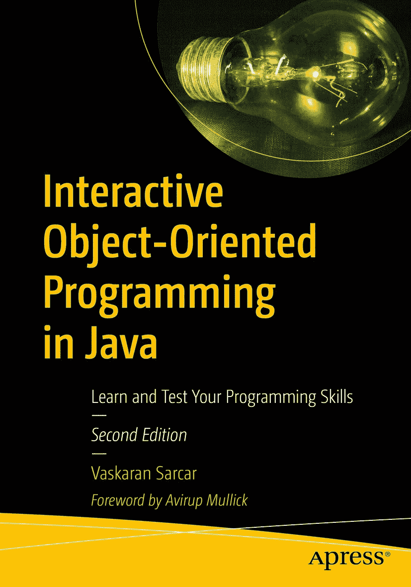

ISBN 978-1-4842-5403-5 e-ISBN 978-1-4842-5404-2 [`doi.org/10.1007/978-1-4842-5404-2`](https://doi.org/10.1007/978-1-4842-5404-2) © Vaskaran Sarcar 2020 Apress 标准商标名称、标识和图片可能出现在本书中。本书仅在编辑风格下使用商标名称、标识和图片，以维护商标所有者的利益，并无意侵犯商标权。本书中使用的商品名称、商标、服务标志及类似术语，即使未明确标识，也不应被视为对其是否受专有权利保护的表达。尽管本书中的建议和信息在出版时被认为是真实准确的，但作者、编辑和出版商均不对可能存在的任何错误或遗漏承担法律责任。出版商对本书所含内容不作任何明示或暗示的担保。本书通过 Springer Science+Business Media New York 在全球图书贸易中发行，地址：233 Spring Street, 6th Floor, New York, NY 10013。电话：1-800-SPRINGER，传真：(201) 348-4505，电子邮件：orders-ny@springer-sbm.com，或访问 www.springeronline.com。Apress Media, LLC 是一家加利福尼亚有限责任公司，其唯一成员（所有者）是 Springer Science + Business Media Finance Inc (SSBM Finance Inc)。SSBM Finance Inc 是一家特拉华州公司。

*亲爱的读者，*

*你用美好而充满爱意的评论激励着我，你用极其尖锐的批评伤害着我，但最终，你帮助我成为了一个更好的人、一位更好的作者。因此，本书献给你。*

序言

能为 Vaskaran 的最新著作《Java 交互式面向对象编程：学习与测试你的编程技能》撰写序言，我感到无比荣幸。

我认识 Vaskaran 已有多年。从在 Presidency University（原 Presidency College）和 Vidyasagar University 等同一机构学习，到在 IT 行业工作，我们在学术和职业生涯中各自前行，但他总能找到回馈社区的方式。这是一种独特的品质，我对此深表钦佩。

他对写作的热情以及分享多年行业经验所获知识的渴望，都体现在这本书中。本书的学习方法是通过阐明理论概念并同时测试读者的编程技能。这种实践方法对读者来说将是无价之宝，并将在考试、面试或工作中的实际编程场景中为他们提供帮助。

本书深入探讨了面向对象编程的基本概念，并附有 Java 示例。它还涵盖了一些高级概念，包括 Java 中的设计模式。本书易于阅读，每个概念都处理得精准到位：通过阐明基础知识来构建深度知识，同时通过演示和示例保持趣味性。每章都附有“问答环节”，这有助于读者通过理解每种模式的优缺点来全面看待问题或消除疑惑。“语言基础技能测试”部分将帮助读者在提升该领域专业知识之前，复习对 Java 基础知识的理解。

书末的常见问题解答章节对于复习知识和让读者充满信心地攻克技术面试特别有帮助。

本书是 Java 开发者或有志成为 Java 开发者的人的必读之作，因为它无疑将极大地提升读者在 Java 中的面向对象编程技能。就此而言，即使是非 Java 背景的开发者也能从本书中受益。

我祝愿 Vaskaran 和这本书取得应有的成功。

> Avirup Mullick
> 
> Adobe Systems 全球运营中心经理

前言

很荣幸向您呈现《Java 交互式面向对象编程：学习与测试你的编程技能》（第二版）。

如果您好奇本书最重要和最独特的特性是什么，我会说：它是交互式的，并且非常简单。本书的目标并非展示使用所有最新 Java 特性的典型且复杂的程序。相反，真正的目标是利用 Java 的核心结构来激发您的创造力。在学习新技术时，“核心”比“最新”更为重要。今天最新的东西明天就会过时，但核心概念是永恒的。

本书专注于使用 Java 最基本的功能来实现面向对象编程概念，因此您无需熟悉高级 Java 主题。示例简单明了。我相信这些示例的编写方式使得即使您熟悉另一种流行语言（如 C#、C++ 等），也能轻松掌握本书中的概念。

您可能会同意，当您沿着一条未知的道路前往目的地时，拥有一位充满爱心和关怀的向导会很有帮助。通过一本书学习一门新的编程语言也是一段旅程，这个事实在我写作时始终萦绕心头。因此，在本书中，我不仅以信息传递的方式解释主题。相反，我让本书变得交互式，每章都包含一个或多个“问答环节”。这些环节不仅会协助您的学习过程，还能充当“答疑环节”，因为您会感觉像是在向您的向导提问（或表达您的疑惑），并通过简单的一对一交流得到答案。此外，在大多数情况下，您会看到带有输出分析的完整程序演示，以便您能获得最大收益。

简而言之，本书旨在帮助您感受 Java 课堂环境。我从 2005 年开始从事教学工作。我曾在工程学院和非工程学院授课。幸运的是，我的大部分教学工作都基于 Java 及其高级主题。这就是我想推出这样一本书的真正动力。在您深入主题之前，让我强调一下本书、其章节组织以及目标读者的一些要点。

本书分为三个主要部分。前九章构成第一部分，您将在此部分看到 Java 中面向对象概念的讨论和实现。第二部分由另外五章组成（从第 10 章到第 14 章）。在第二部分中，您将探索“高级 Java”中的内容，学习异常处理、多线程编程、泛型编程和 JDBC 编程。在第 14 章中，您将了解特性演进路径，并试验 Java 不同版本中的重要特性。但我只挑选了那些能增强您在第一部分所学内容的特性，以便您理解这些升级特性如何让您的编程生活更轻松。最后，在本书的第三部分，您将学习使用三种重要设计模式进行一些实际实现。第三部分还包含一章常见问题解答，基本上是本书所有问答环节的子集。它可以快速回顾您在本书中学到的所有主题。

本书的目标读者是那些了解 Java 基本语言结构并知道如何编译或运行简单 Java 应用程序的人。本书不会花时间在那些容易在线获取的主题上，例如如何在系统上安装 Eclipse，如何用 Java 编写“Hello World”程序，或者如何在 Java 程序中使用 `if-else` 语句或 `while` 循环等。相反，本书从面向对象编程的讨论开始。因此，我希望在您进入第 1 章之前，您已经熟悉简单的 Java 程序并且您的编码环境已准备就绪。我与您的讨论将从您可以在 Java 中使用的面向对象概念开始。在此，我专注于 Java 的基本特性，并解释如何有效地学习和使用这些概念。

但别担心！为了帮助您在答疑环节提出/思考更好的问题，本书末尾添加了完整的一节（附录 A）。该附录讨论了 Java 中的一些关键概念，并帮助您评估自己在语言基础方面的技能。您可能需要多次回顾这一节，因为它充当参考手册。即使您不熟悉所有这些主题，通过反复练习，您也会逐渐熟悉它们。因此，如果您是编程新手，或者您对其他编程语言有一些了解，这一节会对您有很大帮助。它还可以通过回答一些起初看似非常简单但颇具技巧性的问题，帮助您为求职面试或考试做准备。

我之前说过，本书每章都包含一个或多个问答环节，这将让您感受到在课堂环境中学习的氛围——您的老师会讨论一些问题或主题，向您提问，并允许您提出反问。如果您对这个主题投入精力并深入思考这些问题及相应的答案，您一定会建立起对这门语言的信心。

在一个学期中，您需要参加一定数量的课程才能完成基础主题，并且您知道学习是一个持续的过程。因此，本书不适合那些想在 24 小时或 7 天内学会 Java 的人。这完全取决于您自己。我只能说，本书的设计方式使得在完成学习后，您将对该主题有足够的了解，掌握这门强大语言和面向对象编程的关键特性，并学会如何用 Java 编写程序，最重要的是，知道如何继续深入学习。

我已注意提供与所有最新 Java 版本兼容的代码。此外，您并非必须学习 Eclipse。您可以在您喜欢的 IDE（集成开发环境）中直接运行这些程序。我选择 Eclipse 是因为它被广泛用于开发 Java 应用程序。

请记住，在学习这些概念时，尝试编写自己的代码；只有这样，您才能掌握这个领域。您可以随时分享您的评论，以真正完善本书并提升您未来的工作。

您可以从出版商的网站下载本书的所有源代码。我计划维护“勘误表”，如有需要，我也可以在那里进行一些更新/公告。因此，建议您访问这些页面以获取更正或更新（如果有的话）。

最后，我希望这个增强版能为您提供更多帮助，并且您会喜欢这本书。

本书面向的读者是谁？

简而言之，如果以下问题的答案是“是”，**您可以阅读**本书：

*   您是否熟悉 Java 的基本结构？
*   您是否知道如何设置您的编码环境？
*   您是否想逐步探索面向对象编程？
*   您是否想复习对 Java 基本编程技能的理解？
*   您是否想探索一些高级 Java 内容（例如泛型编程、JDBC 编程、多线程编程等）？
*   您是否有兴趣了解一些实际实现技术？

如果以下任何一个问题的答案是“是”，您可能**不应该阅读**本书：

*   您是否完全是 Java 新手？
*   您是否在寻找所有深入的高级 Java 概念？
*   您是否只对探索 Java 的最新特性感兴趣？
*   您是否不喜欢强调问答环节的书籍？
*   “我不喜欢 Windows 和 Eclipse。我想在没有它们的情况下学习 Java。”这句话对您来说是否成立？

使用本书指南

以下是一些建议，可帮助您更有效地使用本书：

*   如果您对附录 A 中涵盖的主题有信心，可以从本书的第 1 章开始。我建议您按顺序阅读各章。一些基本问题可能在前一章的问答环节中讨论过，我不会在后面的章节中重复。
*   这些程序已使用 Java 8（更新 172）进行测试，并且我在 Windows 10 环境中使用了 Eclipse IDE。当我开始本书第二版时，Photon 是最新版本的 Eclipse（2018 年 6 月 27 日发布），Java 8 是长期支持（LTS）版本，Java 10 是快速发布版本。Java 11 是 Java 8 之后的下一个 LTS 版本，计划于 2018 年 9 月发布。但事实证明，到我完成工作时，Java 13 和 Eclipse Java 2019-09 已经发布。但这些版本的细节对您来说应该不重要，因为我使用了 Java 最基本的结构。因此，我相信这些代码也应该能在 Java/Eclipse 的未来版本中顺利运行。为了验证这一点，我在不同的系统和不同的环境（包括在线编辑器）中测试了部分代码，并且总是得到预期的输出。通过这些实验，我相信在其他环境中结果也不应有差异，但您了解软件的特性——它们可能会表现异常并给您带来惊喜。因此，我建议，如果您想看到与书中完全相同的输出，最好能模拟相同的环境。
*   第 14 章的代码是个例外。其中一些使用了最新的 Java 特性，而我的 Eclipse 环境尚未准备好适应这些变化。因此，我在命令行环境中执行了一些具有最新特性的程序。您也可以这样做。
*   在一些示例中，为了绘制类图，在 Eclipse 编辑器中使用了 ObjectAid Uml Explorer。它是一个轻量级的 Eclipse 工具。在撰写本文时，如果您想绘制类图，它是免费的，但要绘制序列图，您需要购买许可证。在线链接 [`http://www.objectaid.com/home`](http://www.objectaid.com/home) 可以为您提供这些许可证以及条款和条件的详细信息。

本书使用的约定

本书中的所有程序都按照如下包语句组织：

```
package java2e.chapter2;
class ClassEx1 {
// 字段初始化是可选的。
// 这里 myInt 被初始化为值 25。
public int myInt = 25;
// 在以下情况下，它将被初始化为默认值 0。
}
public class Demonstration1 {
public static void main(String[] args) {
System.out.println("***演示-1\. 一个包含 2 个对象的类演示***");
ClassEx1 obA = new ClassEx1();
ClassEx1 obB = new ClassEx1();
System.out.println("obA.myInt = " + obA.myInt);
System.out.println("obB.myInt = " + obB.myInt);
}
}
```

这仅仅表示存在一个名为 `java2e` 的文件夹，其中包含另一个名为 `chapter2` 的文件夹，并且您将 `Demonstration1.java` 存储在其中。因此，`Demonstration1.class` 和 `ClassEx1.class` 文件应该在那里可用。您将在第 7 章中了解 Java 包。一旦您熟悉了它们，您就会承认，使用包来组织代码始终是一种更好的做法。

但是，当您开始学习概念时，为了编译和运行程序，**包语句对您来说并非强制要求。** 因此，最初您可以在没有包语句的情况下使用所有这些程序。并且，您可以将程序存储在您喜欢的位置，因此，在您使用时，可能需要修改包语句。

本书的所有输出和代码都遵循相同的字体和结构。为了引起您的注意，在某些地方，我将其加粗，如下所示：

```
***演示-17\. 比较研究：使用 final 类与使用私有构造函数***
调用了私有构造函数。
设置默认值 x=10。
退出私有无参构造函数。
更新 x 的默认值。
退出带参构造函数。
父类.x=15
调用了私有构造函数。
设置默认值 x=10。
退出私有无参构造函数。
更新 x 的默认值。
退出带参构造函数。
子类.x=2
子类.y=3
```

致谢

首先，我感谢全能者。我真诚地相信，只有在他的祝福下，我才能完成这本书。我还要向以下人士致以最深切的感谢：

**Ratanlal Sarkar** 和 **Manikuntala Sarkar**：我亲爱的父母，只有在你们的祝福下，我才能完成这项工作。

**Indrani**，我的妻子，以及 **Ambika**，我的女儿：亲爱的，再次重申，没有你们的爱，我根本无法继续。我知道我们需要限制许多社交聚会和邀请，以便我能按时完成这项工作，而每次我都向你们承诺，我会休个长假，花更多时间陪伴你们。

**Sambaran**，我的兄弟：感谢你对我不断的鼓励。

**Yogesh**：你是本第二版的技术顾问。我知道每当我需要时，你的支持就在那里。再次感谢你。

**Shekhar** 和 **Anupam**：我在这本书前一版中的朋友和技术顾问。虽然这次你们没有参与，但我仍然感谢你们在《Java 交互式面向对象编程》第一版开发过程中给予的支持和帮助。

**Avirup Mullick**：我于 1998 年第一次见到你。你是我的大学学长。特别感谢你抽出时间为我的书撰写序言。从像你这样专家同意为我写序的那一刻起，我就获得了额外的动力来提升我作品的质量。

**Celestin**：感谢你给我又一次与你和 Apress 合作的机会。

**April**、**Nirmal**、**Arockia Rajan**、**Ramraj**、**Chinnaparaj** 和 **Vinoth**：感谢你们为美化我的作品所提供的卓越支持。

最后，我向我的出版商、编辑委员会成员以及所有直接或间接支持本书的人致以最深切的感谢。


### 关于作者与技术审校

### 关于作者

### 关于技术审校

