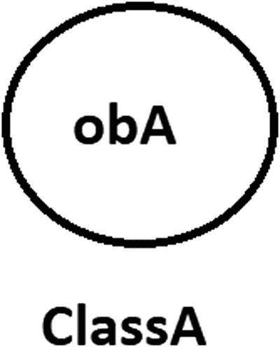
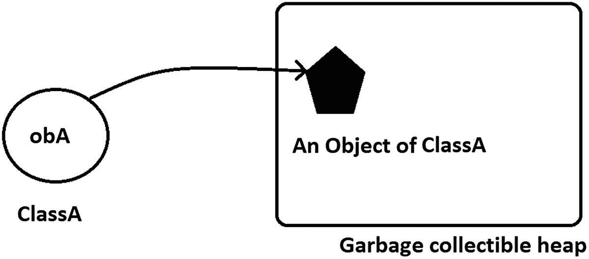

# 2. 构建模块：类与对象

面向对象编程（OOP）技术主要依赖于两个概念——类和对象。在本章中，我们将详细讨论这些主题。

## 类

类是蓝图、模板或原型。它可以描述其对象的行为，并且是对象如何被构建或实例化的基础。


## 对象

对象是类的一个实例。

如果你熟悉足球运动（或者在美国被称为*英式足球*），你就会知道，参加比赛的球员是根据他们在不同位置上的技能被选拔出来的。除了这些技能，他们还需要具备最低水平的比赛体能和一些重要的运动能力。所以，当我说罗纳尔多是一名足球运动员时，你可以假设罗纳尔多拥有这些基本能力以及一些足球特有的技能（即使你并不认识罗纳尔多）。这就是为什么你可以简单地说，`Ronaldo` 是 `Footballer` 类的一个对象。

### 注意

你可能会觉得这有点像“先有鸡还是先有蛋”的困境。你可能会争辩说，如果我说“X 踢球像罗纳尔多”，那么在这种情况下，罗纳尔多就扮演了类的角色。然而，在面向对象设计中，通过决定谁先出现，并确定那个家伙就是应用程序中的类，你可以让事情变得简单。

再考虑另一位足球运动员，贝克汉姆。你可以再次假设，如果贝克汉姆是一名足球运动员，那么贝克汉姆在足球的许多方面一定都很出色。同时，他必须拥有最低的体能水平才能参加比赛。

现在，假设罗纳尔多和贝克汉姆都参加同一场比赛。不难预测，尽管罗纳尔多和贝克汉姆都是足球运动员，但他们在比赛中的踢球风格和表现会各不相同。同样，在面向对象编程的世界里，即使对象属于同一个类，它们的行为表现也可能各不相同。

你可以考虑任何领域。例如，你可以说你的宠物狗或宠物猫是 `Animal` 类的对象。类似地，你最喜欢的汽车可以被视为 `Vehicle` 类的对象，你最喜欢的小说可以被视为 `Book` 类的对象，等等。

在现实场景中，每个对象都必须具备两个基本特征：状态和行为。如果你考虑 `Footballer` 类中的对象——罗纳尔多或贝克汉姆——你可能会注意到它们有“比赛状态”或“非比赛状态”这样的状态。在比赛状态下，它们可以展示不同的技能（或行为）——它们可以奔跑、踢球、传球等等。

在非比赛状态下，行为也会改变。在这种状态下，它们可以小睡片刻，或者吃饭，或者通过读书、看电影等活动来放松。

类似地，你家里的电视机，在任何时刻，要么处于“开机”状态，要么处于“关机”状态。只有当它处于“开机”模式时，才能显示不同的频道。如果处于“关机”模式，它什么也不显示。

所以，要开始学习面向对象编程，你可以问以下问题：

*   我的对象可能有哪些状态？
*   在这些状态下，它们可以执行哪些不同的功能（行为）？

一旦你得到了这些问题的答案，就可以继续了。在任何面向对象程序中，软件对象都遵循相同的模式：它们的状态存储在字段（变量）中，它们的能力（行为）通过不同的方法（函数）来描述。

现在让我们做一些编程练习。你即将开始一段激动人心的旅程。我会尽量让事情变得非常简单。同时，我会忽略一些典型的边界情况，让你的旅程顺畅而轻松。

你现在明白了，要创建对象，首先需要确定它们属于哪个类；也就是说，通常，如果你想创建对象，你需要先创建一个类。

### 记住要点

*   从类开始，它是架构蓝图。一个类定义了对象的结构和行为。从一张蓝图，你可以建造多栋建筑。同样，从一个类，你可以构造多个对象（或实例）。（如前所述，我在做此陈述时忽略了典型的边界情况。例如，一个真正的单例类不能有多个实例）。
*   通过类，你创建了一个新的数据类型，而对象则用于保存数据（字段）和方法。对象的行为可以通过这些方法来暴露。

在 Java 中，你按如下方式创建一个类：

```
class A
{
//这是一个单行注释。
//这里是一些数据，例如，
int a;
//这里是一个方法，例如，
void someMethod()
{
//一些代码
}
}
```

你可以看到，要创建一个类，你需要使用 `class` 关键字。（单行注释 `//` 用于提高可读性。）类体用花括号——`{` 和 `}`——括起来。类内部的数据或变量被称为***实例***变量。你可以在类中拥有一些方法。这些数据和方法统称为***类成员***。

现在，你已经创建了一个名为 `A` 的类。因此，你可以从中创建一个对象。假设你的对象是 `obA`，它可以通过以下语句创建：

```
A obA=new A();
```

你可以将上述语句拆分为以下两行：

```
A obA;//第 1 行
obA=new A();//第 2 行
```

需要注意的是，在第 1 行结束时，`obA` 是一个***引用***。到目前为止，还没有分配内存，`obA` 包含 `null`。但是一旦 `new` 运算符出现，就会为其分配内存。因此，在第 2 行结束时，`new` 运算符为物理对象分配了内存，并将一个引用赋值给了 `obA`。

### 记住要点

类是一个逻辑实体。一旦你实例化一个类，你就创建了对象。这些对象会占用你系统中的内存。因此，对象是物理实体。在前面的代码片段中，`new` 运算符用于创建类 `A` 的一个对象。它为其分配内存，并返回一个类 `A` 的对象，该对象的引用存储在变量 `obA` 中。

## 构造器

如果你仔细观察，会发现 `new` 关键字后面跟着类名和一对括号。你使用这种方式来构造对象。这些就是***构造器***，用于运行初始化代码。构造器既可以带参数，也可以不带参数。因此，你可以向它们传递不同的参数。简单来说，构造器可以不同，体现在参数***数量***不同或参数***类型***不同。在下面的例子中，类 `A` 有四个不同的构造器。

```
class A
{
public A()
{
System.out.println("无参构造器");
}
public A(int a)
{
System.out.println("一个整型参数的构造器");
}
public A(int a,int b)
{
System.out.println("两个整型参数的构造器");
}
public A(double a)
{
System.out.println("一个双精度浮点型参数的构造器");
}
}
```

如果你没有为你的类提供任何构造器，Java 会为你提供一个默认的构造器。


### 要点回顾

如果你没有为类包含任何构造函数，编译器会提供一个无参默认构造函数。这个默认构造函数实际上会调用超类（如果有的话）的无参构造函数。在这种情况下，如果超类没有这样的构造函数，编译器可能会报错。如果你的类没有显式指定超类，那么它有一个隐式超类 `Object`，该超类包含一个无参构造函数。你可能对这些术语还不熟悉，但很快你就会了解它们。

因此，当你看到类似下面的代码时，可以确定将使用一个无参构造函数：

```
A obA=new A();
```

但要判断它是用户自定义的构造函数还是由 Java 提供的（即默认构造函数），你需要检查类体；例如，在类定义中，如果有如下代码：

```
class A
{
A()
{
// 一些代码
}
}
```

你可以得出结论：你使用了用户自定义的无参构造函数。因此，在这种情况下，Java 不会为你提供任何默认构造函数。

到目前为止，你已经明白类只是程序的构建块。你将变量（也称为***字段***）和方法***封装***在类中，形成一个独立的单元。这些变量被称为实例变量，因为该类的每个实例都包含这些变量自身的副本。（稍后你会了解到，字段可以是任何隐式数据类型、不同的类对象等）。另一方面，方法包含一个代码块。这不过是一系列执行特定操作的语句。实例变量通常通过方法来访问。如前所述，这些变量和方法统称为类成员。

### 注意

实例是类的一个唯一副本，用于表示一个对象。我在文中交替使用了这些术语。

静态变量将在第 8 章中讨论。

通常，你可以在类声明中放置不同的内容。例如，你可以在类体中放置变量、方法、构造函数、内部类、初始化块、枚举（它们在内部也作为类实现）等。但为了简单起见，我从最常见的方法和字段开始讨论。你将在本书的相应章节中看到其他主题。

字段和方法可以与不同类型的修饰符关联；例如，`public`、`private`、`protected`、`default` 等。你很快就会熟悉这些修饰符。

### 演示 1

考虑一个简单的例子。这里，我有一个名为 `ClassEx1` 的类，并且只将一个整数字段 `myInt` 封装到其中。我还将该字段初始化为值 25。因此，你可以预测，每当我创建这个类的对象时，该对象都会包含一个名为 `myInt` 的整数，并且对应的值将是 25。

为了方便你参考，我从 `ClassEx1` 类创建了两个对象——`obA` 和 `obB`。我测试了对象中变量 `myInt` 的值。在输出中，你可以看到在两种情况下，我都得到了值 25。

### 注意

本书中的所有程序都组织在包语句下。你将在第 7 章中了解 Java 包。要编译和运行这些程序，包语句对你来说并非强制要求。因此，最初你可以在没有包语句的情况下运行所有这些程序。

```
package java2e.chapter2;
class ClassEx1 {
// 字段初始化是可选的。
// 这里 myInt 被初始化为值 25。
public int myInt = 25;
// 在以下情况下，它将被初始化为默认值 0。
// public int myInt;
}
class Demonstration1 {
public static void main(String[] args) {
System.out.println("***演示-1\. 一个包含两个对象的类演示 ***");
ClassEx1 obA = new ClassEx1();
ClassEx1 obB = new ClassEx1();
System.out.println("obA.myInt = " + obA.myInt);
System.out.println("obB.myInt = " + obB.myInt);
}
}
```

输出：

```
***演示-1.一个包含两个对象的类演示 ***
obA.myInt = 25
obB.myInt = 25
```

补充说明：

*   如注释中所述，不必以这种方式初始化 `myInt`。你只是从一个非常简单的例子开始。*字段初始化是可选的。*

*   如果你没有为字段提供任何初始化，它将采用默认值。我稍后会介绍这些默认值。

*   假设在前面的例子中，你没有初始化该字段。那么你的类将如下所示：

```
class ClassEx1 {
public int myInt;
}
```

你仍然可以实例化你的对象，然后提供你期望的值，如下所示：

```
ClassEx1 obA = new ClassEx1();
obA.myInt=25;// 将 25 设置到 obA 的 myInt 中
```

你必须记住关于构造函数的这些关键点：

*   构造函数用于初始化对象。

*   类名和相应的构造函数名称必须相同。

*   构造函数没有任何返回类型。

*   有两种类型的构造函数：无参构造函数（有时称为无参数构造函数或默认构造函数）和带参数的构造函数（称为参数化构造函数）。

*   通常，像类中所有变量的初始化这样的常见任务是通过构造函数完成的。

### 问答环节

**2.1 构造函数没有任何返回类型。这句话的意思是它们的返回类型是 void 吗？**

不是。你不应该忘记，即使是 void 也被视为一种返回类型。

**2.2 我对用户自定义的无参构造函数和 Java 提供的默认构造函数的使用有点困惑。它们之间有什么关键区别吗？**

有时两者可能看起来相同。但记住这一点会有所帮助：使用用户自定义的构造函数，你可以拥有更多的控制权和灵活性。你可以在对象创建之前加入自己的逻辑。

### 演示 2

考虑以下示例并分析输出：

```
package java2e.chapter2;
class DefConsDemo
{
public int myInt;
public float myFloat;
public double myDouble;
public DefConsDemo()
{
System.out.println("我正在用我自己的选择进行初始化。");
myInt = 10;
myFloat = 0.123456f;
myDouble = 9.8765432;
}
}
class DefaultConstructorCaseStudy {
public static void main(String[] args) {
System.out.println("***演示-2.用户自定义构造函数与 Java 提供的默认构造函数的比较***\n");
DefConsDemo ObDef = new DefConsDemo();
System.out.println("myInt="+ ObDef.myInt);
System.out.println("myFloat="+ ObDef.myFloat);
System.out.println("myDouble="+ ObDef.myDouble);
}
}
```

输出：

```
***演示-2.用户自定义构造函数与 Java 提供的默认构造函数的比较***
我正在用我自己的选择进行初始化。
myInt=10
myFloat=0.123456
myDouble=9.8765432
```


### 分析

可以看到，在给变量赋值之前，我额外打印了一行：“I am initializing with my own choice.”

但是，如果你不提供这个无参构造器，而是想使用 Java 提供的默认构造器，就需要注释掉或移除前面示例中的构造器主体。此时，你将得到如下输出：

```
***Demonstration-2.Comparison between user-defined and  Java provided default constructors***
myInt=0
myFloat=0.0
myDouble=0.0
```

可以看到，每个值都被初始化为该类型对应的默认值。

虽然你在源代码中不会注意到默认构造器，但你可以反编译 `.class` 文件，此时你会注意到 Java 编译器提供的默认构造器的存在。假设你已经编译了以下类：

```
class DefConsDemo
{
public int myInt;
public float myFloat;
public double myDouble;
}
```

现在，你可以再次反编译该类文件，以检查 Java 提供的默认构造器的工作机制。你可以通过多种方式反编译类文件（此外，也有多种在线工具可用于此目的）。在本例中，我使用了 `javap` 命令，该命令位于我系统中的 `C:\Program Files\Java\jdk1.8.0_172\bin` 路径下。我将 `CLASSPATH` 环境变量设置为该路径，然后再次使用 `javap` 命令反编译该类文件，如下所示，得到以下输出：

```
C:\TestClass>javap DefConsDemo.class
Compiled from "DefaultConstructorCaseStudy.java"
class java2e.chapter2.DefConsDemo {
public int myInt;
public float myFloat;
public double myDouble;
java2e.chapter2.DefConsDemo();
}
```

你可以注意到反编译文件中存在的 Java 提供的默认构造器。

### 注意

你可能还需要注意另一个重要点。你可以为用户定义的构造器使用自己的访问修饰符。因此，如果你提供自己的无参构造器，你可以将其设为非公有的。对于 Java 提供的默认构造器，它将具有默认可见性（包私有）。

**2.3 我发现 Java 提供的默认构造器正在用一些默认值初始化实例变量。其他类型的默认值是什么？**

通常，默认值是零或 null。你可以参考表 2-1。

表 2-1

Java 中带默认值的数据类型

| 数据类型 | 默认值 |
| --- | --- |
| byte, short, int | 0 |
| char | ‘\u0000’ |
| float | 0.0f |
| double | 0.0d |
| long | 0L |
| String | null |
| 任何对象 | null |
| boolean | false |

**2.4 在我看来，你也可以调用一些方法来初始化这些变量。为什么需要构造器？**

如果你这样想，那么你必须同意，要完成这项工作，你需要显式地调用该方法；也就是说，用简单的话来说，你的调用不会是自动的。但是使用构造器，你可以在每次创建对象时执行自动初始化。

**2.5 你能预测以下代码的输出吗？**

```
package java2e.chapter2;
class ConEx2 {
int i;
public ConsEx2(int i) {
this.i = i;
}
// public ConsEx2() { }
}
public class Quiz1 {
public static void main(String[] args) {
System.out.println("***Experiment with constructor***");
ConEx2 ob = new ConEx2 ();
//ConsEx2 ob = new ConsEx2(25);//Choice-3
}
}
```

输出：

```
Compilation error: The constructor ConsEx2() is undefined
```

请参阅下面的问答以获取解释。我稍后会讨论关键字 `this`。

**2.6 在这种情况下，你应该从 Java 获得一个默认构造器。为什么编译器会抱怨这段代码？**

你已经了解到，在 Java 中，当且仅当你没有提供任何构造器时，你才能获得一个默认的无参构造器。但是，在这个例子中，你已经有了一个带参构造器。因此，在这种情况下，编译器不会为你提供默认的无参构造器。

如果你想消除这个编译错误，你有以下选择：

*   你可以再定义一个自定义构造器，像这样：

*   你可以从程序中移除自定义构造器声明（你已经定义但未使用的那个）。

*   你可以在你的 `main()` 方法中提供必要的整数参数，像这样：

```
public ConsEx2() { }
```

```
ConsEx2 ob = new ConsEx2(25);
```

**2.7 我可以说一个类是一种自定义类型吗？**

通常，答案是肯定的。但同时，你需要记住 Java 也有许多内置类（例如，`Array`、`String` 等）。在我们之前的演示中，你已经看到了我们自己类的使用，这些类就是自定义类。

**2.8 你能详细解释一下引用的概念吗？**

假设你有一个像下面这样的简单类：

```
class ClassA
{
//一个实例变量
int a;
//一个实例方法，例如：
void someMethod()
{
//一些代码
}
}
```

当你编写 `ClassA obA=new ClassA();` 时，会在内存中创建一个 `ClassA` 的实例，它会创建一个指向该实例的引用，并将结果存储在 `obA` 变量中。因此，你可以说内存中的对象由一个称为引用的标识符来引用。

在 Java 中，更广泛地说，你将使用两种不同类型的变量——一种是基本类型，另一种是对象引用。它类似于指针或地址，但你不知道（也不关心）你的引用变量内部是什么。

简单来说，引用提供了一种访问对象的方式。当你编写

```
ClassA obA;
```

`obA` 指向 `null`。但是当你编写

```
ClassA obA=new ClassA();
```

`obA` 被初始化为一个 `ClassA` 的对象，并且你说 `obA` 是一个指向 `ClassA` 对象的引用。


然后，你使用点运算符在引用变量上调用目标类中的内容（例如，方法或变量），如下所示：

```
obA.someMethod();
```

需要注意的是，你*可以*在没有引用的情况下调用方法。当你编写如下代码时，就可以这样做：

```
new classA(). someMethod(); //不推荐的做法
```

但正如单行注释中所提到的，目前这对你来说并不是一种推荐的做法。

当你学习内存管理时，你会了解到所有对象都驻留在一个称为堆的地方，并且有一个垃圾回收器在该堆上工作。对此进行详细讨论目前来说会很复杂。在这个阶段，你可以简单地假设下图所示的情况，以便更好地理解对象引用变量。请注意每一步中的粗体部分。

**步骤 1：**

```
ClassA obA= new ClassA();
```

JVM 为类型为 `ClassA` 的引用变量 `obA` 分配空间。



**步骤 2：**

```
ClassA obA= new ClassA();
```

JVM 为类型为 `ClassA` 的对象分配空间。假设它类似于下图所示。


**步骤 3：**

```
ClassA obA = new ClassA();
```

JVM 将两者连接起来（注意粗体显示的 `=` 运算符）。



**2.9 这些引用类似于 C/C++ 的指针。这种说法正确吗？**

不正确。Java 与 C/C++ 不同。引用看起来可能是一种特殊的指针。但你必须注意两者之间的关键区别。使用指针，你可以指向任意地址（基本上，它是内存中的一个数字槽位）。因此，使用指针时，你很可能指向一个无效地址，然后在运行时可能会遇到意外结果。引用变量只能指向有效地址或 null。此外，你不能对引用变量进行算术运算。如何解释“指向”这个词也很重要。例如，一些开发者更喜欢在类似语境中使用“引用”而不是“指向”。

**2.10 我可以有多个引用变量指向内存中的同一个对象吗？**

可以。以下类型的声明是完全合法的：

```
ConsEx2 ob1 = new ConsEx2(25);
ConsEx2 ob2=ob1;
```

### 演示 3

在下面的示例中，我创建了同一个类的两个对象，但实例变量（`i`）被初始化为不同的值。为了完成这项工作，我使用了一个可以接受一个整数参数的参数化构造函数。

```
package java2e.chapter2;
class ClassEx3
{
public int i;
public ClassEx3(int i)
{
this.i = i;
}
}
class Demonstration3 {
public static void main(String[] args) {
System.out.println("***演示-3.一个包含 2 个对象的类演示***");
ClassEx3 obA = new ClassEx3(10);
ClassEx3 obB = new ClassEx3(20);
System.out.println("obA.i =" + obA.i);
System.out.println("obB.i =" + obB.i);
}
}
```

输出：

```
***演示-3.一个包含 2 个对象的类演示***
obA.i =10
obB.i =20
```

**2.11 this 关键字的用途是什么？**

有时你需要引用当前对象，为此，你可以使用 `this` 关键字。在前面的示例中，除了使用 `this` 关键字，你也可以编写如下代码来实现相同的结果：

```
class ClassEx3 {
int i;// 实例变量
ClassEx3(int myInteger)// myInteger 是一个局部变量
{
i = myInteger;
}
}
```

根据 Java 的运算符优先级表，赋值运算符（`=`）具有从右到左的结合性。（结合性指明了运算符的执行方向。）因此，你熟悉像 **a=25;** 这样的代码，其中你将 25 赋值给 `a`。但你熟悉像 **25=a;** 这样的代码吗？不熟悉。编译器会报错。

在前面的示例中，**myInteger** 是你的*局部变量*（出现在方法、块或构造函数内部），而 **i** 是你的*实例变量*（在类内部但在方法、块或构造函数外部声明）。

因此，如果你使用 `i` 而不是 `myInteger`，你需要告诉编译器你的赋值方向。不能混淆“哪个值赋给了哪里？”这里，你是将局部变量的值赋给实例变量，编译器应该清楚地理解你的意图。通过语句 **this.i=i**`;`，编译器清楚地理解实例变量 `i` 应该用局部变量 `i` 的值来初始化*。*

另外，考虑一下。假设在前面的场景中，你错误地编写了类似 **i=i;** 的代码。从编译器的角度来看，这会造成混淆，因为它会认为你在处理两个相同的局部变量。（尽管你的意图不同，你本意是左边的 `i` 是字段，另一个是方法参数。）现在，如果你为 `ClassA` 创建一个对象 `obA`，尝试通过以下代码查看 `obA.i` 的值：

```
ClassEx3 obA = new ClassEx3(20);
System.out.println("obA.i =" + obA.i);
```

你将在输出中得到 `obA.i=0`（整数的默认值）。因此，你的实例变量无法获得你预期的值 20。Eclipse IDE 在这种情况下也会发出警告。参见图 2-1*。*


图 2-1

ClassEx3 构造函数体中语句 i=i; 的警告信息

### 要点牢记

如果你的局部变量与实例变量同名，局部变量将隐藏实例变量。在这种场景下，关键字 `this` 有助于解决命名空间冲突，因为它有助于识别哪个是局部变量（方法参数），哪个是实例变量（字段）。供你参考，在问答 2.11 的代码段中，局部变量和实例变量已用注释行标记。


### 演示 4

在下面的演示中，你将看到两个不同构造器的使用。用户定义的无参构造器始终将实例变量 `i` 初始化为值 5，而带参构造器则可以将实例变量初始化为你提供的任意整数值。

```
package java2e.chapter2;
//构造器重载示例
class ClassEx4 {
int i;
ClassEx4() {
this.i = 5;
}
public ClassEx4(int i) {
this.i = i;
}
}
class Demonstration4 {
public static void main(String[] args) {
System.out.println("***演示-4\. 一个包含两个不同构造器的简单类 ***");
System.out.println("*** 这也是构造器重载的一个示例 ***");
ClassEx4 obA = new ClassEx4();
ClassEx4 obB = new ClassEx4(75);
System.out.println("obA.i =" + obA.i);
System.out.println("obB.i =" + obB.i);
}
}
```

输出：

```
***演示-4\. 一个包含两个不同构造器的简单类 ***
*** 这也是构造器重载的一个示例 ***
obA.i =5
obB.i =75
```

补充说明：

*   之前，你看到同一个构造器被用来创建不同的对象，这些对象被初始化为不同的值。在这个例子中，使用了不同的构造器来创建不同的对象，这些对象也被初始化为不同的值。

*   构造器的名称与其类名相同。注意，类 `classEx4` 有多个构造器。因此，这是一个**构造器重载**的例子。稍后，你将详细了解方法重载的概念，并熟悉这样一个事实：在一个类中，你可以有多个同名但参数列表不同的方法。（换句话说，你可以简单地说方法签名不同。）例如，`aMethod(int,double)` 不同于 `aMethod(int)` 或 `aMethod(int,int)` 或 `aMethod(double,int)`。也就是说，方法可能因参数数量、参数类型或参数顺序的不同而有所变化。

*   在 Java 中，我们可以使用 `this (5);` 来代替 `this.i=5;`，但其他语言可能不支持这种结构。

### 演示 5

一个类可以包含变量、方法，或者两者都包含。那么，让我们考虑另一个简单的程序，其中你有一个只包含一个方法的类。这个方法用于接收两个整数输入，并返回这两个整数的和。

```
package java2e.chapter2;
class ClassEx5 {
public int sum(int x, int y) {
return x + y;
}
}
class Demonstration5 {
public static void main(String[] args) {
System.out.println("***演示-5\. 一个包含返回整数的方法的简单类 ***\n");
ClassEx5 ob = new ClassEx5();
int result = ob.sum(57, 63);
System.out.println("57 和 63 的和是：" + result);
}
}
```

输出：

```
***演示-5\. 一个包含返回整数的方法的简单类 ***
57 和 63 的和是：120
```

补充说明：

*   一个类并非必须只包含方法、实例变量或构造器。在实际编程中，你的类可能会同时包含所有这些元素。但为了便于理解，我分别演示了每种情况。

## 向方法传递可变长度参数

你可以向方法传递可变数量的参数。这个概念是在 Java 5 中引入的。它通常被称为 varargs（可变长度参数的简称）。能够接受可变长度参数的方法也被称为 vararg 方法（或可变参数方法）。

在 Java 中，你需要使用三个点/句点（`...`）（如演示 6 中的 `sum()` 方法所示）才能使用 vararg 方法。`Demonstration6` 展示了这种用法。

### 演示 6

考虑以下示例。

```
package java2e.chapter2;
class ClassEx6 {
// 以下方法支持可变长度参数
public int sum(int... vararg) {
System.out.println("你现在传递了 " + vararg.length + " 个参数。");
int total = 0;
for (int i : vararg) {
total = total + i;
}
return total;
}
}
class Demonstration6 {
public static void main(String[] args) {
System.out.println("***演示-6\. 可变长度参数方法演示 ***\n");
ClassEx6 ob = new ClassEx6();
int resultOfSummation = ob.sum(57, 63);
System.out.println("57 和 63 的和是：" + resultOfSummation);
resultOfSummation = ob.sum(57, 63, 50);
System.out.println("57、63 和 70 的和是：" + resultOfSummation);
resultOfSummation = ob.sum(57, 63, 50, 70);
System.out.println("57、63、50 和 70 的和是：" + resultOfSummation);
}
}
```

输出：

```
***演示-6\. 可变长度参数方法演示 ***
你现在传递了 2 个参数。
57 和 63 的和是：120
你现在传递了 3 个参数。
57、63 和 70 的和是：170
你现在传递了 4 个参数。
57、63、50 和 70 的和是：240
```

### 分析

你可以看到，你可以向 `sum` 方法传递可变数量的整数参数，因为它是一个 vararg 方法。注意，在前一个演示的以下代码行中使用了三个点：

```
public int sum(int... vararg) {
```


### 问答环节

**2.12 为什么需要可变参数方法？**

它们让你能够灵活地向方法传递一些默认参数。这样一来，你无需提供固定数量的参数就能调用某个特定方法。

**2.13 能否举一些 Java 库中可变参数方法的例子？**

`printf()` 和 `format()` 方法在此类场景中非常常见。因此，在之前的演示中，你可以使用以下代码片段：

```
//System.out.println("You have passed " + vararg.length + " arguments now.");
System.out.print(String.format("%s, you have passed %d arguments now.","Dear reader",vararg.length));
```

来获得类似如下的输出：

```
*** Methods with variable-length argument demo ***
Dear reader, you have passed 2 arguments now.
Sum of 57 and 63 is : 120
Dear reader, you have passed 3 arguments now.
Sum of 57, 63 and 70 is : 170
Dear reader, you have passed 4 arguments now.
Sum of 57, 63, 50 and 70 is : 240
```

**2.14 可变参数方法有哪些替代方案？**

在早期（Java 5 之前），开发者有两种选择。他们可以将参数放入一个数组，然后将数组传递给方法，或者使用重载的概念。如果参数列表很大或在执行前未知，则首选第一种方法。你将在稍后更详细地学习重载的概念。

**2.15 在面向对象编程中，我看到代码总是被封装在对象内部。这种设计在实际场景中有什么好处？**

有很多优点。想一个现实场景；例如，考虑你的笔记本电脑或打印机。你可以在类似型号的笔记本电脑或打印机中重复使用这些设备的部件。

如果你的笔记本电脑中某个部件发生故障，或者，比方说，你的打印墨盒没墨了，你可以直接更换这些部件。你不需要更换整个笔记本电脑或整个打印机。

你可能也同意，你可能对了解这些部件实际如何工作的内部细节不感兴趣。只要这些部件工作正常并能满足你的需求，你就很满意了。

在面向对象编程中，对象扮演着同样的角色：它们可以被重用，可以被插入。同时，它们可以隐藏实现细节。例如，在演示 *5* 中，当客户端使用两个整数参数（57 和 63）调用 `sum()` 方法时，他会得到这些整数的和。作为外部用户，他并不知道 `sum()` 方法的内部机制。因此，你可以通过对外部世界隐藏信息来提供一定程度的安全性。

最后，从编码的角度再考虑一点。假设有以下场景：你需要在程序中存储员工信息。如果你开始像这样编码：

```
string empName= "emp1Name";
string deptName= "Comp.Sc.";
int empSalary= "10000";
```

那么对于第二个员工，你会写类似这样的代码：

```
string empName2= "emp2Name";
string deptName2= "Electrical";
int empSalary2= "20000";
```

依此类推。

你真的能一直这样继续下去吗？答案是否定的。为了简化，创建一个 `Employee` 类并像这样处理信息总是一个更好的主意：

```
Employee emp1, emp2;
```

这更简洁、更易读，而且显然是一种更好的方法。

**2.16 Java 支持析构函数吗？**

不支持。Java 使用*垃圾回收*机制来释放内存。你将在稍后了解这一点。

## 本章小结

本章讨论了以下主题：

*   类、对象和引用的概念

*   对象和引用之间的区别

*   局部变量和实例变量之间的区别

*   不同类型的构造函数及其用法

*   用户定义的无参构造函数与 Java 提供的默认构造函数之间的区别

*   `this` 关键字的使用

*   如何向方法传递可变长度参数

*   面向对象方法在实际编程中的优势

