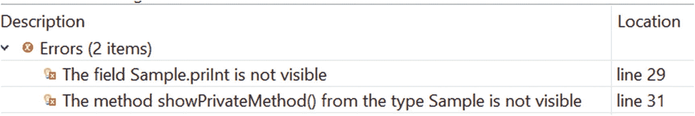
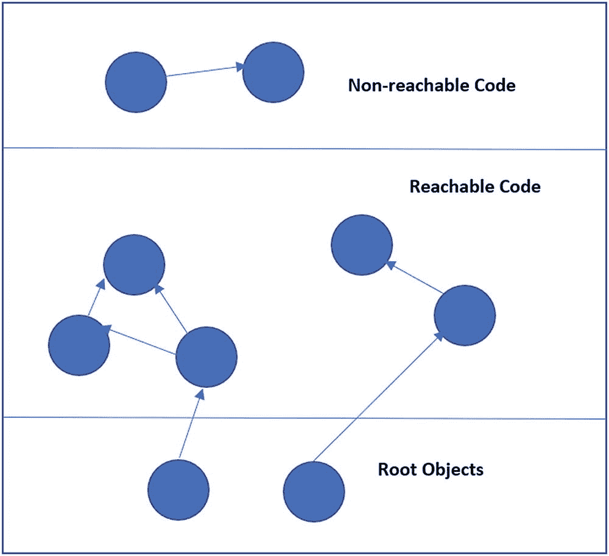
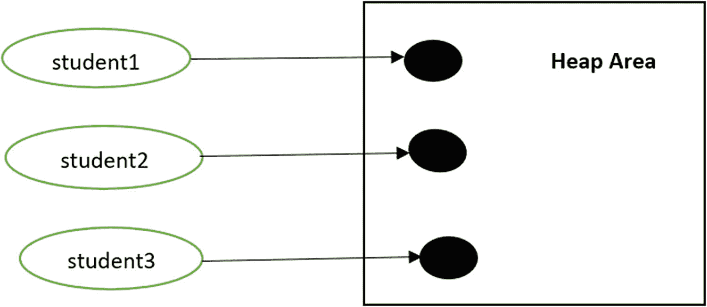
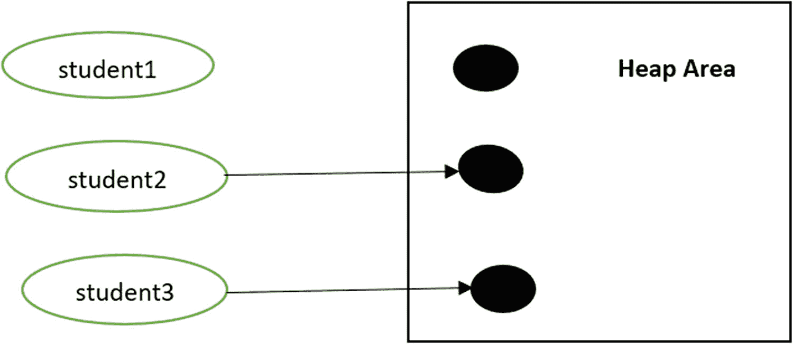
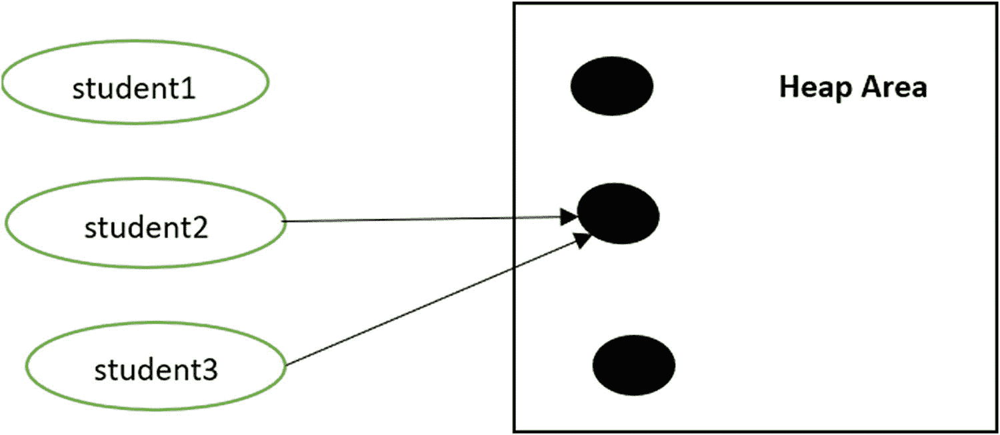

# 3. 深入理解类与对象

在本章中，我将讨论一些与类和对象密切相关的重要主题。如果你完全是面向对象编程的新手，为了理解每个主题，你可能需要在完成第 10 章后再回到本章。

## 静态变量和方法

到目前为止，你已经看到类可以包含变量、方法或两者兼有。这些统称为类成员。这些变量和方法被称为实例变量和实例方法，因为每次实例化一个类时，都会创建每个变量和方法的新副本。一旦创建了对象，你就可以使用点运算符 (.) 来访问这些实例变量或方法（你在第 2 章的不同演示中已经体验过这一点）。

但有时你可能希望一个类成员对该类的所有对象都是通用的。在这种情况下，能够使用类（而不是使用该类的对象）来访问它们是有意义的。当你创建这样的成员时，它们被称为类变量或类方法。类成员也称为静态成员，因为在 Java 中，要创建类变量或类方法，你需要像下面这样用 `static` 关键字标记它们：

```
//静态变量
static double length=25.5, breadth=10.0;
//静态方法
public static double area() {
return length * breadth;
}
```

### 演示 1

现在，来看演示 1。请注意，这次访问类成员时没有创建 `Rectangle` 类的任何对象。

```
package java2e.chapter3;
class Rectangle {
//静态变量
static double length=25.5, breadth=10.0;
//静态方法
public static double area() {
return length * breadth;
}
}
class Demonstration1 {
public static void main(String[] args) {
System.out.println("***演示-1\. 探索类变量和类方法。***\n");
System.out.println("矩形的长度是：" + Rectangle.length + " 单位");
System.out.println("矩形的宽度是：" + Rectangle.breadth + " 单位");
System.out.println("矩形的面积是 " + Rectangle.area() + " 平方单位");
}
}
```

输出：

```
***演示-1\. 探索类变量和类方法。***
矩形的长度是：25.5 单位
矩形的宽度是：10.0 单位
矩形的面积是 255.0 平方单位
```

你将在第 8 章中看到关于静态成员及其不同案例研究的详细讨论。

### 问答环节

**3.1 我可以有一个静态类吗？**

Java 不允许你创建顶层的静态类。包含静态类的类被称为外部类。非静态的嵌套类被称为内部类。你将在第 8 章中学习它们。


## 访问控制

你可以为类、字段和方法提供受控的访问权限。在学习接口时，也可以将同样的理念应用于它们。实际上，通过使用访问控制，你还能实现封装。

在 Java 中，你可以使用访问修饰符来实现访问控制。在第 7 章中，你将看到一个表格，总结了使用这些访问修饰符在包中的访问控制。Java 定义了以下访问修饰符：

*   `public`
*   `private`
*   `protected`
*   `default`（这仅表示你没有使用任何修饰符）

当你学习了继承和包之后，就能更好地理解这些修饰符的作用。你将在下一章学习继承，并在第 7 章学习包。要理解接下来的讨论，理解 `private` 和 `public` 就足够了。

当你用 `public` 修饰符修饰一个类成员时，你可以从代码外部访问该成员。相反，当你使用 `private` 修饰符时，该成员只能被类中的其他成员访问。

### 注意

这就是为什么 `main()` 方法总是 `public` 的原因。它是由代码外部的 Java 运行时系统调用的。

如果你没有为某个成员使用任何访问修饰符，那么它只能在包内被访问（简单来说，包是一种将多个类分组管理的机制。你将在第 7 章学习它们）。

为了理解这个概念，让我们来看演示 2。在这里，你将看到在字段和方法上使用 `public` 和 `private` 修饰符的效果。

### 演示 2

在这个演示中，有一个名为 `Sample` 的类，它有两个实例字段——`pubInt` 和 `priInt`。`Sample` 类还有两个实例方法——`showPublicMethod()` 和 `showPrivateMethod()`。你可以参考以下演示中的注释，其中 `pubInt` 和 `showPublicMethod()` 是公有成员，另外两个是私有成员。

在 `main()` 方法内部，你将实例化一个 `Sample` 类对象。现在请注意 `main()` 方法中被注释掉的行：

```
// 编译时错误
// System.out.println(" The priInt="+ sampleOb.priInt);
// 编译时错误
// sampleOb.showPrivateMethod() ;
```

这表明，当使用点运算符操作 `sampleOb` 时，你不能在 `main()` 方法内部访问 `Sample` 类的私有成员。但同样的方法对 `Sample` 类的公有成员是有效的：

```
package java2e.chapter3;
class Sample {
// 公有字段
public int pubInt = 1;
// 公有方法
public void showPublicMethod() {
System.out.println("showPublicMethod() 是一个公有方法。");
}
// 私有字段
private int priInt = 2;
// 私有方法
private void showPrivateMethod() {
System.out.println("showPrivateMethod() 是一个私有方法。");
}
}
class Demonstration2 {
public static void main(String[] args) {
System.out.println("***演示-2：使用 private 和 public 修饰符介绍访问控制。***\n");
Sample sampleOb = new Sample();
System.out.println("pubInt=" + sampleOb.pubInt);// 1
sampleOb.showPublicMethod();
// 编译时错误
// System.out.println(" The priInt="+ sampleOb.priInt);
// 编译时错误
// sampleOb.showPrivateMethod() ;
}
}
```

输出：

```
***演示-2：使用 private 和 public 修饰符介绍访问控制。***
pubInt=1
showPublicMethod() 是一个公有方法。
```

如果你取消注释被注释掉的行，你将收到如图 3-1 所示的编译时错误——一个针对私有字段，一个针对私有方法。



图 3-1

来自 Eclipse IDE 的错误截图

## Getter-Setter 方法

专家总是建议你将实例变量设为私有，除非有特定理由使用其他访问修饰符。（尽管在本书中仅出于简单演示目的，许多示例中你只会看到公有字段和方法的使用。）那么一个显而易见的问题是——如何访问一个类的私有成员？

答案是，你可以通过公有的 getter-setter 方法来访问它们。

### 演示 3

在这个演示中，`Sample3` 类有一个名为 `priInt` 的私有字段。请注意 `Sample3` 中的另外两个公有方法。你可以看到 `getPriInt()` 方法返回了 `priInt` 的值，而 `setPriInt()` 方法可以帮助你设置 `priInt` 的值。由于这两个方法定义在包含该私有变量的同一个类中，因此它们可以访问 `Sample3` 中的私有字段 `priInt`。

```
package java2e.chapter3;
class Sample3 {
// 私有字段
private int priInt;
// Getter
public int getPriInt() {
return priInt;     }
// Setter
public void setPriInt(int priInt) {
this.priInt = priInt;
}
}
class Demonstration3 {
public static void main(String[] args) {
System.out.println("***演示-3：介绍 Getter-Setter 方法。***\n");
Sample3 sampleOb=new Sample3();
// 为私有字段设置值
sampleOb.setPriInt(2);
// 从私有字段获取值
System.out.println("priInt="+ sampleOb.getPriInt());
}
}
```

输出

```
***演示-3：介绍 Getter-Setter 方法。***
priInt=2
```

使用 Eclipse，你可以轻松生成 getter-setter 方法。例如，在这种情况下，你可以右键点击私有变量 `priInt` ➤ 源 ➤ 生成 Getters 和 Setters… 来为私有字段生成 getter-setter 方法。

### 问答环节

**3.2 使用 getter-setter 方法有什么好处？**

以下是使用 getter-setter 方法的一些好处：

*   你可以为数据提供受控的访问。请注意，现在客户端代码无法直接访问私有字段 `priInt`。
*   你可以将类变量设置为只读或只写。当你只提供 getter 方法时，你只能获取私有变量的值，因此它变为只读。类似地，当你只提供 setter 方法时，你就使该变量变为只写。
*   前两点提升了数据的安全性。

## 初始化块

你已经了解了构造函数的用途。当你使用初始化块时，可以获得构造函数的替代方案。初始化块可以是静态的，也可以是非静态的。在接下来的部分中，你将熟悉非静态初始化块，也称为实例初始化块（IIB）。静态初始化块将在第 8 章讨论。

### 注意

除了初始化块和构造函数，你还可以在 final 方法中初始化实例变量。final 方法是一种不能在子类中被重写的方法。当你学习了继承的概念后，就会熟悉它们。


### 演示 4

顾名思义，实例初始化块用于初始化实例变量。当你同时拥有构造器和初始化块时，你会看到初始化块在构造器之前被调用，如下所示：

```
package java2e.chapter3;
class Sample4 {
int a, b, c;
// 初始化块-1
{
System.out.println("初始化块-1 已执行。设置 a=1。");
a = 1;
}
// 初始化块-2
{
System.out.println("初始化块-2 已执行。设置 b=2；");
b = 2;
}
// 构造器
Sample4() {
System.out.println("用户定义的无参构造器已执行。设置 c=3。");
c = 3;
}
}
class Demonstration4 {
public static void main(String[] args) {
System.out.println("***演示-4。实例初始化块的使用。***\n");
Sample4 sample4Object = new Sample4();
System.out.println("sample4Object.a=" + sample4Object.a);// 1
System.out.println("sample4Object.b=" + sample4Object.b);// 2
System.out.println("sample4Object.c=" + sample4Object.c);// 3
}
}
```

输出：

```
***演示-4。实例初始化块的使用。***
初始化块-1 已执行。设置 a=1。
初始化块-2 已执行。设置 b=2；
用户定义的无参构造器已执行。设置 c=3。
sample4Object.a=1
sample4Object.b=2
sample4Object.c=3
```

请注意，初始化块按照它们在类中出现的顺序执行。

### 问答环节

**3.3 我已经有构造器了，为什么还要使用初始化块？**

如果你的类中有多个构造器，你可以在构造器之间共享公共代码。

**3.4 我可以在同一个类中有多个初始化块吗？**

可以。演示 4 表明你可以在类中放置多个实例初始化块，它们会按照你在类中放置它们的顺序执行。

**3.5 可以有静态初始化块吗？**

可以。你将在第 8 章中看到关于它们的详细讨论。

**3.6 你能预测以下程序的输出吗？**

```
package java2e.chapter3;
class Test1 {
int a;
// 初始化块-1
{
System.out.println("初始化块-1 已执行。");
a = 1;
}
// 构造器
Test1() {
System.out.println("构造器已执行。");
a = 2;
}
// 初始化块-2
{
System.out.println("初始化块-2 已执行。");
a = 3;
}
}
class Quiz1 {
public static void main(String[] args) {
System.out.println("***测验 1。初始化块和构造器的执行顺序***");
System.out.println("new Test1().a=" + new Test1().a);
}
}
```

**答案：**

```
***测验 1。初始化块和构造器的执行顺序***
初始化块-1 已执行。
初始化块-2 已执行。
构造器已执行。
new Test1().a=2
```

无论初始化块在类中出现的位置如何，它们都会在构造器之前执行。

## 嵌套类

当你将一个类放在另一个类内部时，这样的类称为嵌套类。Java 支持静态嵌套类和非静态嵌套类。非静态嵌套类通常被称为***内部类***。在本章中，我们将只关注内部类。在此上下文中，你需要记住以下几点：

*   外部类是包含嵌套类的类。

*   内部类可以访问外部类的静态和非静态成员。

    注意 最初，Java 1.0 不支持嵌套类，但在 Java 1.1 中它们被添加了。

### 演示 5

以下演示展示了嵌套类的简单用法。这里，我展示了两种调用内部类方法的不同方式。在第一种情况下，我通过外部类方法调用内部类方法。在第二种情况下，它通过内部类对象直接从 `main()` 调用。

```
package java2e.chapter3;
class OuterClass {
static int staticInt=1;
int nonStaticInt=2;
// 内部类
class InnerClass {
void showInnerMethod() {
System.out.println("在 InnerClass 内部。");
System.out.println("staticInt =" + staticInt );
System.out.println("nonStaticInt =" + nonStaticInt + "\n");
}
}
// 一个可以调用内部类方法的外部类方法
void invokeInner() {
InnerClass innerOb = new InnerClass();
System.out.println("**从外部类方法调用内部类方法。**");
//调用内部类方法
innerOb.showInnerMethod();
}
}
class Demonstration5 {
public static void main(String[] args) {
System.out.println("***演示-5。内部类演示。***\n");
OuterClass outer = new OuterClass();// 正确
//通过外部类方法调用内部类方法
System.out.println("**通过外部类对象调用内部类方法。**");
outer.invokeInner();
// InnerClass inner=new InnerClass();// 错误
OuterClass.InnerClass inner = outer.new InnerClass();// 正确
//通过内部类对象调用内部类方法。
System.out.println("通过内部类对象调用内部类方法。");
inner.showInnerMethod();
}
}
```

输出：

```
***演示-5。内部类演示。***
**通过外部类对象调用内部类方法。**
**从外部类方法调用内部类方法。**
在 InnerClass 内部。
staticInt =1
nonStaticInt =2
通过内部类对象调用内部类方法。
在 InnerClass 内部。
staticInt =1
nonStaticInt =2
```

### 问答环节

**3.7 为什么嵌套类有用？**

它们可以促进封装，提供更好的安全性。类的逻辑分组也易于维护。

## 复制对象

有时你可能需要复制一个对象。在实际应用中，从头开始创建一个新实例是一项成本高昂、耗时且乏味的操作。有时整个过程也很复杂。

你可以通过多种方式完成复制任务。在此上下文中，会用到序列化方法、对象克隆、拷贝构造器等。但要实现这些概念，你需要熟悉高级特性。

幸运的是，Java 支持克隆机制，你将在第 15 章讨论原型设计模式时学习到。

在接下来的讨论中，我将只讨论拷贝构造器。

### 使用拷贝构造器

以下演示展示了如何编写你自己的拷贝构造器。

### 演示 6

请看下面的程序，它演示了这种用法：

```
package java2e.chapter3;
class Student
{
int rollNo;
String name;
//实例构造器
public Student(int rollNo, String name)
{
this.rollNo = rollNo;
this.name = name;
}
//拷贝构造器
public Student( Student student)
{
this.name = student.name;
this.rollNo = student.rollNo;
}
public void displayDetails()
{
System.out.println(" 学生姓名: " + name + ", 学号: "+rollNo);
}
}
class Demonstration6 {
public static void main(String[] args) {
System.out.println("***演示-6。Java 中用户定义的拷贝构造器示例***\n");
Student student1 = new Student(1, "Bob");
System.out.println(" Student1 的详细信息如下：");
student1.displayDetails();
System.out.println("\n 现在将 student1 复制到 student2");
//调用用户定义的拷贝构造器
Student student2 = new Student (student1);
System.out.println(" Student2 的详细信息如下：");
student2.displayDetails();
}
}
```

输出

```
***演示-6。Java 中用户定义的拷贝构造器示例***
Student1 的详细信息如下：
学生姓名: Bob, 学号: 1
现在将 student1 复制到 student2
Student2 的详细信息如下：
学生姓名: Bob, 学号: 1
```

### 问答环节

**3.8 Java 支持默认的拷贝构造器吗？**

不支持，你必须自己编写拷贝构造器。


## 包装类

在第 12 章中，你将熟悉泛型编程，这是 Java 中的一个高级概念。在那里，你会看到包装类的使用。在本节中，你将快速了解包装类的概览。

在某些特殊情况下，你可能需要将基本类型转换为对象。例如，当你只需要在方法参数中传递一个对象时，这种转换就很有用。泛型编程也是如此。在这种情况下，你可能会记得一些集合类（如 `Vector`）只能存储对象，而不能存储基本类型。包装类就是用于这些场景的（因为这些类将基本类型“包装”到相应的对象类型中）。在 Java 中，包装类包含在 `java.lang` 包中。Java 为每种基本类型都提供了包装类。表 3-1 展示了与基本类型对应的包装类。

表 3-1

基本类型的包装类

| 基本类型 | 包装类 |
| --- | --- |
| boolean | Boolean |
| int | Integer |
| double | Double |
| float | Float |
| long | Long |
| char | Char |
| byte | Byte |
| short | Short |

以下代码片段展示了包装类的一个简单用例。这里，一个基本类型 `int myInt` 被转换为一个 `Integer` 对象 `intOb`，随后你又从 `Integer` 对象中取回了 `int`：

```
int myInt1=1;
//将基本类型 int 转换为 Integer 对象
Integer intOb=new Integer(i);
//从 Integer 对象转换回基本类型 int
int myInt2=intOb.intValue();
```

类似的转换也可以从 `double` 到 `Double`、`long` 到 `Long` 等（反之亦然）。但你必须使用适当的方法。例如，对于 `int`，你使用了 `intOb.intValue()`。类似地，对于 `double`，你可以使用 `doubleOb.doubleValue()`；对于 `long`，可以使用 `longOb.longValue()`，其中 `doubleOb` 是一个 `Double` 对象，`longOb` 是一个 `Long` 对象。

### 演示 7

本演示展示了包装类的一些常见用例。程序非常简单，但你可以参考相关的注释以获得更好的理解。

```
package java2e.chapter3;
class Demonstration7 {
public static void main(String[] args) {
System.out.println("***Demonstration7.探索包装类.***\n");
int myInt1 = 1;
// 将基本类型 int 转换为 Integer 对象
Integer intOb = new Integer(myInt1);
// 从 Integer 对象转换回基本类型 int
int myInt2 = intOb.intValue();
System.out.println("myInt2=" + myInt2);
long myLong1 = 1234567890123L;
// 将基本类型 long 转换为 Long 对象
Long longOb = new Long(myLong1);
// 从 Long 对象转换回基本类型 long
long myLong2 = longOb.longValue();
System.out.println("long2=" + myLong2);
// 将基本类型 int 转换为 String 对象
String myString1 = Integer.toString(myInt1);
System.out.println("myString=" + myString1);
String myString2 = "5.7";
// 将 String 对象转换为基本类型
Double doubleOb = Double.valueOf(myString2);
double myDouble = doubleOb.doubleValue();
System.out.println("myDouble=" + myDouble);
//将数字字符串转换为基本类型 int
int myInt3=Integer.parseInt("125");
System.out.println("myInt3=" + myInt3);
//以下代码行将导致运行时错误 //(NumberFormatException)，因为你无法将 "Hello" 转换为 int
//int myInt4=Integer.parseInt("Hello");
//System.out.println("myInt4=" + myInt4);
}
}
```

输出：

```
***Demonstration7.探索包装类.***
myInt2=1
long2=1234567890123
myString=1
myDouble=5.7
myInt3=125
```

### 注意

将基本类型转换为相应[包装类](https://www.geeksforgeeks.org/wrapper-classes-java/)对象的过程称为自动装箱。例如，`int` 到 `Integer`、`double` 到 `Double`、`float` 到 `Float` 等。反向过程称为拆箱。同样重要的是要注意，构造函数 `Interger(int)` 和 `Long(long)` 自 Java 9 起已被弃用。但为了理解一些遗留代码，它们仍然很重要。

## 垃圾回收

到目前为止，你一直在实例化对象。但我还没有讨论通过删除对象来释放内存。如果你熟悉 **C++**，你可能知道在 C++ 中，程序员需要使用 `delete` 关键字来释放对象占用的内存。如果你没有正确释放内存，就会看到内存泄漏的影响，这可能导致应用程序崩溃。

Java 中没有这样的关键字。JVM 使用一个后台线程（通常称为垃圾回收器）来检测未使用的对象并释放它们占用的内存。这种技术称为垃圾回收（GC）。

### 注意

不同的 Java 运行时系统可能采用不同的垃圾回收方法，但如前所述，在编写应用程序时你无需担心这一点。

GC 最大的优点是通常你不需要担心内存泄漏，因为你可以依赖自动垃圾回收技术。但在某些特殊情况下，你可能需要显式地释放内存以避免内存泄漏，因为垃圾回收器由于某些原因无法检测到这些特殊场景。

需要记住的基本点是，当一个对象无法从根对象（根对象是对象树中的根）到达时，该对象就有资格进行垃圾回收。一个对象可以有多个引用指向它。理解这一点也很重要：当引用计数为零时，该对象才会被垃圾回收；这是一个常见的误解。此外，如果两个对象之间存在连接，它们也可以被垃圾回收。但如果这种连接进一步连接到根对象，那么这两个对象就不会被垃圾回收。问答 3.11 将展示根对象的一些要点。


### 问答环节

**3.9 什么是内存泄漏？**

通常，当计算机程序长时间运行却未能释放不再需要的内存资源时，你就能感受到内存泄漏的影响（例如，机器会逐渐变慢，或者在最坏的情况下，它们可能会崩溃）。由此可知，“问题多久会被我们注意到”取决于应用程序的泄漏速率。

考虑一个非常简单的例子。假设你有一个在线应用程序，用户需要填写一些数据，然后点击“提交”按钮。现在，假设该应用程序的开发人员错误地忘记在用户按下提交按钮后释放一些不再需要的内存，由于这个疏忽，应用程序每次点击会泄漏 512 字节。在最初几次点击时，你可能不会注意到任何性能下降。但如果成千上万的在线用户同时使用该应用程序呢？如果 10 万用户按下提交按钮，你最终将丢失 48.8 MB 内存；1000 万次点击会导致丢失 4.76 GB；以此类推。

简而言之，即使你的应用程序或程序每次执行只泄漏非常少量的数据，一段时间后你也会看到某种故障；例如，设备上的操作可能会变得非常缓慢，以至于你需要经常重启应用程序。

在像 C++ 这样的非托管语言中，你需要在预期任务完成后释放内存；否则，随着时间的推移，内存泄漏的影响将非常巨大。Java 的垃圾回收机制在大多数情况下将我们解救出来。尽管如此，仍有一些情况需要你小心处理；否则，你可能会注意到内存泄漏的影响。

市面上有许多工具可用于检测内存泄漏。尽管如此，许多组织仍倾向于使用自己的内存泄漏工具来检测和分析泄漏。

**3.10 自动垃圾回收是什么意思？**

这是一个检查堆内存并识别哪些对象正在使用、哪些未被使用的过程。然后，它会删除未使用的对象。在此上下文中，你可能会注意到以下术语：

*已引用对象*：表示该对象当前正在使用中。换句话说，在你的程序中，仍然有一个指向该对象的指针。

*未引用对象*：该对象不再被程序的任何部分引用，因此垃圾回收器可以回收未使用对象占用的内存。

在这些删除操作之后，为了提高性能，可以使用压缩技术。（简单来说，压缩技术将所有空闲内存块移动到一个连续的位置，将所有已占用的块移动到另一个位置。这样，如果需要，你就可以分配一大块内存，而当可用内存分散或内存池碎片化时，这可能无法实现。压缩之后，对象通常停留在同一区域，因此访问它们也变得更快速、更容易。）

**3.11 你在讨论垃圾回收时使用了术语“根对象”。它是什么意思？**

在现阶段，这看起来可能有点复杂。简单来说，你只需要知道对象分配在由 JVM 管理的堆区域上。你可以绘制/想象一棵连接所有这些对象的树。通常，如果你有一个指向对象的引用，我们就说该对象是存活的。现在的问题是——树中的第一个引用是什么？

要回答这个问题，你需要知道对象树可以有一个或多个根。当你的应用程序可以到达这些根时，整棵树都是可达的。请参考下图（图 3-2）以便更好地理解。从该图可以看出，可达对象是那些只能通过根对象到达的对象。否则，即使对象之间存在链接，这些对象也会被视为不可达，并可以被垃圾回收。



图 3-2

对象树中的根对象、可达代码和不可达代码

**3.12 如何将对象标记为不可达？**

你需要确保（你想要标记为可被垃圾回收的）对象在 Java 应用程序的作用域内不再有任何引用。通常，你会将这样的引用设置为 `null`。你也可以将这些引用赋值指向其他对象，或者让它们超出作用域。

### 演示 8

考虑一个包含以下程序的简单案例：

```
package java2e.chapter3;
class Student{
// 一些代码
}
class GarbageCollectionDemo {
public static void main(String args[]) {
Student student1, student2, student3;
student1 = new Student();// Student#1
student2 = new Student();// Student#2
student3 = new Student();// Student #3
student1 = null;//情况-1
student3 = student2;//情况-2
student2 = null;//情况-2 续
}// main() 结束
}
```

注意，这里你在 `main()` 方法中创建了三个 `Student` 类对象。现在考虑以下情况：

#### 阶段 1

创建了三个对象和三个引用变量。

```
student1 = new Student();// Student#1
student2 = new Student();// Student#2
student3 = new Student();// Student #3
```

见图 3-3。



图 3-3

阶段 1 后的内存分配

#### 阶段 2

当你将 `student1=null` 赋值后，`Student#1` 对象现在符合垃圾回收条件。见图 3-4。



图 3-4

阶段 2 后的内存分配

#### 阶段 3

当你写下

```
student3=student2;
```

时，`student2` 和 `student3` 都指向 `Student#2`。而 `Student#3` 对象现在符合垃圾回收条件。见图 3-5。



图 3-5

阶段 3 后的内存分配

#### 阶段 4

在此阶段，即使你写下

```
student2=null;
```

`Student#2` 仍然有一个引用（`student3`）指向它。因此，它目前还不符合垃圾回收条件。

在这种情况下，引用 `student3` 只能在 `main()` 方法结束时超出作用域。但你可以在 `main()` 结束前将其设为 `null`，以便更早地使其符合垃圾回收条件。


## 终结化

在销毁对象并回收内存之前，GC 会调用 `finalize()` 方法。它是定义在 `Object` 类中的一个受保护方法。以下是 `finalize()` 方法的一般形式：

```
protected void finalize() {
//Some code
}
```

建议你将清理代码（例如，关闭文件、关闭数据库连接、释放任何占用的非 Java 资源等）放在此方法内。这样，对象可以在被销毁前执行一些期望的操作。这个过程被称为**终结化**。

但问题在于，你永远不知道 `finalize()` 何时会被调用。你只知道 `finalize()` 方法会在垃圾回收之前被调用。语言规范（JLS11）告诉我们：

> *“终结器提供了一种释放无法由自动存储管理器自动释放的资源的机会。在这种情况下，仅仅回收对象使用的内存并不能保证其持有的资源也会被回收。Java 编程语言没有指定终结器将在何时被调用，只是说明它会在对象存储被重用之前发生。”*

因此，你不能总是依赖 `finalize()`，你可能需要实现其他方式来释放资源。不过，还有一种变通方法。当你调用 `System.gc()` 时，可以向垃圾回收器发出请求。它只是告诉 GC 你希望它开始工作。

### 注意

`System.gc()` 等同于调用 `Runtime.getRuntime().gc()`，因为其定义如下：

`public static void gc() {`

`Runtime.`*getRuntime*`().gc();`

`}`

现在，请查看演示 9 的修改版本，了解如何使用终结化的概念。

### 演示 9

你将在本书后面学习 `protected` 关键字、`throws` 关键字以及异常。为了让你了解垃圾回收技术，这里提供了完整的实现供你参考。此演示的输出应是你关注的重点区域。

```
package java2e.chapter3;
class StudentDemo9 {
//Some code
protected void finalize() {
System.out.println("Freeing memory. The object with hashcode " + hashCode() + " is collected.");
}
}
class GarbageCollectionDemo {
public static void main(String args[]) throws InterruptedException {
System.out.println("***Demonstration 9.Exploring Garbage Collection.***\n");
//Stage-1
StudentDemo9 student1, student2, student3;
student1 = new StudentDemo9();// Student#1
System.out.println("The student1.hashCode()=" + student1.hashCode());
student2 = new StudentDemo9();// Student#2
System.out.println("The student2.hashCode()=" + student2.hashCode());
student3 = new StudentDemo9();// Student #3
System.out.println("The student3.hashCode()=" + student3.hashCode());
//Stage-2
student1 = null;
// Requesting JVM to run Garbage Collector
System.out.println("Requesting GC-1");
System.gc();
Thread.sleep(3000);
//Stage-3
student3 = student2;
// Requesting JVM to run Garbage Collector
System.out.println("Requesting GC-2");
System.gc();
Thread.sleep(3000);
//Stage-4
student2 = null;
// Requesting JVM to run Garbage Collector
System.out.println("Requesting GC-3");
System.gc();
Thread.sleep(3000);
student3 = null;
// Requesting JVM to run Garbage Collector
System.out.println("Requesting GC-4");
System.gc();
Thread.sleep(3000);
}// End of main()
}
```

以下是修改后演示的一个可能输出。此输出可能会有所不同，因为你永远不知道 GC 是否会响应你的请求。

```
***Demonstration 9.Exploring Garbage Collection.***
The student1.hashCode()=366712642
The student2.hashCode()=1829164700
The student3.hashCode()=2018699554
Requesting GC-1
Freeing memory. The object with hashcode 366712642 is collected.
Requesting GC-2
Freeing memory. The object with hashcode 2018699554 is collected.
Requesting GC-3
Requesting GC-4
Freeing memory. The object with hashcode 1829164700 is collected.
```

你可以查看演示 9 的分析部分以获得更好的理解。此演示中 `sleep()` 方法并非必需，但添加它们是为了给垃圾回收器一些时间来完成其工作。

## 总结

本章涵盖了以下主题：

*   静态变量和方法的简要概述
*   使用不同修饰符和 getter-setter 方法进行访问控制的入门讨论
*   初始化块的使用
*   嵌套类（含内部类）的讨论
*   拷贝构造函数的使用
*   浅拷贝与深拷贝
*   包装类的使用
*   垃圾回收
*   内存泄漏
*   对象树中的根对象
*   终结化技术

