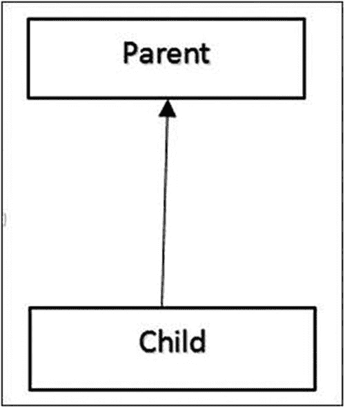
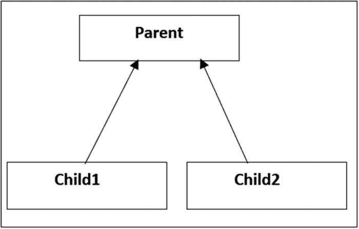
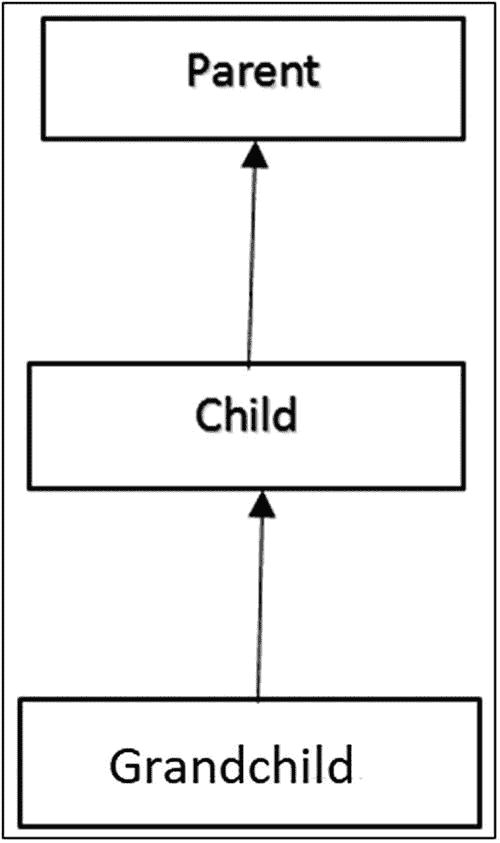
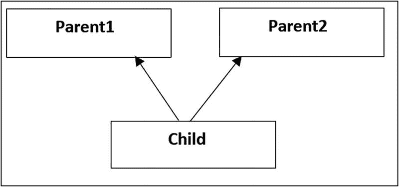
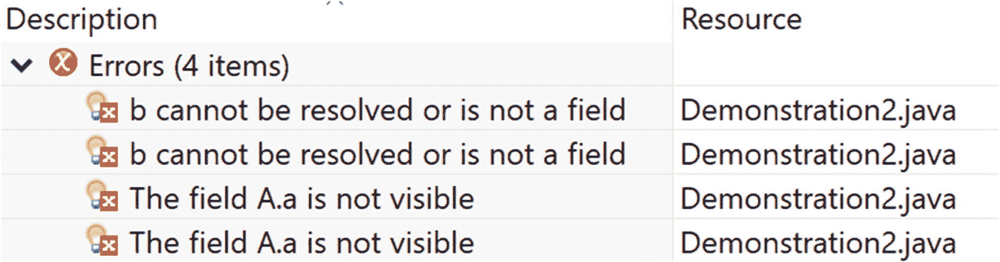
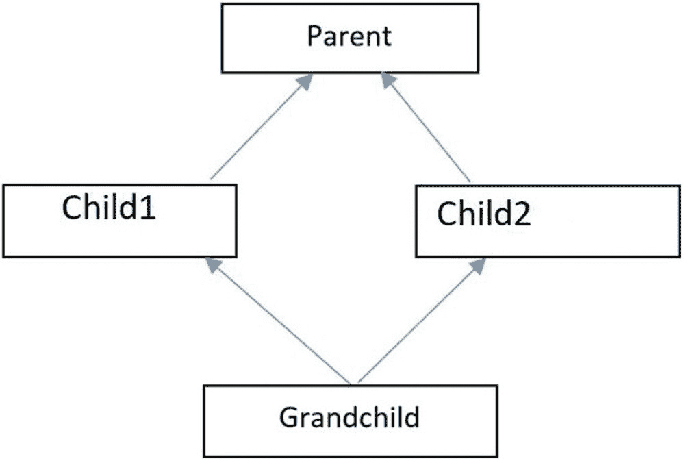

# 4. 继承的概念

继承的主要目标是促进代码复用并消除冗余。它还演示了子类如何获取其父类的特性（或特征）。由于父类位于类层次结构的较高层级，子类可以从中派生。子类通常被称为**派生类**或**子类**。父类也被称为**超类**。

## 继承的类型

通常，你会遇到四种类型的继承。在 Java 中，一个类可以使用 `extends` 关键字从另一个类继承。为了方便你参考，我对每种继承类型进行了总结性描述。

### 单继承

一个子类从一个父类派生。以下是此类继承的示例图（图 4-1）和代码。



图 4-1

单继承

示例代码：

```
class Parent
{
//Your code...
}
class Child extends Parent
{
//Your code...
}
```

### 层次继承

多个子类可以从一个父类派生。以下是此类继承的示例图（图 4-2）和代码。



图 4-2

层次继承

示例代码：

```
class Parent
{
//Your code...
}
class Child1 extends Parent
{
//Your code...
}
class Child2 extends Parent
{
//Your code...
}
```

### 多级继承

父类可以有孙类。以下是此类继承的示例图（图 4-3）和代码。



图 4-3

多级继承

示例代码：

```
class Parent
{
//Your code...
}
class Child extends Parent
{
// Your code..
}
class Grandchild extends Child
{
// Your code...
}
```

### 多重继承

一个子类可以从多个父类派生。但 Java 不支持通过类实现这种类型的继承。你需要学习接口。以下是此类继承的示例图（图 4-4）和代码。



图 4-4

多重继承

示例代码：

```
interface MyInterface1
{
// Your code
}
interface MyInterface2
{
//Your code
}
class MyClass implements MyInterface1,MyInterface2
{
//Some code
}
```

### 注意

1. Java 不支持多重继承（通过类实现）；也就是说，一个子类不能从多个父类派生。要处理这种情况，你需要理解接口。
2. 还有另一种类型的继承，称为**混合继承**。它是两种或多种继承类型的组合。


### 演示 1

让我们从一个简单的继承程序开始。在下面的演示中，你有两个类——`ParentClass` 和 `ChildClass`。顾名思义，`ChildClass` 通过 `extends` 关键字继承自 `ParentClass`。

```
package java2e.chapter4;
class ParentClass {
public void showParentMethod() {
System.out.println("I am a Parent Class method.");
}
}
class ChildClass extends ParentClass {
}
class Demonstration1 {
public static void main(String[] args) {
System.out.println("***Demonstration-1.Testing Inheritance.***");
// 创建一个 ChildClass 对象
ChildClass child1 = new ChildClass();
// 通过 ChildClass 对象调用 showParentMethod()
child1.showParentMethod();
}
}
```

输出：

```
***Demonstration-1.Testing Inheritance.***
I am a Parent Class method.
```

注意，你是通过子类对象调用了 `showParentMethod()`。

### 要点记忆

*   在 Java 中，`Object`（位于 `java.lang` 包中）是所有类的超类。所有其他类都直接或间接地继承自该类。

*   除了构造方法（实例构造方法和静态构造方法）之外，所有成员都会被继承。但由于访问权限的限制，并非所有继承的成员都能在子类/派生类中访问。

*   子类可以添加新成员，但不能移除父类成员的定义。（就像你可以为自己选择一个新名字，但不能改变你父母的姓氏一样）。

*   继承层次结构具有传递性；也就是说，如果类 `C` 继承自类 `B`，而类 `B` 又派生自类 `A`，那么类 `C` 包含类 `B` 和类 `A` 的所有成员。

### 问答环节

**4.1 这意味着私有成员也会被继承。这个理解正确吗？**

是的。

**4.2 我如何验证私有成员确实被继承了呢？**

你可以参考演示 2 中的程序和输出。

### 演示 2

考虑以下代码：

```
package java2e.chapter4;
class A {
private int a;
}
class B extends A {
}
class Demonstration2 {
public static void main(String[] args) {
System.out.println("***Demonstration-2.Private members are also inherited***");
B obB = new B();
A obA = new A();
// 这证明了 a 也被继承了。请查看错误信息。
System.out.println(obB.a);// 错误：字段 A.a 不可见
System.out.println(obB.b);// 错误：b 无法解析或不是字段
System.out.println(obA.a);// 错误：字段 A.a 不可见
System.out.println(obA.b);// 错误：b 无法解析或不是字段
}
}
```

图 4-5 是来自 Eclipse 编辑器的输出截图。



图 4-5

来自 Eclipse 编辑器的输出截图

我们遇到了两种不同类型的错误：

*   ***字段 A.a 不可见***。这表明来自类 `A` 的私有成员 `a` 被继承到了子类 `B` 中。

*   你用一个字段 `b` 做了一个实验，该字段在此类层次结构中不存在（即该字段不存在——既不在 `A` 中，也不在 `B` 中）。当你尝试用类 `A` 或类 `B` 的对象访问该字段时，你会遇到一个不同的错误——***b 无法解析或不是字段***。因此，如果 `a` 在类 `B` 中不存在，你也会得到类似的错误。

### 问答环节

**4.3 为什么 Java 不支持通过类实现的多重继承？**

主要原因是为了避免歧义。它在典型场景中可能会引起混乱；例如，假设你的父类中有一个名为 `show()` 的方法。该父类有多个子类，`Child1` 和 `Child2`，它们为了各自的目的*重写*了 `show()` 方法。代码可能看起来像演示 3 所示。

### 演示 3

试试这个：

```
class Parent {
public void show() {
System.out.println("I am in Parent");
}
}
class Child1 extends Parent {
public void show() {
System.out.println("I am in Child1");
}
}
class Child2 extends Parent {
public void show() {
System.out.println("I am in Child2");
}
}
```

现在假设你的 `Grandchild` 类同时继承自 `Child1` 和 `Child2`，但没有重写 `show()` 方法。图 4-6 描述了这一场景。



图 4-6

Java 中通过类实现多重继承导致的菱形问题

所以，现在你遇到了一个歧义：`GrandChild` 将从哪个类继承/调用 `show()`——`Child1` 还是 `Child2`？为了避免这种类型的歧义，Java 不支持通过类实现的多重继承。这个问题有一个著名的名称——**菱形问题**（这个名称源于类继承图的形状）。

因此，Java 编译器总是会对以下代码报错：

```
class GrandChild extends Child1,Child2// 错误：Java 不支持
{
public void show() {
System.out.println("I am in Grandchild");
}
}
```

### 注意

1.  上述讨论不仅限于方法。当你通过实例化一个类来创建对象时，该对象会从父类（超类）继承字段。现在，假设你的类有多个超类。如果来自不同父类的构造方法试图实例化同一个字段，你就会遇到同样的问题，因为你需要决定它们的优先级顺序。当你学习接口时，你会了解到它们不包含字段。因此，你无需担心这种由状态的多重继承导致的问题。

2.  在类似上下文中，你可能需要特别注意默认方法（Java 8 中引入）。稍后你将看到相关讨论。

### 问答环节

**4.4 在我看来，编程语言不支持通过类实现的多重继承。这个理解正确吗？**

不正确。这个决定是由编程语言的设计者做出的；例如，C++ 支持通过类实现多重继承的概念。

**4.5 为什么 C++ 设计者支持通过类实现多重继承的概念？看起来菱形问题也会影响他们。**

这是我的观点：C++ 设计者可能希望包含这个特性以使语言更丰富。他们为你提供了这些特性，但将正确的用法留给你自己决定。

另一方面，Java 设计者希望避免由此类特性导致的任何意外后果。你将了解到，多重继承会在各种情况下让你的生活变得困难；例如，当你需要维护构造方法链时，或者当你需要进行类型转换时（向下转型总是有风险的；你将在第 5 章，问答 5.14 中详细看到这个讨论），等等。所以，在我看来，Java 设计者只是想让语言更简单、更不容易出错。

**4.6 Java 中有混合继承吗？**

仔细想想。混合继承是两种或多种继承类型的组合。所以，如果你不试图组合任何通过类实现的多重继承类型，这个问题的答案是“是”。但如果你试图用任何类型的多重继承（通过类）来构成混合继承，Java 编译器会立即提出异议。

**4.7 假设你有一个父类和一个子类。你能猜出这些类的构造方法会按什么顺序被调用吗？**

你必须记住，构造方法的调用遵循从父类到子类的路径。让我们用下面的演示来测试一下。


### 演示 4

假设你有一个父类、一个子类和一个孙类。我们分别称它们为 `Parent4`、`Child4` 和 `Grandchild4`。顾名思义，`Child4` 类继承自 `Parent4`，而 `Grandchild4` 继承自 `Child4` 类。现在，创建一个 `Grandchild4` 类的对象。从以下演示的输出中，你可以看到构造函数的调用顺序与其派生顺序一致。

```
package java2e.chapter4;
class Parent4 {
Parent4() {
System.out.println("Inside Parent Constructor.");
}
}
class Child4 extends Parent4 {
Child4() {
System.out.println("Inside Child Constructor.");
}
}
class Grandchild4 extends Child4 {
Grandchild4() {
System.out.println("Inside GrandChild Constructor.");
}
}
class Demonstration4 {
public static void main(String[] args) {
System.out.println("***Demonstration-4\. Testing constructor calling sequence***");
Grandchild4 grandChild = new Grandchild4();
}
}
```

输出：

```
***Demonstration-4\. Testing constructor calling sequence***
Inside Parent Constructor.
Inside Child Constructor.
Inside GrandChild Constructor.
```

### 问答环节

**4.8 有时我不确定在继承层次结构中，哪个应该是父类，哪个应该是子类。我该如何处理这种情况？**

你可以尝试记住一些简单的陈述，例如：足球运动员是运动员，但反过来不一定成立。或者，公交车是交通工具，但反过来不一定成立。这种“is-a”测试可以帮助你决定哪个应该是父类；例如，根据前面的陈述，你可以得出结论：`Vehicle` 是父类，`Bus` 是子类。

你也可以使用这种“is-a”测试来预先判断一个类是否可以放在同一个继承层次结构中。因此，当你发现公交车不是鸟时，你就不会试图将它们放在同一个继承层次结构中。

## 特殊关键字：super

在 Java 中，有一个特殊的关键字叫做 `super`。它用于以高效的方式访问父类的成员。每当子类想要引用其直接父类时，都可以使用 `super` 关键字。

让我们在以下示例中探讨 `super` 关键字的不同用法。

### 演示 5

你可以使用以下代码行创建一个子类实例：

```
Child5 obB2 = new Child5(1, 2, 3);
```

子类构造函数可以反过来使用 `super` 关键字调用父类构造函数。请注意以下代码块中的粗体行：

```
Child5(int a, int b, int c) {
//System.out.println("Before setting,c="+ this.c);//Error:Constructor call must be the first statement in a //constructor
super(a, b);
System.out.println("I am in child constructor.");
System.out.println("Before setting,c="+ this.c);
this.c = c;
System.out.println("Now c="+ this.c);
}
```

程序的其他部分不言自明。现在，执行该程序，然后阅读分析部分以获得更好的理解。

```
package java2e.chapter4;
class Parent5 {
private int a;
private int b;
Parent5(int a, int b) {
System.out.println("I am in parent constructor.");
System.out.println("Before setting,a="+ this.a);
System.out.println("Before setting, b="+ this.b);
System.out.println("Setting the values for instance variables a and b.");
this.a = a;
this.b = b;
System.out.println("Now a="+ this.a);
System.out.println("Now b="+ this.b);
}
void parent5Method() {
System.out.println("I am a parent method.");
}
}
class Child5 extends Parent5 {
private int c;
Child5(int a, int b, int c) {
//System.out.println("Before setting,c="+ this.c);//Error:Constructor call must be the first statement in a //constructor
super(a, b);
System.out.println("I am in child constructor.");
System.out.println("Before setting,c="+ this.c);
this.c = c;
System.out.println("Now c="+ this.c);
}
void child5Method() {
System.out.println("I am a child method.");
System.out.println("I am calling the parent method.");
super.parent5Method();
}
}
public class Demonstration5 {
public static void main(String[] args) {
System.out.println("***Demonstration-5\. The uses of the 'super' keyword Demo***");
Child5 obB2 = new Child5(1, 2, 3);
//System.out.println("a in ObB2=" + obB2.a);//Error:a is private
//System.out.println("b in ObB2=" + obB2.b);//Error:b is private
//System.out.println("c in ObB2=" + obB2.c);//Error:c is private
obB2.child5Method();
}
}
```

输出：

```
*** Demonstration-5\. The uses of the 'super' keyword Demo***
I am in parent constructor.
Before setting,a=0
Before setting, b=0
Setting the values for instance variables a and b.
Now a=1
Now b=2
I am in child constructor.
Before setting,c=0
Now c=3
I am a child method.
I am calling the parent method.
I am a parent method.
```

你需要理解为什么必须使用关键字 `super`。如果你在前面的示例中没有使用它，你可能需要编写类似这样的代码：

```
public Child(int a, int b, int c)
{
this.a = a;
this.b = b;
this.c = c;
}
```

这种方法有两个主要问题。你试图编写重复的代码来初始化实例变量 `a` 和 `b`。此外，在这种情况下，你会收到一个编译时错误，因为 `a` 和 `b` 由于其保护级别（注意它们是私有的）而无法访问。通过使用 `super` 关键字，你可以有效地处理这两种情况。你可能还会注意到，父类构造函数在子类构造函数之前被调用。理想情况下，你的目标应该是始终保持正确的***构造函数链***。

### 要点记忆

*   注意被注释掉的行：`//System.out.println("Before setting,c="+ this.c);//`*Error:Constructor call must be the first statement in a constructor.* 它用于提醒你，Java 设计指南规定，对超类构造函数的调用应该是子类（或派生类）构造函数中的第一条语句。你可以使用 `super()` 或 `super(parameter list)` 来调用超类构造函数的正确版本。

*   该指南还指出：“*如果一个构造函数没有显式调用超类构造函数，Java 编译器会自动插入对超类无参构造函数的调用。如果超类没有无参构造函数，你将收到一个编译时错误。Object 确实有这样的构造函数，因此如果 Object 是唯一的超类，则没有问题。*”

    [`https://docs.oracle.com/javase/tutorial/java/IandI/super.html`](https://docs.oracle.com/javase/tutorial/java/IandI/super.html)

*   注意输出的最后两行。它演示了你可以使用 `super` 关键字从派生类方法中调用超类方法。

让我们在以下示例中探讨 `super` 的另一种用法。关键字 `super` 可以在方法、构造函数或实例变量的上下文中使用。当你只考虑方法和实例变量时，你可以将用法概括为以下形式：

```
super.member;
```

其中 `member` 可以是实例变量或方法。

有时，派生类可以隐藏最初在超类中定义的实例变量。在这种情况下，`super` 允许你使用派生类的对象访问超类中的实例变量。因此，在以下演示中，你可以看到以下代码行：

```
super.myInt = 12;
```

其中 `myInt` 是父类的一个实例变量。


### 演示 6

在演示 5 中，你看到了可以用相同的方式调用父类方法。在演示 6 中，你有一个派生类（`Child6`），它继承自类 `Parent6`。同时，`Parent6` 类有一个名为 `parentClassMethod()` 的方法。因此，在子类中，你可以使用以下代码引用父类方法：

```
super.parentClassMethod();
```

以下示例演示了这两种情况：

```
package java2e.chapter4;
class Parent6 {
int myInt;
Parent6() {
myInt = 25;// 一些默认值
}
public void parentClassMethod(){
System.out.println("我在 parentClassMethod() 方法内部。");
}
}
class Child6 extends Parent6 {
int myInt;// 这将隐藏 Parent6 中的 myInt
Child6() {
System.out.println("初始时，父类中 myInt 的值为=" + super.myInt);
System.out.println("现在设置父类中 myInt 的新值 (12)。");
super.myInt = 12;// 设置父类中的 myInt
System.out.println("现在设置子类中 myInt 的值 (50)。");
myInt = 50;// 设置子类中的 myInt
}
void display() {
System.out.println("父类中 myInt 的值为=" + super.myInt);
System.out.println("子类中 myInt 的值为=" + myInt);
}
void invokeParentMethod()
{
System.out.println("从子类调用父类方法。");
super.parentClassMethod();
}
}
class Demonstration6 {
public static void main(String[] args) {
System.out.println("***演示-6：'super' 关键字的另一种用法***\n");
Child6 childObject = new Child6();
childObject.display();
childObject.invokeParentMethod();
}
}
```

输出：

```
***演示-6：'super' 关键字的另一种用法***
初始时，父类中 myInt 的值为=25
现在设置父类中 myInt 的新值 (12)。
现在设置子类中 myInt 的值 (50)。
父类中 myInt 的值为=12
子类中 myInt 的值为=50
从子类调用父类方法。
我在 parentClassMethod() 方法内部。
```

### 要点记忆

*   根据语言规范 (JLS 11)：使用关键字 `super` 的形式仅在类的实例方法、实例初始化器或构造函数中，或者类的实例变量初始化器中有效。否则，你将看到编译时错误。

*   `java.lang.Object` 类位于类层次结构的顶层。所有其他类都是它的直接或间接子类。`Object` 类中一些有用的方法包括 `protected native Object clone(){}`*、*`String toString()`*、*`public final native void notify(){}`*、*`public final native void notifyAll(){}`* 和 *`public native int hashCode(){}`*。*

*   你使用 `super` 关键字来引用*直接父类的对象。但 `Object` 类没有父类，*因此你不能在 `Object` 类的声明中使用 `super` 关键字。

*   `super` 关键字类似于 C++ 或 C# 中的 `base` 关键字。但你需要记住一个限制：对父类构造函数的调用必须是子类构造函数中的第一行代码。

### 问答环节

**4.9 你能总结一下 super 关键字的不同用法吗？**

在演示 5 和 6 中，你已经看到 `super` 关键字可以用于以下任何一种情况：

*   调用父类构造函数

*   访问父类成员（方法或数据成员）。

**4.10 假设父类和子类中存在同名的方法。如果你创建一个子类对象并尝试调用这个同名方法，会调用哪一个？**

你在这里试图引入方法重写的概念。你将在本书稍后（第 5 章）看到相关讨论。但你已经学会了可以使用关键字 `super` 来引用父类方法。因此，为了回答你的问题，请考虑以下程序。

### 演示 7

在这里，父类（`Parent7`）和子类（`Child7`）都有一个名为 `showMe()` 的方法。我建议你通读程序及其对应的输出。然后，阅读分析部分以获得更好的理解。

```
package java2e.chapter4;
class Parent7 {
public void showMe() {
System.out.println("目前，我在父类方法内部。");
}
}
class Child7 extends Parent7 {
public void showMe() {
System.out.println("我在子类方法内部。");
//System.out.println("现在调用父类方法。");
//super.showMe();
}
}
public class Demonstration7 {
public static void main(String[] args) {
System.out.println("***演示-7.测试 super 关键字的用法。****");
Child7 obChild = new Child7();
obChild.showMe();
}
}
```

输出：

```
***演示-7.测试 super 关键字的用法。***
我在子类方法内部。
```

在这里，你的派生类（`Child7`）方法隐藏了其父类（`Parent7`）的方法。

如果你想调用父类方法，你可以创建对象并像下面这样调用该方法：

```
Parent7 obParent = new Parent7();
obParent.showMe();//现在将调用父类方法。
```

或者，你可以*取消注释*子类方法中的以下行（以粗体显示），以便从子类方法中调用父类方法：

```
//System.out.println("现在调用父类方法。");
//super.showMe();
```

现在，如果你编译并运行该程序，你将获得以下输出：

```
***演示-7.测试 super 关键字的用法。***
我在子类方法内部。
现在调用父类方法。
目前，我在父类方法内部。
```


### 问答环节

**4.11 我知道子类方法可以调用父类方法。但父类方法如何调用子类方法呢？**

你无法做到这一点。必须记住，父类在其子类之前就已经完成，因此它对子类方法一无所知。它只是声明了一些东西（可以理解为某种契约/方法），供其子类使用。它只负责给予，并不期望从子类那里得到任何回报。

如果你仔细观察，会发现“is-a”测试是单向的（例如，公交车总是交通工具，但反过来不一定成立；因此，不存在反向继承的概念）。

**4.12 我意识到，在子类方法内部，如果想调用父类方法并在其中添加代码，可以使用关键字** **super。这样对吗？**

是的。

**4.13 在面向对象编程中，继承机制帮助我们复用行为。还有其他方式可以实现这一点吗？**

是的。虽然继承的概念在很多地方都有使用，但它并不总是最佳解决方案。为了更好地理解这一点，你需要了解设计模式的概念。继承的一个非常常见的替代方案是使用组合，本书第 9 章会介绍组合。

**4.14 在我看来，如果某个用户已经为应用程序开发了一个方法，那么系统中的其他用户应该始终通过继承的概念来复用同一个方法，以避免重复劳动。这种理解正确吗？**

不正确。你不应该以这种方式泛化继承。这取决于具体的应用程序和用途。假设有人已经创建了一个 `show()` 方法来描述 `Car` 类的详细信息。现在，假设你也创建了一个名为 `Animal` 的类，并且需要用某个方法描述动物的特征。假设你认为 `show()` 这个名字最适合你的方法。在这种情况下，既然你已经在 `Car` 类中有了一个 `show()` 方法，并且你认为应该为你的 `Animal` 类复用这个方法，那么你会写出类似这样的代码：

```
class Animal extends Car{...} .
```

现在，思考一下。“这是好的设计吗？” 你必须同意，汽车和动物之间没有任何关系。因此，你不应该将它们放在同一个继承层次结构中。

**4.15 在 Java 中，如何继承构造函数或析构函数？**

在 Java 中，构造函数不会被继承。你还应该记住，Java 中没有析构函数（尽管你可以将 `finalize()` 方法视为其近似替代）。

### 演示 8

考虑以下代码片段。它可以正常运行。但请仔细观察被注释掉的行。你会发现需要注意一个常见错误。例如，你不能用第 12 行和第 13 行替换第 15 行来编译代码。但是，这两种方法看起来似乎在做同样的事情。

```
package java2e.chapter4;
class Demo8A {
public Demo8A(int x) {
System.out.print(x);
}
}
class Demo8B extends Demo8A {
public Demo8B(int a, int b) {
// 错误编码
// int c = a + b;//第 12 行
// super(c); //错误//第 13 行
// 正确编码
super(a + b); // 第 15 行
}
}
```

从 Java 文档来看，Java 开发者似乎不想破坏构造函数链。看起来他们认为，如果允许在 `super` 调用之前放置这样的语句，有人可能会滥用它；例如，他们可能在父类对象本身创建之前执行一些无效操作。

### 问答环节

**4.16 一些文档说** **this()** **应该是第一条语句。现在，你又告诉我们** **super()** **应该是第一条语句。如果同一个构造函数中同时有这两者，会发生什么？**

好问题。你必须注意，两者都是构造函数调用。如果有一个构造函数调用，它必须是第一条语句。因此，你不能在同一个构造函数中同时拥有两者。

**4.17 如果是这样，那这是一个非常严格的设计。不是吗？**

下面的程序和输出分析可以消除你的疑虑。

### 演示 9

那么，让我们来看一下下面的程序和输出。

```
package java2e.chapter4;
class Parent9 {
int i;
Parent9() {
System.out.println("调用父类的无参构造函数。");
}
}
class Child9 extends Parent9 {
int b;
Child9() {
// this() 和 super() 不能同时使用
// super();
this(2);
System.out.println("调用 Child9 的无参构造函数。");
}
Child9(int b) {
this.b = b;
System.out.println("进入 Child9 带一个参数的构造函数，b= " + b);
}
}
class Demonstration9 {
public static void main(String[] args) {
System.out.println("***演示-9.关于 this 和 super 关键字的案例研究。***");
Child9 obChild9 = new Child9();
}
}
```

输出：

```
***演示-9.关于 this 和 super 关键字的案例研究。***
调用父类的无参构造函数。
进入 Child9 带一个参数的构造函数，b= 2
调用 Child9 的无参构造函数。
```

现在，启用 `super` 语句并注释掉 `this()` 构造函数，如下所示：

```
Child9() {
// this() 和 super() 不能同时使用
super();
//this(2);
System.out.println("调用 Child9 的无参构造函数。");
}
```

然后再次运行程序。你将看到以下输出：

```
***演示-9.关于 this 和 super 关键字的案例研究。***
调用父类的无参构造函数。
调用 Child9 的无参构造函数。
```

你注意到有趣的事情了吗？在这种情况下，无论你是否通过 `super()` 显式调用父类构造函数，父类构造函数都会被调用。因此，你可以假设，如果 Java 设计者允许我们在同一个构造函数中放置 `super()` 和 `this()`，你很可能会在构造函数链的调用中导致多次 super 调用，这显然不是一个好的设计。

### 问答环节

**4.18 要实现继承的概念，我需要扩展类。这种理解正确吗？**

是的。但你需要记住，你也可以通过实现接口来使用这个概念。本书第 6 章会讨论接口。

## 总结

本章涵盖了以下主题：

*   继承的概念
*   不同类型的继承
*   为什么 Java 不支持通过类实现的多重继承
*   Java 允许的混合继承类型
*   `super` 关键字的不同用法
*   继承层次结构中的构造函数调用顺序
*   如果子类也包含同名方法，如何调用父类方法
*   如何将类放入继承层次结构中
*   继承概念的正确使用方式

