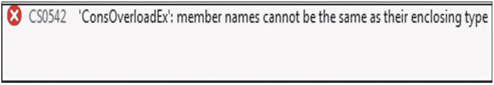
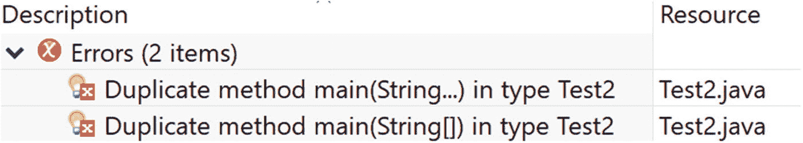
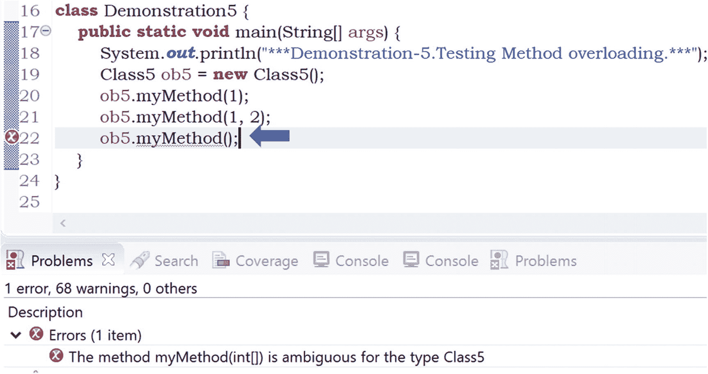
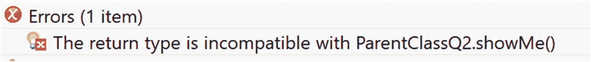
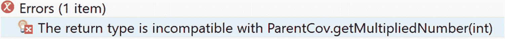

# 5. 熟悉多态

让我们回顾一下你已经学过的关于多态的知识。多态通常与*一个名称，多种形式*相关联；例如，如果你有两个整数操作数进行*加法*运算，你期望得到整数的和，但如果操作数是两个字符串，你期望得到拼接后的字符串。我还提到过多态可以分为两种类型：编译时多态和运行时多态。

在这里，我将从编译时多态开始我们的讨论。

在编译时多态中，编译器可以在编译时将适当的方法绑定到相应的对象，因为它拥有所有必要的信息（例如，方法参数），并且在程序编译后很早就知道要调用哪个方法。这就是为什么它也被称为*静态绑定*或*早期绑定*。在 Java 中，可以通过方法重载来实现编译时多态。

## 方法重载

让我们从下面的程序开始，并分析相应的输出。


### 演示 1

在本程序中，你有一个`Addition`类，其中包含三个方法。每个方法都有相同的名称`sum()`，但它们可以接受不同的参数。在 Java 中，这种编码方式是允许的。

现在，编译并运行该程序，然后分析输出结果。

```
package java2e.chapter5;
class Addition {
int sum(int x, int y) {
return x + y;
}
double sum(double x, double y) {
return x + y;
}
String sum(String s1, String s2) {
return s1.concat(s2);
}
}
class Demonstration1 {
public static void main(String[] args) {
System.out.println("***Demonstration-1.Method overloading example***");
Addition additionOb = new Addition();
int sumOfIntergers = additionOb.sum(10, 20);
System.out.println("10 + 20 is :" + sumOfIntergers);
double sumOfDoubles = additionOb.sum(10.5, 20.7);
System.out.println("10.5 + 20.7 is :" + sumOfDoubles);
String sumOfStrings = additionOb.sum("Smith", "Turner");
System.out.println("'Smith'+ 'Turner' is :" + sumOfStrings);
}
}
```

输出结果：

```
***Demonstration-1.Method overloading example***
10 + 20 is :30
10.5 + 20.7 is :31.2
'Smith'+ 'Turner' is :SmithTurner
```

你可以看到，这些方法名称相同，都是“sum”，但一旦执行，它们能够完成不同的工作。

当你进行这种编码时，称之为方法重载。在方法重载中，方法名相同，但方法签名不同。在此上下文中，Java 语言规范（第 11 版）指出：“一个类不能有多个具有相同签名但**基本**返回类型不同的方法。”

### 要点记忆

*   在 Java 中，方法重载可以帮助你实现编译时多态。

*   在方法重载中，方法参数可以在数量、顺序或参数类型上有所不同。

*   这种编码方式也称为静态绑定、早期绑定、静态方法分派或静态多态。

*   在方法重载中，对重载方法的调用是在编译时而非执行时解析的。

### 问答环节

**5.1 什么是方法签名？**

通常，方法名及其参数的数量、类型和顺序构成了它的签名。Oracle Java 文档也证实了这一点，指出方法声明的两个组成部分构成了方法签名——方法名和参数类型。请参见以下内容：

[`https://docs.oracle.com/javase/tutorial/java/javaOO/methods.html`](https://docs.oracle.com/javase/tutorial/java/javaOO/methods.html)

因此，Java 编译器可以区分名称相同但参数列表不同的方法；例如，对于 Java 编译器来说，方法`double add(int x, double y){}`与方法`double add(double x, int y){}`或`double add( int x, int y, int z)`是不同的。

**5.2 以下代码片段是方法重载的例子吗？**

```
class Addition
{
public int sum(int x, int y)
{
return x + y;
}
public double sum(int x, int y, int z)
{
return x + y+ z;
}
}
```

是的。

**5.3 以下代码片段是方法重载的例子吗？**

```
class Addition
{
int sum(int x, int y)
{
return x + y;
}
double sum(int x, int y)
{
return x + y;
}
}
```

不是。编译器不会考虑基本返回类型来区分这些方法。换句话说，Java 不支持基于基本返回类型的重载。Eclipse IDE 会通过图 5-1 所示的错误来提示问题。


图 5-1

Eclipse 编辑器中显示错误消息的输出快照

当你学习 Java 中的协变返回类型时，你会看到 JVM（1.5 及更高版本）允许基于返回类型的重载，即一个类可以有两个或多个仅返回类型不同的方法，但在这种情况下，重写方法的返回类型应该是被重写方法返回类型的子类型。你很快就会学到这些术语。

**5.4 我们可以有构造函数重载吗？**

当然可以。你可以将构造函数视为一种没有返回类型的特殊方法。

### 演示 2

你可以编写以下程序来演示构造函数重载。

```
package java2e.chapter5;
class ConstructorOverloadEx {
ConstructorOverloadEx() {
System.out.println("Constructor cannot accept any argument.");
}
ConstructorOverloadEx(int a) {
System.out.println("Constructor can accept one integer argument: " + a);
}
ConstructorOverloadEx(int a, double b) {
System.out.println("Constructor can accept one integer argument: " + a + " and one double argument: " + b);
}
}
public class Demonstration2 {
public static void main(String[] args) {
System.out.println("***Demonstration-2.Constructor Overloading.***");
ConstructorOverloadEx ob1 = new ConstructorOverloadEx();
ConstructorOverloadEx ob2 = new ConstructorOverloadEx(2);
ConstructorOverloadEx ob3 = new ConstructorOverloadEx(2, 3.7);
}
}
```

输出结果：

```
***Demonstration-2.Constructor Overloading.***
Constructor cannot accept any argument.
Constructor can accept one integer argument: 2
Constructor can accept one integer argument: 2 and one double argument: 3.7
```

### 问答环节

**5.5 在我看来，演示 2 也描述了方法重载。构造函数和方法有什么区别？**

我已在关于类的讨论中（参见第 2 章）谈到了构造函数。供你参考，你可以将构造函数视为一种特殊的方法，它与类同名且没有返回类型。但还有许多其他区别。你需要记住构造函数的关键工作是初始化对象。你不能直接调用它们*。

**5.6 你能编译演示 3 中的代码吗？**

### 演示 3

代码如下：

```
class Test {
public Test() {
System.out.println("A Constructor with no argument");
}
public void Test() {
System.out.println("This is a method.");
}
}
```

Java 允许这样做，但在 Eclipse 编辑器中，你会注意到警告消息`"This method has a constructor name."` 此特性在不同计算机语言中可能有所不同。例如，C#编译器在类似情况下会引发错误，如图 5-2 所示。



图 5-2

来自 Visual Studio 2017 IDE 的输出快照

### 问答环节

**5.7 可以重载 main()方法吗？**

可以。请查看以下程序、输出结果以及分析。


### 演示 4

在下面的演示中，你会注意到存在三个不同重载版本的 `main()` 方法。

```
package java2e.chapter5;
class Demonstration4 {
public static void main(String[] args) {
System.out.println("***演示-4.测试重载的 main()方法。***");
System.out.println("在标准 main-main(String[] args) 内部。");
// main("hello");
// main(5,"hello");
}
public static void main(String arg1) {
System.out.println("调用了带一个字符串参数的重载 main() 方法。");
}
public static void main(int arg1, String arg2) {
System.out.println("调用了带一个整数和一个字符串参数的重载 main() 方法。");
}
}
```

输出：

```
***演示-4.测试重载的 main()方法。***
在标准 main-main(String[] args) 内部。
```

如你所见，上述程序编译成功。当你运行程序时，它会调用标准的 `main()` 方法。此外，你可以从这个标准的 `main()` 方法中调用其他重载的方法。例如，如果你取消上述程序中以下两行的注释：

```
// main("hello");
// main(5,"hello");
```

你将得到以下输出：

```
***演示-4.测试重载的 main()方法。***
在标准 main-main(String[] args) 内部。
调用了带一个字符串参数的重载 main() 方法。
调用了带一个整数和一个字符串参数的重载 main() 方法。
```

### 问答环节

**5.8 我很困惑。为什么以下程序会出现编译错误？**

```
package chapter5.testcodes;
public class Test2 {
public static void main(String[] args) {
System.out.println("***演示-4.测试重载的 main()方法。***");
System.out.println("在标准 main-main(String[] args) 内部。");
// main("hello");
// main(5,"hello");
}
public static void main(String... args) {
System.out.println("在 String... args 内部。");
}
}
```

在这种情况下，存在歧义，因为调用可以通过这两种方法中的任何一种进行转换。Eclipse 编辑器也会通过错误消息指出这一点，提示你使用了重复的方法（见图 5-3）。



图 5-3

在 Eclipse 编辑器中，当你使用重复方法时，错误消息的输出快照

**5.9 Java 是否支持用户自定义运算符重载的概念？**

不支持。

**5.10 以下演示中的代码能编译吗？**

### 演示 5

代码如下：

```
package java2e.chapter5;
class Class5
{
public void myMethod(int... a){
System.out.println("在 myMethod(int... a) 内部");
}
public void myMethod(int a, int b){
System.out.println("在 myMethod(int a, int b) 内部");
}
public void myMethod(boolean... b){
System.out.println("在 myMethod(boolean... a) 内部");
}
}
class Demonstration5 {
public static void main(String[] args) {
System.out.println("***演示-5.测试方法重载。***");
Class5 ob5=new Class5();
ob5.myMethod(1);
ob5.myMethod(1,2);
ob5.myMethod();
}
}
```

不能。编译器能够解析 `ob5.myMethod(1)` 和 `ob5.myMethod(1,2)` 这两个调用，但 `ob5.myMethod()` 让它感到困惑。这个调用可以通过 `myMethod(int... a)` 或 `myMethod(boolean... a)` 进行转换。

由于这种歧义，它会引发编译时错误（见图 5-4）。



图 5-4

Eclipse 编辑器中因歧义调用导致错误消息的代码快照

如果你从上述代码中移除 `myMethod(boolean... a){}`，你将得到以下输出：

```
***演示-5.测试方法重载。***
在 myMethod(int... a) 内部
在 myMethod(int a, int b) 内部
在 myMethod(int... a) 内部
```

### 注意

你可能会注意到问答 5.8 和 5.10 中代码片段的语法差异。在 5.8 中，你处理的是 `String[]` 和 `String...`，但在 5.10 中，你处理的是 `int...` 和 `boolean...`。

### 良好编程实践技巧

尽量保持重载方法的参数名称及其对应顺序的一致性。

以下是一个良好设计的示例：

```
public void showMe(int a) {..}
public void showMe(int a, int b){...}
```

注意在第二行中，`int a` 的位置与第一行相同。

以下是不推荐的设计：

```
public void showMe(int a) {..}
public void showMe(int x, int b){...}
```

注意在第二行中，代码以 `int x` 开头，而不是 `int a`。

## 方法重写

在某些情况下，你的派生类可能想要重新定义或修改父类的行为。方法重写就是在这种场景下出现的。请考虑以下程序及其输出。然后仔细阅读分析部分中的每一点。

以下是关于以下程序的重要说明：

*   你有两个类——`ParentClass` 和 `ChildClass`。顾名思义，`ChildClass` 是一个派生类，派生自其父类 `ParentClass`。

*   在 `ParentClass` 和 `ChildClass` 中都定义了一个名为 `showMe()` 的方法，具有相同的签名和返回类型。这仅仅意味着 `ChildClass` 想要重新定义 `ParentClass` 中已经存在的 `showMe()` 方法，但它对另一个方法 `doNotChangeMe()` 没有意见。

*   在 `main()` 方法中，创建了一个子类对象 `childOb`。当你通过这个对象调用 `doNotChangeMe()` 方法时，它会调用在 `ParentClass` 中定义的方法（遵循继承特性）。这没什么神奇的。

*   当你通过这个对象调用 `showMe()` 方法时，它会调用在 `ChildClass` 中定义的 `showMe()` 版本；也就是说，父类的方法版本被重写了。因此，这种场景被称为**方法重写。**

*   `ParentClass` 中的 `showMe()` 被称为**被重写的方法**，而 `ChildClass` 中的 `showMe()` 被称为**重写的方法。**

### 演示 6

现在，请仔细阅读演示 6。

```
package java2e.chapter5;
class ParentClass {
// 被重写的方法
public void showMe() {
System.out.println("在 ParentClass.showMe() 内部");
}
public void doNotChangeMe() {
System.out.println("在 ParentClass.doNotChangeMe() 内部。");
}
}
class ChildClass extends ParentClass {
// 重写的方法
public void showMe() {
System.out.println("在 ChildClass.showMe() 内部。");
}
}
class Demonstration6 {
public static void main(String[] args) {
System.out.println("*** 方法重写演示。***");
ChildClass childOb = new ChildClass();
childOb.doNotChangeMe();
childOb.showMe();// 将显示被重写的方法
}
}
```

输出：

```
*** 方法重写演示。***
在 ParentClass.doNotChangeMe() 内部。
在 ChildClass.showMe() 内部。
```

你会注意到，在这种情况下，父类和子类方法的返回类型、签名和访问修饰符是相同的。在上述示例中，如果你将子类 `showMe()` 的访问权限从 public 改为 protected，如下所示：

```
//错误
protected void showMe() {
System.out.println("在 ChildClass.showMe() 内部。");
}
```

你将收到一个编译错误，提示 `无法降低继承自 ParentClass 的方法的可见性`（图 5-5）。


图 5-5

在 Eclipse 编辑器中，当你降低继承方法的可见性时出现的错误消息快照

### 注意

Java 中有一个称为协变返回类型的概念。我稍后会讨论这个主题。由于这是一个相对高级的概念，建议你先理解原始概念。


### 问答环节

**5.11 方法重写的主要优势是什么？**

方法重写可以帮助你实现运行时多态。此外，如果父类有多个子类，每个子类都可以自行决定是使用父类的方法，还是拥有自己的特定实现。

**5.12 在方法重载中，返回类型无关紧要。但在这里却很重要。这种说法正确吗？**

正确。在这里，子类方法的返回类型必须与父类方法的返回类型相同（或者是子类型，这一点稍后会讨论），或者简单来说，两种类型必须兼容。

**5.13 以下代码片段能编译通过吗？**

```
class ParentClassQ2 {
public void showMe() {
System.out.println("I am in Parent class");
}
}
class ChildClassQ2 extends ParentClassQ2 {
public int showMe() {
System.out.println("I am in Child class");
return 5;
}
}
```

不能。在这种情况下，你实际上试图实现基于返回类型的重载，而不是重写。现在 `ChildClassQ2` 有两个同名且签名相同的方法，只有返回类型不同。因此，你会收到一个编译错误，提示 `The return type is incompatible with ParentClassQ2.showMe()`，如图 5-6 所示。



图 5-6

Eclipse 编辑器中因返回类型不兼容而显示的错误消息截图

要解决这个问题，你可以对子类的方法做一些简单的修改，如下所示。（这里，你传递了一个虚拟参数，它实际上没有任何作用。）

```
// 这样可以工作
public int showMe(int i)
{
System.out.println("I am in Child class.");
return i;
}
```

现在，你可以同时使用父类和子类中的方法。你可以参考以下程序及其输出来理解：

```
package java2e.chapter5;
class ParentClassQ2 {
public void showMe() {
System.out.println("I am in Parent class.");
}
}
class ChildClassQ2 extends ParentClassQ2 {
// 错误
/*
public int showMe() {
System.out.println("I am in Child class.");
return 5;
}
*/
// 这样可以工作
public int showMe(int i) {
System.out.println("I am in Child class.");
return i;
}
}
public class Quiz2 {
public static void main(String[] args) {
System.out.println("*** Method overriding demonstration.Quiz2.***");
ChildClassQ2 childOb = new ChildClassQ2();
childOb.showMe();// I am in Parent class.
childOb.showMe(5);// I am in Child class.
}
}
```

输出：

```
*** Method overriding demonstration.Quiz2.***
I am in Parent class.
I am in Child class.
```

### 演示 7

现在，让我们在同一个程序中测试重载和重写的概念。考虑以下代码：

```
package java2e.chapter5;
class ParentClass7 {
public int showMe(int i) {
System.out.println("I am in Parent class");
return i;
}
}
class ChildClass7 extends ParentClass {
public int showMe(int i) {
System.out.println("In Child.showMe(int i)");
System.out.println("I am overriding the parent method and adding 5 to the argument.");
return i + 5;// Must return an int
}
public void showMe() {
System.out.println("In Child.showMe().I am overloaded here.");
}
}
class Demonstration7 {
public static void main(String[] args) {
System.out.println("*** Demonstration-7.Overloading with Overriding Demo***\n");
ChildClass7 childOb = new ChildClass7();
int value = childOb.showMe(5);
System.out.println("The value returned is : " + value);// 5+5=10
childOb.showMe();
}
}
```

输出：

```
*** Demonstration-7.Overloading with Overriding Demo***
In Child.showMe(int i)
I am overriding the parent method and adding 5 to the argument.
The value returned is : 10
In Child.showMe().I am overloaded here.
```

上述输出不言自明。从输出信息中，你可以轻松识别哪个方法是重载的，哪个方法是重写的。

据说面向对象程序员会经历三个重要阶段。在第一阶段，他们熟悉非面向对象的构造/结构。在这个阶段，他们使用决策语句、循环结构等。在第二阶段，他们开始创建类和对象，并使用继承机制。最后，在第三阶段，他们利用多态来实现后期绑定，并使程序更加灵活。到目前为止，你已经经历了前两个阶段。现在，让我们进入专业技能的第三阶段，学习如何在 Java 程序中实现多态。

## 运行时多态

你已经知道，多态通常与一个具有多种形式（或构造）的方法名相关联。方法重载以编译时多态而闻名。但 Java 的一个重要特性是它支持运行时多态的概念。这也被称为**动态方法调度**。在这里，对重写方法的调用是在运行时动态解析的。换句话说，你可以根据所引用的对象来调用适当的方法。

在动态方法调度中，你有一个父类，它至少有一个子类。子类包含一个重写的方法，并且你使用父类引用来指向子类对象。在这种情况下，对重写方法的调用是在运行时确定的。

在下面的演示中，有两行代码如下：

```
Vehicle obVehicle = new Bus();
obVehicle.showMe();
```

其中 `Vehicle` 是父类，`Bus` 是子类，并且 `Bus` 类包含一个重写的方法 `showMe()`。因此，在这个演示中，遵循动态方法调度的规则，你可以在运行时调用 `Bus` 类的这个重写方法。


### 演示 8

请完成以下演示并分析输出结果。

```
package java2e.chapter5;
class Vehicle {
public void showMe() {
System.out.println("Inside Vehicle.showMe()");
}
}
class Bus extends Vehicle {
public void showMe() {
System.out.println("Inside Bus.showMe()");
}
public void busSpecificMethod() {
System.out.println("Inside Bus.busSpecificMethod()");
}
}
class Demonstration8 {
public static void main(String[] args) {
System.out.println("***Demonstration 8.Experimenting runtime polymorphism.***\n");
//父类引用指向子类对象
Vehicle obVehicle = new Bus();// ok
// Bus obBus = new Vehicle();//编译错误
obVehicle.showMe();//Inside Bus.showMe()
// obVehicle.busSpecificMethod();//错误
//((Bus) obVehicle).busSpecificMethod();// Ok
}
}
```

输出：

```
***Demonstration 8.Experimenting runtime polymorphism.***
Inside Bus.showMe()
```

在讨论方法重写或运行时多态时，你可能会经常遇到类型转换的概念。类型转换可以进一步分为以下两种类型：

*   向上转型

*   向下转型

向上转型是指转换为超类型（或父类型），而向下转型则是相反的过程。假设，如上一个演示所示，`Vehicle` 是父类，`Bus` 是从 `Vehicle` 派生的类。在 Java 中，你可以将派生类对象视为父类对象。因此，在这种情况下，如果你编写以下代码：

```
Vehicle obVehicle ;
obVehicle= new Bus();// 向上转型
```

你就是在使用向上转型。但如果你使用类似下面的代码：

```
Bus obBus=(Bus)obVehicle;
```

你就是在使用向下转型。向下转型需要进行类型检查，并且存在风险。

再次注意前面程序中的两行重要代码：

```
Vehicle obVehicle = new Bus();
obVehicle.showMe();
```

这里，你通过父类引用（`Vehicle` 引用）指向一个派生类对象（一个 `Bus` 对象），然后调用 `showMe()` 方法。这种调用方式是允许的，不会出现任何编译问题；也就是说，父类引用可以指向派生类对象。

但是，你不能使用以下任何一行代码：

*   `obVehicle.busSpecificMethod();//错误`

（因为代码中的显式类型是 `Vehicle`，而不是 `Bus`）。要消除此错误，你需要进行向下转型，如下所示：

*   `Bus obBus = new Vehicle();//错误`

```
((Bus) obVehicle).busSpecificMethod();// Ok
```

如前所述，要消除此错误，你可能需要进行向下转型，如下所示：

```
Bus obBus=new Bus();
//可能会遇到运行时错误：ClassCastException
obBus=(Bus)obVehicle;
```

但向下转型是有风险的，因为你可能会遇到运行时异常（注释中已提及）。例如，在这种情况下，你会遇到如下运行时异常：

```
Exception in thread "main" Inside Bus.showMe()
java.lang.ClassCastException: java2e.chapter5.Vehicle cannot be cast to java2e.chapter5.Bus at java2e.chapter5.Demonstration8.main(Demonstration8.java:33)
```

### 问答环节

**5.14 “向下转型是有风险的。” 能详细解释一下吗？**

如果实现不当，向下转型可能会导致 `ClassCastException`。为了更清楚地理解这一点，我们来看演示 9。

### 演示 9

添加另一个类 `Train`，类似于上一个演示中的 `Bus`，然后在 `main()` 方法中放入一些测试代码，如下所示：

```
package chapter5.testcodes;
class Vehicle {
public void showMe() {
System.out.println("Inside Vehicle.showMe()");
}
}
class Bus extends Vehicle {
public void showMe() {
System.out.println("Inside Bus.showMe()");
}
public void specificMethod() {
System.out.println("Inside Bus.showMe()");
}
}
class Train extends Vehicle {
public void showMe() {
System.out.println("Inside Train.showMe()");
}
public void specificMethod() {
System.out.println("Inside Train.specificMethod()");
}
}
class Test3 {
public static void main(String[] args) {
System.out.println("***Test Demonstration.Demonstration-9.Downcasting involves risk.***\n");
//向上转型
Vehicle obVehicle=new Train();//ok
obVehicle.showMe();//输出: Inside Vehicle.showMe()
//obVehicle.specificMethod();//error
//创建两个子类型（一个 Bus 和一个 Train）对象
Bus obBus=new Bus();
Train obTrain=new Train();
//向下转型示例：转换为子类型
//obBus=(Bus)obVehicle;//运行时错误：Train cannot be cast to Bus
obTrain=(Train)obVehicle;//Ok，这次没问题。
obTrain.specificMethod();//also ok
}
}
```

输出：

```
***Test Demonstration.Demonstration-9.Downcasting involves risk.***
Inside Train.showMe()
Inside Train.specificMethod()
```

注意下面这段被注释掉的代码：

```
//obBus=(Bus)obVehicle;//运行时错误：Train cannot be cast to Bus
```

如果你取消注释这一行，你不会收到任何编译错误，但会遇到运行时异常，如下所示：

```
***Test Demonstration.Demonstration-9.Downcasting involves risk.***
Inside Train.showMe()
Exception in thread "main" java.lang.ClassCastException: chapter5.testcodes.Train cannot be cast to chapter5.testcodes.Bus
at chapter5.testcodes.Test3.main(Test3.java:41)
```

所以，你可能会注意到 `obVehicle` 原本是为 `Train` 对象使用的，但在向下转型时你试图将其转换为 `Bus` 对象，因此收到了这个错误。但如果你将 `obVehicle` 向下转型为 `Train` 对象，则不会出错，代码将正常运行。

### 要点总结

*   通过父类引用，你可以引用子类对象，但反之则不行。

*   对象引用可以隐式向上转型为超类引用，并显式向下转型为派生类引用。所以，简单来说，向上转型意味着转换为超类型，而向下转型则相反；也就是说，在向下转型中，你试图转换为派生类型。

*   现在，让我们快速检查一下类似编程语言中是如何实现该概念的；例如，C#。如果你熟悉 C# 语言，你可能会注意到在方法重写的示例中使用了 `virtual` 和 `override` 关键字。例如，这里有一个 C# 代码片段：

    ```
    class Vehicle
    {
    public virtual void ShowMe()
    {
    Console.WriteLine("Inside Vehicle.ShowMe");
    }
    }
    class Bus : Vehicle
    {
    public override void ShowMe()
    {
    Console.WriteLine("Inside Bus.ShowMe");
    }
    public void BusSpecificMethod()
    {
    Console.WriteLine("Inside Bus.ShowMe");
    }
    }
    ```

*   在 C# 中，如果你想在派生类中重写父类方法，请使用 `virtual` 关键字标记父类方法。但在 C# 中，所有方法默认都是非虚拟的*。* 在派生类中，通过使用 `override` 关键字标记方法，你可以有意识地重新定义相应的虚拟方法。因此，在 C# 中，你需要标记 `override` 关键字以避免无意识的重写。C# 还使用另一个关键字 `new` 来标记一个方法为非重写方法。但在 Java 中，事情更直接，因为所有方法默认都是虚拟的。


### 问答环节

**5.15 我知道父类引用可以指向子类对象，但反过来不行。为什么我们要支持这种设计？**

你可以将其与一些基本的现实生活事实进行比较。例如，你可以说所有公交车都是交通工具，但反过来不一定成立，因为还有其他交通工具，比如火车和轮船，它们肯定不是公交车*。*

同样，在编程术语中，所有派生类都属于基类类型，但反过来不成立。例如，假设你有一个名为 `Rectangle` 的类，它派生自另一个名为 `Shape` 的类。你可以说所有矩形都是形状，但反过来不成立。

在继承层次结构中，你总是可以进行“is-a”测试来确定继承的方向，因为“is-a”测试总是简单直接的。

**5.16 你是说对于以下代码，调用将在运行时解析：**

```
Vehicle obVehicle = new Bus();
obVehicle.showMe();
```

**但我可以清楚地看到，一个** `Bus` **对象被父类引用指向，编译器本可以在早期绑定（或编译时绑定）时将** `showMe()` **方法绑定到** `Bus` **对象。为什么它要无谓地延迟这个过程？**

如果你只考虑前面的代码，你可能会产生这个疑问。但假设你还有一个子类 `Taxi`，它也继承自父类 `Vehicle`。并且在运行时，根据某些情况，你需要从 `Bus` 或 `Taxi` 中调用 `showMe()` 方法。考虑如下情况：你生成一个 0 到 9 之间的随机数。然后，你检查这个数是偶数还是奇数。如果是偶数，你需要使用 `Bus` 对象；否则，你使用 `Taxi` 对象来调用相应的 `showMe()` 方法。

### 演示 10

现在，请查看以下演示。由于这是演示 10，我将 `Vehicle` 类标记为 `Vehicle10`，`Bus` 类标记为 `Bus10`，`Taxi` 类标记为 `Taxi10`。

```
package java2e.chapter5;
import java.util.Random;
class Vehicle10 {
public void showMe() {
System.out.println("Inside Vehicle.showMe()");
}
}
class Bus10 extends Vehicle10 {
public void showMe() {
System.out.println("Inside Bus.showMe()");
}
}
class Taxi10 extends Vehicle10 {
public void showMe() {
System.out.println("Inside Taxi.showMe()");
}
}
class Demonstration10 {
public static void main(String[] args) {
System.out.println("***Demonstration 10.A case study with runtime polymorphism ***\n");
Vehicle10 obVehicle;
int count = 0;
Random random = new Random();
// Considering 5 choices
while (count < 5) {
int tick = random.nextInt(10);//0 to 9
if (tick % 2 == 0) {
obVehicle = new Bus10();
} else {
obVehicle = new Taxi10();
}
obVehicle.showMe();// Output will be determined at runtime
count++;
}
}
}
```

请注意，输出可能会有所不同。

**这是第一次运行：**

```
***Demonstration 10.A case study with runtime polymorphism ***
Inside Bus.showMe()
Inside Taxi.showMe()
Inside Taxi.showMe()
Inside Bus.showMe()
Inside Taxi.showMe()
```

**这是第二次运行：**

```
***Demonstration 10.A case study with runtime polymorphism ***
Inside Taxi.showMe()
Inside Bus.showMe()
Inside Bus.showMe()
Inside Taxi.showMe()
Inside Bus.showMe()
```

以此类推。

现在你可以明白，对于这类编码，为什么编译器可能需要将决策延迟到运行时，以及你是如何实现运行时多态的。

## 使用 final 关键字

在某些情况下，你可能希望阻止继承过程。例如，你可能想要施加一个限制，使得父类中的方法不能被其子类的方法重写。因此，你将父类方法设为 final，以保持对象状态的一致性。（类似地，如果你想创建一个像 Java 中的 `String` 类那样的不可变类，你也可以创建一个“final”类。）你必须记住，你可以通过多种方式防止重写。在以下部分中，你只会看到 `final` 关键字的用法。它非常有用，因为编译器本身会阻止重写过程。

考虑以下代码：

```
final class ParentClassTest4
{
public void showMe(){
System.out.println("Inside Parent.showMe()");
}
}
class ChildClassTest4 extends ParentClassTest4 //Error
{
//Some code
}
```

你将收到一个编译错误：`The type ChildClassTest4 cannot subclass the final class ParentClassTest4`（参见图 5-7）。


图 5-7

用于阻止继承的 `final` 关键字

你也可以将其用于方法。例如，考虑以下代码片段：

```
class ParentClassTest4 {
final public void showMe() {
System.out.println("Inside Parent.showMe()");
}
}
class ChildClassTest4 extends ParentClassTest4 {
public void showMe() { // error
System.out.println("Inside Parent.showMe()");
}
}
```

你将再次收到一个编译错误：`Cannot override the final method from ParentClassTest4`（参见图 5-8）。


图 5-8

用于阻止方法重写的 `final` 关键字

### 空白 final 变量

你可以像下面这样将 `final` 关键字应用于变量：

```
final double PI=3.14;
```

如果你没有初始化 `final` 变量，你可能会收到一个编译错误。例如，考虑以下代码片段：

```
class ParentClassTest4 {
final int a=10;
// final double PI=3.14;//ok
final double PI;//error
}
```

对于前面的代码片段，你将收到一个编译错误：`The blank final field PI may not have been initialized`（参见图 5-9）。


图 5-9

Eclipse IDE 中因未初始化的空白 `final` 字段导致的编译错误快照

但是你可以选择在构造函数内部初始化 `final` 变量。当你进行这种初始化（针对那些未初始化的 `final` 变量）时，你使用术语“空白 final 变量”。考虑以下代码片段：

```
class FinalDemo
{
//Must be initialized inside a constructor
final double PI;
double area;
//final double PI=3.14;
FinalDemo(){
PI=3.14;
}
}
```

在这种情况下，编译器不会引发任何问题。

需要注意的是，没有像 `const` 这样的关键字，它只是一个尚未使用的保留关键字。但你可能会注意到在其他语言（如 C++ 或 C#）中使用了 'const'。相反，在 Java 中，为了实现类似的概念，你可以使用 `final` 关键字。在此上下文中，JLS11 指出：

> *“常量变量是使用常量表达式（§15.28）初始化的基本类型或 String 类型的 final 变量。一个变量是否是常量变量可能会对类初始化（§12.4.1）、二进制兼容性（§13.1）、可达性（§14.21）和确定性赋值（§16.1.1）产生影响。”*

### 问答环节

**5.17 如果我有多个构造函数，我是否需要在每个构造函数中都初始化 final 变量？**

是的。否则，你可以调用另一个可以为你进行初始化的构造函数。以下演示可以帮助你更好地理解这个概念。在此演示中，有两个构造函数——`FinalDemo(int radius)` 和 `FinalDemo()`。如果带参数的构造函数在计算面积之前没有调用无参构造函数，那么它需要自己为 `PI` 初始化值。


### 演示 11

在以下演示中，带参数的构造函数 `FinalDemo(int radius)` 首先调用无参构造函数 `FinalDemo()` 来初始化空白的 final 变量 `PI`。

```
package java2e.chapter5;
class FinalDemo {
// 必须在构造函数内初始化
final double PI;
double area;
FinalDemo() {
PI = 3.14;
}
FinalDemo(int radius) {
// 调用无参构造函数来初始化 final 变量
this();
this.area = this.PI * radius * radius;
}
}
class Demonstration11 {
public static void main(String[] args) {
System.out.println("***演示-11\. 测试 final 关键字的行为。***\n");
FinalDemo fdemo = new FinalDemo(10);
System.out.println("半径为 10 个单位的圆的面积为 " + fdemo.area + " 平方单位。");
}
}
```

输出：

```
***演示-11\. 测试 final 关键字的行为。***
半径为 10 个单位的圆的面积为 314.0 平方单位。
```

如果你在前面的示例中注释掉以下代码行：

```
FinalDemo(int radius) {
// 调用无参构造函数来初始化 final 变量
//this();
this.area = this.PI * radius * radius;
}
```

你将再次遇到相同的编译错误：`空白 final 字段 PI 可能尚未初始化`（参见图 5-10）。


图 5-10

在演示 11 中注释掉 `this();` 语句时出现的编译错误

### 注意

你可以同时拥有*静态空白 final 变量*和*实例空白变量*。Java 语言规范（第 11 版）指出：“空白 final **类**变量必须由声明该变量的类的静态初始化器明确赋值，否则会发生编译时错误。”它还指出：“*空白 final* **实例**变量必须在声明该变量的类的每个构造函数结束时明确赋值，并且不能明确未赋值，否则会发生编译时错误。”

### 问答环节

**5.18 Java 中允许重写构造函数吗？**

不允许。不要忘记，重写允许我们在运行时更改对象的行为，但构造函数用于初始化对象，并且它们不能被继承。

**5.19 为什么我需要初始化 final 变量？**

这些变量在整个程序中充当常量。如果你在开始时没有初始化它们，其他人将来可能会修改它们。通过声明 `final`，你可以防止在后续阶段进行更改。

**5.20 假设我想要一个变量（例如 `PI`）可以从代码的所有部分访问，但同时我想防止任何意外的修改。我该如何实现？**

基本上，你是在尝试使用全局变量的概念，但 Java 不支持全局变量。但在这种情况下，你可以像下面这样声明一个变量：

```
public static final double PI=3.14;
```

你将在本书的第 8 章中了解更多关于 `static` 的内容。

**5.21 以下代码片段会导致编译错误吗？**

```
class MyClassEx{
final MyClassEx()//错误
{
System.out.println("我是一个无参构造函数");
}
}
```

是的。构造函数不能是 final 的。因此，在这种情况下，你将收到一个编译错误，如图 5-11 所示。


图 5-11

编译时错误：构造函数不能是 final 的

**5.22 为什么当我尝试将 final 关键字与构造函数一起使用时，会遇到编译时错误？**

让我们从一般角度思考：关键字 `final` 用于防止重写，但根据语言规范，构造函数根本不能被重写。JLS11 明确指出：“构造函数声明不是成员。它们永远不会被继承，因此不受隐藏或重写的影响。”

**5.23 我可以重写 main() 方法吗？**

不可以。静态方法不能被重写，并且对静态方法的调用仅在编译时解析。另外，需要注意的是，你可以隐藏静态方法，但不能重写它。

**5.24 “你可以隐藏静态方法，但不能重写它”——这句话是什么意思？**

这两个术语——方法隐藏和方法重写——是不同的。它们之间的区别可以总结如下：

> *被调用的重写实例方法的版本是子类中的版本。被调用的隐藏静态方法的版本取决于它是从超类还是子类调用的。*

### 演示 12

考虑以下程序，并查看输出和分析：

```
package java2e.chapter5;
class Vehicle12 {
public static void showMe() {
System.out.println("Vehicle.showMe()-在父类内部。");
}
public void showInstanceMethod() {
System.out.println("Vehicle.showInstanceMethod()");
}
}
class Bus12 extends Vehicle12 {
public static void showMe() { // 隐藏 Vehicle.showMe()
System.out.println("Bus.showMe()-在子类内部。");
}
public void showInstanceMethod() {// 重写
System.out.println("Bus.showInstanceMethod()");
}
}
public class Demonstration12 {
public static void main(String[] args) {
System.out.println("***演示-12\. 方法隐藏 vs 方法重写***\n");
Vehicle12.showMe();// Vehicle.showMe()-在父类内部。
Vehicle12 vehicle = new Bus12();
// 警告：以下方法应以静态方式访问。
vehicle.showMe();// Vehicle.showMe()-在父类内部。
vehicle.showInstanceMethod();// Bus.showInstanceMethod()
System.out.println("----------");
Bus12.showMe();// Bus.showMe()-在子类内部。
// 警告：以下方法应以静态方式访问。
Bus12 bus = new Bus12();
bus.showMe();// Bus.showMe()-在子类内部。
bus.showInstanceMethod();// Bus.showInstanceMethod()
}
}
```

输出：

```
***演示-12\. 方法隐藏 vs 方法重写***
Vehicle.showMe()-在父类内部。
Vehicle.showMe()-在父类内部。
Bus.showInstanceMethod()

Bus.showMe()-在子类内部。
Bus.showMe()-在子类内部。
Bus.showInstanceMethod()
```

输出的第一行和最后三行是显而易见的。这些是为了方便你直接参考而给出的。但请注意以下代码的输出：

```
vehicle.showMe();// Vehicle.showMe()-在父类内部。
vehicle.showInstanceMethod();// Bus.showInstanceMethod()
```

你注意到编译器的有趣行为了吗？在第一种情况下，它选择了父类方法（这是一个静态方法），但在实例方法的情况下，它选择了派生类的方法。这是因为在方法重写的情况下，JVM 使用实例的实际类来选择方法，并且该决定是在运行时做出的。

但对于静态方法，编译器只考虑声明的引用类型（你可以看到 `vehicle` 是一个父类引用），并且调用特定方法的决定仅在编译时做出。因此，可以说方法隐藏与运行时多态性毫无关系。


### 要点备忘

*   方法隐藏与静态方法和编译时多态相关。方法重写与非静态方法和运行时多态相关。

*   方法隐藏和字段隐藏可能存在一些相似或不同之处，具体取决于特定的应用或用法。你可以参考语言规范进行详细的逐案研究。例如，Java 语言规范指出，如果类声明了一个具有特定名称的字段，则该字段的声明被称为隐藏了该类超类和超接口中具有相同名称的可访问字段声明。在这方面，字段隐藏与方法隐藏不同，因为字段隐藏不区分静态字段和非静态字段，而方法隐藏则区分静态方法和非静态方法。如果隐藏字段是静态的，可以通过使用限定名称来访问它，或者通过使用包含关键字`super`或强制转换为超类类型的字段访问表达式来访问。在这方面，字段隐藏类似于方法隐藏。

### 问答环节

**5.25 我可以将** `main()` **方法声明为 final 吗？**

在 Eclipse 2019-03、Photon（或其早期版本，例如 Neon）中，如果你尝试运行以下程序，你不会发现任何编译时或运行时错误。但我认为对我们的传统 `main()` 方法进行这种更改并没有任何显著的好处：

```
package chapter5.testcodes;
//案例-1
class Test5 {
public static final void main(String[] args) {
System.out.println(" 将 main() 方法声明为 final。");
}
}
```

输出：

```
将 main() 方法声明为 final。
```

但你需要记住 `final` 的正常行为。例如，以下程序将引发编译时错误：

```
//案例-2
class Test5A {
public static final void main(String[] args) {
System.out.println("在父类-Test5A 中。将 main() 方法声明为 final...");
}
}
class Test5 extends Test5A {
public static final void main(String[] args) {
System.out.println(" 在子类-Test5 中。将 main() 方法声明为 final...");
}
}
```

输出如图 5-12 所示。


图 5-12

由于程序中 `final` 关键字使用不当导致的编译时错误

**5.26 我可以重写一个重载的方法吗？**

是的，可以。请参考以下演示及相应的输出。

### 演示 13

代码如下：

```
package java2e.chapter5;
class ParentOverloadedClass {
public void showMe() {
System.out.println("我在父类中");
}
public void showMe(int x) {
System.out.println("父类中的重载方法。这里 x= " + x);
}
}
class ChildOverridingClass extends ParentOverloadedClass {
public void showMe() {
System.out.println("子类中的重写方法。");
}
}
class Demonstration13 {
public static void main(String[] args) {
System.out.println("***演示-13. 带重载的方法重写演示***\n");
ChildOverridingClass childObject = new ChildOverridingClass();
childObject.showMe();//将调用派生类中的重写方法。
childObject.showMe(25);//将调用父类中的重载方法。
}
}
```

输出：

```
***演示-13. 带重载的方法重写演示***
子类中的重写方法。
父类中的重载方法。这里 x= 25
```

### 问答环节

**5.27 给我一些提示，以便我能轻松区分方法重载和方法重写。**

以下几点可以帮助你巩固知识：

*   在方法重载中，*所有方法可能位于同一个类中*（你必须注意这里的“可能”一词，因为你已经见过一个示例 [演示 13]，其中同时实现了方法重载和方法重写，并且方法重载的概念跨越了两个类——父类/超类及其子类/派生类）。在方法重写中，涉及父类和子类的继承层次结构，这意味着至少涉及一个父类及其子类（即至少两个类）。

*   在方法重载中，方法签名不同。在方法重写中，方法签名相同（此时无需考虑协变返回类型）。

*   你可以通过方法重载实现编译时（静态）多态，通过方法重写实现运行时（动态）多态。

**5.28 你能预测演示 14 的输出吗？是否存在编译错误？**

### 演示 14

代码如下：

```
package java2e.chapter5;
class QuizOnFinal {
public void testMe() {
System.out.println("我在父类中");
}
}
class Q4Child1 extends QuizOnFinal {
@Override
final public void testMe() {
System.out.println("我在子类-1 中");
}
}
class Q4Child2 extends QuizOnFinal {
@Override
public void testMe() {
System.out.println("我在子类-2 中");
}
}
class Quiz4 {
public static void main(String[] args) {
System.out.println("***关于 final 关键字用法的测验***\n");
Q4Child2 obClass2 = new Q4Child2();
obClass2.testMe();
}
}
```

该程序将编译并成功运行。你将得到以下输出：

```
***关于 final 关键字用法的测验***
我在子类-2 中
```

你在这里没有遇到任何问题，因为 `Q4Child2` 不是 `Q4Child1` 的子类。它同样派生自同一个父类 `QuizOnFinal`，因此它可以自由地重写父类的非 final 方法 `testMe()`。

## 协变返回类型

### 演示 15

请仔细阅读以下程序及其输出。然后，阅读分析部分以获取详细讨论。

```
package java2e.chapter5;
//未使用协变返回类型
class ParentCov {
int i;
int getMultipliedNumber(int x) {
System.out.println("在父类内部。");
this.i = x;
return i * 10;
}
}
class ChildCov extends ParentCov {
int getMultipliedNumber(int x) {
// 错误：返回类型不兼容
// double getMultipliedNumber(int x ){
System.out.println("在子类内部。");
this.i = x;
return i * 50;
}
}
public class Demonstration15 {
public static void main(String args[]) {
System.out.println("***演示-15. 此处未使用协变返回类型***\n");
System.out.println("***此示例中仅使用了基本类型(int)。***");
ParentCov pOb = new ParentCov();
int result = pOb.getMultipliedNumber(10);
System.out.println("相乘结果=" + result);
pOb = new ChildCov();
result = pOb.getMultipliedNumber(10);
System.out.println("相乘结果=" + result);
}
}
```

输出：

```
***演示-15. 此处未使用协变返回类型***
***此示例中仅使用了基本类型(int)。***
在父类内部。
相乘结果=100
在子类内部。
相乘结果=500
```

你必须注意本节中的注释：

```
int getMultipliedNumber(int x )
//错误：返回类型不兼容
//double getMultipliedNumber(int x )
```

如果你将返回类型 `int` 改为 `double`，如下所示：

```
// int getMultipliedNumber(int x )
//错误：返回类型不兼容
double getMultipliedNumber(int x )
```

你将得到一个编译错误，提示返回类型不兼容（图 5-13）。



图 5-13

由于返回类型不兼容导致的编译时错误

现在，假设你处理的方法返回“类名”作为其返回类型。在这种情况下，如果你在子类的方向上改变返回类型，你将不会遇到同样的错误。


### 演示 16

让我们来看一下修改后的程序。

```
package java2e.chapter5;
//本演示中使用协变返回类型
class ParentCov2 {
int i;
ParentCov2 getMultipliedNumber(int x, int y) {
System.out.println("在父类内部。");
this.i = x * y;
return this;
}
}
class ChildCov2 extends ParentCov2 {
// 这次没有编译错误
ChildCov2 getMultipliedNumber(int x, int y) {
System.out.println("在派生类内部。");
this.i = x * y * 25;
return this;
}
}
public class Demonstration16 {
public static void main(String args[]) {
System.out.println("***演示-16.测试协变返回类型的行为***");
ParentCov2 pOb = new ParentCov2();
System.out.println("相乘结果是: " + pOb.getMultipliedNumber(10, 2).i);
pOb = new ChildCov2();
System.out.println("现在相乘结果是:" + pOb.getMultipliedNumber(10, 2).i);
}
}
```

输出：

```
***演示-16.测试协变返回类型的行为***
在父类内部。
相乘结果是: 20
在派生类内部。
现在相乘结果是:500
```

注意方法的返回类型：

```
ChildCov2 getMultipliedNumber(int x,int y )
```

你可以看到，这次我使用了 `ChildCov2` 而不是 `ParentCov2` 作为返回类型，但编译器没有报错（尽管它在演示 15 中对基本数据类型报错了）。

这就是在 Java 中使用协变返回类型的方法。

### 注意

协变返回类型的概念在重写 Java 中的 `clone()` 方法时非常有用。

### 问答环节

**5.29 为什么 Java 开始支持这个概念？**

Java Oracle 文档说明如下：

> *“请注意，一个类中可能存在多个匹配的方法，因为虽然 Java 语言禁止一个类声明多个具有相同签名但不同返回类型的方法，但 Java 虚拟机并不禁止。虚拟机中的这种灵活性增加可用于实现各种语言特性。例如，协变返回可以通过桥接方法实现；桥接方法和被重写的方法将具有相同的签名但不同的返回类型。”*

参见 [`https://docs.oracle.com/javase/8/docs/api/java/lang/Class.html#getMethod-java.lang.String-java.lang.Class...-`](https://docs.oracle.com/javase/8/docs/api/java/lang/Class.html%2523getMethod-java.lang.String-java.lang.Class...-)

## 私有构造器的使用

现在，考虑一个关于私有构造器的案例研究。如果一个类只有私有构造器，那么它就不能被继承。这个概念可以用来实现单例设计模式，通过使用 `new` 关键字来防止在系统中创建不必要的对象；例如，以下代码片段会产生编译错误：

```
class ParentClass {
private ParentClass() {       }
public void showMe() {
System.out.println("在 Parent.showMe() 内部");
}
}
class ChildClass extends ParentClass // 错误
{
// 一些代码
}
```

输出如图 5-14 所示。


图 5-14

使用私有构造器阻止继承

### 问答环节

**5.30 为了阻止继承，应该优先选择哪种方式：情况 1 还是情况 2？**

*   情况 1：

*   情况 2：

```
class Demo17
{
private Demo17() { }
}
```

```
final class Demo17Final
{
//一些代码..
}
```

首先，你需要清楚自己的需求。你不应该预先一概而论地做出决定。在情况 1 中，你可以添加一些额外的代码，然后可以轻松地从中派生出一个新类。但在情况 2 中，你无法从中派生出子类。

### 演示 17

为了更好地理解这一点，让我们给情况 1 添加一些代码，并跟进这个案例研究。

```
package java2e.chapter5;
class Demo17 {
int x;
private Demo17() {
System.out.println("调用了私有构造器。");
System.out.println("设置默认值 x=10。");
this.x=10;//一个默认值
System.out.println("\t 退出-私有无参构造器。");
}
public Demo17(int x) {
this();
System.out.println("更新 x 的默认值。");
this.x=x;
System.out.println("\t 退出-有参构造器。");
}
}
final class Demo17Final {
// 一些代码..
}
class Child17 extends Demo17 {
int y;
public Child17(int x, int y) {
super(x);
this.y = y;
}
}
//class Child2 extends Demo17Final { }//无法从 final 类 'Demo17Final' 派生
class Demonstration17 {
public static void main(String[] args) {
System.out.println("***演示-17.比较研究：使用 final 类 vs 使用私有构造器***");
Demo17 parent = new Demo17(15);
System.out.println("\tparent.x=" + parent.x);
Child17 child = new Child17(2, 3);
System.out.println("\tchild.x=" + child.x);
System.out.println("\tchild.y=" + child.y);
}
}
```

以下是输出。注意加粗的行。

```
***演示-17.比较研究：使用 final 类 vs 使用私有构造器***
调用了私有构造器。
设置默认值 x=10。
退出-私有无参构造器。
更新 x 的默认值。
退出-有参构造器。
parent.x=15
调用了私有构造器。
设置默认值 x=10。
退出-私有无参构造器。
更新 x 的默认值。
退出-有参构造器。
child.x=2
child.y=3
```

你可以看到，在情况 1 中你可以扩展该类。现在注意被注释掉的行：

```
//class Child2 extends Demo17Final { }
```

如果你取消注释，将会得到编译错误：`类型 Child2 不能继承 final 类 Demo17Final。`

需要记住的关键点是，如果你仅仅为了阻止继承而使用私有构造器，那么你可能没有走在正确的道路上，因为这个概念可以在不同的上下文中更有效地使用。私有构造器通常用于只包含静态成员的类中。当你学习设计模式时，你会知道可以为单例设计模式使用私有构造器来阻止额外的实例化。在这些情况下，意图是不同的。

### 问答环节

**5.31 为什么我应该优先编写多态代码？**

你的代码将具有灵活性，并且能够轻松适应未来的变化。你必须同意，如果你只实现静态绑定，实际上是在限制运行时多态。

**5.32 继承与多态有何关系？**

要实现多态，你需要使用继承，因为在 Java 中多态是基于类型的，但要创建类型层次结构，你需要继承。

**5.33 继承和多态之间的关键区别是什么？**

继承用于重用代码，并支持父子关系。但如果子类想要重新定义现有的父类行为，它可以使用多态的概念来实现。

**5.34 我可以重写一个私有方法吗？**

要重写一个方法，它首先必须是可访问或可见的。在第 2 章中，你看到私有成员在子类中是不可访问的。那么，你怎么能重写它们呢？

**5.35 基于上一个问题的答案，我能否得出结论：私有方法可以在内部类中被重写？**

是的。在这种情况下，由于你可以访问它们，重写是可能的。这里有一个示例代码片段供你参考：

```
class OuterClass2 {
private void showOuter2() {
System.out.println("在 OuterClass 内部");
// showInner2();//错误
}
class InnerClass2 {
void showInner2() {
System.out.println("在 InnerClass 内部");
System.out.println("从内部类调用外部类方法");
showOuter2();// 可以
}
// 重写
private void showOuter2() {
System.out.println("重写 showOuter2()");
}
}
}
```


## 总结

本章涵盖以下主题：

*   方法重载
*   方法重写
*   如何判断方法是否被重载
*   如何重载构造方法
*   如何重载 `main()` 方法
*   如何实现编译时多态和运行时多态
*   为什么需要后期绑定
*   如何使用不同技术防止继承
*   方法重载与方法重写的简要对比
*   在应用程序中使用 `final` 关键字与使用私有构造方法的对比研究
*   如何在内部类中重写私有方法
*   十七个完整的程序演示及其输出，以详细涵盖这些概念

