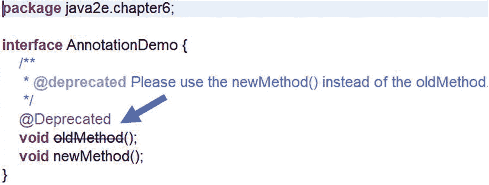
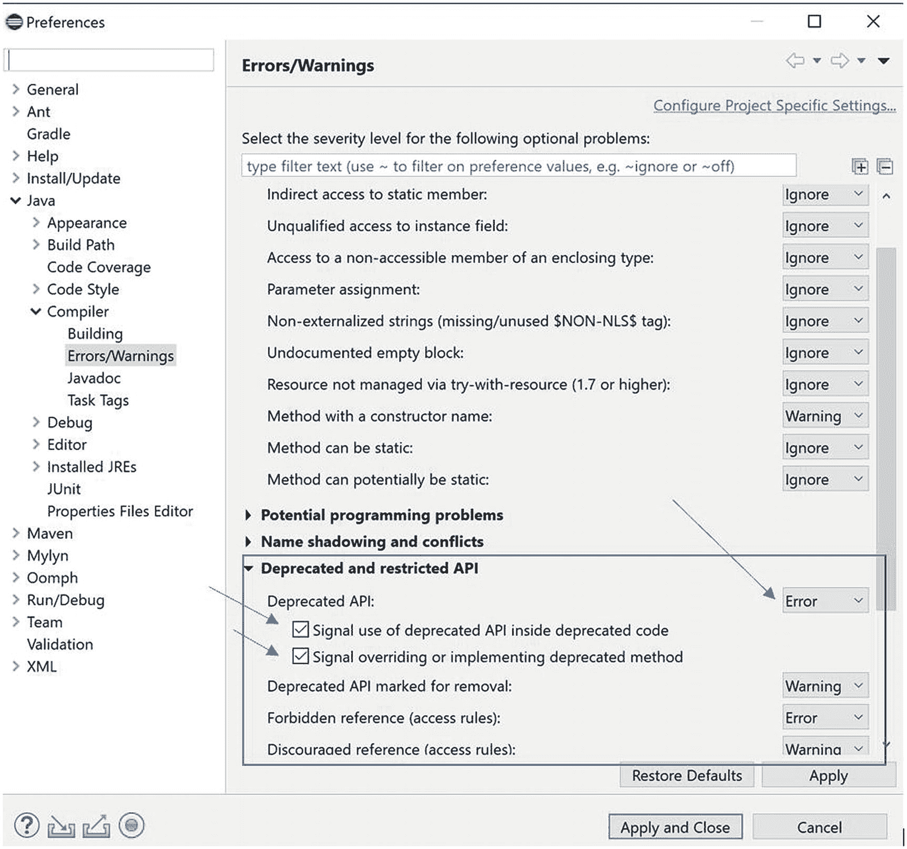
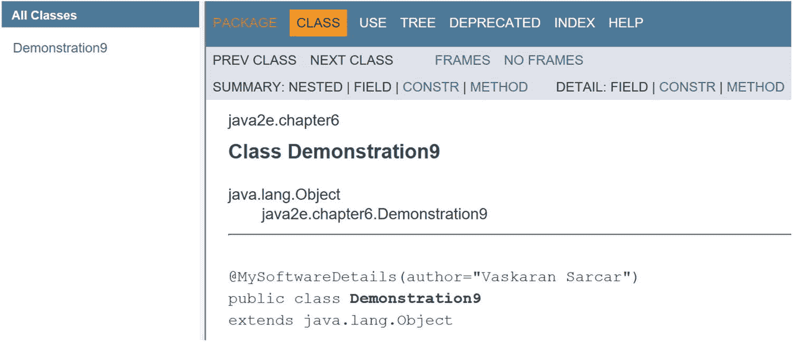
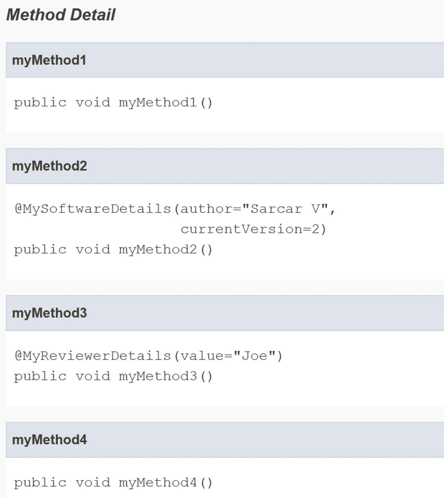

# 6. 抽象类与接口：面向对象编程中的真正艺术

在上一章中，你了解到方法重写可以帮助你实现运行时多态。在本章中，你将通过两种强大的技术——抽象类和接口——进一步探索这一概念。除此之外，你还将学习接口如何帮助你在 Java 中实现多重继承的概念。一旦掌握了这些概念，你就可以让你的程序变得超级灵活。让我们从抽象类开始。

## 抽象类

有时你开始一项工作，但可能没有完成，然后你期望其他人会继续完成未完成的工作。在购买房产和翻新房屋的情况下，可以看到一个现实生活中的例子。例如，你可能注意到祖父母购买了一块地产，然后父母在那块地上建造了一栋房子，后来孙辈又把房子扩建或重新装修了旧房子。基本思想是一样的：你可能希望有人继续并完成未完成的工作。你给予他们自由，以便在完成后他们可以根据自己的需求改造现有的架构。抽象类的概念最适合编程世界中的类似场景。

这些是不完整的类，你不能从中实例化对象。抽象类的派生类需要首先完成“不完整部分”。它也可以重新定义父类的方法（通过重写）。

通常，如果一个类至少包含一个不完整的方法（在编程术语中，一个抽象方法），那么这个类本身就是一个抽象类。术语*抽象方法*告诉你，该方法有声明（或签名）但没有实现。换句话说，你可以将抽象成员视为没有默认实现的虚拟成员。

### 记住要点

一个至少包含一个抽象方法的类必须被标记为抽象类。

子类必须完成未完成的任务；也就是说，子类需要为抽象方法提供完整的方法体，但如果它未能提供，子类本身将被标记为另一个抽象类。

当超类想要定义一个将被其子类共享的通用形式时，这种编码非常有用。它只是将填充细节的责任传递给其子类。

让我们从一个简单的演示开始。

### 演示 1

在下面的程序中，类 `MyAbstractClass` 是一个抽象类，因为它有一个抽象方法 `showMe()`。

`MyConcreteClass` 是 `MyAbstractClass` 的派生类，并提供了方法 `showMe()` 的完整实现。因此，`MyConcreteClass` 不是抽象的。

```
package java2e.chapter6;
abstract class MyAbstractClass {
public abstract void showMe();
}
class MyConcreteClass extends MyAbstractClass {
@Override
public void showMe() {
System.out.println("MyConcreteClass.showMe()");
System.out.println("I am supplying the method body for showMe()");
}
}
class Demonstration1 {
public static void main(String Args[]) {
System.out.println("***Demonstration-1.Abstract class example.***\n");
// 错误：无法从 MyAbstractClass 实例化
//MyAbstractClass abstractOb=new MyAbstractClass();
MyConcreteClass concreteOb = new MyConcreteClass();
concreteOb.showMe();
}
}
```

输出：

```
***Demonstration-1.Abstract class example.***
MyConcreteClass.showMe()
I am supplying the method body for showMe()
```

需要注意的是，抽象类也可以包含具体方法。派生类可以选择重写或不重写这些方法。让我们在演示 2 中检查这一点。

### 演示 2

在这个程序中，类 `AbstractClass` 是一个抽象类，因为它有一个抽象方法 `showMe()`。但这个类也包含两个具体方法：`completeMethod1()` 和 `completeMethod2()`。

`ConcreteClass` 是 `AbstractClass` 的派生类，并提供了方法 `showMe()` 的完整实现。因此，`ConcreteClass` 不是抽象的。遵循继承层次结构，它可以访问其他父类方法——`completeMethod1()` 和 `completeMethod2()`。但它修改了父类方法 `completeMethod1()` 并提供了自己的实现。

最后，你可能会注意到 `AbstractClass` 中存在整型变量 `myInt`。这个字段在 `ConcreteClass` 的方法 `showMe()` 中被访问。

```
package java2e.chapter6;
abstract class AbstractClass {
protected int myInt = 25;
public abstract void showMe();
public void completeMethod1() {
System.out.println("I am from completeMethod1 in MyAbstractClass and I am complete.");
}
public void completeMethod2() {
System.out.println("I'm the initial version of completeMethod2() in MyAbstractClass.I am complete.");
}
}
class ConcreteClass extends AbstractClass {
@Override
public void showMe() {
System.out.println("ConcreteClass-showMe().I'm complete.");
System.out.println("The value of myInt is:" + myInt);
}
@Override
// 它想要重写 MyAbstractClass 中的 completeMethod1()
public void completeMethod1() {
System.out.println("ConcreteClass-completeMethod1().");
}
}
class Demonstration2 {
public static void main(String Args[]) {
System.out.println("***Demonstration-2.Abstract classes can have concrete methods and fields.***\n");
ConcreteClass concreteOb = new ConcreteClass();
concreteOb.showMe();
// 这将显示 completeMethod1 在 ConcreteClass 中被重新定义。
concreteOb.completeMethod1();
// 这将显示在 AbstractClass 中定义的 completeMethod2 的详细信息。
concreteOb.completeMethod2();
System.out.println("\n**现在通过父类引用调用方法。**");
AbstractClass abstractRef = new ConcreteClass();
abstractRef.showMe();
abstractRef.completeMethod1();
abstractRef.completeMethod2();
}
}
```

输出：

```
***Demonstration-2.Abstract classes can have concrete methods and fields.***
ConcreteClass-showMe().I'm complete.
The value of myInt is:25
ConcreteClass-completeMethod1().
I'm the initial version of completeMethod2() in MyAbstractClass.I am complete.
**现在通过父类引用调用方法。**
ConcreteClass-showMe().I'm complete.
The value of myInt is:25
ConcreteClass-completeMethod1().
I'm the initial version of completeMethod2() in MyAbstractClass.I am complete.
```

在第 5 章中，你了解到父类引用可以指向子类对象。遵循同样的规则，你可以使用抽象类引用来指向完整的子类对象，然后调用相关的方法。请记住，你可以从这种编码中获得显著的好处。


### 问答环节

**6.1 如何在此处实现运行时多态的概念？**

你在前面的示例中已经看到过。请注意以下代码片段：

```
System.out.println("\n*** 现在通过父类引用来调用方法。***");
AbstractClass abstractRef = new ConcreteClass();
abstractRef.showMe();
abstractRef.completeMethod1();
abstractRef.completeMethod2();
```

**6.2 抽象类可以包含字段吗？**

可以。在前面的示例中，你看到了这样一个字段，即 `myInt`。

**6.3 在前面的示例中，访问修饰符是 protected。这是强制性的吗？**

不是。你也可以使用其他类型的修饰符；例如，你可以将 `protected` 修饰符替换为 `public` 修饰符。稍后你将了解到，抽象类中存在不同的访问修饰符可以为你提供更好的灵活性。它还可以使抽象类与接口有所区别。

**6.4 假设在一个类中，我有超过十个方法，其中只有一个方法是抽象方法。我是否需要将该类标记为** `abstract` **？**

是的。如果一个类至少包含一个抽象方法，那么这个类本身就是抽象的。你可以简单地认识到，`abstract` 关键字在某种意义上用于表示不完整性。因此，如果你的类包含一个不完整的方法，那么这个类就是不完整的，因此需要用关键字 `abstract` 进行标记。

所以，简单的公式是：只要你的类至少有一个抽象方法，该类就是抽象类。

**6.5 现在考虑一个相反的场景。假设你已经用** `abstract` **关键字标记了你的类，但其中没有抽象方法，如下所示：**

```
abstract class AbstractClassQuiz1 {
public void completeMethod1() {
System.out.println("completeMethod-1");
}
public void completeMethod2() {
System.out.println("completeMethod-2.");
}
}
```

**你能编译这段程序吗？**

可以。它会编译通过，但你必须记住，你不能为这个类创建对象。所以，如果你像这样编写代码：

```
AbstractClassQuiz1 absRef = new AbstractClassQuiz1 ();//错误
```

编译器会提出警告（见图 6-1）。


图 6-1

你不能创建抽象类的实例

### 注意

抽象类不一定只能包含抽象方法。

**6.6 如何从抽象类创建对象？**

你不能从抽象类创建对象。

**6.7 在我看来，如果一个抽象类没有被继承，它实际上就没有用处。这样说对吗？**

对。

**6.8 如果一个类继承了抽象类，它必须实现所有抽象方法。这样说对吗？**

简单的公式是，如果你想在一个类中创建对象，那么这个类必须是完整的；也就是说，它不应该包含任何抽象方法。因此，如果子类无法提供所有抽象方法的实现（即完整的方法体），它应该再次用关键字 `abstract` 标记自己，如下例所示：

```
abstract class AbstractClass
{
public abstract void inCompleteMethod1();
public abstract void inCompleteMethod2();
}
abstract class child1 extends AbstractClass
{
//这里我们的子类只实现了其中一个抽象方法。//但它没有完成另一个。
//所以，这个类又是抽象的。
@Override
public void inCompleteMethod1()
{
System.out.println("实现 inCompleteMethod1()");
}
}
```

在这种情况下，如果你忘记使用关键字 `abstract`，编译器会报错，提示 `ChildClass` 没有实现 `InCompleteMethod2()`，如图 6-2 所示。


图 6-2

具体类不能包含抽象方法

**6.9 我可以说具体类就是非抽象类。这样说对吗？**

对。

**6.10 有时我对关键字的顺序感到困惑；例如，在前面的例子中，你使用了：**

```
public abstract void inCompleteMethod1();
```

**这是遵循特定的顺序吗？**

方法必须有一个返回类型，并且它应该位于你的方法名之前。所以，如果你能记住这个概念，你就永远不会写出像 `public void abstract inCompleteMethod1();` 这样的代码，这在 Java 中是不正确的。在 Eclipse 中，你会得到如图 6-3 所示的错误信息：


图 6-3

Eclipse 编辑器中显示错误信息的输出截图

**6.11 你能同时用** `abstract` **和** `final` **这两个关键字来标记一个方法吗？**

不能。这就像你说你想探索 Java，但又不查阅任何参考资料。类似地，通过声明为 abstract，你想在派生类之间共享一些公共信息，并且你同意它们必须进行重写；也就是说，继承链需要增长。但与此同时，通过声明为 final，你想为派生过程设置一个终点标记，使得继承链无法再增长。你是在试图同时实现两个相反的概念。

**6.12 你能编译以下代码吗？**

```
class Test2 {
// 构造方法不能是 final/abstract/static
abstract Test2() { //错误
System.out.println("抽象构造方法？这可能吗？");
}
}
```

答案：

不能。你会遇到一个编译时错误（图 6-4）。


图 6-4

构造方法不能是抽象的

**6.13 为什么构造方法不能是抽象的？**

你通常将关键字 `abstract` 与类一起使用，以表明它是不完整的，子类将负责使其完整。但是，你也知道构造方法不能被重写。此外，如果你分析构造方法的实际目的（即初始化对象），你必须同意，既然你不能从抽象类创建对象，那么这种设计在这里是完美契合的。

**6.14 你能预测以下代码片段的输出吗？**


```
package java2e.chapter6;
abstract class IncompleteClass {
public abstract void showMe();
}
class CompleteClass extends IncompleteClass {
private void showMe() {
System.out.println("I am complete.");
System.out.println("I supplied the method body for showMe().");
}
}
class Quiz2 {
public static void main(String[] args) {
System.out.println("***Quiz2: Experiment with access specifiers***\n");
IncompleteClass myRef = new CompleteClass();
myRef.showMe();
}
}
```

输出结果是一个编译时错误，如图 6-5 所示。


图 6-5

不能降低继承方法的可见性

出现此错误是因为你不能在派生类方法中降低可见性。因此，在这种情况下，你需要在 `CompleteClass` 中使用 `public` 访问修饰符，而不是 `private` 访问修饰符。然后，你将得到以下输出：

```
***Quiz2 : Experiment with access specifiers***
I am complete.
I supplied the method body for showMe().
```

Java 语言规范（Java SE 11）说明如下：

*   覆盖或隐藏方法的访问修饰符必须提供至少与被覆盖或隐藏方法本身相同的访问权限，具体如下：
    *   *如果被覆盖或隐藏的方法是 public，那么覆盖或隐藏的方法必须是 public；否则，会发生编译时错误。*

*   *如果被覆盖或隐藏的方法是 protected，那么覆盖或隐藏的方法必须是 protected 或 public；否则，会发生编译时错误。*

*   *如果被覆盖或隐藏的方法具有包访问权限，那么覆盖或隐藏的方法不能是 private；否则，会发生编译时错误。*

另外，从另一个角度思考。如果允许编译前面的代码片段，你可能会尝试编写如下代码：

```
IncompleteClass myRef = new CompleteClass();
myRef.showMe();
```

在这种情况下，你试图从派生类调用一个 private 方法，这将破坏 `private` 修饰符的实际目的。

## 接口

接口是 Java 中的一种特殊类型。接口包含方法签名，用于定义一些规范。子类型需要遵循这些规范。使用接口时，你可能会发现它与抽象类有许多相似之处。

通过接口，你声明了*要*实现的内容，但并未指定*如何*实现。接口与类类似，但有一些主要区别。例如，接口中的所有方法都声明为没有方法体（即方法实际上是抽象的）。此外，接口只能包含 final 字段。关键字 `interface` 用于声明接口类型；其后跟接口名称，如下所示：

```
interface MyInterface{
// 一些代码
}
```

### 要点

*   简单来说，接口帮助我们分离“做什么”和“怎么做”。

*   要声明它们，你需要使用 `interface` 关键字。

*   它是一种引用类型，其成员可以是类、接口、常量和方法。

*   通常，接口方法没有方法体（换句话说，它们是抽象方法）。你只需用分号替换方法体，如下所示：

*   从 Java 8 开始，你可以在预期的方法签名前加上 `default` 关键字，并提供默认实现。我将在后面讨论这一点。

*   一个 Java 类不能有多个父类（或超类），但可以实现多个接口。这样，它就在 Java 中支持了多重继承的概念。

*   通常，在定义接口时，你遵循与类类似的语法；例如：

```
void someMethod();
```

```
interface MyInterface{..}
```

### 注意

基本上，你可能需要处理以下任何一种情况：简单接口、嵌套接口和注解类型。在本章中，讨论将仅从简单接口开始。

借助接口，你可以在运行时支持动态方法解析。一旦定义，一个类可以实现任意数量的接口。

### 演示 3

让我们来看一个接口的实际应用：

```
package java2e.chapter6;
interface MyInterface {
void implementMe();
}
class MyClass implements MyInterface {
public void implementMe() {
System.out.println("MyClass is implementing the interface method implementMe().");
}
}
class Demonstration3 {
public static void main(String[] args) {
System.out.println("***Demonstration-3.Exploring Interfaces.***\n");
MyClass myClassOb = new MyClass();
myClassOb.implementMe();
}
}
```

输出：

```
***Demonstration-3.Exploring Interfaces.***
MyClass is implementing the interface method implementMe().
```

### 问答环节

**6.15 如果这些方法是不完整的，那么使用该接口的类需要实现接口中的所有方法。这样理解对吗？**

完全正确。如果该类无法实现所有方法，它将通过将自身标记为 abstract 来声明其不完整性。下面的示例将帮助你更好地理解这一点。

这里，接口 `MyInterface` 有两个方法：`show1()` 和 `show2()`。但类 `MyClass` 只实现了一个。结果，`MyClass` 本身变成了一个抽象类。

```
interface MyInterface{
void show1();
void show2();
}
//MyClass 变成抽象类。它没有实现 MyInterface 的 show2()
abstract class MyClass implements MyInterface
{
@Override
public void show1() {
System.out.println("MyClass is implementing the interface method show1 ().");
}
// public abstract void show2();
}
```

一个类需要实现接口中定义的所有方法；否则，它将是一个抽象类。

如果你忘记实现 `show2()`，并且没有用 `abstract` 关键字标记你的类，如下所示：

```
class MyClass implements MyInterface
{
@Override
public void show1() {
System.out.println("MyClass is implementing the interface method show1().");
}
// public abstract void show2();
}
```

你将在 Eclipse 中看到以下编译错误（图 6-6）。


图 6-6

一个类需要实现接口中定义的所有方法；否则，它是一个抽象类

**6.16 在前面的场景中，**`MyClass` **的一个子类可以通过仅实现** `show2()` **来完成任务。这样理解对吗？**

正确。演示 4 为你展示了一个完整的实现。


### 演示 4

在以下演示中，类 `MyClass` 仅实现了 `MyInterface` 接口的 `show1()` 方法。由于它没有实现另一个方法 `show2()`，因此它成为了一个抽象类。

类 `MySubClass` 是 `MyClass` 的派生类。该类实现了 `show2()` 方法。因此，遵循继承层次结构，`MySubclass` 的对象可以调用两个方法——`show1()` 和 `show2()`*。*

```
package chapter6.testcodes;
interface MyInterface{
void show1();
void show2();
}
//MyClass 变为抽象类。它没有实现 MyInterface 的 show2() 方法
//class MyClass implements MyInterface //错误
abstract class MyClass implements MyInterface
{
@Override
public void show1() {
System.out.println("MyClass 正在实现接口方法 show1()。");
}
// public abstract void show2();
}
class MySubClass extends MyClass
{
@Override
public void show2() {
System.out.println("MySubClass 正在实现接口方法 show2()。");
}
}
class Test4 {
public static void main(String[] args) {
System.out.println("***Test4.探索接口。***\n");
//MyClass myClassOb = new MyClass();//错误：MyClass 现在是抽象类
MyInterface myOb = new MySubClass();
myOb.show1();
myOb.show2();
}
}
```

输出：

```
***Test4.探索接口。***
MyClass 正在实现接口方法 show1()。
MySubClass 正在实现接口方法 show2()。
```

### 问答环节

**6.17 你之前说过，接口可以帮助我们实现多重继承的概念。我们的类可以实现两个或更多接口吗？**

是的。下面的演示将向你展示如何实现这一点。

### 演示 5

在以下演示中，类 `MyClass5` 实现了 `MyInterface5A` 的 `show5A()` 方法和 `MyInterface5B` 的 `show5B()` 方法。

```
package java2e.chapter6;
interface MyInterface5A {
void show5A();
}
interface MyInterface5B {
void show5B();
}
```

当你的类实现多个接口时，接口名称之间用逗号分隔，如下所示：

```
class MyClass5 implements MyInterface5A, MyInterface5B {
@Override
public void show5A() {
System.out.println("在 MyClass5 内部，show5A() 已完成。");
}
@Override
public void show5B() {
System.out.println("在 MyClass5 内部，show5B() 已完成。");
}
}
class Demonstration5 {
public static void main(String[] args) {
System.out.println("***演示-5.多个接口的实现。***\n");
MyClass5 myClassOb = new MyClass5();
myClassOb.show5A();
myClassOb.show5B();
}
}
```

输出：

```
***演示-5.多个接口的实现。***
在 MyClass5 内部，show5A() 已完成。
在 MyClass5 内部，show5B() 已完成。
```

### 问答环节

**6.18 在前面的程序中，不同接口中的方法名称不同。但如果两个接口的方法名称相同，你该如何实现它们？**

问得好。实现这些接口的类可以提供一种共同的实现。演示 6 为你提供了这样一种实现。

### 演示 6

让我们仔细阅读以下实现，并参考附带的注释来帮助理解。

```
package java2e.chapter6;
//注意：两个接口都有相同的方法名 "show()"。
interface MyInterface6A {
void show();
}
interface MyInterface6B {
void show();
}
class MyClass6 implements MyInterface6A, MyInterface6B {
@Override
public void show() {
System.out.println("MyClass6 正在完成 show() 方法。");
}
}
class Demonstration6 {
public static void main(String[] args) {
System.out.println("***演示-6.探索多个接口\n");
// 以下所有调用方式都是正确的。
// 方式-1
MyClass6 myClassOb = new MyClass6();
System.out.print("方式-1:");
myClassOb.show();
// 方式-2
System.out.print("方式-2:");
MyInterface6A inter6A = myClassOb;
inter6A.show();
// 方式-3
System.out.print("方式-3:");
MyInterface6B inter6B = myClassOb;
inter6B.show();
// 方式-4
System.out.print("方式-4:");
((MyInterface6A) myClassOb).show();
// 方式-5
System.out.print("方式-5:");
((MyInterface6B) myClassOb).show();
}
}
```

输出：

```
***演示-6.探索多个接口
方式-1:MyClass6 正在完成 show() 方法。
方式-2:MyClass6 正在完成 show() 方法。
方式-3:MyClass6 正在完成 show() 方法。
方式-4:MyClass6 正在完成 show() 方法。
方式-5:MyClass6 正在完成 show() 方法。
```

### 注意

在 C# 中，存在显式接口的概念，可以在类似情况下使用。但到目前为止，Java 还没有直接支持类似的机制。

### 问答环节

**6.19 一个接口可以继承或实现另一个接口吗？**

它可以继承，但不能实现（根据定义）。请考虑以下示例。

### 演示 7

这里有三个接口：`Interface7A`、`Interface7B` 和 `Interface7C`。`Interface7A` 和 `Interface7B` 都是 `Interface7C` 的父接口。这些接口中的每一个都有自己的方法。当类 `MyClass7` 实现 `Interface7C` 时，它需要实现来自其直接父接口（`Interface7C`）以及其祖父接口（`Interface7A`、`Interface7B`）的所有方法。

```
package java2e.chapter6;
interface Interface7A {
void showInterface7AMethod();
}
interface Interface7B {
void showInterface7BMethod();
}
//接口继承另一个接口
interface Interface7C extends Interface7A, Interface7B {
void showInterface7CMethod();
}
class MyClass7 implements Interface7C {
// 现在 MyClass7 需要实现来自 Interface1、
//Interface2 和 Interface3 的方法
@Override
public void showInterface7AMethod() {
System.out.println("MyClass7 已实现 showInterface7AMethod() 方法。");
}
@Override
public void showInterface7BMethod() {
System.out.println("showInterface7BMethod() 方法由 MyClass7 实现。");
}
@Override
public void showInterface7CMethod() {
System.out.println("MyClass7 已完成 showInterface7CMethod() 方法。");
}
}
class Demonstration7 {
public static void main(String[] args) {
System.out.println("***演示-7.接口可以扩展其他接口\n");
//创建一个 MyClass7 对象
MyClass7 myClassOb = new MyClass7();
Interface7A inter7A = myClassOb;
inter7A.showInterface7AMethod();
Interface7B inter7B = myClassOb;
inter7B.showInterface7BMethod();
Interface7C inter7C = myClassOb;
inter7C.showInterface7CMethod();
//通过 myClassOb 直接调用。
System.out.println("\n**现在通过 MyClass 对象直接调用方法。**\n");
myClassOb.showInterface7AMethod();
myClassOb.showInterface7BMethod();
myClassOb.showInterface7CMethod();
}
}
```

输出：

```
***演示-7.接口可以扩展其他接口
MyClass7 已实现 showInterface7AMethod() 方法。
showInterface7BMethod() 方法由 MyClass7 实现。
MyClass7 已完成 showInterface7CMethod() 方法。
**现在通过 MyClass 对象直接调用方法。**
MyClass7 已实现 showInterface7AMethod() 方法。
showInterface7BMethod() 方法由 MyClass7 实现。
MyClass7 已完成 showInterface7CMethod() 方法。
```

当一个类继承自另一个类并实现多个接口时，你需要遵循以下格式，该格式规定 `extends` 必须出现在 `implements` 之前。如果你颠倒顺序，将会出现编译时错误。

```
class MyClass7B extends AnotherClass implements Interface7A,Interface7B{
@Override
public void showInterface7AMethod() {
// 一些代码
}
@Override
public void showInterface7BMethod() {
// 一些代码
}
}
```

### 要点总结

*   一个接口可以扩展多个接口。

*   一个类不能从多个父类继承，但它可以实现多个接口。


### 问答环节

**6.20 能否同时继承一个类并实现一个接口？**

可以。你始终可以继承一个类（前提是该类未被声明为 final 或没有其他类似限制）。在这种情况下，你需要遵循如下所示的*位置标记法*：

```
class ChildClass extends ParentClass implements Interface1,Interface2{...}
```

**6.21 在上述场景中，关键字** `extends` **出现在关键字** `implements` **之前是否有特定原因？**

这里你只是遵循了推荐的 Java 编码规范。尽早指出错误（如果有的话）始终是一个更好的做法。遵循这种设计，编译器会先了解父类，并能指出父类中的任何编译错误。（你还记得父类构造函数会在派生类构造函数之前被调用吗？）但如果允许你将关键字 `extends` 放在 `implements` 之间，编译时间可能会增加。

此外，在这种情况下，你只能继承一个父类，但可以实现任意数量的接口，因此从编译器的角度来看，它可能希望在实现新方法之前先确认你类中已有的方法（或字段）。

## 标记接口

空接口被称为标记接口或标签接口。以下是一个示例（注意其中没有方法）：

```
//标记接口示例
interface MyMarkerInterface{
}
```

标记接口的一些关键用途如下：

*   你可以创建一个公共父类。（当你拥有一个公共父类时，可以使用超类型引用来指向子类型对象，这有助于实现运行时多态性。）

*   一个类可以声明自己属于某个集合；例如，如果你的类实现了 `Serializable` 接口，它就变得可序列化。因此，你的类实际上通过多态性成为了一个接口类型。即使实现标签接口的类也无需定义任何新方法，因为该接口本身没有任何方法。

    **注意** `java.lang.Cloneable` 和 `java.io.Serializable` 接口是 Java 中标记接口的示例。

## 注解快速入门

在标记接口的上下文中，你还应该了解注解。对注解的详细讨论超出了本书的范围，但在以下部分中，你将获得一个快速概述，主要涵盖什么是注解以及如何在程序中有效使用它。

JDK5 引入了注解的概念。JLS 11 指出：“注解是一种标记，它将信息与程序构造相关联，但在运行时没有影响。”注解比标记接口更流行。它们对编译后的程序没有直接影响。注解只是提供一些附加信息，可以作为标记接口的替代方案。这些注解对编译器或你的软件工具有用，可用于检测错误、抑制警告消息、生成 XML 文件等。其中一些信息可以在程序执行期间使用。最初，注解用于声明目的，但 JDK8 为注解类型的使用增加了更多灵活性。

你会注意到注解以 `@`**开头。** 最简单的注解形式是 `@MyAnnotation`。例如，你已经在某些程序中使用过内置注解 `@Override`。这里，注解名称是 `Override`。在其最简单的形式中，注解不包含任何元素，在这种情况下，它被称为**标记注解**。因此，`@Override` 是标记注解的一个示例。`@Deprecated`、`@SuppressWarning` 和 `@Override` 是 `java.lang` 中预构建的注解。

### 演示 8

要标记一个已弃用的方法，你可以像下面这样使用 `@Deprecated`。为了向你展示 Eclipse 中的视觉效果，请注意图 6-7 中带有删除线的接口方法——`oldMethod()`。



图 6-7

Eclipse IDE 中已弃用方法的快照

现在，来看一个使用不同注解的示例演示。

```
package java2e.chapter6;
interface AnnotationDemo {
/**
* @deprecated 请使用 newMethod() 代替 oldMethod。
*/
@Deprecated
void oldMethod();
void newMethod();
}
class MyClass8 implements AnnotationDemo {
@Override
public void oldMethod() {
System.out.println("oldMethod() 正在执行。");
}
@Override
public void newMethod() {
System.out.println("建议使用此更新后的方法 - newMethod()。");
}
}
```

你可以看到因使用已弃用方法而产生的警告消息。你始终可以更改 IDE 设置。例如，如果你希望看到错误消息，请选择“错误”选项而不是“警告”，如图 6-8 所示。我对默认设置进行了一些额外更改。所有这些更改仅供参考。



图 6-8

Eclipse IDE 中演示已弃用方法用法的快照

### 注意

你也可以使用 `@Deprecated` 在 Javadoc 中标记已弃用的元素。根据建议的指南，此标签后应跟一个换行符或空格。你还应解释为什么将其标记为已弃用元素以及推荐的替代方案是什么。

注解可以应用于其他注解，在这种情况下，它们被称为**元注解**。`@Retention`、`@Documented`、`@Target` 和 `@Inherited` 是定义在 `java.lang.Annotation` 中的元注解示例。

简而言之，通过使用注解，你可以向源代码添加一些元数据信息。为了清楚理解注解的用途，让我们看一个示例。假设你是一名软件开发人员，每次编写方法或类时都会添加以下注释：

```
//作者 Sarcar V
//当前版本：修订号，例如 1
```

但如果你熟悉注解，你可能会从类似下面的内容开始。在这种情况下，我提供了一些默认值，这对你来说是可选的。

```
@interface SoftwareDetails{
String author() default "Sarcar V";
int currentVersion() default 1;
}
```

请注意，默认情况下，`author` 是 *Sarcar V*，`currentVersion` 是 1。一旦定义，你可以像下面这样在方法中使用此注解：

```
@SoftwareDetails(author="Vaskaran", currentVersion=2)
public void myMethod2() {
System.out.println("方法-2");
}
```

在这种情况下，作者是 *Vaskaran*，`currentVersion` 是 2。类似地，你可以将注解应用于类。

### 注意

注解的应用不仅限于类或方法的声明。你也可以在字段或其他程序元素中使用它们。按照惯例，每个注解应单独占一行。

有一个特殊情况需要考虑。它被称为**单成员注解**。它具有以下特征：

*   它只有一个元素。

*   由于只有一个成员，你可以不指定成员名称，而直接将其命名为 `value()`，如下所示：

```
//单成员注解
@Documented
@interface MyReviewerDetails{
//这是单成员注解。按照惯例，你使用
//名称 value()。
String value();//你需要提供一个审阅者名称。
}
```

现在你可以像下面这样在方法中使用它：

```
@MyReviewerDetails("Joe")
public void myMethod3() {
System.out.println("单成员注解已应用于 myMethod3()");
}
```


### 注意

请注意，在这种情况下，你无需编写 `@MyReviewerDetails(value="Joe")`；相反，你可以直接提供审阅者的名字，例如“Joe”。如果你在单成员注解中选择了除 `value()` 之外的任何其他名称，你将无法获得这种灵活性。

现在来看演示 9，其中不同的方法使用了不同的注解。

### 演示 9

本演示中也使用了一个自定义注解。请参见以下内容：

```
package java2e.chapter6;
import java.lang.annotation.Documented;
//标记注解
@interface MarkerAnnotation {
}
//用户自定义注解
@Documented
@interface MySoftwareDetails{
String author();//你需要提供作者姓名。
int currentVersion() default 1;//你可以提供不同的版本号，这是可选的。
}
//一个单成员用户自定义注解
@Documented
@interface MyReviewerDetails{
//这是一个单成员注解。按照惯例，你使用名称 value()。
String value();//你需要提供审阅者姓名。
}
@MySoftwareDetails(author="Vaskaran Sarcar")
public class Demonstration9 {
@MarkerAnnotation
public void myMethod1() {
System.out.println("该方法中使用了标记注解。");
}
@MySoftwareDetails(author="Sarcar V", currentVersion=2)
public void myMethod2() {
System.out.println("myMethod2() 中使用了自定义注解。");
}
@MyReviewerDetails(value = "Joe")
public void myMethod3() {
System.out.println("myMethod3() 应用了单成员注解。");
}
// 一个没有注解的方法
public void myMethod4() {
System.out.println(" Method4() 未使用任何注解。");
}
}
```

在 Eclipse 中，你可以选择你的项目，然后在 Project 选项卡下找到“Generate Javadoc…”选项。使用此选项，我为 `Demonstration9` 类生成了 Javadoc。JavaDoc 从 Java 源文件生成 HTML 格式的 API 文档。

让我们检查生成文档的部分内容，以了解注解是如何工作的。

### Javadoc 快照

图 6-9 显示了生成的 Javadoc 的一个快照。



图 6-9

一个 Javadoc 快照

在图 6-10 中，你可以看到 `myMethod4()` 没有关联任何信息，因为该方法没有应用任何注解。但是，`myMethod2()` 和 `myMethod3()` 方法以及 `Demonstration9` 类都附加了一些额外信息。你可能还会注意到 `@Documented` 注解的使用。它使得 Javadoc 能够在生成的文档中包含注解类型信息。



图 6-10

一个 Javadoc 快照

因此，在本节中，你已经涵盖了所有三种类型的注解：即标记注解、普通注解和单成员注解。

### 问答环节

**6.22 抽象类与接口有何不同？**

*   抽象类可以包含具体方法，但接口不能。我稍后会详细说明这一点。从 Java 8 开始，你可以使用一个名为 `default` 的关键字。你可以在接口中使用此关键字来提供一些默认实现。

*   抽象类只能有一个父类（可以继承自另一个抽象类或具体类），而接口可以有多个父接口。接口只能继承自另一个接口。

*   接口的成员默认是 public 的。抽象类可以具有其他访问修饰符，例如 private、protected 等。

*   接口中的变量默认是 static final 的。抽象类既可以有非 final 变量，也可以有 final 变量。

**6.23 如何决定应该使用抽象类还是接口？**

我认为，如果你希望拥有某种集中式或默认的行为，抽象类是更好的选择，因为你可以提供一些默认实现。另一方面，接口的实现是从零开始的。它指示了关于*做什么*而非*怎么做*的一些规则。此外，当你试图实现多重继承的概念时，接口是首选。

但同时，你知道，如果你需要在接口中添加一个新方法，那么你需要找到该接口的所有实现，并在所有这些地方为该方法提供具体的实现。抽象类在这方面更胜一筹——你可以在抽象类中添加一个带有默认实现的新方法，而我们现有的代码可以平稳运行。

因此，现在 Java 特别关注了最后一点：Java 8 引入了 `default` 关键字的使用。所以，现在你可以在你期望的方法签名前添加 `default` 这个词，它就可以提供一个默认实现。接口方法默认是 public 的，因此你不需要用 `public` 关键字来标记它。Oracle Java 在线文档（[`https://docs.oracle.com/javase/tutorial/java/IandI/abstract.html`](https://docs.oracle.com/javase/tutorial/java/IandI/abstract.html)）简要总结了以下几点：

在以下场景中，我们应该优先选择抽象类：

*   我们希望多个紧密相关的类之间共享代码。
*   我们期望扩展我们抽象类的类可能有许多共同的方法或字段，或者它们内部可能需要非 public 的访问修饰符。
*   我们想使用非 static 或/和非 final 字段，这使我们能够定义可以访问和修改它们所属对象状态的方法。

另一方面，在以下场景中，我们应该优先选择接口：

*   你期望几个不相关的类将要实现你的接口；例如，comparable 接口可以被许多不相关的类实现。
*   我们想要指定特定数据类型的行为，但不关心实现者。
*   我们希望在应用程序中使用类型层面的多重继承概念。

## 接口中的默认方法

在 Java 8 之前的版本中，接口只能包含抽象方法；换句话说，接口方法只能有声明，不能有任何方法体或实现。但从 Java 8 开始，你可以在接口中拥有带方法体的方法，但该方法前面必须加上 `default` 关键字**。**


### 演示 10

在演示 10 中，你将看到 `interface10` 是一个包含两个方法的接口——`traditionalInterfaceMethod()` 和 `defaultMethod()`。第一个方法是传统的接口方法，没有方法体；而第二个方法有方法体，但其方法签名前带有 `default` 关键字。

`MyClass10` 实现了这个接口，并为 `traditionalInterfaceMethod()` 方法提供了方法体。`MyClass10` 中用于覆盖 `defaultMethod()` 的方法被注释掉了，这是为了向你展示，你仍然可以成功编译并运行此程序。

```
package java2e.chapter6;
interface Interface10 {
// 传统的接口方法，没有方法体。
void traditionalInterfaceMethod();
// 从 Java 8 开始：
// 接口中的默认方法。
// 它可以有方法体。
default void defaultMethod() {
System.out.println("这是接口 Interface10 中的默认实现。");
}
}
class MyClass10 implements Interface10 {
@Override
public void traditionalInterfaceMethod() {
System.out.println("MyClass10 正在实现接口方法 traditionalInterfaceMethod()");
}
/*
* @Override
* public void defaultMethod() {
* System.out.println("MyClass10 正在覆盖默认的接口方法。");
* }
*/
}
class Demonstration10 {
public static void main(String[] args) {
System.out.println("***演示-10.Java 中默认方法的使用***\n");
Interface10 interfaceOb = new MyClass10();
interfaceOb.traditionalInterfaceMethod();
interfaceOb.defaultMethod();
}
}
```

输出：

```
***演示-10.Java 中默认方法的使用***
MyClass10 正在实现接口方法。
这是接口 Interface10 中的默认实现。
```

你可以看到，`MyClass10` 只实现了 `traditionalInterfaceMethod()` 方法，但程序仍然可以运行，没有任何编译时错误。

### 问答环节

**6.24 我们可以覆盖接口中的默认方法吗？**

是的，可以。取消演示 10 中以下代码段的注释：

```
/*
* @Override
* public void defaultMethod() {
* System.out.println("MyClass10 正在覆盖默认的接口方法。");
* }
*/
```

现在，如果你编译并运行该程序，你将得到以下输出：

```
***演示-10.Java 中默认方法的使用***
MyClass10 正在实现接口方法 traditionalInterfaceMethod()
MyClass10 正在覆盖默认的接口方法。
```

**6.25 使用默认方法，我们不是又回到了菱形问题吗？**

不是。诀窍在于：Java 设置了一个限制，即如果一个类实现了多个接口，而每个接口都有一个同名的默认实现，那么该类需要为这个同名方法提供自己的实现，否则你将收到编译错误。

### 演示 11

在这个演示中，每个接口都有一个名为 `myDefaultMethod()` 的默认方法。现在，`Class11` 实现了两个接口——`DefaultInterface11A` 和 `DefaultInterface11B`。因此，为了避免冲突，它必须为 `myDefaultMethod()` 提供自己的实现，否则你将收到以下编译时错误：

*   `"从类型 DefaultInterface11B 和 DefaultInterface11A 继承了重复的默认方法 myDefaultMethod，其参数为 () 和 ()"`

```
package java2e.chapter6;
interface DefaultInterface11A {
void show();
default void myDefaultMethod() {
System.out.println("调用了接口 3 的默认实现。");
}
}
interface DefaultInterface11B {
void show();
default void myDefaultMethod() {
System.out.println("调用了接口 4 的默认实现。");
}
}
class Class11 implements DefaultInterface11A, DefaultInterface11B {
public void show() {
System.out.println("Class11 正在实现接口方法 show()。");
}
@Override
public void myDefaultMethod() {
System.out.println("Class11 需要实现此方法。");
}
}
class Demonstration11 {
public static void main(String[] args) {
System.out.println("***演示-11.涉及默认方法时避免菱形问题***\n");
System.out.println("使用 DefaultInterface11A 引用：");
DefaultInterface11A interfaceOb11A = new Class11();
interfaceOb11A.show();
interfaceOb11A.myDefaultMethod();
System.out.println("----------------------");
System.out.println("使用 DefaultInterface11B 引用：");
DefaultInterface11B interfaceOb11B = new Class11();
interfaceOb11B.show();
interfaceOb11B.myDefaultMethod();
}
}
```

输出：

```
***演示-11.涉及默认方法时避免菱形问题***
使用 DefaultInterface11A 引用：
Class11 正在实现接口方法 show()。
Class11 需要实现此方法。

使用 DefaultInterface11B 引用：
Class11 正在实现接口方法 show()。
Class11 需要实现此方法。
```

### 问答环节

**6.26 在我看来，前面的程序中根本没有使用接口中的默认方法。有没有办法调用默认的接口方法？**

当然有。你可以将 `Class11` 的 `myDefaultMethod()` 修改如下：

```
@Override
public void myDefaultMethod() {
System.out.println("Class11 需要实现此方法。");
// 为问答 6.26 修改
// 调用 DefaultInterface11A 的默认方法
DefaultInterface11A.super.myDefaultMethod();
// 调用 DefaultInterface11B 的默认方法
DefaultInterface11B.super.myDefaultMethod();
}
```

如果你再次编译并运行该程序，你将得到这个修改后的输出。请注意以下输出中的粗体行。

```
***演示-11.涉及默认方法时避免菱形问题***
使用 DefaultInterface11A 引用：
Class11 正在实现接口方法 show()。
Class11 需要实现此方法。
调用了接口 3 的默认实现。
调用了接口 4 的默认实现。

使用 DefaultInterface11B 引用：
Class11 正在实现接口方法 show()。
Class11 需要实现此方法。
调用了接口 3 的默认实现。
调用了接口 4 的默认实现。
```

**6.27 我们可以将接口声明为 final 吗？**

如果你将接口声明为 final，那么谁来实现该接口中未完成的方法呢？你必须记住，在 Java 8 之前，接口中不支持静态方法（我们稍后会讨论）。所以，基本上，将接口声明为 final 是没有意义的。


### 演示 12

考虑以下声明：

```
final interface MyInterface
{
void show();
}
```

Eclipse 会引发编译时错误：`Illegal modifier for the interface MyInterface; only public & abstract are permitted`（图 6-11）。以下是 Eclipse IDE 的截图。


图 6-11

接口不能是 final 的

**6.28 我可以在 `interface` 方法前使用关键字 `abstract` 吗？**

没有必要这样做，因为默认情况下它们就是抽象的。但编译器不会在这里引发任何问题。

```
interface MyInterface
{
//void show();
//无需提及 abstract
abstract void show();
}
```

**6.29 我可以在接口内部使用常量吗？**

可以。它们默认是 public、static 和 final 的。要测试这一点，你可以尝试以下代码片段。将其保存为 `MyInter.java`。

```
interface MyInter{
int myConstant = 10;
void myMethod();
}
```

首先，使用 `javac` 编译此代码。编译完成后，我们使用 `javap` 再次反编译它。以下是供你直接参考的输出：

```
Compiled from "MyInter.java"
interface MyInter {
public static final int myConstant;
public abstract void myMethod();
}
```

因此，你可以省略这些修饰符。需要注意的是，关于是否应该在接口中使用常量存在激烈争论。双方各有利弊。考虑一个简单的情况：如果你在接口中允许使用常量，那么所有实现类都可以使用该值。但让我们考虑另一种情况：某个实现类需要与其他类完全不同的值，或者根本不需要该值。在这种情况下，接口中的这个常量对于实现类来说是不必要的（或具有误导性的）。

**6.30 我可以让接口继承自一个类吗？**

不可以。类可以包含一些实现。因此，如果你允许接口继承自类，那么接口可能包含实现，这与接口的核心目标相悖。

**6.31 你能总结一下使用接口的好处吗？**

以下是接口的一些重要用例：

*   你可以实现多态
*   你可以实现多重继承的概念
*   你可以开发松散耦合的系统
*   你可以支持并行开发

## 总结

本章回答了以下问题：

*   什么是抽象类？
*   如何使用抽象类实现运行时多态？
*   为什么构造方法不能是抽象的？
*   什么是接口？
*   如何设计接口？
*   接口的基本特征是什么？
*   如何实现多个接口？
*   如何处理具有同名方法的接口？
*   接口有哪些不同类型？
*   什么是标记接口？
*   从注解的快速浏览中你能学到什么？
*   如何在 Java 中使用默认方法，以及在多重继承的上下文中使用默认方法时如何避免菱形问题？
*   抽象类和接口有什么区别？
*   如何决定应该使用抽象类还是接口？
*   使用接口的好处是什么？

