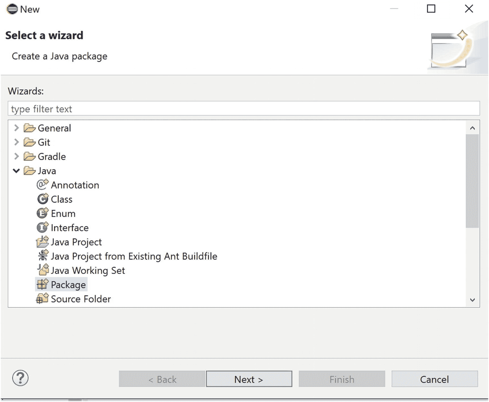
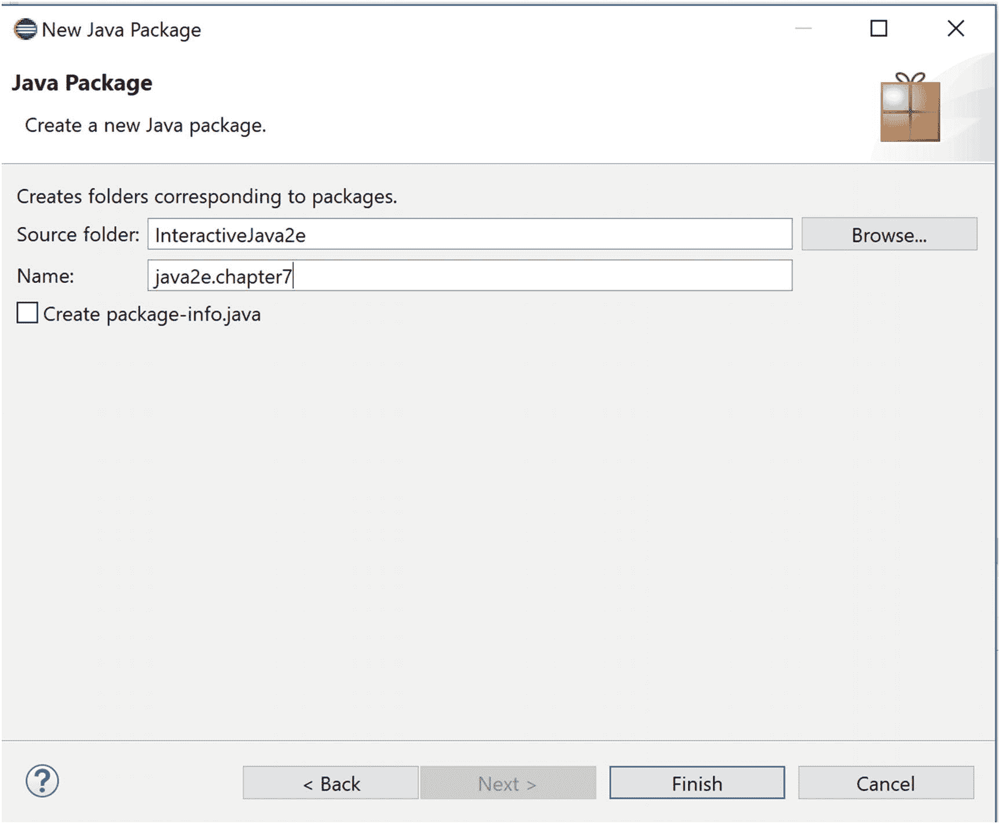
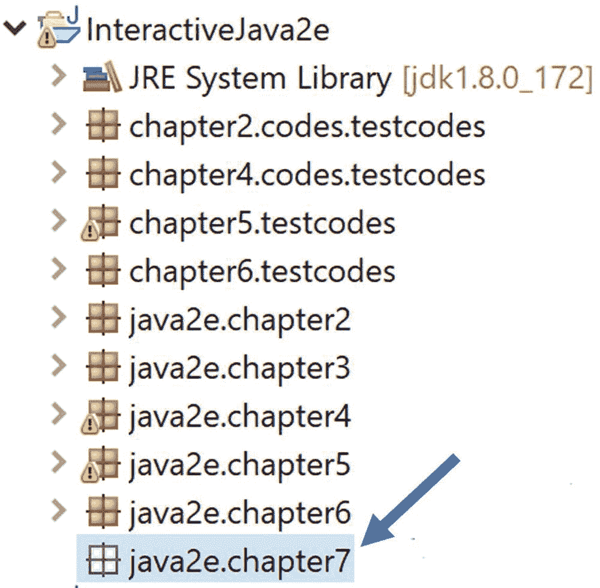
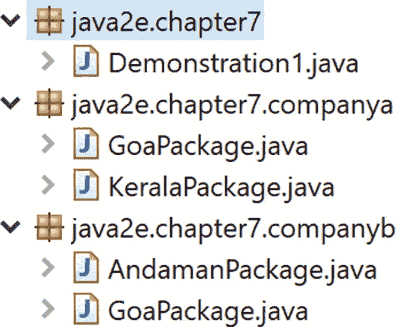
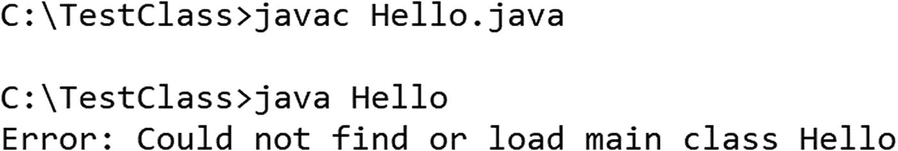

# 7. 包

让我们考虑一个简单的场景。你能在 Java 文件中为不同的类使用相同的名称吗？不能。编译器会引发问题，并指出这种命名冲突。当你定义一个类时，需要遵循唯一的命名约定。在实际编程中，类名应该具有一定意义，并且有可能不同的程序员会选择不唯一的类名。那么显而易见的问题是：你如何处理这种情况？包可以在这些情况下拯救我们。

你可以将你的类或接口捆绑到自己的包中。这种方法有助于避免命名冲突。简单来说，来自两个不同包的两个类可以具有相同的名称。包还可以控制包元素的可见性。因此，是否希望你的类对外部世界公开，由你自己决定。

### 注意

你可以在两个不同的包中拥有两个同名的类，但在同一个包中不能有两个同名的类。JLS11 给出了一个很好的例子：如果有一个名为 `mouse` 的包，并且该包中有一个成员类型 `Button`（那么它可能被称为 `mouse.Button`），则不能有任何完全限定名称为 `mouse.Button` 或 `mouse.Button.Click` 的包。

在 Java 中，目录是包的物理表示。在 Eclipse 中创建包非常容易。你甚至不必担心 Java 运行时将如何找到正确的包或其中的类。但是，你可能需要特别注意 `PATH` 和 `CLASSPATH` 环境变量。在命令行环境中编写第一个 Java 程序之前，这些变量起着重要作用。

在继续之前，请记住以下几点：

*   `package` 语句应位于源文件的顶部。如果你没有显式定义此语句，那么所有类/接口等都将位于当前的默认包中。
*   按照惯例，包名以小写字母开头；例如，一些内置的 Java 包是 `java.lang`、`java.awt`、`java.util`、`java.io` 等。
*   一个包可以包含子包；例如，如果你有一个包 `p`，并且 `q` 是 `p` 的子包并包含一个类，即 `MyClass`，那么你可以使用完全限定名 `p.q.MyClass` 来引用 `MyClass`。因此，包名必须遵循目录结构。
*   当一个类引用同一包内的另一个类时，不需要包含 `package` 语句。否则，你可能需要使用完全限定的类名，例如 `packagename.MyClass`，或者你可能需要使用 `import` 语句。
*   可以按如下方式导入整个包：

*   或者，如果你只想导入一个特定的类——例如，从名为 `mypack` 的包中导入 `MyClass`——请使用类似以下的内容：

```
import packagename.*;
```

*   Java 中的每个类都位于一个包内。有时你可能会看到没有包声明的 Java 源文件。这意味着这些类位于默认包或未命名包中。JLS 11 对未命名包有如下说明：“没有包声明的普通编译单元是未命名包的一部分。Java SE 平台提供未命名包主要是为了方便开发小型或临时应用程序，或刚开始开发时使用。”

```
import mypack.MyClass;
```


## 创建包

在本书中，我使用的是 Eclipse IDE。在 Eclipse 中创建包非常简单。以下是在 Eclipse IDE 中创建包的步骤。

1.  点击文件菜单 ➤ 新建 ➤ 包（参见图 7-1）。

    

    图 7-1

    步骤 1：如何在 Eclipse 编辑器中创建 Java 包

2.  提供所需信息并点击完成（参见图 7-2）。

    

    图 7-2

    步骤 2：如何在 Eclipse 编辑器中创建 Java 包

3.  现在你可以在包资源管理器视图中看到该包。例如，它可能看起来像图 7-3。

    

    图 7-3

    已创建一个空的 Java 包

    **注意** 新创建的包是空的。但快照中的其他包已经包含了一些类。这些包是之前创建的。

4.  现在右键点击包名 ➤ 新建 ➤ 类/包，将类/子包等放入已创建的包中。一旦你在包中放入一个或多个类，它可能看起来类似于下图。例如，在下图中，一个名为 `Demonstration1.java` 的类被放置在 `java2e.chapter7` 包中。而 `java2e.chapter7.companya` 包则包含两个类——`GoaPackage.java` 和 `KeralaPackage.java`。

    

    图 7-4

    Eclipse 编辑器中非空 Java 包的示例包资源管理器视图

### 演示 1

现在，让我们看一个例子。假设有两家旅游公司，**A** 和 **B**。公司 A 提供果阿和喀拉拉邦的旅游服务。公司 B 提供果阿和安达曼的旅游服务。任何游客都可以向他们咨询特定旅游套餐的信息。根据命名规则，在以下示例中，公司 A 使用包 `java2e.chapter7.companya`，公司 B 使用包 `java2e.chapter7.companyb`。你可以参考图 7-4 来理解整体结构。

这里，我涵盖了以下场景：

*   **较简单的情况**：只有公司 A 提供喀拉拉邦的旅游，只有公司 B 提供安达曼的旅游。

*   **较复杂的情况**：注意两家公司都提供果阿旅游，你需要通过各自的 `GoaPackage.java` 类获取价格信息。注意两个包使用了相同的类名。

```
// GoaPackage.java [属于公司 A，位于 java2e.chapter7.companya 包中]
package java2e.chapter7.companya;
public class GoaPackage
{
int basePrice=10000;
public void showPrice()
{
System.out.println("***公司 A 的果阿旅游价格***" );
System.out.println("两人果阿旅游套餐价格为 Rs."+ basePrice*2 );
System.out.println("四人果阿旅游套餐价格为 Rs."+ basePrice*4 );
System.out.println("**************" );
}
}
// KeralaPackage.java [属于公司 A，位于 java2e.chapter7.companya 包中]
package java2e.chapter7.companya;
public class KeralaPackage
{
int basePrice=7000;
public void showPrice()
{
System.out.println("***公司 A 的喀拉拉邦旅游价格***" );
System.out.println("两人喀拉拉邦旅游套餐价格为 Rs."+ basePrice*2 );
System.out.println("四人喀拉拉邦旅游套餐价格为 Rs."+ basePrice*4 );
System.out.println("**************" );
}
}
// AndamanPackage.java [属于公司 B，位于 java2e.chapter7.companyb 包中]
package java2e.chapter7.companyb;
public class AndamanPackage
{
int basePrice=12000;
public void showTariff()
{
System.out.println("***公司 B 的安达曼旅游价格***" );
System.out.println("公司 B：两人安达曼旅游套餐价格为 Rs."+ basePrice*2 );
System.out.println("公司 B：四人安达曼旅游套餐价格为 Rs."+ basePrice*4 );
System.out.println("**************" );
}
}
// GoaPackage.java [属于公司 B，位于 java2e.chapter7.companyb 包中]
package java2e.chapter7.companyb;
public class GoaPackage {
int basic_price = 15000;
int serviceTax = 2000;
public void showTariff() {
int forTwoPerson = basic_price * 2 + serviceTax;
int forFourPerson = basic_price * 4 + serviceTax;
System.out.println("***公司 B 的果阿旅游价格***");
System.out.println("公司 B：两人果阿旅游套餐价格为 Rs." + forTwoPerson);
System.out.println("公司 B：四人果阿旅游套餐价格为 Rs." + forFourPerson);
System.out.println("****************");
}
}
//演示-1
package java2e.chapter7;
import java2e.chapter7.companya.*;
import java2e.chapter7.companyb.*;
/*import java2e.chapter7.companya.GoaPackage;
import java2e.chapter7.companya.KeralaPackage;
import java2e.chapter7.companyb.AndamanPackage;*/
public class Demonstration1 {
public static void main(String[] args) {
System.out.println("***演示-1.探索包。***");
//只有公司 A 有 KeralaPackage
KeralaPackage companyAKeralaPackage=new KeralaPackage();
companyAKeralaPackage.showPrice();
//只有公司 B 有 AndamanPackage
AndamanPackage companyBAndamanPackage=new AndamanPackage();
companyBAndamanPackage.showTariff();
//公司 A 和公司 B 都有果阿旅游套餐。
java2e.chapter7.companya.GoaPackage companyAGoaPackage=new java2e.chapter7.companya.GoaPackage();
companyAGoaPackage.showPrice();
java2e.chapter7.companyb.GoaPackage companyBGoaPackage=new java2e.chapter7.companyb.GoaPackage();
companyBGoaPackage.showTariff();
}
}
```

输出：

```
***演示-1.探索包。***
***公司 A 的喀拉拉邦旅游价格***
两人喀拉拉邦旅游套餐价格为 Rs.14000
四人喀拉拉邦旅游套餐价格为 Rs.28000
**************
***公司 B 的安达曼旅游价格***
公司 B：两人安达曼旅游套餐价格为 Rs.24000
公司 B：四人安达曼旅游套餐价格为 Rs.48000
**************
***公司 A 的果阿旅游价格***
两人果阿旅游套餐价格为 Rs.20000
四人果阿旅游套餐价格为 Rs.40000
**************
***公司 B 的果阿旅游价格***
公司 B：两人果阿旅游套餐价格为 Rs.32000
公司 B：四人果阿旅游套餐价格为 Rs.62000
****************
```

你是否注意到一个有趣的事实？由于 `GoaPackage` 类在两个 Java 包中都存在，你需要在 `main()` 方法中使用完全限定名来引用特定包中的目标类。但对于其他类，如 `KeralaPackage` 或 `AndamanPackage`，则无需使用完全限定名，因为这些类具有唯一的名称。

这个例子也说明了一个事实：如果你使用星号形式导入整个包，即使这些包中包含同名的类，也不会出现编译时错误。但在访问该类时，你需要使用该类的完全限定名。例如，你必须写成 `java2e.chapter7.companya.GoaPackage`，因为 `GoaPackage` 类在两个公司中都存在。

### 注意

我保留了已注释的代码，以展示如何从包中导入特定类，而不是导入整个包。


### 关于 Java 包的关键要点

以下是关于包的一些重要知识点：

*   `java.lang` 包中的所有类都是默认导入的。（问答 7.3 会详细讨论 import 语句。）

*   如果你想重命名包，首先要重命名存放类的目录。

*   应严格遵守包命名约定；例如，如果我们使用 `package a.b.c` 这样的语句，意味着目录 `c` 位于目录 `b` 内部，而目录 `b` 又位于目录 `a` 内部。

*   你可以参考表 7.1 来记忆可见性控制机制。

### 问答环节

**7.1 如果每个类都位于某个包中，那么到目前为止，我怎么能不导入任何包就使用 System.out.print() 呢？**

在 Java 中，`java.lang` 包中的所有类都是默认导入的。这就是为什么你能够使用 `System.out.println()`——`System` 类也位于默认的 `java.lang` 包中。

如果你导入一个包，子包不会被默认导入。例如，假设包 `companya` 中有一个子包 `subpacka`，并且你有以下代码：

```
package java2e.chapter7.companya.subpacka;
public class SubGoaPackage {
int basePrice = 500;
public void showPrice() {
System.out.println("**I am in SubGoaPackage.I need to update myself**");
}
}
```

现在，如果你在演示 1 中没有导入这个子包，以下代码段中的粗体行将导致编译时错误：

```
//子包不会被默认导入。
//需要显式导入该包。
//import java2e.chapter7.companya.subpacka.*;
SubGoaPackage companyASubGoaPackage=new SubGoaPackage();
companyASubGoaPackage.showPrice();
```

### 注意

如果你导入一个包，子包不会被默认导入。

**7.2 你能解释一下默认访问说明符吗？**

你随时可以参考表 7-1。从表中可以明显看出，如果你没有为某个成员指定任何特定的访问修饰符（如 public、private 等），它将被视为具有默认修饰符，那么你的特定成员将仅在同一包内可见；换句话说，包内的所有其他类都可以看到并使用它。

表 7-1

使用包的访问保护表

|   | public | protected | private | 默认/无修饰符 |
| --- | --- | --- | --- | --- |
| 同一个类 | 是 | 是 | 是 | 是 |
| 同一包中的子类 | 是 | 是 | 否 | 是 |
| 同一包中的非子类 | 是 | 是 | 否 | 是 |
| 不同包中的子类 | 是 | 是 | 否 | 否 |
| 不同包中的非子类（外部世界） | 是 | 否 | 否 | 否 |

同理，你可以对外部类赋予可见性，但限制只有处于同一继承层次结构（即子类）中的外部类才能看到目标成员，在这种情况下，你可以使用修饰符 `protected`。如果你根本不想设置任何限制，只需使用 `public` 修饰符；而要提供最大限制，则使用 `private` 修饰符。

### 注意

默认修饰符或无修饰符也称为**包私有**修饰符，因为它仅提供在包含它的包内的可见性。

**7.3 import 语句的目的是什么？**

JLS11 指出，“导入声明允许通过由单个标识符组成的简单名称来引用命名类型或静态成员。” 你可以通过使用 `import` 语句将指定位置的所有类（或包）引入到目标位置。否则，你需要使用完全限定名。例如，假设你有一个名为 `MyClass` 的类，其中包含一些方法（为简单起见，假设你只使用了 public 修饰符）。这个类位于包（或目录）`packageb` 中，而 `packageb` 又位于另一个目录 `packagea` 中。现在，你想从另一个位置重用这些方法/类。那么，根据目录结构，你需要将类引用为 `packagea.packageb.Myclass`。所以，你可以看到，对于需要使用的类，每次都要先输入长长的、用点分隔的包名，这既繁琐又难看。简而言之，通过使用 import 语句，你可以节省大量输入，并提高程序的可读性。一旦导入，你就可以仅通过类名来引用一个类。

**7.4 那么从技术上讲，我可以避免使用 import 语句。这个理解正确吗？**

是的，但在实际的编程场景中，你需要在输入量和可读性方面付出很大代价。因此，我不推荐这种做法。

**7.5 假设我在两个包中使用了相同的类名。然后在另一个程序中，我导入了这两个包。我会遇到编译器问题吗？另外，我如何访问特定的类？**

首先，没有编译器问题。如果你在两个或多个包中有同名的类，只需使用它们的完全限定名来避免冲突。请参考演示 1 中的程序。你可以看到，这两个包都有类 `GoaPackage.java`，并且在 `main()` 方法中我使用了它们的完全限定名。

**7.6 在一些示例中，我看到 import 语句是第一行。但你告诉我 package 语句应该是第一行。我两者都有，哪个应该放在前面？**

你必须记住，`package` 语句应该是第一行。然后放置 `import` 语句。请参见演示 2。

### 演示 2

考虑以下程序，它演示了 `package` 和 `import` 语句的错误顺序。

```
import java.util.Date;
package java2e.chapter7;//错误
class Demonstration2 {
public static void main(String[] args) {
System.out.println("***Demonstration-2.探索 package 和 import 语句的顺序。***");
Date currentTime = new Date();
System.out.println(currentTime.toString());
}
}
```

结果是编译错误（图 7-5）。


图 7-5

Eclipse 编辑器中显示错误消息的输出快照

让我们改变 `package` 和 `import` 语句的顺序，如下所示：

```
package java2e.chapter7;//package 语句应该是第一行
import java.util.Date;// 正确
```

现在你将得到预期的输出：

```
***Demonstration-2.探索 package 和 import 语句的顺序。***
Sat Mar 16 20:53:58 IST 2019
```


### 问答环节

**7.7 为什么 Java 采用这种设计，要求包语句必须放在** **import** **语句之前？**

我个人认为，你应该在开始编写代码之前先确定一个位置。例如，你可能会决定为你的应用程序创建类。如果这些类已经存在于同一个包中（即同一位置），你可以立即引用它们，而无需使用 `import` 语句。但如果不是这种情况，你需要将这些类引入到目标位置（此时 `import` 语句就派上用场了）。所以，这就像建造房屋前先确定位置一样。你绝不会先建好房子再改变位置。同样，如果你仔细观察，会发现包命名规范遵循相应字节码的目录结构；也就是说，你的意图是先确定位置，然后再进行后续操作。

**7.8 如何处理源文件中的多个** **package** **语句？**

一个源文件中只能有一个 `package` 语句。

**7.9 有时我在源文件中根本看不到任何** **package** **语句。这会导致编译器问题吗？**

不会。这意味着你正在使用当前的默认包。

**7.10 我对包的用法有了一些了解。如果你能总结一下包的总体用途，会很有帮助。**

如果你仔细观察，会发现包涵盖了以下场景：

*   它们提供了一种有组织的结构，这对于理解和调试程序非常有用。

*   当不同包中包含同名类时，你可以通过使用包语句来避免命名冲突。

*   通过包内不同的访问修饰符，你可以提供在实际软件开发过程中非常必要的安全级别。

*   你可以复用其他程序包中已经编写和使用的类。

**7.11 列举一些 Java 内置的包。**

`java.lang`、`java.util`、`java.io` 和 `java.net` 是常用的 Java 包。

## 命令行环境常见错误排查

在本书中，Java 程序是在 Eclipse 中执行的。它是一个非常用户友好的 IDE。但有时你可能只想使用记事本和命令行环境来编译和运行 Java 程序，这时可能会遇到一些错误。实际上，使用包进行编程，然后通过命令行编译和运行这些程序可能颇具挑战性。例如，假设你将类 `MyClass` 放在包 `mypack.pkg` 中。那么，你需要将源代码文件放置在 Java 主工作目录下的 `mypack` 目录内的 `pkg` 子目录中。除此之外，要编译或运行程序，你应该在主目录中，而不是在子目录中。我将在本节末尾详细展示这个用例。

首先，让我们分析命令行环境中的一些基本错误。假设你编写了以下程序并将其保存在 `C:\TestClass\Hello.java` 中：

```
public class Hello {
public static void main(String[] args) {
System.out.println("***Hello Vaskaran***");
}
}
```

当你编译它时，可能会遇到以下错误：

```
C:\TestClass>javac Hello.java
'javac' 不是内部或外部命令，也不是可运行的程序或批处理文件。
```

这种问题通常发生在你没有正确设置环境变量时。你可以设置 `PATH` 环境变量来消除此错误，如下所示：

```
C:\TestClass>set path="C:\Program Files\Java\jdk1.8.0_172\bin";
C:\TestClass>javac Hello.java
C:\TestClass>
```

但是，建议你不要在命令提示符下设置此环境变量，而是编辑环境变量并添加它。这将是一次性的操作。

有时你可以编译程序，但无法运行它。例如，在执行过程中，你可能会遇到如下问题：`Error: Could not find or load main class XXX`，其中 `XXX` 是类名。以下是此类事件的截图：



就我而言，解决此问题的快速方法是正确设置以下变量（因为我在系统中安装了 jdk1.8.0_172）：

```
C:\TestClass>set class="C:\Program Files\Java\jdk1.8.0_172\bin";
C:\TestClass>set classpath="C:\Program Files\Java\jre1.8.0_172\lib\rt.jar";
```

现在我可以重新编译并再次运行程序。这次，程序正确执行了。

```
C:\TestClass>javac Hello.java
C:\TestClass>java Hello
***Hello Vaskaran***
```

但在某些情况下，对于类似的错误消息，你可能需要查找其他可能的失败原因。例如，让我们在程序开头使用包语句修改程序，如下所示：

```
package mypack;
public class Hello2 {
public static void main(String[] args) {
System.out.println("***Hello Vaskaran***");
}
}
```

假设你将此 `Hello2.java` 放在 `C:\TestClass\mypack` 中。现在，尝试按如下方式编译和运行程序：

```
C:\TestClass\mypack>javac Hello2.java
C:\TestClass\mypack>java Hello2
Error: Could not find or load main class Hello2
```

你可以看到这次程序没有正常运行。请注意，你当前在 `mypack` 目录中。如前所述，在这种情况下，你应该在*主目录*中，而不是在*子目录*中。因此，在这种情况下，你需要向上移动一级目录，然后尝试以下命令：

```
C:\TestClass\mypack>cd ..
C:\TestClass>java mypack.Hello2
***Hello Vaskaran***
```

简而言之，如果你想使用简单的命令提示符和记事本来运行 Java 程序，你需要正确设置 `PATH` 和 `CLASSPATH` 环境变量。除此之外，如果你使用了 `package` 语句，你应该正确维护目录结构，并遵循正确的目录结构来运行程序。

## 总结

本章讨论了以下主题：

*   什么是包？

*   如何在 Eclipse IDE 中创建包？

*   应如何使用 import 语句？

*   包有哪些限制？

*   如何编写简单的程序来演示 Java 中的包？

*   如何避免一些命令行环境错误？


