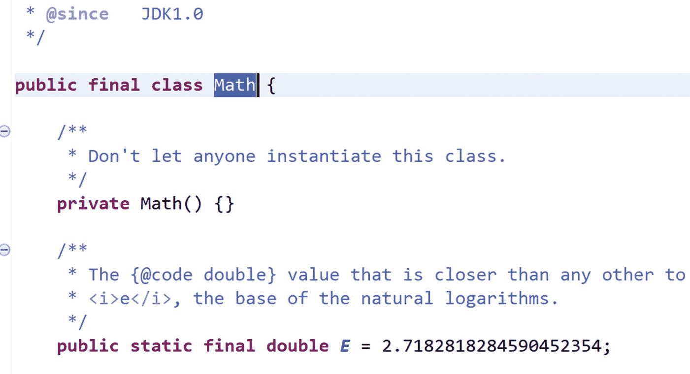

# 8. 理解类变量和类方法

有时开发者不希望通过对类型的实例进行操作，而是更倾向于直接对类型本身进行操作。类变量或类方法的概念就出现在这些场景中。它们通常被称为**静态变量**或**静态方法**。

让我们考虑一种情况：你希望一个变量能被某个类的所有对象共享，无论从该类创建了多少个对象。其他时候，你可能也希望维护一个单一的副本来处理某些特定场景；例如，当你维护一个日志文件时。在这种情况下，你会使用类变量和类方法的概念。

在 Java 中，嵌套类本身可以是静态的。当你将关键字 `static` 放在嵌套类前面时，它是一个嵌套静态类；当它被标记在方法上时，它被称为静态方法；当它与变量关联时，它被称为静态变量。

在继续之前，你需要记住以下几点：

*   Java 不允许我们创建顶层的静态类。包含静态类的类被称为外部类。非静态的嵌套类被称为内部类。为了方便你参考，你应该记住以下内容：

    ```
    class OuterClass//不能是静态的
    {
    //可能包含一些代码
    class NestedClass // 可以是静态的或非静态的
    {
    //可能包含一些代码
    }
    }
    ```

*   Java 语言规范（第 11 版）指出，你不能将枚举类型放在内部类的主体中。这是因为嵌套的枚举类型隐式是静态的，而内部类除了常量变量外，不能拥有静态成员。

## 类变量和类方法

在第 3 章中，你已经对静态类和静态方法有了一个非常简单的概述。在本章中，你将更详细地探讨它。为了理清思路，让我们从一个包含静态和非静态成员的简单示例开始。在这个演示中，请注意那些支持的注释，它们只是告诉你静态字段应该以静态方式访问。

### 演示 1

在下面的程序中，你有一个 `Rectangle` 类，它有一个 `area()` 方法。该方法被标记了 `static` 关键字，因此你可以像 `Rectangle.area()` 那样调用该方法。在这种情况下，你不需要创建 `Rectangle` 类的对象来调用该方法。

```
package java2e.chapter8;
class Rectangle {
//静态成员
static double length=25.5, breadth=10.0;
static String myStaticString="我是一个静态字符串";
//非静态成员
int myNonStaticInt=25;
public static double area() {
return length * breadth;
}
}
class Demonstration1 {
public static void main(String[] args) {
System.out.println("***演示-1. 探索类变量和类方法。***\n");
System.out.println("矩形的面积是 " + Rectangle.area() + " 平方单位");
System.out.println("myStaticString 是 : " + Rectangle.myStaticString);
Rectangle rectOb=new Rectangle();
System.out.println("myNonStaticInt 是 : " + rectOb.myNonStaticInt);
//警告：静态字段 Rectangle.myStaticString 应该以静态方式访问
//System.out.println("myStaticString 是 : " + rectOb.myStaticString);
}
}
```

输出：

```
***演示-1. 探索类变量和类方法。***
矩形的面积是 255.0 平方单位
myStaticString 是 : 我是一个静态字符串
myNonStaticInt 是 : 25
```

## 使用嵌套类

现在，请仔细阅读演示 2，然后分析嵌套静态类的重要特性。

### 演示 2

这个演示还将帮助你注意到嵌套静态类和非静态嵌套（或内部）类之间的区别。

以下是本演示中需要注意的重要点。


图 8-1

你不能使用静态引用来引用非静态字段

*   在这个程序中，顶层类 `Rectangle2` 包含两个嵌套类——`StaticRectangle2` 和 `InnerClass2`。顾名思义，`StaticRectangle2` 是一个静态嵌套类，而 `InnerClass2` 是一个非静态嵌套类（或内部类）。

*   注意内部类是如何实例化的。内部类位于外部类内部，因此你需要先实例化外部类。我在一行代码中实例化了它，但它可以分成以下两行，这在演示代码的注释中已显示。

    ```
    Rectangle2 rect2=new Rectangle2();
    Rectangle2.InnerClass2 innerOb2=rect2.new InnerClass2();
    ```

*   在 `staticDisplay()` 内部，如果你取消注释下面这行：

    ```
    //System.out.println("nonStaticOuterInt 是 : " + nonStaticOuterInt);
    ```

    你会遇到一个编译时错误，如图 8-1 所示：`无法对非静态字段 nonStaticOuterInt 进行静态引用`

因此，重要的是要注意，在静态类内部只能访问外部类的静态成员。但是内部类可以访问外部类的静态和非静态成员（注意 `nonStaticDisplay()` 方法在访问外部类的变量时没有任何问题）。

```
package java2e.chapter8;
class Rectangle2 {
static int staticOuterInt = 25;
int nonStaticOuterInt = 125;
//静态类
static class StaticRectangle2 {
void staticDisplay(){
System.out.println("在静态类内部。");
System.out.println("staticOuterInt 是 : " + staticOuterInt);
//System.out.println("nonStaticOuterInt 是 : " + nonStaticOuterInt);//错误
}
}
//内部类
class InnerClass2 {
void nonStaticDisplay(){
System.out.println("\n 在内部类内部。");
System.out.println("staticOuterInt 是 : " + staticOuterInt);
System.out.println("nonStaticOuterInt 是 : " + nonStaticOuterInt);//正确
}
}
}
class Demonstration2 {
public static void main(String[] args) {
System.out.println("***演示-2. 探索类变量和类方法。***\n");
Rectangle2.StaticRectangle2  nestedStaticOb=new Rectangle2.StaticRectangle2();
nestedStaticOb.staticDisplay();
//实例化一个内部类
//内部类包含在外部类中，因此你需要先实例化外部类。
Rectangle2.InnerClass2 innerOb=new Rectangle2().new InnerClass2();
//或者，使用以下多行代码来实例化内部类，如下所示：
/*Rectangle2 rect2=new Rectangle2();
Rectangle2.InnerClass2 innerOb2=rect2.new InnerClass2();*/
innerOb.nonStaticDisplay();
}
}
```

输出：

```
***演示-2. 探索类变量和类方法。***
在静态类内部。
staticOuterInt 是 : 25
在内部类内部。
staticOuterInt 是 : 25
nonStaticOuterInt 是 : 125
```

### 需要记住的要点

*   在 Java 中，不允许有顶层的静态类。Java 中的静态类是嵌套的。

*   非静态的嵌套类通常被称为**内部**类。

*   在嵌套静态类内部只能访问外部类的静态成员。

*   要实例化一个内部类，你需要先实例化外部类。

*   关键字 `static` 用于表示“可以像全局变量一样使用的单一事物”。一些开发者还认为静态方法比非静态方法更快。但是，需要记住的关键点是它们不属于任何实例。

*   你可能会注意到 `main(String[] args)` 方法是静态的。因此，你可以在不创建任何类实例的情况下调用此方法。


### 问答环节

**8.1 在演示 1 中，我可以创建** **Rectangle** **类的实例，然后调用** **area()** **方法吗？**

这不是推荐的做法。在 Eclipse 编辑器中，尝试这样做会收到一条警告消息。例如，如果你取消注释该演示中的以下代码行：

```
//System.out.println("The myStaticString is : " + rectOb.myStaticString);
```

你将收到以下警告消息（如图 8-2 所示）：`The static field Rectangle.myStaticString should be accessed in a static way`。


图 8-2

警告消息：静态字段应以静态方式访问。

**8.2 我能在 Java 中模拟顶级静态类的行为吗？**

如前所述，Java 不允许顶级静态类。但你可以按照 Java 中已有的示例来模拟类似的行为。例如，请注意，通过使用内置的 `Math` 类，你可以找出 12 和 15 中的较小值，如下所示：

```
System.out.println(" Minimum of (12,15) is "+ java.lang.Math.min(12, 15));
```

在这种情况下，`Math` 类的行为就像一个顶级静态类。如果你在 Eclipse 编辑器中打开 `java.lang.Math` 类的声明，你将看到图 8-3。



图 8-3

Eclipse 编辑器中 `java.lang.Math` 类详细信息的局部截图

因此，你可以将类声明为 final，将构造函数设为私有，并将类的其他成员设为静态，从而模拟出非常接近顶级静态类的行为。

## 初始化块与构造函数

在 Java 中，构造函数不能是静态的。相反，你可以使用初始化块，它可以是静态的，也可以是非静态的。非静态初始化块也称为实例块。在接下来的演示中，你将体验静态和非静态初始化块。

静态块具有以下一些重要特性：

*   静态块只执行一次，并且在类首次加载时生效。
*   静态块可以在执行流程开始时执行一些通用操作。通常，它们经常用于初始化静态变量。
*   在静态块内部，你只能引用静态变量。
*   以下代码片段展示了类中静态块的示例。此代码片段将在接下来的演示中使用。

    ```
    class Parent
    {
    int intInstanceParent;
    static int intStaticParent, count;
    static void testMethod() {
    count++;
    System.out.println("Inside static testMethod(), count ="+ count);
    }
    //静态块
    static {
    System.out.println("Inside static block of Parent");
    //intInstanceParent=10;//错误
    intStaticParent=10;//正确
    testMethod();//正确
    //System.out.println("intInstanceParent="+ intInstanceParent);//错误
    System.out.println("intStaticParent="+ intStaticParent);
    }
    }
    ```

*   实例块可以执行多次。每次实例化对象时，它都会在构造函数之前执行。以下是类中实例块的示例。此代码片段也将在接下来的演示中使用。

    ```
    class Parent
    {
    int intInstanceParent;
    static int intStaticParent, count;
    static void testMethod() {
    count++;
    System.out.println("Inside static testMethod(), count ="+ count);
    }
    //实例块
    {
    System.out.println("\nInside instance block of parent");
    intInstanceParent++;
    intStaticParent++;
    System.out.println("intStaticParent changed to :"+ intStaticParent);
    System.out.println("intInstanceParent changed to :"+ intInstanceParent);
    testMethod();//无编译错误
    }
    }
    ```

*   当你同时拥有静态块、实例块和构造函数时，执行顺序是：先执行静态块，然后执行实例块，最后执行构造函数。
*   在演示 3 的输出中，你可以确认当程序包含所有这些元素（两种初始化块和构造函数）时的执行流程。

### 注意

要理解演示 3，你可能需要反复回顾前面的要点。


### 演示 3

在演示 3 中，同时存在一个父类和一个子类。因此，正如预期的那样，当你实例化一个对象时，父类构造函数将在子类构造函数之前被调用。

```
package java2e.chapter8;
class Parent
{
int intInstanceParent;
static int intStaticParent, count;
static void testMethod() {
count++;
System.out.println("Inside static testMethod(), count ="+ count);
}
//静态块
static {
System.out.println("Inside static block of Parent");
//intInstanceParent=10;//error
intStaticParent=10;//ok
testMethod();//ok
//System.out.println("intInstanceParent="+ intInstanceParent);//error
System.out.println("intStaticParent="+ intStaticParent);
}
//实例块
{
System.out.println("\nInside instance block of parent");
intInstanceParent++;
intStaticParent++;
System.out.println("intStaticParent changed to :"+ intStaticParent);
System.out.println("intInstanceParent changed to :"+ intInstanceParent);
testMethod();//No compilation error
}
//构造函数
public Parent()
{
System.out.println("\n Inside Parent() constructor");
intInstanceParent++;
intStaticParent++;
System.out.println("intStaticParent changed to ="+ intStaticParent);
System.out.println("intInstanceParent changed to="+ intInstanceParent);
}
//静态构造函数是不可能的，只允许 public、private 和 protected
//static Parent(){}//error
}
class Child extends Parent
{
//静态块
static {
System.out.println("\nInside static block of Child");
//intInstanceParent=10;//error
intStaticParent++;
System.out.println("intStaticParent="+ intStaticParent);
}
//实例块
{
System.out.println("\nInside instance block of child");
intInstanceParent++;
intStaticParent++;
System.out.println("intStaticParent changed to :"+ intStaticParent);
System.out.println("intInstanceParent changed to :"+ intInstanceParent);
}
//构造函数
public Child()
{
System.out.println("\nInside Child() constructor");
intInstanceParent++;
intStaticParent++;
System.out.println("intStaticParent changed to ="+ intStaticParent);
System.out.println("intInstanceParent changed to="+ intInstanceParent);
}
}
public class Demonstration3 {
public static void main(String[] args) {
System.out.println("***Demonstration-3.Exploring initialization blocks***\n");
Parent parentOb=new Child();
System.out.println("--------------------");
//再次实例化一个对象。
Parent parentOb2=new Child();
}
}
```

输出：

```
***Demonstration-3.Exploring initialization blocks***
Inside static block of Parent
Inside static testMethod(), count =1
intStaticParent =10
Inside static block of Child
intStaticParent =11
Inside instance block of parent
intStaticParent changed to :12
intInstanceParent changed to :1
Inside static testMethod(), count =2
Inside Parent() constructor
intStaticParent changed to =13
intInstanceParent changed to =2
Inside instance block of child
intStaticParent changed to :14
intInstanceParent changed to :3
Inside Child() constructor
intStaticParent changed to =15
intInstanceParent changed to =4

Inside instance block of parent
intStaticParent changed to :16
intInstanceParent changed to :1
Inside static testMethod(), count =3
Inside Parent() constructor
intStaticParent changed to =17
intInstanceParent changed to =2
Inside instance block of child
intStaticParent changed to :18
intInstanceParent changed to :3
Inside Child() constructor
intStaticParent changed to =19
intInstanceParent changed to =4
```

从演示中，你可以看到以下几点：

*   静态块将首先被执行。

*   在构造函数调用之前，初始化块将被执行。每次实例化对象时都会发生这种情况。

*   你已经知道，父类构造函数将在子类构造函数之前执行。

*   请注意，当你第二次实例化对象时，`intStaticParent` 保持了它的值并持续增加。但 `intInstanceParent` 并非如此。当你实例化另一个对象时，它没有保留其最后的值。

## 方法隐藏与方法重写

在第 5 章，问答 5.24 中，你看到了一个区分隐藏与重写的演示。当时，你还没有详细了解 `static` 关键字。因此，让我们重新审视这个概念。

方法隐藏是 Java 中的一个重要概念。JLS11 是这样说的：

> *“如果一个类* *C* *声明或继承了一个* *static* *方法* *m*，那么* *m* *被认为隐藏了任何方法* *m'*，其中* *m* *的签名是* *m'* *签名的子签名（§8.4.2），这些方法存在于* *C* *的超类和超接口中，并且对于* *C* *中的代码来说原本是可访问的（§6.6）。如果一个* *static* *方法隐藏了一个实例方法，则会发生编译时错误。”*

为了更好地解释这个概念，我将演示另一个程序来比较方法隐藏与方法重写。要理解这个程序，你需要记住以下几点：*当父类和派生类包含具有相同签名的* `static` *方法时，父类的静态方法会被派生类的静态方法隐藏。*

对于非静态方法，方法调用在运行时决定（取决于你当时指向哪个对象），重写在此发挥作用。但在静态方法的情况下，方法调用仅在编译时决定，因此它不依赖于你在运行时指向哪个对象。所以，在第 5 章中，你注意到了这样一句话：“方法隐藏与运行时多态性毫无关系。”

### 演示 4

现在让我们分析以下演示和输出，以便更好地理解：

```
package java2e.chapter8;
class Parent4 {
static void staticMethod() {
System.out.println("I am a static method in Parent4.");
}
void nonStaticMethod() {
System.out.println("A non-static method in Parent4.");
}
}
class Child4 extends Parent4 {
static void staticMethod() {
System.out.println("Inside Child4 class, I am hiding the parent class static method.");
}
void nonStaticMethod() {
System.out.println("Overriding a non-static method in Parent4.");
}
}
class Demonstration4 {
public static void main(String[] args) {
System.out.println("***Demonstration-4.Derived class method hides the static method of the parent class***\n");
Child4.staticMethod();// 隐藏了父类方法
// 检查动态方法分派
Parent4 parent = new Child4();
Parent4.staticMethod();//调用父类方法
System.out.println("xxx-Doing a bad practice.Invoking a static method on instance.-xxx");
parent.staticMethod();//不良实践：调用父类方法
parent.nonStaticMethod();// 调用子类方法
/* 不良实践：
以下代码也可以调用子类的静态方法。但你会收到警告消息：
"staticMethod() from the type Child4 should be accessed in a static way"*/
//new Child4().staticMethod();
}
}
```

输出：

```
***Demonstration-4.Derived class method hides the static method of the parent class***
Inside Child4 class,I am hiding the parent class static method.
I am a static method in Parent4.
xxx-Doing a bad practice.Invoking a static method on instance.-xxx
I am a static method in Parent4.
Overriding a non-static method in Parent4.
```

在这里，`Child4.staticMethod()` 隐藏了父类方法。此外，你可以看到 `parent.nonStaticMethod()` 调用了子类方法，但 `parent.staticMethod()` 调用了父类方法，因为在方法隐藏的情况下，引用变量（这里是 `Parent` 类型）起决定作用，而不依赖于实际调用的对象。


### 要点提示

*   当父类与派生类包含签名相同的静态方法时，子类的静态方法会隐藏父类的静态方法。

*   在方法隐藏的情况下，被调用的方法版本不依赖于调用对象，而是依赖于引用类型。

*   通过实例调用静态方法完全不是推荐的做法。此处展示仅是为了演示方法隐藏与方法重写的区别。

### 问答环节

**8.3 我理解在 Java 中按设计无法重写静态方法。但这一设计背后可能的原因是什么？**

对于静态方法，方法调用仅在编译时决定；也就是说，它不依赖于运行时你指向的是哪个对象。但对于非静态方法，方法调用可以在运行时决定（即取决于那一刻你指向的实际对象）。

## 方法重载

以下演示表明你可以重载静态方法。

### 演示 5

在此程序中，`StaticDemo5` 类包含 `showMe()` 方法的不同重载版本。

```
package java2e.chapter8;
class StaticDemo5 {
static void showMe() {
System.out.println("Inside showMe().");
}
static void showMe(String s) {
System.out.println("Hi," + s +".You are inside showMe(String s) now.");
}
static void showMe(int i) {
System.out.println("Inside showMe(int i),you have supplied the argument " + i +".");
}
}
class Demonstration5 {
public static void main(String[] args) {
System.out.println("***Demonstration-5.Static methods can be overloaded***\n");
StaticDemo5.showMe();
StaticDemo5.showMe("John");
StaticDemo5.showMe(25);
}
}
```

输出：

```
***Demonstration-5.Static methods can be overloaded***
Inside showMe().
Hi, John.You are inside showMe(String s) now.
Inside showMe(int i),you have supplied the argument 25.
```

**8.4 你能编译以下代码吗？**

```
class Quiz1 {
static void showMe() {
System.out.println("Static method");
}
void showMe() {
System.out.println("Non-static method");
}
}
```

不能。在这种情况下，编译器会在 Eclipse IDE 中引发以下错误：`Duplicate method showMe() in type Quiz1`（图 8-4）。


图 8-4

`static` 关键字的存在不能确保方法重载

如果方法签名不同，方法重载的概念可以正常工作。在此例中，方法名前包含 `static` 关键字不被视为不同的签名。你也可以从另一个角度解释这种行为。例如，你知道 Java 允许通过对象调用静态方法。现在，在这种情况下，如果你有另一个具有相同签名的非静态方法，Java 编译器将混淆该调用哪一个。

**8.5 你能编译以下代码吗？**

```
class Quiz2 {
int i;
static void showMe() {
this.i = 7;
System.out.println("Static method");
}
}
```

不能。在这种情况下，编译器会在 Eclipse IDE 中引发如图 8-5 所示的错误：


图 8-5

关键字 `this` 不能在静态上下文中使用

在此上下文中，你可以记住 `this` 关键字用于当前对象的上下文。但静态方法可以通过类名调用（而这正是 `static` 关键字的真正意图）。调用类方法（或静态方法）无需创建对象。

### 问答环节

**8.6 在 C# 中允许静态构造函数，但在 Java 中不允许。开发者使用静态构造函数能获得什么关键优势？**

每种编程语言都有其优缺点。设计者对于特定功能显然可以有不同想法。在 C# 中，顶级静态类也允许使用静态构造函数。他们认为此功能对于编写日志条目很有用。此功能也可用于为非托管代码（C# 支持）创建包装类。

## 接口中的静态方法

从 Java 8 开始，你可以向接口添加静态方法。以下是一个示例：

```
interface MyInterface {
// 静态接口方法（Java 8 起）
static void staticMethod() {
System.out.println("\nStatic interface method in MyInterface is called.");
}
}
```

与类中的静态方法类似，你可以通过在点号后添加接口名称来调用接口中的静态方法，如下所示：

```
MyInterface.staticMethod();
```

需要注意的是，如果一个类实现了 `MyInterface`，该实现类可以有自己的 `staticMethod()` 版本，但在这种情况下，你不能使用 `@Override` 注解。考虑以下代码片段：

```
class ClassDemo8 implements MyInterface{
//@Override  <- 会导致错误
public static void staticMethod() {
System.out.println("This is the static method of the implementing class(ClassDemo8).");
System.out.println("You cannot override the static method in MyInterface");
}
```


### 演示 6

本章将以演示 6 收尾，在该演示中，你将看到传统接口方法、默认接口方法和静态接口方法的对比研究。

```
package java2e.chapter8;
interface MyInterface {
// 传统接口方法
void traditionalInterfaceMethod();
// 默认接口方法
default void defaultInterfaceMethod() {
System.out.println("MyInterface 中的默认接口方法被调用。");
}
// 静态接口方法（自 Java 8 起）
static void staticMethod() {
System.out.println("MyInterface 中的静态接口方法被调用。");
}
}
class ClassDemo8 implements MyInterface {
@Override
public void traditionalInterfaceMethod() {
System.out.println("在 ClassDemo8 中重写 traditionalInterfaceMethod()");
}
@Override
public void defaultInterfaceMethod() {
System.out.println("在 ClassDemo8 中重写 defaultInterfaceMethod()");
}
// @Override // 会导致错误
public static void staticMethod() {
System.out.println("这是实现类 (ClassDemo8) 的静态方法。");
System.out.println("你不能重写 MyInterface 中的静态方法。");
}
}
class Demonstration6 {
public static void main(String[] args) {
System.out.println("***演示-6. 探索接口中的静态方法。***\n");
System.out.println("调用静态接口方法。");
MyInterface.staticMethod();
MyInterface inter = new ClassDemo8();
System.out.println("\n 从实现类调用默认接口方法。");
inter.defaultInterfaceMethod();
System.out.println("\n 从实现类调用传统接口方法。");
inter.traditionalInterfaceMethod();
System.out.println("\n 从实现类调用静态方法。");
ClassDemo8.staticMethod();
// 编译时错误：接口 MyInterface 的静态方法只能通过 MyInterface.staticMethod() 访问；
// inter.staticMethod();//错误
}
}
```

输出：

```
***演示-6. 探索接口中的静态方法。***
调用静态接口方法。
MyInterface 中的静态接口方法被调用。
从实现类调用默认接口方法。
在 ClassDemo8 中重写 defaultInterfaceMethod()
从实现类调用传统接口方法。
在 ClassDemo8 中重写 traditionalInterfaceMethod()
从实现类调用静态方法。
这是实现类 (ClassDemo8) 的静态方法。
你不能重写 MyInterface 中的静态方法。
```

输出结果不言自明。不过，我还是想提请你注意以下几点：

*   你可以在实现类中对默认方法应用 `@Override` 注解，但如果将其应用于静态方法，则会收到编译时错误。

*   请注意，下面这行代码

```
// inter.staticMethod();//错误
```

会导致编译时错误。（在此上下文中，你能想起 Java 中的静态方法不能被重写吗？）因此，你需要像下面这样使用接口名来调用接口的静态方法：

```
MyInterface.staticMethod();//正确
```

## 总结

本章涵盖了以下内容：

*   静态类、静态方法和静态变量的概念
*   不同类型的初始化块及其用法
*   重温 Java 中的方法隐藏与方法重写
*   接口中的静态方法，以及它们与传统接口方法或默认方法的区别
*   如何在 Java 中实现这些概念以及与之相关的限制

