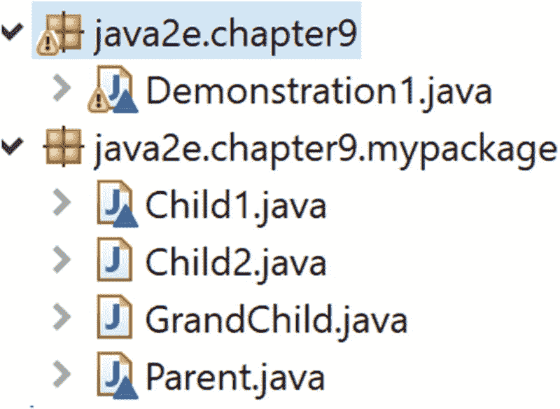

# 9. 面向对象原则快速回顾

欢迎来到第一部分的最后一章。到目前为止，你已经使用 Java 中的基本构建块学习了面向对象编程的基础知识。在进入第二部分之前，让我们回顾一下本书中已经涵盖的核心原则。

*   **类和对象**。在本书中，几乎每个示例都使用了不同类型的类和对象。`static` 关键字的使用略有不同，你通过类名访问了静态字段。

*   **多态性**。涵盖了两种类型的多态性。编译时多态性通过方法重载来涵盖，运行时多态性通过方法重写技术来涵盖。你已经看到动态方法分派是 Java 中的一个重要概念。

*   **抽象性**。此特性通过抽象类和接口进行了测试。

*   **封装性**。每个具有不同访问修饰符的类都可以归入此类别。但更好的例子是包含私有成员和 getter-setter 方法的类。根据专家的建议，你应该将实例变量设为私有，并通过公共的 getter-setter 方法访问它们。

*   **继承性**。你在多个章节中探索了不同类型的继承。

*   **消息传递**。通常，给对象的消息是请求调用接收对象中的方法。简单来说，消息传递就是不同对象之间的通信。此特性在多线程环境中非常常见。但你在运行时多态性中进行了实验，其中超类引用指向子类对象，这也可以归入此类别。多线程将在本书的第 11 章中讨论。

*   **动态绑定**。通过方法重写示例实现的运行时多态性可以归入此类别。

## 问答环节

**9.1 你能总结一下抽象性和封装性的区别吗？**

将数据和方法包装成一个单一实体的过程称为**封装性**。使用此技术，你可以防止对数据的任意和不安全访问。你可以使用不同的访问修饰符来限制对数据的直接访问。但使用 getter 和 setter 方法是此类别中更好的例子。在封装的情况下，你的整个代码像一个胶囊一样工作，因此被称为封装。

在抽象性中，你展示基本特征，但向用户隐藏详细的实现（或背景细节）；例如，当你使用遥控器打开电视时，设备的内部电路不是你所关心的。只要按下按钮后你喜欢的频道能正常显示在电视上，你就对设备满意。


### 注意

封装关注的是真正的实现，即*如何*进行实现，而抽象关注的是实现*能*为你做什么。但这两个概念是相互关联的。因此，为了获得良好的抽象，你的实现应该被恰当地封装。

Grady Booch 在其著名著作《面向对象分析与设计（原书第 3 版）》（Addison-Wesley）中写道：“抽象关注的是对象的可观察行为，而封装关注的是产生该行为的实现。封装通常通过信息隐藏（不仅仅是数据隐藏）来实现，这是一个隐藏对象中所有与其基本特征无关的秘密的过程。”

你可以重新查阅第 1 章来了解这些定义。

**9.2 编译时多态和运行时多态，哪个更快？**

一般来说，如果你能提前解析一个调用（例如，方法的调用），它会更快。这就是为什么你可以得出结论：编译时绑定比运行时绑定或多态更快——因为预先知道要调用哪个方法。

**9.3 你之前告诉我们继承并不总是能提供最佳解决方案。能详细说明一下吗？**

在某些情况下，组合可以提供更好的解决方案。但要理解组合，你可能需要了解这些概念：

*   关联
*   聚合

**关联**可以是单向的或双向的。当你看到这种 UML 图时，它意味着 ClassA 知道 ClassB，但反过来则不成立。


下图表示一个双向关联，因为两个类彼此都知道对方。


考虑一个例子。在一所大学里，一个学生可以向多位老师学习，一位老师也可以教多位学生。在这种关系中不存在*所有权*。因此，当你在编程中用类和对象来表示它们时，可以说这两种对象都可以独立地创建和删除。

**聚合**是一种更强的关联类型。教授和系之间的聚合关系可以表示如下。


让我们深入探讨一下。假设 X 教授向他的现任职机构提交了辞职信，准备加入一个新机构。尽管 X 教授和他的原机构彼此之间都可以独立存在，但 X 教授需要与某个机构中的一个系关联起来。在这种情况下，你可以说系是这种关系的所有者，并且系拥有教授。

类似地，你可以说人体拥有手，汽车拥有座椅，自行车拥有轮胎，等等。

### 注意

通常，我们说一个系拥有一个教授。这就是为什么关联关系也被称为 **“has-a”**（拥有）关系。（你可以在这里记下与继承的关键区别。继承与 **“is-a”**（是一个）关系相关联。）

**组合**是聚合的一种更强形式，此时你使用实心菱形来表示。


大学里的一个系不能脱离大学而存在。大学只能创建或关闭其下属的系。（你可能会争辩说，如果根本没有系，大学也无法存在，但你不必考虑这种极端情况来把事情复杂化。）换句话说，一个系的生命周期完全依赖于其所属的大学。这也被称为**死亡关系**，因为如果你摧毁了大学，它所有的系也会自动被摧毁。类似地，你可以说人体的手（或腿等）不能脱离身体而存在。

## 重新审视菱形问题

为了展示聚合/组合的能力，让我们重新审视第 4 章中讨论过的菱形问题，然后分析下面的程序。我们从以下代码开始。

```
class Parent {
public void show() {
System.out.println("I am in Parent");
}
}
class Child1 extends Parent {
public void show() {
System.out.println("I am in Child1");
}
}
class Child2 extends Parent {
public void show() {
System.out.println("I am in Child2");
}
}
```

Java 不允许你编写类似下面的代码：

```
class GrandChild extends Child1,Child2// Error: Not supported in Java
{
public void show() {
System.out.println("I am in Grandchild");
}
}
```

### 演示 1

现在，让我们看看如何使用聚合（组合的一种较弱形式）来处理这种情况。考虑以下代码：

```
package java2e.chapter9;
class Parent {
public void show() {
System.out.println("I am in Parent");
}
}
class Child1 extends Parent {
@Override
public void show() {
System.out.println("I am in Child1");
}
}
class Child2 extends Parent {
@Override
public void show() {
System.out.println("I am in Child2");
}
}
//Not supported in Java
/*
* class GrandChild extends Child1,Child2// Error: Not supported in Java {
* public void show() { System.out.println("I am in Grandchild"); } }
*/
class GrandChild {
Child1 ch1 ;
Child2 ch2 ;
GrandChild() {
ch1 = new Child1();
ch2 = new Child2();
}
public void showFromChild1() {
ch1.show();
}
public void showFromChild2() {
ch2.show();
}
}
```

以下是包含 `main()` 方法的 `Demonstration1.java` 代码：

```
class Demonstration1 {
public static void main(String[] args) {
System.out.println("***Demonstration-1.The concept of aggregation/composition to handle the diamond Problem***\n");
GrandChild gChild = new GrandChild();
gChild.showFromChild1();
gChild.showFromChild2();
}
}
```

输出：

```
***Demonstration-1.The concept of aggregation/composition to handle the diamond Problem***
I am in Child1
I am in Child2
```

你可以看到，`Class1` 和 `Class2` 都重写了它们父类的 `show()` 方法。而 `Grandchild` 类没有自己的 `show()` 方法。尽管如此，你仍然可以通过 `Grandchild` 对象调用那些特定于类的方法。

`Grandchild` 类允许你在其构造函数体内创建来自 `Class1` 和 `Class2` 的对象。在前面的例子中，尽管 `Child1` 和 `Child2` 对象可以在没有 `Grandchild` 对象的情况下存活，但这里并没有来自 `Class1` 或 `Class2` 的独立对象。因此，在这种实现中，如果你的应用程序中不存在 `Grandchild` 对象（假设已被垃圾回收），那么系统中就不会存在任何 `Class1` 或 `Class2` 对象。你也可以对用户施加一些限制，使他们无法在应用程序中直接创建 `Class1` 和 `Class2` 的对象；为简单起见，我忽略了这部分。

### 注意

你已经了解了泛化、特化和实现。你在应用程序中已经使用过这些概念。当你的类继承另一个类（即继承）时，你使用了**泛化**和**特化**的概念；例如，足球运动员是运动员的一种特殊类型（特化）。或者，你可以说足球运动员和篮球运动员都是运动员（泛化）。而当你的类实现一个接口时，你使用了**实现**的概念。


## 问答环节

**9.4 在演示 1 中，客户端代码内部可以实例化** **Child1** **或** **Child2** **对象。例如，可以使用以下代码行：**

```
Child1 child1=new Child1();
```

**在这种情况下，系统中可以持久化一个** **Child1** **对象，而无需** **GrandChild** **对象。这种理解正确吗？**

是的。可以说这是聚合的一个例子，或者是组合的一种较松散形式。但您始终可以限制用户直接实例化 `Parent`、`Child1` 或 `Child2` 类的对象。例如，您可以将这些类放在一个包中，并让 `Grandchild` 类成为该包中唯一的公共类。在客户端代码中，只能创建 `GrandChild` 对象。

请参考图 9-1 中的结构，这是即将进行的演示的包资源管理器视图。



图 9-1

使用组合解决菱形问题

包（`java2e.chapter9.mypackage`）中的类如下所示（关键更改以粗体显示）：

```
//Parent.java
package java2e.chapter9.mypackage;
class Parent {
public void show() {
System.out.println("I am in Parent");
}
}
//Child1.java
package java2e.chapter9.mypackage;
class Child1 extends Parent {
@Override
public void show() {
System.out.println("I am in Child1");
}
}
//Child2.java
package java2e.chapter9.mypackage;
class Child2 extends Parent {
@Override
public void show() {
System.out.println("I am in Child2");
}
}
//GrandChild.java
package java2e.chapter9.mypackage;
public class GrandChild { //此类在此处为公共类
Child1 ch1 ;
Child2 ch2 ;
public GrandChild() {
ch1 = new Child1();
ch2 = new Child2();
}
public void showFromChild1() {
ch1.show();
}
public void showFromChild2() {
ch2.show();
}
}
```

客户端代码可能如下所示：

```
//Demonstration1.java
package java2e.chapter9;
import java2e.chapter9.mypackage.GrandChild;
class Demonstration1 {
public static void main(String[] args) {
System.out.println("***演示-1. 使用聚合/组合概念处理菱形问题***\n");
//Child1 child1=new Child1();//错误：对客户端不可见
//Child2 child1=new Child2();//错误：对客户端不可见
GrandChild gChild = new GrandChild();
gChild.showFromChild1();
gChild.showFromChild2();
}
}
```

现在，如果执行该程序，您将获得相同的输出，但在此结构中，您只允许外部人员创建 `Grandchild` 对象。因此，在这种情况下，您提供了更多限制，并且如果没有 `GrandChild` 对象，您的应用程序将不会持有任何 `Child1` 或 `Child2` 的对象。

**9.5 面向对象编程的挑战和缺点是什么？**

许多专家认为，面向对象程序的大小通常更大。由于体积更大，您可能需要更多存储空间（但如今，这些问题几乎无关紧要）。

一些开发者在面向对象编程风格中遇到困难。他们可能仍然更喜欢其他方法，例如结构化编程、逻辑编程等，因此如果他们被迫在面向对象编程环境中工作，生活会变得艰难。

同样，并非所有现实世界的问题都能通过面向对象风格高效解决。总有一些问题可以通过不同的方法更好地解决；例如，某个特定的数独谜题用 Prolog（一种逻辑编程语言）解决起来比用 Java（一种面向对象编程语言）要容易得多。

此外，面向对象风格的一个常见问题可能出现在需要查找执行流程中的错误时，特别是当您的代码库中有许多小方法（或函数）为处理一个简单事件而相互调用时。然而，我个人喜欢面向对象编程，因为我相信它的优点大于缺点。

## 本章小结

本章内容包括：

*   本书中核心面向对象编程原则的快速回顾

*   如何区分抽象与封装

*   如何在应用程序中实现组合/聚合的概念

*   与面向对象编程相关的挑战和缺点

