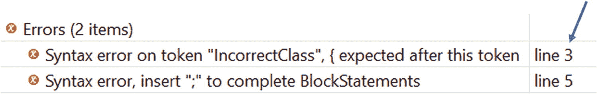
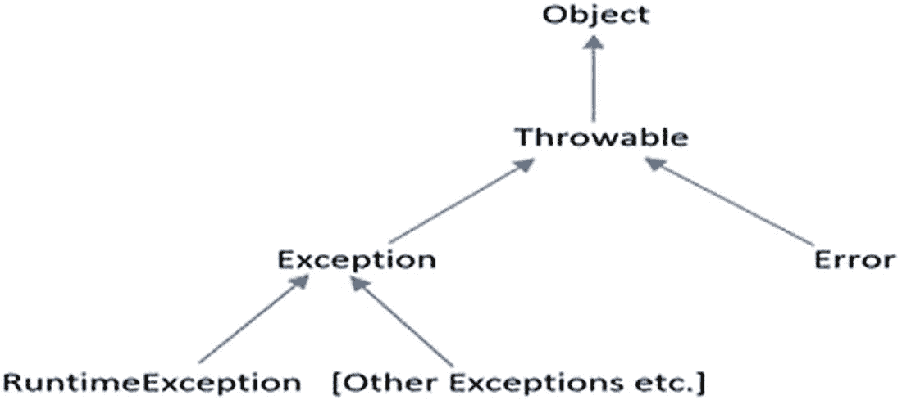
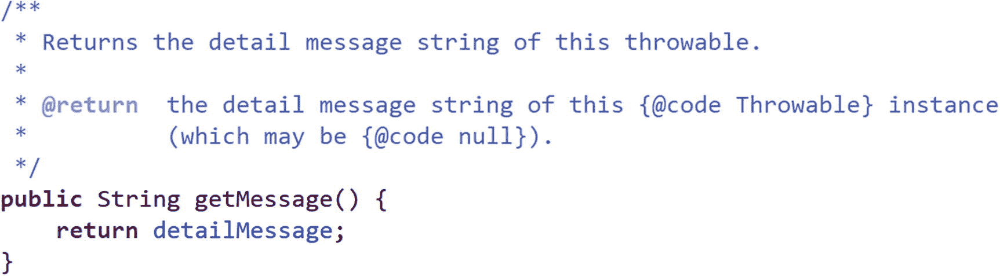
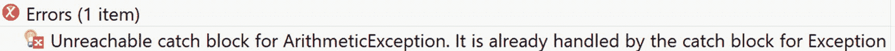
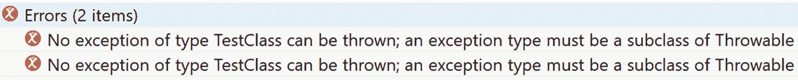
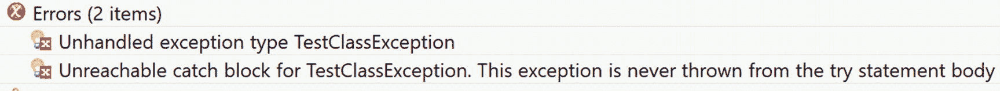

# 10. 异常管理

当您为应用程序编写代码时，您期望它能毫无问题地执行。因此，管理和检测程序中所有可能的错误非常重要。即便如此，有时在程序执行过程中也可能会遇到意外情况。这些意外可能由各种原因引起，例如程序中的一些粗心错误、逻辑实现不正确、程序代码路径中的漏洞等。然而，许多故障也超出了程序员的控制范围。程序员通常将这些不期望的情况称为*异常*。在编写任何应用程序时，处理这些异常至关重要。

## 错误类型

通常，您可以将程序中的错误（或失误）大致分为两类，如下所示：

*   编译时错误

*   运行时错误

编译时错误由 Java 编译器检测，并且易于发现。Java 编译器就像您的朋友一样，帮助找出错误的详细信息。例如，它可能会指出行号（遇到错误的位置）并显示错误的简要描述。一旦您纠正了错误，就需要重新编译以检查更新后的程序是否准备好执行。有时，您可能需要修复多个错误，因此可能需要多次重新编译。如果 Java 编译器在程序中发现了此类错误，它将不会生成类文件。

让我们考虑以下程序中的一些拼写错误：

```
package java2e.chapter10;
class IncorrectClass //{
void SampleMethod() {
System.out.println("Semicolon missing") //error
}
}
```

在这里，Java 编译器将显示错误消息。在 Eclipse 中，您可以看到错误描述和相应的行号，如图 10-1 所示。



图 10-1

Eclipse IDE 中的两个拼写错误

因此，您可以看到在类定义后遗漏了括号 `{`，并且忘记在第 5 行末尾添加分号。

这种类型的错误很常见，但有时在最初阶段很难用肉眼发现。因此，在这些情况下，Java 编译器会为您提供帮助。

另一方面，运行时错误则具有挑战性。在这种情况下，您会从编译器那里得到绿色信号，成功编译后您会得到 `.class` 文件，但您的程序仍然会产生错误结果，并可能提前终止。以下是一些可能导致运行时错误的操作示例：

*   整数除以 0

*   尝试访问数组边界之外的数组元素

*   使用空对象调用方法

*   尝试进行无效转换，例如尝试将无效字符串转换为整数

在某些地方，我特意使用了术语*失误*而不是*错误*。原因稍后揭晓。


## 异常的定义

你可以将异常定义为一种中断程序正常执行或指令流的事件。

当异常情况出现时，会创建一个异常对象，并将其抛出到创建该异常的方法中。该方法可能会处理异常，也可能不会处理。如果它无法处理该异常，就会将责任传递给另一个方法。（类似于我们的日常生活，当情况超出我们的控制时，我们会向他人寻求建议。）如果没有方法负责处理某个特定异常，就会出现一个错误对话框（表示未处理的异常），并且程序的执行会停止。

### 要点

异常处理机制处理的是运行时错误，如果这些错误没有得到妥善处理，应用程序将产生不期望的输出，并且可能会提前终止。因此，你应该尽量编写能够以优雅方式检测并处理意外情况，从而防止应用程序提前终止的应用程序。

### 演示 1

让我们从一个简单的例子开始。以下程序编译成功，但在运行时会引发异常，因为在该程序中，除数（`b`）在除法运算之前变成了 0。该应用程序产生了一个运行时错误，因为在这种情况下，你试图用 100 除以 0。

```
package java2e.chapter10;
class Demonstration1 {
public static void main(String[] args) {
System.out.println("***演示-1.探索异常.***");
int a = 100, b = 2, result;
b -= 2;//b 变为 0
result = a / b;
System.out.println("a/b 的结果是：" + result);
}
}
```

输出：

```
***演示-1.探索异常.***
Exception in thread "main" java.lang.ArithmeticException: / by zero
at java2e.chapter10.Demonstration1.main(Demonstration1.java:9)
```

### 异常处理机制的关键点

在进一步深入之前，我将强调异常处理机制的一些关键点。你可能需要反复回顾这些要点*。建议你在完成本章后，再回到这里复习你对 Java 异常处理的理解。

*   当运行时错误发生时，会创建一个异常对象。因此，Java 异常本质上是一个描述错误情况的对象。

*   应用程序中的任何方法都可能在应用程序运行时引发意外情况。如果发生这种情况，用编程术语来说，就是该方法抛出了一个异常。

*   你使用以下关键字来处理 Java 异常：`try`、`catch`、`throw`、`throws` 和 `finally`。

*   你尝试使用 `try`-`catch` 块来防范异常。可能抛出异常的代码被放置在 `try` 块内，而异常情况则在 `catch` 块内处理。但是，如果 `try` 块中没有引发异常，则 `catch` 块会被完全跳过。

*   你可以将多个 `catch` 块与一个 `try` 块关联。当某个特定的 `catch` 块处理了突发意外（异常）时，我们就说该 `catch` 块捕获了异常。

*   `finally` 块中的代码必须执行。`finally` 块通常放在 `try` 块或 `try`-`catch` 块之后。该块用于执行一些清理工作，以便应用程序能够优雅地关闭。例如，如果文件已经打开，你应该在此处关闭它；或者如果你已经分配了一些资源，这些资源应该在此块内释放。

*   当 `try` 块内引发异常时，控制权会跳转到相应的 `catch` 或 `finally` 块。`try` 块的剩余部分将不会执行。

*   异常遵循继承层次结构。因此，记住图 10-2 所示的层次结构非常重要。



图 10-2

异常层次结构

*   你可以看到，`Exception` 类和 `Error` 类都是 `Throwable` 类的子类，而 `Throwable` 类又派生自 `Object`（位于 `java.lang` 包中）。至于其他异常，我指的是像 `IOException`（Java 中已定义）、我们自己的自定义异常类（Java 中未定义）等类。所以，你可以简单地说，在 Java 中，`Throwable` 类是所有错误和异常的最终超类。

*   异常大致分为两种类型：**已检查异常** 和 **未检查异常**。运行时异常类（`RuntimeException` 类及其子类）和错误类（`Error` 类及其子类）属于未检查异常的范畴，其余剩下的则称为已检查异常。稍后你将看到对每个类别的详细讨论，问答 10.8 将总结这些细节。

*   本章主要关注运行时异常。错误通常是由一些灾难性故障引起的，例如 JVM 内存不足、栈溢出等。你对此几乎无能为力。Java 运行时环境本身需要处理这些严重情况。

*   当你创建自定义异常类时，通常你会继承 `Exception` 类。但这并非硬性规定。因此，在演示 7 中，你会看到一个自定义异常类继承自 `Throwable` 类，而在演示 8 中，你会注意到一个自定义异常类继承自 `RuntimeException` 类。

*   你应该按照从最具体到最通用的顺序排列 `catch` 块。否则，你将遇到编译时错误。例如，假设你将一个可以处理父类异常的 `catch` 块（比如 `catch block1`）放在了一个只能处理派生类异常的 `catch` 块（比如 `catch block2`）之前。从编译器的角度来看，这是不可达代码的一个例子，因为在这种情况下，`catch block1` 始终能够处理 `catch block2` 可以处理的异常。因此，控制权根本不需要到达 `catch block2`。你将在接下来的一个示例中研究这种情况。

*   你可以使用以下任意组合：`try`-`catch`、`try`-`catch`-`finally` 或 `try`-`finally`。

*   Java 运行时系统可以生成异常。同时，你也可以创建自己的异常类并抛出自己的异常。

*   如果你不处理异常，Java 运行时系统的默认处理程序将代你处理，程序可能会提前终止。

### 要点

*   在 Java 中，`Throwable` 类是所有错误和异常的最终超类。

*   在异常处理机制中，Java 和 C# 之间存在一个关键区别。C# 中没有 `throws` 关键字的概念。这是一个热议的话题。


### 演示 2

现在，让我们看看如何处理上一个示例中遇到的异常。

```
package java2e.chapter10;
public class Demonstration2 {
public static void main(String[] args) {
System.out.println("***Demonstration-2.探索异常-修改了 Demonstration1.***");
int a = 100, b = 2, result;
b -= 2;// b 变为 0
try {
result = a / b;
System.out.println(" 因此，a/b 的结果是：" + result);
} catch (Exception ex) {
System.out.println("遇到异常 " + ex.getMessage());
System.out.print("以下是堆栈跟踪：");
ex.printStackTrace();
} finally {
System.out.println("我在 finally 块中。你无法跳过我！");
}
}
}
```

输出：

```
***Demonstration-2.探索异常-修改了 Demonstration1.***
遇到异常 / by zero
以下是堆栈跟踪：java.lang.ArithmeticException: / by zero
我在 finally 块中。你无法跳过我！
at java2e.chapter10.Demonstration2.main(Demonstration2.java:10)
```

从程序的输出中，你可以确认以下几点：



图 10-3

来自 Eclipse IDE 的示例源代码快照

*   当 `try` 块内引发异常时，控制权跳转到相应的 `catch` 块。`try` 块的剩余部分未执行。（注意，在输出中你看不到 `"因此，a/b 的结果是："` 这一行。）

*   即使程序遇到异常，`finally` 块中的代码也会执行。（注意输出中的 `"我在 finally 块中。你无法跳过我！"` 这一行）。

*   为了获取异常的详细信息，`java.lang.Throwable` 类中已经定义了一些内置方法。`getMessage()`、`printStackTrace()`、`getCause()` 等是该类别中的一些常见示例。在本演示中，我使用了其中两个——`getMessage()` 和 `printStackTrace()`。为了便于你参考，我仅从 Eclipse IDE 中截取了一个示例源代码快照，以获取 `getMessage()` 方法的详细信息，如图 10-3 所示。

### 问答环节

**10.1 我可以在除法操作之前轻松地放置一个** **if** **块，例如** **if(b==0)** **，以避免除数为 0，在这种情况下，我可以轻松地避免使用** **try-catch** **块。这种理解正确吗？**

你只考虑了这个简单的例子，所以才会这么认为。是的，在这种情况下，你可以使用你提出的方法来保护你的代码。但是，考虑一下 `b` 的值也是在运行时计算的情况（例如，你可能从指定范围内随机选取一个值，并且无法提前预测该值）。此外，如果你需要在所有可能的情况下都放置这样的保护，你的代码可能会显得笨拙且难以阅读。但如果你喜欢防御性编程风格，你可以持续要求输入有效值。所以，最终，如何设计你的软件取决于你的选择。

### 演示 3

现在，考虑以下示例，该示例演示了如何使用多个 `catch` 块处理多种类型的异常。在下面的程序中，整数 `b` 的值可以是 0、1 或 2。该值是随机生成的。因此，你无法预测该值。根据生成的值，你可能会遇到不同类型的异常。为了更好地理解，你可能需要多次查看输出和分析部分。

```
package java2e.chapter10;
import java.util.Random;
public class Demonstration3 {
public static void main(String[] args) {
System.out.println("***Demonstration-3.处理多个异常***");
int a = 5;
Random randomGenerator = new Random();
// 将生成 0 到 2 之间的数。
int b = randomGenerator.nextInt(3);
System.out.println("b 的当前值是：" + b);
int c = 0;
try {
/ 情况-1：如果 b=0，将引发 ArithmeticException*/
c = a / b;
System.out.println("c=" + c);
int[] arr = new int[2];
arr[0] = 0;
arr[1] = c + 1;
if (b % 2 == 0) {
/* 情况-2：（此处 b 不为零）将引发 ArrayIndexOutOfBoundsException*/
arr[2] = c + 2;
} else {
Object myObject = null;
// 情况-3：引发 NullPointerException
int hashcode = myObject.hashCode();
}
} catch (ArithmeticException ex) {
System.out.println("捕获到 ArithmeticException：" + ex.getMessage());
ex.printStackTrace();
} catch (ArrayIndexOutOfBoundsException ex) {
System.out.println("捕获到 ArrayIndexOutOfBoundsException：" + ex.getMessage());
ex.printStackTrace();
} catch (Exception ex) {
System.out.println("捕获到 Exception：" + ex.getMessage());
ex.printStackTrace();
} finally {
System.out.println("我在这里，finally");
}
}
}
```

输出：

当你编译并运行程序时，你可能会看到以下任何一种输出。我展示了不同运行中的所有可能输出。由于 `b` 的值是随机生成的，你可能会得到不同的顺序。

情况 1：

```
***Demonstration-3.处理多个异常***
b 的当前值是：1
c=5
捕获到 Exception：null
我在这里，finally
java.lang.NullPointerException       at java2e.chapter10.Demonstration3.main(Demonstration3.java:27)
```

情况 2：

```
***Demonstration-3.处理多个异常***
b 的当前值是：2
c=2
捕获到 ArrayIndexOutOfBoundsException：2
我在这里，finallyjava.lang.ArrayIndexOutOfBoundsException: 2
at java2e.chapter10.Demonstration3.main(Demonstration3.java:23)
```

情况 3：

```
***Demonstration-3.处理多个异常***
b 的当前值是：0
捕获到 ArithmeticException：/ by zero
我在这里，finally
java.lang.ArithmeticException: / by zero at java2e.chapter10.Demonstration3.main(Demonstration3.java:16)
```

从程序的输出中，你可以观察到以下几点：

*   当引发异常时，只有一个 `catch` 块被执行。例如，如果 `catch (ArithmeticException ex){..}` 块可以处理该异常，则 `catch (Exception ex){..}` 块无需再次处理该异常。

*   在前面的程序中，所有类型的异常都可以在 `catch (Exception ex)` 块中被捕获，因此该块必须作为最后一个 `catch` 块放置。例如，在这种情况下：
    *   `ArithmeticException` 类派生自 `RuntimeException` 类，而 `RuntimeException` 类又派生自 `Exception` 类。

    *   `ArrayIndexOutOfBoundsException` 类派生自 `IndexOutOfBoundsException` 类，而 `IndexOutOfBoundsException` 类又派生自 `RuntimeException` 类，`RuntimeException` 类再派生自 `Exception` 类。

### 注意

在 Eclipse 中，你可以将鼠标指针悬停在异常名称上，然后选择“打开声明”选项来显示继承层次结构。


## 多重 catch 子句

从 Java 7 开始，你可以使用 `catch` 子句的另一种变体。现在，单个 `catch` 块可用于捕获多种异常类型。以下代码片段展示了如何在公共块中使用多个 `catch` 子句：

```
//从 Java 7 开始，你可以像下面这样编写多个 catch 子句
catch (ArithmeticException | ArrayIndexOutOfBoundsException ex){  System.out.println("捕获到 ArithmeticException 或 ArrayIndexOutOfBoundsException :" + ex.getMessage());
ex.printStackTrace();
}
```

**10.2 你能预测以下代码的输出吗？**

```
package java2e.chapter10;
import java.util.Random;
public class Quiz1 {
public static void main(String[] args) {
System.out.println("***Quiz1.关于如何在程序中放置 catch 子句。***");
int a = 5;
Random randomGenerator = new Random();
// 将生成 0 到 2 之间的随机数。
int b = randomGenerator.nextInt(3);
System.out.println("b 的当前值为：" + b);
int c = 0;
try {
//这里 b=0，会引发 ArithmeticException
c = a / b;
System.out.println("c=" + c);
}
//以下 catch 子句放置不正确
catch (Exception ex) {
System.out.println("捕获到异常：" + ex.getMessage());
ex.printStackTrace();
}
//从 Java 7 开始，你可以像下面这样编写多个 catch 子句
catch (ArithmeticException | ArrayIndexOutOfBoundsException  ex) {
System.out.println("捕获到 ArithmeticException 或 ArrayIndexOutOfBoundsException：" + ex.getMessage());
ex.printStackTrace();
}
//catch 子句的正确放置位置
/*catch (Exception ex) {
System.out.println("捕获到异常：" + ex.getMessage());
ex.printStackTrace();
}*/finally {
System.out.println("我在这里执行 finally");
}
}
}
```

你会遇到编译时错误：`Unreachable catch block for ArithmeticException. It is already handled in the catch block for Exception`，如图 10-4 所示。



图 10-4

不可达的 *catch* 块

异常遵循继承层次结构。因此，你需要正确放置 `catch` 块。前面已经提到，`ArithmeticException` 类派生自 `RuntimeException` 类，而 `RuntimeException` 类又派生自 `Exception` 类。为了便于理解，请参考程序中的相关注释。

### 要点记忆

在处理多个 `catch` 块时，你需要将更具体的异常子句放在前面。换句话说，你应该按照从最具体到最通用的顺序放置 `catch` 块。

值得注意的是，如果你熟悉 C#，可能会注意到它支持一些额外的 `catch` 子句变体。例如，在 C# 中，你可能会看到以下 `catch` 块变体：

```
catch ()
{
Console.WriteLine("遇到异常");
}
```

或者：

```
catch (WebException ex) when (ex.Status == WebExceptionStatus.Timeout)
{
//一些代码
}
```

### 问答环节

**10.3 我可以像下面这样只使用** **try** **和** **finally** **吗？**

```
try{
//一些代码
}
finally{
//一些代码
}
```

可以。

**10.4 那么为什么还需要** **catch** **块呢？**

`catch` 块用于以某种指定的方式处理异常。同时，你必须注意 `finally` 的实际用途是不同的。前面已经提到，在 `finally` 内部你应该进行清理工作，以便应用程序能够优雅地关闭。例如，如果文件已经打开，你应该关闭它；或者，如果你已经分配了一些资源，这些资源应该在此块内释放（以防止内存泄漏）。在第 14 章中，你将学习使用 try-with-resource 语句，其中术语“资源”指的是程序执行完毕后必须关闭的对象。

**10.5 如果在** **finally** **块中遇到异常会发生什么？**

你不应该忘记 `finally` 的目的，它基本上是用来关闭文件、释放占用的资源等。但是，如果你在 `finally` 块中放置了错误的逻辑，你可能会再次遇到异常。（解决方案是一样的——你可以使用 `try-catch`、`try-finally` 或 `try-catch-finally` 块来防范 `finally` 块中可能出现的异常。事实上，在 Java 6 之前，你可能会看到这种用于关闭资源的用法。）

### 演示 4

这里有一个示例供你参考。你可以看到，一旦你收到异常（当 b 在 finally 块中变为 0 时），`finally` 块中的后续行将不会执行。例如，在以下情况中，输出中没有出现“我位于 finally 块的末尾”这一行。

```
package java2e.chapter10;
import java.util.Random;
public class Demonstration4 {
public static void main(String[] args) {
System.out.println("***演示-4.在 finally 块中编写代码的错误方式***");
try {
System.out.println("我在 try 块内部。");
}
finally {
System.out.println("我位于 finally 块的开始处。");
int a = 5;
Random randomGenerator = new Random();
// 将生成 0 到 2 之间的随机数。
int b = randomGenerator.nextInt(3);//可能产生 0
System.out.println("b 的当前值为：" + b);
int c = a / b;
System.out.println("c=" + c);
System.out.println("我位于 finally 块的末尾。");
}
}
}
```

当 `b` 的值为 0 时的输出如下：

```
***演示-4.在 finally 块中编写代码的错误方式***
我在 try 块内部。
我位于 finally 块的开始处。
b 的当前值为：0
Exception in thread "main" java.lang.ArithmeticException: / by zero
at java2e.chapter10.Demonstration4.main(Demonstration4.java:19)
```

同样值得注意的是，如果你杀死或中断一个线程，`finally` 块可能不会执行，即使其他线程可以运行并使整个应用程序保持活动状态。你将在第 11 章中学习线程。

### 问答环节

**10.6 到目前为止，你给出的例子都是像** **ArrayIndexOutOfBoundsException、** **ArithmeticException** **等。我该如何记住这些名称？**

这些是 Java 中的内置异常。所有这些都已经在 `java.lang` 包中定义。由于这个包是默认包，因此默认情况下你会导入所有这些异常。通过练习，你可以记住它们的名称。我个人会借助 Eclipse。类似的 IDE 也可以在这方面帮助你。

在这种情况下，你可以注意默认处理程序抛出的异常是什么。从该报告中，你可以获取异常的名称。例如，注意我们演示 1 的输出，如下所示：

```
***演示-1.探索异常。***
Exception in thread "main" java.lang.ArithmeticException: / by zero
at java2e.chapter10.Demonstration1.main(Demonstration1.java:9)
```

从这个输出中，你知道引发了 `ArithmeticException`。

## 抛出异常

到目前为止，你已经看到了处理 Java 运行时系统抛出的异常的示例。当你处理 Java 语句时，可能会由于错误的逻辑、漏洞等原因遇到此类异常。但是还有一种引发异常的方法——你也可以自由地使用 `throw` 关键字显式抛出异常。当你创建自己的应用程序并希望控制异常情况时，这种方法很有用。

当你使用 `throw` 关键字时，需要遵循基本格式，如下所示：

```
throw anObjectOfThrowable;
```

其中 `anObjectOfThrowable` 必须是 `Throwable` 类或其子类的实例。


### 演示 5

考虑以下程序及其对应的输出：

```
package java2e.chapter10;
class DemoClass {
void thowingException() {
System.out.println("我总是抛出一个 NullPointerException");
throw new NullPointerException("强制抛出一个 NullPointerException");
// System.out.println("我永远不会打印这一行");
}
}
class Demonstration5 {
public static void main(String[] args) {
System.out.println("***演示 5. 'throw' 关键字的使用***\n");
DemoClass demo = new DemoClass();
try {
demo.thowingException();
} catch (Exception e) {
System.out.println(e.getMessage());
e.printStackTrace();
}
}
}
```

输出：

```
***演示 5. 'throw' 关键字的使用***
我总是抛出一个 NullPointerException
强制抛出一个 NullPointerException
java.lang.NullPointerException: 强制抛出一个 NullPointerException       at java2e.chapter10.DemoClass.thowingException(Demonstration5.java:6)
at java2e.chapter10.Demonstration5.main(Demonstration5.java:17)
```

## 重新抛出异常

有时你需要重新抛出一个异常；例如，当你想要写入日志条目，或者当你想要发送一个新的更高级别的异常时。当你从 `catch` 块中重新抛出异常时，它会被重新抛给下一个外层的 `try` 块。演示 6 展示了这样一个例子。

以下是你可用于重新抛出异常的示例格式：

```
try{
// 一些代码
}
catch(Exception ex){
// 一些代码，例如，记录异常
// 现在重新抛出它
throw ex;
}
```

### 演示 6

考虑以下内容：

```
package java2e.chapter10;
class Demonstration6 {
static int c;
static void divide(int a, int b) {
try {
b--;
c = a / b;
// 一些代码
} catch (ArithmeticException ex) {
// 现在记录它
System.out.println("a= " + a + " b= " + b);//a=100,b=0
System.out.println("捕获到一个异常: " + ex.getMessage());
// 现在重新抛出它
throw ex;// 重新抛出异常
}
}
public static void main(String[] args) {
System.out.println("***演示-6. 重新抛出异常.***");
int a = 100, b = 1;
try {
divide(a,b);
}
catch (Exception ex) {
System.out.println("在 main() 方法中重新捕获到异常。");
System.out.println("a= " + a + " b= " + b);//a=100,b=1
System.out.println("以下是堆栈跟踪 :");
ex.printStackTrace();
}
}
}
```

输出：

```
***演示-6. 重新抛出异常.***
a= 100 b= 0
消息: / by zero
在 main() 方法中重新捕获到异常。
a= 100 b= 1
以下是堆栈跟踪 :
java.lang.ArithmeticException: / by zero
at java2e.chapter10.Demonstration6.divide(Demonstration6.java:10)
at java2e.chapter10.Demonstration6.main(Demonstration6.java:25)
```

你可以看到为什么在重新抛出异常之前记录一些额外的细节很重要。一旦你遇到异常，你就记录了它，并且从该日志中你发现除数 (`b`) 在 `divide()` 方法中变成了 0。如果你没有在 `divide()` 方法内部使用 `try`-`catch` 块，并且没有立即记录 `a` 和 `b` 的值，那么你就只能依赖 `main()` 方法内部的 `catch` 块。在这种情况下，当你看到最终的日志语句时，你可能会疑惑为什么即使 `b` 的值是 1，你仍然看到了这个异常。

### 注意

你很快就会学习创建和使用你自己的异常，并且你可以将原始异常与你自定义的异常消息结合起来，然后重新抛出它，以提高可读性。

**10.7 你能编译以下代码片段吗？**

```
package java2e.chapter10;
class TestClass {
// 一些代码
}
class Quiz2 {
void raiseException() {
System.out.println("我喜欢抛出一个异常");
try {
throw new TestClass();
} catch (TestClass e) {
//一些代码
}
}
}
```

你会得到一个编译器错误——`无法抛出类型为 TestClass 的异常；异常类型必须是 Throwable 的子类`——如图 10-5 所示。



图 10-5

异常类型必须是 *Throwable* 的子类

要消除前面程序中的错误，你可以遵循编译器的建议。例如，在这种情况下，如果你对前面的代码进行如下更改，编译器就不会报错：

```
class TestClass extends Throwable{
// 其余代码保持不变
```

## throws 关键字的使用

Java 同时支持 `throw` 和 `throws` 关键字。你已经在演示 5 和 6 中看到了 `throw` 关键字的使用。在使用 `throws` 关键字之前，你需要记住以下几点：

*   需要使用 `throws` 关键字来指明一个方法可能抛出的所有异常。否则，你会遇到编译时错误（下一点除外）。

*   上一条规则不适用于 `Error` 或 `RuntimeException` 或它们的任何子类。

*   你必须记住，受检异常必须包含在方法的 `throws` 列表中。

接下来的演示将详细说明这些要点。

### 注意

问答 10.8 可以帮助你区分受检异常和非受检异常。我建议你在进入那个讨论之前先看一下演示 7 和演示 8。

### 演示 7

考虑以下内容：

```
package java2e.chapter10;
class TestClassException extends Throwable {
String str;
TestClassException(String str) {
this.str = str;
}
public String getMessage() {
return str;
}
}
class DemoClass7 {
void raiseException() throws TestClassException {
throw new TestClassException("抛出了一个 TestClassException");
}
}
class Demonstration7 {
public static void main(String[] args) {
System.out.println("***演示-7. throws 关键字的使用***\n");
DemoClass7 demo = new DemoClass7();
try {
demo.raiseException();
} catch (TestClassException e) {
System.out.println(e.getMessage());// 抛出了一个 TestClassException
System.out.println("以下是堆栈跟踪:");
e.printStackTrace();
}
}
}
```

输出：

```
***演示-7. throws 关键字的使用***
抛出了一个 TestClassException
以下是堆栈跟踪:
java2e.chapter10.TestClassException: 抛出了一个 TestClassException at java2e.chapter10.DemoClass7.raiseException(Demonstration7.java:17)at java2e.chapter10.Demonstration7.main(Demonstration7.java:27)
```

现在，请仔细阅读以下几点：

*   你可以看到，在 `DemoClass7` 内部，方法 `raiseException()` 正在抛出一个异常，但我没有在这段代码周围使用 `try-catch` 块。相反，我在方法名后面添加了 `throws` 语句，如下所示：

*   它用于确认此方法有能力抛出 `TestClassException` 类型的异常。该类有一个接受 `String` 消息的构造器，因此当你打算抛出此类异常时，你可以提供有意义的消息。

*   如果你忽略 `throws` 子句，并在演示 7 中仅使用以下代码：

```
void raiseException() throws TestClassException {
```

```
void raiseException(){
```

你的程序将无法编译。它会引发如图 10-6 所示的错误。



图 10-6

编译时错误，因为 *TestClassException* 未包含在 *raiseException()* 的 throws 列表中

如果你没有用 `try`-`catch` 块包围 `demo.raiseException();` 这行代码，你可能需要对 `main()` 方法做同样的处理。因此，在这种情况下，你的 `main()` 方法也可能如下所示：

```
public static void main(String[] args) throws TestClassException {
// 其余代码
```


### 演示 8

现在，请考虑以下演示。在这个程序中，请注意 `TestClass8Exception` 派生自 `RuntimeException`，并且在此情况下，我没有将自定义异常包含在 `raiseException()` 方法的 `throws` 列表中。但程序仍然可以编译。

```
package java2e.chapter10;
//该类派生自 RuntimeException
class TestClass8Exception extends RuntimeException {
String str;
TestClass8Exception(String str) {
this.str = str;
}
public String getMessage() {
return str;
}
}
class DemoClass8 {
// 这次不会引发编译错误
void raiseException() {
throw new TestClass8Exception("A TestClass8Exception is raised");
}
}
class Demonstration8 {
public static void main(String[] args) {
System.out.println("***Demonstration-8.The use of  an unchecked exception***\n");
DemoClass8 demo = new DemoClass8();
try {
demo.raiseException();
} catch (TestClass8Exception e) {
System.out.println(e.getMessage());// A TestClassException is raised
System.out.println("Here is the stacktrace:");
e.printStackTrace();
}
}
}
```

输出：

```
***Demonstration-8.The use of  an unchecked exception***
A TestClass8Exception is raised
Here is the stacktrace:
java2e.chapter10.TestClass8Exception: A TestClass8Exception is raised at java2e.chapter10.DemoClass8.raiseException(Demonstration8.java:19)at java2e.chapter10.Demonstration8.main(Demonstration8.java:28)
```

你可以看到 `TestClass8Exception` 派生自 `RuntimeException`。因此，它不是一个受检异常。这就是为什么当你没有在方法的 `throws` 列表中包含此异常时，编译器不会引发任何错误。

## 受检异常与非受检异常

现在你理解了受检异常和非受检异常之间的区别。我之前已经提到过，有几种异常要么需要使用 `throws` 子句列出方法可能抛出的所有异常，要么需要使用 `try`-`catch` 块来处理该场景。否则，你将遇到编译时错误。这就是为什么它们被称为**受检异常**或编译时异常。其余的异常被称为**非受检异常**。

### 注意

正如我之前提到的，要理解受检异常和非受检异常之间的区别，你可能需要再次查看演示 7 和演示 8。

以下列表包含一些受检异常：

*   `ClassNotFoundException`

*   `NoSuchMethodException`

*   `NoSuchFieldException`

*   `InstantiationException`

*   `CloneNotSupportedException`

*   `IllegalAccessException`

*   `InterruptedException`

以下是一些非受检异常：

*   `ArithmeticException`

*   `ArrayIndexOutOfBoundsException`

*   `IndexOutOfBoundsException`

*   `SecurityException`

*   `NullPointerException`

### 记住要点

如果一个方法可能抛出受检异常，那么该方法要么应该使用 `throws` 关键字指定该异常，要么需要使用 `try`-`catch` 块自行处理该异常。否则，你将遇到编译时错误。

### 问答环节

**10.8 我理解受检异常是** **Exception** **的子类。你也说非受检异常是** **RuntimeException** **的子类。但从层次结构来看，我看到** **RuntimeException** **也是** **Exception** **的直接子类。那么它们是如何成为非受检异常的呢？**

让我们看看 JLS11 对此是如何说明的。在第 11.1.1 节中，它指出：

> *“受检异常类是指除非受检异常类之外的所有异常类。也就是说，受检异常类是* *Throwable* *及其所有子类，但* *RuntimeException* *及其子类以及* *Error* *及其子类除外。”*

同时，它还指出：“*非受检异常类*是运行时异常类和错误类。”

遵循这些规则，Java 编译器可以清晰地识别出 `RuntimeException`。因此，根据语言规范，你可以安全地说，任何作为 `RuntimeException` 或 `Error` 类子类的异常都不是受检异常。

## 关于链式异常的讨论

有时你可能会收到一个由其他异常引起的异常。因此，你可能想知道最初的原因。在这种情况下，链式异常的概念就应运而生了。

考虑一个非常简单的 `ArithmeticException` 场景，当你用整数除以 0 时可能会收到这个异常。有时你的应用程序可能会使用各种逻辑来计算或更新除数。因此，当你收到此异常时，最初的原因可能是某个 I/O 操作的结果，该操作最终导致除数为零。

链式异常可以帮助我们了解此类异常场景，同时它们可以指向实际错误所在的层。

为了实现链式异常，你拥有以下方法：

```
Throwable getCause() 和
Throwable initCause(Throwable cause)
```

以及以下构造函数：

```
Throwable(Throwable cause)
Throwable(String msg, Throwable cause)
```


### 演示 9

请观察以下演示及其输出。无需担心某些被注释掉的部分。为了使程序简短明了，这些部分被忽略了。你很快就会学到，一旦取消这些代码段的注释，就可以扩展异常链。

```
package java2e.chapter10;
class OuterException extends RuntimeException {
String str = null;
OuterException(String str) {
this.str = str;
}
public String toString() {
return str;
}
}
class InnerException extends RuntimeException {
String str = null;
InnerException(String str) {
this.str = str;
}
public String toString() {
return str;
}
}
//引入此类以增加异常链深度
/*
class SubInnerException extends RuntimeException {
String str = null; *
SubInnerException(String str) {
this.str = str;
}
public String toString() {
return str;
}
}
*/
class Demo9Class {
void raiseException() // 现在不需要 throws 子句
{
OuterException outer = new OuterException("抛出了一个外部异常。");
InnerException inner = new InnerException("它是由一个内部异常引起的。");
/*SubInnerException subInner = new SubInnerException("它又是由一个子内部异常引起的。");*/
outer.initCause(inner);
// inner.initCause(subInner);
throw outer;
}
}
class Demonstration9 {
public static void main(String args[]) {
System.out.println("***演示-9. 一个链式异常示例***\n");
Demo9Class demo = new Demo9Class();
try {
demo.raiseException();
} catch (OuterException e) {
System.out.println(e);
System.out.println("详细信息如下：" + e.getCause());
System.out.println("堆栈跟踪如下：");
e.printStackTrace();
}
}
}
```

输出：

```
抛出了一个外部异常。
详细信息如下：它是由一个内部异常引起的。
堆栈跟踪如下：
抛出了一个外部异常。at java2e.chapter10.Demo9Class.raiseException(Demonstration9.java:41)at java2e.chapter10.Demonstration9.main(Demonstration9.java:55)
Caused by: 它是由一个内部异常引起的。       at java2e.chapter10.Demo9Class.raiseException(Demonstration9.java:42)
... 1 more
```

你可以根据需要继续增加异常链的深度。建议不要创建过长的链，因为这可能导致设计不佳。如前所述，出于简单的演示目的，如果你取消代码中被注释的部分，将会看到以下输出：

```
***演示-9. 一个链式异常示例***
抛出了一个外部异常。
详细信息如下：它是由一个内部异常引起的。
堆栈跟踪如下：
抛出了一个外部异常。
at java2e.chapter10.Demo9Class.raiseException(Demonstration9.java:46)
at java2e.chapter10.Demonstration9.main(Demonstration9.java:60)
Caused by: 它是由一个内部异常引起的。
at java2e.chapter10.Demo9Class.raiseException(Demonstration9.java:47)
... 1 more
Caused by: 它又是由一个子内部异常引起的。
at java2e.chapter10.Demo9Class.raiseException(Demonstration9.java:48)
... 1 more
```

**10.9 你能编译以下程序吗？**

```
package java2e.chapter10;
import java.util.Random;
class OuterQuiz3Exception extends Exception {
String str = null;
OuterQuiz3Exception(String str) {
this.str = str;
}
public String toString() {
return str;
}
}
class InnerQuiz3Exception extends OuterQuiz3Exception {
InnerQuiz3Exception(String str) {
super(str);
}
public String toString() {
return str;
}
}
class Quiz3Class {
// 不需要将 InnerQuiz3Exception 包含在 throws 列表中，因为它是 OuterQuiz3Exception 的子类
void raiseException() throws OuterQuiz3Exception {  // 现在需要 throws 子句
OuterQuiz3Exception outer = new OuterQuiz3Exception("抛出了一个 OuterQuiz3Exception。");
InnerQuiz3Exception inner = new InnerQuiz3Exception("抛出了一个 InnerQuiz3Exception。");
Random randomGenerator = new Random();
// 将生成 0 或 1。
int b = randomGenerator.nextInt(2);
System.out.println("在此情况下，b="+ b);
if (b == 0) {
throw outer;
} else
throw inner;
}
}
class Quiz3 {
public static void main(String[] args) throws OuterQuiz3Exception {
System.out.println("***测验 3***\n");
Quiz3Class demo = new Quiz3Class();
try {
demo.raiseException();
} catch (OuterQuiz3Exception e) {
System.out.println(e);
System.out.println("堆栈跟踪如下：");
e.printStackTrace();
}
}
}
```

是的，程序可以编译，以下是其中一种**可能的**输出。（当 `b` = 0 时）。

```
***测验 3***
在此情况下，b=0
抛出了一个 OuterQuiz3Exception。
堆栈跟踪如下：
抛出了一个 OuterQuiz3Exception。
at java2e.chapter10.Quiz3Class.raiseException(Quiz3.java:33)
at java2e.chapter10.Quiz3.main(Quiz3.java:52)
```

以下是一些需要注意的重要点：

*   `OuterQuiz3Exception` 类继承自 `Exception` 类。因此，它是一个受检异常。由于你没有在 `raiseException()` 方法中使用 `try`-`catch` 块，现在 `raiseException()` 方法必须使用 `throws` 子句。

*   你需要在 `throws` 列表中列出该方法可能抛出的所有异常。但 `InnerQuiz3Exception` 是 `OuterQuiz3Exception` 的子类。因此，仅在 `raiseException()` 方法的 `throws` 列表中包含 `OuterQuiz3Exception` 就足够了。但如果你也包含 `InnerQuiz3Exception`，编译器也不会报错。

*   我正在生成一个介于 0（包含）和 2（不包含）之间的随机数，因此当抛出 `InnerQuiz3Exception` 时（即当 `b` = 1 时），输出可能会有所不同。

## 创建自定义异常

你已经看到了一些 Java 内置异常的常见用法。这些异常非常方便，并且在大多数情况下可以满足你的需求。但有时你可能希望定义自己的异常类，以获取对你更有意义的信息。因此，你可能希望创建自己的异常来处理应用程序中的某些特定情况。

创建自定义异常很容易。但在继续之前，你应该记住以下几点：

*   创建用户自定义异常类的常见做法是继承 `Exception` 类。你已经了解到 `Exception` 是 `Throwable` 类的子类。因此，你可以重写或使用 `Throwable` 类中定义的方法。

*   `Exception` 类本身没有特定的方法。但在这里你会看到不同的重载构造函数版本；例如，你会注意到存在以下构造函数。在关于链式异常的讨论中，你已经了解了其中两个。在接下来的演示中，你将看到另外两个的用法：

*   按照惯例，建议在创建自己的异常时，类名应以单词 `Exception` 结尾。

```
public Exception() {}
public Exception(String message) {}
public Exception(String message, Throwable cause) {}
public Exception(Throwable cause) {}
protected Exception(String message, Throwable cause, boolean enableSuppression, boolean writableStackTrace) {}
```


### 演示 10

让我们开始。为简单起见，假设你只需要考虑两个整数输入。当且仅当总和小于或等于 100 时，你才会显示这两个整数的和。如果它不小于 100，你将抛出自定义异常。

```
package java2e.chapter10;
class SumGreaterThan100Exception extends Exception {
SumGreaterThan100Exception() {
System.out.println("大于 100。");
}
SumGreaterThan100Exception(String msg) {
super(msg);
}
}
interface DemoInterface {
int sum(int x, int y) throws SumGreaterThan100Exception;
}
class Demo10Class implements DemoInterface {
public int sum(int x, int y) throws SumGreaterThan100Exception {
int sumofIntegers = x + y;
if (sumofIntegers <= 100) {
System.out.println(" 这里第一个数="+ x + " 第二个数="+y);
return sumofIntegers;
} else {
System.out.println(" 现在第一个数="+ x + " 第二个数="+y);
throw new SumGreaterThan100Exception("总和大于 100。");
//throw new SumGreaterThan100Exception();
}
}
}
class Demonstration10 {
public static void main(String args[]) {
System.out.println("***演示-10.创建自定义异常***\n");
Demo10Class demo = new Demo10Class();
try {
int result = demo.sum(10, 50);// 正常
System.out.println("10 和 50 的和是：" + result);
// 现在总和大于 100，因此会引发自定义异常。
result = demo.sum(50, 70);
System.out.println("50 和 70 的和是：" + result);
} catch (SumGreaterThan100Exception e) {
System.out.println("捕获到自定义异常：" + e);
e.printStackTrace();
}
}
}
```

输出：

```
***演示-10.创建自定义异常***
这里第一个数=10 第二个数=50
10 和 50 的和是：60
现在第一个数=50 第二个数=70
捕获到自定义异常：java2e.chapter10.SumGreaterThan100Exception: 总和大于 100。
java2e.chapter10.SumGreaterThan100Exception: 总和大于 100。
at java2e.chapter10.Demo10Class.sum(Demonstration10.java:25)
at java2e.chapter10.Demonstration10.main(Demonstration10.java:39)
```

你使用了带参数的构造函数。如果你想使用默认构造函数（此处已注释），则会显示略有不同的消息。

```
***演示-10.创建自定义异常***
这里第一个数=10 第二个数=50
10 和 50 的和是：60
现在第一个数=50 第二个数=70
大于 100。
捕获到自定义异常：java2e.chapter10.SumGreaterThan100Exception
java2e.chapter10.SumGreaterThan100Exception
at java2e.chapter10.Demo10Class.sum(Demonstration10.java:26)
at java2e.chapter10.Demonstration10.main(Demonstration10.java:39)
```

### 问答环节

**10.10 我知道 Java 不支持指针。但我看到它支持 NullPointerException。这让我很困惑。**

你需要理解这个场景。当你通过一个空对象执行某些非法操作时（例如，错误地调用方法或尝试访问某些字段），就会遇到这个异常。这个异常通常表明你正在将一个空对象当作实际对象来处理，因此你的预期操作是非法的。是的，一些开发者认为像 `NullReferenceException` 这样的名称可能更适合这种类型的异常。

同时，你也要记住，Java 的设计者认为指针的使用是向应用程序引入错误的主要来源之一。因此，他们不支持任何指针数据类型。

**10.11 在我看来，我可以用异常来抑制错误。我说得对吗？**

是的。但这绝不是设计初衷。请考虑以下演示。

### 演示 11

在这个例子中，当你得到 `b` 的值为 0（随机生成）时，你没有报告真正的问题，而是通过打印 `c=7` 来抑制错误，这是对该功能的完全滥用。

```
package java2e.chapter10;
import java.util.Random;
public class Demonstration11 {
public static void main(String[] args) {
System.out.println("***演示-11.try-catch 块的不正确使用***\n");
int a = 10;
Random randomGenerator = new Random();
// 将生成 0 到 2。
int b = randomGenerator.nextInt(3);
System.out.println("b=" + b);
int c = 0;
try {
c = a / b;
System.out.println("c=" + c);
} catch (ArithmeticException ex) {
// 捕获异常后打印 c=7
System.out.println("c=" + 7);
}
}
}
```

这是一个**可能的**输出。当你遇到 `ArithmeticException` 并使用 `try-catch` 块来抑制真实消息时，你会得到这个输出，这是不正确的。

```
***演示-11.try-catch 块的不正确使用***
b=0
c=7
```

### 问答环节

**10.12 我应该让我的自定义异常是受检异常（还是非受检异常）？**

如果你能做一些事情来从异常中恢复，就将其设为受检异常；否则，就设为非受检异常。根据你的需求，你可以遵循演示 7 或演示 8 的方法，将你的自定义异常设为受检或非受检。

**10.13 你之前说过，“你可以将原始异常与自定义异常消息结合起来，然后重新抛出它，以获得更好的可读性。”你能给我演示一下吗？**

在 Java 编程世界中，捕获内置异常并通过自定义异常重新抛出同一个异常以获得更好的可读性和理解性是非常常见的。我在讨论演示 6 时提到过这一点。

### 演示 12

让我们修改演示 6，以便你能体验同样的效果：

```
package java2e.chapter10;
//一个自定义异常
class InvalidIntegerInputException extends Exception {
InvalidIntegerInputException(String msg,Throwable causeEx) {
super(msg, causeEx);
}
}
class Demonstration12 {
static int c;
static void divide(int a, int b) throws  InvalidIntegerInputException{
try {
b--;
c = a / b;
// 一些代码
} catch (ArithmeticException ex) {
// 现在记录它
System.out.println("a= " + a + " b= " + b);//a=100,b=0
System.out.println("消息：" + ex.getMessage());
// 现在重新抛出它
throw new InvalidIntegerInputException(" 除数变为零", ex);
}
}
public static void main(String[] args) {
System.out.println("***演示-12.重新抛出包装在自定义异常中的异常。***");
System.out.println("实际上，我们正在修改演示-6。");
int a = 100, b = 1;
try {
divide(a,b);
}
catch (Exception ex) {
System.out.println("在 main() 方法中重新捕获了异常。");
System.out.println("a= " + a + " b= " + b);//a=100,b=1
System.out.println("这是堆栈跟踪：");
ex.printStackTrace();
}
}
}
```

输出：

```
***演示-12.重新抛出包装在自定义异常中的异常。***
实际上，我们正在修改演示-6。
a= 100 b= 0
消息：/ by zero
在 main() 方法中重新捕获了异常。
a= 100 b= 1
这是堆栈跟踪：
java2e.chapter10.InvalidIntegerInputException:  除数变为零
at java2e.chapter10.Demonstration12.divide(Demonstration12.java:23)
at java2e.chapter10.Demonstration12.main(Demonstration12.java:32)
Caused by: java.lang.ArithmeticException: / by zero
at java2e.chapter10.Demonstration12.divide(Demonstration12.java:16)
... 1 more
```

注意输出中出现的消息“除数变为零”，这是此程序中 `ArithmeticException` 的实际原因。


## 本章小结

本章回答了以下问题：

*   什么是异常？
*   如何在程序中处理错误？
*   Java 中处理异常时常用的关键字有哪些？
*   应如何在程序中放置 `try`、`catch` 和 `finally` 块，它们的作用是什么？
*   `catch` 子句有哪些不同的变体？
*   如何抛出异常？
*   如何重新抛出异常？
*   `throw` 和 `throws` 有何不同？
*   如何对异常进行分类？受检异常与非受检异常有何区别？
*   如何创建链式异常？
*   如何创建自定义异常？
*   如何捕获内置异常并将其与自定义异常结合使用？

