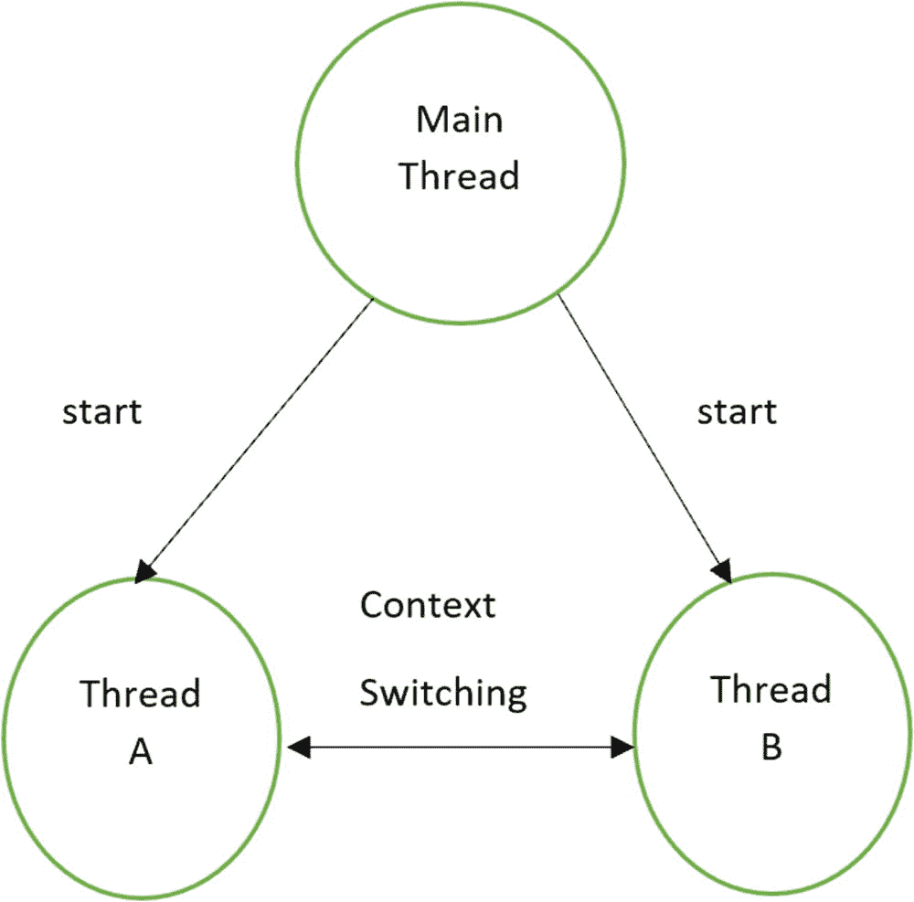
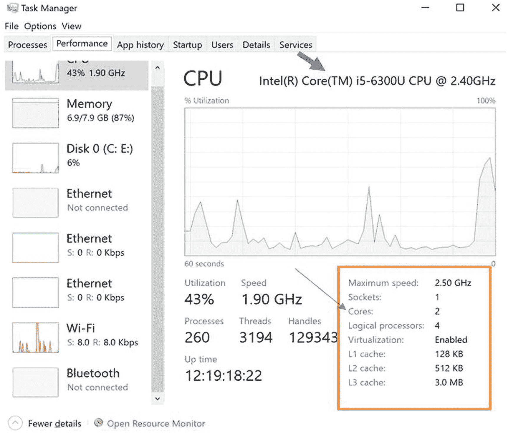
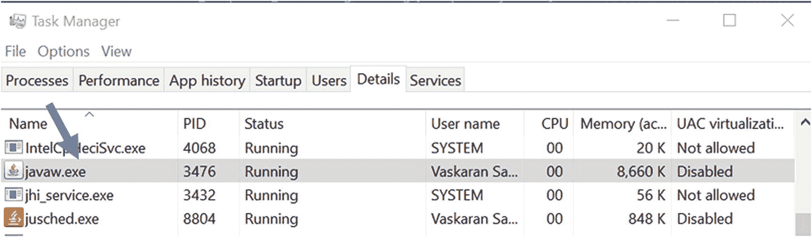
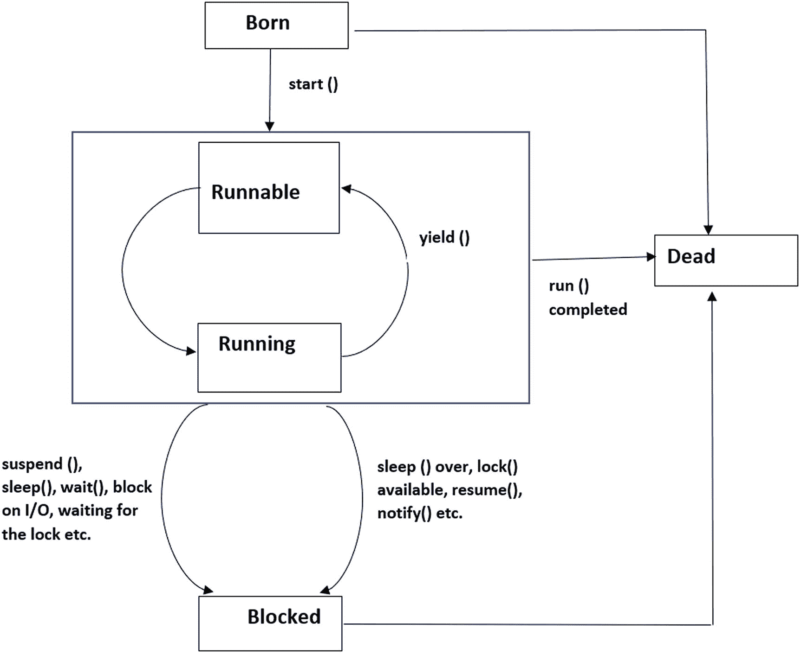

# 11. 线程编程

到目前为止，你所看到的 Java 程序都只有一个顺序执行的控制流；换句话说，一旦程序开始执行，它会按顺序执行所有语句直到结束。因此，在某一特定时刻，只有一条语句正在执行。

线程类似于程序。它有一个单一的控制流。它也有一个介于起点和终点之间的主体，并按顺序执行命令。每个程序至少有一个线程。

Java 支持多线程的概念；也就是说，在 Java 中，一个程序可以有多个控制流。在这些情况下，每个控制流被称为一个线程，并且这些线程可以并行运行。在多线程环境中，每个线程都有独特的执行流程。

这是一种编程范式，它将程序划分为多个可以并行执行的子程序（或部分）。但如果计算机只有一个处理器，它如何能并行执行多个任务呢？实际上，处理器在这些子程序/部分之间切换得非常快，因此在人眼看来，它们似乎是在同时执行。

多线程可以被视为多任务处理的一种特殊情况。注意基于进程的多线程和基于线程的多线程之间的区别非常重要。让我们探究一下理论操作系统书籍中的论述。表 11-1 展示了进程与线程之间的关键区别。

**表 11-1**

**进程与线程的对比**

| **进程** | **线程** |
| --- | --- |
| 1. 分配单元 | 1. 执行单元 |
| 2. 架构构造 | 2. 编码构造——不影响架构 |
| 3. 每个进程有一个或多个线程。 | 3. 每个线程属于一个进程。 |
| 4. 进程间通信（常称为 IPC）——由于上下文切换而代价高昂 | 4. 线程间通信——代价低廉，可以使用进程内存，且可能不需要上下文切换 |
| 5. 安全——一个进程不能破坏另一个进程 | 5. 不安全——一个线程可以写入另一个线程使用的内存 |

因此，线程只是一个轻量级进程*，*并且线程之间的上下文切换代价低廉。基于进程的多*任务*处理*不*在 Java 的控制之下*，*但 Java 可以管理基于线程的多*任务*处理。因此，在本章中，我们将重点讨论基于线程的多*任务*处理*，*并且*从*这里*开始*，我将简称为多*线程*。

管理多线程环境可能具有挑战性，但这对你来说是一个福音，因为你可以更快地完成任务，并显著减少总体空闲时间。考虑一些典型场景：通常，在自动化环境中，计算机的输入速度远快于用户的键盘输入速度。或者，考虑通过网络传输数据的情况——网络传输速率可能慢于接收计算机的消费速率。如果你必须等待每个任务完成才能开始下一个任务，那么总体空闲时间将会更高。因此，在这种情况下，多线程环境始终是更好的选择。Java 帮助你高效地建模多线程环境。

图 11-1 展示了一个多线程程序，其中主线程创建了两个并发运行的线程——线程 A 和线程 B。



**图 11-1**

在多线程程序中，主线程创建另外两个线程，它们全部并行运行

## 创建线程

可以通过以下方式创建线程：

*   **继承 Thread 类**并重写 `run()` 方法。
*   **实现 Runnable 接口**。`Runnable` 接口只有一个名为 `run()` 的方法。因此，当一个具体类实现此 `Runnable` 接口时，它必须重写 `run()` 方法。

所以，你可以猜到每个线程都必须有一个 `run()` 方法。此方法是线程的核心，你可以在 `run()` 方法的主体中实现线程的行为。

### 作者注

如果你查看 `java.lang.Thread` 类的实现，你会注意到以下代码行：

```
public class Thread implements Runnable {//some code}
```

这意味着 `Thread` 类本身实现了 `Runnable` 接口。

## 继承 Thread 类

在演示 1 中，有两个类——`ThreadOne` 和 `ThreadTwo`。每个类都继承 `Thread` 类并重写 `run()` 方法。但你的工作还没有结束。你需要准备好线程，使其处于 Java 运行时调度程序可以运行它们的状态。因此，你需要为每个线程创建一个对象并调用 `start()` 方法。

在演示 1 中，你会注意到 `ThreadOne` **类**及其**对象** `threadOne` 的以下代码行（注意相关注释，以便你更好地理解）：

```
//ThreadOne extends from a Thread class here
class ThreadOne extends Thread{
//An instance of ThreadOne
ThreadOne threadOne=new ThreadOne();
```

你会注意到 `ThreadTwo` **类**及其**对象** `threadTwo` 的类似代码行。最后，以下代码行将调用相应线程的 `run()` 方法：

```
threadOne.start();
threadTwo.start();
```


### 演示 1

现在，让我们来看演示 1。

```
package java2e.chapter11;
//ThreadOne 继承自 Thread 类
class ThreadOne extends Thread {
@Override
public void run() {
for (int i = 0; i " + i);
}
System.out.println("退出-ThreadOne");
}
}
//ThreadTwo 继承自 Thread 类
class ThreadTwo extends Thread {
@Override
public void run() {
for (int i = 0; i " + i);
}
System.out.println("退出-ThreadTwo");
}
}
class Demonstration1 {
public static void main(String[] args) {
System.out.println("***演示-1.通过继承 Thread 类探索多线程。***");
//ThreadOne 的实例
ThreadOne threadOne=new ThreadOne();
//ThreadTwo 的实例
ThreadTwo threadTwo=new ThreadTwo();
//以下代码将调用对应线程的 run() 方法。
threadOne.start();
threadTwo.start();
}
}
```

这是第一次运行的输出：

```
***演示-1.通过继承 Thread 类探索多线程。***
ThreadOne 打印 ->0
ThreadTwo 打印 ->0
ThreadOne 打印 ->1
ThreadTwo 打印 ->1
ThreadOne 打印 ->2
ThreadTwo 打印 ->2
ThreadOne 打印 ->3
ThreadTwo 打印 ->3
ThreadOne 打印 ->4
ThreadTwo 打印 ->4
ThreadOne 打印 ->5
ThreadTwo 打印 ->5
ThreadTwo 打印 ->6
ThreadTwo 打印 ->7
ThreadTwo 打印 ->8
ThreadTwo 打印 ->9
退出-ThreadTwo
ThreadOne 打印 ->6
ThreadOne 打印 ->7
ThreadOne 打印 ->8
ThreadOne 打印 ->9
退出-ThreadOne
```

这是第二次运行的输出：

```
***演示-1.通过继承 Thread 类探索多线程。***
ThreadOne 打印 ->0
ThreadTwo 打印 ->0
ThreadOne 打印 ->1
ThreadOne 打印 ->2
ThreadOne 打印 ->3
ThreadOne 打印 ->4
ThreadOne 打印 ->5
ThreadOne 打印 ->6
ThreadOne 打印 ->7
ThreadOne 打印 ->8
ThreadTwo 打印 ->1
ThreadTwo 打印 ->2
ThreadTwo 打印 ->3
ThreadOne 打印 ->9
ThreadTwo 打印 ->4
退出-ThreadOne
ThreadTwo 打印 ->5
ThreadTwo 打印 ->6
ThreadTwo 打印 ->7
ThreadTwo 打印 ->8
ThreadTwo 打印 ->9
退出-ThreadTwo
```

请注意，第一次运行的输出与第二次运行不同。一旦这些线程开始并发运行，你就无法预测它们的执行顺序。每个线程在获得处理器时都可以运行。在本例中，它们都具有相同的优先级，因此 Java 调度器允许它们基于先到先服务（FCFS）原则共享处理器。稍后你将看到，如果你愿意，可以通过设置优先级来选择执行顺序。

### 注意

当你执行一个 Java 程序时，一个线程会自动启动。这个线程被称为**主线程**。因此，演示 1 中的 `main()` 方法创建了主线程，该线程在 `main()` 方法结束时终止。

## 实现 Runnable 接口

让我们探讨另一种创建线程的方式。这次，我将实现 `Runnable` 接口来创建线程。在这种情况下，你需要执行以下步骤：

1.  声明一个实现 `Runnable` 接口的类。例如：

1.  实现 `run()` 方法。请参见演示 2 中的以下代码行：

```
class Thread2A implements Runnable{//其他代码
```

1.  使用以下 `Thread` 类构造函数创建一个 `Thread` 类对象：

```
class Thread2A implements Runnable {
@Override
public void run() {//其他代码}
}
```

```
public Thread(Runnable target) {}.
```

因此，在演示 2 中，你可以在 `main` 方法内看到以下代码行：

1.  调用线程的 `start` 方法，如下所示：

```
//Thread2A 实现了 Runnable 接口
Thread thread2A=new Thread(new Thread2A());
```

```
thread2A.start();
```

### 演示 2

以下是示例：

```
package java2e.chapter11;
class Thread2A implements Runnable {
@Override
public void run() {
for (int i = 0; i " + i);
}
System.out.println("退出-Thread2A");
}
}
class Demonstration2 {
public static void main(String[] args) {
System.out.println("***演示-2.通过实现 Runnable 接口探索多线程。***");
//Thread2A 实现了 Runnable 接口
Thread thread2A = new Thread(new Thread2A());
thread2A.start();
System.out.println("从主线程退出");
}
}
```

以下是其中一种可能的输出：

```
***演示-2.通过实现 Runnable 接口探索多线程。***
从主线程退出
Thread2A 打印 ->0
Thread2A 打印 ->1
Thread2A 打印 ->2
Thread2A 打印 ->3
Thread2A 打印 ->4
Thread2A 打印 ->5
Thread2A 打印 ->6
Thread2A 打印 ->7
Thread2A 打印 ->8
Thread2A 打印 ->9
退出-Thread2A
```

在演示 2 中，`Thread2A` 类实现了 `Runnable` 接口，因此 `Thread2A` 的对象变成了 `Runnable` 类型。但 `Thread2A` 的对象**不是**线程。

因此，请按如下方式修改你的 `main()` 方法（请注意加粗的行/词，供你参考）：

```
class Demonstration2Modified {
public static void main(String[] args) {
System.out.println("***演示-2.通过实现 Runnable 接口探索多线程。***");
Thread thread2A = new Thread(new Thread2A());// //Thread2A 实现了 Runnable 接口
thread2A.start();
/* Thread2A 类实现了 Runnable 接口，因此
* Thread2A 的对象变成了 Runnable 类型。
* 但 Thread2A 的对象不是线程。
*/
System.out.println("创建另一个 Thread2A 对象");
Thread2A anotherObject=new Thread2A();
anotherObject.run();
System.out.println("从主线程退出");
}
}
```

你可能会注意到一个令人惊讶的输出，如下所示：

```
***演示-2.通过实现 Runnable 接口探索多线程。***
创建另一个 Thread2A 对象
Thread2A 打印 ->0
Thread2A 打印 ->0
Thread2A 打印 ->1
Thread2A 打印 ->1
Thread2A 打印 ->2
Thread2A 打印 ->3
Thread2A 打印 ->4
Thread2A 打印 ->5
Thread2A 打印 ->6
Thread2A 打印 ->7
Thread2A 打印 ->8
Thread2A 打印 ->2
Thread2A 打印 ->3
Thread2A 打印 ->4
Thread2A 打印 ->5
Thread2A 打印 ->6
Thread2A 打印 ->7
Thread2A 打印 ->8
Thread2A 打印 ->9
退出-Thread2A
从主线程退出
Thread2A 打印 ->9
退出-Thread2A
```

在这种情况下，尽管你调用了 `run()` 方法，但它是在同一个线程中被调用的。要在一个新线程中运行它，你需要实例化并启动一个新的 `Thread` 对象。

### 注意

当一个类实现 `Runnable` 接口时，它涉及两个对象——一个是 `Runnable` 对象，另一个是 `Thread` 对象。`Runnable` 对象包含线程开始运行时执行的代码。因此，在 `Thread` 对象的执行过程中，你可以看到 `Runnable` 对象的 `run()` 方法的执行。


### 问答环节

**11.1 使用多线程环境相比单线程环境的关键优势是什么？**

在单线程环境中，如果线程被阻塞，整个程序就会停止执行，而在多线程环境中则不会出现这种情况。除此之外，你还可以通过高效利用 CPU 来减少总体空闲时间。稍后你将了解到，在多线程环境中可以避免轮询。

**11.2 我有一台双核（或多核）系统。多线程还能帮到我吗？**

早期，大多数计算机只有一个核心，在这些系统中，并发线程实际上共享 CPU 时间片；也就是说，它们无法并行运行。但是，通过使用多线程的概念，你可以通过高效利用 CPU 来减少总体空闲时间。如果你有多个处理器，则可以并发运行多个线程。因此，你可以进一步提高程序的速度。

**11.3 什么是上下文切换？**

它使你能够保存当前线程（或进程）的状态，以便稍后可以从该点恢复执行。

**11.4 创建线程时应该使用哪种方法？我应该继承** **Thread** **类，还是应该实现** **Runnable** **接口？**

这取决于你的选择以及许多其他约束条件。如果你的类继承了 `Thread` 类，则无法再继承任何其他类，因为 Java 不允许通过类进行多重继承。当你实现 `Runnable` 接口时，你可以继承另一个父类。

另一方面，`Runnable` 接口只有一个方法 `run()`，它也是一个抽象方法（根据接口定义）。因此，没有完全内置的方法可供你直接使用。但是 `Thread` 类有许多内置方法，例如 `yield()`、`sleep()`、`getName()`、`setName()` 等。如果你的类继承了 `Thread` 类，则可以使用这些方法。此外，在实例化 `Thread` 类时，你可以使用不同类型的构造函数。

### 演示 3

现在考虑演示 3。在继续之前，这里有一些重要的点需要考虑：

*   这次我使用了 `Thread` 类构造函数的重载版本来创建线程。在这个版本中，我可以在线程实例化期间提供线程的名称。

*   我还使用了 `Thread` 类中的一些可用方法；例如，`currentThread()`、`getName()`、`setName()`、`getPriority()` 和 `setPriority()`。如前所述，如果你选择通过实现 `Runnable` 接口来创建线程，这些方法将不可用。

*   方法 `setPriority(int newPriority)` 用于设置线程的优先级。Java 定义了以下优先级：

```
    //线程的最小优先级
    public final static int MIN_PRIORITY = 1;
    //线程的默认优先级
    public final static int NORM_PRIORITY = 5;
    ```

```
//线程的最大优先级
public final static int MAX_PRIORITY = 10;
```

以下是完整的实现：

```
package java2e.chapter11;
class Thread3A extends Thread {
public Thread3A(String name) {
super(name);
}
public void run() {
for (int i = 0; i < 10; i++) {
System.out.println(this.getName() + " is executing and prints : "+ i);
}
System.out.println("Exit-"+ this.getName());
}
}
class Thread3B extends Thread {
public Thread3B(String name) {
super(name);
}
public void run() {
for (int i = 0; i < 10; i++) {
System.out.println(this.getName() + " is executing.It is printing : "+i);
}
System.out.println("Exit-"+ this.getName());
}
}
class Demonstration3 {
public static void main(String[] args) throws InterruptedException {
System.out.println("***Demonstration-3.Exploring multithreading by extending Thread class.***");
// 获取主线程的引用
Thread mainThread = Thread.currentThread();
// 获取主线程的详细信息
System.out.println("Current thread: " + mainThread.getName() + " and priority: " +mainThread.getPriority());
Thread3A thread3A = new Thread3A("Thread3A");
thread3A.setPriority(Thread.MIN_PRIORITY);//1
Thread3B thread3B = new Thread3B("Thread3B");
// 更新线程的名称-ThreadDemo4
thread3B.setName("ThreadDemonstration3B");
thread3B.setPriority(Thread.MAX_PRIORITY);//10
System.out.println("Thread3A priority is " + thread3A.getPriority());
System.out.println("ThreadDemonstration3B priority is " + thread3B.getPriority());
thread3A.start();
thread3B.start();
for (int i = 0; i <10; i++) {
System.out.println( mainThread.getName() + " is executing and prints : "+ i);
}
System.out.println("Exit main()");
}
}
```

以下是其中一种可能的输出。

```
***Demonstration-3.Exploring multi-threading by extending Thread class.***
Current thread: main and priority: 5
Thread3A priority is 1
ThreadDemonstration3B priority is 10
main is executing and prints : 0
ThreadDemonstration3B is executing.It is printing : 0
main is executing and prints : 1
ThreadDemonstration3B is executing.It is printing : 1
main is executing and prints : 2
ThreadDemonstration3B is executing.It is printing : 2
Thread3A is executing and prints : 0
ThreadDemonstration3B is executing.It is printing : 3
main is executing and prints : 3
main is executing and prints : 4
main is executing and prints : 5
Thread3A is executing and prints : 1
ThreadDemonstration3B is executing.It is printing : 4
Thread3A is executing and prints : 2
main is executing and prints : 6
main is executing and prints : 7
main is executing and prints : 8
main is executing and prints : 9
Thread3A is executing and prints : 3
ThreadDemonstration3B is executing.It is printing : 5
Thread3A is executing and prints : 4
Exit main()
Thread3A is executing and prints : 5
ThreadDemonstration3B is executing.It is printing : 6
ThreadDemonstration3B is executing.It is printing : 7
ThreadDemonstration3B is executing.It is printing : 8
ThreadDemonstration3B is executing.It is printing : 9
Thread3A is executing and prints : 6
Exit-ThreadDemonstration3B
Thread3A is executing and prints : 7
Thread3A is executing and prints : 8
Thread3A is executing and prints : 9
Exit-Thread3A
```

以下是另一种可能的输出（在具有不同配置的另一台机器上执行）。

```
***Demonstration-3.Exploring multi-threading by extending Thread class.***
Current thread: main and priority: 5
Thread3A priority is 1
ThreadDemonstration3B priority is 10
main is executing and prints : 0
ThreadDemonstration3B is executing.It is printing : 0
ThreadDemonstration3B is executing.It is printing : 1
ThreadDemonstration3B is executing.It is printing : 2
ThreadDemonstration3B is executing.It is printing : 3
ThreadDemonstration3B is executing.It is printing : 4
ThreadDemonstration3B is executing.It is printing : 5
ThreadDemonstration3B is executing.It is printing : 6
ThreadDemonstration3B is executing.It is printing : 7
ThreadDemonstration3B is executing.It is printing : 8
ThreadDemonstration3B is executing.It is printing : 9
Exit-ThreadDemonstration3B
main is executing and prints : 1
main is executing and prints : 2
main is executing and prints : 3
main is executing and prints : 4
main is executing and prints : 5
main is executing and prints : 6
main is executing and prints : 7
main is executing and prints : 8
main is executing and prints : 9
Exit main()
Thread3A is executing and prints : 0
Thread3A is executing and prints : 1
Thread3A is executing and prints : 2
Thread3A is executing and prints : 3
Thread3A is executing and prints : 4
Thread3A is executing and prints : 5
Thread3A is executing and prints : 6
Thread3A is executing and prints : 7
Thread3A is executing and prints : 8
Thread3A is executing and prints : 9
Exit-Thread3A
```


你可能认为第二次运行的输出是预期的，而第一次运行的输出是意外的（因为主线程在更高优先级的线程之前退出了）。但同样，此演示中的输出可能会有所不同。理论上，高优先级线程比低优先级线程获得更多的 CPU 时间，并且它们可以抢占低优先级线程。但在实际中，这可能取决于许多其他因素；例如，系统的配置、操作系统实现多任务概念的方式等。除了这些因素之外，输出还可能因线程正在执行的任务、任务的大小（例如，一个小任务可能在被高优先级线程抢占之前完成）等而变化。因此，你不应明确依赖优先级。如果 CPU 可用，低优先级线程也有机会运行，并且如果它执行的任务非常小，它可能会提前完成。通常，线程是异步运行的；因此，你会看到随机输出。

图 11-2 中的输出是在前一个程序于具有如下所示配置的系统中运行时生成的（请注意，这是一个双核系统；它配备了第六代 Intel® Core™ i5-6300 处理器）。



图 11-2

来自配备第六代 Intel® Core™ i5-6300 处理器的双核系统的配置详细信息快照

但是，当程序在另一台机器上运行时，输出会有所不同，该机器也是一个双核系统，但配置不同，如图 11-3 所示（请注意，这是一个配备第八代 Intel® Core™ i3 处理器的双核系统）。


图 11-3

来自另一个配备第八代 Intel® Core™ i3 处理器的双核系统的配置详细信息快照

### 注意

在多线程 Java 程序中，你可能会注意到使用了抢占式调度，其中高优先级线程会抢占低优先级线程。但你已经看到，这种行为并不总是确定的。该行为还取决于底层平台。理论上，两个相同优先级的线程不能互相抢占，这在非抢占式环境中可能会产生问题。因此，对于相同优先级的线程，最好基于某些条件（例如，等待 I/O 操作等）释放控制权，以便每个线程都能运行并完成其任务。

## 不同线程类方法的案例研究

到目前为止，你已经看到了以下方法的使用：

*   `run()`

*   `start()`

*   `setPriority(int number)`

*   `getPriority()`

*   `currentThread()`

*   `getName()`

*   `setName()`

让我们对 `Thread` 类中的更多方法进行案例研究。在下面的演示中，你将看到以下方法的使用：

*   `sleep(long millis)`：这会导致指定的线程休眠。当你想要暂时停止线程的执行时，可以使用它。参数以毫秒为单位传递。此方法可能抛出 `InterruptedException` 或 `IllegalArgumentException`（如果你传递负的毫秒值或该值不在 0–999999 范围内）。因此，你需要用 try/catch 块包围此方法。

*   `yield()`：当你希望一个线程（当前正在使用处理器）将其控制权让给另一个线程时，可以使用此方法（尽管调度程序可以忽略此请求）。此方法可用于调试目的或设计并发控制结构。它也有助于重现竞态条件中的错误。

*   `interrupt()`：此方法可用于向线程发送中断信号。

### 演示 4

考虑以下演示和输出，如果你理解了前面的理论，这些内容是不言自明的：

```
package java2e.chapter11;
class Thread4A extends Thread {
public void run() {
for (int i = 0; i < 5; i++) {
System.out.println("Thread4A prints ->" + i);
if (i == 2) {
System.out.println("Going to interrupt the thread.");
interrupt();// Interrupts this thread
System.out.println("Is Thread4A interrupted?"+this.interrupted());
}
}
System.out.println("Exit-Thread4A");
}
}
class Thread4B extends Thread {
public void run(){
for (int j = 0; j < 5; j++) {
System.out.println("Thread4B prints ->" + j);
if (j == 3) {
try {
sleep(5000);//sleeps for 5000 milliseconds
} catch (InterruptedException e) {
e.printStackTrace();
}
}
}
System.out.println("Exit-Thread4B");
}
}
class Thread4C extends Thread {
public void run() {
for (int k = 0; k < 5; k++) {
System.out.println("Thread4C prints ->" + k);
if(k==4) {
yield();
}
}
System.out.println("Exit-Thread4C");
}
}
class Demonstration4 {
public static void main(String[] args) throws InterruptedException {
System.out.println("***Demonstration-4.Exploring multi-threading with yield(),sleep(), and interrupt() methods of the Thread class.***");
Thread4A thread4A=new Thread4A();
Thread4B thread4B=new Thread4B();
Thread4C thread4C=new Thread4C();
thread4A.start();
thread4B.start();
thread4C.start();
System.out.println("Is Thread4A interrupted now?"+thread4A.interrupted());
Thread.sleep(1000);
System.out.println("Exit-main()");
}
}
```

以下是可能的输出：

```
***Demonstration-4.Exploring multi-threading with yield(), sleep(), and interrupt() methods of the Thread class.***
Is Thread4A interrupted now?false
Thread4C prints ->0
Thread4B prints ->0
Thread4B prints ->1
Thread4A prints ->0
Thread4B prints ->2
Thread4B prints ->3
Thread4C prints ->1
Thread4A prints ->1
Thread4C prints ->2
Thread4A prints ->2
Going to interrupt the thread.
Thread4C prints ->3
Is Thread4A interrupted?true
Thread4C prints ->4
Thread4A prints ->3
Exit-Thread4C
Thread4A prints ->4
Exit-Thread4A
Exit-main()
Thread4B prints ->4
Exit-Thread4B
```

### 问答环节

**11.5 在之前的演示中，我看到主线程在子线程之前完成。但在许多情况下，我想避免这种情况。在这种情况下，我应该怎么做？**

`sleep()` 方法可以帮助你，但它不是一个理想的解决方案。更好的解决方案是使用 `join()` 方法（它有多个重载版本）。这里，我提供了演示 4 中 `main()` 方法的更新版本（注意粗体行）。一旦你执行此代码，你会注意到主线程总是在最后完成。

```
class Demonstration4 {
public static void main(String[] args) throws InterruptedException {
System.out.println("***Demonstration-4.Exploring multi-threading with yield(),sleep(), and interrupt() methods of the Thread class.***");
Thread4A thread4A = new Thread4A();
Thread4B thread4B = new Thread4B();
Thread4C thread4C = new Thread4C();
thread4A.start();
thread4B.start();
thread4C.start();
System.out.println("Is Thread4A interrupted now?" + thread4A.interrupted());
Thread.currentThread().sleep(1000);
//Modified program to show the use of join()
//Waiting for the threads to complete before main //thread.
thread4A.join();
thread4B.join();
thread4C.join();
System.out.println("Exit-main()");
}
}
```

以下是修改后的输出。请注意，`Exit-main()` 出现在最后。

```
***Demonstration-4.Exploring multi-threading with yield(),sleep(), and interrupt() methods of the Thread class.***
Thread4B prints ->0
Thread4C prints ->0
Thread4C prints ->1
Thread4C prints ->2
Thread4A prints ->0
Thread4A prints ->1
Is Thread4A interrupted now?false
Thread4A prints ->2
Going to interrupt the thread
Thread4C prints ->3
Thread4B prints ->1
Thread4B prints ->2
Thread4B prints ->3
Thread4C prints ->4
Is Thread4A interrupted?true
Thread4A prints ->3
Thread4A prints ->4
Exit-Thread4A
Exit-Thread4C
Thread4B prints ->4
Exit-Thread4B
Exit-main()
```


### 要点提示

还有另一种名为 `isAlive()` 的方法，可用于检查线程是处于活动状态还是已终止。例如，可以在 `main()` 中使用以下代码来验证 `Thread4B` 对象是否处于活动状态：

```
//Testing whether Thread4B object is alive or not.
System.out.println(" Thread 4B is alive? "+ thread4B.isAlive());
```

## 同步

有时多个线程需要访问某些共享资源。控制此类情况颇具技巧性；例如，考虑这样一种情况：一个线程正试图从文件中读取数据，而另一个线程仍在同一文件中写入或更新数据。如果无法有效控制这种情况，可能会得到令人意外的结果。同步的概念在此类情况下非常有用。Java 可以通过同步方法和语句帮助你控制这种情况。

### 同步方法的使用

让我们从同步方法开始。为了理解同步方法的强大之处，我们先从一个未实现该概念的程序开始。在下面的演示中，`MyClass5A` 是一个简单的类，其中包含一个 `display()` 方法。你可以像下面这样在方法前加上关键字 `synchronized`，使其成为同步方法：

```
synchronized void display(){
//some code
}
```

因为我们是从非同步版本开始的，所以在接下来的演示中，我已将代码的同步部分注释掉了。

假设在 `display()` 内部有一些共享资源。为简单起见，我放入了一些简单的语句来指示线程的进入和退出。为了精确观察效果，我还在方法体内放入了一个简单的 `sleep` 语句。它可以帮助你将执行切换到另一个线程。

有一个线程类 `Thread5B`，其构造函数如下：

```
public Thread5B(MyClass5A myObject, String name) {
super(name);
this.myClass5AObject = myObject;
}
```

因此，要实例化 `Thread5B` 类，你可以传入一个 `MyClass5A` 对象和一个字符串作为参数。在下面的程序中，我创建了该类的两个实例，为了清晰区分它们，我将字符串参数分别设为 `Thread5B-1` 和 `Thread-5B-2`。

一旦运行该程序的非同步版本，你可能会注意到以下输出：

```
Thread5B-1 has entered and working in the shared location.
Thread5B-2 has entered and working in the shared location.
Thread5B-1 exits.
Thread5B-2 exits.
```

输出表明 `Thread5B-1` 首先进入了共享位置。但在它完成执行之前，`Thread5B-2` 也进入了共享位置。

但是，如果一个线程正在共享位置中工作，你可能希望限制任何其他线程进入该位置。因此，这次你取消注释 `display()` 的同步版本，并注释掉其非同步版本。现在，如果你运行该程序，你会看到通过同步方法实现了目标。

### 演示 5

以下是完整代码：

```
package java2e.chapter11;
class MyClass5A {
//Synchronized version
//synchronized void display() {
//Non-synchronized version
void display() {
System.out.print(Thread.currentThread().getName() + " has entered and working in the shared location. \n");
try {
Thread.sleep(1000);
} catch (InterruptedException e) {
e.printStackTrace();
}
System.out.print(Thread.currentThread().getName() + " exits.\n");
}
}
class Thread5B extends Thread {
MyClass5A myClass5AObject;
public Thread5B(MyClass5A myObject, String name) {
super(name);
this.myClass5AObject = myObject;
}
@Override
public void run() {
myClass5AObject.display();
}
}
class Demonstration5 {
public static void main(String[] args) throws InterruptedException {
System.out.println("***Demonstration-5.Exploring multi-threading with synchronized method.***");
MyClass5A myObject = new MyClass5A();
Thread5B ob1 = new Thread5B(myObject, "Thread5B-1");
Thread5B ob2 = new Thread5B(myObject, "Thread5B-2");
ob1.start();
ob2.start();
}
}
```

不使用同步方法时的输出：

```
***Demonstration-5.Exploring multi-threading with( and without) synchronized method.***
Thread5B-1 has entered and working in the shared location.
Thread5B-2 has entered and working in the shared location.
Thread5B-1 exits.
Thread5B-2 exits.
```

使用同步方法时的输出：

```
***Demonstration-5.Exploring multi-threading with( and without) synchronized method.***
Thread5B-1 has entered and working in the shared location.
Thread5B-1 exits.
Thread5B-2 has entered and working in the shared location.
Thread5B-2 exits.
```

### 同步块的使用

在某些情况下，同步方法可能无法满足你的需求；例如，假设有一个类使用了第三方代码，而你无法直接访问其代码库。你注意到在多线程环境中，该类中有一个方法（非同步方法）可能被多个线程同时使用。

为了处理此类场景，Java 提供了同步块。如果你希望对某个类的对象进行同步访问，可以使用它。

以下是同步块的一般格式：

```
synchronized (theObjectReference) {
//Some code
}
```

### 演示 6

以下是一个同步块的示例：

```
package java2e.chapter11;
class MyClass6A {
//synchronized void display() {
void display() {
System.out.print(Thread.currentThread().getName() + " has entered and working in the shared location. \n");
try {
Thread.sleep(1000);
} catch (InterruptedException e) {
e.printStackTrace();
}
System.out.print(Thread.currentThread().getName() + " exits.\n");
}
}
class Thread6B extends Thread {
MyClass6A myClass6AObject;
public Thread6B(MyClass6A myObject, String name) {
super(name);
this.myClass6AObject = myObject;
}
@Override
public void run() {
synchronized (myClass6AObject) {
myClass6AObject.display();
}
}
}
class Demonstration6 {
public static void main(String[] args) throws InterruptedException {
System.out.println("***Demonstration-6.Exploring multi-threading with synchronized statements.***");
MyClass6A myObject = new MyClass6A();
Thread6B thread1 = new Thread6B(myObject, "Thread6B-1");
Thread6B thread2 = new Thread6B(myObject, "Thread6B-2");
thread1.start();
thread2.start();
}
}
```

输出：

```
***Demonstration-6.Exploring multi-threading with synchronized statements.***
Thread6B-1 has entered and working in the shared location.
Thread6B-1 exits.
Thread6B-2 has entered and working in the shared location.
Thread6B-2 exits.
```

这一次，`display()` 方法不是同步的，但我在 `Thread6B` 的 `run()` 方法中使用了同步块，并且该线程调用了 `MyClass6A` 的 `display()` 方法。你会注意到，多个线程无法同时进入共享位置。相反，每个线程都会等待前一个线程完成其在共享位置中的工作。

## 死锁

死锁是一种情况或状态，其中至少有两个进程（或线程）在相互等待对方完成（或释放控制），以便各自能够完成其任务。这可能导致两者都无法启动（并都进入挂起状态）。你可能经常听到这些现实生活中的例子：

*   *没有经验就找不到工作；没有工作就得不到经验。*

或者，

*   *两个亲密朋友吵架后，都期望对方先道歉。*

### 注意

没有同步，你可能会注意到意外结果（例如，数据损坏），但同步使用不当，则可能遇到死锁。


### 死锁的类型

让我们快速回顾一下操作系统理论。死锁有不同的类型，例如：

*   **资源死锁**：假设有两个进程 P1 和 P2，分别持有资源 R1 和 R2。P1 正在请求资源 R2，而 P2 正在请求资源 R1，以完成它们的工作。操作系统通常关注这种类型的死锁。

*   **同步死锁**：假设进程 P1 正在等待执行动作 a1，但必须等到 P2 完成特定动作 a2 之后；而 P2 正在等待完成动作 a2，但必须等到 P1 完成 a1 之后。

*   **通信死锁**：与前面的场景类似。你可以将动作/资源的概念替换为消息；即，两个进程正在等待接收彼此的消息才能继续执行。

### 演示 7

在本章中，你将重点关注多线程环境。因此，我将讨论在你的 Java 应用程序中因拥有多个线程而可能导致的死锁。

```
package java2e.chapter11;
class SharedResource1 {
static synchronized void startingPart() throws InterruptedException {
System.out.println(Thread.currentThread().getName() + ": enters starting part-SharedResource1.");
Thread.sleep(100);
System.out.println(Thread.currentThread().getName() + ": Waiting to get endPart of SharedResource2.");
SharedResource2.endPart();
System.out.println(Thread.currentThread().getName() + ": Exits starting part-SharedResource1");
}
static synchronized void endPart() throws InterruptedException {
System.out.println(Thread.currentThread().getName() + ": Exits SharedResource1.endingPart .");
}
}
class SharedResource2 {
static synchronized void startingPart() throws InterruptedException {
System.out.println(Thread.currentThread().getName() + ": enters starting part of SharedResource2.");
Thread.sleep(100);
System.out.println(Thread.currentThread().getName() + ": Waiting to get endPart-SharedResource1.");
SharedResource1.endPart();
System.out.println(Thread.currentThread().getName() + ": Exits starting part of SharedResource2.");
}
static synchronized void endPart() throws InterruptedException {
System.out.println(Thread.currentThread().getName() + ": Exits end part of SharedResource2.");
}
}
class First extends Thread {
public First(String name) {
super(name);
}
public void run() {
try {
SharedResource1.startingPart();
} catch (InterruptedException e) {
e.printStackTrace();
}
}
}
class Second extends Thread {
public Second(String name) {
super(name);
}
public void run() {
try {
SharedResource2.startingPart();
} catch (InterruptedException e) {
e.printStackTrace();
}
}
}
class Deadlock {
public static void main(String[] args) {
System.out.println("***Demonstration- Incorrect design leads to deadlock.***\n");
// An instance of ThreadOne
First first = new First("FirstThread");
// An instance of Threadtwo
Second second = new Second("SecondThread");
first.start();
second.start();
}
}
```

输出：

```
***Demonstration- Incorrect design leads to deadlock.***
FirstThread: enters starting part-SharedResource1.
SecondThread: enters starting part of SharedResource2.
SecondThread: Waiting to get endPart-SharedResource1.
FirstThread: Waiting to get endPart of SharedResource2.
```

### 检测系统中的死锁

本书中的示例均在 Windows 10 系统上测试。在这里，你可以找到应用程序的进程 ID，并使用 `jstack` 命令来调查长时间运行的进程或死锁。例如，当你发现程序没有按预期终止时，可以找到应用程序的进程 ID，并使用 `jstack` 命令进行调查。步骤如下所述。



图 11-4

在 Windows 10 系统中检索进程 javaw.exe 的详细信息。像下面这样，将进程 ID 与 `jstack` 命令一起使用。

1.  使用 Ctrl+Alt+Delete 打开任务管理器。

2.  选择**详细信息**选项卡以查看 PID，如图 11-4 所示。

```
C:\Users\Vaskaran Sarcar>jstack 3476
```

现在你可以获取死锁的详细信息：

```
//此处省略了一些附加信息
Found one Java-level deadlock:
=============================
"SecondThread":
waiting to lock monitor 0x000000000288ac38 (object 0x00000000eb349b40, a java.lang.Class),
which is held by "FirstThread"
"FirstThread":
waiting to lock monitor 0x0000000002888198 (object 0x00000000eb39ba10, a java.lang.Class),
which is held by "SecondThread"
Java stack information for the threads just listed:
===================================================
"SecondThread":
at java2e.chapter11.SharedResource1.endPart(Deadlock.java:13)
- waiting to lock  (a java.lang.Class for java2e.chapter11.SharedResource1)
at java2e.chapter11.SharedResource2.startingPart(Deadlock.java:22)
- locked  (a java.lang.Class for java2e.chapter11.SharedResource2)
at java2e.chapter11.Second.run(Deadlock.java:49)
"FirstThread":
at java2e.chapter11.SharedResource2.endPart(Deadlock.java:27)
- waiting to lock  (a java.lang.Class for java2e.chapter11.SharedResource2)
at java2e.chapter11.SharedResource1.startingPart(Deadlock.java:8)
- locked  (a java.lang.Class for java2e.chapter11.SharedResource1)
at java2e.chapter11.First.run(Deadlock.java:37)
Found 1 deadlock.
```

或者，你可以使用 Java 虚拟机进程状态（JPS）工具来识别需要进一步调查的进程 ID。Oracle Java 文档说明如下：

*   “`jps` 命令列出目标系统上已检测的 Java HotSpot VM。该命令仅限于报告其具有访问权限的 JVM 的信息。”

在命令行中，如果你输入 `jps -help`，你将看到以下信息：

```
C:\Users\sarcarv>jps -help
usage: jps [-help]
jps [-q] [-mlvV] []
Definitions:
:      [:]
```

因此，你可以使用以下命令：

```
jps -l -m
```

根据文档：

*   `-m` 显示传递给 `main()` 方法的参数。对于嵌入式 JVM，输出可能为 `null`。

*   `-l` 显示应用程序 `main` 类的完整包名或应用程序 JAR 文件的完整路径名。

如果你想探索其他细节，可以参考 JDK11 文档，或者直接访问以下链接：

[`https://docs.oracle.com/en/java/javase/11/tools/jps.html#GUID-6EB65B96-F9DD-4356-B825-6146E9EEC81E`](https://docs.oracle.com/en/java/javase/11/tools/jps.html%2523GUID-6EB65B96-F9DD-4356-B825-6146E9EEC81E)

以下是使用 `jps` 命令的示例：

```
C:\Users\sarcarv>jps -l -m
19520 sun.tools.jps.Jps -l -m

17420 java2e.chapter11.Demonstration7
```

现在，你可以像下面这样，将进程 ID 与 `jstack` 命令一起使用以进行进一步调查：

```
C:\Users\sarcarv>jstack 17420
```

### 注意

`jps` 和 `jstack` 命令是实验性的，不受 Oracle 支持。


## 线程间通信

轮询是一种反复检查某个条件的机制。考虑一个经典的生产者-消费者问题，其中生产者的生产速度可能高于消费者的消费速度（反之亦然）。如果生产者需要反复检查消费者的消费状态，就会浪费 CPU 周期。

为了避免多线程环境中的此类问题，Java 在 `Object` 类中定义了以下方法：

*   `wait()`：该方法会使当前线程等待，直到另一个线程调用 `notify()` 或 `notifyAll()` 方法。该方法有重载版本，可以在其中指定等待时间。

*   `notify()`：该方法唤醒单个线程。语言文档说明如下：“唤醒一个正在此对象监视器上等待的线程。如果有任何线程正在此对象上等待，则会选择其中一个唤醒。选择是任意的，由实现自行决定。” 文档还建议，应该由实际拥有对象监视器的线程来调用此方法。

*   `notifyAll()`：此方法唤醒所有在同一个对象上调用 `wait()` 的线程。语言文档进一步说明：“被唤醒的线程在当前线程释放此对象的锁之前无法继续执行。被唤醒的线程将以通常的方式与任何其他可能正在积极竞争同步此对象的线程进行竞争；例如，被唤醒的线程在成为下一个锁定此对象的线程时，没有可靠的特权或劣势。” 与 `notify()` 调用一样，它也建议由实际拥有对象监视器的线程来调用此方法。

    **注意** 有一个术语叫做*虚假唤醒*，它表示线程可能在没有被通知、中断或超时的情况下被唤醒。虽然这种情况很少见，但 Oracle 建议您通过检查来防范这种情况，以验证导致线程被唤醒的条件。如果条件不满足，线程应继续等待。

实现线程间通信很困难，您可能需要考虑许多复杂的场景。但为了便于理解，让我们来看一下下面的演示，它具有以下特点：

*   在此示例中，有一个名为 `SharedResource` 的单例类。简单来说，单例类是一个无法从中创建多个对象的类。一旦从单例类创建了一个对象，您需要重用该对象，而不是实例化一个新对象。创建 `Singleton` 类有多种方法。在接下来的演示中，我将展示一种构建此类结构的方法。因此，您可以猜到，我使用单例类来限制从此类创建的对象数量。同时，它也将帮助我轻松地获取同一个对象的锁。

*   两个同步方法——`allowJob()` 和 `performJob()`——被放置在这个单例类中。`performJob()` 将执行一个简单的任务，即打印 0 到 9，而 `allowJob()` 将等待 `performJob()` 完成。为简单起见，我设置了一个布尔标志 `jobDone`，其默认值为 `false`。一旦任何线程完成 `performJob()`，它就会将该标志设置为 `true`。

*   有两个线程——`FirstThread` 和 `SecondThread`。`FirstThread` 先启动并开始在 `allowJob()` 中工作，但由于它看到 `jobDone` 标志值为 `false`，因此它释放控制权并开始等待 `SecondThread` 完成 `performJob()`。

### 演示 8

以下是代码：

```
package java2e.chapter11;
//一个单例类
class SharedResource {
static boolean jobDone = false;
// 我们将构造函数设为私有，以防止使用 "new"
private SharedResource() {
}
private static SharedResource sharedInstance;
public static synchronized SharedResource getInstance() {
if (sharedInstance == null) {
System.out.println("创建单例实例");
sharedInstance = new SharedResource();
} else {
System.out.println("我已经创建了一个 SharedResource 实例。我正在使用它。");
}
return sharedInstance;
}
synchronized void allowJob() {
System.out.println(Thread.currentThread().getName() + " 进入 allowJob()。");
System.out.println("检查是否允许执行新任务。");
if (jobDone != true) {
System.out.println("等待任何现有/待处理任务完成（即 jobDone 标志变为 true）。");
try {
System.out.println("在 allowJob() 中释放控制权。");
wait();
System.out.println("wait() 已执行。");
} catch (Exception e) {
}
}
System.out.println("准备允许新任务。");
}
synchronized void performJob() throws InterruptedException {
System.out.println(Thread.currentThread().getName() + " 进入 performJob()");
System.out.println("一个任务正在进行中。");
for (int i = 0; i < 10; i++) {
// 可以执行任何任意任务。这里我们只是打印 0 到 9。
System.out.print("\t" + i);
Thread.sleep(100);
}
System.out.println(" ");
System.out.println("任务完成。");
jobDone = true;
notify();
//notifyAll();
}
}
//FirstThread 类
class FirstThread extends Thread {
public FirstThread(String name) {
super(name);
}
@Override
public void run() {
SharedResource.getInstance().allowJob();
// new SharedResource().allowJob();//错误
System.out.println("退出-FirstThread。");
}
}
//SecondThread 类
class SecondThread extends Thread {
public SecondThread(String name) {
super(name);
}
@Override
public void run() {
try {
SharedResource.getInstance().performJob();
} catch (InterruptedException e) {
e.printStackTrace();
}
// new SharedResource().performJob();//错误
System.out.println("退出-SecondThread。");
}
}
class InterThreadCommunication {
public static void main(String args[]) throws InterruptedException {
System.out.println("***演示 8\. 一个关于线程间通信的简单演示。***");
FirstThread first = new FirstThread("FirstThread");
first.start();
// 我们希望 FirstThread 先开始执行
Thread.sleep(1000);
SecondThread second = new SecondThread("SecondThread");
second.start();
}
}
```

以下是可能的输出：

```
***演示 8\. 一个关于线程间通信的简单演示。***
创建单例实例
FirstThread 进入 allowJob()。
检查是否允许执行新任务。
等待任何现有/待处理任务完成（即 jobDone 标志变为 true）。
在 allowJob() 中释放控制权。
我已经创建了一个 SharedResource 实例。我正在使用它。
SecondThread 进入 performJob()
一个任务正在进行中。
0     1     2     3     4     5     6     7     8     9
任务完成。
退出-SecondThread。
wait() 已执行。
准备允许新任务。
退出-FirstThread。
```

您可以看到，我特意想让 `FirstThread` 先执行，以便您能看到 `wait()` 和 `notify()` 的工作机制。我提请您的注意，`wait()` 是在单例实例上调用的。重要的是要注意，您应该始终唤醒在同一个对象上调用 `wait()` 的特定线程。

如果您不想使用单例类的概念，只需注释掉私有构造函数，然后在 `main()` 内部，您可以使用以下代码：

```
final SharedResource c = new SharedResource();
new Thread() {
public void run() {
c.allowJob();
}
}.start();
new Thread() {
public void run() {
try {
c.performJob();
} catch (InterruptedException e) {
e.printStackTrace();
}
}
}.start();
```

在这种情况下，您不需要创建像 `FirstThread` 或 `SecondThread` 这样的类，并且整体代码量减少了。尽管您可以从 `SharedResource` 类创建任意数量的实例，但您可能会同意我的观点，即这段代码不易阅读，因此我使用了与之前演示相同的方法。


### 要点提示

你必须在同步上下文中使用 `wait()`、`notify()` 和 `notifyAll()`。否则，可能会遇到 `java.lang.IllegalMonitorStateException` 异常。如果允许在非同步上下文中使用这些方法，等待线程*可能*会错过通知线程的通知，从而永远等待下去。

## 线程的生命周期

你已经看到线程可以处于多种状态，但在任何特定时刻，它只能处于一种特定状态：

*   在**新建**状态下，线程刚被创建，但尚未调用 `start()` 方法。

*   一旦你调用了 `start()` 方法，线程就处于**可运行**状态，但调度器尚未允许它运行。

*   在**运行**状态下，调度器允许线程执行。

*   当调用 `suspend()`、`wait()`、`sleep()` 等方法时，线程可以进入**不可运行**或**阻塞**状态。但一旦调用了 `resume()`，或者 `sleep()` 结束，或者调用了 `notify()` 和 `notifyAll()` 等方法，线程就可以再次回到可运行状态。

*   最后，一旦线程执行完 `run()` 方法，它就处于**死亡**状态。

    **注意** 在 Java 11 中，Oracle 从 `java.lang.Thread` 类中移除了已废弃的 `stop()` 和 `destroy()` 方法。移除 `stop()` 方法的一个关键原因是，如果你从外部调用 `stop()`，该线程持有的所有监视器将立即释放，这可能会引发不安全的情况。

让我们通过图 11-5 来回顾各种状态。



图 11-5

线程的生命周期

### 问答环节

**11.6 什么是线程池？**

线程池是另一个本章未讨论的大话题。但了解它是有用的：线程池是集合中预先初始化的线程。你可以决定线程池的大小。当你想要限制应用程序中线程的创建数量时，可以使用这个概念。它很有用，因为通常线程创建是一项开销很大的操作，如果频繁创建线程，应用程序的整体性能可能会下降。

**11.7 在本章中，我多次看到“监视器”这个术语。它是什么意思？**

简单来说，你可以假设存在一个共享区域，但一次只能有一个线程进入该区域。其他线程需要等待当前线程（当前在该区域中活跃的线程）退出，才能获得访问该位置的机会。

在多线程环境中，这种机制可以帮助你以正确的方式访问共享资源。Java 没有 `Monitor` 类，但支持你已经探索过的同步概念。

**11.8 `sleep()` 与 `wait()` 有何不同？**

`wait()` 方法等待一个线程完成并进入死亡状态。在同步上下文中，此方法可以帮助你释放锁。该方法定义在 `Object` 类中。

另一方面，`sleep()` 方法只是让线程休眠（暂停执行）一段指定的时间。它与锁无关。该方法定义在 `Thread` 类中。

**11.9 为什么 `wait()` - `notify()` 对应该在同步上下文中使用？**

首先，你可能会遇到名为 `java.lang.IllegalMonitorStateException` 的异常。如果允许在非同步上下文中使用这些方法，等待线程可能会错过通知线程的通知，从而永远等待下去。

在 Java 中，每个对象都有一个锁和两个队列——一个入口队列和一个等待队列。如果一个线程调用某个对象的方法，但该对象的锁被另一个线程持有，那么调用线程将进入入口队列。

当你调用 `wait()` 方法时，你会强制线程释放控制权并进入阻塞状态。它现在被放置在等待队列中。

现在，考虑这样一种情况：通知线程发出通知的同时，阻塞线程正在移入等待队列。在这种情况下，等待线程可能会错过通知并永远等待下去。

**11.10 如果线程在等待队列中没有线程时调用 `notify()`（或 `notifyAll()`）会发生什么？**

在这种情况下，调用没有任何影响。

## 本章小结

本章讨论了以下内容：

*   什么是线程，它与进程有何不同？

*   如何创建线程？

*   线程的生命周期是什么？

*   在 Java 中创建线程有哪些不同的方法？

*   `Thread` 类有哪些不同的方法及其用法？

*   `Object` 类中的 `wait()`、`notify()` 和 `notifyAll()` 的用法是什么？

*   什么是同步，如何在 Java 中实现同步概念？

*   什么是死锁，如何在系统中检测死锁？

*   如何尝试简单的线程间通信技术？

