# 12. 泛型编程

泛型编程是 Java 中的一个重要概念。它是在 JDK 5 中引入的，从那时起，它已成为 Java 编程中不可或缺的一部分。泛型编程的功能非常强大。它会使你的程序类型安全且灵活。泛型通常与集合框架一起使用。因此，一旦你熟悉了 Java 集合，就能更好地使用泛型。本章简要概述了泛型。

为了帮助你理解泛型的强大之处，我将从一个非泛型程序开始，然后编写一个泛型程序。之后，我们将进行比较分析，以发现泛型编程的优势。

## 比较泛型程序与非泛型程序

让我们从一个非泛型程序开始分析。


### 演示 1

考虑以下非泛型程序及其输出。

```
package java2e.chapter12;
class MyNonGenericClass {
public int showInteger(int i) {
return i;
}
public String showString(String s1) {
return s1;
}
}
class Demonstration1 {
public static void main(String[] args) {
System.out.println("***演示-1.一个非泛型程序示例***");
MyNonGenericClass nonGenericOb = new MyNonGenericClass();
System.out.println("showInteger 返回 : " + nonGenericOb.showInteger(25));
System.out.println("showString 返回 : " + nonGenericOb.showString("调用了非泛型方法。"));
}
}
```

输出：

```
***演示-1.一个非泛型程序示例***
showInteger 返回 : 25
showString 返回 : 调用了非泛型方法。
```

现在，考虑一个泛型程序。在开始之前，请先了解以下关于 Java 中泛型编程的要点：

*   在泛型编程中，你实际上是在处理参数化类型。你经常会注意到在泛型程序中使用泛型类、泛型接口或泛型方法。

*   尖括号 `<>` 用于创建泛型类型。

*   在你的泛型程序中，你可以定义一个类，为其方法、字段、参数等的类型使用占位符。在后续阶段，这些占位符会被替换为具体的类型。

*   在 JDK5 之前，Java 中没有泛型编程的概念。因此，在早期，为了创建通用化的类、接口或方法，程序员需要考虑 `Object` 类。由于 `Object` 类是最顶层的超类，一个对象引用可以指向任何子类型对象。因此，通常需要进行强制类型转换才能恢复实际的类型。结果，在泛型时代之前，类型安全是一个大问题。

*   JLS11 指出：“如果泛型类是 Throwable 的直接或间接子类，则会产生编译时错误。” 这个限制很重要，因为 JVM 的 catch 机制仅与非泛型类兼容。

*   专家通常建议使用泛型编程而不是其非泛型对应物。

让我们从以下程序开始。

### 演示 2

请阅读相关的注释以更好地理解代码。

```
package java2e.chapter12;
//一个泛型类
//T 是一个类型参数。当你初始化实际对象时，它将被替换为真实类型。
class MyGenericClass {
// 一个泛型方法
// 以下方法的返回类型是 T。它还接受
// 一个 T 类型的参数。
public T show(T value) {
return value;
}
}
public class Demonstration2 {
public static void main(String[] args) {
System.out.println("***演示-2.一个泛型程序示例***");
// 创建一个 MyGenericClass 类型的对象。
MyGenericClass myGenericClassIntOb = new MyGenericClass();
System.out.println("方法 show 返回整数值 : " + myGenericClassIntOb.show(100));
// 创建一个 MyGenericClass 类型的对象。
MyGenericClass myGenericClassStringOb = new MyGenericClass();
System.out.println("方法 show 返回字符串值 : " + myGenericClassStringOb.show("调用了泛型方法。"));
// 创建一个 MyGenericClass 类型的对象。
MyGenericClass myGenericClassDoubleOb = new MyGenericClass();
System.out.println("方法 show 返回双精度浮点数值 : " + myGenericClassDoubleOb.show(100.5));
}
}
```

输出：

```
***演示-2.一个泛型程序示例***
方法 show 返回整数值 : 100
方法 show 返回字符串值 : 调用了泛型方法。
方法 show 返回双精度浮点数值 : 100.5
```

现在让我们对演示 1 和演示 2 进行对比分析。你已经看到了以下特点：

*   对于非泛型方法，你需要指定像 `showInteger()` 和 `showString()` 这样的方法来处理特定的数据类型。但在泛型版本中，方法 `show()` 就足够了。通常，泛型版本的代码行数更少（即代码规模更小）。

*   在演示 1 的 `main()` 方法中，如果你添加以下代码行（也如图 12-1 所示），你会遇到编译时错误：

```
System.out.println("showDouble 返回 : " + nonGenericOb.showDouble(15.9));
```


图 12-1

非泛型程序中的编译时错误

错误信息不言自明。你知道你没有为类型 `MyNonGenericClass` 定义类似 `showDouble(double d)` 的方法。为了避免这个错误，你可能需要在类 `MyNonGenericClass` 中包含一个额外的方法，如下所示（注意以粗体显示的方法 `showDouble()`）：

```
class MyNonGenericClass {
public int showInteger(int i) {
return i;
}
public String showString(String s1) {
return s1;
}
public double showDouble(double d) {
return d;
}
}
```

`MyNonGenericClass` 的代码规模因此增加。你需要增加代码规模是因为你需要处理一个不同的数据类型 `double`。

现在，将注意力转向演示 2，在那里你无需修改 `MyGenericClass` 就能处理 `double` 数据类型。因此，你可以得出结论：泛型版本更灵活，并且可能需要更少的代码行。

除此之外，考虑另一个有用的场景。假设在演示 2 的 main() 方法中，你再多添加一行代码，如下所示：

```
myGenericClassIntOb.show(125.7);//错误
```

你现在会遇到一个编译时错误。这是因为 `myGenericIntOb` 的类型是 `MyGenericClass<Integer>`，所以编译器可以检查你是否在 `show()` 方法中正确地传递了一个 `Integer` 参数。通过这种方式，你可以通过泛型编程提升代码中的类型安全性。

你可能还想知道为什么我不写类似下面的代码：

```
System.out.println(myGenericClassIntOb.show(new Integer(100))); // 也可以，但没有额外好处
```

而不是

```
System.out.println(myGenericClassIntOb.show(100));
```

这是因为 Java 可以执行自动装箱，将 `int` 封装到对应的包装类 `Integer`*。*


### 注意

请记住，将原始类型转换为对应[包装类](https://www.geeksforgeeks.org/wrapper-classes-java/)对象的过程称为自动装箱。例如，`int` 转换为 `Integer`*，*`double` 转换为 `Double`*，*`float` 转换为 `Float` 等。你在第 3 章中学习了包装类。

为了快速回顾，请再次注意演示 2 中的以下代码行：

```
MyGenericClass<Integer> myGenericClassIntOb = new MyGenericClass<Integer>();
```

在编写泛型程序时，你需要在相应位置使用类似的语法。你可以观察到，`MyGenericClass` 后的尖括号内指定了类型 `Integer`，而 `Integer` 是你传递给类型 `MyGenericClass` 的类型参数。类似地，你可以将 `MyGenericClass` 与不同类型一起使用。在此上下文中，你必须仔细阅读接下来的语句。

同样重要的是，你传递的是类类型，即一个 `Integer` 参数。但如果你传递任何原始数据类型，例如 int，你将收到编译时错误。以下声明在 Java 泛型编程中是不合法的：

```
// 此处不允许使用原始类型。
// 必须是引用类型。
MyGenericClass<int> myGenericClassIntOb2 = new MyGenericClass<int>();
```

在 Eclipse 中，你会注意到此代码出现错误（如图 12-2 所示）：`语法错误，插入“Dimensions”以完成 ReferenceType。` 以下是 Eclipse IDE 的截图。

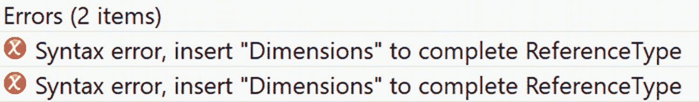

图 12-2

传递原始数据类型而非引用类型时的语法错误

包装类可以将原始数据类型作为对象持有。因此，当你需要在此类情况下传递原始数据类型时，首先将其包装为等效的包装类型，然后继续操作（如演示 2 所示）。

### 要点记忆

看起来 `MyGenericClass` 的不同版本似乎真实存在。但 Java 编译器实际上会移除所有泛型类型信息，并执行必要的类型转换，以使代码表现出这种效果。这一移除过程称为*擦除*。实际上，对于演示 2，只存在一个版本的 `MyGenericClass`。你将在稍后学习擦除的相关内容。

### 演示 3

请考虑以下程序。此演示旨在展示泛型程序如何比非泛型程序表现更佳。需要注意的是，在本演示中，我使用了遗留的 `ArrayList`（或者你可以说是非泛型版本的 `ArrayList`），这是一种不良实践，不推荐使用。此处仅用于与泛型程序进行比较。

```
package java2e.chapter12;
import java.util.ArrayList;
import java.util.List;
public class Demonstration3 {
public static void main(String[] args) {
System.out.println("***演示-3.一种不良实践。使用遗留 ArrayList 并遇到运行时错误。***");
// 不良实践。以下代码行使用了遗留的 ArrayList
List myList = new ArrayList();
myList.add(10);
myList.add(20);
myList.add("无效");// 使用遗留 ArrayList 时不会出现编译时错误
// 打印 ArrayList 的内容
System.out.println("以下是 ArrayList 的内容：");
for (int i = 0; i < myList.size(); i++) {
System.out.println(myList.get(i));
}
// 获取 ArrayList 中的最后一个元素
int lastElement = (int) myList.get(myList.size() - 1);
System.out.println("将最后一个元素加 1 并打印");
System.out.println(++lastElement);// 运行时错误
}
}
```

该程序不会引发任何编译时错误，但你会收到一个运行时错误，内容如下：

```
***演示-3.一种不良实践。使用遗留 ArrayList 并遇到运行时错误。***
以下是 ArrayList 的内容：

无效
Exception in thread "main" java.lang.ClassCastException: java.lang.String cannot be cast to java.lang.Integer
at java2e.chapter12.Demonstration3.main(Demonstration3.java:21)
```

这是因为第三个元素（即 `ArrayList` 中的 `myList [2]`）不是整数（而是一个字符串）。在编译期间，你没有遇到任何问题，因为它被存储为对象。因此，你可以看到类型安全是非泛型程序的一个主要问题。


### 演示 4

本示例的一个显著特点是你可以看到 Java 8 引入的 lambda 表达式的使用。由于它们并非本程序的必需部分，我将其放在了注释块中。我之所以包含它，是因为在类似的示例中，你可能会注意到 lambda 表达式在不同地方的使用。

让我们快速回顾一下什么是 lambda 表达式以及它为何重要。使用 lambda 表达式的主要目标之一是，你可以将其视为一个不必属于某个类的函数。以下是 lambda 表达式的示例代码：

```
(int a, int b) -> {return (a + b);}
```

这是一个带有两个参数和一个返回语句的 lambda 表达式。也可以使用不带参数的 lambda 表达式。lambda 表达式也可以没有返回语句。例如，下面是一个不接受任何参数且没有任何返回语句的 lambda 表达式：

```
() -> System.out.println("不带返回语句的 Lambda 表达式");
```

使用 lambda 表达式，你可以使代码紧凑且易于阅读。Java lambda 表达式被视为一个函数，因此编译器不会为其创建 `.class` 文件。

现在，考虑演示 4 中更新后的程序，该程序使用了泛型编程。关键更改以粗体显示。

```
package java2e.chapter12;
import java.util.ArrayList;
import java.util.List;
public class Demonstration4 {
public static void main(String[] args) {
System.out.println("***演示-4.使用泛型提升类型安全并避免运行时错误***");
ArrayList myList = new ArrayList();
myList.add(10);
myList.add(20);
// 使用 ArrayList 时出现编译时错误//myList.add("Invalid");
//打印 ArrayList 的内容
System.out.println("以下是 ArrayList 的内容：");
for (int i = 0; i  System.out.println(myInt));
*/
//选取 ArrayList 中的最后一个元素。
//现在无需进行类型转换。
int lastElement=myList.get( myList.size()-1);
System.out.println("将最后一个元素加 1 并打印");
System.out.println(++lastElement);//无运行时错误
}
}
```

这一次，你会更早地捕获到错误，因为它是在编译时被捕获的（图 12-3）。你可以看到编译时错误消息，它清楚地表明你使用了 `String` 而不是 `Integer`。


图 12-3

你可以在泛型程序中尽早捕获错误

在这种情况下，由于错误是在编译时捕获的，你无需等到运行时才得到这个错误，这总是更好的。一旦你注释掉下面这行代码：

```
myList.add("Invalid");
```

你就可以得到预期的输出，如下所示：

```
***演示-4.使用泛型提升类型安全并避免运行时错误***
以下是 ArrayList 的内容：

将最后一个元素加 1 并打印

```

通过比较演示 3 和演示 4，你可以得出以下结论：

*   为了避免运行时错误，你应该优先选择泛型版本的代码，而非非泛型版本。

*   现在无需进行类型转换。请注意下面这行代码：

*   最后，你可以看到一个注释掉的代码块，仅供参考。在不同的程序中，你可能会注意到 `for` 循环的以下变体之一：

```
int lastElement=myList.get( myList.size()-1);
```

*   由于你使用了泛型的概念，你可以以更好的方式打印 `ArrayList` 的元素。通常，在遍历并打印 `ArrayList`（或其他集合对象）中的元素时，你会看到这些代码版本。

```
/*
for (int myInt : myList) { System.out.println(myInt); }
System.out.print("使用 lambda 表达式打印元素：\n");
// 或者，使用增强型 for 循环配合 lambda 表达式
myList.forEach((myInt) -> System.out.println(myInt));
*/
```

因此，你可以肯定地得出结论：`ArrayList` 的泛型版本比非泛型版本更灵活、更实用。同样的概念也适用于其他集合对象和类似类型的编程。

## 泛型编程中的通配符类型

在接下来的讨论中，你会注意到有时你可能需要在泛型编程中对特定类型施加限制。实现此类约束有两种常见方法——一种是使用通配符，另一种是使用有界类型参数。这里，我将从通配符开始介绍。

在泛型编程中，通配符用问号 `(?)` 表示。它表示一个未知类型。当你对 `type` 参数有部分了解时，可以使用它。

通配符可以是有界的，也可以是无界的。有界通配符可用于为 `type` 参数设置上界或下界。让我们从上限通配符开始讨论。


### 上界通配符

首先，考虑以下代码片段。在这段代码中，`Vehicle` 是超类，它有两个子类：`Bus` 和 `Rocket`。每个类都有一个 `constructBody()` 方法来构造特定的实例。所有这些类还维护一个计数器，用于跟踪已创建的这些类型的实例数量。以下是代码片段：

```
class Vehicle {
static int basicVehicleCount;
// 构造单个车辆的基本结构
public void constructBody() {
basicVehicleCount++;
System.out.println("一个基本结构已形成。基本结构数量 ="+ basicVehicleCount);
}
}
class Bus extends Vehicle {
static int busCount;
@Override
public void constructBody() {
busCount++;
System.out.println("公交车已完成。它现在可以在道路上行驶。公交车数量=" + busCount);
}
}
class Rocket extends Vehicle {
static int rocketCount;
@Override
public void constructBody() {
rocketCount++;
System.out.println("火箭已构建。它现在可以进入太空。火箭数量=" + rocketCount);
}
}
```

假设你已经将这些车辆（`Vehicle`、`Bus` 或 `Rocket`）存储在一个集合中——比如，存储在一个 `ArrayList` 中。现在你想为 `ArrayList` 中的每个实例调用 `constructBody()` 方法。因此，你可能会从如下代码开始：

```
// 在这种情况下可能无法工作
public static void constructBody(List vehicleList) {
System.out.println("\n 这是为你准备的车辆列表：");
vehicleList.forEach((vehicle) -> vehicle.constructBody());
}
```

当你拥有 `ArrayList<Vehicle>` 类型时，这段代码可以工作。但有趣的是，当你将其应用于 `ArrayList<Bus>` 或 `ArrayList<Rocket>` 类型时，它将无法工作。从编译器的角度来看，`ArrayList<Bus>` 或 `ArrayList<Rocket>` 与 `ArrayList<Vehicle>` 是不同的，尽管 `Vehicle` 是 `Bus` 和 `Rocket` 的超类型（你可以参考本章末尾的“最后一条建议”部分）。在这种情况下，编译器会建议你引入如下方法：

```
static void constructAllVehicles(ArrayList rockets){// 一些代码}
```

或

```
static void constructAllVehicles(ArrayList buses) {// 一些代码}.
```

如果你遵循这些建议，编译器会进一步报出不同的错误，如图 12-4 所示。

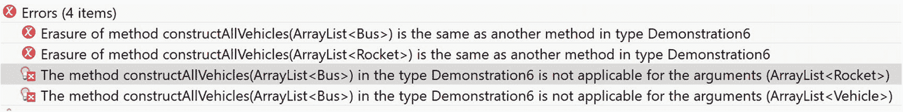

图 12-4

泛型程序中一些编译时错误的 Eclipse IDE 截图

简而言之，你需要采取一些特殊措施来处理这种情况。一种可能的解决方案是使用通配符类型，如下所示（以粗体显示）。

```
// 构造列表中的所有车辆
//public static void constructBody(List vehicleList) {
public static void constructAllVehicles(List vehicleList) {
System.out.println("\n 这是为你准备的车辆列表：");
vehicleList.forEach((vehicle) -> vehicle.constructBody());
}
```

以下是完整的演示。

### 演示 5

在此演示中，部分内容以粗体显示，以突出程序中的重要代码行。

```
package java2e.chapter12;
import java.util.ArrayList;
import java.util.List;
class Vehicle {
static int basicVehicleCount;
// 构造单个车辆的基本结构
public void constructBody() {
basicVehicleCount++;
System.out.println("一个基本结构已形成。基本结构数量 ="+ basicVehicleCount);
}
}
class Bus extends Vehicle {
static int busCount;
@Override
public void constructBody() {
busCount++;
System.out.println("公交车已完成。它现在可以在道路上行驶。公交车数量=" + busCount);
}
}
class Rocket extends Vehicle {
static int rocketCount;
@Override
public void constructBody() {
rocketCount++;
System.out.println("火箭已构建。它现在可以进入太空。火箭数量=" + rocketCount);
}
}
class Demonstration5 {
public static void main(String[] args) {
System.out.println("***演示-5. 泛型编程中通配符类型的使用。***");
// 一个 Vehicle 对象
Vehicle vehicle1=new Vehicle();
// 三个 Bus 对象
Bus bus1 = new Bus();
Bus bus2 = new Bus();
Bus bus3 = new Bus();
// 两个 Rocket 对象
Rocket rocket1 = new Rocket();
Rocket rocket2 = new Rocket();
// 任意类型车辆的列表。可以添加 Vehicle 类型或其子类型。
ArrayList vehicles = new ArrayList();
// 在列表中添加一辆车、一辆公交车和一辆火箭
vehicles.add(vehicle1);
vehicles.add(bus1);// 可以
vehicles.add(rocket1);// 可以
constructAllVehicles(vehicles);// 可以
// 仅特定车辆（公交车）的列表
ArrayList buses = new ArrayList();
// 在列表中添加三辆公交车
buses.add(bus1);
// 错误：无法将火箭添加到公交车列表
// buses.add(rocket1);
buses.add(bus2);
buses.add(bus3);
// 如果不在方法中使用通配符，则会出错
constructAllVehicles(buses);
// 仅特定车辆（火箭）的列表
ArrayList rockets = new ArrayList();
// 在列表中添加两枚火箭
rockets.add(rocket1);
rockets.add(rocket2);
// 如果不在方法中使用通配符，则会出错
constructAllVehicles(rockets);
}
// 构造列表中的所有车辆
// public static void constructBody(List vehicleList) {
public static void constructAllVehicles(List vehicleList) {
System.out.println("\n 这是为你准备的车辆列表：");
vehicleList.forEach((vehicle) -> vehicle.constructBody());
}
}
```

输出：

```
***演示-5. 泛型编程中通配符类型的使用。***
这是为你准备的车辆列表：
一个基本结构已形成。基本结构数量 =1
公交车已完成。它现在可以在道路上行驶。公交车数量=1
火箭已构建。它现在可以进入太空。火箭数量=1
这是为你准备的车辆列表：
公交车已完成。它现在可以在道路上行驶。公交车数量=2
公交车已完成。它现在可以在道路上行驶。公交车数量=3
公交车已完成。它现在可以在道路上行驶。公交车数量=4
这是为你准备的车辆列表：
火箭已构建。它现在可以进入太空。火箭数量=2
火箭已构建。它现在可以进入太空。火箭数量=3
```

你可以看到 `List<Vehicle>` 比 `List<? extends Vehicle>` 更具限制性。在这里，你通过使用通配符放宽了限制。因此，`constructAllVehicles(`**List<? extends Vehicle>** `vehicleList)` 可以同时应用于 `ArrayList<Vehicle>` 和 `ArrayList<any subtype of Vehicle>`（即本例中的 `ArrayList<Bus>` 和 `ArrayList<Rocket>`）。所以，`? extends Vehicle` 语法只是帮助编译器匹配类型 `Vehicle` 或 `Vehicle` 的任何子类型。这就是为什么我们说，当你在通配符中使用 `extends` 子句时，它设置了一个上界。

### 要点记忆

需要注意的是，此处的 `extends` 是广义上的使用，既可以表示类中的 extends，也可以表示接口中的 implements。

### 下界通配符

你刚刚了解到，当你在方法参数中使用表达式 `<? extends Vehicle>` 时，你可以为 `Vehicle` 类或其任何子类调用该方法。因此，这里的 `Vehicle` 类充当了上界。类似地，当你使用表达式 `<? super Vehicle>` 时，你可以设置通配符的下界。在这种情况下，可接受的参数是 `Vehicle` 及其超类。因此，你可以将表达式 `<? super T>` 大致解释为“类 `T` 或 `T` 的任何超类”。


### 演示 6

让我们考虑以下示例：

```
package chapter12.testcodes;
import java.util.ArrayList;
import java.util.List;
class Vehicle {
// 构建单个车辆的基本结构
public void constructBody() {
System.out.println("一个基本结构已形成。");
}
}
class Bus extends Vehicle {
static int busCount;
@Override
public void constructBody() {
busCount++;
System.out.println("公交车已完成。现在可以在道路上行驶。公交车数量=" + busCount);
}
}
class Rocket extends Vehicle {
static int rocketCount;
@Override
public void constructBody() {
rocketCount++;
System.out.println("火箭已构建。现在可以进入太空。火箭数量=" + rocketCount);
}
}
public class TestCodeDemonstration6 {
public static void main(String[] args) {
System.out.println("***演示-6. 泛型编程中下界通配符类型的使用。***");
//两个 Vehicle 对象
Vehicle vehicle1=new Vehicle();
Vehicle vehicle2=new Vehicle();
// 两个 Bus 对象
Bus bus1 = new Bus();
Bus bus2 = new Bus();
// 两个 Rocket 对象
Rocket rocket1 = new Rocket();
Rocket rocket2 = new Rocket();
// 车辆列表
ArrayList vehicles = new ArrayList();
// 在列表中添加两辆车
vehicles.add(vehicle1);
vehicles.add(vehicle2);
// 在列表中添加两辆公交车
vehicles.add(bus1);
vehicles.add(bus2);
constructAllVehicles(vehicles);//ok
// 火箭列表
ArrayList rockets = new ArrayList();
// 在列表中添加两枚火箭
rockets.add(rocket1);
rockets.add(rocket2);
//constructAllVehicles(rockets);// 错误：当使用下界通配符时，不适用于 //ArrayList
}
// 构造列表中的所有车辆
public static void constructAllVehicles(List vehicleList) {
System.out.println("\n 这是为您准备的车辆列表：");
//编译时错误：添加强制转换为 vehicle
//vehicleList.forEach((vehicle) ->  vehicle.constructBody());
/*
//运行时错误：Vehicle 无法转换为 Bus
//vehicleList.forEach((vehicle) -> ((Bus) vehicle).constructBody());
*/
vehicleList.forEach((bus) -> ((Vehicle) bus).constructBody());//Ok
}
}
```

输出：

```
***演示-6. 泛型编程中下界通配符类型的使用。***
这是为您准备的车辆列表：
一个基本结构已形成。
一个基本结构已形成。
公交车已完成。现在可以在道路上行驶。公交车数量=1
公交车已完成。现在可以在道路上行驶。公交车数量=2
```

你可以看到，方法参数中的 `<? super Bus>` 帮助你使用 `ArrayList<Bus>` 和 `ArrayList<Vehicle>` 调用该方法，因为 `Vehicle` 是 `Bus` 的超类型。但是当你使用 `ArrayList<Rocket>` 时，你不能使用该方法，因为 `Rocket` 不是 `Bus` 的超类型。

### 无界通配符

通配符可以是无界的。当你只使用通配符字符（`?`）时，你可以使用无界通配符的概念。让我们将演示 6 中的 `constructAllVehicles()` 方法修改如下：

```
//使用无界通配符
public static void constructAllVehicles(List vehicleList) {
System.out.println("\n 这是为您准备的车辆列表：");
vehicleList.forEach((anyVehicle) -> ((Vehicle) anyVehicle).constructBody());//Ok
}
```

这里，`List<?>` 用于表示未知类型的列表。你也可以取消注释演示 6 中的以下代码，如下所示：

```
constructAllVehicles(rockets);// 错误：当使用下界通配符时，不适用于 //ArrayList
```

这次没有编译时错误，你将收到以下输出：

```
***演示-6. 泛型编程中下界通配符类型的使用。***
这是为您准备的车辆列表：
一个基本结构已形成。
一个基本结构已形成。
公交车已完成。现在可以在道路上行驶。公交车数量=1
公交车已完成。现在可以在道路上行驶。公交车数量=2
这是为您准备的车辆列表：
火箭已构建。现在可以进入太空。火箭数量=1
火箭已构建。现在可以进入太空。火箭数量=2
```

注意输出的粗体行。你可以看到，现在 `Rocket` 对象也可以调用 `constructAllVehicles(List<?> vehicleList)` 方法。

### 要点记忆

你可以使用泛型类型，这些类型可以包含通配符作为参数类型、字段或局部变量，但不能作为泛型方法调用的类型参数。它们不应用于泛型类实例创建或超类型。你可以参考演示 6A 以获得更好的理解。

### 问答环节

**12.1** **List<?>** **和** **List<? extends Object>** **是一样的吗？**

不一样。让我们检查一个案例。考虑以下代码片段：

```
class Vehicle1Test {
@Override
public String toString() {
return "Vehicle1Test 类型。";
}
}
class Sub1VehicleTest extends Vehicle1Test {
@Override
public String toString() {
return "Sub1VehicleTest 类型。";
}
}
```

现在，你可以编写一个类似如下的方法：

```
public static void addElementsVersion2(List mylist) {
mylist.add(new Vehicle1Test());// ok
mylist.add(new Sub1VehicleTest());// ok
mylist.add(null);// ok
}
```

但请注意以下方法中被注释掉的代码：

```
public static void addElementsVersion1(List mylist) {
// mylist.add(new Vehicle1Test());// 错误
// mylist.add(new Sub1VehicleTest());// 错误
mylist.add(null);// ok
}
```

在这个例子中，你可以将任何对象类型或子类型添加到 `List<Object>` 中，但对于 `List<?>`，你只能添加 null。Java 语言规范（Jls 11 @ 第 4.7 节）进一步告诉我们，`List<?>` 是一个可具体化类型，但 `List<? extends Object>` 不是。

**12.2 可具体化类型是什么意思？**

在运行时其信息完全可用的类型称为可具体化类型。（稍后你将了解到，某些类型信息在编译时会被擦除，因此运行时可能无法获得完整的类型信息。）

根据语言规范，当且仅当满足以下条件之一时，类型才是可具体化的：

*   它引用一个非泛型的类或接口类型声明。

*   它是一个参数化类型，其中所有类型参数都是无界通配符。

*   它是一个原始类型。

*   它是一个基本类型。

*   它是一个数组类型，其元素类型是可具体化的。

*   它是一个嵌套类型，其中对于每个由“`.`”分隔的类型 `T`，`T` 本身是可具体化的。

**12.3 那么** **List** **<?> 有什么用？**

有时你可能只想遍历你的集合。例如，考虑以下程序和输出：

```
package chapter12.testcodes;
import java.util.ArrayList;
import java.util.List;
class Vehicle1Test {
@Override
public String toString() {
return "Vehicle1Test 类型。";
}
}
class Sub1VehicleTest extends Vehicle1Test {
@Override
public String toString() {
return "Sub1VehicleTest 类型。";
}
}
class Test1 {
public static void main(String[] args) {
System.out.println("***一个示例测试。List<?> 的使用***");
Vehicle1Test vehicle1 = new Vehicle1Test();
Vehicle1Test vehicle2 = new Sub1VehicleTest();
List vehicles = new ArrayList();
vehicles.add(vehicle1);// ok
vehicles.add(vehicle2);// ok
printElements(vehicles);// ok。在方法参数中使用 //List<?> 的示例
}
public static void addElementsVersion1(List mylist) {
// mylist.add(new Vehicle1Test());// 错误
// mylist.add(new Sub1VehicleTest());// 错误
mylist.add(null);// ok
}
public static void addElementsVersion2(List mylist) {
mylist.add(new Vehicle1Test());// ok
mylist.add(new Sub1VehicleTest());// ok
mylist.add(null);// ok
}
public static void printElements(List mylist) {
mylist.forEach(element -> System.out.println(element));
}
}
```

输出：

```
***一个示例测试。List<?> 的使用***
Vehicle1Test 类型。
Sub1VehicleTest 类型。
```

**12.4 什么是原始类型？**

你将在演示 10 中看到关于原始类型的讨论。

**12.5 你能展示一些** **有效和无效的语句** **来说明在程序中使用通配符的情况吗？**

演示 6A 可以帮助你。在这里，你可以分析不同的案例研究。


### 演示 6A

请审阅程序及其附带的注释以加深理解。

```
package chapter12.testcodes;
import java.util.Arrays;
import java.util.Collections;
import java.util.List;
class Sample {
//案例研究-1：字段中的通配符
List  myList;  // 有效
//?  aField;  // 无效
//案例研究-2：方法参数中的通配符
//? 的语法错误
//无效
//public void invalidMethodWithWildCardParameter(? methodParameter) {
//  一些代码
//}
//以下方法是有效的。
public void validMethodWithWildCardParameter(List myParameter) {
System.out.println("validMethodWithWildCardParameter(List myParameter) 是一个有效的方法。");
}
//案例研究-3：返回类型中的通配符
//错误：方法缺少返回类型
// private ? methodWithWildCardReturnType() {//无效
//return null;
//    }
}
//案例研究-4：超类型中的通配符
//错误：超类型不能指定任何通配符
//public class SubList implements List{ //无效
//  一些代码
//}
class Test2 {
public static void main(String[] args) {
System.out.println("***演示 6A：通配符的一些案例研究***");
Sample sample=new Sample();
//案例研究-5：局部变量中的通配符
List myList = Arrays.asList(12,27,39);//有效
System.out.println("原始列表：" + myList);
Collections.reverse(myList);
System.out.println("反转后的列表："+myList);
sample.validMethodWithWildCardParameter(myList);
}
}
```

以下是演示 6A 的输出结果。

```
***演示 6A：通配符的一些案例研究***
原始列表：[12, 27, 39]
反转后的列表：[39, 27, 12]
validMethodWithWildCardParameter(List myParameter) 是一个有效的方法。
```

## 有界类型参数

你很快就会了解到，通配符并不能高效地解决所有问题。还有另一种选择，称为**有界类型参数**。它可以帮助你限制在参数化类型中可用作类型实参的类型。

让我们从一个非常简单的用例开始。假设你正在处理一些整数和双精度浮点数，并且希望创建一个泛型类，该类应包含一个计算这些数值总和的方法。你需要理解以下几点：

*   你可以创建一个返回类型为 `double` 的方法来实现你的目的。
*   你正在使用泛型，因此需要考虑 `int` 和 `double` 的包装类。`Integer` 是 `int` 的包装类，`Double` 是 `double` 的包装类。
*   `Integer` 和 `Double` 是 `Number` 类的子类，该类拥有 `intValue()`、`longValue()`、`floatValue()`、`doubleValue()` 和 `byteValue()` 等方法。让我们从 Eclipse IDE 中查看 `doubleValue()` 方法的功能。图 12-5 是 Eclipse 的截图。

    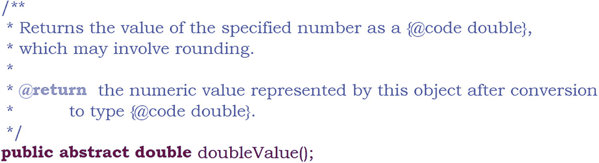

    图 12-5

    来自 Eclipse IDE 的 doubleValue() 方法详情截图

*   由于 `doubleValue()` 是一个抽象方法，它的具体子类必须实现此方法。现在，让我们检查 `Integer` 类是如何实现 `doubleValue()` 方法的。如下所示：

*   现在，让我们也检查一下 `Double` 类是如何在 `Number` 类中实现 `doubleValue()` 的：

```
/**
* 在拓宽原始转换后，将此 {@code Integer} 的值作为 {@code double} 返回。
* @jls 5.1.2 拓宽原始转换
*/
public double doubleValue() {
return (double)value;
}
```

```
/**
* 返回此 {@code Double} 对象的 {@code double} 值。
* @return 此对象表示的 {@code double} 值
*/
public double doubleValue() {
return value;
}
```

从这些定义中可以明显看出，在你的场景中，你可以使用 `doubleValue()` 方法。现在你可以编写以下程序了。

### 演示 7

让我们编译并运行该程序，然后分析输出结果。

```
package java2e.chapter12;
//一个泛型类
//T 是一个类型参数。当你初始化实际对象时，它将被替换为实际类型。
class GenericDemo7Class {
T firstNumber, secondNumber;
GenericDemo7Class(T firstNumber, T secondNumber) {
this.firstNumber = firstNumber;
this.secondNumber = secondNumber;
}
// 始终返回一个 double 值
public double displaySum() {
//使用库方法 doubleValue()
return firstNumber.doubleValue() + secondNumber.doubleValue();
}
}
class Demonstration7 {
public static void main(String[] args) {
System.out.println("***演示-7：有界类型参数的典型用法。***\n");
GenericDemo7Class doubleOb = new GenericDemo7Class(2.5, 5.7);
System.out.println("2.5+5.7=" + doubleOb.displaySum());
GenericDemo7Class intOb = new GenericDemo7Class(2, 7);
System.out.println("2+7=" + intOb.displaySum());
//GenericDemo7Class stringOb=new GenericDemo7Class("hello","world!");
// 如果使用 class GenericDemo7Class 会导致边界不匹配错误
//System.out.println( "2+7=" +stringOb.displaySum());
}
}
```

输出结果：

```
***演示-7：有界类型参数的典型用法。***
2.5+5.7=8.2
2+7=9.0
```

你可以看到程序已成功编译并运行。现在，请考虑以下几点：

*   让我们看看如果在之前的演示中使用 `<T>` 而不是 `<T extends Number>` 会发生什么，如下所示：

```
//class GenericDemo7Class {
class GenericDemo7Class {
```

这次，你将遇到如下编译时错误（如图 12-6 所示）：`方法 doubleValue() 对于类型 T 未定义。`

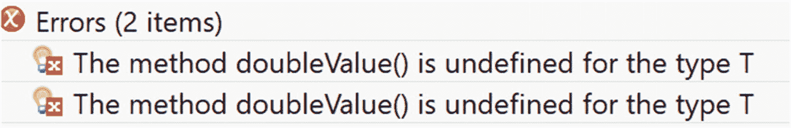

图 12-6

编译时错误提示 doubleValue() 对于类型 T 未定义

编译器提出此警告是因为在这种情况下，它无法确定你是否会使用真正的数字类型。但是，当你使用 `<T extends Number>` 时，你是在告诉编译器你将始终传递一个 `Number` 类型，而不是其他任何类型。

*   你可以在演示 7 中看到一些被注释掉的行。如果你取消注释以下行：

```
GenericDemo7Class stringOb = new GenericDemo7Class("hello","world!");
```

你将收到边界不匹配的编译时错误。图 12-7 是 Eclipse IDE 对此的截图。

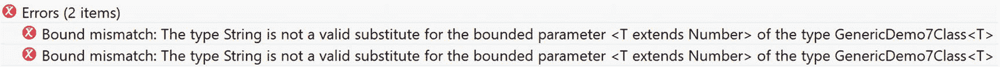

图 12-7

边界不匹配错误

因此，你可以看到，当你使用 `<T extends Number>` 而不是 `<T>` 时，你不能传递除 `Number` 类型之外的任何内容。


### 要点提示

在泛型编程中，`<T extends YourSuperClass>` 表示 `T` 可以被替换为 `YourSuperClass` 或 `YourSuperClass` 的*任何子类*。这种方法有助于你提供一个包含性的上界。使用这种方法，你可以在程序中提升类型安全性。

需要注意的是，与通配符类似，此处的 `extends` 是广义上的使用，意味着它既可以表示继承类，也可以表示实现接口。

你可以同时使用类类型和接口类型作为边界。但有一个重要的限制。你可能记得，在 Java 编程中，你的类可以继承自另一个类，并且可以实现多个接口。同样的规则也适用于此。同时，你还需要在接口类型之前提及类类型。当你使用类类型和接口类型创建边界时，需要使用 `&` 运算符，如下所示：

假设你有以下代码片段：

```
class Demo8AClass {
//一些代码
}
class Demo8BClass {
//一些代码
}
interface Interface8ADemo {
//一些代码
}
interface Interface8BDemo {
//一些代码
}
class ImplementorInterface8ADemo implements Interface8ADemo{
//一些代码
}
```

演示 8

对于前面的代码片段，演示 8 提供了一些有效和无效语句的示例供你参考。*此处无效语句用注释* `//Error` *标记，有效语句用* `//Ok` *标记。*

```
//class GenericDemo8Class {//Error
//class GenericDemo8Class {//Error
//class GenericDemo8Class {//Ok
class GenericDemo8Class {//Ok
}
```

问答环节
**12.6 通配符与有界类型参数有何不同？**

这取决于你的实现。在某些情况下，有界类型参数可以提升更好的可读性和安全性。记住它们的语法会很有帮助。任何通配符只能有一个边界。

*   对于上界，你使用：`? extends SuperType`

*   对于下界，你使用：`? super SubType`

*另一方面，你可以为类型参数关联多个边界。* 因此，你之前已经见过以下语句。

当你使用类类型和接口类型创建边界时，需要使用 `&` 运算符，如下所示：

```
演示 8 展示了其部分用法。
```

类型擦除
在演示 3 之前，我曾提到可能看起来存在不同版本的 `MyGenericClass`。
但实际上，Java 编译器会移除所有这些泛型类型信息，并执行必要的类型转换，以使代码行为如此。这个移除过程被称为类型擦除。因此，实际上，对于演示 2，只存在一个版本的 `MyGenericClass`。你现在将详细讨论这个主题。
简而言之，对于一个参数化类，只有一个编译后的类文件。例如，假设你在程序中使用 `ArrayList<Double>`、`ArrayList<Integer>` 或 `ArrayList<String>`。在这种情况下，如果你尝试在容器中存储任何不需要类型的对象，类型参数会帮助你引发编译时错误。因此，你在编译时提升了类型安全性。但是，尽管你在泛型数据结构中使用了不同的类型参数，所有这些参数化类型都使用相同的编译后类。这是因为所有类型信息在运行时都会被擦除。这个过程有点复杂，但大多数时候你不需要直接处理它们。

根据 Oracle Java 文档，类型擦除可以通过以下方式工作：

*   泛型类型中的所有类型参数都将被替换为它们的边界。对于无界类型，它将被替换为 `Object`。因此，生成的字节码将包含普通的类、接口和方法。

*   为了保持类型安全，将插入类型转换。

*   它可以生成桥接方法，以保持扩展泛型类型中的多态性。

所以，底线是：***类型擦除确保你不会为不同的参数化类型在编译后的代码中创建不同的类***。

演示 9

让我们从一个简单的案例研究开始。在这里，我将编译代码，然后反编译它。为了简单直接，我分别使用了 `javac` 和 `javap` 命令。我在机器上的不同位置反编译了这段代码，这就是为什么我有意移除了以下演示中的 `package` 语句。

```
import java.util.List;
import java.util.ArrayList;
class Demonstration9 {
public static void main(String[] args) {
System.out.println("***演示-9.检查类型擦除。***");
List myIntList = new ArrayList();
myIntList.add(10);
myIntList.add(20);
//myIntList.add("无效");//错误
int firstNumber=myIntList.get(0);
System.out.println("第一个数字是 :"+ firstNumber);
int secondNumber=myIntList.get(1);
System.out.println("第二个数字是 :"+ secondNumber);
List myStrList = new ArrayList();
myStrList.add("Hello");
myStrList.add(" world !");
//myStrList.add(30);//错误
String firstString=myStrList.get(0);
System.out.println("第一个字符串是 :"+ firstString);
String secondString=myStrList.get(1);
System.out.println("第二个字符串是 :"+ secondString);
}
}
```

输出：

```
***演示-9.检查类型擦除。***
第一个数字是 :10
第二个数字是 :20
第一个字符串是 :Hello
第二个字符串是 : world !
```

输出很直接，在接下来的分析中并不重要。让我们反编译类文件（你在编译过程后得到的）。以下是供你参考的快照。这是一个大快照，所以我将其分为三部分呈现：图 12-8、图 12-9 和图 12-10。

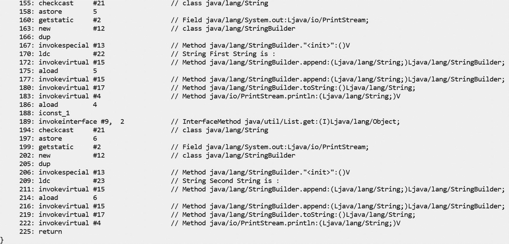

图 12-10
反编译后的 Demonstration9.class 的部分快照（第三部分）

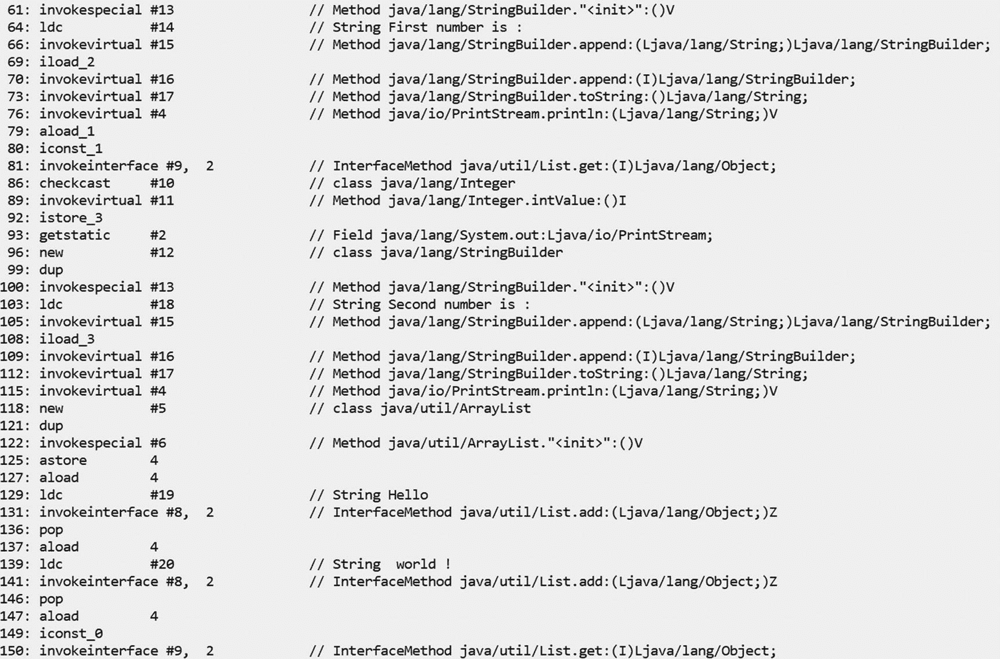

图 12-9
反编译后的 Demonstration9.class 的部分快照（第二部分）

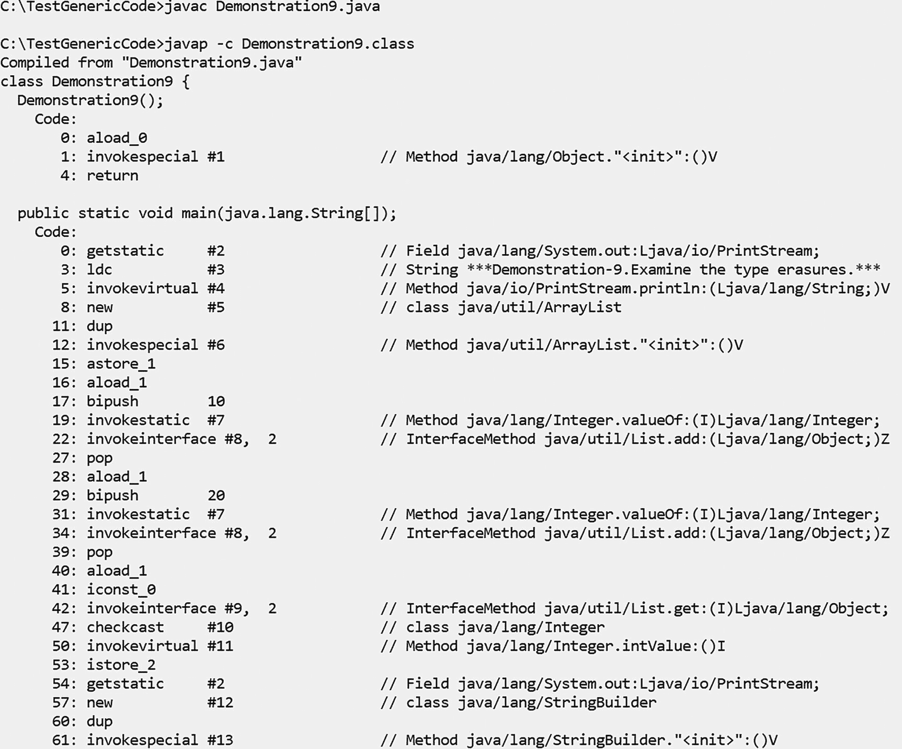

图 12-8
反编译后的 Demonstration9.class 的部分快照（第一部分）

以下是这些快照中我想强调的重点：

*   第 8 行和第 118 行都确保，一旦编译，你会得到一个非参数化版本的 `ArrayList`。因此，当你运行程序时，这些类型的信息将不可用。

*   注意类型转换是如何在第 47、86、155 和 194 行添加的。在第 47 和 86 行，你可以看到 `Integer` 的存在，而在第 155 和 194 行，你可以看到 `String` 的存在。

原始类型

当你引用一个泛型类型而不指定类型参数时，你就创建了一个原始类型。例如，在演示 2 中，我们使用了以下代码行：

```
MyGenericClass myGenericClassDoubleOb = new MyGenericClass();
```

但是，如果我们不这样写，而是写类似下面的内容，我们就创建了 `MyGenericClass<T>` 的原始类型：

```
// 创建 MyGenericClass 的原始类型
MyGenericClass rawOb = new MyGenericClass();
```

所以，`MyGenericClass` 是 `MyGenericClass<T>` 的原始类型。

原始类型用于支持前泛型时代的遗留代码。为了支持向后兼容，你可以将参数化类型赋值给原始类型，但当你反向操作时，你会收到类似以下的警告消息：

```
类型安全：MyGenericClass 类型的表达式需要进行未经检查的转换才能符合 MyGenericClass
```

这是因为编译器没有足够的信息来确保类型安全。以下是一些带有注释的代码片段供你参考：


```
// 创建一个 MyGenericClass 类型的对象。
MyGenericClass doubleOb = new MyGenericClass();
// 创建一个 MyGenericClass 的原始类型
MyGenericClass rawOb = new MyGenericClass();
// 为了支持向后兼容，你可以将参数化类型赋值给原始类型
rawOb = doubleOb;// 可以
// 但如果你将原始类型赋值给参数化类型，会出现警告信息。
doubleOb = rawOb;// 警告信息
```

同样重要的是，当你将原始类型与参数化类型一起使用时，需要关注类型转换，并且可能会损害类型安全。例如，在以下代码段中，请注意 `d1` 不需要进行类型转换，但在使用 `d2` 之前，你需要正确地进行类型转换：

```
// 创建一个 MyGenericClass 类型的对象。
MyGenericClass doubleOb = new MyGenericClass();
double d1 = doubleOb.show(100.5);
// 创建一个 MyGenericClass 的原始类型
MyGenericClass rawOb = new MyGenericClass();
doubleOb = rawOb;// 警告信息
double d2 = (double) rawOb.show(200.5);// 需要进行类型转换
```

总的来说，你应该尽量避免使用原始类型。原始类型也可能导致运行时错误。

演示 10

此处给出演示 10，以总结之前的讨论：

```
package java2e.chapter12;
//类 MyGenericClass 在 Demonstration2 中定义
class Demonstration10 {
public static void main(String[] args) {
System.out.println("***演示-10. 原始类型案例研究.***");
// 创建一个 MyGenericClass 类型的对象。
MyGenericClass doubleOb = new MyGenericClass();
double d1 = doubleOb.show(100.5);
System.out.println("方法 show 返回 double 值：" + d1);
// 创建一个 MyGenericClass 的原始类型
MyGenericClass rawOb = new MyGenericClass();
// 为了支持向后兼容，你可以将参数化类型赋值给原始类型
//rawOb = doubleOb;// 可以
// 但如果你将原始类型赋值给参数化类型，会出现警告信息
doubleOb = rawOb;// 警告信息
double d2 = (double) rawOb.show(200.5);// 需要进行类型转换
System.out.println("d2 中的值是：" + d2);
// 没有编译时错误，但会导致运行时错误
//int i3 = (int) rawOb.show(200.5);
//System.out.println("i3 中的值是：" + i3);
}
}
```

**输出：**

```
***演示-10. 原始类型案例研究.***
方法 show 返回 double 值：100.5
d2 中的值是：200.5
```

问答环节
**12.7 接口是原始类型吗？**
不是。JLS11 确认，非泛型类或接口不是原始类型。
**12.8 “原始类型也可能导致运行时错误”——能否详细说明？**

请注意演示 10 中的以下几行代码。你将遇到运行时错误。

```
// 没有编译时错误，但会导致运行时错误
// int i3 = (int) rawOb.show(200.5);
// System.out.println("i3 中的值是：" + i3);
```

如果你取消最后两行的注释并编译程序，不会出现错误。但当你运行程序时，将收到以下错误信息：

```
***演示-10. 原始类型案例研究.***
方法 show 返回 double 值：100.5
d2 中的值是：200.5
线程 "main" 中出现异常 java.lang.ClassCastException: java.lang.Double 无法转换为 java.lang.Integer
at java2e.chapter12.Demonstration10.main(Demonstration10.java:23)
```

注意
JLS 11 指出：“允许使用原始类型仅作为对遗留代码兼容性的让步。强烈不鼓励在 Java 编程语言引入泛型之后编写的代码中使用原始类型。未来版本的 Java 编程语言可能会禁止使用原始类型。”

使用菱形运算符进行类型推断

你可以使用一对尖括号（称为菱形运算符）来替换调用泛型类构造函数所需的类型参数，只要编译器能够正确推断即可。例如，如果你将以下代码行附加到之前的演示中，就不会出现警告信息：

```
//从 JDK7 开始，你可以使用菱形运算符的简短语法
MyGenericClass doubleOb2 = new MyGenericClass();
doubleOb=doubleOb2;//无警告信息
```

但你可以回想一下，在演示 10 中，当你使用以下代码行时：

```
doubleOb = rawOb;
```

会收到一条警告信息。因此，你可以使用菱形运算符来减少输入（即缩短冗长的声明语句），并且还可以确保你没有创建原始类型。自 JDK7 起，Java 中就已提供此功能。最后，虽然你可以在方法调用中使用此概念，但 Oracle 建议你主要在变量声明中使用菱形运算符。就我个人而言，为了更好的可读性和理解，我更喜欢完整的语法声明，并且它允许我在 JDK7 之前正确执行代码。

应用继承

你可以在泛型程序中应用继承的概念；即，你可以通过扩展来创建泛型类的子类型，或者通过实现来创建接口的子类型。唯一的限制是你不能改变参数。

演示 11

例如，考虑带有输出的演示 11。

```
package java2e.chapter12;
//类 MyGenericClass 在 Demonstration2 中定义
//编译时错误
//class SubClass extends MyGenericClass {
//以下声明是正确的
class SubClass extends MyGenericClass {
//一些代码
}
class Demonstration11 {
public static void main(String[] args) {
System.out.println("***演示-11. 泛型编程中的继承.***");
SubClass  subInt = new SubClass();
System.out.println("方法 show 返回整数值：" + subInt.show(200));
}
}
```

输出：

```
***演示-11. 泛型编程中的继承.***
方法 show 返回整数值：200
```

之前的输出是显而易见的。但请注意被注释掉的那行代码：

```
//class SubClass extends MyGenericClass {
```

如果你使用这行代码，将会收到编译时错误。这是因为，根据语言构造，你不能改变参数。你的子类必须传递其超类所需的类型参数。

当你创建子类型时，还可以添加子类特有的方法。例如，在这个修改后的示例中，`SubClass` 引入了一个新的类型参数和一个子类特有的方法。让我们看一下下面的程序及其修改后的输出。

```
package java2e.chapter12;
//类 MyGenericClass 在 Demonstration2 中定义
//修改后的程序
class SubClass extends MyGenericClass {
//子类特有的方法
public V subMethod(V value) {
return value;
}
}
class Demonstration11 {
public static void main(String[] args) {
//System.out.println("***演示-11. 泛型编程中的继承.***");
System.out.println("***演示-11 修改版. 泛型编程中的继承.***");
//修改后的程序
SubClass  subInt = new SubClass();
System.out.println("方法 show 返回整数值：" + subInt.show(200));
System.out.println("子方法返回：" + subInt.subMethod("没问题！"));
}
}
```

修改后的输出：

```
***演示-11 修改版. 泛型编程中的继承.***
方法 show 返回整数值：200
子方法返回：没问题！
```

桥接方法

可能会出现一种有趣的情况，编译器需要向类中添加一个方法。这种方法被称为桥接方法。通常，你不需要直接处理这种情况。

为了理解这个场景，让我们看一下以下代码段：


```
class GenericClass12 {
public void show(T value) {
System.out.println("Inside parent class.The value is:"+value);
}
}
class SubClass12 extends GenericClass12 {
@Override
public void show(Integer value) {
System.out.println("Inside Child Class.The value is:"+value);
}
}
```

你是否注意到了其中的重要特性？让我们来分析一下。

*   派生类 `Subclass12` 继承自 `GenericClass12` 的 `Integer` 特定版本，即 `GenericClass12<Integer>`。

*   派生类 `SubClass12` 还重写了父类方法 `show()`。

尽管这种编码方式是允许的，但当类型擦除介入时，可能会出现问题。一旦类型擦除执行其工作，`GenericClass12` 中 `show()` 方法的预期形式如下：

```
public void show(Object value){//other code..}
```

而 `SubClass12` 中 `show()` 方法的预期形式是：

```
public void show()(Integer value){//other code}
```

因此，在类型擦除操作之后，方法签名不匹配。为了处理这种情况并保持多态性，编译器会在 `Subclass12` 中生成一个桥接方法，该方法具有前述签名，可以调用 `Integer` 特定版本。因此，新的 `show()` 方法将出现在派生类（即 `SubClass12`）中，如下所示：

```
public void show(Object value) {
show((Integer) value);
}
```

演示 12

现在，请考虑演示 12 及其对应的输出。然后阅读分析（在输出部分之后），以体验生成的桥接方法的存在。

```
package java2e.chapter12;
class GenericClass12 {
public void show(T value) {
System.out.println("Inside parent class.The value is:"+value);
}
}
class SubClass12 extends GenericClass12 {
@Override
public void show(Integer value) {
System.out.println("Inside Child Class.The value is:"+value);
}
}
class Demonstration12 {
public static void main(String[] args) {
System.out.println("***Demonstration-12.Bridge Method in Generic Programming.***");
// 创建一个 MyGenericClass 类型的对象。
GenericClass12 parentOb = new GenericClass12();
parentOb.show(100);
// 一个 SubClass12 对象
SubClass12 childOb = new SubClass12();
childOb.show(300);
//Object ob=(int)400;
//childOb.show(ob);//Error
// 使用多态
System.out.println("Using Ploymorphism :" );
parentOb=childOb;
parentOb.show(500);
}
}
```

输出：

```
***Demonstration-12.Bridge Method in Generic Programming.***
Inside parent class.The value is:100
Inside Child Class.The value is:300
Using Ploymorphism :
Inside Child Class.The value is:500
```

当我使用 `javap` 命令时，我可以看到这两个方法都存在于 `SubClass12` 中，如图 12-11 所示。（具体输出可能因你的 Java 版本而异。）

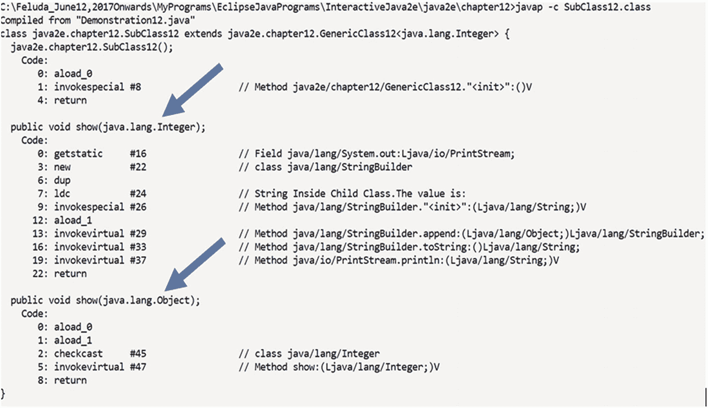

图 12-11
反编译后的 SubClass12.class 快照

**12.9 为什么需要** **桥接方法** **？**
你已经看到，在类型擦除操作之后，父类及其子类中的方法签名不匹配，从而影响了多态性的概念。为了解决这些问题，桥接方法就派上了用场。
在此背景下，请注意演示 12 中的最后几行代码。这部分代码演示了多态性概念是如何得以保留的。

泛型编程中的重要限制
泛型编程有许多相关的限制。只有通过实践才能熟悉它们。让我们通过讨论一些常见的限制来结束本章。

不要使用基本类型实例化泛型类型

在演示 2 中，你看到以下声明在 Java 的泛型编程中是**不合法**的。因此，以下代码段

```
//错误的代码段-1
//此处不允许使用基本类型。必须是引用类型。
MyGenericClass myGenericClassIntOb2 = new MyGenericClass();
将引发编译时错误：Syntax error, insert "Dimensions" to complete ReferenceType.
```

你的泛型类不能直接或间接地继承自 Throwable

JLS11 确认 JVM 的 catch 机制仅与非泛型类兼容。因此，以下代码段

```
//错误的代码段-2
class CustomException extends Throwable{  }
```

将引发编译时错误：`The generic class CustomException<T> may not subclass java.lang.Throwable`。

你不能重载一个方法，使得每个重载的形式参数类型在擦除后都变为相同的原始类型

以下代码段

```
//错误的代码段-3
class OverloadRestriction {
public void printMe(List intList) {//Some code }
public void printMe(List strList) {//Some code }
}
```

将引发两个编译时错误：

```
Erasure of method printMe(List) is the same as another method in type OverloadRestriction
```

和

```
Erasure of method printMe(List) is the same as another method in type OverloadRestriction
```

你的泛型类中不允许使用静态字段类型参数

以下代码段

```
//错误的代码段-4
class MyDevice {
private static T operatingSystem;// 4.1 编译时错误
// 4.2 编译时错误
/* public static T getOperatingSystem() {
// some code
}*/
}
```

将引发编译时错误：`Cannot make a static reference to the non-static type T`。
如果你尝试使用静态方法*，*也会得到相同的错误，如注释行所示。

你不能在你的泛型类中实例化类型参数

以下代码段

```
//错误的代码段-5
class GenericClass {
T genericObject;
GenericClass() {
//5.编译时错误
genericObject = new T();
}
}
```

将引发编译时错误：`Cannot instantiate the type T`。

最后一点建议
*在本章中，你已经学习了泛型编程的基础知识。但最终的掌握需要反复练习。在结束本章之前，我建议你注意，在编写代码时，应特别关注泛型编程中的子类型。*
考虑一个例子。假设有两个具体类型——`TypeA` 和 `TypeB`*。* `GenericClass<TypeA>` 与 `GenericClass<TypeB>` 没有任何关系，无论 `TypeA` 和 `TypeB` 是否相关。`Object` 是 `GenericClass<TypeA>` 和 `GenericClass<TypeB>` 的共同父类。

例如，你在多个示例中多次使用了 `Integer` 类。但如果你查看其原始定义，你会看到：

```
public final class Integer extends Number implements Comparable {
//some code
}
```

这基本上说明 `Integer` 类继承自 `Number` 类。
但根据之前的建议，你可以得出结论：`GenericClass<Number>` 和 `GenericClass<Integer>` 之间没有关系。

总结

本章讨论了以下内容：

*   什么是泛型程序？

*   为什么泛型在 Java 中很重要？

*   泛型编程相对于非泛型编程有哪些优势？

*   如何在泛型编程中使用通配符？

*   通配符有哪些不同类型，如何使用它们？

*   什么是受限类型参数？它与通配符有何不同？

*   如何在泛型程序中使用受限类型参数？

*   什么是类型擦除，它是如何工作的？

*   什么是桥接方法？它是如何工作的？

*   为什么桥接方法有用？

*   什么是原始类型？

*   如何使用菱形运算符来简化语法？

13. 数据库编程


您的 Java 应用程序可以使用 JDBC（Java 标准 API）与数据库通信。它为您提供了连接关系型数据库所需的接口。在将数据库与 Java 应用程序连接的场景中，专业程序员可能更倾向于使用 JPA、Hibernate 等替代方案。但本章专门介绍 JDBC，因为它有其自身的重要性和实用性。要进行 JDBC 编程练习，您需要熟悉以下概念：

*   什么是数据库，它如何帮助您存储或组织数据？
*   如何连接数据库？
*   您的 Java 应用程序如何与数据库通信？（或者，您如何建立与数据库的连接，然后如何在数据库中插入、更新或删除记录？）

您很快就会了解到，您的 Java 程序将使用支持某些 JDBC 驱动程序的 JDBC API 来连接数据库。图 13-1 展示了应用程序（您的 Java 程序）和数据库通过 JDBC 驱动程序连接的整个过程的简化视图。

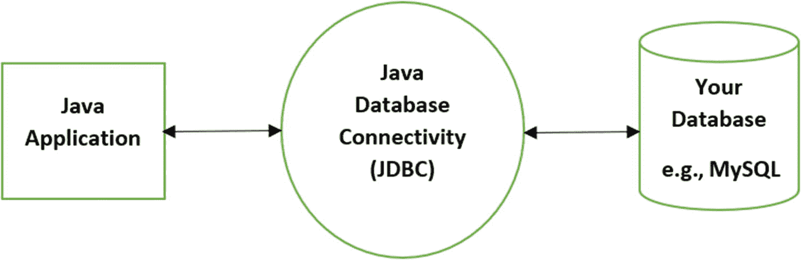

图 13-1
JDBC 可以连接 Java 应用程序和数据库（例如 MySQL）

那么，让我们在本章中逐一审视这些部分。

注意
如果您是数据库编程的绝对新手，可能需要了解本章中简要提及的一些关键术语。因此，建议您反复查阅这些术语和定义，以便更好地理解。渐渐地，这些术语会变得清晰，您将能够执行复杂的数据库编程。

数据库与 DBMS
**数据库** 是相关文件的集合，通常称为表。**表** 是相关记录的集合。**记录** 是相关字段的集合，文件中最小且有意义的的信息单元称为**字段**（或数据项）。
**数据库管理系统**（DBMS）是有效管理这些数据的软件包。Oracle Database、SQL Server、MySQL、MS-Access 等是一些常用的 DBMS 软件包。

DBMS 的类型

DBMS 有多种类型，例如：

*   层次型 DBMS（HDBMS）
*   网状型 DBMS（NDBMS）
*   关系型 DBMS（RDBMS）
*   面向对象数据库（OODB）
*   分布式 DBMS（DDBMS）

每种类型都有其优缺点。选择哪种数据库取决于您的需求。根据您的需求，您可能更倾向于选择 NoSQL（它是一种非关系型结构，可能适用于 DDBMS），而不是选择 SQL 数据结构（适用于 RDBMS）。在本章中，您将只看到 RDBMS 和简单 SQL 语句的使用。

RDBMS
在 RDBMS 中，数据以行和列的形式存储，类似于表格。这些表被称为**关系**。表中的行被称为**元组**，列被称为**属性**。
表中的每一行包含一条记录。每一列包含字段。请参考图 13-2 中的表格。

为了方便您参考，我在图 13-2 中标记了所有记录和属性。

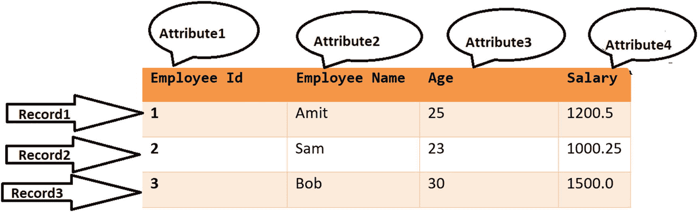

图 13-2
RDBMS 中的示例表。

您可以根据某种数学公式处理关系中的不同记录，这被称为**关系代数**。由于整个数据库都可以使用这些数学公式进行处理，因此关系代数是关系数据库和 SQL 的理论基础。
Oracle Database、MySQL、Microsoft SQL Server、IBM DB2 等是 RDBMS 的常见示例。在本章中，我使用 MySQL 来演示示例。

注意
在附录 C 中，我展示了在 Win10 机器上安装 MySQL 的步骤。

SQL

SQL 的全称是结构化查询语言。它是一种非常流行且广泛使用的 RDBMS 语言。它是一种类似英语的语言，被认为是第四代语言。创建数据、更新数据、读取数据和删除数据是 SQL 最常见的操作。在 Java 中，您将看到使用 `java.sql` 包，该包包含支持数据库编程（通常使用关系型数据库）的 API。该 API 支持许多操作，其中一些如下：

*   通过 `DriverManager` 工具建立与数据库的连接。`DriverManager` 类和 `Driver` 接口常用于编程的这一部分。
*   通过 SQL 语句与数据库通信。您通常会使用 `Connection` 接口、`Statement`、`PreparedStatement` 和 `CallableStatement` 来完成编程的这一部分。您将在演示 1 和演示 2 中看到 `Statement` 的使用。演示 3 将展示 `PreparedStatement` 的使用，演示 4 将展示 `CallableStatement` 的使用。
*   通过 `ResultSet` 接口处理通过不同查询获得的结果。

在本章中，您将看到 Java 程序与 MySQL 数据库交互时这些基本操作的使用。

要点记忆

*   Java、C++、C 等是第三代语言（3GL）。在 3GL 中，重点是“如何解决问题？”，而在 4GL 中，重点是“你想要什么？”。但一些高级的 3GL 可以结合 4GL 的一些重要方面。
*   需要注意的是，SQL 不区分大小写字符集。
*   JDBC 是一个 SQL 级别的 API。它允许您在 Java API 调用中构造和组合 SQL 语句。

注意
本章使用简单的 SQL 语句来演示各种程序。如果您是 SQL 的绝对新手，建议您先在您偏好的数据库中使用简单的 SQL 语句进行练习，以便在继续学习之前有更好的理解。

连接数据库

您可以通过不同的驱动程序连接到数据库。JDBC API 支持这些驱动程序。JDBC 驱动程序是一种软件组件，驻留在客户端机器上，帮助 Java 程序与 DBMS 通信；即，它充当适配器。有四种不同类型的 JDBC 驱动程序，如下所示：

*   **类型 1（或 JDBC-ODBC 桥接）驱动程序**：它将 JDBC 方法调用转换为 ODBC 函数调用。ODBC 桥接驱动程序必须安装在客户端机器上。在这里，JDBC 驱动程序可以与可能不是用 Java 编写的第三方 API 通信。此外，类型 1 驱动程序不是用 Java 编写的，因此它们不可移植。这些驱动程序仅适用于本地连接。Oracle 从 Java 8 开始停止支持这些驱动程序。他们现在建议您使用特定数据库供应商提供的 JDBC 驱动程序。

*   **类型 2（或本地 API）驱动程序**：这些驱动程序使用数据库的客户端库，以便它们可以将 JDBC 方法调用转换为数据库 API 的本地调用。它是一种部分 Java 驱动程序。由于本地驱动程序和客户端库都驻留在本地机器上，因此这些驱动程序不用于远程网络连接。但它们可以提供比类型 1 驱动程序更好的性能。


*   **类型 3（即网络协议）驱动程序**：这些驱动程序完全用 Java 编写。在此模式下，客户端首先与中间件应用服务器通信，该服务器将 JDBC 调用转换为特定于供应商的 DBMS 调用，然后将这些调用转发到数据库服务器。对于这些驱动程序，无需在本地机器上安装任何客户端库，因为应用服务器能够完成所需的工作。单个类型 3 驱动程序也可用于连接多个数据库。但是，客户端机器必须支持网络，并且总体维护成本较高，因为您可能需要在中间层提供特定于数据库的编码。

*   **类型 4（即纯 Java）驱动程序**：这些驱动程序也完全用 Java 编写，但它们能提供最高的性能，因为它们由供应商自己提供。在此模式下，客户端机器或服务器机器上都不需要安装特殊软件。唯一的主要缺点是，由于它由特定供应商提供，因此它依赖于特定的数据库，供应商可以在该数据库中使用不同的协议。

注意 在演示 5 中，您还将看到使用 `javax.sql.DataSource` 对象在 Java 应用程序和数据库之间建立连接。从 JDBC 2.0 开始，这是连接数据源的推荐方法。尽管如此，我仍在讨论所有这些内容，以帮助您理解遗留代码。此外，我认为没有这些讨论，“Java 数据库编程”的学习是不完整的。

图 13-3 演示了如何通过 JDBC 驱动程序连接三种不同类型的数据库。

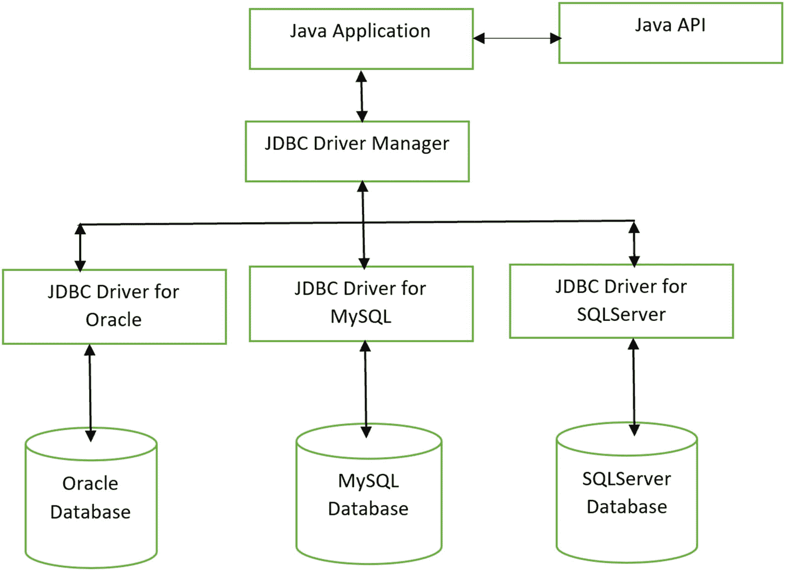

图 13-3
不同类型的数据库可以通过 JDBC 驱动程序连接

您可能有不同的 JDBC 驱动程序来连接不同的数据库。但作为最终用户，您无需担心它们的实现。目前，您只需知道需要 JDBC 驱动程序来连接数据库即可。

问答环节
**13.1 如何判断哪种驱动程序适合我的应用程序？**
如果您知道只需要一个特定的数据库，请选择类型 4。如果您需要访问多个数据库，请选择类型 3。当您既没有类型 3 也没有类型 4 时，可以考虑类型 2 驱动程序。通常不建议使用类型 1，但您可以将其限制在测试目的中使用。
**13.2 当任何客户端使用类型 3 驱动程序时，应用服务器的典型操作有哪些？**
一些典型操作包括日志记录、负载均衡、审计等。

在 Java 应用程序中与数据库通信
现在，您将看到一些演示，其中 Java 应用程序将与 MySQL 数据库交互。对于其他数据库，您可以遵循类似的方法。在接下来的演示中，您将看到类型 4 驱动程序的使用。

当您通过 Java 程序连接到数据库时，通常需要考虑以下步骤：

1.  加载您的 JDBC 驱动程序。

2.  创建一个连接对象并连接到数据库。

3.  使用您的 Java 程序执行 SQL 语句。

4.  映射检索到的结果并根据您的需求进行处理。

这里，我假设您已经在本地计算机上安装了 MySQL。如果尚未安装，您可以访问链接 [`https://dev.mysql.com/downloads/installer/`](https://dev.mysql.com/downloads/installer/) 获取安装程序和相关信息。在撰写本文时，`mysql-installer-community-8.0.16.0` 是最新版本。您也可以参考附录 C，其中我展示了在 Win10 机器上安装 MySQL 的步骤。

但安装数据库只是第一步。要使用 Java 应用程序连接到数据库，您需要一个特定于供应商的连接器。我使用的是 MySQL 和 JDBC。因此，我搜索了用于 MySQL 中 JDBC 驱动程序的连接器。在撰写本文时，`mysql-connector-java-8.0.16.zip` 可在以下链接 [`https://dev.mysql.com/downloads/connector/j/`](https://dev.mysql.com/downloads/connector/j/) 获取。我选择了平台无关版本（图 13-4）并将其下载到本地系统。


图 13-4
从 [`https://dev.mysql.com/downloads/connector/j/`](https://dev.mysql.com/downloads/connector/j/) 下载 MySql Connector/J 8.0.16 平台无关版本

下载并解压 zip 文件后，您将获得 `mysql-connector-java-8.0.16.jar` 文件（撰写本文时的最新版本），您需要将其添加到 Eclipse 中的 Java 构建路径中（**项目** ➤ **属性** ➤ **Java 构建路径** ➤ **添加外部 JAR...**）。在 Eclipse 中添加此外部 jar 后，您可能会看到类似于图 13-5 所示的屏幕。

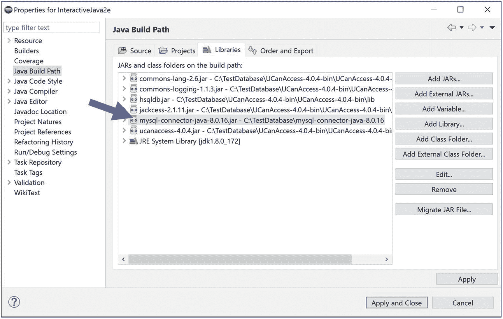

图 13-5
在 Eclipse 中添加了 `mysql-connector-java-8.0.16.jar`

重要术语
现在，让我们来看一些演示。要理解接下来的演示，您需要熟悉以下类、接口和方法：
**DriverManager**：这个*类*管理一组 JDBC 驱动程序。它将来自 Java 应用程序的连接请求与正确的数据库驱动程序进行匹配。（需要注意的是，JDBC 2.0 提供了另一种连接数据源的方式。使用 `DataSource` 对象是连接数据源的推荐方式。）

**Driver**
：这是一个*接口*，用于处理与数据库服务器的通信。每个驱动程序必须提供一个实现此接口的类。每个 `Driver` 类应该小巧且独立，以便可以在没有大量支持代码的情况下加载。当加载一个 `Driver` 类时，您应该创建它的一个实例并将其注册到 `DriverManager`。因此，在演示 1 中，您可能会注意到以下代码行：

```
// 用于 MySQL 数据库
Class.forName("com.mysql.cj.jdbc.Driver").newInstance();
```

要点记忆

*   类似于连接 Oracle 数据库，您可能会注意到以下代码的使用：

*   要连接 MS SQL Server，您可能会注意到*以下代码*的使用：

```
    Class.forName("com.microsoft.jdbc.sqlserver.SQLServerDriver").newInstance();
    ```

```
Class.forName("oracle.jdbc.driver.OracleDriver").newInstance();
```

**Connection**：这个*接口*提供了连接数据库的方法。您的 SQL 语句执行，结果在连接的上下文中返回。您可以简单地说，所有与数据库的通信都通过连接对象进行。

**getConnection()**：此方法尝试连接到给定的数据库 URL。此方法有多个重载版本。在演示 1 中，您会注意到以下代码行：

```
DriverManager.getConnection("jdbc:mysql://localhost:3306/test", "root", "admin");
```

也就是说，我使用了以下重载版本：

```
public static Connection getConnection(String url, String user, String password) throws SQLException
```

其中 `user` 字符串表示数据库用户名，`password` 字符串是该用户的密码。

注意
使用字符串 `localhost` 是因为我将 MySQL 数据库安装在了本地系统中，而 `test` 是我的本地数据库名称。


**声明**：这是一个*接口*。`Statement` 对象用于执行静态 SQL 语句并返回其结果。默认情况下，在特定时刻，每个 `Statement` 对象只能打开一个 `ResultSet` 对象。
**createStatement()**：此方法创建一个 `Statement` 对象，用于向数据库发送 SQL 语句。
**executeQuery()**：此方法用于执行返回单个 `ResultSet` 对象的 SQL 语句。
**executeUpdate()**：此方法用于执行可以是 `insert`、`update` 或 `delete` 语句中任意一种的 SQL 语句。你也可以使用不返回任何内容的 DDL 语句。（可参考本上下文中的问答 13.10。）

注意
不能在 `PreparedStatement` 或 `CallableStatement` 上调用 `executeQuery()` 或 `executeUpdate()` 方法。

**ResultSet**：这是一个*接口*，表示数据库查询的结果集。读取数据（使用数据库查询）的 SQL 语句将数据返回到结果集中。`select` 语句是选择行并在结果集中查看它们的标准方式。
在演示 1 中，你会注意到，一旦使用 `Statement` 对象执行了 SQL 语句，就会检索到查询结果。它就像一个迭代器，让你可以轻松地遍历其数据。在此上下文中，了解 `ResultSet` 对象维护一个指向结果集中当前行的游标是很有用的。
**SQLException**：此*类*用于描述各种数据库访问错误（或数据库应用程序中可能发生的任何其他错误）。

创建数据库并插入记录
演示 1 展示了如何连接到 MySQL 数据库以及如何从数据库的表中检索记录。

在此之前，你可以熟悉一下 MySQL Workbench，这是一个图形化工具，可在使用 MySQL 服务器和数据库时使用。安装后，你可以在启动菜单中找到它，如图 13-6 所示。

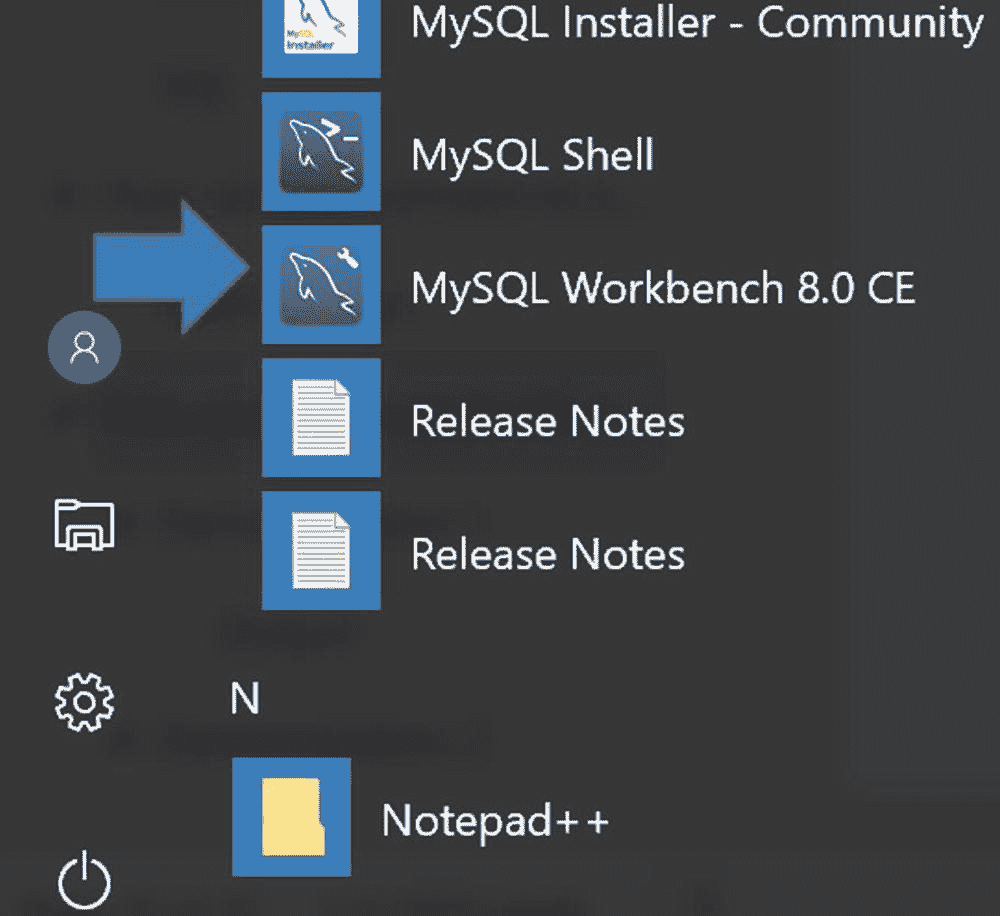

图 13-6
安装后，MySQL Workbench 8.0 可在启动菜单中找到

在开始之前，我创建了一个名为 `test` 的数据库，然后在该数据库中创建了一个名为 `employee` 的表。在 `employee` 表中，我只插入了三条记录。创建数据库和在数据库中创建表非常简单。如果你知道这些命令，可以跳过下面方括号 [ ] 中的部分。

[例如，登录到你的数据库服务器后：

*   要创建名为 `test` 的数据库，可以使用以下命令：

*   要创建名为 `employee` 的表，可以使用以下命令：

```
create database test;
```

```
create table employee(EmpId int(10),Name varchar(10),Age int(10), Salary double);
```

这简单地说明 employee 表有四列：`EmpId`、`Name`、`Age` 和 `Salary`。这里也描述了带有大小的数据类型。`varchar` 数据类型对你来说可能比较陌生。现在，只需知道它用于可以同时包含字母和数字的数据。

*   要在 `employee` 表中插入一条记录，可以使用以下命令：

```
insert into employee values (1,'Amit',25,1200.5);
```

类似地，你可以插入其他记录。

另一个需要注意的重要点是，如果你想让某一列唯一且非空，可以将其用作主键。例如，如果我不想在 `EmpId` 列中出现重复值，并且希望每条记录都包含 `EmpId` 的信息，我会在创建表时使用主键的概念，如下所示：

```
create table employee(EmpId int(10) primary key,Name varchar(10),Age int(10), Salary double);
```

现在，当你向 `employee` 表插入记录时，需要提供 `EmpId` 的信息。简而言之，通过使用主键，你可以唯一地标识一条记录。]

图 13-7 展示了 MySQL Workbench 的视图。从图中可以看出，test 数据库当前包含一个表 `employee`，其中有三条记录。该图还展示了 `employee` 表的表模式。

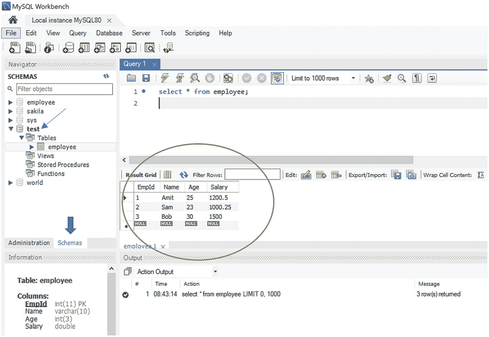

图 13-7
test 数据库中 employee 表的 MySQL Workbench 视图

但要理解接下来的演示，你不需要详细了解 MySQL Workbench。在这里，我使用这个图形化工具来展示在你开始使用 JDBC 编程之前的当前数据库及其中的表。

MySQL 命令提示符视图

或者，你可以使用 MySQL 命令提示符。你可以从该命令提示符执行以下命令（以粗体显示）。为了方便你参考，我将我的注释或命令详细信息放在方括号 [ ] 内。

```
Enter password: *****
Welcome to the MySQL monitor.  Commands end with ; or \g.
Your MySQL connection id is 19
Server version: 8.0.16 MySQL Community Server - GPL
Copyright (c) 2000, 2019, Oracle and/or its affiliates. All rights reserved.
Oracle is a registered trademark of Oracle Corporation and/or its affiliates. Other names may be trademarks of their respective owners.
Type 'help;' or '\h' for help. Type '\c' to clear the current input statement.
[列出本地 MySQL 服务器中的所有数据库，使用 'show databases' 命令]
mysql> show databases;
+--------------------+
| Database           |
+--------------------+
| employee           |
| information_schema |
| mysql              |
| performance_schema |
| sakila             |
| sys                |
| test               |
| world              |
+--------------------+
8 rows in set (0.00 sec)
[要切换到特定数据库，请使用以下命令]
mysql> use test;
Database changed
[要显示数据库中的所有表，请使用以下命令]
mysql> show tables;
+----------------+
| Tables_in_test |
+----------------+
| employee       |
+----------------+
1 row in set (0.00 sec)
[要显示表中的所有记录（此处为 'employee'），请使用以下命令]
mysql> select * from employee;
+-------+------+------+---------+
| EmpId | Name | Age  | Salary  |
+-------+------+------+---------+
|     1 | Amit |   25 |  1200.5 |
|     2 | Sam  |   23 | 1000.25 |
|     3 | Bob  |   30 |    1500 |
+-------+------+------+---------+
3 rows in set (0.00 sec)
mysql> desc employee;
+--------+-------------+------+-----+---------+-------+
| Field  | Type        | Null | Key | Default | Extra |
+--------+-------------+------+-----+---------+-------+
| EmpId  | int(11)     | NO   | PRI | NULL    |       |
| Name   | varchar(10) | YES  |     | NULL    |       |
| Age    | int(3)      | YES  |     | NULL    |       |
| Salary | double      | YES  |     | NULL    |       |
+--------+-------------+------+-----+---------+-------+
4 rows in set (0.00 sec)
mysql>
```

演示 1

我已经说过，演示 1 展示了如何连接到 MySQL 数据库以及如何从数据库的表中检索记录。如前所述，我创建了一个名为 `test` 的数据库，然后在该数据库中创建了一个名为 `employee` 的表。目前，`employee` 表包含三条记录，这些记录也在本演示之前展示过。要理解这个示例，你可能需要重新回顾前面介绍的重要类、接口和方法的描述。


```
package java2e.chapter13;
import java.sql.*;
class Demonstration1 {
public static void main(String[] args) throws SQLException {
System.out.println("***演示-1. 连接到 MySql 服务器。***");
Connection connectionOb = null;
try {
// 针对 MySql 数据库
Class.forName("com.mysql.cj.jdbc.Driver").newInstance();
connectionOb = DriverManager.getConnection("jdbc:mysql://localhost:3306/test", "root", "admin");
Statement statementOb = connectionOb.createStatement();
ResultSet queryResult = statementOb.executeQuery("select * from Employee");
System.out.println(" 员工 ID\t" + "员工姓名\t" + "年龄\t" + "薪资");
System.out.println("------------------------------------------");
while (queryResult.next()) {
System.out.print(queryResult.getString("EmpId") + "\t\t" + queryResult.getString("Name") + "\t\t"+ queryResult.getInt("Age") + "\t" + queryResult.getDouble("Salary"));
System.out.println();
}
} catch (SQLException ex) {
System.out.println(ex.getMessage());
}
// 捕获任何其他异常
catch (Exception ex) {
System.out.println(ex.getMessage());
ex.printStackTrace();
} finally {
// 关闭连接
if (connectionOb != null) {
connectionOb.close();
}
}
}
}
```

输出：

```
***演示-1. 连接到 MySql 服务器。***
员工 ID       员工姓名       年龄       薪资

1             Amit             25       1200.5
2             Sam             23       1000.25
3             Bob             30       1500.0
```

演示 2
在演示 2 中，我将更新一些记录，然后删除一条记录。最后，我将以能够恢复表格初始状态的方式更新记录。例如，你会看到虽然 Amit 的年龄从 25 更新为 35，但最后我又将其重置为 25。此外，我还删除了新添加的 John 的记录。同样，虽然我修改了 Bob 的薪资，但最后我又重置了该值。

本次演示的另一个显著变化是，在此示例中，我使用了 `executeUpdate()` 来更新记录。在演示 1 中，你看到了 `executeQuery()` 方法的使用。

```
package java2e.chapter13;
import java.sql.*;
class Demonstration2 {
public static void main(String[] args) throws SQLException {
System.out.println("***演示-2. 连接到 MySql 服务器。***");
Connection connectionOb = null;
try {
// 针对 MySql 数据库
Class.forName("com.mysql.cj.jdbc.Driver").newInstance();
connectionOb = DriverManager.getConnection("jdbc:mysql://localhost:3306/test", "root", "admin");
Statement statementOb = connectionOb.createStatement();
System.out.println("以下是初始表格");
ResultSet queryResult = statementOb.executeQuery("select * from Employee");
System.out.println(" 员工 ID\t" + "员工姓名\t" + "年龄\t" + "薪资");
System.out.println("------------------------------------------");
while (queryResult.next()) {
System.out.print(queryResult.getString("EmpId") + "\t\t" + queryResult.getString("Name") + "\t\t"
+ queryResult.getInt("Age") + "\t" + queryResult.getDouble("Salary"));
System.out.println();
}
//更新 2 条记录并插入一条新记录。
System.out.println("将 Amit 的年龄更新为 35。");
statementOb.executeUpdate("update Employee set Age=35 where name="Amit" ");
System.out.println("将 Bob 的薪资更新为 2000.25");
statementOb.executeUpdate("update Employee set Salary=2000.25 where name="Bob" ");
System.out.println("向 Employee 表中插入一条新记录\n");
statementOb.executeUpdate("insert into Employee values(4,'John',27,975)");
System.out.println("**以下是更新后的表格。**");
queryResult = statementOb.executeQuery("select * from Employee");
System.out.println(" 员工 ID\t" + "员工姓名\t" + "年龄\t" + "薪资");
System.out.println("------------------------------------------");
while (queryResult.next()) {
System.out.print(queryResult.getString("EmpId") + "\t\t" + queryResult.getString("Name") + "\t\t"
+ queryResult.getInt("Age") + "\t" + queryResult.getDouble("Salary"));
System.out.println();
}
//从 Employee 表中删除一条记录，并在 Employee 表中再次设置初始值。
System.out.println("\n 从 Employee 表中删除 John 的记录。");
statementOb.executeUpdate("delete from employee where name="John" ");
System.out.println("再次将 Amit 的年龄更新为 25。");
statementOb.executeUpdate("update Employee set Age=25 where name="Amit" ");
System.out.println("再次将 Bob 的薪资更新为 1500.0。");
statementOb.executeUpdate("update Employee set Salary=1500.0 where name="Bob" ");
System.out.println("\n**以下是更新后的表格。**");
queryResult = statementOb.executeQuery("select * from Employee");
System.out.println(" 员工 ID\t" + "员工姓名\t" + "年龄\t" + "薪资");
System.out.println("------------------------------------------");
while (queryResult.next()) {
System.out.print(queryResult.getString("EmpId") + "\t\t" + queryResult.getString("Name") + "\t\t"
+ queryResult.getInt("Age") + "\t" + queryResult.getDouble("Salary"));
System.out.println();
}
} catch (SQLException ex) {
System.out.println(ex.getMessage());
}
// 捕获任何其他异常
catch (Exception ex) {
System.out.println(ex.getMessage());
ex.printStackTrace();
} finally {
// 关闭连接
if (connectionOb != null) {
connectionOb.close();
}
}
}
}
```

以下是输出结果。关键更改以粗体显示。

```
***演示-2. 连接到 MySql 服务器。***
以下是初始表格
员工 ID   员工姓名   年龄   薪资

1             Amit           25    1200.5
2             Sam            23    1000.25
3             Bob            30    1500.0
将 Amit 的年龄更新为 35。
将 Bob 的薪资更新为 2000.25
向 Employee 表中插入一条新记录
**以下是更新后的表格。**
员工 ID   员工姓名   年龄   薪资
```


1             Amit           35    1200.5
2             Sam            23    1000.25
3             Bob            30    2000.25
4             John           27    975.0
正在从 Employee 表中删除 John 的记录。
再次将 Amit 的年龄更新为 25。
再次将 Bob 的薪水更新为 1500.0。
**以下是更新后的表格。**
EmployeeId   EmployeeName   Age   Salary

1             Amit           25    1200.5
2             Sam            23    1000.25
3             Bob            30    1500.0

注意
如果你使用单独的方法来显示记录和更新（或插入）记录，并从你的 `main()` 方法中调用这些方法，那么本程序可以进一步改进。你可以按照同样的方式处理本章中的其他演示。在本示例中，我仅专注于更新和插入记录，并使其与演示 1 保持一致。

演示 3

本演示展示了 `PreparedStatement` 对象的使用。`PreparedStatement` 是一个扩展了 `Statement` 接口的接口。使用 `PreparedStatement` 可以为你提供以下便利：

*   你可以使用参数化的 SQL 语句。
*   你可以使用新值重用该语句。
*   你可以提供批处理并实现更快的执行。

在下面的示例中，你会注意到以下代码行的使用：

```
PreparedStatement preparedStatementOb=null;
preparedStatementOb=connectionOb.prepareStatement("insert into Employee values(?,?,?,?)");
```

你可以看到，创建了一个带有四个输入参数的 `PreparedStatement` 对象。注意四个问号（`?`）。这些是你输入的占位符。在执行 `PreparedStatement` 对象之前，你需要提供值来替换这些问号。你可以使用 `PreparedStatement` 类中定义的 setter 方法来提供值。在接下来的演示中，你将使用以下语句提供一条新记录（其中员工姓名为“Ivan”）：

```
preparedStatementOb.setInt(1,4);
preparedStatementOb.setString(2,"Ivan");
preparedStatementOb.setInt(3,27);
preparedStatementOb.setDouble(4,975.6);
```

需要注意的是，这些 setter 方法的第一个参数指定了问号占位符。例如，两次 `setInt()` 调用分别指定了第一个和第三个占位符；`setString()` 指定了第二个占位符；`setDouble()` 指定了第四个占位符。

最后，你将在 `PreparedStatement` 对象上调用 `executeUpdate()` 方法，如下所示：

```
preparedStatementOb.executeUpdate();
```

现在，请仔细阅读以下演示及其对应的输出：

```
package java2e.chapter13;
import java.sql.*;
public class Demonstration3 {
public static void main(String[] args) throws SQLException {
System.out.println("***演示-3. 使用 PreparedStatement。***");
Connection connectionOb = null;
try {
// 针对 MySql 数据库
Class.forName("com.mysql.cj.jdbc.Driver").newInstance();
connectionOb = DriverManager.getConnection("jdbc:mysql://localhost:3306/test", "root", "admin");
Statement statementOb = connectionOb.createStatement();
System.out.println("以下是初始表格。");
ResultSet queryResult = statementOb.executeQuery("select * from Employee");
System.out.println(" EmployeeId\t" + "EmployeeName\t" + "Age\t" + "Salary");
System.out.println("------------------------------------------");
while (queryResult.next()) {
System.out.print(queryResult.getString("EmpId") + "\t\t" + queryResult.getString("Name") + "\t\t"
+ queryResult.getInt("Age") + "\t" + queryResult.getDouble("Salary"));
System.out.println();
}
//在表中插入一条新记录
System.out.println("\n 正在向 Employee 表中插入一条新记录。");
PreparedStatement preparedStatementOb=null;
preparedStatementOb=connectionOb.prepareStatement("insert into Employee values(?,?,?,?)");
preparedStatementOb.setInt(1,4);
preparedStatementOb.setString(2,"Ivan");
preparedStatementOb.setInt(3,27);
preparedStatementOb.setDouble(4,975.6);
preparedStatementOb.executeUpdate();
System.out.println("**以下是更新后的表格。**");
queryResult = statementOb.executeQuery("select * from Employee");
System.out.println(" EmployeeId\t" + "EmployeeName\t" + "Age\t" + "Salary");
System.out.println("------------------------------------------");
while (queryResult.next()) {
System.out.print(queryResult.getString("EmpId") + "\t\t" + queryResult.getString("Name") + "\t\t"
+ queryResult.getInt("Age") + "\t" + queryResult.getDouble("Salary"));
System.out.println();
}
//从 Employee 表中删除一条记录，并在 Employee 表中再次设置初始值。
System.out.println("\n 正在从 Employee 表中删除 Ivan 的记录。");
statementOb.executeUpdate("delete from employee where name="Ivan" ");
System.out.println("删除 Ivan 的记录后，以下是更新后的表格。**");
queryResult = statementOb.executeQuery("select * from Employee");
System.out.println(" EmployeeId\t" + "EmployeeName\t" + "Age\t" + "Salary");
System.out.println("------------------------------------------");
while (queryResult.next()) {
System.out.print(queryResult.getString("EmpId") + "\t\t" + queryResult.getString("Name") + "\t\t"
+ queryResult.getInt("Age") + "\t" + queryResult.getDouble("Salary"));
System.out.println();
}
} catch (SQLException ex) {
System.out.println(ex.getMessage());
}
// 捕获任何其他异常
catch (Exception ex) {
System.out.println(ex.getMessage());
ex.printStackTrace();
} finally {
// 关闭连接
if (connectionOb != null) {
connectionOb.close();
}
}
}
}
```

输出：

```
***演示-3. 使用 PreparedStatement。***
以下是初始表格。
EmployeeId   EmployeeName   Age   Salary

1             Amit           25    1200.5
2             Sam            23    1000.25
3             Bob            30    1500.0
正在向 Employee 表中插入一条新记录。
**以下是更新后的表格。**
EmployeeId   EmployeeName   Age   Salary

1             Amit           25    1200.5
2             Sam            23    1000.25
3             Bob            30    1500.0
4             Ivan           27    975.6
正在从 Employee 表中删除 Ivan 的记录。
删除 Ivan 的记录后，以下是更新后的表格。**
EmployeeId   EmployeeName   Age   Salary

1             Amit           25    1200.5
2             Sam            23    1000.25
3             Bob            30    1500.0
```


问答环节
**13.3 为什么使用**
**PreparedStatement** **对象** **被认为比使用**
**Statement** **对象**
**更快？**
`PreparedStatement`
对象可以包含预编译的 SQL 语句。因此，如果你多次传递相同的查询（使用相同或不同的数据），数据库管理系统可以更快地运行该查询。但是，对于 `Statement` 对象，每次使用时 SQL 都需要验证该查询。
**13.4 对于**
**PreparedStatement** **对象** **，是否必须传递参数？**

不是。在演示 3 中，你可以简单地使用以下代码行来获得相同的结果：

```
//Parameters are not mandatory for PreparedStatement .
preparedStatementOb = connectionOb.preparedStatement("insert into Employee values(4,'IvanS',27,975.6)");
```

通常，当你的 SQL 查询需要参数时，你会使用 `PreparedStatement`。接受参数的 SQL 语句可以帮助你使用不同的值执行该语句，这在现实场景中非常常见。为了简单并使程序更简短，我没有使用命令行参数或用户定义的输入。但在实践中，你始终可以通过命令行传递参数，这些参数将在你的查询被处理之前替换掉问号。
**13.5** **executeQuery()** **方法**
**与**
**executeUpdate()** **有何不同？**
`executeUpdate()`
方法用于插入、更新或删除操作，或返回空值的 SQL 语句，例如 DDL 语句。此方法不返回任何 `ResultSet` 对象。
另一方面，`executeQuery()`
执行一个返回单个 `ResultSet` 对象的 SQL 语句。此方法不能在 `PreparedStatement` 或 `CallableStatement` 上调用（这将在下一个演示中讨论）。
**13.6 使用**
**PreparedStatement** **的主要优势是什么？**

以下是使用 `PreparedStatement` 的主要优势：

*   你可以传递参数化的 SQL 语句。

*   你可以使用不同的值重用该语句。

*   你可以提供批处理功能。

*   由于它支持预编译的 SQL 语句，你可以缩短执行时间。

**13.7 什么是** **批处理** **？你能举个例子吗？**
“批处理”是指你可以执行一批（或一组、一套）查询。`Statement` 接口中的 `addBatch()` 和 `executeBatch()` 方法可以在这方面帮助你。

让我们将以下行添加到演示 1 中：

```
statementOb.addBatch("insert into Employee values(4,'Ivan',27,975.6)");
statementOb.addBatch("insert into Employee values(5,'Jacklin',29,575.5)");
//Batch execution
statementOb.executeBatch();
```

现在，你可以看到记录被正确插入。类似地，你可以按如下方式删除记录：

```
//Now deleting the records  from the Employee table
//and resetting the original state of Employee table.
System.out.println("\nDeleting the record of Ivan and Jacklin from the Employee table.");
statementOb.addBatch("delete from employee where name="Ivan" ");
statementOb.addBatch("delete from employee where name="Jacklin" ");
//Batch execution
statementOb.executeBatch();
```

演示 4
此演示展示了 `CallableStatement` 对象的使用。`CallableStatement` 是一个扩展了 `PreparedStatement` 的接口，而 `PreparedStatement` 又扩展了 `Statement` 接口。`CallableInterface` 用于执行 SQL 中的存储过程和函数。

注意
存储过程和函数之间存在一些显著差异。例如，在 MySQL 中，存储过程可用于返回一个或多个值，或不返回值，而函数总是返回单个值。此外，你可以直接使用 SQL 语句调用函数，但对于过程则不能这样做。存储过程可以有 IN、OUT、INOUT 参数，但存储函数默认只能有 IN 参数。为了使示例简短且简单，在演示 4 中，你将只看到一个小函数的使用。


开始之前，请在你的测试数据库中创建一个名为 `numbertable` 的表，如表 13-1 所示。

表 13-1
在数据库中创建的 numbertable 表

FirstNumber |
 SecondNumber |

| --- | --- | --- | --- | --- |

12.3 |
 15.7 |

32.5 |
 25.3 |

25.0 |
 75.0 |

可以看到，该表有两个属性：`FirstNumber` 和 `SecondNumber`，表中的每一行都包含各种双精度类型的值。假设你想要计算表中每一行两个双精度值的总和；你可以使用名为 `total()` 的函数来完成此任务。

因此，在执行演示 4 之前，你可能希望完成以下步骤：

1.  创建 `NumberTable` 并用必要的数据填充该表。

2.  创建一个函数 `total()`，该函数接受两个 `double` 类型的值作为参数，并返回它们的总和。

你可以通过多种方式并按自己偏好的顺序完成步骤 1 和步骤 2。在下一节中，我将给出我连接数据库后用于完成这些步骤的命令（以及相应的输出）。为了便于阅读，SQL 语句以粗体显示。我还会在方括号 `[ ]` 内添加辅助性注释。

步骤 1

[创建 `NumberTable`]

```
mysql> create table NumberTable(FirstNo Double, SecondNo Double);
Query OK, 0 rows affected (2.77 sec)
```

[检查测试数据库中的表。此步骤可选。]

```
mysql> show tables;
+----------------+
| Tables_in_test |
+----------------+
| employee       |
| numbertable    |
+----------------+
2 rows in set (0.08 sec)
```

[向表中插入第一行数据。]

```
mysql> insert into numbertable values(12.3,15.7);
Query OK, 1 row affected (2.12 sec)
```

[向表中插入第二行数据。]

```
mysql> insert into numbertable values(32.3,25.3);
Query OK, 1 row affected (0.13 sec)
```

[向表中插入第三行数据。]

```
mysql> insert into numbertable values(25,75);
Query OK, 1 row affected (0.08 sec)
```

[检查表的当前状态。]

```
mysql> select * from numbertable;
+---------+----------+
| FirstNo | SecondNo |
+---------+----------+
|    12.3 |     15.7 |
|    32.3 |     25.3 |
|      25 |       75 |
+---------+----------+
3 rows in set (0.08 sec)
```

步骤 2

创建名为 `total` 的函数：[函数是一种存储程序，你可以在其中传递参数，并且它会返回一个值。]

```
mysql> create function total(firstNumber double, secondNumber double) returns double deterministic return firstNumber + secondNumber;
Query OK, 0 rows affected (1.03 sec)
```

注意
根据 MySQL 8.0 参考手册：“如果例程对于相同的输入参数总是产生相同的结果，则被视为‘确定性’的，否则为‘非确定性’。如果在例程定义中既未指定 DETERMINISTIC 也未指定 NOT DETERMINISTIC，则默认为 NOT DETERMINISTIC。”

因此，如果你在上一个查询中遗漏了 `deterministic` 这个词，可能会遇到以下错误：

```
ERROR 1064 (42000): You have an error in your SQL syntax; check the manual that corresponds to your MySQL server version for the right syntax to use near 'sum(firstNumber double,secondNumber double)
returns double
return firstNumber+se' at line 1
```

[现在显示函数详情。此步骤可选。]

```
mysql> Select Routine_name as "Function Name", routine_Definition as "Definition", Routine_Schema "Schema", Data_Type as "Types", Created From  Information_Schema.Routines Where Routine_Name="total" and Routine_Type= 'FUNCTION';
```

以下是 MySQL 8.0 命令行客户端的截图，以便于阅读：

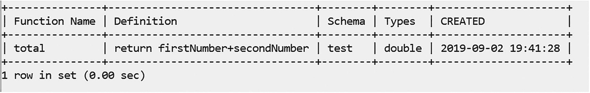

现在，让我们分析接下来的程序。在下面的示例中，你会注意到以下代码行：

```
CallableStatement callableStmt=connectionOb.prepareCall("{?= call total(?,?)}");
```


可以看到，`CallableStatement` 对象是通过调用 `prepareCall()` 方法创建的，而 `prepareCall()` 方法接受一个 `String` 参数。

**注意**
与许多其他方法一样，`prepareCall()` 方法也有多种重载版本。在本例中，我使用了最简单的一个。

请注意这三个问号。你知道它们用于表示方法参数。这些参数本质上是顺序的，第一个参数从 1 开始。

以下几行将展示这些参数的用法：

```
callableStmt.setDouble(2,queryResult.getDouble("FirstNo"));
callableStmt.setDouble(3,queryResult.getDouble("SecondNo"));
/*
这里，我们使用了 CallableStatement 接口的 registerOutParameter() 方法，该方法将参数索引 parameterIndex（第一个参数）指定序数位置上的 OUT 参数注册为 JDBC 类型 sqlType（第二个参数）。所有 OUT 参数必须在执行存储过程之前注册。
*/
callableStmt.registerOutParameter (1,Types.DOUBLE);
callableStmt.execute();
```

这表明在位置 2 和 3 有两个 `double` 类型的值。位置 1 的问号将被函数（本例中函数名为 `total()`）调用所替换，该函数接受这些 `double` 类型的值作为参数，并返回聚合结果（也是一个 `double` 类型的值）。
现在，让我们看一下完整的实现和相应的输出。

```
package java2e.chapter13;
import java.sql.*;
class Demonstration4 {
public static void main(String[] args) throws SQLException {
System.out.println("***Demonstration-4.Using a Callable Statement.***");
Connection connectionOb = null;
try {
// for MySQL database
Class.forName("com.mysql.cj.jdbc.Driver").newInstance();
connectionOb = DriverManager.getConnection("jdbc:mysql://localhost:3306/test", "root", "admin");
Statement statementOb = connectionOb.createStatement();
System.out.println("This is the original table.");
ResultSet queryResult = statementOb.executeQuery("select * from NumberTable");
System.out.println("FirstNumber \t" + "SecondNumber");
System.out.println("--------------------------");
while (queryResult.next()) {
System.out.print(queryResult.getDouble("FirstNo") + "\t\t" + queryResult.getString("SecondNo"));
System.out.println();
}
System.out.println("\nCalling the total() function on each record of the NumberTable.");
//Using the Callable statement
CallableStatement callableStmt=connectionOb.prepareCall("{?= call total(?,?)}");
queryResult = statementOb.executeQuery("select * from NumberTable");
System.out.println("FirstNumber \t" + "SecondNumber\t"+"Total");
System.out.println("--------------------------------------");
while (queryResult.next()) {
System.out.print(queryResult.getDouble("FirstNo") + "\t\t" + queryResult.getDouble("SecondNo")+ "\t\t");
callableStmt.setDouble(2,queryResult.getDouble("FirstNo"));
callableStmt.setDouble(3,queryResult.getDouble("SecondNo"));
/*Here, we have used the registerOutParameter method of the CallableStatement interface, which registers the OUT parameter in the ordinal position in parameterIndex(first argument) to the JDBC type sqlType(second argument). All OUT parameters must be registered before a stored procedure is executed.*/
callableStmt.registerOutParameter (1,Types.DOUBLE);
callableStmt.execute();
System.out.print(callableStmt.getDouble(1));
System.out.println();
}
} catch (SQLException ex) {
System.out.println(ex.getMessage());
}
// To catch any other exception
catch (Exception ex) {
System.out.println(ex.getMessage());
ex.printStackTrace();
} finally {
// Close the connection
if (connectionOb != null) {
connectionOb.close();
}
}
}
}
```

输出：

```
***Demonstration-4.Using a Callable Statement.***
This is the original table.
FirstNumber      SecondNumber

12.3             15.7
32.5             25.3
25.0             75.0
```

对 `NumberTable` 中的每条记录调用 `total()` 函数：

```
FirstNumber      SecondNumber     Total

12.3             15.7              28.0
32.5             25.3              57.8
25.0             75.0             100.0
```

问答环节
**13.8 什么时候应该优先使用 `Statement` 对象，而不是 `PreparedStatement` 或 `CallableStatement`？**

你可以记住以下几点：

*   如果要执行简单的 SQL 语句（例如，`select * from Table_name;`），请使用 `Statement` 对象。
*   如果要使用预编译语句，请使用 `PreparedStatement`。
*   如果要使用存储过程（或函数），请使用 `CallableStatement`。

**13.9 什么是存储过程？**
简单来说，如果你想重复执行一系列任务，可以创建一个存储过程。存储过程很像在 Java 中编写一个方法。创建存储过程的步骤可能因数据库而异。
在本章中，我在演示 4 中使用了一个简单的函数 `total()` 来满足我们的需求。
**13.10 你在某些地方提到了 SQL 上下文中的 DDL 这个术语。它是什么意思？**

SQL 命令通常分为以下几类：

*   ***DDL（数据定义语言）*** 语句用于创建或修改数据库对象的结构。在此上下文中，你使用 `create`、`alter`、`drop` 和 `truncate` 语句。
*   ***DML（数据操作语言）*** 语句用于检索、插入、更新和删除数据库中的记录。例如，在此上下文中，你使用 `insert`、`update`、`delete` 和 `select` 语句。一些工程师倾向于将 `select` 语句归入一个单独的类别，称为 DQL（数据查询语言）。
*   ***DCL（数据控制语言）*** 语句可用于创建各种角色和权限，以控制对数据库的访问。例如，在此上下文中，你可能会使用 `grant` 和 `revoke` 语句。
*   ***TCL（事务控制语言）*** 语句用于管理数据库中发生的不同事务。例如，在此上下文中，你可能会使用 `commit`、`rollback` 等语句。

**注意** 如前所述，要详细了解这些术语，你可能需要自己练习 SQL 语句。在本章中，我们的重点不是详细覆盖 SQL；重点是 Java 应用程序能够简单地与数据库通信并执行一些基本操作。

演示 5
此演示展示了如何使用 `javax.sql.DataSource` 接口对象连接到数据源。这是 JDBC 2.0 API 的新增功能，也是连接数据源的首选方式。使用 `DataSource` 对象可以提供连接池和分布式事务。但由于你刚刚开始学习，我们将只关注连接部分。
在演示 5 中，使用了 `getMySqlDataSource()` 方法。
在此方法中，你创建一个 `MySqlDataSource` 对象，设置数据库 URL，并传递用户 ID 和密码以连接到数据库。设置完这些信息后，你就可以使用此 `MySqlDataSource` 对象连接到数据库。
如果将演示 5 与演示 1 进行比较，你会更好地理解这些变化。为简单起见，仅更改了演示 1 中的一小部分代码，输出没有显著变化。但你必须注意这种连接数据库的新方式。
在继续之前，我建议你阅读以下几点。

要点提示

*   `DataSource` 对象用于特定的 DBMS（或其他数据源，例如文件）。如果需要使用多个数据源，则需要为每个数据源部署一个单独的 `DataSource` 对象。
*   `MysqlDataSource` 的名称最近已从 `com.mysql.jdbc.jdbc2.optional.MysqlDataSource` 更改为 `com.mysql.cj.jdbc.MysqlDataSource`。


*   `DataSource` 接口位于 `javax.sql` 包中。它有两个重载方法：`Connection getConnection() throws SQLException` 和 `Connection getConnection(String username, String password) throws SQLException`。你可以使用其中任何一个。

*   `DataSource` 接口的实现可能因供应商而异。因此，为了连接到 MySQL 数据库，我导入了 `com.mysql.cj.jdbc.MysqlDataSource` 类，以获取 `DataSource` 接口的基本实现。如果你想连接到不同的数据库，比如 Oracle，你可能需要导入 `oracle.jdbc.pool.OracleDataSource` 类。

因此，与演示 1 相比，你会发现这次你**没有**使用 `DriverManager` 类的静态 `getConnection()` 方法来连接到名为 `test` 的数据库。相反，你使用的是 `MysqlDataSource` 对象的 `getConnection()` 方法。我将旧代码保留在注释行中，以便你可以轻松注意到关键变化。

```
package java2e.chapter13;
import java.sql.*;
import javax.sql.DataSource;
/*
The name of the class that implements java.sql.Driver in MySQL Connector/J has changed from com.mysql.jdbc.Driver to com.mysql.cj.jdbc.Driver. The old class name has been deprecated. The names of these commonly used classes and interfaces have also been changed. For example, com.mysql.jdbc.jdbc2.optional is changed to com.mysql.cj.jdbc.MysqlDataSource
*/
import com.mysql.cj.jdbc.MysqlDataSource;
class Demonstration5 {
static DataSource getMysqlDataSource() throws SQLException {
MysqlDataSource mysqlDataSourceOb = null;
mysqlDataSourceOb = new MysqlDataSource();
mysqlDataSourceOb.setUrl("jdbc:mysql://localhost:3306/test");
mysqlDataSourceOb.setUser("root");// Set user id.
mysqlDataSourceOb.setPassword("admin");// Set //password
return mysqlDataSourceOb;
}
public static void main(String[] args) throws SQLException {
System.out.println("***Demonstration-5.Connecting to the MySql server using a DataSource object.***");
Connection connectionOb = null;
try {
// for MySql database
//Class.forName("com.mysql.cj.jdbc.Driver").newInstance();
// connectionOb =
// DriverManager.getConnection("jdbc:mysql://localhost:3306/test", "root", "admin");
connectionOb = getMysqlDataSource().getConnection();
/*
The following will also work if you do not supply username, password in getMysqlDataSource()
//connectionOb=getMysqlDataSource().getConnection( "root", "admin");
*/
Statement statementOb = connectionOb.createStatement();
ResultSet queryResult = statementOb.executeQuery("select * from Employee");
System.out.println(" EmployeeId\t" + "EmployeeName\t" + "Age\t" + "Salary");
System.out.println("--------------------------------");
while (queryResult.next()) {
System.out.print(queryResult.getString("EmpId") + "\t\t" + queryResult.getString("Name") + "\t\t"
+ queryResult.getInt("Age") + "\t" + queryResult.getDouble("Salary"));
System.out.println();
}
} catch (SQLException ex) {
System.out.println(ex.getMessage());
}
// To catch any other exception
catch (Exception ex) {
System.out.println(ex.getMessage());
ex.printStackTrace();
} finally {
// Close the connection
if (connectionOb != null) {
connectionOb.close();
}
}
}
}
```

以下是输出结果：

```
***Demonstration-5.Connecting to the MySql server using a DataSource object.***
EmployeeId   EmployeeName   Age   Salary

1             Amit           25    1200.5
2             Sam            23    1000.25
3             Bob            30    1500.0
```

总结

本章讨论了以下主题：

*   什么是 JDBC？

*   什么是数据库？

*   什么是 DBMS？DBMS 有哪些不同类型？

*   什么是 RDBMS？

*   什么是 SQL？

*   Java 应用程序如何与数据库通信？

*   如何连接到 MySQL？

*   如何在程序中使用 `Statement`、`PreparedStatement` 和 `CallableStatement`？

*   如何使用 `Connection` 对象调用小函数？

*   根据新的建议，如何使用 `javax.sql.DataSource` 接口对象连接到数据源？

14. Java 增强路径中的重要特性

欢迎来到第 14 章。在本书中，我的重点仅放在 Java 面向对象编程的基本概念上。所有程序均在 Java 8 上编译，这是本书的基线。与其他流行语言一样，Java 也在不断发展，并定期添加新特性。虽然详细涵盖这些特性超出了本书的范围，但在本章中，你将了解 Java 各个版本中的一些特性或增强功能。如果你熟悉现有特性，就能从新增强功能中获得最大价值。因此，在本章中，我只挑选了你已经熟悉的话题。

很久以前，当我还是学生时，我第一次看到一本基于 Java 2 的 Java 书，那是在我教授的手中。但在撰写本文时，Java 13 已经发布，并且在未来，Java 的发布节奏将非常快。目前，Java 每六个月发布一个新版本。因此，你可以预期在不久的将来会看到更多的变化。但是，如前所述，如果你熟悉基本特性和架构，就能轻松适应变化。你从本书中学到的一切都能帮助你。

最后一点说明：对于最新特性，我是在命令行环境中编译和执行程序的。这是因为我的 Eclipse 环境尚未准备好接受最新特性。因此，如果你首选的 IDE 尚未准备好适应最新特性，你可以像我一样做。现在，让我们开始吧。

Java 7 中的 Try-with-resource
`try`-with-resource 语句是一种 `try` 语句，你可以在其中声明一个或多个资源。资源是一个对象，当你的程序完成执行时，它应该被关闭。但要使用此特性，你必须选择一个实现了 `java.lang` 包中 `AutoCloseable` 接口的对象。

这是因为一旦控制权退出 `try`-with-resource 块，`AutoCloseable` 对象的 `close()` 方法就会被自动调用。

这里，我为你提供一个简单的演示。在此演示中，`Resource1` 是一个实现了 `AutoCloseable` 接口的类。

因此，如果你使用以下代码块来应用此概念：

```
try(Resource1 resource1 = new Resource1())  {
resource1.useResource();
}
```

在输出中，你会注意到 `Resource1` 的 `close()` 方法被自动调用。

演示 1

考虑以下代码：

```
package java2e.chapter14;
//Resource-1
class Resource1 implements AutoCloseable {
public void useResource() {
System.out.println("Using a Resource1 type.");
}
@Override
public void close() throws Exception {
System.out.println("Close Resource1 type now.");
}
}
class TryWithResourceDemo {
public static void main(String[] args) throws Exception {
System.out.println("***Demonstration 1.Try with Resource demo.***\n");
try(Resource1 resource1 = new Resource1())  {
resource1.useResource();
}
catch(Exception e) {
System.out.println(e);
}
}
}
```

输出

```
***Demonstration-1.Try with Resource demo.***
Using a Resource1 type.
Close Resource1 type now.
```

问答环节
**14.1 什么是资源？**
资源是一个对象。一旦你的程序使用了某个资源，你应该在程序完成执行之前关闭它。
**14.2 我可以使用此特性关闭多个资源吗？**

可以。以下是一个示例语法，其中使用了两个资源：

```
try(Resource1 resource1 = new Resource1();Resource2 resource2 = new Resource2())  {
//Some code
}
```

使用 Java 8 中的 Lambda 表达式实现函数式接口方法
在 Java 中，函数式接口是只有一个方法的接口。你可以使用 lambda 表达式为该接口方法提供实现。


注意
在第 12 章的演示 4 之前，你已快速了解了 lambda 表达式及其用法。如有需要，可前往该章节回顾。

但显著的变化在于，在这种情况下，你无需在提供实现之前再次定义该方法。因此，可以节省大量输入。

演示 2

为了帮助你理解这一概念，我在使用 lambda 表达式之前提供了一个常规实现。接下来，你将看到如何使用带有返回语句的 lambda 表达式。请参考辅助注释行以便更好地理解。

```
package java2e.chapter14;
@FunctionalInterface
interface MyFunctionalInterface {
int addNumbers(int firstNumber, int secondNumber);
//错误：不能在函数式接口中声明多个方法。
//int addNumbers2(int firstNumber, int secondNumber);
}
//接口方法的常规实现
class Implementor implements MyFunctionalInterface{
public int addNumbers(int firstNumber, int secondNumber) {
System.out.println("在 Implementor 类中实现接口方法 'addNumbers'。");
System.out.println(firstNumber + " 与 " + secondNumber + " 的和为：");
return firstNumber+ secondNumber;
}
}
class LambdaExpressionDemo {
public static void main(String[] args) {
System.out.println("***演示 2\. Lambda 表达式。***\n");
//使用接口方法的常见方式。
MyFunctionalInterface impl1= new Implementor();
System.out.println(impl1.addNumbers(1, 2));
// 使用带有返回语句的 lambda 表达式。
System.out.println("现在使用带有返回语句的 Lambda 表达式。");
MyFunctionalInterface impl3 = (int a, int b) -> {
return (a + b);
};
System.out.println("50 与 100 的和为：");
System.out.print(impl3.addNumbers(50,100));
}
}
```

输出：

```
***演示 2\. Lambda 表达式。***
在 Implementor 类中实现接口方法 'addNumbers'。
1 与 2 的和为：

现在使用带有返回语句的 Lambda 表达式。
50 与 100 的和为：

```

问答环节
**14.3 在此程序中，**@FunctionalInterface** 是否是表明其为函数式接口的强制要求？**
不是。但在这种情况下使用该注解是一种良好实践，能增强可读性。此外，如果使用了此注解，将来若有人误向接口中添加另一个抽象方法，编译器能立即报错。

Java 语言规范（第 11 版）说明如下：

*   *函数式接口*是仅有一个抽象方法（除了 `Object` 的方法之外）的接口，因此代表单一功能契约。这个“单一”方法可能表现为多个抽象方法的形式，这些方法具有从超接口继承的、可覆盖的等效签名；在这种情况下，继承的方法在逻辑上代表一个单一方法。

*   它有助于及早检测出旨在成为函数式的接口中出现或继承的不恰当方法声明。

*   “函数式接口的实例可以通过方法引用表达式和 lambda 表达式创建。”

Java 9 中的私有接口方法
私有接口方法是 Java 9 中的新增特性。在 Java 7 之前，接口方法很简单——都是公共抽象方法。Java 8 允许添加公共静态方法和公共默认方法。从 Java 9 开始，你可以在接口中使用私有静态方法和私有默认方法。

演示 3

让我们考虑以下演示。这里有一个名为 `MyInterface` 的接口，包含四个方法：

*   第一个是常见的接口方法；它没有方法体，默认是公共且抽象的。

*   接着是两个默认方法。

*   最后是私有非静态接口方法，名为 `privateInterfaceMethod()`。请注意，由于该方法是私有的，你不能直接从 `main()` 中调用它。


在这个示例中，我通过默认方法调用了私有方法：

```
interface MyInterface{
void commonInterfaceMethod();
default void defaultInterfaceMethod1() {
System.out.println("**Default non-static method1()**");
//使用私有接口方法执行公共任务
privateInterfaceMethod();
}
default void defaultInterfaceMethod2() {
System.out.println("**Default non-static method2()**");
//使用私有接口方法执行公共任务
privateInterfaceMethod();
}
private void privateInterfaceMethod() {
System.out.println("**Private non-static method in MyInterface**");
System.out.println("**I can do the common tasks of multiple default methods.**");
}
}
class MyInterfaceImplementor implements MyInterface{
@Override
public void commonInterfaceMethod() {
System.out.println("**Implementing the commonInterfaceMethod().**");
}
}
class PrivateInterfaceMethodFromJava9 {
public static void main(String[] args) {
System.out.println("***Demonstration 3.Private Interface Method From Java 9.***\n");
MyInterface interOb=new MyInterfaceImplementor();
interOb.commonInterfaceMethod();
interOb.defaultInterfaceMethod1();
interOb.defaultInterfaceMethod2();
}
}
```

输出：

```
***Demonstration 3.Private Interface Method From Java 9.***
**Implementing the commonInterfaceMethod().**
**Default non-static method1()**
**Private non-static method in MyInterface**
**I can do the common tasks of multiple default methods.**
**Default non-static method2()**
**Private non-static method in MyInterface**
**I can do the common tasks of multiple default methods.**
```

问答环节
**14.4 私有接口方法有什么用途？**
如果接口中有多个默认方法，并且这些接口都在执行公共任务，你可以将公共代码放在私有辅助方法中。再次回顾演示 4，它展示了两个默认方法——`defaultInterfaceMethod1()`和`defaultInterfaceMethod2()`——如何通过私有接口方法完成公共任务。
**14.5 如果只是代码共享的问题，我可以创建另一个默认方法并在其中共享公共代码。这种理解正确吗？**
你可以这样做，但这种方法不能被视为比私有辅助方法更好的设计。使用私有辅助方法比使用公共辅助方法更优。这种方法可以促进更好的封装和安全性。
**14.6 默认方法可以是私有的吗？**
不可以。如果你使用以下代码行，将会收到编译时错误：

```
default private void defaultPrivateInterfaceMethod() {
//some code
}
```

错误信息如下：

```
PrivateInterfaceMethodFromJava9.java:14: error: illegal combination of modifiers: private and default
default private void defaultPrivateInterfaceMethod() {//some code
^
1 error
```

**14.7 我可以将私有接口方法设为静态吗？**
可以。例如，如果你在接口`MyInterface`中添加以下两个方法：

```
public static void publicStaticInterfaceMethod() {
System.out.println("**Public static method in MyInterface**");
System.out.println("**Invoking the private static method in MyInterface now.**");
}
private static void privateStaticInterfaceMethod() {
System.out.println("**Private static method in MyInterface**");
}
```

然后从`main()`方法中调用`publicStaticInterfaceMethod()`方法，如下所示：

```
MyInterface.publicStaticInterfaceMethod();
```

你将在输出中看到以下内容：

```
**Public static method in MyInterface**
**Invoking the private static method in MyInterface now.**
```

要点记忆

*   私有方法不能是抽象的。

*   你不能从私有静态方法中调用私有非静态方法。如果这样做，对于以下代码段，你将收到编译时错误：

```
private static void privateStaticInterfaceMethod2() {
System.out.println("**Private static method2 in MyInterface**");
//编译时错误
//privateInterfaceMethod();
}
```


但反向操作是允许的；也就是说，你可以在接口中的非私有静态方法里调用私有静态方法。因此，以下代码段*不会*产生编译时错误：

```
private void privateInterfaceMethod2() {
System.out.println("**MyInterface 中的私有非静态方法 2**");
//无编译时错误
publicStaticInterfaceMethod();
}
```

Java 10 中的局部变量类型推断
从 Java 10 开始，你可以在声明局部变量时无需指定其类型。

即使你不声明变量类型，它也能根据所赋的值推断出类型。例如，从 Java 10 开始，你可以编写如下代码：

```
var myInt=10;
```

演示 4

接下来的演示将展示 `var` 的简单用法：

```
class LocalVariableTypeInterpretation {
public static void main(String[] args) {
System.out.println("***演示 4. 局部变量类型推断。***\n");
int myInt1=1;//ok
var myInt2=2;//Java10 起 ok
System.out.println("myInt1 中的值为："+ myInt2);
System.out.println("myInt1 的类型为：");
//将打印 java.lang.Integer
System.out.println(((Object)myInt1).getClass().getName());
System.out.println("myInt2 的类型为：");
//也将打印 java.lang.Integer
System.out.println(((Object)myInt2).getClass().getName()); }
}
```

输出：

```
***演示 4. 局部变量类型推断。***
myInt2 中的值为：1
myInt1 的类型为：
java.lang.Integer
myInt2 的类型为：
java.lang.Integer
```

限制条件

以下是使用 `var` 时的一些重要限制：

*   你需要将声明和初始化放在一起。例如：

```
var myInt=1;//ok
```

但下面这行代码会引发编译时错误：

*   你可以使用 `var` 作为变量名。编译器不会对以下声明报错；也就是说，它不像 Java 中的保留关键字那样被对待：

```
var myInt;//错误
myInt=1;
```

*   你可以在初始化局部变量和 for 循环的上下文中使用 `var`，但不能在方法参数或返回类型中使用。例如，在以下代码段中，`MyClass` 中的两个方法都会引发编译时错误：

```
var var=12.5;//到目前为止，编译器允许这样做
```

```
//你可以在初始化局部变量和 for 循环的上下文中使用 'var'，但不能在方法参数或返回类型中使用。
class MyClass {
void myMethod1(var i) { // 编译时错误
// 一些代码
}
var myMethod2(int i) { //编译时错误
}
}
```

Java 11 中的新字符串方法

从 Java 11 开始，你将获得一些新的 `String` 类方法。在以下示例中，你将看到其中三个方法——`isBlank()`、`repeat()` 和 `strip()`。让我们看看它们的定义：

*   `isBlank()`：如果字符串为空或仅包含空白代码点，此方法将返回布尔值 `true`；否则返回 `false`。

*   `repeat(int n)`：返回一个字符串，其值为将此字符串重复 *n* 次后的拼接结果。

*   `strip()`：此方法返回一个去除了所有前导和尾随空格的字符串。

演示 5

考虑以下代码：

```
class StringMethodsFromJava11 {
public static void main(String[] args) {
System.out.println("***演示 5. Java 11 中的一些新字符串方法。***\n");
String str1 = "一个非空字符串。";
System.out.println("str1 为："+ str1);
System.out.println(" 'str1 是空白字符串' - 此语句为 "+ str1.isBlank());
String str2 = "";
System.out.println("str2 为："+ str2);
System.out.println(" 'str2 是空白字符串' - 此语句为 "+  str2.isBlank());
//重复字符串
System.out.println("\n 现在将 'str1' 重复 3 次。");
System.out.println(str1.repeat(3));
//使用 strip() 去除开头和结尾的空格
String str3 = " 嗨，读者们！你们好吗？ ";
System.out.println("\nstr3 为："+ str3);
System.out.println("执行 strip() 操作后，str3 为：" + str3.strip());
}
}
```

输出：

```
***演示 5. Java 11 中的一些新字符串方法。***
str1 为：一个非空字符串。
'str1 是空白字符串' - 此语句为 false
str2 为：
'str2 是空白字符串' - 此语句为 true
现在将 'str1' 重复 3 次。
一个非空字符串。一个非空字符串。一个非空字符串。
str3 为： 嗨，读者们！你们好吗？
执行 strip() 操作后，str3 为：嗨，读者们！你们好吗？
```

问答环节
**14.8 isEmpty() 与 isBlank() 有何不同？**

`isEmpty()` 的定义是：当且仅当字符串长度为零时，它才返回 `true`。以下代码块可以说明这两个方法之间的区别：

```
//isBlank 与 isEmpty 对比
String nonEmpty=" ";//一个制表符空格
System.out.println("nonEmpty.length()="+ nonEmpty.length());
System.out.println(nonEmpty.isBlank());//true
System.out.println(nonEmpty.isEmpty());//false
```

当你执行这段代码时，将得到以下输出：

```
The nonEmpty.length()=1
true
false
```

由于 `nonEmpty` 的长度不为零，`isBlank()` 返回 `true`，但 `isEmpty()` 返回 `false`。
**14.9 strip() 与 trim() 有何不同？**

`strip()` 可以检测 Unicode 空白字符。但 `trim()` 只能去除小于或等于 `\u0020` 的空格。要查看区别，你可以检查如下字符串：

```
//中等数学空格 U+205F
String str1 = "\u205F \u205F 这是一个测试字符串，末尾有尾随空格-结束。\u205F \u205F";
```

现在，如果你在此字符串对象上调用 `trim()` 方法和 `strip()` 方法，你会注意到区别。例如，如果你用以下代码行进行测试：

```
String trimmedString = str1.trim();
String strippedString = str1.strip();
System.out.printf("'%s'%n", trimmedString);
System.out.printf("'%s'%n", strippedString);
```

你会看到 `strip()` 能够识别字符串开头和结尾的空格并正确完成其工作。

Java 12/13 中的新 switch 表达式
`switch` 表达式出现在 Java 12 中，并在 Java 13 中进一步完善。但它是一个预览语言特性。使用此表达式，整个 `switch` 块可以接收一个输入值。你可以使用 lambda 风格的语法来实现它。使用此特性，你可以实现一个没有“穿透”的简单控制流。

注意
如果你不了解预览特性，可以参考问答 14.1。并且你在本章的演示 2 中已经看到了 lambda 表达式的使用。

演示 6

以下演示展示了此特性的简单用法。对于 case 1 到 case 5，它将打印一条通用消息（`您的版本在 1 到 5 之间`），对于 case 6 到 12，它将打印另一条通用消息（`您的版本在 6 到 12 之间`）。如果版本是 13，示例将显示一条不同的消息（如输出所示）。该示例还包含一个 default case 来打印关于默认版本的信息。为简单起见，`myVersion` 变量在此处是“硬编码”的。但你始终可以修改它以接受不同的版本或考虑用户的输入。我的重点是主要特性，因此忽略了其他花哨的部分。

```
class SwitchExpressionTest {
public static void main(String[] args) {
System.out.println("***测试 Java 13 中的 Switch 表达式。***");
System.out.println("考虑版本 1 到 13。");
int myVersion=13;//你的版本。你可以在此处更改。
testNewSwitchExpressionInJava13(myVersion);
}
public static void testNewSwitchExpressionInJava13(int version){
switch (version) {
case  1,2,3,4,5-> System.out.println(" 您的版本在 1 到 5 之间。");
case 6,7,8,9,10,11,12-> System.out.println("您的版本在 6 到 12 之间。");
case 13-> System.out.println("目前，13 是最新版本。您选择了它。");
default -> System.out.println("您没有选择 1 到 13 之间的版本。默认版本为：0");
}
}
}
```

输出：


```
***在 Java 13 中测试 Switch 表达式。***
考虑版本 1 到 13。
目前，13 是最新版本。你选择了它。
```

运行代码
在命令行环境中，如果路径未设置，为避免大量输入（提及 `javac` 和 `java` 的位置），你需要设置路径。你可以在环境变量中设置，也可以像下面这样设置路径。

通常，Java 13 会安装在此路径下。如果你使用不同的路径，只需在路径变量中指明该位置即可。在第 7 章中，你了解了如何排查命令行环境中的一些常见错误。

```
C:\TestClass\chapter14>set path=C:\Program Files\Java\jdk-13\bin;
```

要编译本演示中的代码，你需要使用 `–enable-preview` 选项。示例如下：

```
C:\TestClass\chapter14> javac --enable-preview -source 13 SwitchExpressionTest.java
```

以下是即时输出：

```
Note: SwitchExpressionTest.java uses preview language features.
Note: Recompile with -Xlint:preview for details.
```

要运行该程序，你可以尝试以下命令（以粗体显示）：

```
C:\TestClass\chapter14>java --enable-preview SwitchExpressionTest
```

输出结果已在上文“”中显示。

问答环节
**14.10 为什么在编译或运行此程序时，需要向** **javac** **或** **java** **传递额外的参数？**
这仍然是一个预览功能。这仅仅意味着，尽管整体功能已经完成，但将其纳入主线 JDK 的最终决定尚未做出。为了建立对某个功能的信心并获得尽可能多的反馈，功能可以被这样标记。当你使用预览功能时，需要在编译或运行程序时解锁它。这就是为什么你在本例（Demonstration6）中编译和运行程序时使用了 `-enable-preview` 选项。

总结

本章涵盖以下内容：

*   Java 12/13 中的 Switch 表达式

*   Java 11 中新的 `String` 类方法

*   Java 10 中的局部变量类型推断

*   Java 9 中的私有方法

*   使用 Java 8 的 Lambda 表达式实现函数式接口

*   Java 7 的 Try-with-resources

第三部分探索真实世界场景

探索真实世界场景

第 15 章：设计模式简介
第 16 章：常见问题解答

15. 设计模式简介

设计模式用于在设计软件时寻找通用的解决方案。在软件开发的初期，没有标准来指导软件开发人员如何设计他们的应用程序。在一个组织中，每个团队都有不同的格言，并遵循自己的风格。当一名新工程师加入现有团队时，学习当前系统的架构是一项艰巨的任务。团队中的资深或有经验的成员需要精确地解释当前的架构。他们还需要回答一些常见问题，比如使用当前设计的优势是什么，以及为什么不考虑替代设计。有经验的开发者还会培训新开发者如何通过简单地重用已有的概念来减少未来的工作量。设计模式解决了这类问题，并为所有开发者提供了一个通用平台。因此，你可以将它们视为该领域专家经验的记录。这些模式旨在应用于面向对象的设计中，以实现重用。
1994 年，Erich Gamma、Richard Helm、Ralph Johnson 和 John Vlissides 出版了《设计模式：可复用面向对象软件的基础》（Addison-Wesley, 1994）一书。在这本书中，他们介绍了软件开发中设计模式的概念。这些作者因此成名，现在被称为“四人组”。在本章中，我将他们称为 **GoF**。GoF 描述了 23 种模式，这些模式是通过软件开发者在一段时间内的共同经验记录下来的。每种模式都有其自身的复杂性、优缺点，但它们的意图各不相同。如今，当一名开发者加入一个新团队时，他们被期望了解这些模式。

现实世界中设计模式的概念源于建筑设计师 Christopher Alexander。在他的一生中，他发现他的许多问题在本质上都是相似的。因此，他对这些常见问题实施了类似的解决方案。他说：

*每种模式都描述了一个在我们环境中反复出现的问题，然后描述了该问题解决方案的核心，这样你就可以无数次地使用这个解决方案，而无需以相同的方式重复做两次。*

软件工程界开始相信，尽管这些模式是为建筑和城镇描述的，但相同的概念可以应用于面向对象设计中的模式，因为从核心上讲，模式是常见问题的解决方案。因此，建筑行业中墙壁和门的最初概念被软件行业中类和接口的实例所取代。
最后，重要的是要注意，GoF 是在 C++ 的背景下讨论设计模式的原始概念的。但 Sun Microsystems 在 1995 年发布了 Java 1.0 的第一个公开实现，随后它经历了各种变化。（你可能知道 Oracle 公司在 2010 年收购了 Sun Microsystems。）因此，在 1995 年，Java 对编程世界来说完全是新事物。但它迅速成长，并在短时间内跻身世界顶级编程语言之列，至今仍很受欢迎。请记住，设计模式的概念是通用的。因此，如果你能用 Java 实践这些设计模式的基本概念，你的知识和专业技能将得到提升，你可以宣称自己是一名更优秀的程序员。
这是一本 Java 书籍。本章重点介绍设计模式，而不是 Java 的最新特性。事实上，我特意选择了独立于版本的简单示例，以便你能够轻松理解这些概念。

关键点

在开始之前，让我们回顾一下关于设计模式的一些重要点：


*   设计模式描述了一种针对软件设计问题的通用可复用解决方案。在开发软件时，你可能会反复遇到一些常见问题。但你总能使用类似的解决方案来解决类似的问题。牢记这一原则，你可以用经过测试的解决方案来攻克问题。同时，你应确保该解决方案的有效性。理想情况下，一个解决方案应经过长时间的测试。

*   通常，模式为你提供了一个模板，帮助你在许多不同情境下解决问题。它还应帮助你以更快的速度获得尽可能最佳的设计。

*   简而言之，这些模式描述了如何创建对象和类，并对其进行定制，以在特定上下文中解决通用的设计问题。

*   GoF（四人组）讨论了 23 种设计模式。每种模式都侧重于特定的面向对象设计。每种模式也描述了使用时的后果与权衡。GoF 根据这些模式的目的对其进行了分类，如下所示。

创建型模式

这些模式抽象了实例化过程。你使系统独立于其对象的组合、创建和表示方式。在这些模式中，你会关心诸如“我应该在应用程序中的哪里放置`new`关键字？”之类的问题。这个决定可以确定你类的耦合程度。以下五种模式属于此类别：

*   单例模式

*   原型模式

*   工厂方法模式

*   建造者模式

*   抽象工厂模式

结构型模式

这些模式关注如何组合类和对象以形成相对较大的结构。核心上，你通常使用继承或组合来分组不同的接口或实现。你知道，选择组合而非继承（反之亦然）会影响软件的灵活性。以下七种模式属于此类别：

*   代理模式

*   享元模式

*   组合模式

*   桥接模式

*   外观模式

*   装饰器模式

*   适配器模式

行为型模式

在这里，你将专注于算法以及对象间职责的分配。你还需要关注它们之间的通信以及对象如何相互连接。以下十一种模式属于此类别。

*   观察者模式

*   策略模式

*   模板方法模式

*   命令模式

*   迭代器模式

*   备忘录模式

*   状态模式

*   中介者模式

*   责任链模式

*   访问者模式

*   解释器模式

类模式与对象模式
GoF 还根据范围进行了另一种分类，即模式主要关注类还是其对象。你可以猜到，***类模式***处理类和子类。这些模式使用继承机制，因此本质上是静态的，并在编译时固定。另一方面，***对象模式***处理可以在运行时更改的对象。因此，对象模式是动态的。
在本章中，我将从每个类别中选取一种模式，作为设计模式的入门讨论。每种模式分为六个部分：定义（在 GoF 的书中基本上称为意图）、核心概念、现实世界示例、编码示例、带输出的示例程序，以及问答环节。如前所述，我选择了简单的示例，以便你能快速掌握基本思想。但你必须思考它，持续阅读和实践，尝试与其他问题建立联系，然后继续编码。这个过程将帮助你快速学习这门学科。

注意
你可以参考我的另一本书《Java 设计模式：真实世界示例实战》（第二版），该书由同一出版社出版，以深入学习其他设计模式。

问答环节
**15.1 类模式和对象模式有什么区别？**
类模式关注静态关系，而对象模式关注动态关系。顾名思义，类模式关注类及其子类。对象模式关注对象的关系。

GoF 进一步区分了它们，如下表 15-1 所示。

表 15-1
类模式与对象模式

| **类模式** | **对象模式** |
| --- | --- |
| **创建型** | 可以将对象创建延迟到其子类 | 可以将对象创建延迟到另一个对象 |
| **结构型** | 关注类的组合（主要使用继承的概念） | 关注对象组合的不同方式 |
| **行为型** | 描述算法和执行流程 | 描述不同对象如何协同工作并完成任务 |

**15.2 我可以在一个应用程序中使用多种模式吗？**
可以。在现实世界的编程中，这很常见。
**15.3 这些模式是否依赖于特定的编程语言？**
编程语言可以发挥重要作用。但基本思想是相同的。模式就像模板，它们会提前给你一些关于如何解决特定问题的思路。在本书中，我主要关注使用 Java 进行面向对象编程。但假设，你没有选择任何面向对象的编程语言，而是选择了其他非面向对象的语言（例如 C）。在这种情况下，你可能需要考虑核心的面向对象原则，如继承、多态、封装、抽象等，以及如何实现它们。特定语言的选择总是重要的，因为它可能具有一些专门特性，能让你的工作更轻松。
**15.4 我是否应该将常见的数据结构（如数组和链表）视为不同的设计模式？**
GoF 明确排除了这些，称“它们不是针对整个应用程序或子系统的复杂、特定领域的设计”。它们可以在类中编码并按原样复用。因此，它们不是你在本章中需要关注的内容。
**15.5 如果没有特定模式 100%适合我的问题，我该怎么办？**
显然，你无法用有限数量的模式解决无限多的问题。但有可能在你之前，有人遇到过类似问题并找到了解决方案。你总是可以利用那些记录下来的经验。因此，如果你了解这些常见模式及其权衡，你可以选择一个接近的匹配。最后，没有人阻止你为自己的问题使用自己的模式。但你必须应对来自所有可能维度的风险。
**15.6 在我开始学习这些主题之前，你有什么一般性建议吗？**

我总是遵循我的前辈和老师们的脚步，他们是这个领域的专家。以下是他们的一些一般性建议：

*   你应该针对超类型（抽象类/接口）编程，而不是针对实现。
*   你应该优先选择组合而非继承。
*   你应该努力构建一个松散耦合的系统。
*   你应该将可能变化的代码与其余代码分离。
*   你应该封装变化的代码。

现在，让我们开始学习设计模式。

原型模式

GoF 定义
使用原型实例指定要创建的对象种类，并通过复制此原型来创建新对象。

概念
通常，从头开始创建新实例是一项代价高昂的操作。利用原型模式的概念，你可以通过复制或克隆现有实例来创建新实例。这种方法可以节省时间和成本。


现实示例
假设你有一份珍贵文档的母版。某天，你发现需要对其进行一些修改。在这种情况下，你可以复印一份原始文档，然后在复印件上进行修改，以观察修改效果。

再考虑另一个例子。假设一群人突然决定为他们的朋友罗恩庆祝生日。他们会怎么做？他们可以去蛋糕店订购一个现成的蛋糕。为了让蛋糕更特别，他们可能会要求店家写上“祝罗恩生日快乐”之类的字样。从卖家的角度来看，他并没有制作任何新模型。他已经定义好了模型，每天通过相同的流程生产许多（看起来一模一样的）蛋糕，最后通过一些小的改动使其变得特别。

编码示例
假设你有一个非常稳定的应用程序。将来，你可能想通过一些小的修改来更新这个应用程序。你必须从原始应用程序的副本开始，进行修改，并进一步分析。当然，你不想从头开始，这样可以节省时间和金钱。在实际编程中，当你为现有应用程序添加新功能时，可以遵循相同的策略。
下面的注释为你提供了如何在应用程序中使用此模式的线索。

注释
在 Java 中，你可以将 `Object` 类的 `clone()` 方法视为原型模式的一个示例。此方法可以创建并返回现有对象的副本。（在这种情况下，你的类需要实现 `Cloneable` 接口。）

图示

图 15-1 展示了一个简单的原型结构，我将在接下来的实现中遵循此结构。

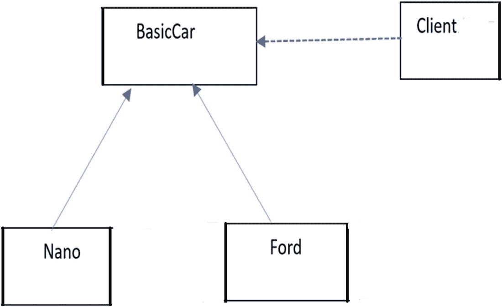

图 15-1
一个示例原型结构

这里，**BasicCar** 是基本原型。**Nano** 和 **Ford** 是具体原型，它们实现了 **BasicCar** 中定义的 **clone()** 方法。在此示例中，我以某个基础价格（印度卢比）创建了这些汽车。随后，我根据车型更新了最终价格。`PrototypePatternExample.java` 是该实现中的客户端。

类图

图 15-2 展示了原型模式示例的类图。

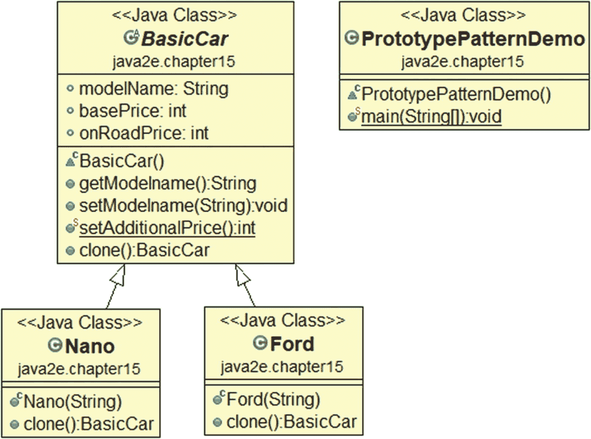

图 15-2
类图

包资源管理器视图

图 15-3 展示了程序的高层结构。

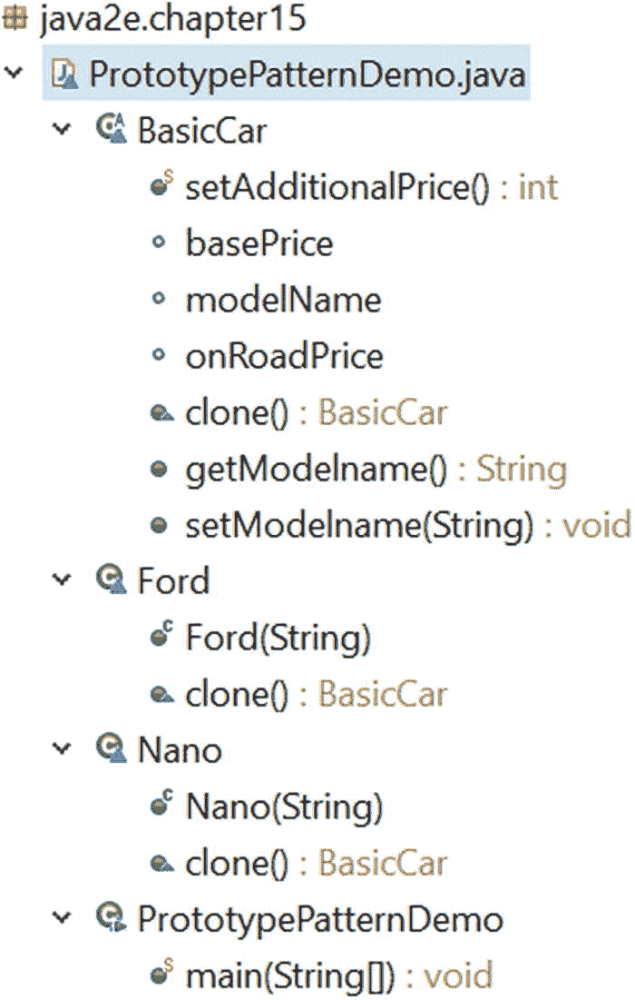

图 15-3
包资源管理器视图

实现

```
package java2e.chapter15;
import java.util.Random;
//BasicCar 类
abstract class BasicCar implements Cloneable {
public String modelName;
public int basePrice, onRoadPrice;
public String getModelname() {
return modelName;
}
public void setModelname(String modelname) {
this.modelName = modelname;
}
public static int setAdditionalPrice() {
int price = 0;
Random r = new Random();
/* 我们将得到一个范围在 0（含）到 100000（不含）之间的整数值 */
int p = r.nextInt(100000);
price = p;
return price;
}
public BasicCar clone() throws CloneNotSupportedException {
return (BasicCar) super.clone();
}
}
//Nano 类
class Nano extends BasicCar {
public Nano(String m) {
modelName = m;
// Nano 的基础价格
basePrice = 200000;
}
@Override
public BasicCar clone() throws CloneNotSupportedException {
return (Nano) super.clone();
}
}
//Ford 类
class Ford extends BasicCar {
public Ford(String m) {
modelName = m;
// Ford 的基础价格
basePrice = 500000;
}
@Override
public BasicCar clone() throws CloneNotSupportedException {
return (Ford) super.clone();
}
}
class PrototypePatternDemo {
public static void main(String[] args) throws CloneNotSupportedException {
System.out.println("***原型模式演示***\n");
BasicCar nano = new Nano("Nano XT");
BasicCar ford = new Ford("Ford Figo");
BasicCar nanoClone,fordClone;
// 复制一个 Nano 对象
nanoClone= nano.clone();
System.out.println("Nano 的基础价格是：Rs."+nanoClone.basePrice);
// 对复制的对象进行修改。
// 价格将高于 200000
nanoClone.onRoadPrice = nanoClone.basePrice + BasicCar.setAdditionalPrice();
System.out.println("在印度，一辆" + nanoClone.modelName + "的最终价格是 Rs." + nanoClone.onRoadPrice);
// 复制一个 Ford 对象
fordClone = ford.clone();
System.out.println("Ford 的基础价格是：Rs."+fordClone.basePrice);
// 对复制的对象进行修改。
// 价格将高于 500000
fordClone.onRoadPrice = fordClone.basePrice + BasicCar.setAdditionalPrice();
System.out.println("在印度，一辆" + fordClone.modelName + "的最终价格是 Rs." + fordClone.onRoadPrice);
}
}
```

输出：

```
***原型模式演示***
Nano 的基础价格是：Rs.200000
在印度，一辆 Nano XT 的最终价格是 Rs.294803
Ford 的基础价格是：Rs.500000
在印度，一辆 Ford Figo 的最终价格是 Rs.595733
```

注释
你可能会在你的系统中看到不同的价格，因为我在 `BasicCar` 类中的 `setAdditionalPrice()` 方法中生成了一个随机价格。但我确保了 Nano XT 的最终价格高于 200,000 卢比，Ford Figo 的最终价格高于 500,000 卢比，并且 Ford Figo 的价格将高于 Nano XT。

问答环节
**15.7. 使用原型设计模式有哪些优点？**

以下是主要优点：

*   从头开始创建新实例是一项成本高昂的操作。原型模式帮助你从现有实例创建新实例。因此，成本更低。
*   如果从头开始，你可能需要面对一些复杂或繁琐的过程。相反，通过使用原型模式，你可以只关注即将到来的新功能。
*   你可以在运行时添加或移除产品。

**15.8. 使用原型设计模式会面临哪些挑战？**

以下是使用此模式时可能面临的主要挑战：

*   你需要关注克隆或复制机制。
*   有时，从现有实例创建副本并不简单。例如，如果所考虑的对象根本不支持复制/克隆，或者存在循环引用，那么实现克隆机制可能具有挑战性。例如，在 Java 中，拥有 `clone()` 方法的类需要实现 `Cloneable` 标记接口；否则，它将抛出 `CloneNotSupportedException`。


*   在我们的示例中，我使用了 `clone()` 方法，该方法在 Java 中执行**浅拷贝**。按照惯例，你通过调用 `super.clone()` 来获取返回的对象。如果你需要获取深拷贝，这可能会比较昂贵。

**15.9\. 你能举例说明不同类型的拷贝技术吗？**

你知道 `Object` 类（位于 `java.lang` 包中）是所有类的超类。这个 `Object` 类有一个名为 `clone()` 的方法，它支持克隆操作。如果你在 Eclipse 编辑器中将鼠标悬停在 `Clone()` 方法上，你将看到以下语法：

```
protected native Object clone() throws CloneNotSupportedException;
```

该方法的描述还说明，此方法“创建并返回此对象的一个副本。‘*副本*’的确切含义可能取决于对象的类。”

当你使用克隆时，你会了解到两种不同的克隆技术，即浅拷贝和深拷贝。以下是这两者之间的关键区别：

*   **浅拷贝**速度更快，成本更低。如果你的目标对象只包含基本类型字段，它总是更好的选择。

*   **深拷贝**成本高且速度慢。但如果你的目标对象包含许多引用其他对象的字段，它则很有用。

那么，让我们理解它们背后的理论。浅拷贝创建一个新对象，然后将各种字段值从原始对象复制到新对象。因此，它也被称为逐字段拷贝。如果原始对象包含任何对其他对象的引用作为字段，那么这些对象的引用会被复制到新对象中（即，你不会创建这些对象的副本）。

让我们尝试用一个简单的图表来理解这个机制。假设你有一个对象 X1，它有一个对另一个对象 Y1 的引用。进一步假设对象 Y1 有一个对对象 Z1 的引用。图 15-4 展示了这一点。

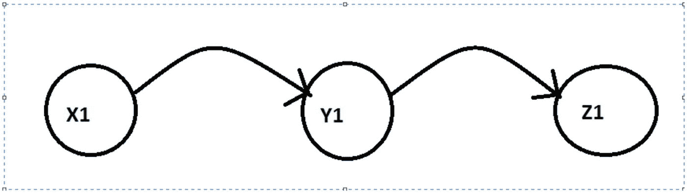

图 15-4
之前：引用的浅拷贝

现在，通过 X1 的浅拷贝，将创建一个新对象，比如 X2，它也将有一个对 Y1 的引用。图 15-5 展示了这一点。

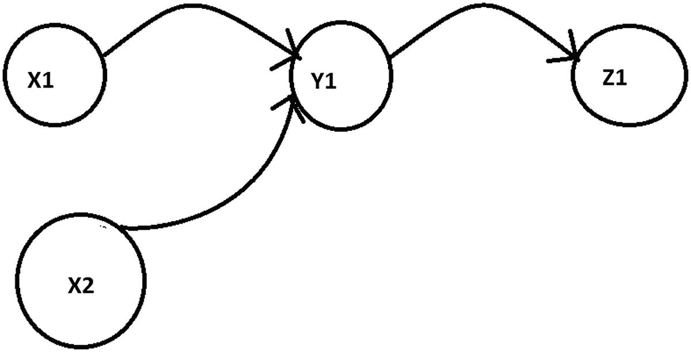

图 15-5
之后：引用的浅拷贝

但对于 X1 的深拷贝，将创建一个新对象，比如 X3。X3 将有一个对新对象 Y3 的引用，而 Y3 实际上是 Y1 的一个副本。此外，Y3 又会有一个对另一个新对象 Z3 的引用，Z3 是 Z1 的一个副本。图 15-6 展示了这一点。

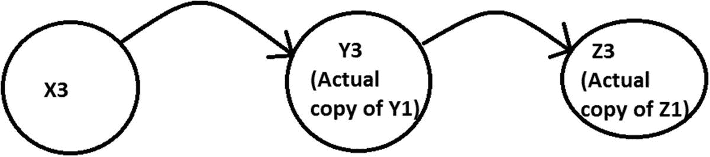

图 15-6
之后：引用的深拷贝

在深拷贝的情况下，新对象与原始对象完全分离，对一个对象所做的任何更改都不应反映在另一个对象中。在 Java 中，要创建深拷贝，你可能需要重写 `clone()` 方法，然后继续。此外，深拷贝成本很高，因为你可能需要创建额外的对象。

**Java 中的浅拷贝与深拷贝**
你可以使用 Java 中的 `clone()` 方法制作一个克隆（或副本），但你需要实现 `Cloneable` 接口，因为只有实现了此 `Cloneable` 接口的 Java 对象才符合克隆条件。`clone()` 的默认版本会创建一个浅拷贝。要创建深拷贝，你需要重写 `clone()` 方法。

以下是以下程序的关键特性：

*   在以下示例中，你有两个类：`Employee` 和 `EmpAddress`。

*   `Employee` 类有三个字段：`id`、`name` 和 `EmpAddress`。因此，你可能会注意到，要形成一个 `Employee` 对象，你需要传递一个 `EmpAddress` 对象。所以，你会看到如下代码行：`Employee emp=new Employee(1,"John",initialAddress);`

*   `EmpAddress` 只有一个名为 `address` 的字段，其数据类型为 `String`。

*   在客户端代码中（在 `main()` 方法内部），你使用 Java 内置的 `clone()` 方法创建了一个克隆对象 `empClone`。所以，你会看到如下代码行：`Employee empClone=(Employee)emp.clone();`

*   然后你更改了 `emp` 对象的字段值。

*   但现在你看到了这个更改的副作用，因为你注意到 `empClone` 对象的地址也发生了变化，这是不希望的。

```
class EmpAddress implements Cloneable {
String address;
public EmpAddress(String address) {
this.address = address;
}
public String getAddress() {
return address;
}
public void setAddress(String address) {
this.address = address;
}
@Override
public String toString() {
return this.address;
}
@Override
public Object clone() throws CloneNotSupportedException {
// 浅拷贝
return super.clone();
}
}
class Employee implements Cloneable {
int id;
String name;
EmpAddress empAddress;
public Employee(int id, String name, EmpAddress empAddress) {
this.id = id;
this.name = name;
this.empAddress = empAddress;
}
public int getId() {
return id;
}
public void setId(int id) {
this.id = id;
}
public String getName() {
return name;
}
public void setName(String name) {
this.name = name;
}
public EmpAddress getAddress() {
return this.empAddress;
}
public void setAddress(EmpAddress newAddress) {
this.empAddress = newAddress;
}
@Override
public String toString() {
return "EmpId=" + this.id + " EmpName=" + this.name + " EmpAddressName=" + this.empAddress;
}
@Override
public Object clone() throws CloneNotSupportedException {
// 浅拷贝
return super.clone();
}
}
class CloningTechniques{
public static void main(String[] args) throws CloneNotSupportedException {
System.out.println("***浅拷贝与深拷贝演示。***\n");
EmpAddress initialAddress = new EmpAddress("21, abc Road, USA");
Employee emp = new Employee(1, "John", initialAddress);
System.out.println("emp 对象的详细信息如下：");
System.out.println(emp);
Employee empClone = (Employee) emp.clone();
System.out.println("empClone 对象的详细信息如下：");
System.out.println(empClone);
System.out.println("\n 现在更改 emp 对象的名称、ID 和地址 ");
emp.setId(10);
emp.setName("Sam");
emp.empAddress.setAddress("221, xyz Road, Canada");
System.out.println("现在 emp 对象的详细信息如下：");
System.out.println(emp);
System.out.println("而 empClone 对象的详细信息如下：");
System.out.println(empClone);
}
}
```

以下是输出结果：

```
***浅拷贝与深拷贝演示。***
emp 对象的详细信息如下：
EmpId=1 EmpName=John EmpAddressName=21, abc Road, USA
empClone 对象的详细信息如下：
EmpId=1 EmpName=John EmpAddressName=21, abc Road, USA
现在更改 emp 对象的名称、ID 和地址
现在 emp 对象的详细信息如下：
EmpId=10 EmpName=Sam EmpAddressName=221, xyz Road, Canada
而 empClone 对象的详细信息如下：
EmpId=1 EmpName=John EmpAddressName=221, xyz Road, Canada
```

分析：

注意输出的最后一行。你可以看到一个不希望的副作用，因为你注意到克隆对象的地址因对 `emp` 对象的修改而被修改了。这是因为原始对象和克隆对象都指向同一个地址，它们并非完全独立。图 15-7 可以更好地描述这种情况。

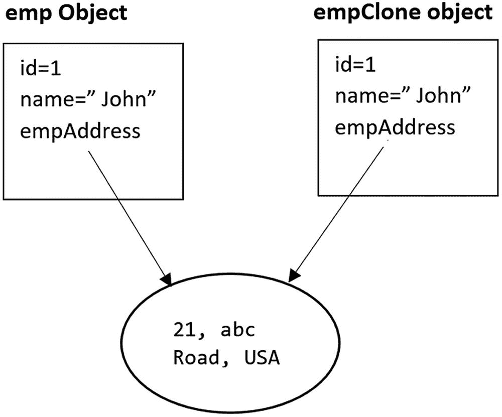

图 15-7
先前示例中的浅拷贝场景


要实现深拷贝，让我们按如下方式修改`Employee`类的`clone()`方法：

```
@Override
public Object clone() throws CloneNotSupportedException {
// 浅拷贝
// return super.clone();
// 深拷贝
Employee employee = (Employee) super.clone();
employee.empAddress = (EmpAddress) empAddress.clone();
return employee;
}
```

以下是修改后的输出：

```
***浅拷贝与深拷贝演示。***
员工详情如下：
EmpId=1 EmpName=John EmpAddressName=21, abc Road, USA
克隆员工详情如下：
EmpId=1 EmpName=John EmpAddressName=21, abc Road, USA
现在修改 emp 对象的姓名、ID 和地址
现在员工详情如下：
EmpId=10 EmpName=Sam EmpAddressName=221, xyz Road, Canada
而克隆员工详情如下：
EmpId=1 EmpName=John EmpAddressName=21, abc Road, USA
```

分析：

请注意本例中输出的最后一行。这里，你不会看到不期望的副作用。这是因为原始对象和克隆对象是完全不同且相互独立的。图 15-8 可以更好地描述这一场景。

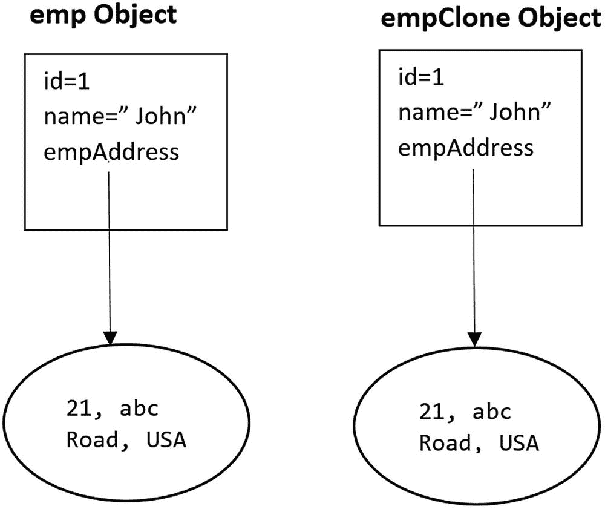

图 15-8 修改后演示中的深拷贝场景

**15.10 何时应选择浅拷贝而非深拷贝（反之亦然）？**
浅拷贝速度更快且开销更小。如果你的目标对象只包含基本类型字段，浅拷贝总是更好的选择。
深拷贝开销大且速度慢。但如果你的目标对象包含许多引用其他对象的字段，深拷贝则很有用。
**15.11 在 Java 中，如果需要拷贝一个对象，我必须使用`clone()`方法。这个理解正确吗？**
不，有很多替代方案。例如，你可以使用自己的拷贝构造函数。除此之外，你还可以使用序列化的概念。

**15.12 Java 是否支持默认的拷贝构造函数？**
不支持，但你可以定义自己的拷贝构造函数。第 3 章演示了这样一个示例。

桥接模式

GoF 定义
将抽象部分与它的实现部分解耦，使两者都可以独立地变化。

概念
这种模式也被称为**句柄/主体模式**。在这种模式中，你会看到两个不同的继承层次结构——一个用于抽象层，一个用于实现层。你使用一座桥来连接这两个层次结构。但桥的角色很重要。它以一种方式连接它们，使得这两个层次结构可以互不影响地变化。从编码角度来看，你可以为抽象和/或实现使用抽象类或接口，但当你实现这个概念时，抽象将包含一个对实现者的引用，并且你使用组合来桥接这两个层次结构。

现实生活中的例子
在软件产品开发公司中，开发团队和营销团队各自扮演着至关重要的角色。营销团队可能进行市场调研并收集客户需求，这些需求可能因客户的性质而异。开发团队将这些需求实现到他们的产品中，以满足客户的需求。一个团队（例如，运营策略）的任何变化都不应对另一个团队产生直接影响。此外，将来当客户提出新需求时，该需求不应改变开发人员在其组织中的工作方式。在这种情况下，你可以将营销团队视为产品客户与软件组织开发团队之间的桥梁。

编码示例
GUI 框架可以使用桥接模式将抽象与特定于平台的实现分离。例如，它可以使用此模式将窗口抽象与 Linux 或 macOS 的窗口实现分离开来。

注意
在第 13 章中，你了解了 JDBC。它充当你的应用程序和数据库之间的桥梁。例如，`java.sql.DriverManager`类和`java.sql.Driver`接口可以形成桥接模式，其中前者扮演抽象的角色，后者扮演实现者的角色。具体的实现者可以是`com.mysql.cj.jdbc.Driver`或`oracle.jdbc.driver.OracleDriver`。（需要注意的是，类`com.mysql.jdbc.Driver`已弃用。你需要使用新类`com.mysql.cj.jdbc.Driver`。）

图解
假设你是一个遥控器制造商，你需要为不同的电子产品制造遥控器。为简单起见，我们假设你目前接到为电视和 DVD 制造遥控器的订单。我们还假设你的遥控器有两个主要功能——开和关。

假设你想从图 15-9 或图 15-10 所示的设计开始。

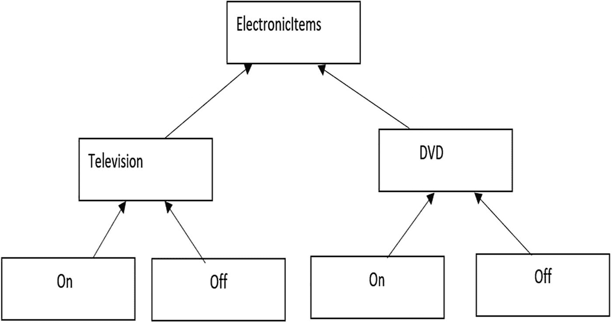

图 15-10 方法 2

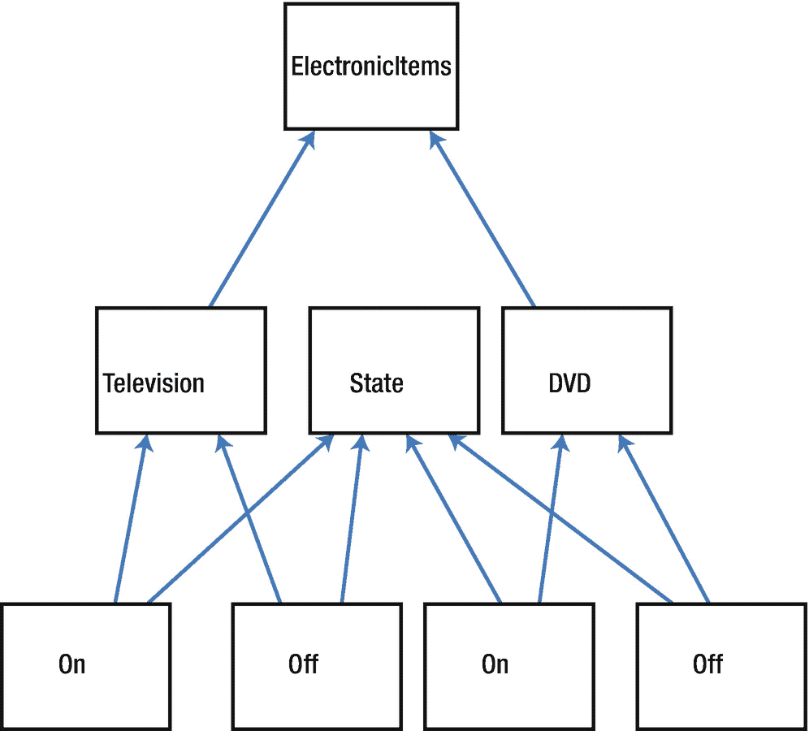

图 15-9 方法 1

经过进一步分析，你发现方法 1 确实很混乱且难以维护。
起初，方法 2 看起来更清晰，但如果你想包含新的状态，如睡眠、静音等，或者如果你想包含新的电子产品，如空调，你将面临新的挑战，因为在这种设计方法中元素是紧密耦合的。但在现实场景中，这种增强通常是必需的。
所以，现在你明白你需要从一个松散耦合的系统开始，以便于未来的增强，这样这两个层次结构（电子产品及其状态）都可以独立发展。桥接模式正好适用于这种场景。

让我们从桥接模式最常见的类图开始（见图 15-11）。

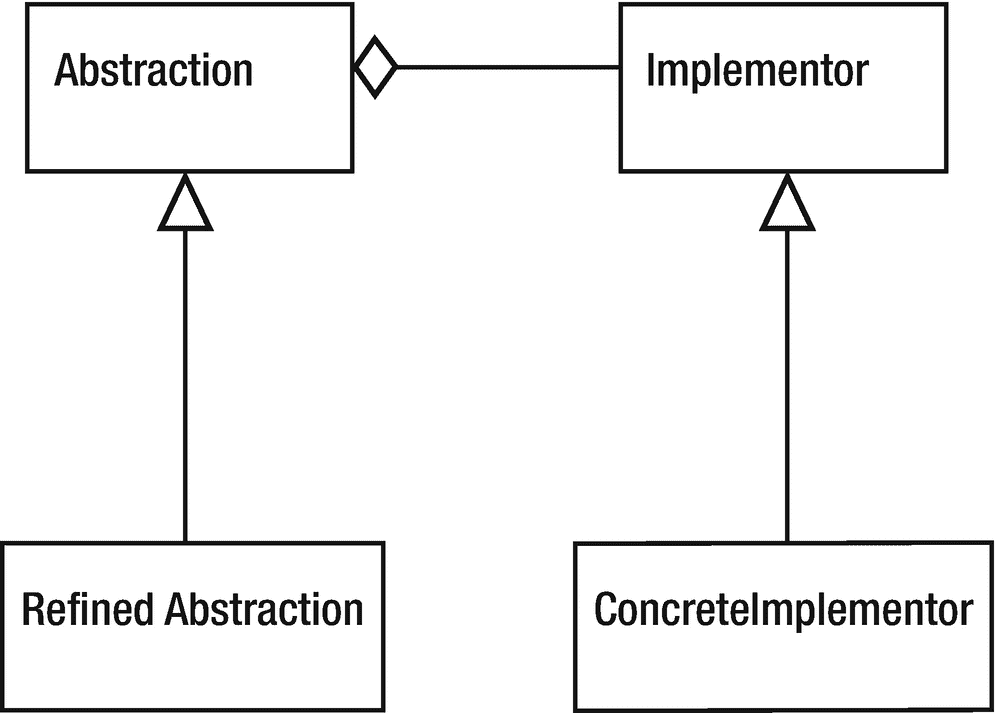

图 15-11 一个经典的桥接模式示例

术语描述如下：

*   **抽象**
    ：它定义了抽象接口并维护对`Implementor`的引用。在我们的示例中，它是一个抽象类。

*   **细化抽象**
    ：它扩展了由抽象定义的接口。在我们的示例中，它是一个具体类。

*   **实现者**
    ：它为实现类定义了接口。在我们的示例中，它是一个接口。

*   **具体实现者**
    ：在我们的示例中，它是一个具体类。它实现了`Implementor`接口。

我在以下实现中遵循了类似的架构。为了方便你参考，我在以下实现中用注释指出了所有参与者。

类图

图 15-12 显示了类图。

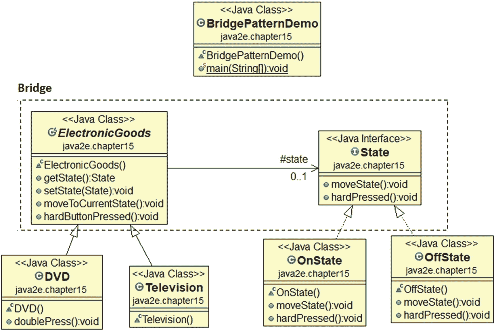

图 15-12 类图

包资源管理器视图

图 15-13 显示了程序的高级结构。

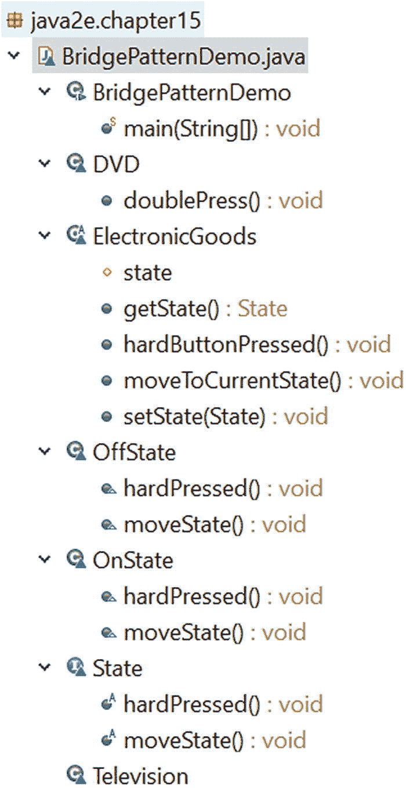

图 15-13 包资源管理器视图

实现

以下是以下实现的关键特征：

*   抽象类`ElectronicGoods`扮演抽象的角色，接口`State`扮演实现者的角色。


*   具体实现者是`OnState`类和`OffState`类。它们根据各自的需求实现了接口方法`moveState()`和`hardPressed()`。

*   抽象类`ElectronicGoods`持有一个对实现者`State`的引用。

*   抽象方法将实现委托给实现者对象。例如，请注意`hardButtonPressed()`实际上是`state.hardPressed()`的简写形式，其中`state`是实现者对象。

*   有两个精炼的抽象类：`Television`和`DVD`。该类对其从父类继承的方法感到满意。但`DVD`类希望提供一个额外的功能。因此，它实现了一个 DVD 特有的方法`doublePress()`。`doublePress()`方法是仅使用超类抽象来编写的。

```
package java2e.chapter15;
//抽象
abstract class ElectronicGoods
{
//组合 - 实现者
protected State state;
/*另一种方法：
你也可以在构造函数内部传递一个实现者（作为输入参数）。
*/
/*public ElectronicGoods(State state)
{
this.state = state;
}*/
public State getState()
{
return state;
}
public void setState(State state)
{
this.state = state;
}
/*实现特定：
我们将实现委托给实现者对象。
*/
public void moveToCurrentState()
{
System.out.print("The electronic item is functioning at : ");
state.moveState();
}
public void hardButtonPressed()
{
state.hardPressed();
}
}
//精炼抽象
//Television 不想修改任何超类方法。
class Television extends ElectronicGoods
{
/*public Television(State state)
{
super(state);
}*/
}
/*DVD 类也接受超类方法。
除此之外，它还使用了一个额外的方法*/
class DVD extends ElectronicGoods
{
/*public DVD(State state)
{
super(state);
}*/
/* 请注意，以下 DVD 特有的方法是使用超类方法编写的，而不是使用实现者（State）方法。因此，这种方法允许独立地变化抽象和实现。
*/
public void doublePress() {
hardButtonPressed();
hardButtonPressed();
}
}
//实现者
interface State
{
void moveState();
void hardPressed();
}
//一个具体实现者。
class OnState implements State
{
@Override
public void moveState()
{
System.out.print("On State\n");
}
@Override
public void hardPressed()
{
System.out.print("\tThe device is already On.Do not press the button so hard.\n");
}
}
//另一个具体实现者。
class OffState implements State
{
@Override
public void moveState()
{
System.out.print("Off State\n");
}
@Override
public void hardPressed()
{
System.out.print("\tThe device is Offline now.Do not press the off button again.\n");
}
}
class BridgePatternDemo {
public static void main(String[] args) {
System.out.println("***Bridge Pattern Demo***\n");
System.out.println("Dealing with a Television at present.");
State presentState = new OnState();
//ElectronicGoods eItem = new Television(presentState);
ElectronicGoods eItem = new Television();
eItem.setState(presentState);
eItem.moveToCurrentState();
//hard press
eItem.hardButtonPressed();
//Verifying Off state of the Television now
presentState = new OffState();
//eItem = new Television(presentState);
eItem.setState(presentState);
eItem.moveToCurrentState();
System.out.println("");
System.out.println("Dealing with a DVD now.");
presentState = new OnState();
//eItem = new DVD(presentState);
eItem = new DVD();
eItem.setState(presentState);
eItem.moveToCurrentState();
presentState = new OffState();
//eItem = new DVD(presentState);
eItem = new DVD();
eItem.setState(presentState);
eItem.moveToCurrentState();
//hard press-A DVD specific method
//(new DVD(presentState)).doublePress();
((DVD)eItem).doublePress();
/*如果你取消注释下面这行代码，将会导致错误，因为电视对象没有这个方法。*/
//(new Television(presentState)).doublePress();
}
}
```

输出：

```
***Bridge Pattern Demo***
Dealing with a Television at present.
The electronic item is functioning at : On State
The device is already On. Do not press the button so hard.
The electronic item is functioning at : Off State
Dealing with a DVD now.
The electronic item is functioning at : On State
The electronic item is functioning at : Off State
The device is Offline now. Do not press the off button again.
The device is Offline now. Do not press the off button again.
```

问答环节
**15.13 在这个例子中，我看到很多死代码。你为什么保留它们？**
许多工程师更喜欢构造函数而不是 getter/setter 方法。你可以在不同的实现中看到这些变体。我保留它们是为了方便你参考，你可以自由使用其中任何一种。
**15.14 你可以使用简单的子类化，而不是使用这种设计。这个理解正确吗？**
不正确。使用简单的子类化，你的实现无法动态变化。虽然看起来实现可能通过子类化技术表现出不同的行为，但实际上，这种变化在编译时就已经绑定到抽象上了。

**15.15 我最近学习了状态模式，我看到了很多相似之处。这个理解正确吗？**

不正确。本书没有描述状态模式。它们在我另一本书《Java 设计模式》第二版（Apress，2019）中有详细描述。如果你愿意，可以参考那本书。但如果你熟悉它，你会发现状态模式属于行为模式类别，其意图是不同的。在本章中，我展示了一个例子，其中电子产品可以处于不同的状态，但关键意图是展示以下几点：

*   如何避免物品与其状态之间的紧密耦合？

*   如何维护两个不同的层次结构，使它们可以互不影响地扩展？

*   如何处理多个对象之间共享实现的情况？

带着这些想法，请仔细阅读附在此实现上的注释，以便更好地理解。我还想提请你注意 DVD 特有的方法`doublePress()`。请注意，它是用超类方法构建的，而这些方法又将实现委托给`实现者`对象（在本例中是一个状态对象）。这种方法允许你独立地变化抽象和实现，这是桥接模式的关键目标。
**15.16 使用桥接设计模式的主要优点是什么？**

以下是使用此模式的主要优点：

*   实现不绑定到抽象。

*   抽象和实现都可以独立发展。

*   具体类独立于接口实现者类——即，一个层次结构中的变化不会影响另一个层次结构。因此，你还可以以不同的方式变化接口和具体实现。

**15.17 与此模式相关的挑战是什么？**

以下是使用此模式时的主要挑战：

*   整体结构可能会变得复杂。

*   有时会与适配器模式混淆。（你可以记住，适配器模式的关键目的是仅处理不兼容的接口。）

**15.18 假设我只有一个状态——要么是`OnState`，要么是`OffState`。在这种情况下，我需要使用接口`State`吗？**


不，这对你来说并非强制要求。GoF 将不使用 `State` 接口的情况归类为桥接模式的一种退化情形。
**15.19 在这个例子中，使用抽象类来表示抽象，使用接口来表示实现。这是强制性的吗？**
不是。你也可以在抽象层使用接口。基本上，你可以为任何抽象或实现使用抽象类或接口。我采用这种格式只是为了提高可读性。

观察者模式

GoF 定义
定义对象之间一对多的依赖关系，这样当一个对象改变状态时，其所有依赖者都会收到通知并自动更新。

概念
在这种模式中，有许多观察者（对象）正在观察一个特定的主题（也是一个对象）。观察者向主题注册自己，以便从主题获取变更通知。如果某个观察者对主题失去兴趣，它可以取消注册。这种模型有时也被称为发布-订阅模型。整个思想可以总结如下：
*使用这种模式，一个对象（主题）可以同时向多个观察者（一组对象）发送通知。*

你可以通过以下图表来可视化这些场景。假设有三种不同类型的观察者（比如 observer1、observer2 和 observer3）对一个主题表示感兴趣。

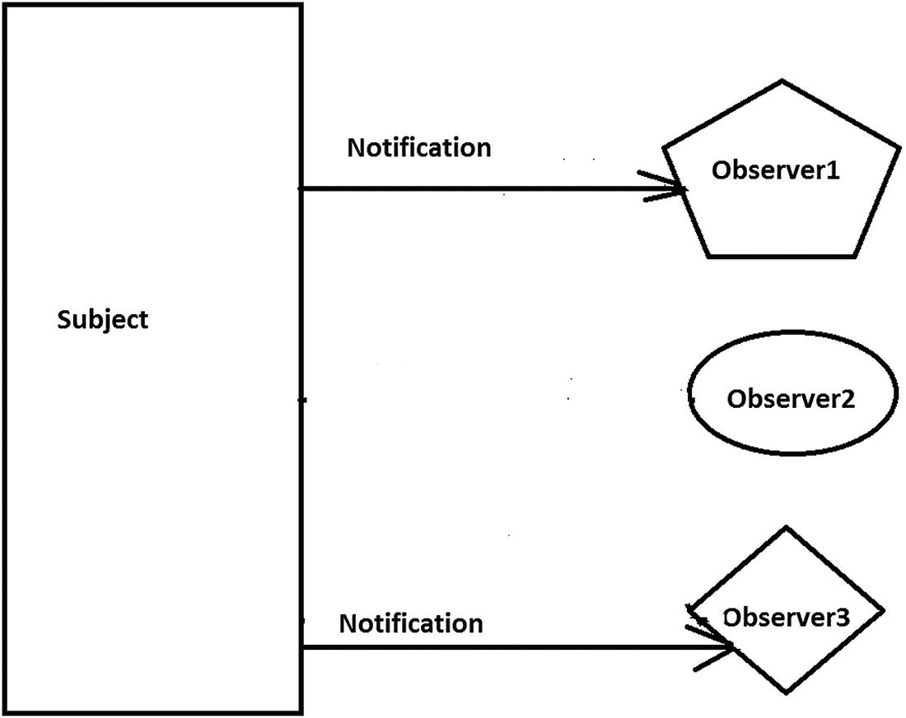

图 15-18
步骤 5

1.  观察者向主题请求获取通知（见图 15-14）。

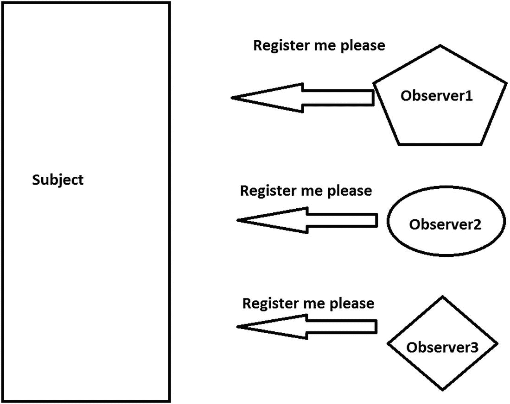

图 15-14

步骤 1

2.  主题批准所有请求（即建立连接；见图 15-15）。

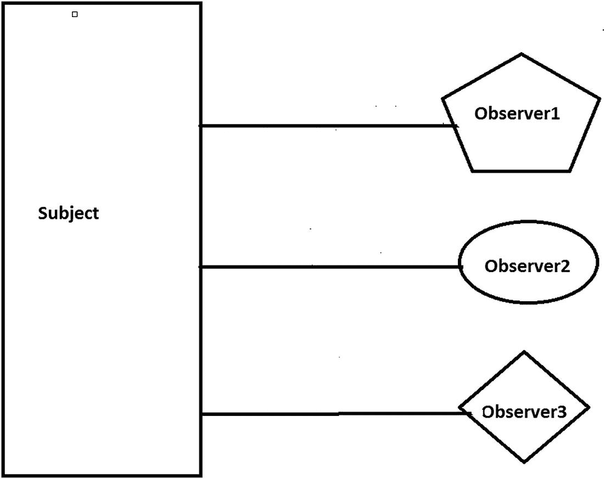

图 15-15

步骤 2

3.  主题向已注册的观察者发送通知（例如，主题中发生了一个典型事件，它想要通知其观察者；见图 15-16）。

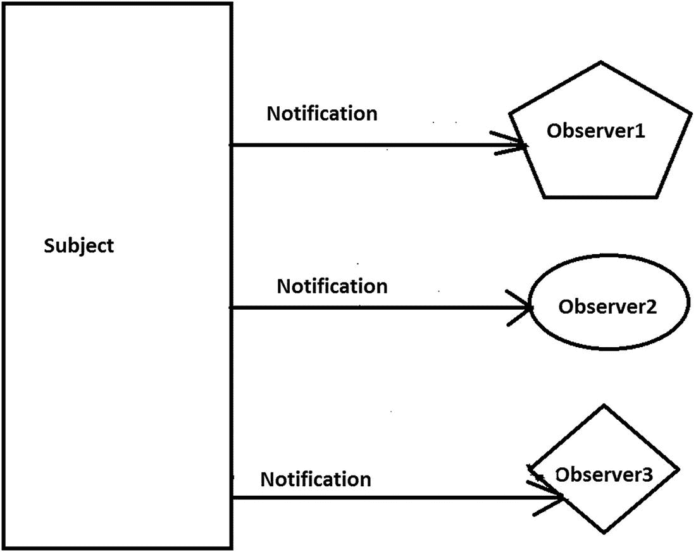

图 15-16

步骤 3

4.  **（可选）**：Observer2 不想再接收通知。因此，它取消了自己的注册。见图 15-17。

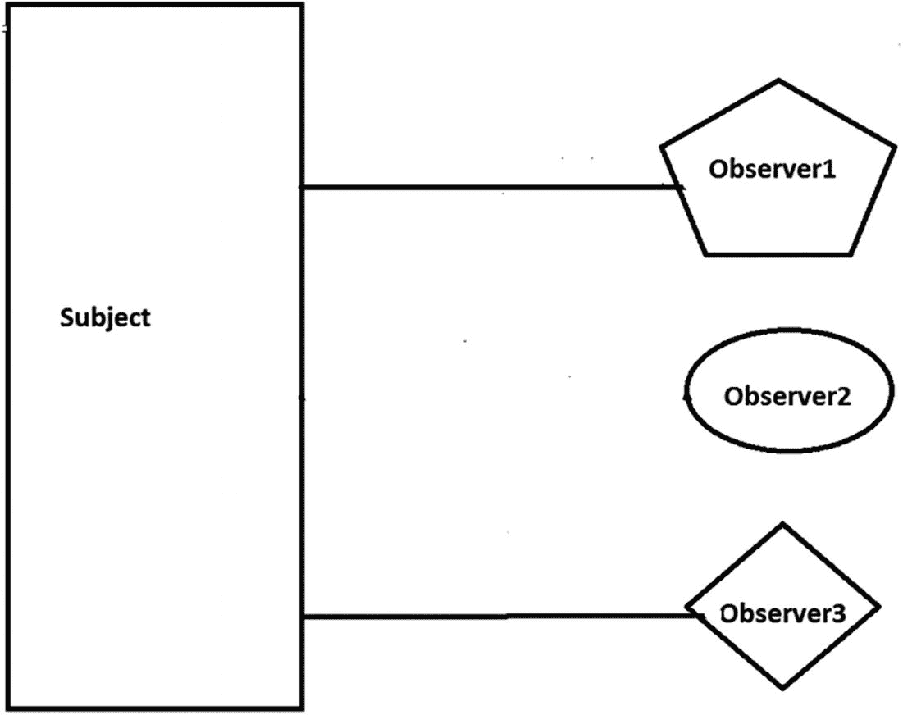

图 15-17

步骤 4

5.  从此刻起，只有 Observer1 和 Observer3 会收到来自主题的通知。见图 15-18。

现实生活示例
我们可以想象一位拥有众多粉丝的名人。这些粉丝中的每一位都想获得这位名人的所有最新动态。当他们失去兴趣时，他们就不再关注那位名人。在这里，你可以将每个粉丝视为一个观察者，而名人则是一个主题。

编码示例
考虑一个简单的基于 UI 的示例，其中 UI 连接到一个数据库。用户可以通过该 UI 执行搜索查询，在搜索数据库后，结果会反映在 UI 中。在这里，你将 UI 与数据库分离，这样如果数据库发生更改，UI 会收到通知，并可以根据更改更新其显示。
你甚至可以简化上述场景。你可以简单地假设自己是负责维护组织中某个特定数据库的人。因此，每当数据库内部发生更改时，你很可能希望收到通知，以便在需要时及早采取行动。

注意
你可以在事件驱动的软件中使用此模式。像 Java 和 C# 这样的现代计算机语言为处理事件提供了内置支持，让你的工作更轻松。Java 事件监听器就是观察者。这些观察者可以实现 `Observer` 接口，该接口有一个 `update()` 方法：
`void update(Observable o,Object arg)`。每当被观察对象发生更改时，就会调用此方法。你可以调用 `Observable` 对象的 `notifyObservers()` 方法来通知观察者这些更改。`addObserver(Observer o)` 方法可以添加一个观察者，而 `deleteObserver(Observer o)` 方法可以删除一个观察者。你可以使用 `deleteObservers()` 方法删除所有观察者。这些类似于前面讨论的 `register` 和 `unregister` 方法。

图示
现在，让我们直接进入我们的示例。在这里，我创建了三个观察者和一个主题。主题为其所有注册用户维护一个列表。当主题中的标志值发生变化时，我们的观察者希望收到通知。通过输出，你会发现当标志值分别更改为 5、50 和 100 时，这些观察者会收到通知。但是，当标志值更改为 50 时，其中一个观察者没有收到任何通知，因为当时它不是一个注册用户。但后来它注册了自己，以便从主题接收进一步的通知。最后，所有观察者都取消了注册，因此当主题中的标志值更改为 500 时，没有一个观察者收到通知。
在此实现中，方法 `register()`、`unregister()` 和 `notifyRegisteredUsers()` 具有其通常的含义。`register()` 方法用于在主题的通知列表中注册一个观察者；`unregister()` 方法用于从主题的通知列表中移除一个观察者；而 `notifyRegisteredUsers()` 方法用于在主题中发生典型事件时通知所有已注册的用户。

类图

图 15-19 显示了类图。

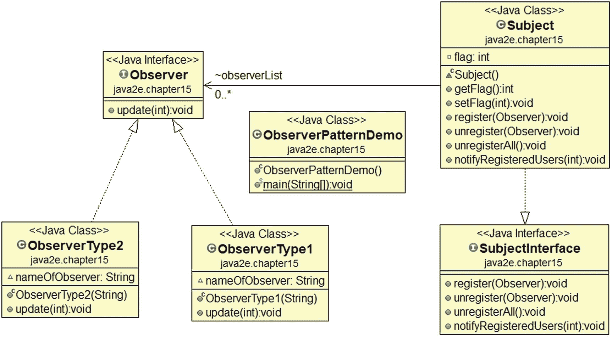

图 15-19
类图

包资源管理器
视图

图 15-20 显示了程序的高级结构。

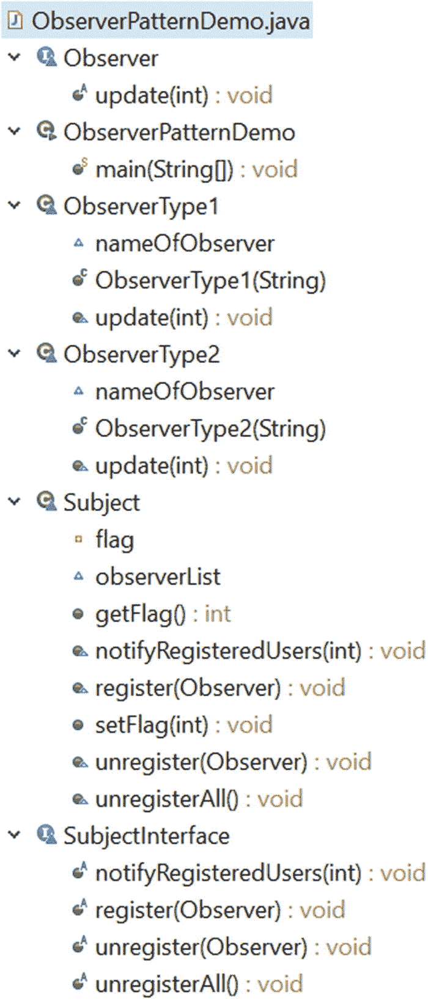

图 15-20
包资源管理器视图

实现


```
package java2e.chapter15;
import java.util.*;
interface Observer
{
void update(int updatedValue);
}
class ObserverType1 implements Observer
{
String nameOfObserver;
public ObserverType1(String name)
{
this.nameOfObserver = name;
}
@Override
public void update(int updatedValue)
{
System.out.println( nameOfObserver+" has received an alert: Updated myValue in Subject is: "+ updatedValue);
}
}
class ObserverType2 implements Observer
{
String nameOfObserver;
public ObserverType2(String name)
{
this.nameOfObserver = name;
}
@Override
public void update(int updatedValue)
{
System.out.println( nameOfObserver+" has received an alert: The current value of myValue in Subject is: "+ updatedValue);
}
}
interface SubjectInterface
{
//Use it to register an observer
void register(Observer anObserver);
//Use it to unregister an observer
void unregister(Observer anObserver);
//Use it to unregister all observers
void unregisterAll();
//Use it to notify all registers users(i.e.observers)
void notifyRegisteredUsers(int notifiedValue);
}
class Subject implements SubjectInterface
{
private int flag;
public int getFlag()
{
return flag;
}
public void setFlag(int flag)
{
this.flag = flag;
//Flag value changed. So notify registered users/observers.
notifyRegisteredUsers(flag);
}
List observerList = new ArrayList();
@Override
public void register(Observer anObserver) {
observerList.add(anObserver);
System.out.println("Currently, observerList.size()="+ observerList.size());
}
@Override
public void unregister(Observer anObserver) {
observerList.remove(anObserver);
System.out.println("Currently, observerList.size()="+ observerList.size());
}
@Override
public void unregisterAll()
{
observerList.clear();
//Or, use this
//observerList.removeAll(observerList);
System.out.println("Currently, observerList.size()="+ observerList.size());
}
@Override
public void notifyRegisteredUsers(int updatedValue)
{
for (Observer observer : observerList)
observer.update(updatedValue);
}
}
public class ObserverPatternDemo {
public static void main(String[] args) {
System.out.println(" ***Observer Pattern Demo***\n");
/*We have 3 observers- 2 of them are ObserverType1, 1 of them is of ObserverType2 */
Observer myObserver1 = new ObserverType1("Roy");
Observer myObserver2 = new ObserverType1("Kevin");
Observer myObserver3 = new ObserverType2("Bose");
Subject subject = new Subject();
//Registering the observers-Roy,Kevin,Bose
System.out.println("+Registering Roy.+");
subject.register(myObserver1);
System.out.println("+Registering Kevin.+");
subject.register(myObserver2);
System.out.println("+Registering Bose.+");
subject.register(myObserver3);
System.out.println(" Setting Flag = 5 ");
subject.setFlag(5);
//Unregistering an observer(Roy))
System.out.println("-Unregistering Roy-");
subject.unregister(myObserver1);
//No notification for Roy this time, as he is NOT a //registered user now.
System.out.println("\n Setting Flag = 50 ");
subject.setFlag(50);
//Roy is registering himself again
System.out.println("+Registering Roy again.+");
subject.register(myObserver1);
System.out.println("\n Setting Flag = 100 ");
subject.setFlag(100);
System.out.println("Now unregistering all observers.");
//Unregister all observers
subject.unregisterAll();
System.out.println("\n Setting Flag = 500 ");
//At this stage, no one will get the notification from the //subject.
subject.setFlag(500);
}
}
```

输出：

```
***Observer Pattern Demo***
+Registering Roy.+
Currently, observerList.size()=1
+Registering Kevin.+
Currently, observerList.size()=2
+Registering Bose.+
Currently, observerList.size()=3
Setting Flag = 5
Roy has received an alert: Updated myValue in Subject is: 5
Kevin has received an alert: Updated myValue in Subject is: 5
Bose has received an alert: The current value of myValue in Subject is: 5
-Unregistering Roy-
Currently, observerList.size()=2
Setting Flag = 50
Kevin has received an alert: Updated myValue in Subject is: 50
Bose has received an alert: The current value of myValue in Subject is: 50
+Registering Roy again.+
Currently, observerList.size()=3
Setting Flag = 100
Kevin has received an alert: Updated myValue in Subject is: 100
Bose has received an alert: The current value of myValue in Subject is: 100
Roy has received an alert: Updated myValue in Subject is: 100
Now unregistering all observers.
Currently, observerList.size()=0 .
Setting Flag = 500
```

请注意，最初所有三个观察者——Roy、Kevin 和 Bose——都注册了自己以从主题获取通知。因此，在初始阶段，他们都收到了通知。但中途，Roy 对继续接收通知不感兴趣，于是取消了自己的注册。因此，从那时起，只有 Kevin 和 Bose 接收通知（注意我将标志值设为 50 的情况）。但 Roy 改变了主意，再次注册以从主题获取通知。因此，当我把标志值设为 100 时，所有人都从主题收到了通知。最后，主题不想再向任何人发送通知，于是清空了观察者（已注册用户）列表。因此，在最后一种情况下，当标志值设为 500 时，没有人从主题收到任何通知。

问答环节
**15.20 如果我只有一个观察者，那么我可能不需要设置接口。这个理解正确吗？**
是的。但如果你想遵循纯粹的面向对象编程准则，“面向接口编程”始终被认为是更好的实践。在这种情况下，它强制任何未来的观察者都必须拥有 `update()` 方法，这减少了出现 bug 的几率，并允许编写和理解清晰的代码。因此，你应该优先使用接口（或抽象类），而不是使用具体类。此外，通常情况下，你会有多个观察者，并且你希望它们按照约定以系统化的方式实现方法。因此，你可以从这种设计中受益。
**15.21 我可以在同一个应用程序中拥有不同类型的观察者吗？**
是的。在这里，你已经看到了来自两个不同类的三个观察者。因此，你不应该假设每个观察者都需要一个不同的类。
考虑一个现实场景。当一家公司发布或更新新软件时，公司的业务合作伙伴和购买该软件的客户都会收到通知。在这种情况下，业务合作伙伴和客户是两种不同类型的观察者。
**15.22 我可以在运行时** **添加或移除观察者** **吗？**
是的。请注意，在我们的程序中，一开始 Roy 是已注册用户，他从主题接收通知。一段时间后，他不再是已注册用户，并且在标志值设为 50 时没有收到通知。但 Roy 重新注册了，并在主题中标志值设为 100 时收到了通知。
**15.23 在我看来，观察者模式和职责链模式之间有相似之处。这个理解正确吗？**


在观察者模式中，所有注册用户会同时收到通知，但在责任链模式中，链中的对象会逐个收到通知，并且这个过程会持续到某个对象完全处理该通知为止。下图（图 15-21 和图 15-22）总结了二者的区别。

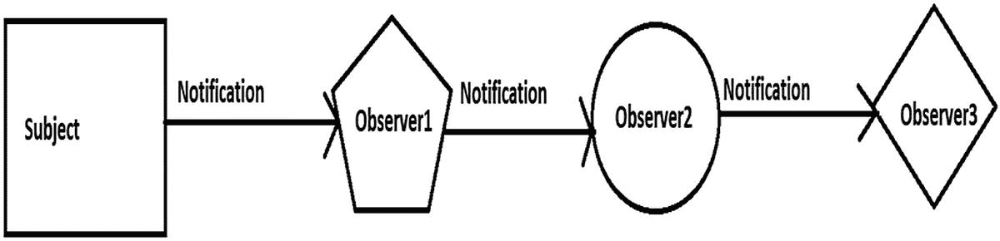

图 15-22
责任链模式的基本工作流程

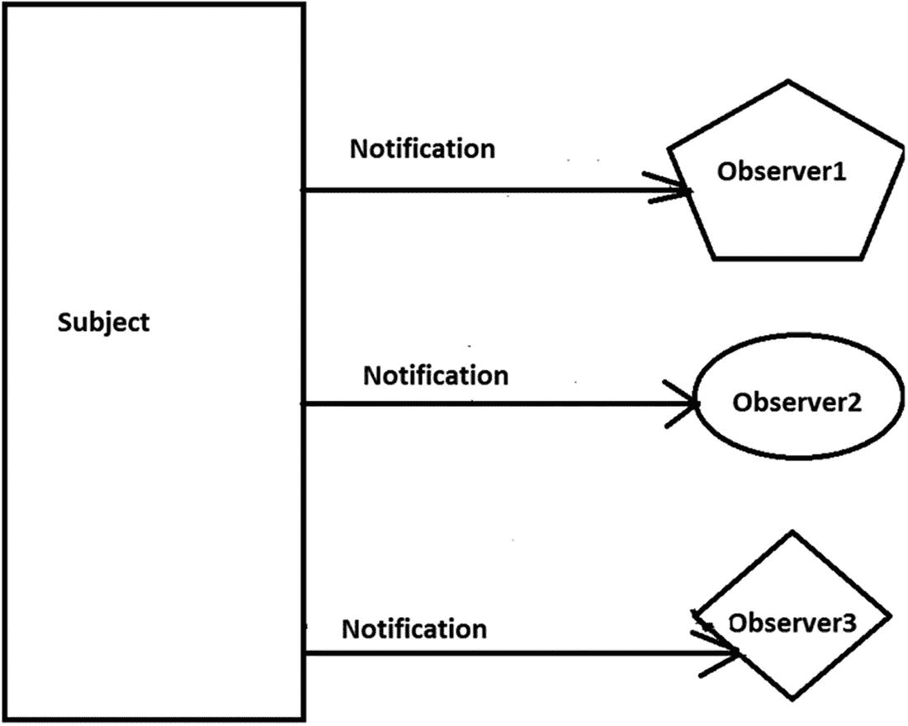

图 15-21
观察者模式的基本工作流程

**15.24 这种模型支持一对多关系。这种理解正确吗？**
是的。由于一个主题可以向多个观察者发送通知，因此可以说这种依赖关系清晰地描绘了一对多关系。

**15.25 我知道 Java 支持这种模式，并且有一些内置结构可供使用。那么为什么还要自己编写代码呢？**
按照你偏好的方式修改现成的结构并不总是那么容易。在许多情况下，你根本无法更改内置功能。但我相信，当你尝试自己实现这些概念时，你可能会获得更深入的理解，从而帮助你更好地使用那些现成的结构。

考虑一些典型场景：

*   在 Java 中，`Observable` 是一个具体类，并且没有实现接口。因此，你无法创建能与 Java 内置的 Observer API 协同工作的自定义实现。

*   你需要记住，Java 不支持多重继承。因此，当你必须扩展 `Observable` 类时，必须牢记这一限制。这可能会限制其复用潜力。

*   `Observable` 中 `setChanged()` 方法的签名如下：

```
protected void setChanged().
```

这意味着如果你想使用它，就需要继承 `Observable` 类。这违反了优先使用组合而非继承这一关键设计原则。

**15.26 观察者模式的主要优点是什么？**

以下是其主要优点：

*   主题及其注册用户（观察者）构成了一个松散耦合的系统。它们无需显式地相互了解。

*   当从通知列表中添加或移除观察者时，无需修改主题。

*   你可以随时独立地添加或移除观察者。

**15.27 观察者模式面临的主要挑战是什么？**

以下是其主要挑战：

*   毫无疑问，内存泄漏是处理任何基于事件的机制时最令人担忧的问题。在这种情况下，自动垃圾回收器并不总能提供帮助。你可以考虑一种情况，即你忘记取消注册某些事件。

*   通知的顺序并不总是可靠的。

*   Java 对观察者模式的内置支持存在一些关键限制，我们之前讨论过（我建议你重新阅读问题 15.25 的答案），其中一项限制会迫使你优先使用继承而非组合。这显然违反了始终优先使用组合的关键设计原则。

总结

本章讨论了以下主题：

*   四人帮（GoF）设计模式简介

*   GoF 模式的分类及其用途

*   原型设计模式的完整实现

*   桥接模式的完整实现

*   观察者模式的完整实现

16. 常见问题

现在是检验你理解程度的时候了。这里，我列出了一些重要且常见的问题，它们只是本书问答环节和不同理论讨论中所有问题的一小部分。这些问题可以帮助你快速复习。如有任何疑问，请返回相应章节寻找答案。

1.  什么是类？

2.  什么是对象？

3.  如何区分对象和引用？

4.  你能在 Java 中实现多重继承吗？

5.  你能在 Java 中实现混合继承吗？

6.  如何区分抽象类和接口？

7.  如何区分方法重载和方法重写？

8.  如何在 Java 中实现动态多态？

9.  什么是 JVM？

10. 如何区分 JRE 和 JDK？

11. 什么是内部类？

12. 如何在 Java 中创建静态类？

13. 如何在 Java 中实现抽象和封装？

14. 如何在 Java 中区分静态绑定和动态绑定？

15. Java 中 `super` 的用途是什么？

16. Java 中 `this` 的用途是什么？

17. Java 中 `default` 的用途是什么？

18. 你能使用没有抽象方法的抽象类吗？

19. 你能继承构造函数吗？

20. Java 中 `final` 的用途是什么？

21. 如何区分实例方法和类方法（静态方法）？

22. 你能创建静态块吗？它的用途是什么？

23. 什么是包？为什么它很重要？

24. Java 中的默认包是什么？

25. 为什么要使用 import 语句？

26. 哪个语句应该先出现——`package` 语句还是 `import` 语句？

27. 一个程序中可以有多个 `package` 语句吗？

28. “`Package` 语句应该始终放在最前面”——这个说法正确吗？

29. 什么是默认修饰符？

30. Java 支持指针吗？

31. 什么是异常？

32. `Exception` 的父类是什么？

33. 你所说的受检异常是什么意思？

34. 你所说的非受检异常是什么意思？

35. 如何创建你自己的异常？

36. 错误条件的一些例子是什么？

37. `throw` 和 `throws` 之间有什么区别？

38. 如果在 `finally` 块中遇到异常会发生什么？

39. 处理异常的缺点是什么？

40. 处理异常的优势是什么？

41. 你所说的链式异常是什么意思？

42. 与链式异常相关的关键方法有哪些？

43. 什么是垃圾回收？它在 Java 中是如何工作的？

44. 如何使对象不可达？

45. 你能用一个简单的程序解释垃圾回收吗？

46. 什么是终结化？为什么它很重要？

47. 如何在 Java 中消除内存泄漏？

48. 构造函数的目的是什么？

49. 构造函数有哪些不同类型？

50. 如何在你的应用程序中使用 getter-setter？

51. 什么是初始化块？

52. 初始化块有哪些不同类型？它们是如何工作的？

53. 什么是嵌套类？

54. 什么是内部类？内部类有什么用处？

55. 什么是浅拷贝？它与深拷贝有何不同？

56. 什么是包装类？为什么包装类在 Java 中很重要？

57. 如何在 Java 中区分用户定义的无参构造函数和默认构造函数？

58. 在接口中使用默认方法会导致 Java 中的菱形问题吗？

59. Java 不支持通过类实现多重继承，但 C++ 支持。你认为这是 Java 的优势还是劣势？

60. 多个变量可以引用内存中的同一个对象吗？

61. 如果你使用下面这行代码，预期的输出是什么？

1.  什么是构造函数链？

2.  如何在方法内传递可变数量的参数？

3.  Java 中的 `char` 和 C/C++ 中的 `char` 有什么区别？

4.  你所说的自动类型转换是什么意思？


5.  你是否将 Java 视为一门纯面向对象的语言？如果不是，原因是什么？

6.  构造方法可以是私有的吗？

7.  构造方法可以是 final、abstract 或 static 的吗？

8.  区分 final、finally 和 finalize。

9.  默认构造方法和无参构造方法有什么区别？

10. 在同一个构造方法中能否同时使用 `this()` 和 `super()`？如果不能，原因是什么？

11. 能否实现反向继承？

12. 在继承层次结构中，如何决定一个类是父类还是子类？

13. 什么是空白 `final` 变量？如何在程序中使用它？

14. 能否重写一个已被重载的方法？

15. 如果将 `main()` 方法声明为 final，是否会收到编译时或运行时错误？

16. 标记接口有哪些优点？

17. 标记接口是否有替代方案？

18. 你更喜欢使用标记接口还是标记注解？为什么？

19. 如何在 Java 中实现泛化/特化的概念？

20. 如何在 Java 中实现实现关系（realization）的概念？

21. 继承是否有替代方案？是什么？在什么情况下可以使用该概念？

22. Java 支持结构体吗？如果不支持，原因是什么？

23. `String` 和 `StringBuffer` 之间的基本区别是什么？

24. 如何区分 Java Applet 和 Java 应用程序？

25. `StringBuffer` 和 `StringBuilder` 有什么区别？

26. 在什么场景下你会优先选择 `StringBuilder` 而非 `StringBuffer`（反之亦然）？

27. 什么是线程？它与进程有何不同？

28. 创建线程有哪几种不同方式？你更倾向于哪一种？

29. 多线程有哪些好处？

30. 多线程能否提升多核系统的性能？

31. 列举一些 `Thread` 类的方法并说明它们的用途。

32. `sleep()` 与 `wait()` 有何不同？

33. 什么是同步？

34. 如何在应用程序中实现同步？

35. 什么是死锁？如何在系统中检测死锁？

36. 线程间通信是什么意思？

37. 什么是线程池？

38. 如何在应用程序中创建“监视器（Monitor）”？

39. 什么是泛型程序？它相比非泛型程序有哪些优势？

40. 在泛型程序中，通配符类型有什么用途？

41. 通配符类型的上界和下界是什么意思？

42. 什么是无界通配符类型？

43. `List<?>` 和 `List<Object>` 相同吗？如果不相同，原因是什么？

44. 什么是可具体化类型（reifiable type）？

45. 什么是原始类型（raw type）？

46. 什么是受限类型参数（bounded type parameter）？如何在应用程序中使用它？

47. 通配符与受限类型参数有何不同？

48. 什么是类型擦除？它是如何工作的？

49. 如何在应用程序中使用菱形运算符？

50. 什么是桥接方法？

51. 能否列举一些泛型编程中的限制？

52. JDBC 是什么意思？

53. 如何连接到数据库？

54. 如何选择连接数据库的驱动程序？

55. 在 JDBC 程序中，`Driver`、`DriverManager`、`Connection` 和 `Statement` 有什么用途？

56. 什么是 `ResultSet`？为什么它在 JDBC 程序中很有用？

57. `PreparedStatements` 比 `Statements` 更快吗？如果是，原因是什么？

58. 向 `PreparedStatement` 对象传递参数是强制性的吗？

59. 如何实现批处理？

60. 使用 `PreparedStatement` 对象有哪些优点？

61. 什么时候可以使用 `CallableStatement` 对象？

62. 什么时候应该优先选择 `Statement` 对象而非 `PreparedStatement` 或 `CallableStatement`？

63. 什么是存储过程？

64. 能否在 Java 应用程序中使用 DDL、DML 和 DCL 语句？

65. 什么是资源？如何在应用程序中使用 `try-with-resource` 语句？

66. 什么是函数式接口？为什么它很重要？

67. 什么是 Lambda 表达式？


68.  如何使用 lambda 表达式实现函数式接口方法？

69.  可以使用私有接口方法吗？

70.  可以将默认接口方法设为私有吗？

71.  可以将私有接口方法设为静态吗？

72.  局部变量类型推断是什么意思？

73.  `isEmpty()` 方法与 `isBlank()` 方法有何不同？

74.  `strip()` 方法与 `trim()` 方法有何不同？

75.  Java 中的预览特性是什么？能举个例子吗？

76.  设计模式是什么意思？它们为什么有用？

77.  能展示一些设计模式的例子吗？

```
System.out.print(anObject);
```

索引

A

抽象类

抽象方法

访问修饰符

编译时错误

创建实例

继承抽象类

父类方法

艾伦·凯

属性

B

桥接方法

桥接模式

抽象化

优势

挑战

类图

代码实现

概念

具体实现者

功能

实现者

开/关状态

通过 getter/setter 方法

包资源管理器视图

现实示例

细化抽象

子类化技术

C

特性

类模式 *vs.* 对象模式

通信死锁

D

数据库

批处理

CallableStatement 对象

Connection 接口

createStatement() 方法

定义

double 类型值

Driver 接口

DriverManager 类

创建员工表

executeQuery() 方法

executeUpdate() 方法

创建函数

getConnection() 方法

getMySqlDataSource() 方法

在 Java 应用程序中

JDBC 驱动程序

JDBC-ODBC 桥接驱动程序

本地 API 驱动程序

网络协议驱动程序

纯 Java 驱动程序

MySQL 命令提示符

MySQL Workbench

创建 NumberTable 表

prepareCall() 方法

PreparedStatement 对象

ResultSet 对象

ResultSet 接口

SQLException 类

Statement 接口

total() 函数

类型

设计模式

行为型模式

桥接模式

抽象化

优势

挑战

类图

代码实现

概念

具体实现者

功能

实现者

开/关状态

通过 getter/setter 方法

包资源管理器视图

现实示例

细化抽象

子类化技术

类模式与对象模式

创建型模式

观察者模式

添加/移除观察者

优点

内置功能

责任链模式

挑战

类图

代码实现

概念

定义

notifyRegisteredUsers() 方法

一对多关系

包资源管理器视图

现实示例

register() 方法

unregister() 方法

update() 方法

概述

编程语言

原型模式

优势

挑战

类图

clone() 方法

代码实现

概念

拷贝构造函数

深拷贝

包资源管理器视图

现实示例

浅拷贝

结构

状态模式

结构型模式

动态方法分派

E, F

异常

链式异常

受检异常

编译时错误

构造函数

自定义异常

定义

异常处理机制

finally 块

getMessage() 方法

继承层次结构

中断线程

InvalidIntegerInputException() 方法

多个 catch 块

多个 catch 子句

OuterException() 方法

printStackTrace() 方法

raiseException() 方法

重新抛出异常

运行时错误

throw 关键字

try-catch 块

印刷错误

非受检异常

不可达的 catch 块

使用 ArithmeticException

使用 throws 关键字

G

泛型编程

尖括号

ArrayList

有界类型参数

类类型

编译与运行

编译时错误

doubleValue() 方法

错误与有效语句

接口类型

类型不匹配错误

桥接方法

特性

代码实现

菱形运算符

擦除

反编译的类文件

继承

javap 命令

JVM 的捕获机制

lambda 表达式

myGenericIntOb

*vs.* 非泛型程序

非法声明

对象类

参数化类型

原始类型

接口

运行时错误

限制

形式参数

整数类

基本类型

静态字段类型

可抛出类型

类型参数

语法错误

通配符

*vs.* 有界类型参数

constructBody() 方法

列表

下界通配符

原始类型

可具体化类型

无界通配符

上界通配符

有效与无效语句

H

句柄/主体模式

参见桥接模式

I

继承

构造函数链

Eclipse 编辑器

分层继承


多重继承

parentClassMethod()

showMe() 方法

showParentMethod()

单继承

super 关键字

测试构造函数

this() 方法

接口

注解

自定义注解

已弃用的方法

Javadoc 快照

标记注解

元注解

单成员注解

defaultMethod()

祖父接口

实现接口

implementMe() 方法

继承层次结构

标记接口

修饰符接口 MyInterface

多接口

MyInterface() 方法

traditionalInterfaceMethod() 方法

用途

线程间通信

notify() 方法

notifyAll() 方法

wait() 方法

J, K, L

Java

++ 运算符

抽象类

参见 抽象类

小程序 *与* 应用程序

数组处理程序

ASCII 值

自动转换

二进制值

break *与* continue

字节码

字节范围

类变量与类方法

命令行参数

编译与运行

编译时错误

连接运算符

条件运算符

数组内容

copyOf() 方法

声明数组

double 数据类型

do…while 循环

异常

参见 异常

for 循环

十六进制整数字面量表示

IDE

自增运算符

安装

下载 JDK

Eclipse IDE

实现

命名规范

Oracle JDK

实例块

整数数组

整数最大值

接口

参见 接口

java.lang.Math 类编辑器

JDK

JRE

JVM

关键字

方法隐藏 *与* 方法重写

方法重载

模运算变量

myStringArray

嵌套类

Oak

父类构造函数

平台

质量

short 数据类型

静态块

静态接口方法

staticMethod()

StringBuilder *与* StringBuffer

String *与* StringBuffer

switch 语句

线程编程

参见 线程编程

变量

异或运算符

Java 特性

命令行环境

局部变量类型推断

私有接口方法

新的 String 类方法

switch 表达式

try-with-resource 语句

Java 接口，函数式接口

Java 虚拟机进程状态（JPS）

M

标记注解

MySQL 安装程序

添加用户按钮

应用配置

勾选按钮

配置

配置类型

数据库

开发者默认

下载页面

执行

最新版本

许可协议

mysql-installer-community 文件

密码

进程

产品配置

root 用户密码

Visual Studio Community 2019

N

非泛型程序

编译时错误

showDouble 方法

O

面向对象编程（OOP）

抽象

访问修饰符

访问对象

聚合/组合

赋值运算符

类与对象

类方法

类变量

组合

构造函数重载

构造函数

类 ClassEx1

类成员

数据类型

默认构造函数

参数

用户自定义构造函数

拷贝构造函数

创建类

创建对象

动态绑定

封装

finalize() 方法

垃圾回收（GC）

getPriInt 方法()

信息隐藏

继承

参见 继承

初始化块

内部类方法

实例变量

消息传递

嵌套类

对象

包资源管理器视图

多态

编译时多态

运行时多态

原始数据类型

引用变量

setPriInt 方法()

showPrivateMethod()

showPublicMethod()

静态变量

this 关键字

UML 图

可变长度参数

包装类

观察者模式

添加或移除观察者

优点

内置功能

责任链模式

挑战

类图

代码实现

概念

定义

notifyRegisteredUsers() 方法

一对多关系

包资源管理器视图

现实示例

register() 方法

unregister() 方法

update() 方法

P, Q

包

访问修饰符

访问保护图表

命令提示符

创建 Eclipse IDE

错误消息

导入语句

java.lang 包

tour 包

帕洛阿尔托研究中心（PARC）

多态

构造函数重载

协变返回类型

向下转型

final 关键字

FinalDemo() 方法

final 变量

重载 main() 方法

main() 方法

方法隐藏 *与* 方法重写

方法重载

方法重写

重载与重写

原始返回类型

私有构造函数

运行时多态

testMe() 方法

向上转型

原型模式

优点

挑战

类图

clone() 方法

代码实现

概念

拷贝构造函数

深拷贝

包资源管理器视图

现实示例

浅拷贝

结构

R

关系数据库管理系统

记录

关系代数

资源死锁

S

浅拷贝 *与* 深拷贝

sleep() 方法

结构化查询语言（SQL）

DCL（数据控制语言）语句

DDL（数据定义语言）语句

DML（数据操作语言）语句

TCL（事务控制语言）语句

静态绑定

静态方法

静态变量

结构化编程

同步

死锁

display() 方法

同步块

System.gc() 方法

T, U, V

表

线程编程

创建线程

死锁

命令行

进程 ID

线程类型

继承 Thread 类

interrupt() 方法

线程间通信

线程生命周期

低优先级线程

多线程

线程过程

实现 Runnable 接口

sleep() 方法

同步

display() 方法

同步块

yield() 方法

元组

W, X, Y, Z

通配符

下界通配符

无界通配符

上界通配符

```
