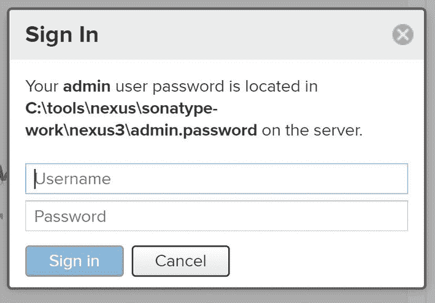
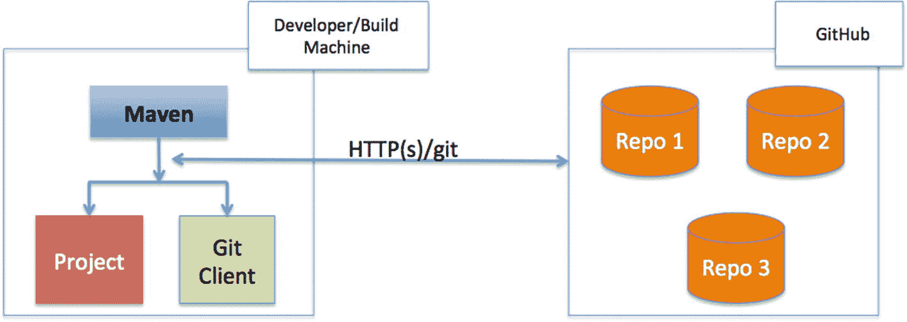
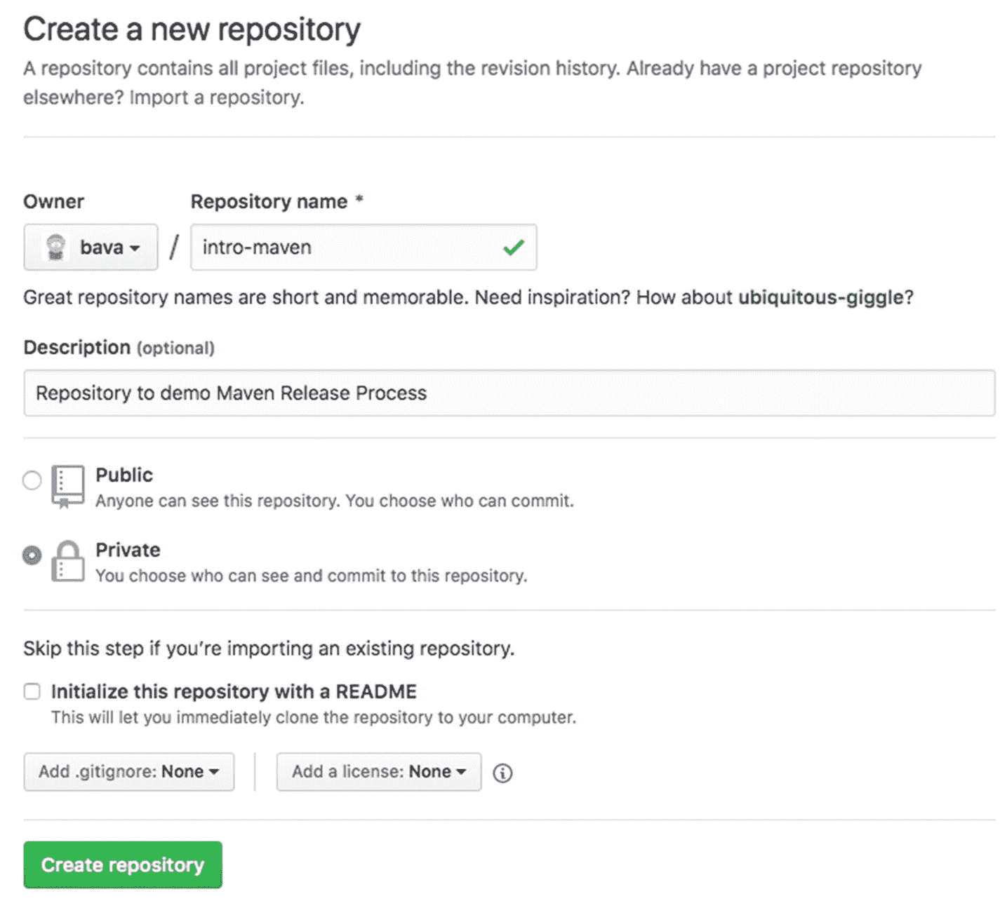
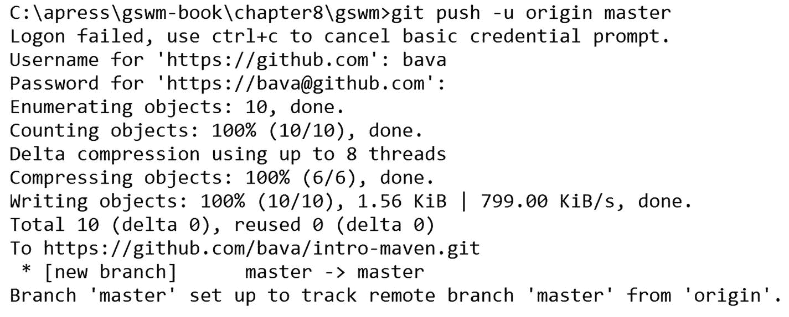
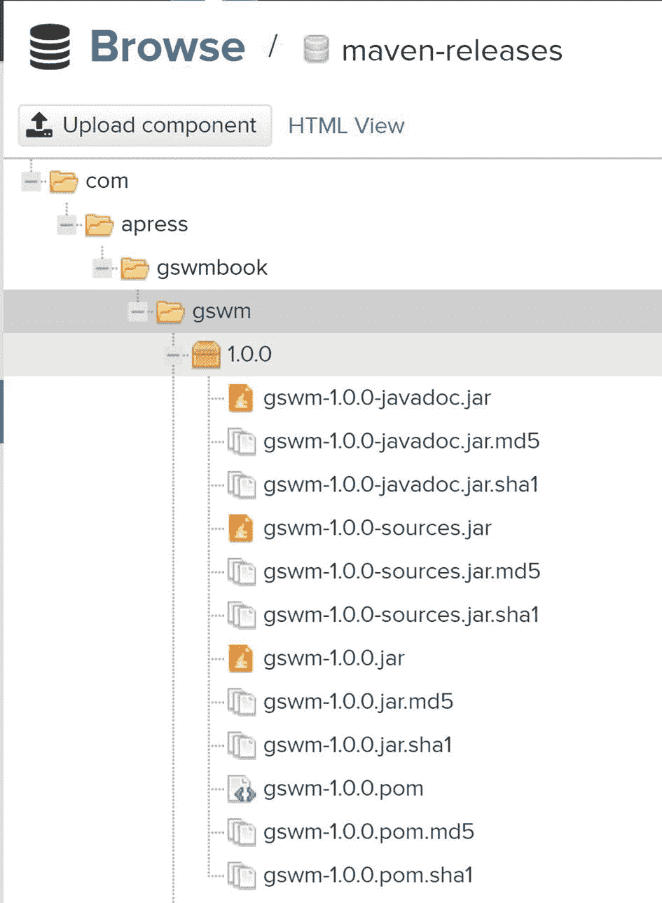

# 八、Maven 版本

Maven 提供了一个发布插件，可以自动完成发布软件的步骤。在我们深入研究 Maven 发布过程之前，我们将设置和配置 Nexus 存储库，并使用 Maven 向 Nexus 发布工件。

## 与 Nexus 的集成

存储库管理器是企业中 Maven 部署的关键部分。存储库管理人员充当公共存储库的代理，促进工件共享和团队协作，确保构建稳定性，并支持企业中使用的工件的治理。

sonatype*Nexus*repository manager 是一款流行的开源软件，允许您维护内部存储库和访问外部存储库。它允许通过单一 URL 对存储库进行分组和访问。这使得存储库管理员能够在后台添加和删除新的存储库，而不需要开发人员更改他们计算机上的配置。此外，它还为使用 Maven 站点和工件搜索功能生成的站点提供托管功能。

在我们研究将 Maven 与 Nexus 集成之前，您需要在本地机器上安装 Nexus。Nexus 是作为一个归档分发的，它与一个 Jetty 实例捆绑在一起。从 Sonatype 的网站 [`https://help.sonatype.com/repomanager3/download`](https://help.sonatype.com/repomanager3/download) 下载 Nexus 发行版(【Windows 版)。在撰写本文时，Nexus 的 3.18.1-01 版本已经发布。解压缩文件，并将内容放在您的机器上。在本书中，我们假设内容在`C:\tools\nexus folder`下。

### 注意

大多数企业通常在中央服务器上安装并提供存储库管理器。如果您已经可以访问存储库管理器，请跳过安装的这一部分。

在*管理员模式*下启动你的命令行，导航到`C:\tools\nexus\nexus-3.18.1-01`下的 **bin** 文件夹。然后运行命令`nexus /install Nexus_Repo_Manager`。您将看到如图 [8-1](#Fig1) 所示的成功消息。


图 8-1

安装 Nexus 时的成功消息

### 注意

Nexus 3.18 需要 JRE 8 才能正常工作。确保您的本地计算机上安装了 JDK/JRE 版本 8。此外，确保`JAVA_HOME`指向 JDK 的版本 8。

在同一个命令行上，运行命令`nexus start`来启动 Nexus。图 [8-2](#Fig2) 显示了运行该命令的结果。


图 8-2

起始关系

默认情况下，Nexus 运行在端口 8081 上。启动网络浏览器并导航至位于`http://localhost:8081/`的 Nexus。这将需要几分钟，但最终你应该会看到 Nexus 启动屏幕，如图 [8-3](#Fig3) 所示。


图 8-3

Nexus 启动屏幕

点击右上角的“登录”链接，登录 Nexus。您将看到一个登录模式，其中包含自动生成的管理员密码文件的位置，如图 [8-4](#Fig4) 所示。



图 8-4

Nexus 登录模式

使用从 admin.password 文件中复制的用户名 admin 和密码登录 Nexus。您将被要求更改密码，如图 [8-5](#Fig5) 所示。对于本书中的练习，我将密码改为 admin123。


图 8-5

Nexus 更改密码屏幕

现在 Nexus 已经安装并运行了，让我们修改位于`C:\apress\gswm-book\chapter8`下的`gwsm`项目。您将从在`pom.xml`文件中添加一个`distributionManagement`元素开始，如清单 [8-1](#PC1) 所示。该元素用于提供关于项目工件将被部署到哪里的存储库信息。`repository`子元素指出了发布的工件将被部署的位置。类似地，`snapshotRepository`元素标识了存储项目快照版本的位置。

```java
<project  xmlns:xsi=”http://www.w3.org/2001/XMLSchema-instance” xsi:schemaLocation="http://maven.apache.org/POM/4.0.0 http://maven.apache.org/maven-v4_0_0.xsd">
        <dependencies>
            <!-- Content removed for brevity -->
        </dependencies>
        <distributionManagement>
           <repository>
              <id>nexusReleases</id>
              <name>Releases</name>
        <url>http://localhost:8081/repository/maven-releases</url>
           </repository>
           <snapshotRepository>
              <id>nexusSnapshots</id>
              <name>Snapshots</name>
              <url>http://localhost:8081/repository/maven-snapshots</url>
           </snapshotRepository>
        </distributionManagement>
        <build>
            <!-- Content removed for brevity -->
        </build>
</project>

Listing 8-1The pom.xml with distributionManagement

```

### 注意

开箱即用，Nexus 自带 R `eleases`和 S `napshots`库。默认情况下，快照工件将存储在`Snapshots Repository`中，而发布工件将存储在`Releases`存储库中。

像大多数存储库管理器一样，部署到 Nexus 是一个受保护的操作。为了让 Maven 在 Nexus 上交互和部署工件，您需要在 settings.xml 文件中为用户提供正确的访问角色。清单 [8-2](#PC2) 显示了带有服务器信息的`settings.xml`文件。如您所见，我们使用管理员用户信息来连接 Nexus。注意，在服务器标签中声明的 id——`nexusReleases`和`nexusSnapshots`—必须与在`pom.xml`文件中声明的`repository`和`snapshotRepository`的 id 相匹配。用清单 [8-2](#PC2) 中的代码替换`C:\Users\<<USER_NAME>>\.m2`文件夹中`settings.xml`文件的内容。

```java
<?xml version="1.0" encoding="UTF-8" ?>
<settings  xmlns:xsi="http://www.w3.org/2001/XMLSchema-instance" xsi:schemaLocation="http://maven.apache.org/SETTINGS/1.0.0 http://maven.apache.org/xsd/settings-1.0.0.xsd">
<servers>
   <server>
      <id>nexusReleases</id>
      <username>admin</username>
      <password>admin123</password>
   </server>
   <server>
      <id>nexusSnapshots</id>
      <username>admin</username>
      <password>admin123</password>
   </server>
</servers>
</settings>

Listing 8-2Settings.xml File with Server Information

```

与 Nexus 交互的配置步骤到此结束。在命令行，运行目录`C:\apress\gswm-book\chapter8\gswm`下的命令`mvn deploy`。成功执行该命令后，您会在`http://localhost:8081/#browse/browse:maven-snapshots`看到 Nexus 下的快照工件，如图 [8-6](#Fig6) 所示。


图 8-6

Nexus 下的快照工件

## 项目发布

发布项目是一个复杂的过程，通常包括以下步骤:

*   验证本地计算机上没有未提交的更改。

*   从`pom.xml`文件的版本中删除快照。

*   确保项目没有使用任何快照依赖项。

*   将修改后的`pom.xml`文件签入到您的源代码控制中。

*   创建源代码的源代码控制标记。

*   构建工件的新版本，并将其部署到存储库管理器。

*   增加`pom.xml`文件中的版本，为下一个开发周期做准备。

Maven 有一个发布插件，它为执行前面的步骤和发布项目工件提供了一个标准机制。正如您所看到的，作为其发布过程的一部分，Maven 与源代码控制系统进行了大量的交互。在本节中，您将使用 Git 作为源代码控制系统，使用 GitHub 作为存储库的远程服务器。Maven 和 GitHub 之间的典型交互如图 [8-7](#Fig7) 所示。Maven 发布通常在开发人员或构建机器上执行。Maven 要求在这样的机器上安装 Git 客户端。这些命令行工具允许 Maven 与 GitHub 交互，并执行诸如签出代码、创建标签等操作。



图 8-7

Maven 和 GitHub 之间的交互

在我们深入研究 Maven 发布过程之前，您需要通过完成以下步骤来设置环境:

1.  在本地机器上安装 Git 客户端。

2.  在 GitHub 上创建一个新的远程资源库。

3.  将您将要使用的项目登记到远程存储库中。

## Git 客户端安装

有几个 Git 客户端使得与 Git 存储库的交互变得很容易。比较流行的有 SourceTree ( [`www.sourcetreeapp.com/`](http://www.sourcetreeapp.com/) )和 GitHub Desktop ( [`https://desktop.github.com/`](https://desktop.github.com/) )。在本书中，我们将使用 Git SCM 发行版附带的客户端。导航到 [`https://git-scm.com/downloads`](https://git-scm.com/downloads) 并下载 Git 发行版的 Windows 版本。双击下载的 exe 文件，接受默认安装选项。安装完成后，打开一个新的命令行窗口并键入 git - version。您应该会看到类似图 [8-8](#Fig8) 的消息。


图 8-8

Git 版本

## 创建 GitHub 存储库

GitHub 是一个协作开发平台，允许您免费托管公共和私有 Git 存储库。在 GitHub 上创建新的资源库之前，您需要在 [`https://github.com/join`](https://github.com/join) 创建一个帐户。使用您的凭证登录 GitHub 后，导航到 [`https://github.com/new`](https://github.com/new) 并创建一个新的存储库，如图 [8-9](#Fig9) 所示。



图 8-9

新的 GitHub 资源库

## 签入源代码

让您的环境为 Maven 发布做好准备的最后一步是将`C:\apress\gswm-book\chapter8\gswm`下的`gswm`项目签入到新创建的 remove 存储库中。使用您的命令行，导航到`C:\apress\gswm-book\chapter8\gswm`文件夹，并按顺序运行以下命令。通过在下面的 remote add 命令中替换您的 GitHub 帐户，确保您使用正确的远程存储库 URL:

*   `git init`

*   `git add .`

*   `git commit -m "Initial commit"`

*   `git remote add origin https://github.com/<<your_git_hub_account>>/intro-maven.git`

*   `git push -u origin master`

Git push 命令将提示您输入 GitHub 用户名和密码。push 命令的成功完成应给出如图 [8-10](#Fig10) 所示的输出。



图 8-10

来自`Git`初始提交的输出

使用您的浏览器，导航到您在 GitHub 上的远程存储库，您将看到签入的代码。图 [8-11](#Fig11) 显示了预期的浏览器屏幕。


图 8-11

项目已签入 GitHub

前面的命令已经将代码推入 GitHub 上的 mater 分支。但是，Maven 发布插件与发布分支中的代码进行交互。因此，这个设置的最后一步是创建一个新的本地发布分支，并通过运行以下命令将其推送到 GitHub:

*   `git checkout –b release`

*   `git push origin release`

## Maven 版本

使用 Maven 的发布过程发布一个工件需要使用两个重要的目标:`prepare`和`perform`。此外，release 插件提供了一个`clean`目标，在出现问题时可以派上用场。

### *准备*目标

顾名思义,`prepare`目标是为发布准备一个项目。作为该阶段的一部分，Maven 执行以下操作:

*   *check-poms* :检查`pom.xml`文件中的版本是否有快照。

*   *scm-check-modifications* :检查是否有未提交的变更。

*   *check-dependency-snapshots*:检查`pom`文件，看是否有任何快照依赖。对于您的项目来说，使用已发布的依赖项是一种最佳实践。在`pom.xml`文件中发现的任何快照依赖关系都将导致发布失败。

*   *地图-发布-版本*:在交互模式下运行`prepare`时，提示用户发布版本。

*   *地图-开发-版本*:在交互模式下运行`prepare`时，提示用户下一个开发版本。

*   *生成-发布-poms* :生成发布`pom`文件。

*   *scm-commit-release* :向 scm 提交`pom`文件的释放。

*   *scm-tag* :为 scm 中的代码创建一个发布标签。

*   *rewrite-poms-for-development*:为新的开发周期更新`pom`文件。

*   *remove-release-poms* :删除发布生成的`pom`文件。

*   *scm-commit-development* :提交带有开发版本的`pom.xml`文件。

*   *最终释放*:完成释放的`prepare`阶段。

为了方便起见，您应该在项目的`pom.xml`文件中提供配置管理信息。清单 [8-3](#PC3) 显示了带有 SCM 信息的`pom.xml`文件片段。

```java
<project>
  <modelVersion>4.0.0</modelVersion>
        <!-- Content removed for brevity -->

    <scm>
      <connection>scm:git:https://github.com/bava/intro-maven.git</connection>
      <developerConnection>scm:git:https://github.com/bava/intro-maven.git</developerConnection>
      <url>https://github.com/bava/intro-maven</url>
    </scm>
   <!-- Content removed for brevity -->
</project>

Listing 8-3The pom.xml with SCM Information

```

一旦在本地机器上更新了`pom.xml`文件，通过运行以下命令将修改后的文件提交给 GitHub:

```java
git commit . -m "Added SCM Information"
git push origin release

```

为了让 Maven 成功地与 GitHub 通信，它需要 GitHub 凭证。您在`settings.xml`文件中提供这些信息，如清单 [8-4](#PC5) 所示。元素的 ID 被声明为`GitHub`，因为它必须匹配主机名。

```java
<?xml version="1.0" encoding="UTF-8" ?>
<settings  xmlns:xsi="http://www.w3.org/2001/XMLSchema-instance" xsi:schemaLocation="http://maven.apache.org/SETTINGS/1.0.0 http://maven.apache.org/xsd/settings-1.0.0.xsd">

<servers>
   <server>
      <id>nexusReleases</id>
      <username>admin</username>
      <password>admin123</password>
   </server>
   <server>
      <id>nexusSnapshots</id>
      <username>admin</username>
      <password>admin123</password>
   </server>
   <server>
     <id>github</id>
     <username>[your_github_account_name]</username>
     <password>[your_github_account_password]</password>
   </server>
 </servers>
</settings>

Listing 8-4The settings.xml with GitHub Details

```

现在您已经拥有了 Maven 的`prepare`目标所需的所有配置。清单 [8-5](#PC6) 显示了运行`prepare`目标的结果。因为`prepare`目标是在交互模式下运行的，Maven 将提示您发布版本、发布标签和新的开发版本。对于每个提示，按 Enter 键接受 Maven 建议的默认值。

```java
C:\apress\gswm-book\chapter8\gswm>mvn release:prepare
[INFO] Scanning for projects...
[INFO]
[INFO] --------------< com.apress.gswmbook:gswm >--------------
[INFO] Building Getting Started with Maven 1.0.0-SNAPSHOT

[INFO] --- maven-release-plugin:2.5.3:prepare (default-cli) @ gswm ---

[INFO] Verifying that there are no local modifications...

[INFO] Executing: cmd.exe /X /C "git rev-parse --show-toplevel"
[INFO] Working directory: C:\apress\gswm-book\chapter8\gswm
[INFO] Executing: cmd.exe /X /C "git status --porcelain ."

What is the release version for "Getting Started with Maven"? (com.apress.gswmbook:gswm) 1.0.0: :
What is SCM release tag or label for "Getting Started with Maven"? (com.apress.gswmbook:gswm) gswm-1.0.0: :
What is the new development version for "Getting Started with Maven"? (com.apress.gswmbook:gswm) 1.0.1-SNAPSHOT: :

[INFO] Checking in modified POMs...

[INFO] Tagging release with the label gswm-1.0.0...
[INFO] Executing: cmd.exe /X /C "git tag -F C:\Users\bavara\AppData\Local\Temp\maven-scm-73613791.commit gswm-1.0.0"

[INFO] Executing: cmd.exe /X /C "git push https://github.com/bava/intro-maven.git refs/tags/gswm-1.0.0"
[INFO] Release preparation complete.
[INFO] BUILD SUCCESS

Listing 8-5Maven prepare Command

```

请注意，`Git`命令作为`prepare`目标的一部分被执行。成功完成`prepare`目标将导致 Git 标签的创建，如图 [8-12](#Fig12) 所示。`gswm`项目中的`pom.xml`文件现在将拥有版本 1 . 0 . 1-快照。


图 8-12

在执行`prepare`时创建的 Git 标签

### *清扫*目标

作为执行的一部分，`prepare`目标执行许多活动并生成临时文件，如`release.properties`和`pom.xml.releaseBackup`。成功完成后，它会清理这些临时文件。有时`prepare`目标可能会失败(例如，无法连接到 Git)并使项目处于*肮脏的*状态。这就是发布插件的`clean`目标出现的地方。顾名思义，它会删除作为发布执行的一部分而生成的任何临时文件。

### 注意

发布插件的`clean`目标必须仅在`prepare`目标失败时使用。

### *执行*目标

`perform`目标负责从新创建的标签中签出代码，并将发布的代码构建和部署到远程存储库中。

以下阶段是`perform`目标的一部分:

*   *验证-完成-准备-阶段*:这验证了在运行`perform`目标之前已经执行了一个`prepare`阶段。

*   *check out-project-from-scm*:从 SCM 标签中检出发布的代码。

*   *运行-执行-目标*:执行与`perform`相关的目标。默认目标是部署。

在`gswm`项目上运行`perform`目标的输出如清单 [8-6](#PC7) 所示。

```java
C:\apress\gswm-book\chapter8\gswm>mvn release:perform
[INFO] Scanning for projects...

[INFO] -------------< com.apress.gswmbook:gswm >---------------
[INFO] Building Getting Started with Maven 1.0.1-SNAPSHOT
[INFO] --------------------[ jar ]-----------------------------

[INFO] --- maven-release-plugin:2.5.3:perform (default-cli) @ gswm ---
[INFO] Checking out the project to perform the release ...
[INFO] Executing: cmd.exe /X /C "git clone --branch gswm-1.0.0 https://github.com/bava/intro-maven.git C:\apress\gswm-book\chapter8\gswm\target\checkout"

[INFO] Invoking perform goals in directory C:\apress\gswm-book\chapter8\gswm\target\checkout
[INFO] Executing goals 'deploy'...

 [INFO] Building jar: C:\apress\gswm-book\chapter8\gswm\target\checkout\target\gswm-1.0.0-javadoc.jar

 [INFO] --- maven-install-plugin:2.4:install (default-install) @ gswm ---
 [INFO] Installing C:\apress\gswm-book\chapter8\gswm\target\checkout\target\gswm-1.0.0.jar to C:\Users\bavara\.m2\repository\com\apress\gswmbook\gswm\1.0.0\gswm-1.0.0.jar

 [INFO] --- maven-deploy-plugin:2.7:deploy (default-deploy) @ gswm ---
[INFO] Uploading to nexusReleases: http://localhost:8081/repository/maven-releases/com/apress/gswmbook/gswm/1.0.0/gswm-1.0.0.jar

[INFO] Uploaded to nexusReleases: http://localhost:8081/repository/maven-releases/com/apress/gswmbook/gswm/1.0.0/gswm-1.0.0.jar (2.4 kB at 14 kB/s)
[INFO] Uploading to nexusReleases: http://localhost:8081/repository/maven-releases/com/apress/gswmbook/gswm/1.0.0/gswm-1.0.0.pom

[INFO] Uploaded to nexusReleases: http://localhost:8081/repository/maven-releases/com/apress/gswmbook/gswm/1.0.0/gswm-1.0.0-javadoc.jar (22 kB at 84 kB/s)

[INFO] BUILD SUCCESS

Listing 8-6Maven perform Command

```

这就完成了`gswm`项目 1.0.0 版本的发布。工件最终出现在 Nexus repository manager 中，如图 8-13 所示。



图 8-13

与发布的工件的关系

## 摘要

Nexus 等内部存储库管理器允许企业完全采用 Maven。除了充当公共存储库代理之外，它们还支持组件共享和治理。本章介绍了 Maven 与 Nexus 的集成，并向您展示了将工件部署到 Nexus 的过程。您还了解了 Maven 的发布过程及其不同阶段。

在下一章，我们将学习持续集成(CI)的概念，并安装和配置 Jenkins——一个流行的开源 CI 工具。