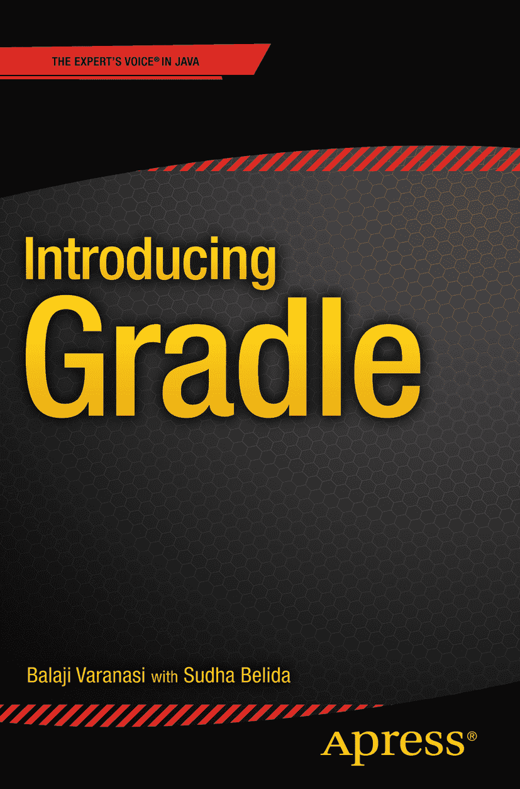

巴拉吉·瓦里纳桑 著 《Gradle 入门指南》

作者在本书中引用的任何源代码或其他补充材料，读者均可从 [`www.apress.com/9781484210321`](http://www.apress.com/9781484210321) 获取。有关如何找到本书源代码的详细信息，请访问 [`www.apress.com/source-code/`](http://www.apress.com/source-code/) 。读者也可以在 SpringerLink 上各章节的“补充材料”部分访问源代码。ISBN 978-1-4842-1032-1e-ISBN 978-1-4842-1031-4 DOI 10.1007/978-1-4842-1031-4 © Apress 2015 《Gradle 入门指南》 总经理：Welmoed Spahr 主编：Steve Anglin 技术审校：Manuel Jordan Elera 编辑委员会：Steve Anglin, Mark Beckner, Louise Corrigan, Jonathan Gennick, Robert Hutchinson, Michelle Lowman, James Markham, Susan McDermott, Matthew Moodie, Jeffrey Pepper, Douglas Pundick, Ben Renow-Clarke, Gwenan Spearing 统筹编辑：Mark Powers 文字编辑：Kezia Endsley 排版：SPi Global 索引编制：SPi Global 美术设计：SPi Global 有关翻译事宜，请发送电子邮件至 `rights@apress.com`，或访问 [`www.apress.com`](http://www.apress.com/) 。Apress 及 friends of ED 图书可批量购买用于学术、企业或促销用途。大多数图书也提供电子书版本和许可证。更多信息，请参考我们的特殊批量销售–电子书许可网页：[`www.apress.com/bulk-sales`](http://www.apress.com/bulk-sales) 。本作品受版权保护。出版商保留所有权利，无论涉及材料的全部或部分，特别是翻译权、重印权、插图重用权、朗诵权、广播权、缩微胶片复制权或任何其他物理形式的复制权，以及信息存储与检索、电子改编、计算机软件或现在已知或以后开发的类似或不同方法的传输权。与评论或学术分析相关的简短摘录，或专门为输入计算机系统并执行而提供的材料（仅供购买者独家使用）不受此法律限制。仅可根据出版商所在地现行版权法的规定复制本出版物或其部分内容，且必须始终从 Springer 获得使用许可。使用许可可通过 Copyright Clearance Center 的 RightsLink 获取。违反行为将根据相应版权法受到起诉。本书中可能出现商标名称、徽标和图像。我们不以每次出现商标名称、徽标或图像时都使用商标符号，而是仅以编辑方式使用这些名称、徽标和图像，以利于商标所有者，且无意侵犯商标权。本出版物中对商品名称、商标、服务标记及类似术语的使用，即使未明确标识，也不应被视为对其是否受专有权利保护的意见表达。尽管本书中的建议和信息在出版时被认为是真实准确的，但作者、编辑和出版商均不对可能存在的任何错误或遗漏承担法律责任。出版商对本书所含内容不作任何明示或暗示的保证。本书由 Springer Science+Business Media New York 在全球图书贸易中发行，地址：233 Spring Street, 6th Floor, New York, NY 10013。电话：1-800-SPRINGER，传真：(201) 348-4505，电子邮件：orders-ny@springer-sbm.com，或访问 www.springeronline.com。Apress Media, LLC 是一家加利福尼亚有限责任公司，其唯一成员（所有者）是 Springer Science + Business Media Finance Inc (SSBM Finance Inc)。SSBM Finance Inc 是一家特拉华州公司。引言

《Gradle 入门指南》是一本关于 Gradle 构建自动化工具的快速入门手册。本书首先解释 Gradle 的基本原理，并向您展示如何在本地机器上设置和测试 Gradle。它解释了用于创建 Gradle 构建脚本的语言 Groovy 的基础知识。然后深入探讨了依赖管理、项目、任务、生命周期阶段和插件等概念。本书还讨论了 Gradle 对多项目的支持以及将构件发布到本地和远程仓库。最后，以对持续集成（CI）的讨论和对 Jenkins 对 Gradle 的支持的回顾作为结尾。

## 本书结构

第 1 章 从对 Gradle 的温和介绍开始。它讨论了采用 Gradle 的原因，并概述了其两个替代方案：Ant 和 Maven。

第 2 章 重点介绍如何在您的机器上设置 Gradle 并测试安装。它还概述了 Gradle 发行版中包含的不同文件/文件夹，并展示了一个简单的 Gradle 构建脚本。

第 3 章 深入探讨 Groovy 语言基础，并回顾构建 Gradle 脚本所需的语言特性。

第 4 章 讨论 Gradle 的两个构建块——项目和任务。您将学习如何创建任务以及在这些任务之间声明依赖关系。您还将回顾 Gradle 构建的生命周期。

第 5 章 深入探讨 Gradle 对 Java 项目的支持。您将了解 `Java` 和 `War` 插件，并使用它们来构建和部署 Java 及 Web 应用程序。本章还深入介绍了 Gradle 插件。您还将了解如何构建自定义插件。

第 6 章 详细介绍了依赖管理。您将学习依赖管理背后的原理，并了解 Gradle 对管理这些依赖的支持。您还将了解不同类型的依赖以及如何解决依赖冲突。

第 7 章 回顾 Gradle 多项目构建的复杂性。您将了解两种类型的项目结构——层次结构和扁平结构。您还将学习如何在根项目和子项目构建文件中声明公共行为和特定项目行为。

第 8 章 讨论 Gradle 对发布构件的支持。您将了解用于声明项目产生的构件的归档配置。然后，您将安装 Nexus Maven 仓库管理器并将构件发布到该仓库。您还将了解处理额外构件所需的配置。

第 9 章 回顾持续集成（CI）流程，并探索流行的开源 CI 服务器 Jenkins。您将了解安装 Jenkins 以及配置必要的插件来运行位于 GitHub 仓库上的示例项目。

## 目标读者

《Gradle 入门指南》面向希望快速上手 Gradle 的开发人员和自动化工程师。本书假定读者具备 Java 基础知识。无需具备 Gradle 使用经验。

## 下载源代码

本书示例的源代码可从 [`www.apress.com/9781484210321`](http://www.apress.com/9781484210321) 下载。该源代码也可在 GitHub 上获取，地址为 [`https://github.com/bava/intro-gradle`](https://github.com/bava/intro-gradle) 。

下载后，请解压代码并将内容放入 `intro-gradle` 文件夹中。源代码按章节组织。每个文件夹都包含对应章节的构建脚本和项目文件。

## 问题反馈

我们欢迎读者的反馈。如果您有任何问题或建议，可以通过 `Balaji@inflinx.com` 或 `Sudha@inflinx.com` 联系作者。

致谢

本书的完成离不开许多人的支持，我们想借此机会向他们表示诚挚的感谢。

感谢 Apress 的优秀团队；没有你们，这本书就无法问世。感谢 Mark Powers 的耐心和专注。感谢我们的开发编辑 Chris Nelson 为改进本书所提供的见解和建议。感谢 Steve Anglin 的持续支持，以及参与此项目的 Apress 团队其他成员。

衷心感谢我们的技术审校 Manuel Jordan Elera 的辛勤付出和对细节的关注。他宝贵的反馈意见使本书得到了许多改进。

最后，我们要感谢朋友和家人们一直以来的支持与鼓励。

目录 第 1 章：入门 1 声明式依赖管理 1 声明式构建 2 约定优于配置 2 增量构建 2 Gradle Wrapper 2 插件 3 开源 3 Gradle 替代方案 3 Ant + Ivy 3 Maven 4 总结 5 第 2 章：搭建 Gradle 环境 7 安装前提 7 搭建 Java 环境 7 下载 Gradle 7 安装 Gradle 8 在 Windows 上安装 8 测试安装 11 在 Mac OS X 上安装 11 设置 Gradle 的 JVM 选项 12 Gradle 发行版 13 Hello World Gradle 脚本 13 获取帮助 14 Gradle GUI 15 IDE 支持 15 总结 16 第 3 章：Groovy 语言入门 17 安装 Groovy 17 运行 Groovy 18 Groovy 语言基础特性 19 Groovy 语法 19 注释 20 数据类型 20 闭包 24 总结 25 第 4 章：理解 Gradle 构建 27 项目 27 任务 29 创建任务 29 任务依赖 31 跳过任务 35 Gradle 任务类型 36 构建生命周期 37 总结 39 第 5 章：项目与插件 41 插件介绍 41 Java 项目 42 使用 Java 插件 42 Jar 任务 45 生成 Javadoc 46 配置默认布局 48 创建 Web 项目 49 War 任务 51 编写自定义插件 52 创建 Java 插件 52 创建 Groovy 插件 55 创建独立项目插件 57 总结 66 第 6 章：依赖管理 67 声明式依赖管理 67 依赖配置 70 处理依赖 71 外部模块依赖 72 文件依赖 75 项目依赖 77 解决依赖冲突 78 仓库 80 创建 Uber JAR 82 总结 85 第 7 章：多项目构建 87 多项目结构 87 示例项目 88 扁平布局 90 多项目与单项目构建 92 项目配置 93 项目依赖 95 子项目构建文件 96 总结 97 第 8 章：发布构件 99 发布到本地仓库 99 发布到 Maven 仓库 100 安装 Nexus 100 构建配置 101 处理额外构件 104 安装到 Gradle 缓存 106 使用文件仓库 107 使用本地 Maven 仓库 107 使用中央仓库 108 总结 109 第 9 章：持续集成 111 持续集成流程 111 示例项目 112 安装 Jenkins 113 配置 Jenkins 114 创建构建任务 116 运行构建任务 122 归档构件 124 发布测试结果 126 总结 128 索引 129 内容概览 关于作者 xi   关于技术审校 xiii   致谢 xv   引言 xvii   第 1 章：入门 1   第 2 章：搭建 Gradle 环境 7   第 3 章：Groovy 语言入门 17   第 4 章：理解 Gradle 构建 27   第 5 章：项目与插件 41   第 6 章：依赖管理 67   第 7 章：多项目构建 87   第 8 章：发布构件 99   第 9 章：持续集成 111   索引 129   关于作者与关于技术审校 关于作者 关于技术审校

