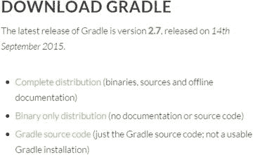
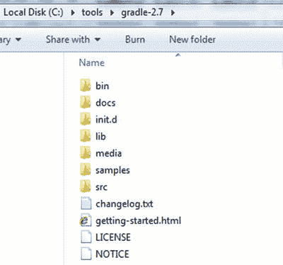
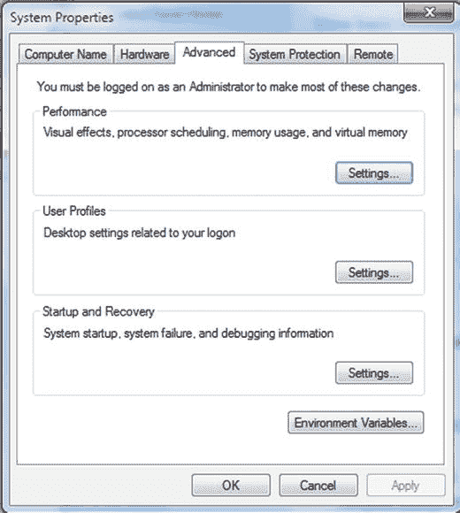
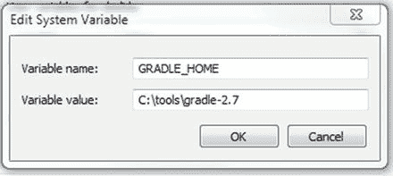
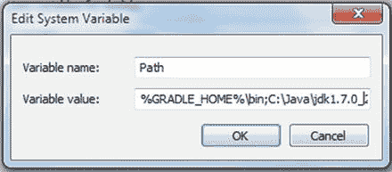
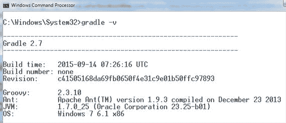
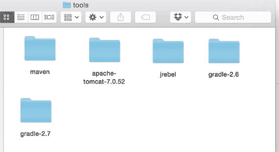
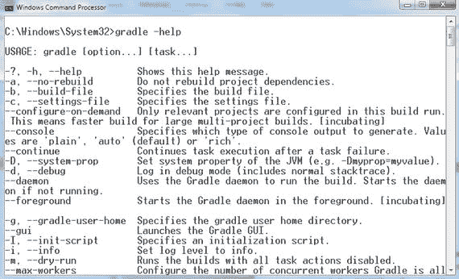
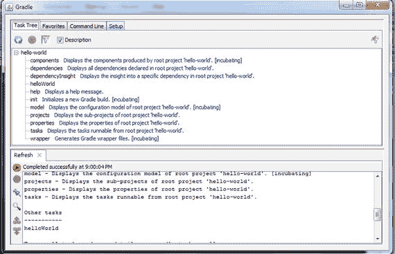

# 2. 设置 Gradle

Gradle 的安装是一个简单直接的过程。本章将解释如何使用 Windows 7 和 Mac 操作系统安装和设置 Gradle。你可以按照类似的过程在其他操作系统上进行操作。除了基本的 Gradle 安装和设置外，本章还包括安装前提条件、一个初始示例脚本以及关于 Gradle 帮助和 IDE 支持的信息。

## 安装前提条件

在开始 Gradle 安装之前，你需要确保已正确安装和配置 Java，然后下载当前版本的 Gradle。

### 设置 Java

要安装 Java，请从 [`www.oracle.com/technetwork/java/javase/downloads/index.html`](http://www.oracle.com/technetwork/java/javase/downloads/index.html) 下载 JDK（不仅仅是 Java 运行时环境 [JRE]），并按照该网页上指定的安装说明进行操作。Gradle 需要 JDK 6.0 或更高版本。本书使用 JDK 7。（这些说明也适用于 Java 8。）

在机器上安装好 JDK 后，将 `JAVA_HOME` 环境变量指向 JDK 安装目录。例如，如果你将 JDK 安装在 `c:\java\jdk1.7` 下，则 `JAVA_HOME` 值应设置为 `c:\java\jdk1.7`。然后修改 `PATH` 环境变量，在其末尾追加 `%JAVA_HOME%\bin`。

如果没有设置 `JAVA_HOME` 变量，你将看到 `"JAVA_HOME not found in your environment"` 构建错误。

### 下载 Gradle

在开始安装过程之前，请从 Gradle 网站（[`https://gradle.org/gradle-download/`](https://gradle.org/gradle-download/)）下载最新版本的 Gradle。在撰写本文时，最新版本是 2.7。下载图 2-1 中所示的 Gradle 2.7 “完整发行版”文件（`gradle-2.7-all.zip`）。

图 2-1.

Gradle 下载选项

## 安装 Gradle

本节介绍在 Windows 和 Mac OS X 上安装和测试 Gradle。本节还包括 Gradle 的 JVM 选项以及发行版文件集的概述。

### 在 Windows 上安装

将下载的发行版解压到计算机上的本地目录。它将创建一个名为 `gradle-2.7-all` 的文件夹。本书假设你将 `gradle-2.7` 文件夹的内容放置在 `c:\tools\gradle-2.7` 目录中，如图 2-2 所示。

图 2-2.

Gradle 安装位置

安装过程的下一步是添加 `GRADLE_HOME` 环境变量，指向 Gradle 安装目录——在我们的例子中是 `c:\tools\gradle-2.7`。启动“开始”菜单，右键单击“计算机”选项。接下来，选择“系统属性”，然后选择“高级系统设置”。这将启动图 2-3 所示的窗口。

图 2-3.

系统属性窗口

单击“环境变量”按钮，然后在“系统变量”下单击“新建”。输入图 2-4 中所示的值，然后单击“确定”。

图 2-4.

Gradle 主目录系统变量

过程的最后一步是修改 `Path` 环境变量，以便你可以从命令行运行 Gradle 命令。选择 `Path` 变量并单击“编辑”。在 `Path` 值的开头添加 `%GRADLE_HOME%\bin`，如图 2-5 所示。单击“确定”。这样就完成了 Gradle 的安装。如果你有任何打开的命令行窗口，请关闭它们并重新打开一个新的命令行窗口。当环境变量被添加或修改时，新值不会自动传播到已打开的命令行窗口。

图 2-5.

将 Gradle 主目录位置添加到路径变量

### 测试安装

现在 Gradle 已安装，是时候测试并验证安装了。打开命令提示符并运行以下命令：

`gradle -v`

此命令应输出类似于图 2-6 所示的信息。

图 2-6.

Gradle 版本命令

`–v` 命令行选项会显示 Gradle 的安装路径以及它正在使用的 Java、Ant 和 Groovy 版本。运行扩展命令 `gradle --version` 会得到相同的结果。

### 在 Mac OS X 上安装

解压下载的分发包，并将 `gradle-2.7-all` 文件夹的内容移动到 `/Users/<<your_user_name>/tools` 目录下，如图 2-7 所示。

图 2-7.

Mac 上的 Gradle 安装位置

打开终端，使用以下命令编辑位于您主目录下的初始化脚本 `.profile`：

`nano ∼/.profile`

在 `.profile` 文件中，添加以下行：

`export GRADLE_HOME = /Users/<<your_user_name>/tools/gradle-2.7`

`export PATH=$PATH:$GRADLE_HOME/bin`

按 CTRL+O 保存更改。然后按 CTRL+X 退出文件。运行 `gradle -v` 命令以验证安装是否成功。

### 设置 Gradle 的 JVM 选项

与所有其他 Java 应用程序一样，Gradle 共享由环境变量 `JAVA_OPTS` 设置的相同 JVM 选项。特别是在复杂项目中，您很可能会遇到 `OutOfMemory` 错误。例如，当您运行大量 `JUnit` 测试或生成大量报告时，可能会发生这种情况。要解决此错误，请增加 Gradle 使用的 Java 虚拟机 (JVM) 的堆大小。这可以通过创建一个名为 `GRADLE_OPTS` 的新环境变量来全局完成。首先，我们建议使用值 `-Xmx512m` 或 `-Xmx1024m`。

### Gradle 分发包

如您在图 2-2（参见“在 Windows 上安装”）中所见，Gradle 分发包包含多个文件和文件夹。表 2-1 简要总结了这些内容及其用途。

表 2-1.

Gradle 分发包的文件和文件夹

| 文件夹 | 描述 |
| --- | --- |
| `bin` | 包含 Gradle 可执行文件 |
| `docs` | 包含用户指南 (HTML/PDF)、Javadoc、Groovydoc 和 Gradle DSL 参考 |
| `init.d` | 包含每次构建需要运行的任何脚本 |
| `lib` | 包含 Gradle 运行所需的依赖项（JAR、插件） |
| `media` | 包含 Gradle 图标和徽标 |
| `samples` | 包含复杂构建以及与工具集成的模板和示例 |
| `src` | 包含 Gradle 的源代码 |

## Hello World Gradle 脚本

现在您已成功安装 Gradle，可以创建您的第一个 Gradle 脚本了，该脚本不执行任何操作，仅输出文本 `Hello world!!`。执行构建时，Gradle 默认会查找名为 `build.gradle` 的构建脚本。首先，创建一个名为 `hello-world` 的文件夹。在该文件夹内，创建 `build.gradle` 文件，然后从清单 2-1 复制代码。

清单 2-1\. Hello World 任务

`task helloWorld << {`

    `println 'Hello world!!'`

`}`

打开命令提示符，导航到 `hello-world` 目录。然后使用命令 `gradle helloWorld` 执行 `helloWorld` 任务。您应该会看到如下所示的 `Hello world!!` 输出：

`C:\apress\chapter` `2` `\hello-world>gradle helloWorld`

`:helloWorld`

`Hello world!!`

`BUILD SUCCESSFUL`

`Total time: 3.594 secs`

清单 2-1 使用 Gradle 的 DSL 来定义 `helloWorld` 任务，并添加一个动作以向控制台打印 `Hello world!!`。您可以使用闭包（花括号 `{}` 内的代码）和 Groovy 的 `println` 方法来实现这一点，该方法类似于 Java 的 `System.out.println` 方法。正如您将在第 4 章中探讨的那样，Gradle 任务可以包含多个动作。`<<` 是一个快捷操作符，指示要为任务执行的最后一个动作（在本例中为打印到控制台）。

构建输出包括所运行任务的名称和执行时间。可以运行仅输出任务输出的相同构建。这通过使用 `-q` 标志来实现，如下所示：

`C:\apress\chapter` `2` `\hello-world>gradle -q helloWorld`

`Hello world!!`

## 获取帮助

您可以使用 `–h` 或 `-help` 选项获取 Gradle 命令行选项列表。运行以下命令将产生类似于图 2-8 所示的输出。

图 2-8.

Gradle 帮助命令

`gradle -help`

## Gradle GUI

除了提供强大的命令行界面外，Gradle 还附带了一个用于处理构建的图形用户界面。可以使用 `-gui` 选项启动 Gradle 的 GUI。图 2-9 显示了从 `hello-world` 文件夹启动的 Gradle GUI：

图 2-9.

Gradle GUI

`\chapter` `2` `\hello-world>gradle –gui`

“任务树”选项卡显示 `build.gradle` 文件中所有可用的任务。您只需双击任务名称即可在任务树中执行任务。“收藏夹”选项卡允许您存储常用的 Gradle 命令。“命令行”选项卡，顾名思义，允许您键入并运行任何您会在命令行界面中运行的 Gradle 命令。“设置”选项卡允许您更改配置选项，例如项目目录和日志级别。

## IDE 支持

本书使用命令行来创建和构建示例应用程序。如果您有兴趣使用 IDE，好消息是所有现代 IDE 都完全集成了 Gradle。

## 总结

本章引导您在本地计算机上完成 Gradle 的设置。您还了解了作为 Gradle 分发包一部分的不同文件/文件夹，并查看了一个简单的 Gradle 构建脚本。

在下一章中，您将学习 Groovy 语言的基础知识。

