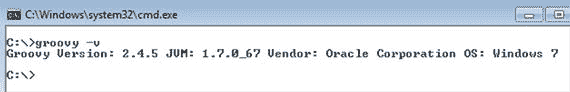
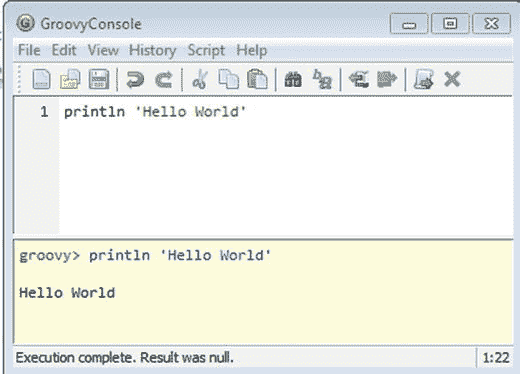

# 3. Groovy 语言入门

Gradle 构建脚本是使用 Groovy 编写的。本章涵盖 Groovy 编程语言的基础知识。

Groovy 是一种在 JVM 上运行的动态编程语言。Groovy 语言从设计之初就旨在与 Java 在源代码和二进制级别兼容。这种兼容性允许 Groovy 类扩展 Java 类或利用大量的 Java 框架和库。Groovy 的 1.0 版本于 2007 年 1 月发布。下一个主要版本——Groovy 2.0——于 2012 年 7 月发布。在撰写本书时，Groovy 的最新版本是 2.4。Groovy 是开源的，并根据 Apache 2.0 许可证分发。

## 安装 Groovy

Gradle 自带其 Groovy 库，任何现有的 Groovy 安装都将被忽略。为了学习和尝试 Groovy，您需要先安装 Groovy。外部 Groovy 安装将使您能够熟悉该语言，而不会弄乱 Gradle 安装。请按照以下步骤安装 Groovy：

从 [`www.groovy-lang.org/download.html`](http://www.groovy-lang.org/download.html) 下载 Groovy 二进制文件。   解压 ZIP 文件并将内容放置在您的硬盘上。例如，`C:\tools\groovy-2.4.5`。   创建一个名为 `GROOVY_HOME` 的新环境变量，指向解压位置。   将 `GROOVY_HOME\bin` 添加到 `PATH` 环境变量中。例如，在 Windows 机器上，您将添加 `%GROOVY_HOME%\bin`。   成功安装 Groovy 后，在命令行上运行 `groovy -v` 或 `groovy -version` 命令以验证安装。图 3-1 显示了成功安装的输出。

图 3-1.

Groovy 版本命令

## 运行 Groovy

Groovy 提供了一个名为 Groovy Shell 或 `groovysh` 的命令行工具。它允许你轻松快速地试验该语言。要启动 `groovysh`，请打开命令提示符/终端并输入 `groovysh`。Shell 启动完成后，你就可以开始输入 Groovy 代码并查看其运行效果，如下所示：

`C:\apress\intro-gradle>groovysh`

`Groovy Shell (2.4.5, JVM: 1.7.0_67)`

`Type ':help' or ':h' for help.`

`----------------------------------------------------------------------------`

`groovy:000> println 'Hello World'`

`Hello World`

`===> null`

`groovy:000>`

你可以通过运行命令 `:exit` 或 `:quit` 来退出 Groovy shell。你也可以运行 `:help` 命令来列出可用的 shell 命令或获取某个特定命令的详细信息。

Groovy 还提供了 GroovyConsole——一个用于执行 Groovy 代码的基于 GUI 的工具。要启动 GroovyConsole，只需双击 `GROOVY_HOME\bin` 目录下的 `groovyConsole.bat`（适用于 Windows）。图 3-2 展示了带有输入区域和输出区域的 GroovyConsole。输入区域是你输入 Groovy 代码的地方（例如图 3-2 中显示的 `println 'Hello World'`）。可以通过选择 **脚本** ➤ **运行** 菜单项或从 **操作** 菜单中选择 **运行** 来编译和执行 Groovy 代码。执行结果会显示在输出区域中。

图 3-2.

GroovyConsole 示例

## 基本 Groovy 语言特性

本节涵盖 Groovy 语法、数据类型（简单类型和集合类型）以及闭包。如果你想了解更多关于 Groovy 语言特性的信息，请参考在线文档 [`www.groovy-lang.org/single-page-documentation.html`](http://www.groovy-lang.org/single-page-documentation.html)。

### Groovy 语法

Groovy 从 Java 中吸收了大量语法，并增加了简化使其易于使用。其中一个简化是，当一行只包含一条语句时，可以省略行尾的分号。类似地，至少有一个参数的方法可以在没有括号的情况下调用。以下两条语句在 Groovy 中都是有效的：

`println ("Hello World");`

`println "Hello World"`

以下是与 Java 相比其他一些值得注意的区别：

*   Groovy 中的方法和类默认是 public 的。
*   方法中的 `return` 语句是可选的。如果 Groovy 没有找到 `return` 语句，它会返回最后一个被求值的表达式。
*   受检异常（Checked exceptions）不需要被捕获或声明。Groovy 会自动将这些异常包装为 `RuntimeException`。
*   默认情况下，会导入以下包——`java.lang.*`、`java.util.*`、`java.util.regex.*`、`java.net.*`、`java.io.*`、`groovy.lang.*`、`groovy.util.*`、`java.math.BigDecimal` 和 `java.math.BigInteger`。

### 注释

Groovy 注释的语法与 Java 相同。单行注释以 `//` 开头，多行注释以 `/*` 开头并以 `*/` 结尾。Groovydoc 注释类似于 Javadoc 注释，以 `/**` 开头并以 `*/` 结尾。

### 数据类型

Groovy 语言提供了多种数据类型，例如数字、字符串，以及列表和映射等复杂数据类型。

#### 字符串

Groovy 支持两种类型的字符串——常规的 Java 字符串（`java.lang.String` 的实例）和 GStrings（`groovy.lang.GString` 的实例）。常规的 Groovy 字符串通过使用单引号、双引号或三引号包围字符序列来声明。以下是 `String` 声明的一些示例：

`String message = 'Hello World'`

`String processor = "Intel"`

`String multiLine = '''This text is on line one`

   `line 2 and`

   `line 3'''`

`String escapedExample = 'Bob\'s Burgers'`

三引号语法允许你将文本跨行放置，而无需在每行进行拆分和拼接。Groovy 会保留使用三引号声明的多行文本中的空白字符。例如，上面显示的变量 `multiLine` 将包含带有空白字符和换行符的文本。如果你要将该文本保存到数据库中，它将按如下方式保存：

`This text is on line one`

    `line 2 and`

    `line 3`

注意

与 Java 一样，Groovy 中的字符串是不可变的。如果需要更改字符串的内容，建议使用 `StringBuilder` 或 `StringBuffer`。

GStrings 是使用双引号（或斜杠 `//`）转义并包含使用 `${...}` 语法的 Groovy 表达式的字符串。当访问 GString 时，Groovy 会对表达式求值，并用其值替换表达式文本。这里展示了一个 GString 的示例：

`String name = 'Luke'`

`String message = "Hello ${name}"`

`println message// 这将打印 Hello Luke`

当表达式是对变量的简单引用时，可以省略花括号 `{}`。因此，前面代码中的 `message` 可以重写如下：

`String message = "Hello $name"`

注意

Ruby 和 Perl 等语言具有字符串插值的概念，即能够在字符串中用表达式的值替换表达式。因此，GStrings 通常被称为插值字符串。

Groovy 允许在 `${...}` Groovy 表达式内部进行方法调用、语句和变量名引用。使用 GStrings，你可以轻松创建模板，而无需外部模板引擎。以下是一个在表达式内部调用 `length()` 和 `toLowerCase()` 方法的示例：

`String name = 'Luke'`

`String count = "${name.length()}"`

`println count`

`println "${name.toLowerCase()}"`

#### 数字

Groovy 支持整数和浮点数。与 Java 不同，Groovy 不提供原始数据类型。相反，Groovy 中的一切都是对象。这允许你在看似原始类型的东西上调用方法，如下所示：

`8.toString()`

`4.times {`

        `// 运行一个任务`

`}`

`7.next()`

默认情况下，Groovy 中的整数是 `java.lang.Integer`、`java.lang.Long` 或 `java.math.BigInteger` 的实例。Groovy 会自动选择最小的类来容纳整数的值。示例如下：

`println 90.class                     // 打印 class java.lang.Integer`

`println 9999999999999999999.class    // 打印 class java.math.BigInteger`

默认情况下，浮点数是 `java.math.BigDecimal` 的实例：

`println 9.0.class    // 打印 class java.math.BigDecimal`

始终可以通过显式关联类型或使用后缀来覆盖默认行为，如下所示：

`println 90l.class    // 打印 class java.lang.Long`

`float foo = 9.0`

`println foo.class    // 打印 class java.lang.Float`

如果 Groovy 不支持原始类型，那么你可能会想知道如何使用运算符进行基本算术运算，例如 2 + 3 或 10/2。Groovy 重载了运算符，这些运算符实际上是 Groovy 中的方法调用。例如，2 + 3 等价于 `2.plus(3)`。由于运算符是方法，如果其中一个操作数是 null，那么执行该操作将导致 `NullPointerException`。

注意

与 Java 不同，Groovy 默认执行浮点除法。例如，操作 2/4 的结果是 0.5。在 Java 中，相同的操作结果将是 `0`，因为 Java 检测到两个操作数都是整数，因此会执行整数除法。

#### 声明变量

到目前为止，你已经了解了如何使用数据类型声明变量。Groovy 还提供了 `def` 关键字，当你不确定或不关心变量数据类型时，可以用它来声明变量。例如：

`def obj = 'a'`

`println obj.class    // 输出 class java.lang.String`

`obj = 1.4`

`println obj.class    // 输出 class java.math.BigDecimal`

在声明变量时，可以省略 `def` 关键字。以下是省略 `def` 后的上述代码：

`obj = 'a'`

`println obj.class         // 输出 class java.lang.String`

`obj = 1.4`

`println obj.class         // 输出 class java.math.BigDecimal`

#### 列表

Groovy 中的列表是一个有序的元素集合。默认情况下，Groovy 列表是 `java.util.ArrayList` 的实例，并具有以下声明语法：

`list = [1, 2, 3, 4]`

`listWithDiffItems = [1, 3, 'String Item', 3.4]`

与 Java 一样，可以使用 `get` 方法访问列表中的元素。Groovy 还提供了一个 `getAt` 方法，该方法允许你使用负索引从末尾开始访问元素：

`println list.get(1)       // 输出 2`

`println list.getAt(-1)    // 输出 4，即倒数第一个元素`

可以使用 `add` 和 `remove` 方法添加或删除元素。`each` 方法可用于遍历列表元素：

`list.add 5`

`list.remove 0    // 0 是要删除元素的索引`

`list.each { println it }`

请注意，`each` 方法将闭包作为其参数。你将在本章后面部分了解更多关于闭包的内容。

#### 映射

Groovy 中的映射包含键/值对。默认情况下，Groovy 映射是 `java.util.LinkedHashMap` 的实例，并具有以下语法：

`[key1 : value1, key2 : value2]`

以下是在 Groovy 中定义的映射示例：

`map = [ "red" : 1, "yellow" : 2, "green" : 3 ]`

可以通过多种方式访问映射中的元素。最常见的方法是使用 `"."` 表示法。以下是一些示例：

`println map.red //输出 1`

`println map["yellow"] // 输出 2`

`println map.get("green") // 输出 3`

你可以使用 `put` 方法向映射添加新值，并使用 `each` 方法遍历值：

`map.put "blue", 4`

`map.each { println "Key: ${it.key} and Value: ${it.value}" }`

请注意 `each()` 方法中 `${}` 表达式的使用。Groovy 会计算这些表达式并输出键/值对。

#### 范围

Groovy 提供了一个范围运算符（`..`）来创建对象范围。例如，以下代码定义了一个从 0 到 9 的整数范围：

`def intRange = 0..9`

`println intRange.size()     // 输出 10`

`intRange.each {print it}    // 输出 0123456789`

### 闭包

简单来说，闭包是一段可执行的代码块。Groovy 中的闭包是 `groovy.lang.Closure` 的实例。由于闭包是对象，因此可以将它们分配给变量或作为参数传递给方法。由于它们包含代码，因此可以执行闭包。闭包通常被称为匿名函数。

Groovy 中的闭包可以接受参数并返回值。声明闭包的语法如下：

`{ 参数列表 -> 闭包体 }`

闭包由花括号 `{}` 括起来。参数列表由逗号（,）分隔，闭包体包含一个或多个语句。符号 `->` 将参数列表与闭包体分开。如果闭包没有 `return` 语句，则返回最后一个语句的输出。以下是一个接受一个 `String` 类型参数的闭包示例：

`def greet = {String name -> "Hello ${name}" }`

可以使用引用变量 `greet` 调用此闭包，如下所示：

`greet "Joe"`

`greet.call "Joe"`

如果闭包不接受任何参数，则可以省略参数列表和 `->` 符号。以下是一个没有任何参数的非常简单的示例：

`def greet = {"Hello"}`

在没有声明参数的情况下，一个名为 `it` 的无类型参数将隐式地提供给闭包体。考虑以下使用 `it` 参数的示例：

`def greet = {"Hello $it"}`

当使用参数（例如 `"World"`）调用 `greet` 闭包时，它将输出 `Hello World`。如果在没有参数的情况下调用 `greet`，则会传递 `null`。

`def greet = {"Hello $it"}`

`greet "World"    // 输出 Hello World`

`greet()          // 输出 Hello null`

以下是更多闭包定义的示例：

`{ -> }                     // 空闭包`

`{ a, b -> a + b }          // 带有两个无类型参数的闭包`

`{int a, int b -> a + b}    // 带有两个 int 类型参数的闭包`

闭包可以作为参数传递给方法。事实上，本章的“列表”和“映射”部分展示了如何将闭包 `{print it}` 传递给列表或映射的 `each` 方法。`each` 方法接受一个 `groovy.lang.Closure` 类型的参数，并为列表或映射中的每个元素执行它。闭包通过隐式的 `it` 参数访问元素。

闭包可以访问在其作用域内声明的变量。例如，如果闭包是在方法内部定义的，它可以访问该方法有权访问的所有变量（参数、局部变量、类变量等）。

## 总结

Groovy 是使用 Gradle 时的首选语言。本章涵盖了安装 Groovy 以及使用 Groovy Shell 和 GroovyConsole。它回顾了 Groovy 的基础知识及其支持的数据类型。你了解到 Groovy 的 GString 允许你包含表达式，从而使其适合模板化。最后，你学习了闭包——可以传递的代码块/功能。

在接下来的章节中，你将深入了解 Gradle 的任务，并开始编写 Gradle 构建脚本。

