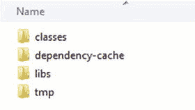
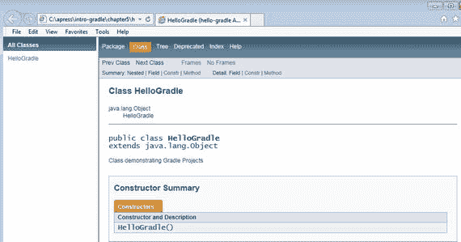
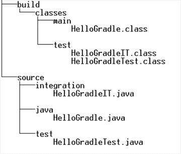
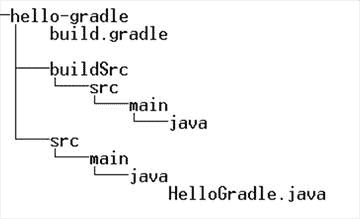
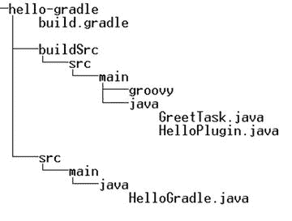
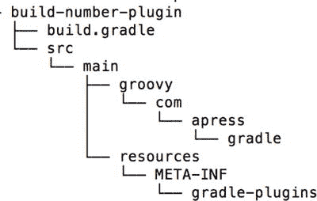
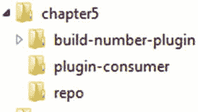
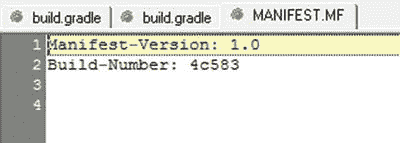

# 5. 项目与插件

Gradle 为 Java、Scala 和 Groovy 等领域提供了标准化的项目结构。它采用“约定优于配置”的方法，并就项目不同部分应位于何处提供了建议。例如，Gradle 建议所有 Java 源代码应放在 `src/main/java` 文件夹中，所有测试代码应放在 `src/test/java` 文件夹中。这种标准化使得开发人员可以轻松地在不同项目之间切换。本章将介绍 Gradle 针对 Java 项目的“约定优于配置”特性。

Gradle 遵循基于插件的架构，这使得增强和自定义其功能变得容易。它提供了几个开箱即用的插件，可以轻松构建 Java 项目。此外，Gradle 使得创建可与其他开发人员共享的自定义插件变得容易。本章将介绍 Gradle 插件，并向你展示如何开发一个生成构建编号的自定义插件。

## 插件介绍

Gradle 中的插件封装了可重用的构建、任务或配置逻辑。使用插件，可以添加新的任务、新的 DSL 元素或合理的默认值，从而扩展 Gradle 的功能。

Gradle 插件分为两种类型：脚本插件和二进制插件。顾名思义，脚本插件是可以包含在其他构建脚本中的 Gradle 构建脚本。脚本插件提供了一种模块化通用构建逻辑的简便方法。这些脚本插件可以位于本地文件系统，也可以使用以下语法从远程服务器引入：

`apply from: 'reusable-build.gradle'`

位于远程服务器上的脚本插件可以使用以下语法导入：

`apply from: 'http://your_server.com/plugin_path/plugin_name'`

二进制插件将可重用的构建逻辑封装在实现 `org.gradle.api.Plugin<T>` 接口的类中。这些类通常打包成 JAR 文件，但也可以位于构建脚本内部或项目下的 `buildSrc` 文件夹中。二进制插件可以使用以下语法在构建脚本中使用：

`apply plugin: 'plugin_id'`

`plugin_id` 是给定插件的唯一标识符。Gradle 自带的插件使用短名称，例如 `java` 或 `groovy`，而社区插件通常使用完全限定名称，例如 `org.hibernate.gradle.tools`。

## Java 项目

Gradle 附带几个开箱即用的插件，可简化 Java 开发。本节将介绍用于构建 JAR 工件的 `java` 插件，以及用于开发 Web 应用程序的 `war` 插件。你还将了解可用于生成 API 文档的 Javadoc 插件。

### 使用 Java 插件

`Java` 插件允许你编译 Java 代码、运行单元测试并组装 JAR 工件。要查看该插件的实际效果，请先在您的机器上创建一个名为 `hello-gradle` 的新 Java 项目。创建一个 `build.gradle` 文件，并添加以下代码以应用 `Java` 插件：

`apply plugin: 'java'`

如上一节所述，此插件会向构建添加一组任务和属性。你可以通过运行 `gradle tasks` 命令来查看这些任务。以下是输出的一部分：

`\hello-gradle>gradle tasks`

`:tasks`

`Build tasks`

`-----------`

`assemble - 组装此项目的输出。`

`build - 组装并测试此项目。`

`buildDependents - 组装并测试此项目以及所有依赖它的项目。`

`buildNeeded - 组装并测试此项目以及它依赖的所有项目。`

`classes - 组装 'main' 类。`

`clean - 删除构建目录。`

`jar - 组装一个包含主类的 jar 归档文件。`

`testClasses - 组装 'test' 类。`

`Documentation tasks`

`-------------------`

`javadoc - 为主源代码生成 Javadoc API 文档。`

`Verification tasks`

`------------------`

`check - 运行所有检查。`

`test - 运行单元测试。`

注意

所有 Gradle 命令都在包含 `build.gradle` 文件的文件夹中使用命令行/终端执行。

输出显示了许多由插件清晰分组的新任务。`Build tasks` 组下的任务（如 `assemble` 和 `jar`）用于构建和打包。你通常不会单独运行这些任务，而是运行 `build` 任务，该任务通过触发 `assemble` 和 `check` 任务来编译、测试和组装代码。`Documentation tasks` 下的 `javadoc` 任务用于生成 Javadoc API 文档。`Verification tasks` 组下的任务用于运行单元测试。

除了这些任务之外，`Java` 插件还就 Java 项目代码的不同部分应位于何处提供了一些指导。表 5-1 显示了推荐的目录。

表 5-1. Gradle 推荐的 Java 目录结构

| 目录 | 存放的资源 |
| --- | --- |
| `src/main/java` | 需要投入生产的 Java 源代码 |
| `src/main/resources` | 需要投入生产的资源，例如配置文件（XML）和属性文件 |
| `src/test/java` | Java 测试源代码 |
| `src/test/resources` | 测试阶段使用的资源 |

注意

有经验的 Maven 用户会注意到 `Java` 插件的目录约定与 Maven 推荐的 Java 项目结构相匹配。请务必记住，这些约定只是建议，Gradle 可以轻松地根据项目需求更改它们。

根据这些建议，让我们在 `hello-gradle` 文件夹下创建 `src/main/java` 文件夹。创建一个 `HelloGradle.java` 类，其内容如清单 5-1 所示。

清单 5-1. HelloGradle Java 代码

`public class HelloGradle {`

`public static void main(String[] args) {`

`System.out.println("Hello Gradle!!");`

`}`

`}`

现在，你可以使用 `gradle build` 命令构建代码。运行该命令的输出如下所示：

`\hello-gradle>gradle build`

`:compileJava`

`:processResources UP-TO-DATE`

`:classes`

`:jar`

`:assemble`

`:compileTestJava UP-TO-DATE`

`:processTestResources UP-TO-DATE`

`:testClasses UP-TO-DATE`

`:test UP-TO-DATE`

`:check UP-TO-DATE`

`:build`

`BUILD SUCCESSFUL`

`Total time: 4.479 secs`

构建成功后，在 Windows 资源管理器中打开 `hello-gradle` 文件夹，你会看到一个 `build` 文件夹被创建，其内容如图 5-1 所示。`classes` 文件夹包含编译后的类，`libs` 文件夹包含组装好的 JAR 文件。`tmp` 文件夹包含临时生成的文件，例如清单文件。

图 5-1.

Gradle 构建目录

`gradle build` 命令的输出会在某些任务旁边显示文本 `"UP-TO-DATE"`。此文本表示该特定任务已被跳过。某些 Gradle 任务会声明一组输入和一组输出。例如，`compileJava` 任务将一组 Java 文件作为输入，并生成一组编译后的类作为输出。如果 Gradle 确定任务的输入和输出自上次执行以来没有变化，它会自动跳过该任务的执行。此功能称为增量构建，可以显著减少大型项目的构建时间。

### Jar 任务

Java 插件提供的 `Jar` 任务负责组装 JAR 归档文件。`Jar` 任务提供了许多属性，允许您配置生成的工件。其中一个属性是 `archiveName`。默认情况下，生成的 JAR 文件名将是项目的名称。在本例中，项目名称为 `hello-gradle`，因此 `build/libs` 文件夹包含一个 `hello-gradle.jar` 文件。以下代码显示了将生成的 JAR 名称更改为 `introducing-gradle.jar` 所需的配置：

`jar {`

    `archiveName = 'introducing-gradle.jar'`

`}`

`Jar` 任务还会自动向其创建的 JAR 文件添加一个清单文件。清单文件通常包含有关打包在 JAR 文件中的文件的信息。要向清单文件添加新条目，您可以使用 `Jar` 任务的 `manifest` 属性。清单 5-2 显示了修改后的 `build.gradle` 文件，其中包含向清单文件添加三个新条目的配置。

清单 5-2\. 新的 hello-gradle build.gradle 文件

`apply plugin: 'java'`

`jar {`

    `manifest {`

        `attributes (`

            `'Main-Class' : 'HelloGradle',`

            `'Implementation-Title' : project.name,`

            `'Developer'  : 'Sudha Belida'`

        `)`

    `}`

`}`

运行 `gradle build` 命令。构建成功完成后，使用 WinZip 等 ZIP 工具打开 `builds/lib` 文件夹内生成的归档文件。`META-INF` 文件夹下的 `MANIFEST.MF` 文件应显示这三个新条目。

注意

为了使构建生成包含清单条目的更新 JAR，您可能需要从 `libs` 目录中删除现有的 `hello-gradle.jar` 并重新运行 `build` 命令。

### 生成 Javadoc

Javadoc 是记录和理解 Java 代码的绝佳工具。`Java` 插件带有 `javadoc` 任务，可用于自动生成 Javadoc。在运行命令之前，您应该通过将其内容替换为清单 5-3 来更新 `HelloGradle.java` 类。

清单 5-3\. 带有 Javadoc 的 HelloGradle

`/**`

`*  Class demonstrating Gradle Projects`

`*     @author Sudha`

`*/`

`public class HelloGradle {`

    `/**`

    `* Displays Hello Gradle!! to console`

    `*`

    `* @param args command line arguments`

    `*/`

    `public static void main(String[] args) {`

        `System.out.println("Hello Gradle!!");`

    `}`

`}`

运行 `gradle javadoc` 命令将产生如下所示的输出：

`\hello-gradle>gradle javadoc`

`:compileJava`

`:processResources UP-TO-DATE`

`:classes`

`:javadoc`

`BUILD SUCCESSFUL`

`Total time: 6.39 secs`

命令成功执行后，构建文件夹将有一个新的 `docs` 文件夹，其中包含一个 `javadoc` 子文件夹，里面存放着生成的 HTML 文件。`index.html` 文件应如图 5-2 所示。

图 5-2.

生成的 Javadoc

### 配置默认布局

Gradle 提供了 SourceSet 的概念，它表示源文件的逻辑集合。默认情况下，`Java` 插件提供 `main` 和 `test` 这两个 SourceSet。但是，在处理遗留项目时，您可能需要 Gradle 在不同位置查找 Java 源文件和其他资源文件。清单 5-4 展示了如何使用 `sourceSets` 闭包来更改默认布局。该代码表明 Java 源文件将位于 `source/java` 文件夹下，而 Java 测试用例将位于 `source/test` 文件夹下。

清单 5-4\. 更改默认布局

`apply plugin: 'java'`

`sourceSets {`

    `main {`

        `java {`

            `srcDir  'source/java'`

        `}`

    `}`

    `test {`

        `java {`

            `srcDirs = ['source/test', 'source/integration']`

        `}`

    `}`

`}`

`srcDirs` 元素可以接受单个目录或一组目录作为其值。图 5-3 显示了一个示例项目（位于下载源代码的 `chapter` `5` 文件夹中的 `hello-gradle2`），它使用了 `build.gradle` 文件中提到的目录结构。它还显示了 `build` 文件夹中的编译后的类。请注意，编译后的类仍然创建在 `main` 和 `test` 文件夹中。您可以使用 `output.classesDir` 配置元素更改生成类的位置。

图 5-3.

Gradle 项目非默认布局

### 创建 Web 项目

Gradle 提供了一个 `War` 插件，它扩展了 `Java` 插件，并支持 Web 应用程序开发和构建 WAR 文件。要查看此插件的实际效果，请创建一个名为 `web-gradle` 的文件夹。在新文件夹内创建一个 `build.gradle` 文件，并应用 web 插件，如下所示：

`apply plugin: 'war'`

此插件提供了与 `Java` 插件相同的用于存储 Java 类的目录约定。此外，`War` 插件期望所有静态资源（如 HTML、CSS、JS、图片）和动态资源（如 JSP 文件）都位于 `src/main/webapp` 文件夹中。您应该在 `src/main` 文件夹下创建 `webapp` 文件夹。然后创建一个 `index.html` 文件，并从清单 5-5 中复制内容。

清单 5-5\. index.html 文件内容

`<!DOCTYPE html>`

`<html>`

    `<head>`

        `<title>Hello World</title>`

    `</head>`

    `<body>`

        `<h1>Hello Gradle!!</h1>`

    `</body>`

`</html>`

现在，让我们使用 `gradle build` 命令构建应用程序。您应该会看到类似于以下的输出：

`\web-gradle>gradle build`

`:compileJava UP-TO-DATE`

`:processResources UP-TO-DATE`

`:classes UP-TO-DATE`

`:war`

`:assemble`

`:compileTestJava UP-TO-DATE`

`:processTestResources UP-TO-DATE`

`:testClasses UP-TO-DATE`

`:test UP-TO-DATE`

`:check UP-TO-DATE`

`:build`

`BUILD SUCCESSFUL`

`Total time: 5.415 secs`

Gradle 还提供了用于在嵌入式 Servlet 容器（如 Jetty 和 Tomcat）中运行 Web 应用程序的插件。要配置 Jetty，请在 `build.gradle` 文件中应用 Jetty 插件，如下所示：

`apply plugin: 'jetty'`

现在，您可以通过运行 `gradle jettyRun` 命令来运行 Jetty 服务器。您将看到以下输出：

`\web-gradle>gradle jettyRun`

`:compileJava UP-TO-DATE`

`:processResources UP-TO-DATE`

`:classes UP-TO-DATE`

`> Building 75% > :jettyRun > Running at` `http://localhost:8080/web-gradle`

要访问网页，请启动 Web 浏览器并导航到 URL：`http://localhost:8080/web-gradle`。您将看到如图 5-4 所示的网页。

图 5-4.

索引页面注意

可以使用嵌入式 Tomcat 来部署 Web 应用程序。有关配置帮助，请参阅 Tomcat 插件的 GitHub 页面：[`https://github.com/bmuschko/gradle-tomcat-plugin`](https://github.com/bmuschko/gradle-tomcat-plugin)。

### War 任务

`War` 插件中的 `War` 任务负责组装 WAR 归档文件。默认情况下，它会执行以下操作：

*   将编译后的 Java 代码复制到 `WEB-INF/classes` 文件夹。
*   将 `src/main/webapp` 的内容复制到 WAR 文件的根目录。
*   将运行时配置中的依赖项复制到 `WEB-INF/lib` 文件夹。

`War` 任务提供了多个可用于自定义生成工件的属性和方法。以下代码展示了其中一些配置选项：

`war {`

    `archiveName 'new-archive.war'`

    `webXml file ('src/config/web.xml')`

    `from 'src/media/images'`

`}`

此配置将生成的工件重命名为 `new-archive.war`。然后，它配置 `War` 任务使用位于 `src/config` 文件夹中的 `web.xml` 文件。最后，该任务被配置为将 `src/media/images` 文件夹中的内容添加到 WAR 文件的根目录。使用 `War` 插件时，WAR 文件的内容默认位于 `src/main/webapp`。请务必记住，此配置仅将 `images` 文件夹中的内容附加到 WAR 文件。如果你希望 `War` 任务覆盖默认行为并在其他位置（例如 `src/WebContent`）查找内容，则需要更改 war 插件的 `webAppDirName` 属性：

`apply plugin: 'war'`

`apply plugin: 'jetty'`

`webAppDirName = 'src/WebContent'`

## 编写自定义插件

Gradle 使得构建自定义二进制插件变得非常容易。你只需创建一个实现 `org.gradle.api.Plugin<T>` 接口的类即可。该插件类及其相关代码可以位于以下三个位置之一：

*   **构建脚本**：插件源代码可以直接嵌入到构建脚本中。这种方法限制了插件的复用价值，因为该插件在构建脚本外部不可见。
*   **buildSrc 项目**：位于 `buildSrc` 项目下的插件代码会被自动编译，并在构建脚本的类路径中可用。此插件在构建外部也不可见，因此无法在项目外部复用。
*   **独立项目**：插件代码可以打包成一个 JAR 文件，然后包含在构建脚本的类路径中。这种方法提供了最高的复用价值，但也需要单独的项目和构建基础设施。

在接下来的章节中，你将构建一个包含单个任务的简单插件，该任务向控制台打印 `"Hello Gradle Plugin"`，以及一个更复杂的用于生成构建编号的插件。你将采用 `buildSrc` 项目方法来构建简单插件。Gradle 插件可以用任何能编译成字节码的语言编写。你将首先使用 Java 创建简单插件，然后使用 Groovy 创建一个示例。你将使用独立项目方法来构建复杂插件。

### 创建 Java 插件

你将通过在 `hello-gradle` 文件夹内创建一个 `buildSrc` 文件夹来开始你的 Hello Gradle 插件开发。为了存放 Java 代码，在 `buildSrc` 下创建子文件夹 `src/main/java`。目录结构应类似于图 5-5 所示的结构。

图 5-5.

buildSrc 目录结构

下一步是创建一个向控制台输出 `"Hello Gradle Plugin"` 的任务。在 `buildSrc` 文件夹下创建一个 `GreetTask.java` 文件，并复制清单 5-6 的内容。

清单 5-6\. GreetTask.java 内容

`import org.gradle.api.DefaultTask;`

`import org.gradle.api.tasks.TaskAction;`

`public class GreetTask extends DefaultTask {`

    `@TaskAction`

    `public void greetAction() {`

        `System.out.println("Hello Gradle Plugin");`

    `}`

`}`

在 Gradle 中创建自定义任务最简单的方法是扩展 `org.gradle.api.DefaultTask`，该类本身实现了 `org.gradle.api.Task` 接口。为了让任务执行一个操作，你必须创建带有 `System.out.println` 语句的 `greetAction` 方法，该方法将消息写入控制台。为了让 Gradle 将此方法视为要执行的操作，你必须使用 `@TaskAction` 对其进行注解。

下一步是编写插件类本身。在 `buildSrc` 文件夹中创建 `HelloPlugin.java` 类，并将清单 5-7 的内容复制进去。

清单 5-7\. HelloPlugin.java 内容

`import org.gradle.api.Plugin;`

`import org.gradle.api.Project;`

`import java.util.Map;`

`import java.util.HashMap;`

`public class HelloPlugin implements Plugin<Project> {`

    `@Override`

    `public void  apply(Project project) {`

        `project.getTasks().create("greet", GreetTask.class);`

    `}`

`}`

Gradle 插件是通过实现 `org.gradle.api.Plugin<T>` 接口创建的。`Plugin` 接口包含一个名为 `apply(Project)` 的方法，插件类必须实现该方法。Gradle 通过调用其 `apply` 方法来开始执行插件。因此，你在 `apply` 方法内部使用传入的 `Project` 参数注册 `GreetTask`。你通过使用 `create` 方法来创建任务并将其添加到 `Project` 的任务容器中。`create` 方法接受要创建的任务名称以及任务类。

至此，插件开发完成。要使用此插件，请将以下代码添加到 `build.gradle` 文件中：

`apply plugin: HelloPlugin`

现在，让我们使用该插件并通过命令 `gradle greet` 运行 `greet` 任务。你应该会在输出中看到文本 `"Hello Gradle Plugin"`，如下所示：

`\hello-gradle>gradle greet`

`:buildSrc:compileJava`

`:buildSrc:compileGroovy UP-TO-DATE`

`:buildSrc:processResources UP-TO-DATE`

`:buildSrc:classes`

`:buildSrc:jar`

`:buildSrc:assemble`

`:buildSrc:compileTestJava UP-TO-DATE`

`:buildSrc:compileTestGroovy UP-TO-DATE`

`:buildSrc:processTestResources UP-TO-DATE`

`:buildSrc:testClasses UP-TO-DATE`

`:buildSrc:test UP-TO-DATE`

`:buildSrc:check UP-TO-DATE`

`:buildSrc:build`

`:greet`

`Hello Gradle Plugin`

`BUILD SUCCESSFUL`

`Total time: 5.725 secs`

### 创建 Groovy 插件

本节将使用 Groovy 语言重新创建 Java 的 `HelloPlugin`。首先，在 `buildSrc/src/main` 文件夹中创建一个 `groovy` 文件夹。最终的文件夹结构如图 5-6 所示。

图 5-6.

Groovy 插件目录结构

在 `groovy` 文件夹中，创建 `HelloPlugin2.groovy` 文件，并复制清单 5-8 的内容。

清单 5-8\. 使用 Groovy 的 HelloPlugin2

`import org.gradle.api.Plugin;`

`import org.gradle.api.Project;`

`class HelloPlugin2 implements Plugin<Project> {`

`@Override`

    `void apply(Project project) {`

        `project.task('greet2') << {`

            `println 'Hello Gradle Plugin2'`

        `}`

    `}`

`}`

`HelloPlugin2` 实现了 `Plugin` 接口，就像 Java 的 `HelloPlugin` 类一样。在 `apply` 方法中，你使用 `Project` 实例创建了一个名为 `greet2` 的新任务。你还使用 `<<` 快捷方式为任务的 `doLast` 方法添加了一个操作。该操作闭包代码将文本 `"Hello Gradle Plugin2"` 打印到控制台。

使用以下语句应用新创建的插件：

`apply plugin: HelloPlugin2`

运行 `gradle greet2` 命令来使用该插件。输出应如下所示：

`\hello-gradle>gradle greet2`

`:buildSrc:compileJava UP-TO-DATE`

`:buildSrc:compileGroovy UP-TO-DATE`

`:buildSrc:processResources UP-TO-DATE`

`:buildSrc:classes UP-TO-DATE`

`:buildSrc:jar UP-TO-DATE`

`:buildSrc:assemble UP-TO-DATE`

`:buildSrc:compileTestJava UP-TO-DATE`

`:buildSrc:compileTestGroovy UP-TO-DATE`

`:buildSrc:processTestResources UP-TO-DATE`

`:buildSrc:testClasses UP-TO-DATE`

`:buildSrc:test UP-TO-DATE`

`:buildSrc:check UP-TO-DATE`

`:buildSrc:build UP-TO-DATE`

`:greet2`

`Hello Gradle Plugin2`

`BUILD SUCCESSFUL`

`Total time: 5.451 secs`

也可以使用命令 `gradle greet greet2` 同时运行 `greet` 和 `greet2` 任务。如果这样做，你应该会看到以下输出：

`:buildSrc:build UP-TO-DATE`

`:greet`

`Hello Gradle Plugin`

`:greet2`

`Hello Gradle Plugin2`

### 创建独立项目插件

在上一节中，你构建了一个简单的插件，其源代码位于项目的 `buildSrc` 文件夹中。这种方法不太模块化，因为该插件无法在其定义的项目之外重用。独立项目方法允许你创建一个打包成 JAR 文件的插件，并且可以轻松地被任意数量的项目分发和重用。为了更好地理解这种插件开发方法，你将创建一个更真实的插件。

#### 插件背景

软件项目通常使用由句点分隔的三个数字来表示版本号：

`<主版本号>.<次版本号>.<补丁/增量版本号>`

正如命名约定所暗示的，主版本号通常在进行重大功能变更（通常不向后兼容）时递增。次版本号在实现次要功能或重大错误修复时递增。最后，补丁/增量版本号针对小错误、文本更改等进行递增。此约定遵循 [`http://semver.org/`](http://semver.org/) 上描述的“语义化版本 2.0.0”指南。

在开发过程中，开发团队可能会为同一源代码创建多个构建，并将其部署用于测试或与其他开发人员共享。这些构建都将具有相同的版本号。为了单独区分这些构建，你通常会使用另一个称为构建编号的数字。一些软件团队遵循将构建编号附加到版本号的约定：

`<主版本号>.<次版本号>.<补丁/增量版本号>.<构建编号>`

其他团队则简单地将构建编号添加到生成的 JAR 清单中，或显示在应用程序的 UI 上。以下是一些带有构建编号的示例版本：

*   1.0.0.56
*   3.3.9.25BLR48
*   6.1.0-20151123154556

构建编号可以从多种来源获得——来自源代码签入的提交编号、构建时间戳或持续集成（CI）服务器生成的编号等。在本节中，你将创建一个生成随机构建编号的 Gradle 插件。

#### 插件配置

为了便于本书管理，构建编号插件生成两种类型的值——基于时间戳的数值或字母数字值。清单 5-9 显示了一个假设的 `build.gradle` 配置来使用此插件。

清单 5-9\. 构建编号插件示例用法

`apply plugin: 'build-number-plugin'`

`buildNumber {`

    `numberType = 'alphanumeric'`

    `alphaNumLength = 5`

`}`

该插件提供了一个 `buildNumber` 配置块，允许插件用户设置构建编号类型——字母数字或时间戳。用户可以使用 `alphaNumLength` 属性来指定生成的字母数字字符串中的字符数。

配置插件后，可以在 `build.gradle` 文件中使用 `buildNumber.value` 访问生成的构建编号。

注意

有一些可用的开源 Gradle 插件可以从其他来源（如 Git/SVN）生成构建编号，并提供更多功能。你可以在 [`https://github.com/GeoNet/gradle-build-version-plugin`](https://github.com/GeoNet/gradle-build-version-plugin) 查看这样一个插件。

#### 插件开发

你将通过创建一个 Groovy 项目来开始插件开发。在你的文件系统上创建一个名为 `build-number-plugin` 的文件夹，然后创建图 5-7 所示的子文件夹。

图 5-7.

独立项目目录结构

下一步是使用插件项目所需的依赖项和配置填充 `build.gradle` 文件。清单 5-10 显示了 `build.gradle` 文件的内容。

清单 5-10\. 构建编号插件的 build.gradle 文件

`apply plugin: 'groovy'`

`group = 'com.apress.gradle'`

`version = '1.0.0'`

`dependencies {`

    `compile gradleApi()`

`}`

`uploadArchives {`

    `repositories {`

      `flatDir { dirs "../repo" }`

    `}`

`}`

由于你正在处理一个 Groovy 项目，因此必须通过应用 Groovy 插件来开始 `build.gradle` 文件。Gradle 工件使用三个坐标来标识（更多内容请参见第 6 章）：

*   表示负责该项目的组织的 group
*   工件的名称
*   工件的版本

在 `build.gradle` 文件中，你使用 `com.apress.gradle` 和 `1.0.0` 作为 group 和 version 值。由于你没有指定名称，Gradle 将项目文件夹的名称用作工件名称。文件的 `dependencies` 部分用于为 Gradle 提供插件项目编译和测试所需的外部库和框架。在这种情况下，你使用 `gradleApi()` 来引入自定义插件和任务类使用的 Gradle API。

注意

在下一章中，你将更深入地了解依赖管理以及 Gradle 对引入外部依赖项的支持。

最后，你使用 `uploadArchives` 方法将生成的插件上传或发布到仓库。`flatDir` 方法被配置为将打包好的插件发布到 `repo` 文件夹，该文件夹在文件系统上与 `build-number-plugin`（项目）位于同一层级。

注意

生成的工件可以通过发布到中央/公共工件仓库来与其他开发人员/团队共享。第 8 章 将详细讨论工件发布。

#### 插件扩展

开发插件的下一步是让用户 `build.gradle` 中的插件配置（清单 5-9）对自定义插件可用。实现此目的的一种方法是通过扩展对象。每个 Gradle 项目都有一个 `org.gradle.api.plugins.ExtensionContainer` 实例，用于跟踪传递给插件的设置和属性。要存储这些数据并在插件间传递，你需要向此容器注册一个或多个 Java/Groovy Bean（称为扩展对象）。

清单 5-11 展示了 `src/main/groovy/com/apress/gradle` 文件夹中的 `BuildNumberExtension.groovy` 类，它将作为构建编号插件的扩展模型。它包含 `numberType` 和 `alphaNumLength` 属性，用于保存插件的输入。它还包含 `value` 属性，允许插件/任务将构建编号提供给 `build.gradle` 文件。

**清单 5-11. BuildNumberExtension.groovy 类**

`package com.apress.gradle;`

`class BuildNumberExtension {`

    `String numberType;`

    `int alphaNumLength;`

    `String value;`

`}`

#### 插件任务

在“`buildSrc`”方法（清单 5-8）中，你将插件代码与任务代码合并在一起。对于实际插件，将插件代码与执行操作的代码清晰分离是合理的。因此，请在 `src/main/groovy/com/apress/gradle` 文件夹中创建 `BuildNumberTask.groovy` 文件，并复制清单 5-12 的内容。

**清单 5-12. BuildNumberTask 代码**

`package com.apress.gradle;`

`import org.gradle.api.DefaultTask`

`import org.gradle.api.tasks.TaskAction`

`class BuildNumberTask extends DefaultTask {`

    `@TaskAction`

    `def generateBuildNumber() {`

        `String numberType = project.buildNumber.numberType`

        `int alphaNumLength = project.buildNumber.alphaNumLength`

        `def buildNumber;`

        `if("alphanumeric".equals (numberType)) {`

            `buildNumber = getAlphaNumString(alphaNumLength)`

        `}`

        `else if ( "timestamp".equals (numberType) ) {`

            `buildNumber = System.currentTimeMillis()`

        `}`

       `project.buildNumber.value = buildNumber;`

    `}`

    `def getAlphaNumString(length) {`

        `String uuid = UUID.randomUUID().toString()`

        `uuid.take(length)`

    `}`

`}`

`BuildNumberTask` 中 `generateBuildNumber()` 方法上的 `@TaskAction` 指示了 Gradle 需要调用来执行操作的方法。`generateBuildNumber()` 的实现使用 `buildNumber` 扩展对象读取用户配置的 `numberType` 和 `alphaNumLength` 值。然后，它调用 `System.currentTimeMillis()` 或 `getAlphaNumString()` 工具方法来生成实际的构建编号。生成的构建编号随后被赋值给 `buildNumber` 的 `value` 属性。这使得构建编号对用户的 `build.gradle` 文件可用。

#### 插件类

实现的最后一部分是将所有内容联系在一起的 `Plugin` 类。清单 5-13 展示了位于 `src/main/groovy/com/apress/gradle` 文件夹下的 `BuildNumberPlugin` 类代码。在 `apply()` 方法内部，你使用 `create` 方法将 `buildNumber` 扩展对象添加到项目中。`create` 方法接受一个名称和模型类作为其参数。此名称 `buildNumber` 必须与用户用于提供输入的配置闭包块的名称（清单 5-9 中的 `buildNumber`）相匹配。它还必须与任务类（清单 5-12）用于检索配置值的名称相匹配。

**清单 5-13. BuildNumberPlugin 类**

`package com.apress.gradle;`

`import org.gradle.api.Plugin;`

`import org.gradle.api.Project;`

`import org.gradle.api.Task;`

`class BuildNumberPlugin implements Plugin<Project>  {`

    `void apply(Project project) {`

        `project.extensions.create('buildNumber', BuildNumberExtension)`

        `Task buildnumberTask = project.task('buildnumbertask', type: BuildNumberTask)`

        `project.tasks['jar'].dependsOn buildnumberTask`

    `}`

`}`

在 `apply()` 方法中，你接着添加一个类型为 `BuildNumberTask` 的任务。名称 `buildnumbertask` 没有特殊含义。但是，你应该尽量赋予一个有意义的名称，因为它会显示在控制台和调试输出中。最后，你让 `Jar` 任务依赖于 `buildnumberTask`，以便在生成 JAR 之前构建脚本可以获得构建编号。

#### 简短插件名称

默认情况下，插件通过其完全限定类名来引用。但是，你也可以为插件指定简短、易用的名称。为此，你需要在 `src/main/resources/META-INF/gradle-plugin` 文件夹中创建一个属性文件。该属性文件的名称将成为插件的短名称。

由于此插件处理构建编号，你可以将其命名为 `build-number-plugin`。要实现这一点，请在 `gradle-plugin` 文件夹下创建一个 `build-number-plugin.properties` 文件。在该文件中，你只需创建一个键为 `implementation-class`、值为完全限定插件类的属性：

`implementation-class=com.apress.gradle.BuildNumberPlugin`

#### 插件打包

至此，插件实现完成。下一步是构建归档文件并将其发布到本地文件仓库。为此，请使用命令行导航到 `build-gradle-plugin` 文件夹并运行命令 `gradle uploadArchives`。你应该会看到以下输出：

`\build-number-plugin>gradle uploadArchives`

`:compileJava UP-TO-DATE`

`:compileGroovy`

`:processResources UP-TO-DATE`

`:classes`

`:jar`

`:uploadArchives`

`BUILD SUCCESSFUL`

注意

你将在第 8 章中了解更多关于 `uploadArchives` 命令的信息。

成功执行后，你应该会在 `repo` 文件夹中看到 `build-number-plugin-1.0.0.jar` 文件。如前所述，`repo` 应与 `build-gradle-plugin` 文件夹位于同一层级。

#### 使用插件

要使用新创建的插件，请新建一个名为 `plugin-consumer` 的 Gradle 项目。在此项目中，你需要将插件的构建编号添加到生成的 JAR 文件的 `MANIFEST.MF` 文件中。

首先，在文件系统中创建 `plugin-consumer` 文件夹，使其与 `repo` 和 `build-gradle-plugin` 文件夹位于同一层级。

图 5-8.

项目目录结构

然后，为 `plugin-consumer` 项目创建一个 `build.gradle` 文件。由于这是一个生成 JAR 制品的 Java 项目，需要应用 Java 插件。同时，还需要应用并配置 `build-number-plugin`，如下所示：

`apply plugin: 'java'`

`apply plugin: 'build-number-plugin'`

`buildNumber {`

    `numberType = 'alphanumeric'`

    `alphaNumLength = 5`

`}`

下一步是将插件 JAR 文件添加到构建脚本的类路径中，以便 Gradle 能够找到插件类。这可以通过 `buildscript` 代码块来实现：

`buildscript {`

    `repositories {`

        `flatDir {`

            `dirs '../repo'`

        `}`

    `}`

    `dependencies { classpath 'com.apress.gradle:build-number-plugin-1.0.0' }`

`}`

最后，在 `jar` 任务上使用 `doFirst` 方法来添加一个新的 `manifest` 条目，如下所示：

`jar.doFirst {`

    `manifest {`

        `attributes('Build-Number': project.buildNumber.value)`

    `}`

`}`

现在，你可以生成消费者插件了。使用命令行，导航到 `plugin-consumer` 文件夹并运行 `gradle build` 命令。在输出中，你应该会看到 `buildnumbertask` 被触发，随后是 Java 插件的任务（`compileJava`、`jar` 等）执行。输出应如下所示：

`\plugin-consumer>gradle build`

`:buildnumbertask`

`:compileJava UP-TO-DATE`

`:processResources UP-TO-DATE`

`:classes UP-TO-DATE`

`:jar`

`:assemble`

`:compileTestJava UP-TO-DATE`

`:processTestResources UP-TO-DATE`

`:testClasses UP-TO-DATE`

`:test UP-TO-DATE`

`:check UP-TO-DATE`

`:build`

`BUILD SUCCESSFUL`

构建成功完成后，导航到 `plugin-consumer\build\libs` 文件夹。使用 WinZip 或 WinRAR 等 ZIP 工具，打开 `plugin-consumer.jar`，然后打开 `META-INF` 下的 `MANIFEST.MF` 文件。你应该会看到一个包含字母数字文本的 `Build-Number` 条目，类似于图 5-9。

图 5-9.

MANIFEST 文件中的构建编号

要使用时间戳生成构建编号，请将 `build.gradle` 文件中的 `buildNumber` 配置块替换为以下代码：

`buildNumber {`

    `numberType = 'timestamp'`

`}`

运行命令 `gradle clean build`，它将删除现有的 JAR 文件并生成一个新的。构建成功执行后，你应该会在生成的清单文件中看到一个基于时间戳的构建编号。

至此，基于独立项目的插件开发就结束了。你可以将此插件发布到内部的 Maven 仓库，供开发团队的其他成员使用。你也可以将其发布到 Gradle 插件门户。位于 [`https://plugins.gradle.org/`](https://plugins.gradle.org/) 的 Gradle 插件门户托管了来自世界各地开发者贡献的众多开源插件。该门户允许你搜索所需的插件，并显示使用这些插件所需的配置。你可以按照 [`https://plugins.gradle.org/docs/submit`](https://plugins.gradle.org/docs/submit) 上的说明了解提交流程。

## 总结

Gradle 通过使用提供任务和合理默认值的插件，极大地简化了 Java 项目的构建。本章回顾了用于编译 Java 代码、运行单元测试和组装 JAR 归档文件的 `java` 插件。然后，你使用了 `javadoc` 插件来生成 API 文档。`war` 插件允许你构建和打包 Web 应用程序。

Gradle 还为构建自定义插件提供了出色的支持。你了解到有三种打包自定义插件的方式：构建脚本、使用 `buildSrc` 目录以及创建独立项目。你学习了使用 `buildSrc` 方法创建简单 Java 和 Groovy 插件的基础知识。然后，你基于这些概念，使用独立项目方法开发了一个插件。

在下一章中，你将全面了解 Gradle 对管理依赖项以及与各种制品仓库交互的支持。

