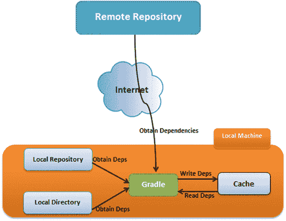
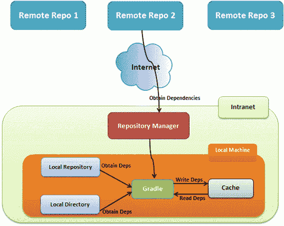
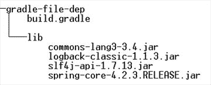
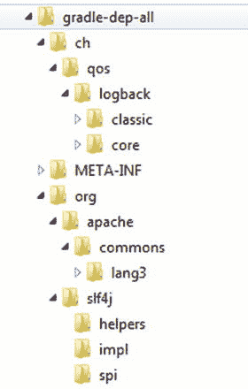

# 6. 依赖管理

软件项目很少是孤立构建的。它们要么依赖于内部项目，要么依赖于其他开源库。本章将探讨 Gradle 如何帮助你有效管理这些依赖项。你将学习不同类型的依赖项，以及如何对依赖项进行分组和解决依赖冲突。你还将回顾存储制品的仓库。

## 声明式依赖管理

假设你希望在应用程序中使用 Logback（[`http://logback.qos.ch`](http://logback.qos.ch/)）进行日志记录。一种直接的方法是从 Logback 网站下载 `logback.jar` 文件并将其添加到项目中。在使用 IDE 或 ANT 构建项目时，这曾是一种相当常见的做法。然而，这种方法存在一些问题：

*   下载的 JAR 文件可能依赖于其他几个库。这种依赖关系被称为传递性依赖。更麻烦的是，传递性依赖可能还有自己的依赖关系。你需要花时间找出所有这些依赖关系，并下载它们以供项目使用。
*   传递性依赖之间可能存在版本冲突。假设你的项目依赖于 JAR A 和 B。如果 A 依赖于 JAR C 的 1.0.0 版本，而 B 依赖于 C 的 2.0.0 版本，你需要手动解决这个冲突。
*   下载的 JAR 文件必须检入版本控制系统或放置在共享驱动器上，以便项目可以在其他开发人员的机器上或持续集成服务器上构建。将 JAR 文件检入 VCS 不被视为最佳实践。这种方法在处理频繁变更的工作副本（在 Maven 中称为快照版本）时尤其困难。
*   升级变得非常困难，你必须重复整个手动过程。
*   在团队之间共享内部开发的 JAR 文件变得困难。

为了解决 ANT 的这些固有问题，Maven 提出了声明式依赖管理。使用这种方法，你告诉 Maven 你需要什么（通常是在外部配置文件中）。Maven 会自动找出在哪里以及如何获取这些依赖项，并将它们交给你的项目。后来，Ant 提供了与另一个名为 Apache Ivy 的依赖管理工具的集成。Gradle 提供了自己的依赖管理实现，但也支持 Maven 和 Ivy 仓库。

图 6-1 提供了 Gradle 依赖管理的高级视图。Gradle 与仓库交互以检索依赖项及其关联的元数据。通过网络访问的仓库被视为远程仓库，通常由第三方维护。Gradle 还可以与本地机器上的仓库以及包含 JAR 文件的目录进行交互。获取依赖项后，Gradle 会将其存储在缓存中。默认情况下，缓存位于本地机器上的 `<<USER_HOME>>/.gradle`。在 Windows 上，它将是 `C:\Users\<<user_name>>\.gradle`。然后，Gradle 在项目构建、测试或打包期间检索这些依赖项。拥有本地缓存可以减少远程仓库的负载并提高构建速度。

图 6-1.

Gradle 依赖管理提示

你可以通过设置环境变量 `GRADLE_USER_HOME` 并将其指向一个新目录，将默认的 Gradle 主目录从 `.gradle` 更改为其他位置。

尽管图 6-1 中的架构适用于小型项目，但在企业环境中会带来一些严重问题。通过互联网访问的远程仓库可能会宕机，或者在高流量情况下变得无响应，从而导致构建速度急剧下降。许可和知识产权问题可能会阻止团队在公共仓库中发布其内部工件，从而难以轻松共享。为了解决这些问题，大多数企业选择图 6-2 所示的架构。

图 6-2.

使用仓库管理器的依赖管理

内部仓库管理器充当远程仓库的代理并缓存工件。这确保了即使远程仓库宕机或过时，构建也是可重复的。仓库管理器还允许你推送和共享公司内部的工件。有几种开源和商业仓库管理器可用，例如 Sonatype Nexus、Apache Archiva 和 Artifactory。

## 依赖配置

考虑前面使用 Logback 进行日志记录的示例。源代码将包含使用 Logback 类和 API 的日志语句。为了编译项目代码，你需要在类路径中提供 Logback JAR。此外，为了让应用程序在 Tomcat 等容器中运行，你需要将 Logback JAR 打包到生成的 WAR 工件中。现在考虑同一个项目使用 JUnit 进行单元测试。JUnit JAR 文件仅在运行单元测试时需要，并且不需要打包到生成的 WAR 工件中。如果 Web 应用程序包含 Java Servlet，则在代码编译期间需要 Servlet API JAR。由于 Tomcat 等容器在运行时使此 API JAR 在类路径上可用，因此你无需将其打包到 WAR 文件中。

这些示例表明需要在构建的某些阶段拥有特定的依赖项集合。Gradle 提供了配置，使你可以轻松实现这一点。配置是依赖项的逻辑分组。例如，你可以有一个 `compile` 配置，其中包含代码编译期间所需的所有依赖项。Java 插件开箱即用地声明了以下六种配置：

*   `compile`——包含在代码编译期间添加到类路径的依赖项。在 Web 项目中，Hibernate 和 Spring 等依赖项在 `compile` 配置中声明。
*   `runtime`——包含在代码执行期间使用的依赖项。例如，MySQL 驱动程序等数据库驱动程序在 `runtime` 配置中声明。
*   `testCompile`——包含在测试代码编译期间成为类路径一部分的依赖项。JUnit 和 TestNG 等测试框架是在此配置中声明的库的典型示例。
*   `testRuntime`——包含在测试代码执行期间使用的依赖项。HSQLDB 或 H2 等嵌入式数据库是在此配置中声明的库的示例。
*   `archives`——包含项目生成的工件。考虑一个生成额外工件的 Java 项目，例如包含源代码的 JAR 文件和包含 Javadoc API 的 ZIP 文件。这些工件在此配置中声明。你将在第 8 章中了解更多关于 archives 配置的信息。
*   `default`——此配置通常出现在多项目设置中，其中一个项目的构建依赖于另一个子项目的构建。假设项目 A 将项目 B 声明为其依赖项。默认情况下，项目 B 的 `default` 配置中的所有工件都将包含在项目 A 中。`default` 配置扩展了 `runtime` 配置，因此包含项目运行时中声明的所有工件和依赖项。

依赖配置可以扩展其他配置。例如，`runtime` 配置扩展了 `compile` 配置。这意味着在 `compile` 配置中声明的所有依赖项都将在 `runtime` 配置中可用。表 6-1 显示了六种 Java 插件配置及其扩展的配置。

表 6-1.

配置继承关系

| 配置名称 | 扩展自 |
| --- | --- |
| `compile` | `无` |
| `runtime` | `compile` |
| `testCompile` | `compile` |
| `testRuntime` | `runtime, testCompile` |
| `archives` | 无 |
| `default` | `runtime` |

### 处理依赖关系

在开始声明和使用依赖之前，理解不同类型的依赖关系至关重要。表 6-2 展示了 Gradle 提供的依赖类型。

表 6-2. Gradle 依赖类型

| 依赖类型 | 描述 |
| --- | --- |
| 外部模块依赖 | 对仓库中某个库的依赖。例如，对 Maven Central 中的 Logback JAR 的依赖就属于此类型。 |
| 项目依赖 | 对某个 Gradle 项目的依赖。 |
| 文件依赖 | 对本地机器上文件的依赖。 |
| 客户端模块依赖 | 对外部模块的依赖，该模块位于外部仓库中，但其对应的元数据在构建文件中指定。 |
| Gradle API 依赖 | 对 Gradle API 的依赖。在第 5 章的插件开发中，你已经见过这种依赖类型。 |
| 本地 Groovy 依赖 | 对作为已安装 Gradle 一部分的 Groovy 库的依赖。 |

在本章中，你将学习使用三种依赖类型：外部模块依赖、文件依赖和项目依赖。你可以在构建文件中使用 `dependencies` 闭包来声明依赖，如下所示：

`dependencies {`

    `<依赖配置> 依赖 1, 依赖 2....`

`}`

### 外部模块依赖

顾名思义，外部模块依赖指的是对当前项目结构之外制品的依赖。这种类型的依赖使用以下坐标来指定：

*   `group` — 负责该项目的组或组织的标识符。例如 `org.springframework` 和 `org.hibernate`。
*   `name` — 制品的名称。例如 `spring-beans` 和 `hibernate-core`。
*   `version` — 制品的版本。例如 1.0.0 和 4.2.0。
*   `classifier` — 附加到制品上的额外字段。例如，同一个制品可以为两个 JDK 版本发布，可以使用分类器来选择正确的版本。

这些依赖可以在 `build.gradle` 文件中使用以下格式声明：

`group: 'GROUP_NAME', name: 'ARTIFACT_NAME', version: 'VERSION_NUMBER'`

Gradle 还提供了以下声明依赖的快捷格式：

`GROUP_NAME:ARTIFACT_NAME:VERSION_NUMBER`

为了实际演示外部模块依赖，在你的本地机器上创建一个新文件夹 `gradle_dep`。创建一个 `build.gradle` 文件，并复制清单 6-1 中的内容。这个示例使用快捷记法为编译配置添加了两个依赖。请注意，多个依赖之间用逗号 (`,`) 分隔。它还使用 `ArrayList` 记法声明了两个额外的 `testCompile` 依赖。同时请注意 `repositories` 块。你将在本章后面学习仓库的相关内容，所以现在可以先忽略它。

清单 6-1. 包含依赖的 build.gradle 文件

`apply plugin: 'java'`

`dependencies {`

`compile 'ch.qos.logback:logback-classic:1.1.2', 'org.apache.commons:commons-lang3:3.4'`

`testCompile (`

`[group: 'junit', name: 'junit', version: '4.12'],`

`[group: 'org.hsqldb', name: 'hsqldb', version: '2.3.3']`

`)`

`}`

`repositories {`

`mavenCentral()`

`}`

Gradle 提供了一个内置的 `dependencies` 任务，可以用来查看已声明的依赖及其传递性依赖。运行命令 `gradle dependencies` 将显示类似如下的输出：

`\chapter` `6` `\gradle-dep>gradle dependencies`

`.................`

`compile - 为源集 'main' 编译的类路径。`

`Download` [`https://repo1.maven.org/maven2/org/apache/commons/commons-lang3/3.4/com`](https://repo1.maven.org/maven2/org/apache/commons/commons-lang3/3.4/com)

`mons-lang3-3.4.pom`

`Download` [`https://repo1.maven.org/maven2/org/apache/commons/commons-parent/37/com`](https://repo1.maven.org/maven2/org/apache/commons/commons-parent/37/com)

`mons-parent-37.pom`

`Download` [`https://repo1.maven.org/maven2/org/apache/apache/16/apache-16.pom`](https://repo1.maven.org/maven2/org/apache/apache/16/apache-16.pom)

`Download` [`https://repo1.maven.org/maven2/org/slf4j/slf4j-api/1.7.6/slf4j-api-1.7`](https://repo1.maven.org/maven2/org/slf4j/slf4j-api/1.7.6/slf4j-api-1.7) `.`

`6.pom`

`Download` [`https://repo1.maven.org/maven2/org/slf4j/slf4j-parent/1.7.6/slf4j-paren`](https://repo1.maven.org/maven2/org/slf4j/slf4j-parent/1.7.6/slf4j-paren)

`t-1.7.6.pom`

`+--- ch.qos.logback:logback-classic:1.1.2`

`|    +--- ch.qos.logback:logback-core:1.1.2`

`|    \--- org.slf4j:slf4j-api:1.7.6`

`\--- org.apache.commons:commons-lang3:3.4`

`....................`

`testCompile - 为源集 'test' 编译的类路径。`

`Download` [`https://repo1.maven.org/maven2/org/hsqldb/hsqldb/2.3.3/hsqldb-2.3.3.pom`](https://repo1.maven.org/maven2/org/hsqldb/hsqldb/2.3.3/hsqldb-2.3.3.pom)

`+--- ch.qos.logback:logback-classic:1.1.2`

`|    +--- ch.qos.logback:logback-core:1.1.2`

`|    \--- org.slf4j:slf4j-api:1.7.6`

`+--- org.apache.commons:commons-lang3:3.4`

`+--- junit:junit:4.12`

`|    \--- org.hamcrest:hamcrest-core:1.3`

`\--- org.hsqldb:hsqldb:2.3.3`

`................`

从输出中你会注意到，由于配置继承，所有编译时依赖在运行时也是可用的。现在，你可以在项目中使用这些库提供的 Java 类/API 了。

在包含大量依赖的项目中，建议将依赖版本提取到属性中。这使得在升级期间可以轻松地快速识别制品版本或更改它们。清单 6-2 展示了修改后的 `build.gradle` 文件，其中版本号被提取到 `ext` 闭包内的项目级属性中。依赖声明被修改为使用包含版本表达式的 GString。在运行时，这些表达式将被替换为正确的版本值。

清单 6-2. 包含属性的 build.gradle 文件

`apply plugin: 'java'`

`ext {`

`logbackVersion = '1.1.2'`

`commonsLangVersion = '3.4'`

`junitVersion = '4.12'`

`hsqlDbVersion = '2.3.3'`

`}`

`dependencies {`

`compile "ch.qos.logback:logback-classic:$logbackVersion", "org.apache.commons:commons-lang3:$commonsLangVersion"`

`testCompile (`

`[group: 'junit', name: 'junit', version: "$junitVersion"],`

`[group: 'org.hsqldb', name: 'hsqldb', version: "$hsqlDbVersion"]`

`)`

`}`

`repositories {`

`mavenCentral()`

`}`

在包含大量依赖的项目中，你还会遇到另一个常见问题：在多个地方重复相同的组和版本号。例如，考虑一个使用 3.0 版本 Spring Framework 库（如 `spring-core`、`spring-aop`、`spring-beans`、`spring-jdbc` 和 `spring-context`）的 Java 项目。清单 6-3 展示了 `build-common-group.gradle` 文件，演示了解决此重复问题的一种方法。制品名称被分组到一个列表中。代码遍历该列表，将每个依赖注册为编译时配置。你可以使用命令 `gradle -b build-common-group.gradle dependencies` 运行此构建脚本。

清单 6-3. build-common-group.gradle 文件

`apply plugin: 'java'`

`ext { springVersion = '3.0.0.RELEASE' }`

`dependencies {`

`['spring-core', 'spring-aop','spring-beans', 'spring-jdbc', 'spring-context'].each {`

`compile "org.springframework:$it:$springVersion"`

`}`

`}`

`repositories {`

`mavenCentral()`

`}`

### 文件依赖

大多数遗留项目在其项目的 `lib` 文件夹或共享驱动器上的文件夹中包含依赖项。Gradle 的文件依赖类型允许您直接在项目中使用此类文件。这种类型在遗留项目迁移或当您没有私有仓库来托管内部库时特别有用。

为了更好地理解文件依赖类型，让我们创建一个名为 `gradle-file-dep` 的新项目。在您的文件系统上创建 `gradle-file-dep` 文件夹和一个空的 `build.gradle` 文件。在此文件夹内，创建一个 `lib` 子文件夹，并向其中放入几个 JAR 文件。表 6-3 列出了您将使用的 JAR 文件以及从互联网下载它们的链接。

表 6-3.

lib 文件夹内的 JAR 文件

| JAR 文件 | 下载 URL |
| --- | --- |
| `logback-classic-1.1.3.jar` | [`http://search.maven.org/remotecontent?filepath=ch/qos/logback/logback-classic/1.1.3/logback-classic-1.1.3.jar`](http://search.maven.org/remotecontent?filepath=ch/qos/logback/logback-classic/1.1.3/logback-classic-1.1.3.jar) |
| `commons-lang3-3.4.jar` | [`http://search.maven.org/remotecontent?filepath=org/apache/commons/commons-lang3/3.4/commons-lang3-3.4.jar`](http://search.maven.org/remotecontent?filepath=org/apache/commons/commons-lang3/3.4/commons-lang3-3.4.jar) |
| `spring-core-4.2.3.RELEASE.jar` | [`http://search.maven.org/remotecontent?filepath=org/springframework/spring-core/4.2.3.RELEASE/spring-core-4.2.3.RELEASE.jar`](http://search.maven.org/remotecontent?filepath=org/springframework/spring-core/4.2.3.RELEASE/spring-core-4.2.3.RELEASE.jar) |
| `slf4j-api-1.7.13.jar` | [`http://search.maven.org/remotecontent?filepath=org/slf4j/slf4j-api/1.7.13/slf4j-api-1.7.13.jar`](http://search.maven.org/remotecontent?filepath=org/slf4j/slf4j-api/1.7.13/slf4j-api-1.7.13.jar) |

此时，项目应具有如图 6-3 所示的目录结构。

图 6-3.

gradle-file-dep 文件夹结构

将文件作为依赖项添加到项目涉及向 Gradle 传递一个文件集合。顾名思义，文件集合就是一组文件。处理文件集合的最简单方法是使用 `Project.files()` 方法。此方法接受可变数量的对象作为参数，并尝试将它们转换为 `java.io.File` 实例的集合。清单 6-4 显示了 `build.gradle` 文件，其中向 `compile` 配置添加了两个文件依赖项。

清单 6-4\. 包含两个文件依赖项的 build.gradle

`apply plugin: 'java'`

`dependencies {`

`compile files ("lib/logback-classic-1.1.3.jar", "lib/commons-lang3-3.4.jar")`

`}`

有时，您可能希望包含文件夹中的所有文件或子集，而不是将每个文件都列为依赖项。您可以使用项目的 `fileTree` 方法来实现这一点。文件树表示文件的层次结构，例如 `directory`。清单 6-5 显示了更新后的 `build.gradle` 文件，该文件将 `lib` 目录中的所有 JAR 文件添加到 `compile` 配置中。

清单 6-5\. 使用文件树的文件依赖类型

`apply plugin: 'java'`

`dependencies {`

`compile fileTree (dir : "lib", include: "*.jar")`

`}`

文件依赖项不包含在项目的依赖描述符中。因此，运行 `gradle dependencies` 命令不会在控制台上列出文件依赖项的 JAR。要查看这些 JAR，请将清单 6-6 中所示的 `displayJars` 任务附加到 `build.gradle` 文件中。该任务使用 `collect()` 方法遍历 `compile` 配置中的所有依赖项并打印它们的名称。

清单 6-6\. displayJars 任务

`task displayJars << {`

`println "${configurations.compile.collect {File f -> f.name}}"`

`}`

使用命令提示符，在 `project` 文件夹内运行 `gradle -q displayJars` 命令。您应该会看到以下输出：

`\gradle-file-dep>gradle -q displayJars`

`[commons-lang3-3.4.jar, logback-classic-1.1.3.jar, slf4j-api-1.7.13.jar, spring-`

`core-4.2.3.RELEASE.jar]`

### 项目依赖

复杂的企业项目通常被拆分为更小的项目。例如，一个在线应用程序可能被分解为三个独立的项目——一个包含 UI 相关资源和组件的 Web 项目、一个包含后端服务的服务项目，以及一个包含用于访问数据库后端的仓库/DAO 代码的仓库项目。在这种情况下，Web 项目依赖于服务项目，而服务项目又依赖于仓库项目。Gradle 提供了项目依赖类型来建立此类依赖关系。

项目依赖可以使用项目的 `project()` 方法来声明，该方法接受被依赖项目的名称。清单 6-7 展示了一个“web”项目依赖于 `service` 项目的示例。冒号 (`:`) 字符表示项目层次结构。因此，字符串 `":service"` 表示服务项目位于根目录下一级。

清单 6-7\. 项目依赖类型

`dependencies {`

    `compile project (":service")`

`}`

通过此项目依赖，Gradle 会将生成的 `service.jar` 工件作为依赖项包含在 Web 项目中。此外，服务项目的依赖项及其传递依赖项也会作为 Web 项目的依赖项添加。您将在第 7 章中更详细地了解项目依赖项，并附有示例。

## 解决依赖冲突

假设有一个名为 `transitive-dep` 的 Gradle 项目，它使用了 Spring Core 库（`spring-core.jar`）和 Apache HttpClient（`httpclient.jar`）。清单 6-8 展示了该项目的 `build.gradle` 文件，其中包含两个编译时依赖项。

**清单 6-8\. 版本冲突示例**

`apply plugin: 'java'`

`dependencies {`

`compile 'org.springframework:spring-core:4.2.2.RELEASE', 'org.apache.httpcomponents:httpclient:4.0'`

`}`

`repositories {`

`mavenCentral()`

`}`

Spring Core 和 HttpClient 库都使用 Apache Commons Logging 作为其底层日志框架。然而，Spring Core 4.2.2 版本使用的是 Commons Logging 1.2 版本，而 HttpClient 4.0 版本使用的是 Commons Logging 1.1 版本。当出现此类版本冲突时，Gradle 默认会使用传递依赖的最新版本。`gradle dependencies` 命令的输出展示了这种解析策略：

`\chapter` `6` `\transitive-dep>gradle dependencies`

`----------`

`compile - Compile classpath for source set 'main'.`

`+--- org.springframework:spring-core:4.2.2.RELEASE`

`|    \--- commons-logging:commons-logging:1.2`

`\--- org.apache.httpcomponents:httpclient:4.0`

`+--- org.apache.httpcomponents:httpcore:4.0.1`

`+--- commons-logging:commons-logging:1.1.1 -> 1.2`

`\--- commons-codec:commons-codec:1.3`

有时，您可能不希望 Gradle 选择最新的 JAR 文件。在这种情况下，您可以更改默认的解析策略，强制 Gradle 包含特定版本。清单 6-9 展示了实现此目的的修改后的 `build.gradle` 文件。`configurations{}` 块允许您配置项目的依赖配置行为。然后，您将 `resolutionStrategy` 块应用于所有配置。最后，您使用 `force` 方法强制使用 1.1.1 版本的 commons-logging 依赖项。

**清单 6-9\. 强制依赖项的解析策略**

`apply plugin: 'java'`

`configurations.all {`

`resolutionStrategy {`

`force 'commons-logging:commons-logging:1.1.1'`

`}`

`}`

`dependencies {`

`compile 'org.springframework:spring-core:4.2.2.RELEASE', 'org.apache.httpcomponents:httpclient:4.0'`

`}`

`repositories {`

`mavenCentral()`

`}`

在修改后的 `build.gradle` 上运行 `gradle dependencies` 命令，可以看到 1.1.1 版本被选中，而不是 1.2 版本：

`default - Configuration for default artifacts.`

`+--- org.springframework:spring-core:4.2.2.RELEASE`

`|    \--- commons-logging:commons-logging:1.2 -> 1.1.1`

`\--- org.apache.httpcomponents:httpclient:4.0`

`+--- org.apache.httpcomponents:httpcore:4.0.1`

`+--- commons-logging:commons-logging:1.1.1`

`\--- commons-codec:commons-codec:1.3`

尽管传递依赖很有用，但它们也可能导致问题及不可预测的副作用，因为项目中最终可能会包含错误版本的 JAR 包。为了主动排查版本冲突问题，您可以让 Gradle 在发现版本冲突时构建失败。您可以使用 `failOnVersionConflict` 方法更改默认的解析策略，使其在版本冲突时失败。清单 6-10 展示了使用 `failOnVersionConflict()` 方法的修改后的 `build.gradle` 文件。

**清单 6-10\. 冲突时失败的解析策略**

`apply plugin: 'java'`

`configurations.all {`

`resolutionStrategy {`

`failOnVersionConflict()`

`}`

`}`

`dependencies {`

`compile 'org.springframework:spring-core:4.2.2.RELEASE', 'org.apache.httpcomponents:httpclient:4.0'`

`}`

`repositories {`

`mavenCentral()`

`}`

在命令行中运行 `gradle dependencies` 命令，您将看到一个失败报告：

`FAILURE: Build failed with an exception.`

`* What went wrong:`

`Execution failed for task ':dependencies'.`

`> Could not resolve all dependencies for configuration ':compile'.`

`>``A conflict was found between the following modules:`

`- commons-logging:commons-logging:1.2`

`- commons-logging:commons-logging:1.1.1`

## 仓库

如本章开头所述，仓库包含依赖项及其相关的元数据。Gradle 开箱即用即可支持 Maven、Ivy 和本地目录仓库。它还提供了一些预配置的仓库，方便您与常用仓库进行交互。`mavenCentral()` 仓库就是这样一个预配置的仓库，它指向 Maven 的中央仓库 `https://repo1.maven.org/maven2`。清单 6-11 展示了与 Maven Central 交互所需的配置。`repositories` 块用于配置项目中使用的仓库。

**清单 6-11\. Maven Central 仓库配置**

`repositories {`

`mavenCentral()`

`}`

JCenter 是另一个流行的仓库，它托管工件于 [`https://bintray.com/bintray/jcenter`](https://bintray.com/bintray/jcenter)。清单 6-12 展示了与 JCenter 仓库交互的配置。

**清单 6-12\. JCenter 仓库配置**

`repositories {`

`jcenter()`

`}`

通常情况下，您的公司可能有一个内部的 Maven 仓库。Gradle 提供了一个 `maven()` 方法，可以轻松添加和配置 Maven 仓库。清单 6-13 展示了一个自定义 Maven 仓库的声明。对于需要身份验证的仓库，该配置允许您提供凭据。

**清单 6-13\. 自定义 Maven 仓库**

`apply plugin: 'java'`

`repositories {`

`maven {`

`url "http://your_repo.url"`

`credentials {`

`username 'user_name'`

`password 'pwd'`

`}`

`}`

`}`

在某些有限的情况下，您可能需要使用本地 Maven 仓库来检索依赖项。本地 Maven 仓库通常位于 `USER_HOME/.m2` 目录中。对于这些场景，Gradle 提供了另一个名为 `mavenLocal()` 的预配置仓库，如清单 6-14 所示。

**清单 6-14\. Maven 本地仓库**

`apply plugin: 'java'`

`repositories {`

`mavenLocal()`

`}`

在处理遗留项目时，您可能需要与位于本地目录中的库进行交互。Gradle 通过扁平目录仓库支持此类交互。这不应与 Maven 本地仓库混淆。Maven 本地仓库包含工件及其相关的元数据，例如 `pom.xml` 文件。然而，扁平目录只包含 JAR 文件，没有元数据。清单 6-15 展示了使用 `lib` 文件夹中 JAR 文件的配置。

**清单 6-15\. 扁平目录仓库**

`apply plugin: 'java'`

`repositories {`

`flatDir {`

`dirs 'lib'`

`}`

`}`

`dependencies {`

`compile name: 'commons-lang3', version : '3.4'`

`compile name: 'logback-classic', version: '1.1.3'`

`}`

使用扁平目录仓库时，您需要使用工件的 `name` 和 `version` 属性来声明依赖项。清单 6-15 使用 `name` 和 `version` 属性声明了 `commons-lang3` 库。在构建过程中，Gradle 会在 `lib` 目录中查找名为 `commons-lang3-3.4.jar` 的 JAR 文件。如果仅使用 `name` 属性声明 `logback-classic` 库，Gradle 会在 `lib` 文件夹中查找名为 `logback-classic.jar` 的 JAR 文件。

与前面章节讨论的文件依赖项不同，来自扁平目录仓库的依赖项会包含在项目的依赖描述符中。要验证此配置，请在 `gradle-file-dep` 项目中创建一个 `build-file-repository.gradle` 文件，并复制清单 6-15 的内容。在项目中运行 `gradle -b build-file-repository.gradle dependencies` 命令，它将列出以下依赖项：

`compile - Compile classpath for source set 'main'.`

`+--- :commons-lang3:3.4`

`\--- :logback-classic:1.1.3`

## 创建 Uber JAR

对于 Java 项目，Gradle 会生成一个包含编译后的类以及 `src/main/resources` 文件夹中其他资源的 JAR 文件。但是，在某些场景下，您可能希望将 Java 应用程序作为包含所有依赖 JAR 的自包含应用程序进行分发。一种常见的打包技术是创建“uber”或“fat”JAR。在本节中，您将为本章中构建的 `gradle-dep` 项目生成一个 uber JAR。

要构建 uber JAR，您将使用一个名为 Shadow 的开源插件。该插件在 Gradle 插件门户上的页面 [`https://plugins.gradle.org/plugin/com.github.johnrengelman.shadow`](https://plugins.gradle.org/plugin/com.github.johnrengelman.shadow) 提供了一个使用该插件的脚本片段（如清单 6-16 所示）。

**清单 6-16\. Shadow 插件片段**

`buildscript {`

  `repositories {`

    `maven {`

      `url "` [`https://plugins.gradle.org/m2/`](https://plugins.gradle.org/m2/) `"`

    `}`

  `}`

  `dependencies {`

    `classpath "com.github.jengelman.gradle.plugins:shadow:1.2.2"`

  `}`

`}`

`apply plugin: "com.github.johnrengelman.shadow"`

清单 6-16 中的 `buildscript` 块允许您使用像 Shadow 这样的第三方插件。在该块内部，您声明了位于 [`https://plugins.gradle.org/m2/`](https://plugins.gradle.org/m2/) 的 Gradle 插件 Maven 仓库。随后是一个 `dependencies` 块，您在其中将插件 JAR 添加到构建脚本的类路径中。

将清单 6-16 中的片段附加到 `gradle-dep` 项目的 `build.gradle` 文件末尾。清单 6-17 展示了您将使用的完整 `build.gradle` 文件。

**清单 6-17\. 包含 Shadow 插件的构建脚本**

`apply plugin: 'java'`

`ext {`

    `logbackVersion = '1.1.2'`

    `commonsLangVersion = '3.4'`

    `junitVersion = '4.12'`

    `hsqlDbVersion = '2.3.3'`

`}`

`dependencies {`

    `compile "ch.qos.logback:logback-classic:$logbackVersion", "org.apache.commons:commons-lang3:$commonsLangVersion"`

    `testCompile (`

        `[group: 'junit', name: 'junit', version: "$junitVersion"],`

                                    `[group: 'org.hsqldb', name: 'hsqldb', version: "$hsqlDbVersion"]`

    `)`

`}`

`repositories {`

    `mavenCentral()`

`}`

`buildscript {`

    `repositories {`

        `maven {`

            `url "` [`https://plugins.gradle.org/m2/`](https://plugins.gradle.org/m2/) `"`

        `}`

    `}`

    `dependencies {`

        `classpath "com.github.jengelman.gradle.plugins:shadow:1.2.2"`

    `}`

`}`

`apply plugin: "com.github.johnrengelman.shadow"`

在 `gradle-dep` 项目中运行 `gradle shadowJar` 命令，您应该会看到以下输出：

`\chapter` `6` `\gradle-dep>gradle shadowJar`

`:compileJava UP-TO-DATE`

`:processResources UP-TO-DATE`

`:classes UP-TO-DATE`

`:shadowJar`

`BUILD SUCCESSFUL`

任务成功完成后，导航到项目下的 `build/libs` 文件夹，您应该会看到一个 `gradle-dep-all.jar`。该 JAR 文件应包含来自 Logback 和 Apache Commons Lang 的类，如图 6-4 所示。

**图 6-4\. 提取的 gradle-dep-all 目录结构**

## 摘要

项目通常依赖于内部或第三方库。Gradle 为声明和管理这些依赖提供了出色的支持。本章回顾了声明式依赖的基础知识，并学习了如何使用依赖配置对依赖进行分组。你还了解了三种依赖类型——外部模块、文件和项目。外部模块依赖使用 `group`、`name` 和 `version` 属性声明，而文件依赖则使用其名称声明。接着，本章回顾了 Gradle 如何解决依赖冲突以及如何配置解决策略。最后，你了解了仓库在依赖管理中的作用以及 Gradle 支持的几种仓库类型。

下一章将介绍 Gradle 对多项目的支持。

