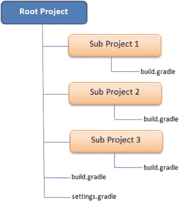
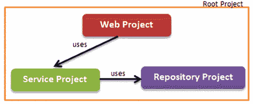
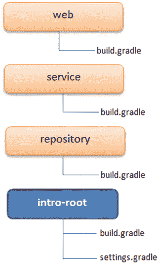

# 7. 多项目构建

复杂的企业项目通常被拆分为多个子项目，以简化开发、提高可维护性并增强复用性。本章将回顾多项目的结构和配置方式。你将构建一个示例多项目，以更好地理解 Gradle 的多项目支持。你将了解如何在根项目和子项目之间分发构建逻辑。你还将学习如何执行单个项目构建或完整项目构建，以及如何在项目之间声明依赖。

## 多项目结构

Gradle 通过允许在单个根 Gradle 项目下嵌套多个 Gradle 项目来支持复杂项目的开发。根项目允许你定义公共依赖和构建逻辑，而不是将其分散到各个项目中。根项目提供了一个对所有项目执行完整构建的单一位置，而无需单独构建每个子项目。分层结构的多项目布局如图 7-1 所示。

图 7-1.

标准分层多项目布局

根项目包含三个子项目文件夹、一个 `build.gradle` 文件和一个 `settings.gradle` 文件。每个子项目可以包含一个可选的 `build.gradle` 文件。为了更好地理解多项目构建以及 `settings.gradle` 文件的重要性，你将在下一节中了解如何实现一个示例多项目。

### 示例项目

此示例多项目由一个包含用户界面（WAR 工件）的 Web 子项目、一个包含服务层代码的服务项目（JAR 工件）以及一个包含持久层和实体代码的仓库项目（JAR 工件）组成。UI 层代码依赖服务层代码来完成 Web 请求。因此，Web 子项目依赖于服务子项目。服务层代码将所有持久化操作委托给仓库层。因此，服务子项目依赖于仓库子项目。图 7-2 直观地展示了这种依赖关系。

图 7-2.

示例项目依赖关系

首先，在你的本地机器上创建以下文件夹结构，开始实现示例多项目。

`intro-root`

      `web`

      `service`

      `repository`

`root` 项目是 `intro-root`，子项目是 `web`、`service` 和 `repository`。在 `root` 项目中创建一个空的 `build.gradle` 文件，并运行 `gradle projects` 命令。`projects` 任务是一个内置的 Gradle 任务，它以分层方式显示子项目。命令输出如下：

`\chapter` `7` `\intro-root>gradle projects`

`:projects`

`------------------------------------------------------------`

`Root project`

`------------------------------------------------------------`

`Root project 'intro-root'`

`No sub-projects`

`To see a list of the tasks of a project, run gradle <project-path>:tasks`

`For example, try running gradle :tasks`

`BUILD SUCCESSFUL`

从输出中可以看到，Gradle 找到了根项目 `intro-root`，但没有在其中找到任何子项目。这就是 `settings.gradle` 发挥作用的地方。在此文件中，你需要指定 Gradle 在构建中需要包含的子项目。让我们通过在 `intro-root` 文件夹内创建一个 `settings.gradle` 文件来修复构建。然后，使用 `include` 方法添加三个子项目，如下所示。`include` 方法将子项目目录名称作为其参数。

`include 'web', 'service', 'repository'`

运行 `gradle projects` 命令后，你将看到 Gradle 检测到了所有四个项目（包括根项目）：

`\chapter` `7` `\intro-root>gradle projects`

`:projects`

`------------------------------------------------------------`

`Root project`

`------------------------------------------------------------`

`Root project 'intro-root'`

`+--- Project ':repository'`

`+--- Project ':service'`

`\--- Project ':web'`

`To see a list of the tasks of a project, run gradle <project-path>:tasks`

`For example, try running gradle :repository:tasks`

`BUILD SUCCESSFUL`

输出还显示了 Gradle 使用“`:`”来表示项目层次结构。例如，`:service` 表示服务项目位于根项目（隐式引用，无需名称）下一级。如果你的项目位于 `service/soap/util` 下，那么它将使用 `:service:soap:util` 来引用。

### 扁平布局

除了上一节中介绍的分层项目布局外，Gradle 还支持用于多项目开发的“扁平布局”。在这种组织结构中，所有项目都作为 `root` 项目的同级项目存在。图 7-3 展示了使用扁平布局组织的 `intro-root` 多项目。

图 7-3.

扁平布局中的 intro-root

为了熟悉扁平布局的组织项目方式，请重新创建 `intro-root` 示例应用程序。首先，在你的本地文件系统上创建一个名为 `flat-layout` 的文件夹。在此文件夹内，创建四个子文件夹——`web`、`service`、`repository` 和 `intro-root`。在 `intro-root` 下，创建一个空的 `build.gradle` 文件和一个空的 `settings.gradle` 文件。对于扁平布局，你需要使用 `includeFlat` 方法而不是 `include` 方法来包含项目。`includeFlat` 方法将子项目的目录名称作为其参数。将这些内容复制到 `settings.gradle` 文件中：

`includeFlat 'web', 'service', 'repository'`

使用命令提示符，导航到 `intro-root` 文件夹并运行 `gradle projects` 命令。你应该会看到类似如下的输出，Gradle 识别了所有项目：

`\chapter` `7` `\flat-layout\intro-root>gradle projects`

`:projects`

`------------------------------------------------------------`

`Root project`

`------------------------------------------------------------`

`Root project 'intro-root'`

`+--- Project ':repository'`

`+--- Project ':service'`

`\--- Project ':web'`

`To see a list of the tasks of a project, run gradle <project-path>:tasks`

`For example, try running gradle :repository:tasks`

`BUILD SUCCESSFUL`

选择分层布局还是扁平布局来组织项目纯粹是个人偏好。我们认为分层布局更加清晰，本章将使用“分层”的 `intro-root` 项目。

### 多项目构建 vs. 单项目构建

根项目的 `build.gradle` 文件可用于触发所有项目的完整构建。然而，子项目也可以包含一个可选的 `build.gradle` 文件。Gradle 允许你在任何这些子项目上执行独立构建。在这种情况下，只会构建该子项目及其依赖的项目。

那么，Gradle 如何判断一个构建是单项目构建还是更大规模多项目构建的一部分呢？为了做出这个判断，Gradle 会使用以下算法查找 `settings.gradle` 文件：

在当前目录中查找 `settings.gradle`。  
如果未找到 `settings.gradle`，则在当前目录同级嵌套的 `master` 目录下查找。  
如果仍未找到 `settings.gradle`，则在任何父目录中查找。

一旦找到 `settings.gradle` 文件，就会进行检查，以确定当前项目是否通过 `include` 或 `includeFlat` 方法被定义为多项目的一部分。如果条件满足，则构建将作为多项目构建执行。否则，该项目将作为单项目构建执行。

## 项目配置

多项目中的子项目通常包含一些通用的配置、任务和插件，这些可以迁移到根项目的 `build.gradle` 文件中。例如，所有项目可能共享相同的 `group` 和 `version` 属性。Gradle 提供了一个 `allprojects` 闭包块，允许你定义根项目和子项目共享的这些通用属性/行为。清单 7-1 展示了一个声明了 `group` 和 `version` 属性的 `allprojects` 块。

**清单 7-1. build.gradle 中的 allprojects 块**

`allprojects {`

    `group = "com.apress.gradle"`

    `version = "1.0.0-SNAPSHOT"`

`}`

类似地，如果所有子项目都是 Java 项目，它们都会应用 `java` 插件。它们也会共享通用的仓库，并可能共享少量依赖。为了定义这种特定于所有 `subprojects` 的行为，Gradle 提供了一个 `subprojects` 闭包块。清单 7-2 展示了一个包含 `java` 插件和 `mavenCentral()` 仓库声明的 `subprojects` 块。

**清单 7-2. build.gradle 中的 subprojects 闭包块**

`subprojects {`

     `apply plugin: 'java'`

     `repositories {`

          `mavenCentral()`

     `}`

`}`

> **注意**
>
> `allprojects` 块应用于声明适用于所有项目的属性/配置/任务。IDE 插件就是可以在 `allprojects` 部分内部声明的插件的一个很好的例子。

也可以在根项目的 `build.gradle` 文件中配置特定于单个子项目的行为。例如，你需要将 `war` 插件应用于 `web` 项目。你可以使用 `project()` 方法添加这种特定于项目的行为，然后将要配置的项目名称作为参数传递进去。清单 7-3 展示了将 `war` 插件应用于 `web` 项目的配置。

**清单 7-3. 特定于项目的行为**

`project(':web') {`

     `apply plugin: 'war'`

`}`

你可以应用本节到目前为止讨论的概念来创建 `intro-root` 的 `build.gradle` 文件，如清单 7-4 所示。它使用 `allprojects` 块来确保根项目和子项目共享相同的 `group` 和 `version` 编号。代码还使用了 `subprojects` 块来确保所有子项目从 Maven Central 获取其依赖。各个 `project` 块将 `java` 插件应用于 `service` 和 `repository` 项目，并将 `war` 插件应用于 `web` 项目。

**清单 7-4. Intro-Project 的 build.gradle 文件**

`allprojects {`

    `group = "com.apress.gradle"`

    `version = "1.0.0-SNAPSHOT"`

`}`

`subprojects {`

    `repositories {`

        `mavenCentral()`

    `}`

`}`

`project (':service') {`

    `apply plugin: 'java'`

`}`

`project (':repository') {`

    `apply plugin: 'java'`

`}`

`project(':web') {`

    `apply plugin: 'war'`

`}`

更新了 `intro-root` 项目的 `build.gradle` 文件后，运行 `gradle build` 命令，你将看到以下输出：

`\chapter` `7` `\intro-root>gradle build`

`:repository:compileJava UP-TO-DATE`

`:repository:processResources UP-TO-DATE`

`:repository:classes UP-TO-DATE`

`:repository:jar`

`.........................`

`:repository:build`

`:service:compileJava UP-TO-DATE`

`:service:processResources UP-TO-DATE`

`:service:classes UP-TO-DATE`

`:service:jar`

`:service:assemble`

`........................`

`:web:compileJava UP-TO-DATE`

`:web:processResources UP-TO-DATE`

`:web:classes UP-TO-DATE`

`:web:war`

`:web:assemble`

`.........................`

`:web:build`

`BUILD SUCCESSFUL`

从输出中可以看出，Gradle 默认按照子项目名称的字母数字升序执行它们。

## 项目依赖

正如你在图 7-2 中看到的，web 项目依赖于 service 项目，而 service 项目又依赖于 repository 项目。Gradle 提供了项目依赖类型来声明此类依赖。清单 7-5 展示了修改后的 `build.gradle` 部分，其中声明了这两个依赖。

**清单 7-5. build.gradle 中的项目依赖**

`allprojects {`

    `group = "com.apress.gradle"`

    `version = "1.0.0-SNAPSHOT"`

`}`

`subprojects {`

    `repositories {`

        `mavenCentral()`

    `}`

`}`

`project (':repository') {`

    `apply plugin: 'java'`

`}`

`project (':service') {`

    `apply plugin: 'java'`

    `dependencies {`

        `compile project(':repository')`

    `}`

`}`

`project(':web') {`

    `apply plugin: 'war'`

    `dependencies {`

        `compile project(':service')`

    `}`

`}`

如果你现在执行 `gradle build`，Gradle 将尝试先构建 repository 项目，然后是 service 项目，最后是 web 项目。输出应该类似于 Gradle 的默认输出。然而，如果你调整依赖关系，使得 web 依赖于 repository，而 repository 依赖于 service，那么运行 `gradle build` 将会在运行 repository 构建之前先构建 service JAR：

`\chapter` `7` `\intro-root>gradle build`

`:service:compileJava UP-TO-DATE`

`:service:processResources UP-TO-DATE`

`:service:classes UP-TO-DATE`

`:service:jar UP-TO-DATE`

`:repository:compileJava UP-TO-DATE`

`..............................`

`:repository:check UP-TO-DATE`

`:repository:build UP-TO-DATE`

`:service:assemble UP-TO-DATE`

`...............................`

`:web:compileTestJava UP-TO-DATE`

`:web:processTestResources UP-TO-DATE`

`:web:testClasses UP-TO-DATE`

`:web:test UP-TO-DATE`

`:web:check UP-TO-DATE`

`:web:build`

`BUILD` `SUCCESSFUL`

## 子项目构建文件

到目前为止，你一直在使用根项目的 `build.gradle` 文件来声明通用行为以及特定于项目的行为，从而无需在每个子项目中单独创建 `build.gradle` 文件。对于大型项目，这种做法会导致单个 `build.gradle` 文件变得复杂。为了便于维护，你可能希望将根项目的 `build.gradle` 文件限制为仅包含通用行为，并将其余配置拆分到各个子项目的构建文件中。

为了演示这一点，请在 `service` 项目下创建一个 `build.gradle` 文件，并复制清单 7-6 中所示的内容。然后，从根项目的 `build.gradle` 文件中移除 `project(':service'){}` 代码块。

清单 7-6\. 服务项目特定配置

`apply plugin: 'java'`

`dependencies {`

     `compile project(':repository')`

`}`

使用命令提示符，导航到 `service` 文件夹并运行 `gradle build` 命令。你将看到这会先触发 repository 的 JAR 构建，然后是 service 项目的构建：

`\chapter` `7` `\intro-root\service>gradle build`

`:repository:compileJava UP-TO-DATE`

`:repository:processResources UP-TO-DATE`

`:repository:classes UP-TO-DATE`

`:repository:jar UP-TO-DATE`

`:service:compileJava UP-TO-DATE`

`:service:processResources UP-TO-DATE`

`:service:classes UP-TO-DATE`

`:service:jar UP-TO-DATE`

`:service:assemble UP-TO-DATE`

`:service:compileTestJava UP-TO-DATE`

`:service:processTestResources UP-TO-DATE`

`:service:testClasses UP-TO-DATE`

`:service:test UP-TO-DATE`

`:service:check UP-TO-DATE`

`:service:build UP-TO-DATE`

`BUILD SUCCESSFUL`

## 本章小结

在本章中，你学习了 Gradle 多项目构建的复杂性。你了解了两种项目结构类型——层次结构和扁平结构。你学习了 `allprojects`、`subprojects` 和 `project` 代码块，它们允许你将构建逻辑放置在正确的位置以提高可维护性。然后，你学习了如何在项目之间声明依赖关系。最后，你回顾了如何触发完整构建和子项目构建。

在下一章中，你将学习 Gradle 对将生成的工件发布到仓库的支持。

