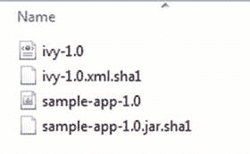
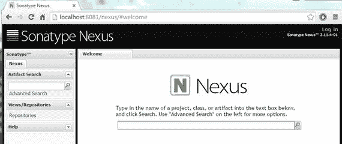
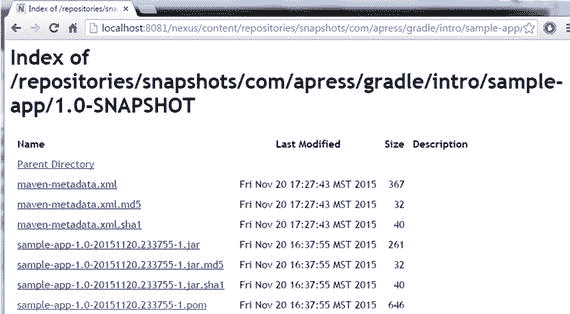
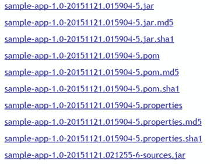
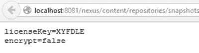
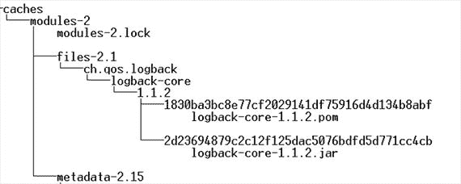
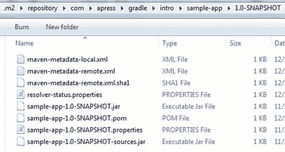

# 8. 发布工件

为了共享内部开发的框架和库，开发者需要将它们发布到仓库。在本章中，你将使用 Gradle 将工件发布到本地文件系统和远程仓库。

## 发布到本地仓库

你处理的项目通常会生成一个或多个工件，例如 JAR、WAR 或 ZIP 文件。Gradle 提供了一个 `archives` 配置，可用于声明项目产生的工件。Java 项目默认会生成一个 JAR 文件，因此 Java 插件会自动将生成的 JAR 关联到 `archives` 配置。类似地，`War` 插件会将生成的 WAR 分配给此配置。Gradle 提供了一个 `uploadArchives` 任务，可用于将这些工件发布到仓库。

为了更好地理解发布过程，你将创建一个名为 `sample-app` 的空 Java 应用程序。为此，在你的文件系统上创建一个名为 `sample-app` 的新文件夹。然后创建一个 `build.gradle` 文件，并复制清单 8-1 的内容。

清单 8-1\. sample-app 的 build.gradle 文件

`apply plugin: 'java'`

`version = 1.0`

`uploadArchives {`

    `repositories {`

      `flatDir { dirs "../repo" }`

    `}`

`}`

`uploadArchives` 任务中的 `repositories` 闭包允许你配置工件应发布到的位置。清单 8-1 要求 Gradle 将生成的工件发布到文件系统上与 `sample-app` 文件夹同级的 `repo` 文件夹中。要执行发布，请运行以下 `uploadArchives` 任务：

`\chapter` `8` `\sample-app>gradle uploadArchives`

成功执行后，你将看到一个创建的 `repo` 文件夹及其内容，如图 8-1 所示。

图 8-1.

repo 文件夹的内容

Gradle 默认使用 `projectname-version.type` 格式作为生成的文件名。因此，生成的工件被命名为 `sample-app-1.0.jar`。此外，Gradle 会生成一个 `ivy.xml` 配置文件并将其添加到 `repo` 文件夹中。

这个已发布的工件现在可以被其他项目访问。如第 6 章所述，一种直接的方法是将此文件夹声明为“扁平目录仓库”，并将 `sample-app` 添加为依赖项。

## 发布到 Maven 仓库

为了发布到 Maven 仓库，你需要一个 `pom.xml` 配置文件以及工件。项目对象模型（即 `pom.xml` 文件）描述了工件，并包含依赖项和插件等信息。Gradle 提供了一个 Maven 插件，可以简化到 Maven 仓库的部署，并能自动生成 `pom.xml` 文件。

在开始发布到 Maven 仓库之前，你需要访问一个仓库管理器，例如 Artifactory ( [`www.jfrog.com/artifactory/`](http://www.jfrog.com/artifactory/) ) 或 Nexus ( [`www.sonatype.org/nexus/go/`](http://www.sonatype.org/nexus/go/) )。仓库管理器管理仓库，充当公共仓库的代理，并支持对企业中使用的工件进行治理。在下一节中，你将学习如何在本地机器上安装 Nexus，这是一个来自 Sonatype 的流行的开源仓库管理器。

### 安装 Nexus

Nexus 以归档文件形式分发，并捆绑了一个 Jetty 实例。从 Sonatype 的网站 [`www.sonatype.org/nexus/go/`](http://www.sonatype.org/nexus/go/) 下载 Nexus 发行版（Windows 使用 `.zip` 版本）。在撰写本文时，可用的 Nexus 版本是 2.11.4-01。解压文件并将其内容放置在你的机器上。本书中的代码假定内容位于 `C:\tools\nexus` 文件夹中。

以管理员模式启动命令行，并导航到位于 `C:\tools\nexus\nexus-2.11.4-01` 的 `bin` 文件夹。要启动 Nexus，请运行以下命令：

`nexus console`

默认情况下，Nexus 运行在 8081 端口。启动 Web 浏览器并导航到 Nexus 的地址 `http://localhost:8081/nexus`。图 8-2 显示了 Nexus 的启动画面。使用右上角的“登录”链接登录应用程序。Nexus 的默认登录用户名和密码是 `admin` 和 `admin123`。

图 8-2.

Nexus 索引页面

### 构建配置

现在你已经运行了 Nexus 仓库管理器，下一步是修改 `build.gradle` 文件。清单 8-2 展示了更新后的 `build.gradle` 文件，其中包含了发布到 Maven 仓库所需的配置。

**清单 8-2\. 用于发布到 Maven 仓库的 build.gradle**

`apply plugin: 'java'`

`apply plugin: 'maven'`

`group = 'com.apress.gradle.intro'`

`archivesBaseName = 'sample-app'`

`version = '1.0-SNAPSHOT'`

`uploadArchives {`

`repositories {`

`mavenDeployer {`

`repository (url: "http://localhost:8081/nexus/content/repositories/releases") {`

`authentication (userName: "deployment", password: "deployment123")`

`}`

`snapshotRepository (url: "http://localhost:8081/nexus/content/repositories/snapshots") {`

`authentication (userName: "deployment", password: "deployment123")`

`}`

`}`

`}`

`}`

`dependencies {`

`compile 'ch.qos.logback:logback-classic:1.1.2'`

`}`

`repositories {`

`mavenCentral()`

`}`

为了让 Gradle 生成 `pom.xml` 文件，它需要三个 Maven 坐标——`groupId`、`artifactId` 和 `version`。在清单 8-2 中，你使用了项目的 `group`、`archivesBaseName` 和 `version` 属性来提供这些值。Gradle 提供了 `mavenDeployer` 方法，允许你配置用于发布工件的 Maven 仓库。在清单 8-2 中，你配置了一个 `snapshotRepository`（`http://localhost:8081/nexus/content/repositories/snapshots`）用于发布 `SNAPSHOT` 或开发版本的工件，以及一个发布仓库（`http://localhost:8081/nexus/content/repositories/releases`）用于发布已发布的工件。为了让 Gradle 将工件发布到 Nexus，它需要提供适当的凭据。在构建脚本中，你使用了 Nexus 安装时默认提供的部署用户（密码：deployment123）。该部署用户拥有“Nexus 部署角色”，具有写入仓库的权限。然后，这段代码向项目添加了一个 `logback` 依赖，随后是一个指向 Maven Central 的 `repositories` 块。`mavenCentral()` 配置告诉 Gradle 从 Maven Central 下载 `logback` 依赖。尽管此配置本可以使用 Nexus 来下载依赖，但它提供了为下载和上传工件使用不同仓库的可能性。

配置完成后，运行 `gradle uploadArchives` 命令，你将看到以下输出：

`\chapter` `8` `\sample-app>gradle uploadArchives`

`:compileJava UP-TO-DATE`

`:processResources UP-TO-DATE`

`:classes UP-TO-DATE`

`:jar`

`:uploadArchives`

`Could not find metadata com.apress.gradle.intro:sample-app:1.0-SNAPSHOT/maven-metadata.xml in remote (` `http://localhost:8081/nexus/content/repositories/snapshots` `)`

`Could not find metadata com.apress.gradle.intro:sample-app/maven-metadata.xml in remote (` `http://localhost:8081/nexus/content/repositories/snapshots` `)`

`BUILD SUCCESSFUL`

输出中的 `"Could not find metadata ..."` 错误只是一个警告，表明 Gradle 无法在 Nexus 服务器上找到此工件的 `metadata.xml` 文件。当工件首次发布时，你会看到此消息。`metadata.xml` 文件将在首次发布时创建，因此在后续发布中你不应再看到此消息。

使用浏览器，导航到 Nexus 控制台 `http://localhost:8081/nexus/`。从左侧的垂直导航栏中，点击“Repositories”链接。你将在右侧窗格中看到所有用户管理的仓库。由于你发布了一个 `SNAPSHOT` 版本的工件，请点击 Snapshots 旁边的仓库路径链接（`http://localhost:8081/nexus/content/repositories/snapshots/`）。这将在新的浏览器标签页中打开 Snapshot 仓库。依次点击链接 `com->apress->gradle->intro->sample-app->1.0-SNAPSHOT`，你将看到生成的工件，如图 8-3 所示。

**图 8-3\. Nexus 上的示例应用工件**

你也可以使用 URL `http://localhost:8081/nexus/content/repositories/snapshots/com/apress/gradle/intro/sample-app/1.0-SNAPSHOT/` 直接访问生成的工件。请注意，Nexus 使用工件的组名（`com.apress.gradle.intro`）、工件名称（`sample-app`）和工件版本（`1.0-SNAPSHOT`）来构建此 URL。

打开生成的 `sample-app-1.0-#########.pom` 文件，你将看到 Gradle 已自动将项目的 `logback` 依赖添加为 Maven 依赖：

`<project ".....">`

`<modelVersion>4.0.0</modelVersion>`

`<groupId>com.apress.gradle.intro</groupId>`

`<artifactId>sample-app</artifactId>`

`<version>1.0-SNAPSHOT</version>`

`<dependencies>`

`<dependency>`

`<groupId>ch.qos.logback</groupId>`

`<artifactId>logback-classic</artifactId>`

`<version>1.1.2</version>`

`<scope>compile</scope>`

`</dependency>`

`</dependencies>`

`</project>`

## 处理额外构件

在本章前面部分，你已经了解到 `archives` 配置用于声明项目产生的构件。诸如 Java 之类的插件会自动将生成的 JAR 文件与此配置关联。然而，如果你的项目产生了额外的构件（例如，源码 JAR 或 Javadoc JAR），你需要在构建文件中显式地将它们与 `archives` 配置关联起来。你可以通过向 `archives` 配置提供实际的构件或产生该构件的任务来实现这一点。

为了更好地理解这个概念，考虑一个场景：你希望 `sample-app` 分发以下构件：

*   一个位于项目根目录的名为 `app.properties` 的属性文件。
*   一个包含项目源代码的 JAR 文件

为了继续学习后续的代码示例，请在 `sample-app` 文件夹中创建一个 `app.properties` 文件，并复制以下内容：

`licenseKey=XYFDLE`

`encrypt=false`

清单 8-3 展示了 `sample-app` 的 `build.gradle` 文件中将本用例中的两个构件分配给 `archives` 配置的部分。首先，你声明一个对 `app.properties` 构件的引用。然后，你创建一个 `sourceJar` 任务，该任务将生成一个包含 `src/main` 文件夹中源代码和资源文件的 JAR 文件。最后，你使用 `artifacts` 块将属性构件和源码 JAR 任务添加到 `archives` 配置中。

清单 8-3\. 将构件与配置关联

`def propertiesArtifact = file('app.properties')`

`task sourceJar (type : Jar) {`

   `classifier = 'sources'`

   `from sourceSets.main.allSource`

`}`

`artifacts {`

   `archives propertiesArtifact`

   `archives sourceJar`

`}`

将此清单添加到 `sample-app` 的 `build.gradle` 文件后，你可以运行 `uploadArchives` 任务，它将自动将这两个新构件连同 `sample-app.jar` 文件一起部署到 Maven 仓库。运行该命令应产生以下输出：

`\chapter` `8` `\sample-app>gradle uploadArchives`

`:compileJava UP-TO-DATE`

`:processResources UP-TO-DATE`

`:classes UP-TO-DATE`

`:jar UP-TO-DATE`

`:sourceJar`

`:uploadArchives`

`BUILD SUCCESSFUL`

命令成功执行后，在浏览器中导航到 URL `http://localhost:8081/nexus/content/repositories/snapshots/com/apress/gradle/intro/sample-app/1.0-SNAPSHOT/`。你应该会看到图 8-4 中所示的三个构件。

图 8-4.

Maven 仓库中示例应用的三个构件

打开 `sample-app-1.0-###########.properties` 文件；它应包含图 8-5 所示的内容。

图 8-5.

属性文件内容

## 安装到 Gradle 缓存

在第 6 章中，你了解到 Gradle 维护着一个缓存，用于存储下载的构件和元数据。这提高了构建性能，因为向外部仓库发出的下载请求数量显著减少。默认情况下，此缓存位于 `<<USER_HOME>>/.gradle/caches` 文件夹中。图 8-6 展示了我们机器上 Gradle 缓存的一部分。Gradle 会计算构件内容的 `SHA1` 哈希码，并将其用作存放构件的文件夹名称。Gradle 不保证此文件夹结构，并且该结构很可能会随着 Gradle 新版本而改变。

图 8-6.

Gradle 缓存目录结构

考虑一个场景：你希望将一个第三方 JAR 文件添加到 Gradle 的缓存中，以便 Gradle 构建可以使用它。也可能存在另一种场景：你有一个项目（称为 A）生成了一个 JAR 文件，你希望该文件在 Gradle 缓存中可用，以供其他项目使用。有 Maven 背景的人会很快想起 Maven 提供的 “install/install-file” 目标（[`https://maven.apache.org/guides/mini/guide-3rd-party-jars-local.html`](https://maven.apache.org/guides/mini/guide-3rd-party-jars-local.html)），它允许你将文件添加到 Maven 本地缓存。另一方面，Gradle 将其缓存视为真正的缓存，并且不提供任何直接添加 JAR 文件的机制。

为了用 Gradle 解决这些场景，接下来的小节将讨论三种方案。

### 使用文件仓库

将第三方 JAR 文件添加到文件系统上的一个目录中。你可以配置项目（例如本场景中的项目 A）将生成的构件发布到此目录。需要使用这些 JAR 文件的项目可以将此目录用作文件仓库。

### 使用本地 Maven 仓库

将 JAR 文件发布到你的本地 Maven 仓库，并配置 Gradle 从 Maven 缓存拉取依赖项。使用 Maven 的 Gradle 项目可以使用 `gradle install` 命令将其构件发布到本地 Maven 仓库。例如，在 `sample-app` 中运行 `gradle install` 将使 `sample-app.jar` 文件在本地 Maven 仓库中可用，如图 8-7 所示。

图 8-7.

本地 Maven 仓库中的示例应用 JAR

### 使用中央仓库

将第三方 JAR 发布到诸如 Nexus 之类的中央仓库。对于由项目 A 等项目产生的 JAR，让 CI 服务器定期构建项目并将其推送到中央仓库。如果这些 JAR 文件的内容经常变化，那么使用该 JAR 文件的项目需要将依赖项声明为可变的。以下是此类声明的示例：

`dependencies {`

    `compile group:"com.apress", name:"A",version:"1.0-SNAPSHOT",``changing: true`

`}`

默认情况下，Gradle 会将标记为 `changing` 的构件缓存 24 小时。你可以通过配置其解析策略来强制 Gradle 在每次构建时检查更新版本。以下是此类配置的示例：

`configurations.all {`

     `resolutionStrategy.cacheChangingModulesFor 0, "seconds"`

`}`

## 总结

在本章中，你回顾了 Gradle 对发布构件的支持。你了解到 `archives` 配置用于声明项目产生的构件。你使用了 `uploadArchives` 来发布到本地文件仓库。然后，你了解了安装 Nexus Maven 仓库管理器，并使用 `mavenDeployer` 发布到远程 Maven 仓库。你还学习了处理额外构件所需的配置。

在下一章中，你将回顾持续集成的概念，并探索一个流行的 CI 服务器——Jenkins，以及它对 Gradle 的支持。

