# 9. 持续集成

持续集成（CI）是一种软件工程实践，其中对源代码的更改每天多次集成到共享的主线中。每次更改都会触发自动构建，编译并测试整个代码库。任何失败都会立即报告，从而及早发现集成问题。持续集成还允许你自动监控代码质量、生成代码覆盖率指标并评估项目的整体健康状况。

持续集成市场充满了多种开源和商业工具，例如 Hudson、TeamCity、Bamboo 和 Jenkins。本章将探讨 Jenkins 及其对 Gradle 的支持。

## 持续集成流程

持续集成服务器会与版本控制系统（VCS）（例如 SVN 和 GIT）交互，以定期执行构建。CI 与代码仓库之间的高层交互如图 9-1 所示。

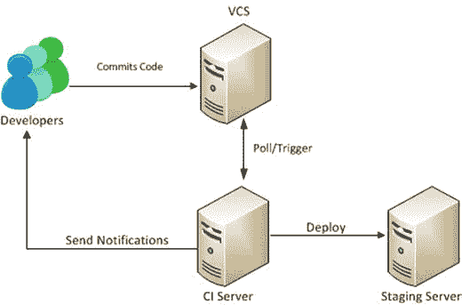

图 9-1.

CI 流程

该交互始于开发者将其更改提交到中央源代码仓库（VCS）。CI 服务器可以配置为定期轮询代码仓库的更改，或者由 VCS 触发构建。当 CI 服务器检测到代码更改时，它会下载源代码并开始构建。构建成功后，CI 服务器可以将生成的工件推送到测试/预发布环境。如果检测到构建失败，CI 服务器会向开发者发送通知。

## 示例项目

为了充分理解 Jenkins 对 Gradle 的支持，你需要一个存放在 VCS 中的示例 Gradle 项目。本书将使用 Git 作为 VCS，并使用流行的在线托管服务 GitHub 来托管 Git 仓库。你将使用一个名为 `ig-app` 的示例应用程序，该程序已上传至 GitHub 的 [`https://github.com/bava/ig-app`](https://github.com/bava/ig-app) 。该示例项目包含一个简单的 `build.gradle` 文件和一个向控制台输出 `"Hello World"` 的 `HelloWorld.java` 类。

要跟随本章后续内容，你需要一个 GitHub 账户。如果你是首次使用，可以在 GitHub 主页 [`https://github.com`](https://github.com/) 上注册一个免费账户。拥有账户后，你需要 fork 或复制 `ig-app` 仓库到你自己的账户下。这样你就可以配置 Jenkins，使用你的凭据与 fork 后的仓库进行交互。这也允许你向仓库提交更改，并自动触发 Jenkins 构建。你可以通过点击仓库名称旁边的 Fork 按钮来 fork `ig-app` 仓库，如图 `9-2` 所示。

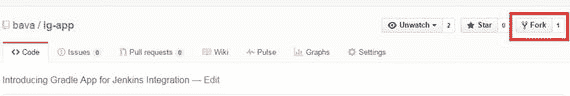

图 9-2.

Fork ig-app 仓库

### 安装 Jenkins

Jenkins 是一个完全用 Java 编写的开源、跨平台持续集成工具。它支持多种技术和语言，例如 Java、.Net、PHP、Ruby 等。在开始使用 Jenkins 之前，你需要安装并配置它。

注意

由于 Jenkins 需要与 Git 仓库交互，你需要在机器上安装 Git。你可以从 [`http://git-scm.com/downloads`](http://git-scm.com/downloads) 下载特定操作系统的 Git 安装程序。

从 [`https://jenkins-ci.org/`](https://jenkins-ci.org/) 下载最新版本开始安装 Jenkins（见图 9-3）。Jenkins 有两种形式——主要操作系统的原生安装程序和一个可执行的 WAR 文件。为简单起见，本书采用 WAR 文件方式。

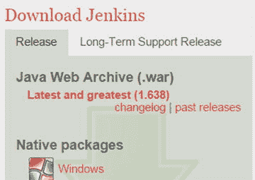

图 9-3.

Jenkins 下载页面

下载 `jenkins.war` 文件并将其保存到你的文件系统中。使用命令提示符，导航到下载目录并运行以下命令来启动 Jenkins：

`java -jar jenkins.war`

命令成功执行后，你应该会在控制台上看到语句 `"INFO: Jenkins is fully up and running"`，表明 Jenkins 已启动并正在运行。默认情况下，Jenkins 运行在 8080 端口。使用浏览器，导航到 `http://localhost:8080`，你应该会看到 Jenkins 仪表盘，如图 9-4 所示。

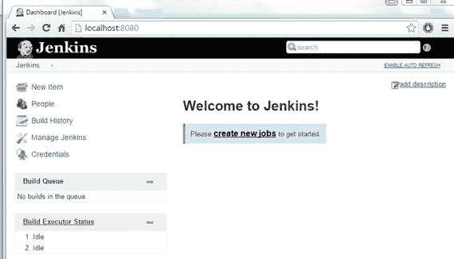

图 9-4.

Jenkins 仪表盘

### 配置 Jenkins

在开始使用 Jenkins 运行 Gradle 构建之前，你需要通过添加和配置 Gradle 与 GitHub 插件来配置 Jenkins。在 Jenkins 仪表盘的垂直导航栏中，点击“管理 Jenkins”。然后点击“管理插件”链接。在出现的屏幕上，点击“可选插件”选项卡，并使用过滤器框搜索 Gradle 插件，如图 9-5 所示。

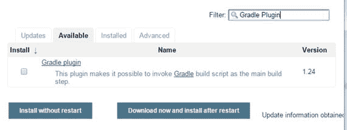

图 9-5.

管理插件屏幕上的“可选插件”选项卡

选择该插件，然后点击“立即下载并在重启后安装”按钮。按照相同的方法搜索并安装 GitHub 插件（见图 9-6）。

图 9-6.

GitHub 插件

你会注意到 GitHub 插件会触发安装其他插件，例如 Git 和 Git 客户端（见图 9-7）。

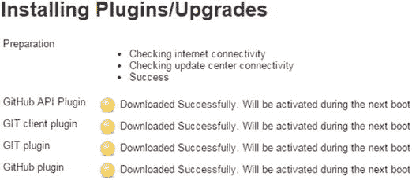

图 9-7.

与 GitHub 插件一起安装的插件

要完成插件安装，请重启 Jenkins 服务器。你可以通过在命令行中终止 Jenkins 进程（Windows 上按 Ctrl+C）并重新运行 `java -jar jenkins.war` 命令来实现。

最后，你需要配置 Gradle 插件以使用本地 Gradle 安装。为此，点击仪表盘上的“管理 Jenkins”链接，然后点击“系统配置”链接。导航到页面上的 Gradle 部分，然后点击“新增 Gradle”按钮。这将打开一个用于配置 Gradle 安装的区域。在“Gradle 名称”中输入“Local Gradle”。然后在 `GRADLE_HOME` 下输入 Gradle 安装目录，并取消选中“自动安装”选项，如图 9-8 所示。

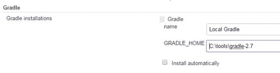

图 9-8.

Gradle 插件配置

点击页面底部的“保存”按钮保存更改。至此，插件配置完成，你现在可以继续创建 Jenkins 构建任务了。

### 创建构建任务

Jenkins 中的任务代表构建过程中的任务或步骤。例如，一个构建任务可以下载源代码、编译并执行测试。在本节中，您将创建一个执行示例应用的 Gradle 构建脚本的构建任务。要创建新任务，请按照以下步骤操作：

导航至 Jenkins 仪表盘 `http://localhost:8080`，然后点击 **New Item** 链接。在 **New Item** 界面上，输入名称 `intro-gradle-app`，并选择 **Freestyle Project**，如图 9-9 所示。我们选择 **Freestyle Project** 选项，因为它提供了极大的灵活性，并且可以与任何 SCM 和构建系统配合使用。点击 **OK** 按钮。

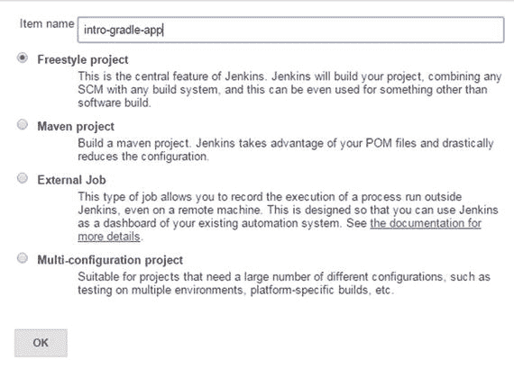

图 9-9.

新建任务界面   在下一个界面上，输入包含已 fork 示例项目的 GitHub 仓库 URL（见图 9-10）。

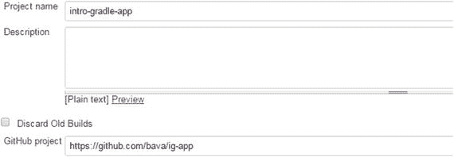

图 9-10.

GitHub 项目 URL   在 **Source Code Management** 部分下，选择 **Git** 选项。在 **Repository URL** 下，输入用于克隆 GitHub 仓库的 HTTPS URL，如图 9-11 所示。

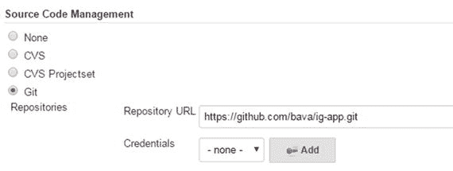

图 9-11.

源代码仓库配置   您可以在 GitHub 仓库页面的垂直导航栏上获取要输入的克隆 URL（见图 9-12）。在复制 URL 之前，请确保已选择 **HTTPS** 选项。

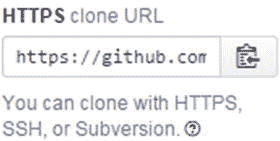

图 9-12.

克隆 GitHub 的 URL   点击凭据旁边的 **Add** 按钮。在 **Add Credentials** 对话框中，输入您的 GitHub 账户用户名和密码，如图 9-13 所示。点击 **Add**。

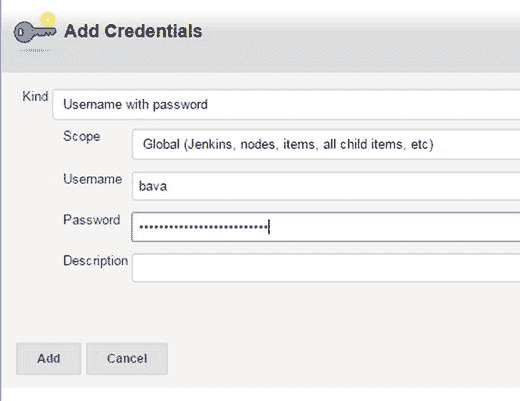

图 9-13.

GitHub 仓库凭据   在 **Build Triggers** 部分，选择 **Poll SCM** 选项。调度字段接受 UNIX cron 表达式值。在图 9-14 中，已输入 `H/15 * * * *`，表示应每 15 分钟轮询一次 VCS。

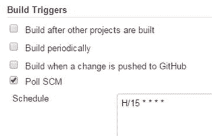

图 9-14.

构建触发器配置   在 **Build** 部分下，点击 **Add Build Step** 下拉菜单，并选择 **Invoke Gradle Script**（见图 9-15）。

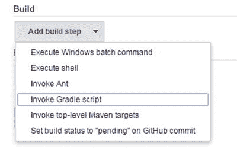

图 9-15.

添加构建步骤   在 **Invoke Gradle script** 部分下，选择 **Invoke Gradle**，然后从下拉菜单中选择您在前一节中配置的 **Local Gradle** 选项（参见图 9-8）。在 **Tasks** 文本框中输入 `clean build`（见图 9-16）。

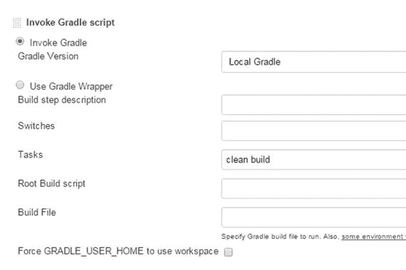

图 9-16.

调用 Gradle 脚本配置   点击 **Save**，您将被带到 `intro-gradle-app` 项目页面，如图 9-17 所示。在此页面上，您可以触发手动构建或更改任务配置。

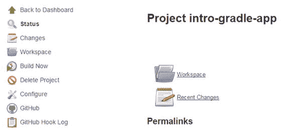

图 9-17.

intro-gradle-app 项目页面

### 运行构建任务

您在前一节中配置的构建任务每 15 分钟轮询一次仓库以获取更改。此外，您还可以随时使用项目页面触发手动构建。从 Jenkins 仪表盘，点击 `intro-gradle-app` 项目链接（见图 9-18）。

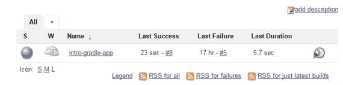

图 9-18.

仪表盘上的项目列表

在随后的项目页面上，点击左侧垂直导航栏中的 **Build Now** 链接。这将调度一个新的构建。点击构建编号，然后点击 **Console Output**，如图 9-19 所示。

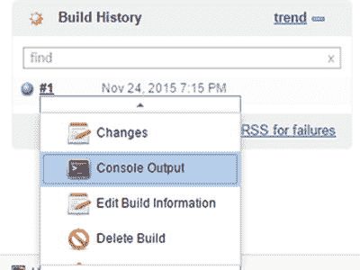

图 9-19.

查看控制台输出

您应该会看到执行的输出，类似于图 9-20。

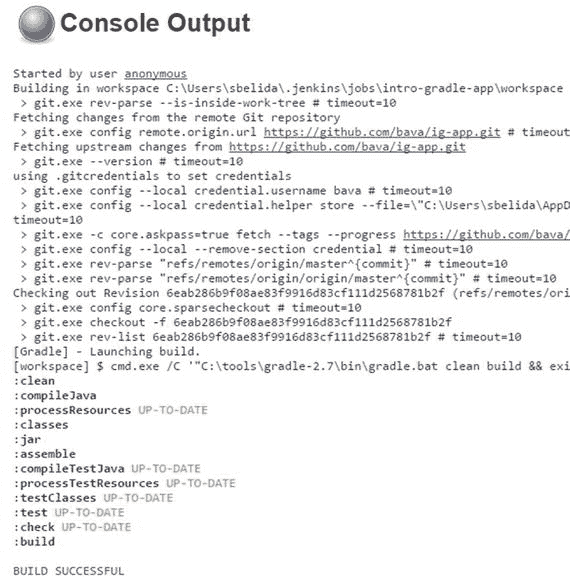

图 9-20.

任务执行输出

## 归档构建产物

在前一节中，您运行了一个 Jenkins 构建任务来构建项目并生成 `ig-app.jar` 文件。在本节中，您将配置 Jenkins 以存储这些生成的构建产物供以后使用。

从 Jenkins 仪表盘，导航至 `intro-gradle-app` 项目页面，然后点击左侧垂直导航栏中的 **Configure** 链接。滚动到 **Configure** 页面底部，点击 **Add post-build-action** 下拉菜单，并选择 **Archive the Artifacts** 选项（见图 9-21）。

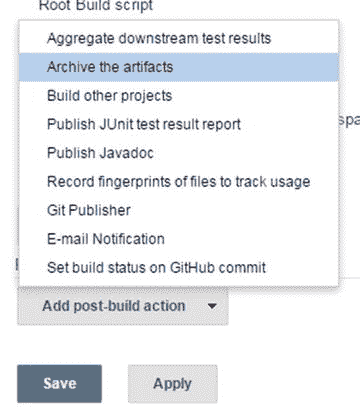

图 9-21.

归档构建产物的构建后操作

在 **Files to Archive** 文本框中，输入值 `build/**/*.jar` 以归档所有生成的 JAR 文件（见图 9-22）。

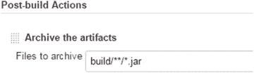

图 9-22.

要归档的文件配置

保存配置更改，并通过点击 **Build Now** 按钮触发手动构建。构建完成后，生成的构建产物应可在项目仪表盘上看到，如图 9-23 所示。

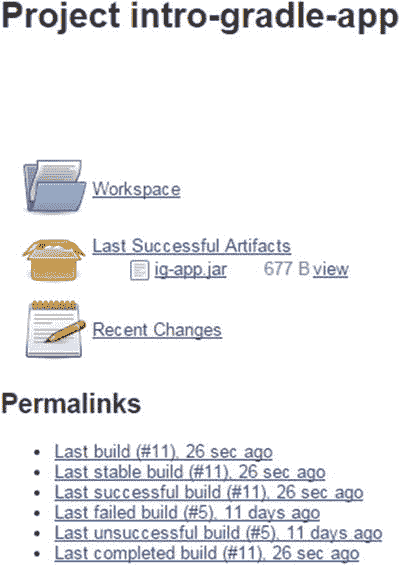

图 9-23.

项目仪表盘上的 ig-app.jar 构建产物

## 发布测试结果

Java 插件的 `test` 任务运行单元测试，并生成 HTML、XML 和二进制格式的报告。这些报告显示运行的测试数量，并帮助您深入分析以识别失败的测试。默认情况下，HTML 报告存储在 `build/reports` 文件夹中，而 XML/二进制结果存储在 `build/test-results` 文件夹中。

`ig-app` 在 `src/test/java` 中包含一个名为 `HelloWorldTest` 的 JUnit 测试。此单元测试测试了简单的 `HelloWorld` Java 代码的功能。在本节中，您将配置 Jenkins 以在项目主页上显示生成的报告。

Jenkins 中的 JUnit 结果通过构建后操作发布。导航至 `intro-gradle-app` 的配置页面，并选择 **Publish JUnit Test Result Report**（见图 9-24）。

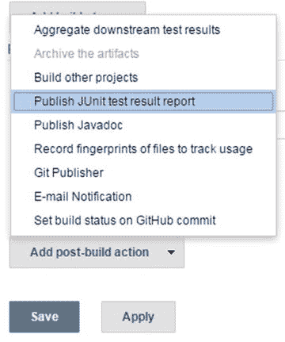

图 9-24.

测试结果构建后操作

在 **Test Report XMLs** 文本框中输入值 `build/test-results/*.xml`（图 9-25），然后点击 **Save** 按钮保存更改。

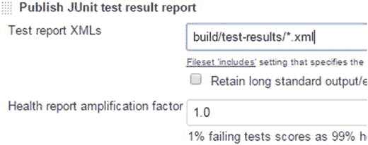

图 9-25.

XML 测试报告位置配置

触发一个新的构建。成功完成后，您应该会在项目主页上看到 **Latest Test Results** 链接，如图 9-26 所示。点击该链接，您应该会看到测试运行的详细信息。

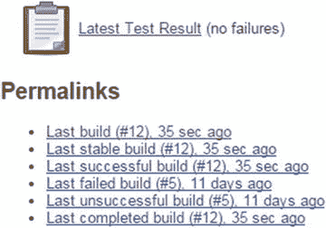

图 9-26.

项目主页上的测试结果

## 总结

在本章中，你学习了持续集成流程，并探索了 Jenkins——一款流行的开源 CI 服务器。你了解了如何安装 Jenkins 以及配置必要的插件，以运行位于 GitHub 仓库中的示例项目。

至此，本书的旅程已接近尾声。通过本书，你已经掌握了 Gradle 背后的关键概念。我们希望你能运用新学到的 Gradle 知识，来自动化并改进现有的构建和项目管理流程。

索引 A, B 构建编号 C 清理任务 编译任务 配置继承 持续集成 (CI) 归档制品 构建任务创建 构建触发器 清理构建 克隆地址 控制台输出 流程 GitHub 仓库 ig-app 仓库 intro-gradle-app 项目 Jenkins 配置 Jenkins 安装 源代码管理 测试报告 D, E, F 有向无环图 (DAG) G, H, I GitHub 插件 Gradle 构建生命周期 阶段 配置 执行 初始化 项目的 API 任务 创建 依赖 属性与方法 跳过 类型 参见(任务类型) Gradle 依赖方法 制品 build-common-group.gradle 文件 build.gradle 文件 buildscript 块 编译时依赖 配置 依赖管理 displayJars 任务 文件集合 文件树 JAR 创建 JAR 文件 Logback 网站 mavenCentral() 仓库 属性 级别 解析策略 TheProjectDependency 类型 两种文件依赖类型 Gradle 安装 下载 选项 文件与文件夹 GUI 选项 hellow world 脚本 help 命令 JDK 下载 JVM 选项 Mac OS X 使用 IDE 测试 Windows Gradle 多项目配置 扁平布局 Gradle 任务 层级结构 项目依赖 子项目构建文件 UI 层代码 与 大型多项目 Gradle 插件 二进制 脚本 Gradle 发布制品 声明制品 Gradle 缓存 中央仓库 安装 JAR 文件 本地 Maven 仓库 本地仓库 Maven 仓库 artifactId 更新 build.gradle 文件 gradle uploadArchives 命令 groupId metadata.xml 文件 Nexus 索引页面 示例应用制品 版本 Gradle 系统 Ant + Ivy Groovy 增量构建 Maven 使用 开源 插件 项目依赖 Wrapper 脚本 Groovy 语言 闭包 注释 数据类型 声明变量 列表 映射 数字 范围 字符串 安装步骤 运行命令 语法 J, K, L, M, N, O Java 插件 build.gradle 文件 构建编号 自定义二进制插件 默认布局 目录 greet 任务 GreetTask.java 文件 Groovy 语言 HelloPlugin.java 类 Jartask javadoc 任务 Plugin 类 Plugin 配置 Plugin 消费者项目 Plugin 开发 Plugin 扩展 Plugin 名称 Plugin 包 Plugin 任务 SourceSets 子文件夹创建 Wartask Web 应用开发 P, Q, R, S Package 任务 Plugin 类 Plugin 配置 Plugin 消费者项目 Plugin 开发 Plugin 扩展 Plugin 名称 Plugin 包 Plugin 任务 T, U 任务类型 复制 删除 Exec Zip V, W, X, Y, Z 版本控制系统 (VCS)
