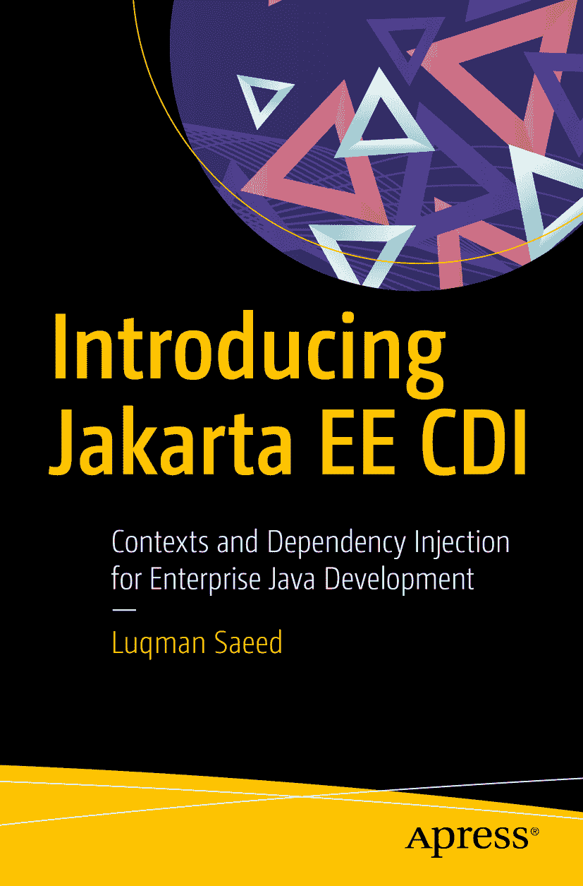

ISBN 978-1-4842-5641-1e-ISBN 978-1-4842-5642-8 [`doi.org/10.1007/978-1-4842-5642-8`](https://doi.org/10.1007/978-1-4842-5642-8) © Luqman Saeed 2020 本书受版权保护。出版者保留所有权利，无论涉及全部或部分材料，具体包括翻译权、重印权、插图复用权、朗诵权、广播权、微缩胶片或其他任何物理形式的复制权，以及信息存储与检索、电子改编、计算机软件或目前已知或未来开发的类似或不同方法的传输权。本书中可能出现商标名称、标识和图像。对于商标名称、标识或图像，我们仅在编辑性用途中使用，以维护商标所有者的权益，无意侵犯其商标权。本书中使用的商品名称、商标、服务标记及类似术语，即使未明确标识，也不应被视为对其是否受专有权利保护的立场表达。尽管本书中的建议和信息在出版时被认为是真实准确的，但作者、编辑及出版者均不对可能存在的任何错误或遗漏承担法律责任。出版者对本书所含内容不作任何明示或暗示的担保。本书通过 Apress Media, LLC 在全球图书贸易中发行，地址：1 New York Plaza, New York, NY 10004, U.S.A. 电话：1-800-SPRINGER，传真：(201) 348-4505，电子邮件：orders-ny@springer-sbm.com，或访问 www.springeronline.com。Apress Media, LLC 是一家加利福尼亚有限责任公司，其唯一成员（所有者）为 Springer Science + Business Media Finance Inc (SSBM Finance Inc)。SSBM Finance Inc 是一家特拉华州公司。

前言

感谢您选择《* Jakarta EE CDI 入门：面向企业 Java 开发的上下文与依赖注入*》。我撰写本书，是因为市面上缺乏关于在 Jakarta EE（原 Java EE）平台上使用强大且直观的上下文与依赖注入 API 的易懂书籍。

本书涵盖了 CDI API 的核心要点，旨在以易于理解和关联的方式解释各种结构。最终目标是帮助您——日常的 Java 开发者——编写出更优质的代码。在本书中，您将开发一个简单的餐厅应用程序，了解何时以及如何使用各种 CDI API 结构。

## 使用本书需要具备哪些知识？

理想情况下，您在开始阅读本书前应是一名熟悉 Java SE 的 Java 开发者。了解一些 Java EE 或 Spring 知识有助于您更快掌握相关概念，但并非必需。您的机器上至少应安装 Java 8。

## 本书涵盖哪些内容？

本书从 Java EE 的理论讲起，包括其向当今 Jakarta EE 的演进过程，然后开始介绍 CDI，首先讲解如何显式激活它。接着，讨论基于 CDI Bean 的概念，并介绍各种类型。随后，您将学习 CDI 上下文和注入点。本书还将介绍 CDI 限定符、生产者、拦截器，最后是 CDI 事件。

## 最终您将学到什么？

这是一本非常精炼的书籍，只涵盖关键内容。您的时间宝贵，因此我选择了自己日常编码中实际使用的主题。在书中塞满您只会偶尔用到的主题毫无意义。因此，本书内容直截了当，您可以在一个周末内读完。

在本书结束时，您将牢固掌握上下文与依赖注入 API。您将了解它是什么、何时使用它，以及如何用它编写更优质、更易读且更易维护的代码。

## 源代码在哪里？

本书的完整代码可在 GitHub 上获取，既位于 Apress 品牌的仓库 [`www.github.com/apress/introducing-jakarta-ee-cdi`](http://www.github.com/apress/introducing-jakarta-ee-cdi)，也位于我个人的仓库 [`https://github.com/pedanticdev/jee-book`](https://github.com/pedanticdev/jee-book)。该项目使用 Maven 依赖管理工具构建，应可在任何支持 Maven 的 IDE 中运行。如果您未安装 Maven，可按照 [`https://www.baeldung.com/install-maven-on-windows-linux-mac`](https://www.baeldung.com/install-maven-on-windows-linux-mac) 上的指南在您的机器上安装。它适用于所有操作系统。我强烈建议您将代码克隆到本地机器，以便跟随本书学习。

项目对象模型（`pom.xml`）文件包含 Payara Micro Maven 插件，您可以使用它来运行代码示例。切换到项目目录并执行以下命令：

```
mvn package payara-micro:start
```

要运行异步 CDI 事件，您需要从 [`www.payara.fish/software/downloads/`](http://www.payara.fish/software/downloads/) 下载 Payara Server Full Stream，并按照 [`www.youtube.com/watch?v=aw-cNxKJU_Y`](http://www.youtube.com/watch%253Fv%253Daw-cNxKJU_Y) 上的视频来运行克隆的代码。

## 如何联系我？

写书是一项繁琐的任务，因此，尽管尽了最大努力，仍可能存在未通过质量检查的错误。我对所有错误承担全部责任。

如果您遇到任何此类错误，需要本书中任何内容的帮助，或者只是想喝杯咖啡聊聊天，请随时通过 `hello@pedanticacademy.com` 直接联系我。

再次感谢您选择本书。希望您在阅读后能编写出更优质的代码。让我们开始吧。

> ——Luqman Saeed

关于作者 关于技术审校者

