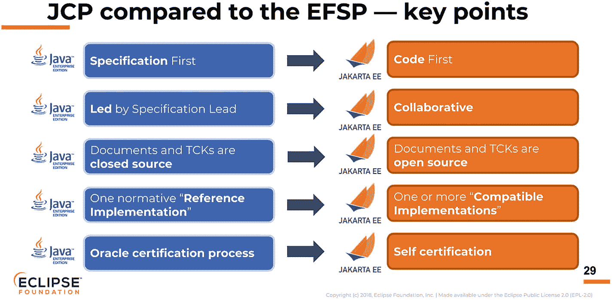

# 5. 什么是 Jakarta EE？

你已经了解了什么是 Java EE。你已经了解了什么是应用服务器，以及它与 Java EE 这个术语的关系。现在，是时候来了解什么是 Jakarta EE 了。

Jakarta EE 就是新的 Java EE。早在 2017 年，作为 Java EE 技术栈所有者的 Oracle 决定将这个平台开放给更广泛的社区。在此过程中，整个 Java EE 平台必须转移到一个非营利、面向社区的基金会。

Java EE 社区进行了投票，并选择了 Eclipse 基金会。于是 Java EE 被转移到了 Eclipse 基金会。由于法律问题，该平台的名称必须更改，不能再使用原来的 Java EE。社区再次提出建议，最终 *Jakarta EE* 这个名称胜出^(⁴)。

Eclipse 基金会以将前 Java EE 平台与更现代的软件开发范式对齐为新的目标，力求将 Jakarta EE 定位为一个现代化、云原生、敏捷的软件开发平台。

对 Java EE 的批评之一是其发展过于缓慢。软件开发领域的演进速度超过了该平台所能跟上的步伐。鉴于这些合理的担忧，Eclipse 基金会通过 Jakarta EE 工作组，为 Jakarta EE 制定了以下指导原则：

*   提供更频繁的版本发布
*   降低参与门槛
*   发展社区
*   代表社区管理 Jakarta EE 品牌

最初，Jakarta EE 与 Java EE 8 平台完全等同。构成 Java EE 8 的所有规范、参考实现（RI）和技术兼容性工具包（TCK）都已转移至 Eclipse 基金会^(⁵)。这意味着之前的 Java EE 8 版本是新的云原生 Jakarta EE 的基础。

前面的章节讨论了 Java EE 如何通过 Java 社区流程（JCP）中的 Java 规范请求（JSR）概念进行演进。然而，Jakarta EE 在 Eclipse 基金会将如何演进？或者说，Jakarta EE 的治理模式与 Java EE 有何不同？

主要区别在于，Jakarta EE 的治理模式现在是基于社区的、多供应商的，并且向这些技术的企业消费者开放参与和贡献。Eclipse 基金会将确保 Jakarta EE 的新规范和开发流程保持开放、供应商中立，并为所有参与者提供公平的竞争环境。

Java 社区流程（JCP）将被 Eclipse 基金会规范流程（EFSP）所取代（参见 [`https://www.eclipse.org/projects/efsp/`](https://www.eclipse.org/projects/efsp/)）。它与 JCP 有何不同？

[图片来源](https://blogs.eclipse.org/post/tanja-obradovic/how-eclipse-foundation-specification-process-efsp-different-java-community)

它采用代码优先的方法。JCP 和 EFSP 之间最根本的区别在于，规范将通过这种代码优先的方法来制定。在 JCP 中，先制定规范，然后才是参考实现。然而，在 EFSP 中，会先进行动手编码和实验，以确保某些内容值得被纳入规范文档。

其他差异都使得 EFSP 比之前的 JCP 流程更加开放。这是一件好事。这意味着作为开发者，你可以放心地在你的应用程序中使用 Jakarta EE 平台，因为你知道它是一个由非营利组织运营的完全开放的平台，并且有整个 Java 社区的更广泛参与。微软和 Pivotal（Spring 框架背后的公司）都是 Jakarta EE 社区的成员。

在版本发布方面，Eclipse 基金会下的首个总括规范版本是 Glassfish 5.1，这是一个兼容 Java EE 8 的版本。回顾第 3 章所述，Glassfish 应用服务器是 Java EE 总括 JSR 的参考实现。该基金会已发布了 Jakarta EE 8，并以 Glassfish 5.2 作为其参考实现。Jakarta EE 8 是一个完全兼容 Java EE 8 的版本。这意味着每个 Java EE 8 应用程序都自动与 Eclipse Jakarta EE 8 兼容。

作为 Jakarta EE 开发者，你的未来是令人振奋的。社区对推动整个 Jakarta EE 平台向前发展抱有极大兴趣，旨在使其成为现代软件开发范式中最可靠、云原生、首选的企业级 Java 开发平台。你难道不想掌握这个激动人心的平台吗？

脚注 1   2

