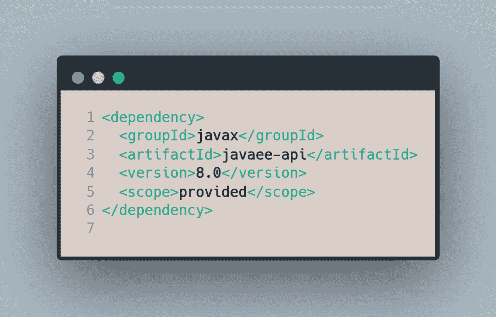
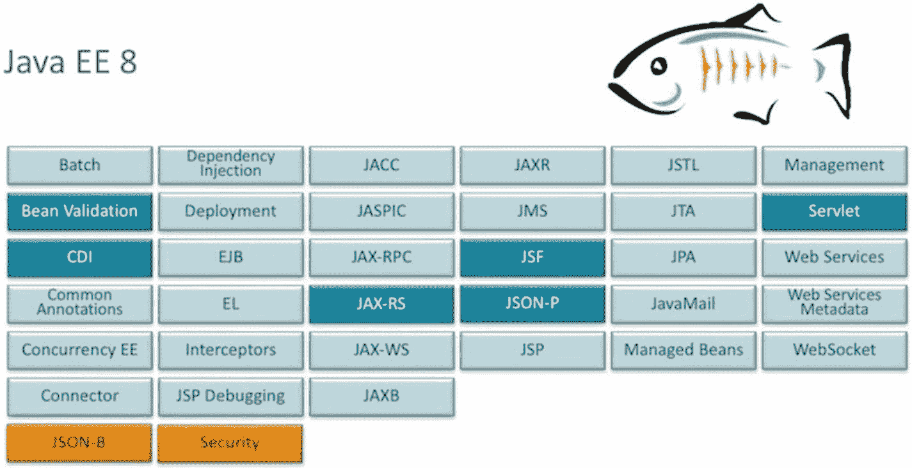

# 6. 为什么选择 Jakarta EE？

作为一名 Java 开发者，在软件开发框架和平台方面，你有很多选择。你可能会问自己一个问题：为什么应该选择 Jakarta EE 作为你的主要软件开发平台？是什么让它成为更好的选择？

至少有以下几个理由值得你尝试一下 Jakarta EE，其中关键的有：

*   标准化
*   开放性
*   稳定性
*   易于开发
*   可移植性
*   按需选择：坦克或手枪
*   出色的文档

## 标准化

对于所有 Java EE API，每一个 JSR 在提交给 JCP 执行委员会投票之前，都经过了严格的公众和 JSR 专家组审查流程。每个 JSR 都会根据向后兼容性、对整个 Java 平台的益处等方面进行权衡。这种煞费苦心的 JSR 审批流程确保了每个特性都是基于某些明确定义的技术标准而被接受的。同样，新 Jakarta EE 平台的每个 API 都将经过一个明确定义的规范流程，以确保平台中包含的任何 API 都能长期存在。

## 开放性

如前所述，新的 Jakarta EE 规范将通过 Eclipse 基金会规范流程，采用代码优先的方法来制定。EFSP 是一个开放流程，任何人都可以参与其中。整个规范流程都是公开制定的。

## 易于开发

Jakarta EE 开发毫不费力。所需要的只是一个应用服务器或一个兼容 Jakarta EE 的运行时，以及一个 Maven 依赖。它需要最少的配置，遵循约定优于配置的原则，并且不会导致 XML 地狱。它还具有合理的默认值。例如，EJB 默认是事务性的，使用默认数据源，并且默认启用 CDI。

这段代码片段是你轻松拥有整个 Jakarta EE 平台所需的唯一依赖。此外，因为你与标准的实现是解耦的，所以你只需将你的应用程序与你的代码以及使用的任何其他第三方库打包在一起。你选择的应用服务器将提供实现以及运行应用程序所需的所有其他繁重工作。

## 可移植性

Jakarta EE 作为一个标准，意味着只要你针对标准进行编码，你的应用程序就应该在标准的不同实现之间以最少配置甚至无需配置即可运行。这一点很有吸引力，因为你不会受限于某一个 Jakarta EE 应用运行时供应商。只要你使用标准的 Jakarta EE API，你的代码就可以在各种应用服务器之间移植。

## 精挑细选：坦克还是手枪

Jakarta EE 是一个庞大的平台，初看可能令人生畏。不过，你可以挑选应用程序所需的任何 API。你可以将平台用作坦克，也可以用作手枪——由你决定。如果你选择将 Jakarta EE 作为坦克使用，那么所有不同的 API 都会作为一个整体集成；如果你选择精挑细选，它们也可以各自独立。此外，由于应用服务器提供了运行时实现，无论你选择使用整个平台还是仅选择部分 API，你交付的应用程序都只包含你的代码。无论哪种方式，你的应用程序始终以轻量级包的形式交付。

[图片来源](https://blogs.oracle.com/java/java-ee-8-overview)

## 出色的文档

Jakarta EE 是一个组织良好的社区项目，拥有海量的文档。其中最主要的是 *Java EE 教程*^(⁶)，这是官方的 Java EE 手册。此外，还有许多社区和企业组织的会议——例如 Devoxx 和 Oracle CodeOne——这些会议非常重视服务器端 Java 开发。还有像你正在阅读的这本由个人开发者撰写的书籍，所有这些都旨在帮助你成为一名功底扎实的企业级 Java 软件开发人员。

以上几点只是你应该尝试 Jakarta EE 的部分原因。我知道在 J2EE 时代，这个平台对很多人来说难以驾驭。然而，如今的 Jakarta EE 是一个灵活、优雅、看似简单却极具吸引力的软件开发平台，正如你将在本书第二部分中看到的那样。

脚注 1

