# 8. 上下文和依赖注入 (CDI) API

依赖注入 (DI) 是一种软件开发方式，它使得各个组件之间以非常松散耦合的方式关联。在大多数软件应用程序中，各个部分之间总是存在某种形式的依赖关系。

以餐厅应用程序为例。你可能有一个处理点餐的组件，另一个用于向厨房发送消息的组件，还有一个用于检查特定餐点可用食材的组件，以及一两个用于计算总账单的组件。

这些都是需要相互依赖才能完成餐厅运营职责的各种组件。然而，创建和管理这种相互依赖关系可能是一项艰巨的任务。你需要为每个组件创建单独的依赖关系，有时还需要考虑你希望特定依赖关系存在的上下文。

这就是依赖注入概念的用武之地。通过 DI，你的各种组件只需声明对其他组件的依赖关系，并将这些依赖关系的创建、管理和销毁交给外部机制。简而言之，你在应用程序中实现了控制反转。组件只需请求一个依赖关系，某个黑盒就会使该依赖关系可用。这个黑盒通常被称为控制反转 (IoC) 容器。

依赖注入是一种特定类型的 IoC，“它关注于通过共享抽象来解耦高层和低层之间的依赖关系。”^(⁹) 上下文和依赖注入 (CDI) 是 DI 原则的一种实现。

## CDI 激活

在 Jakarta EE 平台上，帮助你将应用程序代码中不同组件粘合在一起的 API 是上下文与依赖注入（CDI）API。在其 2.0 版本中，CDI 在 Jakarta EE 中默认激活，发现模式设置为 `annotated`。

默认激活范围的含义是，只有带有 CDI 注解或 CDI 认可注解的 Bean（或 Java 类）才有资格被注入。默认的 CDI 配置文件是一个位于 `/webapp/WEB-INF` 文件夹中的小型 XML 文件，名为 `beans.xml`，其内容如下所示：

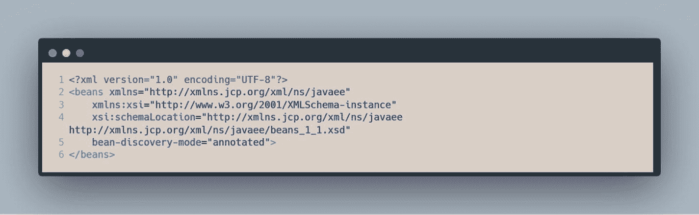

第 5 行是默认的 Bean 发现模式，Bean 发现模式本质上是一种扫描机制，用于识别有资格由 CDI 容器管理的 Bean。`Annotated` 意味着在扫描期间，只有带有 Bean 定义注解的类才会被发现。

这意味着以下 Bean 将在应用程序启动时被扫描。

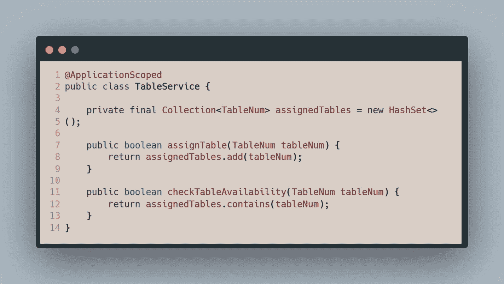

然而，由于缺少 Bean 定义注解，此类将不会被扫描。

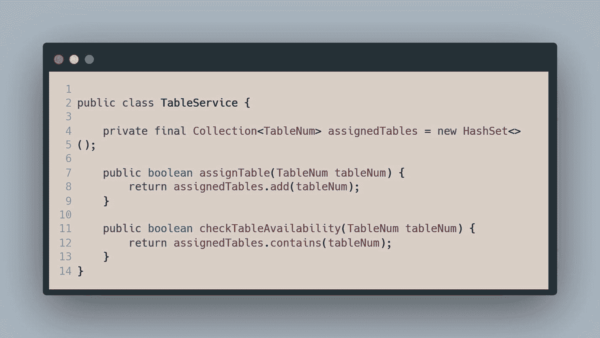

请注意，这是在未显式创建文件时生效的那种 `beans.xml` 文件。

然而，在默认 Bean 发现模式设置为 `annotated` 的情况下使用 CDI API 并不那么有趣。为了充分利用 Jakarta EE 依赖注入的强大功能，你需要将 Bean 发现模式设置为 `All`。

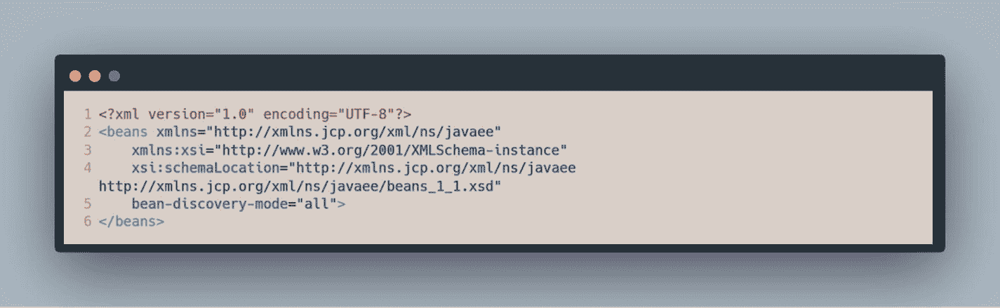

如第 5 行所示，将 Bean 发现模式设置为 `all` 意味着在应用程序启动时，CDI 容器在扫描期间会发现所有类。因此，无论 Bean 是否带有 CDI 注解，只要它位于同一个归档文件（即给定 Jakarta EE 应用程序的捆绑包）中，就会被发现。这是你在许多 Jakarta EE 代码中会看到的情况。这也是我偏好并推荐使用的模式。

## CDI 容器

*容器*这个词通常与依赖注入相关联。那么，什么是 CDI 容器？它是你 CDI 代码的核心。它在应用程序启动时验证你的 CDI 代码，并确保所有 CDI 代码都是有效的。很少会遇到 CDI 运行时错误。

CDI 容器负责创建 Bean 的上下文实例，为这些创建的实例添加相关的 CDI 特性，将它们分配到相关的上下文中，并最终在它们所绑定的上下文被销毁时销毁这些实例。

你可以将 CDI 容器视为一个黑盒，它只在响应你的请求时出现，并在不需要时隐入幕后。然而，作为开发者，你通常不需要过多考虑 CDI 容器。你只需要知道它在后台存在，并随时准备响应你的请求。

## CDI Bean 与上下文实例

到目前为止，本书相当随意地使用了*Bean*和*上下文实例*这两个术语，而没有定义它们的含义。那么，Bean 到底是什么意思呢？

CDI 规范将 Bean 定义为上下文对象的来源，这些对象定义了应用程序的状态和/或逻辑。这些对象被称为 Bean 的上下文实例。^(¹⁰) 这全部意味着，Bean 就是你作为开发者编写的 Java 类。

你用 Java 代码实现 Bean 的逻辑，然后使用相关的 CDI 注解为其提供你希望 Bean 的上下文实例所拥有的属性。它是可以在依赖注入过程中创建和注入实例的模板。CDI 容器通过在应用程序启动时扫描你的应用程序归档文件来发现你的 Bean。

因此，Bean 只是与你的 Java 代码相关联的一组元数据，容器从中创建对象以满足给定的依赖注入请求。由 CDI 从你的 Bean 创建的对象就是所谓的上下文实例。

你可以赋予 Bean 的属性集包括：限定符、作用域、备选方案和名称。本书的其余部分将讨论这些属性。

## 创建和使用 Bean

如前所述，CDI Bean 只是一个普通的 Java 类，以注解的形式应用了 CDI 元数据。请看下面最基本的 CDI Bean。

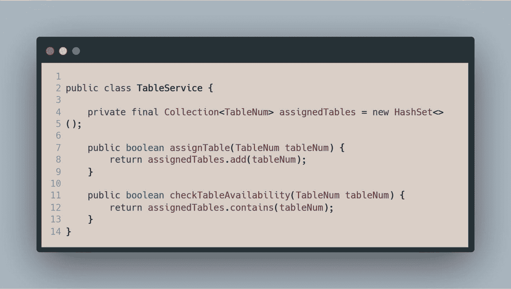

这段代码展示了一个非常简单的普通 Java 对象，没有显式的 CDI 注解，名为 `TableService`。这个类是一个有效的 CDI Bean，因为 CDI 发现模式设置为 `all`。这意味着你可以向 CDI 容器请求此 Bean 的上下文实例，并且它会响应你的请求。默认情况下，此 Bean 的作用域是 `@Dependent`，这意味着它的作用域与它所注入到的任何 Bean 的作用域相同。

然而，在餐厅应用程序中，你需要只有一个 `TableService` 实例负责检查餐桌的可用性并为客人分配餐桌。在这种情况下，你需要修改 Bean（或模板），以便从中创建仅此一个实例的上下文实例。

### @ApplicationScoped

为了进行此修改，你需要使用 `@ApplicationScoped`^(¹¹) 注解在 Bean 上定义一个元数据。

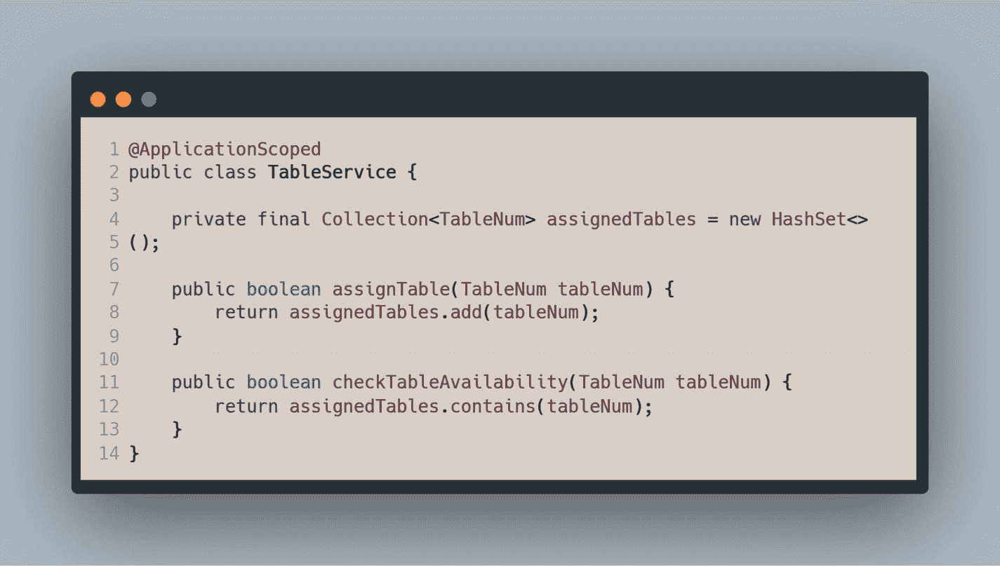

这段代码显示 `TableService` 类现在带有一个名为 `@ApplicationScoped` 的显式 Bean 定义注解。此注解告诉 CDI 容器将此 Bean 的上下文实例放入一个特定的、定义明确的作用域（或上下文）中，称为 `application`。

作用域（或上下文）是一种告诉 CDI 容器你希望它如何管理上下文实例生命周期的方式。你从 CDI 容器请求的实例将被放置在相关的上下文中，这些上下文由你随 Bean 代码提供的显式元数据决定，或者由 CDI 容器默认决定。

那么，应用程序作用域或上下文意味着什么？这意味着对于 `TableService`，你希望整个应用程序只有一个上下文实例。对 CDI 容器的每个 `TableService` 请求都将使用同一个上下文实例来服务。你可以将 `@ApplicationScoped` 视为在所部署应用程序的整个生命周期内共享状态的上下文实例。如果你熟悉其他 DI 框架（如 Spring），可以将 `ApplicationScoped` Bean 视为单例。

CDI 作用域的好处在于它们定义明确。你可以预测实例何时存在以及何时被销毁。你可以利用这一点在你的应用程序中构建强大的依赖关系图。那么，除了 `@ApplicationScoped` 之外，还有哪些其他可用的作用域呢？

## 其他 CDI 作用域

### @RequestScoped^(¹²)

此作用域将一个上下文实例绑定到一个为每个请求创建和销毁的上下文中。在典型的 HTTP 环境中，每个 HTTP 请求都会导致创建一个新的上下文实例，并在请求结束时销毁该实例。在非 HTTP 环境中，使用 `@RequestScoped` 注解的 bean 会为每个给定的请求始终创建和销毁其上下文实例。

在餐厅应用程序中，你可以有一个用于搜索订单的类，该类绑定到一个 JSF facelet 页面。这个类通常应该是 `RequestScoped` 的，这样每次搜索请求都会有不同的实例。你会希望每次搜索请求都从一个干净的状态开始。

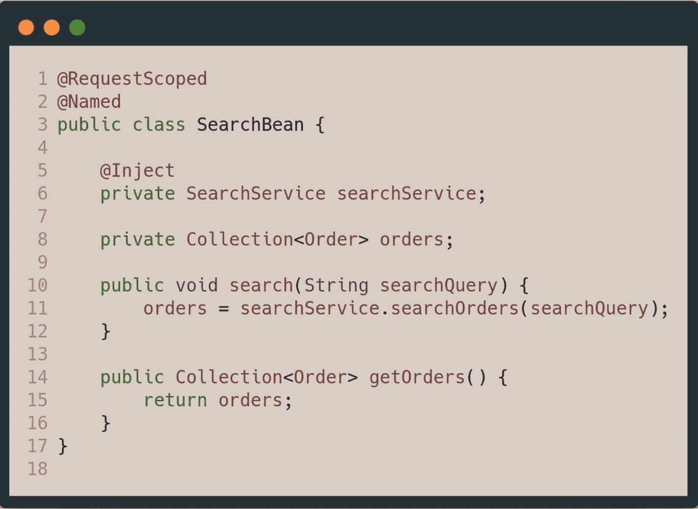

在这段代码中，你有一个名为 `SearchBean` 的类，它在第 1 行使用了 `@RequestScoped` 注解，在第 2 行使用了 `@Named` 注解。这明确告诉 CDI 容器将该 bean 的每个实例绑定到一个名为 `request` 的作用域。每次请求该 bean 的上下文实例时，都会创建一个新实例并将其放入一个新的作用域中。因此，同一用户发出的多个请求将为每个请求生成新的实例。

这种 bean 通常被称为*支持 bean*，或者大致相当于*控制器*。`@Named` 注解是一个内置的限定符^(¹³)，它使得该 bean 可以通过表达式语言^(¹⁴)在 JSF 页面中使用。

### @SessionScoped^(¹⁵)

此作用域将注解 bean 的实例绑定到一个跨越给定用户会话的上下文。可以将会话上下文想象成一个守卫，只要用户与应用程序交互，它就会跟随用户在应用程序中活动。会话作用域或多或少等同于给定用户的 HTTP 会话。

在餐厅应用程序中，你可以有一个跟踪已登录用户的 bean，该已登录用户可以是餐厅经理或收银员。

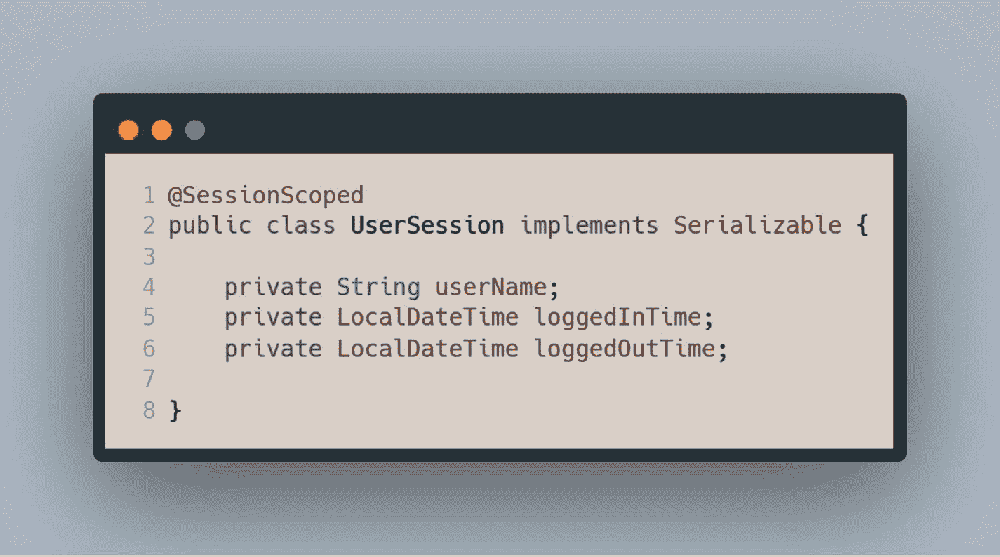

在这段代码中，你有一个名为 `UserSession` 的 bean，它在第 1 行使用了 `@SessionScoped` 注解。这告诉 CDI 容器为每个用户的每个会话创建一个该类的实例。因此，每个用户在每次会话中都会拥有该类的唯一一个上下文实例。同一会话中的用户多次请求该类的实例时，将提供相同的上下文实例。

在此 bean 声明中值得注意的一点是，它实现了 `Serializable` 接口，如第 2 行所示。这是一种良好的实践，因为上下文实例可能会被容器钝化（即保存）以在未使用时节省系统资源。因此，使用 `Serializable` 接口标记它是一个好习惯。

### @ConversationScoped^(¹⁶)

会话作用域 bean 用于执行那些跨越单个请求但比会话更短的任务。`@ConversationScoped` 的一个典型用例是下订单。从用户开始挑选商品起，订单项就保存在购物车中，直到用户结账时才最终清空。在此期间，用户可能会在应用程序的多个页面之间导航。

你可以使用会话作用域 bean 来管理用户与应用程序之间的此类会话，而无需在用户完成购物后仍然保持 bean 的存活。

会话作用域 bean 默认处于瞬态，也就是说，它们随时可能被销毁。与你目前看到的其他作用域不同，你需要手动将 bean 启动到会话状态。如何做到这一点呢？回到餐厅应用程序，你可以有一个使用 `@ConversationScoped` 注解的 bean，用于在系统中下订单。

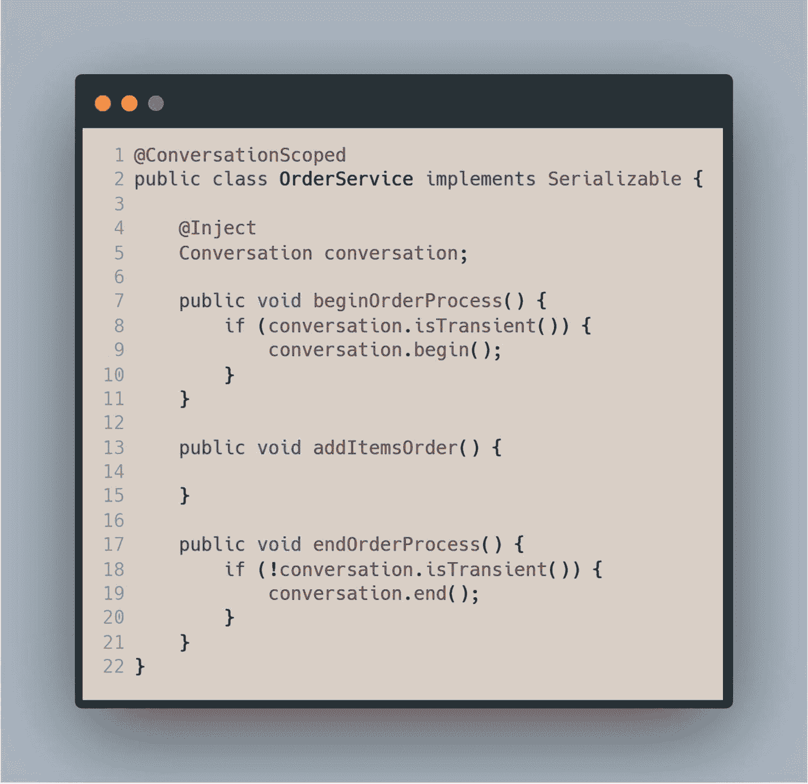

在这段代码中，你有一个名为 `OrderService` 的 bean，它在第 1 行使用了 `@ConversationScoped` 注解。这个 bean 也带有 `Serializable` 标记接口，因为它可能会被容器钝化。

第 4 行使用 `@Inject` 注解来请求一个名为 `Conversation` 的 bean 类型的上下文对象，如第 5 行所示。这是你第一次使用 `@Inject` 注解。它是从 CDI 容器请求上下文实例的魔法棒。被注解的 bean 类型 `Conversation` 是容器为你提供的一个 CDI bean，它不属于开发者代码。

`Conversation` bean 提供了一些方法，你可以用它们来检查 bean 是否处于瞬态、开始和结束会话，以及获取当前会话的 ID。第 7 行定义了一个名为 `beginOrderProcess()` 的方法，它首先检查当前实例是否处于瞬态模式。如果是，则在注入的 `Conversation` 实例上调用 `begin()` 方法。

第 13 行随后定义了一个名为 `addItemsToOrder()` 的方法，负责将商品添加到购物车。此方法可以根据具体问题以任何方式实现。

第 17 行最后声明了一个名为 `endConversation()` 的方法，该方法判断 bean 是否处于瞬态，然后继续在注入的 `Conversation` 对象上调用 `end()` 方法。调用 `end()` 方法会使 `OrderService` 实例变为瞬态，准备销毁其上下文。

### Dependent 伪作用域^(¹⁷)

根据 CDI 规范，`@Dependent` 是一个伪作用域。当 bean 没有显式声明作用域时，它是 bean 的默认作用域。伪作用域 bean 至少有两个重要特点使其区别于其他作用域：

*   该 bean 的任何注入实例都不会在多个注入点之间共享。
*   注入到容器正在创建的对象中的该 bean 的任何实例，都绑定到所创建对象的生命周期。

这意味着每次请求一个依赖作用域 bean 都会产生一个新实例，并且该实例的生命周期绑定到其注入点的生命周期。通常，我建议作为应用程序开发者，你应该为你的 bean 显式声明作用域。

到目前为止，你已经看到了 CDI 容器开箱即用提供的各种上下文。你已经了解了 `@ApplicationScoped`、`@RequestScoped`、`@SessionScoped` 和 `@ConversationScoped`。然而，到目前为止我还没有回答的一个问题是，在何处以及如何请求上下文实例。你已经了解了如何创建自己的 CDI bean，但如何使用它们呢？如何让 CDI 容器为你服务呢？

## CDI 注入点

有三个主要的注入点，你可以在这些注入点使用 `@Inject` 注解从 CDI 容器请求上下文实例。

### 字段注入点

你在之前查看 `OrderService` 类时看到了你的第一个注入点，此处重新展示。

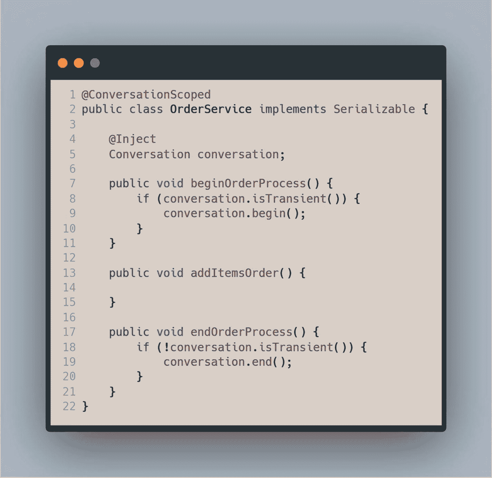

第 4 行在 bean 类型 `Conversation` 上使用了 `@Inject` 注解。这是一个字段注入点，你在此处请求 CDI 容器创建一个 `Conversation` bean 的上下文实例，并将其注入到提供的该类型的变量中。字段注入是迄今为止最流行，在我看来也是最直观的请求依赖关系的方式。

### 方法注入

方法注入是指一个方法使用 `@Inject` 注解，并带有一个或多个参数。这些方法被称为初始化方法，将由容器自动调用。方法注入点的所有参数必须是有效的 CDI bean。

### 构造器注入

构造器注入是指使用 `@Inject` 注解标记一个包含一个或多个参数的 Bean 构造器。所有参数都将由容器解析。每个 CDI Bean 只允许有一个构造器注入点。

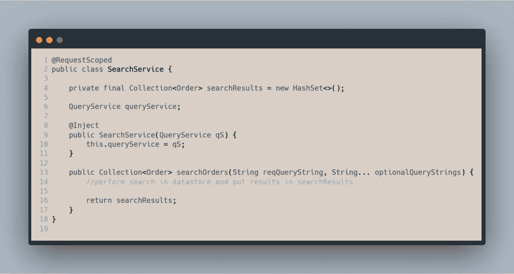

在下面修改后的 `SearchService` Bean 中，第 6 行声明了一个 `QueryService` 类型的字段，而 `QueryService` 本身也是一个 Bean。第 8 行在构造器声明（第 9 行）上使用了 `@Inject`，将一个 `QueryService` 实例注入到参数中。然后，你使用这个注入的参数来初始化第 6 行声明的 `QueryService` 字段。此外，在生产者方法和观察者方法中也有其他注入点，你将在本章稍后部分了解它们。

哪种注入点最好？

鉴于 CDI 支持的注入点，你可能会想知道哪种最好。它们在不同上下文中都很好。但根据经验法则，我始终倾向于使用字段注入。我发现它更易于阅读，并且从一开始就表明了意图。但请根据你的项目选择最适合的方式。

你现在已经了解了 CDI Bean、可以为其上下文实例分配的各种作用域，以及可以请求这些上下文实例的注入点。然而，CDI 有两种主要类型的 Bean。到目前为止你所看到的是所谓的*托管 Bean*。另一种类型的 Bean 是*会话 Bean*，不要与会话上下文混淆。

## CDI Bean 的类型

### 托管 Bean

托管 Bean 就是你在本书中到目前为止所看到的。它们是 Java 类，要么具有显式的 CDI 注解（适用于 `beans.xml` 文件中 `bean-discovery-mode` 设置为 `annotated` 的 Bean），要么具有隐式注解（适用于 `bean-discovery-mode` 设置为 `all` 的 Bean）。此外，一个 Bean 是托管 Bean 的条件是：

*   它不是非静态内部类。
*   它是一个具体类，或者使用 `@Decorator` 注解。
*   它有一个合适的构造器，满足以下条件之一：
    *   该类有一个无参构造器
    *   该类声明了一个使用 `@Inject` 注解的构造器

对于像下面这样的托管 Bean：

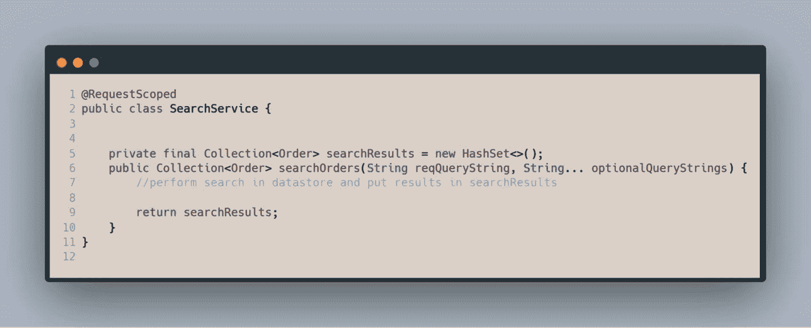

其 Bean 类型集合包括：

*   所有超类，直至 `java.lang.Object`
*   所有直接或间接实现的接口
*   Bean 类本身

### 会话 Bean

会话 Bean 是使用企业 JavaBeans^(¹⁸) 规范中的元数据进行注解的 Java 类。从技术上讲，本地的无状态、有状态和单例 EJB 会自动成为 CDI Bean，支持各种 CDI 服务，如注入、拦截和作用域管理。在 CDI 应用程序中使用 EJB 可以让你同时获得两个规范的特性。

创建会话 Bean 非常简单，如下代码所示。

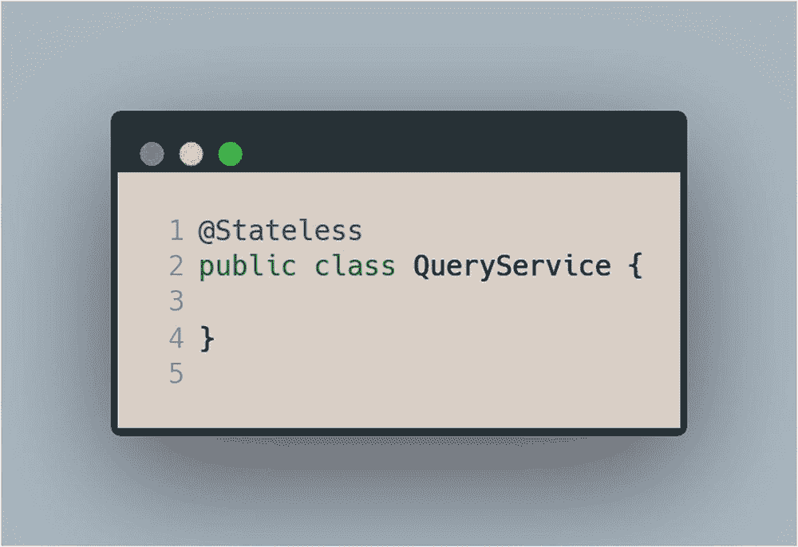

在这段代码中，`QueryService` 类使用了 `@Stateless` 注解。这使得该 Bean 既是 CDI 托管 Bean，又是无状态 EJB。你可以在任何可以注入托管 Bean 的地方注入此 Bean 的实例。EJB 规范旨在使业务组件的开发变得简单且几乎不费力气。

`QueryService` 上的 `@Stateless` 注解将其转换为一个默认具有事务方法的类。这个类会被池化、安全化，并具有其他你原本需要担心的有用特性。请务必查阅 EJB 规范，以了解该 API 的强大功能。

会话 Bean 的 Bean 类型包括：

*   所有超类，直至 `java.lang.Object`
*   所有直接或间接实现的接口（对于具有本地接口的 Bean）
*   Bean 类本身

## CDI 限定符

到目前为止，你已经学习了关于 CDI Bean 几乎所有需要了解的内容。然而，你可能会想知道，如果有两个或更多 Bean 实现了同一个接口，并且你想通过该接口进行注入，会发生什么。以餐厅应用程序为例，假设你有一个 `GenericOrder` 类型的接口，它有一个方法 `order()`，如下所示。

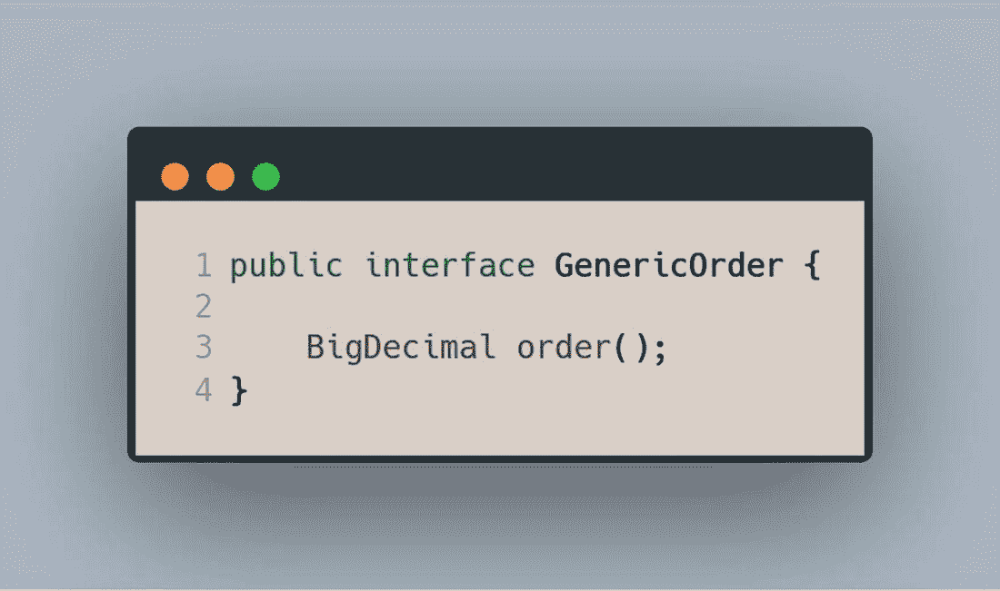

该接口有一个方法，返回给定订单的总金额。假设餐厅有一个网站，用户可以在上面登录并向厨房下自助订单以便配送。顾客也可以到店下单，由餐厅服务员或收银员将订单录入系统。

你想要修改 `@ConversationScoped OrderService` Bean，使其实现 `GenericOrder` 接口，而不是拥有自己的订单方法。如下代码所示。

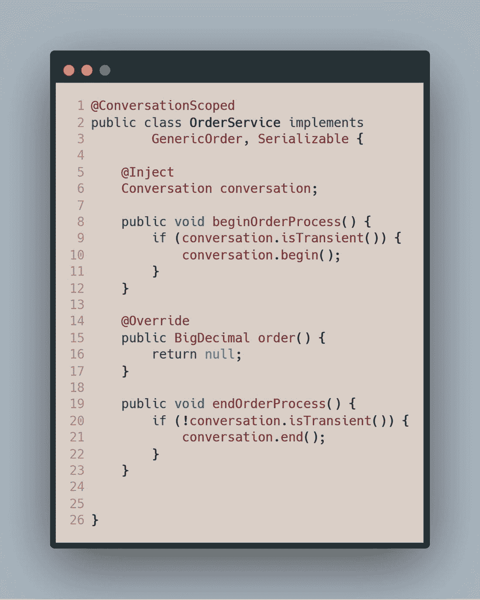

第 15 行实现了 `GenericOrder` 接口的 `order()` 方法。这个 `OrderService` 将用于处理实际到店就餐的顾客所下的订单。然后，你需要另一个名为 `SelfService` 的服务，它也将实现 `GenericOrder` 来处理在线客户。

以下代码展示了 `SelfService` 的实现。

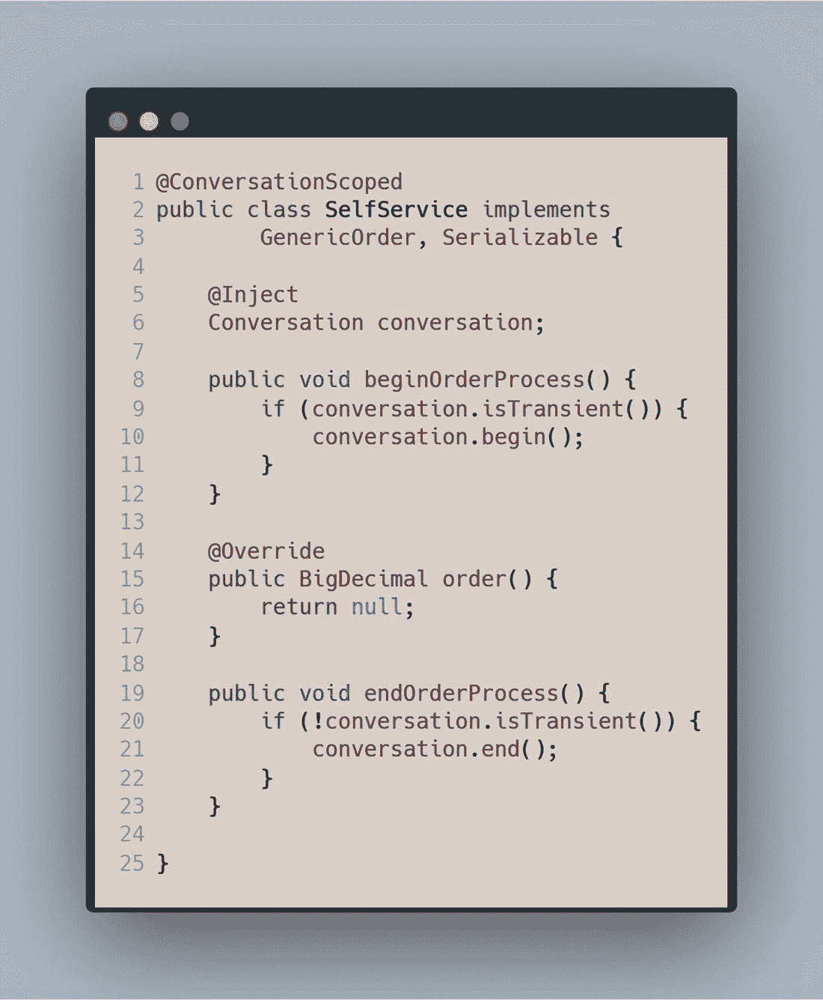

目前，`SelfService` 的实现与 `OrderService` 的实现完全相同。你现在将这两个实现分开，是因为将来在线下单的客户将在定价、奖励计划、抽奖以及你之后会引入的其他激励措施方面受到完全不同的对待。因此，现在就将这两个实现分开是一个好习惯，而不是等到应用程序变得非常复杂后再进行重构或引入新的实现。

所以现在你有两个类实现了同一个接口。尝试通过 `GenericOrder` 接口进行 `@Inject` 将会失败，如下所示。

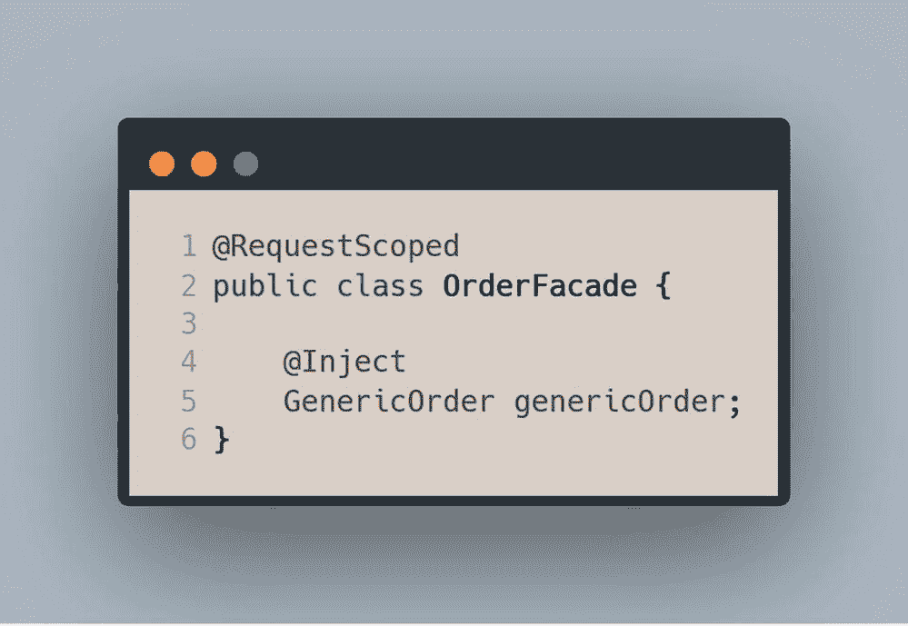

在这段代码中，你有一个名为 `OrderFacade` 的 CDI Bean，它是请求作用域的。这个 Bean 在第 5 行有一个 `GenericOrder` 类型的字段注入。这段代码可以正常编译，但部署时会失败。请记住，CDI 容器会验证归档文件，以确保你符合 CDI 规范的要求。

这段代码将无法通过 CDI 容器验证，并会收到一条消息，指出注入点 `GenericOrder` 存在歧义。这是因为你有多个类实现了 `GenericOrder` 接口，并且你正在通过该接口请求一个上下文实例。容器将不知道你想要哪个具体的 Bean 类型。

你会在自己的代码中遇到这类问题。为了防止这类歧义依赖问题，CDI 规范为你提供了*限定符*的概念。它们是你可以创建的注解，将其放置在你想要用此类注解标识的 Bean 上，然后通过注入点进行注解，如果你希望注入点解析到被注解的 Bean 类型的话。这听起来比实际复杂。让我们为订单服务创建两个限定符——`OnlineQualifier` 和 `InStoreQualifier`。

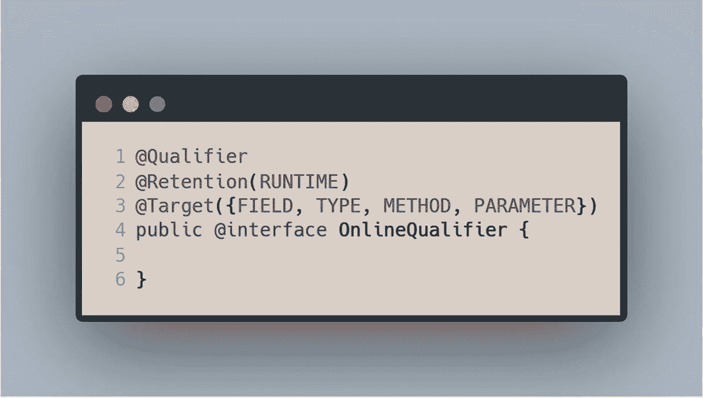

在这段代码中，第 4 行有一个名为 `OnlineQualifier` 的注解声明。这个注解使用了 `@Qualifier` 进行注解，这告诉 CDI 容器，你希望将你的 `OnlineQualifier` 注解视为一个 CDI 限定符。

代码的第 2 行和第 3 行设置了`OnlineQualifier`注解的保留策略和目标。这基本上就是你声明注解所需的全部内容。你可以使用相同的结构来声明`InStoreQualifier`，如下所示。

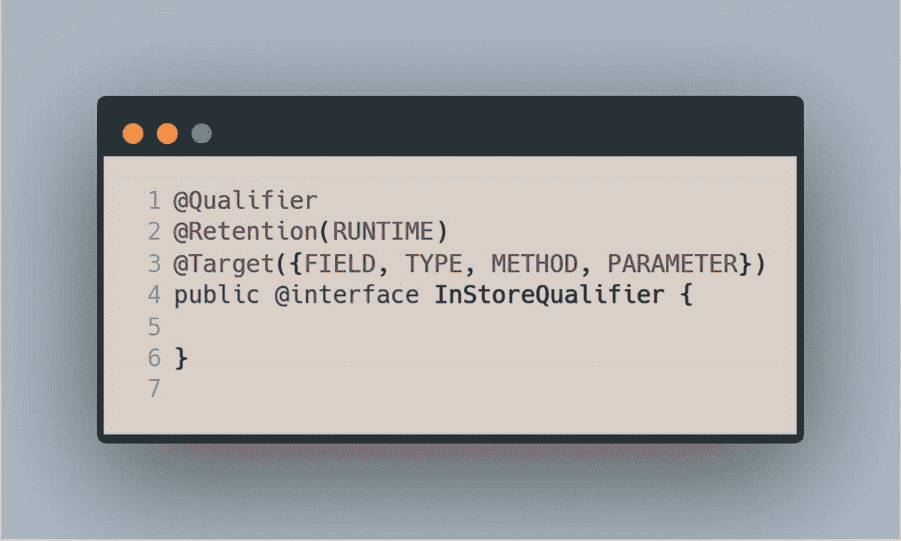

因此，声明了这些注解之后，你现在需要将它们与你想要使用的相应 Bean 关联起来。你使用`OnlineQualifier`来限定`SelfService` Bean，并使用`InStoreQualifier`来限定`OrderService` Bean。相应的代码示例如下所示。

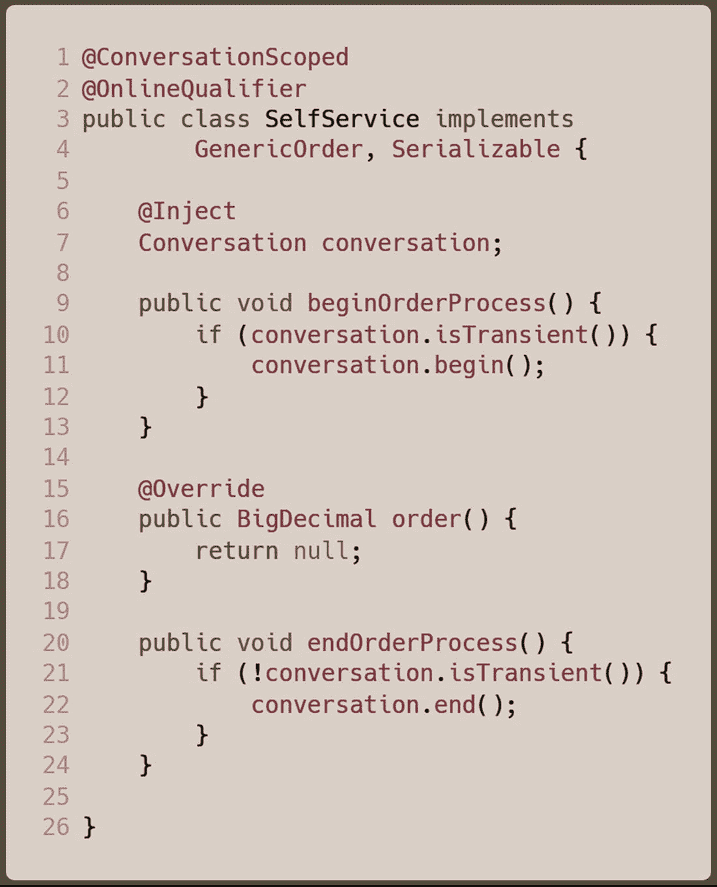

在前一段代码的第 2 行，`OnlineQualifier`与`SelfService` Bean 关联。

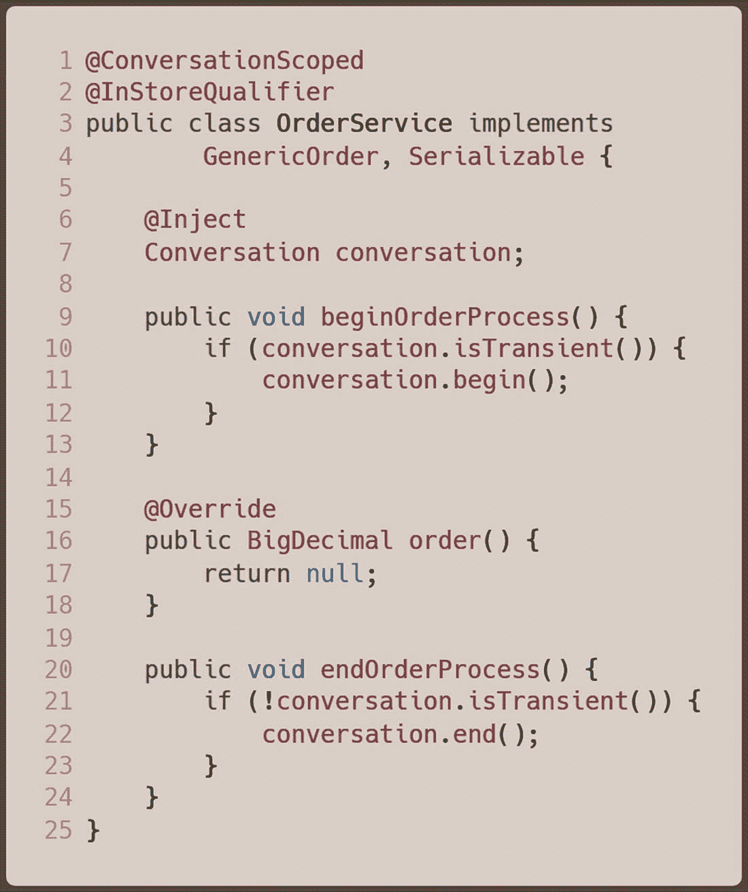

现在，`InStoreQualifier`与第 2 行的`OrderService` Bean 关联。因此，你现在有两个`GenericOrder`类型的 Bean，但带有不同的限定符。有了这个基础，你现在可以回到`OrderFacade` Bean，并对`GenericOrder`注入点进行限定。

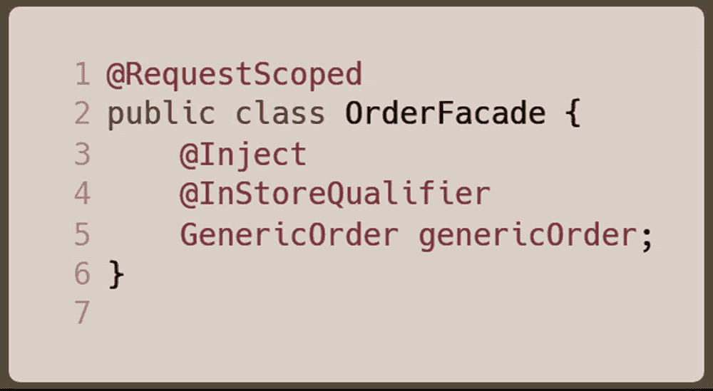

第 4 行使用`@InStoreQualifier`来告诉容器将`GenericOrder`类型解析为`OrderService`具体类型。这样，即使你通过一个由多个类实现的公共接口请求实例，类型解析也不会产生歧义。

你可以在同一个类中注入另一个`GenericOrder`字段，并使用`OnlineQualifier`对其进行限定，如下所示。

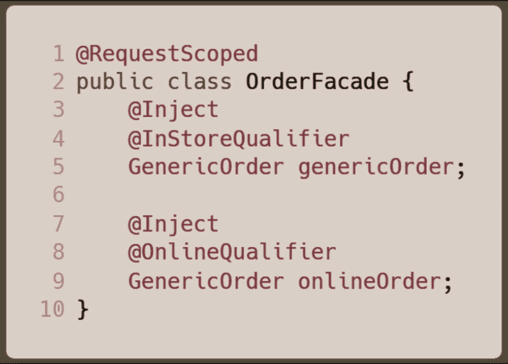

如你所见，`OrderFacade` Bean 中现在有两个字段注入点，两者都使用`GenericOrder`接口，但又都使用各自的具体类型限定符进行了限定。

这就是如何使用限定符来防止代码中的歧义，同时提高代码的可读性和可扩展性。不过，限定符还可用于更强大的任务，正如你将在本章的“事件”部分看到的那样。

### 内置限定符

除了能够创建自己的 CDI 限定符之外，CDI API 还附带了一些开箱即用的内置限定符。如下所示：

*   `@Any`^(¹⁹)：这是一个默认添加到所有 Bean 上的限定符，即使该 Bean 没有声明任何限定符。
*   `@Named`^(²⁰)：这是一个基于字符串的限定符，用于使被注解 Bean 的实例在弱类型环境（如 JSF 页面或 JavaScript）中可供引用。它也是最常用的注解。
*   `@Default`^(²¹)：当一个 Bean 除了`@Named`之外没有显式声明限定符时，会自动使用此限定符。
*   `@Initialized`^(²²)：此限定符用于限定当上下文初始化并准备就绪时自动触发的事件。你将在本章后面了解事件。
*   `@Destroyed`^(²³)：此限定符用于限定当上下文被销毁时自动触发的事件。

到目前为止，你已经学习了相当多的 CDI 知识，足以让你编写出更好的代码。然而，还有更多内容需要学习，所以让我们来看看 CDI 生产者的概念，它们是什么，以及如何使用它们。

## CDI 生产者

CDI 中的生产者是一种 API 构造，你可以使用它将你不拥有的 Bean 或类转变为 CDI 管理的 Bean，并附带限定符和作用域。回到餐厅应用程序，假设你想随时获取当前执行用户的用户名。有两种方法可以实现这一点。

第一种方法是简单地`@Inject` `UserSession` Bean，并在实例上调用`getUserName()`方法。第二种更具扩展性的方法是创建一个返回用户名的`String`类型生产者方法。这样，你可以`@Inject`到一个`String`类型的字段，容器就会知道从哪里获取你想要的内容。你可以通过限定你的生产者方法来锦上添花。

### 方法生产者

这比文字描述的要简单，所以让我们来看第一个返回当前执行用户名的生产者方法。

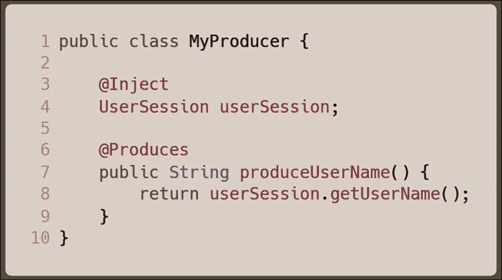

在这段代码中，你有一个名为`MyProducer`的 Bean（恕我缺乏想象力），它在第 4 行有一个`UserSession`类型的注入字段。第 7 行声明了一个名为`produceUserName()`的方法，该方法返回`String`类型。这个方法在第 6 行使用了`@Produces`^(²⁴)注解。这个注解将此方法转换为一个 CDI 生产者，容器将查询它以获取满足`String`注入类型的实例。

然后，你可以使用生产者方法将`String`类型注入到你的其他组件中，如下所示。

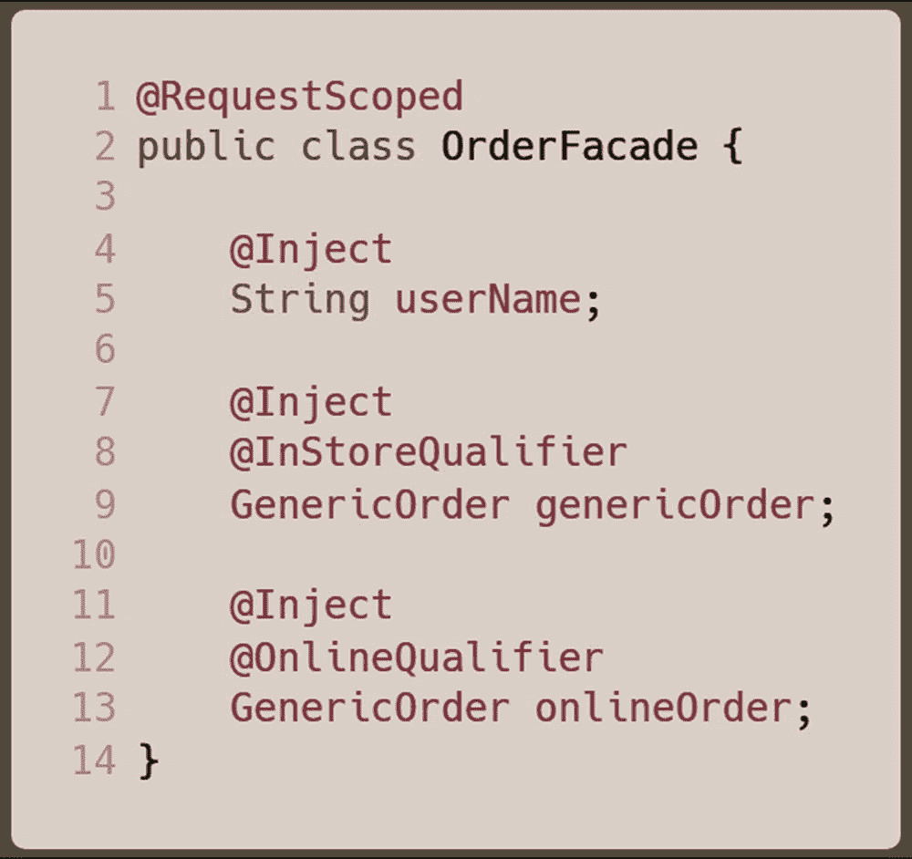

第 4 行使用`@Inject`来请求一个`String`类型的实例，注入到`OrderFacade` Bean 的`userName`字段（第 5 行）。假设你的应用程序中没有使用任何第三方代码，这应该可以正常工作。

然而，如果你使用了第三方库，像 OmniFaces^(²⁵) 这样的库就有返回`String`的生产者方法。在餐厅应用程序中，OmniFaces 库是应用程序依赖项的一部分。因此，`String`注入点会导致应用程序启动时容器验证失败，尽管代码编译没有问题。

在这种情况下，你可以使用限定符来限定生产者方法和注入点。请看这里的限定符声明：

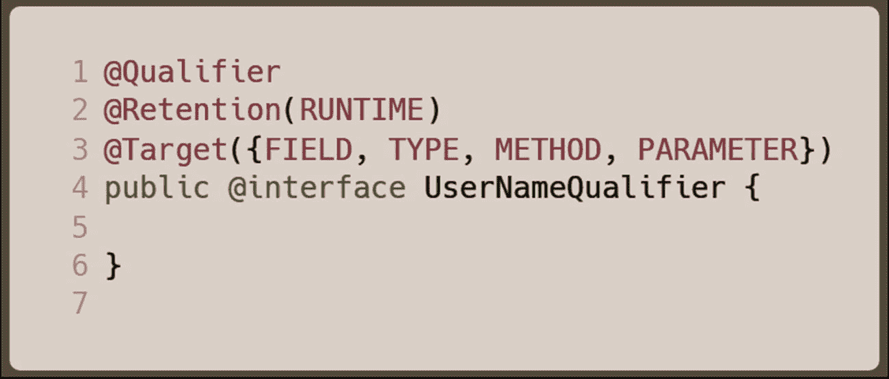

在前面的代码中，你声明了一个名为`UserNameQualifier`的限定符，并将其与生产者方法关联，如下所示。

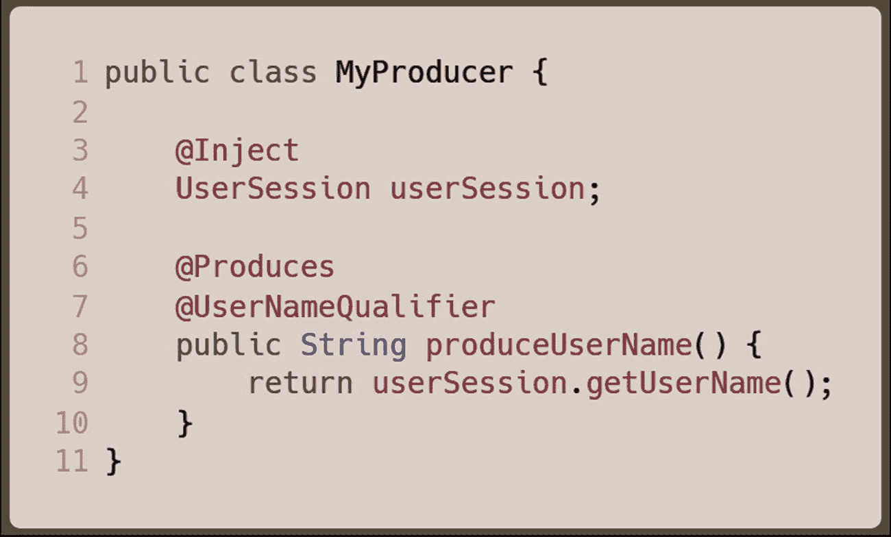

第 7 行使用`@UserNameQualifier`注解了`produceUserName()`方法，以确保你可以将此生产者方法与任何其他方法（无论是你自己的代码还是任何第三方库中的）区分开来。最后，你使用相同的限定符来限定注入点。

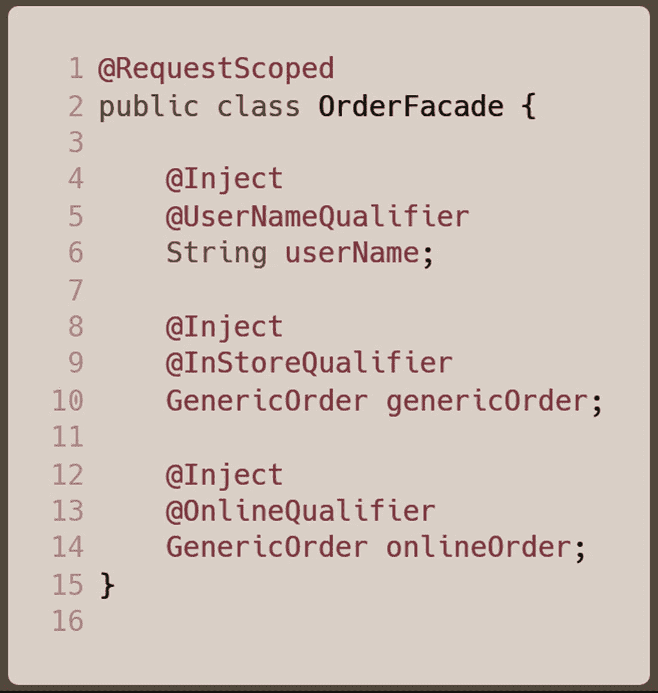

第 5 行使用`@UserNameQualifier`注解了`userName`字段，以告诉容器查询被注解的生产者字段以获取实例来满足此注入点。简而言之，这就是如何使用生产者方法。

到目前为止，你所看到的是生产者方法。你可以将生产者方法的返回类型限定到特定的作用域，而不是保留默认的`@Dependent`作用域。但是，有一个注意事项。根据 CDI API 的规定，“如果生产者方法有时返回 null 值，或者生产者字段在访问时有时包含 null 值，那么该生产者方法或字段必须具有`@Dependent`作用域。”

你可能会遇到代码请求`userName`时没有用户登录的情况。在这种情况下，你的生产者方法可能会返回 null，因此你将其保留为默认的`@Dependent`作用域。但是，请记住，你可以使用特定作用域注解你的生产者方法，并且该方法返回的类型将被放入该上下文中。

### 生产者字段

生产者字段与生产者方法类似，两者都充当上下文实例的来源。不过，生产者字段只是使用 `@Produces` 注解标注的 Bean 字段。与生产者方法一样，该注解字段同样可以被限定和设定作用域。生产者字段的一个典型用途是为 JPA 生成 `EntityManager`^(²⁶) 对象，如下所示。

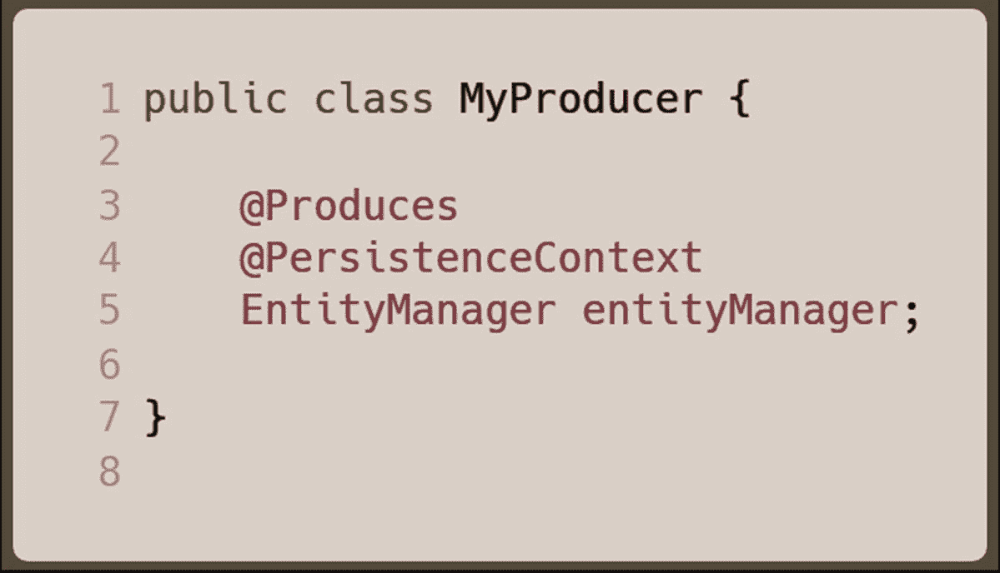

第 5 行声明了一个 `EntityManager` 类型的字段，第 4 行使用 `@PersistenceContext` 注解，第 3 行使用 `@Produces` 注解。这是一个经典的字段生产者案例，你通过使用来自两个 API 的注解来生成一个对象。`@PersistenceContext` 注解来自 JPA，用于将此 `EntityManager` 对象与持久化上下文关联起来。然后，你使用 CDI 的 `@Produces` 注解，使该字段能够满足代码中 JPA `EntityManager` 的注入点。

## CDI Bean 生命周期回调

到目前为止，我们已经讨论过，CDI Bean 由容器管理。你只需向容器请求实例即可。然而，有时你需要在 Bean 使用之前进行一些初始化或反初始化操作。

一个典型的例子是，在 UI 访问 Bean 之前，你需要从数据库中获取某种列表形式的数据以在 UI 中显示。另一个例子是在 Bean 被销毁之前，释放 Bean 中持有的系统资源。在你的应用程序中，你会经常遇到这些情况。

CDI API 提供了一些注解，你可以将它们放在方法上，将这些方法转换为自动调用的生命周期回调。

### @PostConstruct^(²⁷)

当一个 Bean 实例被完全构造完成，并且该 Bean 的所有依赖都已满足，但尚未投入使用之前，带有 `@PostConstruct` 注解的方法将被自动调用。

带有 `@PostConstruct` 注解的方法不能有返回类型，也不能接受任何参数（拦截器除外，你将在后面学习到它们，对于拦截器，它们可以接受一个 `InvocationContext`^(²⁸) 对象）。`@PostConstruct` 注解的方法可以是私有的、包内私有的、受保护的或公有的。

在这段代码中，你希望预先填充一个列表，其中包含登录使用在线门户的自助服务用户的最近 10 个订单。如下所示，在 `SelfService` Bean 中，你可以使用 `@PostConstruct` 回调方法。

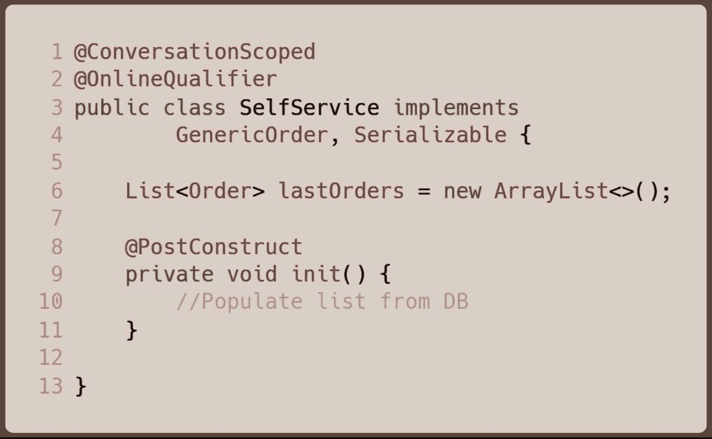

第 6 行声明了一个 `Order` 类型的 `List` 对象。第 8 行使用 `@PostConstruct` 注解将第 9 行的 `init()` 方法声明为回调方法。该方法签名很直接——它返回 void，命名为 `init`（这是我命名约定的一部分），并且声明为私有。在运行时，一旦 Bean 中的所有注入点都已满足，但尚未投入使用之前，容器将自动调用此方法。

### @PreDestroy^(²⁹)

此注解可用于那些应在容器销毁 Bean 实例之前被调用的方法。

到目前为止，你已经了解了各种 CDI API 结构是如何协同工作的。接下来，你将学习 CDI 拦截器的概念，了解它们是什么、解决了什么问题，以及如何创建它们。

### CDI 拦截器

对于每个应用程序，你都会遇到需要在 Bean 调用上动态执行任务的情况，而这些任务与 Bean 的核心功能是正交的。CDI 拦截器在本质上类似于 Spring 框架中使用的面向切面编程。一个典型的例子是日志记录和安全性。

例如，在你的代码中，你可能希望记录某些 Bean 上的方法调用。你可以手动在你想要记录方法调用的所有 Bean 中实现日志记录功能。然而，这会在 Bean 中实现并非其核心的功能。此外，由于日志记录功能是一个横切关注点，你应该将其从 Bean 中抽象出来。CDI 拦截器可以帮助你实现这一目标。

使用 CDI API 实现拦截器分为两个部分。第一部分是创建一个拦截器绑定注解。第二部分是将该拦截器绑定注解链接到一个将实现拦截器方法的 Bean。让我们首先在餐厅应用中创建一个拦截器绑定注解。

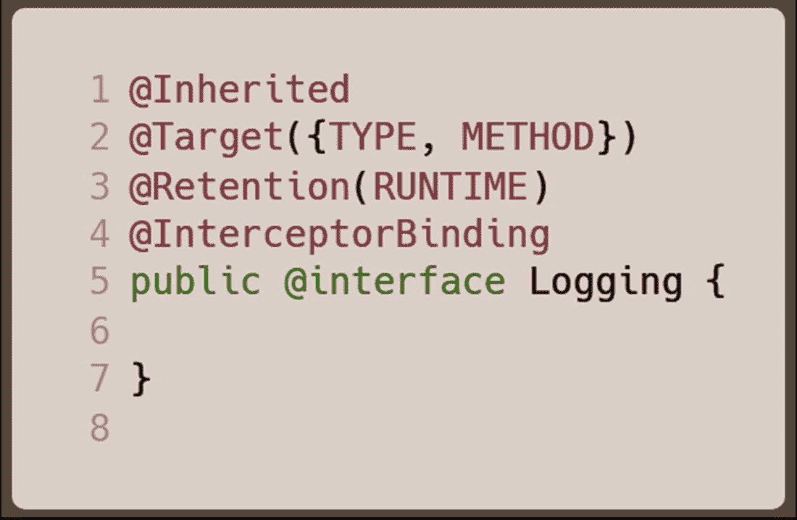

第 5 行声明了一个名为 `Logging` 的注解。你可以随意命名你的拦截器绑定注解。第 4 行使用 `@InterceptorBinding`^(³⁰) 注解来声明该注解是一个拦截器绑定注解。请注意，该注解的目标是 `Type` 和 `Method`，这意味着你可以对整个类或仅对该类的某个方法使用此拦截器。`@InterceptorBinding` 注解来自 `javax.interceptor` 包。现在，让我们实现将执行拦截器逻辑的 Bean。

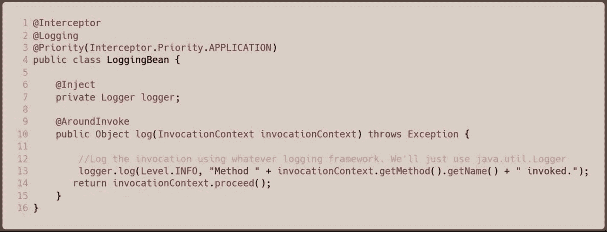

第 4 行声明了一个名为 `LoggingBean` 的类，第 1 行使用 `@Interceptor` 注解。该注解使此类成为一个拦截器 Bean。第 2 行使用 `@Logging` 拦截器注解对同一个类进行注解。这将注解链接到了此类。这意味着每当你使用 `@Logging` 注解注解一个方法或类时，CDI 容器将实例化此类来执行拦截器的逻辑。

第 3 行还使用 `@Priority` 注解对该类进行注解，并将 `Interceptor.Priority.APPLICATION` 作为参数传入。在 Java EE 7 之前，你需要通过 XML 配置文件来激活拦截器。然而，在 7 版本之后，你可以使用 `@Priority` 注解来激活并对拦截器进行排序/设置优先级。在这种情况下，你传递给它的是 `APPLICATION` 常量，它只是一个 `int` 值。

第 10 行声明了一个名为 `log()` 的方法，该方法接受一个 `InvocationContext`^(³¹) 类型的对象作为参数，返回 `Object`，并抛出 `Exception`。该方法在第 9 行使用 `@AroundInvoke` 进行注解。`log()` 方法是你实现拦截器逻辑的地方，它使用注入的记录器（第 6 行和第 7 行）来记录被调用的方法名称。在此方法中，你可以实现任何横切类的逻辑。

`InvocationContext` 对象是一个 Bean，它为你提供有关——请敲鼓——该拦截器被分派到的调用上下文的信息。它提供了一些方法，你可以使用这些方法来获取信息：如果拦截器是为方法分派的，则获取关于 `method` 参数的信息；如果拦截器是为类分派的，则获取关于构造函数的信息；`get` 和 `set` 方法参数；以及一个用于告诉容器继续调用下一个拦截器（如果没有更多拦截器，则继续调用方法）的方法。

第 14 行调用了 `InvocationContext` 上的 `proceed()` 方法。这会告诉容器，如果分派了多个拦截器，则继续执行下一个拦截器；如果这是唯一的拦截器，则继续执行方法调用。

假设你正在实现安全性而不是日志记录，并且在执行一些安全检查后，你的代码确定当前正在执行的用户不应调用此拦截器所分派的目标方法，你可以返回 `null`，容器将不会继续调用目标方法。

实现拦截器后，要使用它，你只需在你想要记录的、给定 Bean 中的方法上添加注解即可。现在，你可以在你的 `OrderService` Bean 上记录方法调用的顺序。

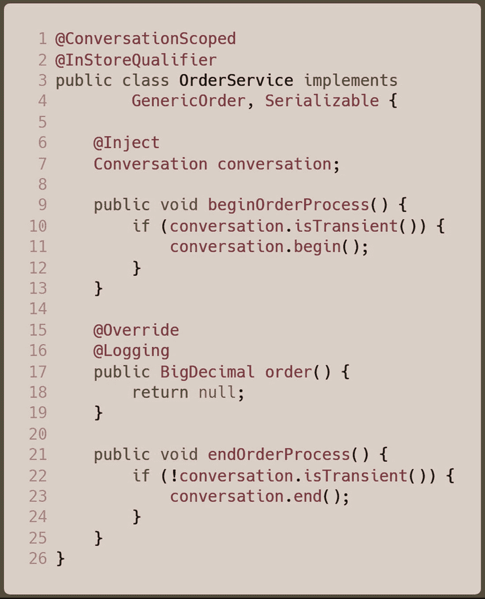

第 16 行使用 `@Logging` 注解来记录 `OrderService` Bean 上 `order()` 方法的调用。每次调用此方法都会导致容器分派拦截器。由于你在拦截器逻辑实现的末尾要求继续调用，因此在记录日志后，调用将继续执行 `order()` 方法。

这就是使用 CDI API 实现拦截器的简单方法。你创建你的拦截器绑定注解，然后将该注解链接到一个拦截器 Bean，该 Bean 包含一个使用 `@AroundInvoke` 注解的方法，该方法实现了你的拦截器逻辑。要使用你的拦截器，你只需使用你的拦截器注解来注解任何方法或类（取决于你的拦截器注解目标）。接下来，你将了解 CDI 事件、它们是什么、为什么要使用它们、如何创建它们以及如何使用它们。让我们开始吧。

## CDI 事件

### 同步事件

CDI 事件是一种 API 构造，它帮助你的应用程序组件在没有任何编译时依赖，甚至彼此互不知晓的情况下进行通信。它涉及一个事件对象（可以是任何有效的 Java 类型），可选地带有限定符，以及一个或多个事件监听器，同样可选地带有限定符。

`Event`^(³²) 对象会触发其负载类型的事件，CDI 容器会根据事件负载类型以及可选的限定符，自动调用正在观察该特定事件的观察者。在餐厅应用程序中，假设你想要一个功能：向在线下单的用户发送一条短信，以确认收到订单并告知预计送达时间。

你可以使用事件来实现这样的功能。首先，你需要一个带有合适负载的 `Event` 对象，以及一个观察相同负载事件类型的观察者。以下是代码实现。

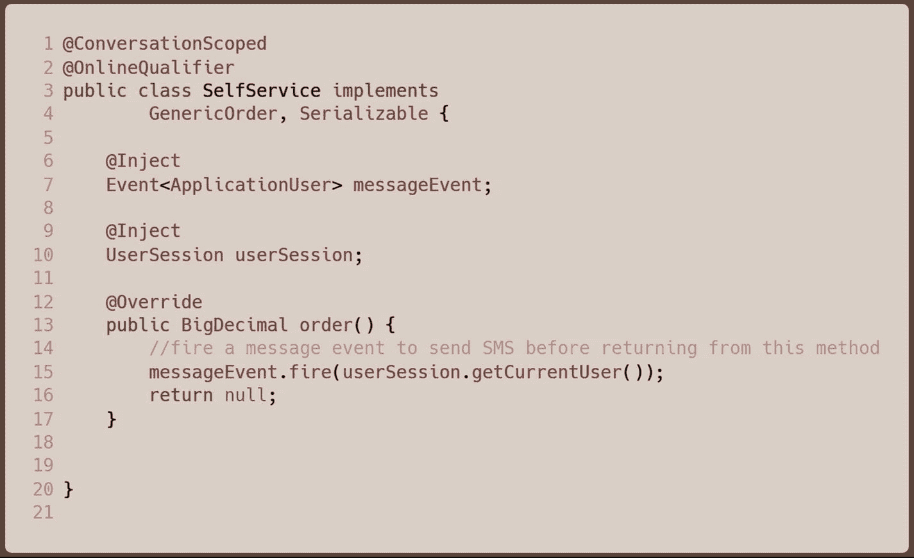

你首先在第 7 行使用 `@Inject` 来请求一个类型为 `ApplicationUser` 的 `Event` bean。事件接口是 CDI 事件机制的起点。然后，在第 15 行的 `order()` 方法中，使用注入的 `Event` 实例，通过 `fire(T event)` 方法来触发一个 `ApplicationUser` 事件。

因为 `Event` bean 的类型是 `ApplicationUser` 对象（第 7 行），所以用于触发事件的 fire 方法必须传入一个 `ApplicationUser` 类的实例。这就是事件负载，即传递给事件观察者的数据，在此例中，它也用于选择要为该事件调用哪些观察者。你在 `SelfService` 类中使用注入的 `UserSession`（第 9 行和第 10 行），通过调用 `getCurrentUser()` 方法（第 15 行）来获取当前正在执行的用户。

`ApplicationUser` 类是一个对应用程序用户进行建模的 bean，如下所示。

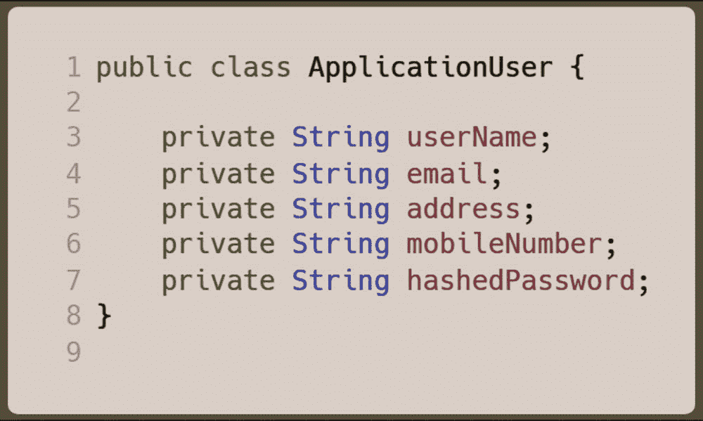

更新后的 `UserSession` bean 如下所示。

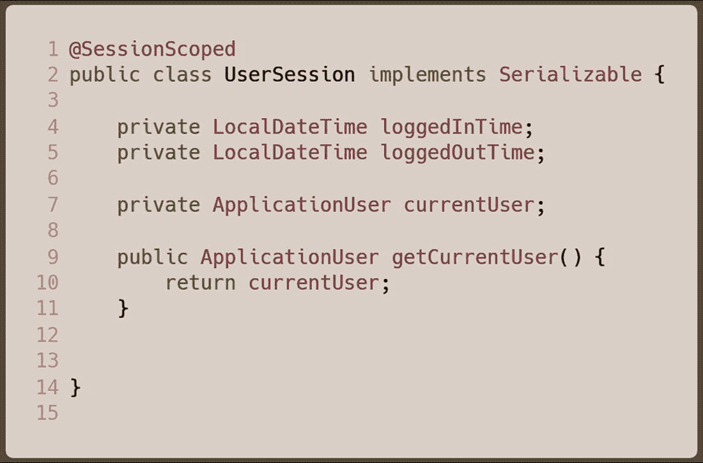

`UserSession` bean 现在在第 7 行有一个类型为 `ApplicationUser` 的字段。在用户成功向系统验证身份后，这个字段将由某种安全层以某种方式设置。目前，你只需按原样使用它。

事件触发后，你至少需要一个观察者来监听该特定事件。由于此事件没有显式的限定符，事件观察者将根据其正在观察的事件负载类型来选择。以下是观察者代码。

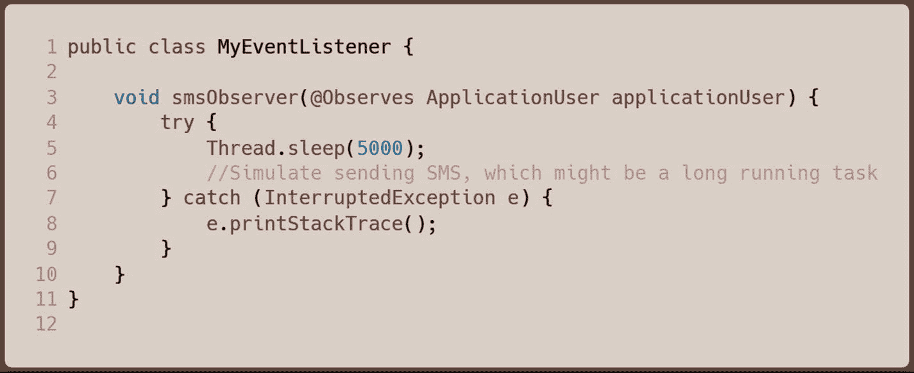

事件观察者在一个类型为 `MyEventListener` 的 bean 类中声明。它有一个名为 `smsObserver` 的方法，该方法接受一个 `ApplicationUser` 类型的参数。这个方法中唯一新的 CDI API 是 `@Observes` 注解。这个注解将此方法转换为事件类型 `ApplicationUser` 的 CDI 观察者，用于观察从 `SelfService` 类触发的事件。

在运行时，当从 `SelfService` 类触发一个事件时，容器会遍历所有事件观察者，寻找观察该特定触发类型的事件。一旦找到这个方法，它就会调用该方法，并传入传递给事件对象 fire 方法的负载。

在观察者中，你模拟了一个发送短信的长时间运行任务，由于涉及网络通信，这可能需要一些时间。一旦方法返回，执行流程将返回到事件触发点，然后从那里继续执行。

声明事件观察者有一些规则：

*   返回类型必须是 void。
*   必须至少有一个参数使用 `@Observes` 注解，用于指定要观察的事件类型。
*   观察者方法中的其他参数必须是能够被注入的 CDI 托管 bean。
*   观察者必须在 CDI bean 中声明。

如上所示，使用 CDI 触发和观察事件非常容易且直观。你可能已经注意到，事件观察者与 `SelfService` 类没有任何关系。`MyEventListener` bean 对任何触发事件的 bean 都一无所知。你可以为同一事件类型设置多个事件触发点，每次你的事件观察者都会被调用，而所有组件之间互不知晓。仔细想想，这非常引人注目。

### 异步事件

然而，你可以改进餐厅应用程序代码中的这个事件机制。如果你注意到，`MyEventListener` 类中的事件观察者执行了一个阻塞任务。你可能希望通过将长时间运行的任务生成到新线程中来提高此应用程序的响应能力。因此，与其在触发事件的同一个线程中发送短信，不如在另一个线程中执行。你能用 CDI 的事件机制做到这一点吗？当然可以。以下是实现方法，从事件触发端开始。

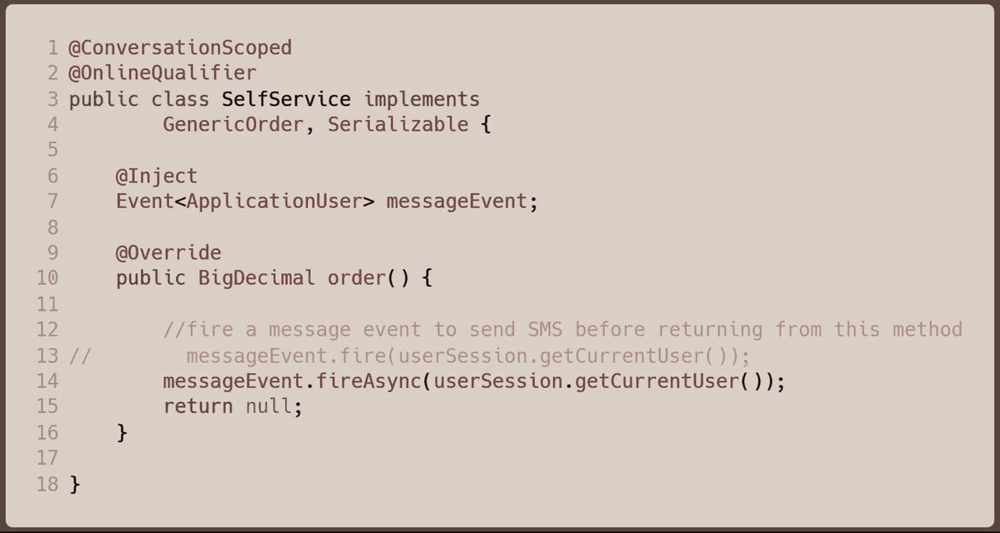

在这段代码中，你使用同一个注入的 `Event` 对象（第 7 行和第 8 行）在第 14 行触发一个 `ApplicationUser` 事件。然而，不同之处在于，你调用了 `fireAsync` 方法，而不是普通的 fire 方法。此方法会触发一个异步事件，供所有异步观察者监听。异步事件会立即返回控制权。观察者方法会同时或异步地执行。以下是异步事件观察者的实现。

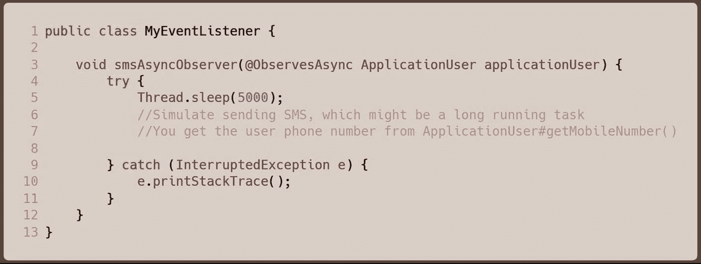

第 3 行声明了一个方法 `smsAsyncObserver`，它接受一个 `ApplicationUser` 对象作为参数。唯一的新东西是你用于该参数的注解。与之前的 `@Observes` 不同，代码使用了 `@ObservesAsync`。这就是创建观察者来监听异步事件的方法。

因为这段代码只有一个异步触发点和一个相同负载类型的异步观察者，所以这个观察者将被调用。最棒的是，这个观察者不会阻塞。一旦它被调用，执行流程将返回到 `SelfService` bean 中的 `order()` 方法。这样，你就可以方便地发送短信，而不会影响应用程序的响应能力。这就是在 CDI 中实现异步事件的方法。但还不止这些。

你可以使用限定符来触发和观察相同类型的事件，但用于不同的目的。你可以在注入点限定事件对象，在声明点限定观察者。然后，容器将根据限定符将观察者与事件关联起来。实现起来非常轻松。

### 限定事件

假设在你的应用程序中，你决定向所有客户发送短信，无论是自助服务客户还是堂食客户。但是，你希望为这两类客户提供不同的消息内容。为此，你需要使用必要的限定符来限定你的事件和观察者。

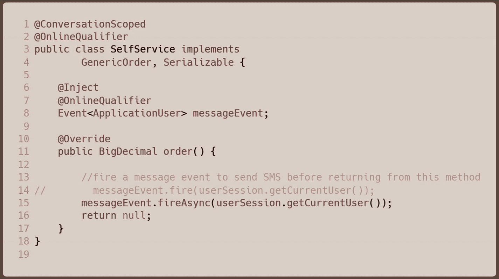

这段代码只有一处改动。在第 7 行，你使用`@OnlineQualifier`来限定注入的事件对象。这会将此事件标记为已限定，并且只会被具有相同限定符的观察者监听。以下是观察者。

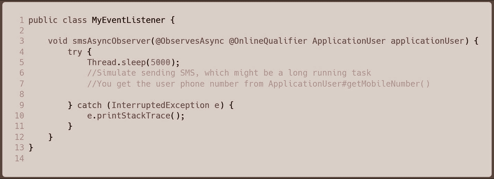

`async`观察者与之前相同，只是第 3 行的方法参数不同，你在这里用`@OnlineQualifier`注解了`ApplicationUser`。这个单一的注解将此观察者与`SelfService`中的事件关联起来。现在，你可以在`SelfService`类中触发一个异步事件，并让这个观察者被调用。然而，如果你只有一个事件触发点和一个观察者，这一切都毫无用处。当你拥有多个事件时，限定事件的能力才会发挥作用。来看看这个场景。

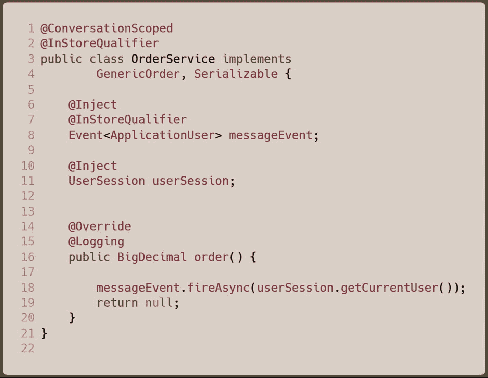

这段代码展示了`OrderService` bean，它有两个新字段——`Event`和`UserSession`。第 8 行的事件对象在第 7 行用`@InStoreQualifier`进行了限定。然后，在第 18 行，当顾客下单后，你触发了一个异步事件。这个被触发的事件只能被`@InStoreQualifier`限定的观察者观察到，如下所示。

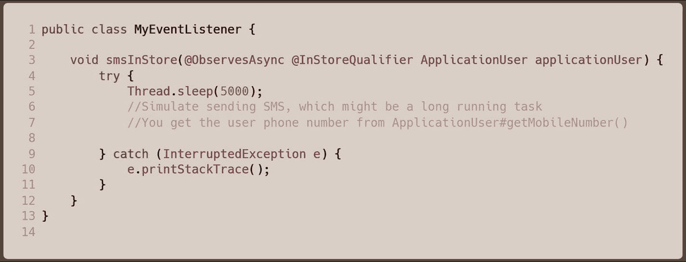

在这段代码中，你在第 3 行声明了一个名为`smsInStore`的观察者，它有一个参数类型——`ApplicationUser`。这个参数被注解为`@ObservesAsynch`和`@InStoreQualifier`，有效地使这个观察者负责处理从`OrderService`类触发的事件。这就是如何组合各种 CDI API 构造来创建非常强大的应用程序，同时让你的代码易于阅读和维护。

### 事务性事件观察者

所有事件观察者都会在事件触发时被调用。然而，有时你需要事件观察者在事务的特定时间点被调用。例如，假设你的应用程序中有一个`ApplicationUser`类。你希望向成功注册应用程序的自助服务用户发送一封欢迎邮件。但是，你只希望在用户成功持久化到数据存储中时发送邮件，或者更技术地说，当事务成功完成时。

为此，你创建一个新的限定符`CreateUserQualifier`，触发一个事件，并声明一个事务性观察者，该观察者仅在事务成功完成时被调用。代码从限定符开始。

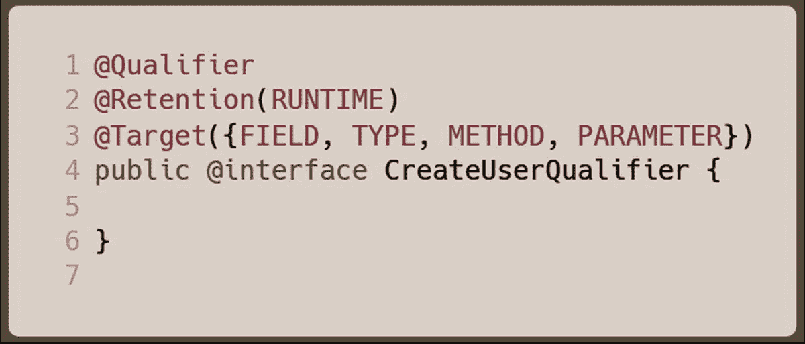

第 4 行显示了一个名为`CreateUserQualifier`的注解声明，其必要的限定符元数据在第 1-3 行声明。

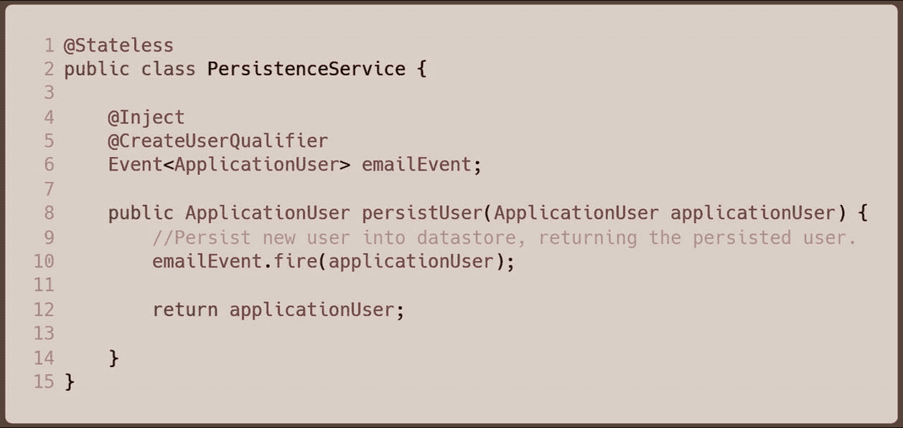

这段代码的第 2 行声明了`PersistenceService` bean，它被设置为一个无状态 EJB（第 1 行）。你在第 6 行注入了一个事件对象，该对象在第 5 行用`@CreateUserQualifier`进行了限定。该类随后在第 8 行声明了一个名为`persistUser`的方法，该方法接受一个`ApplicationUser`对象作为参数。在这个方法中，你将使用某种数据 API 将用户存储到数据存储中。然后，你在第 10 行以`ApplicationUser`对象作为负载触发一个事件。

因为`persistUser`方法是在 EJB 中声明的，它将在事务上下文中执行。所以你知道事件是在事务上下文中触发的。现在你可以检查这个事件的观察者。

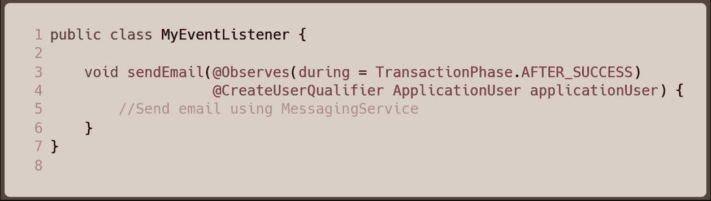

第 3 行声明了一个名为`sendEmail`的观察者，它接受一个`ApplicationUser`作为负载。它用`@CreateUserQualifier`限定，并用`@Observes`注解。然而，这一次，`@Observes`注解为`during`参数设置了一个值。`@Observes`注解的`during`字段的值可以设置为以下任意一项：

*   `TransactionPhase.IN_PROGRESS`：事件观察者在事件触发时被调用，不考虑事务阶段。这是你到目前为止看到的所有`@Observes`的默认值。

*   `TransactionPhase.BEFORE_COMPLETION`：事件观察者在事务的完成前阶段被调用。

*   `TransactionPhase.AFTER_COMPLETION`：事件观察者在事务的完成后阶段被调用。

*   `TransactionPhase.AFTER_FAILURE`：事件观察者在事务的完成后阶段被调用，但仅在事务失败时。

*   `TransactionPhase.AFTER_SUCCESS`：事件观察者在事务的完成后阶段被调用，但仅在事务成功完成时。

最后一个值在观察者声明中被使用。你希望这个观察者仅在持久化新用户的事务成功完成时被调用，在这种情况下，你确定用户已经持久化到数据存储中。向一个未成功注册的用户发送欢迎邮件是没有意义的。

脚注 1   2   3   4   5   6   7   8   9   10   11   12   13   14   15   16   17   18   19   20   21   22   23   24

