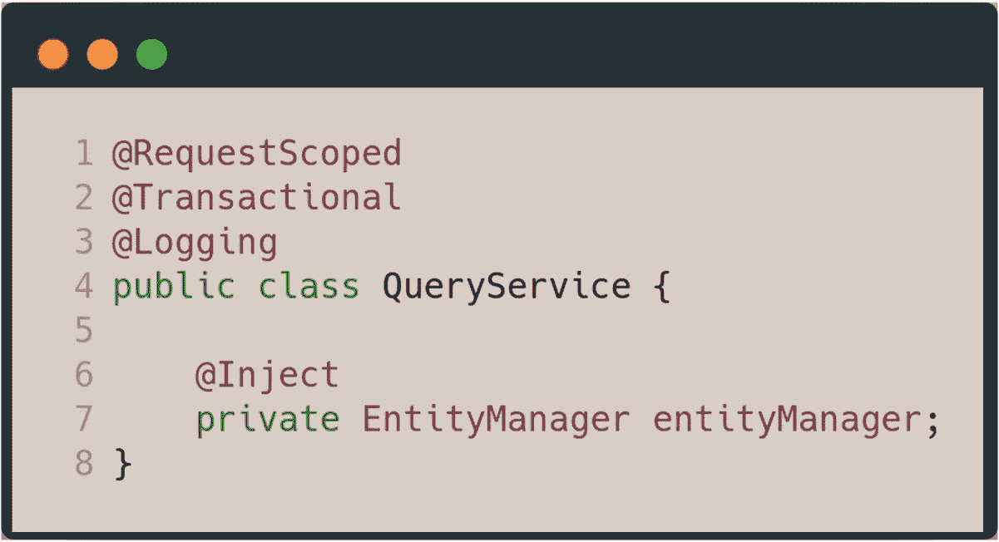
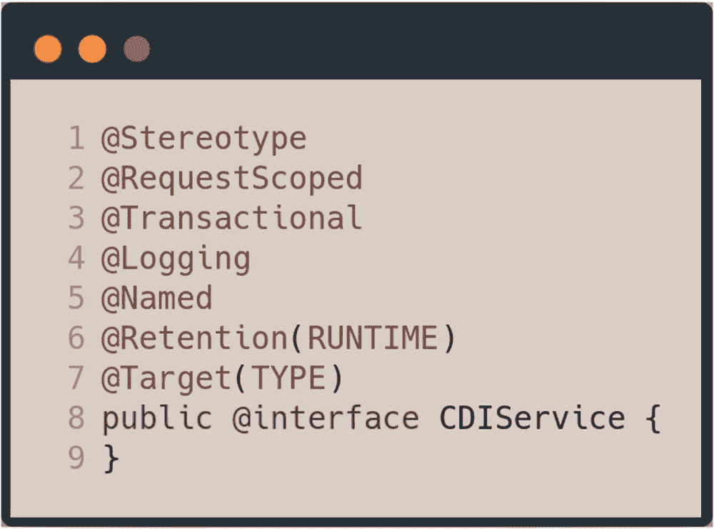
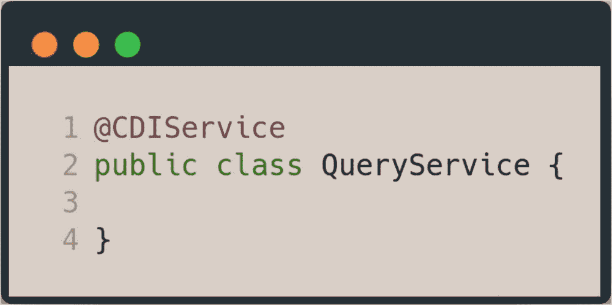

# 9. CDI 原型

CDI 原型是一种 API 构造，它帮助你将相似的架构模式组合成一个注解。在第八章 8 中介绍的餐厅应用程序里，有一个名为 `QueryService` 的类，你需要将其转换为一个事务性的、可记录日志的、请求作用域的 Bean，以便在数据层执行查询服务。

现在假设这个需求也适用于其他 Bean。这意味着 `QueryService` 将如下所示。

第 1-3 行使用了 `@RequestScoped`、`@Transactional` 和 `@Logging` 注解来声明 `QueryService` Bean。`@Transactional` 注解是来自 Java 事务 API 的一个拦截器。`@Logging` 是日志记录拦截器。如果应用程序增长，并且需要更多的服务层类，那么每一个这样的类都必须重复这些注解。

使用 CDI 原型，你可以将这些常用的注解组合成一个注解，这样使用单个原型就会激活所有其他注解。你可以声明一个 `CDIService` 原型，用于 `QueryService` 类，如下所示。

这段代码片段声明了一个名为 `CDIService` 的原型，在第 1 行使用了 `@Stereotype` 注解。第 2 行随后声明此原型具有请求作用域。第 3 行声明 `CDIService` 是 `@Transactional` 的，这意味着任何使用 `@CDIService` 注解的类中的每个方法都将作为事务运行。第 4 行声明了 `@Logging`，使 `@CDIService` 可记录日志。第 5 行随后使用名为 `@Named` 的 CDI 限定符，使任何带有 `@CDIService` 注解的类都可用于任何 JSF 页面。第 6 行将保留策略声明为 `RUNTIME`，第 7 行将目标声明为 `TYPE`，这意味着 `@CDIService` 只能用于类上。

现在，你可以将这个新创建的原型应用于 `QueryService` Bean，使其立即成为一个请求作用域的、事务性的、可记录日志的、命名的 Bean。

这段代码片段中的第 1 行展示了在 `QueryService` 上使用 `@CDIService` 原型。因此，你用一个注解就替代了（并且避免了繁琐重复的）四个注解。

这就是如何使用 CDI 原型来简化和精简你的代码。如果你需要将数据层服务类的作用域从请求作用域改为应用程序作用域，你只需更改原型定义级别的作用域，这将立即应用于所有带有 `@CDIService` 注解的 Bean。

