# 10. CDI 生态系统

上下文和依赖注入（CDI）API 是整个 Jakarta EE 平台的核心。CDI 提供了一个强大的服务提供者接口（SPI），允许第三方库为该平台创建可移植扩展。实际上，CDI 使得其他项目能够轻松地集成到 Jakarta EE 中。

一个可移植扩展可以通过以下方式集成到平台中：

*   将其 Bean、拦截器和装饰器提供给容器
*   使用依赖注入服务将依赖项注入到其对象中
*   为自定义作用域提供上下文实现
*   使用来自其他来源的元数据来增强或覆盖基于注解的元数据

两个著名的 CDI 扩展是 Apache Delta Spike^(³³) 和 Eclipse MicroProfile^(³⁴) 项目。

## Eclipse MicroProfile

Eclipse MicroProfile 是一个由 Eclipse 基金会领导的项目，旨在使 Jakarta EE 平台成为云原生企业开发的选择。它提供了许多 API，这些 API 共同构成了一个强大的工具集，用于创建弹性、可移植的企业级 Java 应用程序。

MicroProfile 中最明显的 CDI 扩展是 Config API。MP Config API 旨在简化不同环境中、来自不同来源的应用程序配置，而无需重新部署或重启应用程序。

一个应用程序可能为不同的请求需要不同的端口号，或者某些功能需要根据特定配置来开启或关闭。Config API 旨在将应用程序配置外部化，以便可以在不重启/重新部署代码的情况下进行更改。

要开始使用 MicroProfile，你需要将依赖项添加到你的项目中，如下所示。几乎所有 Jakarta EE 应用服务器都支持 MP。

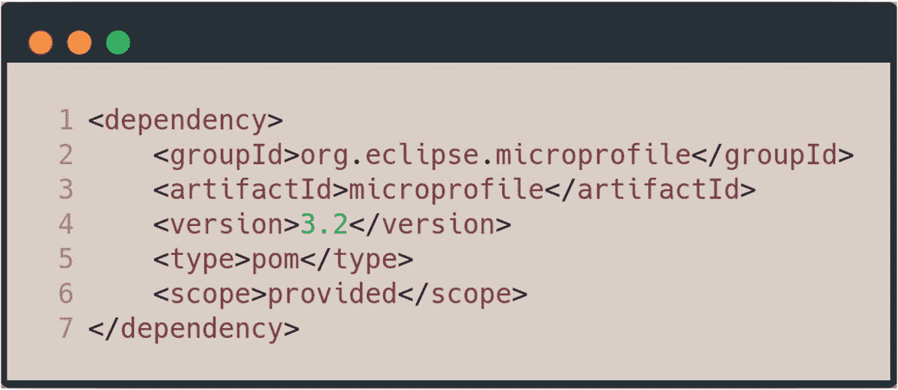

这段代码片段将最新的 MicroProfile API 添加到你的项目依赖项中，使你能够访问整个子项目套件。例如，假设在餐厅应用程序的 `SelfService.java` 类中，你需要一个可配置的字符串，其中包含供自助服务客户使用的欢迎消息。

为此，你首先需要在应用程序中创建至少一个配置源——一个获取值的地方。以下代码片段显示了位于 `META-INF` 文件夹中的 `microprofile-config.properties` 文件。

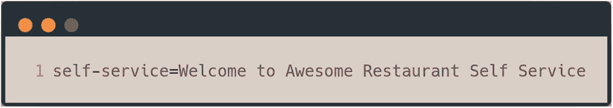

这段代码片段显示了一个名为 `self-service` 的键，它有一个字符串值。要在你的代码中使用它，你只需创建一个 `String` 字段，并使用 MicroProfile Config API 中的限定符将此值注入其中，如下所示。

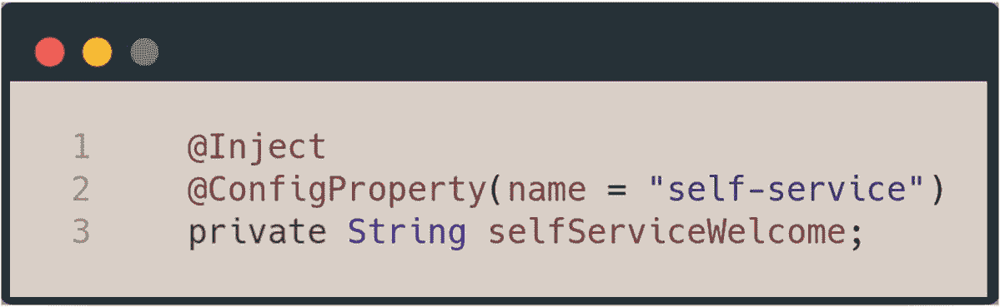

这段代码片段的第 1 行使用了 `@Inject` 注解，结合第 2 行的 `@ConfigProperty`，来注入属性文件中定义的字段的值。`@ConfigProperty` 是一个 MicroProfile Config 限定符，它接受两个参数——`name` 是你想要的配置值的键，以及当任何配置源中都没有值时使用的默认值。

在这段代码中，你将 `@ConfigProperty` 注解的 name 设置为 `self-service` 字符串的键。你也可以定义一个默认值，如下所示，以便在属性文件或任何其他配置源中没有值时，将其注入到 `selfServiceWelcome` 字段中。

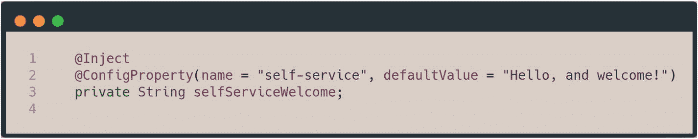

从这段代码片段来看，在没有值的情况下，默认值 `“Hello, and welcome”` 将被注入到 `selfServiceWelcome` 字段中。`@ConfigProperty` 被定义为一个 CDI 限定符，如下所示。

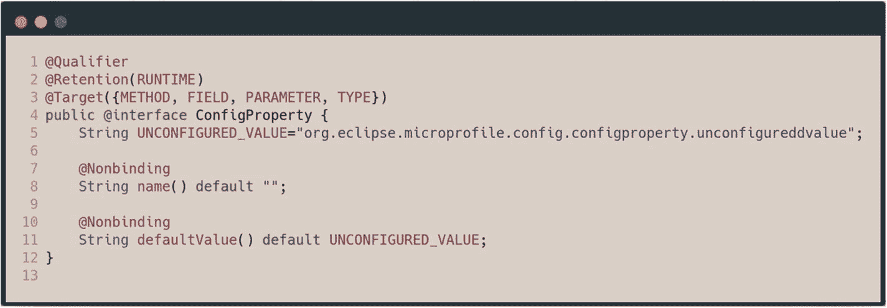

第 1 行将注解 `ConfigProperty` 声明为一个限定符。第 8 行和第 10 行都声明了该注解的两个参数——`name` 和 `defaultValue`。如你所见，`@ConfigProperty` 注解是一个普通的 CDI 限定符，MicroProfile Config API 利用它来帮助外部化应用程序配置。

`@ConfigProperty` 的使用是静态的，因为即使配置源中的值发生变化，这些值也不会改变。因此，在这个例子中，即使 `self-service` 配置属性条目的值发生了变化，注入的字段也不一定会改变。要真正获得动态配置值，你可以将另一个 CDI 构造与 Config API 结合使用，如下所示。

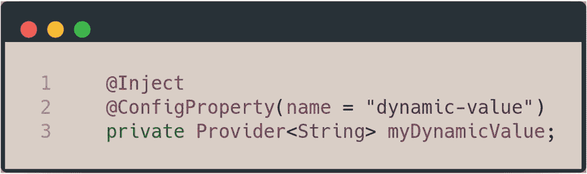

第 1 行和第 2 行在 `myDynamicValue` 字段上使用了 `@Inject` 和 `@ConfigProperties`。然而，`myDynamicValue` 的类型是来自 CDI API 的 `Provider`，其定义如下所示。

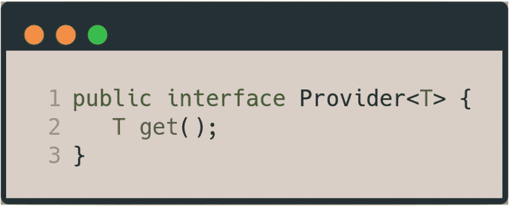

`Provider` 是 CDI API 中的一个参数化接口，它有一个方法 `get()`。该方法返回参数化类型。正如前面代码中所使用的，将 `myDynamicValue` 的类型设置为 `Provider` 意味着，每次对其调用 `get()` 方法时，都会返回一个类型为 `String` 的新实例，该实例可能包含来自配置源的最新值。以下代码片段展示了将对 `myDynamicValue` 调用的 `get()` 方法进行日志记录。

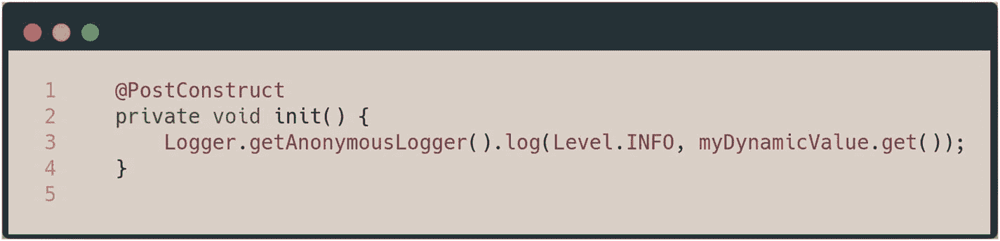

整个 MicroProfile 项目都构建在 Jakarta EE 平台之上，因此，它利用该平台的能力来帮助你构建云原生的企业级 Java 应用程序。

## Apache Delta Spike

Delta Spike 是一个 Apache 顶级项目，其模块以 CDI 扩展的形式存在，为你的 Jakarta EE 应用程序提供额外的功能。其中一些模块包括 JSF、Scheduler、Security 和 Data。本节将介绍 Data 模块。

Data 模块提供了实现仓储模式的能力，从而简化了仓储层。仓储模式非常适合那些需要样板代码的简单查询，它能够集中查询逻辑，从而减少代码重复并提高可测试性。^(³⁵)

对于餐厅应用程序，你可以将 `ApplicationUser` bean 转换为 JPA 实体，如下所示。

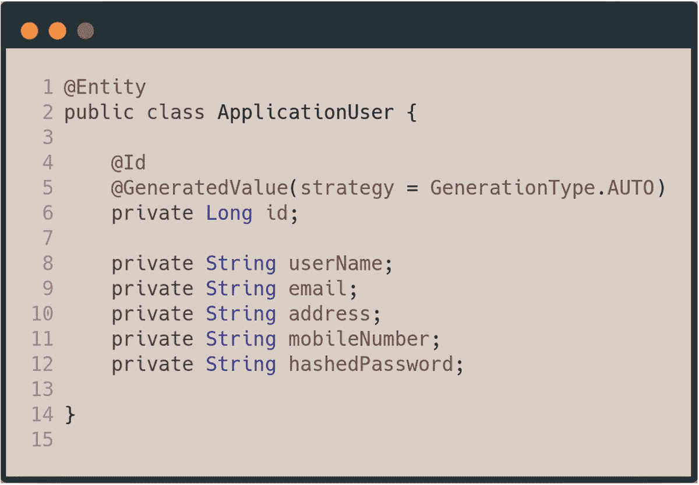

`ApplicationUser` 实体包含许多字段，在典型的数据库驱动应用程序中，你可能需要对这些字段进行查询。例如，你可能想通过 `userName` 查找用户，或者通过电子邮件进行搜索等。Delta Spike 模块通过使用基于 CDI 的仓储，帮助你减少此类繁琐的样板代码。你可以声明一个 `ApplicationUserRepo`，它将为你处理实体类字段上的基本 CRUD 操作。

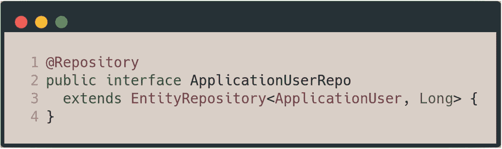

第 1 行在 `ApplicationUserRepo` 接口上声明了来自 Delta Spike 数据模块的 `@Repository` 注解，该接口扩展了同样来自 Delta Spike 数据模块的参数化接口 `EntityRepository`。`EntityRepository` 接口定义如下：

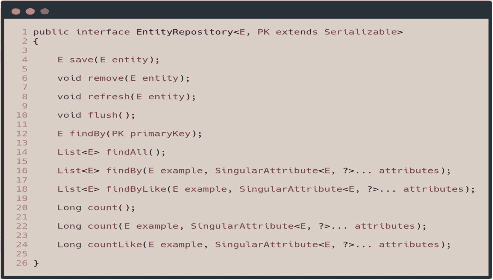

该接口包含一些基本的基于 CRUD 的方法，几乎每个数据库应用程序都会实现这些方法。例如，第 12 行声明了一个 `findBy()` 方法，该方法接收实体的主键并在数据库中查询它。所有这些方法都由数据模块的 CDI 扩展实现。接下来，你将在接口中声明一些用于 CRUD 操作的方法。

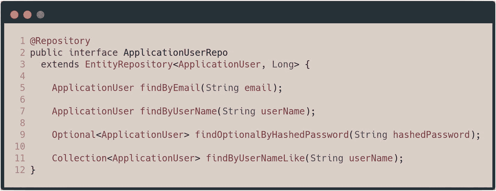

第 5 行声明了一个 `findByEmail` 方法。该方法将根据用户的电子邮件查找用户。第 7、9 和 11 行分别声明了 `findByUserName`、`findOptionalByHashedPassword` 和 `findByUserNameLike` 方法。要使用该仓储，你只需将其注入到你的 `QueryService` 类中，如下所示。

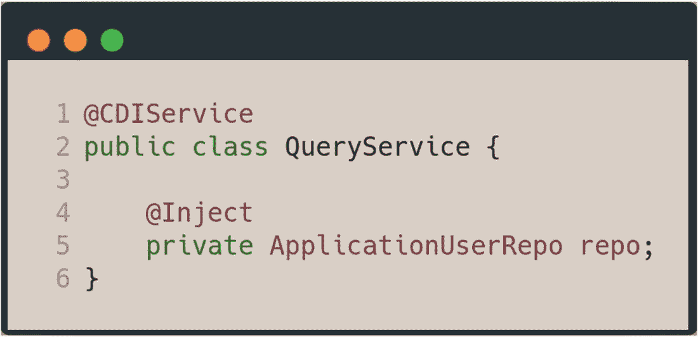

第 5 行在 `QueryService` 类中声明了一个类型为 `ApplicationUserRepo` 的 CDI 注入字段。有了它，你无需编写大量代码即可实现大部分繁琐的 CRUD 样板代码，如下所示。

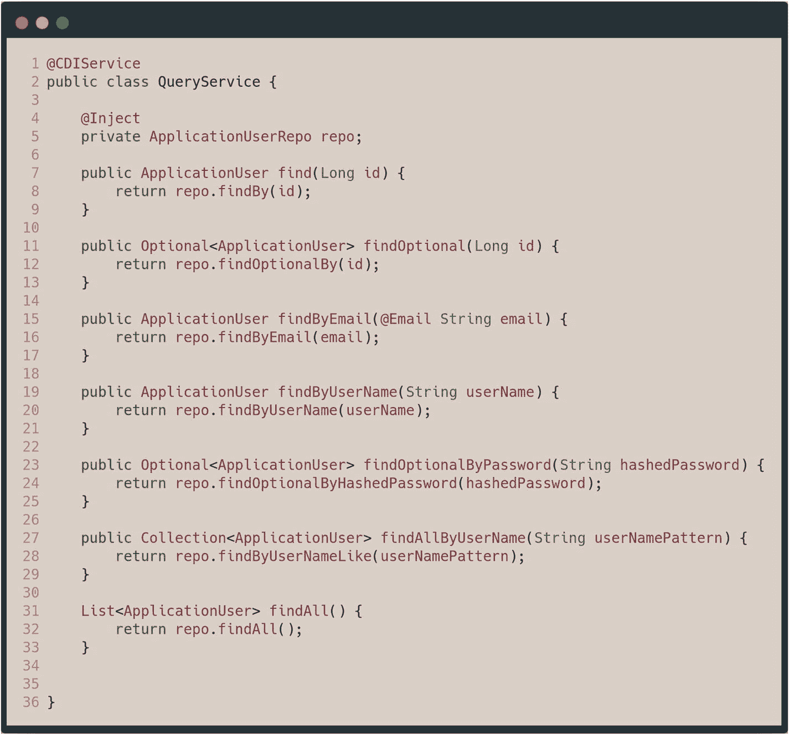

`QueryService` 包含多个方法声明，这些方法使用了在第 5 行注入的 `ApplicationUserRepo`。如你所见，其中一些方法直接来自 `EntityRepository`，例如 `findOptionalBy()` 方法，它接收实体的 ID 并返回一个类型为实体的 `Optional` 对象。`findAll` 方法也调用了 `findAll` 方法，该方法直接定义在 `EntityRepository` 接口中。

所有这些方法都是通过结合使用 CDI API 结构为你实现的。例如，Delta Spike 模块需要一个类型为 `EntityManager` 的生产者字段，以便能够拦截并实现仓储方法。`EntityManager` 生产者方法足以满足此要求。

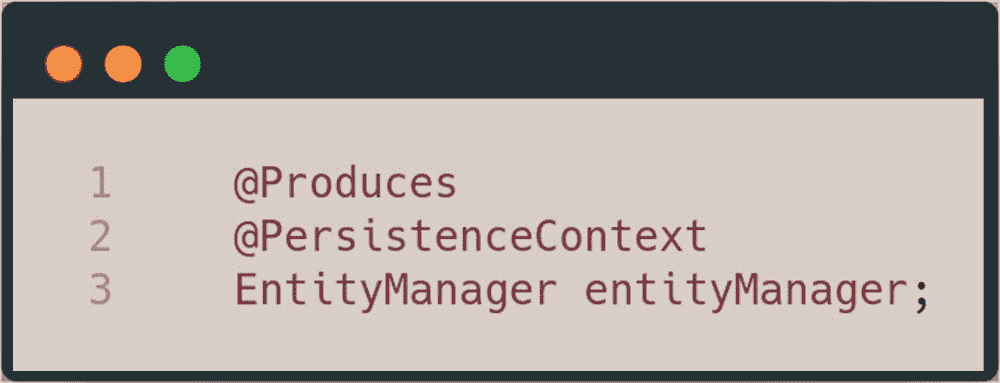

该仓储也可用于持久化到数据库。请记住，它带有一个 `save()` 方法，该方法接收一个实体，并根据实体的状态将其持久化或合并到持久化上下文中。你可以在持久化服务中使用 `ApplicationUserRepo` 来持久化 `ApplicationUser` 实体。

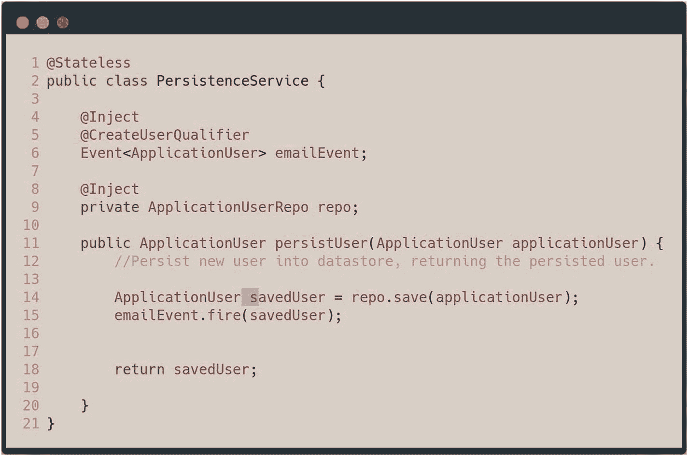

`PersistenceService` 是一个无状态 EJB，它在第 9 行声明了对 `ApplicationUserRepo` 的依赖。然后，在第 14 行的 `persistUser` 方法中，使用注入的仓储来持久化一个 `ApplicationUser` 实体。仓储上的 `save()` 方法也会由 Delta Spike 模块自动为你拦截并实现。

脚注 1   2   3  索引 A, B Apache Delta Spike ApplicationUser bean 定义 EntityManager EntityRepository 接口 QueryService 类 save() 方法 应用服务器 C CDI bean 生命周期回调 拦截器 @PostConstruct @PreDestroy CDI bean *与* 上下文实例 CDI 原型 构造器注入 上下文与依赖注入 (CDI) 激活注解 @ApplicationScoped 异步事件 bean 创建 bean 生命周期回调 参见 CDI bean 生命周期回调 bean *与* 上下文实例 容器 @ConversationScoped 默认激活作用域 依赖伪作用域 注入点 构造器 字段 方法 托管 bean 方法生产者 生产者字段 限定事件 @RequestScoped 会话 bean @SessionScoped 同步事件 事务性事件观察者 D 依赖注入 (DI) Devoxx E Eclipse 基金会规范流程 (EFSP) Eclipse MicroProfile CDI 限定符 @ConfigProperty 定义 get() 方法 microprofile-config.properties 文件 Provider F 字段注入点 findAll 方法 fireAsync 方法 G, H getCurrentUser() 方法 Glassfish 5.1 I 控制反转 (IoC) J, K Jakarta EE 定义 开发文档 EFSP 可移植性 原则 标准化 坦克/手枪 Java 社区流程 (JCP) Java EE API Java 规范请求 (JSR) L @Loggin M, N 方法注入 O Oracle CodeOne order() 方法 P Payara 服务器 PersistenceService Q QueryService 类 R 参考实现 S Spring 框架 T 技术兼容性套件 (TCK) 事务性事件观察者 ApplicationUser 对象 CreateUserQualifier @Observes 注解 U, V, W, X, Y, Z 总括 JSR/Java EE UserSession bean 脚注 1
