好的，作为一名高级文档工程师和翻译员，我将严格遵循您提供的注意事项和示例，将给定的英文文本翻译成中文。

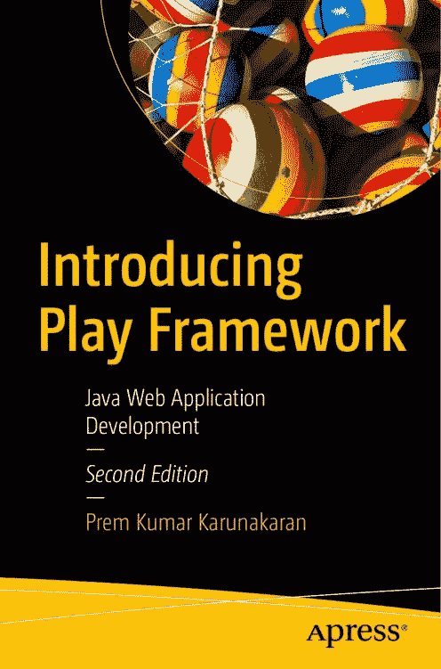

**介绍**

**Play Framework**

Java Web 应用

开发

—

*第二版*

—

Prem Kumar Karunakaran

**介绍 Play**

**Framework**

**Java Web 应用**

**开发**

**第二版**

**Prem Kumar Karunakaran**

***介绍 Play Framework：Java Web 应用开发***

Prem Kumar Karunakaran

印度喀拉拉邦特里凡得琅

ISBN-13 (平装): 978-1-4842-5644-2

ISBN-13 (电子版): 978-1-4842-5645-9

[`doi.org/10.1007/978-1-4842-5645-9`](https://doi.org/10.1007/978-1-4842-5645-9)

版权所有 © 2020 Prem Kumar Karunakaran

本作品受版权保护。出版商保留所有权利，无论是全部还是部分材料，特别是翻译、重印、重用插图、朗诵、广播、以缩微胶卷或任何其他物理方式复制，以及传输或信息存储和检索、电子改编、计算机软件，或通过目前已知或以后开发的类似或不同方法。

本书中可能出现商标名称、徽标和图像。我们不会在每次出现商标名称、徽标或图像时都使用商标符号，而是仅以编辑方式使用这些名称、徽标和图像，以维护商标所有者的利益，无意侵犯商标。

本出版物中使用商品名称、商标、服务标志和类似术语，即使它们未被标识为此类，也不应被视为对其是否受所有权保护的看法。

尽管本书中的建议和信息在出版时被认为是真实和准确的，但作者、编辑和出版商均不对可能出现的任何错误或遗漏承担法律责任。出版商对本书所含材料不作任何明示或暗示的保证。

Apress Media LLC 董事总经理：Welmoed Spahr
采购编辑：Steve Anglin
开发编辑：Matthew Moodie
编辑运营经理：Mark Powers
封面设计：eStudioCalamar
封面图片：Mel Elias on Unsplash (www.unsplash.com)

全球图书贸易由 Apress Media, LLC 发行，地址：1 New York Plaza, New York, NY 10004, U.S.A. 电话：1-800-SPRINGER，传真：(201) 348-4505，电子邮件：orders-ny@springer-sbm.com，或访问 www.springeronline.com。Apress Media, LLC 是一家加利福尼亚有限责任公司，其唯一成员（所有者）是 Springer Science + Business Media Finance Inc (SSBM Finance Inc)。SSBM Finance Inc 是一家**特拉华州**公司。

有关翻译事宜，请发送电子邮件至 editorial@apress.com；有关重印、平装本或音频版权事宜，请发送电子邮件至 bookpermissions@springernature.com。

Apress 图书可批量购买用于学术、企业或促销用途。大多数图书也提供电子书版本和许可证。有关更多信息，请参阅我们的印刷版和电子版批量销售网页：www.apress.com/bulk-sales。

作者在本书中引用的任何源代码或其他补充材料，读者均可通过本书的产品页面在 GitHub 上获取，网址为 www.apress.com/9781484256442。有关更详细的信息，请访问 www.apress.com/source-code。

印刷于无酸纸上

*献给我的妻子 Teena，以及我的女儿 Nayana 和 Nandana。感谢我的父母在这些年来给予我的支持。感谢所有朋友的支持和鼓励。*

**目录**

关于作者 ���������������������������������������������������������������������������������xi

关于技术审校 ���������������������������������������������������������������������������xiii

前言 �����������������������������������������������������������������������������������������������xv

第 1 章: Play 2 入门 ������������������������������������������������� 1

准备工作 ��������������������������������������������������������������������������������������������������������1

安装 ������������������������������������������������������������������������������������������������������������1

前提条件 ���������������������������������������������������������������������������������������������������2

安装 sbt ����������������������������������������������������������������������������������������������������2

安装 conscript ������������������������������������������������������������������������������������������2

安装 Giter8 �����������������������������������������������������������������������������������������������3

设置 Play ������������������������������������������������������������������������������������������������4

使用 Play 示例项目 �����������������������������������������������������������������������������������4

使用 sbt ��������������������������������������������������������������������������������������������������6

创建您的第一个项目 ������������������������������������������������������������������������������������8

app �������������������������������������������������������������������������������������������������������������������9

conf ����������������������������������������������������������������������������������������������������������������10

build.sbt ���������������������������������������������������������������������������������������������������������11

project �����������������������������������������������������������������������������������������������������������11

public �������������������������������������������������������������������������������������������������������������11

lib �������������������������������������������������������������������������������������������������������������������11

test ����������������������������������������������������������������������������������������������������������������12

v

目

目

录

录

配置 Play 以与您首选的 IDE 协同工作 �������������������������������������������������������12

在 Eclipse 中设置 ��������������������������������������������������������������������������������������12

在 IntelliJ 中设置 ��������������������������������������������������������������������������������������15

Hello World 应用程序 ���������������������������������������������������������������������������������������17

配置 �������������������������������������������������������������������������������������������������19

控制器和视图 ���������������������������������������������������������������������������������������22

测试 Play 应用程序 ������������������������������������������������������������������������������������27

测试视图 �������������������������������������������������������������������������������������������������28

测试控制器 �����������������������������������������������������������������������������������������29

第 2 章: 构建系统 ���������������������������������������������������������������������33

Scala 构建工具/简单构建工具 ����������������������������������������������������������������������33

核心原则 ����������������������������������������������������������������������������������������������������33

sbt 的优势 �����������������������������������������������������������������������������������������������������34

项目结构 �������������������������������������������������������������������������������������������������35

使用 sbt �������������������������������������������������������������������������������������������������������������36

设置定义 �������������������������������������������������������������������������������������������39

解析器 �������������������������������������������������������������������������������������������������������42

完整的 build.sbt �����������������������������������������������������������������������������������������42

完整的 plugins.sbt �������������������������������������������������������������������������������������43

SBT 命令快速回顾 ������������������������������������������������������������������������������������������43

第 3 章: Play 控制器和 HTTP 路由 �����������������������������������45

MVC 编程模型 ���������������������������������������������������������������������������������������������������45

模型 �������������������������������������������������������������������������������������������������������������46

视图 ���������������������������������������������������������������������������������������������������������������48

控制器 �������������������������������������������������������������������������������������������������������48

vi

目

目

录

录

HTTP 路由 ������������������������������������������������������������������������������������������������������48

静态定义 ���������������������������������������������������������������������������������������������50

URL 中的动态部分 ���������������������������������������������������������������������������������50

传递固定值 �������������������������������������������������������������������������������������52

可选参数 ��������������������������������������������������������������������������������������53

使用 application.conf 进行应用程序配置 �������������������������������������������������������53

控制器 �����������������������������������������������������������������������������������������������������������54

完成 Bookshop 控制器 ��������������������������������������������������������������������������������������56

saveComment 方法 �����������������������������������������������������������������������������������58

测试 saveComment 动作 ����������������������������������������������������������������������������������59

模型 ����������������������������������������������������������������������������������������������������������������60

作用域对象 ���������������������������������������������������������������������������������������������������61

会话作用域 �����������������������������������������������������������������������������������������������62

Flash 作用域 ���������������������������������������������������������������������������������������������������64

第 4 章: Play 视图和 Scala 模板 �����������������������������65

复合视图 �������������������������������������������������������������������������������������������������66

设计通用模板 ��������������������������������������������������������������������������������������������68

代码片段模板基础 ���������������������������������������������������������������������������������������69

注释 �����������������������������������������������������������������������������������������������������70

模板参数 ����������������������������������������������������������������������������������������������������70

导入语句 ���������������������������������������������������������������������������������������������������71

迭代列表 �����������������������������������������������������������������������������������������������72

迭代映射 ����������������������������������������������������������������������������������������������72

If 块 ���������������������������������������������������������������������������������������������������������73

转义动态内容 ������������������������������������������������������������������������������������������74

vii

目

目

录

录

第 5 章: 并发和异步编程 ��������������������������������75

什么是并发？ �����������������������������������������������������������������������������������������76

执行器 ��������������������������������������������������������������������������������������������������������76

示例 1：使用 Runnable ���������������������������������������������������������������������������78

示例 2：使用 Callable �����������������������������������������������������������������������������80

使用 Play 进行异步编程 �������������������������������������������������������������������������������82

编写异步应用程序 ���������������������������������������������������������������������������������������������83

配置异步定时任务 ����������������������������������������������������������������������������������������84

Akka 基础 ���������������������������������������������������������������������������������������������������84

第 6 章: Web 服务、JSON 和 XML �������������������������������������������87

消费 Web 服务 ����������������������������������������������������������������������������������������������������88

处理大型响应 ����������������������������������������������������������������������������������������������91

处理 JSON ����������������������������������������������������������������������������������������������������94

消费 JSON 请求 ���������������������������������������������������������������������������������������������94

生成 JSON 响应 �����������������������������������������������������������������������������������������97

处理 XML ������������������������������������������������������������������������������������������������������98

示例 1：简单的 XML 解析 ��������������������������������������������������������������������99

示例 2：使用 JAXB 进行 XML 解析 �����������������������������������������������������������100

第 7 章: 访问数据库 ������������������������������������������������������105

配置数据库支持 ������������������������������������������������������������������������������������������105

使用 ORM �������������������������������������������������������������������������������������������������������109

ORM 概念 ���������������������������������������������������������������������������������������������109

关键术语 ����������������������������������������������������������������������������������������������������111

关系方向 �������������������������������������������������������������������������������������������������111

配置 JPA �������������������������������������������������������������������������������������������������113

viii

目

目

录

录

在 Play 中使用 Ebean ������������������������������������������������������������������������������������������118

Ebean 查询 ������������������������������������������������������������������������������������������������120

Ebean 中常用的 Select 查询结构 ����������������������������������������������������������������125

使用 RawSql ����������������������������������������������������������������������������������������������128

Ebean 中的关系 ��������������������������������������������������������������������������������130

第 8 章: 完整示例 �����������������������������������������������������������133

第 9 章: 使用 Play 模块 ���������������������������������������������������������157

创建模块 ���������������������������������������������������������������������������������������������158

第三方模块 �����������������������������������������������������������������������������������������161

第 10 章：应用程序设置和错误处理 ���������������������������������������163

过滤器 ������������������������������������������������������������������������������������������������164

动作组合 �����������������������������������������������������������������������������������������������������������168

错误处理器 ���������������������������������������������������������������������������������������������������170

客户端错误 �������������������������������������������������������������������������������������������������170

服务器错误 �����������������������������������������������������������������������������������������������170

Play 2.6.x 之前的全局设置方式 ��������������������������������������������������������������������172

第 11 章：使用缓存 ����������������������������������������������������������������������175

配置 Caffeine �����������������������������������������������������������������������������������������175

将 Caffeine 添加到项目 ������������������������������������������������������������������������176

配置 EhCache �����������������������������������������������������������������������������������������177

使用缓存 API ������������������������������������������������������������������������������������������177

第 12 章：生产部署 �����������������������������������������������������������������183

为 Play 配置 Apache httpd ��������������������������������������������������������������������184

使用 mod_proxy_balancer 进行负载均衡 �����������������������������������������������������184

配置 Play 与 Nginx ��������������������������������������������������������������������������������������185

索引 ���������������������������������������������������������������������������������187

ix

**关于作者**

**Prem Kumar Karunakaran** 是一位拥有约 20 年行业经验的企业架构师。他拥有 BITS Pilani 的软件系统硕士学位和科钦科技大学电子工程学士学位。他还是一名 Oracle 认证的 Java 企业版大师。他参与了许多面向全球客户的尖端产品的架构和设计。

他曾与 Infosys 和 IBS 等组织合作担任架构师，并参与了许多涵盖航空、物流、旅游和零售领域的项目。他对 Java、机器学习、大数据处理和云计算充满热情，喜欢学习新技术；他也为开源项目贡献自己的时间。

xi

**关于技术审校**

**Satheesh Madhavan** 在软件行业拥有近 20 年的经验，目前在印度最大的 IT 公司之一担任数字顾问。他在使用 Java 和 JEE 技术以各种身份提供企业解决方案方面拥有丰富的经验。他拥有 BITS Pilani 的软件系统硕士学位和喀拉拉大学的化学工程学士学位。他的爱好包括阅读小说和非小说、集邮、技术博客和播客，以及天体物理学和纯科学。

xiii

**前言**

软件开发人员需要具备许多特质才能做好他们的工作。开发人员的主要工作是创建解决业务问题的软件。客户在动态的商业环境中运营，他们需要足够快地改变他们的业务解决方案，以留住和吸引新客户。因此，快速应用程序开发是当今软件开发方法中的一个关键方面。您需要更好的框架和工具来帮助更快地开发高质量的软件。

Play Framework 是 Web 应用程序开发中崭新且令人印象深刻的框架。通过打破现有标准，它不像大多数 Web 框架那样试图抽象 HTTP，而是与其紧密集成。

Play Framework 是 Java Web 开发中快速应用程序编程的一场革命。它改变了 Java Web 开发的游戏规则。Java Web 开发曾经是一项繁琐、耗时的活动，有许多框架提供 MVC 架构的优势。但几乎没有框架能够提供真正的快速应用程序开发能力。Play 改变了这一切。

Play 是现有 Java 企业栈用于 Web 开发的一个简洁替代方案。Play 专注于开发人员生产力、可扩展性、对现代 Web 标准（仅举几例，如 REST、JSON、Web Sockets 和 Comet）的遵循以及效率。

使用 Play Framework，您只需编写代码更改，然后点击浏览器刷新按钮即可测试您的更改。Play 将自动编译和部署您的更改。如果您的代码中有任何错误，Play 会在浏览器中很好地显示它们。您不再需要扫描冗长的 xv

前

前

言

言

异常跟踪来找出错误原因。最重要的是，Play 自带其应用程序服务器，该服务器轻量、快速且易于使用。用一句话来说，Play 是您开始 Java Web 开发所需的唯一框架。得益于 Play Framework，Java Web 开发变得更加容易、更有趣且更强大。

本书是您学习和使用新版本 Play Framework（Play 2）所需的一切。您将深入了解 Play Framework 的所有层，并通过尽可能多的示例和应用程序获得深入的知识。

**进一步参考**

Play Framework 官方文档[: www.playframework.com/](http://www.playframework.com/)

Play 的 Google 群组[: https://groups.google.com/forum/#!forum/](https://groups.google.com/forum/#!forum/play-framework)

[play-framework](https://groups.google.com/forum/#!forum/play-framework)

与 Play 相关的问题: [`stackoverflow.com/tags/`](http://stackoverflow.com/tags/playframework)

[playframework](http://stackoverflow.com/tags/playframework)

Ebeans[: www.avaje.org/](http://www.avaje.org/)

Twirl: [`github.com/playframework/twirl`](https://github.com/playframework/twirl)

xvi

**第 1 章**

**Play 2 入门**

在阅读了关于 Play 2 的介绍性部分之后，您现在应该对 Play Framework 的功能以及它如何加速 Java Web 开发有了一个概念。本章将介绍

• 安装 Play Framework

• 在您的机器上设置 Play Framework

• 配置 Play Framework

• 创建第一个示例项目

• 设置 IDE

**准备工作**

您只需要一个浏览器和互联网连接。您可以在多种操作系统上安装 Play，包括 Microsoft Windows、Linux 和 Mac。操作系统应已安装 Java。

**安装**

Play 只需要在运行时提供 Play jar 即可工作，因此您可以使用 Maven 或任何此类构建工具将 Play jar 包含在任何应用程序中。

© Prem Kumar Karunakaran 2020

P. K. Karunakaran, *介绍 Play Framework*,

`doi.org/10.1007/978-1-4842-5645-9_1`

第 1 章 Play 2 入门

但是，推荐的使用 Play 的方法是使用 sbt 或 Gradle 安装它，因为 Play 在使用 sbt 或 Gradle 时提供了更好的开发体验。

**前提条件**

Play 2.x 需要在机器上安装 JDK 1.8 或更高版本。请注意，仅 JRE 是不够的；您需要 JDK 版本 8 或更高版本。您应确保 PATH 变量指向 JDK bin 目录，并且 javac 和 Java 可以从任何地方访问。

您可以通过在命令提示符或 shell 中键入 `javac -version` 来检查，并验证版本是否为 1.8 或更高。

您可以从 Oracle 网站获取 Java SE，网址为 [www.oracle.com/](http://www.oracle.com/technetwork/java/javase/downloads/index.html)
[technetwork/java/javase/downloads/index.html](http://www.oracle.com/technetwork/java/javase/downloads/index.html)。

Play 也适用于 Open JDK 1.8 及更高版本。但您应确保项目中使用的任何依赖项都与 Open JDK 兼容。

**安装 sbt**

sbt（Scala 构建工具）适用于所有操作系统版本，可在 scala-sbt 网站 [www.scala-sbt.org/download.html](http://www.scala-sbt.org/download.html) 上找到。请按照
[安装指南](https://www.scala-sbt.org/1.x/docs/Setup.html) 中的说明，网址为 [www.scala-sbt.org/1.x/docs/Setup.html](http://www.scala-sbt.org/1.x/docs/Setup.html) 来安装 sbt。

**安装 conscript**

要使用 sbt 安装 Play，您需要安装 conscript。请按照 [www.foundweekends.org/conscript/setup.html](http://www.foundweekends.org/conscript/setup.html) 上的说明安装 conscript。这些说明适用于 Mac、Linux 和 Windows。

第 1 章 Play 2 入门

使用 jar 进行跨平台安装很简单。从 foundweekends Maven 发布仓库下载 conscript jar，网址为 [https://](https://dl.bintray.com/foundweekends/maven-releases/org/foundweekends/conscript/conscript_2.11/0.5.2/conscript_2.11-0.5.2-proguard.jar)
[dl.bintray.com/foundweekends/maven-releases/org/foundweekends/](https://dl.bintray.com/foundweekends/maven-releases/org/foundweekends/conscript/conscript_2.11/0.5.2/conscript_2.11-0.5.2-proguard.jar)
[conscript/conscript_2.11/0.5.2/conscript_2.11-0.5.2-proguard.](https://dl.bintray.com/foundweekends/maven-releases/org/foundweekends/conscript/conscript_2.11/0.5.2/conscript_2.11-0.5.2-proguard.jar)
[jar](https://dl.bintray.com/foundweekends/maven-releases/org/foundweekends/conscript/conscript_2.11/0.5.2/conscript_2.11-0.5.2-proguard.jar)，然后在命令提示符下运行以下命令：`java -jar /conscript_2.11-0.5.2-proguard.jar`

这将启动一个启动画面并安装 conscript。忽略任何与找不到“cs”相关的错误。通常，conscript 将安装在 Windows 的 `C:\Users\username\.conscript` 文件夹中，其中 *username* 是 Windows 中登录用户的主文件夹。此位置将显示在启动画面中。

现在让我们为 conscript 设置环境变量：

export **CONSCRIPT_HOME**=" C:\Users\username\.conscript"

export **CONSCRIPT_OPTS**="-XX:MaxPermSize=512M -Dfile.encoding=UTF-8"

export **PATH**=%PATH%;%CONSCRIPT_HOME%\bin

CONSCRIPT_HOME 是 conscript 下载各种文件的位置。例如，在 Windows 中，它将是 `C:\Users\username\`。

PATH 是您操作系统的路径变量。这将使 `cs` 命令可以从任何地方访问。

**安装 Giter8**

安装 conscript 后，可以使用 conscript 本身安装 Giter8。
Giter8 是一个命令行工具，用于从发布在 GitHub 或任何其他 git 仓库上的模板生成文件和目录。

转到命令提示符并键入

`cs foundweekends/giter8`

这将下载并安装 Giter8。更多安装细节可从 Giter8 的 foundweekends 网站获得
([www.foundweekends.org/giter8/setup.html](http://www.foundweekends.org/giter8/setup.html))。

第 1 章 Play 2 入门

**设置 Play**

有多种安装 Play 的方法。让我们看看两种最常见的方法：

• **使用 Play 示例项目**：使用 Lightbend Tech Hub 提供的任何示例项目 ([https://](https://developer.lightbend.com/start/?group=play)
[developer.lightbend.com/start/?group=play](https://developer.lightbend.com/start/?group=play))。

• **使用 sbt**：此方法依赖于 sbt 的 Giter8 模板。此方法创建一个没有任何示例代码的全新 Play 项目。这是创建干净、精简项目结构的首选模式。

**使用 Play 示例项目**

Play 提供了许多示例项目以简化安装。
如果遵循此路径，则不需要安装 sbt，因为模板为 Unix 和 Windows 环境提供了 sbt 启动器。

让我们尝试第一种方法：安装 Scala 的 Play 示例项目。

1. 转到 [`developer.lightbend.com/`](https://developer.lightbend.com/start/?group=play)
[start/?group=play](https://developer.lightbend.com/start/?group=play)。

2. 选择项目 PLAY SCALA HELLO WORLD
TUTORIAL。

3. 单击“Create a project for me”按钮（这会将示例项目下载到您的系统）。

4. 解压存档 (play-samples-play-scala-
hello-world-tutorial.zip)。

5. 转到名为 play-samples-play-scala-
hello-world-tutorial 的文件夹，如果在 Windows 上，请双击
sbt.bat 文件。如果您使用的是 Mac 或
基于 Unix 的系统，请运行 sbt 文件。

第 1 章 Play 2 入门

这将需要一些时间来下载 sbt 和所有
依赖项。

一旦 sbt 构建成功，您将看到
消息

sbt server started at local:sbt-server-
f50b441db70fa47676ba

请注意，消息的最后部分
(f50b441db70fa47676ba) 可能对您来说不同，
但这没关系。您现在可以开始了，您将
看到提示符

[play-scala-seed] $

6. 键入 `run` 命令以启动应用程序：

[play-scala-seed] $ run

此步骤完成后，提示符将显示

(Server started, use Enter to stop and go back to the
console...)

7. 转到 http://localhost:9000。如果一切正常，您
应该会在浏览器中看到 Play 文档。

现在让我们看看如何使用 Java 安装 Play 示例项目。

1. 转到 [`developer.lightbend.com/`](https://developer.lightbend.com/start/?group=play)
[start/?group=play](https://developer.lightbend.com/start/?group=play)。

2. 选择项目 PLAY JAVA HELLO WORLD
TUTORIAL。

3. 单击“Create a project for me”按钮（这会将示例项目下载到您的系统）。

第 1 章 Play 2 入门

4. 解压存档 (play-samples-play-java-
hello-world-tutorial.zip)。

5. 转到名为 play-samples-play-java-
hello-world-tutorial 的文件夹，如果在 Windows 上，请双击
sbt.bat 文件。如果您使用的是 Mac 或 Unix-
based 系统，请运行 sbt 文件。

6. 这将下载所有依赖项并
执行构建。请注意，下载所有依赖项可能需要一些时间。

7. 构建完成后，命令提示符将
显示

[play-java-hello-world-tutorial] $

8. 键入 `run` 命令以启动 play
应用程序：

[play-java-hello-world-tutorial] $ run

**使用 sbt**

现在您将学习如何使用 sbt 安装 Play，以获取基本的 Play 应用程序结构和依赖 jar，但不包括示例项目。

要使用 sbt 创建 Play 项目，需要完成以下步骤：
1. 安装 SBT。
2. 安装 conscript。
3. 安装 Giter8。

您可以在本章的“安装”部分找到安装上述软件的说明。

第 1 章 Play 2 入门

安装完上述软件后，您可以继续使用 sbt 创建 Play 项目。Play 支持 Java 和 Scala 作为编程语言，因此我将展示使用 sbt 的两种示例。

**使用 sbt 安装 Java 项目**

打开命令提示符，切换到您希望创建项目的目录，然后键入

`sbt new playframework/play-java-seed.g8`

这将安装一个 Java 入门项目结构。

向导将询问项目名称和组织。（按照惯例，这是您拥有的反向域名，通常是特定于您的项目的。它用作项目的命名空间。）提供这些名称后，项目将被创建。

**使用 sbt 安装 Scala 项目**

以下是命令：

`sbt new playframework/play-scala-seed.g8`

提供项目名称和组织，项目将被创建。

您现在已经学习了多种为 Scala 和 Java 安装 Play 项目的方法：

• 使用 Play 示例
• 使用 sbt

在本书中，我使用 Java 作为 Play 的编程语言，因此当您在下一节中创建第一个项目（书店）时，您将使用 sbt 和 Java 种子。

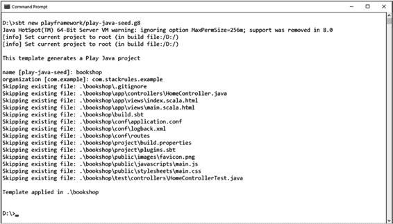

第 1 章 Play 2 入门

**创建您的第一个项目**

让我们创建一个名为 bookshop 的新项目来详细探索 Play。将您的项目命名为 **bookshop**，并且为了便于解释，让我们将其设为一个销售图书的在线零售应用程序，这是每个人都熟悉的领域。

在命令提示符或 shell 中，键入

`sbt new playframework/play-java-seed.g8`

参见图 1-1。

***图 1-1.** 创建项目*

为项目名称和组织提供以下信息：
name [play-java-seed]: bookshop

organization [com.example]: com.stackrules.example

对于组织名称，如果您愿意，也可以提供其他域名。

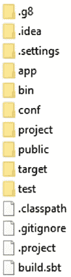

第 1 章 Play 2 入门

转到您创建项目的目录。例如，在我的机器上，项目目录是 `E:\workarea\bookshop`。

让我们看看文件夹结构及其在整个项目组织中的相关性。参见图 1-2。

***图 1-2.** 项目结构*

**app**

app 文件夹包含您所有的服务器端源文件。这包括您所有的 Java 代码、Scala 代码、动态 Scala HTML 模板、数据库访问相关代码等。默认情况下，Play 在 app 文件夹内创建两个文件夹：controllers 和 views。这些名称不言自明。controllers 文件夹保存您的控制器类，views 保存动态屏幕（HTML 和 Scala 代码片段）。

您可以自由地在 app 文件夹内创建子目录，以便更好地组织您的文件。例如，您可以创建一个 models 文件夹来保存所有 ORM 映射的 POJO，一个名为 helper 的文件夹来保存您的辅助类等。

第 1 章 Play 2 入门

大多数项目在 app 文件夹下将具有以下结构：
app
└ assets: 编译后的资源源文件
└ stylesheets: 用于 CSS 源代码（less CSS 源文件）
└ javascripts: 这通常是放置 coffeescript 源文件的文件夹。
└ controllers: 应用程序控制器
└ models: 应用程序业务层
└ views: 模板

**conf**

conf 文件夹保存 Play 应用程序使用的配置。它包含所有 HTTP 映射、orm 配置、环境变量、日志记录等。

基本上，conf 目录包含配置和国际化文件，而 app 文件夹则有一个用于其模型定义的子目录。

此目录中最重要的文件是

• application.conf: 应用程序的主配置文件，它包含标准配置参数。

• routes: 将 HTTP URL 路径映射到控制器中的方法。处理所有 HTTP 路由配置。

• logback: Play 使用 logback 进行所有日志记录配置，这是您需要更改以配置 logback 的文件。

第 1 章 Play 2 入门

**build.sbt**

Play 的构建配置在两个地方定义：项目根目录中的 build.sbt 文件和在 /project 文件夹中找到的两个文件。build.sbt 文件包含构建配置。

**project**

project 文件夹包含项目构建配置：

• plugins.sbt: 定义此项目使用的 sbt 插件

• build.properties: 包含用于构建您的应用程序的 sbt 版本以及相关的 sbt 构建信息。

我将在后面进一步讨论 sbt。当您使用 Play 时，对 sbt 有基本的了解是很好的。

**public**

public 文件夹托管所有静态文件，如 Javascript、图像和 CSS 样式表，这些文件由 Web 服务器直接提供。public 文件夹有三个子文件夹：images、javascripts 和 stylesheets，用于存储这些资源：
public
└ stylesheets: CSS 文件 (.css 扩展名)
└ javascripts: JavaScript 文件 (.js 文件)
└ images: 图像

**lib**

lib 文件夹默认不创建。但您可以创建此文件夹并将任何 jar 放入其中。此文件夹中的所有 jar 都将添加到应用程序类路径中。这对于包含需要在 Play 构建系统之外管理的第三方依赖项非常理想。

第 1 章 Play 2 入门

**test**

test 文件夹是存储所有单元测试和功能测试用例的地方。

**配置 Play 以与您**

**首选的 IDE 协同工作**

由于您已经完成了项目结构的设置并生成了项目模板，现在让我们将项目与 IDE 集成，以使开发过程更轻松、更快速。

您不需要复杂的 IDE 来使用 Play，因为 Play 会自动编译和刷新您对源文件所做的修改。这使您可以灵活地使用简单的编辑器（如记事本或 vi 编辑器）来使用 Play。但对于实际项目来说，这不是一个实用的案例。您需要一个提供更好导航、自动完成、调试、重构等功能的 IDE。默认情况下，Play 支持大多数流行的 IDE，如 Eclipse、IntelliJ、NetBeans 和 ENSIME。

在本书中，我将使用 Eclipse 作为 IDE。您可以使用您选择的任何 IDE 来尝试示例。

**在 Eclipse 中设置**

作为示例，让我们为 Eclipse 配置 Play。要使用 Play 与 Eclipse，您需要首先将 sbteclipse 集成到您的项目中。为此，打开 plugins.sbt (project/plugins.sbt) 并添加以下内容：

`addSbtPlugin("com.typesafe.sbteclipse" % "sbteclipse-plugin" % "5.2.2")`

您希望在运行 eclipse 命令以生成 bookshop 项目的 eclipse 导入设置之前编译项目。手动方法是先运行 `sbt compile`，然后执行生成 eclipse 12

第 1 章 Play 2 入门

项目部分。但您可以通过更好的自动化方式完成；您可以指示它在生成 eclipse 项目设置时首先运行编译。为此，打开 build.sbt 文件并添加以下内容：
`EclipseKeys.preTasks := Seq(compile in Compile, compile in Test)`
`EclipseKeys.projectFlavor := EclipseProjectFlavor.Java`
`EclipseKeys.createSrc := EclipseCreateSrc.ValueSet(EclipseCreateSrc.`
`ManagedClasses, EclipseCreateSrc.`
`ManagedResources)`

请注意，以上仅适用于 Java 项目。如果您有 Scala 源文件，则应使用 Scala IDE 而不是常规的 Eclipse IDE。

保存 build.sbt 文件，然后通过打开命令提示符，移动到项目根目录 (E:\workarea\bookshop) 并键入 `sbt` 来进入 sbt 提示符。

这将初始化 sbt 提示符。这可能需要几分钟才能完成，因为 sbt 将下载插件和所有相关依赖项。一旦 sbt 提示符初始化，您应该会看到提示符为

[bookshop] $

键入 `eclipse with-source=false` 并按 Enter。如果您需要所有依赖项的源 jar，可以改为发出 `eclipse with-source=true`。

成功执行上述命令后，启动 eclipse 并导入项目。参见图 1-3。

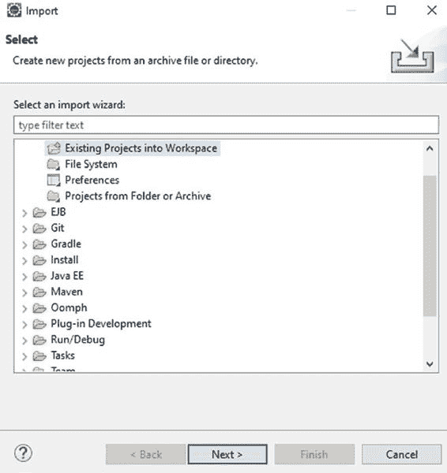

第 1 章 Play 2 入门

***图 1-3.** 导入向导*

1. 打开 Eclipse。
2. 单击 File ➤ Import ➤ General ➤ Existing Projects
into Workspace。
3. 浏览并选择根项目文件夹
(bookshop)。
4. 单击 Finish。

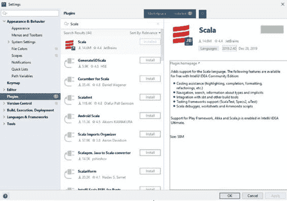

第 1 章 Play 2 入门

**在 IntelliJ 中设置**

将 Play 项目导入 Intellij 非常简单。唯一的先决条件是，即使使用 Java 作为语言，也应安装 Intellij 的 Scala 插件。这是因为需要 Intellij 的 Scala 插件来解析 sbt 依赖项。因此，如果您还没有安装，请继续安装 Intellij 的 Scala 插件。打开 Intellij，转到 File ➤ Settings ➤ Plugins，然后在 Marketplace 选项卡中搜索 Scala。

从列出的插件中，选择 JetBrains 的 Scala 插件并单击 Install。参见图 1-4。

***图 1-4.** 导入 Scala 插件*

安装 Scala 插件后，将 bookshop Play 项目导入 IntelliJ。参见图 1-5。

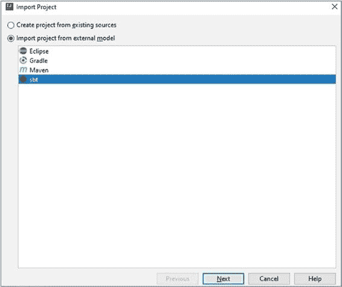

第 1 章 Play 2 入门

***图 1-5.** 导入项目*

1. 打开 File ➤ New ➤ Project from Existing Sources。
2. 浏览到 bookshop 项目根文件夹
(E:\workarea\bookshop)。
3. 选择 Import project from the external model。
4. 选择 sbt。
5. 单击 Finish。

等待构建同步，您将看到项目已导入 Intellij。

第 1 章 Play 2 入门

**Hello World 应用程序**

您的项目已准备就绪，并且已导入您选择的 IDE。
让我们向其中添加一些文件并创建 Hello World 程序。然后，您将向其添加更多功能并进行扩展。

让我们启动 Play 服务器并尝试默认应用程序。

1. 打开命令提示符。
2. 转到项目根文件夹 (E:\workarea\
bookshop)。
3. 通过在根文件夹中键入 `sbt` 进入 Play 控制台。
4. 这将打开 Play 控制台提示符
([bookshop] $)。
5. 键入
`run` 以启动 Play 服务器。参见图 1-6。
(如果服务器已启动，请按 Enter 停止，然后返回控制台。)

您甚至可以将命令组合在一起以启动 Play，方法是使用
**sbt run**

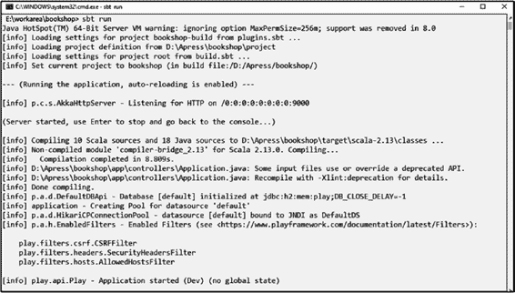

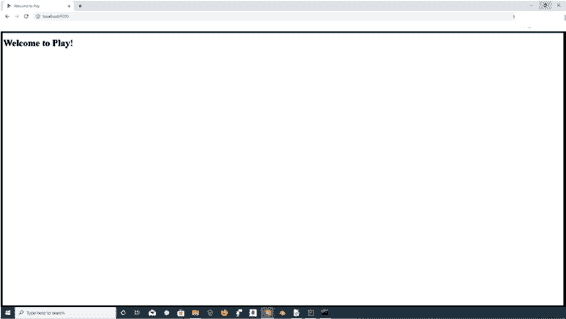

第 1 章 Play 2 入门

***图 1-6.** 应用程序控制台*

打开浏览器并访问 http://localhost:9000/ 以访问主页。参见图 1-7。

***图 1-7.** 欢迎页面*

第 1 章 Play 2 入门

**配置**

转到 conf 文件夹并打开 routes 文件。这是需要定义项目所有 URL 映射的地方。您将在下一章中详细研究 URL 映射和路由配置。当您打开 routes 文件时，您应该会看到如下条目：
`GET / controllers.HomeController.index`
这意味着应用程序的根目录指向 HomeController 类中定义的 index 方法。

如果您在浏览器中键入 `localhost:portnumber`，请求将被路由到 `app/controllers/HomeController.java` 文件中定义的 index 方法。

这就是 Play 将 URL 路径或 URL 模式路由到控制器类的特定方法的方式。

打开 HomeController.java 文件，您可以看到方法
`public Result index() {`
`return ok(views.html.index.render());`
`}`

此方法返回一个 Twirl 模板文件，该模板文件生成 HTML 输出。打开 views 文件夹中找到的 index.scala.html 文件。让我们检查此文件的内容以了解其中发生了什么。

`@()`

`@main("Welcome to Play") {`
`<h1>Welcome to Play!</h1>`
`}`

在我们查看每个元素之前，了解什么是 Twirl 以及如何使用它非常重要。

第 1 章 Play 2 入门

**什么是 Twirl？**

twirl 是为 play Framework 开发的模板引擎。但它也可以在 play 环境之外使用。默认情况下，twirl 作为 play 的一部分包含在内，但如果需要在 play 之外使用 twirl，则可以安装 Scala 的 sbt 插件。例如，在 plugins.sbt 文件中添加以下条目将使 twirl 可用于任何基于 sbt 的项目：

`addSbtPlugin("com.typesafe.sbt" % "sbt-twirl" % "LATEST_VERSION")`

模板文件必须命名为 `{name}.scala.{ext}`，其中 ext 可以是 html、js、xml 或 txt。模板可用于生成各种类型的标记，如 htMl、XMl 或 tXt，并且完全与控制器解耦。可以根据需要插入各种类型的标记。

twirl 模板只是一个普通的文本文件，其中包含小的 Scala 代码块。模板有助于创建复合视图并有助于基于组件的视图生成。

`@` 字符标记模板中动态代码的开始。

本书的第 4 章提供了视图和 twirl 模板的详细解释。

目前，让我们了解 index.scala.html 文件中定义的内容：

`@main("Welcome to Play") {`
`<h1>Welcome to Play!</h1>`
`}`

`@main("Welcome to Play")` 调用另一个模板 main.scala.html，并将页面标题“Welcome to Play”和第二个参数中的 HTML 内容（包含在 `{}` 中）传递给它。

因此，您可以推断 main 模板文件应接受两个参数：一个用于标题的字符串和作为第二个参数的 HTML 内容。

第 1 章 Play 2 入门

打开 main.scala.html 以验证这一点。文件以
`@(title: String)(content: Html)` 开头；这就像任何接受两个参数的普通方法一样。

`@*`
`* This template is called from the ìndex` template. This template
`* handles the rendering of the page header and body tags. It takes`
`* two arguments, àString` for the title of the page and an `Html`
`* object to insert into the body of the page.`
`*@`

`@(title: String)(content: Html)`

`<!DOCTYPE html>`
`<html lang="en">`
`<head>`
`@* Here's where we render the page titlèString`. *@
`<title>@title</title>`
`<link rel="stylesheet" media="screen" href="@routes.`
`Assets.versioned("stylesheets/main.css")">`
`<link rel="shortcut icon" type="image/png" href="@`
`routes.Assets.versioned("images/favicon.png")">`
`</head>`
`<body>`
`@* And here's where we render thèHtmlòbject containing`
`* the page content. *@`
`@content`
``
`</body>`
`</html>`

第 1 章 Play 2 入门

标题字符串通过 `@title` 插入到 HTML `<title>` 中，HTML 内容通过 `@content` 标记插入。

现在您了解了不同的元素以及它们是如何连接在一起的。
让我们通过编写一个新的动作和一个视图来进一步深入。

让我们为 Hello World 方法创建一个条目：
`GET /hello controllers.`
`HomeController.hello()`

保存 routes 文件。下一步是编写您的控制器来处理请求。

**控制器和视图**

在 app/controllers 文件夹内，您应该找到 HomeController.java 文件。这是您的默认控制器。

`package controllers;`

`import play.mvc.*;`
`import views.html.*;`
`import java.time.LocalDate;`

`/**`
`* This controller contains an action to handle HTTP requests`
`* to the application's home page.`
`*/`
`public class HomeController extends Controller {`

`/**`
`* An action that renders an HTML page with a welcome message.`
`* The configuration in the <code>routes</code> file means that`
`* this method will be called when the application receives a 22`

第 1 章 Play 2 入门

`* <code>GET</code> request with a path of <code>/</code>.`
`*/`
`public Result index() {`
`return ok(views.html.index.render());`
`}`
`}`

让我们详细检查 HomeController 类以了解其中发生了什么。首先，它继承自 `play.mvc.Controller`。
当您编写一个新的控制器时，请确保继承自 `play.mvc.Controller`。

您之前已经见过 index 方法：它非常简单，只有一行。但它做了很多聪明的事情。`ok()` 方法与 HTTP 状态 200（即成功响应）密切相关。如果您想返回 HTTP 未找到，可以使用 `notFound` 方法。这就是 Play 的美妙之处；它紧密地模拟了 HTTP 协议，并且不需要任何花哨的代码来将您的异常转换为相应的 HTTP 状态码。您可以用 HTTP 的语言进行编码和交流。

`ok()` 方法返回由名为 index 的视图中定义的 `render` 方法生成的 HTML 输出。您已经在 index.scala.html 中看到了这个视图。Play 中的视图使用 Scala 并遵循“viewname.scala.html”的命名约定。此文件由 Play 编译器编译成相应的 Java 类，可以直接在控制器中使用。这确保了类型安全并减少了错误。请记住，在其他框架（如 struts 或 Spring MVC）中，您通常返回一个字符串作为视图名称，然后框架将其解析为一个文件。在 Play 中，不需要这样做。视图直接作为 Java 类文件可用，您可以确保编译时类型安全。

由于您已经为 hello 方法添加了路由条目，让我们继续添加控制器方法并创建视图。

第 1 章 Play 2 入门

**视图**

在 app/views 文件夹内创建一个新文件，将其命名为 hello.scala.html，并添加以下内容：

`@(message: String)`

`<!DOCTYPE html>`
`<html lang="en">`
`<head>`
`<title>Hello World </title>`
`</head>`
`<body>`
`<h1> @message </h1>`
`</body>`
`</html>`

此模板接受一个参数并将其放置在 HTML `<h1>` 标签内。

**控制器**

现在编辑 HomeController：

`package controllers;`

`import play.mvc.*;`
`import views.html.*;`
`import java.time.LocalDate;`

`/**`
`* This controller contains an action to handle HTTP requests`
`* to the application's home page.`
`*/`
`public class HomeController extends Controller {`

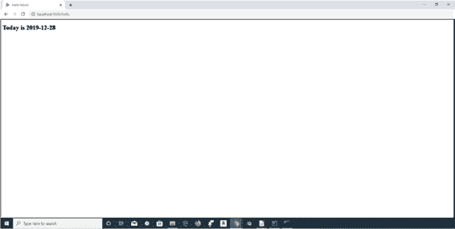

第 1 章 Play 2 入门

`/**`
`* An action that renders an HTML page with a welcome message.`
`* The configuration in the <code>routes</code> file means that`
`* this method will be called when the application receives a`
`* <code>GET</code> request with a path of <code>/</code>.`
`*/`
`public Result index() {`
`return ok(views.html.index.render());`
`}`

`**public Result hello() {**`
`**return ok(views.html.hello.render("Today is"**`
`**+LocalDate.now()));**`
`**}**`
`}`

打开您的浏览器并转到

**http://localhost:9000/hello**

您将看到消息“Today is”和当前日期。参见图 1-8。

***图 1-8.** Hello 页面*

第 1 章 Play 2 入门

只需更改视图中的任何 HTML 代码并刷新浏览器。Play 将执行即时编译并渲染视图。

**增强视图**

现在让我们增强 hello.scala.html 文件，以重用视图文件夹中已有的 main 模板。通过使用此模板，您将能够在页面之间获得通用主题，因为 main.scala.html 定义了通用布局和样式表。

转到 public/stylesheets 文件夹并打开 main.css。这是应用程序的主样式表。您将使背景变为黑色，文本变为白色：

`body {`
`background: black;`
`}`

`h1,h2 {`
`color: white;`
`}`

转到 http://localhost:9000/ 查看更改。但是等等，如果您转到 http://localhost:9000/hello，显示的是白色背景！为什么？

原因是您的样式表定义和所有站点范围的设置都在 main.scala.html 模板中定义，但您从未在 hello.scala.html 文件中使用它。让我们修复这个问题。

编辑 hello.scala.html 并将其内容替换为以下内容：

`@(message: String)`

`@main("Hello World") {`
`<h2>@message</h2>`
`}`

第 1 章 Play 2 入门

您希望在整个 Web 应用程序中拥有一个通用主题，并且所有页面都应原样继承站点范围的设置。您不希望将站点范围的定义分散到所有页面，因此将所有通用设置（如页眉、页脚、样式表定义、JavaScript 包含等）放在一个文件中；这就是 main.scala.html 的用途。它定义了适用于所有页面的通用元素。

main.scala.html 文件由 Play 转换为等效的方法，并且可以从其他页面使用其名称调用。名称不包括 `.scala.html` 部分。例如，main.scala.html 使用其名称 main 调用。hello.scala.html 文件将 main.scala.html 作为方法调用，并重用通用定义。让我们详细检查 hello.scala.html 文件的内容，以了解发生了什么。

hello.scala.html 文件非常简单。它只是调用 main.scala.html 并向其传递两个参数：作为字符串的页面标题和要包含的 HTML 内容。传递给 main 的第一个参数是字符串“Hello World”，第二个参数是 `{}` 内的内容。简而言之，您将标题和在 hello.scala.html 中定义的 HTML 内容（`{}` 内的内容）传递给 main.scala.html。

现在，您的所有页面都有了通用主题。您可能定义的任何其他页面都应遵循相同的方法。如果您想将像 JQuery 或 bootstrap 这样的 JavaScript 库包含到所有页面，只需在 main.scala.html 中定义它，如果它遵循上述方法，它将可用于所有页面。

**测试 Play 应用程序**

现在让我们了解如何对 Play 应用程序的重要部分（视图和控制器类）进行单元测试。

Play 使用 Junit 支持测试用例，并提供辅助类和实用程序，使测试应用程序尽可能简单。

第 1 章 Play 2 入门

测试应在项目根目录下的 tests 文件夹内创建。
让我们为视图和控制器编写测试用例。

**测试视图**

让我们为 hello.scala.html 视图编写测试用例。在 test 文件夹内创建一个新文件，并将其命名为 HelloViewTest.java：

**HelloViewTest.java**

`import org.junit.Test;`
`import play.twirl.api.Content;`
`import static junit.framework.TestCase. *assertEquals*;`

`public class HelloViewTest {`

`@Test`
`public void renderTemplate() {`
`Content html = views.html.hello. *render*("Welcome to Play!");`
`*assertEquals*("text/html", html.contentType());`
`assert(html.body().toString().contains("Hello World"));`
`}`
`}`

上述测试渲染了 hello.scala.html 视图，并检查内容类型确实是 html，还检查了内容以确认它包含字符串“Hello World”。

您可以直接在 IDE 中运行测试。图 1-9 显示了如何从 Intellij 运行测试。

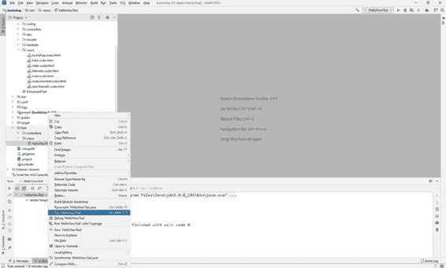

第 1 章 Play 2 入门

***图 1-9.** 运行测试*

您也可以使用 sbt 从命令提示符运行测试。打开命令提示符，转到项目根目录，然后运行

`sbt test`

请注意，`sbt test` 将运行 test 文件夹中的所有测试。如果您只想运行特定的测试，请使用 `testOnly` 命令。

**测试控制器**

在 test 文件夹内创建一个名为 HomeControllerTest.java 的新文件，并添加如下内容。此测试验证映射到 `/` URL 路径的控制器的 index 方法。

**HomeControllerTest.java**

`import org.junit.Test;`
`import play.Application;`

第 1 章 Play 2 入门

`import play.inject.guice.GuiceApplicationBuilder;`
`import play.mvc.Http;`
`import play.mvc.Result;`
`import play.test.WithApplication;`
`import static org.junit.Assert. *assertEquals*;`
`import static play.mvc.Http.Status. *OK*;`
`import static play.test.Helpers. *GET*;`
`import static play.test.Helpers. *route*;`

`public class HomeControllerTest extends WithApplication {`

`@Override`
`protected Application provideApplication() {`
`return new GuiceApplicationBuilder().build();`
`}`

`@Test`
`public void testIndex() {`
`Http.RequestBuilder request = new Http.RequestBuilder()`
`.method( *GET*)`
`.uri("/");`
`Result result = *route*(app, request);`
`*assertEquals*( *OK*, result.status());`
`}`
`}`

使用以下 sbt 命令运行测试：

`sbt test`

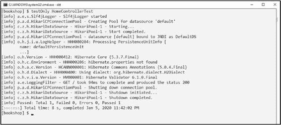

第 1 章 Play 2 入门

要单独运行 HomeControllerTest，请执行以下步骤（图 1-10）：
• 打开命令提示符。
• 转到项目根目录。
• 键入 **sbt** 进入 sbt shell。
• **testOnly** HomeControllerTest

***图 1-10.** testOnly*

至此，第 1 章结束。在我们讨论控制器和其他 Play Framework 组件之前，让我们更深入地了解一下您将要使用的构建系统 (sbt)。

**第 2 章**

**构建系统**

正如您在第 1 章中所见，Play 使用 sbt 作为其构建系统。当您使用基于 Play 的项目时，对 sbt 的基本了解是必需的。

本章的目标是快速介绍 sbt。

**Scala 构建工具/简单构建工具**

sbt 是 Scala 和 Java 项目的构建工具。它类似于 Java 项目中通常使用的 Maven 构建工具。sbt 深受 Maven 的启发。

作为一种构建工具，它提供了编译、运行、测试和打包项目的能力。Play 与 sbt 打包在一起，因此无需单独安装 sbt。Sbt 由 Mark Harrah 创建。关于 sbt 是代表“Scala 构建工具”还是“简单构建工具”存在混淆。事实上，当 sbt 项目开始时，它被宣布为“简单构建工具”，但多年来它被广泛称为“Scala 构建工具”。所以两种用法都是正确的。我个人偏好“简单构建工具”，因为它可以用作 Scala 和 Java 项目的构建工具。

**核心原则**

sbt 始终遵循四个核心原则：

1. 所有内容都应具有类型，并在实际可行的范围内强制执行。

2. 依赖关系应明确。

© Prem Kumar Karunakaran 2020
P. K. Karunakaran, *介绍 Play Framework*,
`doi.org/10.1007/978-1-4842-5645-9_2`

第 2 章 构建系统

3. 一旦学会，一个概念应贯穿 sbt 的所有部分。

4. 并行是默认设置。

**sbt 的优势**

sbt 具有以下优势：

1. 它使用 Scala 语言来描述构建。

2. 无需编写庞大冗长的 pom.xml 文件。构建配置是代码，而不是 XML。

3. 它适用于 Scala 和 Java。

4. 它需要最少的配置。

5. 它提供声明式依赖管理（通过 Ivy）。

6. 它具有合理的默认值。

sbt 构建使用称为任务（是的，它只是一个任务）的东西，并且一个任务可以有依赖项。因此，sbt 构建是一个要执行的任务依赖树。

当您想要做某事时，您必须执行一个任务。默认情况下，任务在 sbt 中并行运行。如果您想对任务的执行进行排序，可以通过指定任务之间的依赖关系来完成。例如，`compile` 和 `test` 是两个任务，但 `test` 依赖于 `compile`，因此当您执行 `test` 任务时，`compile` 任务将在其之前执行。

任务的链式调用在 sbt 中容易得多。您可以将一个任务的输出传递给另一个依赖任务。在内部，sbt 维护一个描述构建的不可变映射（键值对）。因此，您可以看到构建文件中的大多数条目都是键值对。例如，项目名称作为一个键值对提供，它映射到一个字符串值，即您的项目名称。

第 2 章 构建系统

sbt 中的构建配置文件是 build.sbt 文件，其意图类似于 Maven 中的 pom.xml。build.sbt 包含项目的构建定义。

让我们看一些代码和实际示例以获得更好的理解。

**项目结构**

一个典型的项目结构在根目录中有 build.sbt 文件，在 /project 目录内有 build.properties 和 plugins.sbt 文件：
HelloProject
/project
build.properties: 指定项目中使用的 sbt 版本。如果本地没有特定的 sbt 版本，sbt 启动器将下载它。
plugins.sbt : sbt 插件的定义
build.sbt: 包含构建和项目设置的文件

**build.properties**

`sbt.version=0.13.0`

在您检查 Play 为您的项目创建的 sbt 文件结构之前，让我们先了解 build.sbt 的一般结构，并尝试几个示例。

转到任何目录，创建一个名为 helloworldsbt 的文件夹，创建一个名为 build.sbt 的文件，并添加以下内容：

`name := "helloworldsbt"`
`organization := "com.domainame.example"`

第 2 章 构建系统

`version := "1.0-SNAPSHOT"`

`lazy val hello = (project in file("."))`
`.settings(`
`name := "HelloWorld Proj"`
`)`

`scalaVersion := "2.13.0"`

build.sbt 文件保存一系列称为设置表达式的键值对，其一般结构为

`key operator setting/task body`

例如：

`organization := "com.domainname"`

再分解一下：

1) 左侧是键。
2) 操作符 (:=)
3) 右侧是主体。

organization、version、name 等是预定义的、现成的键。

**使用 sbt**

转到 helloworldsbt 项目的根文件夹，并从命令提示符键入 `sbt`。您可以看到 sbt 下载所需的 jar，您将进入 sbt 提示符，如下所示：

`sbt:helloworldsbt>`

您在 helloworldsbt 项目中没有任何源文件，这没问题。您可以在没有源代码的情况下尝试许多 sbt 命令及其用法。

第 2 章 构建系统

以下是典型项目中最常用的命令：

• help: 显示 sbt 帮助
• compile: 编译源代码
• test: 执行测试用例
• run: 运行主类
• package: 创建一个 jar 文件
• exit: 退出 sbt 提示符

当您执行 `run` 时，您将收到以下错误：

`No main class definition found`

暂时忽略它，因为您没有任何源代码，并且 `run` 期望找到一个 main 方法来运行。

如前所述，`compile`、`run`、`test` 等是 sbt 中现成的任务，用于执行特定操作。就像这些任务一样，sbt 允许您创建自定义任务并在构建中使用它们。让我们尝试一个自定义任务。

修改 build.sbt 如下：

`name := "helloworldsbt"`
`organization := "com.domainame.example"`
`version := "1.0-SNAPSHOT"`

`lazy val hello = taskKeyUnit`

`lazy val root = (project in file(".")).settings(`
`hello := { println("This is a custom task !!") }`
`)`

`scalaVersion := "2.13.0"`

以下行定义了任务并将其分配给变量 hello：
`lazy val hello = taskKeyUnit`

第 2 章 构建系统

下一行添加此任务并提供一个实现，在本例中非常简单，就像向控制台打印一个字符串一样。就这样；您已经定义了一个自定义任务。

`lazy val root = (project in file(".")).settings(`
`hello := { println("This is a custom task !!") }`
`)`

要测试这一点，请转到 sbt 提示符并键入 **hello**。

`sbt:helloworldsbt> hello`
`This is a custom task !!`
`[success] Total time: 1 s`

从您的项目根文件夹，您甚至可以尝试 **sbt hello**：
`C:\Test\helloworldsbt>sbt hello`
`Java HotSpot(TM) 64-Bit Server VM warning: ignoring option`
`MaxPermSize=256m; support was removed in 8.0`
`[info] Loading project definition from C:\Test\helloworldsbt\project`
`[info] Loading settings from build.sbt ...`
`[info] Set current project to helloworldsbt (in build file:/C:/`
`Test/helloworldsbt/)`
`This is a custom task !!`
`[success] Total time: 0 s, completed Nov 8, 2019 1:03:59 PM`

现在让我们看看 Play 为 bookshop 项目创建的 build.sbt 定义。

当您创建一个 Play 项目时，构建会自动创建所需的 sbt 文件夹结构和文件：

**build.sbt**
`name := "bookshop"`
`organization := "com.stackrules.example"`
`version := "1.0-SNAPSHOT"`

`lazy val root = (project in file(".")).enablePlugins(PlayJava) 38`

第 2 章 构建系统

`scalaVersion := "2.13.0"`
`libraryDependencies += guice`

`EclipseKeys.preTasks := Seq(compile in Compile, compile in Test)`
`EclipseKeys.projectFlavor := EclipseProjectFlavor.`
`Java // Java project. Don't expect Scala IDE`
`EclipseKeys.createSrc := EclipseCreateSrc.`
`ValueSet(EclipseCreateSrc.ManagedClasses, EclipseCreateSrc.`
`ManagedResources)`

让我们分析每一行。上述文件中的条目是设置。每个设置必须用一个空行分隔。这非常重要。

**设置定义**

正如您在上面看到的，一个设置包含一个键、一个操作符和一个初始化。例如，`name := "bookshop"` 将项目名称设置为 bookshop。

`name` – 键
`:=` 赋值操作符
`"bookshop"` - 初始化值

这就是您为设置设置静态值的方式。设置的值只计算一次并保留。任务也类似于具有键和值的设置。重要的区别在于，任务在每次调用时都会重新计算。我们稍后会回到任务。

在 build.sbt 文件的 `libraryDependencies` 部分，您可以看到这个条目：

`libraryDependencies += guice`

这表明构建正在将 guice Play 模块作为依赖项包含在内。为了继续学习后面章节中的其他部分，您需要更多模块可供 Play 使用。现在让我们修改 `libraryDependencies` 部分来添加它们。

第 2 章 构建系统

将这一行

`libraryDependencies += guice`

替换为

`libraryDependencies ++= Seq(`
`javaJdbc,`
`cacheApi,`
`guice`
`)`

Ebeam ORM 作为 Play 的外部插件可用，因此将以下内容添加到 plugins.sbt 文件中：

`addSbtPlugin("com.typesafe.sbt" % "sbt-play-ebean" % "5.0.2")`

您已完成对构建设置的更改！

典型的库依赖格式是

`libraryDependencies += groupID % artifactID % revision`

例如，

`libraryDependencies += "org.apache.derby" % "derby" %`
`"10.4.1.3"`

您可以通过访问 Maven 中央仓库 [`mvnrepository.com/repos/central`](https://mvnrepository.com/repos/central) 并使用名称搜索来找到任何 jar 的 groupId 和 artifactId。例如，键入 **derby** 并选择版本以查看其依赖信息。derby 10.4.1.3 的定义如图 2-1 所示。

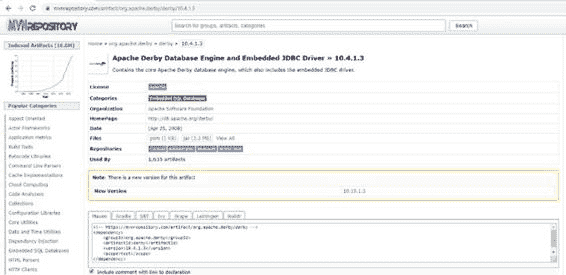

第 2 章 构建系统

***图 2-1.** Maven 中央仓库*

上述行将 Derby 版本 10.4.1.3 添加为依赖项。如果您需要添加更多依赖项，则必须添加另一行，依此类推。

但也有一种简写技术可以一次性添加所有依赖项，而不是逐行指定每个依赖项：

**libraryDependencies ++= Seq(**
groupID % artifactID % revision,
groupID % otherID % otherRevision
**)**

sbt 依赖于插件来扩展 build.sbt 文件中定义的构建设置。插件为构建添加了更多功能，并在 sbt 项目之间重用。例如，有人可以开发一个在构建期间执行代码覆盖的插件。要集成 sbt 和 Play，您需要使用 Typesafe 的 sbt-plugin。plugins.sbt 文件是所有插件定义的地方：

`// Comment to get more information during initialization`
`logLevel := Level.Warn`

第 2 章 构建系统

`// The Typesafe repository`
`resolvers += "Typesafe repository" at "http://repo.typesafe.`
`com/typesafe/releases/"`

`// Use the Play sbt plugin for Play projects`
`addSbtPlugin("com.typesafe.play" % "sbt-plugin" % "2.8.0")`

**解析器**

默认情况下，sbt 使用标准的 Maven 2 仓库。但并非所有 jar 都存在于默认仓库中。如果您的 jar 位于另一个仓库中，您可以添加该仓库作为解析器。

添加解析器的格式：

`resolvers += name at location`

这有三部分：名称和位置，由 `at` 关键字分隔。

添加 Jboss 仓库：

`resolvers += "JBoss repository" at "https://repository.jboss.`
`org/nexus/content/repositories/"`

**完整的 build.sbt**

`name := """bookshop"""`
`organization := "com.stackrules.example"`
`version := "1.0-SNAPSHOT"`

`lazy val root = (project in file(".")).enablePlugins(PlayJava)`
`scalaVersion := "2.13.0"`
`libraryDependencies ++= Seq(guice,javaJdbc,cache)`

`EclipseKeys.preTasks := Seq(compile in Compile, compile in Test) 42`

第 2 章 构建系统

`EclipseKeys.projectFlavor := EclipseProjectFlavor.`
`Java // Java project. Don't expect Scala IDE`
`EclipseKeys.createSrc := EclipseCreateSrc.`
`ValueSet(EclipseCreateSrc.ManagedClasses, EclipseCreateSrc.`
`ManagedResources)`

您可以轻松地转义字符串中的字符和符号；您只需要将文本包裹在三引号内。这就是为什么您会看到名称使用三引号。如果您需要在名称中包含空格、冒号或撇号，此语法会有所帮助。

**完整的 plugins.sbt**

`// The Play plugin`
`addSbtPlugin("com.typesafe.play" % "sbt-plugin" % " **2.8.0**")`

`// Defines scaffolding (found under .g8 folder)`
`// http://www.foundweekends.org/giter8/scaffolding.html`
`// sbt "g8Scaffold form"`
`addSbtPlugin("org.foundweekends.giter8" % "sbt-giter8-scaffold"`
`% "0.11.0")`

`addSbtPlugin("com.typesafe.sbteclipse" % "sbteclipse-plugin" %`
`"5.2.2")`

`addSbtPlugin("com.typesafe.sbt" % "sbt-play-ebean" % "5.0.2")`

**SBT 命令快速回顾**

• sbt: 启动 sbt 控制台
• run: 运行应用程序的 main 方法
• compile: 编译 src/main/scala 目录中的源代码

第 2 章 构建系统

• test: 执行所有测试用例
• testOnly: 提供测试用例的完整名称以仅运行特定的测试用例
• test:compile: 仅编译测试源文件 (src/test/scala)
• package: 创建一个包含源文件夹中的类和资源文件夹中的工件的 jar
• doc: 生成 Scala 文档
• exit: 退出 sbt 提示符

**第 3 章**

**Play 控制器和**

**HTTP 路由**

本章重点介绍 Play 应用程序的 MVC 部分：MVC 如何在 Play 应用程序框架中发挥关键作用。在我们深入探讨 Play 中的 HTTP 路由和控制器细节之前，最好先快速介绍一下 MVC。如果您熟悉 MVC，可以跳过此部分，直接进入“HTTP 路由”部分。

**MVC 编程模型**

MVC（模型-视图-控制器）是使用著名的 MVC 设计模式构建 Web 应用程序的框架。MVC 将应用程序定义为三个逻辑层：业务层（模型）、显示层（视图）以及路由和输入控制（控制器）。参见图 3-1。

© Prem Kumar Karunakaran 2020
P. K. Karunakaran, *介绍 Play Framework*,
`doi.org/10.1007/978-1-4842-5645-9_3`

第 3 章 Play 控制器和 HTTP 路由
1) 用户的请求被发送到控制器。
2) 控制器操作模型。
.
控制器
3) 控制器选择要显示的视图，并将其提供给模型
4) 视图根据用户交互更新模型。
视图
模型

***图 3-1.** MVC*

MVC 架构的工作方式如下。用户与视图交互，更改由视图发送到控制器。控制器接收更改，调用模型，并在模型中应用验证和逻辑。控制器选择视图并将更新后的模型发送到视图。视图被渲染并发送回浏览器客户端。

视图和控制器都依赖于模型。模型与视图或控制器没有任何依赖关系。这是分离的关键优势之一。这种分离允许模型独立于视图进行构建和测试。

**模型**

模型是应用程序的数据以及对该数据的业务逻辑。模型是一个独立的组件，不依赖于控制器或视图。这意味着模型可以在没有关联视图或控制器的情况下重用。

模型处理应用程序的业务逻辑，并负责从数据库检索数据、执行更新、实施验证，并且是应用程序的核心逻辑和分析部分。

第 3 章 Play 控制器和 HTTP 路由

考虑代表应用程序客户的模型；它负责处理与客户实体相关的所有验证和逻辑。以下代码中的 `deactivate` 方法是模型内业务逻辑的一个示例。此方法处理客户的停用逻辑，从而将领域逻辑封装在模型本身内。领域逻辑封装在领域对象内，因此模型可以在应用程序/子系统之间重用。

`package models;`

`import java.util.List;`

`**import** controllers.Order;`

`public class Customer {`

`private long id;`
`private String name;`
`private boolean loyaltyMember;`
`private boolean isActive;`
`private List<Order> orders;`

`public List<Order> getOrders() {`
`//Logic`
`}`

`public boolean deactivate() {`
`//Logic and validation to deactivate a customer`
`}`
`}`

客户是一个领域模型，包含数据以及适用于客户的相关业务逻辑和验证。

当然，如果您遵循领域驱动设计，您可以将模型拆分为许多业务对象，它们可以处理特定领域的逻辑和验证。Spring beans、JPA beans、简单 POJO 等通常用于实现领域模型。

第 3 章 Play 控制器和 HTTP 路由

**视图**

视图处理数据的显示，并从模型获取所需的数据属性。视图的唯一目的是显示数据。

考虑一个显示应用程序客户数据的屏幕。此屏幕可能显示客户详细信息、特定客户下的订单等。如果有一个新需求需要在另一个屏幕中以钻取模式而不是表格方式显示相同的客户数据，则只需创建一个新视图。模型中无需进行任何更改。因此，视图可以独立于模型创建和修改。

**控制器**

控制器处理与用户的交互。控制器通常执行以下操作：

• 从视图获取输入数据并将其发送到模型以进行持久化。
• 当模型更改时，控制器将更新后的模型发送到视图并渲染视图。

MVC 有助于在大型项目中使团队开发变得轻松和可管理。它提供了清晰的关注点分离。

**HTTP 路由**

HTTP 路由器的工作是将传入的 HTTP 请求转换为动作调用。也就是说，它将 HTTP 请求映射到控制器类中定义的方法。此配置维护在 conf 文件夹内的 routes 文件中。routes 文件也会被 Play 编译，因此，如果 routes 文件中有任何错误，它将在浏览器中显示。这在开发期间非常有帮助。

第 3 章 Play 控制器和 HTTP 路由

让我们看看 HTTP 路由基础知识。一个 HTTP 请求有两部分：协议部分（GET、POST、PUT 等）和包含查询字符串的请求路径。

要定义路由，请在 conf/routes 文件中定义协议和 URL 路径。在此之前，在 app/controllers 文件夹内创建一个新的控制器类，并将其命名为 Application。确保该类继承自 `play.mvc.Controller`。

`package controllers:`

`import play.mvc.*;`
`import views.html.*;`

`public class Application extends Controller {`

`}`

在完成路由部分后，您将向此控制器添加方法。

编辑 conf/routes 文件并添加以下条目：

