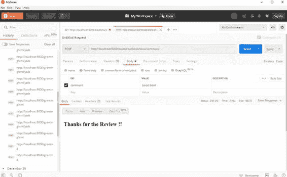

# 按书名搜索图书

GET /bookshop/book/search/ controllers.

Application.searchByTitle(keyword:String)

现在来看应用程序控制器（Application.java）：

package controllers;

import javax.inject.Inject;

第 3 章 Play 控制器与 HTTP 路由 import play.mvc.*;

import play.data.DynamicForm;

import play.data.FormFactory;

public class Application extends Controller{

/**

* 处理首页

* @return

*/

public Result index() {

return ok(views.html.bookshop.render());

}

/**

* 根据 ID 获取图书详情

* @param id

* @return

*/

public Result getBook(String id) {

return ok(views.html.bookshop.render());

}

@Inject

FormFactory formFactory;

/**

* 接收表单提交并保存评论

* 演示如何使用动态表单从 HTML 表单提交中检索数据

* @return

*/

public Result saveComment(Http.Request request) {

DynamicForm requestData = formFactory.form().

bindFromRequest(request);

String comment = requestData.get("comment");

第 3 章 Play 控制器与 HTTP 路由 return ok(views.html.savecomment.render());

}

public Result searchByTitle(String title) {

// 查询数据库或从缓存中获取图书详情

return ok(views.html.searchresults.render());

}

}

**saveComment 方法**

saveComment 方法处理用于保存评论的表单提交操作。在 Play 中，有多种方式可以将表单提交数据绑定到模型类。上述方法演示了如何使用 DynamicForm 类动态地从表单中获取数据。

最常见的方法是为表单数据定义一个类（模型），并在控制器中用 play.data.Form 对其进行包装。Play 会自动将表单字段绑定到模型属性。例如：

**package** models;

**import** javax.persistence.Entity;

**import** javax.persistence.Id;

**import** javax.persistence.Table;

@Entity

@Table(name=**"comment"** )

**public class** Comment {

@Id

**private** Long **id**;

**private** String **comment**;

第 3 章 Play 控制器与 HTTP 路由 **public** String getComment() {

**return comment**;

}

**public void** setComment(String comment) {

**this**. **comment** = comment;

}

}

将此文件保存为 Comment.java，放在 models 包内。

再看一下上面展示的 Application.java 类。在该类中，你注入了 FormFactory 并为其提供了评论模型。因此，表单数据到模型类的数据绑定将由 Play 框架自动处理。

Application.java 文件中执行表单数据自动绑定到模型类的相关代码如下：

@Inject

FormFactory formFactory;

DynamicForm requestData = **formFactory**.form().

bindFromRequest(request);

String comment = requestData.get(**"comment"** ); **测试 saveComment 操作**

任何 HTTP 测试客户端都可以用来测试此操作。本书使用 Postman 来测试服务。Postman 是一个帮助测试符合 REST、SOAP 等协议的 HTTP 端点的平台。若要通过命令行测试，可以使用 curl。你可以从 [www.](http://www.getpostman.com/)

[getpostman.com/.](http://www.getpostman.com/) 下载 Postman。参见图 3-2。

第 3 章 Play 控制器与 HTTP 路由

***图 3-2.** 测试 saveComment*

要从命令提示符进行测试，请使用 curl 命令：

**curl --location --request POST 'http://localhost:9000/bookshop/**

**book/save/comment/' --form 'comment=Good Book'**

**模型**

由于 Play 框架遵循 MVC 原则，你应该确保控制器层尽可能薄。不要在控制器中放置任何业务逻辑。所有业务逻辑都应在模型或其他辅助类中完成。Play 的惯例是将模型定义在 app/models 文件夹内。

第 3 章 Play 控制器与 HTTP 路由 默认情况下，Play 会在 app 内创建 views 和 controllers 文件夹。通常的做法是将模型实现为 JPA 实体。在本章中，我们仅用 JPA 注解来标注模型；不会进行任何 JPA 配置或持久化实现。在本书后续章节中，我们将详细探讨 JPA。

**package** models;

**import** javax.persistence.*;

@Entity

@Table(name=**"book"** )

**public class** Book **extends** Model {

@Id

**private** String **id**;

**private** String **name**;

**private** String **author**;

**public** String getId() {

**return id**;

}

**public void** setId(String id) {

**this**. **id** = id;

}

}

**作用域对象**

在任何 Web 应用程序中，可能需要在应用的不同页面之间维护数据，以便与应用程序的用户保持对话会话。在某些情况下，你可能只需要将数据的作用域限定为下一个请求，而不是整个会话。Play 对这两种情况都提供了支持。控制器类负责存储和访问作用域对象。

第 3 章 Play 控制器与 HTTP 路由 Play 框架提供了两种作用域对象：

• 会话作用域

• 闪存作用域

存储在会话作用域中的数据跨越多个 HTTP 请求，在整个用户会话期间都可用。存储在闪存作用域中的数据仅对下一个请求可用。

Play 通过 Cookie 实现上述两种作用域，因此强制限制大小为 4 KB。你只能在这些作用域中存储字符串值。

**会话作用域**

在 Play 中，会话没有超时时间。当用户关闭浏览器时，会话过期。但如果你的应用程序需要配置超时时间，可以通过在 application.conf 文件中添加会话配置来实现，如下所示：

**application.conf**

play.http {

session {

