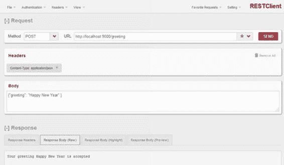
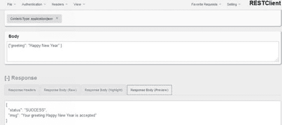

# maxAge = 300

}

}

第 3 章 Play 控制器与 HTTP 路由 Play 提供了以下方法来处理会话作用域：**addingToSession**

public Result dard(Http.Request request) {

return ok("欢迎!").addingToSession(request,

"dashboard login", "useremailaddress");

}

**removingFromSession**

public Result disconnect(Http.Request request) {

return ok("断开连接成功").

removingFromSession(request, "disconnect");

}

要访问会话数据，请使用以下代码：

public Result index(Http.Request request) {

return request

.session()

.get("dashboardlogin")

.map(id -> ok("欢迎: " + user))

.orElseGet(() -> unauthorized("请重新登录"));

}

在这个例子中，你使用了 Play 的 Session API 来检索值；如果为空，则直接返回一个未授权的响应。

要丢弃整个会话，Play 提供了 withNewSession 方法：

public Result quit() {

return ok("已登出").withNewSession();

}

第 3 章 Play 控制器与 HTTP 路由 **Flash 作用域**

Flash 作用域与会话类似，但存在以下区别。

首先，**数据仅保留一个请求**。在第一个请求中，你设置 flash 作用域，当用户通过发出另一个请求移动到下一个页面或部分时，该数据可用，并且可以通过控制器中的方法在该请求的处理过程中检索到。其次，它使用未签名的 cookie。

会话和 flash 作用域都使用浏览器 cookie 来实现其行为，而 flash 作用域的 cookie 是未签名的。因此，不要使用 flash 作用域来存储任何敏感数据。仅将其用于存储成功消息或错误消息。使用以下代码将数据添加到 flash 作用域： public Result about() {

return redirect("/company").flashing("aboutinfo",

"about info requested");

}

当请求到达时，键为“aboutinfo”的数据被添加到 flash 作用域，并被重定向到公司页面。在公司页面中，映射到 /company URL 的控制器方法可以访问此数据，如下所示： public Result companyinfo(Http.Request request) {

return ok(request.flash().get("aboutinfo").orElse ("公司名称"));

}

**第 4 章**

**Play 视图与**

**使用 Scala 的模板化**

默认情况下，Play 中的视图是 HTML，并且可以使用 Scala 表达式语言使其动态化。实际上，如果需要，你也可以返回 JSON 或 XML 响应。让我们首先关注 HTML Scala 视图以及 Play 模板引擎如何帮助你创建模块化、富有表现力和流畅的视图。尽管模板引擎使用 Scala 作为表达式语言，但这对于 Java 开发人员来说不是问题。模板中使用的 Scala 语言非常简单。正如你在第 1 章中所看到的，Play 使用的模板引擎是 Twirl。回想一下，模板文件必须命名为 {name}.scala.{ext}。ext 可以是 html、js、xml 等。Play 偏好约定优于配置。当你编译时，编译器将生成 Scala 源文件，它们将与其余源代码一起编译。

与 Play 中的所有其他类一样，模板也是即时编译的，你可以直接在浏览器中看到错误。你应该记住，模板/视图不是编写复杂逻辑的地方。将所有与表示相关的逻辑写在控制器或辅助类中。你所有的业务逻辑都应该在你的业务实体类中。

© Prem Kumar Karunakaran 2020

P. K. Karunakaran, *Introducing Play Framework*,

`doi.org/10.1007/978-1-4842-5645-9_4`

第 4 章 Play 视图与使用 Scala 的模板化 大多数情况下，你只会从模型对象中访问数据。

换句话说，Scala 模板语言只提供有限的选项来编写复杂逻辑；其目的是提供一种更简单的方法来访问模型中的数据。这是有意为之，以限制开发人员在视图中嵌入复杂代码。

**关键点** 请记住，视图仅用于访问存储在模型中的数据。所有逻辑，即使是像维护计数器这样的事情，也是控制器或表示辅助类的工作。

**组合视图**

请记住，Play 视图的命名遵循约定 viewname.scala.html。例如，你可以为页脚创建一个视图，并将其命名为 footer.scala.html。让我们检查以下页面以更好地理解这一点：

<!DOCTYPE html PUBLIC "-//W3C//DTD HTML 4.01 Transitional//EN"

"http://www.w3.org/TR/html4/loose.dtd">

<html>

<head>

@header("首页")

</head>

<body>

<!-- 首页内容放在这里 -->

@footer()

</body>

</html>

第 4 章 Play 视图与使用 Scala 的模板化 在这个例子中，首页使用两个视图来创建一个组合视图。请注意以下几点：header 和 footer 是从另一个视图引入的；引入 header 和 footer 视图的简洁性；没有复杂的配置；只需使用 @ 符号后跟视图名称。你会在整个 Play 框架中发现这种简洁性；这是 Play 框架的重要目标之一。

header 视图声明它接受一个 String（标题）作为参数：

@(title:String)

*<meta http-equiv=*"Content-Type" *content=*"text/html; charset=ISO-8859-1" *>*

<title>@title</title>

此参数由调用者提供以渲染页面标题。如果需要，可以为参数提供默认值：

@(title : String ="图书首页")

**@ 特殊字符**

Scala 模板使用 @ 作为特殊字符。每次遇到此字符时，它都表示动态语句的开始。动态语句的结束由 Scala 引擎自动推断。有时你可能需要编写多行语句，为此你可以将动态代码括在花括号或大括号中：

@(动态代码 )

@{ 动态代码 }

第 4 章 Play 视图与使用 Scala 的模板化 **设计通用模板**

让我们为所有页面设计通用模板。为了便于说明，我们保持非常简单。你所有的页面都将包含以下内容：

页眉

主要内容

页脚

让我们将此模板定义为 main.scala.html：

@(title:String)(content:Html)

<!DOCTYPE html PUBLIC "-//W3C//DTD HTML 4.01 Transitional//EN"

"http://www.w3.org/TR/html4/loose.dtd">

<html>

<head>

@header(title)

</head>

<body>

@content

@footer()

</body>

</html>

请注意，除了标题之外，模板还接受另一个参数：content（类型为 Html）。这是为了将 HTML 代码合并到模板中。上面的模板就像一个接受两个参数的方法：一个标题参数和 HTML 内容。

让我们创建一个使用此模板的视图。‘welcome 视图将两个参数从 main.scala.html 传递给模板以渲染视图。请注意，HTML（模板的第二个参数）是在 {} 内传递的：

第 4 章 Play 视图与使用 Scala 的模板化

@maintemplate("欢迎页面") {

<h3>这是欢迎页面</h3>

}

视图（welcome.scala.html）使用主模板来引入包含页眉、正文和页脚的页面结构。如果你的视图很复杂，请将它们拆分为多个模板，并借助这些模板组合视图。

规则是将重复出现的代码部分放在单独的模板文件中。Play 中使用的 Scala 模板结构比许多现有的模板引擎（例如 Tiles）更强大、更简单。

**代码片段 模板化基础**

Play 视图使用一个名为 Twirl 的模板引擎。通过使用模板引擎，视图可以轻松渲染任何标记，如 HTML、XML 和 CSV，尽管对于大多数 Web 应用程序，我们只使用 HTML。

例如，在所有示例中，你只使用了 HTML 标记，因此你将视图命名为 {name}.scala.html。命名视图的一般语法是 {name}.scala.{ext}，其中 ext 可以是 html、js、xml 或 txt。因此，你可以为同一页面保留不同的标记版本，并且根据上下文，控制器可以渲染适当的视图。这使你可以向特定客户端显示 HTML，而向另一个客户端显示 XML 标记。

Play 的模板引擎 Twirl 的设计方式使得前端开发人员在处理代码的动态部分时感到舒适。HTML 专家只关心模板中的 HTML 标记，而另一个成员可能只处理迭代动态元素等。简单的 Twirl 语法使代码更易于阅读和处理。让我们探索最常见的 Play 模板元素。

第 4 章 Play 视图与使用 Scala 的模板化 **注释**

@***************

* 注释块

****************@

**模板参数**

一个模板可以接受任意数量的参数。它可以接受常见的 Java 类型或自定义的用户定义类型。例如，考虑 @(booklist <-

List[models.Book])。这里模板接受一个图书对象列表：

@(booklist <- List[models.Book])

@main("图书列表") {

@for(book <- booklist){

< **div**>@book.getTitle()</**div**>

< **div**>@book.getAuthor()</**div**>

}

}

在这个例子中，模板接受一个 Book 列表作为参数，并迭代图书，将 HTML 内容传递给 main.scala.html 文件进行渲染。请注意，你在前面的章节中已经探索过 main.scala.html 文件。它看起来像这样：

@*

* 此模板从 `index` 模板调用。此模板

* 处理页面标题和 body 标签的渲染。它接受

* 两个参数，一个 `String` 用于页面标题，一个 `Html`

* 对象用于插入到页面主体中。

*@

@(title: String)(content: Html)

第 4 章 Play 视图与使用 Scala 的模板化

<!DOCTYPE **html**>

< **html lang="en"** >

< **head**>

@* 这里我们渲染页面标题 `String`。 *@

< **title**>@title</**title**>

< **link rel="stylesheet" media="screen" href="@routes.**

**Assets.versioned("stylesheets**/main.css")">

< **link rel="shortcut icon" type="image/png" href="@**

**routes.Assets.versioned("images**/favicon.png")">

</**head**>

< **body**>

@* 这里我们渲染包含页面内容的 `Html` 对象。 *@

@content

< **script src="@routes.Assets.versioned("javascripts**/

main.js")" type="text/javascript"></**script**>

</**body**>

</**html**>

你可以使用以下语法为模板参数提供默认值：

@(title: String ="图书首页")

**导入语句**

考虑代码 @(booklist <- List[models.Book])。你可能已经注意到，类型是使用其完全限定包名显式定义的。当参数数量增加时，这会变得繁琐且难以维护。Scala 模板允许你将包导入到视图中，以便你可以仅通过名称引用类。

第 4 章 Play 视图与使用 Scala 的模板化 语法：

@import packagename._

示例：

@import models._

你应该将 import 语句放在模板的开头。如果你将其声明在任何其他位置，编译器将抛出异常。最佳位置是在参数声明之后立即定义导入。

**迭代列表**

语法：

@for(localvariable <- variable refering the List) {

@localvariable.method()

}

让我们以在首页上显示前 N 本书为例。你可以将模型命名为 Book；它包含方法 getTitle 和 getPicture：

@(booklist <- List[models.Book])

@for(book <- booklist){

@book.getPicture()

@book.getTitle()

}

**迭代 Map**

语法：

@for((key, value) <- mapreference) {

Key is @key

Value is @value

}

第 4 章 Play 视图与使用 Scala 的模板化 让我们以迭代一个以 String 为键、List 为值的 Map 为例。你的 Map 将作者姓名作为键，该作者的图书列表作为值：

@(title: String,authorbookMap:Map[String,List[Book]])

@import models._

<!DOCTYPE html>

<html>

<head>

@header("主首页")

</head>

<body>

@for((key,value) <- authorbookMap){

作者 - @key

@for(book <- value){

@book.getTitle()

}

}

</body>

</html>

**If 块**

语法：

@if(condition){

}else{

}

if 块没有什么特别之处。它是标准的 Scala if 块。

第 4 章 Play 视图与使用 Scala 的模板化 **转义动态内容**

默认情况下，Scala 代码片段生成的动态内容会被转义。这意味着当视图被渲染时，它将表现为纯文本。但是，如果你需要输出原始的动态内容，可以使用 @Html 标签。

语法：

@Html(代码 / 变量)

**第 5 章**

**并发与异步**

**编程**

在深入 Play 之前，掌握 Java 中的并发和异步编程知识非常重要。这是必不可少的，因为后续章节中的示例将大量使用异步编程实践。

让我们首先了解 java.util.concurrent 包，这是 Java 中用于处理并发编程的核心模块。了解这一点将有助于理解 Play 如何使用 WS 和 Promise 类处理异步 Web 服务。如果你已经熟悉并发、其挑战以及 Java 如何使用自 JDK 1.5 以来在 java.util.concurrent 包中提供的新类来处理它，则可以跳过本章。

随着 java.util.concurrent 包中引入新类，Java 中的并发编程现在容易得多。需要关注的最重要的类是：

1) Executor

2) Callable<V>

3) Future<V>

4) CompletionStage<T>

© Prem Kumar Karunakaran 2020

P. K. Karunakaran, *Introducing Play Framework*,

`doi.org/10.1007/978-1-4842-5645-9_5`

第 5 章 并发与异步编程 在详细研究上述每个类之前，让我们快速了解一下什么是并发。

**什么是并发？**

并发是一种能够并行执行多个任务的技术。这些任务可以是同一程序或不同程序的一部分。

如果一个大型任务可以拆分成小块，并且每个小块可以并行执行，则可以带来更好的响应时间和吞吐量。

当程序的不同部分并行运行时，通常会使用称为线程的轻量级进程。一旦你使用线程，就需要有适当的机制来允许访问共享资源、正确管理线程生命周期、调度等。java.util.concurrent 包中的类有助于解决许多此类挑战。

**Executor**

在 JDK 1.5 中引入 Executor 框架之前，线程管理是开发人员的责任，并且 JDK 中没有用于此的框架。开发人员处理线程的创建及其管理以及实际的业务逻辑。从设计和编码的角度来看，考虑到遵循“关注点分离”设计理念所带来的好处，这并不是一个理想的情况。

将线程管理和创建与程序的其余部分分开是有意义的，而这正是 Executor 框架所做的。Executor 抽象了线程管理活动，如创建、调度等。不是直接创建线程，而是将 Runnable 类提交给 Executor，由它处理其执行。ExecutorService 是一个比 Executor 更完善的接口，在实际场景中使用，因为它提供了对 Callable 和 Future 的支持。你将在接下来的部分中了解 Callable 和 Future。注意：ExecutorService 继承自 Executor。

第 5 章 并发与异步编程 java.util.concurrent 包提供了三个 Executor 接口：

• Executor：一个简单的接口，支持启动新任务

• ExecutorService：Executor 的子接口，添加了有助于管理生命周期（包括单个任务和 executor 本身）的功能

• ScheduledExecutorService：ExecutorService 的子接口，支持任务的未来和/或周期性执行

ThreadPoolExecutor、ScheduledThreadPoolExecutor 和 ForkJoinPool 是 JDK 中可用的一些重要的 Executor 实现

在高层面上，使用 Executor 框架编写并发程序涉及以下步骤：

1) 定义一个实现 Runnable 或 Callable 接口的类/任务。

2) 配置并实现 ExecutorService，然后提交任务。

3) 如果任务是 Callable 任务，则使用 Future 类检索结果。

让我们看看 Runnable 和 Callable 之间的区别。Runnable 接口不返回结果，而 Callable 允许在完成后返回值。当 Callable 提交给 Executor 框架时，它会返回一个类型为 java.util.concurrent.Future 的对象。Future 可用于检索结果。

第 5 章 并发与异步编程 **示例 1：使用 Runnable**

**package** com.domain.concurrency;

**public class** SimpleTask **implements** Runnable {

@Override

**public void** run() {

System. ***out***.println(**"SimpleTask, Runnable: 执行逻辑 "** +System. *currentTimeMillis*());

}

}

SimpleTask 类是你希望由许多客户端并行执行的逻辑部分。此逻辑在 run 方法中实现，它打印以毫秒为单位的 currentTime。在传统的 Java 实践中，为了由许多客户端并行执行此操作，你需要为每个客户端创建线程并运行这些线程，同时进行线程协调、停止等。你还需要确保不会创建不必要数量的线程，并且线程应该被重用。所有这些都增加了并发编程的复杂性，而这正是 ExecutorService 的用武之地，因为它负责处理所有这些方面。现在让我们创建一个客户端，并要求它在多个线程中运行 SimpleTask： **package** com.domain.concurrency;

**import** java.util.concurrent.ExecutorService;

**import** java.util.concurrent.Executors;

**public class** Client {

**public static void** main(String[] args) {

*// 步骤 1：创建一个 Runnable*

Runnable simpleTask = **new** SimpleTask();

*// 步骤 2：配置 Executor*

第 5 章 并发与异步编程

*// 使用 FixedThreadPool executor*

ExecutorService executor = Executors. *newFixedThreadPool*(2); **for** (**int** i = 0; i < 10; i++) {

executor.submit(simpleTask);

}

executor.shutdown();

}

}

代码非常简单，但它做了很多事情。你创建了一个 SimpleTask 实例，创建了 ExecutorService，并用一个包含两个线程的线程池初始化它。然后你将任务提交给 ExecutorService。ExecutorService 负责以高效的方式使用其拥有的两个线程来执行这十个请求。

运行 Client.java 为：

**java com.domain.concurrenc.Client**

**输出**

SimpleTask, Runnable: 执行逻辑 1578145676485

SimpleTask, Runnable: 执行逻辑 1578145676485

SimpleTask, Runnable: 执行逻辑 1578145676486

SimpleTask, Runnable: 执行逻辑 1578145676486

SimpleTask, Runnable: 执行逻辑 1578145676486

SimpleTask, Runnable: 执行逻辑 1578145676486

SimpleTask, Runnable: 执行逻辑 1578145676486

SimpleTask, Runnable: 执行逻辑 1578145676486

SimpleTask, Runnable: 执行逻辑 1578145676486

SimpleTask, Runnable: 执行逻辑 1578145676486

通过检查输出，你可以看到时间以两个为一组重复出现，这意味着 ExecutorService 使用其拥有的两个线程来调度执行，一旦线程空闲，接下来的两个请求就会得到服务，依此类推。

第 5 章 并发与异步编程 **示例 2：使用 Callable**

Callable 类似于 Runnable。两者都设计为由线程执行。区别在于 Runnable 不返回任何内容，并且不能抛出受检异常。Callable 返回一个结果，并且可能抛出异常。Callable 接口定义了方法：

V call() **throws** Exception;

让我们通过一个示例来尝试 Callable：

package com.domain.concurrency;

import java.util.concurrent.Callable;

public class CallableTask implements Callable<String> {

@Override

public String call() throws Exception {

String s="Callable 任务在 " + System.currentTimeMillis() + " 运行";

return s;

}

}

CallableTask 返回一个 String，如果出现问题，也可以抛出异常。下面定义的 CallableClient 使用 ExecutorService 执行此任务。需要理解的最重要的事情是，由于这些是返回结果的异步执行，ExecutorService 返回一个 Future 对象，它是实际响应的代理。调用者必须通过调用 Future 上的 isDone 方法来检查执行是否已完成，并提取响应。

这就是以下代码所做的：

第 5 章 并发与异步编程 **package** com.domain.concurrency;

**import** java.util.concurrent.Callable;

**import** java.util.concurrent.ExecutionException;

**import** java.util.concurrent.ExecutorService;

**import** java.util.concurrent.Executors;

**import** java.util.concurrent.Future;

**public class** CallableClient {

*/***

* ***@param args***

* */*

**public static void** main(String[] args) {

*// 步骤 1：创建一个 Runnable*

Callable callableTask = **new** CallableTask();

*// 步骤 2：配置 Executor*

*// 使用 FixedThreadPool executor*

ExecutorService executor = Executors. *newFixedThreadPool*(2); Future<String> future = executor.submit(callableTask); **boolean** listen = **true**;

**while** (listen) {

**if** (future.isDone()) {

String result;

**try** {

result = future.get();

listen = **false**;

System. ***out***.println(result);

} **catch** ( InterruptedException |

ExecutionException e) {

e.printStackTrace();

}

}

第 5 章 并发与异步编程

}

executor.shutdown();

}

}

这里你使用一个 while 循环来持续检查完成状态，一旦准备就绪，数据被消费并退出循环。请注意，isDone 是一个非阻塞方法，因此你在使用它时不会阻塞线程。Future API 中还有一个名为 get 的方法；它是一个阻塞方法，它会阻塞主线程直到响应到达。

你可以尝试 get 的另一种变体，它接受一个超时时间： String result =future.get();

String result =future.get(10, TimeUnit. *SECONDS*);

**使用 Play 进行异步编程**

对于任何需要良好扩展的项目来说，异步处理请求的能力是选择框架的一个非常重要的因素。同步处理大量并发请求会消耗服务器资源，并且在某些极端情况下，如果容量规划不当，可能导致服务器停止运行。

来自 Web 服务器的正常页面请求通常是同步的，并且很多时候它们是先前渲染页面的缓存副本。但情况并非总是如此；有许多应用程序需要执行大量昂贵的处理才能将结果返回给客户端。在这种情况下，显然客户端必须等待结果到达，但服务器可以——实际上确实——在另一个执行线程中异步处理，从而释放稀缺的服务器资源。

第 5 章 并发与异步编程 Play 优雅地做到了这一点。服务器端非阻塞的 Play 操作应返回 CompletionStage<Result> 而不是普通的 Result 对象。CompletionStage 是一个承诺，即结果将在稍后某个时间可用。CompletionStage 接口的妙处在于它提供了大量的方法来附加回调，以便在结果可用时对其进行处理。

Web 客户端在等待响应时会被阻塞，但服务器上不会有任何阻塞，并且服务器资源可用于服务其他客户端。

**编写异步应用程序**

让我们找一个场景来更好地理解这一点。考虑一个基于个人 Facebook 资料推荐礼物的应用程序。此应用程序使用个人资料中公开可用的数据，然后在线搜索以收集与其兴趣匹配的礼物。在线搜索和组合礼物列表是昂贵的操作，可能会给服务器带来很大负担。因此，这段代码是异步编程的理想候选：

**public** CompletionStage<Result> recomendGifts(**final** String uid, **final** String age, **final** String relation) {

**return** CompletableFuture. *supplyAsync*(**this**::getGifts)

.thenApply(( List<GiftVO> gift) -> *ok*(**"已获取 "** +

gift));

}

**private** List<GiftVO> getGifts() {

List<GiftVO> gifts =**new** ArrayList<GiftVO>(); gifts.add(**new** GiftVO());

**return** gifts;

}

第 5 章 并发与异步编程 在这段代码中，私有方法 getGifts 负责查找礼物并返回礼物列表。当然，对于这个例子，我模拟了响应。在现实场景中，礼物可能基于个人的社交资料或愿望清单或类似的逻辑。该逻辑不在我们的讨论范围内；我们只关注异步编程语义。

公共方法 recomendGifts 使用 java.util.concurrent 包中的 Completable<Future> 接口异步调用 getGifts 方法。这是通过代码段 CompletableFuture.supplyAsync(this::getGifts) 完成的。

下一步是检查是否有响应，并在可用时对响应进行进一步处理，然后将其发送回客户端。这就是 thenApply 方法所做的。

**配置异步定时任务**

Play 使用 Akka 来处理异步任务。为了理解 Play 中的任务，需要具备 Akka 的基础知识。

**Akka 基础**

Akka 的官方定义是“一个用于在 JVM 上构建**高并发、分布式和容错**事件驱动应用程序的工具包和运行时。”

Akka 引入了 actor 模型抽象，并提供了一个更好的平台来构建正确、并发和可扩展的应用程序。这意味着它解决了编写多线程、高并发代码的困难。Akka 使用消息流模型来实现这一点。

Actor 模型并不是一个新概念。这个想法是由 Carl Hewitt、Peter Bishop 和 Richard Steiger 在 1973 年提出的。

Java 中传统的并发编程涉及许多线程协同工作。当它们需要对共享资源进行操作时，通过获取共享对象上的锁来完成。程序直接处理获取锁、使用后释放锁等底层任务。这种代码难以维护且容易出错；很多时候可能导致死锁。另一个痛点是跨 JVM 水平扩展。Akka 试图使用 actors、ActorRef 和 ActorSystem 来抽象这些低级编程方法。Actors 为透明分布提供了抽象，并为真正可扩展和容错的应用程序奠定了基础。

第 5 章 并发与异步编程 这是否意味着 Akka 中没有线程和锁？嗯，它们确实存在，但你不直接处理它们。在内部，一切都在轻量级线程和低级并发原语上运行。Akka 使用 java.util.concurrency 库来处理协调。

Akka 是用 Scala 编写的，并为 Scala 和 Java 提供了语言绑定。让我们首先了解什么是 actor。Actor 只是一个可以接收消息并采取行动处理消息的对象。它与生成消息的源严格解耦。

要使用 Akka actors，你需要做的第一件事是启动 ActorSystem。ActorSystem 是与 actors 交互的基本实体，负责 actor 生命周期管理，并且是 Akka 应用程序的入口点。当 Play 应用程序启动时，ActorSystem 变得可用，并且可以通过依赖注入在需要与 ActorSystem 交互的类中访问。

我们只会了解如何通过 Akka 在 Play 中调度异步任务。我们不会详细介绍 Play 中 Akka actor 系统的内部结构或配置。这些信息可以从 Play 框架的官方文档中轻松获得。

**import** akka.actor.ActorSystem;

**import** scala.concurrent.ExecutionContext;

**import** scala.concurrent.duration.Duration;

**import** javax.inject.Inject;

**import** java.util.concurrent.TimeUnit;

第 5 章 并发与异步编程 **public class** ScheduledTask {

**private final** ActorSystem **actorSystem**;

**private final** ExecutionContext **executionContext**;

@Inject

**public** ScheduledTask(ActorSystem actorSystem,

ExecutionContext executionContext) {

**this**. **actorSystem** = actorSystem;

**this**. **executionContext** = executionContext;

**this**.initialize();

}

**private void** initialize() {

**this**. **actorSystem**

.scheduler()

.scheduleAtFixedRate(

Duration. *create*(30 TimeUnit. ***SECONDS***),

*// initialDelay*

Duration. *create*(1, TimeUnit. ***MINUTES***),

*// interval*

() -> **actorSystem**.log().info(**"当前时间毫秒数 "** +System. *currentTimeMillis*()), **this**. **executionContext**);

}

}

此示例演示了如何调度一个任务，该任务将在 30 秒后运行，然后每隔一分钟运行一次。代码使用依赖注入来获取默认 ActorSystem 和 ExecutionContext 的引用，然后使用 ActorSystem 的 scheduler 方法在定义的间隔内执行代码。

**第 6 章**

**Web 服务、JSON**

**和 XML**

现代应用程序不仅暴露 Web 服务，它们还消费其他第三方 Web 服务。例如，你的应用程序可能消费 Facebook 或 Twitter 的 feed。大多数现代 Web 服务都使用处理 JSON 负载的 REST API 暴露。调用 Web 服务的一个典型问题是它们可能会阻塞调用者，并可能导致服务器阻塞，直到获得响应或发生超时。这不是一个特别好的设计，因为它会影响服务器的吞吐量，并可能导致违反 SLA。Play 2 通过提供异步、非阻塞的 API 来调用长时间运行的任务（如外部 Web 服务）解决了这个问题。Play 提供了 play.libs.ws 库来处理异步 Web 服务调用。由 play.libs.ws 发出的调用返回 CompletionStage<WSResponse>。之后，你可以使用 CompletionStage 接口中可用的回调函数来提取响应。

本质上，它们是异步回调方法。调用者发出 Web 服务调用，一旦响应可用，其余代码就会运行。你将在本章后面更详细地探讨这一点。

**注意** 在接下来的内容中，我将经常使用术语 *promise*。因此，理解什么是 promise 及其意图非常重要。

© Prem Kumar Karunakaran 2020

P. K. Karunakaran, *Introducing Play Framework*,

`doi.org/10.1007/978-1-4842-5645-9_6`

第 6 章 Web 服务、JSON 和 XML

“Promise，也称为 **CompletableFuture**，是一种在并发、异步编程场景中广泛使用的设计模式。Promise 代表某些在创建 promise 时未知的响应的代理。Promise 是一种编写异步代码的方式，使其看起来像是同步执行。”使用 promise 是一种避免在处理异步函数调用时遇到回调地狱的方法。每当我提到 promise 时，除非另有明确说明，否则它指的是 promise 设计模式。

**消费 Web 服务**

让我们通过示例来学习。你将在控制器中构建一个新方法，该方法调用 Web 服务并将响应返回给客户端。

这个新服务只是回显来自后端服务的响应。

路由配置：

GET /bookshop/book/echo controllers.Application.echoService 以下是 Application.java：

package controllers;

import javax.inject.Inject;

import play.mvc.*;

import play.data.DynamicForm;

import play.data.FormFactory;

import play.libs.ws.*;

import play.mvc.Result;

import java.util.concurrent.CompletionStage;

public class Application extends Controller {

@Inject WSClient ws;

public CompletionStage<Result> echoService() {

第 6 章 Web 服务、JSON 和 XML

return

ws.url("http://www.mocky.io/v2/53c7ec8426e0e3fd14326b0d")

.get()

. thenApply(response -> ok("Feed 响应: " + response.

getBody()));

}

}

echoService 使用 WS 库调用外部 Web 服务并返回响应。为了演示，我使用 mocky.io 网站创建了一个简单的 JSON 服务。

让我们检查 echoService 方法中的每个步骤。

首先，使用 @Inject 注解将 WSClient 注入到控制器中。

ws.url().get 返回 CompletionStage<WSResponse>。此对象包含完整的响应，并提供了以广泛使用的格式（如 JSON、XML 等）获取响应的方法。由于所有调用和内容交付都使用异步、非阻塞语义，调用者需要使用 futures 块在响应准备就绪时检索它。

thenApply 用于此目的；每当响应可用时，thenApply 内部的代码将执行。

• 将响应正文读取为字符串：

response.getBody()

• 读取为 JSON：

response.asJson()

• 读取为 XML：

thenApply(r -> r.getBody(xml()));

xml 方法在 play.libs.ws.WSBodyReadables 中可用。

第 6 章 Web 服务、JSON 和 XML

以下是 WSResponse API 常用的方法：

• 将正文作为字节数组获取：

byte[] asByteArray()

• 将正文作为 JSON 节点获取：

com.fasterxml.jackson.databind.JsonNode asJson()

• 将正文作为 XML 返回：

org.w3c.dom.Document asXml()

• 将内容作为原始字节返回：

akka.util.ByteString getBodyAsBytes()

• 获取响应的 HTTP 内容类型：

java.lang.String getContentType()

• 返回响应的 HTTP 状态码（200、404、201、500……）：

int getStatus()

• 返回 HTTP 状态码的文本表示（Ok、Not Found、Internal Server error……）：

java.lang.String getStatusText()

echoServices 方法使用 get 方法，该方法返回一个 CompletionStage<WSResponse> 对象。当你调用 get 时，你得到的只是一个代理对象。没有发生实际的调用。代理（CompletionStage）仅仅表示框架已经创建了一个将以非阻塞方式异步处理的任务。

当调用发出并获得响应时，需要某种方式让应用程序代码得到通知并进行进一步处理。这是通过提供回调方法来实现的。这就是 echoService 中其余代码的用途。thenApply 函数是一个回调函数。当后端服务返回响应时，Play 将使用 WSResponse 的实例调用此函数。

第 6 章 Web 服务、JSON 和 XML

**处理大型响应**

当接收大型 HTTP 响应时，使用 get 将响应加载到内存中并不是一个好主意。如果响应很大，达到千兆字节级别，可能会导致内存错误，并可能使应用程序崩溃。在这种情况下，更好的选择是使用 Akka 流式处理来增量消费响应。对于这种用例，WSResponse 提供了一个名为 getBodyAsSource 的方法：

Source<ByteString, ?> responseBody = res.getBodyAsSource(); 此响应正文可以通过将其与 sink 链接来处理。让我们看看这是如何完成的。

对于此示例，我使用 mocky.io 在线服务创建了一个模拟响应。此服务允许你创建用于测试的模拟响应。转到 [www.mocky.io/v2/5e08df833000005b0081a159](http://www.mocky.io/v2/5e08df833000005b0081a159)。此 URL 返回一个简单的 HTML 响应。让我们使用 Play 和 Akka 流式处理以异步、非阻塞和高效的方式处理此响应。预期的输出是以增量方式计算内容的长度，一旦所有处理完成，将响应发送给客户端。要使用 Akka 流式处理，你需要在控制器类中获取 Akka ActorSystem 和 Akka 流式处理 materializer 类的引用。目前，只需理解 materializer 是 Akka 流工作的辅助类。它是负责物化 Akka 流处理管道的类。如果你对 Akka 和异步编程完全陌生，可以快速阅读本书的第 8 章，了解 Akka 的基础知识，然后再回到本节。在进入代码之前，你需要理解两个术语：

第 6 章 Web 服务、JSON 和 XML

• **Source**：产生数据的元素。例如，可以创建一个 source 来流式传输来自 Twitter feed 的数据，或者一个用于读取目录中文件或 Web 服务的 source。

• **Sink**：数据的最终接收者。例如，你可以从 source 读取数据，进行一些转换，然后写回文件。在这种情况下，保存到文件就是 sink。在 Akka 流中，你连接 source 和 sink，并在其间执行转换和数据过滤。有了这些信息，让我们开始编写代码。

你将在 Application.java（控制器类）中添加一个新方法，即 processLargeResponse。此方法使用 Akka 流式处理语义从 REST 端点读取数据，并计算数据的大小。你不会读取整个响应然后计数；相反，数据是以块的形式读取的，并且计数会更新。

**package** controllers;

**import** actors.ActorModel;

**import** actors.PingActor;

**import** akka.actor.ActorRef;

**import** akka.actor.ActorSystem;

**import** akka.stream.Materializer;

**import** akka.stream.javadsl.Sink;

**import** akka.stream.javadsl.Source;

**import** akka.util.ByteString;

**import** play.libs.ws.WSClient;

**import** play.libs.ws.WSResponse;

**import** play.mvc.Controller;

**import** play.mvc.Http;

**import** play.mvc.Result;

第 6 章 Web 服务、JSON 和 XML

**import** scala.compat.java8.FutureConverters;

**import** javax.inject.Inject;

**import** java.util.ArrayList;

**import** java.util.List;

**import** java.util.concurrent.CompletableFuture;

**import** java.util.concurrent.CompletionStage;

**import static** akka.pattern.Patterns. *ask*;

**public class** Application **extends** Controller {

**final** ActorRef **pingActor**;

@Inject

**public** Application(ActorSystem system) {

**pingActor** = system.actorOf(PingActor. *getProps*());

}

@Inject

Materializer **materializer**;

**public** CompletionStage<Result> processLargeResponse() {

CompletionStage<WSResponse> futureResponse =

**ws**.url(**"http://www.mocky.io/v2/5e08df833000005b** **0081a159"** )

.setMethod(**"GET"** ).stream();

CompletionStage<Long> bytesReturned =

futureResponse.thenCompose(

res -> {

Source<ByteString, ?> responseBody = res.

getBodyAsSource();

*// 计算返回的字节数*

Sink<ByteString, CompletionStage<Long>> bytesSum =

第 6 章 Web 服务、JSON 和 XML

Sink. *fold*(0L, (total, bytes) -> total +

bytes.length());

**return** responseBody.runWith(bytesSum, **materializer**);

});

**return** bytesReturned.thenApply(

res -> *ok*((String)res.toString()));

}

}

此代码调用在 mocky.io 定义的 Web 服务，并将响应作为 Akka 流处理。这样，它只将响应的块加载到内存中并处理这些块。这种机制确保你可以处理任何大型响应而不会遇到内存和 CPU 瓶颈。

要测试这一点，请将以下条目添加到 routes.conf 文件中： GET /bookshop/example/largeresponse controllers.Application.

processLargeResponse()

**处理 JSON**

Play 内置了对 JSON 的支持。它可以自动解析 JSON 请求或生成 JSON 响应。让我们探讨两种场景： 1) 消费 JSON 请求

2) 生成 JSON 响应

**消费 JSON 请求**

Play 默认使用一个可以解析任何有效内容类型的正文解析器。默认的正文解析器可以从请求对象访问，并具有 asJson 方法来将传入请求作为 JSON 内容处理。

第 6 章 Web 服务、JSON 和 XML

JSON 内容会将 Content-Type 头设置为 text/json 或 application/json。

JsonNode json = request().body().asJson();

这实际上是一个 Jackson 节点。一旦你得到这个，就可以使用 Jackson API 中可用的方法来提取 JSON 请求中的数据。

你可以要求 Play 仅将 JSON 正文作为请求处理，并拒绝任何无效的内容，并返回 HTTP 400 响应码。为此，只需使用 @BodyParser.Of (BodyParser.Json.class) 注解该方法。

这是处理传入 JSON 请求正文的更好方法。

让我们创建一个确认其收到的消息的方法。控制器中的 acknowledgeGreeting 方法接受一个 JSON 正文并返回一个 HTML 输出：

**package** controllers;

**import** com.fasterxml.jackson.databind.JsonNode;

**import** play.mvc.Controller;

**import** play.mvc.Result;

**import** play.mvc.BodyParser;

**public class** Application **extends** Controller {

**@BodyParser.Of(BodyParser.Json.** class**)**

**public** Result acknowledgeGreeting(){

JsonNode json = *request*().body().asJson();

String greeting = json.findPath("greeting").textValue(); **if**(greeting == **null**) {

**return** *badRequest*("缺少参数 [greeting]");

} **else** {

**return** *ok*("您的问候语 "+greeting+" 已被接受" );

}

}

}

第 6 章 Web 服务、JSON 和 XML

修改 routes 文件并添加映射条目：

POST /greeting controllers.Application.acknowledgeGreeting() 要测试该服务，你需要一个可以发布 JSON 正文的客户端。有许多基于浏览器的客户端可用，你可以使用你选择的任何一个。我使用了名为 RestClient（RESTful Web 服务的调试器）的 Mozilla Firefox 插件；你也可以使用 Postman。如果你想通过命令行执行此操作，请使用 curl。参见图 6-1。

***图 6-1.** 使用 RestClient 进行测试*

使用 curl 测试服务：

$ curl -H "Content-Type: application/json" -X POST -d

{\"greeting\":\"hello\"} http://localhost:9000/greeting http://

localhost:9000/greeting

响应：

您的问候语 hello 已被接受

第 6 章 Web 服务、JSON 和 XML

**生成 JSON 响应**

使用 Play 生成 JSON 响应非常简单。只需创建一个 JSON 对象并将键值对放入其中：

ObjectNode result = Json.newObject();

result.put("status", "OK");

result.put("message", "问候" );

**return** ok(result);

你上面使用的 acknowledgeGreeting 方法接受一个 JSON 请求并返回一个 text/plain 响应。让我们创建另一个版本的 acknowledgeGreeting，它返回一个 application/json 响应（参见图 6-2）：

**@BodyParser.Of(BodyParser.Json.** class**)**

**public** Result acknowledgeGreetingJSON(){

JsonNode json = *request*().body().asJson();

String greeting = json.findPath("greeting").textValue(); ObjectNode result = Json. *newObject*();

**if**(greeting == **null**) {

result.put("status", "BAD_REQ");

result.put("msg", "缺少参数 [greeting]");

} **else** {

result.put("status", "SUCCESS");

result.put("msg", "您的问候语 "+greeting+" 已被接受");

}

**return** *ok*(result);

}

路由条目：

POST /greeting/better controllers.Application.

acknowledgeGreetingJSON()

第 6 章 Web 服务、JSON 和 XML

***图 6-2.** 测试 JSON 响应*

如果你检查响应中的 HTTP 头，可以看到 Content-Type 头被设置为 application/json。

**处理 XML**

处理 XML 与上述处理 JSON 的情况非常相似。使用默认的正文解析器将传入的 XML 请求正文转换为 Object 以便于处理就足够了。需要考虑的重要因素是传入的 Content-Type 头应该是 application/xml 或 text/xml。默认情况下，原始 XML 被转换为有效的 W3C Document 对象： Document dom = request().body().asXml();

这里使用默认的正文解析器将 XML 字符串转换为可解析的 Object。

要创建 XML 响应，你应该使用有效的 JAXB 实现，或者对于非常简单的 XML，你甚至可以只返回一个 XML 结构中的字符串。使用字符串操作手动构建 XML 是不可扩展或不可维护的，因此请使用适当的 JAXB 实现。在 Play 框架中，你不需要添加额外的库，因为 Play 已经通过 JDK 支持 JAXB。让我们看看这两种方式。示例 1 展示了简单的 XML 解析，示例 2 使用了 JAXB。

第 6 章 Web 服务、JSON 和 XML

**示例 1：简单的 XML 解析**

使用以下 XML：

<message>

<greeting>Value</greeting>

</message>

你将解析此 XML 并发送回一个 text/plain 响应。

控制器中的方法（Application.java）：

**import** play.libs.XPath;

**import** play.mvc.BodyParser;

**import** org.w3c.dom.Document;

**@BodyParser.Of(BodyParser.Xml.** class**)**

**public** Result acknowledgeGreetingXML() {

Document dom = *request*().body().asXml();

**if**(dom == **null**) {

**return** *badRequest*("需要 XML 输入");

} **else** {

String greeting = XPath. *selectText*("//greeting", dom); **if**(greeting == **null**) {

**return** *badRequest*("缺少参数 [greeting]");

} **else** {

**return** *ok*("您的问候语 "+greeting+" 已被接受");

}

}

}

第 6 章 Web 服务、JSON 和 XML

现在路由：

POST /greeting/xml controllers.Application.

acknowledgeGreetingXML()

你可以使用 Postman、RestClient 或 curl 进行测试。

使用 Curl 测试：

curl -H "Content-Type: application/xml" -X POST -d "<message>

<greeting>Value</greeting>

</message>" http://localhost:9000/greeting/xml

响应：您的问候语 Value 已被接受

如果需要，你可以直接使用 JAXB 并将传入的 XML 映射到 Java 对象，而不是使用 XPath。这就是你将在示例 2 中探索的内容。

**示例 2：使用 JAXB 进行 XML 解析**

让我们在 Application.java 中添加一个名为 acknowledgeGreetingXMLJaxbVersion 的新方法。此方法使用 JAXB 将传入的 XML 绑定到 Java 对象或模型。为此，首先你需要创建代表 XML 内容的模型。在 models 包内创建一个名为 Message.java 的新文件。将以下内容添加到其中并保存文件：

**Message.java**

package models;

import javax.xml.bind.annotation.XmlAccessType;

import javax.xml.bind.annotation.XmlAccessorType;

import javax.xml.bind.annotation.XmlElement;

import javax.xml.bind.annotation.XmlRootElement;

第 6 章 Web 服务、JSON 和 XML

@XmlRootElement(name = "message")

@XmlAccessorType(XmlAccessType. *PROPERTY*)

public class Message {

private String greeting;

public String getGreeting() {

return greeting;

}

@XmlElement

public void setGreeting(String greeting) {

this.greeting = greeting;

}

}

此文件代表 XML 内容。我对其进行了注解，以指示 JABX <message> 元素是根元素，并使用 @XmlElement 注解标记了 setter 方法，以便 JABX 使用 setter 而不是直接使用属性。

现在让我们将方法添加到 Application.java：

**import** actors.ActorModel;

**import** actors.PingActor;

**import** akka.actor.ActorRef;

**import** akka.actor.ActorSystem;

**import** akka.stream.Materializer;

**import** akka.stream.javadsl.Sink;

**import** akka.stream.javadsl.Source;

**import** akka.util.ByteString;

**import** models.GiftVO;

**import** models.Message;

**import** modules.Factorial;

**import** org.w3c.dom.Document;

第 6 章 Web 服务、JSON 和 XML

**import** play.data.DynamicForm;

**import** play.data.FormFactory;

**import** play.libs.XPath;

**import** play.libs.ws.WSClient;

**import** play.libs.ws.WSResponse;

**import** play.mvc.Controller;

**import** play.mvc.Http;

**import** play.mvc.Result;

**import** scala.compat.java8.FutureConverters;

**import** javax.inject.Inject;

**import** javax.xml.bind.JAXBContext;

**import** javax.xml.bind.Marshaller;

**import** javax.xml.bind.Unmarshaller;

**import** javax.xml.transform.OutputKeys;

**import** javax.xml.transform.Transformer;

**import** javax.xml.transform.TransformerFactory;

**import** javax.xml.transform.dom.DOMSource;

**import** javax.xml.transform.stream.StreamResult;

**import** java.io.StringReader;

**import** java.io.StringWriter;

**import** java.util.ArrayList;

**import** java.util.List;

**import** java.util.concurrent.CompletableFuture;

**import** java.util.concurrent.CompletionStage;

**import** com.fasterxml.jackson.databind.JsonNode;

**import** play.mvc.BodyParser;

**import static** akka.pattern.Patterns. *ask*;

第 6 章 Web 服务、JSON 和 XML

**public class** Application **extends** Controller {

@BodyParser.Of(BodyParser.Xml. **class**)

**public** Result acknowledgeGreetingXMLJaxbVersion() **throws** Exception {

Document doc = *request*().body().asXml();

**if**(doc == **null**) {

**return** *badRequest*(**"需要 XML 输入"** );

}**else** {

TransformerFactory tf = TransformerFactory. *newInstance*(); Transformer transformer = tf.newTransformer();

transformer.setOutputProperty(OutputKeys. ***OMIT_XML_***

***DECLARATION***, **"yes"** );

StringWriter writer = **new** StringWriter();

transformer.transform(**new** DOMSource(doc), **new**

StreamResult(writer));

String output = writer.getBuffer().toString();

JAXBContext context = JAXBContext. *newInstance*

(Message. **class**);

Unmarshaller unMarshaller = context.createUnmarshaller();

*//JAXB 自动转换 - XML 到 Model*

Message msg = (Message)unMarshaller.unmarshal(**new**

StringReader(output));

**if**(msg == **null**) {

**return** *badRequest*(**"需要 XML 输入"** );

} **else** {

String greeting = msg.getGreeting();

**if**(greeting == **null**) {

**return** *badRequest*(**"缺少参数 [greeting]"** );

} **else** {

**return** *ok*(**"您的问候语 "** +greeting+**" 已被接受"** );

第 6 章 Web 服务、JSON 和 XML

}

}

}

}

}

在 acknowledgeGreetingXMLJaxbVersion 函数中，你获取 XML 文档对象，将其转换为字符串表示形式，并使用 JAXB 的 Unmarshaller 类将 XML 字符串自动转换为模型对象 Message。这是将 XML 转换为 Model 的高效且简单的方法。

**第 7 章**

**访问数据库**

Play 2 对 SQL 数据库有出色的支持。所有与数据库相关的配置都维护在 conf/application.conf 文件中。默认情况下，Play 2 提供对 JDBC 连接池的支持（连接池提供对数据库资源的高效和更快的访问）。

**配置数据库支持**

编辑 build.sbt 文件并添加

libraryDependencies += javaJdbc

这将为 Play 项目启用 JDBC API。

现在打开 application.conf 文件并添加以下内容：

