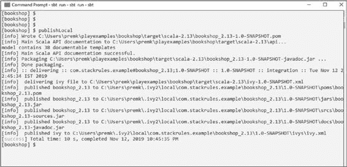

# 将 /public 文件夹中的静态资源映射到 /assets URL 路径 GET /assets/*file controllers.Assets.versioned (path="/public", file: Asset)

第 8 章 完整示例

**Application.java**

package controllers;

import actors.ActorModel;

import actors.PingActor;

import akka.actor.ActorRef;

import akka.actor.ActorSystem;

import akka.stream.Materializer;

import akka.stream.javadsl.Sink;

import akka.stream.javadsl.Source;

import akka.util.ByteString;

import config.EchoAction;

import dao.ReviewRepository;

import models.GiftVO;

import models.Message;

import models.Review;

import modules.Factorial;

import org.slf4j.Logger;

import org.slf4j.LoggerFactory;

import org.w3c.dom.Document;

import play.cache.AsyncCacheApi;

import play.cache.Cached;

import play.data.DynamicForm;

import play.data.FormFactory;

import play.libs.Akka;

import play.libs.XPath;

import play.libs.ws.WSClient;

import play.libs.ws.WSResponse;

import play.mvc.*;

import scala.compat.java8.FutureConverters;

第 8 章 完整示例

import javax.inject.Inject;

import javax.xml.bind.JAXBContext;

import javax.xml.bind.Marshaller;

import javax.xml.bind.Unmarshaller;

import javax.xml.transform.OutputKeys;

import javax.xml.transform.Transformer;

import javax.xml.transform.TransformerFactory;

import javax.xml.transform.dom.DOMSource;

import javax.xml.transform.stream.StreamResult;

import java.io.StringReader;

import java.io.StringWriter;

import java.util.ArrayList;

import java.util.List;

import java.util.concurrent.CompletableFuture;

import java.util.concurrent.CompletionStage;

import com.fasterxml.jackson.databind.JsonNode;

import static akka.pattern.Patterns. *ask*;

*/***

* *主控制器*

* */*

public class Application extends Controller {

final ActorRef pingActor;

private static final Logger *log* = LoggerFactory. *getLogger* (Application.class);

private AsyncCacheApi cache;

private ReviewRepository reviewRepo;

@Inject

public Application(ActorSystem system, AsyncCacheApi cache, ReviewRepository reviewRepo) {

第 8 章 完整示例

pingActor = system.actorOf(PingActor. *getProps*());

this.cache = cache;

this.reviewRepo = reviewRepo;

}

@Inject

Materializer materializer;

*/***

* *简单的 ping 方法，演示了 Futures 和* *异步处理的使用*

*

* *@param msg*

* *@return*

* */*

public CompletionStage<Result> ping(String msg) {

return FutureConverters. *toJava*(

*ask*(pingActor, new ActorModel.Ping(msg), 1000)

).thenApply(response -> *ok*((String) response));

}

*/***

* *演示分块处理大型* *http 响应* *的方法*

*

* *@return*

* */*

public CompletionStage<Result> processLargeResponse() {

CompletionStage<WSResponse> futureResponse =

ws.url("http://www.mocky.io/

v2/5e08df833000005b0081a159")

第 8 章 完整示例

.setMethod("GET").stream();

CompletionStage<Long> bytesReturned =

futureResponse.thenCompose(

res -> {

Source<ByteString, ?> responseBody

= res.getBodyAsSource();

*// 计算返回的字节数*

Sink<ByteString,

CompletionStage<Long>> bytesSum =

Sink. *fold*(0L, (total, bytes)

-> total + bytes.length());

return responseBody.runWith

(bytesSum, materializer);

});

return bytesReturned.thenApply(response -> *ok*((String) response.toString()));

}

*/***

* *处理主页*

*

* *@return*

* */*

public Result index() {

System. *out*.println(fact.fact(10));

return *ok*(views.html.bookshop. *render*());

}

*/***

* *根据 id 获取图书详情*

第 8 章 完整示例

*

* *@param id*

* *@return*

* */*

public Result getBook(String id) {

return *ok*(views.html.bookshop. *render*());

}

@Inject

FormFactory formFactory;

@Inject

Factorial fact;

*/***

* *接收表单提交并保存评论*

* *演示了如何使用动态表单从* *html 表单提交中检索数据*

*

* *@return*

* */*

public Result saveComment(Http.Request request) {

DynamicForm requestData = formFactory.form().

bindFromRequest(request);

String comment = requestData.get("comment");

Review review = new Review();

*// 我们硬编码了 id，但你可以将其作为练习，*

*// 将图书 id 和用户 id 作为请求参数。*


*// 同时修改仓库以保存这两条评论* review.setBookId("123456789");

review.setUserId("U1");

第 8 章 完整示例

review.setComment(comment);

review.save(reviewRepo);

return *ok*(views.html.savecomment. *render*());

}

*/***

* *按书名搜索图书。*

* *演示各种路由配置语义。*

*

* *@param title*

* *@return*

* */*

public Result searchByTitle(String title) {

*//查询数据库或从缓存中获取图书详情*

return *ok*(views.html.searchresults. *render*());

}

*/***

* *演示 ActionComposition*

* */*

@Inject

WSClient ws;

@With(EchoAction.class)

public CompletionStage<Result> echoService() {

return

ws.url("http://www.mocky.io/

v2/5e0edec33400003c0f2d7d27")

.get()

. thenApply(response -> *ok*("Feed

Response: " + response.getBody()));

}

第 8 章 完整示例

*/***

* *异步编程示例*

*

* *@param uid*

* *@param age*

* *@param relation*

* *@return*

* */*

public CompletionStage<Result> recomendGifts(final

String uid, final String age, final String relation) {

return CompletableFuture. *supplyAsync*(this::getGifts)

. thenApply((List<GiftVO> gift) -> *ok*("Got " +

gift));

}

private List<GiftVO> getGifts() {

List<GiftVO> gifts = new ArrayList<GiftVO>();

gifts.add(new GiftVO());

return gifts;

}

*/***

* *各种路由配置语义示例*

*

* *@param bookid*

* *@param pageNumber*

* *@return*

* */*

public Result fetchBookpage(String bookid, int pageNumber)

{

*//查询数据库或从缓存中获取图书详情*

第 8 章 完整示例

return *ok*(views.html.searchresults. *render*());

}

*/***

* *处理 Json 的示例*

*

* *@param request*

* *@return*

* */*

@BodyParser.Of(BodyParser.Json.class)

public Result acknowledgeGreeting(Http.Request request) {

JsonNode json = request.body().asJson();

String greeting = json.findPath("greeting").textValue(); if (greeting == null) {

return *badRequest*("Missing parameter [greeting]");

} else {

return *ok*("Your greeting " + greeting + " is accepted");

}

}

@BodyParser.Of(BodyParser.Xml.class)

public Result acknowledgeGreetingXML(Http.Request request) {

Document dom = request.body().asXml();

if (dom == null) {

return *badRequest*("Requires XML Input");

} else {

String greeting = XPath. *selectText*("//greeting", dom); if (greeting == null) {

return *badRequest*("Missing parameter [greeting]");

} else {

第 8 章 完整示例

return *ok*("Your greeting " + greeting + " is accepted");

}

}

}

*/***

* *处理 XML 的示例*

*

* *@param request*

* *@return*

* *@throws Exception*

* */*

@BodyParser.Of(BodyParser.Xml.class)

public Result acknowledgeGreetingXMLJaxbVersion(Http.Request request) throws Exception {

Document doc = request.body().asXml();

if (doc == null) {

return *badRequest*("Requires XML Input");

} else {

TransformerFactory tf = TransformerFactory. *newInstance*(); Transformer transformer = tf.newTransformer();

transformer.setOutputProperty(OutputKeys. *OMIT_XML_*

*DECLARATION*, "yes");

StringWriter writer = new StringWriter();

transformer.transform(new DOMSource(doc), new

StreamResult(writer));

String output = writer.getBuffer().toString();

System. *out*.println("XML " + output);

JAXBContext context = JAXBContext. *newInstance*

(Message.class);

第 8 章 完整示例

Unmarshaller unMarshaller = context.

createUnmarshaller();

*//JAXB 自动转换 - XML 到模型*

Message msg = (Message) unMarshaller.unmarshal(new

StringReader(output));

if (msg == null) {

return *badRequest*("Requires XML Input");

} else {

String greeting = msg.getGreeting();

if (greeting == null) {

return *badRequest*("Missing parameter

[greeting]");

} else {

return *ok*("Your greeting " + greeting + "

is accepted");

}

}

}

}

public Result authors(Integer count) {

return *ok*("Top selling authors");

}

*/***

* *缓存 HTTP 响应的示例*

*

* *@return*

* */*

@Cached(key = "contactus")

public Result contact() {

*log*.info("contact us method: processing"); 145

第 8 章 完整示例

return *ok*("Apress Media, LLC\n" +

"\n" +

"One New York Plaza, Suite 4600\n" +

"\n" +

"New York, NY 10004-1562");

}


public CompletionStage<Result> topThreeBooks() {

return cache.getOrElseUpdate("topthree",

this::getTopBooks)

. thenApply((List<String> books) -> *ok*(books.

toString()));

}

private CompletionStage<List<String>> getTopBooks() {

List<String> topThreeBooks = new ArrayList<String>(); topThreeBooks.add("Book 1");

topThreeBooks.add("Book 2");

topThreeBooks.add("Book 3");

return CompletableFuture. *completedFuture*(topThreeBooks);

}

public Result showComment(String userId) {

return *ok*("Recent Comments by user");

}

}

**models/Book.java**

package models;

import io.ebean.Model;

import javax.persistence.*;

第 8 章 完整示例

import io.ebean.*;

@Entity

@Table(name="book")

public class Book extends Model {

@Id

private String id;

private String author;

private String title;

private String picture;

public String getTitle() {

return title;

}

public void setTitle(String title) {

this.title = title;

}

public String getPicture() {

return picture;

}

public void setPicture(String picture) {

this.picture = picture;

}

public String getId() {

return id;

}

public void setId(String id) {

this.id = id;

}

第 8 章 完整示例

public String getAuthor() {

return author;

}

public void setAuthor(String author) {

this.author = author;

}

}

class Test {

void test() {

Book book = new Book();

book.save();

Book b = Ebean. *find*(Book.class).where().idEq("").findOne(); Ebean. *find*(Book.class).where().like("title","java%").

orderBy("tile desc").findList();

}

}

**models/Comment.java**

package models;

import javax.persistence.Entity;

import javax.persistence.Id;

import javax.persistence.Table;

@Entity

@Table(name="comment")

public class Comment {

@Id

private Long id;

private String comment;

public String getComment() {

第 8 章 完整示例

return comment;

}

public void setComment(String comment) {

this.comment = comment;

}

}

**models/Customer.java**

package models;

import controllers.Order;

import java.util.List;

public class Customer {

private long id;

private String name;

private boolean loyaltyMember;

private boolean isActive;

private List<Order> orders;

public List<Order> getOrders() {

return null;

}

public boolean deactivate() {

*//停用客户的逻辑和验证*

return false;

}

}

**models/GiftVO.java**

package models;

第 8 章 完整示例

public class GiftVO {

private String giftName;

private String giftImageUrl;

private float price;

private String category;

public String getGiftName() {

return giftName;

}

public void setGiftName(String giftName) {

this.giftName = giftName;

}

public String getGiftImageUrl() {

return giftImageUrl;

}

public void setGiftImageUrl(String giftImageUrl) {

this.giftImageUrl = giftImageUrl;

}

public float getPrice() {

return price;

}

public void setPrice(float price) {

this.price = price;

}

public String getCategory() {

return category;

}

第 8 章 完整示例

public void setCategory(String category) {

this.category = category;

}

}

**models/Message.java**

package models;

import javax.xml.bind.annotation.XmlAccessType;

import javax.xml.bind.annotation.XmlAccessorType;

import javax.xml.bind.annotation.XmlElement;

import javax.xml.bind.annotation.XmlRootElement;

@XmlRootElement(name = "message")

@XmlAccessorType(XmlAccessType. *PROPERTY*)

public class Message {

private String greeting;

public String getGreeting() {

return greeting;

}

@XmlElement

public void setGreeting(String greeting) {

this.greeting = greeting;

}

}

**models/Review.java**

package models;

import dao.ReviewRepository;

import javax.persistence.*;

第 8 章 完整示例

public class Review {

@Id

@GeneratedValue(strategy = GenerationType. *AUTO*)

public Long id;

public String comment;

public Long getId() {

return id;

}

public void setId(Long id) {

this.id = id;

}

public String getComment() {

return comment;

}

public void setComment(String comment) {

this.comment = comment;

}

public String getUserId() {

return userId;

}

public void setUserId(String userId) {

this.userId = userId;

}

public String getBookId() {

return bookId;

}

第 8 章 完整示例

public void setBookId(String bookId) {

this.bookId = bookId;

}

public String userId;

public String bookId;

public void save(ReviewRepository reviewRepo) {


System.*out*.println("review repo "+reviewRepo); reviewRepo.saveReview(this);

}

}

**dao/DatabaseExecutionContext.java**

package dao;

import akka.actor.ActorSystem;

import play.db.Database;

import play.libs.concurrent.CustomExecutionContext;

import javax.inject.Inject;

import javax.inject.Singleton;

import java.util.concurrent.CompletableFuture;

import java.util.concurrent.CompletionStage;

public class DatabaseExecutionContext extends

CustomExecutionContext {

@javax.inject.Inject

public DatabaseExecutionContext(ActorSystem actorSystem) {

*// 使用 application.conf 中定义的自定义线程池* super(actorSystem, "database.dispatcher");

}

第 8 章 完整示例

@Singleton

public static class JdbcExample {

private Database db;

private DatabaseExecutionContext executionContext;

@Inject

public JdbcExample(Database db,

DatabaseExecutionContext context) {

this.db = db;

this.executionContext = executionContext;

}

public CompletionStage<Integer> updateSomething() {

return CompletableFuture.*supplyAsync*(

() -> {

return db.withConnection(

connection -> {

*// 使用连接执行操作*

return 1;

});

},

executionContext);

}

}

}

**dao/JPARepository.java**

package dao;

import models.Review;

import play.db.jpa.JPAApi;

第 8 章 完整示例

import javax.inject.Inject;

import javax.inject.Singleton;

import java.util.concurrent.CompletableFuture;

import java.util.concurrent.CompletionStage;

import static java.util.concurrent.CompletableFuture.*supplyAsync*;

@Singleton

public class JPAReviewRepository implements ReviewRepository{

private JPAApi jpaApi;

private DatabaseExecutionContext executionContext;

@Inject

public JPAReviewRepository(JPAApi api,

DatabaseExecutionContext executionContext) {

this.jpaApi = api;

this.executionContext = executionContext;

}

@Override

public CompletionStage<String> saveReview(Review review) {

return CompletableFuture.*supplyAsync*(

() -> {

*// lambda 是 Function<EntityManager, Long> 的一个实例*

return jpaApi.withTransaction(

entityManager -> {

entityManager.persist(review);

return "saved";

});

},

executionContext);

}

}

第 8 章 完整示例

**models/ReviewRepository.java**

package dao;

import com.google.inject.ImplementedBy;

import models.Review;

import java.util.concurrent.CompletionStage;

@ImplementedBy(JPAReviewRepository.class)

public interface ReviewRepository {

CompletionStage<String> saveReview(Review review);

}

视图与前面章节列出的相同；为避免重复，本章不再列出。

**第 9 章**

**使用 Play 模块**

一个 Play 应用程序可以由多个应用模块组装而成。

这有助于在多个应用程序中重用应用组件。模块还有助于将大型应用程序拆分为多个较小的应用程序。

模块只是另一个 Play 应用程序。模块可以引入特定于功能的能力，例如添加不同的持久化机制、集成其他视图技术或集成新的缓存框架。

自 Play 2.5.x 以来，模块框架进行了改造。在 Play 中，模块和库之间没有太大区别。唯一真正的区别在于模块直接使用 Play API。Play 模块使用依赖注入框架来工作。如果你想编写一个自定义的 Play 模块，可以使用任何依赖注入框架来实现。

请注意，Play 使用 guice 作为其默认的依赖注入框架。

但模块不应与任何特定的依赖注入框架绑定，而应以与依赖框架无关的方式工作。为此，Play 提供了一个轻量级的 Bindings API，用于将模块与底层依赖注入框架解耦。

依赖关系在组件中使用 @Inject 注解声明。例如，如果一个控制器类依赖于 WSClient 模块，它应该使用 @Inject WSClient 语法进行声明。Play 会使用底层的依赖注入框架自动完成依赖类的装配。

© Prem Kumar Karunakaran 2020


P. K. Karunakaran 著，《Play 框架入门》，

`doi.org/10.1007/978-1-4842-5645-9_9`

第 9 章 使用 Play 模块

**创建模块**

我们直接开始创建一个简单模块，以理解其流程。如前所述，模块与任何其他 Play 应用程序并无二致。

需要记住的一个重要因素是：模块没有自己的配置；它使用主应用程序的配置。这意味着模块特定的配置信息应设置在应用程序的 `conf/application.conf` 文件中。

你要开发的模块很简单。它计算小于 25 的数的阶乘。请按以下步骤操作：

1) 在 `app` 目录下创建一个包，并将其命名为 `modules`。

2) 将模块的契约定义为一个接口：

```java
package modules;

public interface Factorial {

    int fact(int num);

}
```

3) 为 `Factorial` 接口提供实现：

```java
package modules;

import play.inject.ApplicationLifecycle;

import javax.inject.Inject;

public class FactorialImpl implements Factorial{

    @Inject
    public FactorialImpl(ApplicationLifecycle lifecycle) {
        //实现插件生命周期方法
    }

    public int fact(int number) {
        return calculateFactorial(number);
    }

    private int calculateFactorial(int num) {
        if(num > 25) {
            throw new RuntimeException("超出范围");
        }
        if(num == 1)
            return num;
        return num * calculateFactorial(num-1);
    }

}
```

4) 创建一个模块，并将其命名为 `FirstModule`：

```java
package modules;

import play.api.Configuration;
import play.api.Environment;
import play.api.inject.Binding;
import play.api.inject.Module;
import javax.inject.Inject;
import play.inject.ApplicationLifecycle;
import scala.collection.Seq;

public class FirstModule extends Module {

    public Seq<Binding<?>> bindings(Environment environment, Configuration configuration) {
        return seq(
            bind(Factorial.class).to(FactorialImpl.class)
        );
    }

}
```

第 9 章 使用 Play 模块

这里你声明了一个模块，并将你的 `Factorial` 实现添加到了该模块中。现在，为了让 Play 将其识别为一个模块，需要在 `application.conf` 文件中进行一些修改：

```
play.modules.enabled += "modules.FirstModule"
```

保存文件。就这样！你已经创建了一个自定义的 Play 模块。此模块中定义的 `Factorial` 实现可以注入到任何类中并使用。例如，如果需要在控制器类中使用它，只需声明为：

```java
@Inject Factorial fact;
```

Play 会处理其余部分，并在运行时使其可用。如果你想将此模块提供给其他 Play 应用程序使用，则需要将其发布到仓库。在这种情况下，只需在 Play 应用程序中包含模块类及相关依赖类即可。所有未使用的组件，如视图、公共资源等，都可以移除。

打开命令提示符，进入你创建阶乘 Play 项目的目录。例如，如果项目位于 `C:\Users\用户名\playexamples\bookshop\`，则在命令提示符下输入 `sbt`。

这将加载 Play 控制台。你需要发布该模块，以便其他应用程序可以访问它。为简单起见，你将此模块发布到计算机上的本地仓库：

```
bookshop] $ publishLocal
```

Play 将编译文件并发布到本地 Play 仓库。

在 Play 控制台中，请记下 Play 发布模块的位置。在我的机器上，它发布在 `C:\Users\premk\.ivy2\local\com.stackrules.example\bookshop_2.13\1.0-SNAPSHOT\docs\bookshop_2.13-javadoc.jar` 下。见图 9-1。



第 9 章 使用 Play 模块

***图 9-1.** 已发布的模块*

该模块现在已准备好供其他应用程序使用。

**第三方模块**

通常，你会因各种原因需要使用其他软件工具，而在 Play 中，这些工具通过模块集成到应用程序中。有许多第三方模块可用于满足大多数企业需求。Play 模块使得通过即插即用架构扩展 Play 功能成为可能。以下是一些流行的模块：


• Redis：集成 Redis 以提供缓存实现

• Deadbolt：基于角色的授权

• PDF：增加基于 HTML 模板的 PDF 输出支持

还有更多此类模块可用，你可以访问[www.playframework.org](http://www.playframework.org)获取更多相关信息。

**第 10 章**

**应用程序设置**

**与错误处理**

在 Play 2.6 之前，通常使用全局对象来定义应用程序级别的配置和处理逻辑，例如过滤、错误处理等。这种方法在 Play 2.5.x 中已被弃用，并从 Play 2.6.x 起彻底移除。自 Play 2.6.x 起，推荐使用依赖注入的方式。因此，我不会详细讨论 2.6.x 之前采用的方法，而是将你的注意力引向依赖注入方式。在本节末尾，我会给出一个示例，让你了解之前是如何实现的，这对于将旧版 Play 框架项目迁移到新版本会有所帮助。

Play 应用程序的主类是`play.Application`。该类由 Play 框架在应用程序启动时创建。你无需做任何特殊操作来触发这一过程，框架会自动处理。

你可以通过依赖注入将处理程序绑定到特定类的实例，从而挂钩各种应用程序级别的行为。这是在 Play 中配置应用程序级别绑定的推荐方式。

让我们通过示例来更深入地理解这一点。

© Prem Kumar Karunakaran 2020

P. K. Karunakaran，《Introducing Play Framework》，

`doi.org/10.1007/978-1-4842-5645-9_10`

第 10 章 应用程序设置与错误处理 **过滤器**

过滤器旨在将应用程序的横切关注点应用于所有类，例如日志记录、检查安全标头、压缩响应、分析等。这些都是过滤器发挥作用的地方。Play 还有一种称为动作组合（action composition）的机制，它适用于关注点与特定路由相关的情况。

例如，你可能决定保护某些路由，同时允许所有其他路由公开访问。在这种情况下，对于特定路由，你可能需要检查认证/授权语义。对于此类情况，请使用动作组合。你将在本章后续部分进一步了解动作组合。我们先聚焦于过滤器。

日志过滤器：

```java
package config;

import akka.event.LoggingFilter;

import akka.stream.Materializer;

import java.util.concurrent.CompletionStage;

import java.util.function.Function;

import org.slf4j.Logger;

import org.slf4j.LoggerFactory;

import play.mvc.Filter;

import play.mvc.Http;

import play.mvc.Result;

import javax.inject.Inject;

/**
 * A simple filter implementation that logs how long it took to process a request
 */
public class ApplicationFilter extends Filter {

    @Inject
    public ApplicationFilter(Materializer mat) {
        super(mat);
    }

    private static final Logger log = LoggerFactory.getLogger(LoggingFilter.class);

    @Override
    public CompletionStage<Result> apply(Function<Http.RequestHeader,
            CompletionStage<Result>> next,
                                        Http.RequestHeader requestHeader) {
        long startTime = System.currentTimeMillis();
        return next
                .apply(requestHeader)
                .thenApply(
                        result -> {
                            long endTime = System.currentTimeMillis();
                            long requestTime = endTime - startTime;
                            log.info(
                                    "{} {} took {}ms to complete and produced the status {}",
                                    requestHeader.method(),
                                    requestHeader.uri(),
                                    requestTime,
                                    result.status());
                            return result;
                        });
    }
}
```

`ApplicationFilter`类继承自`play.mvc.Filter`并重写了`apply`方法。`apply`方法接受两个参数：1) 一个函数，该函数以`Http.RequestHeader`为参数，并返回`CompletionStage<Result>`作为输出；2) `Http.RequestHeader`：传入请求的请求头。


好的，作为一名高级文档工程师和翻译员，我将严格遵循您提供的注意事项和示例格式，将给定的英文文本翻译成中文。


让我们先理解第一个参数，并看看它在代码中是如何使用的。你在代码中使用的下一个参数代表了过滤器链中的下一个动作。调用它将会允许请求继续向前流动，并最终到达目标类，在大多数情况下是控制器。在你的日志记录场景中，在传递控制权之前，你记录了请求时间，然后允许请求继续向前流动。一旦请求完成，你使用 `thenApply` 函数来记录响应时间，并将结果返回给调用者。请注意，`CompletionStage<Result>` 是 Java 8 提供的用于处理异步响应的通用 Promise API。由于 Play 使用异步编程，Play API 的响应都使用它。这就是为什么你需要使用 `thenApply` 方法进行处理的原因。关于 Promise 类和异步编程的更多细节，将在异步编程章节中提供。

**第 10 章 应用设置与错误处理** 现在你已经创建了一个过滤器，让我们看看如何告诉 Play 使用它。创建一个名为 `FilterConfig` 的类，如下所示，并将其保存在 `config` 包内：

**FilterConfig.java**

**package** config;

**import** play.http.DefaultHttpFilters;

**import** javax.inject.Inject;

**public class** FilterConfig **extends** DefaultHttpFilters {

@Inject

**public** FilterConfig(ApplicationFilter logging) {

**super**(logging);

}

}

你已经在 `config` 包中定义了这个类。因此，需要告诉 Play 应该使用哪个类来配置过滤器。这可以通过在 `application.conf` 文件中添加以下条目来完成：**play.http.filters**=config.FilterConfig

如果你将 `FilterConfig` 文件保存在根文件夹中，那么 Play 会自动使用它，并且无需像上面那样在 `application.conf` 中添加条目。但是，为了便于组织和模块化，最好将类放入相应的包中，这就是将其保存在 `config` 包而不是根文件夹的原因。请注意，自定义过滤器是通过构造函数级别的依赖注入作为参数传递给 `FilterConfig` 类的。如果你编写了更多的过滤器，你可以像传递构造函数参数一样将它们传递给 `FilterConfig` 类。这是可行的，因为 `FilterConfig` 类继承自 `DefaultHttpFilters`，并且它有一个构造函数，该构造函数通过可变参数接收 N 个 `Filter` 实例。

就是这样。你已经创建了一个响应日志记录过滤器。让我们测试一下。打开 `http://localhost:9000/bookshop` 并观察控制台输出和日志（`projectroot\logs\application.log`）。在这两个地方，你都会看到如下条目：

**[info] a.e.LoggingFilter - GET /bookshop took 7ms to complete** **and produced the status 200**

如果你没有看到任何输出，请检查日志记录器设置，确保它设置为 INFO 日志级别。为此，打开 `conf/logback.xml` 文件，并确保你有以下设置：

< **logger name="play" level="INFO"** />

< **logger name="application" level="DEBUG"** />

< **root level="INFO"** >

< **appender-ref ref="ASYNCFILE"** />

< **appender-ref ref="ASYNCSTDOUT"** />

</**root**>

**动作组合**

当你想要用额外的逻辑来装饰一个特定的类或某一组类时，动作组合非常有用。让我们通过一个例子来学习：**EchoAction.java**

**package** config;

**import** org.slf4j.Logger;

**import** org.slf4j.LoggerFactory;

**import** play.mvc.Http;

**import** play.mvc.Result;

**import** java.util.concurrent.CompletionStage;

*/***

* *一个动作组合的示例*

* */*

**public class** EchoAction **extends** play.mvc.Action.Simple {

**private static final** Logger ***log*** = LoggerFactory. *getLogger*(EchoAction. **class**);

**public** CompletionStage<Result> call(Http.Request req) {

***log***.info(**"Request Method {} "** , req.method()); **return delegate**.call(req);

}

}

这是一个非常简单的动作，它仅仅将 HTTP 请求方法记录到日志中。这不是一个过滤器，所以默认情况下它不会被应用到方法上。需要使用此动作的方法必须通过注解显式地请求它。让我们在其中一个控制器方法中使用 `EchoAction`。

打开 `Application.java` 文件，找到 `echoService` 方法，并添加注解 `@With(EchoAction.class)`：

@Inject WSClient **ws**;

@With(EchoAction. **class**)

**public** CompletionStage<Result> echoService() {

**return**

**ws**.url(**"http://www.mocky.io/**

**v2/5e0edec33400003c0f2d7d27"** )

.get()

.thenApply(response -> *ok*(**"Feed Response: "** +

response.getBody()));

}

打开 `http://localhost:9000/bookshop/book/echo` 并观察控制台和日志。你将看到以下日志条目：

[info] c.EchoAction - Request Method GET

**错误处理器**

如你所知，Play 是一个 HTTP 应用框架，这样的应用可能会遇到两种类型的错误：

1.  客户端错误
2.  服务器错误

**客户端错误**

客户端错误是由于调用者或连接的客户端犯错导致的，例如客户端没有发送 `Content-Type` 头、没有使用正确的 HTTP 方法、使用了无效的 URL 等。在所有这些情况下，Play 会自动检测到错误并重定向到错误页面。

**服务器错误**

服务器错误是由于服务器端出现问题导致的，例如资源不足、崩溃、应用程序类生成的错误（如空指针）、代码抛出其他形式的异常等。Play 通过捕获这些服务器错误并生成错误页面来智能地处理它们。

在某些情况下，应用程序可能决定不按原样使用默认的错误处理机制，而是希望扩展它并提供自定义的错误处理逻辑。让我们看看如何做到这一点。

**CustomErrorHandler.java**

**package** config;

**import** play.http.HttpErrorHandler;

**import** play.mvc.*;

**import** play.mvc.Http.*;

**import** java.util.concurrent.CompletableFuture;

**import** java.util.concurrent.CompletionStage;

**import** javax.inject.Singleton;

*/***

* *一个简单的错误处理器*

* */*

@Singleton

**public class** CustomErrorHandler **implements** HttpErrorHandler {

**public** CompletionStage<Result> onClientError(

RequestHeader request, **int** statusCode, String

message) {

**return** CompletableFuture. *completedFuture*(

Results. *status*(statusCode, **"Invalid Request "** +

message));

}

**public** CompletionStage<Result> onServerError(RequestHeader request, Throwable exception) {

**return** CompletableFuture. *completedFuture*(

Results. *internalServerError*(**"Cannot process the** **request due to "** + exception.getMessage()));

}

}

现在你已经配置了一个自定义错误处理器，用于处理客户端和服务器错误的情况。让我们测试一下。

打开 `http://localhost:9000/bookshop/book/echos`。这个 URL 是一个无效的 URL，属于客户端错误。这个请求将被你在 `CustomErrorHandler` 中定义的 `onClientError` 方法拦截，你将在浏览器中看到如下响应：

Invalid Request

**全局设置是如何完成的**

**在 Play 2.6.x 之前**

全局对象允许处理应用程序的全局设置。

全局对象是编写拦截逻辑的地方。诸如过滤某些请求参数、记录请求等任务可以在这里轻松完成。你也可以为未找到错误、错误页面等配置全局设置。


我不会深入探讨 GlobalSettings 和 Global，因为 Play 从 2.5.0 版本起已弃用它们，现在推荐使用依赖注入。下面的示例仅用于展示在早期 Play 版本中是如何实现的。请注意，以下代码仅适用于 Play 2.5.x 及更低版本；它不适用于 Play 2.8.x，而本书正是基于该版本编写的。这段代码仅供参考，以防您想从早期 Play 版本迁移到最新版本，并希望了解之前的实现方式。

要创建 Global 对象，只需编写一个继承自 `play.GlobalSettings` 的类。Global 对象通常保存在应用程序的根包中，但您也可以将其保存在任何包中，然后通过 `application.conf` 文件中的 `application.global` 属性进行配置：

**import** play.Application;

**import** play.GlobalSettings;

**import** play.libs.Akka;

**import** play.mvc.Http.RequestHeader;

第 10 章 应用程序设置与错误处理 **import** play.mvc.Result;

**import** play.mvc.Results;

**import** scala.concurrent.duration.Duration;

**import** akka.actor.ActorRef;

**import** akka.actor.Props;

**import** controllers.Preloader;

**public class** Global **extends** GlobalSettings {

**public** Result onError(RequestHeader request, Throwable t) {

**return** Results. *notFound*(views.html.errorpagetemplate. *render*());

}

**public** Result onHandlerNotFound(RequestHeader request) {

**return** Results. *notFound*(views.html.errorpagetemplate. *render*());

}

**public** Result onBadRequest(RequestHeader request, String error) {

**return** Results. *notFound*(views.html.errorpagetemplate. *render*());

}

**public void** onStart(Application app) {

// 初始化所有内容

ActorRef preloader = Akka. *system*().actorOf(**new**

Props(Preloader. **class**));

*Akka.* system *().scheduler().schedule(*

Duration. *create*(0, TimeUnit. *MILLISECONDS*), // 初始延迟 0 毫秒

Duration. *create*(5, TimeUnit. *MINUTES*), // 频率 30 分钟

preloader,

"preload",

Akka. *system*().dispatcher()

);

}

第 10 章 应用程序设置与错误处理 **public void** onStop(Application app) {

Logger.info("应用程序关闭");

}

}

要迁移到最新的 Play 版本，您应该编写自定义过滤器，并将逻辑包含在这些过滤器或错误处理器中。您在本章开头已经学习了这两方面的内容。

**第 11 章**

**使用缓存**

缓存是确保应用程序可扩展性和响应性的最重要方面之一。一个好的缓存可以减轻数据库的负载，并能非常快速地响应用户。一个不能提供良好缓存抽象层的框架已不再适合企业级开发。Play 凭借其内置的缓存支持，是构建高度可扩展、响应迅速的企业级应用程序的理想框架。

Play 提供了一个全局缓存对象，它与底层的缓存实现协同工作。这种抽象使您能够更改缓存提供程序，而无需修改任何应用程序代码。默认情况下，Play 附带了一个使用 Caffeine 的缓存 API 实现，同时也提供了对 EhCache 2.x 的支持。对于进程内处理，Play 推荐使用 Caffeine。

**配置 Caffeine**

Caffeine 是一个高性能、近乎最优的缓存库，基于 Java 8。

以下是 Caffeine 的重要特性概览：

• 自动将条目加载到缓存中，可选择异步加载

• 当超过最大容量时，基于频率和最近使用情况进行大小驱逐

© Prem Kumar Karunakaran 2020

P. K. Karunakaran, *Introducing Play Framework*,

`doi.org/10.1007/978-1-4842-5645-9_11`

第 11 章 使用缓存

• 基于时间的条目过期，自上次访问或上次写入起计算

• 当对某个条目的第一个过期请求发生时，异步刷新

• 键自动包装为弱引用

• 值自动包装为弱引用或软引用


• 被驱逐（或以其他方式移除）的条目通知

• 写入操作传播到外部资源

• 缓存访问统计数据的累积

你可以在以下网址了解更多关于 Caffeine 的信息：[`github.com/ben-manes/caffeine/`](https://github.com/ben-manes/caffeine/)

**将 Caffeine 添加到项目中**

打开 `build.sbt` 文件，并添加 Caffeine 的依赖项：*libraryDependencies* ++= *Seq*( *guice*, *javaJdbc*, ***cacheApi***, *javaWs*, *javaJpa*, ***caffeine***,org.hibernate" % "hibernate-entitymanager" % "5.3.7.Final",com.h2database" % "h2" %

"1.4.200" )

这就是将 Caffeine 用作 Play 缓存实现所需的全部操作。

第 11 章 使用缓存

**配置 EhCache**

EhCache 已经存在很长时间，是 Java 项目中最广泛使用的缓存实现之一。它需要 Java 8 或更高版本。你可以在 [www.ehcache.org/](http://www.ehcache.org/) 了解 EhCache 的内部工作原理。

配置 EhCache 就像在 `build.sbt` 文件中添加一个条目一样简单，就像你为 Caffeine 所做的那样：

*libraryDependencies* ++= *Seq*( *guice*, *javaJdbc*, ***cacheApi***, *javaWs*, *javaJpa*, ***ehcache***,org.hibernate" % "hibernate-entitymanager" % "5.3.7.Final",com.h2database" % "h2" %

"1.4.200" )

**使用缓存 API**

缓存 API 非常简单易用：

• 存储数据：

• `Cache.set("key", object)`

• 检索数据：

• `Cache.get("key")`

• 移除数据：

• `Cache.remove("key")`

你还可以通过使用带有三个参数的 `set` 方法来控制数据在缓存中保留的时间（缓存过期时间）：`Cache.set("key", object, int timeinminutes)`

第 11 章 使用缓存

要在控制器中使用缓存 API，需要对其进行注入。按如下方式修改 `Application.java` 文件以获取对缓存 API 的引用：**private** AsyncCacheApi **cache**;

@Inject

**public** Application(ActorSystem system, AsyncCacheApi cache) {

**pingActor** = system.actorOf(PingActor. *getProps*()); **this**. **cache** = cache;

}

现在，你可以在控制器的任何方法中使用缓存 API 来缓存数据。例如：

`CompletionStage<Done> result = cache.set("framework", "Playframework");`

// 缓存 10 分钟

`CompletionStage<Done> result = cache.set("framework", "Playframework", 60 ∗ 10);`

无论何时使用缓存，请记住缓存随时可能过期或丢失。它不是持久化数据，因此你应该始终检查数据是否在缓存中，如果不在，则将其填充到缓存中，然后再检索。这样，即使缓存无法工作或比预期更早过期，你的程序也是安全的。在 Play 中，如果 JVM 内存不足，底层缓存实现可以自动从缓存中移除对象。因此，请明智地编写代码并有效地使用缓存。

Play 使用一个可调用方法在数据不存在于缓存时将其加载到缓存中。

这是通过向缓存 API 提供一个可调用方法来实现的，当缓存中缺少数据时，该方法会被调用来生成缓存数据。

让我们修改 `Application.java` 文件来添加这样一个方法：**public** CompletionStage<Result> topThreeBooks() {

**return** cache.getOrElseUpdate("topthree", this::getTopBooks)

第 11 章 使用缓存

.thenApply(( List<String> books) -> *ok*(books.toString()));

}

**private** CompletionStage<List<String>> getTopBooks() {

List<String> topThreeBooks = new ArrayList<String>(); topThreeBooks.add("Book 1");

topThreeBooks.add("Book 2");

topThreeBooks.add("Book 3");

**return** CompletableFuture. *completedFuture*(topThreeBooks);

}

私有方法 `getTopBooks` 就是可调用方法，如果数据不在缓存中，缓存 API 会调用它。此方法计算前三本书并返回响应。公共方法 `topThreeBooks` 使用缓存 API 的 `getOrElseUpdate` 方法从缓存中获取数据并将其转换为 HTTP 响应。

**编辑 routes.conf**

`GET /bookshop/book/top controllers.Application.topThreeBooks()` 使用 `http://localhost:9000/bookshop/book/top` 测试该方法，你将看到响应为：

`[Book 1, Book 2, Book 3]`

Play 还提供了缓存整个 HTTP 响应的能力。这对于缓存不随请求变化的内容非常有用。让我们创建一个新路由并缓存其响应。你将使用静态的联系我们数据（你向所有用户显示相同的内容）。打开 `Application.java` 文件并添加 `contactus` 方法：

@Cached(key=**"contactus"** )

**public** Result contact() {

l ***og***.info(**"contact us method: processing"** ); **return** *ok*(**"Apress Media, LLC\n"** +

**"\n"** +

**"One New York Plaza, Suite 4600\n"** +

**"\n"** +

**"New York, NY 10004-1562"** );

}

在 `routes.conf` 文件中添加路由配置：

`GET /bookshop/contact controllers.Application.contact()` 要测试，请打开 URL `http://localhost:9000/bookshop/contact` 以观察响应。此响应已被缓存，并来自内存缓存。要测试这一点，请检查 `application.log` 文件或控制台中的日志，你将看到条目：

`[info] c.Application - contact us method: processing`

再次访问该 URL，你将看不到日志条目，因为从第二次开始，响应是从缓存提供的，绕过了已经计算并缓存的处理逻辑。

这个例子非常简单，仅用于解释要点。如果数据（如上例中的联系信息）是从数据库、Web 服务或其他需要一定处理量的方式检索的，那么响应缓存非常有用。在这种情况下，第一次会进行处理，但从下一次开始，你可以避免所有处理，因为响应将从缓存中提供。这能为用户生成更快的响应，并且不会浪费服务器的处理时间。

第 11 章 使用缓存

在许多场景下，缓存整个 HTTP 响应并不实际。例如，页面中可能有一些元素会根据用户的登录状态而变化。这种情况也可以通过仅缓存部分数据来轻松处理。你应该为此设计你的内容。考虑一个包含 75% 静态内容和 25% 动态内容的主页。在这种情况下，将静态和动态部分拆分为独立的对象，并缓存静态对象。但在这种场景下，你只能缓存对象，而不能缓存生成的静态 HTML。也就是说，你不能从缓存中获取部分 HTML 响应并将其与动态 HTML 响应混合。在这种情况下，你必须在对象或数据级别进行缓存，而不是在 HTTP 响应级别。对于不随每个请求或用户变化的纯静态内容，请使用 HTTP 响应缓存，如上文 `contact` 方法所述。你还学习了对象缓存，如上文 **topThreeBooks** 示例所述。

默认的 Caffeine 实现在大多数情况下已经足够好，并且具有高度可扩展性。但如果你需要使用像 memcached 这样的分布式缓存框架，Play 提供了通过其缓存 API 接入 memcached 的钩子。对于 memcached，Play 默认提供了一个实现，但依赖于第三方插件。要将 memcached 与 Play 一起使用，请使用 [`github.com/mumoshu/play2-memcached`](https://github.com/mumoshu/play2-memcached) 上提供的插件。我不会在本书中详细介绍 memcached 的实现，因为第三方插件的文档尚未针对 Play 2.7 及以上版本进行更新。

**第 12 章**

**生产部署**

部署 Play 的一种更简单的方法是使用命令 `play run`。为此，你需要将整个 Play 项目复制到生产机器上，然后在项目内执行 `play run`。这不是生产部署的好方法，因为你不想移动源文件，而只需要将可执行文件（以 jar 文件的形式）推送到生产环境。


要实现这一点，你可以在构建环境中使用 `play dist` 命令来生成 Play 可执行 JAR 文件。一旦 `dist` 命令成功执行，它会创建一个 `dist` 目录，JAR 文件将放置在该目录中。

只需将 JAR 文件复制并解压到生产环境中，你就会看到一个 `start` 文件。通过为其分配所需的执行权限（Unix/Linux 环境）使该文件可执行，然后运行它。

你可以编辑 `start` 文件，并向其传递额外的参数，例如 `-Xms`、`-Xmx` 等，以配置 JVM 内存参数。如果需要更改 Play 应用程序的默认监听端口，你可以向启动脚本传递 `-Dhttp.port=port`。

你可以直接运行 Play，无需任何其他 Web 服务器。

但这并非理想的生产部署方案。你可能需要在 Play 服务器前放置一个 Web 服务器（如 Apache HTTP 服务器或 Nginx），以处理各种生产配置和访问需求。你可能希望配置 Apache 来处理 SSL 请求，并将 SSL 负载从 Play 上卸载，或者你只是不想将 Play 服务器暴露在互联网上。原因有很多。接下来，我们看看如何将 Apache httpd 用作 Play 应用程序的代理。

© Prem Kumar Karunakaran 2020

P. K. Karunakaran, *Introducing Play Framework*,

`doi.org/10.1007/978-1-4842-5645-9_12`

第 12 章 生产部署

**为 Play 配置 Apache httpd**

假设你已经安装了 Apache 并且它正在运行。请确保已启用以下模块：`mod_ssl`、`mod_headers`、`mod_proxy`、`mod_proxy_http` 和 `mod_proxy_balancer`。

以下是一个简单的 Apache 配置，用于将外部端口 80 重定向到 Play 应用程序的内部 IP 和端口 9000：

<VirtualHost ∗:80>

ProxyPreserveHost on

ProxyPass / http://192.168.1.4:9000/

ProxyPassReverse / http://192.168.1.4:9000/

</VirtualHost>

上述配置会将发往端口 80 的请求路由到运行在端口 9000 上的 Play 应用程序。

**使用 mod_proxy_balancer 进行负载均衡**

生产部署通常会有多个服务器实例，以满足负载均衡和高可用性需求。你可以启动多个 Play 实例，并使用 Apache 来执行负载均衡。你需要 `mod_proxy_balancer` 模块来实现这一点：

<Proxy balancer://prodcluster>

BalancerMember http://192.168.1.4:9000

BalancerMember http://192.168.1.5:9000

</Proxy>

<VirtualHost ∗:80>

ProxyPreserveHost on

ProxyPass / balancer://prodcluster/

ProxyPassReverse / balancer://prodcluster/

</VirtualHost>

第 12 章 生产部署

**使用 Nginx 配置 Play**

Nginx（发音为 engine-x）是一款免费、开源、高性能的 HTTP 服务器和反向代理服务器，同时也是 IMAP/POP3 代理服务器。

与传统服务器不同，Nginx 不依赖线程来处理请求。相反，它采用更具可扩展性的事件驱动（异步）架构。这种架构在负载下使用少量但更重要的是可预测的内存。

Nginx 应该已经安装并正在运行。在任何基于 Debian 的发行版上执行以下命令，即可在服务器上安装 Nginx：

apt-get install nginx

你需要编辑的文件是 `nginx.conf`。编辑 `/etc/nginx/nginx.conf` 文件，并配置其与 Play 一起使用。以下是一个供你参考的示例配置：

http {

proxy_buffering off;

proxy_set_header X-Real-IP $remote_addr;

proxy_set_header X-Scheme $scheme;

proxy_set_header X-Forwarded-For $proxy_add_x_forwarded_for; proxy_set_header Host $http_host;

upstream my-backend {

server 127.0.0.1:9000;

}

server {

server_name www.yourserverdomainname.com;

}

server {

keepalive_timeout 70;

第 12 章 生产部署

server_name www.yourserverdomainname.com;

location / {

proxy_pass http://my-backend;

}

}

}

**注意** 将 `yourserverdomainname` 替换为你网站的域名。

保存文件后，你需要重启 Nginx：

sudo /etc/init.d/nginx restart

**索引**

**A**

**C**

Action composition, 164, 168–169


缓存对象, 175

应用级配置,

API

53, 54

Application.java 文件, 178

异步编程

可调用方法, 178

Akka, 84–86

contactus 方法, 180

应用程序, 83, 84

getTopBooks, 179

CompletionStage, 83

HTTP 和 HTML

配置, 84

响应, 181

getGifts 方法, 84

使用, 177

Play Framework

Caffeine

文档, 85

build.sbt 文件, 176

同步处理, 82

特性, 175, 176

EhCache, 177

**B**

级联删除关系, 112

复合视图, 66

双向

并发编程,

关系, 112, 113, 130

*参见* 异步

Bookshop 项目

编程

app 文件夹, 9, 10

可调用接口, 80–82

build.sbt 文件, 11

类, 75

配置 (conf) 文件, 10

java.util.concurrent

文件夹结构, 9

包, 77

lib 文件夹, 11

可运行, 78, 79

project 文件夹, 11

区别 (Runnable 和

项目创建, 8

Callable), 77

public 文件夹, 11

线程, 76

单元测试和功能测试, 12

执行器框架, 76, 77

© Prem Kumar Karunakaran 2020

P. K. Karunakaran, *Introducing Play Framework*,

[`doi.org/10.1007/978-1-4842-5645-9`](https://doi.org/10.1007/978-1-4842-5645-9)

索引

控制器

Review.java, 151

bookshop 应用

ReviewRepository.java, 156

Application.java, 56

ping 方法, 138

路由器, 56

路由, 134, 135

saveComment

线程池, 134

方法, 58, 59

数据库资源

测试, 59, 60

ActorSystem 代码, 108

JPA 配置, 61

application.conf 文件, 105

模型/辅助类, 60

build.sbt 文件, 105

作用域对象

CustomExectutionContext

application.conf 文件, 62

方法, 106, 107

flash 作用域, 64

Ebean ( *参见* Ebean 模型)

消息/错误

Java 持久化 API (JPA),

消息, 64

113–118

session 作用域, 62, 63

MySQL 数据库, 106

存储和访问

ORM ( *参见* 对象关系

类, 61

映射 (ORM))

依赖注入, 85, 86, 157,

**D**


163, 167, 173

数据库连接

Application.java, 136–146

**E**

conf/application.conf, 133, 134

Ebean 模型

dao

注解, 123

DatabaseExecutionContext.

EntityManager, 118

java, 153

eq(), 125

JPARepository.java, 154

findList(), 126

HTTP 响应, 138

findUnique(), 126

模型

接口, 126–128

Book.java, 146–148

io.ebean.Model, 120

Comment.java, 148, 149

like(), 125

Customer.java, 149

LIMIT {max rows}  OFFSET

GiftVO.java, [149

{first row} ], 126

Message.java, 151

optimization, 119

索引

orderBy(), 125

conf/logback.xml 文件, 168

持久化上下文, 118

echoService 方法, 169

插件依赖 y, 120

实现, 164, 165

查询, 120–124

包配置, 167

RawSql, 128–130

参数, 166

关系, 130, 131

save 方法 d, 124

**H**

where() 子句, 125

Eclipse, 12–14

Hello World 应用

EhCache, 175, 177

配置, 19–22

错误处理器

控制台, 18

application.global 属性, 172

控制器

客户端错误, 170

app/controllers 文件夹, 22

全局对象, 172–174

编辑过程, 24–26

服务器, 170–172

Hello 页面, 25

类型, 170

hello.scala.html 文件, 26, 27

ExecutorService, 76–79

HomeController.java 文件, 22,

可扩展标记语言

23

(XML)

默认应用程序, 17

处理 JSON, 98

main.scala.html, 21

JAXB, 100–104

routes 文件, 19

Message.java 文件, 100

Twirl 模板, 19

解析, 99, 100

视图文件夹, 24

text/plain 响应, 99

欢迎页面, 18

HTTP 路由基础

配置, 48–50

**F, G**

conf/routes 文件, 49

过滤器

动态部分 (URL), 51–53](#index_split_000.html#p63)

动作组合, 164,

168–170

参数, 53

传递固定值, 52

application.conf 文件, 167

协议, 49

ApplicationFilter 类, 166

静态定义, 50](#index_split_000.html#p62)

索引

**I**


模型，46， 47

视图，48

集成开发

模块

环境（IDE），12–17，

application.conf 文件，160

28， 39， 43

创建，158

Intellij

依赖项，157

导入项目，15

阶乘接口，158

Scala 插件，15

FirstModule 方法，159

步骤，16

接口，158

发布，160， 161

**J, K, L**

第三方，161

Java 持久化 API (JPA)

application.conf 文件，113

**O**

build.sbt，113

实体管理器，114

对象关系映射 (ORM)

实现，113

优势，110

JDBC 操作，115

方法，109

JPAReviewRepository.java，117，

双向

118

关系，112， 113

审查操作，116

概念，109， 110

JavaScript 对象表示法 (JSON)

实体，111

acknowledgeGreeting 方法，97

多对多，111

请求对象，94–96

多对一，111

响应，97， 98

一对多，111

场景，94

单向关系，

测试，96， 98

111， 112

**M, N**

**P, Q, R**

模型-视图-控制器 (MVC)

Play 框架

架构，46

书店（*参见* 书店

控制器，48

项目）

停用方法，47

conscript 安装，2

设计模式，45， 46

Giter8，3

索引

Hello World（*参见* Hello World

**S**

应用程序）

saveComment 方法

IDE（*参见* 集成开发

curl 命令，60

环境 (IDE)）

DynamicForm 类，58， 59

安装，1

测试，59， 60

Java 项目，5， 6

Scala 构建工具/简单构建工具

JDK 版本 1.8，2

(sbt)，2

play 设置，4

优势，34

sbt (Scala 构建工具)

build.sbt 文件，36， 42， 43

Java 项目结构，7

内置工具，33

项目创建，6， 7

命令，37， 43

Scala 和 Java

核心原则，33

安装，7

定义，39–42

网站详情，2

文件夹结构和文件，38

Scala 方法，4， 5

helloworldsbt 项目，36–39

测试

Maven 中央仓库，41

hello.scala.html 视图，28， 29

plugin.sbt，43

HomeControllerTest.java，

项目结构，35， 36

29–31

解析器，42

testOnly，31

根文件夹，38

视图和控制器

类，27

Web 开发 (Java)，1

**T**

生产部署

模板引擎，65

Apache 安装，184

注释，69

jar 文件，183

内容设计，68

负载均衡，184

动态内容，74

mod_proxy_balancer

getTitle 和 getPicture

模块，184

方法，72

Nginx，185， 186

HTML 代码，68

索引

模板引擎（*续*）

**V**

if 块，73

视图，*参见* 复合视图

import 语句，71

列表迭代，72

映射迭代，73， 74

**W, X, Y, Z**

参数，70

Scala 模板语言，66

Web 服务，87

Twirl，69

Application.java，88–92

第三方模块，161

后端服务，88

Twirl，19， 20， 65， 69

CompletableFuture，88

getBodyAsSource，91

**U**

processLargeResponse，92–95

响应，91

单向关系，111， 112

xml 方法，89

