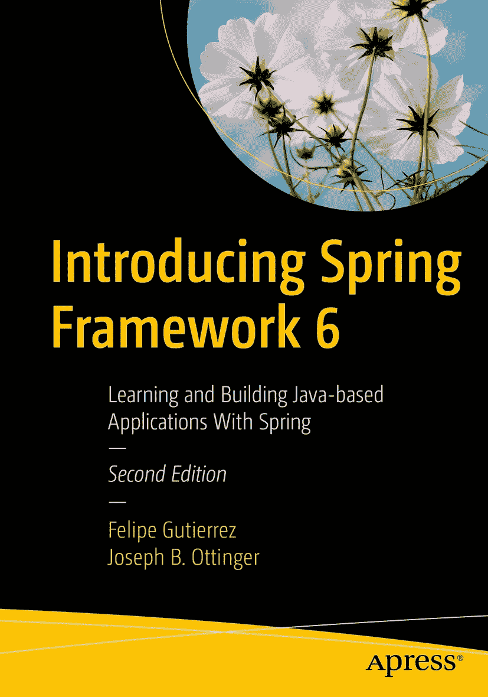
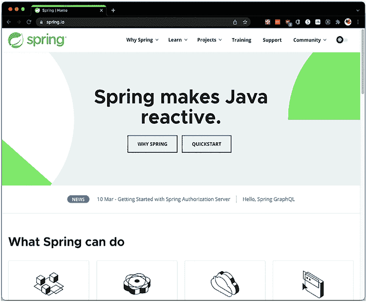
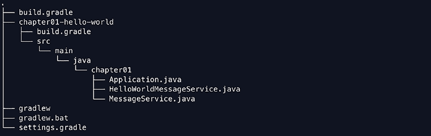
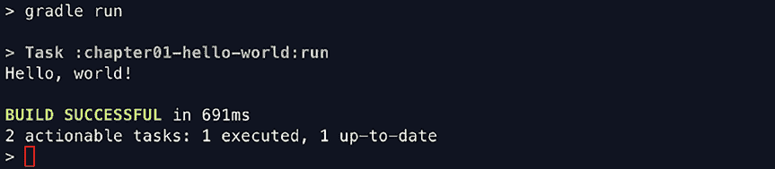
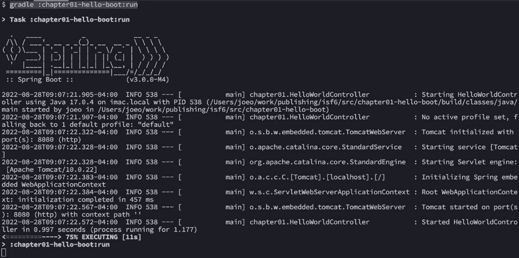
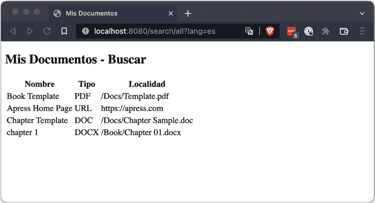
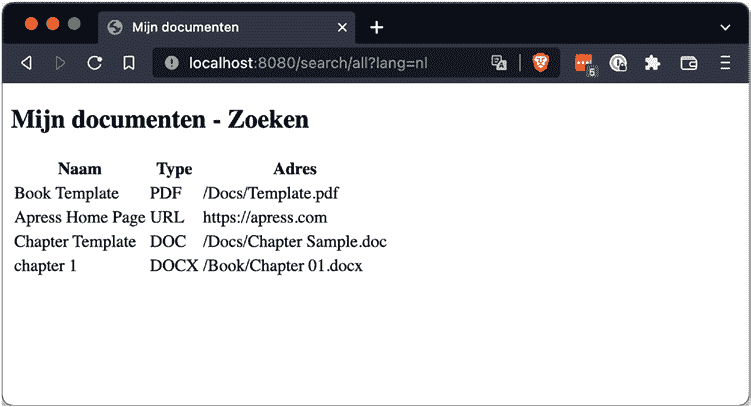
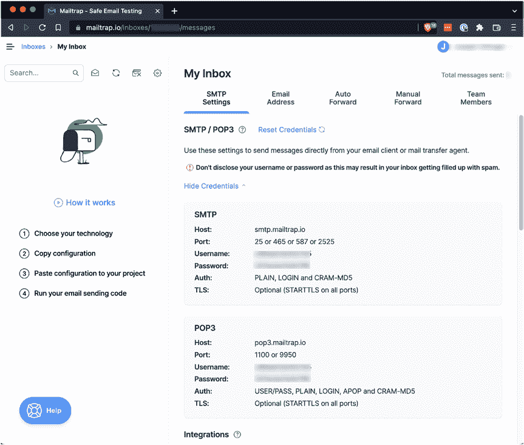

**Spring 框架简介**

**Framework 6**

**学习与构建基于 Java 的**

**Spring 应用程序**

**第二版**

**Felipe Gutierrez**

**Joseph B. Ottinger**

***Spring Framework 6 简介：学习与构建基于 Java 的应用程序***

***With Spring***

Felipe Gutierrez

Joseph B. Ottinger

美国北卡罗来纳州卡里

美国北卡罗来纳州扬斯维尔

ISBN-13（平装版）：978-1-4842-8636-4

ISBN-13（电子版）：978-1-4842-8637-1

[`doi.org/10.1007/978-1-4842-8637-1`](https://doi.org/10.1007/978-1-4842-8637-1)

版权所有 © 2022 Felipe Gutierrez, Joseph B. Ottinger

本作品受版权保护。出版商保留所有权利，无论是涉及材料的全部或部分，特别是翻译、重印、重用插图、朗诵、广播、微缩胶片复制或任何其他物理方式的复制权，以及信息存储与检索、电子改编、计算机软件，或现在已知或以后开发的类似或不同方法的传输权。

本书中可能出现商标名称、标识和图像。我们并未在每次出现商标名称、标识或图像时都使用商标符号，而是仅以编辑方式使用这些名称、标识和图像，以利于商标所有者，且无意侵犯商标权。

本出版物中使用的商品名称、商标、服务标记和类似术语，即使未明确标识，也不应被视为对其是否受专有权利保护的表达意见。

尽管本书中的建议和信息在出版时被认为是真实准确的，但作者、编辑和出版商均不对可能出现的任何错误或遗漏承担法律责任。出版商对本书所含内容不作任何明示或暗示的保证。

Apress Media LLC 董事总经理：Welmoed Spahr

采编编辑：Steve Anglin

开发编辑：Laura Berendson

协调编辑：Jill Balzano

封面设计：eStudioCalamar

封面图片：Mink Mingle 提供，来自 Unsplash (www.unsplash.com)

本书通过 Apress Media, LLC 在全球范围内发行图书贸易，地址：1 New York Plaza, New York, NY 10004, U.S.A. 电话：1-800-SPRINGER，传真：(201) 348-4505，电子邮件：orders-ny@springer-sbm.com，或访问 www.springeronline.com。Apress Media, LLC 是一家加利福尼亚有限责任公司，其唯一成员（所有者）是 Springer Science + Business Media Finance Inc (SSBM Finance Inc)。SSBM Finance Inc 是一家**特拉华州**公司。

有关翻译信息，请发送电子邮件至 booktranslations@springernature.com；如需重印、平装版或音频版权，请发送电子邮件至 bookpermissions@springernature.com。

Apress 图书可批量购买用于学术、企业或促销用途。大多数图书也提供电子版和许可证。如需更多信息，请参考我们的印刷版和电子版批量销售网页：http://www.apress.com/bulk-sales。

作者在本书中引用的任何源代码或其他补充材料，读者可在 GitHub (https://github.com/Apress) 上获取。如需更详细信息，请访问 http://www.apress.com/source-code。

印刷于无酸纸上

*献给我的父母，Rocio Cruz 和 Felipe Gutierrez。*

*—Felipe Gutierrez*

*献给我挚爱的妻子和儿子，以及那些*

*不断在我院子里捣乱的兔子们。*

*—Joseph B. Ottinger*

**目录**

关于作者 ���������������������������������������������������������������������������������������������������������������� ix
关于技术审校 ��������������������������������������������������������������������������������������������������������� xi
致谢 ������������������������������������������������������������������������������������������������������������������������� xiii
引言 ��������������������������������������������������������������������������������������������������������������������������� xv
第一部分：Spring 框架基础 ������������������������������������������������������������������������������������ 1

第 1 章：[你的第一个 Spring 应用程序 ������������������������������������������������������������������ 3](https://doi.org/10.1007/978-1-4842-8637-1_1)

[前置要求 ������������������������������������������������������������������������������������������������������������������������������������������ 4](https://doi.org/10.1007/978-1-4842-8637-1_1#Sec1)
[源代码组织 ������������������������������������������������������������������������������������������������������������������������������� 5](https://doi.org/10.1007/978-1-4842-8637-1_1#Sec2)
[Hello World 示例 ��������������������������������������������������������������������������������������������������������������������� 10](https://doi.org/10.1007/978-1-4842-8637-1_1#Sec3)
[你好，Boot ������������������������������������������������������������������������������������������������������������������������������� 14](https://doi.org/10.1007/978-1-4842-8637-1_1#Sec4)
[你好，Kotlin ����������������������������������������������������������������������������������������������������������������������������� 18](https://doi.org/10.1007/978-1-4842-8637-1_1#Sec5)
[总结 ����������������������������������������������������������������������������������������������������������������������������������������� 21](https://doi.org/10.1007/978-1-4842-8637-1_1#Sec6)

第 2 章：[使用类与依赖项 ������������������������������������������������������������������������������������� 23](https://doi.org/10.1007/978-1-4842-8637-1_2)

[“我的文档”应用程序 ��������������������������������������������������������������������������������������������������������������� 23](https://doi.org/10.1007/978-1-4842-8637-1_2#Sec1)
[测试实现 �������������������������������������������������������������������������������������������������������������������������������� 28](https://doi.org/10.1007/978-1-4842-8637-1_2#Sec2)
[使用 Spring 进行测试 ������������������������������������������������������������������������������������������������������������� 32](https://doi.org/10.1007/978-1-4842-8637-1_2#Sec3)
[总结 ����������������������������������������������������������������������������������������������������������������������������������������� 35](https://doi.org/10.1007/978-1-4842-8637-1_2#Sec4)

第 3 章：[应用不同的配置 ������������������������������������������������������������������������������������� 37](https://doi.org/10.1007/978-1-4842-8637-1_3)

[测试我的文档 ������������������������������������������������������������������������������������������������������������������������ 37](https://doi.org/10.1007/978-1-4842-8637-1_3#Sec1)
[Spring 中的注解配置 ������������������������������������������������������������������������������������������������������������� 45](https://doi.org/10.1007/978-1-4842-8637-1_3#Sec2)
[组件扫描 ���������������������������������������������������������������������������������������������������������������������������� 47](https://doi.org/10.1007/978-1-4842-8637-1_3#Sec3)
[Spring 中的 XML 配置 ������������������������������������������������������������������������������������������������������������� 50](https://doi.org/10.1007/978-1-4842-8637-1_3#Sec4)
[扩展配置 ����������������������������������������������������������������������������������������������������������������������������� 53](https://doi.org/10.1007/978-1-4842-8637-1_3#Sec5)

v

目录


[XML 组件扫描 ������������������������������������������������������������������������������������������������ 58](https://doi.org/10.1007/978-1-4842-8637-1_3#Sec6)

[XML 配置是否是个好主意？ ���������������������������������������������������������������������������������������� 59](https://doi.org/10.1007/978-1-4842-8637-1_3#Sec7)

[选择配置方法 ������������������������������������������������������������������������������������������������������������ 60](https://doi.org/10.1007/978-1-4842-8637-1_3#Sec8)

[小结 ������������������������������������������������������������������������������������������������������������������������������������� 61](https://doi.org/10.1007/978-1-4842-8637-1_3#Sec9)

第 4 章：[使用 Bean 作用域 �������������������������������������������������������������������������������� 63](https://doi.org/10.1007/978-1-4842-8637-1_4)

[作用域 ������������������������������������������������������������������������������������������������������������������������������������������ 63](https://doi.org/10.1007/978-1-4842-8637-1_4#Sec1)

[各种作用域 ��������������������������������������������������������������������������������������������������������������������������������� 63](https://doi.org/10.1007/978-1-4842-8637-1_4#Sec2)

[使用作用域 ������������������������������������������������������������������������������������������������������������������������ 65](https://doi.org/10.1007/978-1-4842-8637-1_4#Sec3)

[注解 ��������������������������������������������������������������������������������������������������������������������������������� 73](https://doi.org/10.1007/978-1-4842-8637-1_4#Sec4)

[小结 ������������������������������������������������������������������������������������������������������������������������������������� 74](https://doi.org/10.1007/978-1-4842-8637-1_4#Sec5)

第 5 章：[使用资源文件 ����������������������������������������������������������������������������� 75](https://doi.org/10.1007/978-1-4842-8637-1_5)

[注入资源 ����������������������������������������������������������������������������������������������������������������������������������� 75](https://doi.org/10.1007/978-1-4842-8637-1_5#Sec1)

[从属性文件加载注入值 ����������������������������������������������������������������������������������������������� 78](https://doi.org/10.1007/978-1-4842-8637-1_5#Sec2)

[国际化 ���������������������������������������������������������������������������������������������������������������� 81](https://doi.org/10.1007/978-1-4842-8637-1_5#Sec3)

[小结 ������������������������������������������������������������������������������������������������������������������������������������� 85](https://doi.org/10.1007/978-1-4842-8637-1_5#Sec4)

第二部分：Spring 框架 ��������������������������������������������������������������������� 87

第 6 章：[为你的 Spring 应用添加简单持久化 ������������������������ 89](https://doi.org/10.1007/978-1-4842-8637-1_6)

[持久化概念 ���������������������������������������������������������������������������������������������������������������������������� 89](https://doi.org/10.1007/978-1-4842-8637-1_6#Sec1)

[重新审视我们的简单数据模型 ���������������������������������������������������������������������������������������������� 90](https://doi.org/10.1007/978-1-4842-8637-1_6#Sec2)

[选择数据库 ������������������������������������������������������������������������������������������������������������������ 93](https://doi.org/10.1007/978-1-4842-8637-1_6#Sec3)

[设置 JDBC 连接 �������������������������������������������������������������������������������������������������������������������� 94](https://doi.org/10.1007/978-1-4842-8637-1_6#Sec4)

[JDBCTemplate �������������������������������������������������������������������������������������������������������������������� 99](https://doi.org/10.1007/978-1-4842-8637-1_6#Sec5)

[我们的服务接口与 SearchEngine 实现 ������������������������������������������������ 100](https://doi.org/10.1007/978-1-4842-8637-1_6#Sec6)

[整合所有内容 ������������������������������������������������������������������������������������������������������������������� 104](https://doi.org/10.1007/978-1-4842-8637-1_6#Sec7)

[小结 ����������������������������������������������������������������������������������������������������������������������������������� 106](https://doi.org/10.1007/978-1-4842-8637-1_6#Sec8)

第 7 章：[让 Spring 构建你的数据访问对象 ����������������������������������� 107](https://doi.org/10.1007/978-1-4842-8637-1_7)

[项目 �������������������������������������������������������������������������������������������������������������������������������� 107](https://doi.org/10.1007/978-1-4842-8637-1_7#Sec1)

[Spring Data 仓库 ���������������������������������������������������������������������������������������������������������� 113](https://doi.org/10.1007/978-1-4842-8637-1_7#Sec2)

[小结 ����������������������������������������������������������������������������������������������������������������������������������� 118](https://doi.org/10.1007/978-1-4842-8637-1_7#Sec3)

vi

目 录

第 8 章：[在 Web 上展示你的 Spring 应用 ������������������������������������� 119](https://doi.org/10.1007/978-1-4842-8637-1_8)

[Thymeleaf ����������������������������������������������������������������������������������������������������������������� 124](https://doi.org/10.1007/978-1-4842-8637-1_8#Sec1)

[整合所有内容 ������������������������������������������������������������������������������������������������������������������� 128](https://doi.org/10.1007/978-1-4842-8637-1_8#Sec2)

[小结 ����������������������������������������������������������������������������������������������������������������������������������� 132](https://doi.org/10.1007/978-1-4842-8637-1_8#Sec3)

第三部分：Spring 框架高级技术 ��������������������������������������������� 133

第 9 章：[将你的 Spring 应用与外部系统集成 ������������������������������� 135](https://doi.org/10.1007/978-1-4842-8637-1_9)

[流程 ������������������������������������������������������������������������������������������������������������������������������ 136](https://doi.org/10.1007/978-1-4842-8637-1_9#Sec1)

[小结 ����������������������������������������������������������������������������������������������������������������������������������� 146](https://doi.org/10.1007/978-1-4842-8637-1_9#Sec2)

[第 10 章：暴露 REST API ������������������������������������������������������������������������� 147](https://doi.org/10.1007/978-1-4842-8637-1_10)

[什么是 REST？ ��������������������������������������������������������������������������������������������������������������������������� 147](https://doi.org/10.1007/978-1-4842-8637-1_10#Sec1)

[在 Spring 中构建 REST API ��������������������������������������������������������������������������������������������������� 148](https://doi.org/10.1007/978-1-4842-8637-1_10#Sec2)

[小结 ����������������������������������������������������������������������������������������������������������������������������������� 164](https://doi.org/10.1007/978-1-4842-8637-1_10#Sec3)

[第 11 章：从 Spring 内部发送电子邮件 �������������������������������������������������� 165](https://doi.org/10.1007/978-1-4842-8637-1_11)

[发送电子邮件 ��������������������������������������������������������������������������������������������������������������������������� 165](https://doi.org/10.1007/978-1-4842-8637-1_11#Sec1)

[设置 MailTrap ��������������������������������������������������������������������������������������������������� 166](https://doi.org/10.1007/978-1-4842-8637-1_11#Sec2)


[项目的电子邮件方面 ������������������������������������������������������������������������������������������� 168](https://doi.org/10.1007/978-1-4842-8637-1_11#Sec3)

[Spring 中的异步任务 �������������������������������������������������������������������������������������������������� 180](https://doi.org/10.1007/978-1-4842-8637-1_11#Sec4)

[在 Spring 中添加调度事件 ����������������������������������������������������������������������������������������� 182](https://doi.org/10.1007/978-1-4842-8637-1_11#Sec5)

[总结 ����������������������������������������������������������������������������������������������������������������������������������� 190](https://doi.org/10.1007/978-1-4842-8637-1_11#Sec6)

第四部分：全新的 Spring I/O ������������������������������������������������������������������������ 191

[第 12 章：使用动态语言 �������������������������������������������������������������������������������� 193](https://doi.org/10.1007/978-1-4842-8637-1_12)

[使用 Groovy 动态加载功能 ��������������������������������������������������������������������������������������� 194](https://doi.org/10.1007/978-1-4842-8637-1_12#Sec1)

[最简单的动态 MessageService ����������������������������������������������������������������������������� 196](https://doi.org/10.1007/978-1-4842-8637-1_12#Sec2)

[使用 Spring 配置动态 MessageService ������������������������������������������������������������������� 200](https://doi.org/10.1007/978-1-4842-8637-1_12#Sec3)

[内联动态内容 �������������������������������������������������������������������������������������������������������� 202](https://doi.org/10.1007/978-1-4842-8637-1_12#Sec4)

[总结 ����������������������������������������������������������������������������������������������������������������������������������� 204](https://doi.org/10.1007/978-1-4842-8637-1_12#Sec5)

vii

目录

[第 13 章：接下来该何去何从？ ���������������������������������������������������������������������������� 205](https://doi.org/10.1007/978-1-4842-8637-1_13)

[Spring 及其对开发的影响 ������������������������������������������������������������������������������������ 205](https://doi.org/10.1007/978-1-4842-8637-1_13#Sec1)

[更广阔的 Spring 世界 �������������������������������������������������������������������������������������������������������� 207](https://doi.org/10.1007/978-1-4842-8637-1_13#Sec2)

索引 ��������������������������������������������������������������������������������������������������������������������� 209

viii


**关于作者**

**Felipe Gutierrez** 是一位解决方案软件架构师，拥有

墨西哥蒙特雷理工学院计算机科学学士和

硕士学位，拥有超过 20 年的

IT 经验，期间他为多个垂直行业的公司开发了

程序，例如政府、零售、医疗、教育和银行业。他

目前担任 Pivotal 的首席技术讲师，专攻

Cloud Foundry、Spring Framework、

Spring Cloud Native Applications、Groovy 和 RabbitMQ

等技术。他曾为诺基亚、苹果、Redbox 和高通等大公司担任解决方案架构师。

他还是 Apress 出版的《Introducing Spring Framework》、《Pro Spring Boot》和《Spring Boot Messaging》的作者。

**Joseph B. Ottinger** 被誉为专家级软件开发人员、编码员和程序员，拥有涵盖多种技术和平台的经验。他曾担任《Java Developer Journal》和 TheServerSide.com 的主编，多年来为大量出版物、开源项目和商业产品做出了贡献，使用了多种不同的语言（但主要是 Java、Python 和 JavaScript）。他是 Apress 出版的《Hibernate Recipes》和《Beginning Hibernate》的作者，还撰写了其他书籍以及一些文章。他还经常为那些与古代文化成员一起在洞穴中摇摆的随机毛茸茸生物写颂歌，或者类似的东西。

ix


**关于技术审校者**

**Manuel Jordan Elera** 是一位自学成才的开发者和

研究员，他喜欢学习新技术用于自己的

实验并创建新的集成。Manuel 获得了

2013 年 Springy 奖社区冠军和

Spring 冠军。在有限的空闲时间里，他阅读圣经

并在吉他上创作音乐。Manuel 以 dr_pompeii 的网名而闻名。他技术审校了许多

书籍，包括《Pro Spring MVC with WebFlux》（Apress, 2020）、

《Pro Spring Boot 2》（Apress, 2019）、《Rapid Java Persistence and

Microservices》（Apress, 2019）、《Java Language Features》（Apress,

2018）、《Spring Boot 2 Recipes》（Apress, 2018）以及《Java APIs, Extensions and Libraries》（Apress, 2018）。你可以通过他的博客 [www.manueljordanelera.blogspot.com](http://www.manueljordanelera.blogspot.com) 阅读他关于 Spring 技术的详细教程并与他联系。你也可以在 Twitter 上关注 Manuel，账号是 @dr_pompeii。

xi

**致谢**

我要向 Apress 团队表达我所有的感激之情：首先也是最重要的，感谢 Steve Anglin 接受我的提案；感谢 Laura Berendson 和 Jill Balzaono 在我需要时给予的帮助；以及参与这个项目的其他 Apress 团队成员。感谢大家让这一切成为可能。

感谢我们的技术审校者 Manuel Jordan，以及整个 Spring 团队，是他们让 Spring 框架成为现代基于 Java 的企业级应用的最佳编程和配置模型。

感谢我的父母 Rocio Cruz 和 Felipe Gutierrez 给予我所有的爱和支持，以及我最好的朋友，我的兄弟 Edgar Gerardo Gutierrez。尽管我们住得很远，但我们比以往任何时候都更亲近；谢谢你，“macnitous”。

——Felipe Gutierrez

我常常惊讶于我被要求写这些致谢和献词，主要是因为它们让我觉得只能感谢特定的人和事，这太局限了。我想感谢语法和拼写，以及我在使用正确的语法*和*拼写时的克制感，还要感谢我的妻子、家人（和朋友）的耐心，没有他们我几乎什么都做不了。

这本书是在许多经典的 70 年代曲调中写成的，其中很多不知为何是俗气的软摇滚，我想感谢一大批昙花一现的乐队，没有他们，我永远不会想知道当时的唱片业在想什么。这太棒了，我很怀念。愿我们所有人都能心中充满对彼此的爱，尽我们所能地生活。

——Joseph B. Ottinger

xiii

**引言**

本书是对著名的 Spring 框架的介绍，该框架为 Java 平台提供了一个控制反转容器。Spring 框架是一个开源的应用框架，可以与任何 Java 应用程序一起使用。

阅读本书后，您将了解如何执行以下操作：

• 高效地使用 Spring 框架。

• 通过 JDBC 数据库添加持久性，并可轻松迁移到 NoSQL。

• 进行单元测试和集成测试。

• 创建 Web 应用程序并公开 RESTful API。

• 通过 JMS 发送消息，该模型可扩展到 AMQP、RabbitMQ 和 MQTT。

• 为 Spring 使用动态语言，如 Groovy、Ruby 和 Bean Shell。

• 将 Groovy 与 Spring 结合使用。

• 使用新的 Spring Boot 和 Spring XD 技术。

**本书读者对象**


*《Spring Framework 6 入门》*是一本面向所有初识 Spring 框架并希望学习如何使用它构建应用程序的开发者的实践指南。在本书中，你将找到使用 Spring 框架及其所有特性和模块创建企业级应用所需的所有必要元素。

xv

引言

**本书的组织结构**

本书使用一个简单的 **My Documents** 应用程序，你将在学习过程中逐步对其进行开发。全书共分为以下四个部分：

• 第一部分：Spring 框架基础：你将学习依赖注入设计模式、Spring 的容器实现，以及它如何通过面向接口编程帮助你实现更好的设计。你将了解可以应用于 Spring 框架的不同配置。你还将学习如何使用 Bean 作用域、处理集合和资源文件，以及如何测试你的 Spring 应用程序。

• 第二部分：Spring 框架：你将学习如何添加持久化功能，并将你的 Spring 应用程序与其他系统集成。你还将能够将你的 Spring 应用程序部署到 Web 上。

• 第三部分：Spring 框架高级技术：你将学习如何将消息代理与 Spring 结合使用以实现大规模可扩展性和分布式架构，如何通过 RESTful API 暴露你的应用程序，以及如何在应用程序中发送电子邮件和调度事件。

• 第四部分：新的 Spring I/O：你将学习如何将 Spring 和 Groovy 集成到你的 Spring 应用程序中。你还将获得一些指导，了解在 Spring 学习之旅中下一步可以探索哪些更深入的技术。

**源代码**

本书中使用的所有源代码都可以在 github.com/apress/introducing-spring-framework6 找到。下载内容将包含以下仅在线提供的附录：

• 为你的操作系统安装 Java 和 Gradle
• 其他推荐工具

话不多说，让我们开始学习 Spring 框架吧！

xvi

**第 1 章**

**你的第一个 Spring**

**应用程序**

大多数书籍在开始时都会对所介绍的技术及其历史进行冗长的解释，并且通常会提供一个很小的示例，但你需要读到后面的章节才能运行它。

在本书中，我将采用不同的方法。我将从一些基础示例开始，并详细解释它们的作用以及如何使用它们，以便你能够快速了解 Spring。本章中的示例将向你展示将 Spring 框架集成到任何现有项目，或者从头开始创建一个项目并轻松修改它是多么容易。

图 1-1 展示了 Spring 产品组合网站 (https://spring.io)。在这个网站上，你可以找到所有 Spring 扩展、指南和文档，以帮助你更好地理解 Spring 生态系统。如果你已经迫不及待想要深入了解，Spring 框架本身可以在 https://spring.io/projects/spring-framework 找到。

© Felipe Gutierrez, Joseph B. Ottinger 2022
F. Gutierrez and J. B. Ottinger, *《Spring Framework 6 入门》*[, https://doi.org/10.1007/978-1-4842-8637-1_1](https://doi.org/10.1007/978-1-4842-8637-1_1#DOI)



第 1 章 你的第一个 Spring 应用程序

***图 1-1.** [`spring.io`](https://spring.io)*

**前置要求**

为了开始第一个 Spring 框架示例，我们需要安装一些工具。

• 你需要安装并配置好 Java 开发工具包 (JDK)，并确保可以在命令行中访问它。与支持多种 Java 版本的早期 Spring 版本不同，Spring 6 需要 Java 17 或更高版本。有许多网站提供 Java 17，但最合适的来源是 Adoptium 的分发页面 (https://adoptium.net/releases.html) 或 Oracle 的网站 (www.oracle.com/java/technologies/downloads/)。


[java/technologies/downloads/](http://www.oracle.com/java/technologies/downloads/)，两者皆可。

如果你使用的是 OSX 系统，也可以通过 SDKMan! 安装 Java（请参阅 [https://](https://sdkman.io) [sdkman.io](https://sdkman.io)）。


第 1 章 你的第一个 Spring 应用程序

• 我们将使用 Gradle 构建工具，可在 [`gradle.org`](https://gradle.org) 找到（见图 1-2）。Gradle 是 JVM 上最流行且功能最强大的两个构建工具之一；此处选择 Gradle 主要是因为它的构建脚本非常简单和简短。我们使用构建工具是因为这是非常标准的做法，它能为我们提供便捷的依赖管理和完整的构建生命周期，包括在构建过程中运行测试的能力；Gradle 也是 Spring 团队本身的首选工具。

***图 1-2.** Gradle 网站*

**源代码组织**

本书中我们将看到大量源代码。本部分将描述这些代码的布局方式，以便于理解各部分内容的存放位置。

第 1 章 你的第一个 Spring 应用程序

本书将组织为一个 Gradle 项目，包含多个子目录.1。大多数子目录将是项目的“模块”，但也会有例外。

顶级项目需要有自己的目录；对于作者来说，这个目录是 isf6（代表“Introducing Spring 6”）。大多数章节的代码将放在一个与章节编号对应的清晰命名的目录中：例如 chapter02、chapter03 等。

如果某个章节有两个独立的项目，它们将以章节编号和项目描述来命名，例如 chapter01-hello-world 和 chapter01-hello-boot。

让我们先看一下“顶级”项目并进行设置，然后我们将开始编写一些实际使用 Spring 的代码。

在安装 Java 和 Gradle 之后，我们需要做的第一件事是运行一个命令来初始化 Gradle：`gradle init`。

这将启动一个简短的交互过程，Gradle 会询问我们想要哪些构建选项。

默认选项即可，因为我们将覆盖它们；我们从这个过程中想要得到的主要结果是 Gradle 包装器的设置。我们需要替换此目录中的两个文件：`build.gradle` 和 `settings.gradle`。

顶级的 `build.gradle` 文件——位于你的“项目工作目录”中，因此所有相对路径都以“.”开头——应如下所示：

***清单 1-1.*** build.gradle

apply plugin: 'java'

sourceCompatibility = 17

targetCompatibility = 17

ext {

springFrameworkVersion = "6.0.0-M4"

testNgVersion = "7.6.1"

}

1 Gradle 使用一个包装器，为每个项目下载一份 Gradle 副本。这对于可重复构建非常有用，但它会在你的硬盘上为每个项目创建一个 Gradle 副本。因此，为本书创建一个单一项目比每个章节创建一个项目要高效得多，尽管某些章节会有独立的项目，例如 chapter-01-hello-boot 项目。

第 1 章 你的第一个 Spring 应用程序

allprojects {

apply plugin: 'java'

repositories {

maven {

url "https://repo.spring.io/milestone"

}

maven {

url "https://repo.spring.io/snapshot"

mavenContent {

snapshotsOnly()

}

}

mavenCentral()

}

dependencies {

implementation \

"ch.qos.logback:logback-classic:1.2.11"

testImplementation \

"org.testng:testng:$testNgVersion"

}

test {

useTestNG()

}

}

这个文件看起来内容很多——但它也是我们将要使用的最长的构建文件之一。它的作用是告诉 Gradle 我们有一个 Java 项目（因此使用 Java 编译器），需要哪个 Java 版本（17，撰写本文时的当前长期支持版本，也是 Spring 6 的要求），一组为构建提供版本信息的属性，以及所有项目都应执行的一组操作：它们都是 Java 项目，都应从一组外部位置拉取依赖，并且都应依赖 TestNG 测试框架。

我们接下来要覆盖的下一个文件是 `settings.gradle` 文件。


第一章 你的第一个 Spring 应用

这段代码的作用是描述“主构建”中要包含的子项目。随着我们在书中内容的推进，这段代码也会发生变化。

我们的 `settings.gradle` 需要完成两件事：

1.  配置项目，使其能够找到我们需要的插件。
2.  配置本书内容的子模块。

在编写本书时，Spring 6 *尚未*发布。因此，我们需要使用非“官方发布版”的仓库。我们在 `build.gradle` 中已经看到了对里程碑版和快照版仓库的引用，但 Gradle 通过不同的机制解析依赖和插件；因此，我们需要分别配置它们。

在用于插件解析的前置代码（即 `pluginManagement` 开头的那部分）之后，我们用一个简单的方式命名整个项目（`isf6`），然后包含了我们的第一个子模块 `chapter01-hello-spring`。随着本书内容的推进，我们会陆续添加更多子模块。2

我们将从一个简单的“Hello, world”项目开始，项目名称为 `chapter01-hello-world`，因此我们的 `settings.gradle` 文件一开始会很简单。

***清单 1-2.*** settings.gradle

pluginManagement {

repositories {

maven {

url "https://repo.spring.io/milestone"

}

maven {

url "https://repo.spring.io/snapshot"

mavenContent {

snapshotsOnly()

}

}

gradlePluginPortal()

}

}

2 如果你查看源码下载包，你会发现 `settings.gradle` 文件内容更多，并且以 `//tag::chapter01[]` 注释开头。这些注释是为了帮助格式化本书，本书使用了*实际源代码*作为清单，而不是复制的源码。



第一章 你的第一个 Spring 应用

rootProject.name = 'isf6'

include 'chapter01-hello-world'

章节在源码树中有两种表示方式。

如果章节的代码可以通过单个构建清晰地表示，那么该章节将被命名为自己的子目录，例如 `chapter02`、`chapter03` 等。

然而，如果章节实际上有两个构建过程，那么每个构建将拥有自己的目录，章节名称作为目录名的一部分。

有趣的是，本章将有两个构建，因此最终会得到例如 `chapter01-hello-world` 和 `chapter01-hello-boot` 这样的目录。

每章的源码组织将遵循 Gradle 源码标准。

所有源文件都放在名为 `src` 的子目录中，其下通常有两个目录：`main` 和 `test`。

在每个目录中，会有一个对应源语言（如 `java`）或名为 `resources` 的目录，用于映射不需要编译的源文件。

在这些目录下，你会看到按 Java 包命名约定组织的源文件。

因此，在我们为 `chapter01-hello-world` 创建好结构后，假设我们已经放置了一些 Java 源文件，我们会得到如图 1-3 所示的目录树：

***图 1-3.** 目前的目录树*

第一章 你的第一个 Spring 应用

**Hello World 示例**

我们已经多次提到 `chapter01-hello-world` 项目。让我们看看它实际包含什么。

这是一个确保你的工具正确设置的好方法，这个应用本身没有内在价值（不过，让某物对你说“Hello”大概也是值得的）。

我们先处理掉基础设施部分，看看 `chapter01-hello-world` 的 `build.gradle` 文件。

它非常简单：只指定了我们的源代码依赖于 `spring-core` 和 `spring-context`3，并使用一个占位符从清单 1-1（顶层 `build.gradle`）的 `ext` 部分拉取特定版本的依赖。

它还声明我们有一个带有主类的“application”，这将帮助我们在编写代码后运行它。

***清单 1-3.*** chapter01-hello-world/build.gradle

plugins {

id "application"

}

dependencies {

implementation \


"org.springframework:spring-core:$springFrameworkVersion"

implementation \

"org.springframework:spring-context:$springFrameworkVersion"

implementation \

"org.springframework:spring-test:$springFrameworkVersion"

}

application {

mainClass.set("chapter01.Application")

}

3 如果你对“依赖”和“版本”的引用不熟悉，请查看 Gradle 快速入门指南；[`docs.gradle.org/current/samples/sample_building_java_`](https://docs.gradle.org/current/samples/sample_building_java_applications.html)

[applications.html 是一个](https://docs.gradle.org/current/samples/sample_building_java_applications.html)极好的资源，能为你提供早期及后续经常需要的知识。

第 1 章 你的第一个 Spring 应用程序

值得注意的是：除非另有说明，源代码也将是完整的。

过去，许多编程书籍选择描述源文件的各个部分，因此磁盘上的一个给定文件可能会在纸质书中以四五个（甚至更多！）源代码清单的形式呈现。

这意味着读者被迫依赖源代码下载，或者依靠自己的注意力来查看完整的源文件。

相反，如果你看到一个源文件，你将看到它的全部内容，除非它已经展示过，或者出于组织结构的需要；有可能在展示整个文件之前，会先展示个别方法或部分内容，但整个源文件最终会完整呈现。

言归正传，是时候看一些代码了！

我们的“Hello, World”应用程序将使用一个 Spring 组件，即一个“bean”，它实现了一个“消息服务”。这个应用程序对于其设计目的来说可能过于复杂，但它将验证 Spring 本身在我们的应用程序中是否正常工作。

它将包含三个部分：“消息服务”定义本身、该接口的一个实现，以及一个使用该接口及其定义的应用程序。

首先，让我们看一下消息服务。

***清单 1-4.*** chapter01-hello-world/src/main/java/chapter01/

MessageService.java

**package chapter01**;

**public interface** MessageService {

**public** String getMessage();

}

这显然是一个非常简单的接口：它定义了一个单一方法 getMessage()。

我们的下一个类 HelloService 也同样简单。

***清单 1-5.*** chapter01-hello-world/src/main/java/

chapter01/HelloService.java

**package chapter01**;

**public class** HelloService

**implements** MessageService {

@Override

第 1 章 你的第一个 Spring 应用程序

**public** String getMessage() {

**return** "Hello, world!";

}

}

最后，我们来看实际的应用程序本身。

让我们查看源代码，然后弄清楚它的工作原理。

***清单 1-6.*** chapter01-hello-world/src/main/java/

chapter01/Application.java

**package chapter01**;

**import org**. **springframework**. **context**. **annotation**.*;

@Configuration

**public class** Application {

@Bean

MessageService helloWorldMessageService() {

**return new** HelloService();

}

**public** static void main(String[] args) {

var context =

**new** AnnotationConfigApplicationContext(Application.class);

var service =

context.getBean(MessageService.class);

System.out.println(service.getMessage());

}

}

首先，请注意我们在这里使用了大量注解。

这个类既充当应用程序的入口点，又充当其自身的配置：配置类使用 @Configuration 注解。



第 1 章 你的第一个 Spring 应用程序

我们还在一个返回 MessageService 的方法上使用了 @Bean 注解。该注解声明返回值是 Spring 的一个组件 4 并给予它一个基于构建该 bean 的方法的名称，默认情况下：对于这个 bean，它的名称是 helloWorldMessageService。

这就是程序化配置标记组件的方式；这允许我们查找与类型匹配的组件，这是 Spring 最强大的特性之一。


在 `main()` 方法中，我们建立了一个“应用上下文”——这是本书中会频繁使用的一个术语——然后利用该上下文查找一个 `MessageService`。

代码中的最后一个操作是将消息输出到控制台。

是时候运行它了，因为到目前为止我们已经投入了大量精力。

如果我们位于 `chapter01-hello-world` 目录下，可以使用 `gradle run` 命令来运行它，如图 1-4 所示：

***图 1-4.** 执行 chapter01-hello-world 项目*

如前所述⁵，这段代码被*过度*设计了。

但如果它能正常运行，那么我们所做的是创建了一个包含消息服务组件的应用程序，并使用该组件类型来查找该服务的实现。

我们的“应用程序”不再需要知道组件的具体实现是什么；它只是一个返回简单、确定性消息的东西（在本例中如此），但它可以做任何事情——例如，从数据库查找消息，或者从执行上下文中推导出消息——而应用程序完全无需知晓。

[⁴]: 我们还会看到其他一些注解，它们与 `@Bean` 在声明组件时扮演着相同的角色，主要区别在于它们标记了不同类型的 Bean，让程序员能更清楚地了解这些 Bean 应如何使用。其他注解还会带来实际的功能变化，我们会在遇到时进行讲解。

[⁵]: 你*确实*已经通读了本章内容，对吧？

**第 1 章 你的第一个 Spring 应用程序**

这就是 Spring 的真正力量：它帮助我们以组件的方式进行思考，从而引导我们编写出天然模块化的代码。

模块化代码可以为了可测试性而编写——这可能是我们在此要深入探讨的一个特性——这意味着更优质的代码。

**你好，Boot**

早在 Spring 4 时代，Spring 团队就发布了一种名为“Spring Boot”的新机制。如今，[Spring Boot](https://spring.io/projects/spring-boot) 已经发展成自己的生态系统，并为 Spring 中的大量功能提供了极其简便的入门途径。事实上，它*如此*便捷，以至于访问 Spring 的许多功能几乎都离不开 Spring Boot；你并非*绝对*需要它来完成所有事情（毕竟，它本身就是用 Spring 编写的，所以如果 Spring 团队能做到，你也能做到），但它的许多功能不值得在 Spring Boot 之外重新实现。

随着本书的深入，我们会大量接触到 Spring Boot。

为了展示其能力的冰山一角，让我们编写一个“Hello World”Web 服务，即一个在打开 URL 时生成消息的应用程序。

我们首先要做的是配置构建本身。这意味着要为 Spring Boot 应用程序创建一个目录（`chapter01-hello-boot`），为新模块创建一个 `build.gradle` 文件，并将其添加到顶层 `settings.gradle` 文件中。

以下是我们的 `build.gradle` 文件，它设置了依赖解析，并添加了对 `spring-boot-starter-web` 模块的依赖，该模块通过一个简单的依赖引入了大量与快速搭建 Web 服务相关的功能：

***清单 1-7.*** chapter01-hello-boot/build.gradle

```groovy
plugins {
    id "application"
    id 'org.springframework.boot' version '3.0.0-M4'
    id 'io.spring.dependency-management' version '1.0.13.RELEASE'
}

dependencies {
    implementation \
        'org.springframework.boot:spring-boot-starter-web'
}

application {
    mainClass.set("chapter01.HelloWorldController")
}
```

这个构建使用了 Gradle 的 Spring 插件，该插件允许我们从“物料清单”中导入 Spring 组件——我们只需指定一个依赖的通用名称，插件就会自动查找我们所需的一切。因此，当我们包含 `spring-boot-starter-web` 时，依赖管理插件会为我们导入一系列依赖，这样我们就不必担心查找特定版本的依赖了。

接下来，让我们继续修改 `settings.gradle` 文件，以便能够轻松编译和运行该模块。唯一需要修改的是最后一行。


***清单 1-8.*** settings.gradle

pluginManagement {

repositories {

maven {

url "https://repo.spring.io/milestone"

}

maven {

url "https://repo.spring.io/snapshot"

mavenContent {

snapshotsOnly()

}

}

gradlePluginPortal()

}

}

rootProject.name = **'** isf6**'**

include **'** chapter01-hello-world**'**

include **'** chapter01-hello-boot**'**

现在我们可以看到，“图书项目”有两个子模块，一个名为 chapter01-hello-world，另一个名为 chapter01-hello-boot。在阅读本书的过程中，我们需要将每一章都添加到 settings.gradle 中。

最后，让我们来看一些 Java 代码。

第 1 章 你的第一个 Spring 应用程序

***清单 1-9.*** chapter01-hello-boot/src/main/java/chapter01/

HelloWorldController.java

**package chapter01**;

**import org**. **springframework**. **boot**. **SpringApplication**; **import org**. **springframework**. **boot**. **autoconfigure**. **EnableAutoConfiguration**; **import org**. **springframework**. **stereotype**. **Controller**; **import org**. **springframework**. **web**. **bind**. **annotation**. **GetMapping**; **import org**. **springframework**. **web**. **bind**. **annotation**. **ResponseBody**;

@Controller

@EnableAutoConfiguration

**public class** HelloWorldController {

@GetMapping(path = "/", produces = "text/plain")

@ResponseBody

**public** String getMessage() {

**return** "Hello, world!";

}

**public** static void main(String[] args) {

SpringApplication.run(HelloWorldController.class,args);

}

}

在这里，我们将 HelloWorldController 标记为一种组件类型，即 @Controller，这意味着它用于处理 HTTP 请求。我们通过 @GetMapping 注解告诉它*哪些*请求，指示它处理根 URL 的请求——即 "/"——并且响应内容是纯文本，同时将方法的响应数据直接转换为输出流。6

最后，我们的 main() 方法告诉 Spring Boot 以 HelloWorldController 作为可配置类来运行。在实际实践中，这样做并不明智——我们通常会将“主类”与控制器分开（这违反了 SOLID 原则，详见第 [13](https://doi.org/10.1007/978-1-4842-8637-1_13) 章），但作为一个简单的示例，我们在此尽量减少代码清单的数量。

6 Spring 的 Web 服务实际上对响应内容有很强的控制能力，但我们的“Hello World”服务非常简单。



第 1 章 你的第一个 Spring 应用程序

我们可以通过 Gradle 运行此应用程序，命令为 gradle :chapter01-hello-boot:run。这将在控制台输出一些信息（因为 Spring Boot 默认为我们设置了日志记录），然后等待传入的 HTTP 请求。我们的输出应该类似于图 1-5。

***图 1-5.** 运行 gradle :chapter01-hello-boot:run*

我们可以通过访问 http://localhost:8080/ 来查看它生成的内容，该路径与我们通过 @GetMapping 注解设置的请求路径相匹配，并且我们应该会看到与图 1-6 等效的内容：


第 1 章 你的第一个 Spring 应用程序

***图 1-6.** HelloWorldController 的响应*

表面上看可能并不令人兴奋，但我们刚刚用几行简短的代码，通过 Spring Boot 启动了一个完整的用于处理 HTTP 请求的环境。

**你好，Kotlin**

Spring Boot 几乎能与任何 JVM 语言良好配合，包括 Groovy、Kotlin，甚至 Scala。更重要的是，它能够以近乎原生的方式与这些语言协同工作。

让我们看看使用 Kotlin 时是什么样子。7

7 Kotlin 是由 JetBrains 设计的一种语言。可以在 [`kotlinlang.org/`](https://kotlinlang.org/) 找到它。

第 1 章 你的第一个 Spring 应用程序

首先，我们需要在 settings.gradle 中添加一个新模块。这只是一行代码，就像添加 chapter01-hello-boot 时一样——它应该如下所示。

***清单 1-10.*** settings.gradle

pluginManagement {

repositories {

maven {

url "https://repo.spring.io/milestone"

}

maven {


url "https://repo.spring.io/snapshot"

mavenContent {

snapshotsOnly()

}

}

gradlePluginPortal()

}

}

rootProject.name = **'** isf6**'**

include **'** chapter01-hello-world**'**

include **'** chapter01-hello-boot**'**

include **'** chapter01-hello-kotlin**'**

当然，我们还需要一个 `build.gradle` 文件——它与清单 1-8 中的 `build.gradle` 几乎完全相同，只是增加了一行代码，用于添加 Kotlin 编译器支持：

***清单 1-11.*** chapter01-hello-kotlin/build.gradle

plugins {

id "application"

id "org.jetbrains.kotlin.jvm" version "1.7.10"

id **'** org.springframework.boot**'** version **'** 3.0.0-M4**'**

id **'** io.spring.dependency-management**'** version **'** 1.0.13.RELEASE**'**

}

第 1 章 您的第一个 Spring 应用程序

dependencies {

implementation \

**'** org.springframework.boot:spring-boot-starter-web**'**

}

application {

mainClass.set("chapter01.HelloWorldController")

}

我们的最后一个文件是直接从清单 1-9 逐功能复制过来的。它有一些不同之处：即，它位于 `src/main/kotlin/chapter01` 而不是 `src/main/java/chapter01`——注意这里使用的是 `kotlin` 而不是 `java`——当然，它是用 Kotlin 编写的，扩展名为 `.kt` 而不是 `.java`。（它还将消息改为 "Hello, Kotlin!"，以帮助与基于 Java 的同类版本区分开来。）

***清单 1-12.*** chapter01-hello-kotlin/src/main/kotlin/

chapter01/HelloWorldController.kt

**package chapter01**

**import org**. **springframework**. **boot**. **SpringApplication**

**import org**. **springframework**. **boot**. **autoconfigure**. **EnableAutoConfiguration** **import org**. **springframework**. **stereotype**. **Controller**

**import org**. **springframework**. **web**. **bind**. **annotation**. **GetMapping** **import org**. **springframework**. **web**. **bind**. **annotation**. **ResponseBody**

@Controller

@EnableAutoConfiguration

**class** HelloWorldController {

@get:ResponseBody

@get:GetMapping(path = ["/"], produces = ["text/plain"])

**val** message: **String**

**get**() = "Hello, Kotlin!"

**companion object** {

@JvmStatic

**fun** main(args: Array<String>) {

第 1 章 您的第一个 Spring 应用程序

SpringApplication.run(HelloWorldController::**class**.java, *args)

}

}

}

您可以使用 `gradle :chapter01-hello-kotlin:run` 运行*这个*类，然后打开 `http://localhost:8080`，现在会显示友好的 "Hello, Kotlin!"，而不是 "Hello, world!"。

**总结**

在本章中，您了解了如何创建一个简单的 Spring “Hello World” 应用程序并运行它。您还学习了 Spring 如何使用依赖注入来创建所有依赖关系以及类之间的协作。通过这个简单的示例，您看到创建什么实现并不重要；只要遵循接口，Spring 就会注入其实现，并在您需要时准备好。

您对 Spring Boot 有了初步了解，这是 Spring 团队的一个项目，将在后续章节中介绍。在此过程中，我们了解到 Kotlin 可以像 Java 一样轻松地使用 Spring。

后续章节将更详细地介绍 Spring 框架、其特性及其扩展。您将了解它们如何协同工作，以及如何在日常开发中使用它们。

**第 2 章**

**使用类**

**和依赖关系**

在本章中，我们将看到一个应用程序的雏形，它可以帮助我们维护对文档的引用。首先，我们将讨论我们要实现的目标，然后创建能够帮助我们跟踪文档的类；接着，我们将在直接的 Java 测试中*使用*这些类，最后，我们将创建一个与 Spring 等效的版本，以展示该框架的更多功能。

**“我的文档”应用程序**

我们的应用程序暂定名为“我的文档”（因为“Bob”这个名字已经被占用了），它是一个简单的界面，我们最终将能够添加各种类型的文档——URL、Word 文档、PDF——以便将来检索。


我们对设计的基本要求包括以下要素：

1. 用户身份验证（用户名、密码）。

2. 能够添加、移除、删除、编辑项目/文档，例如：

   a. Microsoft Office、Apple、Open Documents 以及 PDF 文件

   b. 笔记（文本笔记，限制为 255 个字符）

   c. 网站链接（URL）

3. 每个项目/文档可以设为私有或公开。

   a. 私有：项目/文档的所有者可以查看。

   b. 公开：所有人都可以查看该文档。

© Felipe Gutierrez, Joseph B. Ottinger 2022

F. Gutierrez 和 J. B. Ottinger，*《Spring Framework 6 入门》*[, https://doi.org/10.1007/978-1-4842-8637-1_2](https://doi.org/10.1007/978-1-4842-8637-1_2#DOI)

第 2 章 使用类与依赖关系

4. 可通过关键字、名称、类型、内容、标签和类别进行搜索。

5. 可按类别进行组织。

6. 每个项目/文档可通过电子邮件或外部消息系统发送。

然而，我们不会在*本章*中实现所有这些功能——本章将通过创建一个允许我们按类型检索文档的 `SearchEngine`，来介绍系统设计的初步内容。

我们将在整本书中不断扩展应用程序设计，逐步添加功能，直到满足所有需求。

审视我们的需求，在本章的范围内，有三个实体尤为突出：

1. 文档（Document）

2. 文档类型（Document type，我们将限制为几种不同类型，使其成为 Java 枚举类型的候选）

3. 搜索引擎（Search engine）

严格来说，我们并没有真正的 `SearchEngine`；我们有的是一个 `StorageEngine`，但在这里我们将使用 `SearchEngine`，因为我们尚未准备好添加动态存储。

事实上，这引出了第四种类型，即 `StaticSearchEngine`，它实现了 `SearchEngine` 接口，但只读且仅提供静态信息。

是时候开始编写一些代码了，以便感受一下这个设计可能有多稳固.1。

首先，我们需要添加一个 `chapter02` 目录，并为其创建一个 `build.gradle` 文件，同时还需要像处理 `chapter01-hello-kotlin` 那样，将其添加到书籍的 `settings.gradle` 文件中，以此类推。

以下是 `chapter02/build.gradle` 文件，它*仅*包含 Spring Framework 的依赖项：

1 目前这个设计并不十分稳固。它适用于本章的范围，并且如果你愿意接受静态数据集，它可以交付一个“可行的项目”。

第 2 章 使用类与依赖关系

***清单 2-1.*** chapter02/build.gradle

dependencies {

implementation \

"org.springframework:spring-core:$springFrameworkVersion"

implementation \

"org.springframework:spring-context:$springFrameworkVersion"

implementation \

"org.springframework:spring-test:$springFrameworkVersion"

}

本章我们没有一个“应用程序”——只有一个服务的简单实现，我们稍后可以将其暴露出来——因此这里没有引用主类或应用程序。我们*只*需要 Spring Framework。

我们还提到了 `Document` 和 `DocumentType`。一个文档有一个文档类型，所以我们先从可能更简单的 `DocumentType` 开始。

我们手头知道几种文档类型：Word 文档、PDF、笔记和 URL。

`DocumentType` 感觉像是枚举或一组 Java 记录类型的理想候选。事实证明，Java 枚举类型和记录*可以*协同工作，但并非特别简洁，而且在这种情况下，它们的重叠性非常强，以至于使用记录实际上并不能带来什么好处——

因此，我们将首先将 `DocumentType` 设计为一个枚举。

***清单 2-2.*** chapter02/src/main/java/chapter02/model/DocumentType.java **package chapter02**. **model**;

**public enum** DocumentType {

PDF("PDF", "Portable Document Format", ".pdf"),

DOCX("DOCX", "Word Document", ".docx"),

URL("URL", "Universal Resource Locator", ""),

DOC("DOC", "Word Document", ".doc"),

NOTE("NOTE", "Ancillary note", "");

**public** final String name;

**public** final String desc;

**public** final String extension;

第 2 章 使用类与依赖关系


**private** DocumentType(String name, String desc, String extension) {

this.name=name;

**this**.desc=desc;

**this**.extension=extension;

}

}

我们使用公共的 final 引用值，因为 String 是不可变的，一旦这些对象被实例化，它们就永远不会改变。

接下来，让我们看看 Document，由于包含了访问器和一个修改器，它的代码稍长一些.2。

***清单 2-3.*** chapter02/src/main/java/chapter02/model/Document.java **package chapter02**. **model**;

**import java**. **time**. **LocalDate**;

**import java**. **util**. **StringJoiner**;

**public class** Document {

**private** final String name;

**private** final DocumentType type;

**private** final String location;

**private** final LocalDate created;

**private** LocalDate modified;

**public** Document(String name, DocumentType type, String location) {

this.name = name;

**this**.type = type;

**this**.location = location;

created = LocalDate.now();

modified = LocalDate.now();

}

2 鄙人使用“访问器”而非更常见的“getter”，以及“修改器”来指代“setter”，因为……因为……我一时也说不上来为什么。你可以按自己的喜好来称呼它们，别人也多半能明白你的意思，但本书将统一使用访问器和修改器。

第 2 章 使用类与依赖

**public** String getName() {

**return** name;

}

**public** DocumentType getType() {

**return** type;

}

**public** String getLocation() {

**return** location;

}

**public** LocalDate getCreated() {

**return** created;

}

**public** LocalDate getModified() {

**return** modified;

}

**public** void setModified(LocalDate modified) {

**this**.modified = modified;

}

**public** String toString() {

**return** String.format(

"%s[name=%s,type=%s,location=%s,created=%tD,modified=%tD]",

**this**.getClass().getName(),

name,

type,

location,

created,

modified

);

}

}

我们的实现非常直接。为了保持一致性，我们为所有字段（包括 final 字段）都提供了访问器。

第 2 章 使用类与依赖

你认为 DocumentType 是否应该采用与 Document 相同的访问模型，即也提供 getName() 等方法？本章之所以采用不同的模型，主要动机其实是单词和行数的考量；最终选择了能提供一致性的最短方法。

现在，我们已经有了一种能够相对清晰地表示文档的方式，尽管在按内容搜索方面还有很多需要改进的地方。我们还需要两个源文件——SearchEngine 和 StaticSearchEngine——其中 StaticSearchEngine 允许我们测试这个接口。

首先，让我们看看 SearchEngine。

***清单 2-4.*** chapter02/src/main/java/chapter02/service/

SearchEngine.java

**package chapter02**. **service**;

**import chapter02**. **model**. **Document**;

**import chapter02**. **model**. **DocumentType**;

**import java**. **util**. **List**;

**public interface** SearchEngine {

List<Document> findByType(DocumentType documentType);

List<Document> listAll();

}

**测试实现**

细心的读者会注意到，我们已经有了一个对象模型的雏形，它至少可以表示需求中一个可行的部分，并且我们有了一个接口，可以作为与该对象模型交互的 API 起点。

然而，我们还没有任何真正*执行*操作的代码。是时候通过编写一些测试来弥补这一点了。

测试解决两个领域的问题：计算领域和人类领域。

计算领域是需求和功能的领域。我们希望类能够执行*这个*和*那个*操作，并产生*其他*结果；测试可以验证情况是否如此，或者至少帮助我们识别何时情况*并非*如此。

第 2 章 使用类与依赖

人类领域，嗯，就是人类。测试的人类领域允许


演示 API 如何真正融入人们*思考* API 的方式。方法名称是否清晰且适合其执行的任务？API 是否需要了解其内部工作原理才能理解事物？

**警告** 为人类设计是 API 设计中非常重要的一方面。

以 JavaMail 为例，我们将在第 [11 章](https://doi.org/10.1007/978-1-4842-8637-1_11)中进一步了解它；它是一个非常强大的库，从*计算*的角度来看，它很好地代表了其问题领域。然而，使用它需要理解 SMTP 在协议层面是如何工作的，或者不同的邮件提供商是如何运作的。从计算领域来看，它是一个不错的 API，但从人类领域来看，它是不够的；人类应该使用像 Spring Email 这样的 API。

如果在实现过程的早期就设计测试，通常更容易为其他人设计 API。当然，在完成测试所需的所有内容（例如对象模型、接口等）之前，它们是无法编译的，但先编写测试通常能让你更清楚地了解你的设计实际*需要*什么，以及哪些方面最值得精心设计。

让我们先看一个简单直接的 Java 测试（没有使用 Spring），来了解我们的对象模型可能如何工作。

**警告** 在我们编写了实现 `SearchEngine` 接口的 `StaticSearchEngine` 之前，这个测试无法运行。它将在*下一个*清单中展示。

这当然是一个测试，但请注意文件位置。它位于 chapter02 的 src/test/java 目录树中。

***清单 2-5.*** chapter02/src/test/java/chapter02/MyDocumentsTest.java **package chapter02**;

**import chapter02**. **service**. **SearchEngine**;

**import org**. **testng**. **annotations**. **Test**;

**import static chapter02**. **model**. **DocumentType**. **PDF**;

**import static org**. **testng**. **Assert**. **assertEquals**;

**import static org**. **testng**. **Assert**. **assertNotNull**;

第 2 章 使用类和依赖项

**public class** MyDocumentsTest {

SearchEngine engine = **new** StaticSearchEngine();

@Test

**public** void testFindByType() {

var documents = engine.findByType(PDF);

assertNotNull(documents);

assertEquals(documents.size(), 1);

assertEquals(PDF.name,

documents.get(0).getType().name);

assertEquals(PDF.desc,

documents.get(0).getType().desc);

assertEquals(PDF.extension,

documents.get(0).getType().extension);

}

@Test

**public** void testListAll() {

var documents = engine.listAll();

assertNotNull(documents);

assertEquals(documents.size(), 4);

}

}

作为一个测试，它看起来相当充分；它依赖于对 `SearchEngine` 的一些假设（其数据中只有一个 PDF 文档，总共四个文档），但基于这些假设，它是相当完整的。3

然而，如前所述，我们需要一个 `SearchEngine` 的*实现*。正如你在清单 2-6 中所见，我们将其命名为 `StaticSearchEngine`——这意味着它仅代表静态数据，因此是完全可预测的。让我们看看这个实现，注意它也是一个用于测试的类，因此位于 src/test/java 目录树中。

3 MyDocumentsTest 可以做得*更*完整，但那样源代码清单会变得非常长。欢迎自行扩展！

第 2 章 使用类和依赖项

***清单 2-6.*** chapter02/src/test/java/chapter02/StaticSearchEngine.java **package chapter02**;

**import chapter02**. **model**. **Document**;

**import chapter02**. **model**. **DocumentType**;

**import chapter02**. **service**. **SearchEngine**;

**import java**. **util**. **List**;

**import java**. **util**. **stream**. **Collectors**;

**import static chapter02**. **model**. **DocumentType**.*;

**public class** StaticSearchEngine **implements** SearchEngine {

**private** final List<Document> data = populate();

**private** List<Document> populate() {

**return** List.of(

**new** Document(

"Book Template.pdf", PDF, "/Docs/Template.pdf"

),

**new** Document(


"Apress 主页"，URL，"https://apress.com/"

),

**new** Document(

"Chapter Template.doc", DOC, "/Docs/Chapter Sample.doc"

),

**new** Document(

"Chapter 01.docx", DOCX, "/Docs/Chapter 01.docx"

)

);

}

@Override

**public** List<Document> findByType(DocumentType documentType) {

**return** data

.stream()

.filter(e -> e.getType().equals(documentType))

.collect(Collectors.toList());

}

第 2 章 使用类与依赖关系

@Override

**public** List<Document> listAll() {

**return** data;

}

}

这个类本身并不特别引人注目；它的源代码大部分都用于创建一个已知的数据集。（我们本可以将其存储在外部，并通过 CSV 或类似机制（甚至 JSON）加载它，但加载它所占用的篇幅与现在也相差无几。）

当然，我们可以通过 Gradle 运行这个测试：`gradle :chapter02:test` 会编译我们的源代码并执行测试，如果出现问题，会给出一个方便的错误报告。

（遗憾的是，Gradle 对测试运行的输出极其平淡，只报告成功或失败，如果失败则附带一个文件引用；如果我们工作得当，Gradle 的输出中并没有什么可以向读者展示的内容。）

**使用 Spring 进行测试**

敏锐的读者会注意到，本书的书名是《Spring 6 入门》，而本章中还没有涉及 Spring！是时候解决这个问题了，这将向我们展示使用 Spring 的一些优势。

Spring 的核心是一个*依赖注入*库。在我们的测试中，我们将重用之前编写的所有代码，但我们将使用外部配置来查找我们的 `SearchEngine` 实现。

使用外部配置来查找资源感觉像是一件非常微不足道的事情，但事实并非如此。它使我们的测试变得*模块化*。如果我们有 `SearchEngine` 的不同实现，即使它需要大量的配置，这些配置也可以在配置的上下文中进行，而不是在我们的测试代码中，并且只要数据不违反测试的预期，我们的测试就可以重用于 `SearchEngine` 的*任何*实现。

让我们看看测试本身，它与清单 2-5 几乎完全相同。

第 2 章 使用类与依赖关系

***清单 2-7.*** chapter02/src/test/java/chapter02/MyDocumentsSpringTest.java **package chapter02**;

**import chapter02**. **service**. **SearchEngine**;

**import org**. **springframework**. **beans**. **factory**. **annotation**. **Autowired**; **import org**. **springframework**. **test**. **context**. **ContextConfiguration**; **import org**. **springframework**. **test**. **context**. **testng**. **AbstractTestNGSpringContextTests**; **import org**. **testng**. **annotations**. **Test**;

**import static chapter02**. **model**. **DocumentType**. **PDF**;

**import static org**. **testng**. **Assert**.*;

@ContextConfiguration(classes={TestConfiguration.class})

**public class** MyDocumentsSpringTest

**extends** AbstractTestNGSpringContextTests {

@Autowired

SearchEngine engine;

@Test

**public** void testFindByType() {

var documents = engine.findByType(PDF);

assertNotNull(documents);

assertEquals(documents.size(), 1);

assertEquals(PDF.name,

documents.get(0).getType().name);

assertEquals(PDF.desc,

documents.get(0).getType().desc);

assertEquals(PDF.extension,

documents.get(0).getType().extension);

}

@Test

**public** void testListAll() {

var documents = engine.listAll();

第 2 章 使用类与依赖关系

assertNotNull(documents);

assertEquals(documents.size(),4);

}

}

不过，它有一些不同之处，而且这些差异影响很大。

首先，测试继承了 `AbstractTestNGSpringContextTests`，这是一个提供一些在测试中有用的 Spring 特性的类。

另一个变化是测试类本身使用了 `@ContextConfiguration` 注解：

@ContextConfiguration(classes={TestConfiguration.class})

这指定了我们使用的是*编程式配置*——一个处理配置的 Java 类，就像我们在[第 1 章](https://doi.org/10.1007/978-1-4842-8637-1_1)的“Hello World”应用程序中所做的那样——以及要加载哪个类名来进行配置。

最后，我们有一个使用 `@Autowired` 注解的 `SearchEngine` 声明：

@Autowired

SearchEngine engine;

假设测试的实例是由 Spring 管理的，鉴于我们已将其标记为继承 `AbstractTestNGSpringContextTests`，情况确实如此。当然，我们不必使用 TestNG。JUnit 也可以，并且非常流行，但根据作者的观点，对于大多数常见用途，TestNG 往往更直接一些。`@Autowired` 会在可用的配置中查找满足类型要求的类实例，并*注入*该引用。

`AbstractTestNGSpringContextTests` 超类使这个测试“由 Spring 管理”，因此 Spring 所做的是：

1. 加载配置
2. 加载测试本身
3. 查找可以赋值给 `SearchEngine` 的配置元素
4. 将该元素的引用赋值给 `engine` 属性
5. 运行测试

第 2 章 使用类与依赖关系

之后，实际的测试本身只是 `MyDocumentsTest` 中测试的简单复制。

当然，剩下的就是配置本身了，让我们来看看。

***清单 2-8.*** chapter02/src/test/java/chapter02/TestConfiguration.java **package chapter02**;

**import chapter02**. **service**. **SearchEngine**;

**import org**. **springframework**. **context**. **annotation**. **Bean**; **import org**. **springframework**. **context**. **annotation**. **Configuration**;

@Configuration

**public class** TestConfiguration {

@Bean

SearchEngine getEngine() {

**return new** StaticSearchEngine();

}

}

这个类非常简单：它将自己标记为 `@Configuration`，然后声明了一个单一的配置元素（使用 `@Bean`），该元素返回一个 `StaticSearchEngine` 的实例。

**本章小结**

在本章中，你定义了你的第一个 Spring 应用程序，名为 **My Documents**。这个应用程序将在整本书中不断演进，因此你可以进行实验，并使用 Spring 框架及其扩展添加更多功能。

你看到了使用纯 Java 的区别，并为其添加了 Spring 风格；Spring 框架将通过应用其依赖注入实现，帮助你实现更好的面向对象设计。

在接下来的章节中，你将更深入地学习 Spring，并了解如何增强你的应用程序。你将看到如何使用集合、如何添加持久化功能、如何在 Web 上暴露你的应用程序等等。

**第 3 章**

**应用不同的**

**配置**

Spring 框架支持多种配置其容器的方式，本章将涵盖之前使用过的 XML 配置。此外，你还将学习如何使用 Spring 团队推荐的不同编程机制来实现相同的配置。

在上一章中，你定义了你的 Spring 应用程序 My Documents，并了解了如何使用编程式配置文件来注入 `SearchEngine` 接口的实现。在本章中，你将了解经典的 XML 配置，它有其自身的优点和缺点。

**注意** 我们将再次看到[第 2 章](https://doi.org/10.1007/978-1-4842-8637-1_2)中的一些清单。我们还将有*大量*包含大量继承关系的小清单，以避免重写大量测试代码。本章代码量非常大，因为它展示了大量相对相似事物的变体。

**测试 My Documents**


我们将为第[2 章](https://doi.org/10.1007/978-1-4842-8637-1_2)中介绍的“我的文档”应用程序构建一系列测试。虽然在本章中我们会引入一些 `SearchService` 的新实现，但我们不会为界面添加任何功能。

© Felipe Gutierrez, Joseph B. Ottinger 2022

F. Gutierrez 和 J. B. Ottinger，*《Spring Framework 6 入门》*[, https://doi.org/10.1007/978-1-4842-8637-1_3](https://doi.org/10.1007/978-1-4842-8637-1_3#DOI)

第 3 章 应用不同的配置

但首先，我们需要有基础模型。你可以直接从第[2 章](https://doi.org/10.1007/978-1-4842-8637-1_2)的源代码复制到 `chapter3/src/main/java`，但请记得修改包名和目录名。作为回顾，以下是我们的三种基本类型：1

***清单 3-1.*** chapter03/src/main/java/chapter03/model/DocumentType.java **package chapter03**. **model**;

**public enum** DocumentType {

PDF("PDF", "便携式文档格式", ".pdf"),

DOCX("DOCX", "Word 文档", ".docx"),

URL("URL", "统一资源定位符", ""),

DOC("DOC", "Word 文档", ".doc"),

NOTE("NOTE", "辅助笔记", "");

**public** final String name;

**public** final String desc;

**public** final String extension;

**private** DocumentType(String name, String desc, String extension) {

this.name=name;

**this**.desc=desc;

**this**.extension=extension;

}

}

***清单 3-2.*** chapter03/src/main/java/chapter03/model/Document.java **package chapter03**. **model**;

**import java**. **time**. **LocalDate**;

**public class** Document {

**private** final String name;

**private** final DocumentType type;

1 如果你想知道为什么我们不直接为这些实体创建一个模块，嗯，这是个好问题。答案是因为我们不会长期使用这些基础实现。创建一个公共模块是合理的，但这需要我们有稳定的接口，而目前我们还没达到那个阶段。事实上，在本书的大部分内容中，我们通常会使用特定于章节的实现。

第 3 章 应用不同的配置

**private** final String location;

**private** final LocalDate created;

**private** LocalDate modified;

**public** Document(String name, DocumentType type, String location) {

this.name = name;

**this**.type = type;

**this**.location = location;

created = LocalDate.now();

modified = LocalDate.now();

}

**public** String getName() {

**return** name;

}

**public** DocumentType getType() {

**return** type;

}

**public** String getLocation() {

**return** location;

}

**public** LocalDate getCreated() {

**return** created;

}

**public** LocalDate getModified() {

**return** modified;

}

**public** void setModified(LocalDate modified) {

**this**.modified = modified;

}

**public** String toString() {

**return** String.format(

"%s[name=%s,type=%s,location=%s,created=%tD,modified=%tD]",

**this**.getClass().getName(),

第 3 章 应用不同的配置

name,

type,

location,

created,

modified

);

}

}

***清单 3-3.*** chapter03/src/main/java/chapter03/service/SearchEngine.java **package chapter03**. **service**;

**import chapter03**. **model**. **Document**;

**import chapter03**. **model**. **DocumentType**;

**import java**. **util**. **List**;

**public interface** SearchEngine {

List<Document> findByType(DocumentType documentType);

List<Document> listAll();

}

现在我们来点更有趣的事情。我们实际上需要一个测试层次结构，并且由于 Java 的继承机制，我们还需要稍微处理一下继承树。

我们将有两类通用的测试：一类是纯 Java 测试（如我们在第[1 章](https://doi.org/10.1007/978-1-4842-8637-1_1)中所见），另一类则基于 Spring。

然而，使用 TestNG 时，测试必须继承自 `AbstractTestNGSpringContextTests`，或者自行处理其 Spring 上下文的


上下文。管理 Spring 上下文并不困难，但这并非*常规*操作，而且我们无需练习在实际代码中不会遇到的内容；继承自 `AbstractTestNGSpringContextTests` 是“正确的做法”。

然而，话虽如此，Java 只允许*一个*父类，因此我们无法同时继承一个公共基测试类*和*一个 Spring 测试类……或者我们可以吗？

第 3 章 应用不同的配置

我们不能继承两个类，但我们可以继承任意多个接口，而且 Java 早在 Java 8 中就为接口引入了*默认实现*。我们可以创建一个“基础测试”接口，然后我们的测试类都可以实现*该*接口，从而获得测试方法的实现。

让我们以 `MyDocsBaseTest` 作为起点来看一下。

***清单 3-4.*** chapter03/src/test/java/chapter03/MyDocsBaseTest.java **package chapter03**;

**import chapter03**. **service**. **SearchEngine**;

**import org**. **testng**. **annotations**. **Test**;

**import static chapter03**. **model**. **DocumentType**. **PDF**;

**import static org**. **testng**. **Assert**. **assertEquals**;

**import static org**. **testng**. **Assert**. **assertNotNull**;

**public interface** MyDocsBaseTest {

SearchEngine getEngine();

@Test

**default** void testEngineNonNull() {

assertNotNull(getEngine());

}

@Test

**default** void testFindByType() {

var documents = getEngine().findByType(PDF);

assertNotNull(documents);

assertEquals(documents.size(), 1);

assertEquals(PDF.name,

documents.get(0).getType().name);

assertEquals(PDF.desc,

documents.get(0).getType().desc);

assertEquals(PDF.extension,

documents.get(0).getType().extension);

}

第 3 章 应用不同的配置

@Test

**default** void testListAll() {

var documents = getEngine().listAll();

assertNotNull(documents);

assertEquals(documents.size(), 4);

}

}

这些方法本身几乎与我们在第 [2](https://doi.org/10.1007/978-1-4842-8637-1_2) 章中看到的测试完全一致。

它们被标记为 `default`，以便实现此接口的类自动获得方法体。你会注意到，有一个 `getEngine()` 调用完全没有方法体——在某个时刻，我们的测试类需要提供一种获取 `SearchEngine` 的方式。

不过，在实现任何测试之前，我们需要再次实现一个 `SearchEngine`。让我们从第 [2](https://doi.org/10.1007/978-1-4842-8637-1_2) 章的 `StaticSearchEngine` 的近乎副本开始：

***清单 3-5.*** chapter03/src/test/java/chapter03/StaticSearchEngine.java **package chapter03**;

**import chapter03**. **model**. **Document**;

**import chapter03**. **model**. **DocumentType**;

**import chapter03**. **service**. **SearchEngine**;

**import java**. **util**. **List**;

**import java**. **util**. **stream**. **Collectors**;

**import static chapter03**. **model**. **DocumentType**.*;

**public class** StaticSearchEngine **implements** SearchEngine {

**private** List<Document> data;

**public** StaticSearchEngine(boolean populate) {

**if** (populate) {

populateData();

}

}

**public** StaticSearchEngine(List<Document> documents) {

populateData(documents);

}

第 3 章 应用不同的配置

**public** StaticSearchEngine() {

**this**(**false**);

}

**public** void populateData(List<Document> documents) {

**this**.data = documents;

}

**public** void populateData() {

populateData(List.of(

**new** Document(

"Book Template.pdf", PDF, "/Docs/Template.pdf"

),

**new** Document(

"Apress Home Page", URL, "https://apress.com/"

),

**new** Document(

"Chapter Template.doc", DOC, "/Docs/Chapter Sample.doc"

),

**new** Document(

"Chapter 01.docx", DOCX, "/Docs/Chapter 01.docx"

)

));

}

@Override

**public** List<Document> findByType(DocumentType documentType) {

**return** data

.stream()

.filter(e -> e.getType().equals(documentType))

.collect(Collectors.toList());

}

@Override

**public** List<Document> listAll() {

**return** data;

}

}

第 3 章 应用不同的配置


这个类有一些相当细微的变化，主要集中在数据填充方面。在[第 2 章](https://doi.org/10.1007/978-1-4842-8637-1_2)中，我们在类实例化时填充数据，而在这里，我们选择在构造过程中可选地调用 `populateData()`。默认情况下，我们*不*填充数据；因此，在编写清单 3-6 中的测试时，我们需要向辅助构造函数传递 `true` 来启动数据集的设置。我们还有一个接受 `List<Document>` 参数的 `populateData()` 方法。

**注意** 在本章后面的内容中，我们将提供一些显式填充数据的示例。因此，这个类现在拥有的一些特性，对于我们目前展示的内容来说并不适用。

让我们构建一个完全不使用 Spring 的测试。`MyDocsJavaTest` 将作为我们在[清单 2-5](https://doi.org/10.1007/978-1-4842-8637-1_2#PC5) 中看到的测试的逐功能替代品，但由于接口的存在，它要简短得多，*只*专注于构建一个 `SearchEngine`。

**警告** 请注意，`MyDocsJavaTest` 在*类*上使用了 `@Test` 注解！

这是因为该类本身不包含任何测试，所以我们需要告诉 TestNG 将该类包含在其测试列表中。

***清单 3-6.*** chapter03/src/test/java/chapter03/MyDocsJavaTest.java **package chapter03**;

**import chapter03**. **service**. **SearchEngine**;

**import org**. **testng**. **annotations**. **Test**;

@Test

**public class** MyDocsJavaTest

**implements** MyDocsBaseTest {

SearchEngine engine = **new** StaticSearchEngine(**true**);

@Override

**public** SearchEngine getEngine() {

**return** engine;

}

}

第 3 章 应用不同的配置

正如我们在[第 2 章](https://doi.org/10.1007/978-1-4842-8637-1_2)中看到的，我们可以使用 `gradle :chapter03:test` 运行测试，该命令会编译源代码并运行该章节项目中的每一个测试。

我们在这里看到的是对每个其他测试类基本职责的演示：实现 `getEngine()` 的方法。如你所见，这里我们以静态方式实现了它。

该测试创建了一个 `StaticSearchEngine`（并填充了数据！）然后将其返回。

Spring 测试也会做同样的事情，只不过它们会让 Spring 来填充引擎，而我们的测试仅在如何指定*在哪里*以及*如何*加载 Spring 配置方面有所不同。

**Spring 中的注解配置**

通过注解进行程序化配置*通常*是大多数 Spring 开发者的首选.2。

在注解配置的一个版本中——即程序化配置或 Java 配置——你需要创建带有 `@Configuration` 注解的类，然后在这些类中使用 `@Bean` 以及其他一些候选注解来标记访问器。

**注意** `@Bean` 并不是唯一提供 Spring Bean 的注解。随着本书的深入，我们将探索其他注解。事实上，我们将在本章后面部分介绍其中一些注解。

我们在清单 3-7 中看到了这种形式的程序化配置。我们可以用一个包含两个类的 `.java` 源文件来表示它。

***清单 3-7.*** chapter03/src/test/java/chapter03/MyDocsConfigurationTest.java **package chapter03**;

**import chapter03**. **service**. **SearchEngine**;

**import org**. **springframework**. **beans**. **factory**. **annotation**. **Autowired**; **import org**. **springframework**. **context**. **annotation**. **Bean**; **import org**. **springframework**. **context**. **annotation**. **Configuration**; 2 关于偏好的轶事数据由 Spring 团队提供，与哪种配置方法最适合特定应用程序无关。每种机制都有其自身的优缺点。

第 3 章 应用不同的配置

**import org**. **springframework**. **test**. **context**. **ContextConfiguration**; **import org**. **testng**. **annotations**. **Test**;

@Configuration

**class** MyDocsConfig {

@Bean

SearchEngine getEngineBean() {


**return new** StaticSearchEngine(**true**);

}

}

@ContextConfiguration(classes={MyDocsConfig.class})

@Test

**public class** MyDocsConfigurationTest

**extends** MyDocsContextBaseTest {

@Autowired

SearchEngine engine;

@Override

**public** SearchEngine getEngine() {

**return** engine;

}

}

**注意**：请记住，Java 在给定的源文件中只能有一个顶级公共类，但可以包含其他*非公共*类。

正如我们在这里看到的，我们有一个标记为 @Autowired 的字段，Spring 会在测试的生命周期中自动提供该字段，这要归功于 MyDocsConfig 类中有一个标记为 @Bean 的方法，该方法返回的类型*可赋值给*自动装配的字段。访问器仅提供对属性的访问，而我们继承的测试会按预期正常运行。

这里需要注意的另一件事是组件的*命名*。在第[1 章](https://doi.org/10.1007/978-1-4842-8637-1_1)中，我们看到一个从名为 `helloWorldMessageService()` 的方法返回的组件，该方法被用作组件的名称；在这里，Spring 会分配一个名称 `engineBean`，而不是 `getEngineBean`，它会从方法中推导出名称，以便尽可能让人类理解。当然，我们也可以为组件指定一个名称，使用 `@Bean(name="beanName")` 来赋予它一个任意的名称.3。

**组件扫描**

基于注解的配置的另一个方面依赖于*组件扫描*。在配置类中，我们使用像 @Bean 这样的注解来标记*该类中*作为 Bean 提供者的方法，但我们并不局限于在 Java 配置的方法上使用 @Bean。我们也可以将类本身标记为 Spring 组件，并告诉 Spring 在类路径中*查找它们*。

这可能是一种“昂贵的操作”，因为我们可以要求 Spring 搜索类路径的大部分区域；这里的解决方案是限制搜索范围。

让我们重新审视列表 3-7，不过我们将通过组件扫描来**搜索** SearchEngine，而不是显式声明它。

首先，我们需要我们的 SearchEngine 实现，我们将其放入自己的包 `chapter03.service` 中。

***列表 3-8.*** chapter03/src/test/java/chapter03/service/ScannedSearchEngine.java

**package chapter03**. **service**;

**import chapter03**. **StaticSearchEngine**;

**import org**. **springframework**. **stereotype**. **Service**;

@Service

**public class** ScannedSearchEngine

**extends** StaticSearchEngine {

ScannedSearchEngine() {

**super**(**true**);

}

}

3 值得注意的是，*一般来说*，在 Spring 中使用 Bean 名称既非必要也不被鼓励。只有当你有多个可赋值给同一类型的组件时，它才重要——例如，如果我们的配置中有多个 SearchEngine 实现。那么，在请求一个实现时，我们可以使用名称来指定我们想要哪一个。话虽如此，这在实践中通常是非常罕见的情况。

第 3 章 应用不同的配置

我们使用 @Service 注解这个类，就像我们使用 @Bean 注解其他组件一样。@Bean 是一个方法级别的注解；我们在程序化配置中使用它来表示“这个方法返回一个组件”。在*类*级别，我们使用四个候选注解之一：@Component、@Service、@Repository 或 @Controller。这四个注解都将类标记为组件，但在它们如何使 Spring 处理这些类方面存在一些细微差别。

**注解**

**描述**

@Component

通用注解，将该组件标记为 Spring 管理的候选对象。

@Repository

这是 @Component 的特化，标记该组件与某种数据层交互。异常可以自动转换为 Spring 的持久化相关异常。

@Service

这是 @Component 的特化，标记该组件为应用程序的一种服务类型；这更多是为了程序员方便而做的语义区分，而非其他。


@Controller

这是 @Component 的另一种特化形式，用于标记该组件在 Web 上下文中使用。

在 ScannedSearchEngine 中，我们有一个可能适合作为 @Repository 的候选者，因为它使用了读取操作，但从架构上看，它可能拥有一个 SearchEngine 委托的存储引擎，而不是本身作为一个仓库。因此，我们将其标记为 @Service。

***清单 3-9.*** chapter03/src/test/java/chapter03/MyDocsScanTest.java **package chapter03**;

**import chapter03**. **service**. **SearchEngine**;

**import org**. **springframework**. **beans**. **factory**. **annotation**. **Autowired**; **import org**. **springframework**. **context**. **annotation**. **ComponentScan**; **import org**. **springframework**. **context**. **annotation**. **Configuration**; **import org**. **springframework**. **test**. **context**. **ContextConfiguration**; **import org**. **testng**. **annotations**. **Test**;

第 3 章 应用不同的配置

@Configuration

@ComponentScan(basePackages = "chapter03.service")

**class** MyDocsScanConfig {

}

@ContextConfiguration(classes={MyDocsScanConfig.class})

@Test

**public class** MyDocsScanTest

**extends** MyDocsContextBaseTest {

@Autowired

SearchEngine engine;

@Override

**public** SearchEngine getEngine() {

**return** engine;

}

}

这里，我们有一个标记为 @Configuration 的 MyDocsScanConfig 类，但同时还有一个 @ComponentScan 注解，我们告诉*这个*注解去扫描 chapter03.service 包——否则，它会扫描所有名称以*配置类*包名开头的包。因此，由于这个配置类位于 chapter03 中，如果我们没有传递 basePackages 值，扫描将包括 chapter03——当前包——以及 chapter03 下的任何包。4

当运行此测试时，Spring 将检查 @ComponentScan 中指定的**每一个**类，并检查它是否是 @Component 或组件的特化形式，例如 @Service。如果是，它将把该类加载到 ApplicationContext 中并使其可用，这意味着 MyDocsScanTest 的自动装配可以正常工作，并且我们的测试通过。

**注意** 一般来说，我们目前看到的显式配置类是最“轻量级”的配置方法。组件扫描很方便，但稍微重一些。

4 Java 包实际上*并非*层次结构；包在语义上并不是其他包的“子包”。

第 3 章 应用不同的配置

**Spring 中的 XML 配置**

我们的下一个类看起来与 MyDocsConfigurationTest 类几乎相同，但有两个不同之处。一是没有 MyDocsConfig 类；另一个区别是 @ContextConfiguration 将引用一个 XML 配置而不是一个类。

我们先来看一下 MyDocsXMLTest，然后再看 XML 本身，并讨论一下为什么我们可能会使用 XML 进行配置。

***清单 3-10.*** chapter03/src/test/java/chapter03/MyDocsXMLTest.java **package chapter03**;

**import chapter03**. **service**. **SearchEngine**;

**import org**. **springframework**. **beans**. **factory**. **annotation**. **Autowired**; **import org**. **springframework**. **test**. **context**. **ContextConfiguration**; **import org**. **testng**. **annotations**. **Test**;

@ContextConfiguration(locations={"/documents.xml"})

@Test

**public class** MyDocsXMLTest

**extends** MyDocsContextBaseTest {

@Autowired

SearchEngine engine;

@Override

**public** SearchEngine getEngine() {

**return** engine;

}

}

@ContextConfiguration 注解使用了一个 locations 属性，它是类路径上命名资源的集合。由于我们引用了 /documents.xml，它将从类路径的根目录加载该资源。在我们的项目中，它位于 chapter03/src/test/resources/documents.xml——我们将在下一个清单中看到——因此它可用于测试。

从功能上讲，这里没有什么独特或特殊之处。以下是 XML 配置，它开始向我们展示一些更有趣的内容：

第 3 章 应用不同的配置

***清单 3-11.*** chapter03/src/test/resources/documents.xml

<?xml version="1.0" encoding="UTF-8"?>

< **beans**

xsi:schemaLocation="http://www.springframework.org/schema/beans

http://www.springframework.org/schema/beans/spring-beans.xsd">

< **bean** id="engine"

class="chapter03.StaticSearchEngine"

init-method="populateData"

/>

</**beans**>

这里我们看到与 MyDocsConfig 类相比*大量*的文本，而且其中几乎没有什么是我们应用程序特有的；只有 <bean/> 引用与我们的测试有关。*它*的作用相当简单：标记一个 Spring bean（相当于 @Bean 注解）并给它一个名称（"engine"），除非你给它一个特定的名称，否则注解*会隐含*这个名称，然后指定实现类——这与我们的其他测试一样——是 StaticSearchEngine。

XML 是一个相当庞大且非常正式的规范。对于像这样的小型配置，它们非常冗长——XML 本身需要大量的样板代码，这使得我们简单的配置变成了六行样板代码对应两行实际内容——信噪比相当低.5

XML 以一个声明它是 XML 文件的前言开始，然后有一个层次化的节点结构：有一个顶级节点（<beans>），它通过各种*属性*（xmlns、xmlns:xsi 和 xsi:schemaLocation 部分）描述内容，然后在结束标签之前包含更多节点，结束标签是节点名称前加一个斜杠（因此：</beans>）。

一个节点*不必*包含其他节点，正如我们在 <bean> 中看到的，它在结束尖括号前用一个斜杠自行结束。

顶级节点上的属性引入了 *XML 命名空间*，它们通知 XML 解析器该 XML 文件应该是什么样子。xmlns 表示 <beans> 默认使用一个特定的模式（由 URL 引用的 beans 模式），该模式本身规定 <beans> 节点包含特定的其他节点，例如 <bean>，以及为了使 XML 文件有效，*这些*节点可以或必须是什么样子。

如前所述，这是一个*非常*正式的规范，许多程序员对这种形式主义感到不满；XML 非常非常强大，但不太受欢迎。

**注意** 大多数程序员，包括 Spring 团队本身，更喜欢在代码中进行配置而不是使用 XML，并且当使用 XML 时，文件是通过自动处理所有命名空间的工具生成的，或者头信息是从其他文件复制的。

话虽如此，XML 格式*确实*有其用途。在我们展示 XML 配置的一些更有用的方面之前，让我们先弄清楚我们*当前*的配置使用那个单一的 <bean/> 引用在做什么。

<bean> 标签可以有*许多*选项。作为其中一些选项的简短示例：

**属性**

**描述**

id

bean 的标识符。只能定义一个唯一的 ID。

class

指向一个具体类，给出完整的 Java 包名。

scope

告诉 Spring 容器如何创建 bean；默认情况下，如果未设置此 scope 属性，bean 将是一个单例实例。其他作用域包括 prototype（每次需要 bean 时创建一个新实例）、request（在每个 HTTP Web 请求中创建一个单例实例）和 session（创建一个 bean 并在 HTTP 会话期间存在）。

init-method

这是在 bean 创建后将被调用的方法名称。当你想在对象创建后设置状态时，这很有用。


`factory-method` 这是用于创建 bean 的方法名称。换句话说，你需要提供将创建该对象实例的方法，并且此方法应包含参数。

`destroy-method` 这是在你销毁 bean 之后将被调用的方法名称。

`lazy-init`

如果你希望容器在 bean 被调用或使用时（即当你从 `ApplicationContext` 调用 `getBean` 方法时），或者稍后从需要该对象的另一个实例类中创建 bean，则可以将此属性设置为 `true`。

第三章 应用不同的配置

那么，我们简单配置所做的是：声明一个 Spring 配置（包含所有前言和 XML 声明），然后创建一个标识符为 `engine` 的单一引用，其类型为 `chapter03.StaticSearchEngine`，并在类实例化后调用 `populateData()`。由于我们没有提供像 `scope` 这样的其他标签，因此它被创建为单例（每次我们向上下文请求 `engine` 时，都会得到*同一个引用*），并且通过使用无参构造器（Java 默认构造器）来构建。

**扩展配置**

我们简单配置的问题在于它*过于*简单，而且功能也不足。让我们稍微改进一下。

我们一直使用的 `chapter03.StaticSearchEngine` 就其用途而言是一个不错的实现；它实现了带有常量数据的 `SearchEngine` 接口。

然而，它非常冗长（因为它必须包含常量数据），而且没有人喜欢冗长的代码清单，因为它们会消耗大量纸张，从而用掉很多树木，对吧？6

在本书中，我们将探索几种不同的创建种子数据的方法，但让我们先从使用 XML 配置来探索一些选项开始。我们将看到几组不同的代码清单，其中我们会提供一个 XML 配置和一个 Java 类，所以请做好准备。

首先，让我们看看如何通过指定构造器参数来构建测试，从而避免使用 `init-method`。以下是我们的测试类：

***清单 3-12.*** chapter03/src/test/java/chapter03/MyDocsXMLConstructorTest.java

**package chapter03**;

**import chapter03**. **service**. **SearchEngine**;

**import org**. **springframework**. **beans**. **factory**. **annotation**. **Autowired**; **import org**. **springframework**. **test**. **context**. **ContextConfiguration**; **import org**. **testng**. **annotations**. **Test**;

6 罗拉克丝完全支持这一观点。

第三章 应用不同的配置

@ContextConfiguration(locations={"/doccons.xml"})

@Test

**public class** MyDocsXMLConstructorTest

**extends** MyDocsContextBaseTest {

@Autowired

SearchEngine engine;

@Override

**public** SearchEngine getEngine() {

**return** engine;

}

}

同样，从功能上讲，这里没有什么独特或特别之处。以下是 XML 配置，它开始向我们展示一些更有趣的内容：

***清单 3-13.*** chapter03/src/test/resources/doccons.xml

<?xml version="1.0" encoding="UTF-8"?>

< **beans**

xsi:schemaLocation="http://www.springframework.org/schema/beans

http://www.springframework.org/schema/beans/spring-beans.xsd">

< **bean** id="engine"

class="chapter03.StaticSearchEngine">

< **constructor-arg**

name="populate"

type="boolean"

value="true" />

</**bean**>

</**beans**>

在这里，我们看到了在 `bean` 标签内部使用了 `constructor-arg` 标签。这允许我们传递构造器参数（这并不令人意外），并且可以按名称（如此处所示）或按位置指定特定参数。`type` 是必需的，我们传递的是一个值而不是引用——这意味着如果我们需要或想要的话，我们可以有一个值为 `true` 的简单布尔类型 bean.7

**注意** 将此配置与清单 3-7 进行比较和对比——你就会明白为什么许多程序员更喜欢程序化配置。


让我们进一步探索，看看能否让 XML 配置为我们所用，而不是仅仅因为要求它执行的任务而变得过于冗长。让我们用它来填充数据集。

先把它放在一边，我们来看看测试源。与我们使用 XML 配置的其他 Spring 测试一样，这里唯一真正的区别在于类名和 `@ContextConfiguration` 注解。

***清单 3-14.*** chapter03/src/test/java/chapter03/MyDocsXMLDataTest.java **package chapter03**;

**import chapter03**. **service**. **SearchEngine**;

**import org**. **springframework**. **beans**. **factory**. **annotation**. **Autowired**; **import org**. **springframework**. **test**. **context**. **ContextConfiguration**; **import org**. **testng**. **annotations**. **Test**;

@ContextConfiguration(locations={"/docdata.xml"})

@Test

**public class** MyDocsXMLDataTest

**extends** MyDocsContextBaseTest {

@Autowired

SearchEngine engine;

@Override

**public** SearchEngine getEngine() {

**return** engine;

}

}

7 我们很快就会展示引用的使用。

第 3 章 应用不同的配置

我们将通过 XML 配置中使用一个不同的标签（来自不同的 XML *命名空间*，即 util 命名空间）来填充数据集。这意味着我们的 XML 头部将会改变。

完成之后，我们将能够使用一个列表标签，并在该列表中包含一系列其他值。这将是一个非常冗长的 XML 文件，但它会向我们展示几件事：如何构造一个列表作为值，以及如何引用一个 Spring bean 作为构造函数的引用，例如：8

***清单 3-15.*** chapter03/src/test/resources/docdata.xml

<?xml version="1.0" encoding="UTF-8"?>

< **beans**

xsi:schemaLocation="http://www.springframework.org/schema/beans

http://www.springframework.org/schema/beans/spring-beans.xsd

http://www.springframework.org/schema/util

http://www.springframework.org/schema/util/spring-util.xsd">

< **bean** id="engine"

class="chapter03.StaticSearchEngine">

< **constructor-arg** name="documents" ref="documentList"/>

</**bean**>

< **util:list** id="documentList"

value-type="chapter03.model.Document">

< **bean** id="doc1" class="chapter03.model.Document">

< **constructor-arg**

name="name"

value="Book Template.pdf"/>

< **constructor-arg**

name="type"

value="PDF"/>

8 数据集的构建也将启发我们寻找从外部源加载数据的更简单方法。XML 非常简单，但就它提供的内容而言，却非常冗长。

第 3 章 应用不同的配置

< **constructor-arg**

name="location"

value="/Docs/Template.pdf"/>

</**bean**>

< **bean** id="doc2" class="chapter03.model.Document">

< **constructor-arg**

name="name"

value="Apress Home Page"/>

< **constructor-arg**

name="type"

value="URL"/>

< **constructor-arg**

name="location"

value="https://apress.com"/>

</**bean**>

< **bean** id="doc3" class="chapter03.model.Document">

< **constructor-arg**

name="name"

value="Chapter Template.doc"/>

< **constructor-arg**

name="type"

value="DOC"/>

< **constructor-arg**

name="location"

value="/Docs/Chapter Sample.doc"/>

</**bean**>

< **bean** id="doc4" class="chapter03.model.Document">

< **constructor-arg**

name="name"

value="Chapter 01.docx"/>

< **constructor-arg**

name="type"

value="DOCX"/>

< **constructor-arg**

name="location"

第 3 章 应用不同的配置

value="/Docs/Chapter 01.docx"/>

</**bean**>

</**util:list**>

</**beans**>

在此配置下，MyDocsXMLDataTest 测试成功运行，这告诉我们列表已用正确数量的元素填充（毕竟，我们的测试并未验证整个列表，尽管这对读者来说可能是一个不错的练习），并且列表中至少包含一个正确的元素。

**XML 中的组件扫描**


我们在本章前面已经看到，可以在 Java 中扫描组件，而无需显式声明它们。在 XML 中也可以这样做，只需使用一个*不同*的命名空间，即 context 命名空间，就像我们使用 util 命名空间一样。我们的

组件扫描配置可能如下所示：

***清单 3-16.*** chapter03/src/test/resources/docscan.xml

<?xml version="1.0" encoding="UTF-8"?>

< **beans**

xsi:schemaLocation="http://www.springframework.org/schema/beans

http://www.springframework.org/schema/beans/spring-beans.xsd

http://www.springframework.org/schema/context

https://www.springframework.org/schema/context/spring-context.xsd">

< **context:component-scan** base-package="chapter03.service" />

</**beans**>

此配置可直接替代我们在清单 3-9 中看到的组件扫描配置。关键在于引入了 context 命名空间，它提供了 component-scan 标签。

请注意，我们目前还*没有*使用此配置——让我们先考虑所有这些 XML 的价值，然后我们将在清单 3-17 中看到此配置的实际使用，以证明它能按预期工作。

第 3 章 应用不同的配置

**XML 配置是个好主意吗？**

如果问题是“XML 配置是个好主意吗”，答案必须是“是”，但有一个前提：“什么时候？”

不幸的是，回答 XML 配置**何时**是个好主意要稍微困难一些。

在这里，我们为**每个** XML 配置都准备了一个单独的测试类，因此存在大量重复：我们*本来可以*只用一个测试类，并向其提供一个 XML 配置列表，这样就能按顺序快速测试每个配置。

如果我们缩短其中一个测试，它可能看起来像这样：

***清单 3-17.*** chapter03/src/test/java/chapter03/MyDocsAllXMLsTest.java **package chapter03**;

**import chapter03**. **service**. **SearchEngine**;

**import org**. **springframework**. **context**. **support**. **ClassPathXmlApplicationContext**; **import org**. **testng**. **annotations**. **DataProvider**;

**import org**. **testng**. **annotations**. **Test**;

**import static chapter03**. **model**. **DocumentType**. **PDF**;

**import static org**. **testng**. **Assert**. **assertEquals**;

**import static org**. **testng**. **Assert**. **assertNotNull**;

**public class** MyDocsAllXMLsTest {

@DataProvider

Object[][] getConfigs() {

**return new** Object[][]{

**new** Object[]{"classpath:/documents.xml"},

**new** Object[]{"classpath:/doccons.xml"},

**new** Object[]{"classpath:/docdata.xml"},

**new** Object[]{"classpath:/docscan.xml"}};

}

@Test(dataProvider = "getConfigs")

**public** void testSpring(String configLocation) {

var context=

**new** ClassPathXmlApplicationContext(configLocation);

第 3 章 应用不同的配置

var engine=context.getBean(SearchEngine.class);

assertNotNull(engine);

assertEquals(engine.listAll().size(), 4);

assertEquals(

engine.findByType(PDF).get(0).getName(),

"Book Template.pdf");

}

}

这里使用了 TestNG 的 @DataProvider 注解，将每个 XML 配置名称传入一个方法，该方法本身会应用来自 MyDocsBaseTest 的每个测试（或其等效测试）。这并不完全等效，因为 MyDocsBaseTest 类被设计为独占访问一个 SearchEngine，但它演示了如何快速按顺序动态加载每个 XML 文件；这**可以**在不使用 XML 的情况下完成，但在这种情况下，XML 相当方便。

话虽如此，我们设计配置的方式使得 XML 配置工作起来相当自然（得益于我们在 StaticSearchEngine 中使用了静态数据），而功能更完整的环境则会看到投入的精力带来的回报递减。

总的来说，作为一名程序员，你会发现自己倾向于使用程序化配置，它感觉更自然，而且比等效的 XML 简洁得多。

**选择配置方法**


我们已经看到了在 Spring 中进行配置的两种不同方式：使用 Java 类的编程式配置和 XML 配置。我们还看到了组件扫描作为 Java 和 XML 配置的一种变体，这可以被视为配置组件的第三种方式。

第三章 应用不同的配置

**配置类型**

**用途**

XML

可用于第三方库和/或不同的开发环境。通常易于阅读和理解，但非常冗长，且需要单独跟踪每个配置项。9

注解

这是另一种配置方式，但在此方式下，你将 Spring 上下文附加到你的应用程序中（即，你在*源码级别*为你的组件添加 Spring 注解，因此编译类时 Spring 必须位于编译类路径中；当然，如果你的应用程序使用了 Spring，这只是一个非常小的问题）。

Java Bean 配置

这通常是首选的配置机制，因为开发者习惯于编译；它非常易于理解，并且可以非常明确。

**总结**

在本章中，我们看到了加载 Spring 配置的多种不同方式——编程式配置（组件扫描作为其替代方案），以及使用 XML 的声明式配置（组件扫描同样是一种可能的选择）。

在下一章中，我们将开始为我们的应用程序添加功能。

9 XML 配置的一个巧妙特性是，你可以将一个配置文件导入到另一个配置文件中，我们在此没有演示这个特性，因为我们的配置过于简单。在实践中，这通常用于第三方集成，但*同样*，此类集成通常依赖于组件扫描或编程式配置。

**第四章**

**使用 Bean 作用域**

到目前为止，我们已经了解了 **My Documents** 应用程序的基本需求，并探讨了搜索引（能够返回*所有*文档或特定类型文档）的简单实现的一些配置方面。

在所有情况下，我们返回的都是每个实现的*单例*，这意味着 Spring 为每个组件只构造*一个*实例。

在本章中，我们将花一些时间来讨论 Bean *作用域*，它控制着 Spring 何时构造对象以及如何使用它们。

**作用域**

作用域是编程中用来描述*可见性*的一个术语。在编程语言中，当一个引用可被访问时，它就“在作用域内”；在 Java 中，如果一个引用在函数*内部*声明，则不能在函数外部使用它（当然，除非它以某种方式被返回或暴露出来）。

它也指引用的*生命周期*，Spring 正是从这个角度来引用它的。

**作用域类型**

Spring 实际上有*六种*可用的作用域，1 其中四种仅适用于 Web 应用程序上下文，这意味着我们稍后需要进一步了解它们——尽管我们可以将本章学到的概念应用到以后更深入地接触 Web 应用程序时。

1 实际上还有另一种可用的 Bean 作用域，称为线程作用域，但你需要进行一些设置才能使用它。它通常不会被注册，因为将 Bean 的作用域限定为线程往往会导致内存泄漏，除非程序员非常小心。

© Felipe Gutierrez, Joseph B. Ottinger 2022
F. Gutierrez 和 J. B. Ottinger，《Spring Framework 6 入门》[，https://doi.org/10.1007/978-1-4842-8637-1_4](https://doi.org/10.1007/978-1-4842-8637-1_4#DOI)

第四章 使用 Bean 作用域

singleton（单例）

将单个 Bean 定义限定为每个 Spring ApplicationContext 对应一个对象实例。

prototype（原型）

将单个 Bean 定义限定为任意数量的对象实例。

request（请求）

将单个 Bean 定义限定为单个 HTTP 请求的生命周期；也就是说，每个 HTTP 请求都将拥有一个基于单个 Bean 定义创建的 Bean 实例。仅在支持 Web 的 Spring ApplicationContext 上下文中有效。

session（会话）


将单个 bean 定义的作用域限定为 HTTP 会话的生命周期。仅在基于 Web 的 Spring ApplicationContext 上下文中有效。

global

将单个 bean 定义的作用域限定为全局 HTTP 会话的生命周期。通常仅在 portlet 上下文中使用时才有效。仅在基于 Web 的 Spring ApplicationContext 上下文中有效。

我们在此关心的两个作用域是 singleton 和 prototype。

在 Java 中，singleton 通常指一个被广泛使用的单一引用——你只需要（或想要）一个的对象。Java 实际上并不支持*真正*的 singleton 概念——虽然可以实现，但极其困难。

相反，Java 支持的是*每个类加载器*的 singleton 概念，这本身就有其困难之处，而且由于 Java 天生是多线程的，即使为给定类加载器构造 singleton 也难以保证。请注意，这并非*不可能*，一旦你了解原理并接受其局限性，它可以简化为一个简单的模式（即：尽早静态实例化）。

在 Spring 中，singleton 的作用域限定于一个应用上下文，但在给定的应用上下文中，无论何时检索对象，你都会获得相同的对象引用。

作用域为 *prototype* 的组件，每次从上下文中*检索匹配对象*时，都会以定义为模型重新构造。这个定义很重要：如果你从上下文中检索一个 prototype 组件，然后将其传递出去，你将持有相同的引用；Spring 不会深入你的代码为你创建新引用。你*必须*显式地从上下文中检索它们，才能触发 prototype 行为。

**注意** 默认作用域是 singleton——如果你没有明确告诉 Spring 使用哪个作用域，你将获得 singleton 行为。

第 4 章 使用 Bean 作用域

当你的组件不管理状态时，singleton 是合适的。如果你需要管理对象状态，例如跟踪给定对象或会话的状态，prototype 是最佳选择。

**使用作用域**

为了检验我们的作用域，我们当然要构建一个 chapter04 项目，但我们还要构建一个测试类，加载 XML 配置并使用这些配置运行测试。这些测试不会很长，但会有一些细微差别，所以要小心。

我们的 build.gradle 几乎是第 [3](https://doi.org/10.1007/978-1-4842-8637-1_3) 章 build.gradle 的副本。

***清单 4-1.*** chapter04/build.gradle

dependencies {

implementation \

"org.springframework:spring-core:$springFrameworkVersion"

implementation \

"org.springframework:spring-context:$springFrameworkVersion"

implementation \

"org.springframework:spring-test:$springFrameworkVersion"

}

我们需要在顶层 settings.gradle 中添加一个引用：

***清单 4-2.*** settings.gradle

*// settings.gradle 中的先前内容*

include 'chapter02'

include 'chapter03'

include 'chapter04'

在查看测试本身之前，让我们先看看一些用于测试作用域的类：Producer 和 Consumer 类。

Producer 生成一个值，即给定方法被调用的次数，并维护内部状态来跟踪这个次数。（这对于测试我们的 bean 作用域很重要。）它还会在构造时友好地通知我们。

第 4 章 使用 Bean 作用域

***清单 4-3.*** chapter04/src/test/java/c04/Producer.java

**package c04**;

**import org**. **slf4j**. **Logger**;

**import org**. **slf4j**. **LoggerFactory**;

**public class** Producer {

Logger logger = LoggerFactory.getLogger(**this**.getClass());

int executions = 0;

Producer() {

logger.info("constructed as "+Integer.toHexString(hashCode()));

}

int execute() {

**return** ++executions;

}

}

接下来是我们的 Consumer 类，它本身没有内部状态，但使用 Producer 并告诉我们它是由哪个 Producer 构造的。

***清单 4-4.*** chapter04/src/test/java/c04/Consumer.java

**package c04**;

**import org**. **slf4j**. **Logger**;


**import org**.**slf4j**.**LoggerFactory**;

**import org**.**springframework**.**context**.**annotation**.**Scope**; **public class** Consumer {

Logger logger= LoggerFactory.getLogger(**this**.getClass());

Producer producer;

Consumer(Producer producer) {

**this**.producer=producer;

logger.info("使用生产者构造，其哈希码为："

+Integer.toHexString(producer.hashCode()));

}

第 4 章 使用 Bean 作用域

Producer getProducer() {

**return** producer;

}

int execute() {

**return** producer.execute();

}

}

现在我们将进入一个更复杂的测试类。我们的目标是创建一个测试类，它加载一个配置，然后验证该配置*实际*执行的效果，作为测试的一部分。我们需要一些组件来进行测试：一个 Consumer 和一个 Producer，其中 Consumer 将 Producer 暴露给测试，以便我们验证配置设置和行为。

**注意** 我们将章节包名改为使用 c04，而不是之前一直使用的 chapter04，因为 chapter 在重复使用时显得过于冗长。

***清单 4-5.*** chapter04/src/test/java/c04/ScopesTest.java

**package c04**;

**import org**.**springframework**.**context**.**ApplicationContext**; **import org**.**springframework**.**context**.**support**.**ClassPathXmlApplicationContext**; **import org**.**springframework**.**core**.**io**.**Resource**; **import org**.**springframework**.**core**.**io**.**support**.**ResourcePatternUtils**; **import org**.**testng**.**annotations**.**DataProvider**;

**import org**.**testng**.**annotations**.**Test**;

**import java**.**io**.**IOException**;

**import java**.**util**.**Arrays**;

**import static org**.**testng**.**Assert**.**assertEquals**;

**public class** ScopesTest {

@DataProvider

**public** Object[][] getConfigurations() {

var resolver =

ResourcePatternUtils.getResourcePatternResolver(**null**);

第 4 章 使用 Bean 作用域

**try** {

var resourceNames = Arrays

.stream(resolver.getResources("classpath*:*.xml"))

.map(Resource::getFilename)

.map(e -> **new** String[]{e})

.toList()

.toArray(**new** Object[0][]);

**return** resourceNames;

} **catch** (IOException e) {

**throw new** RuntimeException(e);

}

}

boolean getValue(ApplicationContext context,

String name) {

**try** {

**return** context.getBean(name, Boolean.class);

} **catch** (Exception ignored) {

**return false**;

}

}

@Test(dataProvider = "getConfigurations")

**public** void testConfiguration(String configName) {

var context =

**new** ClassPathXmlApplicationContext(configName);

var p1 = context.getBean(Producer.class);

var p2 = context.getBean(Producer.class);

var c1 = context.getBean(Consumer.class);

var c2 = context.getBean(Consumer.class);

var producerPrototype = getValue(context, "producerBean");

var consumerPrototype = getValue(context, "consumerBean");

assertEquals(p1 == p2, !producerPrototype);

assertEquals(c1 == c2, !consumerPrototype);

*// 如果 consumerPrototype 为 true，则 consumer 是*相同引用*，*

*// 因此 producerPrototype 不会被多次使用。*

assertEquals(c1.getProducer() == c2.getProducer(),

!(producerPrototype && consumerPrototype));

*// 如果 producerPrototype 为 true，则序列将失败*

assertEquals((p1.execute() + 1) == p2.execute(), !producerPrototype);

}

}

这里涉及多个要点。该类的目的是遍历多个配置，对每个配置应用相同的测试。

但由于不同配置指定了不同的内容，我们还需要尝试从配置中获取关于*预期值*的信息。

因此，我们的测试包含三个部分：第一部分是一个数据提供方法，它使用`ResourcePatternResolver`（从`ResourcePatternUtils`获取）扫描类路径以查找我们的配置。它将这些匹配的资源作为`Resource`引用返回在一个扁平数组中，因此我们需要将其转换为仅包含文件名的`Object[][]`。模式`"classpath*:*.xml"`将匹配类路径中的*每个 XML 文件*。


第二个组件是一个从配置中提取布尔值的方法。它为我们提供了便利，除非另有指定，否则默认假定值为 false。

第三个方法比较有趣。它接收一个配置名称（通过数据提供者 `getConfigurations()`），加载该配置，然后获取*四个* bean 引用：两个 Producer 引用和两个 Consumer 引用。

它还*获取*两个布尔值——得益于我们的 `getValue()` 方法，这两个值默认为 false——用于指示配置是否将给定类型的作用域设置为 prototype。2

如果类型设置为 prototype，那么这两个引用将*不会是同一个引用*。

它们可能具有相同的值——实际上也应该如此——但实际的引用将是不同的。

不过，第三个 assertEquals 有点令人困惑。实际上存在一个可能性矩阵：我们仅在从上下文中*主动请求*某个类型时才使用 prototype，因此我们可能有一个 Consumer prototype，它被反复赋予同一个 Producer 实例——即，唯一的 Consumer 和公共的 Producer——或者我们可能有一个

2 我们可以手动读取配置并直接查找 scope 属性；也有方法可以查看应用程序上下文并从其内部数据结构中找出作用域。这样做更简单，并且避免了遍历额外代码带来的干扰。

第 4 章 使用 Bean 作用域

Producer prototype，但 Consumer 是单例，因此当创建那*一个* Consumer 时，它会获得一个唯一的 Producer，但每个 Consumer 引用都是相同的。

只有当两种类型都设置为 prototype 作用域时，才会出现 Producer *和* Consumer 都唯一的情况——当从上下文中检索 Consumer 时，会为其创建一个新的 Producer（因为 Producer 作用域是 prototype），并且每个 Consumer 都遵循此过程，同样，*假设*两种类型都设置为 prototype 作用域。否则，我们可能会有独立且唯一的 Consumer 实例，它们

共享一个 Producer（即，Consumer 设置为 prototype 但 Producer 是单例），或者我们有一个单一的 Consumer 实例，因此只为其创建一个 Producer（当 Consumer 设置为单例时）。

我们的最后一个断言验证了 Producer 实例的唯一性。如果它们是同一个实例——即，*不是* prototype——则断言测试 `execute()` 方法是否生成一个序列。如果它们是单例，它们不会像这样生成连续的值。

然而，我们仍然无法*运行*任何东西，因为我们没有任何配置。以下是四个配置——请注意它们大体相同，仅在为每种类型设置作用域上有所不同。

在每种情况下，我们都使用 `constructor-arg` 将一个 Producer 注入到 Consumer

构造函数中。

***清单 4-6.*** chapter04/src/test/resources/t1-noproto.xml

```xml
<?xml version="1.0" encoding="UTF-8"?>

<beans
    xsi:schemaLocation="http://www.springframework.org/schema/beans
    http://www.springframework.org/schema/beans/spring-beans.xsd">

    <bean id="producer" class="c04.Producer"/>
    <bean id="consumer" class="c04.Consumer">
        <constructor-arg name="producer" ref="producer"/>
    </bean>
    <bean id="producerBean" class="java.lang.Boolean">
        <constructor-arg name="s" value="false" />
    </bean>

</beans>
```

第 4 章 使用 Bean 作用域

***清单 4-7.*** chapter04/src/test/resources/t1-protoprod.xml

```xml
<?xml version="1.0" encoding="UTF-8"?>

<beans
    xsi:schemaLocation="http://www.springframework.org/schema/beans
    http://www.springframework.org/schema/beans/spring-beans.xsd">

    <bean id="producer" class="c04.Producer"
          scope="prototype"/>
    <bean id="consumer" class="c04.Consumer">
        <constructor-arg name="producer" ref="producer"/>
    </bean>
    <bean id="producerBean" class="java.lang.Boolean">
        <constructor-arg name="s" value="true" />
    </bean>

</beans>
```

***清单 4-8.*** chapter04/src/test/resources/t1-protocons.xml

```xml
<?xml version="1.0" encoding="UTF-8"?>

<beans
```


xsi:schemaLocation="http://www.springframework.org/schema/beans

http://www.springframework.org/schema/beans/spring-beans.xsd">

< **bean** id="producer" class="c04.Producer" />

< **bean** id="consumer" class="c04.Consumer"

scope="prototype">

< **constructor-arg** name="producer" ref="producer"/>

</**bean**>

< **bean** id="consumerBean" class="java.lang.Boolean">

< **constructor-arg** name="s" value="true" />

</**bean**>

</**beans**>

***清单 4-9.*** chapter04/src/test/resources/t1-protoboth.xml

<?xml version="1.0" encoding="UTF-8"?>

第 4 章 使用 Bean 作用域

< **beans**

xsi:schemaLocation="http://www.springframework.org/schema/beans

http://www.springframework.org/schema/beans/spring-beans.xsd">

< **bean** id="producer" class="c04.Producer"

scope="prototype"/>

< **bean** id="consumer" class="c04.Consumer"

scope="prototype">

< **constructor-arg** name="producer" ref="producer"/>

</**bean**>

< **bean** id="producerBean" class="java.lang.Boolean">

< **constructor-arg** name="s" value="true"/>

</**bean**>

< **bean** id="consumerBean" class="java.lang.Boolean">

< **constructor-arg** name="s" value="true"/>

</**bean**>

</**beans**>

通过这些配置，我们为两个类提供了所有作用域组合的示例：

1.  所有 Bean 都是单例（并且只创建两个实例，仅此而已，它们会被重复使用）。
2.  Producer 是单例，Consumer 是原型；我们创建了两个 Consumer 引用，但它们共享同一个 Producer。
3.  Consumer 是单例，Producer 是原型；我们只创建了一个 Consumer（它获得一个唯一的 Producer），但显式请求 Producer 引用会得到新的 Producer 引用。
4.  Producer 和 Consumer 都是原型，因此每个 Consumer 都会获得一个唯一的 Producer 引用。

我们的日志也显示了这一点，但由于它们使用了引用 ID，每次执行时显示的内容都会不同。例如，在一次测试运行中，我们看到了以下输出（为节省大量篇幅，已截断）：

INFO c04.Producer – constructed as 93cf163

第 4 章 使用 Bean 作用域

INFO c04.Consumer – constructed with producer 93cf163

INFO c04.Producer – constructed as 5c10f1c3

INFO c04.Producer – constructed as 7ac2e39b

INFO c04.Producer – constructed as 78365cfa

INFO c04.Consumer – constructed with producer 78365cfa

INFO c04.Producer – constructed as 3f6db3fb

INFO c04.Consumer – constructed with producer 3f6db3fb

INFO c04.Producer – constructed as 1506f20f

INFO c04.Consumer – constructed with producer 1506f20f

INFO c04.Consumer – constructed with producer 1506f20f

INFO c04.Producer – constructed as 19553973

INFO c04.Consumer – constructed with producer 19553973

INFO c04.Producer – constructed as 4c4748bf

INFO c04.Producer – constructed as 7ce97ee5

**注意** 如果你感到好奇，这个输出是通过将测试运行的输出通过管道传递给 `cut -d ' ' -f 4-99 | grep c04 | grep -v spring` 命令生成的。实际的输出要长得多，也详细得多。从长远来看，它提供的信息也更多，但额外的信息对我们这里的目的没有帮助。

**注解**

当然，我们也可以使用注解来设置作用域。注解本身是 `org.springframework.context.annotation.Scope`，使用方式如下：

***清单 4-10.*** chapter04/src/test/java/c04/AnnotatedProducer.java **package c04**;

**import org**. **slf4j**. **Logger**;

**import org**. **slf4j**. **LoggerFactory**;

**import org**. **springframework**. **context**. **annotation**. **Scope**; **import org**. **springframework**. **stereotype**. **Component**;

第 4 章 使用 Bean 作用域

@Component

@Scope("singleton")

**public class** AnnotatedProducer {

Logger logger = LoggerFactory.getLogger(**this**.getClass());

int executions = 0;

AnnotatedProducer() {

logger.info("constructed");

}

int execute() {

**return** ++executions;

}

}

这个类由上下文加载后，将与我们 XML 配置中 Producer 设置为原型作用域时的 Producer 引用完全一致。*唯一的*区别在于使用了注解。


**注意** 本章的测试中我们不会使用 `AnnotatedProducer`，

因为没有必要——再次强调，它在功能上与 XML 配置完全相同——

而编写一个既能使用 XML 配置*又*能使用注解的测试，对我们而言得不偿失。这样的测试会冗长

复杂，需要比任何人真正想要的更多的解释。

**总结**

在本章中，我们了解了 Spring 中两种主要作用域类型的工作原理，以及它们如何影响对象的构造（以及何时构造）。

**第 5 章**

**使用资源文件**

到目前为止，我们已将所有数据放入*配置*中——无论是作为带注解的源文件还是 XML 配置。在本章中，我们将探讨一些 Spring 特性，以帮助我们使用外部文件中的数据。

这些外部资源不仅帮助我们加载正在使用的数据¹，而且在分离配置方面也很有用，例如当您希望将安全数据存储在不应属于源代码的外部位置，或者用于可能不说同一种语言的用户的国际化时。

**注入资源**

我们要做的第一件事是创建一个提供 `org.springframework.core.io.Resource` 的配置——该资源是保存文本文件内容的对象。

让我们从创建一个 chapter05 项目开始。`build.gradle` 非常

简单；它实际上是第 [4 章](https://doi.org/10.1007/978-1-4842-8637-1_4) 中 `build.gradle` 的*字面*副本。

***清单 5-1.*** chapter05/build.gradle

dependencies {

implementation \

"org.springframework:spring-core:$springFrameworkVersion"

implementation \

"org.springframework:spring-context:$springFrameworkVersion"

implementation \

"org.springframework:spring-test:$springFrameworkVersion"

}

¹ 参考第 [2 章](https://doi.org/10.1007/978-1-4842-8637-1_2) 中的清单 [2-6](https://doi.org/10.1007/978-1-4842-8637-1_2#PC6)，其中有一长串 `new Document()` 调用来填充文档列表。我们应该——并且可以——从外部资源加载这些数据。

© Felipe Gutierrez, Joseph B. Ottinger 2022

F. Gutierrez 和 J. B. Ottinger，《Spring Framework 6 入门》[，https://doi.org/10.1007/978-1-4842-8637-1_5](https://doi.org/10.1007/978-1-4842-8637-1_5#DOI)

第 5 章 使用资源文件

不要忘记将 `include 'chapter05'` 添加到顶层 `settings.gradle` 中。

让我们保持简单，创建一个内容为 `Hello, world` 的文本文件——这虽然无聊且可预测，但我们将在测试中验证文件内容，所以我们*需要*无聊且可预测。

***清单 5-2.*** chapter05/src/test/resources/hello.txt

Hello, world

**注意** 注意资源的位置。这里，我们将 `hello.txt` 放在了 `src/test/resources` 目录中；如果我们将其也放在 `src/main/resources` 中但内容不同，会发生什么？资源是通过 Java 的类加载器加载的，因此类路径中首先出现的版本将被加载。通常，在测试运行时，测试资源会被添加到类路径的开头，因此测试版本将用于……测试。

现在进入有趣的部分，让我们创建一个测试，断言 `hello.txt` 的内容如我们所预期的那样匹配 `Hello, world`。我们将在同一个文件中包含两个类：一个配置和一个测试，配置将引导我们了解一些值得注意的有趣事项。

***清单 5-3.*** chapter05/src/test/java/c05/ResourceInjectionTest.java

package c05;

import org.springframework.beans.factory.annotation.Autowired;

import org.springframework.context.annotation.Bean;

import org.springframework.context.annotation.Configuration;

import org.springframework.core.io.DefaultResourceLoader;

import org.springframework.core.io.Resource;

import org.springframework.test.context.ContextConfiguration;

import org.springframework.test.context.testng.

AbstractTestNGSpringContextTests;

import org.testng.annotations.Test;

import java.io.IOException;

import java.nio.charset.StandardCharsets;


import java.util.Scanner;

import static org.testng.Assert.assertEquals;

第 5 章 使用资源文件

@Configuration

class ResourceInjectionConfig {

@Bean

public Resource getHelloWorldResource() {

return new DefaultResourceLoader()

.getResource("classpath:hello.txt");

}

@Bean

String getContent(Resource resource) throws IOException {

try(var scanner = new Scanner(

resource.getInputStream(),

StandardCharsets.UTF_8)

) {

scanner.useDelimiter("\\A");

return scanner.hasNext()?scanner.next().trim():"";

}

}

}

@ContextConfiguration(classes = {ResourceInjectionConfig.class})

public class ResourceInjectionTest

extends AbstractTestNGSpringContextTests {

@Autowired

String helloWorld;

@Test

void testHelloWorld() {

assertEquals(helloWorld, "Hello, world");

}

}

测试本身相当直接：声明一个配置类（`ResourceInjectionConfig`）并注入一个 `String`。这个 `String` 被命名为 `helloWorld`——但自动装配使用的是*类型匹配*，因此它会寻找与值类型匹配的 Bean。

我们声明的唯一 Bean 是由 `getContent()` 返回的，因此该方法会被调用来填充该值。

第 5 章 使用资源文件

我们的实际测试本身仅仅验证了自动装配的 `String` 的值。但首先，我们是如何*获取*这个值的呢？

我们的配置类看起来比它*可能*需要的更复杂（即使只有两个方法）。不过，我们之所以这样构建它，是因为这个配置演示了如何通过组合的方式构建一个可工作的配置，将我们所需的内容分解成小而简单的部分。

毕竟，在加载资源时我们有两个过程：

1.  资源检索本身，即“我们如何获取资源”
2.  将 `Resource` 转换为 `String` 的过程，这发生在首次检索该值并通过 `@Autowired` 注入时

这两个过程各自都是可测试的。

`getContent()` 方法并不特别值得赞赏；它使用了一种有点粗暴、缓慢的方法将 `InputStream` 转换为 `String`。那么，我们为什么不使用像 Guava ([`guava.dev`](https://guava.dev)) 这样的库来为我们完成这项工作呢？

像往常一样，有几个原因：

1.  我不想仅仅为了这一个功能而添加 Guava。Guava 是一个非常有用的库，但为了这一个方法添加依赖感觉非常沉重。
2.  Spring 的作用域（参见第[4](https://doi.org/10.1007/978-1-4842-8637-1_4)章！）通过缓存 `getContent()` 的值以供将来调用，帮助我们。默认作用域是单例；如果我们重复使用该值 400 次，Spring 将简单地返回它已经计算出的值，而不是创建 400 个 `Scanner` 实例。我们可以在代码中展示这一点，但第[4](https://doi.org/10.1007/978-1-4842-8637-1_4)章已经演示了作用域，在本章中这样做会增加大量重复的代码清单，实在不值得。

**从属性文件加载注入的值**

Spring 也可以从属性文件中将值注入到 Bean 的值中。

虽然“My Documents”对于我们的示例应用来说是一个合适的名称——并且我们将继续使用它——但如果我们能够在不重新编译应用程序的情况下更改它，那就更好了。

第 5 章 使用资源文件

让我们从一个属性文件中加载它，这个功能在我们的 Spring 之旅中将非常有用。

我们可以通过使用两个注解来轻松实现：`@PropertySource` 和 `@Value`。

应用于配置类的 `@PropertySource`，基本上会创建一个 Bean 本身，作为供 `@Value` 注解使用的资源。它有几个属性，但通常只有两个是相关的：一个是 `value`——默认属性——它是对属性来源的引用。另一个是 `ignoreResourceNotFound`，一个布尔值，它将静默忽略无法加载资源的情况。（`ignoreResourceNotFound` 的默认值是 `false`。）

资源名称是一个灵活的名称。在最简单的用法中，它是对 Java 类路径中资源的引用。然而，它是一个 URL，因此你可以使用一个*方案*和一个资源名称来加载资源。

方案通常是对应使用的资源加载器类型的引用。如果你使用过万维网，你可能熟悉像 `https`、`http`、`ftp` 甚至 `file` 这样的方案；浏览器知道如何处理使用这些方案作为加载器的资源。Spring 的资源加载器推断出一个自定义方案 `classpath`——也可以显式使用——来从类路径加载资源。

**注意** 还有一个 `classpath*` 变体，这是一种为资源加载通配符的方式。当你试图一次加载大量资源时，它特别有用，但我们不会在本章中使用它。

另一个在这里为我们工作的注解是 `@Value`。它只有一个属性，一个表示查找的字符串。这使用了“Spring 表达式语言”，也称为“SpEL”，来解析表达式以获取值。

SpEL 是*极其*强大的。它不仅可以在对象内部查找值（到任意深度），还可以调用这些对象上的方法，因此理论上你可以使用 SpEL 调用方法与数据库通信，例如。

我们暂时不会深入探讨 SpEL 的庞大深度——我们将使用简单的对象查找——但如果你感兴趣，可以在 Spring 文档的“Spring 表达式语言 (SpEL)”下找到 SpEL 的定义。2

2 “Spring 表达式语言 (SpEL)”文档可以在 [`docs.spring.io/spring-framework/docs/6.0.x/reference/html/core.html#expressions`](https://docs.spring.io/spring-framework/docs/6.0.x/reference/html/core.html#expressions) 找到。

第 5 章 使用资源文件

让我们看看这些在实际中是如何工作的。我们将有两个文件：一个是资源文件 `menu.properties`，另一个是测试类和配置。首先，`menu.properties` 确实是一个非常简单的文件：

***清单 5-4.*** chapter05/src/test/resources/menu.properties

app.title=My Documents

现在，让我们看看 `PropertyTest.java`，它也包含一个配置类：

***清单 5-5.*** chapter05/src/test/java/c05/PropertyTest.java

**package c05**;

**import org**. **springframework**. **beans**. **factory**. **annotation**. **Autowired**; **import org**. **springframework**. **beans**. **factory**. **annotation**. **Value**; **import org**. **springframework**. **context**. **annotation**. **Bean**; **import org**. **springframework**. **context**. **annotation**. **Configuration**; **import org**. **springframework**. **context**. **annotation**. **PropertySource**; **import org**. **springframework**. **test**. **context**. **ContextConfiguration**; **import**

**org**. **springframework**. **test**. **context**. **testng**. **AbstractTestNGSpringContextTests**; **import org**. **testng**. **annotations**. **Test**;

**import static org**. **testng**. **Assert**. **assertEquals**;

@Configuration

@PropertySource("classpath:/menu.properties")

**class** PropertyConfiguration {

@Value("${app.title}")

String title;

@Bean

String getTitle() {

**return** title;

}

}

@ContextConfiguration(classes = {PropertyConfiguration.class})

**public class** PropertyTest

第 5 章 使用资源文件

**extends** AbstractTestNGSpringContextTests {

@Autowired

String title;

@Test

void testTitle() {

assertEquals(title, "My Documents");

}

}

这个测试并不特别复杂。`PropertyConfiguration` 使用 `@PropertySource` 来加载 `menu.properties`；它有一个属性，一个名为 `title` 的 `String`，通过 `@Value` 填充。`value` 属性本身是 `app.title`，恰好与我们在 `menu.properties` 中拥有的一个属性匹配，并且测试验证它是否符合我们的预期。


@Value 的格式非常简单：`“${app.title}”`，它直接查找我们在 `@PropertySource` 注解中指定的属性资源。

**注意**：如果你使用 `@PropertySource()` 并设置 `ignoreResourceNotFound=true`，

那么 `@Value` 将不会解析该资源——你得到的值会是类似

`${app.title}` 这样的字符串，而不是实际的属性值。如果

省略 `ignoreResourceNotFound`，或将其显式设置为 `false`，则

配置将加载失败，并抛出 `FileNotFoundException`。

**国际化**

**注意**：我非常想将这一节命名为“国际化”（或者，也许是“Internationalisation”或“¡Internacionalización!”）。

谢天谢地，我还有些克制力，尽管我的编辑可能不这么认为。

另外，这一节的标题也实在太长了。

第 5 章 使用资源文件

在上一节“注入资源”中，我们展示了如何从 `Resource` 获取 `InputStream`，

并将 `InputStream` 转换为 `String` 的机制。

这很有趣，但本身并不是特别有用。然而，在需要支持多种语言的环境中，

它*可以*变得有用——甚至是必要的。

让我们更进一步，展示如何利用 Java 的国际化功能，根据区域设置显示应用程序的标题。

在清单 5-5 中，我们看到了如何加载 `menu.properties`，

但我们可以使用类似的机制，根据区域设置查找资源，并更进一步。

Spring 提供了 `MessageSource` 的概念，它不仅允许我们根据区域设置查找资源，

还可以对内容应用消息格式化。它遵循与 Java 的 `java.text.MessageFormat` 类相同的规则。

首先，让我们看两个属性文件。第一个是“默认区域设置”，基于英语区域设置，

另一个基于荷兰语.3。

***清单 5-6.*** chapter05/src/test/resources/i18nmenu.properties

app.title=My Documents

app.greeting=Hello, {0}

app.copyright=(c) 2022 by Apress Media

***清单 5-7.*** chapter05/src/test/resources/i18nmenu_nl.properties

app.title=Mijn Documenten

app.greeting=Hallo, {0}

如我们所见，这里有三个属性——`app.title`、`app.greeting` 和 `app.copyright`，

其中 `app.copyright` 完全没有进行本地化。

`app.greeting` 文本使用了简单的参数替换结构，遵循 `java.text.MessageFormat` 的规则，

因此它会将 `{0}` 替换为传递给 `MessageSource.getMessage()` 方法的数组中的第一个参数。

如果我们在 `MessageSource` 中查找 `app.copyright`，它将回退到默认消息，

因此我们期望任何对 `app.copyright` 的查找都返回英文文本。

让我们实际演示一下。我们将使用三个 `DataProvider` 方法，以便检查每种消息类型，

并传入不同的区域设置，以测试所有功能。

3 我不会说荷兰语，也不会写荷兰文；我使用了翻译服务，并希望这些消息足够简单，能够正确表达。如果这里的荷兰语不准确，我会尽快修正。

第 5 章 使用资源文件

***清单 5-8.*** chapter05/src/test/java/c05/I18NTest.java

**package c05**;

**import org**. **springframework**. **beans**. **factory**. **annotation**. **Autowired**; **import org**. **springframework**. **context**. **MessageSource**; **import org**. **springframework**. **context**. **annotation**. **Bean**; **import org**. **springframework**. **context**. **annotation**. **Configuration**; **import org**. **springframework**. **context**. **support**. **ResourceBundleMessageSource**; **import org**. **springframework**. **test**. **context**. **ContextConfiguration**; **import**

**org**. **springframework**. **test**. **context**. **testng**. **AbstractTestNGSpringContextTests**; **import org**. **testng**. **annotations**. **DataProvider**;

**import org**. **testng**. **annotations**. **Test**;

**import java**. **util**. **Locale**;

**import static org**. **testng**. **Assert**. **assertEquals**;

@Configuration


**class** I18NConfiguration {

@Bean("messages")

MessageSource getMessageSource() {

var messageSource = **new** ResourceBundleMessageSource();

messageSource.setBasename("i18nmenu");

messageSource.setDefaultEncoding("UTF-8");

**return** messageSource;

}

}

@ContextConfiguration(classes = {I18NConfiguration.class})

**public class** I18NTest

**extends** AbstractTestNGSpringContextTests {

@Autowired

MessageSource messages;

@DataProvider

Object[][] getTitleTranslations() {

**return new** Object[][]{

第 5 章 使用资源文件

{"en", "My Documents"},

{"nl", "Mijn Documenten"}

};

}

@DataProvider

Object[][] getCopyrightTranslations() {

**return new** Object[][]{

{"en"},

{"nl"},

};

}

@DataProvider

Object[][] getHelloTranslations() {

**return new** Object[][]{

{"en", "Hello, Joseph", "Joseph"},

{"nl", "Hallo, Mattijs", "Mattijs"}

};

}

@Test(dataProvider = "getTitleTranslations")

void testTitle(String encoding, String translation) {

assertEquals(

messages.getMessage("app.title", **null**, **new** Locale(encoding)), translation);

}

@Test(dataProvider = "getHelloTranslations")

void testGreeting(String encoding, String translation, String name) {

assertEquals(

messages.getMessage(

"app.greeting",

**new** Object[]{name},

**new** Locale(encoding)

),

第 5 章 使用资源文件

translation);

}

@Test(dataProvider = "getCopyrightTranslations")

void testCopyright(String encoding) {

assertEquals(

messages.getMessage("app.copyright", **null**, **new** Locale(encoding)),

"(c) 2022 by Apress Media"

);

}

}

欢迎有进取心的多语言读者添加更多翻译，以探索更多可能性。

**总结**

在本章中，我们探讨了如何使用资源文件在配置中设置值。我们还了解了如何利用 `MessageSource` 在一定程度上实现输出的国际化。

**第 6 章**

**为你的 Spring 应用**

**添加简单的持久化**

在本章中，我们将探讨在应用程序代码之外进行数据存储的入门知识。到目前为止，我们一直将所有数据存储在枚举和静态搜索引擎中（少数例外情况用于演示从配置加载数据），但在现实世界中，关系型数据库是标准的数据存储库。我们将研究数据访问对象（DAO），以及如何设置数据库连接并将数据从数据库中移出。1

**持久化概念**

使用数据库的惯用 Java 方法相当简单。要与数据库交互，你需要：

1. 获取数据库连接。
2. 启动事务。
3. 创建 SQL 语句。
4. 执行 SQL 语句。
5. 解释结果。

1 我们暂时还不会演示*写入*数据库。这将在后面的章节中介绍。我们保证。我们正在循序渐进地引入概念，并快速推进到更多功能。

© Felipe Gutierrez, Joseph B. Ottinger 2022
F. Gutierrez 和 J. B. Ottinger, *Introducing Spring Framework 6*[, https://doi.org/10.1007/978-1-4842-8637-1_6](https://doi.org/10.1007/978-1-4842-8637-1_6#DOI)

第 6 章 为你的 Spring 应用添加简单的持久化 6. 关闭事务。
7. 关闭数据库连接。

当然，在此过程中的多个环节都可能发生错误，而错误处理会打破这个顺序。

Spring 遵循此模型，但它也隐藏了实际代码中的大量基础设施。总的来说，这是一个巨大的好处，因为它意味着你的代码可以专注于实际要做的事情，而不是处理与数据库交互相关的典型管道工作。

为了在 Spring 中与关系型数据库交互，我们将在配置中设置一个数据库连接，并配置一个*模板*类来处理实际使用连接的操作。模板类为我们提供了简单的方法来执行 SQL——例如 `queryForObject`、`update` 等——并为我们管理底层连接，同时（可能）处理将结果映射到 Java 对象的过程。


尽管如此，你仍应了解还有其他与数据库交互的方式；这只是众多方法之一。它可能是最简单的一种，而我们的下一章将介绍更强大（且更具可移植性）的方法。

**重温我们的简单数据模型**

为了本章的目的，我们将简化文档数据。到目前为止，我们有两个类：`Document` 和 `DocumentType`，其中 `DocumentType` 是一个 Java 枚举类型（一个预定义的可能值列表）。本章我们将只关注 `Document`，而将 `DocumentType` 留作下一章的练习。

我们的 `Document` 看起来会与我们之前见过的略有不同，因为我们没有包含 `DocumentType`，并且添加了一个 `id` 字段作为文档的人工标识符，类似于序列号。

这是一个相当长的类，主要是因为修改器和访问器的样板代码；为了简单起见（并且因为我们这里的示例不需要它们），我们没有包含 `equals()` 和 `hashCode()` 方法。我们还将包含 `DocumentType` 类，它也是我们模型的一部分。这些类与我们之前在之前章节中看到的实体版本非常相似，主要区别在于为 `Document` 类添加了一个人工标识符。

第 6 章 为你的 Spring 应用程序添加简单的持久化 **注意** 我们可以使用 Java 中新的记录类型来表示 `Document`。鉴于我们从不修改数据，这并非牵强之举，而且我们将要演示的处理数据的机制也能很好地与记录类型配合使用。

然而，我们后面的一些章节将重新讨论可变类型的持久化，而记录类型在这方面不太适用；我们现在将坚持使用简单的方法。

***清单 6-1.*** chapter06/src/main/java/c06/Document.java

**package c06**;

**public class** Document {

**private** Integer id;

**private** String name;

**private** String location;

**private** DocumentType type;

**public** Document(int id, String name, DocumentType type, String

location) {

**this**.id=id;

this.name=name;

**this**.type=type;

**this**.location=location;

}

**public** Document() {

}

**public** Integer getId() {

**return** id;

}

**public** void setId(Integer id) {

**this**.id = id;

}

**public** String getName() {

**return** name;

}

第 6 章 为你的 Spring 应用程序添加简单的持久化 **public** void setName(String name) {

this.name = name;

}

**public** String getLocation() {

**return** location;

}

**public** void setLocation(String location) {

**this**.location = location;

}

**public** DocumentType getType() {

**return** type;

}

**public** void setType(DocumentType type) {

**this**.type = type;

}

**public** String toString() {

**return** String.format(

"%s[name=%s,type=%s,location=%s]",

**this**.getClass().getName(),

name,

type,

location

);

}

*// 我们没有包含 equals() 或 hashcode()，因为这是*
*// 纯粹的演示代码，我们的测试不会用到它们。*
}

***清单 6-2.*** chapter06/src/main/java/c06/DocumentType.java

**package c06**;

**public enum** DocumentType {

PDF("PDF", "Portable Document Format", ".pdf"),

DOCX("DOCX", "Word Document", ".docx"),

第 6 章 为你的 Spring 应用程序添加简单的持久化 URL("URL", "Universal Resource Locator", ""),

DOC("DOC", "Word Document", ".doc"),

NOTE("NOTE", "Ancillary note", "");

**public** final String name;

**public** final String desc;

**public** final String extension;

DocumentType(String name, String desc, String extension) {

this.name=name;

**this**.desc=desc;

**this**.extension=extension;

}

}

**注意** 我们的枚举在这里对特定值使用了公共属性，只是为了节省空间，没有其他原因。否则，我们至少还要多写 12 行代码，而这些代码对我们理解数据模型毫无帮助。鉴于这些值是 final 的，我们以牺牲冗长性为代价，并没有损失任何功能。

我们现在可以开始研究实际的数据库了。

**选择数据库**


关系型数据库有很多选择；我们**唯一**的限制是是否存在对应的 JDBC 驱动程序，而几乎没有（如果有的话）关系型数据库缺少 JDBC 驱动程序。

可选数据库包括 Oracle DB、MySQL、SQL Server、PostgreSQL、DB2 和 SQLite——这还远非完整列表。实际上，我们将使用一个*不在*这个列表中的数据库，名为 H2。

2 我们一直提到*关系型*数据库，是因为本章聚焦于使用 SQL 的数据库。它们是该领域最常见的数据库类型，但也存在其他非 SQL 数据库；我们将在下一章提及其中一些，但本章仍将重点讨论关系型数据库，因为当人们提到“数据库”时，通常指的就是关系型数据库。

第 6 章 为 Spring 应用添加简单持久化

[H2 (www.h2database.com/) 是一个](http://www.h2database.com/)开源数据库引擎，设计用于嵌入 JVM 中（尽管它也可以像大多数其他关系型数据库一样作为独立服务器进程运行）。偏好其他数据库并无问题，但请注意，本章中的 SQL 语句*略微*偏向于 H2。

正如我们将看到的，Spring 本身也鼓励使用 H2，并支持将其用于测试目的的数据库。我们将在清单 6-4 中看到其实际应用。

**设置 JDBC 连接**

Java 使用 DriverManager 的概念来控制数据库连接。通常，需要注册一个 JDBC 驱动程序（通过将其放入 JVM 类路径，因为 Java 具有 JDBC 驱动程序的发现机制），并通过指定数据库的 JDBC URL 以及用户名和密码来请求数据库连接。

**注意** 您可以通过 Java 教程了解 JDBC 的基础知识。请参阅 [`docs.oracle.com/javase/tutorial/jdbc/basics/`](https://docs.oracle.com/javase/tutorial/jdbc/basics/index.html) [index.html](https://docs.oracle.com/javase/tutorial/jdbc/basics/index.html) 了解更多信息；这虽然与我们相关，但超出了本书的范围。

Spring 在 Spring 上下文中提供了一个可用的类：org.springframework.jdbc.datasource.DriverManagerDataSource。我们将使用属性占位符对其进行配置，这样通过在我们的 XML 配置中使用 `<context:property-placeholder/>` 标签，就可以轻松更改连接使用的值。

**注意** 到目前为止，我们为 Spring 使用了大量 Java 配置。这里我们使用的是 XML。这只是本章的风格选择；我们完全可以用 Java 实现同样的功能，这也让我们有机会探索更多 XML 的功能。

在进一步深入之前，让我们先构建 build.gradle 文件，该文件为本书新增了两个依赖项：H2 数据库和 spring-jdbc，后者使我们能够在上下文启动时构建数据库.3

3 我们将在本章稍后部分很快介绍数据库初始化。

第 6 章 为 Spring 应用添加简单持久化

***清单 6-3.*** chapter06/build.gradle

dependencies {

implementation \

"org.springframework:spring-core:$springFrameworkVersion"

implementation \

"org.springframework:spring-context:$springFrameworkVersion"

implementation \

"org.springframework:spring-test:$springFrameworkVersion"

implementation \

"org.springframework:spring-jdbc:$springFrameworkVersion"

implementation \

"com.h2database:h2:2.1.214"

}

现在我们可以查看 Spring 配置了。它引用了两个我们尚未提供源代码的类，以及一个 JDBCTemplate 实例，我们*也*将在本章后续部分对其进行解释。4

现在我们已经有了构建脚本，让我们来看看本章的配置。我们首先关注 dataSource bean 及其配置所涉及的内容。


**注意** 配置文件位于我们的测试结构中，因为它通常是为我们的测试代码定制的。

***清单 6-4***。 chapter06/src/test/resources/explicit.xml

<?xml version="1.0" encoding="UTF-8"?>

< **beans**

4 不幸的是，编程中充斥着大量“我们稍后会解释这一点”的情况。这在很大程度上是不可避免的，因为很多编程工作都涉及将各种概念联系起来，有时你必须在描述概念的相关性和应用之前，先描述如何将它们联系起来，尤其是当你撰写关于像 Spring 这类*完全*围绕概念联系的技术时。

第 6 章 为你的 Spring 应用程序添加简单持久化

xsi:schemaLocation="http://www.springframework.org/schema/beans

http://www.springframework.org/schema/beans/spring-beans.xsd

http://www.springframework.org/schema/context

http://www.springframework.org/schema/context/spring-context.xsd

http://www.springframework.org/schema/jdbc

http://www.springframework.org/schema/jdbc/spring-jdbc.xsd">

< **context:property-placeholder** location="jdbc.properties"/>

< **bean** id="c6DataSource"

class="org.springframework.jdbc.datasource.

DriverManagerDataSource">

< **property** name="driverClassName" value="${jdbc.driverClassName}"/>

< **property** name="url" value="${jdbc.url}"/>

< **property** name="username" value="${jdbc.username}"/>

< **property** name="password" value="${jdbc.password}"/>

</**bean**>

< **jdbc:embedded-database** id="c6DataSource" type="H2">

< **jdbc:script** location="classpath:/schema.sql"/>

< **jdbc:script** location="classpath:/import.sql"/>

</**jdbc:embedded-database**>

< **bean** id="jdbcTemplate"

class="org.springframework.jdbc.core.JdbcTemplate">

< **property** name="dataSource" ref="c6DataSource"/>

</**bean**>

< **bean** id="engine" class="c06.SearchEngineService">

< **property** name="dao" ref="documentDAO" />

</**bean**>

< **bean** id="documentDAO" class="c06.DocumentJDBCDAO">

< **property** name="template" ref="jdbcTemplate" />

</**bean**>

</**beans**>

第 6 章 为你的 Spring 应用程序添加简单持久化 到目前为止，配置中唯一有趣的地方是使用了 `jdbc.properties`，这是一个简单直接的属性文件。它位于我们的主目录中，因为我们将在后面的章节中重用它。对于本章，它的内容如下：

***清单 6-5***。 chapter06/src/main/resources/jdbc.properties

jdbc.driverClassName=org.h2.Driver

jdbc.url=jdbc:h2:mem:chapter6

jdbc.username=sa

jdbc.password=

接下来我们要看的是 `<jdbc:embedded-database/>` 标签。这是一个便捷指令，它接受一个 `DataSource` 并能在初始化时运行脚本。

我们还指定了数据库的*类型*为 H2，因为默认是 HSQLDB.5。

我们在配置中看到，我们从类路径中运行了 `schema.sql` 和 `data.sql`；这两个文件分别用于设置我们的模式（schema）和用数据填充模式。我们本可以将它们放在同一个文件中，但从组织角度来看，将初始化过程分开更好。

**注意** Spring Data 使用相同类型的初始化，你可以拥有一个可用的模式（schema）和数据集——甚至可以使用这些名称。在 Spring Data 中这是隐式的，而在*本章*中，鉴于我们构建数据访问的方式，这是显式的。

首先，这是我们的 `Document` 类型的模式，非常简单：

***清单 6-6***。 chapter06/src/main/resources/schema.sql

CREATE TABLE document (

id identity primary key,

name varchar(255) not **null**,

type varchar(16) not **null**,

location varchar(255) not **null**

);

5 HSQLDB 和 H2 都是源自 Thomas Mueller 最初开发的 HSQL 数据库的可嵌入数据库。两者都是开源的；它们在功能上非常接近；H2 是 Thomas Mueller 自己从 HSQL 分叉出来的版本。

第 6 章 为你的 Spring 应用程序添加简单持久化 **注意** 移植到不同的数据库主要涉及更改 `id` 字段，使其匹配一个自动生成的整数字段作为主键。其他所有内容都


通常是兼容的。

以下是我们为文档准备的“初始数据集”，与本书后续部分在 SearchEngine 中使用的数据相匹配：

***清单 6-7.*** chapter06/src/main/resources/import.sql

insert into document (id, name, type, location)

values (

1,

'书籍模板',

'PDF',

'/Docs/Template.pdf'

);

insert into document (id, name, type, location)

values (

2,

'Apress 主页',

'URL',

'https://apress.com'

);

insert into document (id, name, type, location)

values (

3,

'章节模板',

'DOC',

'/Docs/Chapter Sample.doc'

);

insert into document (id, name, type, location)

values (

4,

'第 1 章',

'DOCX',

'/Book/Chapter 01.docx'

);

现在我们已经构建好了数据库，可以来看看 JDBCTemplate。

**JDBCTemplate**

Spring 文档将 JDBCTemplate 描述为“JDBC 核心包中的核心类”。它提供了许多方法，以简化对由 Connection 启用的操作的访问，例如通过 PreparedStatement 执行 SQL。它管理对数据库连接的访问，提供隐式的异常转换以简化异常的声明和处理 6，并且还提供了将数据库信息映射到 Java 类的简便方法，尽管其映射级别通常不如 Hibernate 这样的对象关系映射器。

**注意** Spring 也提供了*多种*简便方法来利用 Hibernate 和其他对象关系映射器。最方便的方式是通过 Spring Data，我们将在后续章节中介绍。

如果你不打算使用 Spring Data——老实说，你应该使用它，因为它为你的代码提供了极佳的控制和自由度——那么你需要花些时间掌握 JDBCTemplate。幸运的是，它是一个简单的类（尽管方法列表庞大），掌握起来相当容易。

让我们看看更多的源代码，并最终让我们的文档管理器支持数据库。

6 JDBCTemplate 将常见的 SQLException 实例转换为反映实际错误的特定异常类型，而不是使用通用异常。例如，你不会收到错误代码为 42101 的 SQLException，而是会收到 BadSqlGrammarException——该代码是 H2 针对错误 SQL 语法的错误代码之一。

**我们的服务接口与**

**SearchEngine 实现**

是时候开始处理清单 6-1 和 6-2 中的实体模型了。让我们看看 SearchEngine 接口，它本身几乎是前几章的逐字拷贝。

值得注意的是，这些方法的返回类型扩展自 List 而非 Set；Set 意味着唯一的实例集合（这符合我们的需求），但你无法按顺序访问对象（它们*有*顺序，但我们无法轻易访问）。List 提供了明确的顺序，但不保证唯一性。为简单起见，我们使用 List。

***清单 6-8.*** chapter06/src/main/java/c06/SearchEngine.java

**package c06**;

**import java**. **util**. **List**;

**public interface** SearchEngine {

List<Document> findByType(DocumentType documentType);

List<Document> listAll();

}

最后，是一个新接口 DocumentDAO，它定义了“文档数据访问对象”需要提供的操作。由于我们演示的内容很简单，它与 SearchEngine 有直接的映射关系——我们本可以完全跳过这个接口，但在实际应用中，DAO 的服务方法会比 SearchEngine 更简单，映射关系也不会那么清晰。

***清单 6-9.*** chapter06/src/main/java/c06/DocumentDAO.java

**package c06**;

**import java**. **util**. **List**;

**public interface** DocumentDAO {

List<Document> findByType(DocumentType documentType);

List<Document> listAll();

}


第六章 为 Spring 应用添加简单的持久化功能

值得注意的是，这并非大多数人认为的功能完备的数据访问对象：它是只读的，而且相当简陋。在 Spring 生态系统中，你也很少会遇到名为“DAO”的类，除非是在非常古老的代码中；你更可能看到的是名为“repository”的类，因为 Spring Data 中有一个名为 Repository 的基础类型，它确实为实体实现了完整的读写功能。我们将在接下来的章节中详细介绍 Spring Data，并进一步探讨读写操作。

现在我们已经定义了接口，终于可以看看一些实现了。

首先，让我们看看 SearchEngineService，它是 SearchEngine 的一个实现，将操作委托给 DocumentDAO 实例。

***清单 6-10.*** chapter06/src/main/java/c06/SearchEngineService.java **package c06**;

**import java**. **util**. **List**;

**public class** SearchEngineService **implements** SearchEngine {

**private** DocumentDAO dao;

**public** void setDao(DocumentDAO dao) {

**this**.dao = dao;

}

**public** DocumentDAO getDao() {

**return** dao;

}

@Override

**public** List<Document> findByType(DocumentType documentType) {

**return** getDao().findByType(documentType);

}

@Override

**public** List<Document> listAll() {

**return** getDao().listAll();

}

}

第六章 为 Spring 应用添加简单的持久化功能 在 SearchEngineService 中，主要关注的是对 DocumentDAO 属性的使用。由于 SearchEngine 和 DocumentDAO 中的方法高度一致，我们只需简单地委托给 DocumentDAO。

最后，我们终于看到了一些真正有趣的东西：DocumentJDBCDAO，之所以这样命名，是因为它是一个专注于 JDBC 作为底层存储机制的 Document DAO。

***清单 6-11.*** chapter06/src/main/java/c06/DocumentJDBCDAO.java

**package c06**;

**import org**. **springframework**. **jdbc**. **core**. **JdbcTemplate**; **import java**. **util**. **List**;

**public class** DocumentJDBCDAO **implements** DocumentDAO {

**private** JdbcTemplate template;

**public** void setTemplate(JdbcTemplate template) {

**this**.template = template;

}

**private** JdbcTemplate getTemplate() {

**return** template;

}

@Override

**public** List<Document> listAll() {

**return** getTemplate()

.query(

"select * from document",

**new** DocumentMapper()

);

}

@Override

**public** List<Document> findByType(DocumentType documentType) {

**return** getTemplate()

.query("select * from document d where d.type=?",

第六章 为 Spring 应用添加简单的持久化功能 ps -> ps.setString(1, documentType.name()),

**new** DocumentMapper()

);

}

}

在 DocumentJDBCDAO 中，有两件主要的事情需要注意。第一件很简单：template 属性，这是我们通过 JDBCTemplate 提供数据库访问的方式。

另一件事当然是 template 本身的使用。

我们以两种方式使用它。一种是通过简单的 SQL，在 listAll 方法中。我们发出一个简单直接的 SQL 查询，并向该方法提供一个 DocumentMapper 实例，以便将结果中的每一行转换为 Document 对象。

以下是 DocumentMapper 的样子：

***清单 6-12.*** chapter06/src/main/java/c06/DocumentMapper.java

**package c06**;

**import org**. **springframework**. **jdbc**. **core**. **RowMapper**; **import java**. **sql**. **ResultSet**;

**import java**. **sql**. **SQLException**;

**class** DocumentMapper **implements** RowMapper<Document> {

@Override

**public** Document mapRow(ResultSet rs, int rowNum) **throws** SQLException {

Document document=**new** Document();

document.setId(rs.getInt("id"));

document.setLocation(rs.getString("location"));

document.setType(DocumentType.valueOf(rs.getString("type")));

document.setName(rs.getString("name"));

**return** document;

}

}

第六章 为 Spring 应用添加简单的持久化功能 它只有一个方法（mapRow），本可以用 lambda 表达式实现，但那只是


对于这个用例来说，这是一个糟糕的选择，因为我们很可能需要在多个地方映射行。

例如，`DocumentMapper` 可用于从 SQL 中映射特定查询的单行，但也可用于映射大量行；因此，我们最好为它创建一个类；它是一个函数式接口，因此我们**可以**用 lambda 描述该操作，但 lambda 会带来我们希望避免的性能和垃圾回收问题。7

`DocumentJDBCDAO` 中最后一个方法很有趣，因为它使用了一个 `PreparedStatementSetter` 作为 lambda 来控制查询参数。它接收一个 `PreparedStatement`（来自 `JDBCTemplate`），并可以按需调用各种 set 方法，这样我们就能在安全地避免 SQL 注入的同时，充分利用 `JDBCTemplate` 提供的所有便捷功能。

`JDBCTemplate` 暴露了*大量*功能。然而，我们不打算深入探讨它们，因为通常你最好使用对象关系映射器，或者更好的选择是 Spring Data。

**整合所有内容**

我们已经看到了构建搜索引擎所需的 *11* 个源文件，但还没有看到任何实际使用该结构的内容。

不过，构建一个测试最终会显得有些虎头蛇尾。这很可能是一件*好事*——如果测试不显得虎头蛇尾，那就意味着我们还有很多解释工作要做。

我们的测试模仿了之前的一些测试，就像我们搜索引擎实现的部分内容一样。

***清单 6-13.*** chapter06/src/test/java/c06/MyDocsTest.java

**package c06**;

**import org**. **springframework**. **beans**. **factory**. **annotation**. **Autowired**; **import org**. **springframework**. **test**. **context**. **ContextConfiguration**; 7 只要重用同一个 lambda 引用，lambda 对垃圾回收器来说就**不是**问题。如果我们一遍又一遍地为 lambda 使用相同的主体，实际上是在创建独立的匿名类，而这些类*确实*会对垃圾回收产生负面影响。

为了本书的目的，更简单的做法是将函数式接口创建为一个具体类。

第 6 章 向 Spring 应用程序添加简单的持久化 **import org**. **springframework**. **test**. **context**. **testng**. **AbstractTestNGSpring** **ContextTests**;

**import org**. **testng**. **annotations**. **Test**;

**import static c06**. **DocumentType**. **PDF**;

**import static org**. **testng**. **Assert**. **assertEquals**;

**import static org**. **testng**. **Assert**. **assertNotNull**;

@ContextConfiguration(locations={"classpath:/explicit.xml"})

**public class** MyDocsTest **extends** AbstractTestNGSpringContextTests {

@Autowired

SearchEngine engine;

SearchEngine getEngine() {

**return** engine;

};

@Test

void testEngineNonNull() {

assertNotNull(getEngine());

}

@Test

void testFindByType() {

var documents = getEngine().findByType(PDF);

assertNotNull(documents);

assertEquals(documents.size(), 1);

assertEquals(PDF.name,

documents.get(0).getType().name);

assertEquals(PDF.desc,

documents.get(0).getType().desc);

assertEquals(PDF.extension,

documents.get(0).getType().extension);

}

@Test

void testListAll() {

var documents = getEngine().listAll();

第 6 章 向 Spring 应用程序添加简单的持久化 assertNotNull(documents);

assertEquals(documents.size(), 4);

}

}

如你所见，这其实非常简单。这个测试与其他测试的主要区别在于配置本身。之后，我们有一个测试来确保引擎属性被正确填充，并且我们还有几个来自前几章的测试来验证结果是否符合预期。

**总结**

在本章中，我们了解了如何在 Spring 中构建 `DataSource`，并构建了一组提供可行数据访问层的接口，同时实现了这些接口。

在下一章中，我们将探讨 Spring Data，它使得本章的大部分内容变得不再必要，除非作为概念的跳板。

**第 7 章**

**让 Spring 为你构建**


**数据访问对象**

在第 [6](https://doi.org/10.1007/978-1-4842-8637-1_6) 章中，我们了解了如何使用 JDBC 构建一个由 Spring 配置的数据访问对象。在本章中，我们将探讨 Spring Data，它为其他底层持久化机制提供了桥梁——在本例中，是 Java 持久化 API，并使用 Hibernate 作为底层实现。

Hibernate 是一个“对象-关系映射器”，1 me 这意味着它是一个在对象模型和关系模型之间映射数据的库。（用通俗的话说，它接收 Java 对象并将其存储在关系数据库中，或者将关系数据加载到对象模型中。）

了解什么是对象-关系映射很重要；对于大多数真实的 Java 应用程序来说，它在许多情况下被认为是基础知识——但对我们而言，只需知道它被广泛使用，并且 Spring Data 提供了一种简单的方法来利用它就足够了。

让我们开始吧。

**项目**

首先来看我们的 `build.gradle`。它很大程度上沿用了第 [2 章](https://doi.org/10.1007/978-1-4842-8637-1_2) 中的 Spring Boot 构建配置，因为它包含了 Boot 本身的插件以及依赖管理器；它引入的依赖包括 Spring Data JPA、Boot 的测试框架、TestNG，以及——最后——H2 数据库。

1 如果你觉得“对象-关系映射器”这个术语很熟悉，那是因为我们在上一章中顺带提过，或者是因为你在过去几年里对 Java 生态系统有所关注。

© Felipe Gutierrez, Joseph B. Ottinger 2022
F. Gutierrez 和 J. B. Ottinger, *Introducing Spring Framework 6*[, https://doi.org/10.1007/978-1-4842-8637-1_7](https://doi.org/10.1007/978-1-4842-8637-1_7#DOI)

第 7 章 让 Spring 构建你的数据访问对象

***清单 7-1.*** chapter07/build.gradle

plugins {
    id 'org.springframework.boot' version '3.0.0-M3'
    id 'io.spring.dependency-management' version '1.0.11.RELEASE'
}

dependencies {
    implementation \
        "org.springframework.boot:spring-boot-starter-data-jpa"
    implementation \
        "org.springframework.boot:spring-boot-starter-test"
    testImplementation \
        "org.testng:testng:$testNgVersion"
    implementation \
        "com.h2database:h2:2.1.214"
}

接下来，让我们看看数据模型——`DocumentType` 和 `Document` 类，它们将与我们在第 [6 章](https://doi.org/10.1007/978-1-4842-8637-1_6) 中看到的类非常（*非常*）相似。最大的区别在于 `Document` 类，因为我们为其添加了 JPA 映射注解；至少，我们必须定义实体及其主键。我们可以使用 Hibernate 或 JPA 的 XML 配置文件来实现，但最简单且最常见的方法是像我们这里一样使用注解。映射中唯一“有趣”的方面是 `type` 字段，我们将其映射为 `String` 类型，以匹配第 [6 章](https://doi.org/10.1007/978-1-4842-8637-1_6) 中的数据模型。

***清单 7-2.*** chapter07/src/main/java/c07/Document.java

**package c07**;

**import jakarta**. **persistence**.*;

@Entity
**public class** Document {
    @Id
    Integer id;

    @Column(nullable = **false**)
    String name;

    @Column(nullable = **false**)
    String location;

    @Column(nullable = **false**)
    @Enumerated(EnumType.STRING)
    DocumentType type;

    **public** Integer getId() {
        **return** id;
    }

    **public** void setId(Integer id) {
        **this**.id = id;
    }

    **public** String getName() {
        **return** name;
    }

    **public** void setName(String name) {
        this.name = name;
    }

    **public** String getLocation() {
        **return** location;
    }

    **public** void setLocation(String location) {
        **this**.location = location;
    }

    **public** DocumentType getType() {
        **return** type;
    }

    **public** void setType(DocumentType type) {
        **this**.type = type;
    }
}

我们的 `DocumentType` 枚举实际上是从第 [6 章](https://doi.org/10.1007/978-1-4842-8637-1_6) 复制粘贴过来的，2 w 唯一的区别是包声明不同。


***清单 7-3.*** chapter07/src/main/java/c07/DocumentType.java

**package c07**;

**public enum** DocumentType {

PDF("PDF", "便携式文档格式", ".pdf"),

DOCX("DOCX", "Word 文档", ".docx"),

URL("URL", "统一资源定位符", ""),

DOC("DOC", "Word 文档", ".doc"),

NOTE("NOTE", "辅助说明", "");

**public** final String name;

**public** final String desc;

**public** final String extension;

DocumentType(String name, String desc, String extension) {

this.name=name;

**this**.desc=desc;

**this**.extension=extension;

}

}

接下来，让我们看看 SearchEngine 的结构。SearchEngine 本身和我们之前看到的一样：一个包含两个方法的接口。

***清单 7-4.*** chapter07/src/main/java/c07/SearchEngine.java

**package c07**;

**import java**. **util**. **List**;

**public interface** SearchEngine {

List<Document> findByType(DocumentType documentType);

List<Document> listAll();

}

2 在下一章中，我们还将再次进行大量复制。

第 7 章 让 Spring 构建您的数据访问对象

我们还将有一个具体的实现，与第 [6](https://doi.org/10.1007/978-1-4842-8637-1_6) 章的 DAOSearchEngine 非常相似，只不过由于我们将使用 Spring Data Repository，因此将其命名为 RepositorySearchEngine。这个类的目的是委托给一个 DocumentRepository，我们很快就会看到它。

***清单 7-5.*** chapter07/src/main/java/c07/RepositorySearchEngine.java **package c07**;

**import org**. **springframework**. **beans**. **factory**. **annotation**. **Autowired**; **import java**. **util**. **ArrayList**;

**import java**. **util**. **List**;

**public class** RepositorySearchEngine **implements** SearchEngine {

**private** final DocumentRepository dao;

**public** RepositorySearchEngine(DocumentRepository repository) {

**this**.dao = repository;

}

**public** DocumentRepository getDao() {

**return** dao;

}

@Override

**public** List<Document> findByType(DocumentType documentType) {

**return** getDao().findByType(documentType);

}

@Override

**public** List<Document> listAll() {

var documents = **new** ArrayList<Document>();

getDao().findAll().forEach(documents::add);

**return** documents;

}

}

第 7 章 让 Spring 构建您的数据访问对象

请注意，我们没有使用注解将其标记为 @Service，而是将在 Java 中定义一个配置来提供对 bean 的访问，而不是依赖扫描。我们*可以*使用扫描，但在实际应用中，你会看到多种方法的混合使用。

我们需要种子数据，因此将重用第 [6 章](https://doi.org/10.1007/978-1-4842-8637-1_6)中的 import.sql。

请注意，我们不需要等效的 schema.sql——我们将让 Spring Data 创建模式，尽管在生产环境中这样做可能不明智。（不过，我们将不得不指示 Hibernate 接受多行 SQL 语句，否则它们会因过长而无法清晰打印。）

**注意** 每当 Spring Data 知道需要创建模式时，它都会从类路径中使用 import.sql。由于我们使用的是内存数据库，因此不会存在模式，Spring Boot 将为我们运行导入。

***清单 7-6.*** chapter07/src/main/resources/import.sql

**insert into** document (**id**, name, **type**, location)

**values** (

1,

'书籍模板',

'PDF',

'/Docs/Template.pdf'

);

**insert into** document (**id**, name, **type**, location)

**values** (

2,

'Apress 主页',

'URL',

'https://apress.com'

);

**insert into** document (**id**, name, **type**, location)

**values** (

3,

'章节模板',

'DOC',

第 7 章 让 Spring 构建您的数据访问对象

'/Docs/Chapter Sample.doc'

);

**insert into** document (**id**, name, **type**, location)

**values** (

4,

'第 1 章',

'DOCX',

'/Book/Chapter 01.docx'

);

我们可以通过使用 application.properties 来告诉 Hibernate 接受多行 SQL：

***清单 7-7.*** chapter07/src/main/resources/application.properties spring.jpa.properties.hibernate.hbm2ddl\

.import_files_sql_extractor=org.hibernate\


.tool.hbm2ddl.MultipleLinesSqlCommandExtractor

当然，我们还可以在配置文件中为 Hibernate 设置许多其他属性.3。

终于，我们准备开始研究 Repository 本身了。

**Spring Data 仓库**

Spring Data 提供了一个 `CrudRepository<Type, PrimaryKeyType>` 接口，它有两个类型参数：要持久化的类类型（本章中的 `Document`）以及与该类关联的主键类型（对于 `Document` 来说是 `Integer`）。

`CrudRepository<?,?>` 接口提供了许多与数据访问对象相关的、相当标准化的操作：

3 请参阅 [`docs.spring.io/spring-boot/docs/current/reference/html/application-`](https://docs.spring.io/spring-boot/docs/current/reference/html/application-properties.html) [properties.html](https://docs.spring.io/spring-boot/docs/current/reference/html/application-properties.html) 以获取属性的*部分*列表。讽刺的是，我们这里使用的属性并不在此列表中。

第 7 章 让 Spring 构建你的数据访问对象

-   `save(T)`：保存传递给它的实体，并返回一个适用于后续操作的实例。
-   `saveAll(Iterable<T>)`：此方法接受一个实体的可迭代集合，并返回一个适用于后续持久化操作的实体集合，其作用类似于 `save()` 对单个对象的处理。
-   `findById(ID)`：此方法使用参数作为主键来查找实体。它返回一个 `Optional<T>` – 如果主键不存在，则 `Optional` 将包含一个空值。
-   `existsById(ID)`：返回一个布尔值，指示主键是否存在于数据存储中。
-   `findAll()`：返回一个 `Iterable<T>`，其中包含数据存储中该类型的所有实例。
-   `findAllById(Iterable<ID>)`：为数据库中与 ID 集合中的标识符匹配的每个实例返回一个 `Iterable<T>`。如果给定的 ID 在数据库中不存在，它就不会被包含在返回的 `Iterable<T>` 中。
-   `count()`：返回数据存储中为此类型管理的实体数量。
-   `deleteById(ID)`：删除数据存储中与此 ID 匹配的记录。
-   `delete(T)`：删除给定的实体（假设它存在于数据库中）。
-   `deleteAllById(Iterable<ID>)`：删除数据存储中所有匹配的 ID 条目。
-   `deleteAll(Iterable<T>)`：从数据存储中删除所有与 `Iterable` 中匹配的条目（即“删除与传入集合匹配的记录”）。
-   `deleteAll()`：清除数据存储中的所有实体。

如您所见，对于大多数与数据访问对象相关的操作来说，这已经相当灵活了；还有另一个实现，`PagingAndSortingRepository<?,?>`，它增加了通过分页遍历数据集的能力。

Spring 通过 Repository 接口提供了许多魔法。基本上，要获得 `CrudRepository<?,?>` 提供的所有功能，我们*必须*做的就是定义一个*单一*的接口，该接口扩展 `CrudRepository<?,?>`，并添加 Spring 所需的类型信息。

第 7 章 让 Spring 构建你的数据访问对象

对于实际的 `DocumentRepository`，我们已经做了大量的铺垫，但它就在这里，全部内容如下：

***清单 7-8.*** chapter07/src/main/java/c07/DocumentRepository.java

```java
package c07;

import org.springframework.data.repository.CrudRepository;
import org.springframework.stereotype.Repository;
import java.util.List;

@Repository
public interface DocumentRepository
        extends CrudRepository<Document, Integer> {

    List<Document> findByType(DocumentType type);
}
```

请注意 `findByType` 方法。Spring 会拦截此方法并插入一个有效的查询（基于存储引擎，此处为 JPA），这样我们甚至无需在任何地方定义有效的 JPA 查询：我们只需说，“哦，我们想使用 `type` 字段进行搜索”，Spring 就会为我们构建它。

有一个完整的语法用于确定查询，它可以包含分页、排序、区分和其他元素；您可以在 [`docs.spring.io/spring-data/jpa/docs/current/reference/html/#repositories.query-methods.details`](https://docs.spring.io/spring-data/jpa/docs/current/reference/html/#repositories.query-methods.details) 阅读完整的语法。有一些方法可以为 Repository 实例创建快捷方式（和自定义查询），但这超出了本章的范围。

让我们展示这个结构在实际中的应用。我们需要做的主要事情是告诉我们的配置启用 Spring Data JPA，通过使用 `@EnableJpaRepositories` 注解；其他一切都很标准。这是我们的 `MyDocsConfiguration` 类，它是我们测试结构的一部分。

***清单 7-9.*** chapter07/src/test/java/c07/MyDocsConfiguration.java

```java
package c07;

import org.springframework.beans.factory.annotation.Autowired;
import org.springframework.context.annotation.Bean;
import org.springframework.context.annotation.Configuration;
import org.springframework.data.jpa.repository.config.EnableJpaRepositories;

@Configuration
@EnableJpaRepositories
public class MyDocsConfiguration {

    @Bean
    SearchEngine getEngine(DocumentRepository repository) {
        return new RepositorySearchEngine(repository);
    }
}
```

在此之后，我们的实际测试就变得轻而易举了：

***清单 7-10.*** chapter07/src/test/java/c07/MyDocsTest.java

```java
package c07;

import org.springframework.beans.factory.annotation.Autowired;
import org.springframework.boot.autoconfigure.EnableAutoConfiguration;
import org.springframework.boot.test.autoconfigure.orm.jpa.DataJpaTest;
import org.springframework.test.context.ContextConfiguration;
import org.springframework.test.context.testng.AbstractTestNGSpringContextTests;
import org.testng.annotations.Test;

import javax.sql.DataSource;

import static c07.DocumentType.PDF;
import static org.testng.Assert.assertEquals;
import static org.testng.Assert.assertNotNull;

@ContextConfiguration(classes = {MyDocsConfiguration.class})
@DataJpaTest
@EnableAutoConfiguration
public class
        MyDocsTest extends AbstractTestNGSpringContextTests {

    @Autowired
    SearchEngine engine;

    @Autowired
    DataSource ds;

    SearchEngine getEngine() {
        return engine;
    };

    @Test
    void testEngineNonNull() {
        assertNotNull(ds);
        assertNotNull(getEngine());
    }

    @Test
    void testFindByType() {
        var documents = getEngine().findByType(PDF);
        assertNotNull(documents);
        assertEquals(documents.size(), 1);
        assertEquals(PDF.name,
                documents.get(0).getType().name);
        assertEquals(PDF.desc,
                documents.get(0).getType().desc);
        assertEquals(PDF.extension,
                documents.get(0).getType().extension);
    }

    @Test
    void testListAll() {
        var documents = getEngine().listAll();
        assertNotNull(documents);
        assertEquals(documents.size(), 4);
    }
}
```

我们添加到测试中的注解（`@DataJpaTest` 和 `@EnableAutoConfiguration`）建立了 Spring 容器为测试所需应用的依赖关系，例如创建嵌入式数据库及其引用。

第 7 章 让 Spring 构建你的数据访问对象

**总结**


这是对 Spring Data 的一次闪电式速览，它在我们应用程序代码与数据存储之间提供了一个简单、通用的抽象层。本章使用了 JPA（因此数据存储是关系型数据库），但也存在适用于其他多种持久化机制的适配器，例如 JDBC（这会使我们在[第 6 章](https://doi.org/10.1007/978-1-4842-8637-1_6)所做的大部分工作失效）或 MongoDB。Spring Data 为我们提供了便捷而强大的标准访问机制，包括分页，并且让我们从此无需再手动编写数据访问对象——如果我们觉得这类事情令人不快的话。

**第 8 章**

**在 Web 上展示你的 Spring 应用程序**

在最后两章中，我们通过使用 `JDBCTemplate`（当我们构建自己的 DAO 时）和 Spring Data（当我们让 Spring 构建出所有与数据存储交互的机制时）了解了 Spring 中的持久化。在本章中，我们将转换方向，探讨如何通过万维网来展示我们的应用程序，使用一个名为 Thymeleaf 的模板引擎，1 us 并利用 Spring Boot 的 Web 启动器机制。

本章使用的数据存储源代码与[第 7 章](https://doi.org/10.1007/978-1-4842-8637-1_7)相同。要构建它，你可以直接复制第 7 章的 `src/main` 目录，并将包名从 `c07` 改为 `c08`。我们本可以直接使用[第 7 章](https://doi.org/10.1007/978-1-4842-8637-1_7)的类而无需复制，但由于我们试图保持一个扁平、简短的包结构，这样做得不偿失，而且解释 Gradle 项目间的依赖关系并非本章的重点。

**注意** 本章非常简单。实际上，我们不会涵盖 Spring 中 Web 应用程序的所有实际方面：没有安全性、没有真正的错误处理、也没有用于向数据库写入新数据的数据验证等等。

当然，这些主题*很重要*——但它们也超出了*本书*的范围。我们将在[第 9 章](https://doi.org/10.1007/978-1-4842-8637-1_9)中介绍数据写入，但对于有兴趣使用 Spring 编写更完整 Web 应用程序的读者，[`apress.com`](https://apress.com) 提供了参考资料，可以引导你深入学习教程和参考文献。

首先，让我们看一下构建脚本。

1 Thymeleaf 的主页是 [www.thymeleaf.org/。](http://www.thymeleaf.org/)

© Felipe Gutierrez, Joseph B. Ottinger 2022
F. Gutierrez 和 J. B. Ottinger，《Spring Framework 6 入门》[, https://doi.org/10.1007/978-1-4842-8637-1_8](https://doi.org/10.1007/978-1-4842-8637-1_8#DOI)

第 8 章 在 Web 上展示你的 Spring 应用程序

***清单 8-1.*** chapter08/build.gradle

plugins {
    id "application"
    id 'org.springframework.boot' version '3.0.0-M3'
    id 'io.spring.dependency-management' version '1.0.12.RELEASE'
}

dependencies {
    implementation \
        'org.springframework.boot:spring-boot-starter-web'
    implementation \
        'org.springframework.boot:spring-boot-starter-thymeleaf'
    implementation \
        'org.springframework.boot:spring-boot-starter-data-jpa'
    implementation \
        'com.h2database:h2:2.1.214'
    testImplementation \
        "org.springframework.boot:spring-boot-starter-test"
    testImplementation \
        "org.testng:testng:$testNgVersion"
}

application {
    mainClass.set("c08.Chapter8")
}

我们引入了一个数据库——H2——以及 `spring-boot-starter-data-jpa` 依赖项，就像[第 7 章](https://doi.org/10.1007/978-1-4842-8637-1_7)一样。我们还引入了 `spring-boot-starter-web`——它使我们能够设置 HTTP 端点进行连接——以及 `spring-boot-starter-thymeleaf`，它导入了我们的模板引擎（Thymeleaf）并设置了来自 Spring 的渲染。

如果你已经复制了[第 7 章](https://doi.org/10.1007/978-1-4842-8637-1_7)的文件（并将它们移动到 `c08` 包而不是 `c07` 包），你的目录树将如下所示：

第 8 章 在 Web 上展示你的 Spring 应用程序


***清单 8-2.*** 第 [8](https://doi.org/10.1007/978-1-4842-8637-1_8) 章目前的目录结构

.

├── build.gradle

└── src

└── main

├── java

│ └── c08

│ ├── Document.java

│ ├── DocumentRepository.java

│ ├── DocumentType.java

│ ├── RepositorySearchEngine.java

│ └── SearchEngine.java

└── resources

├── application.properties

└── import.sql

**警告** 你

**必须**将文件从第 [7](https://doi.org/10.1007/978-1-4842-8637-1_7) 章复制到第 [8](https://doi.org/10.1007/978-1-4842-8637-1_8) 章的项目目录中！

如果不这样做，本章的内容将无法正常运行。

Spring 中的 Controller 是一种组件类型，与 Repository 非常相似。它

将来自 HTTP URL 的请求映射到方法调用。我们要做的是将 SearchController 映射到“/search”，然后在该映射之后实现一个到“all”的单一映射——

这样，一旦所有内容都连接并正常工作，你就可以通过 http://localhost:8080/search/all 来调用一个方法。

该端点本身会填充一个*模型*（由 Spring 传入）。模型只是一个属性的集合——表示为 Map<K,V>——它会被传递给渲染引擎。模型填充完毕后，该方法会返回一个模板路径，即一个适合当前渲染引擎的资源；对我们来说，它将是一个包含 Thymeleaf 标签的 HTML 文档，用于从模型中提取数据。

第 8 章 在 Web 上展示你的 Spring 应用程序

**注意** 这就是“模型-视图-控制器”范式的实际应用：“控制器”

填充“模型”并返回对“视图”的引用，这有助于非常轻松地隔离端点的功能。如果你正在进行服务器端渲染，它高度可测试、高度模块化，并且非常流行和实用。2

让我们来看看这个 Controller，然后我们会稍微绕道了解一下 Thymeleaf，并同时涵盖一些国际化主题。

***清单 8-3.*** chapter08/src/main/java/c08/SearchController.java

**package c08**;

**import org**. **springframework**. **beans**. **factory**. **annotation**. **Autowired**; **import org**. **springframework**. **stereotype**. **Controller**; **import org**. **springframework**. **ui**. **Model**;

**import org**. **springframework**. **web**. **bind**. **annotation**. **GetMapping**; **import org**. **springframework**. **web**. **bind**. **annotation**. **RequestMapping**;

@Controller

@RequestMapping("/search")

**public class** SearchController {

**private** SearchEngine engine;

@Autowired

**public** void setEngine(SearchEngine engine) {

**this**.engine = engine;

}

@GetMapping(value = "/all")

**public** String searchAll(Model model) {

model.addAttribute("docs", engine.listAll());

**return** "search/all";

}

}

2 值得注意的是，服务器端渲染并不十分流行；在撰写本文时，现代 UI 编程更倾向于使用带有 REST 端点的 React，而不是服务器端渲染。话虽如此，MVC 模型仍是一个基础概念，我们将在后面的章节中介绍 REST。

第 8 章 在 Web 上展示你的 Spring 应用程序

到目前为止，这里的一切对于 Spring 来说都相当正常：我们已经将

SearchController 声明为 Controller，因此配置可以轻松地识别它，并且我们提供了一个修改器，以便 Spring 可以设置 SearchEngine。

searchAll() 方法接收一个 Model 引用，并简单地在模型中放入一个名为“docs”的属性，其值为 SearchEngine 的 listAll() 方法返回的值——正如我们在前一章中看到的，该方法返回 import.sql 中指定的所有实体。

然后 searchAll() 返回一个对模板的引用，其值为 search/all，该模板大概会使用模型来适当地渲染输出。这*不是*一个文件系统引用，尽管它*可以*是，我们将使用一个模板引擎，该引擎会以 search/all 作为位置在类路径中定位资源。我们稍后会讲到这一点。不过现在，我们可以轻松地编写一个测试，手动执行 SearchController 的方法并检查它们的输出。


***清单 8-4.*** chapter08/src/test/java/c08/ControllerTest.java

**package c08**;

**import org**. **springframework**. **validation**. **support**. **BindingAwareModelMap**; **import org**. **testng**. **annotations**. **Test**;

**import java**. **util**. **List**;

**import static org**. **testng**. **Assert**.*;

**public class** ControllerTest {

@Test

**public** void testSearchController() {

var engine=**new** SearchEngine() {

*// 此处留空，因为控制器中未使用。*

@Override

**public** List<Document> findByType(DocumentType documentType) {

**return null**;

}

@Override

**public** List<Document> listAll() {

**return** List.of(**new** Document());

}

};

var controller=**new** SearchController();

var model=**new** BindingAwareModelMap();

controller.setEngine(engine);

var view=controller.searchAll(model);

@SuppressWarnings("unchecked")

List<Document> docs= (List<Document>) model.getAttribute("docs"); assertNotNull(docs);

assertEquals(docs.size(),1);

assertEquals(view, "search/all");

}

}

这个测试的一个有趣之处在于，除了 `BindingAwareModelMap` 之外，它完全没有使用 Spring；它没有使用任何其他 Spring 资源或 Spring 上下文。这是一个直接的 Java 测试，它创建了一个本地的 `SearchEngine` 实现，然后实例化一个控制器，注入我们的模拟 `SearchEngine`，接着调用 `searchAll()` 方法并检查其输出，以验证它是否符合我们的预期。

但是，如何在真实的 Web 上使用 `SearchController` 呢？让我们来看看。

**Thymeleaf**

Thymeleaf 是一个模板渲染库。其总体概念是，你提供一个模板（例如，一个普通的 HTML 页面）和一个模型，Thymeleaf 将根据你的指示，使用命名空间标签替换模板中的内容。

**注意** 我们在 XML 配置中已经见过命名空间的使用：例如，像 `<context:property-placeholder />` 这样的标签。命名空间允许我们通过指定名称的来源来重用名称；对于 `property-placeholder`，它来自 `context` 命名空间。

Thymeleaf 模板（当它们是 HTML 时）的一个优点是，它们实际上是有效的 HTML；在使用 Thymeleaf 渲染模板之前，Thymeleaf 特有的部分不会产生影响。因此，你可以先将 HTML 页面设计为静态页面，直到它看起来符合你的需求，然后根据需要将内容替换为 Thymeleaf。

此外，在 Spring 中，Thymeleaf 的集成已经为国际化做好了充分准备。Spring 会自动为我们加载一个名为 `messages` 的属性包，因此我们无需弄清楚某个资源的位置，从而可以非常轻松地使用国际化文本。

一个名为 `search/all` 的模板默认位于类路径下的 `templates` 目录中，因此对于我们的 Thymeleaf 模板，我们需要在类路径的 `templates/search/all.html` 位置有一个资源。我们需要为此创建 `src/main/resources/templates/search` 目录。

***清单 8-5.*** chapter08/src/main/resources/templates/search/all.html

<!DOCTYPE html>

**<html xmlns:th**="http://www.thymeleaf.org"

th:with="lang=${#locale.language}"

th:lang="${lang}" **>**

**<head>**

**<title th:text**="#{title}" **>** 我的文档**</title>**

**</head>**

**<body style**="font-family: verdana sans-serif;" **>**

**<h2>**

**<span th:text**="#{title}" **>** 我的文档**</span>** -

**<span th:text**="#{titles.search}" **>** 搜索**</span>**

**</h2>**

**<table>**

**<thead>**

**<tr>**

**<th th:text**="#{titles.name}" **>** 名称**</th>**

**<th th:text**="#{titles.type}" **>** 类型**</th>**

**<th th:text**="#{titles.location}" **>** 位置**</th>**

**</tr>**

**</thead>**

**<tbody>**

**<tr th:each**="doc: ${docs}" **>**

**<td th:text**="${doc.name}" **>** 第一个文档**</td>**

**<td th:text**="${doc.type}" **>** PDF**</td>**

**<td th:text**="${doc.location}" **>** /Documents/First.pdf**</td>**

**</tr>**

**</tbody>**


**</table>**

**</body>**

**</html>**

请注意，这是一个“常规的 HTML 页面”。我们为 Thymeleaf 声明了一个 `th` 命名空间，但 `th:` 标签并不会阻止我们在任何常规浏览器中打开该页面以查看布局。

**注意** 此页面的布局并非特别出色；在“优秀网页设计”的编年史中，这个页面可能会因其糟糕的设计而成为反面教材。

现在，我们可以看看 Thymeleaf 的渲染效果。`html` 块不仅声明了 Thymeleaf 的命名空间，还声明了 `with` 和 `lang` 标签。这些是特殊的 Thymeleaf *属性*，用于定位特定的 HTML 属性。`with` 属性允许我们定义一个变量供后续使用；我们在这里所做的是根据渲染环境中的语言，为模板提取一个名为 `lang` 的变量。然后，`lang` 属性使用这个 `lang` *值*来告知浏览器模板使用的主要语言，许多浏览器可以根据此值为你提供自动翻译成不同语言的功能。

渲染后的值使用了一种*表达式语言*。

通常，octothorpe（即“井号”，`#` 字符）用于属性插值。它会查找一个属性名称，并将其值用作该属性的值。

美元符号（`$` 字符）则从模板模型中检索一个值。

`th:text` 属性会替换当前节点的值，因此渲染器会丢弃任何占位文本（即 HTML 文件中显示的默认文本）。因此，如果我们在资源包中有一个名为 `hello.text` 的属性，其值为“Hello, world”，并且我们希望渲染以下模板块：

**<span th:text**="#{hello.text}" **>** Hi there! **</span>**

第 8 章 在 Web 上展示你的 Spring 应用程序

在运行时，Thymeleaf 会将其渲染为：

**<span>** Hello, world**</span>**

我们还在模板中看到了 `th:each` 的使用，它允许我们遍历模型中集合里的*每一个*元素（基于我们的 `SearchController` 的 `docs` 集合），并为每个元素使用一个名为 `doc` 的局部变量。因此，如果我们有一个 `Document` 类型的列表，我们可以通过使用 `th:text="${doc.name}"` 来获取某个文档的名称，这将尝试调用“doc”所引用对象的 `getName()` 方法。

与许多其他模板引擎一样，Thymeleaf 可以非常强大。

我们只是触及了渲染引擎的皮毛；这里所展示的内容足以满足我们微不足道的需求，但你可能希望浏览 [www.thymeleaf.org/](http://www.thymeleaf.org/documentation.html) 上的 [documentation.html](http://www.thymeleaf.org/documentation.html) 以获取更多详细信息，特别是关于表达式语言的部分。

（例如，如果我们愿意，Thymeleaf 可以使用 Spring 原生的表达式语言，或者，如果你希望编写一个*完全自定义*的表达式语言，它也可以使用。）正如你从清单 8-5 中看到的，我们同时使用了两种表达式——属性表达式和模型表达式——现在让我们来填充我们的属性值。我们有五个属性引用——`title`、`titles.search`、`titles.name` 等等——因此这些将是我们消息包中的属性值，它们将被放置在 `src/main/resources` 中。让我们快速定义几个：一个用于英语（默认），一个用于西班牙语，一个用于荷兰语。

***清单 8-6.*** chapter08/src/main/resources/messages.properties

title=My Documents

titles.search=Search

titles.name=Name

titles.type=Type

titles.location=Location

***清单 8-7.*** chapter08/src/main/resources/messages_es.properties title=Mis Documentos

titles.search=Buscar

titles.name=Nombre

titles.type=Tipo

titles.location=Ubicacion

第 8 章 在 Web 上展示你的 Spring 应用程序

***清单 8-8.*** chapter08/src/main/resources/messages_nl.properties title=Mijn documenten

titles.search=Zoeken

titles.name=Naam

titles.type=Type

titles.location=Locatie

现在，剩下的就是让我们能够为渲染引擎指定区域设置，这是 Spring 配置的一部分。


**融会贯通**

到目前为止，我们几乎逐字复制了第[7](https://doi.org/10.1007/978-1-4842-8637-1_7)章中的数据访问代码，这为我们提供了一个可用的数据模型；我们构建了一个控制器，该控制器使用我们的数据模型（包含一个测试）调用渲染页面，并且我们构建了一个 Thymeleaf 模板（已准备好进行国际化），供控制器使用。

是时候构建配置并运行代码了。我们将使用一个名为 Chapter8 的类来完成这项工作。

作为一个 Spring Boot 应用程序，我们的应用程序类总体上的职责相当轻量。它主要声明自己是一个应用程序，并告诉 Spring 在类路径上查找其组件。

不过，所有自动化操作的一个例外是国际化，它运行良好，但我们希望能够对其进行控制。

为了处理国际化，我们需要一个区域设置解析器和一个更改拦截器。例如，这些将允许我们向 URL 添加`?lang=es`，从而为渲染引擎设置区域设置（并设置一个 cookie 供将来调用使用，可以通过再次使用该参数来覆盖）。`lang`的使用出现在我们的 HTML 模板中（在 html 块中作为`th:lang="${lang}"`），并且*必须*与控制器设置的属性名称匹配——毕竟，它是 Thymeleaf 模型的一部分。

但话虽如此，语言解析是我们应用程序源代码的主要部分。

让我们来看一下：

第 8 章 在 Web 上展示你的 Spring 应用程序

***清单 8-9.*** chapter08/src/main/java/c08/Chapter8.java

**package c08**;

**import org.springframework.boot.SpringApplication**;
**import org.springframework.boot.autoconfigure.SpringBootApplication**;
**import org.springframework.context.annotation.Bean**;
**import org.springframework.data.jpa.repository.config.EnableJpaRepositories**;
**import org.springframework.web.servlet.LocaleResolver**;
**import org.springframework.web.servlet.config.annotation.InterceptorRegistry**;
**import org.springframework.web.servlet.config.annotation.WebMvcConfigurer**;
**import org.springframework.web.servlet.i18n.CookieLocaleResolver**;
**import org.springframework.web.servlet.i18n.LocaleChangeInterceptor**;
**import java.util.Locale**;

@EnableJpaRepositories
@SpringBootApplication
**public class** Chapter8 **implements** WebMvcConfigurer {

    @Bean
    **public** LocaleResolver localeResolver() {
        var localeResolver = **new** CookieLocaleResolver();
        localeResolver.setDefaultLocale(Locale.US);
        **return** localeResolver;
    }

    @Bean
    **public** LocaleChangeInterceptor localeChangeInterceptor() {
        var lci = **new** LocaleChangeInterceptor();
        lci.setParamName("lang");
        **return** lci;
    }

    @Override
    **public** void addInterceptors(InterceptorRegistry registry) {
        registry.addInterceptor(localeChangeInterceptor());
    }

    **public** static void main(String[] args) {
        SpringApplication.run(Chapter8.class, args);
    }
}

此时，我们可以将第 8 章作为应用程序运行。如果我们位于 chapter08 目录中，操作非常简单，如下所示：

gradle run

如果我们位于顶级目录（即包含 chapter08 项目目录的目录），我们可以直接在该项目上调用运行命令：

gradle chapter08:run

在所有情况下，应用程序都应开始输出日志，最后一条日志应包含以下内容：

Started Chapter8 in 2.688 seconds (process running for 2.961)

（你的数据显然会根据你的系统和系统负载而有所不同。）

现在，我们实际上可以打开一个 Web 浏览器并查看我们的应用程序。在图 8-1 中，我们看到一个未指定语言选项（默认情况下，作者使用的是英语）的调用，来自 http://localhost:8080/search/all：

***图 8-1.** 英文版搜索页面*






第 8 章 在 Web 上展示你的 Spring 应用程序

我们可以通过向 URL 添加`?lang=es`来切换语言，例如访问`http://localhost:8080/search/all?lang=es`，如图 8-2 所示：

***图 8-2.** 西班牙语版搜索页面*

我们甚至可以通过访问`http://localhost:8080/search/all?lang=nl`来展示我们对谷歌翻译荷兰语翻译的精通程度，如图 8-3 所示：

***图 8-3.** 荷兰语版搜索页面*

第 8 章 在 Web 上展示你的 Spring 应用程序

**总结**

我们快速浏览了 Spring MVC 范式，使用 Spring Data 进行数据访问（模型），并使用 Thymeleaf 进行表示层（视图），还涉及了轻度的国际化。在下一章中，我们将与外部消息系统进行集成。

**第 9 章**

**将你的 Spring 应用程序**

**与外部系统集成**

在前几章中，我们专注于*同步进程*——我们向数据库发出命令并获取响应，或者发起一个 Web 请求，然后它返回一个渲染好的页面。在本章中，我们将介绍*异步处理*，即那些不会立即产生响应的进程。

我们还将稍微改变一下方法。在前几章中，我们一直在构建一个“搜索引擎”应用程序，但结果产生了大量重复代码，其中许多代码与我们在特定章节中讨论的主题无关。我们仍然会重复*一些*代码，但我们将开始缩减“应用程序”的范围，以节省篇幅并专注于我们正在讨论的具体技术。读者应该能够轻松地将这些新主题集成到更广泛的代码库中，而无需花费太多精力。

异步处理在计算中非常有用，因为它们本质上消除了响应中的*时间压力*。例如，一个 HTTP 请求可能需要在 10 毫秒内响应，否则用户可能会认为应用程序“卡顿”或缓慢。这可能很难解决，因为 Web*客户端*正在向特定服务器请求数据，而该服务器可以被认为资源有限。如果这是一个繁忙的购物日，消费者以每秒比服务器设计处理能力多 400 个请求的速度访问 Web 服务器，那么你将会有很多不满意的客户，而解决这个问题并非易事。

使用异步处理，通常发生的情况是每个请求都被放入一个队列中，然后有进程监视该队列以获取请求；如果队列积压（因为监视队列的进程速度不够快），那么你只需增加更多的监视进程。如果队列清空，你就可以减少监视进程的数量，以最小化资源消耗。

在第[6](https://doi.org/10.1007/978-1-4842-8637-1_6)章中，我们将`JdbcTemplate`类视为直接使用 JDBC 的网关（在引入使用 Spring Data 的更灵活机制之前）。我们之所以研究`JdbcTemplate`，尽管没有特定需求时很少有程序员应该直接使用它，是因为模板模型在其他上下文中（例如异步编程）也非常适用。

**流程**

我们将以 Java 消息服务（JMS）为例。还有其他消息 API，但对我们来说好消息是，虽然它们与 JMS 相比确实有一些细微的差别，但我们可以在不改变架构方法的情况下切换到它们。顺便提一下，JMS 本身就是一个通用的消息 API；即使我们使用 JMS 作为访问层，我们可能也在使用像 AMQP 1.0、AMQP 0.9 或 MQTT 这样的消息传输协议。


我们将使用 `spring-boot-starter-artemis` 项目来提供 JMS 层；实际上，它会导入 `spring-messaging` 和 `spring-jms` 模块，并围绕它们（特别是 Artemis 消息代理）封装功能。如果我们将 `artemis-jms-server` 作为项目依赖项包含进来，那么当没有可用的代理时，Spring 会为我们启动一个代理，这与 Spring Data 的关系型依赖项会为我们嵌入一个数据库的方式非常相似。

Artemis1 是众多消息代理之一，它基于贡献给 Apache 项目的 HornetQ 消息代理。它当然提供了一个兼容 JMS 的容器，但也提供了 AMQP 1.0 和 MQTT 作为底层协议。我们将重点放在 JMS 上，因为它是最通用的消息传递层。

**注意** 我们能学到的最重要的事情是使用异步消息传递的通用*技术*。如果你使用 AMQP 0.9（即 RabbitMQ）、MQTT 或任何其他受支持的消息传递规范，那么如果你需要特定的代理功能，这些技术仅在所使用的特定注解方面有所不同。

1 Artemis 的主页是 [`activemq.apache.org/components/artemis/`](https://activemq.apache.org/components/artemis/)。

第 9 章 将 Spring 应用程序与外部系统集成

与 JDBC 一样，JMS 的关键接口是 `JmsTemplate`。在实际应用中，它主要用于*写入*消息，尽管它也有接收消息的机制。（我们将使用注解来设置消息监听器，而不是利用 `JmsTemplate` 来接收消息，因为这对应用程序开发者来说更方便、更常见。）

发送消息的关键方法是 `send()`，奇怪的是，它有几个变体。最有用的是 `send(String destinationName, MessageCreator messageCreator)`，它允许我们即时将消息发送到特定目的地。

让我们开始构建一个应用程序，以便了解其工作原理。

我们的“应用程序”将是一个简单的程序。我们将创建一个应用程序，向异步队列发送 20 个文档；该队列将有一个监听器，根据这些文档创建数据库记录。我们还会在几秒钟后转储数据库内容，以确保数据按预期写入。

让我们从查看 `build.gradle` 开始构建。

***清单 9-1.*** chapter09/build.gradle

```
plugins {
    id "application"
    id 'org.springframework.boot' version '3.0.0-M4'
    id 'io.spring.dependency-management' version '1.0.13.RELEASE'
}

dependencies {
    implementation \
        'org.springframework.boot:spring-boot-starter-data-jpa'
    implementation \
        'org.springframework.boot:spring-boot-starter-artemis'
    implementation \
        'com.h2database:h2:2.1.214'
    // implementation \
    // 'org.apache.activemq:artemis-jms-server:2.24.0'
}

application {
    mainClass.set("md.MyDocsApp")
}
```

第 9 章 将 Spring 应用程序与外部系统集成

这里需要注意的重要事项是：

1.  使用 `spring-boot-starter-artemis`，它为我们的应用程序类路径提供了 JMS 库，并在我们需要时提供了为我们启动 Artemis 的钩子。
2.  包含 `artemis-jms-server`，如果我们希望 Boot 为我们实例化代理，则需要此依赖项（我们确实需要，因为代理配置在开发中非常简单，但在实际环境中可能非常复杂，并且超出了本书的范围）。
3.  包含一个数据库（H2）和 `spring-boot-starter-data-jpa` 依赖项，这为我们提供了数据库访问权限。

现在让我们先把数据库访问搞定。我们将有一个非常简单的 `Document` 类，并实现了 `toString()` 方法，这样我们就可以轻松地看到 Document 中的值以进行输出。我们使用 Spring Data JPA，因此它包含了 JPA 注解。请注意，此类*必须*实现 `Serializable`，因为我们将通过消息代理对其进行序列化和反序列化。

***清单 9-2.*** chapter09/src/main/java/md/Document.java

```java
package md;
```


**import jakarta**.**persistence**.*;

**import java**.**io**.**Serializable**;

**import java**.**util**.**StringJoiner**;

@Entity

@Table(name="document")

**public class** Document **implements** Serializable {

@Id

@GeneratedValue(strategy = GenerationType.AUTO)

Integer id;

@Column(nullable = **false**)

String name;

@Column(nullable = **false**)

String location;

第 9 章 将 Spring 应用程序与外部系统集成

Document() {

}

Document(String name, String location) {

setName(name);

setLocation(location);

}

**public** Integer getId() {

**return** id;

}

**public** void setId(Integer id) {

**this**.id = id;

}

**public** String getName() {

**return** name;

}

**public** void setName(String name) {

this.name = name;

}

**public** String getLocation() {

**return** location;

}

**public** void setLocation(String location) {

**this**.location = location;

}

@Override

**public** String toString() {

**return new** StringJoiner(", ", Document.class.getSimpleName() + "[", "]")

.add("id=" + id)

.add("name='" + name + "'")

.add("location='" + location + "'")

.toString();

}

}

第 9 章 将 Spring 应用程序与外部系统集成

我们还需要一个 `DocumentRepository` 来管理与数据库的交互，用于 `Document`：

***清单 9-3.*** chapter09/src/main/java/md/DocumentRepository.java **package md**;

**import org**.**springframework**.**data**.**repository**.**CrudRepository**; **public interface** DocumentRepository

**extends** CrudRepository<Document, Integer> {

}

**注意** 这是一个*非常*精简的接口，因为我们在本章中不进行任何查询或特殊访问。但是，绝对没有任何限制阻止你根据需要添加任何功能。

我们仍然希望确保在应用程序启动时创建数据库模式，因此需要一个 `application.properties` 文件来告诉 Hibernate 创建数据库。在生产环境中，这是一个坏主意——你需要非常小心地控制数据库模式——但对于本书中的示例应用程序，我们希望隐式创建模式。

***清单 9-4.*** chapter09/src/main/main/resources/application.properties spring.jpa.properties.hibernate.hbm2ddl.auto=create

我们还需要创建三个类：`JmsPublisher`，它将*发布*数据到 JMS 队列；`JmsReceiver`，它将从队列*接收*数据（根据名称，这应该不会让你感到意外）；最后是 `MyDocsApp`，它将管理任务的配置和协调。

**注意** 就个人而言，作者更喜欢 `JMSReceiver` 而不是 `JmsReceiver`。

关于首字母缩略词命名标准的争论一直存在；是 `DvdPlayer` 还是 `DVDPlayer`？我倾向于 `DVDPlayer` 这一边，但 Spring 选择了 `JmsTemplate` 而不是 `JMSTemplate`，因此我遵循*那个*标准，而不是我自己的标准。毕竟，我是一个团队合作者。

第 9 章 将 Spring 应用程序与外部系统集成

让我们先看看 `JmsReceiver`。

***清单 9-5.*** chapter09/src/main/java/md/JmsReceiver.java

**package md**;

**import org**.**springframework**.**jms**.**annotation**.**JmsListener**; **import org**.**springframework**.**stereotype**.**Component**;

@Component

**public class** JmsReceiver {

DocumentRepository dao;

JmsReceiver(DocumentRepository dao) {

**this**.dao = dao;

}

@JmsListener(destination = "documents")

**public** void receiveMessage(Document document) {

System.out.println("Received <" + document + ">");

**this**.dao.save(document);

}

}

这是一个非常简单的类。它使用了一个 `DocumentRepository`；因此，它使用了构造函数提供的那个，但有趣的部分是 `receiveMessage` 方法，它使用了 `@JmsListener` 注解。这里的 `@JmsListener` 注解使用了一个名为 `"documents"` 的队列——可以将其理解为一种“命名邮箱”，并通过 `@JmsListener` 注解的 `destination` 属性指定——并且它期望消息的“负载”是一个 `Document` 引用。

我们在这里并没有真正做任何强制转换负载类型的事情。正如我们将在 `JmsPublisher` 中看到的，我们以序列化形式发送一个 `Document`（因此，无论怎样，它都是正确的类型）；你始终可以指示 Spring 尝试使用 `MessageConverter` 将传入消息转换为所需的有效类型。

第 9 章 将 Spring 应用程序与外部系统集成

**注意** 我们在这里没有配置 `MessageConverter`，因为我们仍然试图避免配置代理。有太多选项和替代方案需要讨论，而无法在不承认其他方案的情况下讨论其中一些，这很容易使本书的篇幅增加一倍，更不用说掩盖本章的目的了。

一旦我们接收到 `Document`，我们就显示它——只是为了表明我们拥有它——然后使用 `DocumentRepository` 的 `save()` 方法，该方法负责与数据库通信。

这个方法本质上很简单，但操作的复杂性是*完全*可变的。如果保存文档的机制需要与外部服务通信以验证书籍的 ISBN，或者根据文档类型进行一些昂贵的验证，或者*任何我们需要的其他过程*，服务的入口点保持不变；我们只需根据应用程序需求添加所需的任何处理。

更重要的是，由于异步调用，入口点的性能影响（几乎）无关紧要。如果出于某种原因，我们在给定的虚拟机中一次只能处理一个 `Document`，那么要提高吞吐量，我们只需添加另一个 JVM 即可。只要限制不是基于我们进程外部的因素，我们就可以任意增加文档监听器的数量。

**注意** 当然，如果限制来自消费者外部，我们可能无法如此轻易地改变吞吐量。想象一下，我们的验证使用了一个一次只能处理一个进程的 Web 服务；如果我们发送 17 个请求，那么一次处理一个的限制仍然会限制我们的处理。

欢迎来到异步架构的世界。

让我们看看“喂养” `JmsReceiver` 的是什么——`JmsPublisher`。

***清单 9-6.*** chapter09/src/main/java/md/JmsPublisher.java

**package md**;

**import org**.**springframework**.**jms**.**core**.**JmsTemplate**; **import org**.**springframework**.**stereotype**.**Component**;

@Component

第 9 章 将 Spring 应用程序与外部系统集成

**public class** JmsPublisher {

**private** final JmsTemplate jmsTemplate;

**public** JmsPublisher(JmsTemplate jmsTemplate) {

**this**.jmsTemplate = jmsTemplate;

}

**public** void send(Document document) {

jmsTemplate.send("documents",

session -> session.createObjectMessage(document));

}

}

这又是一个非常简单的类。它接收一个 `JmsTemplate`，因为这是它在 `send()` 方法中发布到命名队列的方式。该方法主要包装了 `JmsTemplate.send()` 方法，使用一个 `MessageCreator` lambda 表达式来创建一个包含 `Document` 的 JMS `ObjectMessage`。

大多数发送者都会遵循相同的结构；唯一的区别在于目标名称（这里是 `"documents"`）以及可能的消息结构；在这种情况下，它是一个 `ObjectMessage`（因为我们控制发送者和接收者，并且可以使用序列化形式），但你可能根据需要使用 `TextMessage` 或其他类型的 `Message` 实现。（例如，如果你需要以 JSON 或 XML 格式发送消息，`TextMessage` 将是一个不错的选择，但随后你需要根据需要将 `Document` 转换为 JSON 或 XML，作为消息创建的一部分。）现在我们有了可用的（且简单的）类来*消费*消息（`JmsReceiver`）和*生产*消息（`JmsPublisher`）——是时候将一切整合到一个应用程序中了。

我们的应用程序将有两个 `CommandLineRunner` bean 作为其配置的一部分。


第一个 `CommandLineRunner` 需要一个 `JmsPublisher`——Spring 当然会自动提供，因为它是一个可用的组件——并发布 20 个 `Document` 实例，每个实例都带有一个随机的 UUID.2。

2 为什么我们使用 UUID 而不是范围值？因为读者可能想同时运行一个、四个或一百个应用程序实例。使用范围值会导致名称重复，而随机的 UUID（如下所示）则不会相互冲突。所以，读者，如果你愿意，可以随心所欲地运行这个应用程序的多个副本。这会很有趣。

第 9 章 将 Spring 应用程序与外部系统集成

第二个 `CommandLineRunner` 将等待 2 秒 3——这足够我们的发布周期运行——并将数据库中*每个* `Document` 转储到控制台，作为数据*已*写入数据库的简单检查。

这是我们简单的 `MyDocsApp` 类：

***清单 9-7.*** chapter09/src/main/java/md/MyDocsApp.java

**package md**;

**import org**. **springframework**. **boot**. **CommandLineRunner**; **import org**. **springframework**. **boot**. **SpringApplication**; **import org**. **springframework**. **boot**. **autoconfigure**. **SpringBootApplication**; **import org**. **springframework**. **context**. **annotation**. **Bean**; **import**

**org**. **springframework**. **data**. **jpa**. **repository**. **config**. **EnableJpaRepositories**; **import org**. **springframework**. **jms**. **annotation**. **EnableJms**; **import java**. **util**. **UUID**;

**import java**. **util**. **stream**. **IntStream**;

@EnableJpaRepositories

@EnableJms

@SpringBootApplication

**public class** MyDocsApp {

**public** static void main(String[] args) {

SpringApplication.run(MyDocsApp.class, args);

}

@Bean

CommandLineRunner send(JmsPublisher publisher) {

**return** args -> {

IntStream.rangeClosed(1, 20).forEach(

(value) -> {

3 “为什么数据库转储要等待整整两秒？” 这是一个显而易见的问题——而且问得很好。真正的答案是留出足够的时间让读者启动应用程序的其他副本，如前一个脚注所述，尽管他们仍然需要快速操作——2 秒的时间足以让你有机会运行另一个应用程序，而不会花费太多时间以至于感觉什么都没发生。请随意调整延迟以满足你的需求。

第 9 章 将 Spring 应用程序与外部系统集成

var uuid=UUID.randomUUID().toString();

publisher.send(

**new** Document(

"document " + uuid,

"/documents/doc" + uuid

));

}

);

};

}

@Bean

CommandLineRunner summarize(DocumentRepository dao) {

**return** args->{

Thread.sleep(2000);

**for**(var document:dao.findAll()) {

System.out.println(document);

}

};

}

}

我们可以使用 `gradle :chapter09:run` 运行它，它会输出一系列关于接收（和存储）文档的消息，然后显示存储在数据库中的文档，以便我们验证已通过代理发送（和接收）消息。

那么，我们从这段代码中看到了什么？

1.  我们看到了如何为在 Spring 6 中使用异步处理设置依赖关系，重点介绍了 JMS。使用不同的 API 只需更改特定的注解和依赖关系，但*模式*是相同的。如果代理尚未运行，系统会为我们启动一个，这种情况非常适合开发，因为这意味着开发人员无需经历设置代理的过程。

2.  我们看到了如何创建监听目标（destinations）的监听器。

第 9 章 将 Spring 应用程序与外部系统集成

3.  我们看到了如何创建可以向目标*发布*消息的组件。

4.  我们看到了如何使用发布组件向这些目标写入数据，该类可作为批量数据上传的模板。

**总结**

本章是对在 Spring 中使用异步消息传递 API 的快速介绍，利用了 Artemis 消息代理中的 JMS 集成，特别是为了展示通过数据访问对象异步保存数据的能力。

Spring 还提供了其他消息传递 API，其工作方式与 JMS 集成类似，但我们仅仅触及了整个架构方法的皮毛，这种方法在可扩展性方面具有惊人的潜力。

在下一章中，我们将再次转换方向，重新审视 Web，通过向数据访问对象暴露 REST 功能来实现。

**第 10 章**

**暴露 REST API**

在上一章中，我们了解了如何使用 Spring 中的异步消息传递 API，使用 `JmsTemplate` 发送消息，并使用 `@JmsReceiver` 注解*接收*消息。现在，我们将回到 Web 领域，构建一组端点，通过 REST 将我们的数据模型暴露给富客户端。

**什么是 REST？**

REST 代表“表述性状态转移”（REpresentational State Transfer），通常指符合通过 URL 直接访问资源的粗略定义的 API。它由 Roy Fielding 博士在一篇相当著名的论文中定义。1

通常，REST 断言模型中的每个*事物*都可以通过 URL 表示，并且可以使用 HTTP 动词与这些事物进行交互。例如，要获取 id 为 1 的 Document，可以使用 HTTP GET 访问 URL [`yourhost.com/documents/1`](http://yourhost.com/documents/1)。要访问*所有*文档，你可以*获取* [`yourhost.com/documents`](http://yourhost.com/documents) – 注意缺少标识符。还要注意，文档以复数形式引用；你不是在访问*一个文档*，而是在访问一个*文档集合*中的一个。

要创建一个 Document，可以使用 POST 到 [`yourhost.com/documents`](http://yourhost.com/documents) – 由于你正在创建一个新的 Document，你没有 id 值，因此你将新值发布到文档集合。

1 Fielding 博士的论文可以在 [www.ics.uci.edu/~fielding/pubs/dissertation/top.htm](http://www.ics.uci.edu/~fielding/pubs/dissertation/top.htm) 找到，非常值得一读。

© Felipe Gutierrez, Joseph B. Ottinger 2022

F. Gutierrez and J. B. Ottinger, *Introducing Spring Framework 6*[, https://doi.org/10.1007/978-1-4842-8637-1_10](https://doi.org/10.1007/978-1-4842-8637-1_10#DOI)

第 10 章 暴露 REST API

要*更新*一个文档，你可以使用 HTTP PUT（或者可能是 PATCH，但根据我的经验通常是 PUT）；我也见过使用 POST 来实现此目的，但这并不推荐（因为它为特定应用程序重载了 POST 的用途）。2

要*删除*一个文档，则使用 HTTP DELETE 动词，再次访问特定资源，例如对于 id 为 1 的 Document，访问 [`yourhost.com/documents/1`](http://yourhost.com/documents/1)。

**在 Spring 中构建 REST API**

在 Spring 中，我们可以使用 `@Controller` 注解创建一个控制器，但 `@Controller` 意味着 HTTP 方法返回一个*路由*——指向像 Thymeleaf 或类似模板引擎。在 REST 中，控制器渲染的是*数据*，而不是*页面*——通常来说，它是为机器消费而非人类消费而设计的。

因此，Spring 还为我们提供了 `@RestController` 注解，它将 HTTP 方法标记为将对象模型渲染为响应体，而不是返回一个由渲染器负责的路由引用。

我们从方法中返回数据本身，而不是返回带有填充的 `Model` 的路由引用。

这也意味着，要创建一个面向最终用户的 API，必须使用……某种东西来构建渲染引擎。通常，富客户端是使用 JavaScript 构建的，使用 React 或 Angular（或任何其他此类框架），然后该富客户端调用我们的 REST


获取所需数据的端点。

**注意** JavaScript 不在本书的讨论范围之内，构建一个功能丰富的客户端本身值得用一本书来阐述；本书并非为此而写！我们将在此处专注于 Spring，但 Apress 出版社有许多关于 JavaScript 开发的优秀资源可供参考。

让我们开始吧。一如既往，我们将从 Gradle 的项目文件入手。

2 值得注意的是，REST 是一个充满建议的规范，虽然大多数人认为这些建议合理，但并非所有人都遵循每一条。每个应用程序实际上都会独立决定如何实现功能，并且大部分实现方式会与其他 REST 应用程序相似，但并非完全一致。

第 10 章 暴露 REST API

***清单 10-1.*** chapter10/build.gradle

plugins {

id "application"

id 'org.springframework.boot' version '3.0.0-M3'

id 'io.spring.dependency-management' version '1.0.11.RELEASE'

}

dependencies {

implementation \

'org.springframework.boot:spring-boot-starter-web'

implementation \

'org.springframework.boot:spring-boot-starter-data-jpa'

testImplementation \

'org.springframework.boot:spring-boot-starter-test'

implementation \

'com.h2database:h2:2.1.214'

testImplementation \

"org.testng:testng:$testNgVersion"

}

application {

mainClass.set("md.MyDocsApp")

}

到目前为止，这里并没有什么特别新的内容；我们包含了 Spring Boot 的 JPA、Web 和测试启动器。我们还包含了 TestNG（因为这是我们使用的测试框架）和用于嵌入式数据库的 H2。

我们还需要一个数据库实体、一个仓库以及一个配置来配合使用。与第 [9](https://doi.org/10.1007/978-1-4842-8637-1_9) 章一样，我们将使用一个简化的数据库实体，该实体忽略了我们一直使用的 DocumentType 枚举：

***清单 10-2.*** chapter10/src/main/java/md/Document.java

**package md**;

**import jakarta**. **persistence**.*;

**import java**. **io**. **Serializable**;

**import java**. **util**. **StringJoiner**;

第 10 章 暴露 REST API

@Entity

@Table(name="document")

**public class** Document {

@Id

@GeneratedValue(strategy = GenerationType.IDENTITY)

Integer id;

@Column(nullable = **false**)

String name;

@Column(nullable = **false**)

String location;

**public** Document() {

}

Document(String name, String location) {

setName(name);

setLocation(location);

}

**public** Integer getId() {

**return** id;

}

**public** void setId(Integer id) {

**this**.id = id;

}

**public** String getName() {

**return** name;

}

**public** void setName(String name) {

this.name = name;

}

**public** String getLocation() {

**return** location;

}

第 10 章 暴露 REST API

**public** void setLocation(String location) {

**this**.location = location;

}

@Override

**public** String toString() {

**return** String.format(

"%s[id=%d,name='%s',location='%s']",

Document.class.getSimpleName(),

id,

name,

location);

}

}

我们的实体非常标准和简单；它很长，因为大部分都是样板代码。

如前所述，我们还需要一个 DocumentRepository：

***清单 10-3.*** chapter10/src/main/java/md/DocumentRepository.java **package md**;

**import org**. **springframework**. **data**. **jpa**. **repository**. **Query**; **import org**. **springframework**. **data**. **repository**. **CrudRepository**; **import java**. **util**. **List**;

**public interface** DocumentRepository

**extends** CrudRepository<Document, Integer> {

List<Document> findAll();

@Query("select max(d.id) from Document d")

Integer findMaxId();

}

CrudRepository<Document,Integer> 接口实际上已经定义了 findAll() 方法，但其签名默认为 Iterable<Document> findAll()。这并不差，但使用 Iterable<Document> 比使用 List<Document> 需要更多繁琐的工作；我们在这里所做的是告诉 Spring Data，我们希望它使用*这个*签名，因此 findAll() 返回的是 List<Document>。我们也可以使用 Set<Document>，但我们希望对集合进行有序访问，所以选择 List<Document>。

第 10 章 暴露 REST API


**注意** 我们为了*方便*而强制转换了 `findAll()` 的类型。使用 `Iterable` 实际上确实有优势，因为它允许不同的迭代机制；例如，使用 `Iterable`，Spring Data 不必获取整个数据集来构建返回的引用。而使用 `List<Document>`，它会一次性返回整个数据集，因此理论上这是一个较慢的方法调用。

我们还有一个自定义查询：`findMaxId()`。它运行一个 JPQL 查询，用于获取数据库中包含的最高最大 ID。我们将在测试代码中用它来尝试查找一个不存在的 Document 的 ID。

接下来，我们需要“应用程序”，它仅依赖 Spring Boot 来为我们加载组件。我们还没有接触到这个应用程序的有趣部分；我们很快就会有一个 `DocumentController` 和另外三个用于测试的文件。但在我们进入有趣的部分之前，这里是我们需要的基本应用程序外壳代码的最后一部分：

***清单 10-4.*** chapter10/src/main/java/md/MyDocsApp.java

**package md**;

**import org**. **springframework**. **boot**. **SpringApplication**; **import org**. **springframework**. **boot**. **autoconfigure**. **SpringBootApplication**; **import**

**org**. **springframework**. **data**. **jpa**. **repository**. **config**. **EnableJpaRepositories**;

@EnableJpaRepositories

@SpringBootApplication

**public class** MyDocsApp {

**public** static void main(String[] args) {

SpringApplication.run(MyDocsApp.class, args);

}

}

最后，我们准备来看看 REST 控制器本身。大部分情况下，它并没有什么特别之处，只是我们仍然在绕过一些重要的架构方面。

第 10 章 暴露 REST API

在典型的 Spring 代码中，我们会有*三个*类，而我们的示例只有*两个*：我们有一个与 `DocumentRepository` 通信的 `DocumentController`。在大多数 Spring 设计中，你会有一个委托给 `DocumentService` 的 `DocumentController`，而 `DocumentService` 本身会调用 `DocumentRepository` 上的方法。

那么，我们为什么没有*那样做*呢？嗯，主要原因在于，对于我们正在演示的内容——REST 端点——额外的架构并没有增加任何价值。`DocumentController` 会调用 `service.delete(id);`，而 `DocumentService` 会委托给 `DocumentRepository`，这样我们得到的只是一组主要将代码进一步向下委托到架构中的类。

这种方式非常清晰，也是推荐的，但就我们*这里*的目的而言，它只会让章节变得更长，而没有实际好处。

**注意** 在你自己的代码中，你应该优先使用多层架构。我们在这里没有使用它们，除非它们能带来好处，但这并不意味着它们*没有*好处；只是*在这里*没有好处。相反，我们将服务层和控制器层合并到了一个类中。

以下是代码，我们将在看到清单后讲解其中的重要部分：

***清单 10-5.*** chapter10/src/main/java/md/DocumentController.java **package md**;

**import org**. **springframework**. **http**. **HttpStatus**;

**import org**. **springframework**. **transaction**. **annotation**. **Transactional**; **import org**. **springframework**. **web**. **bind**. **annotation**.*; **import java**. **util**. **List**;

@ResponseStatus(value = HttpStatus.NOT_FOUND)

**class** NotFoundException **extends** RuntimeException {

NotFoundException(Integer id) {

**super**(String.format("resource not found: %d",id));

}

}

第 10 章 暴露 REST API

@RestController()

**public class** DocumentController {

**private** DocumentRepository dao;

**public** DocumentController(DocumentRepository dao) {

**this**.dao = dao;

}

Document loadDocument(Integer id) {

var doc = dao.findById(id);

**if** (doc.isPresent()) {

**return** doc.get();

}

**throw new** NotFoundException(id);

}

@GetMapping("documents/{id}")

@Transactional

Document get(@PathVariable Integer id) {

**return** loadDocument(id);

}

@GetMapping("documents")

@Transactional

List<Document> getAll() {

**return** dao.findAll();

}

@PostMapping("documents")

@Transactional


Document post(@RequestBody Document document) {

**return** dao.save(document);

}

@DeleteMapping("documents/{id}")

@Transactional

void delete(@PathVariable Integer id) {

第 10 章 暴露 REST API

var document = loadDocument(id);

dao.deleteById(id);

}

@PutMapping("documents/{id}")

@Transactional

void put(@PathVariable Integer id, @RequestBody Document document) {

var loadedDocument = loadDocument(id);

**if**(id!= document.getId()) {

**throw new** NotFoundException(id);

}

loadedDocument.setName(document.getName());

loadedDocument.setLocation(document.getLocation());

*// 我们不需要显式调用 save()，因为当事务结束时，*

*// 对托管实体的更新会自动持久化变更。*

}

}

首先，请注意我们使用了自定义异常 `NotFoundException`。这样做的目的是，通过 `@ResponseStatus` 注解，我们可以轻松地将异常条件映射到特定的 HTTP 状态码（本例中为 404，即“未找到”异常）。

在 `DocumentController` 中，我们首先看到的是使用了 `@RestController` 而非 `@Controller`。这意味着方法不会返回视图映射（如 `@Controller` 那样）——方法返回的是我们想要渲染给客户端的实际对象，如果没有 HTTP 响应体，则返回 `void`。

接下来，我们看到声明了一个注入的值 `DocumentRepository`。

之后，我们看到 `loadDocument()` 方法，它处理了 `Optional<Document>` 的使用，以便在值不存在时抛出 `NotFoundException`。JPA 本身处理此类异常相当简单，但 Spring Data 必须考虑到可能使用其他数据机制的情况。

如果我们不关心特定的错误处理（即响应状态的分配以及自定义消息），我们可以使用 `return dao.findById(id).orElseThrow(() -> new NotFoundException(id))`，这最终会导致异常被映射为 HTTP 服务器错误响应；这种代码比我们目前所做的异常映射方式要笨拙一些。

第 10 章 暴露 REST API

我们希望像这样进行内在的异常映射，因为“未找到”与“服务器错误”是不同的。

然后我们进入方法本身的实际映射。对于通过 HTTP GET 和其他与路径相关的动词访问的方法，我们使用 `@PathVariable`——因此，我们可以通过 Web 使用诸如 `http://localhost:8080/documents/1` 这样的 URL 来调用 `get(Integer)` 方法，以访问 `id` 为 1 的 `Document`。与 `@Controller` 一样，`@PathVariable` 是从 URL 路径中推断出来的。如果匹配，变量名会映射到路径中的 `{id}`；如果参数名与 URL 路径中的名称不同，我们可以通过注解来指定具体的映射方式。

所有 HTTP 方法不仅使用了适当的请求注解，还使用了 `@Transactional` 注解，这意味着我们为操作建立了屏障，使其变得“安全”——如果数据库在更新记录时出现问题，将会抛出异常，并且更新操作会被妥善丢弃，而不会使数据库处于损坏状态。我们的数据模型过于简单，不会出现真正的事务问题，但这仍然是一个良好的实践.3。

我们还有另一个 GET 方法，只是这次没有使用 `/{id}` 路径变量；这是 REST 建议的检索*集合*的方式，在本例中，即我们正在管理的所有 `Document` 对象的集合。

其他方法实际上相当直接：`post()` 根据发送的 HTTP 请求体（当然是通过 HTTP POST）创建一个新的 `Document`；`delete()` 加载一个现有的文档（如果 id 不存在则抛出 HTTP“未找到”响应），然后删除该实体。我们确实丢弃了文档引用，但如果你愿意，可以用它来报告实体已被删除；由于它未被使用，如果你感兴趣，可以直接移除该引用。


`put()` 方法稍微有趣一些；它是我们*修改*现有 Document 的方式。它从 URL 中获取 id，*并且*包含请求体内容。然后它加载该 Document（同样，如果数据库中不存在该文档，则抛出“未找到”异常），并检查加载的文档 id 是否与“更新后的文档”id 匹配，如果不匹配则抛出异常。

接着，它将“更新后的文档”中的数据复制到从数据库加载的实体中。当方法结束（并且事务提交）时，数据库将包含*新*的值，而不是旧的值。

3 如果你感到疑惑，是的，在一个本应将所有事务委托给服务类的类中使用 @Transactional 作为“良好实践”是有点讽刺意味的。

第 10 章 暴露 REST API

这一切都很好，如果我们想要的话，我们有一个“正在运行的应用程序”——但让我们先构建一个测试。

首先，我们需要设置一个 `import.sql` 来提供一组“默认的” Document 实体以供使用。

**注意** 这些都不是“新”的——我们一直在使用类似的导入机制。

不过，请注意，这个文件与我们之前看到的早期版本的 `import.sql` *并不完全相同*；值得注意的是，它不包含文档 id，因为 Document 将 id 类型设置为作为数据库标识字段生成。

（其确切语义取决于所讨论的数据库。）

***清单 10-6.*** chapter10/src/test/resources/import.sql

**insert into** document (name, location)

**values** (

'Book Template',

'/Docs/Template.pdf'

);

**insert into** document (name, location)

**values** (

'Apress Home Page',

'https://apress.com'

);

**insert into** document (name, location)

**values** (

'Chapter Template',

'/Docs/Chapter Sample.doc'

);

**insert into** document (name, location)

**values** (

'chapter 1',

'/Book/Chapter 01.docx'

);

第 10 章 暴露 REST API

由于我们的 `import.sql` 中嵌入了换行符，我们需要有一个 `application.properties` 来告诉 Hibernate 允许导入时使用多行：

***清单 10-7.*** chapter10/src/test/resources/application.properties spring.jpa.properties.hibernate.hbm2ddl\

.import_files_sql_extractor=org.hibernate\

.tool.hbm2ddl.MultipleLinesSqlCommandExtractor

现在我们来看实际的测试类本身！有很多内容需要解析，但大部分都相当直接。让我们看一下源代码，然后逐步讲解：

***清单 10-8.*** chapter10/src/test/java/md/ControllerTest.java

**package md**;

**import org**. **springframework**. **beans**. **factory**. **annotation**. **Autowired**; **import org**. **springframework**. **boot**. **test**. **context**. **SpringBootTest**; **import org**. **springframework**. **boot**. **test**. **web**. **client**. **TestRestTemplate**; **import org**. **springframework**. **boot**. **test**. **web**. **server**. **LocalServerPort**; **import org**. **springframework**. **http**. **HttpStatus**;

**import**

**org**. **springframework**. **test**. **context**. **testng**. **AbstractTestNGSpringContextTests**; **import org**. **testng**. **annotations**. **Test**;

**import static org**. **testng**. **Assert**. **assertEquals**;

@SpringBootTest(webEnvironment = SpringBootTest.WebEnvironment.RANDOM_PORT)

**public class** ControllerTest

**extends** AbstractTestNGSpringContextTests {

@LocalServerPort

**private** int port;

@Autowired

**private** TestRestTemplate restTemplate;

@Autowired

**private** DocumentRepository dao;

**private** String buildUrl() {

**return** String.format("http://localhost:%d/documents", port);

}

第 10 章 暴露 REST API

**private** Document getFirstDocument() {

var allDocs = dao.findAll();

var first = allDocs.get(0);

**return** first;

}

**private** Document getDocument(int id) {

var resp = restTemplate

.getForEntity(buildUrl() + "/" + id, Document.class);

assertEquals(resp.getStatusCode(), HttpStatus.OK);

**return** resp.getBody();

}

@Test

void testGetDocument() {

Document first = getFirstDocument();

var document = getDocument(first.getId());


assertEquals(document.getName(), first.getName());

}

@Test

void testGetBadDocument() {

var highest = dao.findMaxId();

var resp = restTemplate

.getForEntity(buildUrl() + "/" + (highest + 1), Document.class);

assertEquals(resp.getStatusCode(), HttpStatus.NOT_FOUND);

}

@Test

void testGetAllDocuments() {

var allDocs = dao.findAll();

var resp = restTemplate

.getForEntity(buildUrl(), Document[].class);

var documents = resp.getBody();

assertEquals(allDocs.size(), documents.length);

}

第 10 章 暴露 REST API

@Test

void testPostDocument() {

*// 保存原始文档列表*

var allDocs = dao.findAll();

var newDocument = **new** Document("新文档", "/new document.docx"); var resp = restTemplate

.postForEntity(buildUrl(), newDocument, Document.class);

var savedDocument = resp.getBody();

var allDocsAfterPOST = dao.findAll();

assertEquals(allDocsAfterPOST.size(), allDocs.size() + 1);

}

@Test

void testDeleteDocument() {

*// 保存原始文档列表*

var allDocs = dao.findAll();

var first = allDocs.get(0);

restTemplate.delete(buildUrl() + "/" + first.getId());

var allDocsAfterPOST = dao.findAll();

assertEquals(allDocsAfterPOST.size(), allDocs.size() - 1);

}

@Test

void testPutDocument() {

var first = getFirstDocument();

*// 我们将文档复制到一个新副本*

var updatedDocument = **new** Document(first.getName(), "/updated

location");

updatedDocument.setId(first.getId());

restTemplate.put(buildUrl() + "/" + first.getId(), updatedDocument);

var updated = getDocument(first.getId());

assertEquals(updated.getName(), first.getName());

assertEquals(updated.getLocation(), "/updated location");

}

第 10 章 暴露 REST API

@Test

void testPutDocumentWithBadId() {

var first = getFirstDocument();

*// 我们将文档复制到一个新副本*

var updatedDocument = **new** Document(first.getName(), "/another

location");

*// 篡改 ID。*

updatedDocument.setId(first.getId()+1);

restTemplate.put(buildUrl() + "/" + first.getId(), updatedDocument);

*// 它应该是同一个实体：未应用任何更改*

var updated = getDocument(first.getId());

assertEquals(updated.getName(), first.getName());

assertEquals(updated.getLocation(), "/updated location");

}

}

除了是一个很长的源文件之外，还有很多内容需要解读！让我们从顶部开始。

首先，我们有一个`@SpringBootTest`注解，并且将`webEnvironment`值设置为`SpringBootTest.WebEnvironment.RANDOM_PORT`。这将为我们的测试创建一个服务器环境，使用一个随机端口（很惊讶吧？）——我们可以使用另一个注解`@LocalServerPort`，让 Spring 知道如何提供所选端口。

类定义本身对于 Spring 和 TestNG 来说是标准的；它像我们其他的测试一样继承了`AbstractTestNGSpringContextTests`。

然后我们看到了`@LocalServerPort`的使用，我们将用它来构建我们的 URL。

我们还有一个`TestRestTemplate`引用和一个对`DocumentRepository`的引用。`TestRestTemplate`是一个不会因异常而中止的类，这意味着与必须添加 try/catch 块来拦截问题相比，我们可以在测试中更轻松地*检查*异常。

第 10 章 暴露 REST API

**注意** 使用`TestRestTemplate`意味着也存在一个`RestTemplate`。这可能会让你感到惊讶，也可能不会，但确实*存在*一个`RestTemplate`——它的使用方式与`TestRestTemplate`相同，主要区别在于`RestTemplate`将异常条件*作为*异常传播，而不是仅仅将它们嵌入响应变量中。（换句话说，`TestRestTemplate`保留异常供我们检查，而`RestTemplate`则抛出它们。使用`TestRestTemplate`进行测试更简单。）

我们还有三个实用方法：一个用于使用端口引用构建 URL，一个用于从所有文档中获取“第一个文档”（未排序，因为它是一个实用方法，用于获取实际上**任何**存在的文档），还有一个使用我们的`restTemplate`通过 REST 检索文档的方法——这是我们真正关心的第一个方法，因为它展示了模板的工作原理。


这其实很简单：`getForEntity()` 接收一个 URL 和一个引用类。因此，我们构建一个 URL 来匹配控制器中的 `get()` 方法，并传入 `Document.class` 以便映射实体类型。我们的工具方法还假定请求**能够成功**——如果找不到 Document，我们预期测试会失败，因此我们使用 `assertEquals()` 来确保响应码是 200。然后我们使用 `getBody()` 从响应中获取反序列化后的内容——请记住，当我们调用 `getForEntity()` 时，我们传入了内容的类型，因此 body 类型将返回反序列化后的 Document。

之后，测试方法就相当直接了。

`testGetDocument()` 方法直接从数据库中所有 Document 实体的列表中抓取单个 Document，然后尝试从 REST 端点获取该特定 Document。如果状态码是 200（由 `getDocument()` 验证），并且预期的名称匹配，我们就可以认为 GET 操作成功并返回了我们期望的数据。

`testGetBadDocument()` 方法则更有趣一些。它做的第一件事是找到数据库中的最高 id。然后它尝试获取*下一个* id（这个 id 应该不存在 4）。4 这个测试有问题！这并非旨在成为一个详尽的示例，但这个测试*不是*事务性的；我们有可能获取到最大 id，*然后*另一个进程可能创建一个新的 Document（该 Document 会获得“下一个 id”，比“最大 id”大 1），然后我们就会使用*刚刚*分配的 id 来获取“缺失的文档”。我们可以创建一个服务来建立更好的事务边界，使这个测试更健壮一些，但要使其真正严谨，需要做大量工作，而大多数用户从中也学不到什么。因此，我们做出“安全的假设”，即没有额外的应用程序*恰好*在*完全*错误的时间访问我们的随机端口。

第 10 章 暴露 REST API

并检查响应的状态码，确保它是 404。如果不是 404，我们预期测试会失败。

`testGetAllDocuments()` 方法使用 `Document[].class` 作为返回类型。

如果我们愿意创建一个新类型，让 Java 能够推断出 List 持有 Document 引用（请记住，Java 不会具体化，因此对于编译后的代码，`List<Document>` 与 `List` 是相同的），我们本可以使用 `List<Document>`；在这种情况下，数组具有相同的语义（因为它有长度），我们可以将其与方法开头检索的*所有*文档列表的大小进行比较。

**注意** 那么，为什么我们使用 `Document[]` 而不是 `List<Document>` 呢？

因为具体化！当 REST 端点返回 Document 实体集合时，它是以 JSON 列表的形式返回的，当我们调用 `getForEntity()` 时，我们没有 `List<Document>` 的具体化类型——因此我们必须进行强制转换或使用其他变通方法。JSON 数组既可以用于 `List<?>` 也可以用于数组，因此为了简单起见，我们使用了数组。

之后，我们有 `testPostDocument()` 方法，它检查以确保 POST 之后的 Document 实体列表比 POST *之前*的列表多一个。

`testDeleteDocument()` 方法则反转了这个过程；它删除一个文档，并验证所有文档的集合比之前更小。

最后，我们有两个针对 PUT 的测试：`testPutDocument()`，它——逻辑上足够——测试我们可以对现有文档应用更新，确保更新已应用到数据库；然后是 `testPutDocumentWithBadId()`，它提交一个带有新 id 的已更改 Document。PUT 不会从 `RestTemplate` 返回有意义的响应，因此我们直接检查数据库，以确保没有应用任何更新。

这些测试大多相当直接；它们并不详尽，但“足够完整”，以至于如果 `DocumentController` 实现不当，我们的测试就会失败。

对于读者来说，让测试更全面会是一个很好的练习，但这对于展示我们正在构建的 API 的任何新内容并无帮助。

第 10 章 暴露 REST API

**总结**

本章我们看到了使用 `@RestController` 为富客户端创建更简单的数据渲染端点，以及 Spring Data 的一些额外特性（例如保存实体的能力）。我们还看到了一种通过控制器进行测试的机制，以验证 REST 端点是否正常工作；我们拥有一个模型，可以构建客户端来执行文档的创建、读取、更新和删除操作（但讽刺的是，不包括搜索，但鉴于我们已经实现了一个*控制器*，将前面章节的 SearchEngine 代码合并进来*完全*不难。它只需作为服务层，由控制器委托调用即可。）

在下一章中，我们将再次转换方向，看看如何在 Spring 中发送和接收电子邮件。

**第 11 章**

**从 Spring 内部发送电子邮件**

在本章中，我们将研究在 Spring 中发送和接收电子邮件。我们还将研究一种在 Spring 中*调度*进程的方法，使其不会阻塞执行线程，并利用 JVM 的线程机制。

**发送电子邮件**

在 JVM 中发送和接收电子邮件涉及一个名为 JavaMail 的低级 API。

JavaMail 是一个规范和实现，它非常紧密地映射了许多与邮件相关的 API，而不会对如何使用这些 API 抱有偏见。毕竟，许多封装服务的库都试图对“正确用法”持有主见——因此，一个数据库库可能会**强制**程序员使用事务.1。这些主见可能是有价值且合理的，但它们也具有局限性。JavaMail 和其他类似的库试图按原样表示底层协议，而不是建议可能不适用于所有情况的正确用法。

这并非*坏事*，但也不是*好事*，因为电子邮件协议是为*高效*使用而设计的，而不是为*易用*而设计的。直接使用 JavaMail 编写代码往往会让人欣赏那些从用户体验中隐藏所有底层 API 的优秀电子邮件客户端。

Spring 使用一个名为 `JavaMailSender` 的接口，使得使用 SMTP 协议*发送*电子邮件变得非常容易。然而，如果不使用另一个 Spring 模块，它并不能真正帮助我们*读取*电子邮件，而这超出了本书的范围;2；我们将使用 JavaMail 来读取消息。

使用电子邮件的另一个问题是，你需要一个电子邮件服务器，就像你需要一个数据库来使用 JDBC 一样。如果 H2 数据库在类路径中，Spring 会很乐意为我们嵌入它，但电子邮件服务器的部署比简单的嵌入式数据库要*复杂一些*。

我们将利用 Railsware 提供的 [`mailtrap.io`](https://mailtrap.io)，它提供了用于测试电子邮件的 SMTP、IMAP 和 POP3 端点。

**注意** 这并非旨在认可或推荐 Railsware，但 mailtrap.io 在其设计用途上非常有用；我们使用该网站的方式并未将其推向极限，并且以某些方式使用 mailtrap 可能会产生费用。请小心，尽管我们在编写本章的过程中使用 mailtrap 时没有发现任何问题。值得一说的是，mailtrap.io 帮助作者们避免了大量的文档编写和部署工作。


同样值得注意的是，**本章是首个测试无法在示例源代码中直接运行的章节**。你需要为 mailtrap（或你选择使用的任何服务）提供自己的凭证，示例源代码中并未包含*我们的*凭证。

在真正开始开发电子邮件服务之前，我们需要先设置一个 mailtrap.io 账户。

**设置 MailTrap**

首先，在浏览器中打开 https://mailtrap.io。在右上角，你会看到“登录”和“注册”按钮；请直接注册。你可以使用现有的 GMail、GitHub 或 Office365 账户，也可以使用自己的个人邮箱地址进行注册。

2 Spring Integration 项目提供了一些便捷的类用于读取电子邮件，但 Spring Integration 实际上主要针对构建执行流水线。它非常强大，是一种常见的架构，但如此规模的事件处理超出了本章的讨论范围。



第 11 章 在 Spring 中发送电子邮件

这将带你进入一个账户页面，默认情况下你会看到一个收件箱（名为“我的收件箱”）。SMTP 设置选项卡非常重要；其中有一个“显示凭证”的链接，点击后会显示一组 SMTP 和 POP3 设置，本章将用到这些信息。

初始化时，页面看起来很像图 11-1。

***图 11-1.** MailTrap 显示 SMTP 配置设置*

我们将使用这些配置数据来为测试构建一个 application.properties 文件。

不过在此之前，我们需要先创建项目。

第 11 章 在 Spring 中发送电子邮件

**项目的电子邮件部分**

项目描述文件本身相当简单。请注意，我们包含了 spring-boot-starter-test、TestNG 和 spring-boot-starter-mail 依赖项。

***清单 11-1.*** chapter11/build.gradle

plugins {

id "application"

id 'org.springframework.boot' version '3.0.0-M4'

id 'io.spring.dependency-management' version '1.0.13.RELEASE'

}

dependencies {

implementation \

'org.springframework.boot:spring-boot-starter-mail'

testImplementation \

'org.springframework.boot:spring-boot-starter-test'

testImplementation \

"org.testng:testng:$testNgVersion"

}

我们需要创建一个可用的 application.properties 文件。它将位于 src/test/resources 目录下——也可以放在 src/main/resources 目录下，但由于这是测试的特定配置，放在测试目录下更为合适。

**警告** 要使用此配置，你需要在执行测试前定义三个环境变量：MAIL_DOMAIN、MAIL_USERNAME 和 MAIL_PASSWORD。端口也根据 mailtrap.io 的端点进行了设置；如果你不使用 mailtrap，请同时修改端口。另外值得注意的是，其中一些配置决策是随意做出的；我们**确实应该**将端口定义在环境变量中，但这样你还必须考虑 pop3 服务器名称可能不遵循 pop3.domain 的约定，最终会陷入无限递归的困境。请根据你的需求随意调整配置，使其为你所用。

第 11 章 在 Spring 中发送电子邮件

***清单 11-2.*** chapter11/src/test/resources/application.properties mail.domain=${MAIL_DOMAIN}

spring.mail.protocol=smtp

spring.mail.host=smtp.${MAIL_DOMAIN}

spring.mail.port=2525

spring.mail.username=${MAIL_USERNAME}

spring.mail.password=${MAIL_PASSWORD}

spring.mail.properties.mail.smtp.auth = true

spring.mail.properties.mail.smtp.starttls.enable = true

pop3.host=pop3.${MAIL_DOMAIN}

pop3.port=9950

mail.address=${spring.mail.username}@${MAIL_DOMAIN}

现在进入有趣的部分！让我们来构建一个 EmailService。

电子邮件服务有两个主要用途：编写电子邮件和阅读电子邮件。


事实证明，Spring 让**编写**和发送电子邮件变得非常简单，因为 Spring 中有一个 `JavaMailSender` 接口；如果我们正确配置了应用程序属性（如清单 11-2 所示，假设你的环境变量设置正确），我们就可以*轻松地*使用 `JavaMailSender` 发送邮件。

读取电子邮件与编写电子邮件略有不同。当你*发送*邮件时，通常使用一种名为 SMTP 的标准化协议，3 尽管也可能存在其他自定义协议。

当你*读取*邮件时，你有更多、更多的选择。最简单的协议之一是 POP3，4 尽管另一种常见协议是 IMAP,5，并且还有这些协议的*其他*替代方案及其变体。每种协议都有其优缺点；POP3 简单且易于使用，而 IMAP 可能是最常用且功能最全的协议，它为电子邮件提供了“文件夹”的概念，同时也增加了检索电子邮件过程的复杂性。（事实证明，这种复杂性中的一部分会影响我们使用 POP3 的方式，但影响会相当轻微。）

3 SMTP 代表“简单邮件传输协议”，在撰写本文时由 RFC 8314 描述，可从 [`datatracker.ietf.org/doc/html/rfc8314`](https://datatracker.ietf.org/doc/html/rfc8314) 阅读——幸运的是，“简单邮件传输协议”这个描述非常贴切。

4 POP3 代表“邮局协议”第 3 版，由 RFC 1081 及其他许多文档描述。请参阅 [`datatracker.ietf.org/doc/html/rfc1081`](https://datatracker.ietf.org/doc/html/rfc1081) 作为起点。

5 IMAP 是“互联网消息访问协议”，由 RFC 9051 描述，位于 [https://](https://datatracker.ietf.org/doc/html/rfc9051)

[datatracker.ietf.org/doc/html/rfc9051。](https://datatracker.ietf.org/doc/html/rfc9051)

第 11 章 在 Spring 中发送电子邮件

为了我们的目的，我们将保持简单，并使用 POP3S（POP3 的安全版本）来读取电子邮件。事实证明，JavaMail 在 API 层面上相当清晰地表示了大多数协议，因此我们可以在不更改太多代码的情况下迁移到其他协议，但为了保持配置和代码的简单性，我们将忽略灵活性，而专注于*实用性*。

然而，还有其他问题，我们将在查看 EmailService 时立即提及。

***清单 11-3.*** chapter11/src/main/java/md/EmailService.java

**package md**;

**import jakarta**. **mail**.*;

**import org**. **springframework**. **beans**. **factory**. **annotation**. **Value**; **import org**. **springframework**. **mail**. **SimpleMailMessage**; **import org**. **springframework**. **mail**. **javamail**. **JavaMailSender**; **import org**. **springframework**. **stereotype**. **Service**;

**import java**. **util**. **ArrayList**;

**import java**. **util**. **Arrays**;

**import java**. **util**. **List**;

**import java**. **util**. **Properties**;

**import java**. **util**. **function**. **BiConsumer**;

**import java**. **util**. **function**. **Predicate**;

@Service

**public class** EmailService {

*// 属性*

**private** final JavaMailSender sender;

**private** final Properties sessionProperties;

**private** final String username;

**private** final String password;

**private** final int pop3Port;

**private** final String pop3Host;

EmailService(JavaMailSender sender,

@Value("${pop3.host}")

String pop3Host,

第 11 章 在 Spring 中发送电子邮件

@Value("${pop3.port}")

int pop3Port,

@Value("${spring.mail.username}")

String username,

@Value("${spring.mail.password}")

String password) {

**this**.sender = sender;

**this**.username = username;

**this**.password = password;

**this**.pop3Host = pop3Host;

**this**.pop3Port = pop3Port;

sessionProperties = **new** Properties();

sessionProperties.put("mail.pop3.host", pop3Host);

}

*/***

*** 此方法负责发送电子邮件


*** 通过 **<code></code>** JavaMailSender**</code>** 引用 *.*

*** 它隐式使用了通过 Spring 的应用程序配置构建的

**<code>** sender**</code>**

*** 参数 *.*

**/*

**public** void send(

String from,

String to,

String subject,

String content

) {

var message = **new** SimpleMailMessage();

message.setFrom(from);

message.setTo(to);

message.setSubject(subject);

message.setText(content);

sender.send(message);

}

第 11 章 在 Spring 中发送电子邮件

*/**

** 所有这些方法都用于 <i>读取</i> 电子邮件。*

**/*

**private** SimpleMailMessage cloneMessage(Message m) {

**try** {

var msg = **new** SimpleMailMessage();

msg.setFrom(m.getFrom()[0].toString());

msg.setTo(m.getAllRecipients()[0].toString());

msg.setSubject(m.getSubject());

msg.setText(m.getContent().toString());

**return** msg;

} **catch** (Exception e) {

**throw new** RuntimeException(e);

}

}

**private** Session getSession() {

var emailSession = Session.getDefaultInstance(sessionProperties);

**return** emailSession;

}

**private** Store getStore(Session session) **throws** MessagingException {

var emailStore = session.getStore(

**new** URLName("pop3",

pop3Host,

pop3Port,

**null**,

username,

password

));

emailStore.connect();

**return** emailStore;

}

**private** Folder getFolder(Store store) **throws** MessagingException {

var emailFolder = store.getFolder("INBOX");

emailFolder.open(Folder.READ_WRITE);

第 11 章 在 Spring 中发送电子邮件

**return** emailFolder;

}

**public** void processMessages(

Predicate<Message> predicate,

BiConsumer<Folder, Message> consumer) {

var session = getSession();

**try** (var store = getStore(session)) {

**try** (var folder = getFolder(store)) {

var messages = folder.getMessages();

Arrays

.stream(messages)

.filter(predicate)

.forEach(m -> consumer.accept(folder, m));

}

} **catch** (MessagingException e) {

**throw new** RuntimeException(e);

}

}

**public** List<SimpleMailMessage> getMessages() {

var messages = **new** ArrayList<SimpleMailMessage>();

processMessages(

message -> **true**,

(folder, message) -> {

SimpleMailMessage m = cloneMessage(message);

messages.add(m);

});

**return** messages;

}

**public** void deleteMessage(Folder folder, Message message) {

**try** {

var flags = **new** Flags(Flags.Flag.DELETED);

folder.setFlags(**new** Message[]{message}, flags, **true**);

第 11 章 在 Spring 中发送电子邮件

} **catch** (MessagingException e) {

**throw new** RuntimeException(e);

}

}

}

这里有很多内容需要梳理，因为它是我们迄今为止在整本书中看到的最长的类之一。让我们逐一分析每个代码块。

我们的第一个*代码*块相当直接，包含一组属性和类构造函数。如前所述，JavaMailSender 是一个 Spring 接口，它提供了对 JavaMail Session 类的访问，而该类本身旨在处理发送*和*接收电子邮件，但 JavaMailSender 实际上并未暴露读取电子邮件所需的所有功能——它只暴露了诸如 createMimeMessage() 和 send() 方法的变体之类的方法。

构造函数中的其他属性是从我们的应用程序中填充的值。

properties 文件，并将用于获取对 POP3 收件箱的访问权限以读取电子邮件。我们还保存了一个 Properties 对象，同样是为了方便访问 POP3 电子邮件会话。

EmailService 中的 send() 方法非常简单。它旨在仅发送

纯文本；要发送 HTML，您需要使用 sender 创建一个 MIME 消息并

相应地填充它。相反，我们使用的是 SimpleMailMessage.6。构建多部分 MIME 消息的大部分过程相当直接，但这超出了本文的范围。

EmailService.send() 不执行任何模板渲染，尽管没有什么能阻止用户使用 Thymeleaf 或任何其他模板库创建文本，并将*该*库的输出用作 send() 的输入。

之后，我们进入更复杂的机制。要理解发生了什么，我们需要考虑 JavaMail 如何读取电子邮件。

要在 JavaMail 中读取电子邮件，您需要访问许多资源，就像


访问 JDBC。7

6.  `SimpleMailMessage` 是一个代表电子邮件的对象，它提供了一种非常直接的电子邮件表示方式——发件人、收件人、抄送、密送和主题——以及正文内容，无需涉及包含可下载内容的多部分消息。详情请参见[此链接](https://docs.spring.io/spring-framework/docs/current/javadoc-api/org/springframework/mail/SimpleMailMessage.html)。

[spring.io/spring-framework/docs/current/javadoc-api/org/springframework/mail/](https://docs.spring.io/spring-framework/docs/current/javadoc-api/org/springframework/mail/SimpleMailMessage.html)

[SimpleMailMessage.html](https://docs.spring.io/spring-framework/docs/current/javadoc-api/org/springframework/mail/SimpleMailMessage.html)

7.  请记住，在 JDBC 中，用户代码的典型顺利路径是：获取一个 `Connection`，然后使用它获取一个 `PreparedStatement`，再从中获取一个 `ResultSet`。

第 11 章 在 Spring 中发送电子邮件

1.  首先，我们获取一个 `Session`。
2.  然后，我们从 `Session` 中获取一个 `Store`，使用一个内部 URL 来指定存储类型（本例中为“POP3”）。在电子邮件上下文中，`Store` 就是“电子邮件的存储位置”。
3.  我们从 `Store` 中获取一个命名的 `Folder`。
4.  最后，我们可以从 `Folder` 中访问 `Message` 实体，这些实体是按需填充的，就像通过活动的 `Connection` 访问 JDBC 查询结果一样——如果像 `Folder` 这样的资源被关闭，除非我们已经复制了消息属性，否则我们将失去对这些属性的访问权限。

鉴于 JavaMail 数据访问的特性，我们知道需要一种方法来“保存”电子邮件内容；我们的第一个“访问”方法是 `cloneMessage`，它根据 `Message` 的内容为我们提供一个 `SimpleMailMessage`。我们在这里追求的不是精确性，而是足够性，因为我们不会在本章中复制 JavaMail；因此，我们只复制第一个发件人标头、第一个收件人标头、主题和简单的文本内容。

此方法对于任何复杂的电子邮件地址都不够用。

之后，我们有一系列级联方法：

1.  `getSession()` 方法返回一个 JavaMail `Session`。
2.  `getStore(Session)` 方法接收一个 `Session`，并根据用于创建 `EmailService` 的属性返回一个基于 POP3 的 `Store`。
3.  `getFolder(Store)` 方法从 `Store` 中获取一个命名的 `Folder`（INBOX），并确保我们可以写入该文件夹以方便操作。

我们的下一个方法叫做 `processMessages()`，它……很有趣。它接受两个参数：一个 `Predicate<Message>` 和一个 `BiConsumer<Folder, Message>`。

`processMessages()` 的设计目的是读取 INBOX 文件夹中的每条消息，并选择所有与谓词匹配的消息；对于每条匹配的消息，应用该消费者。

**警告** 我们的 `EmailService` 有一个 `getMessages()` 方法，但 `processMessages()` 使用的是 `Folder` 中的 `getMessages()` 方法，而不是 `EmailService` 中的。我们保证不存在循环依赖。

第 11 章 在 Spring 中发送电子邮件

我们在 `EmailService` 的下一个方法 `getMessages()` 中使用了它。此方法构建一个本地的 `List<SimpleMailMessage>`，然后传入一个始终返回 `true` 的谓词——因此，它会匹配所有消息——以及一个消费者，该消费者将克隆的消息（自然使用 `cloneMessage()`）添加到内部的 `getMessages()` 列表中，然后返回该列表。

当我们查看测试类时，我们将看到更多关于如何应用 `processMessages()` 的内容，但首先我们还有最后一个实用方法 `deleteMessage()`——它接收一个 `Folder` 和一个 `Message`，使其成为 `processMessages()` 中消费者的候选者。（它没有使用 `processMessages()` 做任何事情，因为它操作的是我们应该已经拥有的引用，我们大概是从 `getMessages()` 或类似方法获得的。）实际上，这正是该方法在我们的测试类中的使用方式。

事实上，现在是时候*查看*我们的测试类了，这样我们就可以将所有内容联系起来并验证其是否有效。

**警告** 请记住，在正确设置运行时属性之前，这些*都*不会生效。如何设置环境变量在很大程度上取决于你使用的操作系统以及你调用测试的方式。

此类包含对 `EmailService` 的引用、一个源“发送电子邮件地址”、一个由 UUID 生成的标题，以及一个发送电子邮件的实用方法。`sendEmail` 方法返回一个 `long` 值，该值是运行发送电子邮件方法所需的简单“时钟时间”（以毫秒为单位）；我们*不*需要它，但它在本章后半部分会很有用。

现在让我们看看 `EmailService` 的实际测试类。

在进入测试之前，我们需要一个配置。它实际上只是 Spring 配置注解的占位符；在“实际应用程序”中，我们会使用 `@SpringBootApplication` 并自动获得此类提供的所有内容，除了 `@EnableScheduling`，它将在本章下一节中出现。我们可以有多个配置（一个带有 `@EnableScheduling`，一个不带），但这样做没有好处；`@EnableScheduling` 所做的只是告诉 Spring 需要实例化调度服务并扫描调度事件，我们很快就会介绍这一点。

第 11 章 在 Spring 中发送电子邮件

***清单 11-4.*** chapter11/src/test/java/md/TestConfiguration.java **package md**;

**import org**. **springframework**. **boot**. **autoconfigure**. **EnableAutoConfiguration**; **import org**. **springframework**. **context**. **annotation**. **ComponentScan**; **import org**. **springframework**. **context**. **annotation**. **Configuration**; **import org**. **springframework**. **scheduling**. **annotation**. **EnableScheduling**;

@Configuration

@EnableAutoConfiguration

@ComponentScan

@EnableScheduling

**public class** TestConfiguration {

}

现在我们进入实际的电子邮件服务测试。

***清单 11-5.*** chapter11/src/test/java/md/TestEmailService.java

**package md**;

**import jakarta**. **mail**. **MessagingException**;

**import org**. **springframework**. **beans**. **factory**. **annotation**. **Autowired**; **import org**. **springframework**. **beans**. **factory**. **annotation**. **Value**; **import org**. **springframework**. **boot**. **test**. **context**. **SpringBootTest**; **import**

**org**. **springframework**. **test**. **context**. **testng**. **AbstractTestNGSpringContextTests**; **import org**. **testng**. **annotations**. **Test**;

**import java**. **time**. **LocalDate**;

**import java**. **util**. **UUID**;

**import java**. **util**. **concurrent**. **atomic**. **AtomicBoolean**; **import static org**. **testng**. **Assert**. **assertTrue**;

@SpringBootTest(classes = TestConfiguration.class)

**public class** TestEmailService **extends** AbstractTestNGSpringContextTests {

@Autowired

第 11 章 在 Spring 中发送电子邮件

EmailService mailService;

@Value("${mail.address}")

String source;

String title = UUID.randomUUID().toString();

@Test

void testSendEmail() {

mailService.send(

source,

source,

title,

"This is a sample email, sent at " + LocalDate.now()

);

}

@Test(dependsOnMethods = "testSendEmail")

void checkReceiveEmailFromInbox() {

var messages = mailService.getMessages();

boolean found = **false**;

**for** (var message : messages) {

**if** (title.equals(message.getSubject())) {

found = **true**;

}

}

assertTrue(found, "failed to find message with matching title");

}

@Test(dependsOnMethods = "testSendEmail")

void checkReceivedEmailByTitle() {

var found = **new** AtomicBoolean(**false**);

mailService.processMessages(message -> {

**try** {

**return** message.getSubject().equals(title);

} **catch** (MessagingException e) {

**throw new** RuntimeException(e);

}

},

第 11 章 在 Spring 中发送电子邮件

(folder, message) -> {

mailService.deleteMessage(folder, message);

found.set(**true**);

});

assertTrue(found.get(), "failed to find message with matching title");

}

}


我们首先注意到，这个测试中的 `@SpringBootTest` 引用了 `TestConfiguration.class`，因此测试拥有一个配置。

此外，我们在 `source` 中引用了“发送邮箱地址”，在 `title` 中引用了“生成的标题”（由 UUID 生成），并且包含一个用于发送邮件的工具方法。

（我们不需要引用正文内容，因为测试中并未用到它。）我们的第一个测试是 `testSendEmail()`，它非常简单：只是调用了 `EmailService.send()` 方法。如果这里出错，意味着发送本身失败（毕竟异常会被传播）；我们尚未验证邮件是否真的已发送。那是*下一个*测试 `checkReceiveEmailFromInbox()` 的任务。

`checkReceiveEmailFromInbox()` 测试依赖于 `testSendEmail()` 的成功——毕竟，如果无法发送邮件，我们就不想再去搜索那封未能发送的邮件！

该方法使用了 `EmailService.processMessages()` 方法；其谓词会查找主题与标题字符串（为此测试生成的随机 UUID）值匹配的邮件。消费者只是告知测试：是的，找到了该标题。然后测试会检查找到的值是否被设置为 `true`——这意味着谓词成功找到了主题匹配的邮件。

**注意** 我们使用了 `AtomicBoolean`，因为 Java 中的 lambda 表达式要求引用必须是 `final` 或*实际上*是 `final` 的；使用 `AtomicBoolean` 意味着我们无需声明一个包含单个元素的 `final` 布尔数组，例如 `final boolean found[1];`。

我们还有一个测试，它与 `checkReceiveEmailFromInbox()` 方法非常相似，实际上最初就是从它复制而来的。`checkReceivedEmailByTitle()` 方法使用了一个谓词，该谓词仅返回与给定标题匹配的邮件，并在匹配到邮件时调用 `mailService.deleteMessage()` 方法（传入 `Folder` 和 `Message`）。因此，如果它找到了*匹配的邮件*（即标题符合预期），我们不仅会标记该邮件为*已找到*，还会将其删除，这样我们就可以运行测试而不会用垃圾邮件填满 POP3 邮箱。

那么，我们最终拥有一个工具类（`EmailService`），它能够利用 Spring 的 `JavaMailSender` 轻松发送邮件（假设配置正确），并且我们还在 `EmailService` 中构建了一些工具方法，演示了如何直接使用 JavaMail 来*读取*邮件。

我们编写的 `EmailService` 可能本身并不具有广泛的通用性；它只能发送纯文本邮件，其读取邮件的机制局限于 POP3 而非更强大的 IMAP 协议（为简单起见），并且它读取邮件的方式实际上是遍历整个邮件文件夹。话虽如此，从一个仅用于演示目的的非常简单的类，到可能在生产代码中有用的东西，其实并不遥远，尤其是在我们了解了 Spring 的异步能力之后。

**Spring 中的异步任务**

Spring 有多种处理任务异步调用的方法。[第 10 章](https://doi.org/10.1007/978-1-4842-8637-1_10)已经演示了通过 JMS 使用消息代理的*架构*机制（其他协议如 MQTT，甚至特定代理如 RabbitMQ 也存在类似的可能性）。然而，JVM 本身也是多线程的，Spring 帮助我们利用这一点来实现异步调用。

*一般来说*，有三种方法可以利用多线程调用。

1.  你可以手动管理，就像*没有* Spring 时一样，通过创建 `ExecutorService` 引用并通过它管理调度。
2.  你可以使用 Spring 的 `@Async` 注解，通过配置将方法标记为支持异步调用。
3.  你可以使用 Spring 调度器，基于本地时钟时间或按固定间隔调度方法调用。

第 11 章 从 Spring 内部发送电子邮件


在本书*涵盖*Spring 的背景下，不使用 Spring 进行异步调用意义不大，而且 Java 教程和 Java 文档对此已有非常详尽的介绍。

我们将忽略这种可能性（尽管值得注意的是，Spring 提供了帮助您为其自身异步调度创建 `ExecutorService` 的方法，这并不困难，但也没有特别的指导意义）。

`@Async` 注解虽然引人注目，但对大多数应用程序来说并非极其有用。

如果被 `@Async` 注解的方法不返回任何内容（即返回 void 的方法），`@Async` 会在一个独立的（可配置的）`ExecutorService` 线程中调用它，并立即返回，而被调用的方法则由 `ExecutorService` 线程执行。

如果该方法返回一个包含数据的 `Future<V>`，它*也*会在执行器服务中被调用，但该方法必须被设计为能够处理异步调用。

使用它并不特别困难——例如，异步方法不会返回 `List<String>`，而是返回 `Future<List<String>>`。

唯一的*问题*——或许更好的写法是带引号的“问题”——在于使用 `@Async` 注解首先就需要改变我们编写底层方法的方式。我们不能仅仅说“哦，这个方法应该被异步调用”就完事了；我们至少必须使用特定的返回类型（`Future<V>`）。

因此，被标记为 `@Async` 的方法实际上成了一种新奇事物；您完全可以直接构建自己的 `Callable<V>` 实例并将其显式作为异步方法调用，因为这样更简单（这已经是语言和库规范的一部分），而添加 `@Async` 除了（潜在地）提供一个桥梁，让 Spring 隐式地为您配置一个 `ExecutorService` 之外，几乎没什么其他作用。

第三种方法 8 是使用实际的调度器在特定时间或按固定频率运行任务。我们来深入探讨一下，因为它比 `@Async` 更具通用性。

**注意** 这并非暗示 `@Async` 毫无用处！它当然有自己的应用场景；它使用 Spring 配置的线程池这一特性本身就具有其力量。

只是对于*大多数*用户来说，与其他选项相比，`@Async` 的实用性有限。

8 您没有忘记我们正在遍历异步调用的选项列表吧？

第 11 章 在 Spring 中发送电子邮件

**在 Spring 中添加调度事件**

对于异步调度，我们将创建一个“SystemMonitor”服务，用于指示“系统”是否正在工作。它首先会是一个接口，我们将创建两个实现，这些实现会随时间改变监视器的“工作”状态，以验证调度机制。

以下是接口本身：

***清单 11-6.*** chapter11/src/main/java/md/SystemMonitor.java

**package md**;

**public interface** SystemMonitor {

**default** boolean isWorking() {

**return true**;

}

**default** void start() {

}

}

我们有一个 `start()` 方法，以便我们可以控制状态何时开始改变；默认情况下，该接口不执行任何有价值的操作。

对于调度事件，我们有几种选择。

1.  我们有一个*固定频率*系统；事件会定期触发，无论事件处理需要多长时间。如果某个事件耗时超过间隔时间，新事件将被调度，并且事件可能会重叠。

2.  我们有一个*间隔时间*系统，其中事件调度是在事件**完成**之后进行的——如果周期是 1 秒，而事件处理需要 5 秒，那么下一个事件将在处理完成后的 1 秒后被调度。

3.  我们有一个基于 cron 的特定时间系统，我们可以指定事件根据时间和日期模式触发；例如，我们可以指定事件在给定月份中每个星期一的第七小时第五分钟的第一秒触发。


第 11 章 从 Spring 内部发送电子邮件

首先，我们将了解固定速率选项。

让我们实现一个定时服务——一旦启动——它就会进行内部倒计时，直到监控器“停止工作”。

**注意** 在实践中，我们会在监控服务中提供一个方法，以便在指示器开始出现故障时执行*某些操作*。例如，我们可能会向运维人员发送一封警告邮件，或者尝试重启出现故障的服务。由于这只是一个示例，我们仅记录状态并继续执行。

以下是一个以固定速率运行倒计时的“SystemMonitor”：

***代码清单 11-7.*** chapter11/src/test/java/md/FixedRateMonitorService.java **package md**;

**import org**. **slf4j**. **Logger**;

**import org**. **slf4j**. **LoggerFactory**;

**import org**. **springframework**. **scheduling**. **annotation**. **Scheduled**; **import org**. **springframework**. **stereotype**. **Service**;

@Service

**public class** FixedRateMonitorService **implements** SystemMonitor {

boolean started = **false**;

int countdown = 3;

Logger logger = LoggerFactory.getLogger(**this**.getClass());

@Override

**public** void start() {

started = **true**;

}

@Override

**public** boolean isWorking() {

*// 只要触发时间尚未过去，*

*// 就表示“正在工作”*

**return** countdown > 0;

}

第 11 章 从 Spring 内部发送电子邮件

@Scheduled(fixedRate = 1000)

void updateWorkingState() {

**if** (started) {

countdown = Math.max(countdown - 1, 0);

logger.info(

String.format(

"监控服务倒计时: %d, 状态: %b",

countdown,

isWorking()));

}

}

}

该类被标记为 @Service，因此 Spring 会将其纳入管理。它包含一些工作变量，用于跟踪是否已启动，以及一个倒计时计数器和一个 Logger 引用，以便我们能够在发出倒计时事件时清晰地输出这些事件。

start() 方法只是一个标志，用于指示倒计时是否应该运行；我们的测试代码可以使用它来开始倒计时，而 isWorking() 方法则简单地指示倒计时是否已经结束。

接下来是重点部分：updateWorkingState() 方法。

首先，注意 @Scheduled 注解，其 fixedRate 值为 1000。这意味着该方法将每 1000 毫秒被调用一次——基本上大约每秒一次[⁹]。在方法内部，*如果* start() 方法已被调用，我们将倒计时递减，最小值设为 0（以防服务在启动后一直处于“已启动”状态），并输出一条包含新值的日志消息。

让我们来看一个验证 FixedRateMonitorService 是否正常工作的测试。

[⁹]: 定时事件的执行时间并不保证。如果我们指定 1000 毫秒，通常会很接近 1000 毫秒，但这并非实时调度器，因此你可能会看到几毫秒的偏差。

第 11 章 从 Spring 内部发送电子邮件

***代码清单 11-8.*** chapter11/src/test/java/md/TestFixedRateService.java **package md**;

**import org**. **springframework**. **beans**. **factory**. **annotation**. **Autowired**; **import org**. **springframework**. **boot**. **test**. **context**. **SpringBootTest**; **import org**. **springframework**. **test**. **context**. **testng**. **AbstractTestNG**

**SpringContextTests**;

**import org**. **testng**. **annotations**. **Test**;

**import static org**. **testng**. **Assert**.*;

@SpringBootTest(classes = TestConfiguration.class)

**public class** TestFixedRateService **extends**

AbstractTestNGSpringContextTests {

@Autowired

FixedRateMonitorService fixedRate;

@Test

void fixedRateTest() **throws** InterruptedException {

fixedRate.start();

*// 固定速率每秒迭代一次*

Thread.sleep(4000L);

assertFalse(fixedRate.isWorking());

}

}

这是一个相当简单的测试。当然，我们包含了用于配置的 TestConfiguration，并通过类型获取了对 FixedRateMonitorService 的引用；我们也可以使用限定符。

fixedRateTest() 方法启动调度器的倒计时（通过 fixedRate.start()）。


然后等待 4 秒，因为我们知道在最坏情况下，`FixedRateMonitorService` 应该能在 3 秒内完成倒计时。

第 11 章 从 Spring 内部发送电子邮件

时间过去后，我们可以验证监控服务的状态：如果它在 4 秒后仍在运行，则计时器*没有*执行，我们遇到了故障情况；我们的调度未能按预期工作。

让我们看看另一种调度选项，基于 cron 的选项。

UNIX cron 工具允许我们根据一个特殊格式的字符串来指定事件发生的时间，该字符串包含六个由空格分隔的字段。这六个字段如下：秒

这是一个从 0 到 59 的数字。

分钟

这是一个从 0 到 59 的数字。

小时

这是一个从 0 到 23 的数字。

月份中的日期

这是一个从 1 到 31 的数字。

月份

这是一个从 1 到 12 的数字，或者公历月份的三字母缩写，因此“1”等同于“Jan”，这意味着调度事件匹配“一月”。

星期中的日期

这是一个从 0 到 7 的数字，其中 0*和*7 表示“星期日”，或者也可以使用三字母缩写表示星期几，因此星期日*也*可以表示为“SUn”。

如果某个字段对我们不重要，我们可以对数字字段使用星号（*），而星期几和月份中的日期字段也可以使用问号作为通配符。

（对于非数字字段，它们含义相同。）

你还可以指定间隔和多个值，因此相对容易地通过类似 `*/10` 用于秒字段来表示“每 10 秒”，或者通过使用 `7,21` 用于月份中的日期字段来表示事件必须在每月的 7 号和 21 号运行。如果你想了解更多信息（以及获取更完整的参考），请参阅“改进的 Cron 表达式”10，该功能在引入时有一个出色的总结。

因此，如果我们想将事件安排在 1 月 7 日下午 6 点 03 分 30 秒，我们可以使用以下表达式：

`30 3 18 7 JAN ?` `30 3 18 7 1 *`

10 参见 [`spring.io/blog/2020/11/10/new-in-spring-5-3-improved-cron-expressions.`](https://spring.io/blog/2020/11/10/new-in-spring-5-3-improved-cron-expressions)

第 11 章 从 Spring 内部发送电子邮件

其分解如下：

第一个字段是要执行的秒数，因此我们表示“在一分钟的第 30 秒”。

这是分钟字段，因此是一小时的第 3 分钟。

这是中午后的第 6 个小时，因此使用军事时间惯例为“18”；结合分钟和秒字段，我们得到“下午 6:03:30”。

这是给定月份中的日期，因此是“第七天”。

Jan 或 1 表示一月是公历的第一个月，其“缩写形式”是“Jan”，这两个值等价；结合月份中的日期，我们现在建议 cron 表达式仅匹配任何给定年份的 1 月 7 日。

`?` 和 `*`

这两个都是星期几字段可接受的通配符；由于我们指定了具体日期，我们在此使用通配符来表示我们不关心该日期落在星期几。

如果我们想在每周一凌晨 1:00 触发一个事件，我们可以使用以下等价表达式：

`0 0 1 * * MON` `0 0 1 * * 1`

那么让我们来看一下 `CrontabMonitorService`，它在功能上将与我们的 `FixedRateMonitorService` 相同，只是调度方式不同。

我们将不再每秒触发事件，而是在每*分钟*开始时触发事件（因此我们的 cron 表达式不会只是一组通配符）。

***清单 11-9.*** chapter11/src/test/java/md/CrontabMonitorService.java **package md**;

**import org**. **slf4j**. **Logger**;

**import org**. **slf4j**. **LoggerFactory**;

**import org**. **springframework**. **scheduling**. **annotation**. **Scheduled**; **import org**. **springframework**. **stereotype**. **Service**;

@Service

**public class** CrontabMonitorService **implements** SystemMonitor {

boolean started=**false**;

boolean valid=**true**;


第 11 章 从 Spring 内部发送电子邮件

Logger logger = LoggerFactory.getLogger(**this**.getClass());

@Scheduled(cron="0 * * * * *")

void updateWorkingState() {

**if**(started) {

valid=**false**;

}

logger.info(

String.format(

"监控服务状态: %b",

isWorking()));

}

@Override

**public** void start() {

started=**true**;

}

@Override

**public** boolean isWorking() {

*// 只要触发时间尚未过去，服务就视为“正在运行”*

**return** valid;

}

}

当然，我们不能有一个未经测试的服务，所以让我们创建一个测试。这个测试读起来会更有趣一些，因为它需要预判监控服务**应该**何时失效——因此，我们测试中的大部分代码实际上都用于计算一个延迟，这个延迟会一直等待到下一分钟的*第二*秒。

因此，如果你在某个时钟分钟的第 59 秒启动这个测试，它大约会在三秒内完成测试（由于倒计时器的原因）；而如果你恰好在某一分钟开始时启动它，则可能需要等待整整一分钟才能完成。

第 11 章 从 Spring 内部发送电子邮件

***清单 11-10.*** chapter11/src/test/java/md/TestCrontabService.java **package md**;

**import org**. **springframework**. **beans**. **factory**. **annotation**. **Autowired**; **import org**. **springframework**. **boot**. **test**. **context**. **SpringBootTest**; **import**

**org**. **springframework**. **test**. **context**. **testng**. **AbstractTestNGSpringContextTests**; **import org**. **testng**. **annotations**. **Test**;

**import java**. **time**. **Instant**;

**import java**. **time**. **temporal**. **ChronoUnit**;

**import static org**. **testng**. **Assert**.*;

@SpringBootTest(classes = TestConfiguration.class)

**public class** TestCrontabService **extends** AbstractTestNGSpringContextTests {

@Autowired

CrontabMonitorService crontab;

@Test

void crontabTest() **throws** InterruptedException {

assertNotNull(crontab);

var delay = Instant

.now()

.truncatedTo(ChronoUnit.MINUTES)

.plus(1, ChronoUnit.MINUTES)

.plus(2, ChronoUnit.SECONDS)

.minusMillis(System.currentTimeMillis())

.toEpochMilli();

crontab.start();

assertTrue(crontab.isWorking());

Thread.sleep(delay);

assertFalse(crontab.isWorking());

}

}

第 11 章 从 Spring 内部发送电子邮件

**总结**

本章涵盖了几个不同的主题：首先是电子邮件，我们使用`JavaMailSender`通过 Spring*发送*邮件；我们还了解了如何直接使用 JavaMail API*读取*电子邮件。

之后，我们探讨了 Spring 中的调度服务，结合邮件发送器，例如，可以根据需要从应用程序中定期发送定时邮件。

在下一章中，我们将探讨如何使用动态语言为 Spring 应用程序提供功能。

**第 12 章**

**使用动态**

**语言**

在第[11](https://doi.org/10.1007/978-1-4842-8637-1_11)章中，我们了解了如何使用 Spring 内置的邮件发送类来发送电子邮件。在本章中，我们将探讨另一个完全不同的领域，即 Spring 将实际的脚本语言直接作为 Spring 组件来利用的能力。

我们将主要关注 Groovy，但也包含了 Beanshell 和 JRuby 的支持；只是它们不太可能很好地融入大多数开发者的范式。

同样值得指出的是，在此上下文中，脚本指的是*实际的脚本*，而不是那些*可以被脚本化*的语言的编译版本。例如，Groovy 可以编译成 Java 字节码，也可以作为字面脚本运行。

如果你要编译成 Java 字节码，那么没有什么特别需要做的；你可以用`@Component`或`@Service`（或任何重要的构造型）注解这些类，然后让 Spring 从类路径加载这些类，就像使用 Java 一样。实际上，我们在第[1 章](https://doi.org/10.1007/978-1-4842-8637-1_1)中就已经看到了这一点，当时用的是 Kotlin。

话虽如此，我们仍然可以利用 JSR 2231 来解释来自不同*位置*的各种语言源文件。


1 JSR-223 即“Java 平台脚本化”，其规范可在[www.jcp.org/en/jsr/](http://www.jcp.org/en/jsr/detail?id=223;) 找到，[detail?id=223;](http://www.jcp.org/en/jsr/detail?id=223;) 它涵盖了通用脚本引擎的规范，常用于将 JavaScript 或 Groovy 加载到 Java 运行时中。

© Felipe Gutierrez, Joseph B. Ottinger 2022

F. Gutierrez 和 J. B. Ottinger 著，*《Spring Framework 6 入门》*[, https://doi.org/10.1007/978-1-4842-8637-1_12](https://doi.org/10.1007/978-1-4842-8637-1_12#DOI)

第 12 章 使用动态语言

**使用 Groovy 动态加载功能**

我们的 `build.gradle` 文件一直是用一种名为“Groovy”的语言编写的，2 或它最初被设计为 JVM 的一种动态语言，在很多方面与 Ruby 大致相似。与 Kotlin 一样，它在语义上与 Java 非常相似，但语法比 Java 更简洁。

这可能是好事，也可能不是；最终，Groovy 仍然相当可行，但根据 TIOBE 指数.3，它不如 Kotlin 流行。

我们要做的事情很简单：我们将构建一个 `MessageService` 接口，该接口定义一个简单的 `getMessage()` 访问器，非常类似于第 [1](https://doi.org/10.1007/978-1-4842-8637-1_1) 章的“Hello World”功能。然后，我们将以三种不同的方式实现它，全部使用 Groovy 创建我们的 Spring Bean。

用动态语言实现的此类组件存在一些限制。

当我们使用预编译代码时，可以通过构造函数为 Bean 指定要提供的值。当我们使用动态语言时，可以指定*属性*，但不能指定*构造函数参数*。

我们在配置方面也受到一定限制，只能使用 XML。毕竟，动态脚本的 Java 配置只会使用 JSR-223 的 `ScriptEngine` 来加载类并将类型强制转换为 JVM 可以使用的类型，这将涉及大量样板代码。这是可行的，但并没有太多指导意义；如果你想要动态解析，可以将部分配置隔离到一个 XML 文件中（正如我们在本章中所做的那样），然后将 XML 配置与 Java 配置混合使用，从而两全其美。

话虽如此，让我们开始吧。首先，像往常一样，我们先看看构建文件。

这是一个非常简单的构建配置，它与我们大多数配置的唯一区别在于引入了 Groovy。

***清单 12-1.*** chapter12/build.gradle

dependencies {

implementation \

"org.springframework:spring-core:$springFrameworkVersion"

2 Groovy 的网站[是 https://groovy-lang.org/](https://groovy-lang.org/)。

3 TIOBE 指数是编程语言流行度的一个粗略指标，可在[www.](http://www.tiobe.com/tiobe-index/) [tiobe.com/tiobe-index/](http://www.tiobe.com/tiobe-index/) 找到——截至撰写本文时，Kotlin 排名第 29 位，Groovy 排名第 39 位，而 Java 本身稳居第 3 位。

第 12 章 使用动态语言

implementation \

"org.springframework:spring-context:$springFrameworkVersion"

implementation \

"org.springframework:spring-test:$springFrameworkVersion"

implementation \

"org.codehaus.groovy:groovy-all:3.0.12"

}

接下来，我们需要定义我们的 `MessageService` 接口。它将非常简单：

***清单 12-2.*** chapter12/src/main/java/md/MessageService.java

**package** md;

public **interface** MessageService {

String getMessage();

}

现在事情变得更有趣了。

配置用动态语言编写的 Bean 的方法是使用 XML 中的 Bean 定义指令。动态语言有三个预定义的指令：

1.  `<lang:groovy />` 用于用 Groovy 编写的动态 Bean
2.  `<lang:bsh />` 用于用 BeanShell（另一种针对 JVM 的脚本语言）编写的动态 Bean
3.  `<lang:std />` 用于为*任何* `ScriptingEngine` 编写的动态 Bean，用户需指定使用哪个脚本引擎


大多数用户可能会重点关注 Groovy 机制，因为它最简单直接，但高级用户可能会发现自己在某些时候会用到 `<lang:std />`。

当我们使用 `<lang:groovy />` 指定一个 bean 时，可以通过 `script-source` 属性指定从类路径或文件系统加载脚本。如果不使用 `script-source`，则可以在配置文件本身中使用 `<lang:inline-script/>` 提供脚本内容。

第 12 章 使用动态语言

我们还可以指定 `refresh-check-delay` 属性，该属性以毫秒为单位指定一个时间段，之后动态 bean 的内容将被刷新。这意味着，如果你从文件系统加载（而不是从 Java 归档文件、zip 文件或其他静态资源加载），你可以在运行时编辑文件，并在正在运行的应用程序中实时看到更改的反映。

**注意** 本章我们不会演示 `refresh-check-delay`，因为在书中反映实时的文件系统更改本质上很困难，但这可能是 Spring 动态脚本功能中*绝对最好的特性*，因为它允许你在运行的容器中进行功能的实时开发，而无需依赖执行实时重载等操作的特殊“开发”模式。更重要的是，由于动态语言通常比 Java 本身更宽容，因此它非常适合快速原型开发。要使用此功能，你需要将一个文件系统位置添加到类路径，并从文件系统加载脚本；更改脚本，设置好 `refresh-check-delay`，你的脚本将按任意时刻的状态执行，包括你的实时编辑。

话虽如此，让我们继续深入。

**最简单的动态 MessageService**

首先，让我们看看 Groovy 中 `MessageService` 接口的一个非常简单的实现，只是为了了解需要什么以及代码可能是什么样子。

***清单 12-3.*** chapter12/src/test/resources/scripts/gmessage.groovy **import** md.MessageService

**class** GMessage **implements** MessageService {

@Override

String getMessage() {

**return** 'hello world, man'

}

}

第 12 章 使用动态语言

这里的一切都直接映射到我们在 Java 中的预期，除了包声明和一些标准的 Java 语法（例如行终止分号）。当然，分号在 Groovy 中是不必要的，包在这里也不是特别重要；我们可以使用一个包，但脚本在自己的脚本上下文中运行，所以通常没有必要。

这里的简单性是可以的，因为我们并不是要演示 Groovy 有多强大——一个简单的实现就足够了，我们很快就会看到稍微更 Groovy 风格的脚本。

有了这个，现在我们准备看看如何在 Spring 配置中定义它。

这是本章中我们将看到的三个 Spring 配置中的第一个；它简单地从类路径加载我们的 `gmessage.groovy` 脚本，并将其提供给我们的 Spring 应用程序。

***清单 12-4.*** chapter12/src/test/resources/simple-context.xml

<?xml version="1.0" encoding="UTF-8"?>

< **beans**

xsi:schemaLocation="http://www.springframework.org/schema/beans

http://www.springframework.org/schema/beans/spring-beans.xsd

http://www.springframework.org/schema/lang

http://www.springframework.org/schema/lang/spring-lang.xsd">

< **lang:groovy** name="gmessage"

script-source="classpath:/scripts/gmessage.groovy"/>

</**beans**>

这里需要注意的一点是，我们为脚本命名了（命名为 "gmessage"）——但这实际上并不是我们通常认为的 Spring bean。如果我们使用 `context.getBeanDefinitionNames()` 获取 bean 名称，我们会看到一个类似 `org.springframework.scripting.groovy.GroovyScriptFactory#0` 的名称，而不是 `gmessage`。然而，Spring 的 `ApplicationContext` 会在我们使用该名称（即 `context.getBean("gmessage")`）或类型（如 `context.getBean(MessageService.class)`）时提供一个 bean 引用。


基本就是这样了，但我们还没有*使用*它。让我们来解决这个问题。

第十二章 使用动态语言

首先，我们将定义一个提供基本功能的基测试类；它会自动注入一个 `MessageService`，并为测试提供一个钩子来指定消息内容（因为我们将在每个示例中更改消息）。然后，它将检查从动态实现接收到的数据是否符合预期。请记住，这是一个*基*测试类——我们将扩展它以提供实际的测试功能。

***清单 12-5.*** chapter12/src/test/java/md/BaseMessageTest.java

**package md**;

**import org**. **springframework**. **beans**. **factory**. **annotation**. **Autowired**; **import org**. **springframework**. **context**. **ApplicationContext**; **import**

**org**. **springframework**. **test**. **context**. **testng**. **AbstractTestNGSpringContextTests**; **import org**. **testng**. **annotations**. **Test**;

**import static org**. **testng**. **Assert**. **assertEquals**;

**public abstract class** BaseMessageTest **extends**

AbstractTestNGSpringContextTests {

@Autowired

MessageService messageService;

@Autowired

ApplicationContext context;

**public** String getExpectedMessage() {

**return** context.getBean("message", String.class);

}

@Test

void testMessageService() {

assertEquals(

messageService.getMessage(),

getExpectedMessage());

}

}

第十二章 使用动态语言

现在我们可以看一个实际的测试类，TestSimpleMessage.java：

***清单 12-6.*** chapter12/src/test/java/md/TestSimpleMessage.java **package md**;

**import org**. **springframework**. **test**. **context**. **ContextConfiguration**; **import org**. **testng**. **annotations**. **Test**;

@ContextConfiguration(value = "classpath:/simple-context.xml")

@Test

**public class** TestSimpleMessage **extends** BaseMessageTest {

@Override

**public** String getExpectedMessage() {

**return** "hello world, man";

}

}

这个类的内容不多：它存在的意义是为 `@ContextConfiguration` 提供一个位置（以指定要加载哪个上下文文件），它包含了 `@Test` 注解以强制 TestNG 将其评估为测试（因为它本身没有测试方法），并且它实现了 `getExpectedMessage()` 方法，该方法返回我们期望的消息，作为一个常量。运行此测试将执行 `BaseMessageTest` 中的测试，并验证 `gmessage.groovy` 脚本确实以地道的 Groovy 语言返回了一条内容为 "hello world, man" 的消息.4。

那么，我们在这里看到了什么？不多——除了我们在运行时动态加载了 `gmessage.groovy`。它的行为是固定的，所以我们除了加载它之外并没有做太多事情；这已经足够了，但我们还可以做更多。

4 我一直在克制自己，避免在本章中使用大量 1970 年代的说话方式和词汇，这是我所知的唯一一次破戒。写这一章时，我还想穿着喇叭裤，但我妻子说我没有。她把它们烧了。

第十二章 使用动态语言

**使用 Spring 配置动态 MessageService**

让我们尝试配置通过脚本加载的 Spring Bean。首先，我们来看一下 `cgmessage.groovy`——代表“可配置的 Groovy 消息”。

***清单 12-7.*** chapter12/src/test/resources/scripts/cgmessage.groovy **import** md.MessageService

*// 我们不需要 getMessage() 方法，因为默认情况下它是一个 Groovy 访问器。*

**class** cgmessage **implements** MessageService {

String message

}

这个单行类大致相当于一个看起来像这样的 Java 类，只是多了一些样板方法：

**import md**. **MessageService**;

**class** cgmessage **implements** MessageService {

String message;

**public** void setMessage(String message) {

**this**.message=message;

}

**public** String getMessage() {

**return** message;

}

}

当然，我们也可以动态加载 `cgmessage`，如果它能为我们做更多事情，那将非常方便。配置它看起来就像人们期望的 Bean 配置一样：


***清单 12-8.*** chapter12/src/test/resources/property-context.xml

<?xml version="1.0" encoding="UTF-8"?>

< **beans**

第 12 章 使用动态语言

xsi:schemaLocation="http://www.springframework.org/schema/beans

http://www.springframework.org/schema/beans/spring-beans.xsd

http://www.springframework.org/schema/lang

http://www.springframework.org/schema/lang/spring-lang.xsd">

< **lang:groovy** name="c.g.message"

script-source="classpath:/scripts/cgmessage.groovy">

< **lang:property** name="message" ref="message"/>

</**lang:groovy**>

< **bean** name="message" class="java.lang.String">

< **constructor-arg** value="hi there" />

</**bean**>

</**beans**>

与我们之前的示例一样，唯一的区别在于使用了 `<lang:groovy/>` 标签来声明我们正在动态加载它，以及使用 `<lang:property />` 标签来配置它——请注意我们如何像在其他任何 Spring 配置中一样，通过 `ref` 注入对 `message` 的引用。我们也可以轻松地使用 `value`。这种脚本化 bean 的唯一真正限制是我们不能使用构造函数参数。

当然，我们可以向你展示配置和动态实现，但如果没有测试来验证，这并没有太大价值。与其为预期的消息值使用常量，不如从我们的 Spring 配置中加载它。

***清单 12-9.*** chapter12/src/test/java/md/TestPropertyMessage.java **package md**;

**import org**. **springframework**. **test**. **context**. **ContextConfiguration**; **import org**. **testng**. **annotations**. **Test**;

@ContextConfiguration(value = "classpath:/property-context.xml")

@Test

**public class** TestPropertyMessage **extends** BaseMessageTest {

}

我们依赖 `BaseMessageTest` 的实现来完成所有工作；这个测试与其他任何测试的主要区别在于配置文件名。

第 12 章 使用动态语言

**注意** 我们可以使用像[清单 3-17](https://doi.org/10.1007/978-1-4842-8637-1_3#PC17) 这样的测试，在 `DataProvider` 中有一个配置文件列表，逐行加载并依次执行。然而，[清单 3-17](https://doi.org/10.1007/978-1-4842-8637-1_3#PC17) 主要是为了展示**可以**这样做；虽然在“真实项目”中这样做有其价值，但在这里，我们希望构建我们的配置文件列表，就像我们在[第 3 章](https://doi.org/10.1007/978-1-4842-8637-1_3)中所做的那样，并在看到它们时理解它们的作用。聚合测试并没有增加价值。

**内联动态内容**

让我们再看一个例子。在清单 12-8 中，我们看到一个配置，它从类路径加载一个外部文件并设置其中的一个属性；我们*不必*使用外部文件。

我们可以直接在配置中编写服务实现。

***清单 12-10.*** chapter12/src/test/resources/inline-context.xml

<?xml version="1.0" encoding="UTF-8"?>

< **beans**

xsi:schemaLocation="http://www.springframework.org/schema/beans

http://www.springframework.org/schema/beans/spring-beans.xsd

http://www.springframework.org/schema/lang

http://www.springframework.org/schema/lang/spring-lang.xsd">

< **lang:groovy** name="inline.message">

< **lang:inline-script**>

import md.MessageService

class inlinegmessage implements MessageService {

String message

}

</**lang:inline-script**>

< **lang:property** name="message" ref="message"/>

</**lang:groovy**>

第 12 章 使用动态语言

< **bean** name="message" class="java.lang.String">

< **constructor-arg** value="aloha" />

</**bean**>

</**beans**>

我们从中*获得*了什么？——主要是灵活性和开发便利性。我们之前为了配置和实现，在多个地方散落了许多文件——这是 Java 开发的一个常见方面——而这里我们有一种简单的方法来缩短引用 bean 与其实际实现之间的距离。

这*有价值*吗？嗯，与许多其他事情一样，这取决于具体情况。这可能实际上是*开始*开发此类服务的好方法，而不是最终交付；你可以使用带有内联实现的配置进行开发，直到它运行得足够好，然后将其转换为外部文件（就像我们的其他实现一样）进行优化，甚至可以通过 `<lang:groovy />` 中的 `refresh-check-delay` 属性，在磁盘上编辑它们时重新加载它们。

当然，我们不能只向你展示*配置*而不展示测试。与清单 12-9 一样，该测试仅向流程贡献了配置文件名。

***清单 12-11.*** chapter12/src/test/java/md/TestInlineMessage.java **package md**;

**import org**. **springframework**. **test**. **context**. **ContextConfiguration**; **import org**. **testng**. **annotations**. **Test**;

@ContextConfiguration(value = "classpath:/inline-context.xml")

@Test

**public class** TestInlineMessage **extends** BaseMessageTest {

}

第 12 章 使用动态语言

**总结**

在本章中，我们了解了如何使用动态语言以及它们如何帮助你快速轻松地完成任务；我们的任务非常简单，但你可以编写任何你需要的东西，比如验证 URL、通过机器学习进行意图分析，老实说，任何你能表达的东西，都可以利用动态语言实现的特性。我们在这里演示了 Groovy，但*任何*符合 JSR-223 规范的动态语言都可以使用。我们从类路径加载脚本并在配置中内联实现它们，演示了一种非常强大且简单的方法来动态开发行为。

**第 13 章**

**接下来该**

**何去何从？**

到目前为止，你所读到的内容对于 Java 应用程序开发来说已经相当全面了。

我们已经了解了如何构建项目、如何配置依赖注入以及如何访问数据；我们了解了如何通过使用 HTML 和模板渲染的实际（但稀疏）界面以及 REST API 在 Web 上*呈现*数据；我们了解了如何连接到消息代理、如何发送（和接收）邮件，以及如何动态地使用动态语言脚本配置 Spring bean。

还剩下什么？

事实证明，答案是：几乎一切。

**Spring 及其对开发的影响**

Spring 已经存在了很长时间，从其最早的开发算起，至少已经将近 20 年了。它被数百万 Java 开发人员使用，并通过强调和实现 SOLID 原则（由 Robert Martin 等人描述 1）深刻影响了整个 Java 生态系统，从规范到库实现，再到应用程序设计。这些原则如下：

• S – 单一职责原则

• O – 开闭原则

• L – 里氏替换原则

• I – 接口隔离原则

1 Martin, Robert C., Michael C. Feathers, Timothy R. Ottinger, and Jeffrey J. Langr. Clean Code A Handbook of Agile Software Craftsmanship. Boston, MA: Pearson Education, Inc, 2016.

© Felipe Gutierrez, Joseph B. Ottinger 2022

F. Gutierrez and J. B. Ottinger, *Introducing Spring Framework 6*[, https://doi.org/10.1007/978-1-4842-8637-1_13](https://doi.org/10.1007/978-1-4842-8637-1_13#DOI)

第 13 章 接下来该何去何从？

• D – 依赖反转原则

单一职责原则表明一个类应该只做一件事，并且只做一件事；如果你回顾我们的数据访问对象和 Web 控制器，你会发现我们倾向于专注于做**一件**事：访问数据，或处理来自 Web 的输入（并做出响应），甚至委托给我们的数据访问类，以便在适当的情况下添加功能。

单一职责原则倾向于创建一个包含许多


好的，作为一名高级文档工程师和翻译员，我将遵循您提供的注意事项和示例，将给定的英文文本翻译成中文。


相对较小的类，但这样做的好处是，如果你能确定一个类应该做什么，你就可以专注于把它做好——创建一个可测试、简单、*可靠*的实现，并使这些类的*设计*变得相当简单。

开闭原则指出，类应该是可扩展的，而无需修改类本身。我们在示例中大量使用了继承，特别是在测试中，我们创建了基础功能并对其进行修改，以创建我们所需的环境。

里氏替换原则指出，子类（或实现）应该可以完全替换其父类型。本书中，这一点在数据访问和搜索引擎示例中体现得最为明显，我们有一个基础类型 `Repository`（来自 Spring）或 `SearchEngine`（我们自定义的接口），并且在测试中像发疯一样地替换实现。在合理的范围内，每个实现都被认为在意图上是等效的.2。

接口隔离原则指出，一个类永远不应该被迫实现它不使用的接口，也不应该强迫依赖项依赖于它们不使用的方法。我们没有演示违反接口隔离原则的情况，但可以举一个例子：早期的搜索引擎接口有一个可以*写入*文档的机制，但直到书中我们开始接受新数据时才用到它。搜索引擎没有这样的方法，因为*每个*实现都会被强制包含它。我们本可以设计一个 `WritingSearchEngine`，它在某个时刻（也许是第 [9](https://doi.org/10.1007/978-1-4842-8637-1_9) 章，我们最终从外部数据更新数据库时）扩展了 `SearchEngine`；只有 `WritingSearchEngine` 的实现才需要满足写入文档引用的能力。

2 有时，为了测试或*非常*特殊的情况，你可能会忽略里氏替换原则。

第 13 章 接下来该往哪走？

这创建了一个精简的类实现；再次强调，鼓励简单性。它使设计和调试变得容易得多，从而使每个人作为程序员都更有效率。

依赖倒置原则建议我们的设计应该依赖于*抽象*。我们使用了大量的接口和（偶尔的）基类；这些是被使用的类型，除非我们专门测试具体的行为。依赖关系在接口上，而不是具体的实现上，这意味着我们编程是为了实现接口的*意图*——针对契约而非实际的类。

针对契约编程意味着我们基于我们*打算*做什么来编程，而不是我们如何去做。知道搜索文档会查询数据库并不重要——我们只想搜索文档。这就是接口和实现之间的区别，而 Spring 在鼓励我们使用这个原则方面做得*非常出色*。

**更广阔的 Spring 世界**

有趣的是：这本书是对 Spring 的介绍，但它仅仅触及了更广泛生态系统的皮毛。我们像弹球一样从一个主题跳到另一个主题，通常随着学习的深入而建立更复杂的主题，并整合我们从之前章节学到的概念，但即便如此，我们做的也相对较少。

Spring 几乎为*所有*事情都提供了模块。查看 Spring Initializr 项目 ([`start.spring.io`](https://start.spring.io))，你可以找到帮助你使用 GRAPHQL、HATEOAS、响应式编程、多种模板引擎（包括我们在示例代码中演示的 Thymeleaf）、带有 OAUTH2 或其他安全实现的安全层、对关系型系统（通过 JDBC 或 JPA，两者都已演示）或 NoSQL 数据存储（如 MongoDB）的数据访问、对多个消息系统（如 Artemis 或 RabbitMQ、Kafka 或 Apache Camel）的访问、批处理等等。

而这*仅仅*是官方的 Spring 项目；开源世界还增加了更多。

即使除此之外，如果某个功能可以用 Java 构建（或从 Java 访问），Spring 的设计原则也能让你轻松实现自己的服务，就像我们在第 [11](https://doi.org/10.1007/978-1-4842-8637-1_11) 章中处理电子邮件服务一样。3 以“Spring 方式”做事往往能创建易于维护的代码，并紧密关注针对契约的设计，因此即使没有现成的 Spring 项目来满足你的需求，Spring 也能帮助你确定你*实际*需要什么，并专注于*对此*进行编程，这样你最终会得到可组合的模块，这些模块在你的最终设计中会创造强大的功能。

那么，你*应该*从哪里进一步探索呢？嗯，像往常一样，这取决于具体情况。

如果你在处理数据，Spring Data 有许多适用的项目，但你的兴趣主要取决于你需要使用哪个数据库。

对于 Web，你需要查看 Spring Security 以及各种渲染引擎；你可能还想了解 Reactive，尽管 Reactive 在非常高并发的场景中应用最为广泛。

对于数据处理，你将查看其他消息层，如 Kafka 或 RabbitMQ（如果你还没有使用 JMS）；这些概念在各个库中都是通用的，就像 Spring Data 的概念适用于每种存储库类型一样。

可能性是无限的，探索和成长的过程既迷人又充满力量。

3 值得指出的是，为了追求彻底的诚实，`EmailService` 并没有*完全*遵循 SOLID 原则，这是为了在印刷中节省篇幅。

**索引**

**A, B**

Spring 测试

AbstractTestNGSpring

抽象, 207

ContextTests, 34

注解配置

ContextConfiguration, 34

组件扫描, 46–49

依赖注入/模块化, 32

昂贵操作, 47

MyDocumentsSpringTest.java, 33

helloWorldMessageService(), 46

MyDocumentsTest, 35

Java 配置, 45

编程式配置, 34

MyDocsConfigurationTest.java, 45, 46

TestConfiguration.java, 35

MyDocsScanConfig 类, 49

测试实现

MyDocsScanTest, 48

API 设计, 29

ScannedSearchEngine, 48

计算/人类领域, 28

ScannedSearchEngine.java, 47

MyDocumentsTest.java, 29, 30

异步进程, 135, 136,

StaticSearchEngine.java, 30, 31

145, 147

Async 注解, 181

ExecutorService 线程, 181

**D**

调用, 180

多线程调用, 180

数据访问对象 (DAOs), 89

调度事件, 182–189

对象关系映射, 107

项目创建

application.properties, 113

**C**

build.gradle 文件, 107, 108

类/依赖

Document.java, 108, 109

My Documents 应用, 40

DocumentType.java, 110

build.gradle 文件, 25

import.sql, 112

Document.java, 26, 27

RepositorySearchEngine.java, 111

文档, 23

SearchEngine 结构, 110

DocumentType, 25, 26

Spring 数据仓库

getName() 方法, 28

DocumentRepository, 115

需求, 23, 24

findByType 方法, 115

SearchEngine, 24, 28

MyDocsConfiguration 类, 115, 116

类型, 23

MyDocsTest 类, 116, 117

© Felipe Gutierrez, Joseph B. Ottinger 2022

F. Gutierrez and J. B. Ottinger, *Introducing Spring Framework 6*[, https://doi.org/10.1007/978-1-4842-8637-1](https://doi.org/10.1007/978-1-4842-8637-1#DOI)

索引

数据访问对象 (DAOs) ( *续*.)

Document 类, 138, 139

参数, 113

DocumentRepository 类, 140


可标准化操作，113, 114

HornetQ 消息，136

依赖倒置原则，207

JdbcTemplate 类，136

动态语言

JmsPublisher 类，142

Groovy（*参见* Groovy）

JmsReceiver 文件，141

JmsTemplate，137

**E, F**

JmsTemplate.send() 方法，143

MessageConverter，142

可扩展标记语言 (XML)，94

MyDocsApp 类，144, 145

属性，51, 52

receiveMessage 方法，141

组件扫描，58

搜索引擎应用，135

配置，49

spring-messaging 和 spring-jms

ContextConfiguration 注解，50

模块，136

documents.xml，50, 51

动态语言，194

扩展配置

**G, H**

常量数据，53

Groovy，193

doccons.xml，54

build.gradle 文件，194, 195

docdata.xml，56, 57

类路径/文件系统，195

MyDocsXMLConstructor

组件，194

测试，53, 54

构造器参数，194

MyDocsXMLDataTest，55

动态语言，195

命名空间，55

动态 MessageService 接口

层级节点结构，51

BaseMessageTest 类，198

MyDocsAllXMLsTest，59–61

getExpectedMessage()，199

MyDocsConfig 类，51

gmessage，196

MyDocsXMLTest，50

simple-context.xml，197

资源文件，75

包声明，197

作用域，65

TestSimpleMessage 类，199

Thymeleaf，124

文件系统，196

外部系统

内联动态内容

application.properties 文件，140

inline-context，202

架构方法，136

主要灵活性，203

build.gradle 文件，137, 138

服务实现，202

代码信息，145

TestInlineMessage，203

CommandLineRunner，143

MessageService 接口，194, 195

索引

**M, N**

样板方法，200

我的文档应用

cgmessage，200

类/依赖，23–28, 40

property-context，200

Document.java，38, 39

TestPropertyMessage，201

DocumentType.java，38

getEngine() 方法，44

**I**

MyDocsBaseTest.java，40, 41

MyDocsJavaTest.java，44

接口隔离原则，206

populateData() 方法，43

国际化，81–85, 125, 128

SearchEngine.java，40

SearchService 实现，37

**J, K**

StaticSearchEngine.java，42, 43

Java 应用开发，205

TestNG，40

Java 数据库连接 (JDBC)，174

build.gradle 文件，94, 95

**O**

配置文件，95

数据访问对象 (DAO)，107

对象关系映射器，107

驱动/连接，94

开闭原则，206

explicit.xml，95, 96

外部系统，136

**P, Q**

import.sql，98

jdbc.properties，97

持久化连接

JDBCTemplate，99

概念，89

schema.sql，97

数据模型，90–93

tutorial/contexts，94

Document/DocumentType，90–93

Java 开发工具包 (JDK)，4

equals() 和 hashCode()

JavaMail，29, 165, 169, 170, 174, 175

方法，90

Java 消息服务 (JMS)，136–138, 140,

错误处理，90

143, 145, 180

惯用的 Java 方法，89

Java 编程，197

JDBC 驱动，94–99

JavaScript，148

MyDocsTest.java，104–106

Java 虚拟机 (JVM)，165

关系型数据库，90, 93

JDBCTemplate，95, 99, 103, 104, 119

SearchEngine 接口，100–104

搜索引擎

实现，104–106

**L**

程序化配置，*参见*

里氏替换原则，205, 206

注解配置

索引

**R**

build.gradle 文件，75

getContent() 方法，78

表述性状态转移 (REST)

hello.txt 文件，76

application.properties，158

加载过程，78

build.gradle 文件，149

属性文件，78–85

类定义，161

ResourceInjectionTest 文件，76, 77

@Controller 注解，148

国际化，81–85

ControllerTest，158–161

属性文件

定义，147

类路径，79

DELETE，148

注入值，78

DocumentController，153–155

menu.properties，80

文档文件，147, 149–151

PropertySource 注解，81

DocumentRepository 文件，151, 155

PropertySource/Value

findAll() 方法，151, 152

注解，79

getForEntity() 方法，162

PropertyTest.java，80, 81

GET 方法，156

SpEL 方法，79, 80

HTTP 方法，156

REST API，147–164

import.sql，157, 158

loadDocument() 方法，155

MyDocsApp，152

**S**

post()/put() 方法，156

调度事件

PUT/POST 请求，147

CrontabMonitorService，187, 188

ResponseStatus 注解，155

已用时间率系统，182

RestController 注解，148

等价表达式，187

服务器错误，156

事件，182

testDeleteDocument() 方法，163

表达式，186


testGetBadDocument() 方法，162

fields，186

testGetDocument() 方法，162

固定利率系统，182

testPostDocument() 方法，163

FixedRateMonitorService，183，184

testPutDocument()/

fixedRateTest()，185

testPutDocumentWithBadId()

isWorking() 方法，184

方法，163

start() 方法，182，184

TestRestTemplate 类，161

SystemMonitor 服务，182

URL 路径，156

TestCrontabService，189

工具方法，162

TestFixedRateService，185

资源文件

时间系统，182

外部文件，75

updateWorkingState()

注入配置

方法，184

索引

作用域

EmailService，170–174，176，180

注解，73–74

EmailService.processMessages()

assertEquals，69

方法，179

build.gradle 文件，65

环境变量，168

类配置，72

getMessages() 方法，175，176

类路径模式，69

JavaMail，174，175

组件，69

JavaMailSender，169，174

构造函数参数，70–72

匹配消息，180

消费者类，66，67

POP3，170

execute() 方法，70

processMessages() 方法，175

getValue() 方法，69

send() 方法，174

日志执行，72，73

TestConfiguration，177

含义，63

TestEmailService，177–179

Producer.java，66

SMTP 配置设置，167

原型，70

单一职责原则，206

ScopesTest 类，67–69

Spring 应用程序，37

settings.gradle 文件，65

注解配置，45–60

单例和原型，64

Boot

Web 应用程序，63–65

build.gradle 文件，14

Service/SearchEngine 接口

特性，14

DocumentDAO.java，100

HelloWorldController，16–18

DocumentJDBCDAO，102–104

HelloWorldController.java，15，16

DocumentMapper，103

HTTP 请求，17

实现，100

settings.gradle 文件，15

SearchEngine.java，100

配置方法，60

SearchEngineService，101

数据访问对象 (DAO)，107–117

发送/接收电子邮件，165

依赖倒置原则，207

JavaMail，165

动态语言，193–203

JavaMailSender，165

动态语言脚本，205

MailTrap，166–167

电子邮件（*参见* 发送/接收电子邮件）

项目描述符

外部系统，135–146

访问方法，175

Gradle 网站，5

application.properties，169

Hello World

build.gradle 文件，168

Application.java，12

级联方法，175

build.gradle 文件，10

checkReceiveEmailFromInbox()

组件类型，13

方法，179

执行过程，13

deleteMessage() 方法，176

getMessage() 方法，11

索引

Spring 应用程序（*续*）

**T, U, V**

HelloService.java，11，12

Thymeleaf，119，148

消息服务，11

应用程序源代码，128

模块化代码，14

表达式语言，126

源代码，10

getName() 方法，127

历史，3

hello.text 属性，126

接口隔离原则，206

国际化，128

Kotlin 信息

消息，125，127

build.gradle 文件，19

命名空间，124

HelloWorldController.kt，20

渲染页面，128–131

settings.gradle，19

search/all，125

里氏替换原则，206

搜索页面，130

模块，207，208

切换语言，131

开闭原则，206

模板，125

持久化概念，89–106

作品集网站，3

前置要求，4–5

**W**

REST（*参见* 表述性状态

Web 应用程序

传输 (REST)）

构建脚本，119，120

作用域（*参见* 作用域）

控制器，121

单一职责

ControllerTest，123，124

原则，206

数据存储，119

SOLID 原则，205

目录结构，120，121

源代码组织，5

listAll()/searchAll() 方法，123，124

build.gradle 文件，6

模型-视图-控制器

目录树，9

范式，122

Gradle 项目，6

SearchController，122

setting.gradle 文件，7–9

Spring Data，119

顶级项目，6

Thymeleaf（*参见* Thymeleaf)

测试，32–35

Web 应用程序，119–120

更广泛的生态系统，207–208

**X, Y, Z**

Spring 表达式语言 (SpEL)，79

XML，*参见* 可扩展标记

同步进程，135

语言 (XML)

