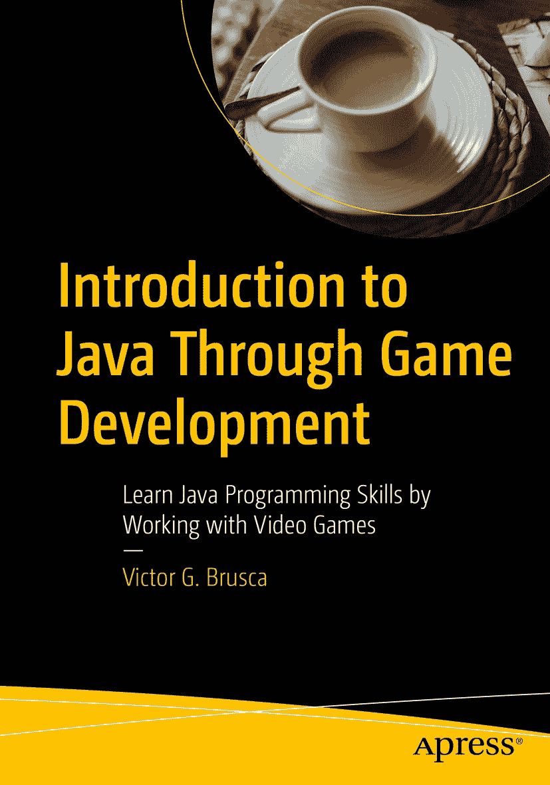

ISBN 978-1-4842-8950-1 e-ISBN 978-1-4842-8951-8 [`doi.org/10.1007/978-1-4842-8951-8`](https://doi.org/10.1007/978-1-4842-8951-8) © Victor G. Brusca 2023 标准 Apress 版本。本书中可能出现商标名称、标识和图片。为避免在每个商标名称、标识或图片出现时都使用商标符号，我们仅在编辑风格下使用这些名称、标识和图片，以维护商标所有者的利益，且无意侵犯商标权。本出版物中使用的商品名称、商标、服务标志及类似术语，即使未明确标识，也不应被视为对其是否受专有权利保护的立场表达。出版商、作者和编辑可合理假定，本书中的建议和信息在出版之日是真实准确的。出版商、作者或编辑均不对本书所含材料或可能存在的任何错误或遗漏提供明示或暗示的担保。出版商对已出版地图中的管辖权主张及机构归属保持中立。

本 Apress 印记由注册公司 APress Media, LLC（斯普林格自然集团的一部分）出版。

注册公司地址为：美国纽约州纽约市新广场 1 号，邮编 10004。

*谨以此书献给我的父母、吉米叔叔和蒂安蒂。我深爱着你们。*

引言

在本书《通过游戏开发学习 Java》中，你将通过详细学习 Java 编程语言的基础知识，包括数据结构与面向对象编程（OOP），并通过贯穿全文的编程挑战来巩固所学。立即下载本书的项目和源代码开始学习吧： [`http://github.com/apress/introduction-to-java-through-gamedev/`](http://github.com/apress/introduction-to-java-through-gamedev/) 通过使用相关的游戏项目以及针对特定主题的编程挑战，你将获得使用 Java 编程语言、NetBeans IDE、一个 2D 游戏引擎以及三款不同 2D 游戏的实践经验与知识！这本入门教材将为你打下坚实的 Java 和视频游戏编程基础，供你后续发展。

关于作者

