# 1. 引言

在本书《通过游戏开发学习 Java》中，你将通过动手实践游戏开发任务来学习 Java 编程语言的基础知识。通过完成针对文本中三款游戏特定方面的主题编程挑战，你将获得使用 Java 编程语言、NetBeans IDE、一个 2D 游戏引擎以及三款不同 2D 游戏的实践经验与知识。闲话少叙，请允许我提供一些关于本书的详细信息，首先从本书的结构和约定开始。

## 关于本书

本书将引导你学习 Java 编程语言的基础知识及部分高级主题。随着我们深入不同主题，你将面临挑战，需要修改、修复、编写和/或调试本书附带的三款游戏之一的副本：

*   Pong 克隆版

*   记忆配对

*   地牢陷阱

每款游戏均使用本书附带的一个专有 2D 游戏引擎编写。该引擎是开源的，如果你想查看相关代码，可以在此处访问：

`github.com/apress/intro-java-through-game-dev`

与此游戏项目相关的源代码可在同一仓库中找到。

每个项目都包含一个功能完整的游戏版本，附带完整源代码以及编程挑战。随着你阅读本书的深入，你将获得一些挑战，这些挑战要求你将特定的 Java 编程语言知识应用于当前游戏项目。每个章节的挑战都预先配置了特定的游戏项目副本。

一般来说，本书不要求你长时间连接互联网，除了下载本书及其相关代码和程序之外。你只需要少量的计算资源即可运行相关软件和游戏。你的计算机应至少满足以下最低配置要求：

*   双核 CPU

*   4GB 系统内存

*   2GB 存储空间

任何相对现代的计算机都能轻松应对这些工作负载。在使用任何现代编程语言时，都必须决定如何用该语言进行编码。通常，你可以仅使用记事本和几个命令行工具来编写和构建程序。然而，在我们的案例中，我们希望使用更高级的工具，因此我们需要使用 IDE。

IDE 是集成开发环境，它是一个相当复杂的程序，其任务是简化软件开发人员的某些工作，使他们能够承担更大的项目并专注于手头的编码工作。游戏是复杂的程序，通常包含许多动态部件。因此，使用 IDE 将使我们受益匪浅，所以我们选择了 NetBeans IDE。

本书中的每个示例游戏都是为一个简单的 Java 2D 游戏引擎编写的。通过完成本书中的编程挑战所获得的经验，将极大地帮助读者打下坚实基础，从而能够使用附带的游戏引擎在 Java 中创建自己的 2D 游戏。

## 关于格式说明

全书采用一些一致的格式模式，我想在此说明。首先，每章都遵循相似的大致结构，如下所示：

*   章节引言
    *   主题 #1

    *   主题 #2

    *   挑战描述

    *   挑战解决方案

*   章节结论

“主题”和“挑战”部分会根据需要重复，以涵盖章节的所有主题，其结构有时会略有变化。但总体而言，每章的结构都接近上述大纲。除了文本内容外，每章都会在相关游戏项目中为本章的每个挑战创建一个命名空间条目。

更多细节将在后续说明。目前，主要要点是每个挑战都会有一个小型的游戏沙盒副本供你操作，以及一个已完成的示例供你参考。代码挑战本身的结构已在章节大纲中呈现，但无论如何，在继续之前，让我们先稍微讨论一下它们。

*   挑战描述

*   挑战解决方案

上文列出了本书中编程挑战的一般结构。挑战将附带详细描述，如果提供线索，也会一并给出。当然，章节和章节标题会有所变化。挑战本身旨在应用当前编程语言主题中学到的知识。挑战可能各不相同，但始终是使用当前 Java 编程语言主题的小型开发任务。

每个挑战部分之后，都会对正确的解决方法进行解释，包括截图或其他资源来演示正确的功能。我们还会明确指出在哪里可以找到已完成挑战的代码，这样你就不必担心不理解某个问题是如何解决的。

以上总结了本书章节和挑战部分的一般结构。本书的整体节奏从 Java 编程语言的基础方面开始，逐步深入到更高级的主题和语言特性。


## 关于格式的说明

在深入阅读正文之前，我们还需要讨论一下文中使用的几种格式。首先是项目列表：

*   项目 1

*   项目 2

*   项目 3

大多数情况下，这些列表会直接嵌入正文中，不会附带任何特殊的标题或说明文字。在极少数情况下，如果列表具有某种特殊意义，它可能会像代码和图片一样，拥有自己的标题和说明文字。文中的代码片段将采用以下格式呈现，并带有标题和说明：

```
1 int test = 0;
代码清单 1-1
代码列表示例 – SomeClass.java
```

来自 SomeClass.java 文件的示例代码清单的说明文字。

关于代码片段所展示内容的信息，可以在标题文字、说明文字或与代码片段相关的上下文中找到。代码片段中的行号是相对于代码起始行的，并非绝对行号。代码的起始行由正文的上下文、当前示例所处理的内容决定，并且始终从第 1 行开始，除非代码被分割到多个代码清单中。图片的呈现方式与此类似，如下所示。

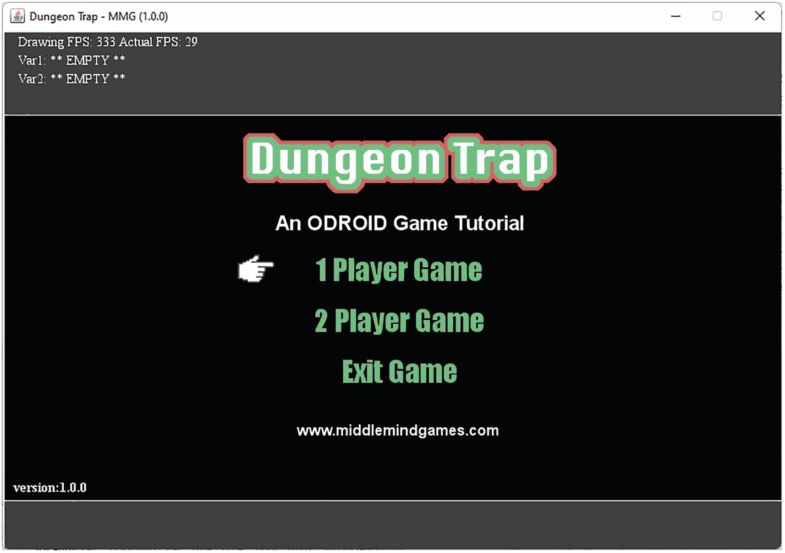

一个地牢陷阱 MMG 文件的用户界面，包含游戏教程、玩家游戏 1、玩家游戏 2 和退出游戏选项。

图片 1-1

截图 – 地牢陷阱主菜单

地牢陷阱游戏主菜单的截图。

最后，文中还会出现一些提示或旁注。正文中有两种类型的旁注：关于游戏开发的注释和关于 Java 编程语言的注释。这些条目的格式如下：

***游戏开发注释：关于 Java 游戏开发或游戏引擎使用的注释。*

***Java 编程注释：关于 Java 编程的详细注释。*

这种列表类型将用于呈现与游戏开发或 Java 编程语言相关的主题的扩展或高级信息。

## 目标

本书希望达成几个目标。首先是全面回顾并演示 Java 编程语言的基础特性。其次是介绍 Java 编程语言中精选的高级特性。最后，本书旨在让你通过使用 NetBeans IDE 和一组附带的视频游戏项目，获得直接处理游戏代码的经验。让我们更详细地看看这些目标。

### Java 基础主题

本书涵盖的 Java 编程语言基础主题及其简要描述如下：

*   概述：计算机编程：计算机编程的简要概述
*   Java 编程语言：Java 编程语言的简史
*   概述 `–` 游戏编程：游戏编程的简要概述
*   基本数据类型：Java 中的基本数据类型
*   高级数据类型：Java 中的高级自定义数据类型
*   枚举：Java 中的枚举数据类型
*   使用变量：处理变量
*   数值表达式：处理数值表达式
*   布尔表达式：处理布尔表达式
*   If、Else、Else-If 语句：流程控制，if-else 语句
*   Switch 语句：流程控制，Switch 语句
*   使用数组：在 Java 中使用数组
*   基本 For 循环：处理 for 循环
*   While 循环：处理 while 循环
*   导入类/库：使用 Java 类和库

本书将为你打下坚实的基础，让你获得处理 Java 编程语言基础方面的经验。在下一节中，我们将介绍本书涉及的高级 Java 编程主题。

### Java 高级主题

本书确实涉及了一些更高级的 Java 编程主题，但不会深入探讨非常高级的编程。你可能会发现这些主题更具挑战性，因为它们本质上更复杂。我们将为你提供扎实的信息和挑战，以帮助你掌握这些内容。本书涉及的高级主题如下：

*   自定义数据类型：使用类和枚举
*   Try-Catch 语句：使用 try-catch 语句控制流程
*   数据结构列表：使用 List 数据结构的简单示例
*   数据结构字典：使用 Dictionary 数据结构的简单示例
*   泛型与特化数据结构：泛型与特化数据结构的简要介绍
*   For-Each 循环：使用 for-each 循环
*   概述 `–` 面向对象编程：面向对象编程设计与实现的简要介绍
*   类：类的简要介绍
*   字段：使用类字段
*   方法：使用类方法
*   构造器：使用类构造器
*   静态成员：处理静态类成员
*   类访问：关于类成员访问的讨论要点
*   类设计：关于类设计与实现的讨论要点
*   封装：Java 游戏项目中的封装示例
*   多态：Java 游戏项目中使用多态的示例
*   继承：继承的简要回顾
*   项目结构：项目结构的简要回顾
*   调试：使用调试追踪程序错误和问题。

Java 编程高级主题通常会导致大量需要回顾和讨论的材料。这超出了本书的范围，因此我们将与高级编程主题相关的讨论和挑战保持简短，以便能够涵盖尽可能多的主题和材料。

### 游戏开发主题

由于本书的入门性质，我们不会直接涵盖游戏开发主题，但书中的每个挑战都侧重于将你学到的 Java 编程语言知识应用于实际的视频游戏，因此你将获得一些关于以下游戏开发主题的知识和接触：

*   项目结构：处理三个不同游戏及其类和项目结构的经验。
*   游戏资源：处理游戏资源的经验。
*   游戏引擎：本书附带了一个完整的游戏引擎，所有示例游戏都使用它。
*   主游戏循环：处理并理解主游戏循环重要性的经验。

至此，本节内容结束。我们快速概述了本书将涵盖的不同主题，这些主题既通过主题和挑战直接涉及，也通过处理更大更复杂项目的一部分间接涉及。在下一节中，我们将设置你的开发环境，并获取本书代码的最新副本。


## 搭建开发环境

在本节中，我们将启动并运行您的开发环境，以便您能对附带的游戏项目进行简单测试，并观察其运行效果。这将让您对这些项目有一个初步了解。首先，我们需要安装并配置好 IDE。本书使用 NetBeans IDE 进行 Java 项目管理和开发。

首先，我们需要安装一份 Java 开发工具包（JDK）。您可以从 [`www.oracle.com/java/technologies/downloads/`](http://www.oracle.com/java/technologies/downloads/) 网站下载 Oracle JDK 的各个版本。下载某些版本的开发工具包可能需要您拥有一个账户。如果您已经安装了 JDK，那也没问题；不过，建议您安装并使用与附带游戏项目编码时所用版本一致的 JDK 进行开发和操作。

在撰写本文时，Java SE 18 是 JDK 的最新版本。附带的项目是基于 Java SE 11 LTS 编写的。我建议您在处理附带游戏项目时使用 Java SE 11 LTS，但您也可以尝试使用您喜欢的任何 Java 版本，如果遇到问题，再回退到 Java SE 11 LTS。您可以在此处找到 Java 11 JDK：

[`www.oracle.com/java/technologies/downloads/#java11`](http://www.oracle.com/java/technologies/downloads/%2523java11)

我们先安装 JDK，然后再安装 NetBeans IDE。我使用的是 Windows 电脑，因此下载了与我的硬件对应的 JDK。双击您刚刚下载的 JDK 11 安装程序。安装过程应该非常简单。如果在安装过程中遇到任何问题，请使用以下网址进行故障排除。

[`https://docs.oracle.com/en/java/javase/11/install/installation-jdk-microsoft-windows-platforms.html`](https://docs.oracle.com/en/java/javase/11/install/installation-jdk-microsoft-windows-platforms.html)

JDK 安装完成后，我们将继续设置 NetBeans IDE 和附带的游戏项目。在您常用的浏览器中导航至 [`https://netbeans.apache.org`](https://netbeans.apache.org) 网站，并下载最新的 LTS 版本。在撰写本文时，NetBeans IDE 的下载链接位于网站主页上。点击该链接，然后找到适用于您电脑操作系统的 IDE 最新 LTS 版本。该过程如图 1-2 至 1-5 所示。

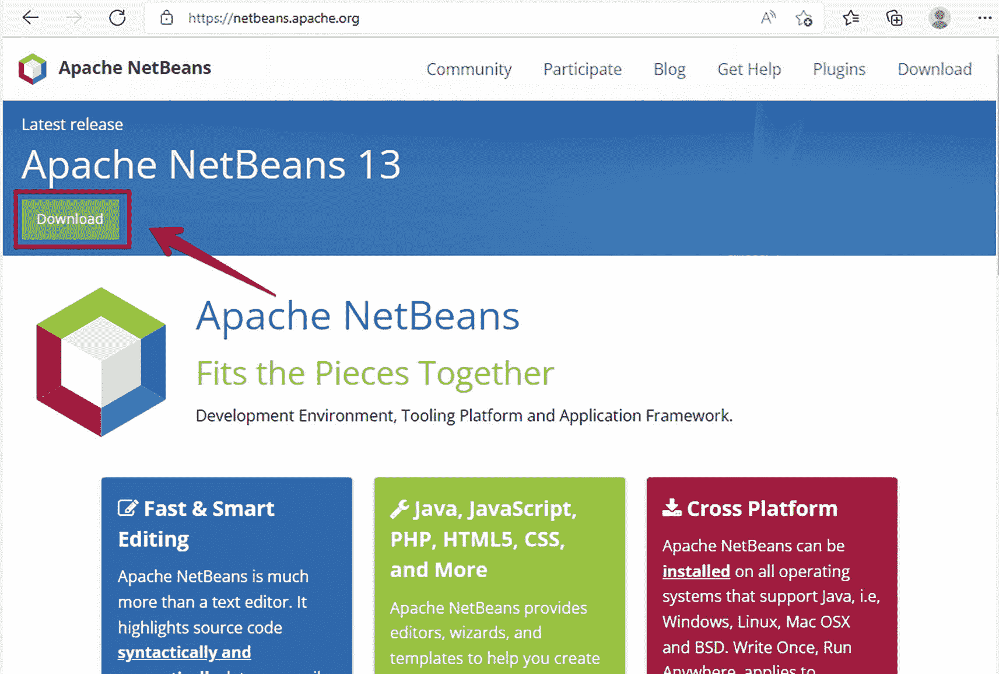

一个打开的 Apache NetBeans 网站的用户界面，其中有一个箭头指向下载选项，并展示了三个主要特点：快速编辑、编程语言和跨平台。

图 1-2

截图 – NetBeans IDE 下载 1

一张展示撰写本文时 NetBeans IDE 下载链接的截图。

找到适用于您操作系统的安装二进制文件。我使用的是 64 位 Windows 机器，因此我将选择相应的安装二进制文件，如下图所示。

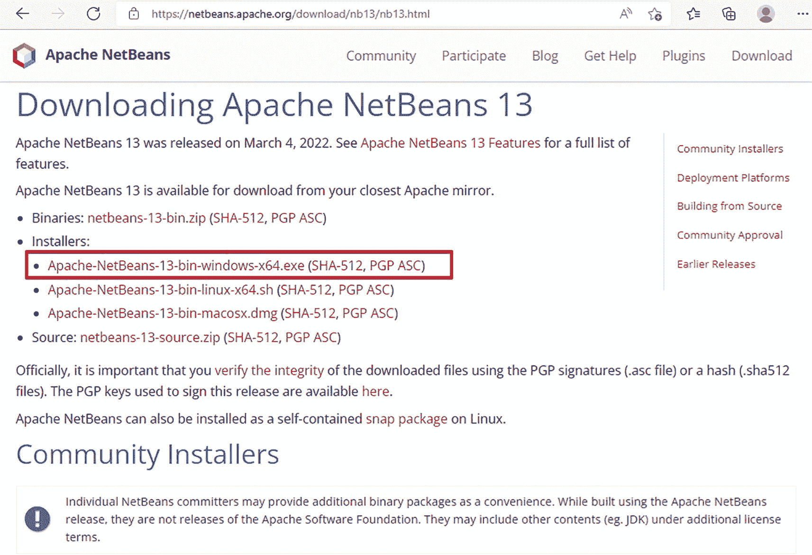

一个 Apache NetBeans 网站的用户界面，其中有一个红色矩形框内包含 Apache NetBeans 13 的 64 位 Windows 版本下载选项，并提供了社区安装程序。

图 1-3

截图 – NetBeans IDE 下载 2

请务必选择适合您计算机架构和操作系统的安装程序。

打开您为目标开发计算机下载的 NetBeans IDE 安装程序。您应该会看到类似于图 1-4 所示的界面。

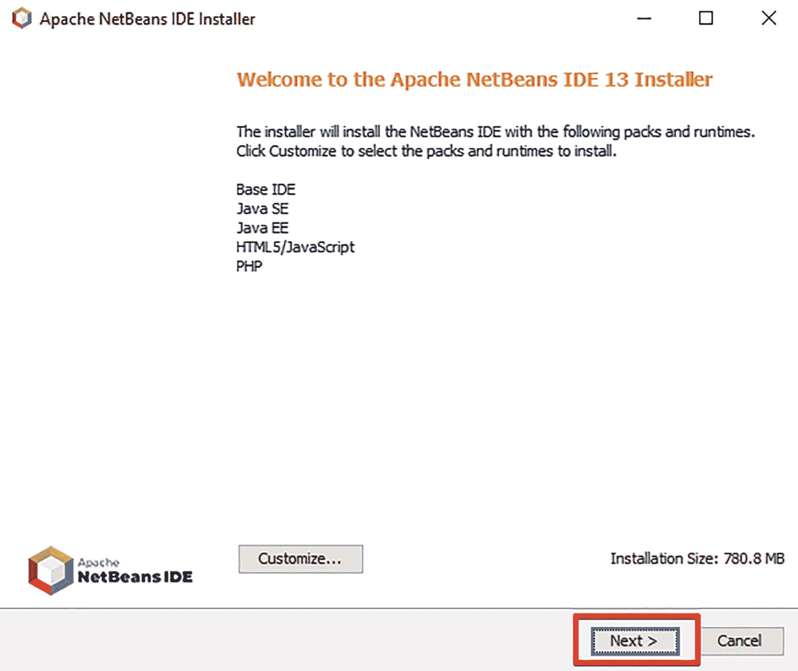

一个打开的 Apache NetBeans IDE 安装程序窗口的用户界面，包含欢迎、自定义选项，以及一个带有“下一步”选项的矩形框，底部有“取消”选项。

图 1-4

截图 – NetBeans IDE 安装 1

Apache NetBeans IDE 13 主安装界面。

我们将专门使用 Java，因此可以接受默认的安装选项。您可以根据需要调整设置，但我们建议您直接按照默认安装选项进行。在点击安装按钮之前，请确保选中“检查更新”复选框（图 1-5）。

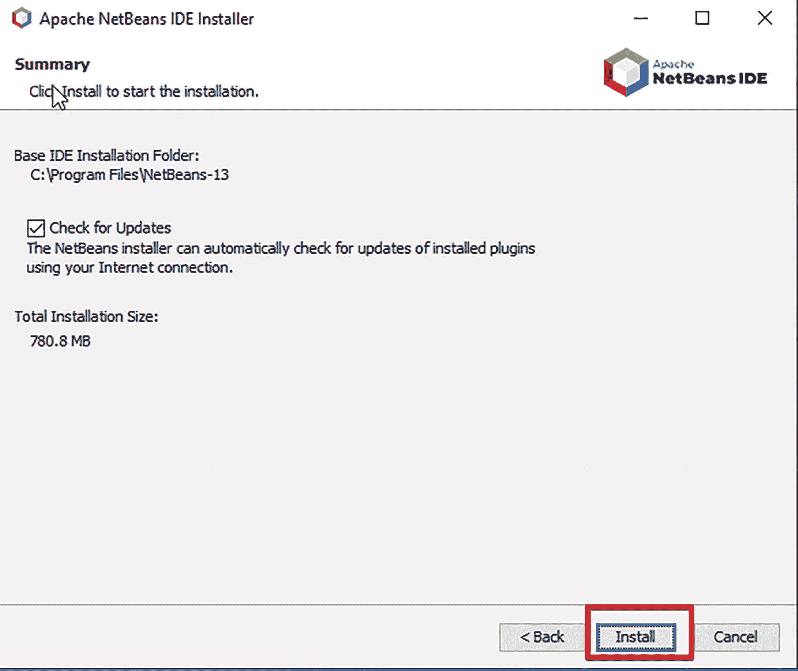

一个 Apache NetBeans IDE 安装程序的用户界面，显示安装应用程序的摘要，并在底部的矩形框中突出显示了“安装”选项。

图 1-5

截图 – NetBeans IDE 安装 2

Apache NetBeans IDE 13 安装过程，即将开始安装。请确保勾选检查更新选项。

安装完成后，打开 NetBeans 并按照任何软件更新提示进行操作。在下一节中，我们将安装并配置本书附带的游戏项目。


### 获取游戏项目设置

现在你已经正确安装了 JDK 和 NetBeans IDE，接下来需要下载与本书配套的项目副本。你可以通过以下网址下载：[`github.com/apress/intro-java-through-game-dev`](http://github.com/apress/intro-java-through-game-dev)。下载项目 ZIP 文件，并将其解压到你计划存放 NetBeans 项目的目录中。完成此步骤后，打开 NetBeans IDE，选择“文件” ➤ “打开项目”。导航到你解压项目代码的目录。这里有三个项目需要你打开并配置，分别对应本书中将要使用的三个游戏。找到并打开以下项目：

*   Pong Clone

*   Memory Match

*   Dungeon Trap

你应该会看到类似图片 1-6 的画面。

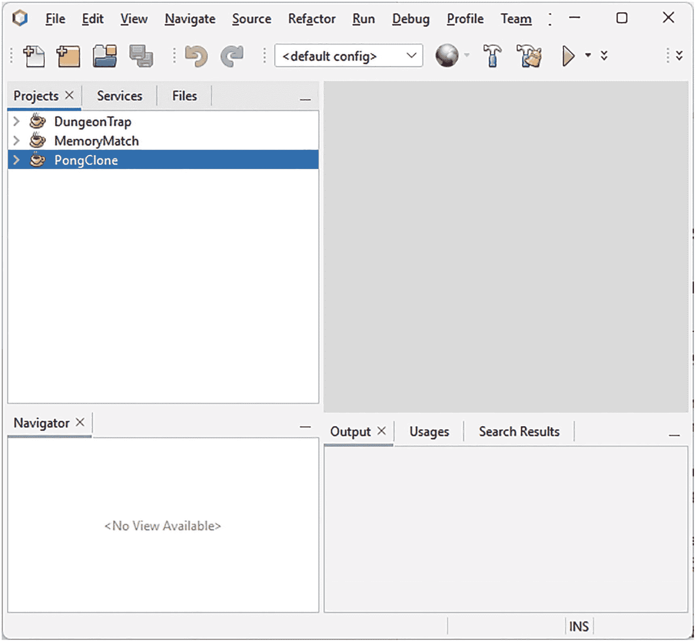

一个计算机窗口的用户界面，包含一个菜单栏和四个面板：项目、导航器、输出以及一个空面板。

图片 1-6

截图 – NetBeans IDE 已打开的项目

NetBeans IDE 的截图，显示了已打开的游戏项目。

现在项目已加载，我们需要对其进行配置。首先要检查每个项目是否设置了正确的 JDK 和构建目录。为此，右键点击每个项目并选择“属性”。我们先检查“打包”配置。在属性对话框左侧选择“构建”选项下的“打包”条目（图片 1-7）。

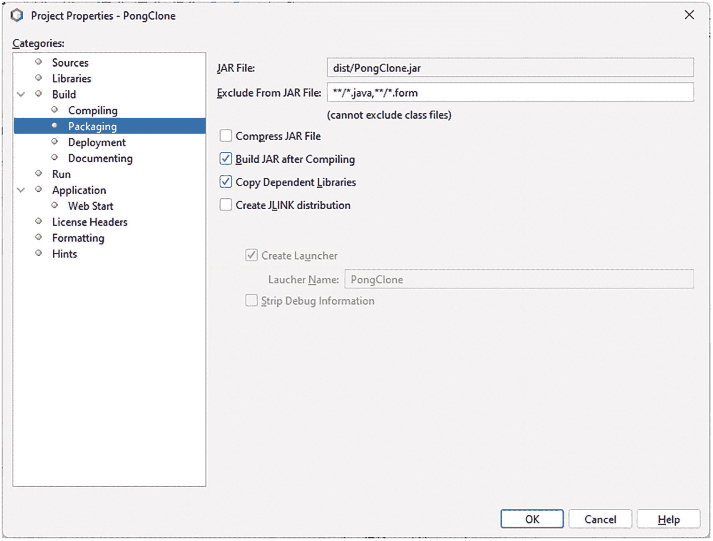

一个项目属性（Pong Clone）的用户界面，包含源、库、构建，其中编译、打包包括 JAR 文件、从 JAR 文件中排除、编译选项。

图片 1-7

截图 – NetBeans IDE 打包属性

Pong Clone 项目打包属性的截图。

对于此属性，我们只需检查“JAR 文件”路径是否包含“./dist/”目录。接下来，从“类别”列表中选择“运行”选项。请记住，我们需要对每个游戏项目都进行检查（图片 1-8）。

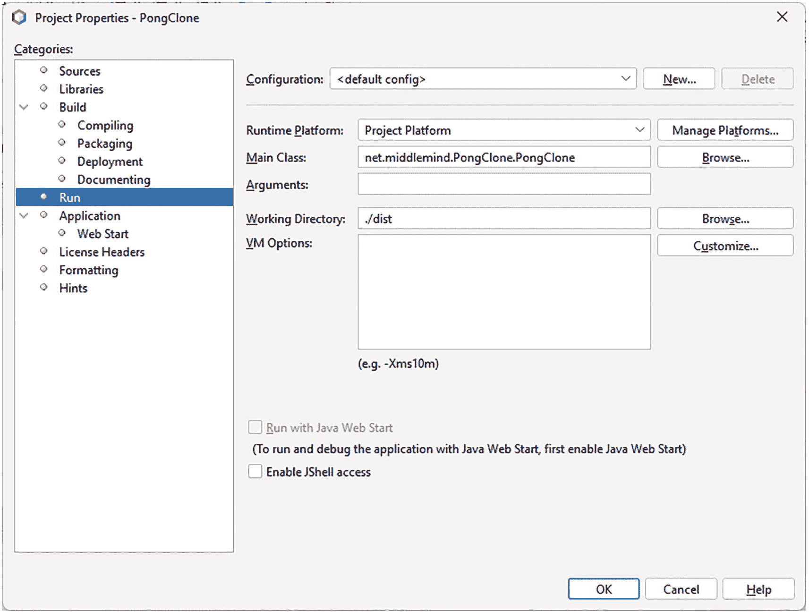

一个项目属性的用户界面，包含类别：源、库、构建，以及应用程序和配置、运行时平台、主类、参数、工作目录和 VM 选项。

图片 1-8

截图 – NetBeans IDE 运行属性

显示 Pong Clone 项目运行属性的截图。

对于此项目属性，我们需要确保“工作目录”设置为项目 JAR 文件将要构建的目录。默认情况下，这是“./dist”目录。最后，选择“类别”列表中的“源”条目（图片 1-9）。

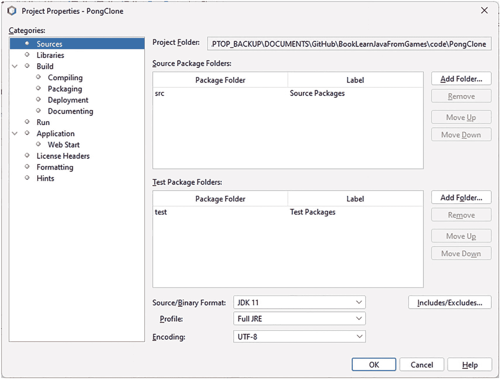

一个项目属性（Pong Clone）的用户界面，包含类别：源、库、构建和应用程序。右侧是项目文件夹、源包文件夹、文本包文件夹、源和配置文件。

图片 1-9

截图 – NetBeans IDE 源属性

显示源项目设置并选择了 JDK 11 的截图。

“源/二进制格式”字段应设置为“JDK 11”。如果你打算尝试针对不同的 JDK 运行游戏，可以在此处更改项目设置。再次强调，请确保对每个游戏项目都执行这些项目设置检查。在运行游戏之前，最后需要做的是确保项目库已正确映射。为此，在项目属性对话框的“类别”列表中选择“库”选项（图片 1-10）。

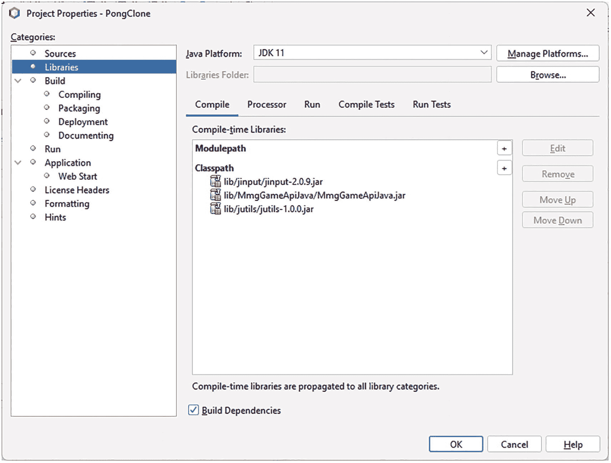

一个项目属性（Pong Clone）的用户界面，包含类别：库，其中包括 Java 平台、编译、处理器、运行、编译测试和运行测试。

图片 1-10

截图 – NetBeans IDE 库属性

显示项目设置中库类别的截图，其中三个库已正确配置。

每个游戏项目都应配置相同的三个库。我在此列出它们：

*   jinput: ./lib/jinput/jinput-2.0.9.jar

*   jutils: ./lib/jutils/jutils-1.0.0.jar

*   MmgGameApiJava: ./lib/MmgGameApiJava.jar

要添加库，请选择“类路径”标签旁边的“+”按钮，然后找到前面列出的 JAR 文件。每个游戏都有自己的本地“lib”文件夹，其中包含所需 JAR 文件的副本。库正确映射后，我们就可以进入有趣的部分，测试不同的游戏了。如果项目属性对话框仍处于打开状态，请关闭它，然后右键点击第一个游戏项目 Dungeon Trap；从上下文菜单中选择“清理并构建”。观察项目构建过程，确保其无错误完成。对剩余的两个游戏项目也执行清理并构建过程。确保每个项目都能无错误地构建。

## 试玩游戏

现在，让我们花点时间运行每个游戏项目，并稍微玩一下。如果你展开每个项目，并在项目树中展开源代码条目，你会看到每个项目都有一个主命名空间。主要项目命名空间如下：

*   net.middlemind.DungeonTrap

*   net.middlemind.PongClone

*   net.middlemind.MemoryMatch

每个项目的主命名空间中包含了驱动最终版本游戏的所有 Java 类。对于每个命名空间，都会有一个主文件作为程序的静态入口点。这个 Java 类将与项目同名。主要项目文件如下：

*   DungeonTrap.java

*   PongClone.java

*   MemoryMatch.java

你会注意到一些命名空间，名称类似于“PongClone_Chapter1_Challenge1”。这些是用于处理本书中不同挑战的沙盒环境。我们可以暂时忽略这些命名空间。对于每个游戏项目，右键点击主文件并选择“运行”选项。你应该会看到每个游戏对应的主菜单（图片 1-11）。

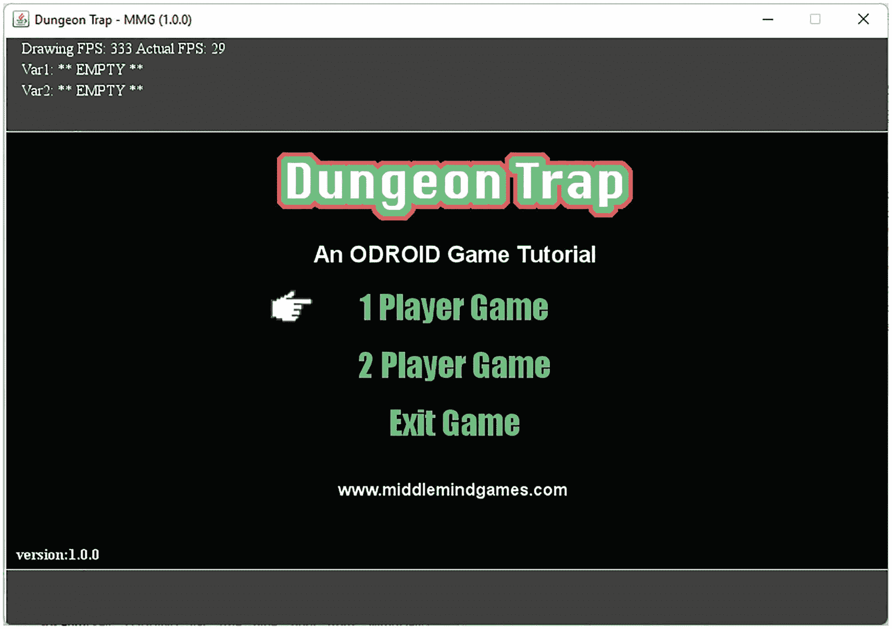

一个 Dungeon Trap MMG 文件的用户界面，其中黑屏显示游戏教程和玩家游戏 1、玩家游戏 2 以及退出游戏选项，并带有一个手形符号。

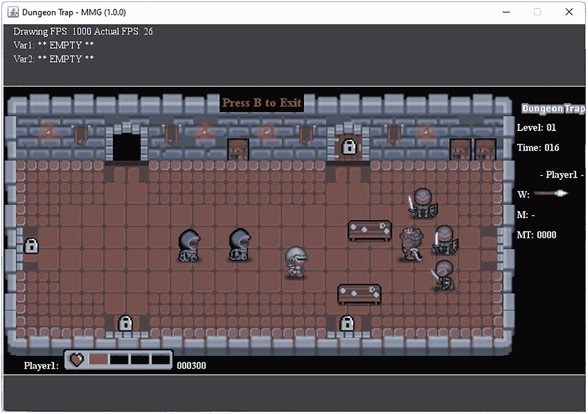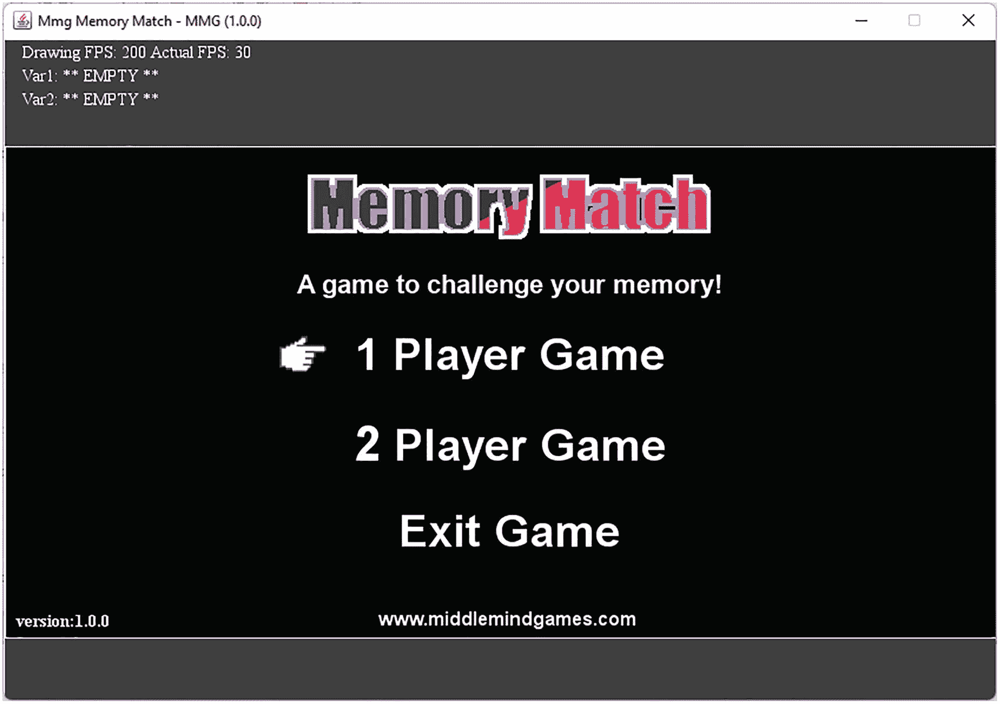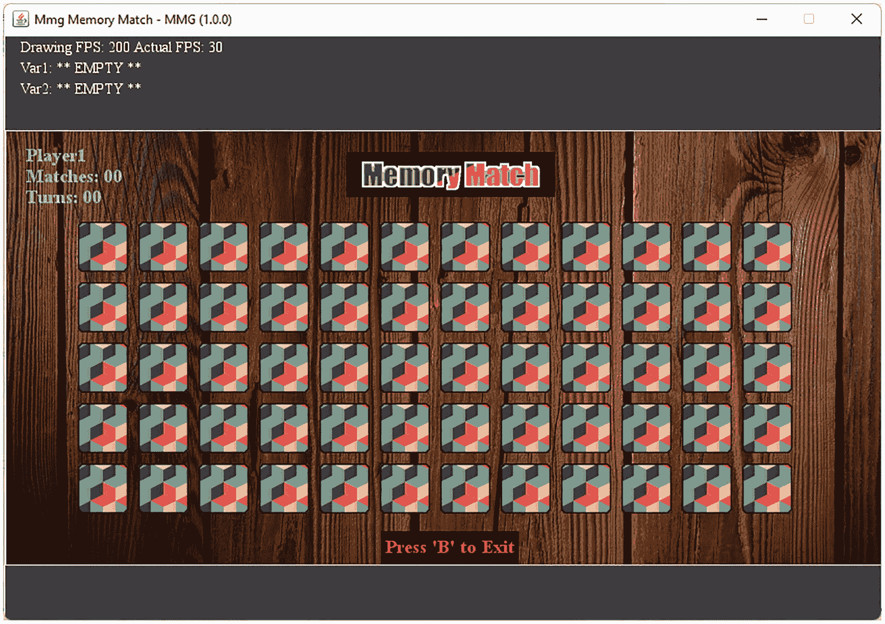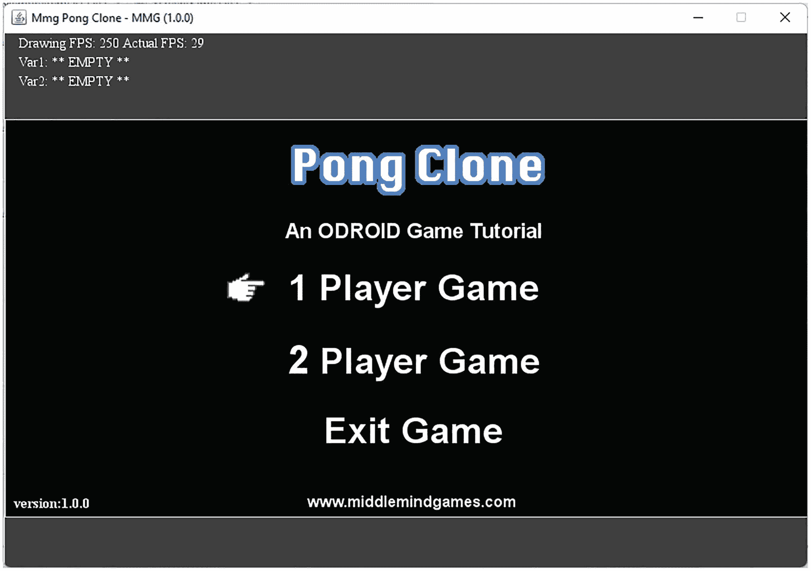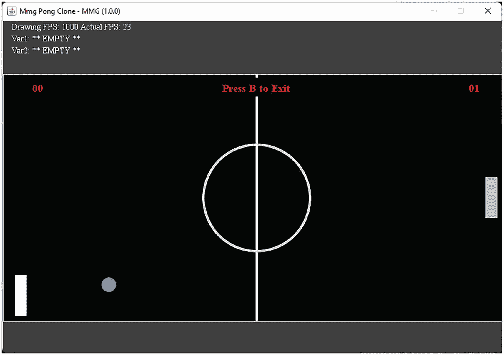

图片 1-11

截图 – NetBeans IDE 游戏演示

一系列截图，展示了本书附带的每个示例游戏的主菜单。

游戏演示部分到此结束。希望你喜欢这些小游戏，并期待开始学习 Java 编程语言以及尝试一些编码挑战！

## 结论

作为本章的总结，我想指出我们刚才完成的事情相当了不起。我们在短短几秒钟内从零起步，完成了安装 JDK、安装 IDE，然后下载、配置并运行了三个游戏项目。这就是 Java 强大能力的一个例证。当你接受旨在应用 Java 编程语言知识的不同编码挑战时，你一定会看到更多这样的例子。现在，让我们花点时间回顾一下本章的内容。


### 本章内容回顾

在这简短的开篇章节中，我们涵盖了相当多的内容：

*   **涵盖的基础 Java 主题**：我们列出并描述了将在全书中涵盖的基础主题。
*   **涵盖的高级 Java 主题**：我们同样列出并描述了将在本书中涵盖的高级主题。
*   **JDK**：我们了解了 Java 开发工具包，以及本书相关游戏项目所使用的目标 JDK 11 LTS。我们还了解到 NetBeans IDE 可能使用其自带的 JRE，这与 JDK 11 中包含的 JRE 不同。
*   **IDE**：我们了解了 NetBeans IDE，并下载和安装了它。
*   **配置游戏项目**：我们深入探讨了 Java 游戏开发的世界，并准备了三个游戏项目，以便在我们的开发环境中使用。
*   **游戏，游戏，还是游戏**：我们构建并演示了三个复杂度各异的游戏项目，作为对本书后续将涉及的游戏的一个介绍。

至此，引言章节就结束了。在下一章中，我们将开始 Java 编程学习之旅，首先概述“编程”计算机的含义，然后简要介绍 Java 编程语言的历史以及其他一些有趣的话题。

