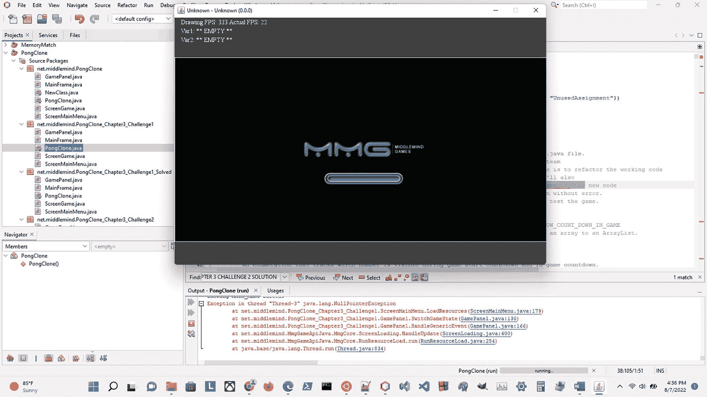
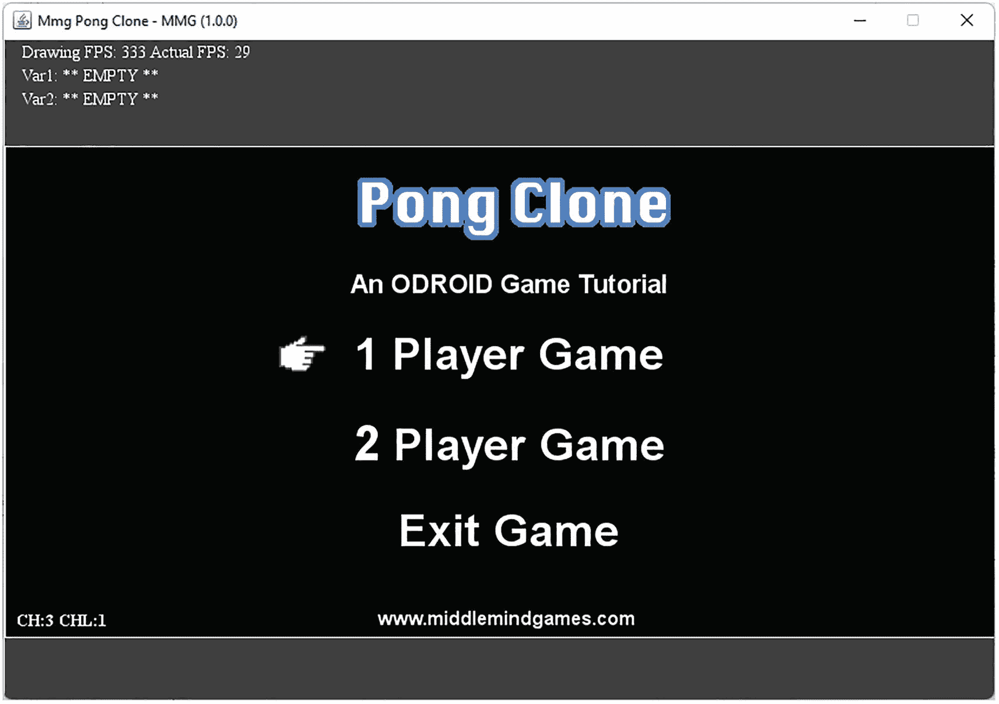
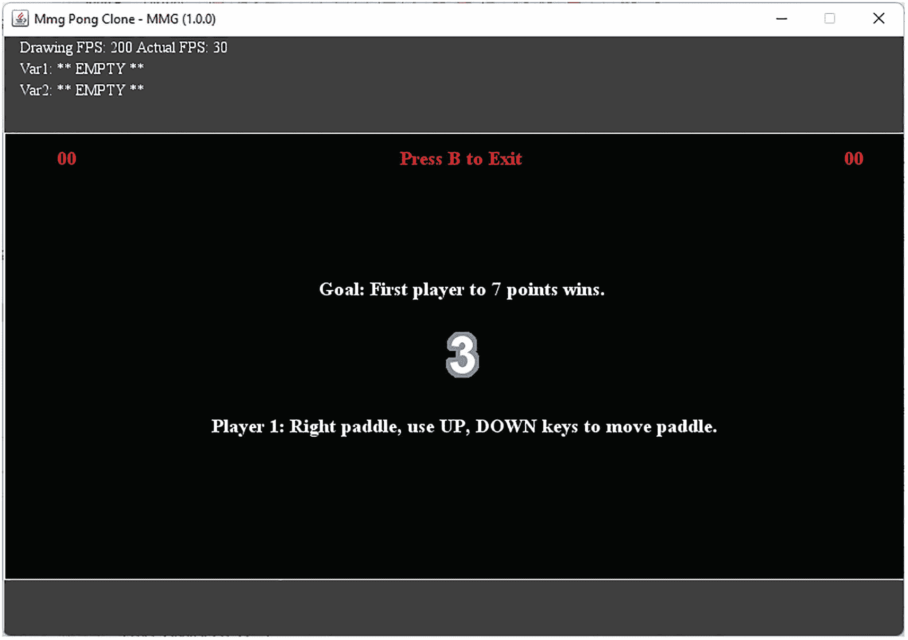

# 3. 变量

我们学习 Java 编程语言的第一次尝试将是探索变量！变量对任何程序都至关重要，事实上，没有变量的支持，任何有用的程序都无法存在，它们种类繁多。变量代表数据，通常用于在整个程序或方法中跟踪某个值。有时，变量被用作指示器或标志，用于标记何时遇到了重要的数据或事件。在 Java 程序中，变量有许多不同的用途，当你使用 Java 解决不同问题时，都会遇到它们。

在本章中，我们将回顾变量的几个不同方面，包括声明变量和为其赋值。我们将获得一些使用 `Object` 数据类型变量的经验。在本书后面介绍 Java 的类这一方面之前，我们不会深入讨论类的细节，因此有些内容你暂时需要先接受。让我们来看看变量在 Java 编程语言中是如何工作的。

## 数据类型

什么是数据类型？回想一下我们之前关于编程语言和 Java 的讨论。我们指出 Java 是一种强类型语言，这意味着 Java “关心”每个变量的类型，并且不允许我们随意更改变量的类型，或者将不兼容类型的值赋给该变量。

这是一种非常复杂的说法，简单来说就是：一个给定的变量只能保存一种类型的数据。现在，即使我这么说，Java 也有一些特性允许你拥有动态类型的变量，这些变量可以接受不同类型的数据，有点像 JavaScript 中变量的工作方式。一旦你理解了静态类型变量是如何工作的，你就可以轻松地开始使用 `var` 关键字处理动态类型变量。我们将在高级部分介绍它们。

但是，什么是数据类型呢？嗯，这是一个更难回答的问题。数据类型就是具有特定特征的数据。在我们的例子中，我们讨论的数据可以是像账号这样的单个值，也可以是使用不同数据类型保存多条信息的复杂对象。你还可以使用数组数据类型定义一系列值。我们将从查看 Java 编程语言的基本数据类型开始。


### 基本数据类型

任何 Java 程序的基本构建块之一就是变量。正如我们之前提到的，Java 中的变量是有类型的，因此，有一组数据类型被认为是 Java 编程语言的基本数据类型。

它们之所以被称为“基本”，是因为它们是该语言的基础，而非基于类。它们主要用于表示简单数据，例如数值、总数、总和、单词、名称、描述等。在思考变量时，一个很好的类比是将它们视为网页表单上的输入字段。我们都在网上填写过无数表单。

当你在网页的文本字段中输入姓名时，可以将其视为将你的姓名值赋给一个用于存储该姓名的变量。由于你的姓名是一系列字符（在 Java 中，我们称之为字符串），我们期望使用 `String` 类型的变量来存储这些数据。清单 3-1 展示了如何在 Java 中表达这个变量。

```
1 String name;
清单 3-1
字符串变量示例
```

一个可以存储人名的字符串变量示例。

有了这个概念，让我们来看看 Java 编程语言中可用的不同基本数据类型。

我们还将包含关于每种数据类型的一些信息以及一个变量声明示例。所有这些内容随后都在表 3-1 中展示。

表 3-1

Java 编程语言的基本数据类型

| 名称 | 类型 | 最小值 | 最大值（含） | 示例 |
| --- | --- | --- | --- | --- |
| Boolean | 二进制值，true/false | 不适用（0 或 false） | 不适用（1 或 true） | boolean b; |
| Byte | 8 位整数值 | -128 | 127 | byte b; |
| Short | 16 位整数值 | -32,768 | 32,767 | short s; |
| `int` | 32 位整数值 | `-`2 E 31 | 2 E 31 – `1` | int i; |
| long | 64 位整数值 | `-`2 E 63 | 2 E 63 – `1` | long l; |
| float | 符合 IEEE 754 32 位精度的实数 | 1.4 E -45 | 3.4028235 E 38 | float f; |
| double | 符合 IEEE 754 64 位精度的实数 | 4.9 E -324 | 1.7976931348623157 E 308 | double d; |
| char | 单个 Unicode 字符 | ‘\u0000’ (0) | ‘\uffff’ (65,535) | char c; |
| String | 一系列 Unicode 字符 | 0（空字符串） | 给定系统上 JRE 支持的最大字符串长度或 2147483647 个字符 | String s; |

*Java 编程语言中的基本数据类型集合。*

不要让这张数据表吓到你。这里其实并没有太多复杂的东西。把它们看作是在程序中描述数据的基本工具。有些你会比其他用得更频繁。有时，很多类型看起来都是不错的选择。你需要积累一些用 Java 解决问题的经验，才能快速、自信地决定变量应该使用哪种数据类型。即便如此，有时也很难抉择。总的来说，我建议使用能够支持你期望存储在给定变量中的数据，并且不多不少刚刚好的数据类型。

例如，如果你要存储银行账户余额，使用 `float` 可能就足够了。很少有人能拥有需要 `double` 数据类型才能表示的财富。让我们通过一个通用的思考过程来确定使用哪种数据类型。你需要小数级别的精度吗？如果不需要，那么可以忽略 `float` 和 `double`。如果你不是要存储字符或字符串，那么可以忽略 `char` 和 `string` 数据类型。这样就剩下 `byte`、`short`、`int` 和 `long`。

很可能 `long` 太大了，我们很少需要处理这么大的数字。`Byte` 非常小。只有在处理二进制数据时才需要使用 `byte`；在大多数情况下，`short` 和 `int` 就足够了。然而，`short` 的最大值较小，这有点限制性。它不够大，以至于在数值上很容易被超出。

这会使我们陷入尴尬的境地，因为我们的变量将无法正常工作。它将无法跟踪超出 `short` 范围的数字。在这个小小的思维实验中，我们很可能会决定使用 `int`。如果你有理由选择另一种基本数据类型，那么在权衡使用该数据类型的因素时，你就会得出那个结论，就像我们在这里所做的一样。

当你想要跟踪某件事是否发生时，`Boolean` 数据类型就派上用场了。在程序中（包括视频游戏），有很多情况你会将布尔变量设置为 `true` 或 `false`，以指示某种情况、值、状态等的存在。这些变量的使用很突出，因为你只需要用一个值来表示变化。如果你可以用一个整数替换该变量，并分别使用 0 和 1 来表示 `false` 和 `true`，那么该变量很可能应该使用 `Boolean` 数据类型。

关于基本变量的介绍，我想讲的就是这些。稍后当我们遇到本章的编程挑战时，我们将获得一些使用它们的经验。让我们来看看如何使用基本数据类型的变量。


### 使用基本数据类型

尽管它们是基本数据类型，但正如我之前提到的，它们是任何 Java 程序的基础。在上一节中，我们了解了如何使用基本数据类型声明变量。我将在代码清单 3-2 中总结基本数据类型在变量声明中的用法。

```
1 boolean b;
2 byte b;
3 short s;
4 int i;
5 long l;
6 float f;
7 double d;
8 char c;
9 String s;
代码清单 3-2
变量声明与基本数据类型
```

一个使用 Java 基本数据类型进行变量声明的示例。在最简单的形式中，变量声明由数据类型关键字后跟变量名组成。

***Java 编程提示：当变量是重要的高级变量时，请花时间为其赋予有意义的名称。对于临时变量，可以使用像上面所示的短名称。*

基本变量声明的模式是数据类型关键字后跟一个有效的变量名。接下来，我们来介绍已声明变量的初始化。请注意，数据必须与数据类型匹配。在相似的数据类型之间允许进行一些类型转换（即转换），但我们不会在此处讨论这个高级主题。让我们看一下代码清单 3-3。

```
01 boolean b;
02 b = true;

04 byte b;
05 b = 0;

07 short s;
08 s = 256;

10 int i;
11 i = -1;

13 long l;
14 l = 32000000;

16 float f;
17 f = 1.3f;

19 double d;
20 d = 2e15;

22 char c;
23 c = ‘c’;

25 String s;
26 s = "some string here";
代码清单 3-3
带初始化的变量声明与基本数据类型
```

一个使用 Java 基本数据类型进行变量声明和初始化的示例。

***Java 编程提示：初始化变量时，最好遵循程序中现有代码所设定的相同范式（如果有的话）。如果程序是新的，则保持变量声明和初始化方法的一致性。*

还有一种更短的声明和初始化形式，称为实例化。通常，这个概念仅适用于对象和类，但基本数据类型的语法类似，因此我粗略地将其称为实例化。代码清单 3-4 展示了所有基本数据类型的实例化示例。

```
1 boolean b = true;
2 byte b = 0;
3 short s = 256;
4 int i = -1;
5 long l = 32000000;
6 float f = 1.3f;
7 double d = 2e15;
8 char c = ‘c’;
9 String s = "some string here";
代码清单 3-4
变量实例化与基本数据类型
```

一个使用 Java 基本数据类型进行变量实例化的示例。

如您所见，在 Java 中使用基本数据类型的变量非常直接。不要被这种简单性所迷惑；它非常强大。仅使用这种类型的变量就能完成很多事情。但我们还需要了解更多的数据类型。Java 是一种功能全面的健壮语言。不过，在此之前，让我们先解决一个编程挑战，以巩固我们刚刚学习的变量和基本数据类型知识。

### 挑战：基本数据类型

欢迎来到您的第一个编程挑战。每个编程挑战都会包含一些介绍或设置，并涉及一个专门配置了给定 Java 编程主题代码挑战的特别版视频游戏。这个游戏副本将存在于一个特殊的包中，该包指示了章节以及该章节中挑战的编号。

包含编程挑战的包之后会有一个包含解决方案的包。我们也会在文本中介绍解决方案，但最好还是查看代码，并积累阅读和解释 Java 语句的经验。以下是您的第一个挑战：

涉及的包：

```
net.middlemind.PongClone_Chapter3_Challenge1
net.middlemind.PongClone_Chapter3_Challenge1_Solved
```

描述：

找到 `net.middlemind.PongClone_Chapter3_Challenge1` 包，并打开 `PongClone.java` 文件。这个版本的游戏在测试后意外引入了一个错误。一次无意的按键操作改变了一个变量值，导致游戏无法运行。您的挑战是找到那个值不正确的变量并修复它。您必须运行此文件 `–` PongClone.java `–` 右键单击并选择“运行文件”来测试游戏。



一张电脑屏幕加载 middle mind 游戏的截图。背景中项目下方列出了不同的 Java 文件。

图 3-1

本挑战游戏的损坏版本

本挑战中使用的游戏副本的截图。它在加载屏幕时崩溃。

线索：

Pong Clone 视频游戏使用一个“游戏引擎配置文件”，这是一个提示，用于数据驱动游戏配置的某些方面。游戏在加载时抛出的空指针异常是由游戏引擎配置错误引起的。

花点时间尝试一下这个挑战。提示：在这种情况下，追踪异常对您没有帮助，因为未加载的资源不会在问题源头处引发异常。这看起来棘手，但可能出奇地简单。在继续阅读解决方案之前，请先尝试一下。请记住，这些挑战发生在它们自己的沙盒中，即一个专用于该挑战的特殊包。

为了运行此包特定版本的游戏，您必须点击包中包含的静态主类，并从上下文菜单中选择“运行文件”。否则，将执行项目的默认游戏。如果您正确解决了挑战，游戏应该能正常运行。


### 挑战解决方案

本挑战的解决方案位于以下包中：

```
net.middlemind.PongClone_Chapter3_Challenge1_Solved
```

具体在 `PongClone.java` 文件中。你可以搜索文本“CHAPTER 3 CHALLENGE 1 SOLUTION”来找到解决方案代码及其解释。我在这里也会简要讨论一下解决方案。在本例中，需要调整的变量名称几乎与挑战描述中给出的“engine config file”完全一致，它变成了“ENGINE_CONFIG_FILE”。单词“file”也给了我们线索，因为在变量声明部分，文件名并不多。

要修正这个问题，你只需调整 `ENGINE_CONFIG_FILE` 变量的值，使其与文件系统中的文件名匹配。在本例中，名称应为“engine_config_mmg_pong_clone.xml”，而不是缺少字母“o”的“engine_config_mmg_png_clone.xml”。这看起来像是一个有点傻的挑战示例，但实际上它有一些有趣的特点。



电脑游戏 MMG 乒乓球克隆版的截图。它显示了一个选项列表，可以选择 1 人或 2 人游戏，或者退出。

图 3-2

本挑战游戏的可用版本

本挑战游戏修复版本的截图。

***游戏编程提示：游戏和游戏引擎通常拥有负责加载不同资源的复杂子系统。花时间了解这些系统通常很重要，这样你才能胜任地处理开发过程中任何相关的错误。*

首先，错误并非直接与解决方案相关。需要具备一些游戏引擎的知识才能理解错误的真正含义。从 JRE 的角度来看，存在一个空值，应该抛出异常。但从电子游戏的角度来看，存在空值是因为某个资源未能加载。要么是缺失的资源未正确指定，要么是它根本不存在。排除不存在的情况，我们面临的是一个由配置驱动的资源加载问题。

这直接将我们引向游戏引擎配置文件，我们需要查看该文件以了解给定游戏存在哪些配置。至此，本节内容结束。在下一节中，我们将介绍一些 Java 更高级的数据类型及其用法。

## 高级数据类型

仅使用基本数据类型就能做很多事情，但 Java 作为开发工具还能为你提供更强大的能力。有一些高级数据类型值得我们关注。这些包括一种动态数据类型，与我们习惯的静态类型相对。甚至还有一些数据类型帮助我们定义数据集，我们也将在此处进行介绍。

### var 关键字与动态类型

尽管我之前对 Java 严谨、强类型的特点大加赞赏，但该语言实际上支持动态类型。Java 10 中引入的 `var` 关键字使用了数据类型推断，它会根据上下文自动检测变量的数据类型。这是 Java 的一个相当高级的用法。我们在此不会深入探讨。Java 编程语言中有许多规则来管理 `var` 关键字的使用。

为简单起见，我将对其用法进行概括和过度简化。如果你愿意进一步探索，可以在此处找到更多信息：

[`www.geeksforgeeks.org/var-keyword-in-java/`](http://www.geeksforgeeks.org/var-keyword-in-java/)

正如我之前所说，`var` 关键字允许你对变量使用动态类型。你可以在少数几个地方声明 `var` 类型的变量，但就我们的目的而言，我们将其使用限制在方法内部。我还应该提到，不支持变量数据类型重定义。这意味着 Java 仅在 `var` 变量首次初始化时检测其数据类型。后续的赋值必须符合首次检测到的数据类型。请允许我通过清单 3-5 中的示例来进一步说明这一点。

```
01 public static void main(String[] args) {
02    //int
03    var x = 100;

05    //double
06    var y = 1.90;

08    //char
09    var z = 'a';

11    //string
12    var p = "tanu";

14    //boolean
15    var q = false;
16 }
清单 3-5
变量实例化与 var 数据类型
```

一个展示 `var` 数据类型与变量实例化一起使用的示例。

我还想花点时间演示一下 `var` 数据类型的不正确用法。在清单 3-6 中，我们将演示重定义 `var` 变量的数据类型，这将导致抛出异常。让我们来看一下。

```
1 //编译器将变量解释为 int 类型
2 var id = 0;

4 //由于数据类型不兼容而抛出错误
5 id = "34";
清单 3-6
变量数据类型重定义与 var 数据类型
```

一个展示 `var` 数据类型与变量数据类型重定义错误的示例。

从示例中可以看出，`var` 关键字有点像未知基本数据类型的占位符，该类型在变量初始化时被推断出来。这听起来很复杂，但如果你思考一下，就会发现它只是以一种迂回的方式使用其他基本数据类型。你让数据驱动变量的数据类型，而不是在声明变量时显式设置它。相当巧妙！

好了，在介绍了关于 `var` 数据类型及其用法的整个部分之后，我很遗憾地通知你，我们不会用这些材料进行挑战。只是我个人不太使用这个特性，而且我更喜欢传统数据类型提供的更严格的变量处理方式。在下一节中，我们将介绍另一种高级数据类型以及我们的第一个“数据结构”：数组。


### 数组

到目前为止，我们一直在使用用于跟踪单个值的变量，并且主要使用的是基本数据类型。在问题解决中，一个常见的概念是数据集。任何一系列测试都会产生一系列分数。在这种情况下，为每一个值都命名并定义一个新变量会变得非常繁琐。

让我用另一个例子来进一步说明这个概念：一个班级里一组学生的测试结果。在这种情况下，我们需要跟踪两组数据：学生和测试结果。现在，利用我们目前掌握的 Java 编程语言知识，我们可以为每个学生添加一个新变量，并为每个学生的测试结果添加一个变量。

这样做是可行的，但很快就会导致程序难以使用和/或管理。你需要跟踪的变量会多到很快让这个解决方案变得自相矛盾。别担心，我们有数组可以依赖，来简化这种数据表示方式，即，已知大小的同类数据组。

数组是一种特殊类型的变量，它包含其他变量。可以把它看作一个对象，它持有固定数量的、单一数据类型的值。数组的长度在创建时设定，并且保持不变。你可以通过重新初始化来手动调整数组大小，但没有自动完成此操作的过程。在其他情况下，可以使用其他数据类型。我们很快就会看到其中一些。

让我们看看如何声明一个数组。在代码清单 3-7 中，我们将演示声明我们刚刚复习过的基本数据类型数组所需的代码。

```
01 boolean[] arrayOfBooleans;
02 byte[] arrayOfBytes;
03 short[] arrayOfShorts;
04 int[] arrayOfInts;
05 long[] arrayOfLongs;
06 float[] arrayOfFloats;
07 double[] arrayOfDoubles;
08 char[] arrayOfChars;
09 String[] arrayOfStrings;
10 Object[] arrayOfObjects;
代码清单 3-7
数组声明与基本数据类型 + 1
```

一个示例，展示了用于声明基本数据类型数组和一种额外数据类型（Object 类型）数组的代码。

如你所见，这与我们之前看到的变量声明没有太大区别。注意方括号 `[]` 的使用；它们表示该变量将是所列类型的数组。这样做的原因是因为方括号也用于引用数组中的特定元素。通过这种方式，它们在 Java 编程语言中与数组有些同义，因此使用它们来指示声明的变量是指定类型的数组是很直观的。

你可能注意到列表中的最后一项不是基本数据类型的数组。这是对对象的初步介绍。Java 是一种面向对象的编程语言，它支持通过为该对象创建类定义来创建自定义对象。所有这些在现阶段讨论都还为时过早。现在，将 `Object` 数据类型视为 Java 中创建的所有对象的父类。在下一节中，我们将了解如何初始化和使用数组。

### 使用数组

使用数组比我们目前使用的基本数据类型要稍微复杂一些，但在如何使用它们方面，实际上，在如何使用 Java 中的任何变量方面，都有很强的相似性。在上一节中，我们看到了如何声明一个数组。这类似于基本数据类型变量的声明，不同之处在于数组是数据结构。

我们之前看到的变量是存储单个值的变量。然而，数组被设计用来保存多个值。但正如你所料，这需要一些初始化。例如，你可能会问一个数组能保存多少个值？好问题。这取决于你的选择，上限是整数数据类型的最大值，或者直到内存耗尽，以先到者为准。

无论如何，你应该创建大小设计为与数组旨在保存的数据相匹配的数组。如果你要创建一个表示一周中每一天的数组，那么你可以使用一个长度为 7 的数组。你明白我的意思。让我们看看不同基本数据类型和 `Object` 数据类型数组的声明和实例化。为什么不呢？请查看代码清单 3-8 中的演示代码。

```
01 boolean[] arrayOfBooleans;
02 arrayOfBooleans = new boolean[10];

04 byte[] arrayOfBytes;
05 arrayOfBytes = new byte[10];

07 short[] arrayOfShorts;
08 arrayOfShorts = new short[10];

10 int[] arrayOfInts;
11 arrayOfInts = new int[10];

13 long[] arrayOfLongs;
14 arrayOfLongs = new long[10];

16 float[] arrayOfFloats;
17 arrayOfFloats = new float[10];

19 double[] arrayOfDoubles;
20 arrayOfDoubles = new double[10];

22 char[] arrayOfChars;
23 arrayOfChars = new char[10];

25 String[] arrayOfStrings;
26 arrayOfStrings = new String[10];

28 Object[] arrayOfObjects;
29 arrayOfObjects = new Object[10];
代码清单 3-8
数组声明与基本数据类型 + 1 的初始化
```

一个示例，展示了用于声明和初始化基本数据类型数组和一种额外数据类型（Object 类型）数组的代码。

有一种稍微简短的方法可以达到同样的效果，如代码清单 3-9 所示。

```
01 boolean[] arrayOfBooleans = new boolean[10];
02 byte[] arrayOfBytes = new byte[10];
03 short[] arrayOfShorts = new short[10];
04 int[] arrayOfInts = new int[10];
05 long[] arrayOfLongs = new long[10];
06 float[] arrayOfFloats = new float[10];
07 double[] arrayOfDoubles = new double[10];
08 char[] arrayOfChars = new char[10];
09 String[] arrayOfStrings = new String[10];
10 Object[] arrayOfObjects = new Object[10];
代码清单 3-9
基本数据类型 + 1 的数组实例化
```

一个示例，展示了用于实例化基本数据类型数组和一种额外数据类型（Object 类型）数组的代码。

在某些情况下，你可能一开始就拥有数组所需的所有数据。这通常发生在较短的、静态的、常见数据的数组中，例如一周中的几天、一年中的几个月等。接下来，让我们在代码清单 3-10 中看看这种数组实例化的版本。

```
01 boolean[] bools = new boolean[]{false, true};
02 byte[] bytes = new byte[]{0, 1, 2, 3};
03 short[] shorts = new short[]{1024, 2048};
04 int[] ints = new int[]{10, 20, 30};
05 long[] longs = new long[]{2e24, 2e18};
06 float[] floats = new float[]{1.01, 1.02};
07 double[] doubles = new double[]{1.03, 1.04};
08 char[] chars = new char[]{'a', 'b', 'c'};
09 String[] strings = new String[]{"hello", "world"};
10 Object[] objects = new Object[]{new Object()};
代码清单 3-10
基本数据类型 + 1 的带元素初始化的数组实例化
```

一个示例，展示了用于实例化带有元素初始化的基本数据类型数组和一种额外数据类型（Object 类型）数组的代码。


***Java 编程说明：** 你只应在数据量较小时使用这种数组声明方式。如果元素数量不止几个，请思考如何通过数据驱动来加载数组元素。*

***游戏编程说明：** 虽然在构建游戏时，数组可能被视为过时且容易出错，但使用严格控制下的数组，其速度可能远快于其他数据结构。不过，这种速度的代价是长度固定且出错的可能性增加。*

在本例中，我们知道要为数组设置哪些值，因此在实例化数组时，可以显式地列出这些元素。这样一来，我们不仅初始化了数组，同时也初始化了数组的元素。这是清单 3-10 中的代码与前两个清单（清单 3-8 和 3-9）之间的一个重要区别。那么，这到底是怎么回事呢？我们正在初始化一个数组及其元素。这意味着什么？

好吧，让我稍微回溯一下来解释。当你声明一个变量时，你不一定非要设置它的值。这就是声明、初始化和实例化之间的区别。我们在这里松散地使用了“实例化”这个术语。它实际上更适用于对象的使用，但我喜欢对所有数据类型都保持这种区分。

声明：基本变量已准备好使用，并带有默认值，而对象则为 null，尚未准备好使用。

```
int i;     //默认值设为 0
Object o;  //默认值设为 null
```

声明后跟初始化：基本变量已准备好使用，并初始化为特定值。对于对象数据类型的变量，通过使用“new”关键字创建并初始化对象的新实例。

```
int i;
i = 2;              //已准备好使用
Object o;
o = new Object();   //已准备好使用
```

实例化：基本变量已准备好使用，并初始化为特定值。对于对象数据类型的变量，通过使用“new”关键字创建并初始化对象的新实例。

```
int i = 2;                 //已准备好使用
Object o = new Object();   //已准备好使用
```

对于数组，同样的规则适用，但你必须停下来思考一下数组是什么。它是一种存储一系列相同数据类型值的数据结构。它具有固定的长度，你可以通过索引访问数组中的每个元素。数组索引从 0 开始，到数组长度减 1 结束。让我们看看数组的声明、初始化和实例化是什么样的。

声明：数组为 null，尚未准备好使用。

```
int[] i;          //默认值设为 null
Object[] o;       //默认值设为 null
```

声明后跟初始化：数组已准备好使用。基本数据类型的数组已准备好使用，每个元素都设置为默认值，而对象数组尚未准备好使用，因为每个数组元素仍然为 null。这是一个重要的区别。

```
int[] i;
i = new int[10];      //已准备好使用
Object[] o;
o = new Object[10];   //已准备好使用
```

实例化：数组已准备好使用。基本数据类型的数组已准备好使用，每个元素都设置为默认值，而对象数组尚未准备好使用，因为每个数组元素为 null。

```
int[] i = new int[10];           //已准备好使用
Object[] o = new Object[10];  //元素设置为 null
```

显式数组实例化：数组已准备好使用。基本数据类型的数组已准备好使用，每个元素都设置为特定值。对象数组已准备好使用，因为每个数组元素都设置为对象的新实例。

```
int[] i = new int[]{10, 20, 30};                       //已准备好使用
Object[] o = new Object[]{new Object(), new Object()}; //已准备好使用
```

认识到何时使用未初始化的数组元素可能存在危险是很重要的。现在我们已经了解了如何声明和初始化数组，让我们看看如何访问、获取和设置数组的元素（清单 3-11）。

```
1 boolean[] bools = new boolean[]{false, true};

3 //翻转值
4 bool b = bools[0];
5 bools[0] = bools[1];
6 bools[1] = b;
清单 3-11
数组元素访问 – 获取和设置
```

一个展示如何通过索引获取和设置数组元素的小代码片段。

这相当简单。只要你知道数组元素的索引，就可以获取或设置它的值。你必须始终使用与数组相同或兼容的数据类型的值，否则会出错。数组特别有用的一个方面是数组的长度。现在，你可以将数组的长度记录在一个变量中：

```
int len = 10;
int[] a = new int[len];
```

这可能会有点繁琐，因此 Java 中的数组对象有一个属性可以帮助你解决这个问题；length 属性如清单 3-12 所示。

```
//代码
1 int[] i = new int[10];
2 System.out.println("数组长度是：" + i.length);
//输出
1 数组长度是：10
清单 3-12
数组长度属性
```

一个演示如何使用数组 length 属性的小代码片段。

当我们研究 Java 中的循环时，你会经常看到 length 属性。在遍历数组内容时，它会派上用场。你可能想知道如何复制数组？嗯，你可能会认为以下方法可以做到：

```
int[] a = new int[] {0, 1, 2};
int[] b = new int[] {4, 5, 6};
b = a;
```

这更像是一个在回顾 Java 面向对象编程支持时需要讨论的话题。既然我们讲到这里，不妨提一下。Java 使用一个称为引用的概念。这适用于所有对象，包括语言中的数组。这样，`a` 和 `b` 是变量，但它们是对数组对象的引用。

当你尝试复制一个引用时，它只是改变了新变量所指向的内容。因此，虽然看起来你似乎复制了整数数组 a，但实际上你创建了两个变量 `a` 和 `b`，它们引用内存中的同一个数组。我们可以在清单 3-14 中演示这一点。

```
//代码
1 int[] a = new int[] {1, 2, 3};
2 int[] b = new int[] {4, 5, 6};

4 b = a;
5 System.out.println("数组 b 的元素 0：" + b[0]);

7 a[0] = -1;
8 System.out.println("数组 b 的元素 0：" + b[0]);
//输出
1 数组 b 的元素 0：1
2 数组 b 的元素 0：-1
清单 3-13
数组复制 – 创建对数组的引用
```

一个创建两个变量引用同一个数组的示例。

我们可以判断出 `b` 是对与变量 `a` 相同数组的引用，因为当我们更改 `a` 的第一个元素（第 7 行）并打印出 `b` 的第一个元素时，值发生了变化。同样，我们会在适当的时候更详细地介绍这一点。不过现在，我想向你展示两种实际上可以用于复制数组的技术，如清单 3-14 所示。

```
//代码
01 int[] a = new int[] {1, 2, 3};
02 int[] b = new int[] {4, 5, 6};

04 //旧复制方法
05 //b = a;

07 //新复制方法
08 for(int i = 0; i = 0 && i < a.length) {
10         b[i] = a[i];
11         //对于对象，你会使用类似这样的代码
12         //b[i] = a[i].clone();
13         //来创建元素的唯一副本
14     }
15 }

17 System.out.println("数组 b 的元素 0：" + b[0]);

19 a[0] = -1;
20 System.out.println("数组 b 的元素 0：" + b[0]);
//输出
01 数组 b 的元素 0：1
02 数组 b 的元素 0：1
清单 3-14
数组复制 – 创建数组的独立副本
```

一个创建 int 类型数组独立副本的示例。

你也可以使用 `System` 类的 `arraycopy` 方法将数据从一个数组复制到另一个数组。该方法的签名如下：


```
public static void arraycopy(Object src, int srcPos, Object dest, int destPos, int length)
```

请注意，`src` 和 `dest` 方法参数的数据类型是 `Object`，而不是我们目前见过的数组数据类型。这是因为数组是 `Object` 的一个实例。我们将在介绍对象和类时进一步讨论这一点。感觉我经常这么说。

但说正经的，这种数组复制方案表明，在 Java 编程语言中，数组（如 `int[]`）是 `Object` 的一个实例。然后你可以像清单 3-14 中的代码那样执行相同的数组复制操作：

```
System.arraycopy(a, 0, b, 0, 3);
```

最后，为了正确使用数组，你需要知道如何删除数组。最简单的形式是，你可以通过下面这行代码清空一个数组：

```
some_valid_array = null;
```

然而，如果你正在处理一个对象数组，并且希望确保这些对象也被删除，你可以像下面这样显式地将每个数组元素设置为 null：

```
for(int i = 0; i < b.length; i++) {
b[i] = null;
}
```

至此，本节内容就结束了。在某些算法的逻辑中，使用数组的方式还有很多，但就 Java 编程而言，你已经掌握了所有基础知识，并对一些高级主题有了初步了解。在下一节中，我们将迎来第二个编程挑战。让我们直接进入代码环节！

### 挑战：数组

本章的第二个挑战要求你对指定的 Java 文件进行三处小修改。运用你新学到的数组知识，你应该能够完成本挑战的要求。具体细节如下：

涉及的包：

```
net.middlemind.PongClone_Chapter3_Challenge2
net.middlemind.PongClone_Chapter3_Challenge2_Solved
```

描述：

找到 `net.middlemind.PongClone_Chapter3_Challenge2` 包，并打开 `ScreenGame.java` 文件。在本章第二个挑战中，我们将查看一个需要稍作调整的 Pong Clone 游戏版本。主开发人员不喜欢 `DrawScreen` 方法中有那么多 Switch 语句。

他们希望移除 `SHOW_COUNT_DOWN_IN_GAME` 和 `SHOW_COUNT_DOWN` 游戏状态的 Switch 语句，并用测试数组值的 if-else 语句来替代。新代码已在 `DrawScreen` 方法中准备就绪，但目前被注释掉了。你需要定义并初始化一个名为“numbers”的新整数数组，其长度为 4。该数组应使用 `NumberState` 枚举中的每个值进行初始化。使用以下语句获取数组元素的整数值：

*   `NumberState.NONE.ordinal()`

*   `NumberState.NUMBER_1.ordinal()`

*   `NumberState.NUMBER_2.ordinal()`

*   `NumberState.NUMBER_3.ordinal()`

你可以用任何有效的方式初始化该数组，但建议使用 `LoadResources` 方法。你必须运行此包的文件——`PongClone.java`；右键单击并选择“运行文件”来测试游戏。

提示：

以下是一些帮助你完成挑战的线索。如果你不确定要为 numbers 数组设置什么值，请查看 `DrawScreen` 方法中被注释掉的新代码。如果你担心在 `LoadResources` 方法中放置初始化代码的位置，请选择靠近方法末尾的位置。

为了运行该包特定版本的游戏，你必须单击该包中包含的静态主类，并从上下文菜单中选择“运行文件”。否则，将执行项目的默认游戏。如果你正确解决了挑战，游戏应该能正常运行。

### 挑战解决方案

此挑战的解决方案要求你对挑战包的 `ScreenGame.java` 文件进行三处小修改。第一处修改是声明一个名为“numbers”的新整数数组。这通常在 Java 文件的顶部完成，但你应该遵循文件中已有的约定（如果有的话）。第二处修改是初始化该数组。建议将此代码添加到 `LoadResources` 方法中，以便遵循在同一位置初始化对象的约定。

你需要对文件进行的最后一处修改是移除新代码周围的注释，并为旧代码添加多行注释 `/* */`。完成后，你可以为此挑战包运行 `PongClone.java` 类并测试你的修改。这个挑战有点虎头蛇尾，因为正确的解决方案与之前的实现相比不会显示任何变化。事实证明，这在现实世界中是常见的情况。

一张截图，显示重构后的倒计时代码正常工作。

如果你遇到问题，可以查看相关解决方案包中的解决方案代码和注释。在下一节中，我们将先睹为快，了解另一种数据类型：`List` 数据结构。



一张电脑屏幕截图显示以下内容：按 B 退出，目标，先得 7 分的玩家获胜。3\. 玩家 1，右侧球拍，使用上、下键移动球拍。

图 3-3

一个带有工作倒计时功能的正确解决方案


### 列表

现在开始讨论任何复杂的数据结构可能都为时过早，但我希望你在完成本文时能成为一名熟练的 Java 函数式开发者。为此，我想通过一种简单直接的方式来快速回顾列表，并演示一个常见用例：动态数组。当处理数组以外的数据结构时，你很可能需要引入 Java 的数据结构包，如下所示：

```
import java.util.*
```

这将使你的程序能够访问 Java 的数据结构类。你无需完全理解这里关于对象和方法的所有内容，但你应该理解如何将列表用作数组的动态大小替代品。让我们看看声明列表的一些方式（列表 3-15）。

```
1 ArrayList listBooleans;
2 ArrayList listBytes;
3 ArrayList listShorts;
4 ArrayList listIntegers;
5 ArrayList listLongs;
6 ArrayList listFloats;
7 ArrayList listDoubles;
8 ArrayList listObjects1;
9 ArrayList listObject2;
列表 3-15
声明列表 – 基本数据类型 + 1
```

这是一个声明基本数据类型加上对象类型列表的示例。请注意第 8 行和第 9 行使用 Object 作为列表数据类型的不同方式。

注意，我们使用的是 Java 的 `ArrayList` 类，它是 `List` 的一个实现。另外，请注意列表的声明并未使用实际的基本数据类型，而是使用了它们的对象版本。定义列表的数据类型是通过尖括号运算符 `<>` 完成的。当未指定数据类型时，默认使用 `Object`。接下来，让我们看看 `ArrayList` 类的长格式初始化方式。

```
01 ArrayList listBooleans;
02 listBooleans = new ArrayList();

04 ArrayList listBytes;
05 listBytes = new ArrayList();

07 ArrayList listShorts;
08 listShorts = new ArrayList();

10 ArrayList listIntegers;
11 listIntegers = new ArrayList();

13 ArrayList listLongs;
14 listLongs = new ArrayList();

16 ArrayList listFloats;
17 listFloats = new ArrayList();

19 ArrayList listDoubles;
20 listDoubles = new ArrayList();

22 ArrayList listObjects1;
23 listObjects1 = new ArrayList();

25 ArrayList listObjects2;
26 listObjects2 = new ArrayList();
列表 3-16
声明并初始化列表 – 基本数据类型 + 1
```

这是一个声明并初始化基本数据类型加上对象类型列表的长格式示例。

你可以使用以下 Java 语句实例化一个新的列表实例。这是我们刚刚看到的声明和初始化代码的更简洁版本。

```
1 ArrayList listBooleans = new ArrayList();
2 ArrayList listBytes = new ArrayList();
3 ArrayList listShorts = new ArrayList();
4 ArrayList listIntegers = new ArrayList();
5 ArrayList listLongs = new ArrayList();
6 ArrayList listFloats = new ArrayList();
7 ArrayList listDoubles = new ArrayList();
8 ArrayList listObjects1 = new ArrayList();
9 ArrayList listObjects2 = new ArrayList();
列表 3-17
实例化列表 – 基本数据类型 + 1
```

这是一个声明并初始化基本数据类型加上对象类型列表的短格式示例。

这段代码应该很熟悉。它和我们之前回顾的数组代码非常相似。在下一节中，我们将看看如何实际使用列表。请记住，在初始化代码中，我们从未为列表设置大小。列表的主要特性之一就是它们可以根据需要动态增长。太棒了！让我们进一步探索。

### 使用列表

本节我们将首先探讨如何获取和设置列表中的元素，特别是 Java 的 `ArrayList` 对象。让我们看看在数组部分使用的相同代码，但将其调整为专门适用于 `ArrayList`。请看列表 3-18。

```
1 ArrayList bools = new ArrayList();
2 bools.add(Boolean.FALSE);
3 bools.add(Boolean.TRUE);

5 //翻转值
6 Boolean b = bools.get(0);
7 bools.set(0, bools.get(1));
8 bools.set(1, b);
列表 3-18
ArrayList 元素访问 – Get 和 Set
```

代码片段展示了一个包含两个元素的 ArrayList 被翻转，演示了如何获取和设置值。

请注意，代码非常相似，只是我们使用了显式方法 `get` 和 `set` 来与列表元素交互，而不是数组索引符号 `[]`。同时，请注意我们是如何使用 `boolean` 基本数据类型的对象版本的。因为列表要求元素为对象，我们被迫使用“装箱”其对应基本数据类型的 Java 对象。

在基本数据类型及其对应的对象等价类型之间进行转换被称为装箱和拆箱。后续会有更多介绍。让我们看看列表 3-19 中 `ArrayList` 类的一些重要方法。

```
//代码
1 ArrayList bools = new ArrayList();
2 bools.add(Boolean.FALSE);
3 bools.add(Boolean.TRUE);

5 System.out.println("ArrayList 大小: " + bools.size());
6 System.out.println("ArrayList 是否为空: " + bools.isEmpty());
//输出
1 ArrayList 大小: 2
2 ArrayList 是否为空: false
列表 3-19
ArrayList – 重要方法
```

代码片段展示了一些重要的 ArrayList 方法的使用。

另一个对 `ArrayList` 有用的操作是复制它们。代码与数组略有不同：

```
ArrayList newBools = new ArrayList(bools);
```

使用前面列表中的数组 `bools`，我们可以通过初始化一个新的 `ArrayList` 并将前一个作为参数来创建它的副本。你也可以手动复制 `ArrayList` 元素，如列表 3-20 所示。

```
//代码
01 ArrayList bools = new ArrayList();
02 bools.add(Boolean.FALSE);
03 bools.add(Boolean.TRUE);

05 System.out.println("Bools ArrayList 大小: " + bools.size());
06 System.out.println("Bools ArrayList 是否为空: " + bools.isEmpty());

08 ArrayList newBools = new ArrayList(bools);
09 System.out.println("NewBools ArrayList 大小: " + newBools.size());
10 System.out.println("NewBools ArrayList 是否为空: " + newBools.isEmpty());
//输出
Bools ArrayList 大小: 2
Bools ArrayList 是否为空: false
NewBools ArrayList 大小: 2
NewBools ArrayList 是否为空: false
列表 3-20
ArrayList – 使用初始化复制列表
```

一个演示如何使用初始化复制 ArrayList 的示例。

复制 `ArrayList` 的方法不止一种。列表 3-21 演示了使用显式方法进行复制。

```
//代码
01 ArrayList bools = new ArrayList();
02 bools.add(Boolean.FALSE);
03 bools.add(Boolean.TRUE);

05 System.out.println("Bools ArrayList 大小: " + bools.size());
06 System.out.println("Bools ArrayList 是否为空: " + bools.isEmpty());

08 ArrayList newBools = new ArrayList();
09 for(int i = 0; i < newBools.size(); i++) {
10    if(i < bools.size()) {
11        newBools.add(bools.get(i));
12    }
13 }

15 System.out.println("NewBools ArrayList 大小: " + newBools.size());
16 System.out.println("NewBools ArrayList 是否为空: " + newBools.isEmpty());
//输出
01 Bools ArrayList 大小: 2
02 Bools ArrayList 是否为空: false
03 NewBools ArrayList 大小: 2
04 NewBools ArrayList 是否为空: false
列表 3-21
ArrayList – 使用显式添加复制列表
```

一个演示如何使用显式添加复制 ArrayList 的示例。


第二种方法能让你更精细地控制列表元素的复制方式。请注意，我们使用了与之前相同的代码，只是替换了处理列表复制的部分。最后这段代码展示了如何删除一个 `ArrayList`（清单 3-22）。

```
//code
1 ArrayList bools = new ArrayList();
2 bools.add(Boolean.FALSE);
3 bools.add(Boolean.TRUE);
4 bools.clear();
5 bools = null;
Listing 3-22
Deleting an ArrayList
```

这段代码演示了如何通过先清空再置空的方式删除一个 `ArrayList`。

***Java 编程提示：请花时间妥善管理你的数据结构和元素。仅仅因为 Java 拥有垃圾回收器来自动清理未使用的内存，并不意味着我们可以让它承担过多的工作。**

在处理数组时，我们需要同时追踪数组的初始化及其元素的初始化。这一概念同样适用于使用 `ArrayList`。在下一节中，我们将应对最后一个挑战，以检验我们对 `ArrayList` 的掌握程度。

### 挑战：ArrayLists

作为本章的最后一个挑战，我们将进一步积累处理 Pong Clone 游戏主屏幕 ScreenGame.java 的经验。在这个挑战中，我们需要在保持游戏功能不变的前提下，重构现有代码。我们将运用新学到的 `ArrayList` 知识来完成这项任务。让我们开始吧。

涉及的包：

```
net.middlemind.PongClone_Chapter3_Challenge3
net.middlemind.PongClone_Chapter3_Challenge3_Solved
```

描述：

找到 `net.middlemind.PongClone_Chapter3_Challenge3` 包，并打开 ScreenGame.java 文件。在回顾了上一个挑战所做的更改后，开发团队的一些成员希望使用动态长度的数据结构（而非数组）。本挑战以上一个挑战的解决方案为起点，因此请确保你已准备好正确的解决方案。你的任务是重构此文件中的工作代码，将 `numbers` 变量从数组改为 `ArrayList`。

你还需要调整变量的初始化方式，并在类的 `DrawScreen` 方法中注释掉旧代码，同时取消新代码的注释。如果一切操作正确，游戏应能无错误运行。你必须运行此包中的文件 `–` PongClone.java；右键单击并选择“运行文件”来测试游戏。

提示：

除了注释掉 `DrawScreen` 方法中处理 `SHOW_COUNT_DOWN_IN_GAME` 和 `SHOW_COUNT_DOWN` 游戏状态的当前代码外，你只需将 `numbers` 变量从数组转换为 `ArrayList`。

### 挑战解决方案

解决此挑战需要对挑战包中的 ScreenGame.java 文件进行三处小修改。该文件是上一个挑战的解决方案，因此你已经在处理一个整数数组。这意味着代码状态已接近我们的需求。第一处修改是将 `numbers` 变量的数据类型从 `int[]` 改为 `ArrayList`。

此更改会在 `numbers` 变量初始化的位置触发一系列语法错误。需要调整这些代码，使其适用于列表而非数组。例如，`"numbers[0] ="` 应变为 `"numbers.add("`。这是软件开发中反复出现的重构代码的绝佳示例。最初的实现并不总是最优的，有时需要一些调整。

重构并不代表出现了错误或失误。它仅仅表明你的编程水平正在提高，并且想出了略有不同、略胜一筹的解决方案。解决挑战的最后一步是注释掉 `DrawScreen` 方法中的当前代码，并取消新代码的注释。

如有疑问，请查看解决方案包中的挑战文件。至此，本主题内容结束。在下一节中，我们将总结本章内容并回顾所学知识。

## 总结

本章我们涵盖了大量内容，但仅触及了变量主题的皮毛。随着后续内容的深入，我们还会接触到更多信息，但本章已为后续学习奠定了坚实的基础。你已经掌握了一套不错的工具，可以在 Java 程序中对数据进行建模。结合你处理数组以及列表等动态长度数据结构的能力，你正在精通这门语言的道路上稳步前进。

### 本章内容回顾

在本章中，我们回顾了以下关于 Java 变量的主题。你还有机会完成了本章的三个挑战，我将在下面的列表中注明每个挑战所涉及的主题：

*   **基本数据类型**：在本节中，我们讨论了 Java 编程语言的基本数据类型以及如何声明变量。

*   **使用基本数据类型**：我们获得了一些使用变量的经验，并看到了几个初始化变量的示例。

*   **挑战：基本数据类型**：我们的第一个挑战，要求我们修复 Pong Clone 游戏的一个损坏副本。

*   **var 关键字与动态类型**：在本节中，我们通过 `var` 关键字探索了 Java 的动态类型支持。

*   **数组**：数组及其声明的介绍。

*   **使用数组**：我们探讨了如何初始化数组及其元素，并涵盖了复制和删除数组等实用主题。

*   **挑战：数组**：一个有趣的挑战，要求我们在 Pong Clone 游戏的副本上重构代码。

*   **列表**：我们比一般的入门教材更进一步，引入了第二种数据类型——列表，它是一种类似于数组的数据结构。

*   **使用列表**：我们回顾了初始化 `ArrayList` 以及如何用元素填充它的方法。我们还涵盖了复制和删除列表等实用主题。

*   **挑战：ArrayLists**：一个有趣的挑战，要求我们重构挑战 #2 的解决方案，使代码使用 `ArrayList` 而非数组。

本章我们涉及了相当多的内容。我希望使用挑战而非枯燥的示例程序，能让你不仅在学习 Java 方面，而且在熟悉 NetBeans IDE 以及处理一些实际编码问题方面，都获得高效的体验。在下一章中，我们将探讨如何在 Java 中控制程序的流程。

