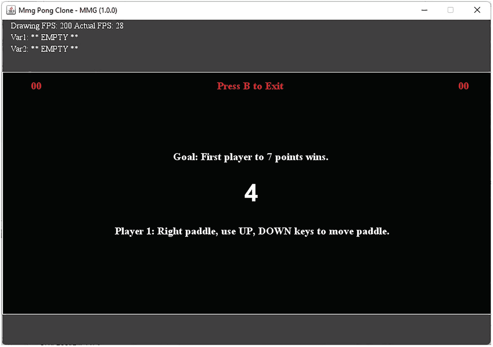
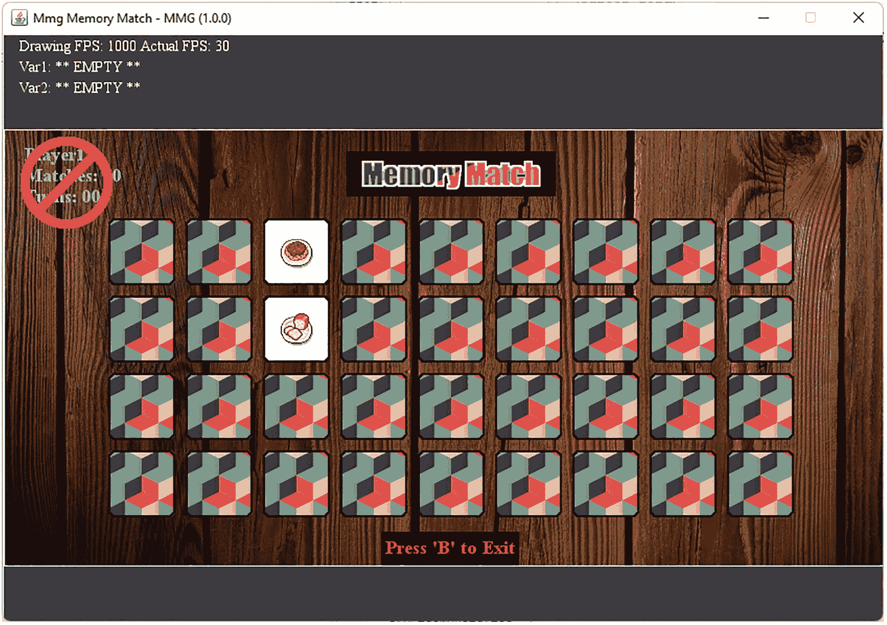
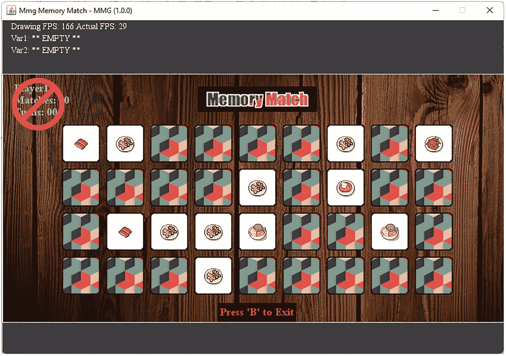

# 4. 表达式与运算符、流程控制及变量的更多内容

在上一章中，我们获得了大量使用 Java 变量的经验，甚至还了解了更复杂的变量和数据结构，如数组和列表。尽管我们使用 Java 数据类型建模数据的能力有所提升，但目前我们在编程方面能做的事情仍然有限。我们还需要一些额外的工具。

在本章中，我们将扩展对 Java 编程语言的认识，从而为我们的编码工具箱增添更多工具。我们将回顾表达式、运算符和流程控制。利用这些新的语言特性，我们能够将变量和值与不同的运算符结合，创建表达式；同时，我们还能通过将流程控制语句与布尔表达式相结合，来控制程序的流程。

最后，在结束本章之前，我们将回到变量这一主题，并讨论一些更精细的要点，例如类型转换和自定义数据类型。让我们直接进入主题，从 Java 编程语言中的表达式和运算符开始吧！


## 表达式与运算符

正如我们之前提到的，Java 编程语言原生支持几种主要的表达式类型及其相关运算符。让我们来看看这门语言提供了哪些功能。

*   **数值型**：由变量和数值运算符组成的公式或其他数值组合，用于生成一个数值结果。
*   **布尔型**：结合变量和布尔运算符的逻辑表达式，用于生成 true/false 值。
*   **赋值型**：用于在给变量赋予新值的同时对其进行调整的表达式。
*   **递增/递减型**：一组用于简化变量递增或递减操作的表达式。
*   **内联 If-Else 型**：一种内联的 If-Else 运算符，可用于控制变量初始化等操作。
*   **位运算型**：使用 Java 的按位和位移运算符来调整数据值并在位级别进行比较的表达式。

通常，这些主要类型的表达式中使用的运算符按复杂度可分为以下几类：

*   **一元运算符**：只需要一个值的运算符。例如递增/递减运算符和负号运算符。
*   **二元运算符**：需要两个值的运算符。例如数值运算符（+、-、/、*、%）和布尔运算符（==、!=、<、>、<=、>=）。
*   **三元运算符**：需要三个值的运算符。三元运算符的一个例子是内联 If-Else 运算符“? :”，我们将在讨论流程控制时再次提到它。

请注意，在 Java 中，“!”字符是逻辑非运算符。它将 true 值转换为 false 值，反之亦然。另一个你可能不熟悉的运算符是取模运算符“%”。取模运算符用于返回整数除法后的余数。表达式也可以根据它们是否使用多个运算符、值甚至其他表达式来进行分类。

*   **简单表达式**：不包含额外运算符、变量等的基本表达式。例如，涉及一元运算符的简单表达式应该只包含该运算符及其操作所需的那个值。
*   **复合表达式**：包含多个运算符、变量、方法调用或其他表达式的高级表达式。

这些内容量不小，所以在深入细节之前，让我们先进一步探讨这个主题，从定义的角度讨论一下 Java 编程语言中表达式究竟是什么。根据 Java 官方文档：

> *“表达式是由变量、运算符和方法调用按照语言语法构建而成的结构，它会被计算为单个值。”*
>
> `—`摘自 Java 官方文档^(⁸)

根据定义，表达式是由变量、运算符和方法调用等底层语言特性构建而成的结构，这些结构在语法上是正确的，并且可以被处理以产生一个单一的结果。让我们通过清单 4-1 中的一些例子来支持这个概念。我将从前面列出的每种主要表达式类型中提供一些示例。

```
01 //准备
02 ArrayList listIntegers;
03 listIntegers = new ArrayList();
04 listIntegers.add(10);

06 //简单数值表达式
07 int i = 5;
08 i = 10;
09 i = 5 + 5;
10 i = 11 - 1;
11 i = 11 + -1;
12 i = 100 / 10;
13 i = 100 % 3;
14 i = (1 * 10);

16 i = 5;
17 i = i + 5;
18 i = i - +5;
19 i = i / 5;
20 i = i % 5;
21 i = (i * 5);

23 //简单布尔表达式
24 boolean b;
25 b = i == 5;
26 b = (j != d);    //! 是逻辑非运算符
27 b = (j  listIntegers.get(0);
29 b = (j = d;

32 //递增/递减、取反、方法使用表达式
33 i = 5;
34 i++;
35 i--;
36 i = 5;
37 i = -i;
38 i = listIntegers.get(0) + 256;

40 //简单字符串表达式
41 String s;
42 s = "Hello";
43 s = s + " ";
44 s += "World";

46 //复合数值表达式
47 int j;
48 double d;
49 float f;
50 i = 0 + 10 - 5;
51 j = listIntegers.get(0) + 256;
52 s = "Hello" + " " + "World!";
53 d = 10 / 2.5 + 3;
54 d = 10 * 2.5 - 3;
55 f = (float)(12.7 / 10);
56 listIntegers.set(0, 125 + j + i);

58 //复合布尔表达式
59 b = i + 1 == 5 + j;
60 b = (j + listIntegers.get(0) != d);
61 b = j  (listIntegers.get(0) * 2);
63 b = (j = -d;

66 //赋值表达式
67 i = 5;
68 i += 5;
69 i -= 5;
70 i /= 5;
71 i %= 5;
72 i *= 5;

74 //三元运算符，? :，内联 If-Else
75 s = b ? "b is true" : "b is false"; //如果 ? 则 : 否则

77 //简单按位表达式
78 int x, y, z; //多变量声明
79 x = 5;
80 y = 7;
81 z = x | y; //按位或，z = 7
82 z = x & y; //按位与，z = 5
83 z = x ^ y; //按位异或，z = 2
84 z = ~x; //按位取反，z = 10

86 //简单位移表达式
87 byte a = 64, g;
88 i = a << 2; //i = 256
89 g = (byte)(a << 2); //i = 0 由于溢出
清单 4-1
Java 中不同表达式和运算符的示例
```

每种主要表达式类型及其相关运算符的示例。有些同时以复合形式和简单形式展示。

*** Java 编程说明：你会注意到在第 89 行和第 55 行，给定表达式的左侧直接有一个括号内的数据类型。这被称为强制类型转换，用于将右侧的数据转换为括号内指定的类型（如果可能的话）。*

*** 游戏编程说明：复合表达式没问题，但如果你能合并项并简化表达式，那就去做。一个复杂的表达式不如其简化版本高效，而在游戏编程中，追求效率非常重要。*

在表达式中使用类方法是一个稍微高级的话题，属于 Java 类讨论的范畴。在上面的清单中，我们使用了你从第 3 章列表回顾中熟悉的 `ArrayList` 类的方法调用，但我们也可以使用任何返回有效数据类型的方法调用。

## 数值表达式

第一种表达式类型，数值型，可能是普通人最熟悉的。我们在数学课上走神时见过无数公式，而这基本上就是在 Java 中编写公式的方式。数值表达式可以是复合表达式，并使用数值运算符将多个简单表达式连接在一起。

```
01 //准备
02 ArrayList listIntegers;
03 listIntegers = new ArrayList();
04 listIntegers.add(10);

06 //简单数值表达式
07 int i = 5;
08 i = 10;
09 i = 5 + 5;
10 i = 11 - 1;
11 i = 11 + -1;
12 i = 100 / 10;
13 i = 100 % 3;
14 i = (1 * 10);

16 i = 5;
17 i = i + 5;
18 i = i - +5;
19 i = i / 5;
20 i = i % 5;
21 i = (i * 5);

23 //复合数值表达式
24 int j;
25 double d;
26 float f;
27 i = 0 + 10 - 5;
28 j = listIntegers.get(0) + 256;
29 s = "Hello" + " " + "World!";
30 d = 10 / 2.5 + 3;
31 d = 10 * 2.5 - 3;
32 f = (float)(12.7 / 10);
33 listIntegers.set(0, 125 + j + i);
清单 4-2
数值表达式示例
```

一组简单和复合的数值表达式。

数值表达式经常用于变量初始化和流程控制语句（如 If-Else 语句）中。在下一节中，我们将讨论 Java 中第二种最核心的表达式形式：布尔表达式。


## 布尔表达式

我们将讨论的第二种表达式是布尔表达式。简单和复合的布尔表达式均显示在之前的清单 4-1 中。它们主要用于布尔变量的初始化以及 If-Else 语句中。

布尔表达式几乎是每个程序的重要组成部分，因为它们构成了主要流程控制语句（即 If-Else 语句）的核心。我们之前在第 71 行见过一个类似版本，涉及三元运算符，其功能类似于内联的 If-Else 语句。

```
01 //准备
02 ArrayList listIntegers;
03 listIntegers = new ArrayList();
04 listIntegers.add(10);

06 //简单布尔表达式
07 boolean b;
08 b = i == 5;
09 b = (j != d);
10 b = (j  listIntegers.get(0);
12 b = (j = d;

15 //复合布尔表达式
16 b = i + 1 == 5 + j;
17 b = (j + listIntegers.get(0) != d);
18 b = j  (listIntegers.get(0) * 2);
20 b = (j = -d;
清单 4-3
布尔表达式示例
```

一组简单和复合的布尔表达式。

关于布尔表达式，我还需要提及的一个方面是布尔逻辑的概念。全面介绍布尔逻辑超出了本文的范围，但你应花些时间学习它，因为这将极大地提升你在 If-Else 语句中对布尔运算符的使用能力。

## 赋值表达式

Java 编程语言提供了一整套赋值表达式，将数值运算符和赋值操作合并为便捷的一步。例如，你将在清单 4-4 中看到赋值表达式的长格式。

```
1 i = 5;
2 i = i + 5;
3 i = i - 5;
4 i = i / 5;
5 i = i % 5; //取模运算符返回整数除法的余数
6 i = (i * 5);
清单 4-4
赋值表达式的长格式等价形式
```

一组长格式等价赋值表达式的示例。

前面表达式的短格式使用了 Java 便捷的赋值运算符。

```
1 i = 5;
2 i += 5;
3 i -= 5;
4 i /= 5;
5 i %= 5;
6 i *= 5;
清单 4-5
赋值表达式示例
```

一组赋值表达式的示例。

在赋值运算符中拥有如此细致的程度可能看起来有些多余，但使用几次后你就会爱上它们。在下一节中，我们将介绍一些便捷运算符，它们能使值的递增和递减操作更高效。

## 递增/递减表达式

在处理常见的递增或递减值时，Java 语言提供了一些快捷方式。这种操作在编程中非常频繁，以至于专门为此设计了一个特殊运算符。首先，让我们看看使用现有工具集递增/递减变量的几种方式。

```
i = i + 1;
i += 1;
i = i – 1;
i -= 1;
```

为了让事情更简单，你现在还可以使用以下选项来将变量递增或递减 1：

```
i++;
i--;
```

我应该提一下，你也可以使用 `++i` 和 `--i` 这两种形式，它们的区别仅在于运算顺序不同。一种情况是先递增后赋值；另一种情况是先赋值后递增。让我们在清单 4-6 中看看这种区别带来的微妙结果。

```
//代码
01 int q; //声明

03 q = 5; //初始化
04 int q1 = q++;

06 q = 5; //初始化
07 int q2 = ++q;

09 System.out.println("q++: " + q1);
10 System.out.println("++q: " + q2);
//输出
01 q++: 5
02 ++q: 6
清单 4-6
赋值表达式示例
```

一个展示使用 ++q、--q 与 q++、q-- 之间区别的示例。

你能看出清单 4-6 示例代码中的区别吗？在一种情况下，先赋值然后递增，如第 4 行；而在第二种情况下，先递增然后赋值，如第 7 行。最终输出显示了赋值值的差异。关于这个主题，我想说的就是这些。在下一节中，我们将介绍可以对基于整数的变量执行的位运算。

## 位运算表达式

位运算表达式并不常用。事实上，你可能编写 Java 程序多年也未曾使用过一次。这是因为它们属于底层操作，因此只有在处理字节和二进制数据时才会派上用场。然而，这并不能成为不熟悉它们的借口，所以让我们来看一下。

```
01 //准备
02 int x, y, z;

04 //简单位运算表达式
05 x = 5;
06 y = 7;
07 z = x | y; //按位或，z = 7
08 z = x & y; //按位与，z = 5
09 z = x ^ y; //按位异或，z = 2
10 z = ~x; //按位取反，z = 10

12 //复合位运算表达式
13 z = ++x | y--;
14 z = x * y & y + 10;
15 z = x ^ y / 256;
16 z = ~(x * 2);
清单 4-7
位运算表达式示例
```

简单和复合位运算表达式的示例。

详细讲解位级操作超出了本文的范围。花点时间查阅布尔运算 AND、XOR、OR 以及按位取反，以了解更多信息。再次强调，这是 Java 编程语言中一个相对深奥的领域。对这些内容有初步了解可能就足够了。在下一节中，我们将介绍 Java 支持的其他一些位级表达式。

## 位移表达式

我们将讨论的最后一组主要表达式也是位级的；它们是位移表达式。虽然你可能认为这些对你没用，因为你不会进行任何二进制编程，但请三思。位移是一种非常快速的乘以或除以 2 的方法。

这在某些情况下是一种非常频繁的调整，值得了解。如果你发现自己经常需要乘以或除以 2，那么可以考虑使用位移运算符。让我们快速看一些位移表达式。

```
//代码
1 byte a = 64, g;
2 i = a << 2;
3 g = (byte)(a << 2);
4 System.out.println("a: " + a);
5 System.out.println("i and g: " + i + ", " + g);
//输出
1 a: 64
2 i and g: 256, 0
清单 4-8
位移表达式示例
```

一个简单位移表达式的示例，比较了移位后的值在整数变量和字节变量赋值中的差异。

请注意，在上一个清单中，原始值 64 变成了 256，即 64 * 4。这告诉我们关于将值左移两位的本质是什么？它告诉我们，左移两位相当于乘以 4。类似地，左移一位相当于乘以 2，以此类推。反过来，当右移时，我们是在做除法。例如，从值 256 开始，执行右移两位操作，相当于将 256 除以 4，得到值 64，即原始值。

有符号右移 `>>` 和无符号右移 `>>>` 之间的区别在于：对于有符号右移，位值被推向右侧，并且在数字左侧添加一个与数字符号相同值的新位。而对于无符号右移，新位始终为零。

再次强调，位运算并非适合所有人，如果你不需要或不想使用它们，完全可以不用。但你应该知道这些功能的存在，即使你并不完全熟悉如何使用它们。在开始编码之前，你随时可以查阅一些示例。接下来，我们将总结 Java 语言的全部运算符，并按优先级排序。


## 运算符与运算符优先级

既然我们已经涵盖了 Java 支持的所有主要表达式类别，现在应该全面审视所有涉及的运算符，并按运算符优先级对它们进行排序。什么是运算符优先级？运算符优先级是指运算符在表达式中被处理的顺序。

下面的列表展示了 Java 运算符，从最重要（最先处理）到最不重要（最后处理）。每个运算符的文字描述旁边是其符号。

*   数组索引 **[]**、成员访问 **.**、方法调用 **.**、后置自减 **--**、后置自增 **++**

*   按位取反 **~**、类型转换 **()**、逻辑非 **!**、创建对象 **new**、前置自减 **--**、前置自增 **++**、一元减号 **-**、一元加号 **+**

*   除法 **/**、乘法 **\***、取余 **%**

*   加法 **+**、字符串拼接 **+**、减法 **-**

*   左移 **<<**、有符号右移 **>>**、无符号右移 **>>>**

*   大于 **>**、大于等于 **>=**、小于 **<**、小于等于 **<=**、类型检查 **instanceof**

*   等于 **==**、不等于 **!=**

*   按位与 **&**、逻辑与 **&&**

*   按位异或 **^**、逻辑异或 **^** **（针对布尔运算符）**

*   按位或 `|`、逻辑或 **||**

*   条件与 **&&** **（针对布尔运算符）**

*   条件或 **||** **（针对布尔运算符）**

*   条件 **?:** **（三元运算符）**

*   赋值 **=**、复合赋值 **+=**、**-=**、**\*=**、**/=**、**%=**、**&=**、**^=**、**|=**、**<<=**、**>>=**、**>>>=**

这并非需要死记硬背的内容，但你应该有所了解。在大多数情况下，我建议使用括号对运算符和值进行分组，并显式控制优先级。至此，本节内容就结束了。在下一节中，我们将探讨控制 Java 程序流程的不同方式。

## 流程控制

尽管到目前为止你已经学到了相当多的知识，但我们仍然只知道如何声明变量和建模数据。在控制程序如何执行方面，我们还没有太多方法。流程控制是任何程序的重要组成部分。没有它，我们就无法根据变量的值执行不同的代码分支。没有流程控制，你无法编写出很多有趣的程序。

我们将探讨三种控制 Java 程序流程的不同方式。第一种是传统的 If-Else 语句，包括 Else-If 子句。第二种是用于支持将代码分离成多个不同分支的语句：Switch 语句。最后，我们有一种流程控制方法，允许我们通过 Try-Catch 语句来响应程序中的异常（即意外错误），从而改变程序的执行路径。让我们来看看吧！

### If-Else 语句

If-Else 语句（这也包括 Else-If 子句，但为了简洁，我们不会显式列出它）是你在 Java 程序中控制执行流程的主要方式。If-Else 语句接受一个布尔表达式，并根据表达式的结果有条件地执行特定代码。这种类型的布尔表达式被称为条件表达式。让我们来看一个没有显式条件表达式的基本 If-Else 语句。

```
1 if(条件表达式) {
2    // then 子句
3 } else {
4    // else 子句
5 }
列表 4-9
基本 If-Else 语句示例
```

一个没有显式条件表达式的基本 If-Else 语句示例。

让我们通过一个简单的示例来进一步理解这个概念，该示例使用 If-Else 语句来控制变量的初始化。

```
1 boolean b = true;
2 int i = 0;
3 if(!b) {
4    // then 子句
5    i = 5;
6 } else {
7    // else 子句
8    i = 10;
9 }
列表 4-10
If-Else 语句与变量初始化示例
```

一个使用 If-Else 语句控制变量初始化的示例。

这种 If-Else 语句的用法是不是让你觉得似曾相识？你能想到另一种使用我们已有工具实现相同功能的方法吗？提示一下：它也是一种条件形式。如果你想到了三元运算符，那么你就想对了。

```
1 boolean b = true;
2 int i = !b ? i = 5 : i = 10;
列表 4-11
If-Else 语句与变量初始化示例
```

一个使用条件表达式实现与 If-Else 语句相同变量初始化的示例。

当然，If-Else 语句不仅仅是基本形式和变量初始化那么简单。让我们来看一个来自 Pong Clone 游戏 `ScreenGame.java` 类的示例。你可以在 `net.middlemind.PongClone` 包中找到这个 Java 类。

```
01 public boolean ProcessKeyPress(char c, int code) {
02    if(state == State.SHOW_GAME && pause == false) {
03         if(gameType == GameType.GAME_TWO_PLAYER) {
04             if(c == 'x' || c == 'X') {
05                 paddle1MoveUp = false;
06                 paddle1MoveDown = true;
07                 return true;
08             } else if(c == 's' || c == 'S') {
09                 paddle1MoveUp = true;
10                 paddle1MoveDown = false;
11                 return true;
12             }
13         }
14     }
15     return false;
16 }
列表 4-12
来自 ScreenGame.java 的复杂 If-Else 语句示例
```

一个使用 If-Else 语句处理 Pong Clone 游戏键盘输入的复杂示例。

让我们重点关注第 4 到 13 行的 If-Else 语句。我们将把这个 If-Else 语句提取出来，并稍微调整其结构。

```
01 if(c == 'x') {
02     paddle1MoveUp = false;
03     paddle1MoveDown = true;
04     return true;
05 } else if(c == 'X') {
06     paddle1MoveUp = false;
07     paddle1MoveDown = true;
08     return true;
09 } else if(c == 's') {
10     paddle1MoveUp = true;
11     paddle1MoveDown = false;
12     return true;
13 } else if(c == 'S') {
14     paddle1MoveUp = true;
15     paddle1MoveDown = false;
16     return true;
17 }
列表 4-13
扩展后的 If-Else 语句示例
```

一个扩展后的 If-Else 语句示例，其中每个情况都有自己的 Else-If 子句。

请注意，我们可以使用 If-Else 语句（严格来说是 If-Else-If 语句，但你明白意思）来检查一系列不同的相关条件。这种语法有些冗余，因为我们必须反复检查同一个变量的值，每个分支检查一次。请思考一下这个问题。这听起来像是编程中常见的场景。虽然我们显然可以使用 If-Else 语句来处理这种情况，但还有一种更简洁的方式，那就是使用 Switch 语句。


### Switch 语句

Switch 语句是 Java 编程语言中另一种流程控制工具，当需要根据某个变量的值执行多种不同操作时，它非常有用。在前面的示例中，该变量是字符变量 `c`。让我们看一段等效的代码片段，它用 Switch 语句替换了 If-Else 语句。

```
01 switch(c) {
02     case 'x':
03         paddle1MoveUp = false;
04         paddle1MoveDown = true;
05         return true;
06     case 'X':
07         paddle1MoveUp = false;
08         paddle1MoveDown = true;
09         return true;
10     case 's':
11         paddle1MoveUp = true;
12         paddle1MoveDown = false;
13         return true;
14     case 'S':
15         paddle1MoveUp = true;
16         paddle1MoveDown = false;
17         return true;
18 }
代码清单 4-14
Switch 语句示例
```

一个 Switch 语句的示例，其中每个 case 都替换了一个 If-Else 或 Else-If 子句。

花点时间看一下 Switch 语句的结构。每个 Else-If 语句都被一个检查特定值的 case 语句条目所取代。通常，Switch 语句的 `case` 子句以 `break` 语句结束，但在某些情况下，`return` 语句也能很好地工作。让我们看一个稍微重构过的 Switch 语句，它更接近我们之前看到的第一个 If-Else 语句，并且我们将用 break 语句替换 return 语句。

```
01 switch(c) {
02     case 'x':
03     case 'X':
04         paddle1MoveUp = false;
05         paddle1MoveDown = true;
06         break;
07     case 's':
08     case 'S':
09         paddle1MoveUp = true;
10         paddle1MoveDown = false;
11         break;
12     default:
13         paddle1MoveUp = false;
14         paddle1MoveDown = false;
15         break;
16 }
代码清单 4-15
带有 Break 和 Default Case 的 Switch 语句示例

一个 Switch 语句的示例，其中每个 case 都替换了一个 Else-If 子句。

正如我们之前提到的，这是一个稍微调整过的 Switch 语句。请注意，“x”和“X”条件会执行相同的 `case` 分支代码。这是利用 Switch 语句的 case 子句不带退出语句（`break` 或 `return`）来将相似代码分支分组的一个示例。例如，当用户按下“x”键时，与他们在开启大写锁定并按下“X”时运行的代码相同。这与我们之前看到的原始 If-Else 语句中的结构相同。最后，Switch 语句有一个 default case。这类似于 If-Else-If 语句中的 Else 子句。当之前的 Switch 语句 case 没有直接匹配时，default case 会执行。

总的来说，Switch 语句非常直接。它们紧密遵循 If-Else 语句的逻辑，但在某些场景下提供了更简洁的语法。Switch 语句只能用于某些数据类型 `–` byte、short、char、int `–` 以及枚举数据类型，如数组和枚举。在下一节中，我们将介绍一种不同形式的流程控制：使用 Try-Catch 语句进行错误处理。

### Try-Catch 语句

到目前为止，我们回顾的流程控制语句都是显式语句，我们检查变量的值并决定执行哪个代码分支。在大多数情况下，If-Else 语句非常擅长处理这种情况。有时，当比较同一个变量的值以决定多个不同的代码分支时，你需要使用 Switch 语句来利用其更简洁的语法。

在某些情况下，你需要控制程序的流程，但并非我们之前看到的正常场景。在这种情况下，我们关心的是在发生错误时控制程序的流程。针对这种特定情况，Java 为我们提供了 Try-Catch 语句。让我们看一个基本示例。

```
//代码
1 try {
2     int t;
3     String u = "test";
4     t = Integer.parseInt(u);
5 } catch (Exception e) {
6     e.printStackTrace();
7 }
//输出
1 java.lang.NumberFormatException: For input string: "test"
代码清单 4-16
Try-Catch 语句示例
```

一个使用 Try-Catch 语句在错误发生时控制程序流程的示例。

在上一个代码清单中，第 3 行对 `String u` 的初始化是不正确的。该变量被初始化为一个单词，而不是数字字符串。通常，这完全没问题，但在第 4 行，我们使用该字符串变量作为源值来转换为 Integer。现在，这段代码将会失败并抛出 `NumberFormatException –` 我们可以捕获它！

出于我们的目的，我们捕获了更通用的 `Exception`。这对我们的演示来说没问题，但你应该使你的 Try-Catch 语句与它们旨在处理的异常类型保持一致。现在，在这个示例中，我们只做了报告错误（第 6 行），但我们可以在 catch 子句中采取任意数量的措施来纠正遇到的异常，或者我们可以报告问题并优雅地退出程序。

无论哪种情况，我们都能在遇到异常后控制程序的流程，因为我们在可能成为错误来源（即抛出异常）的代码周围使用了 Try-Catch 语句。通过这种方式，我们可以使用 Try-Catch 语句来保护可能产生错误的代码，同时相应地响应错误，从而使我们自己的 Java 程序非常稳定。

至此，本节内容就结束了。在下一节中，我们将通过一个关于该主题的挑战来巩固我们对程序流程控制的知识。让我们看看这个挑战，然后直接进入代码！

### 挑战：流程控制

在本章的第一个挑战中，我们将利用流程控制的知识来修改一份 Pong Clone 游戏的副本。这个挑战要求我们修改游戏的输入处理，以支持更多的键盘按键。让我们看看具体细节。

涉及的包：

```
net.middlemind.PongClone_Chapter4_Challenge1
net.middlemind.PongClone_Chapter4_Challenge1_Solved
```

描述：

找到包 net.middlemind.PongClone_Chapter4_Challenge1，并打开 ScreenGame.java 文件。一些测试人员报告说，在玩双人游戏时控制球拍有点困难。我们需要为玩家 1 和玩家 2 映射两组新的按键（每组两个键），以添加新的球拍上下控制功能。

找到 `ScreenGame` 类中的 `ProcessKeyPress` 和 `ProcessKeyRelease` 方法。你需要运用 Java 流程控制语句的知识，为两组新的键盘按键添加支持：一组用于玩家 1 上下移动球拍，另一组用于玩家 2 执行相同操作。以玩家 1 已有的代码为模板。你必须运行此包的文件 `–` PongClone.java；右键单击并选择“运行文件”来测试游戏。

提示：

你需要根据使用的键盘按键以及按键是被按下还是释放，将以下变量设置为 true 或 false：

*   paddle1MoveUp

*   paddle1MoveDown

*   paddle2MoveUp

*   paddle2MoveDown

记住，你必须在按键释放方法 `ProcessKeyRelease` 中重置布尔变量；否则，玩家的球拍会卡住，持续向上或向下移动。

为了运行该包特定版本的游戏，你必须点击该包中包含的静态主类，并从上下文菜单中选择“运行文件”。否则，将执行项目的默认游戏。如果你正确解决了挑战，游戏应该能正常运行，并允许你使用刚刚创建的新键盘映射来控制玩家 1 和玩家 2 的球拍。


### 挑战解决方案

解决此挑战需要在挑战包的 `ScreenGame.java` 文件中进行两处修改，具体位于 `ProcessKeyPress` 和 `ProcessKeyRelease` 方法中。解决方案的第一部分要求我们遵循 `ProcessKeyPress` 方法中的示例，以便能够以与原始控制键相同的方式支持新按键。让我们来看一个此挑战有效解决方案的示例。

```
01 public boolean ProcessKeyPress(char c, int code) {
02     if(state == State.SHOW_GAME && pause == false) {
03         if(gameType == GameType.GAME_TWO_PLAYER) {
04             if(c == 'x' || c == 'X' || c == '1' || c == '!') {
05                 paddle1MoveUp = false;
06                 paddle1MoveDown = true;
07                 return true;

09             } else if(c == 's' || c == 'S' || c == '2' || c == '@') {
10                 paddle1MoveUp = true;
11                 paddle1MoveDown = false;
12                 return true;
13             }

15             if(c == '9' || c == '(') {
16                 paddle2MoveUp = false;
17                 paddle2MoveDown = true;
18                 return true;

20             } else if(c == '0' || c == ')') {
21                 paddle2MoveUp = true;
22                 paddle2MoveDown = false;
23                 return true;
24             }
25         }
26     }
27     return false;
28 }

30 public boolean ProcessKeyRelease(char c, int code) {
31     if(state == State.SHOW_GAME && pause == false) {
32         if(gameType == GameType.GAME_TWO_PLAYER) {
33             if(c == 'x' || c == 'X' || c == '1' || c == '!') {
34                 paddle1MoveDown = false;
35                 return true;

37             } else if(c == 's' || c == 'S' || c == '2' || c == '@') {
38                 paddle1MoveUp = false;
39                 return true;
40             }

42             if(c == '9' || c == '(') {
43                 paddle2MoveDown = false;
44                 return true;

46             } else if(c == '0' || c == ')') {
47                 paddle2MoveUp = false;
48                 return true;
49             }
50         }
51     }
52     return false;
53 }
代码清单 4-17
挑战 1 的一种可能解决方案
```

挑战 1 的一种可能解决方案示例。

有一件重要的事情应该会引起你的注意，那就是玩家 1 和玩家 2 的按键事件处理被分成了两个不同的 If-Else 语句。你认为这是为什么呢？好吧，如果你思考一下我们是如何将 If-Else 语句转换为 Switch 语句的，那么如果玩家 1 和玩家 2 的输入都由同一个 Switch 语句处理，会发生什么情况？

如果你认为，由于 Switch 语句的特性是只处理一个 `case` 子句，因此两个玩家无法同时处理按键，那么你的想法是正确的。如果我们只使用一个 If-Else 语句，也会发生同样的情况。如果我们希望两个玩家的输入能够独立运行，就需要通过使用两个独立的 If-Else 语句，使输入处理代码独立运行。

## 关于变量的更多内容

到目前为止，我们在本章中已经介绍了相当多的内容，但我还想回到变量这个主题，简要讨论一些更细致的要点，以真正完善我们对这个主题的回顾。既然我们已经有了使用不同 Java 表达式的经验，并且已经明确地介绍了布尔表达式和 If-Else 语句，那么在变量这个主题上，我还有几件事想谈谈。

我想简要探讨一下自定义数据类型和数据类型转换，即 Java 中与变量相关的类型转换。首先，我们将通过介绍枚举来讲解自定义数据类型。

### 枚举

Java 编程语言有枚举的概念。枚举是一个命名常量的列表。在 Java 中，枚举定义了一个类类型。枚举可以有构造方法、方法和实例变量。它是使用 `enum` 关键字创建的。默认情况下，每个枚举常量都是 public、static 和 final 的。

关于类特性（如构造方法、方法和字段访问权限、public 或 static）的信息，将在我们介绍 Java 类时进行更详细的解释。在本章中，你将接触到一些非常基础的类知识。现在，只需跟着学习，并在脑海中记住这些概念。如果你还不太理解它们，也不必担心。让我们来看一个使用 `enum` 关键字创建枚举的基本但常见的用法。

```
01 private enum State {
02     NONE,
03     SHOW_GAME,
04     SHOW_COUNT_DOWN,
05     SHOW_COUNT_DOWN_IN_GAME,
06     SHOW_GAME_OVER,
07     SHOW_GAME_EXIT
08 };

10 public State gameState = State.NONE;
代码清单 4-18
基本枚举使用示例
```

一个包含变量声明和初始化的基本枚举使用示例。

一旦你声明并初始化了一个枚举，就可以使用 Java 的成员运算符 `.` 来引用其成员，如下所示：

```
if (gameState == State.SHOW_GAME) { ... }
```

这使得枚举的使用既简洁又直观。你也可以通过其他方式实现同样的效果。假设你使用一组整数来完成这项工作。

```
int NONE = -1;
int SHOW_GAME = 0;
int SHOW_COUNT_DOWN = 1;
int SHOW_COUNT_DOWN_IN_GAME = 2;
int SHOW_GAME_OVER = 3;
int SHOW_GAME_EXIT = 4;
```

这种实现方式还不错。它直观且简洁。但有一个问题，我们必须为表示不同变量的整数显式定义唯一的值。而之前的枚举则为我们处理了这个问题。让我们看看这种方法在实际中是什么样子的。

```
if (gameState == SHOW_GAME) { ... }
```

区别很微妙，但在前面的例子中，我们丢失了“状态”的概念。在这个例子中，这一点不太重要，因为我们使用的变量命名得当，即 `gameState`。尽管如此，无需过多研究，我们就能看出使用枚举使代码更简洁、更直观。枚举是 Java 编程语言中一个非常强大的工具。在编写下一个项目时，请记住它们。

### 非常基础的 Java 类

很明显，虽然枚举有其用途，并且可以轻松地为你自定义一种可在程序中使用的数据类型，但它们也有局限性。首先，枚举成员必须是整数。仅此一个限制就会促使我们寻找其他数据类型自定义的方法。沿着同样的探索思路，我们找到了另一种创建自定义数据类型的方法：普通的旧式 Java 类。

```
1 public class GameData {
2     public State gameState = State.NONE;
3     public int numberOfPlayers = 1;
4     public boolean gameOver = false;
5     public String playerName = "AAA";
6 }

8 public GameData gameMetaData;
9 gameMetaData = new GameData();
代码清单 4-19
基本 Java 类示例
```

一个通过 Java 类定义的自定义数据类型示例。

上一个代码清单中的代码应该与代码清单 4-18 中的代码有些相似。这里我们有一个非常简单的 Java 类，旨在保存一些不同的信息。我们之前称这些为变量，但在此上下文中，我们将它们称为类字段，或者更一般地称为类成员。

请注意，我们现在可以创建此数据类型的变量，如第 8-9 行所示。这与我们使用枚举的方式非常相似，但在这里，我们能够创建包含不同类型字段的类，包括其他类和枚举。这为我们能够建模的数据类型提供了强大的能力。请思考一下这一点。

至此，本节内容结束。在下一节中，我们将更多地关注基本数据类型的变量，以及它们如何与其他不同的基本数据类型进行相互转换。


### 类型转换与强制转换

我们在此讨论的类型转换与强制转换，将仅限于基本数据类型（byte、char、short、int、long、float、double、String、boolean）之间的相互转换。String 类型的转换比较特殊，所以我们先把它讲清楚。下面的代码片段展示了如何将 String 值转换为其他基本数据类型。让我们来看一下！

```
01 //准备
02 String u;

04 //byte
05 u = "128";
06 try {
07     byte tB;
08     tB = Byte.parseByte(u);
09 } catch (Exception e) {
10     //错误，退出程序
11     return;
12 }

14 //char
15 u = "c";
16 try {
17     char tC = u.toCharArray()[0];
18 } catch (Exception e) {
19     //错误，退出程序
20     return;
21 }

23 //short
24 u = "1024";
25 try {
26     short tS;
27     tS = Short.parseShort(u);
28 } catch (Exception e) {
29     //错误，退出程序
30     return;
31 }

33 //int
34 u = "10";
35 try {
36     int tI;
37     tI = Integer.parseInt(u);
38 } catch (Exception e) {
39     //错误，退出程序
40     return;
41 }

43 //long
44 u = "2048";
45 try {
46     long tL;
47     tL = Long.parseLong(u);
48 } catch (Exception e) {
49     //错误，退出程序
50     return;
51 }

53 //float
54 u = "100.05";
55 try {
56     float tF;
57     tF = Float.parseFloat(u);
58 } catch (Exception e) {
59     //错误，退出程序
60     return;
61 }

63 //double
64 u = "200.10";
65 try {
66     double tD;
67     tD = Double.parseDouble(u);
68 } catch (Exception e) {
69     //错误，退出程序
70     return;
71 }

73 //boolean
74 u = "true";
75 try {
76     boolean tBl;
77     tBl = Boolean.parseBoolean(u);
78 } catch (Exception e) {
79     //错误，退出程序
80     return;
81 }
清单 4-20
从 String 转换为基本数据类型的示例
```

一段展示 String 与其他基本数据类型之间转换的代码块。

这段代码看起来有点复杂，所以我们来讨论一下这里发生了什么。从 `String` 数据类型转换为其他基本数据类型并非那么直接。这涉及到一些编码问题。例如，如果我们要转换的字符串值不是“true”或“false”，那么我们就无法准确地将其转换为布尔值，并且会抛出异常。

为了执行实际的转换，我们依赖于这些数据类型的“包装”版本——`Byte`、`Short`、`Integer`、`Long`、`Float`、`Double` 和 `Boolean`。对于 `char` 转换，我们简单地使用字符串中的第一个字符值。这个值可能是 `null` 或者根本不存在，因此我们也需要准备好在此转换过程中捕获异常。对于其余的基本数据类型，我们使用一个解析方法，它是基本数据类型对象版本的静态方法。

静态方法是针对类本身定义的方法，而不是针对类的实例。例如，要将 `String` `s` 转换为 `int` `j`，你可以使用以下方法调用：

```
j = Integer.parseInt(s);
```

并且要准备好捕获异常，以防字符串不包含整数形式的字符串。让我们看看如何从其他基本数据类型转换为 `String` 数据类型。

```
01 //准备
02 String u;

04 u = (tB + ""); //byte
05 u = (tC + ""); //char
06 u = (tS + ""); //short
07 u = (tI + ""); //int
08 u = (tL + ""); //long
09 u = (tF + ""); //float
10 u = (tD + ""); //double
11 u = (tBl + ""); //boolean
清单 4-21
从基本数据类型转换为 String 的示例
```

一种将基本数据类型转换为 `String` 数据类型的空安全方式。它延续了清单 4-20 中的代码。

在清单 4-21 中，它延续了清单 4-20 中的代码，我们可以看到一种将每个基本数据类型转换为 `String` 数据类型的空安全方式。是什么让这种转换变量的方式成为空安全的呢？请注意，这里没有调用任何方法来转换这些值。相反，我们依赖的是 Java 语言本身，它会转换一个 `Object`；在这种情况下，它会自动装箱基本数据类型，将其转换为相应类型的对象——`Byte`、`Short`、`Integer`、`Long`、`Float`、`Double`、`Boolean`。然后它调用内部的 `toString` 方法，返回一个字符串，该字符串随后可以与空字符串拼接。通过这种方式，我们无需调用方法就能返回一个字符串值。

现在我们已经掌握了 `String` 与基本数据类型之间的相互转换，接下来可以讨论一些数值型基本数据类型与其他数值型基本数据类型之间的转换了。事实证明，在某些情况下，我们可以毫无顾虑地将较小的数据类型转换为较大的数据类型。例如，以下转换是允许的。

```
01 //隐式转换
02 byte b = 8;
03 //char c = b; //无法隐式转换为 char
04 int i = b;
05 long l = b;
06 float f = b;
07 double d = b;

09 //显式转换
10 f = (float)d;
11 l = (long)d;
12 i = (int)d;
13 c = (char)d;
14 b = (byte)d;
清单 4-22
隐式和显式变量转换的示例
```

一个演示数值型基本数据类型转换为其他数值型基本数据类型的示例。

隐式转换由编译器自动完成，不会发出任何抱怨。原因是我们是从较小的数据类型转换为较大的数据类型，因此不存在数据丢失的可能性，如第 1-7 行所示。然而，当反向转换数据类型时，除非我们告诉编译器，我们意识到正在进行的转换可能会导致数据丢失，否则会得到一个错误。为什么会丢失数据呢？

嗯，这实际上是一个空间问题。用于描述 `long` 的信息量无法容纳在一个 `byte` 中。当从 `long` 转换为 `byte` 时，我们面临数据丢失的可能性，因为 `byte` 无法容纳像 `long` 数据类型变量那样大的数字。为了执行这种类型的转换，我们必须让编译器知道我们意识到了这种危险。我们通过在赋值运算符前面加上用括号括起来的目标数据类型来实现这一点。尝试对其他基本数据类型的变量应用显式和隐式强制转换。


### 挑战：枚举

本章的第二个挑战比之前的挑战稍微复杂一些，但别担心，你可以将现有代码作为模板，来完成解决此挑战所需的所有修改。

涉及的包：

```
net.middlemind.PongClone_Chapter4_Challenge2
net.middlemind.PongClone_Chapter4_Challenge2_Solved
```

描述：

找到 `net.middlemind.PongClone_Chapter4_Challenge2` 包，并打开 `ScreenGame.java` 文件。项目中的一位首席程序员想要测试延长倒计时时间。你的挑战是将倒计时从三秒增加到五秒。同时，你还需要更新倒计时使用的图片，移除它们的蓝色边框。这样能让我们的修改更显眼一些。

为了完成这个挑战，你需要做几件事。我在这里列出大致步骤。

1.  更新倒计时枚举，使其支持数字 4 和 5。以现有的枚举条目为基础进行修改。

2.  更新类，使其包含变量 `number4` 和 `number5`。以现有的变量 `number1`、`number2` 和 `number3` 为基础进行修改。

3.  在 `ScreenGame` 类中找到 `LoadResources` 方法，并找到变量 `number1`、`number2` 和 `number3` 被初始化的位置。将 `number4` 和 `number5` 添加到被初始化的变量中。以现有代码为基础创建新变量。

4.  修改用于初始化数字 1 到 5 变量的文件，在“.png”之前添加一个“2”。例如，文件名“num_1_lrg.png”变为“num_1_lrg2.png”。

5.  找到 `DrawScreen` 方法，取消注释用于在倒计时期间绘制五个数字的新代码，并注释掉仅支持绘制三个数字的旧代码。

完成这些步骤后，你应该能够运行该包中的 `PongClone.java` 类并开始游戏。你会注意到游戏开始前和得分间隙有一个五秒倒计时。此外，所有数字图片都没有蓝色轮廓。

提示：

对于这个挑战，最好的提示是查看已有的代码，并将其作为模板。

要运行该包特定版本的游戏，你需要点击该包中包含的静态主类，然后从上下文菜单中选择“运行文件”。否则，将执行项目的默认游戏。如果你正确解决了挑战，游戏应该正常运行，并显示一个五秒倒计时，且数字周围没有蓝色边框。请务必花时间仔细完成这个挑战。由于变量名相似，很容易出错。

### 挑战：解决方案

解决这个挑战需要对 `ScreenGame.java` 文件进行四处修改。第一处修改是在用于倒计时状态跟踪的枚举中添加新条目。已有数字 1 到 3 的条目，因此你只需以现有代码为模板，添加数字 4 和 5。

第二处修改是添加新的 `MmgBmp` 变量 `number4` 和 `number5`，用于表示倒计时的第 4 秒和第 5 秒。同样，在这种情况下，你已有声明变量 number1 到 3 的代码。以现有代码为模板，为数字 4 和 5 创建变量。类似地，在 `LoadResources` 方法中找到这些变量被初始化的位置，并为数字 4 和 5 添加必要的代码。

这一步可能看起来有些令人生畏，但如果你给自己留出空间，只需粘贴一份现有代码初始化片段的副本，并分别针对数字 4 和 5 进行定制即可。我将展示一个用于初始化数字变量的代码片段示例。

```
01 //加载数字三的配置
02 key = "bmpNumberThree";
03 if(classConfig.containsKey(key)) {
04     file = classConfig.get(key).str;
05 } else {
06     file = "num_3_lrg2.png";
07 }

09 lval = MmgHelper.GetBasicCachedBmp(file);
10 number3 = lval;
11 if(number3 != null) {
12     MmgHelper.CenterHorAndVert(number3);
13     number3 = MmgHelper.ContainsKeyMmgBmpScaleAndPosition("numberThree", number3, classConfig, number3.GetPosition());
14     number3.SetIsVisible(false);
15     AddObj(number3);
16 }
清单 4-23
数字变量初始化示例
```

一个展示数字变量初始化的示例。

记住，你还需要调整用于加载数字 1 到 3 的图片资源名称。使用以“2.png”结尾的文件名。如果一切顺利，你应该会在新的五秒倒计时器中看到清晰的数字。



截图显示如下内容。按 B 键退出。目标：先得 7 分的玩家获胜。4. 玩家 1：右侧球拍，使用上下键移动球拍。

图 4-1

带有五秒倒计时器的 Pong 克隆游戏截图

一张展示修改后的倒计时器实际运行效果的截图。没有蓝色轮廓，并且是五秒倒计时。

至此，我们完成了第二个挑战，也结束了本章内容。我们将在剩余部分回顾所涵盖的材料并进行总结。

## 结论

至此，我们结束了关于表达式、运算符、流程控制和变量这一章的内容。我们涵盖了相当多的材料，并通过引入一些非常有用的工具（如 If-Else 和 Switch 语句）扩展了我们的编码工具箱。在下一章中，我们将通过向你介绍更多非常有用的数据结构，继续探索 Java 语言。在告别本章之前，让我们回顾一下我们在这里所涵盖的内容。


### 我们涵盖的内容

本语言中涉及的 Java 语言特性如下：

*   **数值表达式**：我们了解了主要表达式类型及其相关运算符之一：数值表达式。
*   **布尔表达式**：Java 中第二重要的表达式类型是布尔表达式，它用于创建条件语句，与流程控制语句结合使用时，可以控制程序的执行。
*   **赋值表达式**：我们花了一点时间了解了不同的赋值表达式，包括复合赋值运算符的便利性。
*   **递增/递减表达式**：这是一个虽小但重要的主题。我们快速介绍了实现变量递增和递减的不同方法，包括一些非常高效的递增/递减运算符。
*   **位运算表达式**：位运算表达式用于对数值信息执行位级逻辑运算，例如 AND、OR 和 XOR 操作。
*   **位移表达式**：Java 表达式中第二个高深的部分；位移表达式用于快速乘以或除以一个值，并且可以更快地替代某些乘法运算。
*   **运算符优先级**：我们简要概述了完整的运算符优先级范围，包括列表中的位运算符和三元运算符。
*   **If、If-Else、If-Else-If 语句**：我们首次接触流程控制语句，了解了 If-Else 语句和分支代码。
*   **Switch 语句**：我们学习了第二种分支代码的方式，但这种方式更适合基于单个变量的多分支代码。
*   **Try-Catch 语句**：我们学习了一种由抛出异常触发的流程控制形式。
*   **挑战：流程控制**：我们接受了一个有趣的挑战，要求在 Pong Clone 游戏中创建新的按键映射，使玩家 1 和玩家 2 能够使用新按键控制他们的球拍。
*   **枚举**：作为 Java 变量回顾的一部分，我们在回顾流程控制后，回过头来了解了如何通过使用枚举来创建自定义数据类型。
*   **非常基础的 Java 类**：我们在 Java 中创建自定义数据类型时回顾的第二种技术是使用非常简单的类。我们看了一个新的自定义数据类型的示例，它存储了关于正在执行的游戏的信息。
*   **挑战：枚举**：本章的最后一个挑战要求我们扩展当前的倒计时器实现，通过支持数字 4 和 5 的枚举条目来增加两秒。我们还必须调整一些类变量、它们的初始化以及 `DrawScreen` 方法的代码来完成挑战。

我们现在拥有了一套相当不错的工具。我们不仅可以使用所有基本数据类型在 Java 中编写解决方案，还可以使用流程控制语句、类型转换、转换和自定义数据类型等。在接下来的章节中，当我们研究 Java 提供的一些更高级的特性时，我们将获得更多的经验和知识！

脚注 1

# 5. 更多数据结构

欢迎来到第 5 章！在本章中，我们将花更多时间探索 Java 编程语言提供的一些常见数据结构。本章我们将涵盖的数据结构简要总结如下：

*   **多维数组**：类似于你在本章之前使用过的数组，只是维度更多，允许我们映射表格数据等。
*   **哈希**：一种非常有用的数据结构，可以将其视为字典。哈希存储键值对。哈希有时以其实际的 Java 类名 `Hashtable` 或通俗术语 dictionary 来指代。
*   **栈**：一种重要的数据结构，允许对值栈进行压入和弹出访问。这是我们见过的第一种在访问时移除其元素的数据结构。它们还具有通过方法调用为你返回元素的特性。
*   **队列**：最后但同样重要的是，如果你曾经为某件事排过队，那么你应该熟悉队列这种数据结构。队列提供对值列表的添加或移除访问。

    ***Java 编程说明：文中使用的所有数据结构要么是 Java 编程语言的核心特性，要么包含在 java.util 包中。添加行* ***import java.util.**** *以在你的程序中使用这些类。*

回顾我们在第 3 章中的复习，数据结构是保存其他变量的更高级的数据类型。通常，数据结构会被认为超出了入门级编程语言文本的范围，但我认为对它们进行温和的介绍将极大地帮助你进一步探索这个主题。我们已经有一些在 Java 中使用数组和列表的经验，因此我们将从多维数组开始讨论。你会发现语法和用法都很熟悉。让我们来看看！

## 多维数组

多维数组是数组的数组。让我们把 Java 中的数组想象成电子表格中的一行。行中的每一列代表一个数组索引并保存一些数据。现在，对于二维的多维数组，让我们把它想象成一个由行和列组成的完整电子表格。数组的第一个索引将指定查找数据的行，而第二个索引将定义列。

### 声明多维数组

声明多维数组的过程应该从你之前对 Java 数组的回顾中就很熟悉了。让我们来看一下。

```
1 int[] oneDimension = new int[10];
2 int[][] twoDimensions = new int[10][10];
3 int[][][] threeDimensions = new int[10][10][10];
清单 5-1
多维数组 – 声明示例
```

一个演示声明 1 维、2 维或 3 维数组的示例。

让我们谈谈这个示例中发生了什么。第一行显示了一维数组的声明，正如你所熟知的。第二行显示了二维数组的声明。请注意，每增加一个数组索引，就会添加一组新的方括号 `[]`。

***Java 编程说明：使用多维数组时要小心，因为它们会很快消耗大量内存。例如，一个每个数组有 1000 个元素的三维数组就有 10 亿个条目，这绝不是一个小数目。***


### 使用多维数组

现在我们已经了解了如何声明多维数组，接下来看看几个获取和设置数组值的用例。

```
01 int[] dim1 = new int[10];
02 int[][] dim2 = new int[10][10];
03 int[][][] dim3 = new int[10][10][10];

05 //简单数组索引设置
06 dim1[0] = 10;

08 //二维数组索引设置
09 dim2[0] = new int[10];
10 dim2[0][0] = 11;

12 //三维数组索引设置
13 dim3[0] = new int[10];
14 dim3[0][0] = new int[10];
15 dim3[0][0][0] = 12;
清单 5-2
多维数组 – 用例示例 1
```

一个演示如何使用不同维度数组设置值的示例。

请花点时间查看清单 5-2 中多维数组的获取/设置代码。请注意，随着数组维度的增加，我们需要执行更多的初始化操作。在使用这些数组索引获取或设置值之前，必须显式地初始化数组的每个维度。在接下来的清单中，我们将了解如何从多维数组中获取值。

```
//代码
01 int[] dim1 = new int[10];
02 int[][] dim2 = new int[10][10];
03 int[][][] dim3 = new int[10][10][10];

05 //简单数组索引设置
06 dim1[0] = 10;

08 //二维数组索引设置
09 dim2[0] = new int[10];
10 dim2[0][0] = 11;

12 //三维数组索引设置
13 dim3[0] = new int[10];
14 dim3[0][0] = new int[10];
15 dim3[0][0][0] = 12;

17 System.out.println("Dim1 索引: 0 值: " + dim1[0]);
18 System.out.println("Dim2 索引: 0 值: " + dim2[0]);
19 System.out.println("Dim2 索引: 0,0 值: " + dim2[0][0]);
20 System.out.println("Dim3 索引: 0 值: " + dim3[0]);
21 System.out.println("Dim3 索引: 0,0 值: " + dim3[0][0]);
22 System.out.println("Dim3 索引: 0,0,0 值: " + dim3[0][0][0]);
//输出
01 Dim1 索引: 0 值: 10
02 Dim2 索引: 0 值: I@50f8360d
03 Dim2 索引: 0,0 值: 11
04 Dim3 索引: 0 值: [[I@13c78c0b
05 Dim3 索引: 0,0 值: [I@12843fce
06 Dim3 索引: 0,0,0 值: 12
清单 5-3
多维数组 – 用例示例 2
```

一个演示如何从不同维度数组中获取值的示例。

清单 [5-3 在前一个清单的基础上添加了一些输出，以便我们了解如何从多维数组中获取值。请注意输出部分的第 1 到第 6 行，你会看到指定索引处数组存储的值。等等，输出中那些奇怪的值是什么？想猜猜看吗？在我回答之前，请回顾一下初始化代码，看看那个数组索引被赋了什么值。

如果你认为输出中那些奇怪的值（如“I@50f8360d”）是该索引处数组值的表示形式，那么你猜对了。这些是 Java 虚拟机中某种内存位置的表示形式，向我们表明该数组索引中存储了某种类型的对象。类似地，请花点时间看看那些实际打印出值的数组索引。你能看出两者的区别吗？一种情况是，我们从保存了另一个完整数组的数组索引中获取值。另一种情况是，我们从指定了基本数据类型值的多维索引处的数组元素中获取值。

让我们快速看一下如何在清单 [5-4 中清除和删除多维数组。

```
01 int[] dim1 = new int[10];
02 int[][] dim2 = new int[10][10];
03 int[][][] dim3 = new int[10][10][10];

05 //简单数组索引设置
06 dim1[0] = 10;

08 //二维数组索引设置
09 dim2[0] = new int[10];
10 dim2[0][0] = 11;

12 //三维数组索引设置
13 dim3[0] = new int[10];
14 dim3[0][0] = new int[10];
15 dim3[0][0][0] = 12;

17 //将简单数组索引值归零
18 dim1[0] = 0;

20 //删除数组
21 dim1 = null;

23 //将多维数组索引值归零
24 dim2[0][0] = 0;

26 //删除指定索引处的数组
27 dim2[0] = null;

29 //将多维数组索引值归零
30 dim3[0][0][0] = 0;

32 //删除指定索引处的数组
33 dim3[0][0] = null;

35 //删除指定索引处的数组
36 dim3[0] = null;

38 //删除所有数组
39 dim1 = null;
40 dim2 = null;
41 dim3 = null;
清单 5-4
多维数组 – 删除
```

一个演示如何将数组索引值归零以及删除多维数组的示例。

只需将数组变量设置为 `null` 即可正确删除数组。但是，如果你有一个对象数组（在这种情况下引用很重要），那么你可能需要删除多维数组的各个部分。在前面的清单 5-4 中，示例代码演示了如何删除多维数组的不同部分。

你可能已经注意到，为了清除多维数组的行或列而设置为 `null` 的数组索引，正是那些需要我们初始化新数组实例的索引。多维数组是我们添加到编码工具箱中的一种新的强大数据结构。我们将按照承诺继续讨论这个话题，并看看 Java 提供的另一种非常有用的数据结构：哈希。

## 哈希

哈希是使用函数将键映射到值，并将数据存储在哈希表中的过程。哈希是另一种重要的数据类型，其功能很像字典。让我们暂时探讨一下这个想法。你能想到我们学过的一种几乎像字典一样的数据结构吗？想想数组。你用什么来查找数组中的值？你使用一个整数索引值来查找存储在该数组索引中的数据。

这听起来有点像我们用字典查单词，只不过我们用的是数字而不是单词。事实证明，你可以使用数组来实现哈希，但这有点超出了本文的范围。实际上，Java 有一个非常方便的哈希数据结构实现，称为 `Hashtable`。


### 声明哈希表

哈希表是我们编码工具箱中一个强大的工具。在简要介绍了哈希表的概念之后，让我们来看看如何在 Java 编程语言中使用它们。我们先看一下如何在 Java 中声明和实例化一个哈希表。

```
1 //简单的哈希表声明，隐式使用默认的键、值数据类型为 Object
2 Hashtable ht1 = new Hashtable();

4 //高级哈希表声明，显式指定键、值数据类型为 Object
5 Hashtable ht2 = new Hashtable();

7 //高级哈希表声明，指定键、值数据类型为 Integer，并使用简写形式的初始化
8 Hashtable ht3 = new Hashtable();
清单 5-5
哈希表 – 声明示例
```

一个使用隐式和显式数据类型规范来声明不同哈希表的示例，针对键值对。

乍一看，这可能有点复杂。让我们详细讨论一下，看看是怎么回事。在继续之前，先快速思考一下，请记住，我们在这里讨论的数据结构比基本数据类型甚至我们之前回顾的一些数据结构都要高级。当我们定义一个 `Hashtable` 时，我们是在建立一个键和值之间的映射。

这意味着给定某个键，你可以查找一个值。但在这个例子中，键和值也都有各自的数据类型。例如，你可以对两者都使用 `String`，那么你的 `Hashtable` 就会像一个微型字典一样工作。让我用一个例子来进一步说明这个概念。

```
//代码
1 String key = "Java";
2 String value = "Java is a computer programming language.";
3 Hashtable ht = new Hashtable();

5 ht.put(key, value);
6 System.out.println("The value for key: " + key + " is: '" + ht.get("Java") + "'");
//输出
1 The value for key: Java is: 'Java is a computer programming language.'
清单 5-6
哈希表 – 字符串键、值数据类型
```

一个声明哈希表、初始化它、设置和获取值的示例。

看一下清单 5-6。注意在声明哈希表时，键值对定义 `<String, String>` 中使用了基本数据类型 `String`。我们在回顾 `ArrayList` 时见过这些尖括号。它们用于通过设置内部数据类型来配置某些数据结构。在这里，它们用于设置 `Hashtable` 的键和值的数据类型。

将我们的注意力转回到清单 5-5，看一下第 2 行。注意我们没有为哈希表的键或值指定数据类型。不用担心，Java 会为我们处理，并简单地使用默认数据类型，即 `Object` 数据类型。`Object` 数据类型是 Java 编程语言中所有类的父类，甚至包括你尚未创建的类。我们将在介绍面向对象编程时更详细地介绍 `Object`。

目前，可以安全地将它们视为由你定义的、不那么通用的 `Object` 的占位符。例如，你可以选择使用 `String` 对象，就像我们在清单 5-6 中所做的那样。在清单 5-5 的第 4 行，我们使用了一种 `Hashtable` 声明形式，显式定义了哈希表使用的键和值的数据类型。注意，我们显式定义了与默认情况下会使用的相同数据类型。

接下来，在清单 5-5 的第 8 行，我们声明了一个 `Hashtable`，其键和值使用了装箱的基本数据类型 `Integer`（而不是 `int`）。如果现在有点困惑，不用担心。我们接下来会学习如何使用哈希表，这将有助于加深你对这种数据结构的理解。

### 使用哈希表

在本节中，我们将实际使用我们的新编码工具 `Hashtable`，并研究一些用例，例如获取/设置值、清空和删除 `Hashtable`。让我们基于清单 5-6 中的示例进行构建。请记住，在阅读这些代码示例时，键值对的数据类型是可以配置的。

试着将注意力集中在 `Hashtable` 本身的使用以及如何使用方法来操作表中的数据。我们在上一节已经了解了如何声明和初始化 `Hashtable`。接下来，让我们看看如何在 `Hashtable` 中获取/设置值。

```
//代码
01 //准备
02 String key = "Java";
03 String value = "Java is a computer programming language.";
04 Hashtable ht = new Hashtable();

06 //设置
07 ht.put(key, value);
08 ht.put("JRE", "Java Runtime Environment");
09 ht.put("JDK", "Java Development Kit");

11 //获取
12 System.out.println("The value for key: " + key + " is: '" + ht.get("Java") + "'");
13 System.out.println("The value for key: JRE is: '" + ht.get("JRE") + "'");
14 key = "JDK";
15 System.out.println("The value for key: JDK is: '" + ht.get(key) + "'");
//输出
01 The value for key: Java is: 'Java is a computer programming language.'
02 The value for key: JRE is: 'Java Runtime Environment'
03 The value for key: JDK is: 'Java Development Kit'
清单 5-7
哈希表 – 获取和设置值
```

一个使用变量和常量作为键和值在 Hashtable 中设置和获取值的示例。

注意，我们可以使用变量来指定 `Hashtable` 的 `put` 方法的键值对，如清单第 7 行所示。在这种情况下，因为我们使用 `String` 作为键和值的数据类型，我们也可以使用 `String` 常量来显式设置要存储的值。

随后，在第 12–15 行，我们使用 `Hashtable` 的 get 方法从数据结构中提取值，并将其附加到我们的输出消息中。接下来，让我们看看如何清空 `Hashtable` 的值。有几种方法可以做到这一点。让我们直接看代码！

```
01 //准备
02 String key = "Java";
03 String value = "Java is a computer programming language.";
04 Hashtable ht = new Hashtable();

06 //设置
07 ht.put(key, value);
08 ht.put("JRE", "Java Runtime Environment");
09 ht.put("JDK", "Java Development Kit");

11 //显式移除所有条目
12 ht.remove(key);
13 ht.remove("JRE");
14 ht.remove("JDK");

16 //隐式移除所有条目
17 ht.clear();
清单 5-8
哈希表 – 清空值 第 1 部分
```

一个使用显式和隐式方法从 Hashtable 中清空值的示例。

从清单中可以看出，在大多数情况下，你需要知道用于存储数据的键。如果没有键，你总是可以清空整个数据结构，如第 17 行所示，但如果你想删除一个特定的条目却没有它的键，该怎么办？事实证明，有一种巧妙的方法可以获取哈希表中存储的所有键，并将它们存储在一个 `ArrayList` 中；回想一下我们在第 3 章中对 `ArrayList` 的回顾。接下来让我们看看这种方法。

```
//代码
01 //准备
02 String key = "Java";
03 String value = "Java is a computer programming language.";
04 Hashtable ht = new Hashtable();

06 //设置
07 ht.put(key, value);
08 ht.put("JRE", "Java Runtime Environment");
09 ht.put("JDK", "Java Development Kit");

11 ArrayList keys = (ArrayList)ht.keys();
12 for(String name : keys) {
13     ht.remove(name);
14 }
清单 5-9
哈希表 – 清空值 第 2 部分
```

一个使用 ArrayList 作为枚举来清空 Hashtable 中值的示例。


清单 5-9 中的前几行代码与之前的清单相同。差异从第 11 行开始。请注意，我们调用了 `Hashtable` 类的 keys 方法，该方法返回一个可以强制转换为 `ArrayList` 的值。由于哈希表键的数据类型是 `String`，我们需要一个 `String` 类型的 `ArrayList` 来存储这些信息。

正如我们之前所见，列表声明中的尖括号 `<>` 用于指定其数据类型。我们的列表可以存储哈希表中的键，这样一来，我们就可以遍历这些键并访问哈希表中存储的每个值。请记住，我们无需了解哈希表内部的具体内容；现在，我们可以采用数据驱动的方式，遍历哈希表并查看每个键映射到的值。

请注意，在第 13 行的示例中，我们使用这种方法专门从哈希表中删除了每个条目。对于更高级的数据结构，通常有更多内容需要讨论，哈希表也不例外。就我们这里的目的而言，你已经拥有了一个坚实的基础，并且我们的编程工具箱中又多了一个强大的新工具。在下一节中，我们将介绍另一种数据结构：栈。

## 栈

栈是另一种基础数据结构，在编程中非常有用。它经常出现在不同的场景和不同的算法中。栈是一种更抽象的数据结构。它基于这样一个概念：最后压入栈中的项最先被弹出栈。

我之所以将这种数据结构描述为抽象，是因为它可以很容易地使用我们目前已经介绍过的其他一些数据结构来实现。例如，我们可以使用数组或列表来相当容易地实现一个栈。在处理数据结构时，这一点需要牢记，因为它们的实现方式会以不同的方式影响其性能。

***游戏编程提示：并非所有数据结构都是平等的。它们在检索、搜索、排序等常见操作中的性能各有不同的属性。请花时间选择最适合你用例的数据结构。*

在下一节中，我们将了解如何在 Java 中声明和初始化一个栈。我们不会深入探讨栈的底层实现，但会学习如何使用栈的基础知识。让我们开始吧！

### 声明栈

Java 作为一种成熟且完整的编程语言，已经为我们提供了一个栈的实现：`Stack` 类。在清单 5-10 中，我们将了解如何声明和初始化一个栈。

```
1 //使用默认数据类型 Object 的基本栈声明
2 Stack stck1;

4 //使用 String 数据类型的栈声明
5 Stack stck2;

7 //使用 Object 数据类型的栈声明
8 Stack stck3;
清单 5-10
栈 – 声明栈
```

一个声明配置为保存不同数据类型的栈的示例。

非常简单，声明一个栈看起来与我们目前介绍的其他数据结构的操作非常相似。让我们通过一个示例来进一步讨论，该示例展示了如何以不同方式实例化一个栈。

```
01 //使用默认数据类型 Object 的基本栈实例化
02 Stack stck1;
03 stck1 = new Stack();

05 //使用 String 数据类型的栈实例化
06 Stack stck2 = new Stack();

08 //使用 Object 数据类型的栈实例化
09 Stack stck3;
10 stck3 = new Stack();
清单 5-11
栈 – 实例化栈
```

一个实例化配置为保存不同数据类型的栈的示例。

声明一个栈与我们在本文中介绍的其他数据结构声明非常相似。请注意使用尖括号来自定义栈的数据类型。一种快捷方式是在实例化变量时仅使用括号 `<>`，而不包含数据类型。在 Java 中，在变量声明中指定数据类型就足够了，在实例化时不必强制携带该类型。在前一个清单的第 9-10 行可以看到这样的示例。现在我们已经知道如何声明一个栈，让我们来看看如何使用它们。


### 使用栈

如前所述，栈具有一个特定属性：第一个压入栈中的项总是最后一个从栈中移除的项。让我们先看看如何初始化一个栈，以此开始探索。在代码清单 5-12 的示例中，我们将看到一个使用配置为存储整数的栈的示例。让我们来看看一些代码！

```
01 // 准备
02 Stack stck;
03 stck = new Stack();

05 // 初始化
06 stck.push(0); // int 自动装箱示例
07 stck.push(new Integer(1));
08 stck.push(Integer.valueOf(2));
09 stck.push(3);
10 stck.push(4);
代码清单 5-12
栈 – 初始化栈
```

这是一个声明并初始化一个配置为存储整数的栈的示例。注意第 6 行中 `int` 值的自动装箱。

在使用栈时，当我们想向 `Stack` 中添加新数据时，我们将其“压入”栈中。你会注意到，在前面的代码清单中，尽管栈被配置为存储 `Integer` 对象，我们在第 6 行却只使用了一个 `int` 值。这是因为 Java 会自动将基本数据类型 `int` 转换为其对象形式 `Integer`。

初始化栈后，我们在栈的以下位置得到以下数据元素列表：

*   位置：4 值：0

*   位置：3 值：1

*   位置：2 值：2

*   位置：1 值：3

*   位置：0 值：4

这看起来有点反直觉，因为我们首先将值 0 添加到了栈中。如果我们在处理列表，列表中的最后一个元素的值会是 4，因为它是最后添加的，而不是 0。这与栈的特性有关；按设计，它采用后进先出的方式返回值。由此推论，最后进入的值将最先被取出。

事实证明，这正是我们得到的结果。让我们通过一个演示 get/set 用法的示例来进一步讨论。请特别注意返回值的顺序。我将使用简单的递增数值作为数据，以使事情更清晰。

```
// 代码
01 int val = 0;
02 stck.push(val);
03 System.out.println("压入 #1 值: " + val);

05 val = new Integer(1);
06 stck.push(val);
07 System.out.println("压入 #2 值: " + val);

09 val = Integer.valueOf(2);
10 stck.push(val);
11 System.out.println("压入 #3 值: " + val);

13 val = 3;
14 stck.push(val);
15 System.out.println("压入 #4 值: " + val);

17 val = 4;
18 stck.push(val);
19 System.out.println("压入 #5 值: " + val);

21 System.out.println("弹出 #1 值: " + stck.pop());
22 System.out.println("弹出 #2 值: " + stck.pop());
23 System.out.println("弹出 #3 值: " + stck.pop());
24 System.out.println("弹出 #4 值: " + stck.pop());
25 System.out.println("弹出 #5 值: " + stck.pop());
// 输出
01 压入 #1 值: 0
02 压入 #2 值: 1
03 压入 #3 值: 2
04 压入 #4 值: 3
05 压入 #5 值: 4
06 弹出 #1 值: 4
07 弹出 #2 值: 3
08 弹出 #3 值: 2
09 弹出 #4 值: 1
10 弹出 #5 值: 0
代码清单 5-13
栈 – 获取/设置值 第 1 部分
```

这是一个声明并初始化一个配置为存储整数的栈，随后演示获取和设置栈值的示例。

***Java 编程说明：虽然你已经看到了几种在基本数据类型的装箱版本之间进行转换的方法（装箱指的是 `Integer` 代替 `int`，`Float` 代替 `float` 等），但只有在必要时才应手动进行。在大多数情况下，Java 会为你自动完成。***

将所有内容放在一起，模式确实显现出来了，不是吗？这种模式在编程中有很多用途；递归就是其中之一。请记住，从栈中弹出一个值会将其从栈中移除。如果你想多次遍历同一个栈，必须存储并重新压入弹出的值。你能想到栈属性的一个非常简单用途吗？查看下一个代码清单以寻找答案。

```
01 Stack stck4 = new Stack();
02 char c = '!';

04 stck4.push(c);
05 System.out.println("压入 #1 值: " + c);

07 c = 'k';
08 stck4.push(c);
09 System.out.println("压入 #2 值: " + c);

11 c = 'c';
12 stck4.push(c);
13 System.out.println("压入 #3 值: " + c);

15 c = 'a';
16 stck4.push(c);
17 System.out.println("压入 #4 值: " + c);

19 c = 'B';
20 stck4.push(c);
21 System.out.println("压入 #5 值: " + c);

23 System.out.println("弹出 #1 值: " + stck4.pop());
24 System.out.println("弹出 #2 值: " + stck4.pop());
25 System.out.println("弹出 #3 值: " + stck4.pop());
26 System.out.println("弹出 #4 值: " + stck4.pop());
27 System.out.println("弹出 #5 值: " + stck4.pop());
// 输出
01 压入 #1 值: !
02 压入 #2 值: k
03 压入 #3 值: c
04 压入 #4 值: a
05 压入 #5 值: B
06 弹出 #1 值: B
07 弹出 #2 值: a
08 弹出 #3 值: c
09 弹出 #4 值: k
10 弹出 #5 值: !
代码清单 5-14
栈 – 获取/设置值 第 2 部分
```

在这个示例中，我们利用了栈数据结构的属性来反转一个单词。

在代码清单 5-14 中，我们可以看到 `Stack` 数据结构的一个快速而粗糙的用法。这不是最有趣的代码，但它确实能反转单词，何乐而不为呢？如你所见，使用栈具有固有的属性，在编码时应牢记这一点。这是任何程序员工具箱中的重要工具，虽然使用频率不高，但熟悉栈的工作原理仍然很重要。在下一节中，我们将快速了解下一个数据结构：`Queue`。


## 队列

`Queue`（队列）在许多方面与`Stack`（栈）非常相似；因此，我们不会对它们进行过于详细的讨论。相反，我们将简要介绍`Stack`和`Queue`之间的区别，并通过一个示例来巩固我们的理解。

`Queue`与`Stack`类似，区别在于它采用先进先出的方式运作。与`Stack`一样，`Queue`也是一种抽象数据结构，这意味着它们可以通过其他数据结构来实现。它们具有相同类型的交互方式，即调用方法向数据结构中添加值，以及调用方法从中取出值。

闲话少叙，让我们通过一个示例来展开讨论。我们将查看清单 5-14 中的代码。

```
//代码
01 LinkedList ll = new LinkedList();
02 char c = '!';

04 ll.add(c);
05 System.out.println("添加 #1 值: " + c);

07 c = 'k';
08 ll.add(c);
09 System.out.println("添加 #2 值: " + c);

11 c = 'c';
12 ll.add(c);
13 System.out.println("添加 #3 值: " + c);

15 c = 'a';
16 ll.add(c);
17 System.out.println("添加 #4 值: " + c);

19 c = 'B';
20 ll.add(c);
21 System.out.println("添加 #5 值: " + c);

23 System.out.println("取出 #1 值: " + ll.poll());
24 System.out.println("取出 #2 值: " + ll.poll());
25 System.out.println("取出 #3 值: " + ll.poll());
26 System.out.println("取出 #4 值: " + ll.poll());
27 System.out.println("取出 #5 值: " + ll.poll());
//输出
01 添加 #1 值: !
02 添加 #2 值: k
03 添加 #3 值: c
04 添加 #4 值: a
05 添加 #5 值: B
06 取出 #1 值: !
07 取出 #2 值: k
08 取出 #3 值: c
09 取出 #4 值: a
10 取出 #5 值: B
清单 5-15
队列 – 从清单 5-14 重构的队列示例
```

将此清单的输出与清单 5-14 的输出进行比较。你能看出后进先出与先进先出之间的区别吗？

从清单 5-15 的输出可以看出，`Queue`的行为很像排队上厕所：第一个排队的人就是第一个离开队伍并使用卫生间的人。你还必须记住，就像排队上厕所一样，当有人离开队伍时，他们就退出了队列。当你从队列中取出数据时，该数据会从队列中被移除。

至此，我们关于 Java 数据结构介绍的第二部分就结束了！不过还没完全结束，我想花一点时间谈谈我们用来配置数据结构数据类型的那对尖括号。

## 参数化类型与数据结构

在我们回顾不同数据结构的过程中，已经多次遇到过它们。它们就是尖括号`<>`，我们用它来配置给定数据结构的内部数据类型。你可能会问，为什么我们需要这样做？好吧，让我们思考一下。

虽然你还没有正式学习过 Java 类，但到目前为止你已经接触过一些。在 Java 编程语言中，`Object`是所有其他类的超类。这意味着 Object 类是所有类中最通用的，一个`Object`数据类型的变量可以存储 String、Integer、ArrayList 以及任何其他类的实例。

这听起来很强大，但也感觉有点不安全。这意味着，如果你没有为数据结构指定数据类型，并且使用了默认的数据类型`Object`，那么任何对象都可以存储在该数据结构中。这可不是好的编码习惯。它容易出错，因为你不知道从数据结构中会得到什么对象。

这就把责任推给了程序员，而不是编译器，来确保你一致地使用数据结构。我不知道你怎么想，但我更愿意依赖编译器。通过为给定的数据结构定义特定的数据类型，编译器将确保没有其他数据类型的变量存储在该数据结构中，让你少操一份心。

## 挑战：栈

这个挑战比之前的挑战要难一些，因为你不仅要调整变量的数据类型，还要通过查找并将`ArrayList`类的方法调用替换为`Stack`类的方法调用来重构其使用方式。你还必须注意一个警告：遍历`Stack`会从中移除元素。

你在第 3 章和第 5 章的几个示例中已经看到过这两种数据结构的使用，因此你具备完成这项工作的工具。如果遇到困难，请重新阅读挑战描述和提示。

涉及的包：

```
net.middlemind.MemoryMatch_Chapter5_Challenge1
net.middlemind.MemoryMatch_Chapter5_Challenge1_Solved
```

描述：

找到包 net.middlemind.MemoryMatch_Chapter5_Challenge1，并打开 ScreenGame.java 文件。用于跟踪已点击卡片的数据结构是一个`ArrayList`。一些游戏程序员想看看改用`Stack`会是什么效果。请按要求重构 ScreenGame.java 类中的代码，使其使用`Stack`。你需要在文件中的几个地方调整代码。用于跟踪已点击卡片的变量名为`clickedCards`。

请记住，使用 pop 方法时，存储在`Stack`中的值会被移除。这意味着，如果你想多次遍历`Stack`，就必须跟踪弹出的值并在之后恢复它们。你可以将栈中弹出的`MemoryItems`保存在另一个数据结构中，然后使用`Stack`类的`addAll`方法将它们重新添加回去。你必须运行此包的文件 `–` MemoryMatch.java；右键单击并选择“运行文件”来测试游戏。祝你好运！

提示：

有几种方法可以找到文件中需要调整代码的所有位置。一种方法是更改变量的数据类型，然后查找由此更改引起的错误。你也可以对变量名执行文本搜索，或者右键单击变量并选择“查找用法”选项。你需要将数据结构中用于获取/设置值的类方法从`ArrayList`使用的方法更改为`Stack`使用的方法。你需要创建一个新的布尔类字段来跟踪是否已找到匹配项，以便决定是否需要将栈中弹出的元素重新添加回去。


## 挑战解决方案

本挑战的解决方案相当直接，但需要你在文件中搜索需要修改的位置，将 `ArrayList` 的方法或构造函数替换为 `Stack` 类中的等效方法或构造函数。查看解决方案包将显示你需要进行修改的确切位置。

核心思路是将这些方法调用：

```
clickedCards.add(itm);
clickedCards.get(i);
```

替换为：

```
clickedCards.push(itm);
clickedCards.pop();
```

你还需要更改变量的声明和初始化。同时，必须确保在从栈中弹出值时不会丢失数据。完成修改后，右键点击本地包版本中的 `MemoryMatch.java` 文件，选择“运行文件”选项来运行它。你应该不会看到游戏功能有任何中断，因为在这种情况下，`Stack` 将功能性地替代 `ArrayList`。



一个包含 9 列 4 行的记忆匹配游戏用户界面示意图。其中两张卡片作为奖励已翻开。底部消息显示：按 B 键退出。

图 5-1

基于栈的点击追踪的记忆匹配游戏

一张显示重构后管理已点击卡片代码的截图。

如果你遇到只有一张卡片重置的错误，你需要检查 `CheckForMatches` 方法，确保你存储了弹出的元素并将它们放回 `clickedCards` 栈中。否则，`MemoryItem` 将会丢失，并且在未找到匹配项时无法用于重置。这意味着你还需要在类字段中追踪是否已找到匹配项，并据此决定是否将值恢复回栈中。至此，本章内容结束；让我们回顾一下我们完成了什么。

## 结论

总的来说，数据结构实际上超出了入门编程语言教材的范围。然而，我们通过完成完整的游戏项目来学习，因此对它们具备基础水平的了解非常重要。要构建像游戏这样的高级程序，你确实需要数据结构，我希望在本书结束时，你能够构建自己的游戏。

### 本章涵盖内容

在我们第二次涉足数据结构世界时，我们覆盖了相当多的内容。让我们看看这些材料的总结。

*   **多维数组**：我们研究了多维数组，甚至触及了三维数组以及其内存使用量增长之快的概念。我们看到了如何声明和使用这种数据结构的一些示例。

*   **哈希表**：哈希表确实是编程中最强大的工具之一，它允许你使用键（而非数组索引）快速查找数据。这种数据结构的一种用途是进行字典式查找，即通过键返回某种信息。

*   **栈和队列**：这是一组非常重要的数据结构，虽然可能不像我们回顾的其他数据结构那样常用。尽管如此，它们是任何编程语言中都非常重要的工具。同样，我们研究了它们的基本用例和功能。

*   **参数化类型与数据结构**：我们花了一点时间讨论了针对不同数据结构及其内部数据类型所进行的配置。

*   **挑战：栈**：我们接受了迄今为止最困难的挑战之一，即在 `MemoryMatch` 类的 `ScreenGame.java` 文件中重构整个变量的实现。

遗憾的是，本书将不再回顾更多的数据结构，但我们将在第 6 章中研究循环，并学习遍历数据结构元素的不同方法。

# 6. 循环与迭代

你已经构建了自己的编码工具箱，并且手头拥有了一系列强大的工具，包括数据结构。我们在一些代码清单中看到过，但尚未详细回顾的一个内容是，如何在一个循环中反复运行代码。

循环与迭代，就像流程控制一样，是许多 Java 程序不可或缺的部分。事实上，没有它们，我们根本无法制作游戏。我将在本章后面深入介绍主游戏循环时进一步阐述这一点。现在，让我们专注于循环的基础知识。Java 编程语言为我们提供了三种不同的技术，用于在程序中实现循环与迭代。让我们看看有哪些可用的工具。

*   **For 循环**：我们在示例清单和编程挑战中已经见过几次。

*   **For-Each 循环**：与其近亲 for 循环非常相似，for-each 循环遵循相同的逻辑结构，但表达方式不同。

*   **Do-While 循环**：循环结构中的异类，尽管在某些情况下非常有用。

我还提到了迭代的概念，我们将在讨论 for-each 循环时进一步探讨它。事实证明，Java 作为一种功能完备且成熟的编程语言，具有接口的概念。接口正如其名，是一种与某物交互的既定方式。当应用于数据结构时，我们可以定义一种遍历它们的既定方式。也就是说，向数据结构请求序列中的下一个元素（如果存在的话）。接下来，我们将研究 Java 中的 for 循环。

## For 循环

在我看来，For 循环是 Java 中循环结构的主力军。在大多数需要循环重复执行代码的情况下，它们往往是首选解决方案。我们将从介绍基本 for 循环开始讨论循环。


### 基本 for 循环

for 循环有两个版本。在本节中，我们将介绍 for 循环的基本版本，它需要多个参数来定义循环的约束条件。在程序中控制循环非常重要。for 循环本质上更安全，尽管你仍然可能滥用它们，因为它们要求你定义循环迭代的起点和终点。让我们来看一个例子。

```
//代码
1 for(int i = 0; i < 10; i++) {
2    System.out.print(i + ", ");
3 }
//输出
1 循环输出: 0, 1, 2, 3, 4, 5, 6, 7, 8, 9,
清单 6-1
基本 for 循环示例
```

一个基本 for 循环的示例，包含内部索引变量、固定长度和简单的增量。注意元素编号是从 0 到 9，而不是从 1 到 10。

我们在文本中已经遇到过几次基本 for 循环，所以它应该看起来很熟悉。让我们分解一下这里实际发生的情况。for 循环语句由三部分和一个循环体组成。for 循环的第一部分以第一个分号结束。这个空间用于初始化循环变量。在此声明的变量仅在循环体的作用域内可用，这意味着你不能在循环外部引用它们。例如，清单 6-2 中所示的示例会导致错误。

```
1 for(int i = 0; i < 10; i++) {
2    System.out.print(i + ", ");
3 }
4 System.out.println("循环的最后一个索引是 " + i + "。");
清单 6-2
循环控制变量作用域示例
```

一个在循环作用域外错误访问循环控制变量的示例。

for 循环声明的第二部分是测试条件的定义。这是你设置的用于使循环停止运行的条件。毋庸置疑，这是循环声明中重要的一部分。这部分以第二个分号结束。声明的最后一部分是递增/递减语句。它决定了每次循环迭代后如何调整循环控制变量。

既然你已经了解了 for 循环声明的各个部分，我可以告诉你，它们都不是必需的。让我们通过一个例子来进一步讨论。

```
1 for(; ;) {
2    System.out.print("仍在运行...");
3 }
清单 6-3
空 for 循环示例
```

一个空 for 循环的示例。Java 编译器会对此循环报错，但仅当其后有代码时才会报错。

你认为运行清单 6-3 中的 for 循环会得到什么结果？如果你想到了无限循环，那么你是对的。这个循环会无限运行下去，这不是一件好事。在开发游戏时，我们喜欢控制循环。一般来说，在编程时，你不应该有意设计无限循环。当然，没有理由不能包含一个退出条件，就像这样。

```
1 boolean exit = false;
2 for(; exit == true;) {
3    System.out.print("仍在运行...");
4 }
清单 6-4
带有退出条件的 for 循环示例
```

一个仅定义了退出条件的 for 循环示例。

至此，我们已经介绍了 for 循环的基础知识，但在继续学习 for-each 循环之前，我想回顾一下关于它们的一些细微之处。请看清单 6-5 中的示例代码。

```
//代码
01 System.out.print("循环 #1: ");
02 for (int h = 0; h < 10; h++) {
03     System.out.print(h + ", ");
04 }
05 System.out.println("");
06
07 System.out.print("循环 #2: ");
08 int j;
09 for (j = 0; j < 10; j++) {
10     System.out.print(j + ", ");
11 }
12 System.out.println("");
13
14 System.out.print("循环 #3: ");
15 int max = 10;
16 for (int k = 0; k < max; k++) {
17     System.out.print(k + ", ");
18 }
19 System.out.println("");
20
21 System.out.print("循环 #4: ");
22 int m = 0;
23 for (m = 0; m < 10; m++) {
24     System.out.print(m + ", ");
25 }
26 System.out.println("");
27
28 System.out.print("循环 #5: ");
29 int delta = 5;
30 for (int l = 100; l > 0; l -= delta) {
31     System.out.print(l + ", ");
32 }
33 System.out.println("");
//输出
01 循环 #1: 0, 1, 2, 3, 4, 5, 6, 7, 8, 9,
02 循环 #2: 0, 1, 2, 3, 4, 5, 6, 7, 8, 9,
03 循环 #3: 0, 1, 2, 3, 4, 5, 6, 7, 8, 9,
04 循环 #4: 0, 1, 2, 3, 4, 5, 6, 7, 8, 9,
05 循环 #5: 100, 95, 90, 85, 80, 75, 70, 65, 60, 55, 50, 45, 40, 35, 30, 25, 20, 15, 10, 5,
清单 6-5
一组使用不同技术的 for 循环示例

一个使用不同初始化和退出条件变量的不同 for 循环示例。

***Java 编程说明：务必仔细检查循环的退出条件。这是一个常见的错误来源，可能导致程序崩溃或出现意外行为。**

花点时间回顾一下前面的清单。有一些重要的细微之处可以调整我们使用 for 循环的方式。第一个示例，第 1 行的循环 #1，是你最普通的基本 for 循环。这里没什么特别有趣的。接着看循环 #2，这个循环有一个小的调整，将循环控制变量的声明移到了循环外部。该变量仍然在 for 循环的声明中初始化，但现在我们可以检查循环结束时的值。这在游戏编程中实际上非常有用，所以请记住这一点。

循环 #3，第 14 行，将这个想法更进一步。在这个例子中，我们在循环的条件语句中使用了一个变量，而不是像之前的例子那样使用常量值。这非常有趣。你很少会遇到在条件中使用常量值有意义的循环。更多时候，你希望这是由数据驱动的，而使用变量就能为我们实现这一点。

将注意力转向循环 #4，这个例子唯一有趣的地方在于循环控制变量是在循环外部声明和初始化的。在这种情况下，我们将整个语句都移到了外面。此时，将循环控制变量的初始化移出可能只是风格问题。这与在循环外部声明变量但将其初始化作为循环声明的一部分在功能上没有区别。

最后，我们有循环 #5。这个 for 循环中实际上有两个我们从未见过的东西。你能发现它们吗？第一个是我们在循环外部声明了循环的 delta（增量/减量值）。这与数据驱动这些值的概念是一致的。第二个是这个循环是向下计数，而不是向上计数。毋庸置疑，基本 for 循环的实现有许多变体。不过，在大多数情况下，它们只是对最基本的 for 循环语句进行了一些微调。在下一节中，我们将介绍另一种 for 循环：for-each 循环。


### For-Each 循环

我们花了相当多的时间来回顾 for 循环，这是你编程工具箱中的一个强大新工具。在本节中，我们将了解 for 循环的一个近亲：for-each 循环。在 Java 中，一种常见的情况是遍历（即循环）数据结构的内容。这在游戏中经常出现，用于检查游戏对象的状态，例如碰撞检测等。这在 Java 游戏编程中相当常见，因此让我们看一个使用基本 for 循环和数组遍历数据结构的例子，好吗？

```
1 int[] ar1 = new int[] { 0,1,2,3,4,5 };
2 int len = ar1.length;
3 for(int i = 0; i < len; i++) {
4    int val = ar1[i];
5    System.out.println("索引: " + val);
6 }
清单 6-6
使用 For 循环遍历数组的示例
```

一个使用基本 for 循环遍历数组的例子。

这并不是最有趣的例子，但我想讨论几点。第一点是，在遍历数组时，我们通过使用循环控制变量从数组中提取数据来跟踪我们正在查看的数组索引。请注意，我们决定将 `len` 变量的值设置为数组的长度，并在循环的条件语句中使用它。

***游戏编程提示：在遍历数据结构时，你通常需要获取要循环遍历的项目数量或计数。在某些情况下，你可能只需在 for 循环的声明中直接添加返回数据结构大小的方法调用。将该值存储在一个局部变量中可能比在每次循环迭代时计算它要高效得多。这在很大程度上取决于你使用的数据结构，但这是你应该注意的一点。*

现在，让我们看看相同的代码，但我们将改用 for-each 循环。有几件事应该会引起我们的注意。让我们来看一些代码！

```
1 int[] ar1 = new int[] { 0,1,2,3,4,5 };
2 for(Integer val : ar1) {
3    System.out.println("索引: " + val);
4 }
清单 6-7
使用 For-Each 循环遍历数组的示例
```

一个使用基本 for-each 循环遍历数组的例子。数组可以是任何数据类型；我们选择整数是为了简化清单。

我需要花点时间说明一下，数组可以包含其他数据类型，如 `String`、`Object` 或其他类。乍一看，它似乎是基本 for 循环的一种更简洁的实现。有几个重要的区别。我们没有循环控制变量，也没有退出条件。因为我们直接使用 `Enumeration` 接口遍历数组，所以我们不再直接控制这个过程。另一个小区别是我们使用的是 `Integer` 而不是 `int`，并且我们将用于保存每个数组元素的变量 `val` 的声明移到了循环声明本身中。

你可能会问，如果我们可以用 for 循环做同样的事情，为什么还需要 for-each 循环呢？嗯，for-each 循环确实有它的用武之地。在处理数据结构时，它们更直观一些，但你必须放弃一点控制权才能使用它们。无论如何，它们是你编程工具箱中的重要工具；在处理数据结构时请记住它们。这就结束了我们对 for 循环的回顾。在下一节中，我们将介绍一种非常重要的循环类型：while 循环。

## While 循环

我们要看的下一种循环是 while 循环。就像之前的许多语言一样，Java 支持 while 循环，并且在我们的特定情况下，它确实是一种非常重要的循环。这是因为 while 循环是游戏主循环中使用的 Java 循环语句。稍后会详细介绍。就声明的复杂性而言，while 循环比 for 循环轻量得多。你只需要提供一个循环退出的条件和一个循环体（如果你愿意的话）。让我们看看基本的 while 循环。

### 基本 While 循环

基本的 while 循环比 for 循环的声明更简洁，但它有一些主要区别。我将清单 6-1 中的代码重构为使用 while 循环。

```
//代码
1 int i = 0;
2 while(i < 10) {
3    System.out.print(i + ", ");
4    i++;
5 }
//输出
1 循环输出: 0, 1, 2, 3, 4, 5, 6, 7, 8, 9,
清单 6-8
基本 While 循环示例
```

一个使用基本 while 循环遍历数组的例子。

你可能会问自己，既然 while 循环比 for 循环更手动、更抽象，为什么我们还要使用 while 循环呢？虽然你可能在几乎所有情况下都能在它们之间进行转换，但 for 循环更适合对一组元素进行索引迭代。而 while 循环，尽管可以配置成完成与 for 循环相同的任务，但更适合根据给定的状态重复运行代码。

```
1 while(gameIsRunning) {
2    //在此放置游戏代码
3 }
清单 6-9
基于条件的 While 循环示例
```

一个使用 while 循环根据特定条件运行代码的例子。

另一个真正强调 while 循环比 for 循环更合适的例子是当你需要等待一定时间过去时。

```
1 long t = System.getCurrentTimeMillis();
2 long end = t + 2000; //2 秒

4 //等待 2 秒过去
5 while(t < end) {
6    t = System.getCurrentTimeMillis();
7 }
清单 6-10
时间消耗 While 循环示例
```

一个使用 while 循环等待一定时间过去的例子。

请注意，使用 for 循环来表达等待两秒钟是多么奇怪。while 循环是一种更清晰、更直观的实现。在我们继续讨论最著名的 while 循环（即主游戏循环）之前，还有最后一件事。while 循环因在程序中导致无限循环而臭名昭著。始终注意是什么触发了你的 while 循环的条件，并仔细检查你的代码以避免任何无限循环。

*** Java 编程提示：如果你不确定 while 循环第一次是否能正常工作，最好在其中加入一个退出子句。为此，只需创建一个变量来跟踪循环迭代次数，并创建一个变量设置为最大迭代次数。然后，不依赖 while 循环的退出条件，在 while 循环的末尾添加一个 if 语句，检查当前迭代次数是否大于最大次数。如果是，则使用 break 语句退出循环。*

关于基本 while 循环，我想说的就是这些。它们优雅、有点危险，并且是我们编程工具箱中一个强大的工具。在下一节中，我们将讨论一个非常重要的 while 循环——主游戏循环，以及它在电子游戏中的作用。


### 主游戏循环

主游戏循环正如其名；它是运行电子游戏关键流程的主循环。几乎每款电子游戏都有这样一个循环，所以如果我们不稍微讨论一下，那就是我的失职了。主游戏循环有几种不同的版本；让我在此列举出来。在开始这个话题之前，我想先说明一下，接下来的讨论会有些深入。对我来说，准确回顾这些信息比试图简化它们更为重要。这是一个你应该时不时回来重温的章节。

*   **隐式帧率**：我知道这听起来令人惊讶，但当硬件时钟频率被限制在 25MHz 时，何必还要费心添加额外的汇编代码来控制帧率呢？我说得对吧？在这种情况下，FPS 是由硬件本身的限制决定的。

*   **显式帧率**：在这个版本的主游戏循环中，你需要跟踪完成当前帧工作所花费的时间。如果每帧分配的时间还有剩余，那么游戏就会等待，直到这段时间过去。通过等待，帧率会保持在目标 FPS 附近，而不是增加到硬件支持的最大 FPS。

*   **帧率无关**：在这个版本的主游戏循环中，你完全不强制执行帧率；它与 FPS 无关，但你仍然可以控制游戏运行的速度。与隐式或显式帧率（即每帧像素数）不同，你从时间的角度（即每秒像素数）来看待问题。为此，你必须计算当前帧的时间增量，我稍后会向你展示如何操作。更多细节即将呈现。

不讨论帧和帧率，我们就无法真正谈论主游戏循环。在电子游戏中，一帧就是游戏循环的一次迭代。主游戏循环的主要职责如下：

*   **更新**：轮询硬件以获取输入状态，更新敌方 AI，更新敌方位置等。游戏循环中的这一步是我们处理游戏逻辑并赋予其生命力的地方。

*   **绘制**：有时被称为“渲染”，绘制步骤是执行在屏幕上呈现游戏所需的所有计算的地方。

为游戏引擎的主游戏循环提供动力的实际代码如下，所有相关的游戏项目都使用它。我们不会在此深入审查，但你能找出更新和绘制工作是在哪里执行的吗？提示一下：在代码列表中查找这些词，你就会找到相关的方法调用。

```
01 if (PAUSE == true || EXIT == true) {
02     // 不执行任何操作
03 } else {
04     UpdateGame();
05 }

07 // 更新图形
08 bg = GetBuffer();
09 g = backgroundGraphics;

11 if (currentScreen == null || currentScreen.IsPaused() == true || currentScreen.IsReady() == false) {
12     // 不执行任何操作
13 } else {
14     // 清除背景
15     g.setColor(Color.DARK_GRAY);
16     g.fillRect(0, 0, winWidth, winHeight);

18     // 绘制边框
19     g.setColor(Color.WHITE);
20     g.drawRect(MmgScreenData.GetGameLeft() - 1, MmgScreenData.GetGameTop() - 1, MmgScreenData.GetGameWidth() + 1, MmgScreenData.GetGameHeight() + 1);

22     g.setColor(Color.BLACK);
23     g.fillRect(MmgScreenData.GetGameLeft(), MmgScreenData.GetGameTop(), MmgScreenData.GetGameWidth(), MmgScreenData.GetGameHeight());

25     p.SetGraphics(g);
26     p.SetAdvRenderHints();
27     currentScreen.MmgDraw(p);

29     if (MmgHelper.LOGGING == true) {
30         tmpF = g.getFont();
31         g.setFont(debugFont);
32         g.setColor(debugColor);
33         g.drawString(GamePanel.FPS, 15, 15);
34         g.drawString("Var1: " + GamePanel.VAR1, 15, 35);
35         g.drawString("Var2: " + GamePanel.VAR2, 15, 55);
36         g.setFont(tmpF);
37     }
38 }
代码清单 6-11
MmgGameApiJava 游戏引擎的主游戏循环 – 游戏面板类
```

一个主游戏循环工作负载的示例。你能看到帧率数据在哪里被更新以用于显示吗？

让我们从一个最基本的、具有隐式帧率的主游戏循环示例开始。

```
1 while (RunFrameRate.RUNNING == true) {
2     if (RunFrameRate.PAUSE == false) {
3           Update();
4          Redraw();
5     }
6 }
代码清单 6-12
控制循环时间和帧率
```

一个非常简单的、帧率仅受硬件限制的主游戏循环示例。

正如你在主游戏循环最基本的形式中所见，我们没有做任何工作来控制循环的执行速度。我们只是让它尽可能快地运行。这个版本的主游戏循环不如接下来的两个实现有用，但它确实值得在我们的列表中占有一席之地。曾几何时，计算机资源非常稀缺，用尽所有资源也仅仅勉强能完成任务，更不用说有多余的了。

基于帧的概念并加以延伸，我们有了每秒帧数（FPS）的概念，即游戏或游戏引擎在一秒钟内可以运行多少帧。在处理总是远小于一秒的时间时，使用秒并不高效，因此我们将引入毫秒的使用。在几乎所有情况下，对于较小的 2D 游戏来说，毫秒作为时间度量单位就足够了。让我们来看一个计算每帧毫秒数的公式。

```
1 long msPerSec = 1000;
2 long targetFrames = 30;
3 long msPerFrame = msPerSec/targetFrames;
代码清单 6-13
计算每帧毫秒数
```

一个计算目标帧率（FPS）为 30 时每帧毫秒数的示例。

代码清单 6-13 中展示的简单计算，在处理期望显式帧率并采用“每帧像素数”模型的游戏时非常有用。在这种模型中，你移动对象并执行更新，是基于游戏每秒将运行固定帧数的预期。使用这种方法，你可以控制游戏在不同硬件上的表现，并确保一致的用户体验。

让我猜猜；你是不是想知道如何控制游戏循环的计时？让我向你展示在附带的电子游戏中是如何实现的。因为它们都运行在同一个 Java 游戏引擎上，所以它们的主游戏循环都使用相同的底层库代码。这是一个微妙的点，但主游戏循环有时是你正在使用的游戏引擎的一部分，并不直接受你控制。

尽管如此，你应该足够精通 Java 编程，特别是游戏编程，能够构建所有三种类型的主游戏循环。让我们看看如何消耗一些时间来控制游戏循环的速度。

```
01 while (RunFrameRate.RUNNING == true) {
02     frameStart = System.currentTimeMillis();

04     if (RunFrameRate.PAUSE == false) {
05         mf.Redraw();
06     }

08     frameStop = System.currentTimeMillis();
09     frameTime = (frameStop - frameStart) + 1;
10     aFps = (1000 / frameTime);

12     frameTimeDiff = tFrameTime - frameTime;
13     if (frameTimeDiff > 0) {
14         try {
15             Thread.sleep((int) frameTimeDiff);
16         } catch (Exception e) {
17             MmgHelper.wrErr(e);
18         }
19     }

21     frameStop = System.currentTimeMillis();
22     frameTime = (frameStop - frameStart) + 1;
23     rFps = (1000 / frameTime);
24     mf.SetFrameRate(aFps, rFps);
25 }
代码清单 6-14
控制循环时间和帧率
```

一个使用 Java 的 Thread 类休眠指定时间，从而控制循环计时的示例。

代码清单 6-14 中有一些微妙的点我想讨论一下。首先，看第 1 行的 while 循环；注意循环的条件。这是游戏的主循环，因此它被设计为在游戏结束时退出。接下来在第 2 行，我们以毫秒为单位捕获帧的开始时间 `frameStart`。在第 8 行，我们以毫秒为单位捕获帧的结束时间 `frameStop`。第 4-6 行负责在游戏未暂停时更新并重绘当前屏幕。


处理帧所花费的总时间在第 9 行计算。核心值增加 1 是为了避免出现 0 这个不便的值。要确定当前帧的实际每秒帧数，我们在第 10 行将 1000 毫秒除以帧时间。`timeFrameDiff`变量存储了每帧分配时间与实际时间之间的差值。如果该值大于零，说明我们还有一些额外的时间。

为了消耗一些时间，我们在第 15 行让当前线程休眠额外的时间。最后一项计算是在时间消耗后确定真实的帧率。实际帧率基于让游戏尽可能快地运行，而真实帧率衡量的是游戏试图维持的速率。最后，在第 24 行，当前程序的帧率值被更新。每次你运行相关的游戏项目时，都能看到这些值。从上一段代码示例中的主游戏循环可以看出，这种方法试图通过控制每帧以毫秒为单位完成的工作量来控制游戏性能。通过控制每秒运行的帧数，我们就能控制游戏的速度。

这就是我之前提到的“每帧像素”方法。如果我们放弃控制游戏帧率的想法，会发生什么呢？嗯，你会说那是个坏主意，因为游戏在不同硬件上运行效果会不同。让我们想出一个计算方法，在循环执行时间不受限制的情况下，告诉我们当前帧时间与上一帧时间之间经过了多少秒的百分比。让我用一些代码来演示。

```
1 float deltaTime = (frameStart - lastFrameStart) / 1000.0f;
清单 6-15
计算帧间增量时间
```

计算当前帧增量时间的示例。这个微小的因子必须应用于所有更新指标，以将它们同步到相同的时间基准。

增量时间或时间变化量，是指当前帧开始时刻与上一帧开始工作前一刻之间的差值。本质上，我们是在捕获完成一次更新所花费的时间，并将其除以 1000 毫秒（即 1 秒）。这样会得到一个代表一秒中微小片段的小因子。想想看，我们这里并没有控制帧数。游戏可以想跑多快就跑多快。这将导致一个非常小的`deltaTime`。这个计算很简单，但脱离上下文来看，对我们帮助不大。让我们看看完整的实现。

```
1 while (RunFrameRate.RUNNING == true) {
2     frameStart = System.currentTimeMillis();

4     float deltaTime = (frameStart - lastFrameStart) / 1000.0f;
5     lastFrameStart = System.currentTimeMillis();

7     Update(deltaTime);
8     Draw(deltaTime);
9 }
清单 6-16
帧率无关的主游戏循环示例

一个帧率无关的主游戏循环实现示例。使用这种方法需要一致地应用 deltaTime 因子来同步时间和运动。

***游戏编程注：如果并非必要，在主游戏循环中声明变量可能不是个好主意。我们在清单中保留了这个声明，是为了强调 deltaTime（float 类型变量）是一个实数。**

注意，在帧率无关的主游戏循环的完整版本中，我们可以看到时间值是如何相对于更新工作设置的。在这种情况下，我们将更新和绘制方法都包含在了时间计算中。这应该会导致

```
(frameStart - lastFrameStart)
```

的值是一个很小的数字，只有几毫秒。将一个小数字除以 1000.0 毫秒会得到一个更小的数字，这就是我们现在必须应用于当前帧所有移动、动画和时间值的增量时间值。基本上，任何每秒变化一定量的东西，现在都只变化与一秒中微小片段相关的量。

我们所做的是改变主游戏循环的运行方式，以便根据处理上一帧所花费的时间，对每个游戏帧进行微调。这要求我们所有的更新逻辑都基于时间，而不是基于帧。让我们看看两者可能有什么不同。

```
//基于帧
int targetFPS = 60;
int movementPerSecond = 600; //600 像素
int movementPerFrame = movementPerSecond/targetFPS;
enemy1.moveXY(movementPerFrame);
//基于时间
movementPerFrame = (int)(movementPerSecond * deltaTime);
enemy2.moveXY(movementPerFrame);
清单 6-17
基于帧和基于时间的对象移动示例

一个演示基于帧和基于时间的移动计算的示例。注意 deltaTime 因子的使用。

至此，我们关于主游戏循环的讨论就结束了。希望你觉得它有趣，并且是对我们 while 循环知识的一次良好应用。在下一节中，我们将以较少使用但仍然重要的 do-while 循环来结束对 Java 编程语言中循环的回顾。

## Do-While 循环

我们要在 Java 编程语言中回顾的最后一个循环有点特别。do-while 循环不像它的 for 和 while 循环兄弟那样常用，因为它有一个特定属性，使其只在很窄的情况下非常有用。do-while 循环总是至少执行一次。这个循环与你刚刚回顾的 while 循环非常相似，所以我们会快速介绍它。

### 基本 Do-While 循环

基本 do-while 循环的语法在清单 6-18 中演示。

```
//基本 do-while 循环
do {
//每帧要做的工作
} while (RunFrameRate.RUNNING == true);
清单 6-18
Do-While 主游戏循环示例

一个基于 do-while 循环的主游戏循环示例。这可能会让你在某些地方被踢出去。

虽然我实际上永远不会使用它，但我确实希望我的游戏至少运行一次，所以也许用 do-while 循环作为主游戏循环并不那么疯狂。不，这很疯狂；坚持用 while 循环。真的没什么好说的了。只需记住，这个循环会在检查条件之前执行一次。除此之外，你可以完全像对待 while 循环一样看待它。

## Break 和 Continue

我们不能在讨论循环时不提到`break`和`continue`语句。这些是循环控制语句，允许你显式退出循环，或者在条件允许的情况下跳转到循环的下一次迭代。演示比描述容易得多，所以让我们用一个代码示例来展开讨论。

```
01 //带循环控制的基本 while 循环
02 while (RunFrameRate.RUNNING == true) {
03     if (PAUSE == true) {
04         continue;
05     } else {
06         UpdateGame();
07         DrawGame();
08     }

10     if(EXIT == true) {
11         break;
12     }
13 }
清单 6-19
使用 Break 和 Continue 进行循环控制的示例

一个使用 break 和 continue 语句进行循环控制的 while 循环示例。

从示例中可以看出，我们可以使用`break`和`continue`语句来控制 while 循环的行为。在这个例子中，如果`PAUSE`布尔值设置为 true，我们就跳到循环的下一次迭代。`continue`语句为我们实现了这一点。类似地，`break`语句用于在`EXIT`布尔值设置为 true 时退出循环。

我们本可以通过一些变量和稍微不同的循环体结构来实现相同的行为。这里的好处在于，使用这些语句来控制循环是多么快速和直观。当你需要跳过循环迭代或退出循环时，请记住它们。不要滥用它们；就像其他任何东西一样，要适度使用。


## 挑战：For-Each 循环

在本章唯一的编程挑战中，你需要运用新学到的知识和编程工具来完成要求。请查看以下描述和提示。如果在处理 for-each 循环时遇到任何问题，请回顾正文。祝你好运！

涉及的包：

```
net.middlemind.PongClone_Chapter6_Challenge1
net.middlemind.PongClone_Chapter6_Challenge1_Solved
```

描述：

一位资深程序员注意到在 `MmgDraw` 方法中使用了基本的 for 循环。请重构此方法中的代码，改用 for-each 循环。如果操作正确，游戏应能正常运行且无错误。你必须运行此包中的文件 `–` MemoryMatch.java；右键单击并选择“运行文件”来测试游戏。

提示：

回顾我们对 for 循环的讨论，for-each 循环与 for 循环类似，区别在于它声明了自己的临时变量，并且仅用于遍历数据结构中的内容。尝试在现有循环的正上方或正下方编写新的 for-each 循环声明，以便在编码时比较两者。额外提示：正文中有一个特定列表演示了如何将 for 循环转换为 for-each 循环。搜索“第 6 章挑战 1 解决方案”即可在已解决项目的文件中找到所有解决方案文本。

## 挑战解决方案

此挑战的解决方案位于 `MmgDraw` 方法中，需要将标准的 for 循环转换为 for-each 循环，并额外注意确保布尔标志设置正确。仅此而已。处理这些挑战时请慢慢来，并且一如既往地运行游戏静态主文件 MemoryMatch.java 的本地版本以测试你的工作。如果你转换了循环但卡片没有翻回，请检查你是否在 `MmgDraw` 方法中正确设置了 `flipped` 字段。



一张 mmg 记忆匹配游戏的截图，显示 36 个方块排列成 4 行。第一行有 4 个方块，第二行有 2 个，第三行有 5 个，最后一行有 1 个方块是打开的。底部文字显示“按 b 退出”。

图 6-1

在 MmgDraw 方法中使用重构后的 For 循环的记忆匹配游戏

本挑战中使用的游戏副本截图。重构代码后，游戏按预期运行。

至此，本节内容结束。成功完成编码挑战后，请花点时间玩一下游戏。确保游戏功能正常。

## 结论

至此，关于循环和迭代的章节就结束了。实际上，关于循环这一主题还有相当多的内容需要介绍。例如，为什么我们几乎可以将任何数据结构插入到 for-each 循环声明中？我可能稍微提到过这一点，但这里无法详细展开。在接下来的两章中，当你学习 Java 中的面向对象编程时，你会理解幕后发生的事情。现在，让我们看看本章所回顾内容的概要。

### 我们涵盖的内容

在探索 Java 编程语言中的循环和迭代时，我们研究了 Java 中所有三种标准循环机制：for 循环、while 循环和 do-while 循环。我们仔细回顾了最著名的循环：主游戏循环。甚至了解了主游戏循环的三种最常见实现。让我简要总结一下这些主题。

*   **基本 For 循环**：我们研究了如何声明基本 for 循环，以及在循环外部声明的变量的微妙使用如何改变我们与计数和循环控制变量的交互方式。

*   **基本 For-Each 循环**：我们将 for 循环与 for-each 循环进行对比，重构了一些早期代码以使用新的循环结构。我们看到了 for-each 循环可以多么简洁和直观。

*   **基本 While 循环**：我们使用了基本 while 循环，研究了它们与 for 循环的区别，并指出了需要 while 循环而非 for 循环的不同用例。

*   **主游戏循环**：在本章中，我们回顾了三种最常见的主游戏循环类型：隐式帧率、显式帧率和帧率无关。

*   **Do-While 循环**：尽管许多人可能认为它是该语言的一个过时特性，但如果你恰好工作在循环至少需要执行一次的场景中，它可能会成为救星。我们简要的回顾结合关于 while 循环的章节，应该能为你打下坚实的基础。

*   **Break 和 Continue 语句**：任何关于 Java 循环的回顾如果不讨论 `break` 和 `continue` 语句都是不完整的。我们快速回顾了这一主题并举例说明了它们的用法。

现在我们已经涵盖了循环，并为我们的编码工具箱添加了一整套新工具，我们准备迎接 Java 编程语言中更高级的方面之一：面向对象编程。你已经积累了相当多的经验，并拥有坚实的基础；将面向对象编程视为工具箱中新增的另一个工具即可。享受吧！

