# 7. 对象、类与 OOP

在过去的几章中，你使用 Java 编程语言的经验有所增加，现在我们进入了更高级的主题：OOP，即面向对象编程。Java 首先是一种面向对象的编程语言。无论你是否意识到，你几乎在整个文本中都在使用类和 OO（面向对象）编程，基本上是从数据结构开始的。

如果你觉得这个主题过于令人生畏，那么这一事实应该能让你放松下来。让我们尝试给 Java 中的 OOP 下一个简单的定义。首先，你在同名的 Java 类文件中定义你的类。例如，如果你创建了一个新类来管理一艘宇宙飞船，该文件可能命名为

```
SpaceShip.java
```

并且你会以最基本的方式使用这个类，如下所示：

```
SpaceShip testShip = new SpaceShip();
```

实际上就这么简单。在最基本的层面上，类是你对某物进行建模的一种方式。我们如何在计算机上对某物进行建模？我们收集并跟踪数据。有时，这些数据是一张看起来像宇宙飞船的图片；有时，它只是描述宇宙飞船属性的数字；有时，两者兼有。

这里的主要收获是，你在程序中定义的类会成为类的实例或对象。不要与所有 Java 类的超类——`Object` 类——混淆。现在，想想我们一起回顾过的所有不同数据结构。回忆一下用于定义数据结构内部数据类型的尖括号。为了进一步讨论，我们使用 `SpaceShip` 类，看看如何将其与数据结构一起使用：

```
// 来自 java.util 包的 ArrayList 类
ArrayList enemyShips = new ArrayList();
```

这很有趣。通过将我们自定义的类与 Java 自带的类一起使用，我们可以创建新的组合，帮助我们为各种不同的问题建模。例如，在之前展示的代码片段中，我们可能正在尝试找到一种方法来跟踪我们正在开发的新 2D 太空射击游戏中当前关卡的所有敌舰。现在你已经对类是什么以及如何在 Java 程序中使用它有了基本的了解，让我们来看看如何在 Java 中正确定义一个类。


## 类

在开始讨论 Java 类之前，让我们先看看 Java 文档中对类的定义^(⁹)：

> *“类是创建对象的蓝图或原型。”*

这个定义引出了一些有趣的概念。首先，它暗示了你定义的类用于创建某种东西——对象。我们之前已经简单讨论过对象，但现在让我们开始将它们视为类的实例，并记住类在某个地方有一个文件，文件名与类名相同，扩展名为 `.java`。这就是 Java 编程语言中类的一般性质。让我们进一步了解它们，以及如何开始定义我们自己的类。通常，Java 中类的定义可以包含以下信息：

*   **访问修饰符**：类可以是 `public` 或 `private`，也可以使用默认访问修饰符。
*   **类关键字**：使用 `class` 关键字来创建类。
*   **类名**：名称应以字母开头，在 Java 中，通常首字母大写。
*   **超类（可选）**：类的父类（超类）名称（如果有），前面加上关键字 `extends`。一个类只能继承（子类化）一个父类。
*   **接口（可选）**：类实现的接口列表（如果有），以逗号分隔，前面加上关键字 `implements`。一个类可以实现多个接口。可以回想一下我们之前提到的 `Enumerable` 接口。
*   **类体**：类体由花括号 `{}` 包围。这里定义了类的成员——包括字段、方法和构造器。

让我们重点关注如何声明一个类。至于类的扩展和接口，我们将在下一章讨论。现在，我们将专注于访问修饰符和基本的类声明。让我展示几个标准类声明的版本，然后我们再来分析它们的区别。

```
01 package org.learn_java.classes;

03 //类 #1，public 访问权限
04 public class SimpleClassPublic { ... }

06 //类 #2，默认访问权限
07 class SimpleClassDefault { ... }

09 //类 #3，错误，顶层类不允许使用
10 protected class SimpleClassProtected { ... }

12 //类 #4，错误，顶层类不允许使用
13 private class SimpleClassPrivate { ... }
清单 7-1
简单类声明的示例
```

该清单展示了一些正确的简单类声明，随后是两个错误的声明。你不能在顶层类上使用 `protected` 或 `private` 修饰符。

在清单 7-1 中，有一些简单的类声明示例。前两个是有效的声明，因为它们指定了默认或 `public` 类访问权限。后两个是无效的；如果你使用 `protected` 和 `private` 访问修饰符，编译器会报错。Java 不允许在顶层类声明中使用这些访问修饰符。下面总结一下可用于顶层类声明的修饰符：

*   **public**：该类可以被任何其他类访问。
*   **default**：该类只能被同一包中的类访问。当你未指定修饰符时，就会使用默认访问权限。包提供了一种组织类的方式。通常，相关的类属于同一个包。

默认访问修饰符也称为包私有（package-private），这意味着所有成员在同一包内是可见的，但不能从其他包访问。现在我们已经知道了如何以最基本的形式声明一个类，接下来让我们看看如何自定义类。通常，类是创建某种事物模型的手段。因此，你需要能够将某些数据与类的实例关联起来。类字段正好提供了实现这一点的方法。让我们来看看！

### 字段

在 Java 中，字段是与类关联的某种数据类型的变量。属性（attribute）是它们的另一个名称，但通常特指公共类字段。一个简单的演示将大大有助于你理解类字段。让我们回顾一下第 4 章中的一个清单，这是一个基本 Java 类的示例。

```
01 public class GameData {
02     public State gameState = State.NONE;
03     public int numberOfPlayers = 1;
04     public boolean gameOver = false;
05     public String playerName = "AAA";
06 }

08 public GameData gameMetaData;
09 gameMetaData = new GameData();
清单 7-2
基本 Java 类的示例——原清单 4-18
```

这是一个通过 Java 类定义的自定义数据类型的示例。注意使用字段来保存与该类关联的数据。

在清单 7-2 中，`GameData` 类有四个不同数据类型的字段。所有字段都具有 `public` 访问修饰符，因此它们可以被任何其他类访问。在 Java 中，所有代码在某种程度上都包含在类中，因此所有访问控制都是基于类的。在讨论定义类时可用的其他访问修饰符之前，让我们先演示如何使用类的字段。在下一个清单中，我将调整类和其字段使用的修饰符。看看你是否能理解声明所定义的访问级别。

```
01 class GameData {
02     State gameState = State.NONE;
03     public int numberOfPlayers = 1;
04     protected boolean gameOver = false;
05     private String playerName = "AAA";
06 }

08 public GameData gameMetaData = new GameData();
清单 7-3
使用各种访问修饰符的基本 Java 类示例
```

这是一个 Java 类的示例，它对类本身和类的字段使用了各种访问修饰符。

清单 7-3 对 `GameData` 类使用了默认访问修饰符。这与清单 7-2 略有不同，后者使用了 `public` 访问修饰符。类似地，类的字段也已更新，分别使用了默认、`public`、`protected` 和 `private` 访问修饰符。当然，我们可以将它们全部设置为 `public`，并将确保类字段正确使用的责任留给程序员。

这又是一个将本可由 Java 编译器管理的责任留给开发者的例子。例如，既然我们可以在类定义本身中强制执行所需的使用方式，为什么还要担心正确且一致地使用类的变量呢？假设玩家名称是神圣不可侵犯的。在我们的游戏中，一旦设置了玩家名称，我们就不希望它被更改。

为了强制执行这一点，我们在第 5 行的 `playerName` 变量上使用了 `private` 访问修饰符。现在，该变量不能通过任何代码随意更改。由于它是 `private` 的，现在只能由 `GameData` 类本身通过类方法、构造器或变量默认值来更改，如清单 7-3 所示。`protected` 访问修饰符（第 4 行）用于允许访问满足以下条件的字段：

*   封闭类中的任何代码
*   与封闭类位于同一包中的其他类
*   子类，即扩展了该类的类，无论包如何

请记住，包是 Java 组织类的方式。声明你的类属于哪个包很简单，只需在类 Java 文件的顶部添加以下行即可：

```
package org.learn_java.classes;
```

这意味着该 Java 类的源文件可以在 Java 项目源目录下的以下目录结构中找到。包和文件的位置是关联的。在尝试追踪项目中的类时，请记住这一点。

```
./src
-> org
-> learn_java
-> classes
-> GameData.java
```


***Java 编程说明：并非所有 Java IDE 都使用相同的项目结构。请花时间熟悉你的 Java IDE 创建的项目结构，并清楚了解你的包和 Java 类文件所在的位置。**

思考一下如何在你的程序中使用这个访问修饰符。你能想象哪些场景需要限制对包内类等的访问？这里没有绝对的对错，只是提供一些思考方向。接下来看第 3 行的下一个变量 `numberOfPlayers`。这个变量使用了 `public` 访问修饰符，可以从任何其他类中访问。

```
//代码
1 public GameData gameMetaData = new GameData();
2 System.out.println("Number of Players: " + gameMetaData.numberOfPlayers);
//输出
1 Number of Players: 1
清单 7-4
访问基本 Java 类公共字段的示例
```

访问公共字段时，你只需指定正确实例化的类实例（此处为 `gameMetaData`），并使用点运算符“.”来指定你要访问的公共字段。

***游戏编程说明：在 Java 游戏实现中使用带有公共字段的简单类是完全正常的。当你需要了解字段值何时发生变化时，才开始关注对字段访问的控制。然后，你可以定义与字段交互的方法，并在必要时重构现有代码。**

如你所见，公共访问修饰符非常简单，它提供了对类变量的无限制访问。在大多数情况下，如果你不确定真正需要哪种访问权限，可以从使用公共访问修饰符开始。看看使用这种类型的字段引用值是多么容易，如上一个清单代码部分的第 2 行所示。我们要讨论的最后一个访问修饰符是未提供任何修饰符的情况，即默认访问修饰符。默认修饰符允许在以下条件下进行访问：

*   封闭类中的任何代码
*   与封闭类位于同一包中的其他类

这与受保护访问修饰符没有太大区别，只是它不允许子类或扩展当前类的类进行访问，除非它们位于同一个包中。至此，我们关于类字段的章节就结束了。它们是你编码工具箱中的一个强大工具，因为现在你将能够创建不仅支持跟踪特定数据，还能通过使用 Java 的访问修饰符来控制对该数据访问的类。在下一节中，我们将探讨类的另一个非常重要的部分：方法。

### 方法

方法是另一种类型的类成员，这意味着它们总是在类定义的上下文中定义的。Java 中的方法类似于其他编程语言（如 C 和 C++）中的函数。它们是仅在调用时运行的代码块。它们可以接收参数，也可以返回值。

到目前为止，我一直避免讨论作用域的概念，因为它是一个更高级的编程概念，与语言本身的细微差别关系不大，而更多与任何给定情况下语言元素的结构有关。Java 中的变量具有作用域。变量的作用域是指该变量有效且可访问的代码块（一个或多个代码块）。

Java 中的字段与其他变量一样具有作用域，你不仅可以从类外部访问它们（如我们在清单 7-4 中所见），还可以在类内部的方法中访问它们。这允许你创建可重用的代码块，这些代码块与类的字段以及传递给方法的任何参数一起工作，以便在需要时生成返回值。实际上，方法可以不接受任何参数，也不返回任何数据。让我们通过几个不同方法声明的示例来进一步讨论。我们将继续使用前两个清单中虚构的 `GameData` 类。让我们直接看代码！

```
01 class GameData {
02     public enum State {
03         NONE,
04         GAME_ON,
05         GAME_OFF
06     }

08     State gameState = State.NONE;
09     public int numberOfPlayers = 1;
10     protected boolean gameOver = false;
11     private String playerName = "AAA";

13     State getGameState() {
14         return this.gameState;
15     }

17     void setGameState(State newState) {
18         this.gameState = newState;
19     }

21     public int getNumberOfPlayers() {
22         return numberOfPlayers;
23     }

25     public void setNumberOfPlayers(int p) {
26         numberOfPlayers = p;
27     }

29     protected boolean getGameOver() {
30         return gameOver;
31     }

33     protected Boolean getGameOver2() {
34         return gameOver;
35     }

37     public void setGameOver(boolean b) {
38         gameOver = b;
39     }

41     public void setGameOver2(Boolean b) {
42         gameOver = b;
43     }

45     public String getPlayerName() {
46         return this.internalGetPlayerName();
47     }

49     public void setPlayerName(String pName) {
50         this.internalSetPlayerName(pName);
51     }

53     private String internalGetPlayerName() {
54         return this.playerName;
55     }

57     private void internalSetPlayerName(String pName) {
58         this.playerName = pName;
59     }
60 }
清单 7-5
不同类方法声明的示例
```

虚构的 GameData 类的完整清单，展示了 State 枚举、字段以及类的 get/set 方法。

仔细查看清单，并确保识别出每个地方使用了哪个访问修饰符；我们现在将详细讨论这个类及其每个方法。从类声明可以看出，使用了默认访问修饰符。这意味着该类是包级私有的。在第 2 行，`State` 枚举是公共的。回顾我们对数据类型的讨论，枚举是一种自定义数据类型，专门用于一组唯一的值。

在这个例子中，我们有一个非常简单的实现，只有三个值：`NONE`、`GAME_ON` 和 `GAME_OFF`。类变量在第 8-11 行声明；请注意，它们被赋予了显式的默认值。如果没有显式指定，Java 将提供语言默认值。我们要看的第一个方法从第 13 行开始。它使用默认访问修饰符，并且不接受任何参数。该方法使用的命名约定表明它是一个“get”方法。


在 Java 中，编写 get/set 方法以开放对受保护类字段的访问是一种常见约定。这能带来集中管理的优势，并且你可以通过其 get 和 set 方法轻松地跟踪、追溯和调试对该字段的访问。该方法返回类的 `gameState` 变量的值。在下一个方法中，我们提供了一种设置 `gameState` 变量值的方式，见第 17 行。该类方法也使用了默认访问修饰符，并且不返回任何值。

为了表示一个方法不返回值，我们使用 `void` 关键字来代替返回数据类型。这两个方法中隐藏着一个微妙的 Java 新特性。你能发现它吗？请将注意力集中在 `gameState` 变量以及它在每个方法体中是如何被引用的。关键字 `this` 用于引用当前类的实例。实际的类实例尚不存在，但当这个类在 Java 程序中使用时，`this` 关键字将解析为当前类的实例。

在类方法中使用 `this` 关键字很常见，因为它能直观地指示哪些变量实际上是类字段。接下来我们要看的一对方法是 `numberOfPlayers` 变量的 get 和 set 方法，位于第 21–27 行。在这种情况下，这些方法在声明上略有不同，因为它们都显式地设置为 public，并且在引用变量时不使用 `this` 关键字。

如果你到现在还没猜到，类方法可以拥有与类字段相同的访问修饰符。`getNumberOfPlayers` 和 `setNumberOfPlayers` 方法是公开可用的；因此任何类都可以访问它们。接下来我们要看的两个方法是同一方法的略微不同版本，但它们的差异很重要。你能发现我指的那个微妙差别吗？如果你正要说是使用了 `Boolean` 数据类型而不是 `boolean`，那么你是对的。

这是 Java 在基本数据类型及其装箱对应类型方面为你自动执行的“装箱”和“拆箱”的一个例子。而你原本以为这一节只会包含关于类方法的信息。Java 编程语言中的许多东西都是相互关联的，或者有有趣的小重叠。`getGameOver` 和 `getGameOver2` 方法都具有 `protected` 访问修饰符，并指定了 `boolean` 返回类型。

花点时间看一下 `setGameOver` 和 `setGameOver2` 方法。注意在方法参数中使用 `Boolean` 和 `boolean` 数据类型时同样的细微差别。最后两个方法是我们要审查的另一个特殊情况。第 11 行的 `playerName` 变量是私有的，因此它不能在当前类之外被访问。在这种情况下，我们创建了一对公开的 get 和 set 方法，用于处理对私有类字段的访问。

请注意，这些方法使用了一对私有的内部类方法——`internalGetPlayerName` 和 `internalSetPlayerName`——来执行更新类字段的实际工作。这是使用私有方法控制对某些类功能访问的一个例子，这因此也属于封装范畴。至此，我们对清单 7-5 的方法审查就结束了，但关于这个主题我还有很多想讨论的。让我们来看看 `GameData` 类的另外几个方法。这些示例将演示一些关于定义类方法的新概念。

```
//代码
01 public void setAll(State state, int playerCount, boolean gameOverFlag, String name) {
02     gameState = state;
03     numberOfPlayers = playerCount;
04     gameOver = gameOverFlag;
05     playerName = name;
06 }

08 public void testVariableScope() {
09     int numberOfPlayers = 2;
10     System.out.println("局部变量玩家数量: " + numberOfPlayers);
11     System.out.println("类字段玩家数量: " + this.numberOfPlayers);
12 }

14 //使用可变参数方法特性的示例
15 public void setAll(Object ... objs) {
16     if(objs.length >= 4) {
17         gameState = (State)objs[0];
18         numberOfPlayers = (Integer)objs[1];
19         gameOver = (Boolean)objs[2];
20         playerName = (String)objs[3];
21     } else {
22         System.err.println("发现参数数量不正确！");
23     }
24 }
//输出
01 局部变量玩家数量: 2
02 类字段玩家数量: 1
清单 7-6
不同方法声明的更多示例 – GameData 类
```

许多新的方法声明展示了类方法的某些方面，例如多个方法参数、方法变量作用域以及 Java 语言的变长参数特性。

在清单 7-6 中，我展示了一些声明类方法的微妙细节。在第 1 行，`setAll` 方法接受多个不同数据类型的参数，并使用它们来初始化类的字段。接下来，在第 8 行，`testVariableScope` 方法用于演示声明一个隐藏了类字段的局部方法变量。在这种情况下，`numberOfPlayers` 变量既被声明为局部变量，也被声明为类字段。

在像这样没有使用“this”关键字引用变量的情况下，会使用局部变量；否则，会使用类字段。该方法及其输出演示了局部方法变量如何隐藏类字段。在继续之前，请确保你理解了输出。这一组中的最后一个方法，第 15 行，是 Java 编程语言中一个较少使用的特性的示例：`vararg` 修饰符。

在方法参数后添加省略号 `...`，是告诉 Java 编译器该参数将作为给定数据类型的数组传入，在本例中，是一个 `Object` 数组。注意我们是如何检查数组参数的长度，如果存在足够的值，我们就将它们从数组中强制转换出来并设置类字段。虽然这是 Java 编程语言的一个强大特性，在某些方法中有其用武之地，但这是一个你不应该过于频繁使用的工具。

如果你经常使用它，你应该问问自己到底想做什么，并考虑另一种实现策略。在我们审查的这一点上，你应该已经能够自如地声明类并定义不同的类字段和方法了。但是所有这些类成员都需要一个有效的类实例才能使用它们。我们如何创建一个由类的所有实例共享的类属性呢？

这就是 `static` 关键字派上用场的地方。


### 静态成员

Java 编程语言支持定义类的成员，这些成员对于类的每个实例而言都是唯一存在的。我们之前已经见过这些成员；它们就是类字段。Java 还支持定义类的成员，这些成员既存在于类本身，也存在于类的每个实例中。让我快速回顾一下与类相关的声明和实例化概念，以便我们理解静态类成员的重要性。

```
01 GameData gameData1;//声明
02 gameData1 = new GameData();//初始化
03 gameData1.setAll(State.NONE, 0, true, "");

05 GameData gameData2 = new GameData();//实例化
06 gameData2.setAll(State.NONE, 0, true, "");

08 GameData gameData3;//未初始化
09 gameData3.setAll(State.NONE, 0, true, "");//错误：此类实例未初始化

11 //设置一个静态类字段
12 GameData.MAX_NUM_PLAYERS = 2;

14 //调用一个静态类方法
15 GameData.SetMaxNumPlayers(2);
清单 7-7
声明和实例化类实例
```

一个演示声明、初始化和实例化类的示例。请注意，我们可以在没有任何声明、初始化或实例化的情况下使用静态类成员。

在清单 7-7 中，我们有三个使用类方法的示例，随后是两个演示如何使用 `static` 类成员的示例。在第 1 到 3 行，我们可以看到 `gameData1` 变量的声明和初始化。一旦类实例（对象）准备就绪，我们就可以调用它的 `setAll` 方法并传入一些参数。类似地，在第 5 到 6 行，我们有一个更简洁的相同过程版本。变量 `gameData2` 在第 5 行通过一行代码完成了实例化、声明和初始化，使该变量随时可用。第 6 行调用了 `setAll` 方法。在这两种情况下，我们只能在类的实例被正确声明和初始化后才能使用该方法。第 8 到 9 行演示了不应该做什么。这段代码会抛出错误；你不能调用一个未初始化对象的方法。

现在我们进入真正有趣的部分。在第 12 行，我们有一个静态类字段的示例。它们与你到目前为止所了解的类字段非常相似，区别在于它们以 `static` 关键字作为前缀。`static` 关键字使这个新字段成为类本身的成员，而不是类实例的成员。这意味着什么？这意味着你可以在没有任何前置代码的情况下访问该字段。

正如你在第 12 行所见，我们正在设置一个静态类字段的值，但我们没有使用变量；我们没有声明或初始化任何东西。在这种情况下，我们使用的是类本身的名称。静态类字段属于该类，并且可以通过类本身的名称来访问。就像类字段一样，类方法也有静态版本。它们共同构成了 Java 编程语言所支持的静态类成员对。

在清单 7-7 的第 15 行，你可以看到静态类方法的使用。通常，静态字段和方法应该使用大写字母命名，以表明它们与普通字段和方法不同，但这只是一个约定。不过，我建议坚持这样做；它会使你的代码更直观。我们已经了解了如何使用静态类成员，以及它们与我们目前使用的普通类成员有何不同，但我们还没有看到如何声明它们。让我们看看如何通过向虚构的 `GameData` 类添加一些静态类成员来定义它们。

```
1 class GameData {
2     public static int MAX_NUM_PLAYERS = 5;
3     public static void SetMaxNumPlayers(int i) {
4         GameData.MAX_NUM_PLAYERS = i;
5     }

7     ...
8 }
清单 7-8
静态类成员示例 – GameData 类
```

一个添加到 GameData 类中的静态类字段和一个静态类方法。此清单中省略了虚构的 GameData 类的其余部分。

***Java 编程说明：良好的实践不仅包括对类的静态字段使用大写变量名，还应该将它们放在类定义的最开始位置。对于静态方法，虽然没有这么强的优先级，但使用大写方法名是常见的。关于静态方法的放置位置，没有等效的实践，但我喜欢将它们分组在一起，并放在类主体的开头附近。**

静态类成员（字段和方法）与普通类字段和方法非常相似，因此你可以使用所有相同的访问修饰符。唯一的注意事项与静态类方法的使用有关。你不能直接访问其他类字段或方法，除非它们也是 `static` 的，或者你手头有一个类的实例。这意味着什么？这意味着，如果你正在访问一个静态方法，该静态方法只能访问其他静态方法和字段，因为它与类本身相关联，而不是与类实例相关联。让我用一个简短的例子进一步讨论这一点。

```
1 public static void SetMaxNumPlayers(int i) {
2     this.numberOfPlayers = i; //不正确
3     GameData.MAX_NUM_PLAYERS = i; //正确
4 }
清单 7-9
静态类方法使用示例
```

此清单中有一个错误。你不能访问类字段 `numberOfPlayers`，因为在访问静态类成员时没有类实例存在。

你能发现清单 7-9 中代码的问题吗？如果你认为从静态方法访问类字段可能是个问题，那么你想对了。这让我们得出了关于静态类成员这一节的结论。它们是你编码工具箱中的重要工具，并且在设置与类本身（而非实例）相关的信息时尤其有用。


### 构造函数

到目前为止，我们在文中使用的都是非常基础的类初始化方式。大多数情况下，我们看到了声明和初始化，或者实例化后直接设置类字段，或者使用类方法来完成。虽然这确实是一种直接且直观的配置类实例的方式，但有时会显得有些繁琐。想象一下，处理一个拥有 10 个或 20 个字段且需要正确初始化的类会怎样？

我们可以用已有的工具通过几种不同的方式来实现。一种方法是显式地将每个类字段设置为所需的值。另一种方法是调用某种初始化方法，就像我们在处理虚构的 `GameData` 类时试验过的 `setAll` 方法那样。让我们进一步探讨这个想法。要求开发者调用一个特定的方法来正确初始化一个类，听起来也不算太糟糕。

但话说回来，我们又到了将责任推给开发者的时候，而开发者可能已经有足够多的事情要操心了。相反，让我们把这个责任推给 Java，自己就不用操心了。让我们来看看 Java 编程语言中一个我们一直在使用却未必真正了解的特性：类构造函数。我将提供一个示例来引出讨论。

```
1 GameData gameData1 = new GameData();
2 gameData1.setAll(State.NONE, 0, true, "");

4 GameData gameData2 = new GameData(State.NONE, 0, true, "");
清单 7-10
使用类构造函数进行初始化的示例
```

该清单演示了在实例化时使用自定义构造函数来初始化类，而不是使用 `setAll` 类方法。

在上一个清单中，我们初始化虚构的 `GameData` 类的两种方式之间存在一个微妙但强大的区别。在第一种情况（第 1-2 行）中，我们要求开发者知道他们必须使用 `setAll` 方法以及何时使用。在第二个示例（第 4 行）中，我们使用自定义构造函数为 `GameData` 类的这个实例 `gameData2` 设置所需的数据。这种方法的好处是更直观，并且需要关于如何配置类的特殊知识更少。作为开发者，你提供了一个构造函数，它将为开发者配置好类。让我们来看看如何为我们的类定义自定义构造函数。

```
//类定义
01 class SimpleClass1 {
02     public int simpleField1;
03 }

05 class SimpleClass2 {
06     public int simpleField1;
07     public boolean simpleField2;

09     public SimpleClass2() {
10         simpleField1 = 0;
11         simpleField2 = false;
12     }

14     public SimpleClass2(int i, boolean b) {
15         simpleField1 = i;
16         simpleField2 = b;
17     }
18 }
//类使用
01 //默认构造函数始终可用
02 SimpleClass1 simp1 = new SimpleClass1();

04 //显式声明的简单构造函数
05 SimpleClass2 simp2 = new SimpleClass2();

07 //使用自定义构造函数重新初始化
08 simp2 = new SimpleClass2(1, true);
清单 7-11
使用默认构造函数与自定义类构造函数的示例
```

演示了在类定义中使用默认构造函数和自定义构造函数。

在清单 7-11 中，我们介绍了两个简单的类。第一个类只有一个字段，没有定义构造函数。当我们创建这个类的实例时（第 2 行），我们使用的是默认构造函数。当你没有显式声明构造函数时，Java 会负责提供一个默认构造函数。如果我们确实定义了一个自定义构造函数会发生什么？看看第二个类定义，第 5 行的 `SimpleClass2`。请注意，这个类定义了两个构造函数。

第一个构造函数是对默认构造函数的重新创建。如果我们决定定义一个自定义构造函数，就必须这样做，因为一旦定义了自定义构造函数，Java 将不再提供默认构造函数。使用默认构造函数可能导致类配置错误并产生错误，因此，为了支持它，在这种情况下，你必须自己显式地创建它。你可以在第 9-12 行看到我们的实现，自定义构造函数在第 14-17 行。

现在我们可以使用 `SimpleClass2` 的自定义构造函数，它允许我们为类的字段提供值，或者我们可以使用一个空的构造函数来模拟默认构造函数，如类使用部分的第 5 行所示。请记住，你可以根据需要为你的类创建任意数量的自定义构造函数，但不要过度使用这个能力。否则，你最终会得到一些非常令人困惑、难以实例化的类。至此，本节内容结束。是时候进行一个编程挑战来巩固我们目前所学的知识了。

## 挑战：MmgBmp 类

在这个编程挑战中，我们将运用新学到的 Java 类技能，并进一步了解本书附带游戏中的游戏引擎和图像绘制。因为它们都建立在相同的游戏引擎之上，你学到的任何关于它的知识都可以同样应用于所有附带的游戏。

2D 游戏引擎的核心方面之一是在屏幕上绘制图像的能力。我们的游戏引擎使用 `MmgBmp` 类来处理这个任务。在这个挑战中，我们将进一步了解这个类，并观察它的实际应用。在完成挑战的过程中，请牢记我们在这里讨论的关于类定义和面向对象编程的所有方面。祝你好运！

涉及的包：

```
net.middlemind.MemoryMatch_Chapter7_Challenge1
net.middlemind.MemoryMatch_Chapter7_Challenge1_Solved
```

描述：

找到包 `net.middlemind.MemoryMatch_Chapter7_Challenge1`，并打开 `ScreenGame.java` 文件。在这个挑战中，你不需要为别人解决任何问题；你将获得一些乐趣，为视频游戏添加一个图形，该图形显示在屏幕上的特定位置，并且仅在特定的游戏状态下显示。你可以提供自己的图像，也可以使用附带的图像之一。此游戏项目的图像存储在以下文件夹中：

```
.\ MemoryMatch\cfg\drawable\MemoryMatch
```

你可以使用自己的 png 或 jpg 图像。如果你提供自己的图像，图像大小应在 200×200 像素左右。只需将图像复制并粘贴到前面提到的目录中，并确保记住图像文件的名称。如果你没有自己的图像，只需从目录中挑选一个图像并记住它的名称。

找到 `LoadResources` 文件夹，并找到一个代码示例，该示例演示了如何在某个初始化方法中将你自己的图像加载到 `MmgBmp` 类字段中。向类中添加一个名为 `myImg` 的图像变量，并在 `LoadResources` 方法的底部附近对其进行初始化。你还需要使用 `SetPosition` 方法设置图像的位置，并将图像添加到类中的一个容器 `MmgContainer` 中，以便正确配置显示。在完成这个挑战的过程中，你将了解 `MmgBmp` 类及其一些字段和方法。

为了显示新图像，你必须为 `SHOW_GAME` 游戏状态在 `SetState` 方法中添加代码。查看该方法中的代码，特别是图像如何根据当前游戏状态显示和隐藏。将你的新图像添加到其中，并遵循现有代码设定的先例。最后，你需要进行清理。找到 `UnloadResources` 方法，并通过将 `myImg` 类字段设置为 `null` 来确保清理你的资源。你必须运行此包的文件 `–` MemoryMatch.java；右键单击并选择“运行文件”来测试游戏。

提示：

如果遇到困难，请停下来，花点时间理清思路。查找一个现有的 `MmgBmp` 数据类型的类字段，并追踪它在此编程挑战中列出的方法中是如何使用的。你可以遵循相同的示例，只是在加载图像时使用你选择的文件名。


## 挑战解决方案

本解决方案要求你在 `ScreenGame.java` 类中的五个位置添加代码，并可能为项目添加一张新图片。这是迄今为止最复杂的解决方案，它要求你理解所涉及的类字段和方法。更重要的是，它能让你获得更多使用 `MmgBmp` 类的经验。你需要添加新代码的位置如下：

1.  类头部：需要在当前类字段列表的底部，为类添加一个数据类型为 `MmgBmp` 的新类字段 `myImg`。

2.  LoadResources：需要在 `LoadResources` 方法底部附近添加一个新的代码块。此代码应基于该方法中现有的图片加载代码，但应进行调整以加载你选择的图片并将其存储在 `myImg` 字段中。

3.  定位与容器：你必须使用 `SetPosition` 方法为图片设置位置，并且必须将图片添加到类中的某个 `MmgContainer` 字段中。你可以尝试不同的容器，看看它如何影响图片的可见性。

4.  SetState：在此方法中，你需要进行两处调整。一处是在方法开头清理 `SHOW_GAME` 状态时。第二处更改在方法靠下的位置，它要求你在切换到 `SHOW_GAME` 状态时使你的图片可见。

5.  UnloadResources：你需要做的最后一项更改是通过在此方法中将 `myImg` 字段设置为 `null` 来进行清理。

虽然更改列表看起来令人生畏，但实际上非常可行，并且有很多示例代码可以作为你进行代码更改的基础。此编码挑战的最终结果应该是，在你选择的游戏内屏幕上显示一张可见的图片。这里有很大的解释空间，所以尽情享受吧！

## 挑战：ScreenGame 类

为了使用游戏引擎制作你自己的游戏，你需要了解如何加载图片资源；这部分我们已经涵盖了；你还需要了解如何让图片动起来以及如何响应用户输入；为此，我们将在本次编码挑战中处理 `ScreenGame` 类。

在这个挑战中，我们将基于上一个挑战的工作进行构建。这是我们第二次将上一个挑战的解决方案作为本次挑战的代码基础。请确保你已成功完成上一个挑战，并在需要时仔细检查解决方案。你已经向游戏屏幕添加了一张新图片，现在我们要为它连接一些控制功能。让我们来看看这个挑战！

涉及的包：

```
net.middlemind.MemoryMatch_Chapter7_Challenge2
net.middlemind.MemoryMatch_Chapter7_Challenge2_Solved
```

描述：

找到 `net.middlemind.MemoryMatch_Chapter7_Challenge2` 包，并打开 `ScreenGame.java` 文件。我们将继续沿着相同的路线，实现我们自己的代码来试验动画效果，即根据用户输入移动图片。选择四个游戏未使用的不同键盘按键。其中两个按键将用于切换新图片的可见性。另外两个将用于向左和向右移动图片。

为了处理用户输入，你需要在以下方法中检查你的目标按键：

*   `ProcessKeyPress`

*   `ProcessKeyRelease`

你需要自行决定使用 `MmgBmp` 类的 `GetPosition`、`SetPosition` 方法来控制图片的位置。你还需要使用 `GetIsVisible`、`SetIsVisible` 方法来控制图片的可见性。根据你在之前挑战中使用该类的经验，你应该熟悉键盘方法和 `MmgBmp` 类的方法。

提示：

你可以依赖 `ProcessKeyPress` 和 `ProcessKeyRelease` 方法中的现有代码，来弄清楚如何为你选择的四个键盘按键提供输入支持。你可以通过研究 `MmgBmp` 类方法在 `ScreenGame` 类其他部分的使用情况，来弄清楚如何使用它们。执行文本搜索以了解如何使用该类的方法。如果需要，你可以添加更多的类字段来帮助管理图片的移动和定位。

## 挑战解决方案

此编码挑战的一个简单解决方案只需要你对键盘输入处理程序：`ProcessKeyPress` 和 `ProcessKeyRelease` 方法进行调整。如果按下了向左移动的目标键，则将图片的 X 坐标减一。如果按下了向右移动的目标键，则将 X 坐标加一。使用 if 语句检查，如果你愿意，可以确保图片不会移出可视范围。确保在释放按键时关闭移动。

这应该能解决编码挑战的第一部分。下一部分要求我们根据按下的目标键，使图片可见或不可见。在这种情况下，我们检查按键何时被释放，并响应地调用图片的 `SetIsVisible` 方法，传入一个布尔值来显示或隐藏图片。在下一节中，我们将开始讨论一些关于 Java 类的高级主题。

## 高级类主题

类是我们编码工具箱中极其强大且重要的新工具。我们现在可以创建各种类，用于我们的游戏和其他 Java 程序中。我想谈谈面向对象编程的几个高层次、高级的方面。在接下来的几节中，我们将讨论访问权限、类设计以及静态 main 入口点。

### 访问权限

这里的访问权限指的是你用来定义类的访问修饰符。在我看来，在设计软件时使用 `public` 或默认修饰符是可以的。随着你的软件日趋成熟，将类的某些方面设置为 `protected` 或 `private` 的需求会变得更加明显。

你总是可以通过在类设计中使用更合适的访问修饰符来重构代码并收紧设计。在下一节中，当我们讨论类设计的一些要点时，我们将进一步探讨这个概念。

### 类设计

类设计指的是你构建的类的结构。你使用哪些类字段，定义哪些方法等等。通常，你应该保持类设计简单。根据需要或预期来增加复杂性。例如，如果你在处理类时经常使用相同的几行代码，你可能希望将其移入一个类方法中。

同样，不要在你设计的类中过度支持功能。例如，如果你以类方法的形式添加新功能，你应该问自己，这段代码是否属于给定的类，是你的类负责它，还是另一个类负责。结果可能是需要一个新类来处理你期望的功能。


### 静态主入口点

我们已经介绍了大量关于 Java 类的内容，但尚未讨论如何实际执行 Java 程序。为此，你必须至少有一个包含静态 main 方法的类，且该方法需符合特定的方法签名。让我们来看一下静态 main 方法的签名。

```
public static main(String[] args) { ... }
```

每个相关视频游戏项目的静态主入口点都与项目本身同名。每个编程挑战中游戏设置的副本都采用相同的方法。当你在 NetBeans IDE 中构建项目时，可以将其配置为拥有一个默认类（包含静态 main 方法），以便在程序执行时运行。

要设置此值，请在 NetBeans IDE 中右键点击你的 Java 项目，然后选择“属性”选项。在弹出的窗口中，从左侧选择“运行”选项。

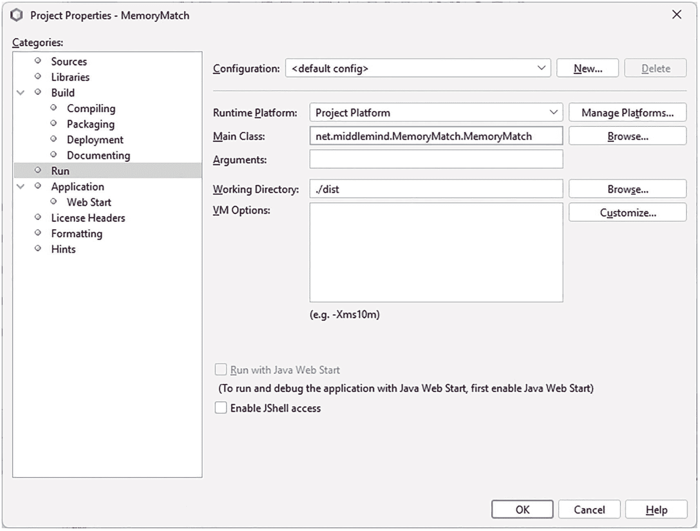

对话框的截图显示了内存匹配中不同类别的项目属性。右侧的配置、运行时平台、参数、工作目录和 VM 选项旁边有文本框。

图 7-1

NetBeans IDE 中项目运行设置的截图

NetBeans IDE 运行设置的截图。

一旦你设置了所需的静态 main 类，在构建项目后，你可以通过在命令行中使用以下代码来执行它。在 Windows 上，你可以使用命令提示符来执行命令。在 Mac 或 Linux 上，你可以使用终端窗口。请在线搜索适用于你操作系统的启动正确控制台的步骤。你可以通过运行类似以下的命令来执行你新构建的 Java 程序：

```
java -jar MemoryMatch.jar
```

通常，新创建的 JAR 文件位于项目根目录的 `dist` 文件夹中。这是运行类似上述控制台命令的最佳位置。在进入下一节（一个新的代码挑战）之前，我想列出一个非常简单的、包含静态 main 方法的类。

```
01 public class SimpleExecutableClass {
02     public int myField = 0;

04     public static main(String[] args) {
05         System.out.println("The SimpleExecutableClass has received " args.length + " arguments.");
06     }
07 }
清单 7-12
一个包含静态 Main 方法的基本 Java 类
```

一个简单的可执行 Java 类示例。

你可以将此示例作为未来任何可执行类的模板。大多数情况下，你的项目中应该只有一个包含静态 main 方法的类，但偶尔也可能有多个。在这种情况下，你可以使用以下命令来指定要运行哪个静态 main 方法：

```
java -cp MemoryMatch.jar com.test.project.newExecClass
```

如果我们正在测试 Memory Match 游戏主可执行文件的新副本，我们需要运行以下命令：

```
java -cp MemoryMatch.jar net.middlemind.MemoryMatch.MemoryMatch2
```

在这两种情况下，我们都是通过提供完整的类路径、包名和类名作为 `-cp` 命令的参数来指定用作主可执行文件的类。思考一下类包在此处的作用，并牢记 Java 中类的组织方式。这在我们下一章回顾库时会派上用场。接下来，我们将尝试另一个编码挑战，并在此过程中探索静态主入口点、项目设置和资源。

## 挑战：地牢陷阱的静态 Main

在这个挑战中，也就是本章的第三个也是最后一个挑战，我们将研究 Memory Match 游戏的静态主入口点。我们将进一步了解项目及其资源是如何配置的，并且我们将创建一个包含两个静态主入口点的项目，以便获得运行可选可执行类的一些经验。让我们来看看这个挑战！

涉及的包：

```
net.middlemind.MemoryMatch_Chapter7_Challenge3
net.middlemind.MemoryMatch_Chapter7_Challenge3_Solved
```

描述：

找到包 `net.middlemind.MemoryMatch_Chapter7_Challenge3`，并打开 `MemoryMatch.java` 文件。项目中的一些图形设计师想尝试为 Memory Match 游戏使用一套新的资源，但又不想占用开发者太多时间。你的挑战是创建一个 `MemoryMatch.java` 静态 main 类的副本，并更改它使用的游戏引擎配置文件。将其指向这个新文件：

```
engine_config_mmg_memory_match_test.xml
```

这将把游戏连接到存储于以下目录中的一组新资源：

```
.\MemoryMatch\cfg\drawable\MemoryMatchTest
```

你需要更改项目设置以使用新的静态 main 文件，在测试时直接运行特定文件，或者使用正确的控制台命令来运行你刚刚创建的新静态 main 可执行文件。

提示：

回想一下你的第一个编码挑战，当时你修复了一个在测试后意外损坏的 Pong Clone 游戏版本。该挑战探讨了 Java 游戏项目与其资源之间的联系。本质上，每个游戏项目都使用一个配置文件，该文件设置视频游戏的名称并确定查找游戏资源的文件夹。

通过为 Memory Match 游戏创建一个新的静态 main 方法，你可以指定一个新的游戏引擎配置文件，该文件将进而指定一组新的游戏资源。花点时间追踪任何包含的视频游戏项目，以便更好地了解它们是如何配置的。


## 挑战解决方案

这个挑战挺有意思的。从完成它所需的实际工作量来看，这是一个简单的挑战。然而，确切知道该做什么并不十分明确，并且依赖于之前编程挑战中的先验知识。我们来谈谈解决这个问题所需的步骤。你可能注意到的第一件事是，这个挑战要求你修改游戏的配置文件，并为我们提供了一些新的资源。

对项目目录结构的粗略探索揭示了所提到的新配置文件。让我指出文件中的一个重要条目：

```

游戏配置文件中的这一行用于在本地配置文件夹中查找游戏资源。

```
./MemoryMatch/cfg/
```

花点时间查看项目的 `cfg` 目录，并留意是否有任何名为“MemoryMatchTest”的文件夹。你应该已经在项目的可绘制资源目录中找到了一个具有该名称的文件夹。这个文件夹以其用于游戏标志、棋盘和倒计时数字的不同图像资源而著称。

要解决这个挑战，只需将静态主文件 `MemoryMatch.java` 复制到一个新文件 `MemoryMatchTest.java` 中。确保通过右键单击挑战的包并选择“粘贴 ➤ 重构复制”来选中“重构复制”选项；在重构时指定正确的名称 `MemoryMatchTest`。现在你已经设置好了文件，你需要打开它并更改以下类字段中指定的 XML 配置文件：

```
public static String ENGINE_CONFIG_FILE = "../cfg/engine_config_mmg_memory_match_test.xml";
```

完成这些步骤后，你应该能够更改项目设置，以默认使用新的静态主可执行文件。或者，你也可以直接在 IDE 中通过右键单击目标文件并选择“运行文件”，或者使用正确的控制台命令来运行它。选择权在你。这里的主要收获是理解静态主入口点的重要性，并获得更多使用游戏引擎的经验。你应该会看到游戏版本中一些关键资源使用了灰度图像，而不是彩色图像（图 7-2）。

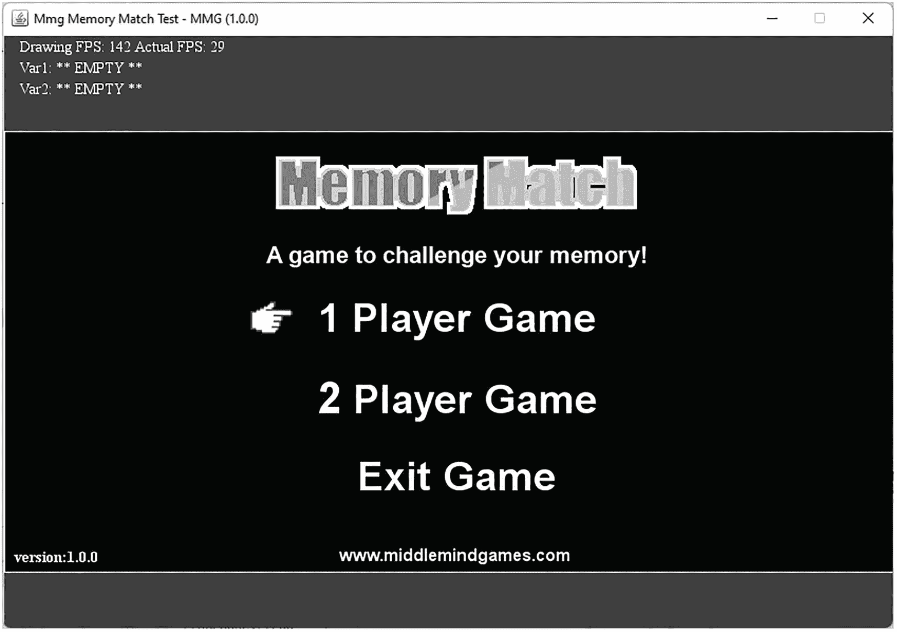

记忆匹配游戏介绍页面的截图，提供了单人游戏、双人游戏或退出游戏的选项。

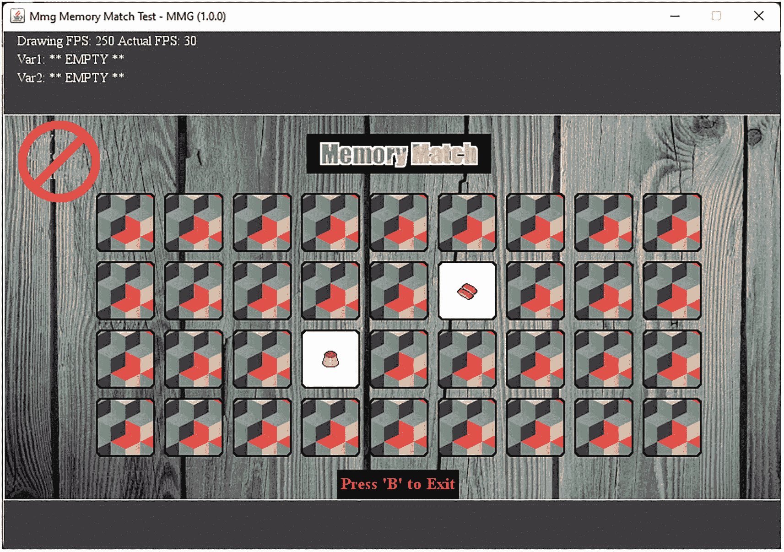

一张截图显示了排列成 4 行的 36 个方块。第二行和第四行中各有一个方块是翻开的。底部文字显示“按 b 退出”。

图 7-2
修改后的记忆匹配克隆版截图

一组截图展示了记忆匹配游戏的克隆版本，其配置文件已修改，指向一个备用的游戏资源文件夹，其中包含一些替换了彩色图像的灰度资源。

至此，本节内容就结束了。请花些时间，仔细完成本章的代码挑战。如果遇到困难，请使用解决方案包来找出问题所在。

结论

至此，我们结束了关于 Java 类的第一章。在本章中，我们花时间讨论了 Java 编程语言的一些面向对象特性。我们甚至花时间探讨了类设计的一些微妙之处，并完成了三个编码挑战。还不错。让我们来看看本章所涵盖内容的总结。

我们涵盖的内容

让我们来看看本章中遇到的面向对象编程主题和编码挑战：

*   **类声明**：我们查看了一些基本的类定义，并讨论了这一级别的访问修饰符。
*   **字段**：我们讨论了向类中添加字段，以及使用访问修饰符来控制这些类字段的使用方式。
*   **方法**：我们通过回顾类方法、访问修饰符、方法参数等，进一步探索了 Java 类。
*   **静态成员**：我们通过回顾静态字段和方法等静态类成员，进一步加深了对类的理解。
*   **构造方法**：类初始化从未如此简单。我们查看了类的构造方法，并区分了默认构造方法和自定义构造方法。
*   **挑战：MmgBmp 类**：这个挑战让我们通过向游戏中添加自己的图像，获得了直接修改游戏的经验。我们获得了更多使用游戏引擎类（如 `MmgBmp` 和 `ScreenGame`）的经验。我们还成功地将自己的图像添加到了游戏画面中！
*   **挑战：ScreenGame 类**：这个挑战让我们获得了更多处理用户输入的经验。我们配置了 `ScreenGame` 类来处理新的键盘输入，以动画方式显示和隐藏我们的新游戏图像。通过这种方式，我们添加了一个有点不必要的游戏功能，但添加类似新游戏功能的过程是相同的。
*   **访问**：一个稍微高级的话题；我们讨论了类中访问修饰符的一些细节。
*   **类设计**：我们讨论了一些类设计概念。这些是你在设计类时应该牢记的更高层次的想法。
*   **静态主入口点**：一个非常重要的话题；没有静态主入口点，你就无法运行程序。我们涵盖了这一主题，并演示了如何创建静态主类，以及如何执行包默认的和目标可执行的 Java 类。
*   **挑战：地牢陷阱的静态主入口点**：本章的最后一个挑战；我们通过为记忆匹配游戏创建一个使用不同游戏资源集的新可执行 Java 类，获得了更多关于游戏引擎、游戏引擎配置文件、游戏资源和静态主入口点的经验。

Java 类是我们编码工具箱中一个极其强大的工具。每次你坐下来编写 Java 程序时，都会用到类。知道如何创建类并通过访问修饰符、自定义构造方法和类方法来定义它们的用途，为你作为 Java 开发者打开了一个全新的可能性世界。在下一章中，我们将更进一步，回顾一些强大的语言特性，这些特性让我们能够以更多方式使用类。

脚注

8.  封装、继承和多态

本章全部关于高级 Java 面向对象编程主题，如封装、继承和多态。它们共同构成了面向对象编程的四个主要理论原则中的三个。第四个原则，抽象，超出了本文的范围，因此我们不会在此讨论。让我们通过定义 Java 面向对象编程语言的这些特性来为讨论奠定基础。

*   **封装**：*将代码和数据包装成一个单一单元的过程*，通常表现为一个 Java 类，通过类方法对字段访问进行高度控制。
*   **继承**：面向对象编程的一个关键特性，允许我们从现有类创建一个新类。创建的新类称为子类（子类或派生类），而派生子类的现有类称为超类（父类或基类）。
*   **多态**：多态与继承协同工作，允许我们以与超类实现不同的方式使用继承的类方法。

在我们完成对 Java 面向对象编程支持的回顾时，我们将依次仔细研究这些高级主题中的每一个，并且在此过程中我们将使用一个新游戏：地牢陷阱！尽情享受吧！

封装

封装是我们将要探讨的第一个面向对象编程原则。Java 中的封装指的是通过使用访问修饰符和类方法来对数据（类字段）进行战略性保护。让我们通过一个 Java 类中基本封装的例子来引入这次回顾。


```
01 public class BasicEncapClass {
02     private int field1 = 0;

04     public BasicEncapClass(int i) {
05         this.field1 = i;
06     }

08     public int getField1() {
09         return this.field1;
10     }

12     public void setField1(int i) {
13         this.field1 = i;
14     }
15 }
清单 8-1
简单 Java 类中的封装示例
```

一个采用基本封装的简单 Java 类示例。
***Java 编程说明：我喜欢将封装的概念进一步延伸，而不仅仅是使用 get 和 set 方法保护类数据。我认为正确的封装还应包括通过一组简单的类方法，恰当地暴露复杂的类功能。***
在一个封装良好的类中，根据定义，我们通过将类字段设为私有来保护对它们的访问。然后通过使用 get 和 set 方法，开放对这些字段的受控访问。我知道这有点虎头蛇尾。这种面向对象编程哲学的实际实现其实一点也不难。在我看来，在设计游戏或其他 Java 程序时，你可能会过度封装。如果这样做，可能会给游戏增加一些不必要的额外开销。
例如，是否所有简单的游戏类都应该使用严格的封装？这将导致对这些类的所有字段访问都需要调用方法，而在大多数情况下，方法调用的效率低于直接公开字段访问。这个话题没有太多可讨论的。归根结底，就是使用类的 get 和 set 方法以及字段访问修饰符，对类字段进行严格控制。在下一节中，我们将讨论 Java 中的类继承，并学习如何基于其他现有类创建新类。

继承

在 Java 中，**继承**是面向对象编程的关键特性之一，它允许我们基于现有类创建新类。创建的新类称为子类，而派生子类的现有类称为超类。让我们看看如何在 Java 中实际声明一个子类。我们将基于清单 8-1 中使用的类进行构建。请留意封装和继承是如何协同工作的。

```
//类声明
01 public class BasicEncapClass {
02     private int field1 = 0;

04     public BasicEncapClass(int i) {
05         this.field1 = i;
06     }

08     public int getField1() {
09         return this.field1;
10     }

12     public void setField1(int i) {
13         this.field1 = i;
14     }
15 }

17 public class BasicSubClass extends BasicEncapClass {
18     private int newField1 = 1;

20     public BasicSubClass(int i) {
21           super(i);
22         this.newField1 = i;
23     }

25     @Override
26     public int getField1() {
27         return this.newField1;
28     }

30     @Override
31     public void setField1(int i) {
32         this.newField1 = i;
33     }
34 }
清单 8-2
使用 Java 类的封装与继承示例
```

一组使用封装和继承的简单 Java 类示例。
请注意清单 8-2 示例类中继承的使用。类 `BasicSubClass` 继承了类 `BasicEncapClass`。你可以使用 `extends` 关键字声明一个新的子类。在 Java 中，你只能有一个超类，这意味着你一次只能继承一个其他类。在这个例子中，子类声明了一个新的类字段、构造函数以及 get/set 方法。在新的构造函数中，我希望你注意一个特殊的关键字，第 21 行的 `super`。
`super` 关键字允许你访问当前类的超类，以调用可用的方法并访问可用的字段。在子类构造函数中，它还有另一个用途。构造函数中的第一行，并且只能是第一行，可以调用超类的构造函数。在这种情况下，当你创建 `BasicSubClass` 类的新实例时，它将调用 `BasicEncapClass` 的构造函数。另外，请注意子类保留了相同的方法 `getField1` 和 `setField1`，只是重新定义了它们的功能，使其与新的类字段一起工作。
`@Override` 关键字是一种特殊的方法注解，表示当前方法覆盖（替换）了超类中同名的方法。你看到在 Java 面向对象编程中封装和继承是如何协同工作的了吗？通过隐藏类字段并通过类方法暴露功能，子类可以以受控的方式维护和扩展其超类的功能。在下一节中，我们将进行一个编码挑战，结合我们新学的 Java 面向对象编程知识。

挑战：继承
在这个编码挑战中（本章的第一个挑战），你将必须依靠你对类继承的知识，为地牢陷阱游戏添加一种新武器。让我们开始编码挑战吧！

涉及的包：

```
net.middlemind.DungeonTrap_Chapter8_Challenge1
net.middlemind.DungeonTrap_Chapter8_Challenge1_Solved
```

描述：

找到包 `net.middlemind.DungeonTrap_Chapter8_Challenge1`，并打开 `MdtWeaponSpear.java` 文件。你的任务是完成地牢陷阱游戏中的一些工作。具体任务是探索为游戏添加一把火焰长矛，作为两个玩家的默认武器。新武器资源的图形可以在游戏项目的图像资源目录中找到：

```
./cfg/drawable/DungeonTrap
```

你还必须将新武器接入游戏。由于游戏中已经有一把长矛武器，主程序员要求你使用继承来创建新的 Java 类。除了使用的图像之外，保持其他一切不变，并使新武器更强大且速度稍慢。确保该武器是两个玩家的默认武器。这将需要修改 `MdtCharInter.java` 类，该类是游戏中玩家和敌人角色的超类。你必须运行此包的文件 `–` `DungeonTrap.java`；右键单击并选择“运行文件”来测试游戏。
提示：
如果遇到困难，请仔细查看 `MdtCharInter.java` 类中如何使用 `MdtWeaponSpear.java` 类。如果你更改默认长矛的图像和攻击属性，就可以让它看起来像火焰长矛并具有其行为。思考一下这一点。然后思考 Java 中的继承，以及如何使用复制粘贴快速复制现有类。最后一个提示，玩家和敌人的默认武器是在 `MdtCharInter.java` 类的构造函数中设置的。


挑战解决方案
这个挑战是文本中较为高级的挑战之一，但如果你仔细阅读了描述和线索，我认为其中有足够的信息供你完成。整个解决方案的关键在于你对 Java 继承的运用。目标是利用现有的武器类 `MdtWeaponSpear.java` 来创建一个新版本的长矛。你需要对代码进行四处调整，包括创建新的火焰长矛 Java 武器类，以便将新武器作为玩家的默认武器添加到游戏中。现在让我们来详细了解一下这些调整。

正如我们之前提到的，你需要做的第一项调整是重构复制 `MdtWeaponSpear.java` 类，并将其重命名为类似火焰长矛类的名称。我们选择将其命名为 `MdtWeaponSpearFlame.java` 类。接下来，我们必须修改用于显示武器的图像资源，使其看起来更像火焰长矛，而不是普通长矛。图像资源已包含在游戏的资源文件夹中供你使用。

找到它们，并使用图像文件的名称（包括扩展名）来更改新火焰长矛类所使用的图像资源。接着，我们需要让武器的表现有所不同，实现一次更强但更慢的攻击。为此，我们将攻击强度从 1 点增加到 2 点，并通过将武器时间从 250 毫秒减少到 350 毫秒，使武器速度减慢 100 毫秒。

最后，我们需要将火焰长矛设置为游戏中所有玩家的默认武器。要实现这一点，我们必须查看 `MdtCharInter.java` 类。这是游戏中所有角色的超类，因此其中包含设置默认武器的代码。按照现有代码的示例，将新武器添加到角色支持的武器列表中，然后将其设置为已装备的武器。如果你完成了所有适当的调整，最终应该会得到一个像图片 8-1 中所示的红色长矛。

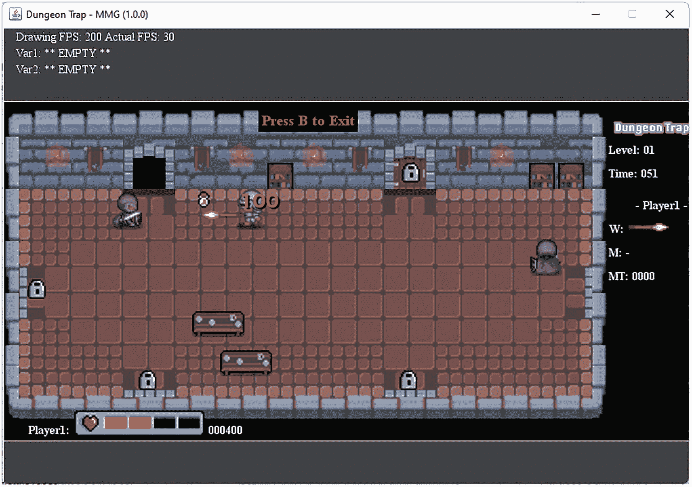

一个地牢陷阱游戏的用户界面。屏幕显示玩家 1 的生命值，顶部有一个弹出窗口，显示“按 B 退出”、“等级 0”以及所用时间 051。两个卡通角色正在互相射击。

图片 8-1
展示新火焰长矛运行效果的截图

一张展示新火焰长矛在“地牢陷阱”游戏中运行效果的截图。

至此，本章的这一部分就结束了。我们将在回顾高级类主题时继续讨论，接下来会探讨 Java 中的多态性。如果你无法让代码更改在此挑战中正常工作，请花点时间查看解决方案包中的代码。

多态性

多态性，在计算机编程语境之外定义，意为“多种形态”，它发生在通过继承相互关联的类之间。事实上，我们在本章前面已经见过一个例子，只是当时我们尚未意识到。现在，让我向你展示我们之前看过的同一个代码清单，即清单 8-2，我们将从 Java 面向对象编程中多态性的角度来讨论它。

```
//类声明
01 public class BasicEncapClass {
02     private int field1 = 0;

04     public BasicEncapClass(int i) {
05         this.field1 = i;
06     }

08     public int getField1() {
09         return this.field1;
10     }

12     public void setField1(int i) {
13         this.field1 = i;
14     }
15 }

17 public class BasicSubClass extends BasicEncapClass {
18     private int newField1 = 1;

20     public BasicSubClass(int i) {
21            super(i);
22         this.newField1 = i;
23     }

25     @Override
26     public int getField1() {
27         return this.newField1;
28     }

30     @Override
31     public void setField1(int i) {
32         this.newField1 = i;
33     }
34 }
清单 8-3
使用 Java 类展示封装、继承和多态性的示例
```

一个示例清单，与清单 8-2 相同，演示了基本的继承和多态性。注意封装是如何在超类定义中发挥作用的。

什么？我们看的是同一个类清单，但用它来回顾一个不同的主题。这是怎么回事？嗯，我使用同一个清单是有原因的。我希望你注意到封装、继承和多态性这些概念是相辅相成、紧密相连的。没有一个封装良好的类，继承就会变得不那么有用，甚至近乎混乱，需要依赖类字段和访问修饰符来控制使用。

良好的封装带来良好的继承，而这又引出了多态性。花点时间看看第 26 行和第 31 行中两个被重写的方法 `getField1` 和 `setField1`。`BasicEncapClass` 中存在同名的方法，但现在在 `BasicSubClass` 类中被重新定义了。这就是多态性的一个例子，因为方法名称保持不变，但其含义和用法可以改变。

这个主题可能有点令人困惑，在某些方面似乎有些循环论证，所以让我们换个角度来审视一下。与其使用无意义的虚构类，不如尝试用我们更熟悉的类和概念来演示这些编程特性：鱼。让我们来看一些代码！

```
//类声明
01 class Fish {
02     private int avgLen;
03     private int avgWeight;
04     private String color;

06     public Fish() {
07     }

09     public int getAvgLen() {
10         return this.avgLen;
11     }

13     public void setAvgLen(int i) {
14         this.avgLen = i;
15     }

17     public int getAvgWeight() {
18         return this.avgWeight;
19     }

21     public void setAvgWeight(int i) {
22         this.avgWeight = i;
23     }

25     public String getColor() {
26         return this.color;
27     }

29     public void setColor(String s) {
30         this.color = s;
31     }

33     public String getName() {
34         return "Fish";
35     }

37     public String getFoodSource() {
38         return "Worms";
39     }

41     @Override
42     public String toString() {
43         return "This fish, " + this.getName() + ", eats '" + this.getFoodSource() + "'.";
44     }
45 }

47 class Trout extends Fish {
48     public Trout() {
49         super.setAvgLen(25);
50         super.setAvgWeight(8);
51         super.setColor("Brown");
52     }

54     @Override
55     public String getName() {
56         return "Trout";
57     }

59     @Override
60     public String getFoodSource() {
61         return "Worms and insects";
62     }
63 }

65 class RainbowTrout extends Trout {
66     public RainbowTrout() {
67         super.setAvgLen(30);
68         super.setAvgWeight(10);
69         super.setColor("Rainbow");
70     }

72     @Override
73     public String getName() {
74         return "Rainbow Trout";
75     }
76 }
//代码
01 Fish fish = new Fish();
02 System.out.println("fish - toString: " + fish);
03 System.out.println("");

05 Trout trout = new Trout();
06 System.out.println("trout - toString: " + trout);
07 fish = trout;
08 System.out.println("fish = trout - toString: " + fish);
09 System.out.println("");

11 RainbowTrout rbTrout = new RainbowTrout();
12 System.out.println("rbTrout - toString: " + rbTrout);
13 trout = (Trout)rbTrout;
14 System.out.println("trout = rbTrout - toString: " + trout);
15 fish = (Fish)trout;
16 System.out.println("fish = trout - toString: " + fish);
17 fish = (Fish)rbTrout;
18 System.out.println("fish = rbTrout - toString: " + fish);
//输出
01 //fish
02 fish - toString: This fish, Fish, eats 'Worms'.

04 //trout
05 trout - toString: This fish, Trout, eats 'Worms and insects'.
06 fish = trout - toString: This fish, Trout, eats 'Worms and insects'.


08 //虹鳟鱼
09 rbTrout - toString: 这条鱼，虹鳟鱼，以'蠕虫和昆虫'为食。
10 trout = rbTrout - toString: 这条鱼，虹鳟鱼，以'蠕虫和昆虫'为食。
11 fish = trout - toString: 这条鱼，虹鳟鱼，以'蠕虫和昆虫'为食。
12 fish = rbTrout - toString: 这条鱼，虹鳟鱼，以'蠕虫和昆虫'为食。
清单 8-4
通过鱼类建模展示封装、继承和多态性的示例
```

一个正确封装的类 `Fish` 的示例，由 `Trout` 类扩展，而 `Trout` 类又由 `RainbowTrout` 类扩展。请注意，每个扩展类同时也是其超类的一个实例。某些类重写了方法行为，以演示多态性。
***游戏编程提示：在设计游戏类结构时，类继承是一个非常强大的工具。在游戏中，你经常会遇到敌人、武器和物品，它们都是某个通用分类的更具体实例。在建模这种结构时，类继承非常有效。*
清单 8-4 相当长；在继续之前，请花时间仔细阅读。这个示例展示了我们在此讨论的面向对象编程的三个关键方面如何协同工作。让我们回顾一下具体内容，并在此过程中探讨一些细节。首先，`Fish` 类是一个封装良好的类的示例。它有三个字段：`avgWeight`、`avgLen` 和 `color`。它还定义了两个提供鱼类特定信息的方法：`getName` 和 `getFoodSource` 方法。
类中的最后一个方法需要稍作解释。`toString` 方法带有 `@Override` 注解前缀，这表明它替换了一个已有的方法。但替换的是哪个方法呢？我们并没有定义过 `toString` 方法。实际上，正如我们之前提到的，在 Java 中，每个类都是 `Object` 超类的子类，而这个超类定义了一个 `toString` 方法，用于提供该类的字符串表示形式。
通过重写它，我们自定义了该方法以返回一个特定的值。在本例中，返回的是以下语句：
这条鱼，[鱼名]，以'[食物来源]'为食
这是多态性的一个示例，因为 `toString` 方法现在已专门为 `Fish` 类重新定义。在下一个示例中，`Trout` 类（鳟鱼是鱼类的一种特定类型）扩展了 `Fish` 类。该类定义依赖于继承来扩展超类 `Fish`，并利用多态性重新定义某些超类方法。在本例中，`Trout` 类重新定义了 `getName` 和 `getFoodSource` 方法，以提供鳟鱼特定的实现。
为了进一步说明这个示例，我们定义了第三个类 `RainbowTrout`，它扩展了 `Trout` 类。这个类作为鳟鱼的一种特定类型，只需要自定义一些已经在 `Trout` 和 `Fish` 类中定义过的类方法。在本例中，我们只需重写 `getName` 方法，以指明该类是虹鳟鱼类。请注意，每个扩展了 `Fish` 类或其子类的类，都会继承其被重写的 `toString` 方法。
查看提供的输出文本，并追踪每个类实例是如何向上转型为其超类 `Fish` 类的。请注意，即使我们将对象作为 `Fish` 类的实例进行交互，输出仍然保持自定义状态。这是多态性的一个示例，因为该类既是自身的实例，也是其所有超类的实例。这也体现了 Java 中的方法多态性。
`@Override` 方法注解用于指示某个方法是对超类定义的方法的替换。通过这种方式，可以为继承类逐个方法地定义新的、自定义的功能。这使得继承类能够扩展超类的功能。Java 中的多态性不仅适用于通过重写类方法来定制功能，还适用于子类同时也是其超类的实例这一事实。
因此，`Trout` 类的实例同时也是 `Fish` 类的实例，而 `Fish` 类的实例又是 `Object` 类的实例，以此类推。多态性的这一方面体现在第 13–17 行将子类向上转型为超类的过程中。在下一节中，我们将探讨一个涉及多态性和地牢陷阱游戏的编程挑战。


挑战：多态性
本章的第二个编程挑战将考验你运用 Java 多态能力，改变你在上一个挑战中实现的火焰长矛在游戏中的功能。这是本文中第三个从上一个挑战的解决方案出发的挑战。因此，在继续之前，确保你拥有上一个挑战的正确解决方案至关重要。请花点时间仔细核对确认。一如既往，享受挑战吧！

涉及的包：

```
net.middlemind.DungeonTrap_Chapter8_Challenge2
net.middlemind.DungeonTrap_Chapter8_Challenge2_Solved
```

描述：

找到包 `net.middlemind.DungeonTrap_Chapter8_Challenge2`，并打开 `MdtWeaponSpearFlame.java` 文件。这个挑战是另一个较为复杂的挑战，因此你需要查看以下 Java 类中的代码：

*   `MdtWeaponSpearFlame.java`

*   `MdtWeapon.java`

*   `ScreenGame.java`

*   `MdtWeaponAxe.java`

一些开发者喜欢新的长矛，但认为它与原始长矛过于相似。他们想尝试让长矛像投掷武器一样发射出去。为了实现这一改变，你需要对代码进行一些调整。游戏中存在一个投掷武器类 `MdtWeaponAxe.java`。我们需要从这个类中使用一些方法，使我们的武器可投掷。首先，你需要将以下方法从 `MdtWeaponAxe.java` 文件复制并粘贴到 `MdtWeaponSpearFlame.java` 文件中：

*   `GetX()`

*   `SetX(int i)`

*   `GetY()`

*   `SetY(int i)`

*   `SetPosition(MmgVector2 v)`

*   `SetPosition(int x, int y)`

这将使新的火焰长矛能够像投掷武器斧头一样处理其 X、Y 坐标或位置的设置。接下来，我们需要调整所有武器的超类 `MdtWeapon.java` 类，以支持新的可投掷长矛。在这个类中找到以下方法：

*   `GetWeaponRect()`

*   `MmgDraw(MmgPen p)`

其中有专门处理投掷斧头的代码分支；请扩展这两个 `if` 语句，使其也支持可投掷长矛。类似地，必须在 `ScreenGame.java` 类的 `ProcessAClick` 方法中进行更改。在该方法中找到两处需要修改 `if` 语句以包含可投掷长矛（而不仅仅是斧头）的地方。如果实现正确，进行这些调整将使新的长矛飞出并旋转。你必须运行此包的文件 `–` `DungeonTrap.java`；右键单击并选择“运行文件”来测试游戏。

提示：
这是一个艰巨的挑战，如果你遇到困难，几乎没有线索可以指引你。请仔细阅读描述中提供的类和方法的说明。留意代码中斧头的不同行为，并记住你正在制作一把投掷长矛，因此它的功能将与斧头相同。

挑战解决方案
正如我们之前提到的，解决这个挑战需要正确完成本章关于继承的第一个挑战。如果你遇到了困难但仍想继续前进，你可以通过复制并粘贴标记的代码更改，使用第 7 章挑战 1 的解决方案作为本挑战的起点。此解决方案要求你对游戏代码进行五处更改，才能成功解决挑战。

该解决方案需要在五个不同的地方进行更改。让我列出调整的位置以及我们指定的顺序。你完全可以用不同的方式完成，这完全没问题。

*   `MdtWeaponSpearFlame.java` 和 `MdtWeaponAxe.java`：在这种情况下，我们需要复制覆盖定位功能的方法，使武器能够独立于持有者移动。

*   `MdtWeapon.java`：需要在 `GetWeaponRect` 方法中进行调整。

*   `MdtWeapon.java`：需要在 `MmgDraw` 方法中进行调整。

*   `ScreenGame.java`：需要在发射武器时的 `ProcessAClick` 方法中进行调整。

让我们按顺序并详细地回顾一下所做的调整。我们需要做的第一个更改是利用多态性覆盖超类定位方法的功能。我们在此进行的调整使武器现在可以独立于持有它的玩家移动。我们可以重用 `MdtWeaponAxe` 类中的代码，因为它也是可投掷的。接下来，我们转到 `MdtWeapon.java` 类，查看 `GetWeaponRect` 方法。此方法用于计算描述武器应在屏幕上绘制位置的矩形。

对于非投掷的刺击武器，该方法根据武器刺击动画的进度来计算矩形。对于投掷武器（斧头和现在的火焰长矛），我们返回描述投射物在屏幕上的位置及其朝向的矩形。需要调整 `if` 语句以包含 `SPEAR` 武器类型。你的编码工具箱中拥有完成此任务所需的所有工具。需要对 `MmgDraw` 方法进行类似的更改，以便在绘制投掷武器时包含长矛。

请注意，`MdtWeapon` 类是 `MdtWeaponAxe`、`MdtWeaponSpear` 和 `MdtWeaponSpearFlame` 类的超类。这就是为什么在此处更改代码会影响所有扩展类。集中化给我们带来了便利，但也增加了复杂性，因为我们必须在此级别支持不同的武器（投掷和刺击）。我们需要做的最后一个更改是支持将武器的新副本添加到游戏的可绘制对象中。这通过 `ScreenGame` 类的 `ProcessAClick` 方法实现。当玩家发射武器时，会向游戏中添加一个克隆体。由于我们进行的所有更改，这个克隆体可以自行飞出并旋转，直到与某物碰撞。

以上就是我们解决这个编程挑战所需进行的更改。这绝非易事，并且肯定用到了我们编码工具箱中的一些工具。如果你没有成功，请不要担心；只要通过复习解决方案学到了东西，你就做得很好。在下一节中，我们将通过讨论如何共享类并将其包含在我们的程序中，来结束对类的回顾。

导入类库
既然你已经对 Java 类以及封装、继承和多态等 OOP 概念有了很好的理解，你需要深入了解如何打包代码并在其他程序中使用它。为此，你需要构建一个 Java 项目并获取生成的 JAR 文件。在大多数情况下，这类项目不包含静态 main 方法，只包含 Java 类。

这通常被称为库。你可以通过共享项目的 JAR 文件来共享你的库。要在 NetBeans IDE 中向项目添加库，请右键单击项目，然后从上下文菜单中选择“属性”。在属性弹出窗口中，从左侧的类别部分选择“库”选项。当使用本地 JAR 文件时，我们将在“类路径”部分添加一个新条目。单击“+”按钮，然后从可用选项中选择“添加 JAR/文件夹”。此过程的屏幕截图如图 8-2 所示。


项目属性用户界面的对话框包含主要组件，如源、库、构建、运行、应用程序、标头、格式化和提示。

图 8-2
NetBeans IDE 中项目库设置的屏幕截图

显示项目属性弹出窗口中“库”部分的屏幕截图。


此过程与你在第 1 章中设置视频游戏项目及其本地库文件时使用的过程相同。现在，你已向项目添加了一个库，在使用它之前，需要将该包包含到你的 Java 程序中。为此，你需要使用 Java 的 `import` 关键字。以下是导入视频游戏引擎主要包的示例：

```
import net.middlemind.MmgGameApiJava.MmgCore.*;
import net.middlemind.MmgGameApiJava.MmgBase.*;
```

当使用类导入过程中的通配符功能时，你将能够访问指定 Java 包中的所有类。这很方便，但并不直观，而且会隐藏哪些类实际属于哪些包。让我们看看如何只导入一个 Java 类。在本例中，我们添加了对 `MmgBmp` 类的访问权限。

```
import net.middlemind.MmgGameApiJava.MmgCore.MmgBmp;
```

请注意，所有 Java 类都是通过其包名导入的。在使用 Java 时请牢记这一点。花些时间熟悉 Java 内置类框架中最常用的包。你会经常用到的两个重要包是 `java.io` 和 `java.util`。你可以在以下地址找到有关 Java 框架中可用类的更多信息：
 [`https://docs.oracle.com/en/java/javase/11/docs/api/index.html`](https://docs.oracle.com/en/java/javase/11/docs/api/index.html) 
至此，我们关于导入和访问类库的部分就结束了。在下一节中，我们将了解视频游戏项目的通用共享结构。

视频游戏项目结构
由于所有附带的视频游戏项目都基于同一个游戏引擎，因此它们具有相似的设置和配置。以下三个 Java 类设置了静态主入口点，以及两个将游戏引擎屏幕连接到窗口和面板的关键类。我将在此列出这些类：
**游戏的静态主入口点：** 通常以游戏本身命名，例如 PongClone.java、MemoryMatch.java 和 DungeonTrap.java。项目的这一部分为游戏提供了可执行类。同时，正如你在一些编程挑战中所见，它还通过游戏引擎的配置文件建立了视频游戏与其资源之间的连接。

**MainFrame.java：** 此类设置主框架的窗口，`GamePanel` 类将在其中渲染自身。此类主要用于维持超类功能。请注意，它继承自游戏引擎的类库。

**GamePanel.java：** 此类负责处理加载屏幕和启动屏幕的事件，并根据游戏状态在游戏屏幕之间切换。此类的许多功能都来自其超类。

使用这三个类，稍作调整，重构可执行类并将游戏指向新的游戏引擎配置文件，是设置新游戏的基础。游戏可执行类中一个非常重要的类字段是 `ENGINE_CONFIG_FILE`。我列出了 Pong Clone 游戏中的这个类字段。

```
/**
* 基础引擎配置文件。
*/
public static String ENGINE_CONFIG_FILE = "../cfg/engine_config_mmg_pong_clone.xml";
```

游戏引擎配置文件用于指定一些关键的游戏引擎设置。我们需要关注的主要是 NAME 条目。该文件使用 XML 编码，但应该足够简单，你无需任何研究即可编辑。只需更改 name 条目中“val”属性的值即可。该值必须与包含游戏资源的文件夹名称相同。

```

这对应于 NetBeans 项目文件夹本地的以下目录结构：

```
./cfg
-> class_config
-> MemoryMatch
-> drawable
-> MemoryMatch
-> MemoryMatchTest
-> playable
-> MemoryMatch
-> engine_config_mmg_memory_match.xml
-> engine_config_mmg_memory_match_test.xml
```

游戏引擎的某些方面超出了本文的范围，但我希望你能够使用游戏引擎创建新游戏和视频游戏项目。cfg 文件夹中有四种受支持的资源。class_config 目录包含用于调整特定游戏类中资源的配置文件。此文件中的条目在运行时提供数据，用于设置游戏屏幕的图像资源等。
drawable 目录用于存放图像资源，支持以下图像文件类型：PNG 和 JPG。放置在游戏文件夹中的任何图像都将自动加载，并可通过其完整文件名（包括扩展名）访问。我们之前也在之前的编程挑战中看到过图像加载过程。playable 目录与 drawable 目录类似，只是它用于加载声音文件。我们建议对音效和音乐使用 WAV 文件。
最后，cfg 文件夹的根目录下还有一些 XML 文件。这些是特定游戏副本的游戏引擎配置文件。多个项目可以指向相同的资源。编程挑战的设置方式就体现了这一点。每个挑战都是游戏项目本身中的一个包，并且在大多数情况下配置为访问相同的资源和配置文件。你会注意到 drawable 和 playable 目录中都有一个 auto_load 文件夹。这些文件夹中的任何资源都会默认加载，并且你可以通过其完整文件名在游戏中使用它们。
至此，我们关于本文附带的视频游戏项目的配置和设置部分就结束了。在下一节中，你将面临挑战，需要自己创建一个新的视频游戏项目。祝你玩得开心！

挑战：创建一个新的游戏项目
在本章第三个挑战中，我们将探索如何设置一个新的游戏项目。仅此而已。这是一个艰巨的挑战；你可能第一次尝试无法成功；别担心。你随时可以参考现有项目，了解其设置方式并复制配置。

涉及的项目：

```
PongClone
MyNewGameSolved
```

描述：
这个挑战完全关乎你自己。我们不会为任何人或任何事执行任何开发任务。在这个挑战中，你将通过创建一个新游戏项目来探索视频游戏项目的配置，该项目是现有项目的功能克隆。我应该提一下，这是第一个解决方案是项目而非包的挑战。

你的目标是利用你对 NetBeans IDE、游戏引擎以及前面所有章节中项目配置的知识，将 Pong Clone 游戏克隆到一个名为“MyNewGame”的新项目中。我将概述解决此挑战所需的一般步骤，剩下的就靠你自己了。我们将在本挑战的解决方案部分详细回顾该过程。

1.  创建一个名为“MyNewGame”的新 NetBeans IDE 项目。

2.  添加并配置 jutils、jinput 和 MmgGameApiJava 库的库文件。

3.  将 PongClone 项目的 cfg 目录复制到新的 MyNewGame 项目的本地目录中。

4.  从 PongClone 项目的 net.middlemind.PongClone 包中复制所有 Java 类文件，并将它们“重构复制”到新项目中。为重构后的包任意命名。

5.  配置项目设置，包括默认的静态主类、输出目录、Java 版本和工作目录。

6.  执行项目并验证 Pong Clone 游戏是否正常运行。

全力以赴，祝你好运！
提示：
你可以使用任何相关的视频游戏项目作为如何配置新 NetBeans 项目的示例。使用 PongClone 项目作为实际类和游戏资源的示例。请记住，你的目标是通过将 Pong Clone 游戏克隆到一个新的 NetBeans 项目中，创建一个副本作为新视频游戏的起点。


挑战解决方案  
本挑战的解决方案并不显而易见。你需要完成一系列配置步骤，才能创建一个新的视频游戏项目，并以功能完整的 Pong 克隆游戏副本作为项目的种子配置。下面我们来详细讲解每一步流程。

**步骤 1：创建新项目以进行自定义**

从 NetBeans 菜单中选择“文件 ➤ 新建项目”。选择“Java 应用程序”作为项目类型。

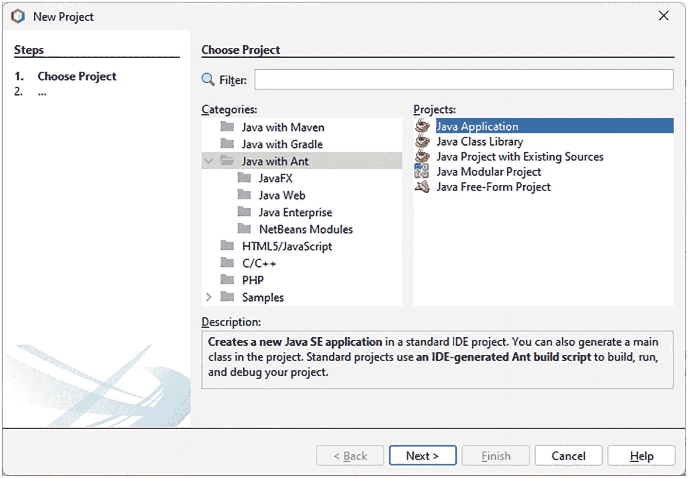

新建项目的用户界面对话框显示了一个选项，用于选择包含 Java 与 Maven、Gradle、Ant 和 JavaScript 类别的项目。

**图 8-3**  
新建项目对话框截图 – 选择项目类型

从“Java 与 Ant”项目类别中选择“Java 应用程序”选项。

将“项目名称”设置为“MyNewGame”，并选择项目的位置。不要勾选“创建主类”选项，因为我们将使用 PongClone 项目中的主类副本。

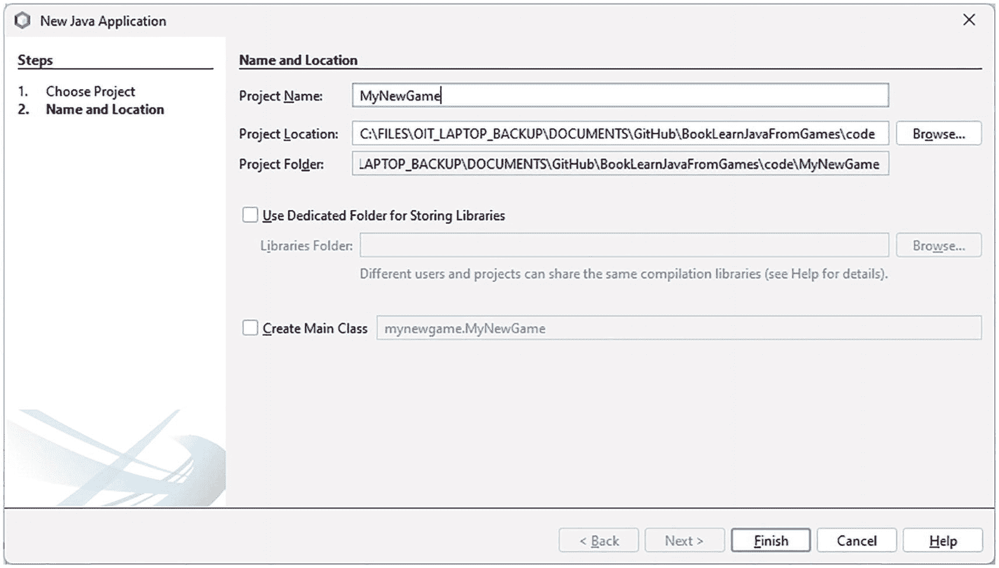

新建 Java 应用程序的用户界面对话框要求输入名称和位置。它包含项目名称、位置、文件夹名称、库存储位置以及主类。

**图 8-4**  
新建项目对话框截图 – 名称和位置

此截图显示了新建项目对话框的第二步。请记住**不要**勾选“创建主类”复选框。完成项目创建过程，并在 NetBeans 项目列表中展开其条目。

**步骤 2：添加默认项目库**

新项目设置完成后，现在你需要像我们在第 1 章中所做的那样，配置基础库集合。如有需要，可回顾该过程以完成此步骤。图 8-5 显示了已添加 Java 库的截图。

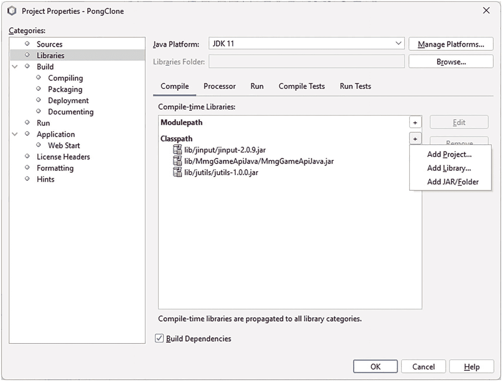

项目属性的用户界面对话框包含以下类别：Java 平台、库（折叠）、编译、处理器、运行，以及添加项目和添加库弹出窗口。

**图 8-5**  
已配置库的项目属性截图

此截图显示了 MyNewGame 项目及其配置好的基础库集合。请参考第 1 章了解如何设置项目库。

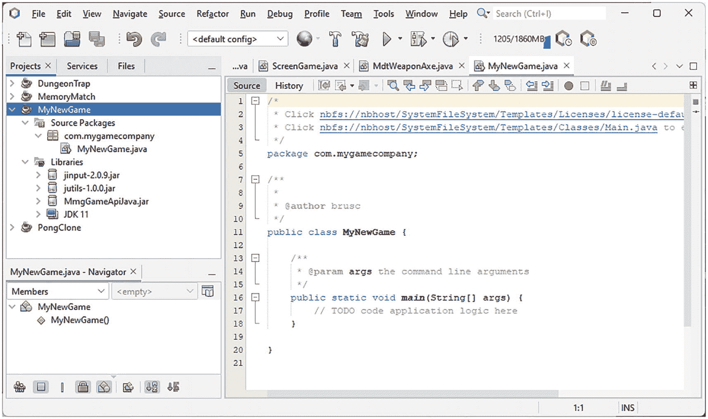

新建项目的对话框包含菜单栏、工具栏、项目源、服务、文件以及我的新游戏的源代码。

**图 8-6**  
已配置库的新项目截图

此截图显示了已配置库的新游戏项目。新的 NetBeans 项目和库已设置完毕，接下来我们可以添加 Pong 克隆游戏的资源文件夹。

**步骤 3：复制资源文件夹**

资源文件夹 `cfg` 位于每个游戏的 NetBeans 项目文件夹的根目录下。它包含所有游戏资源和配置信息。将其复制到新项目中，即可作为新项目的游戏资源和配置信息来源。

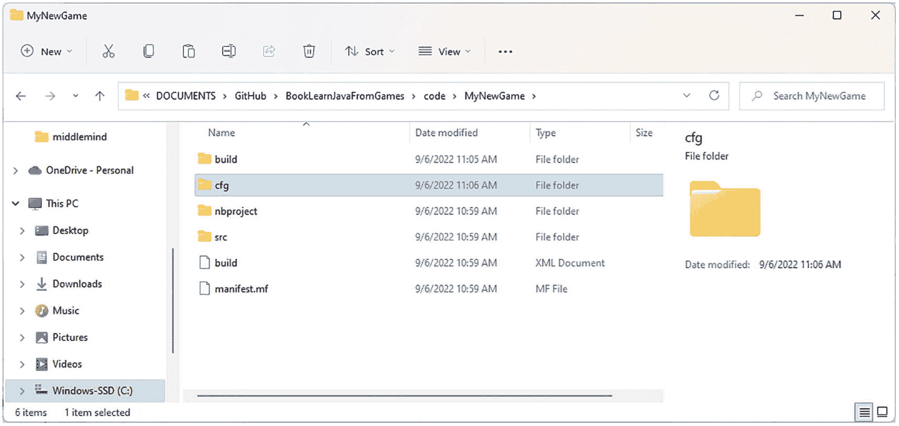

我的新游戏文件夹包含 build、configuration、nbproject 和 source 子文件夹。项目路径为 documents、github、book learn java from games、code 以及 my new game。

**图 8-7**  
包含游戏资源文件夹 `cfg` 的新项目截图

此截图显示了新游戏项目及其复制过来的配置和资源文件夹 `cfg`。

只需将文件夹从 Pong 克隆游戏的项目文件夹复制并粘贴到新游戏的项目文件夹中即可。我们还需要稍微自定义游戏的配置文件，以便能够区分这是游戏的不同版本。找到并打开位于以下路径的游戏 XML 配置文件：

```
./MyNewGame/cfg/engine_config_mmg_pong_clone.xml
```


我们希望将 TITLE 和 COMPANY_NAME 条目更改为新的字符串值，以便区分我们自己的游戏版本。

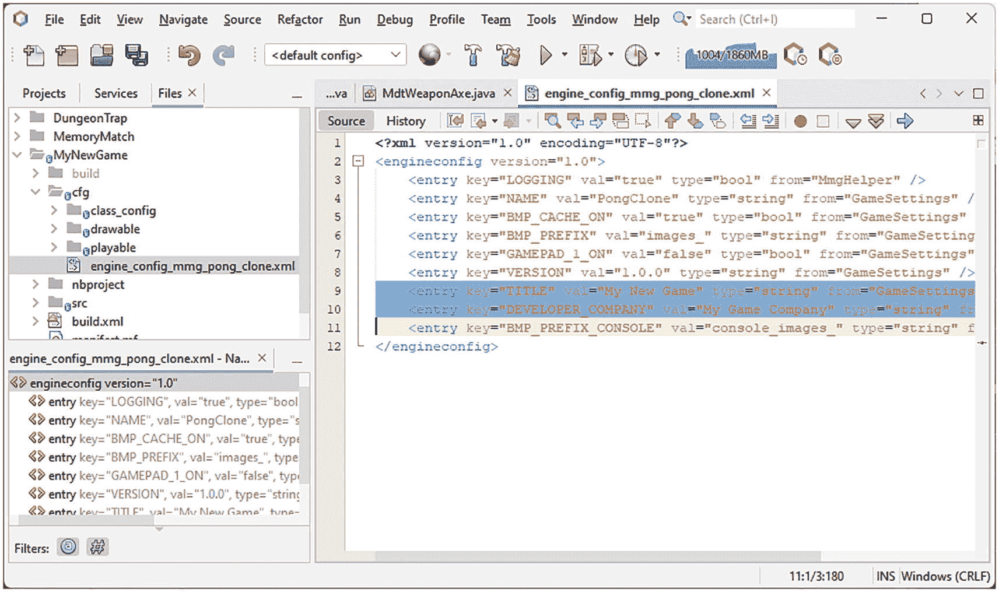

一个新建项目源代码的对话框，包含一个菜单栏，以及项目服务、文件和引擎配置代码（共九行，版本号为 1.0）的选项。

图 8-8
新项目 engine_config_mmg_pong_clone 配置文件的截图

一张新游戏项目的游戏引擎配置文件截图，其中 TITLE 和 COMPANY_NAME 条目已被修改，以标识该游戏的新副本。
你可以在 NetBeans IDE 中直接打开并编辑该文件，只需在“文件”选项卡中找到它即可。展开新游戏项目的条目，然后在 cfg 目录中找到该文件。

步骤 4：复制 PongClone Java 类

我们将用 Pong Clone 游戏中的 Java 类来填充我们的新项目。你可以直接在 NetBeans IDE 中，在项目之间复制粘贴这些类。

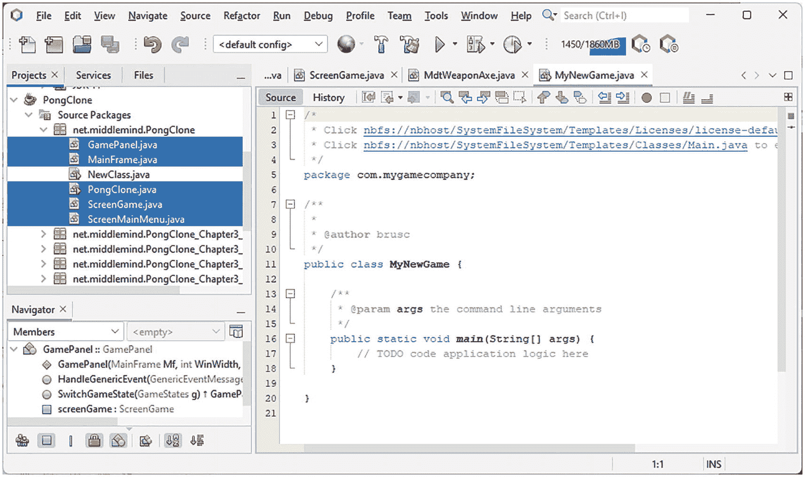

一个类文件的对话框，其中 game panel、main frame、pong clone java、screen game java 和 screen main menu java 文件呈蓝色高亮显示，右侧是代码行。

图 8-9
显示 Pong Clone 类文件选择的截图

一张显示选中 PongClone 项目 Java 类文件的截图。

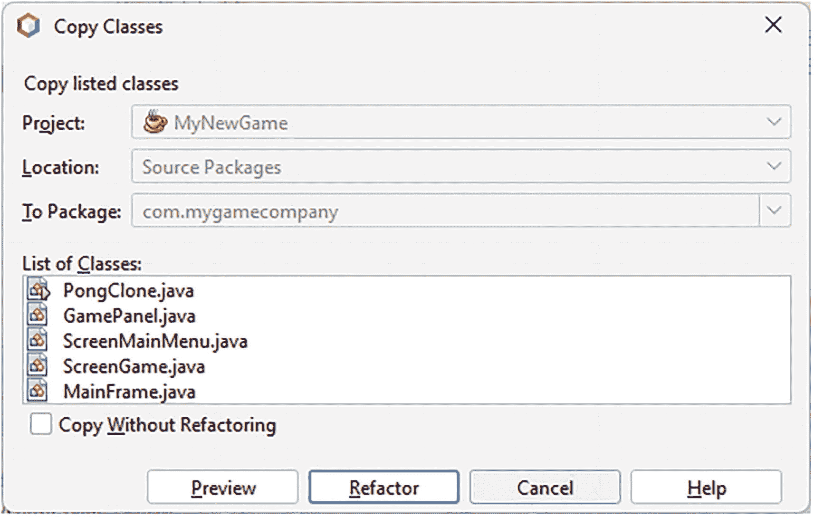

一个复制类的对话框，包含项目名称、项目位置、包名以及一个类列表。类列表包括 pong clone、game panel、main menu、screen game 和 main frame。

图 8-10
显示重构复制对话框的截图

一张显示重构复制对话框的截图。点击“重构”按钮，将类重构复制到新游戏项目中。

你应该将主可执行类从“PongClone.java”重命名为“MyNewGame.java”，方法是右键单击该文件，然后从上下文菜单中选择“重构 ➤ 重命名”，如图 8-11 所示。

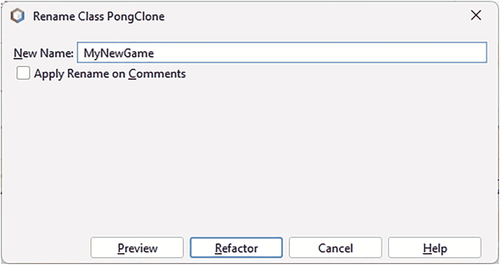

一个重命名类 pong clone 的对话框，包含添加新名称、对注释应用重命名、预览、重构、取消和帮助等选项。

图 8-11
显示重命名 PongClone 主类的截图

一张显示重命名文件重构对话框的截图。
你几乎已经准备好运行游戏了。类已复制到位，库已设置好，并且已连接资源文件夹。接下来，我们将微调一些项目设置。

步骤 5：配置项目设置

在运行游戏之前，你需要检查一些项目设置。首先是设置项目的“工作目录”。由于游戏需要在预期位置找到 cfg 目录，我们将“工作目录”字段设置为“./dist”，如图 8-12 所示。你还应该设置“主类”。图中显示了一个默认类；请确保你的类设置为 MyNewGame.java 类。

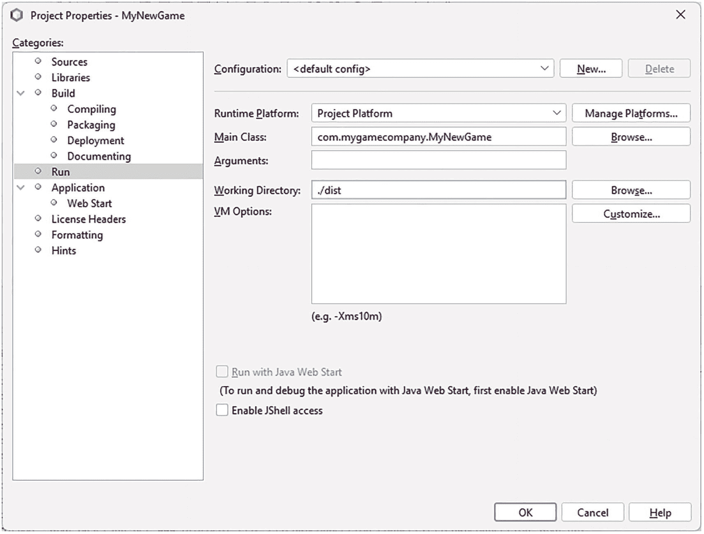

一个项目属性的对话框，包含子部分：源、库、构建和运行选项、配置、运行时平台、主类和参数。

图 8-12
显示新项目运行设置的截图

一张显示新项目设置（已配置工作目录和主类）的截图。
最后，我们可以运行游戏了！

步骤 6：执行 Pong Clone 副本

确保项目已全新构建，方法是右键单击项目，然后从上下文菜单中选择“清理并构建”。现在，通过单击 PongClone.java 文件并从上下文菜单中选择“运行文件”来运行项目。

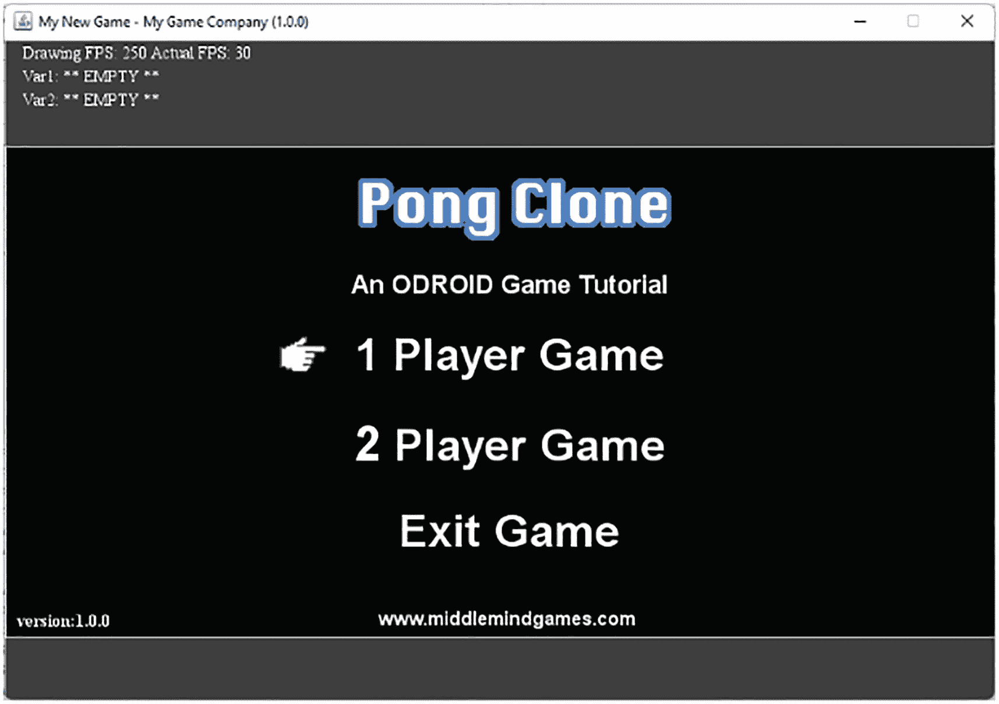

一个 Pong Clone 新游戏的用户界面。屏幕显示玩家游戏 1、玩家游戏 2 和退出游戏选项。

图 8-13
显示新项目运行中的截图

一张显示新游戏运行中的截图。注意标题与默认的 Pong Clone 游戏不同。
恭喜！你现在可以使用简单的 Pong Clone 游戏作为起点来创建新的游戏项目了。你可以根据需要清理代码或修改代码。将这一知识与通过编辑 `ScreenGame` 类来修改游戏的经验相结合，你就可以开始构建自己的简单游戏了。

结论
至此，本章以及我们对 Java 类的讨论就结束了。我们实际了解了 Java 编程语言的许多不同特性，并完成了一些有难度的代码挑战。接下来，让我们总结一下本章涵盖的内容。

本章内容回顾

你掌握了一些高级概念，并完成了一系列困难的编码挑战。你已经证明了自己的实力。让我们回顾一下我们所学的内容。

*   **封装**
    ：我们讨论了面向对象编程中封装的概念，以及如何在某些高级案例中进一步应用该概念。

*   **继承**
    ：我们讨论了 Java 中的类继承，并通过几个示例进行了演示。

*   **挑战：继承**：你接受了一个使用继承为 Dungeon Trap 游戏添加新武器“火焰长矛”的艰巨挑战。

*   **多态**
    ：我们讨论了 Java 面向对象编程中多态的概念，并在类和方法层面进行了演示。

*   **挑战：多态**：你的任务是进一步修改新的火焰长矛武器，使其可以投掷。这需要大量的技巧和知识。恭喜你完成了挑战！

*   **导入类库**：我们以讨论如何将代码打包成名为 JAR 文件的库来结束对类的回顾。我们通过讨论如何在项目中包含 JAR 文件以及如何使用 `import` 语句在代码中访问新的 Java 类来结束本节。

*   **视频游戏项目结构**
    ：这是关于 Java 编程应用的重要章节之一，特别是关于使用所包含游戏引擎的项目结构。

*   **挑战：创建新游戏项目**：这是迄今为止你遇到的最困难的挑战之一。这个挑战非常特定于游戏引擎和项目结构。如果你没有完成这个挑战也没关系，因为它包含很多步骤。

我们已经掌握了 Java 类，并学会了如何创建 Pong Clone 游戏的全新副本，用作新游戏的起始项目。你已经准备好开始构建游戏了。回顾一下不同的编码挑战，记住如何向 `ScreenGame` 类添加新图像以及如何控制它们。你正在通往制作下一个伟大游戏的道路上！

9. 调试技术

无论你多么努力，你的第一个软件解决方案的实现很少是完美的。大多数时候，我们需要调试代码，以弄清楚它在做什么，更重要的是，它哪里做错了。为了成为任何语言的成功程序员，我们需要能够熟练地调试程序，因此我们将介绍一些关于这个主题的基本概念。

输出跟踪

最基本、最有效的调试技术之一不需要特殊的软件、IDE 或库。输出跟踪使用输出语句来标记正在执行的代码以及某些变量的值。让我们通过一个例子来引出讨论。

```
//code
01 public void CheckForMatches(MemoryItem itm) {
02     System.out.println("CheckForMatches: START");
03     if(clickedCards != null) {
04         int len = clickedCards.size();
05         Stack tmp = new Stack();
06           System.out.println("CheckForMatches: AAA: " + len);

08         for(int i = 0; i < len; i++) {
09             MemoryItem tItm = clickedCards.pop();
10             ProcessMatchCheck(tItm, itm);
11             tmp.push(tItm);
12         }


14             System.out.println("CheckForMatches: BBB: " +  clickFreeze);
15         if(!clickFreeze) {
16             clickedCards.addAll(tmp);
17         }

19         System.out.println("CheckForMatches: CCC: " + clickedCards.size());
20     }
21     System.out.println("CheckForMatches: STOP");
22 }
//output
01 CheckForMatches: START
02 CheckForMatches: AAA: 1
03 CheckForMatches: BBB: true
04 CheckForMatches: CCC: 2
05 CheckForMatches: STOP
清单 9-1
使用输出语句调试程序的示例

一个使用简单标准输出语句来跟踪和调试程序的示例。
你可能还记得记忆匹配游戏编程挑战中的这段代码片段。在这个清单中，我们使用输出语句来跟踪该方法的功能。请注意，我们跟踪了关键信息，例如方法调用的开始和结束，以及`clickedCards`数据结构的大小。像这样的调试可以帮助你直观地了解代码块执行时发生的情况。这可以极大地帮助你修复代码实现中的任何错误。

至此，我们介绍了输出跟踪这一基本调试技术。在下一节中，我们将介绍使用 IDE 调试程序的更高级技术。让我们来看看 NetBeans IDE 中可用于调试 Java 游戏的工具！

IDE 调试功能
另一种稍微高级一点的调试 Java 程序的方法是依赖 NetBeans IDE 中可用的工具。其优点是更高级、更高效、更强大，但代价是需要使用 IDE 来完成调试任务。这没问题，但如果你正在进行“设备上”调试，则无法享受使用 IDE 工具的便利。你将不得不退回到更基本的输出跟踪技术。

让我们花点时间讨论一下 NetBeans IDE 中的调试功能。我们将保持高层次的概述，并专注于那些旨在帮助我们查找和修复代码中错误的功能。本章不会深入探讨更高级别的项目调试。NetBeans IDE 中的调试按钮栏如图 9-1 所示。


一张 NetBeans 调试栏图标的图片，分为两行，包含停止、暂停、播放、快退、快进、下载和上传按钮。

图 9-1
描绘 NetBeans 调试栏的图片

在进入调试模式（Ctrl+F5）后，你可以在 NetBeans IDE 顶部中央找到这个按钮栏。显示的按钮有：停止、暂停、继续、单步跳过、单步跳过表达式、单步进入和单步跳出。
要看到调试按钮栏，你必须处于项目调试模式。点击 IDE 窗口顶部的“调试项目”按钮，或按键盘上的 Ctrl+F5 开始调试当前程序。
在上图中，你可以看到跟踪开始前的调试栏（非活动按钮）以及跟踪开始后的调试栏（活动按钮）。NetBeans IDE 调试器旨在与断点配合使用。你可以通过点击代码行号附近（文本编辑器的边缘）来在代码的任何行设置断点。这将在所选行上创建一个红色高亮，表明它已被设置为调试断点。

你可能会问，什么是断点？嗯，断点告诉调试器在代码的该点停止执行程序，以便你可以查看并了解在该代码点不同变量的情况。让我们看看 NetBeans IDE 中的断点是什么样子的。

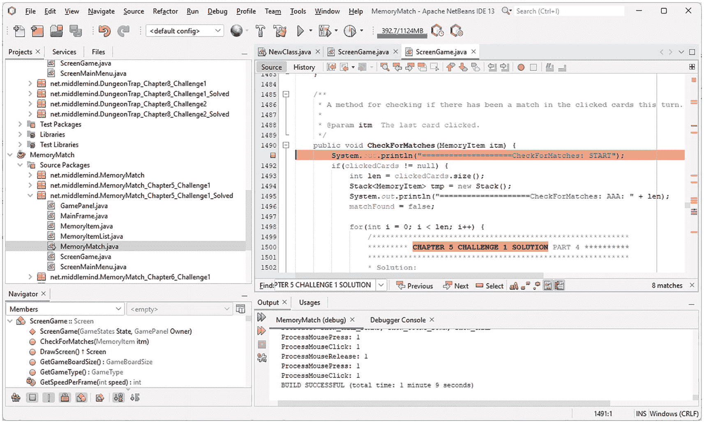

一张电脑屏幕截图，显示了一个菜单栏和四个面板，分别是项目、导航器、NetBeans 中带有断点的程序以及输出。

图 9-2
描绘 NetBeans IDE 中断点的图片

一张显示 NetBeans IDE 中断点样子的截图。

在我们讨论不同调试按钮的实际功能之前，先看看在代码中设置断点后开始调试程序会发生什么。

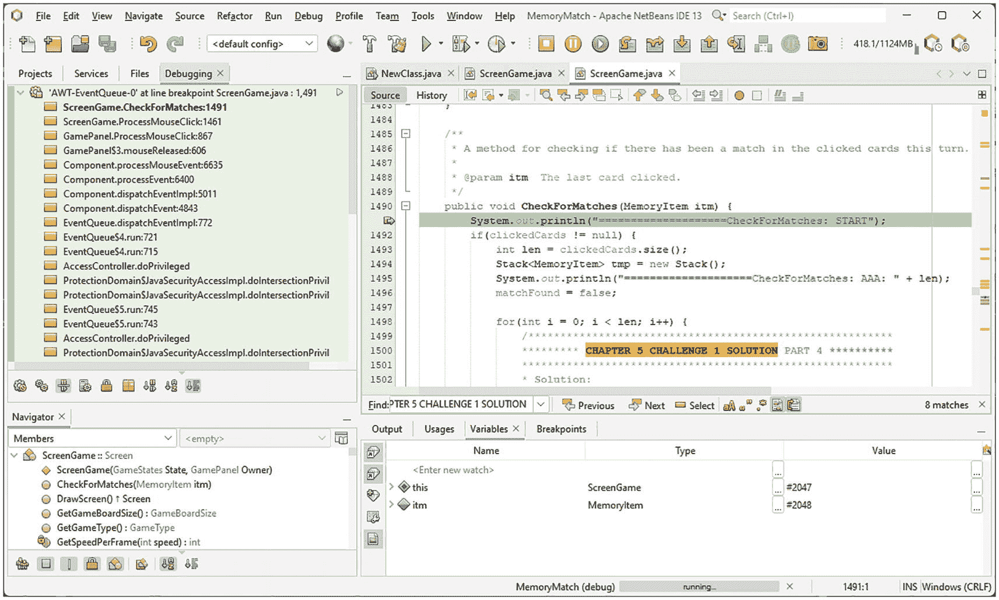

一张截图，包含一个菜单栏和四个面板，分别是调试、导航器、屏幕游戏 Java 的编程代码以及变量。

图 9-3
描绘调试过程中在断点处停止的图片

一张描绘 NetBeans IDE 在调试模式下停在断点处的图片。请注意，调试按钮栏现在已完全激活。
当调试器到达一个断点时（在本例中，该断点设置在第 5 章挑战 1 中记忆匹配游戏的一个副本中），这个特定的断点会在记忆匹配游戏板上点击了两张卡片时被触发。调试器将检测到断点并停止，等待我们的指令。我们可以使用调试栏上的所有按钮来调整程序的下一个执行行。

现在似乎是讨论调试按钮栏上每个按钮功能的好时机。我将在此列出它们并附上简要的用途说明。

*   **调试项目 (Ctrl+F5)**：用于启动项目调试会话。
*   **结束调试会话 (Shift+F5)**：用于结束项目调试会话。
*   **暂停**：用于暂停当前调试会话的按钮。
*   **继续 (F5)**：用于继续调试器。程序将执行直到遇到下一个断点。
*   **单步跳过 (F8)**：当到达断点时，使用此按钮执行下一行代码。
*   **单步跳过表达式 (Shift+F8)**：此按钮允许你逐步执行表达式中的每个方法调用，并查看每个方法调用的输入参数以及产生的输出值。如果没有更多的方法调用，单步跳过表达式的行为与单步跳过命令相同。
*   **单步进入 (F7)**：使用此按钮进入方法调用，以查看方法参数和返回值，并继续调试方法执行过程。
*   **单步跳出 (Ctrl+F7)**：使用此命令执行当前函数的剩余部分，并在函数返回完成时中断。

从可用的选项可以看出，使用 NetBeans 内置调试器探索 Java 程序的变量、参数和返回值非常容易。你可能需要一些时间来积累经验，才能真正充分利用这些调试工具，但这没关系，反正你本来就要编写代码。至此，本节内容结束。在下一节中，我们将了解 Java 编程语言中的异常。

异常
在之前讨论 Java 编程语言中的流程控制时，我们曾简要接触过`Exception`类以及一般的 Java 错误处理。我们将重新讨论这个主题，并谈谈在 Java 程序中使用异常的一些更细致的要点。

处理异常
当一行 Java 代码由于某种原因无法正常执行时，就会生成异常。发生这种情况时，会生成一个包含错误信息和当前执行堆栈跟踪的异常。为了响应这些错误，我们必须在代码中使用 Try-Catch 语句。

正如我们之前所见，Try-Catch 语句允许我们尝试运行一段代码，并响应在此过程中可能出现的任何错误。这可能会导致某些实现决策，这些决策可能对你的程序产生更广泛的影响，值得讨论。让我们看一些 Try-Catch 语句的示例。请注意代码中的一些细微差别，我们接下来会讨论它们。

```
//code
01 System.out.println("Exception #1:");
02 try {
03     String s = null;
04     int l = s.length();
05 } catch (Exception e) {
06     e.printStackTrace();
07 }
```


09 System.out.println("异常 #2：");
10 try {
11     String s = null;
12     int l = s.length();
13 } catch (NullPointerException e) {
14     e.printStackTrace();
15 }

17 System.out.println("异常 #3：");
18 try {
19     String s = null;
20     int l = s.length();
21     l = Integer.parseInt("not an integer");
22 } catch (NullPointerException | NumberFormatException e) {
23     e.printStackTrace();
24 }

26 System.out.println("异常 #4：");
27 try {
28     String s = null;
29     int l = s.length();
30     l = Integer.parseInt("not an integer");
31 } catch (Exception e) {
32     e.printStackTrace();
33 }
//输出
01 异常 #1：
02 java.lang.NullPointerException
03     at net.middlemind.PongClone.NewClass.main(NewClass.java:290)

05 异常 #2：
06 java.lang.NullPointerException
07     at net.middlemind.PongClone.NewClass.main(NewClass.java:298)

09 异常 #3：
10 java.lang.NullPointerException
11     at net.middlemind.PongClone.NewClass.main(NewClass.java:306)

13 异常 #4：
14 java.lang.NullPointerException
15     at net.middlemind.PongClone.NewClass.main(NewClass.java:315)
清单 9-2
捕获不同异常的 Try-Catch 语句示例

一个演示如何使用不同 Try-Catch 语句来捕获不同异常的示例。
观察异常示例 #1 和 #2（第 1–15 行），我们有两个看似相同的 Try-Catch 语句。你能看出两者的区别吗？如果你认为它们捕获的异常不同，那么你猜对了。第一个示例使用了 `Exception` 类；这是所有其他 Java 异常的父类。捕获这种类型的异常不会给我们提供任何关于出错原因的信息。

接下来的 Try-Catch 语句（异常 #2）与之类似，但它旨在捕获 `NumberFormatException`，这是一个更具体的异常类。这个版本的 Try-Catch 语句更直观，因为你可以清楚地看到代码设计用于处理哪种类型的错误。总的来说，我赞同这种方法。但有时，我也会反其道而行之，实现更通用的 Try-Catch 语句。为什么呢？

嗯，在编写各种 Java 程序和游戏时，你会遇到很多情况，你其实并不关心错误是什么。你真正关心的只是是否发生了错误。如果你觉得使用更具体的异常类没有价值，那么这样做完全没问题。只需记住，最佳实践建议我们使用更具体的异常类。

代码片段中的最后两个示例（异常 #3 和 #4）展示了一个新版本的 Try-Catch 语句。它能够捕获多种类型的异常。请注意第 23 行；该 Try-Catch 语句的 catch 子句旨在同时捕获 `NullPointerException` 和 `NumberFormatException`。将其与最后一个异常示例（仅捕获父类 `Exception`）进行对比。

在这种情况下，我们对 Try-Catch 块中的代码了解的信息要少得多。我们不知道它可能会抛出哪些异常。请注意，代码必须进行调整以抛出每种类型的异常，因为无论首先遇到哪个异常，都会退出 Try 子句。

这又回到了形式与功能的相同点上。如果了解异常类型对你有益，并且能让你的代码更直观、更可复用，那么就使用这种方法。如果你只关心知道何时出错，而不关心原因，那么就不要在 Try-Catch 语句中使用更具体的异常。在下一节中，我们将讨论如何在 Java 程序中定义自己的异常。

定义异常

与 Java 中的其他一切一样，异常也是基于类的。正如我之前提到的，Java 编程语言中的所有异常都是 `Exception` 父类的子类。因此，你可以定义自己的异常在代码中使用。让我们看一个示例。

```
1 public class MyException extends Exception {
2     public MyException(String errorMessage) {
3         super(errorMessage);
4     }
5 }
清单 9-3
定义自定义异常类的示例

一个演示如何创建自定义异常类的示例。
```

从上面的清单可以看出，我们使用了继承（编码工具箱中一个强大的 OOP 工具）来基于主异常类创建一个新的异常类。现在我们已经设计了一个自定义异常，可以在我们认为合适的特定地方使用它。让我们通过另一个使用我们刚刚创建的异常类 `MyException` 的示例来展开讨论。

```
//代码
1 public void ProcessImage(MmgBmp image) throws MyException {
2      if(image.GetWidth() < 10 || image.GetHeight() < 10) {
3         throw new MyException("图像资源太小！");
4     }
5 }
//输出
1 net.middlemind.PongClone.MyException: 图像资源太小！
2    at net.middlemind.PongClone.NewClass.main(NewClass.java:302)
清单 9-4
使用自定义异常类的示例

一个演示如何使用自定义异常类的示例。
```

在上一个清单中，我们可以看到 `MyException` 类的使用。在这个示例中，我们在一个虚构的 `ProcessImage` 方法中使用了该异常。该方法接受一个 `MmgBmp` 图像资源参数，并且不返回任何值。此方法的目的是检查传入的图像参数，确保其宽度和高度尺寸大于 10 像素。如果不是，则抛出异常。

请注意，该方法使用方法声明中的 `throws` 关键字声明了方法体中会抛出哪些异常。这里可以有多个逗号分隔的条目。当我们想要抛出异常时，我们使用 `throw` 关键字，后跟我们想要抛出的异常类的实例。在这个示例中，我们使用了虚构的 `MyException` 类，并提供了一个描述性的错误消息。为什么这个实现不理想呢？

它不是一个理想实现的原因在于，异常类并不能指示它设计用来表示的错误。这不如将我们的异常类命名为 `ImageResourceException` 而不是 `MyException` 那样直观。再次强调，直观和清晰是更好的实现选择。在下一节中，我们将简要了解抛出异常后返回的信息，即堆栈跟踪。

堆栈跟踪

Java 编程的一个重要方面是能够处理不可预见的错误。这些错误会以异常的形式显现出来，并在你最意想不到的时候以最糟糕的方式使程序崩溃。当你遇到异常时，通常会收到一条消息和打印到标准错误的堆栈跟踪。

有时，你执行程序的环境可能不允许你访问输出流。你可能需要尝试在程序本身中捕获并指示错误。在这种情况下，明智的做法是实现一个非常高级的、包罗万象的 Try-Catch，以防止程序完全崩溃。这将让你有机会显示一些关于错误的信息，你可以利用这些信息来解决问题。

无论如何，大多数时候你都应该能够访问异常堆栈跟踪。NetBeans 会在项目执行期间将任何输出直接显示到 IDE 中的一个面板中。让我们看一个堆栈跟踪示例，以便更好地理解它为我们提供的信息以及我们如何利用它来修复错误。

```
1 net.middlemind.PongClone.MyException: 图像资源太小！
2    at net.middlemind.PongClone.NewClass.main(NewClass.java:302)
清单 9-5
简单异常堆栈跟踪示例

一个由 Java 异常产生的简单堆栈跟踪示例。


这个堆栈跟踪应该很熟悉。我们在之前回顾异常处理时已经见过它。这里再次使用它是因为它非常简单。抛出错误的代码位于项目的静态 main 执行方法中。这意味着堆栈跟踪中只有一个条目。异常对象提供给我们的消息如下：

```
net.middlemind.PongClone.MyException: Image resource is too small!
```

它告诉我们异常类以及与异常关联的消息。下一个条目是异常起源的行号和类方法。让我们来看一下。

```
net.middlemind.PongClone.NewClass.main(NewClass.java:302)
```

在 PongClone 项目中，一个名为 `NewClass` 的类（这是我个人的测试类）中，在静态的 `main` 方法里，出现了一个错误，具体在第 302 行。我将通过把异常移动到一个新的静态方法 `ExceptionTest` 中来演示这个“堆栈”。请记住，在没有对象实例的情况下，只能从静态方法访问静态类成员。现在让我们运行程序，看看异常堆栈跟踪是什么样的。

```
net.middlemind.PongClone.MyException: Image resource is too small!
at net.middlemind.PongClone.NewClass.ExceptionTest(NewClass.java:302)
at net.middlemind.PongClone.NewClass.main(NewClass.java:339)
```

花点时间查看堆栈跟踪，思考一下发生了什么。现在跟踪中有了第二行，因为执行堆栈上有了第二个条目，因为导致异常的代码现在位于 `ExceptionTest` 方法中。由此可知，堆栈跟踪中的第一个行号是导致错误的代码行的位置，而最后一个行号是执行堆栈中第一个方法的位置。关于堆栈跟踪的打印输出，我想讲的就是这些。现在，你在处理非常长的空指针异常堆栈跟踪时应该更有信心了！

结论
至此，我们结束了关于调试技术的章节。我希望你学到了一些关于如何调试 Java 程序的知识。让我们回顾一下本章涵盖的内容。

本章内容回顾

这一章简短而精炼。但我们仍然涵盖了相当多的重要材料。让我们看看本章主要主题的总结。

*   **输出跟踪调试**：我们详细介绍了一种简单的程序调试方法，即使用输出语句来勾勒某个方法或代码块的执行路径。

*   **IDE 调试功能**：我们还了解了更高级的 NetBeans IDE 调试器，它支持断点以及在断点处执行代码时的多种操作。

*   **处理异常**：我们重新讨论了 Try-Catch 语句，并探讨了在代码中实现 Try-Catch 语句所涉及的一些理念。

*   **定义异常**：我们研究了如何定义和使用我们自己的异常。

*   **堆栈跟踪**：对 Java 异常的堆栈跟踪进行了简要概述。

本章应该能为你提供编码工具箱中所需的所有工具，以处理甚至是最棘手的 Java 异常。你甚至能够定义自己的自定义异常，在程序中使用它们来捕获特定事件或条件，并通过抛出异常来响应。

10. 结论

欢迎来到本书的最后一章！如果你已经读到这里，那么你已经完成了对 Java 编程语言的相当详细的回顾，包括完成了一系列旨在让你处理更成熟项目和代码的编程挑战。这是值得骄傲的事情。你获得了许多宝贵的经验，并为你的编码工具箱构建了一套扎实的工具。让我们花点时间回顾一下我们共同完成的一些事情。

成就

在这本书中，我们一起涵盖了很多内容。我们从零开始，了解了 Java 编程语言的起源，然后继续学习了变量、数据结构，甚至面向对象编程。让我概述一下我们在学习 Java 过程中共同探索的一些更值得注意的主题。

*   第 1 章：

    *   **设置你的环境**：快速概述如何准备你的 Java 游戏开发环境和 NetBeans IDE。

    *   **试玩游戏**：我们试驾了相关的游戏项目。

        *   **Pong 克隆**：最简单的项目，经典游戏 Pong 的克隆版。

        *   **记忆匹配**：下一个最复杂的项目，一个记忆卡选择游戏。

        *   **地牢陷阱**：最复杂的游戏实现，对抗一波波敌人，尽可能长时间地生存。

*   第 2 章：

    *   **基本语法规则**：详细回顾 Java 编程语言的基本语法规则。

    *   **关键字/保留字**：回顾语言的保留字。

    *   **主游戏循环**：介绍与主游戏循环相关的概念。

    *   **程序结构**：回顾相关 Java 游戏项目的结构。

*   第 3 章：

    *   **基本数据类型**：回顾 Java 语言的基本数据类型。

    *   **挑战：基本数据类型**：一个编程挑战，通过修改游戏项目副本来测试你对基本数据类型的知识。

    *   **高级数据类型**：介绍 Java 中更高级的数据类型，如数组。

    *   **挑战：ArrayLists**：一个编程挑战，测试你对高级数据类型 `ArrayList` 的知识。

*   第 4 章：

    *   **表达式和运算符**：详细回顾 Java 编程语言中不同类型的表达式和运算符。

    *   **流程控制**：回顾可用的流程控制语句，如 Switch 语句、if 语句等。

    *   **挑战：流程控制**：一个旨在测试你对 Java 流程控制语句知识的编程挑战。

    *   **更多关于变量**：更深入地探讨 Java 变量的某些关键方面，如枚举和类。

    *   **挑战：枚举**：一个应用你在 Java 中枚举知识的编程挑战。

*   第 5 章：

    *   **更多关于数据结构**：回顾最常见的数据结构及其用例。

    *   **参数化类型和数据结构**：我们花时间讨论了参数化数据结构的概念。

    *   **挑战：栈**：一个较难的挑战，涉及重构代码以使用 Stack 代替 List。

*   第 6 章：

    *   **For 循环**：我们回顾了 Java 中不同类型的 for 循环。

    *   **While 循环**：回顾 while 循环结构。

    *   **主游戏循环**：我们第二次讨论主游戏循环，详细回顾了几种不同类型的主游戏循环。

    *   **挑战：For-Each 循环**：一个编程挑战，要求你将 for 循环重构为 for-each 循环。

*   第 7 章：

    *   **类**：我们再次详细回顾了类的概念，涵盖了 Java 类最重要的方面。

    *   **挑战：MmgBmp 类**：一个有趣的编程挑战，旨在让你获得更多使用游戏引擎某些类的经验。具体来说，是图像类 `MmgBmp`。

    *   **挑战：ScreenGame 类**：一个后续挑战，将用户输入与之前挑战中配置的图像控制联系起来。


*   高级类主题：我们花了一些时间讨论更高级的类主题，例如类成员访问和静态主入口点。
*   挑战：地牢陷阱的静态主方法：一个编程挑战，将帮助你理解 Java 中静态主入口点的概念。
*   第 8 章：
*   封装：在本章中，我们探讨了面向对象编程的几个关键概念，包括封装。
*   继承：回顾了 Java 中的类继承。
*   多态：我们在本书中涵盖的最后一个高级面向对象编程主题；我们回顾了 Java 编程语言中多态的概念。
*   导入类库：简要但信息丰富地回顾了如何创建和使用类库。
*   挑战：创建一个新游戏项目：一个非常重要的编程挑战，你需要为游戏创建一个新的种子项目，其中包含一个可运行的 Pong Clone 副本。
*   第 9 章：
*   基本调试：我们快速回顾了一种基本技术，用于跟踪 Java 代码以查找错误并追踪执行路径。
*   高级调试：我们还研究了更高级的调试技术，这些技术使用 NetBeans IDE 来单步执行代码。
*   异常：快速回顾了 Java 中的异常，解释了如何创建和使用自己的异常。

即使只是列出每个章节中较高级别、最重要的主题，我们显然也已经涵盖了大量内容。Java 编程语言中很少有某些方面是你尚未以某种方式接触过的，但确实还有一些。我鼓励你进一步探索 Java 编程语言，并学习更多关于引用、抽象类和接口等高级主题的知识。

致谢
我想花点时间对本书及其相关游戏项目的创作致以重要的感谢。
首先，我要感谢两位帮助我完成这个项目的人。
Gabriel Szabo：一位出色的 IT 专业人士，为本书提供了专业的技术审阅。
Katia Pouleva：一位出色的艺术家，她创作了所有 Memory Match Pro 游戏美术，并清理了本书中的所有截图。
关于相关的游戏项目，我想做如下提及。我要感谢 Pipoya 创作了一些很棒且低成本的 2D 视频游戏美术。你可以通过以下网址访问 Pipoya 的免费 RPG 角色精灵。请务必支持并查看这位艺术家提供的所有精彩作品。
[Pipoya 的免费 RPG 角色精灵 32x32](https://pipoya.itch.io/pipoya-free-rpg-character-sprites-32x32)
接下来我要感谢的内容创作者是 O_lobster。我使用了 O_lobster 的一个免费地牢图块集来构建 DungeonTrap 棋盘。你可以通过以下网址访问 O_lobster 的作品：
[简单地牢爬行者 16x16 像素艺术资源包](https://o-lobster.itch.io/simple-dungeon-crawler-16x16-pixel-pack%253Fdownload)
我要感谢 Robinhood76 和 Leszek_Szary 在 freesound.org 上分享的音效。这两个小音效是书中游戏开发挑战中使用的唯一声音，可以在以下网址找到：
[FreeSound 音效 1](https://freesound.org/people/Robinhood76/sounds/95557/)
[FreeSound 音效 2](https://freesound.org/people/Leszek_Szary/sounds/146726/)
我还要感谢来自 itch.io 的 Chasersgaming 和 Zintoki，他们的艺术作品被用于 MmgTestSpace API 的游戏引擎演示应用程序。所有原始艺术作品及其原始下载网址都可以在游戏引擎项目目录中的“cfg/asset_src”文件夹中找到。
关于 Memory Match 游戏，我想做如下提及。首先，感谢 cloud convert 网站提供了可靠的服务，在尝试转换不同格式的音频资源时非常有用：
[`https://cloudconvert.com/`](https://cloudconvert.com/)
其次，我要感谢以下用于创建游戏的免费资源的创建者：
[食物图标](https://ghostpixxells.itch.io/pixelfood)
[Memory Match 标志源图像](https://static.vecteezy.com/system/resources/previews/000/694/128/original/geometric-seamless-pattern-with-colorful-squares-vector.jpg)
[游戏棋盘图像 1](https://www.pexels.com/photo/brown-wood-surface-172289/)
[游戏棋盘图像 2](https://www.pexels.com/photo/macro-shot-of-wooden-planks-326333/)
没有此处所列各位才华横溢且慷慨的工作，我将无法为本书创建相关的游戏项目。在各种致谢、提及和链接中，有一些是视频游戏图像和音频的可靠资源。请留意它们！

从这里出发

完成本书后，你将朝哪个方向发展完全取决于你自己。请允许我提出一些建议。

*   进一步探索 Java 编程语言，并学习使用我们在此未涉及的一些剩余高级主题，例如接口、抽象类和对象引用。
*   对附带的视频游戏项目进行修改。在本书的编程挑战中，你已经积累了与相关游戏项目合作的大量经验。更进一步，开始在任何项目中实现你自己的新游戏功能。享受其中的乐趣吧！
*   从 Pong Clone 种子项目开始构建你自己的视频游戏。你已经学会了如何为视频游戏创建新的种子项目，那么为什么不尝试创建你自己的游戏呢？
*   继续用 Java 编程，并学习更多关于 Java 标准类框架中包含的类。


*   制作一个使用卡蒂亚·普列娃创作的秘密记忆匹配专业版图片的记忆匹配游戏版本。在 MemoryMatch 项目的文件夹中查找该图片。

学无止境。将你在此学到的编码工具应用于你掌握的任何其他语言、你的下一个 Java 程序，甚至你的下一个伟大游戏。如果你有志于深入学习 Java 游戏编程，那么你可能想进一步了解为所有附带的视频游戏项目提供动力的游戏引擎；请访问此 GitHub 仓库：
 [`https://github.com/Apress/introduction-video-game-engine-development`](https://github.com/Apress/introduction-video-game-engine-development) 
该文本是对游戏引擎代码的详细回顾，可以为你游戏编程之旅的下一步提供指引。

告别
好了，是时候说再见了。我希望这本书能为你提供一些使用 Java 编程语言的知识和/或经验，以便你能开始编写自己的程序甚至游戏。祝你一切顺利。再见！

索引

A, B

高级编程接口 (API)

数组

复制创建

数据表示

声明与初始化

元素初始化

元素

显式数组实例化

获取与设置访问

独立副本

初始化

实例化

长度属性

列表

ArrayList

数据结构

声明

删除选项

显式方法

获取与设置元素

重要方法

初始化

解决方案

多维数组

问题解决

参考代码

需求

签名方法

解决方案

变量

C

类型转换

数据类型

隐式/显式变量转换

对象类型

字符串值

toString 方法

类

访问修饰符

类设计

配置文件

地牢陷阱的静态 main 方法

声明

默认修饰符

定义

目录结构

字段

java 文件

记忆匹配游戏

NetBeans IDE

包级私有

私有/受保护访问修饰符

公共访问修饰符

静态 main 入口点

超类/接口

XML 配置

计算机编程

计算机

定义

编程语言

源代码

系统编程语言

构造函数

C 编程语言

C++ 编程语言

D

数据结构

数据类型

哈希

多维数组

参数化类型

栈

队列

数据类型

数组

参见数组

布尔数据类型

有问题的版本

字节/浮点数

类型转换

挑战

特性

编码挑战

定义

基本构建块

初始化

解决方案

字符串变量

var 关键字/动态类型

变量声明

正常工作的版本

调试技术

NetBeans IDE

断点

按钮栏

描述

特性

停止模式

输出语句

E

封装

类库

定义

特性

继承

参见继承

Java 类

多态

参见多态

原则

视频游戏项目

枚举

挑战

类特性

定义

实现

初始化

循环

Pong Clone 游戏

解决方案

步骤

异常

定义

异常类

ExceptionTest 方法

处理执行

MyException 类

PongClone 项目

ProcessImage 方法

堆栈跟踪

try-catch 语句

表达式/运算符

赋值

位移动

按位运算

布尔运算

类别

类方法

定义

递增/递减

底层语言特性

模运算符

数值类型

运算符优先级

类型

一元/二元/三元运算符

F

流程控制

挑战

If-Else 语句

初始化

键盘按键

解决方案

switch 语句

try-catch 语句

变量声明

G, H

游戏开发任务

编码挑战

约定

开发过程

地牢陷阱主方法

环境

文件/命名空间

格式化模式

游戏项目

通用结构

编程语言

类

描述

引擎源代码

游戏循环

程序结构

职责

需求

源代码

文本信息

I

继承

类声明

编码挑战

特性

火焰长矛

解决方案

super 关键字

集成开发环境 (IDE)

调试技术

迭代，循环

参见循环

J, K

Java 开发工具包 (JDK)

下载版本

NetBeans IDE

Java 编程语言

高级信息

类

数据

参见数据类型

详细回顾

数据结构

封装/继承/多态

枚举

表达式/运算符

基础知识

游戏

参见游戏开发任务

历史

HTTP 协议

JDK

JRE 程序

关键字/保留字

学习过程

循环/迭代

目标

面向对象编程

资源

语义

语法规则

URL

变量

Java 运行时环境 (JRE)

L

库

框架

JAR 文件

主要包

MmgBmp 类

NetBeans IDE

属性弹出窗口

循环

break/continue 语句

do-while 循环

for each 循环

编码挑战

MmgDraw 方法

解决方案

流程控制

实现

for 循环

控制变量的作用域

数据类型

声明

不同技术

退出条件

for-each 循环

首选解决方案

初始化

源代码

版本

while 循环

计算

条件

控制循环

声明

增量时间

显式帧率

基于帧/时间的移动

隐式/显式帧率

主游戏循环

面板类

每帧像素方法

职责

timeFrameDiff 变量

时间消耗

M

方法

访问修饰符

类声明

GameData 类

gameState 变量

getNumberOfPlayers/setNumberOfPlayers 方法

testVariableScope 方法

可变参数修饰符

多维数组

声明

定义

删除

获取/设置值

N

NetBeans IDE

类

计算机架构/操作系统

调试技术

安装过程

库

项目设置

目录

库属性

打包属性

Pong Clone 项目

项目

源项目设置

截图

O

面向对象编程 (OOP)

类

另见类

编码挑战

构造函数

数据结构

封装/继承/多态

方法

MmgBmp 类

ProcessKeyPress 和 ProcessKeyRelease 方法

ScreenGame 类

SetIsVisible 方法

SetState 方法

解决方案

静态类成员

运算符/运算符优先级

P, Q, R

多态

类声明

类

编码挑战

定义

特性

getName/getFoodSource 方法

MdtWeaponSpearFlame.java 文件

方法

模拟鱼类代码

重写方法

ProcessAClick 方法

解决方案

超类定义

toString 方法

S, T

栈

抽象数据

ArrayList 方法

挑战

CheckForMatches 方法

数据元素

声明

获取/设置值

初始化

实例化

MemoryMatch

解决方案

U

队列

V, W, X, Y, Z

变量

参见数据类型

视频游戏项目

编码挑战

配置文件

drawable 目录

执行过程

GamePanel.java

库

MainFrame.java

MyNewGame 项目

NetBeans 项目文件夹

Pong Clone 类文件

Pong Clone 游戏

项目配置

项目对话框

重构副本对话框

资源文件夹

设置/配置

解决方案

静态 main 入口点

```
