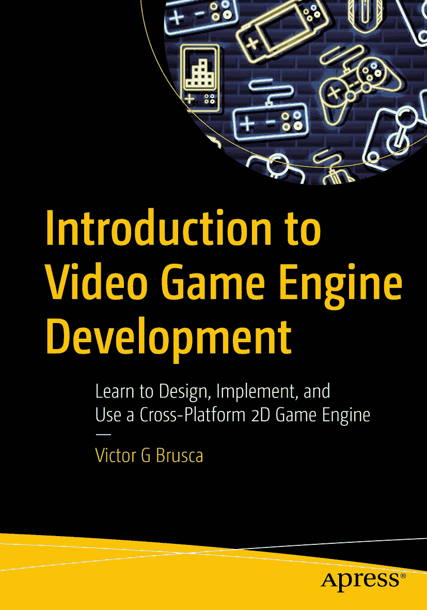

ISBN 978-1-4842-7038-7e-ISBN 978-1-4842-7039-4 [`doi.org/10.1007/978-1-4842-7039-4`](https://doi.org/10.1007/978-1-4842-7039-4) © Victor G Brusca 2021 标准 Apress 版本。本书中可能出现商标名称、标识和图像。我们不会在每次出现商标名称、标识或图像时都使用商标符号，而是仅以编辑方式使用这些名称、标识和图像，以维护商标所有者的利益，且无意侵犯商标权。本出版物中使用的商品名称、商标、服务标记及类似术语，即使未明确标识，也不应被视为对其是否受专有权利保护的表达意见。出版商、作者和编辑可以假定本书中的建议和信息在出版之日是真实准确的。出版商、作者或编辑均不对本书所含材料或可能存在的任何错误或遗漏提供明示或暗示的担保。出版商对已出版地图中的管辖权主张和机构归属保持中立。

本 Apress 印记由注册公司 APress Media, LLC（Springer Nature 旗下）出版。

注册公司地址为：1 New York Plaza, New York, NY 10004, U.S.A.

*献给我的妈妈和爸爸。我非常爱你们。*

引言

本书首先关注的是 2D 游戏引擎的设计与开发。文中的示例和代码均来自该游戏引擎的 Java 实现，但本书也包含了用 Java 和 C#编写的功能等效的引擎实现。两种编程语言的 API 级代码非常相似，因此如果您愿意，用 C#跟进学习也会非常容易。

本书将从类级别出发，逐一介绍游戏引擎的每个组成部分，并附有解释和演示。当您通过本书审阅代码时，您将开始看到驱动引擎的设计模式的结构。正是这些模式，或者说类之间的交互，赋予了游戏引擎生命力。正是这些模式使软件成为引擎，而非游戏的实现。

本书分为三个部分。第一部分（第 1 章至第 8 章）回顾了支持引擎并定义其功能的所有基类。在第二部分（第 9 章至第 14 章）中，我们深入探讨应用程序级代码。我们再次逐类审查负责加载资源、游戏设置、准备游戏窗口和绘图表面，以及映射来自不同输入源的用户输入的代码。最后，在第三部分中，我们将应用所学知识，仅使用本书中审查过的代码和一个 IDE（集成开发环境）从头开始构建游戏。

游戏开发世界广阔而复杂。如果您有兴趣构建下一款伟大的游戏，那么您需要具备使用高级游戏开发工具的经验。学习这些工具至少可以说是一项艰巨的任务。您将需要学习至少两个复杂的软件、至少一个复杂的 API，以及至少一门编程语言。

本书旨在通过提供一个可供详细审查的示例实现，让您在代码层面获得构建和使用游戏引擎的经验。本书将让您获得使用 IDE（集成开发环境）、复杂跨平台 API（Java 和 C#中的游戏引擎 API）、游戏引擎设计模式以及使用书中介绍的游戏引擎构建游戏的经验。通过阅读本书，您将能够直接用代码制作自己的游戏，并为迎接游戏开发职业生涯中的下一个挑战做好准备。

致谢

我想借此机会感谢我的妻子 Katia，忍受我日复一日地在书桌前写作和编码。爱你，bbg:-*。

关于作者 关于技术审校者

