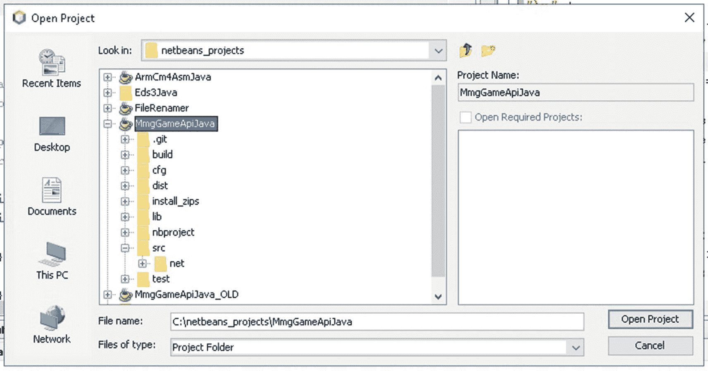
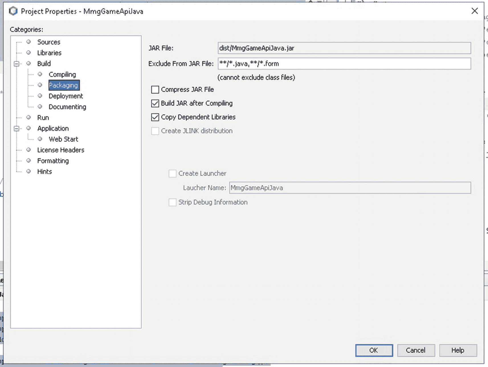
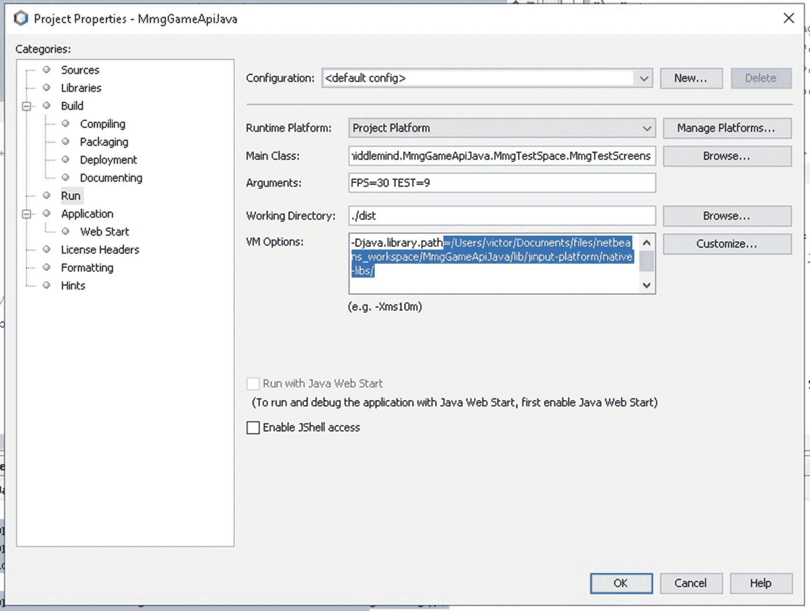
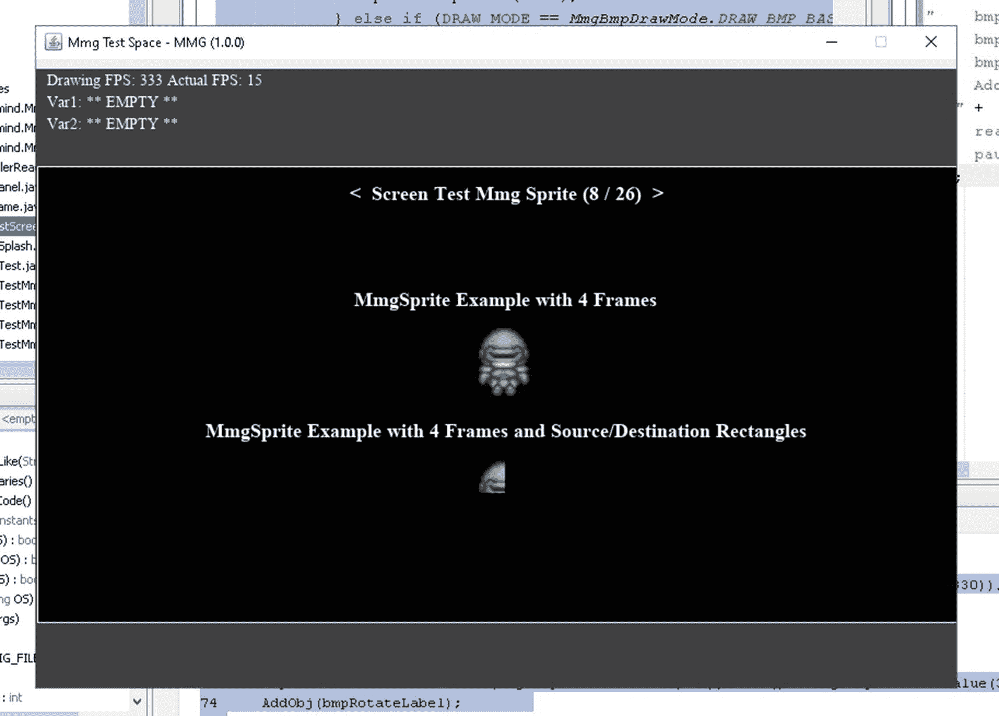
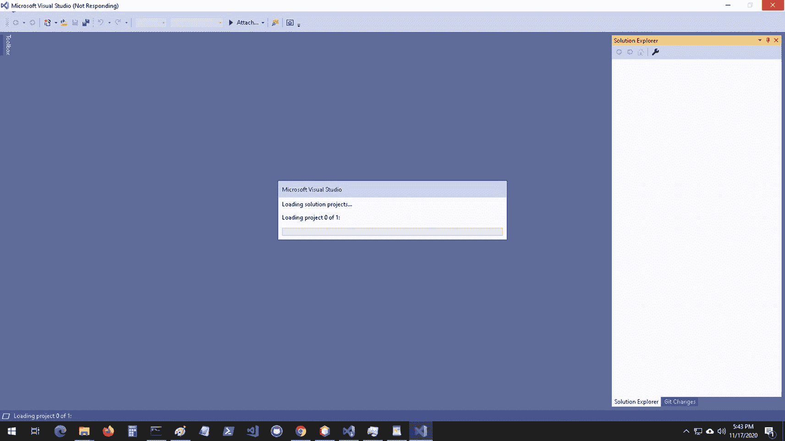
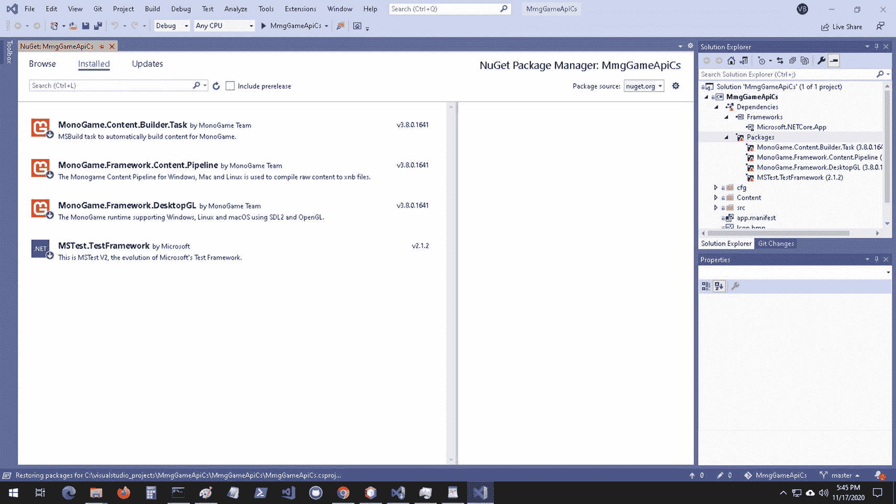
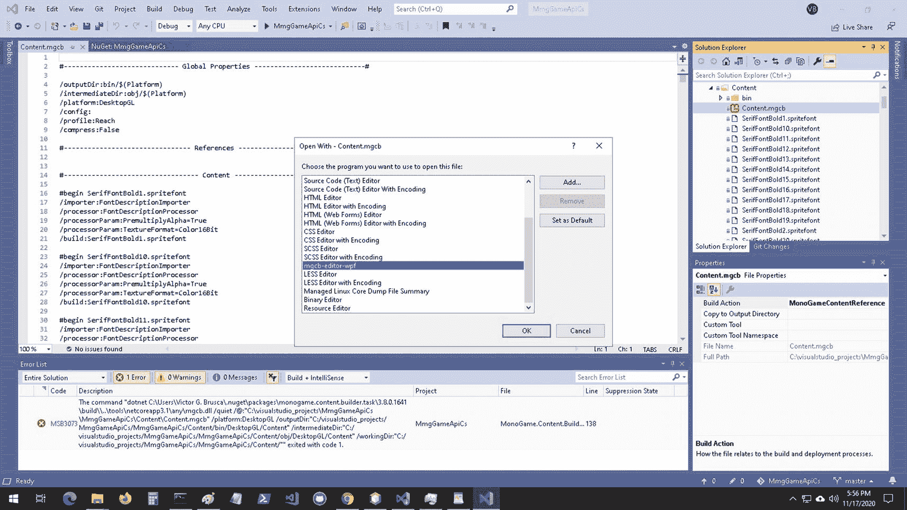
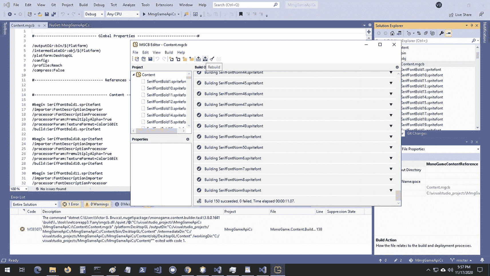
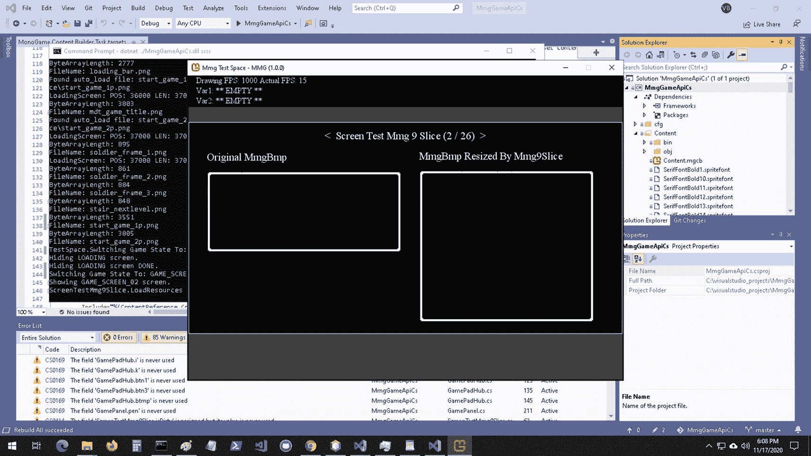

# 1. MmgBase API 简介

本书第一部分全面回顾了一个用 Java 和 C#编写的 2D 游戏引擎。两种实现均随本书提供，并附有完整的代码文档、137 个用于验证 API 功能的单元测试、一个演示关键游戏引擎特性的示例程序，以及两个完整的游戏——您将在我的些许帮助下自行构建。然而，就像任何优秀的电视烹饪节目一样，每个游戏也附带一份完成的副本，以便您可以对照预期结果进行工作。



图 1-1

NetBeans IDE 安装 1

随附的游戏引擎包含两个 API：一个低级 API，包含许多游戏构建工具，如精灵、声音、容器、游戏屏幕、UI 小部件、事件处理程序等；以及一个中级 API，负责启动游戏并加载设置和资源。通过这种方式，游戏引擎被表达为一个软件开发工具包，包含两个核心 API，并附带大量示例和文档。

您可能想知道这个游戏引擎需要什么样的播放器以及它的要求是什么，但这个游戏引擎不使用播放器。相反，游戏与引擎代码一起编译，因此您制作的每个游戏都是游戏引擎运行时代码和游戏引擎类的完整副本。这使您能够完全控制并全面查看驱动引擎的代码。

通过本书的学习，您将了解游戏引擎是如何构建的，并且您将能够访问一个需要 NetBeans 的 Java/Swing 实现和一个需要 Visual Studio 的 C#/MonoGame 实现。Java 版本使用带有 OpenGL 加速的 Swing，可在任何运行 Java 的平台上运行——Windows、Mac OSX、Linux 等。

C#版本运行在 SDL（Simple DirectMedia Layer）上，并使用 OpenGL 和 OpenAL。通过能够探索一个 2D 游戏引擎在多个平台上的实现，您将获得构建和使用游戏引擎的宝贵经验和知识。当您审阅本书并比较跨平台实现时，API 抽象和通用 2D 游戏引擎设计的复杂性将变得显而易见。

MonoGame 是一个免费、开源的游戏开发技术，基于微软已停用的 XNA SDK。社区在复活该软件方面做了出色的工作，并利用最新的工具和技术使 MonoGame 能够在以下平台上运行：

*   Windows

*   Mac

*   Linux

*   Android

*   iOS

*   PlayStation 4

*   PlayStation Vita

*   Xbox One

*   Nintendo Switch

*   Google Stadia

来源：[`https://docs.monogame.net/articles/platforms/0_platforms.html`](https://docs.monogame.net/articles/platforms/0_platforms.html)

无论您的编码经验或首选平台如何，您都可以选择使用 Java 或 C#代码库。您将能够用您的新游戏瞄准多个不同的平台，更重要的是，您将能够直接控制游戏引擎中的每一行代码。这真是令人兴奋。让我们开始吧！


## 游戏引擎 SDK 概述

在详细审视各个类与示例代码之前，我们先来聊聊 MmgGameApi。通常，当我提到 MmgGameApi 时，指的是 Java 和 C# 两种实现。事实上，底层 API 的实现约有 95% 是相同的。只有到了中层 API，才会出现较大的差异。

话虽如此，C#/MonoGame 的实现比 Java/Swing 的实现效率更高。这与游戏引擎代码本身无关，而完全取决于两种实现所使用的框架。C#/MonoGame 实现是为游戏而构建的，因此整体运行速度比 Java/Swing 实现更快。不过，两者都是实现你的下一款 2D 游戏的可行方案。

我们来聊聊 MmgGameApiJava 项目的包。这些包与 MmgGameApiCs 项目的命名空间相对应。你会看到很多特性，无论是在编程语言本身还是在 API 实现中，从实现角度来看可能完全不同，但在功能上是等价的。

## 包/命名空间

1.  net.middlemind.MmgGameApiJava.MmgBase

    net.middlemind.MmgGameApiCs.MmgBase

    这是游戏引擎 SDK 中最底层的 API。它位于底层框架技术之上。对于 Java 项目，它接入的是 Java Swing 和 AWT API。对于 C# 项目，它接入的是使用 OpenGL 和 OpenAL 的 MonoGame API。

2.  net.middlemind.MmgGameApiJava.MmgCore

    net.middlemind.MmgGameApiCs.MmgCore

    这是游戏引擎 SDK 中的中层 API。它位于底层 API（MmgBase）和实际游戏实现之间。它负责处理诸如设置应用程序窗口和绘制表面、加载资源以及处理输入等任务。它还处理基于 XML 的配置、事件以及更健壮的游戏屏幕。

3.  net.middlemind.MmgGameApiJava.MmgTestSpace

    net.middlemind.MmgGameApiCs.MmgTestSpace

    这个包代表应用程序层，实际上并不是 SDK API。它是一个包含运行时代码的 SDK 实现示例。执行此应用程序时，它会演示如何使用 MmgBase 和 MmgCore API 中的类。

那么，接下来，让我们从最底层的 API（MmgBase API）开始进行代码审查。我们将按逻辑顺序介绍关键类。这将让你扎实地理解事物是如何运作的，以及一个通用游戏引擎从代码、类及其交互的角度是如何设计和构建的。最后，我们将在每个类的审查结束时，通过一个使用该类的演示来结束，为你提供一个坚实的基础。

我们在本文中将要介绍的类大致分为以下几类。

### 基础类

*   MmgObj

*   MmgColor

*   MmgRect

*   MmgFont

*   MmgSound

*   MmgPen

*   MmgVector2

*   MmgBmp

### 辅助类

*   MmgApiUtils

*   MmgHelper

*   MmgScreenData

*   MmgFontData

*   MmgDebug

*   MmgBmpScaler

*   MmgMediaTracker

### 高级类

*   Mmg9Slice

*   MmgContainer

*   MmgLabelValuePair

*   MmgLoadingBar

*   MmgSprite

*   MmgDrawableBmpSet

### 控件类

*   MmgTextField

*   MmgTextBlock

*   MmgScrollVert

*   MmgScrollHor

*   MmgScrollHorVert

*   MmgMenuContainer

*   MmgMenuItem

### 屏幕类

*   MmgSplashScreen

*   MmgLoadingScreen

*   MmgGameScreen

### 动画类

*   MmgPulse

*   MmgPosTween

*   MmgSizeTween

### 其他类

*   MmgCfgFileEntry

*   MmgEvent

*   MmgEventHandler

市面上有很多用于创建游戏的强大工具。其中许多工具要求你学习一门编程语言、一个框架 API、游戏创作软件、游戏引擎 API 以及一个用于编写代码的 IDE。这对初学者来说可能是一个艰巨的挑战。

本书希望通过从代码层面向你展示 2D 游戏引擎的工作原理，让你的电子游戏创作之旅变得精彩。通过让你接触游戏引擎的两种不同实现，如果你选择用两种语言审查代码，你将获得使用两种 IDE 的经验。利用这里提供的工具，你将能够构建自己的游戏，并积累直接用代码编写游戏的宝贵经验。

虽然你在这里获得的一些知识将特定于某个代码库，但其中大部分将是通用的、广泛的知识，你可以将其应用于未来的项目和游戏开发经验中。

## 设置你的环境

本书附带的代码有两种形式：Java 和 C#。话虽如此，本书主要遵循 Java 代码。所有的方法分解都是在审查 Java 代码时完成的。但是，有一个完整的 C# 游戏引擎实现，并且 MmgBase API 在两个引擎版本之间非常相似。

如果你愿意，可以跟随 C# 项目，但由于行号差异，你需要多做一点工作。我建议先跟随 Java 代码，在完全吸收 Java 代码后再查看 C# 代码。这应该会让你更注意到两种实现之间的差异，而非相似之处。

接下来的部分将向你展示如何设置环境，以便在 NetBeans（针对 Java 项目）和 Visual Studio（针对 C# 项目）中查看相关项目。


## 安装 NetBeans IDE

在本节中，你需要联网下载一份 IDE 以及本书配套的项目文件。联网并准备就绪后，打开你常用的浏览器，访问 NetBeans IDE 主站点 [`http://netbeans.org`](http://netbeans.org)。

找到下载链接，它会将你导向一个包含近期 IDE 版本的列表。向下滚动，直到看到列表中最新的 LTS（长期支持）版本。在撰写本文时，最新的 LTS 版本是 12.1。下载并安装该软件。在 NetBeans IDE 安装期间，请访问此 URL [`http://www.apress.com/source-code`](http://www.apress.com/source-code)，下载游戏引擎项目的 Java 版本压缩包。

项目文件下载完成后，解压缩，然后将其移动到你的 Java 项目目录中。如果你是新手，还没有项目目录，可以在你习惯存放文档的位置创建一个新文件夹。当 IDE 安装完成，并且项目文件已解压并移动到目标位置后，启动 NetBeans IDE。从菜单中选择“文件 ➤ 打开项目...”。找到你刚刚下载并解压的项目文件夹的位置。

项目加载完成后，我们需要检查几项内容。右键单击 `MmgGameApiJava` 项目，然后选择**属性**条目。项目设置窗口将弹出。在窗口左侧的类别列表中选择**打包**选项。你应该确保你的项目选项设置如下面的截图所示。



图 1-2

NetBeans IDE 安装 2

确保屏幕顶部的 **JAR 文件**字段以 **dist** 文件夹开头。完成后，点击左侧类别列表中的**运行**条目。我们将确保正确的运行时设置已就位。



图 1-3

NetBeans IDE 安装 3

关于运行时设置，你需要确保主类已设置；选择 `MmgTestSpace` 包中的 `MmgTestScreens` 类。参数字段可以留空，或者你可以尝试不同的 FPS 设置。最好使用 15 到 60 FPS 之间的帧率。注意上图中以蓝色高亮显示的路径。这是我开发环境中本地库的路径。

你应该将该路径更改为你环境中对应的文件夹。这将为游戏引擎项目启用原生操作系统库支持。在运行任何内容之前，我们应该确保项目可以编译。右键单击列表中的项目，然后选择**清理并构建**选项。

项目编译完成后，你应该熟悉如何运行示例游戏屏幕项目。在 `MmgGameApiJava` 项目的包列表中找到 `MmgTestSpace` 包。找到 `MmgTestScreens` 文件，右键单击它，然后选择**运行文件**。给应用程序几秒钟时间加载。稍等片刻后，你应该会看到类似下面截图的内容。



图 1-4

NetBeans IDE 安装 4

至此，NetBeans IDE 的安装和配置过程结束。如果你想使用 C# 版本的游戏引擎，请查看下一节。

## 安装 Visual Studio IDE

在本节中，你需要联网下载一份 IDE 以及本书配套的 C# 版本项目文件。由于游戏引擎的 C# 版本需要 Visual Studio IDE，一些 Linux 用户可能无法使用 Visual Studio。请使用你喜欢的文本编辑器查看源代码来跟进。对于 Mac 和 Windows 用户，联网并准备就绪后，打开你常用的浏览器，访问 Visual Studio IDE 主站点 [`https://visualstudio.microsoft.com/`](https://visualstudio.microsoft.com/)。找到适用于你操作系统的链接，然后下载并安装 IDE。Visual Studio 安装完成后，打开命令提示符；在 Windows 搜索栏中输入 `cmd.exe`。在命令提示符中运行以下命令。

```
dotnet tool install -g dotnet-mgcb
dotnet tool install -g dotnet-mgcb-editor
mgcb-editor –register
清单 1-1
Visual Studio IDE 安装 1dotnet new -i MonoGame.Templates.CSharp::3.8.0.1641
```

打开 Visual Studio 的游戏引擎项目，你应该会看到以下屏幕。



图 1-5

Visual Studio IDE 安装 2

仔细检查 NuGet 包是否都已安装。



图 1-6

Visual Studio IDE 安装 3

展开 **Content** 文件夹并选择 **Content.mgcb** 文件。右键单击它，然后从菜单选项中选择**打开方式**。选择 **MGCB** 编辑器，如下所示，然后打开内容文件。



图 1-7

Visual Studio IDE 安装 4

当内容编辑器窗口打开时，点击编辑器图标栏右上角的**重建**图标。等待编辑器完成内容编译。



图 1-8

Visual Studio IDE 安装 5

重建 `MmgGameApiCs` 项目。在此过程中，你可能会遇到以下错误代码：

```
Error MSB3073 any\mgcb.dll /quiet exited with code 1.
```

双击错误消息以打开包含问题代码行的文件。找到并注释掉代码注释“从项目目录执行 MGCB，以便我们使用正确的清单”之后执行的命令。当内容发生变化时，我们可以自己运行编译步骤，这种情况应该不常见。现在你应该能够清理并构建项目了。如果你导航到项目目录并找到 `bin` 文件夹，可以运行以下命令来执行示例应用程序：

```
C:\visualstudio_projects\MmgGameApiCs\MmgGameApiCs\bin\Debug\netcoreapp3.1>dotnet ./MmgGameApiCs.dll example
```

你需要调整你使用的路径以匹配你的环境。几秒钟后，你应该会看到以下应用程序启动。



图 1-9

Visual Studio IDE 安装 6

至此，本章内容结束。现在，你应该能够使用 Java 或 C#（或两者）来设置并运行游戏引擎了！


