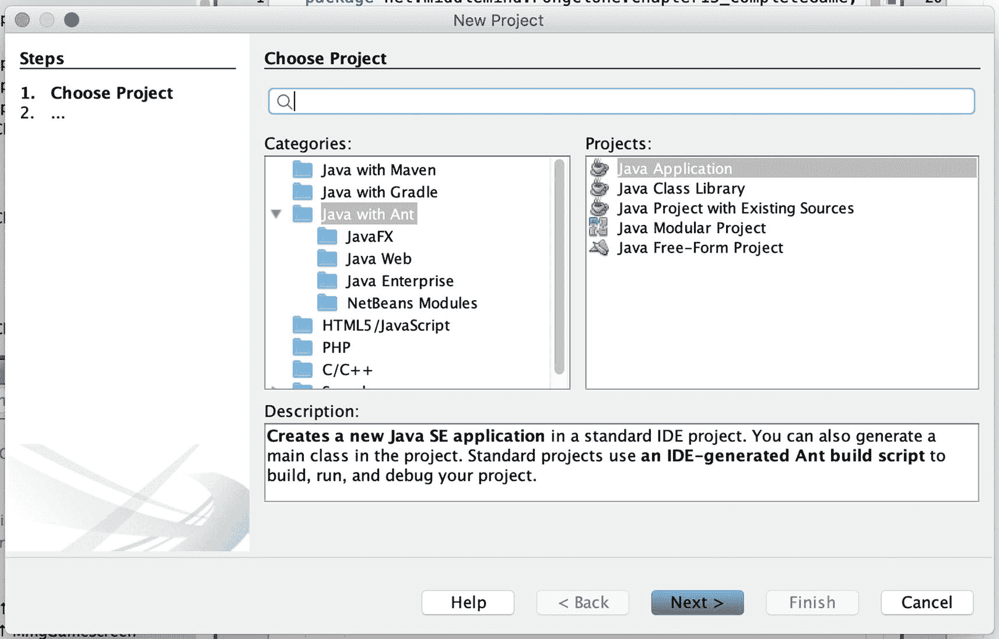
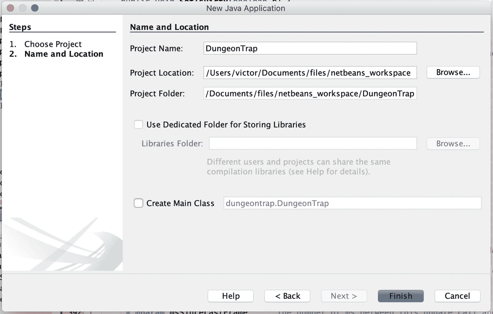
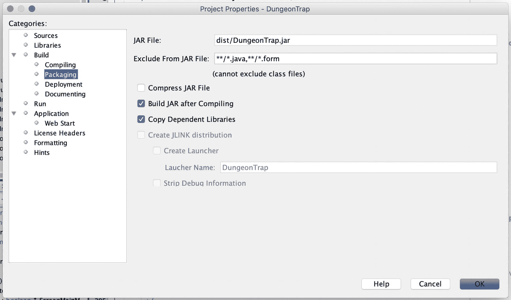
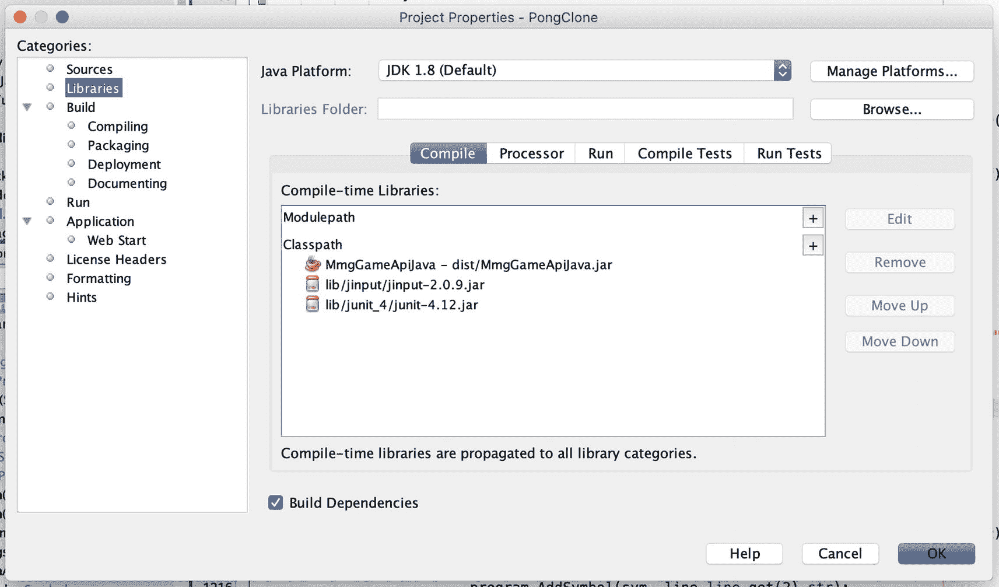
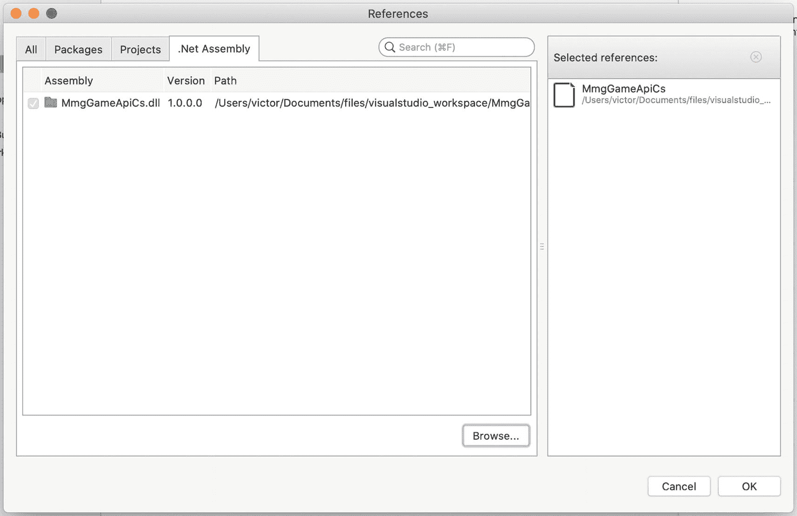
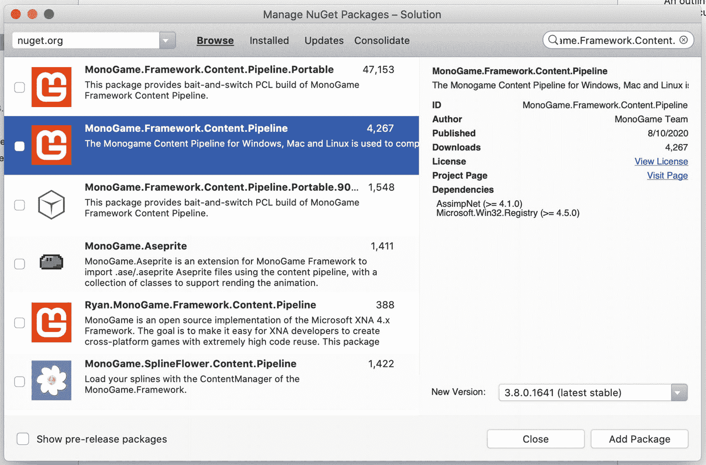
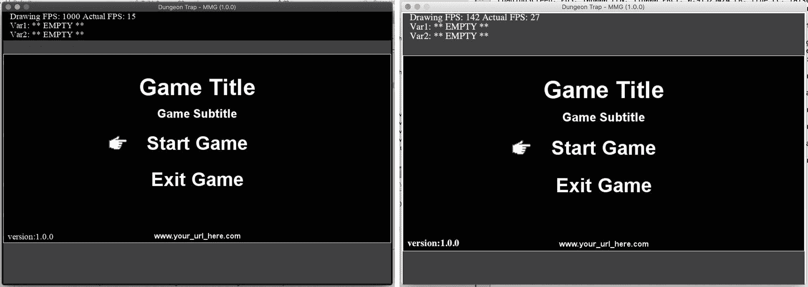
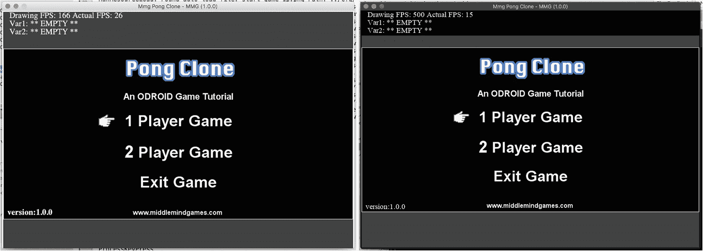
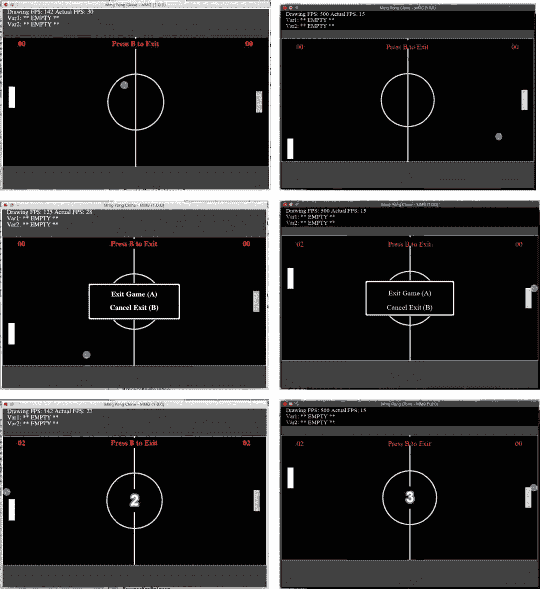

# 12. 事件处理器

在本章中，我们将回顾 MmgCore API 中定义的所有事件处理器。我们将介绍的新事件处理器包括通用事件、资源加载事件和主菜单事件。我们还将研究以接口和类形式实现的事件处理器。本章将审查的类如下所列：

*   GenericEventMessage

*   GenericEventHandler

*   LoadResourceUpdateMessage

*   LoadResourceUpdateHandler

*   HandleMainMenuEvent

## 事件处理器：GenericEventMessage

`GenericEventMessage` 类是一个新的事件类，旨在与 MmgCore API 协同工作。现在你可能会想，既然 MmgBase API 已经有一个 MmgEvent 类，为什么我们还需要一个新的事件类？在这个特定案例中，有一个充分的理由：`GenericEventMessage` 被设计为与 MmgCore API 的类协同工作，稍后你将看到这一点。

### 类字段

`GenericEventMessage` 类非常简洁。我们只需审查三个类字段，如下所示。

```
public int id;
public Object payload;
public GameStates gameState;
列表 12-1
GenericEventMessage 类字段 1
```

列出的第一个字段是 `id` 字段。这个整数用于标识所发送的 `GenericEventMessage` 的类型。请注意，定义事件并为其分配唯一 ID 最终是你的责任。列表中的第二个字段是 `payload`。`payload` 字段是框架 `Object` 类的一个实例，如果你使用 C# 则是 `object` 类型。

`payload` 字段本质上是通用的，可以容纳你需要包含在事件中的任何对象。你可以使用此字段向事件消息添加数据。前面列出的最后一个字段是 `gameState` 字段。我们在之前审查 `GamePanel` 类时已经遇到过 `GameStates` 枚举。

它们用于跟踪游戏屏幕并将其分配给唯一的游戏状态。MmgBase API 实际上没有游戏状态的概念。它实际上也没有游戏的概念。它只是一组通用的、强大的游戏构建类。只有当我们接触到 MmgCore API 时，游戏和游戏状态的概念才被明确定义。

正因如此，创建一个新的、与游戏引擎这一层级对象和概念协同工作的 MmgCore API 事件类才更有意义。接下来，我们将查看该类的支持方法。

### 支持方法详情

`GenericEventMessage` 类只有少数几个类字段，因此我们预计会看到数量合理的支持方法需要审查。

```
public int GetId() { ... }
public Object GetPayload() { ... }
public GameStates GetGameState() { ... }
列表 12-2
GenericEventMessage 支持方法详情 1
```

上面列出的支持方法非常直接，因此我不会过多赘述。列出的每个方法都提供了对关联类字段的 get 访问。

### 主要方法详情

我们只需要查看一个主要方法，即下面列出的类构造函数。

```
public GenericEventMessage(int Id, Object Payload, GameStates GameState) { ... }
列表 12-3
GenericEventMessage 主要方法详情 1
```

这是我们需要审查的唯一主要方法。它是一个类构造函数，将类的字段设置为相应的参数。

### 演示：GenericEventMessage 类

本演示部分的代码片段来自 `GamePanel` 类的 `HandleGenericEvent` 方法。首先，让我们快速看一下该类的定义。

```
public class GamePanel implements GenericEventHandler, GamePadSimple { ... }
列表 12-4
GenericEventMessage 类演示 1
```

注意，该类实现了 `GenericEventHandler` 接口。这意味着该类可以注册为事件处理器并接收 `GenericEventMessage` 事件。让我们看看同一个类在 C# 版本的游戏引擎中是如何定义的。

```
public class GamePanel : Game, GenericEventHandler, GamePadSimple { ... }
列表 12-5
GenericEventMessage 类演示 2
```

它们看起来几乎完全相同。C# 版本也实现了 `GenericEventHandler` 接口，只是语法与 Java 版本略有不同。现在让我们将注意力转向 MmgCore API 中 `GamePanel` 类的 `HandleGenericEvent` 方法。我在下面详细列出了该方法。

```
01 public void HandleGenericEvent(GenericEventMessage obj) {
02     if (obj != null) {
03         if (obj.GetGameState() == GameStates.LOADING) {
04             if (obj.GetId() == ScreenLoading.EVENT_LOAD_COMPLETE) {
05                DatExternalStrings.LOAD_EXT_STRINGS();
06                SwitchGameState(GameStates.MAIN_MENU);
07             }
08         } else if (obj.GetGameState() == GameStates.SPLASH) {
09             if (obj.GetId() == ScreenSplash.EVENT_DISPLAY_COMPLETE) {
10                SwitchGameState(GameStates.LOADING);
11             }
12         }
13     }
14 }
列表 12-6
GenericEventMessage 类演示 3
```

作为一个实现了 `GenericEventHandler` 接口的类，它必须定义 `HandleGenericEvent` 方法。处理通用事件的代码应放置在此方法中。请注意，该事件处理器被设置为处理与 `LOADING` 或 `SPLASH` 游戏状态相关联的事件。如果事件（即 `obj` 参数）不为 null，我们首先检查其游戏状态，然后开始处理消息。

接下来，我们检查事件的 `id` 字段，以确定我们正在处理的具体事件类型。如果事件是 `EVENT_LOAD_COMPLETE` 事件，那么我们通过调用 `DatExternalStrings` 类的 `LOAD_EXT_STRINGS` 静态方法来加载游戏字符串，如第 5 行所示。在随后的代码行中，游戏状态被更改为主菜单。

类似地，`SPLASH` 游戏状态的 `EVENT_DISPLAY_COMPLETE` 事件会导致状态更改为 `MAIN_MENU`。请记住，从 `GamePanel` 类的审查中可知，`GameStates` 和游戏屏幕是紧密相连的。

## 事件处理器：GenericEventHandler

`GenericEventHandler` 是作为接口实现的，因此我们将一次性审查其完整代码。

```
1 public interface GenericEventHandler {
2    public void HandleGenericEvent(GenericEventMessage obj);
3 }
列表 12-7
GenericEventHandler 类审查 1
```

`GenericEventHandler` 接口非常简单。任何实现该接口的类都必须声明一个与列出的 `HandleGenericEvent` 方法具有相同签名的类方法。我们在之前的类审查中，查看 `GamePanel` 类的 `HandleGenericEvent` 方法时已经看到了这一点。


### 演示：GenericEventHandler 类

在 `GenericEventHandler` 类的回顾演示部分，我们将了解 `GamePanel` 类是如何注册为事件处理器的，然后我们将查看事件是从哪里触发的。以下代码片段来自 MmgCore API 中 `GamePanel` 类的构造函数。

```
1 screenSplash.SetGenericEventHandler(this);
2 screenLoading.SetGenericEventHandler(this);
代码清单 12-8
GenericEventHandler 类回顾 1
```

现在，在上述代码的第 1 行和第 2 行中，`GamePanel` 类的 `screenSplash` 和 `screenLoading` 字段被配置为使用 `GamePanel` 作为事件处理器。这正是我们在上一节刚刚回顾的方法。现在，当启动画面或加载画面触发 `GenericEventMessage` 事件时，`GamePanel` 类将接收到它。接下来的几行代码向我们展示了 `ScreenSplash` 类是如何触发事件的。

```
1 if (handler != null) {
2     handler.HandleGenericEvent(new GenericEventMessage(ScreenSplash.EVENT_DISPLAY_COMPLETE, null, GetGameState()));
3 }
代码清单 12-9
GenericEventHandler 类回顾 2
```

如您所见，要触发事件，我们调用已分配事件处理器的 `HandleGenericEvent` 方法，并向其发送一个 `GenericEventMessage` 对象进行处理。下一行代码向我们展示了 `ScreenLoading` 类是如何触发其事件的。

```
1 if (handler != null) {
2     handler.HandleGenericEvent(new GenericEventMessage(ScreenLoading.EVENT_LOAD_COMPLETE, null, GetGameState()));
3 }
代码清单 12-10
GenericEventHandler 类回顾 3
```

与 `ScreenSplash` 类的处理方式类似，`ScreenLoading` 类调用 `HandleGenericEvent` 方法，并向其传递一个带有 `EVENT_LOAD_COMPLETE` 事件 ID 的 `GenericEventMessage` 对象进行处理。

## 事件处理器：LoadResourceUpdateMessage

`LoadResourceUpdateMessage` 类用于向目标 `LoadResourceMessage` 处理器发送资源加载事件。此类事件用于传达资源加载进度的信息。

### 类字段

`LoadResourceUpdateMessage` 类有两个类字段供我们回顾，如下所示。

```
public int pos;
public int len;
代码清单 12-11
LoadResourceUpdateMessage 类字段 1
```

列出的第一个字段是 `pos` 字段。此字段表示资源加载的当前位置，即已加载的文件数量占待加载文件总数的比例。`len` 字段表示要加载的资源文件总数。

### 支持方法详情

`LoadResourceUpdateMessage` 有两组 get 和 set 方法供我们回顾。

```
public int GetPos() { ... }
public void SetPos(int Pos) { ... }
public int GetLen() { ... }
public void SetLen(int Len) { ... }
代码清单 12-12
LoadResourceUpdateMessage 支持方法详情 1
```

这些是基本的 get 和 set 方法，允许访问类的字段。仅此而已。接下来，让我们看看类的构造函数。

### 主要方法详情

只有一个主要方法供我们回顾，即类的构造函数。

```
public LoadResourceUpdateMessage(int Pos, int Len) { ... }
代码清单 12-13
LoadResourceUpdateMessage 主要方法详情 1
```

构造函数非常简单，将参数值分配给每个类字段。

### 演示：LoadResourceUpdateMessage 类

在 `LoadResourceUpdateMessage` 类的演示部分，我们将查看接收此类事件的事件处理器。本节的示例代码来自 MmgCore API 中 `ScreenLoading` 类的 `HandleUpdate` 方法。让我们来看一些代码。

```
01 public void HandleUpdate(LoadResourceUpdateMessage obj) {
02     if (obj != null) {
03         float prct = (float) obj.GetPos() / (float) obj.GetLen();

05         if (GetLoadingBar() != null) {
06             GetLoadingBar().SetFillAmt(prct);
07         }

09         if (GetLoadComplete() == true) {
10             if (handler != null) {
11                 handler.HandleGenericEvent(new GenericEventMessage(ScreenLoading.EVENT_LOAD_COMPLETE, null, GetGameState()));
12             }
13         }
14     }
15 }
代码清单 12-14
LoadResourceUpdateMessage 类演示 1
```

此方法从 `RunResourceLoad` 类接收事件，因为该类会将声音和图像加载到引擎的资源缓存中。如果事件对象 `obj` 不为 null，则我们在第 3 行计算资源加载的进度。如果定义了加载条，我们更新完成百分比。在第 9–11 行，如果资源加载完成，则会触发一个通用事件，指示是时候更改游戏状态了。我们将在接下来回顾 `LoadResourceUpdateHandler` 类时查看这些事件的来源。

## 事件处理器：LoadResourceUpdateHandler

`LoadResourceUpdateHandler` 是作为接口实现的，我们可以在此处列出整个接口。让我们来看一些代码！

```
1 public interface LoadResourceUpdateHandler {
2     public void HandleUpdate(LoadResourceUpdateMessage obj);
3 }
代码清单 12-15
LoadResourceUpdateHandler 类回顾
```

此接口与 `GenericEventHandler` 接口非常相似。其本质非常简单。任何实现此接口的类都必须定义一个 `HandleUpdate` 方法，并且如果该类已注册，则可以接收 `LoadResourceUpdateMessage` 事件。

### 演示：LoadResourceUpdateHandler 类

下面列出的示例代码片段来自 MmgCore API 中 `RunResourceLoad` 类的 `run` 方法。该代码是资源加载过程的一部分，由游戏的加载画面在单独的线程上运行。

```
01 MmgHelper.GetBasicCachedBmp(adFiles.get(i).getPath(), adFiles.get(i).getName());
02 readPos = i * loadMultiplier;

04 if (update != null) {
05     update.HandleUpdate(new LoadResourceUpdateMessage(readPos, readLen));
06 }

08 try {
09     Thread.sleep(slowDown);
10 } catch (Exception e) {
11     MmgHelper.wrErr(e);
12 }

14 if(exitLoad) {
15     break;
16 }
代码清单 12-16
LoadResourceUpdateHandler 类演示 1
```

由于此代码片段是资源加载过程的一部分，第一行代码将目标资源文件加载到引擎的资源缓存中。当前加载进度在第 2 行计算。请注意，读取位置由 `loadMultiplier` 字段人为增加。

这样做是为了确保计算在资源极少的情况下也能正常工作。在第 5 行，如果存在已注册的事件处理器，则会创建一个新的 `LoadResourceUpdateMessage` 事件并发送给它。如果 `exitLoad` 字段设置为 true，则退出加载过程。

## 事件处理器：HandleMainMenuEvent

`HandleMainMenuEvent` 类用于表示主菜单事件动作。当用户选择主菜单选项时，会生成此类的实例。

### 静态类成员

类的静态字段用于定义一些默认的主菜单事件。您不必使用这些事件 ID；您可以创建自己的一组来满足您的需求。让我们看看下面列出的静态字段。

```
public static int MAIN_MENU_EVENT_TYPE = 0;
public static int MAIN_MENU_EVENT_START_GAME = 0;
public static int MAIN_MENU_EVENT_SETTINGS = 1;
public static int MAIN_MENU_EVENT_ABOUT = 2;
public static int MAIN_MENU_EVENT_HELP = 3;
public static int MAIN_MENU_EVENT_EXIT_GAME = 4;
public static int MAIN_MENU_EVENT_START_GAME_1P = 5;
public static int MAIN_MENU_EVENT_START_GAME_2P = 6;
代码清单 12-17
HandleMainMenuEvent 静态类成员 1

上面列出的第一个静态字段是主菜单事件的类型值。接下来的七个条目是一组默认菜单项的默认事件 ID。这些默认值应该能满足您大多数游戏的需求，因为所提供的选项非常标准。接下来，让我们看看类的字段。


### 类字段

`HandleMainMenuEvent` 类只有两个字段需要讨论。

```
private MmgGameScreen cApp;
private GamePanel owner;
代码清单 12-18
HandleMainMenuEvent 类字段 1
```

该事件类与 MmgBase API 的 `MmgGameScreen` 类紧密关联。回顾一下，`MmgGameScreen` 类内置了菜单系统支持。`HandleMainMenuEvent` 类旨在与默认菜单系统配合使用。因此，上面列出的第一个类字段引用了此事件所源自的 `MmgGameScreen`。第二个类字段引用了管理 `cApp` 字段中列出的游戏屏幕的 `GamePanel`。该类没有值得一提的支持方法，因此我们将继续介绍主要方法。

### 主要方法详解

`HandleMainMenuEvent` 类有两个主要方法需要讨论。

```
public HandleMainMenuEvent(MmgGameScreen CApp, GamePanel Owner) { ... }
public void MmgHandleEvent(MmgEvent e) { ... }
代码清单 12-19
HandleMainMenuEvent 主要方法详解
```

列出的第一个方法是类构造函数。它根据构造函数参数更新类字段。列出的下一个方法是 `MmgEventHandler` 方法，用于处理和响应菜单事件。

### 演示：HandleMainMenuEvent 类

下面列出的演示代码来自 MmgCore API 的 `ScreenMainMenu` 类。需要说明的是，`HandleMainMenuEvent` 类与我们之前审查的类略有不同，因为事件处理程序是一个类，而不是一个接口。这是由于菜单事件系统的可预测性以及菜单系统与 `MmgGameScreen` 类的紧密集成所致。

```
1 handleMenuEvent = new HandleMainMenuEvent(this, owner);
代码清单 12-20
HandleMainMenuEvent 类演示 1
```

如上所示，菜单事件处理程序在 `ScreenMainMenu` 类的 `LoadResources` 方法中初始化。让我们看看菜单项在此游戏屏幕中是如何初始化的。下一段代码来自该类的 `DrawScreen` 方法。

```
1 if (menuStartGame != null) {
2     mItm = MmgHelper.GetBasicMenuItem(handleMenuEvent, "主菜单开始游戏", HandleMainMenuEvent.MAIN_MENU_EVENT_START_GAME, HandleMainMenuEvent.MAIN_MENU_EVENT_TYPE, menuStartGame);
3     mItm.SetSound(menuSound);
4     menu.Add(mItm);
5 }
代码清单 12-21
HandleMainMenuEvent 类演示 2
```

如果菜单项图像已定义，我们使用 `MmgHelper` 类的 `GetBasicMenuItem` 方法创建一个新的菜单项。请注意，第一个参数是该类的菜单处理程序。当此菜单项被选中时，一个事件会被发送到已注册的菜单事件处理程序。

## 章节总结

在本章中，我们深入探讨了 MmgCore API 的事件和事件处理程序。我们了解了 `ScreenSplash` 类如何使用通用事件与 `GamePanel` 类通信，告知其该切换屏幕了。我们在 `ScreenLoading` 类中看到了类似的实现，它使用自己的资源加载完成通用事件。

我们还了解了如何使用加载资源消息事件向 `ScreenLoading` 类发送关于游戏资源加载进度的信息，以及游戏屏幕如何触发自己的事件来告知 `GamePanel` 加载过程已完成并切换到主菜单状态。

这些事件和事件处理程序的细节非常重要。你应该了解默认游戏屏幕是如何连接到 `GamePanel` 的，并且应该理解可供你使用的不同类型的事件系统。让我们看一下本章涵盖的 MmgCore API 类的总结：

*   **GenericEventMessage**：一个 MmgCore API 类，用于表示与游戏状态关联的通用事件。此类为 API 提供通用事件支持。

*   **GenericEventHandler**：一个 MmgCore API 接口，实现该接口以支持接收来自已注册源的通用事件。此接口为 API 提供通用事件处理支持。

*   **LoadResourceUpdateMessage**：一个 MmgCore API 消息，用于向已注册的事件处理程序发送关于资源加载过程的信息。此类为 API 提供资源加载事件消息支持。

*   **LoadResourceUpdateHandler**：一个 MmgCore API 接口，实现该接口以支持接收加载资源更新事件。此接口为 API 提供加载资源更新事件处理支持。

*   **HandleMainMenuEvent**：一个 MmgCore API 类，用于支持菜单系统事件。当菜单项被选中时，菜单系统会触发这些事件。事件由类（而非接口）处理。此类为 API 提供基本的菜单支持。

在本章审查的类中，有一些非常微妙但重要的点。其中一个要点是，你可以利用事件来促进游戏屏幕之间以及游戏屏幕与游戏面板之间的通信。使用本章概述的事件系统和不同技术，你将能够创建自己的事件来管理游戏状态——这是任何游戏的关键方面。

另一个主要要点，我想说的是，习惯使用事件和事件处理程序。你会一次又一次地遇到事件，从一个游戏引擎到另一个游戏引擎，因此在自己的游戏中积累使用它们的经验是件好事。此外，你将在学习何时使用事件方面获得宝贵的经验。你的游戏中不应该有太多事件。事件保留用于跨类通信，即用户操作要求游戏屏幕请求游戏面板为其执行某些操作。遵循这条一般经验法则，但要意识到总有例外情况。

# 13. 资源加载

资源加载和访问是任何游戏引擎最重要的方面之一。没有图像很难制作 2D 游戏。在本章中，我们将详细讨论游戏引擎用于加载资源的运行时代码。你将看到如何显式地、全局地或通过特定于游戏的资源文件夹访问声音和图像。

在接下来的章节中，我们将回顾资源加载过程以及用于加载资源以在游戏屏幕中使用的确切代码。在本章中，我们将审查以下类和主题：

*   RunResourceLoad

*   主题：访问显式资源

*   主题：访问自动加载资源

*   主题：访问游戏特定资源

## 资源加载：RunResourceLoad

`RunResourceLoad` 类设计为在其自己的线程中运行，用于将游戏资源（如声音和图像）加载到游戏引擎的资源缓存中。资源缓存由 MmgBase API 的 `MmgMediaTracker` 类管理。在开始类审查之前，让我们先看一下 `RunResourceLoad` 类的 Java 和 C# 类定义。

```
//Java 实现
public class RunResourceLoad implements Runnable { ... }
//C# 实现
public class RunResourceLoad { ... }
代码清单 13-1
RunResourceLoad 类介绍 1
```

请注意，Java 版本的类实现了 `Runnable` 接口。这是一个框架级别的接口，用于在单独的线程中执行类的功能。别担心。C# 实现中存在相同的线程功能，只是实现方式略有不同，因为没有使用等效的 `Runnable` 接口。我只是想在开始类审查之前指出这个细微的差别。


### 类字段

`RunResourceLoad` 类包含几个与资源加载过程相关的类字段。让我们来看一下！

```
public boolean readResult;
public boolean readComplete;
public int readPos;
public int readLen;
public int loadMultiplier = 1000;
public LoadResourceUpdateHandler update;
public long slowDown;
public boolean exitLoad;
清单 13-2
RunResourceLoad 类字段 1
```

前面列出的前两个字段用于报告资源加载操作的结果。如果在资源处理操作期间加载了任何声音或图像，`readResult` 字段将保存为 true。如果整个加载过程已完成，`readComplete` 字段将设置为 true。`readPos` 和 `readLen` 字段分别跟踪资源加载过程中的当前位置和要加载的文件总数。

`loadMultiplier` 字段用于人为地增加我们正在处理的数字的大小。这样做只是为了在需要加载的资源非常少时，帮助计算进度百分比。`slowDown` 字段用于通过向操作中添加一个小的耗时环节来人为地减慢加载过程。当你只有少量资源需要加载，并且想验证加载条是否正常工作，这会非常有帮助。添加一个减速值可以让你更容易地看到进度条。

### `支持方法详情`

`RunResourceLoad` 类的支持方法按与其对应字段相同的顺序列在下面的组中。

```
public boolean GetReadResult() { ... }
public boolean GetReadComplete() { ... }
public int GetPos() { ... }
public int GetLen() { ... }
public void SetUpdateHandler(LoadResourceUpdateHandler Update) { ... }
public long GetSlowDown() { ... }
public void SetSlowDown(long l) { ... }
public void StopLoad() { ... }
清单 13-3
RunResourceLoad 支持方法详情 1
```

前四个支持方法只是其关联类字段的 get 方法。紧随其后的是 `SetUpdateHandler` 方法。它用于设置类的 `update` 字段。`slowDown` 字段有一对 get 和 set 方法，然后是 `StopLoad` 方法。`StopLoad` 方法将强制资源加载过程在下一个循环迭代时退出。

### `主方法详情`

`RunResourceLoad` 类有两个我想回顾的主方法。

```
public RunResourceLoad() { ... }
public void run() { ... }
清单 13-4
RunResourceLoad 主方法详情 1
```

第一个条目是类的构造函数。它不接受任何参数，并准备好类以供立即使用。上面列出的第二个方法是资源加载过程的核心。此方法由 `Runnable` 接口定义，并作为线程启动过程的一部分被调用。但是，如果需要，你也可以直接调用该方法。

### 演示：RunResourceLoad 类

对于 `RunResourceLoad` 类的演示部分，我们将查看声音和图像资源加载过程——具体来说，是识别要加载的目标资源文件的部分。声音和图像的步骤是相同的，因此我将在下面仅详细说明图像加载步骤。

```
01 adld = new File(GameSettings.AUTO_IMAGE_LOAD_DIR);
02 if(adld.exists()) {
03     srcFiles = adld.listFiles();
04     clnFiles = new ArrayList();

06     for(j = 0; j  0) {
14         readLen = (adFiles.size() - 1) * loadMultiplier;
15     }
16 }
清单 13-5
RunResourceLoad 类演示 1
```

我们即将概述的过程在 `GameSettings` 类的 `AUTO_IMAGE_LOAD_DIR` 字段以及 `PROGRAM_IMAGE_LOAD_DIR` 字段上运行。这意味着对于声音和图像资源，我们处理一个自动加载目录以及一个游戏特定目录。如果目标资源文件夹存在（第 2 行），那么我们在第 3 行初始化一个在该文件夹中找到的文件数组。在第 4 行，`clnFiles` 局部变量被重置为一个空的 `ArrayList`。这个数据结构将保存有效的资源文件以供后续处理。

第 6-10 行的循环遍历 `srcFiles` 数组中的所有文件，检查文件名和扩展名以确保该文件是有效的资源。如果是，则该文件在第 8 行被存储到 `clnFiles` 数据结构中。我们找到的干净文件集在第 12 行被添加到要加载的图像主列表中。如果找到了有效的资源文件，`readLen` 字段会被更新以反映新的文件总数。再次提醒，请记住此过程是针对声音和图像文件执行的。

接下来要审查的代码片段展示了图像资源处理步骤。此步骤将图像资源文件加载到游戏的资源缓存中。

```
01     tlen = adFiles.size();

03     for(i = 0; i < tlen; i++) {
04         MmgHelper.wr("RunResourceLoad: Found auto_load file: " + adFiles.get(i).getName() + " Path: " + adFiles.get(i).getPath());
05         MmgHelper.GetBasicCachedBmp(adFiles.get(i).getPath(), adFiles.get(i).getName());
06         readPos = i * loadMultiplier;

08         if (update != null) {
09             update.HandleUpdate(new LoadResourceUpdateMessage(readPos, readLen));
10         }

12         try {
13             Thread.sleep(slowDown);
14         } catch (Exception e) {
15             MmgHelper.wrErr(e);
16         }

18         if(exitLoad) {
19             break;
20         }
21     }
22 }
清单 13-6
RunResourceLoad 类演示 2
```

我们在第 12 章回顾资源加载事件和事件处理器时已经见过这段代码。我不会在这个示例代码上花太多时间。这段代码的主要收获是，对于每个经过审查要加载的文件，都会调用 `MmgHelper` 类的 `GetBasicCachedBmp` 方法（第 5 行）。此方法负责将图像加载到缓存中（如果它尚不存在）。

## 主题：访问显式资源

在本主题部分，我们将回顾手动访问资源的细节。你可能想知道，当资源被加载到游戏的资源缓存中供我们使用时，为什么还需要直接访问它们。

想想在加载屏幕之前显示的游戏屏幕。它们也需要访问资源，但不能依赖引擎的缓存。在这种情况下，我们必须手动将资源加载到游戏屏幕中。以下代码片段演示了直接访问资源。

```
MmgHelper.GetBasicBmp("../cfg/drawable/popup_window_base.png");
MmgHelper.GetBasicSound("../cfg/playable/jump1.wav");
清单 13-7
主题：访问显式资源 1
```

在上面的简短示例中，我们正在进行直接资源加载。这里唯一的要求是资源必须存在。下一节是对这种资源访问方法的轻微变体。


## 主题：访问自动加载资源

我们将研究用于加载放置在自动加载目录中的资源的代码。回顾一下，声音和图像资源都有三个层级：显式资源、自动加载资源和游戏特定资源。可以将自动加载资源视为属于游戏引擎，例如游戏引擎项目中包含的默认图像和默认声音。

```
MmgHelper.GetBasicBmp(GameSettings.IMAGE_LOAD_DIR + "file_name.png");
MmgHelper.GetBasicSound(GameSettings.SOUND_LOAD_DIR + "file_name.png");
清单 13-8
主题：访问自动加载资源 1
```

虽然这个示例与第一个主题部分非常相似，但我想讨论一些细微但重要的点。首先我想指出的是游戏设置类中存储的路径值。这里有一个隐藏的约定：路径变量 `IMAGE_LOAD_DIR` 以路径分隔符结尾。因此，在使用时，你只需附加文件名即可。请确保你了解并一致地使用资源路径。

前两个示例演示了直接资源加载。关于直接资源的惯例是将它们放置在相应资源文件夹的根目录下。例如，直接图像资源应放置在可绘制文件夹的根目录下。同样，声音资源放置在可播放文件夹的根目录下。接下来的示例演示了访问缓存资源。这些资源位于**可绘制**和**可播放**文件夹中的 **auto_load** 目录中。

```
MmgHelper.GetBasicCachedBmp(GameSettings.IMAGE_LOAD_DIR + "file_name.png", "file_name.png");
MmgHelper.GetBasicCachedBmp("file_name.png");
MmgHelper.GetBasicCachedSound(GameSettings.SOUND_LOAD_DIR + "file_name.png", "file_name.wav");
MmgHelper.GetBasicCachedSound("file_name.wav");
清单 13-9
主题：访问自动加载资源 2
```

在前面的代码示例中，第一个条目会加载一个资源，如果该资源尚不存在，则将其存储在游戏引擎的资源缓存中。它还会返回新的图像资源以供使用。下一个方法条目仅会在缓存图像资源存在时将其取出使用。声音资源也具有相同的功能，并在前面列出。

## 主题：访问游戏特定资源

让我们来看看游戏特定资源的访问调用。游戏特定文件夹位于**可绘制**和**可播放**文件夹的根目录下，与 **auto_load** 目录和直接加载资源相邻。资源系统的这方面工作方式有一个细微差别。让我们看看来自 MmgCore API 的 `MmgApiGame` 类的 `main` 方法中的几行代码。

```
GameSettings.PROGRAM_IMAGE_LOAD_DIR += GameSettings.NAME;
GameSettings.PROGRAM_SOUND_LOAD_DIR += GameSettings.NAME;
清单 13-10
主题：访问游戏特定资源 1
```

前面列出的代码是模板静态主类中内置的默认功能。你需要知道的是，游戏名称 `GameSettings.NAME` 必须是一个有效的文件夹名称，并且游戏特定资源文件夹必须与之匹配。一旦处理好这一点，程序特定资源文件夹中的游戏资源将在游戏启动过程中被加载。

```
MmgHelper.GetBasicCachedBmp("game_file_name.png");
MmgHelper.GetBasicCachedSound("game_file_name.wav");
清单 13-11
主题：访问游戏特定资源 2
```

前面列出的两行代码演示了如何访问从游戏特定资源文件夹加载的资源。该过程与自动加载资源相同。至此，我们完成了对不同游戏资源访问方式的回顾。

## 章节总结

在本章中，我们花时间讨论了游戏引擎的一个重要方面：资源加载和资源访问。在使用任何游戏引擎时，你都会遇到这个主题。处理游戏资源的方法多种多样。

有些引擎会将资源加载为中间格式，并在游戏编辑阶段对资源进行预处理。我们的引擎设计为直接基于文件系统工作，希望使游戏声音和图像的使用变得快速简便。让我总结一下本章中回顾的类和主题：

*   RunResourceLoad：一个 MmgCore API 类，负责扫描 GameSettings 文件中列出的自动加载和游戏特定目录。扫描后会创建一组要加载的目标文件。这些文件会被处理并加载到游戏引擎的图像和声音资源缓存中。

*   主题：访问显式资源：演示如何仅通过文件路径直接访问声音和图像资源。

*   主题：访问自动加载资源：演示如何访问已作为自动加载资源处理的声音和图像资源。

*   主题：访问游戏特定资源：演示如何访问已作为游戏特定资源处理的声音和图像资源。

本章虽短，但很重要。我们涵盖了所有不同的资源访问方式，以及如何在游戏屏幕中使用它们。请注意资源访问的灵活性；有几种不同的方式供你操作，这在设计新游戏时总是有益的。希望你对引擎如何处理不同类型资源的加载有了很好的理解，并能够从游戏的不同屏幕中访问它们。

# 14. 游戏屏幕

本章的重点是回顾并理解 MmgCore API 的游戏屏幕和帧率类如何与 `GamePanel` 类协同工作，以驱动游戏引擎的绘制例程。我们还将回顾 MmgCore API 中已实现的一组游戏屏幕的一些细微细节。

这些游戏屏幕的实现比我们在 MmgBase API 中遇到的更为具体，并且设计为可插入引擎的游戏面板类。本章涵盖的类总结如下：

*   RunFrameRate

*   ScreenSplash

*   ScreenLoading

*   ScreenMainMenu

*   Screen

## 游戏屏幕：RunFrameRate

`RunFrameRate` 类仅由 Java 版本的游戏引擎使用。顾名思义，`RunFrameRate` 类旨在驱动引擎的帧率。由于 C# 版本的游戏引擎基于 MonoGame API，因此帧率控制内置于该框架的 `Game` 类中。

在这种情况下，你只需设置一个类字段 `TargetElapsedTime` 即可调整帧率。理解帧率以及如何使用线程驱动 Java 版本游戏引擎的绘制例程，进而控制游戏帧率，对我们来说非常重要。让我们直接看一些代码！


### 静态类成员

有两个静态类字段需要我们了解。这些条目用于控制帧率线程及其主执行循环。

```
public static boolean PAUSE = false;
public static boolean RUNNING = true;
清单 14-1
RunFrameRate 静态类成员 1
```

上面列出的第一个字段是 `PAUSE` 字段。该字段用于阻止类的主执行循环重绘当前游戏画面。`RUNNING` 字段控制类的主循环。如果此字段设置为 false，帧率线程将立即退出。接下来，我们来看类的静态方法。

```
public static boolean IsPaused() { ... }
public static void Pause() { ... }
public static void UnPause() { ... }
public static void StartRunning() { ... }
public static void StopRunning() { ... }
清单 14-2
RunFrameRate 静态类成员 2
```

上面列出的静态方法顺序与其关联的类字段相同。这些方法大部分不言自明。`IsPaused` 方法提供了对 `PAUSE` 字段的静态 get 访问。接下来的两个条目提供了用于暂停或取消暂停主循环的静态控制方法。类似地，`StartRunning` 和 `StopRunning` 条目提供了用于启动和停止主执行循环以及后续引擎绘制例程的静态控制方法。

### 类字段

有许多类字段需要我们查看。它们主要涉及测量帧时序。我将它们分为两组，第一组如下所示。

```
public final MainFrame mf;
public final long tFps;
public final long tFrameTime;
public long aFps;
public long rFps;
清单 14-3
RunFrameRate 类字段 1

```

列出的第一个类字段是对游戏 `MainFrame` 对象 `mf` 的引用。下一个条目 `tFps` 表示游戏设定的目标每秒帧数。`tFrameTime` 字段是以毫秒为单位的目标帧时间。该值根据目标每秒帧数计算得出。如果你将游戏设置为以每秒 30 帧（FPS）运行，那么每 33.3 毫秒就会在屏幕上绘制一个新帧。

这意味着你有这么多时间来准备游戏的下一帧。这么短的时间可能看起来几乎不够做任何事情，但请相信我，这其实是很长的时间。在这段时间内，你不仅可以绘制下一帧游戏画面，还可以运行所有必要的更新调用。

接下来的两个字段提供了关于游戏运行情况的测量数据。第一个字段 `aFps` 表示如果游戏不受目标 FPS 限制时的运行帧率。这基本上显示了你的游戏在满速运行时的速度。接下来的字段 `rFps` 表示实际帧率；其值显示你的游戏运行速度与目标 FPS 的接近程度。

```
public long frameStart;
public long frameStop;
public long frameTime;
public long frameTimeDiff;
清单 14-4
RunFrameRate 类字段 2
```

下一组类字段也用于帧时序计算。如你所见，这个类主要关注以一致的帧率运行游戏。`frameStart` 和 `frameStop` 字段标记了当前帧的开始和结束时间。

`frameTime` 字段保存了处理该帧所花费的计算总时间。最后一个条目 `frameTimeDiff` 测量了处理该帧所花费的时间与分配给给定游戏帧的时间之间的毫秒差。如果还有剩余时间，我们会在开始下一帧之前让线程休眠该时长。

### 支持方法详情

`RunFrameRate` 类只有两个支持方法需要我们查看。

```
public long GetActualFrameRate() { ... }
public long GetTargetFrameRate() { ... }
清单 14-5
RunFrameRate 支持方法详情 1
```

上面列出的两个方法分别只是对 `tFps` 和 `aFps` 字段的访问方法。

### 主要方法详情

下面列出了两个需要我们介绍的主要方法。

```
public RunFrameRate(MainFrame Mf, long Fps) { ... }
public void run() { ... }
清单 14-6
RunFrameRate 主要方法详情 1
```

`mf` 和 `tFps` 字段通过类的构造函数参数进行设置。`tFrameTime` 根据提供的目标 FPS 计算并设置。`run` 方法是完成所有工作的地方。此方法作为 Java 框架 `Runnable` 接口的一部分被调用。`run` 方法在启动新线程时自动被调用。就是这样，简短而精炼。这个类已经可以使用了。


### 演示：RunFrameRate 类

在 `RunFrameRate` 演示部分，我们将查看三段代码片段。第一段代码来自 MmgCore API 的 `MmgApiGame` 类，位于 `main` 方法的末尾。

```
1 fr = new RunFrameRate(mf, FPS);
代码清单 14-7
RunFrameRate 类演示 1
```

在上述代码行中，我们看到了 `RunFrameRate` 类的初始化过程。它接受一个 `MainFrame` 对象和一个帧率作为参数。上面显示的 `FPS` 变量是一个类字段，可以通过命令行参数和游戏引擎配置文件进行调整。

```
1 t = new Thread(fr);
2 t.start();
代码清单 14-8
RunFrameRate 类演示 2
```

在下一个代码片段中，同样来自 `MmgApiGame` 类的 `main` 方法，帧率线程被启动。这会启动游戏引擎的绘制例程，并调用 `RunFrameRate` 类的 `run` 方法。

```
01 while (RunFrameRate.RUNNING == true) {
02     frameStart = System.currentTimeMillis();

04     if (RunFrameRate.PAUSE == false) {
05         mf.Redraw();
06     }

08     frameStop = System.currentTimeMillis();
09     frameTime = (frameStop - frameStart) + 1;
10     aFps = (1000 / frameTime);

12     frameTimeDiff = tFrameTime - frameTime;
13     if (frameTimeDiff > 0) {
14         try {
15             Thread.sleep((int) frameTimeDiff);
16         } catch (Exception e) {
17             MmgHelper.wrErr(e);
18         }
19     }

21     frameStop = System.currentTimeMillis();
22     frameTime = (frameStop - frameStart) + 1;
23     rFps = (1000 / frameTime);
24     mf.SetFrameRate(aFps, rFps);
25 }
代码清单 14-9
RunFrameRate 类演示 3
```

请注意，在上面的第一行中，类的**主执行循环**仅在 `RUNNING` 字段设置为 `true` 时才会执行。`RunFrameRate` 类是通过使用 Java 框架的 `Thread` 类启动的，如上一个代码片段所示。这会导致 `RunFrameRate` 类的 `run` 方法在一个新线程中执行。在第 2 行，`frameStart` 字段被更新为当前时间。该值将用于确定处理这一帧所需的时间。

第 4–6 行的 `if` 语句检查 `RunFrameRate` 类是否处于暂停状态。如果类被暂停，则此帧不执行任何工作，主循环照常继续。`frameStop` 的值在第 8 行更新，处理该帧的总时间在第 9 行计算。你认为我们为什么要更新计算时间并增加一毫秒？思考一下“计算帧时间”这个说法。一个突出的问题是，我们最终可能会得到零毫秒的帧时间。

这会导致第 10 行出现除零异常，我们绝对不能允许这种情况发生。通过给 `frameTime` 增加一毫秒，我们实际上将计时下限设为一而不是零。随后在第 10 行，计算了实际帧率字段 `aFps` 的值。如你所见，该值仅反映了绘制当前帧所花费的时间。

第 12–19 行的代码块让当前线程休眠，以消耗此游戏帧的额外时间。例如，如果我们希望游戏以 30 FPS 运行，那么我们有 33 毫秒来绘制当前帧，包括运行更新调用。如果完成所有这些工作只需要 20 毫秒，那么我们必须让线程休眠 13 毫秒。这就是这段代码的作用。第 21–23 行的代码更新了 `frameStop` 字段，并计算了一个新的运行时 FPS。这次测量是在帧创建之后、线程休眠几毫秒之后进行的。

这意味着这个计算结果是**实际帧率**，也就是玩家体验到的帧率。最后，在第 24 行，调用 `SetFrameRate` 用最新的帧率统计数据更新调试标题。

## 游戏屏幕：ScreenSplash

`ScreenSplash` 类是 `MmgSplashScreen` 类的具体实现。我所说的具体实现是指，通用类 `MmgSplashScreen` 的通用功能被扩展，以接入运行时代码——具体来说是 `GamePanel` 类。让我们看看它是如何实现的！

### 静态类成员

只有一个静态类成员需要查看，如下代码行所示。

```
public static int EVENT_DISPLAY_COMPLETE = 0;
代码清单 14-10
ScreenSplash 静态类成员 1
```

这个静态字段用作事件 ID，标记一个事件对象，表示启动画面的显示时间已到。

### 类字段

`ScreenSplash` 类有四个字段供我们查看。

```
public GameStates state;
public GenericEventHandler handler;
public GamePanel owner;
public Hashtable classConfig;
代码清单 14-11
ScreenSplash 类字段 1
```

第一个字段 `state` 用于表示此游戏屏幕关联的游戏状态。`handler` 字段接收此类生成的任何通用事件。随后，`owner` 字段表示此游戏屏幕所属的 `GamePanel` 对象。最后，`classConfig` 数据结构用于保存驱动运行时屏幕自定义的配置文件数据。

### 支持方法详情

下面列出的类支持方法提供了对相关类字段的访问。

```
public GameStates GetGameState() { ... }
public GenericEventHandler GetGenericEventHandler() { ... }
public void SetGenericEventHandler(GenericEventHandler Handler) { ... }
代码清单 14-12
ScreenSplash 支持方法详情 1
```

我按照相应类字段的顺序列出了支持方法。这些方法很直接，因此我不会在此详细讨论。第一个条目提供了对 `gameState` 字段的访问，而接下来的两个是 `handler` 字段的 get 和 set 方法。让我们继续查看类的主要方法。

### 主要方法详情

类的主要方法处理 `MmgSplashScreen` 事件、绘制屏幕以及加载或卸载屏幕资源。

```
public ScreenSplash(GameStates State, GamePanel Owner) { ... }
public void MmgDraw(MmgPen p) { ... }
public void MmgHandleUpdate(Object obj) { ... }
public void LoadResources() { ... }
public void UnloadResources() { ... }
代码清单 14-13
ScreenSplash 主要方法详情 1
```

第一个条目，正如我们所料，是一个类构造函数。构造函数接受一个游戏状态和一个游戏面板作为参数。`MmgDraw` 方法是我们之前在本书第一部分 MmgBase API 回顾中见过的。在我们回顾 MmgCore API 的过程中，这个方法出现得不多。原因是只有 MmgCore 游戏屏幕会接入 `GamePanel` 类进行显示。因此，这些是我们会遇到 `MmgUpdate` 和 `MmgDraw` 方法的唯一 API 类。

接下来的方法 `MmgHandleUpdate` 用于响应 `MmgSplashScreen` 的内部计时器，该计时器控制屏幕的显示时长。最后两个方法用于加载和卸载此游戏屏幕使用的所有资源。


### 演示：ScreenSplash 类

`ScreenSplash` 类的演示部分以 `GamePanel` 构造函数中的一个代码片段开始。导航到该文件并在你的 IDE 中打开它。让我们来审查一些代码！

```
1 screenSplash = new ScreenSplash(GameStates.SPLASH, this);
2 screenSplash.SetGenericEventHandler(this);
清单 14-14
ScreenSplash 类演示 1
```

类构造函数的使用向我们展示了 `ScreenSplash` 类是如何初始化的。注意它接受一个游戏状态和一个游戏面板作为参数。第二行代码将 `GamePanel` 类注册为启动画面的通用事件处理器。这意味着游戏面板可以接收来自启动画面类的某些事件。下一个代码片段来自 `GamePanel` 类的 `SwitchGameState` 方法。

```
1 } else if (prevGameState == GameStates.SPLASH) {
2     MmgHelper.wr("正在隐藏 SPLASH 画面。");
3     screenSplash.Pause();
4     screenSplash.SetIsVisible(false);
5     screenSplash.UnloadResources();
6 }
清单 14-15
ScreenSplash 类演示 2
```

在这个片段中，`GamePanel` 的 `prevGameState` 字段用于在切换到新状态之前清理上一个游戏状态。请注意，游戏画面被暂停、隐藏，并且其资源被释放，这些都是停用该画面过程的一部分。

```
1 } else if (gameState == GameStates.SPLASH) {
2     MmgHelper.wr("正在显示 SPLASH 画面。");
3     screenSplash.LoadResources();
4     screenSplash.UnPause();
5     screenSplash.SetIsVisible(true);
6     screenSplash.StartDisplay();
7     currentScreen = screenSplash;
8 }
清单 14-16
ScreenSplash 类演示 3
```

演示代码的最后一个片段同样来自 `SwitchGameState` 方法。这段代码展示了如何激活启动画面以进行显示。请注意调用画面方法的顺序。首先，加载画面的资源。然后，取消暂停画面并使其可见。调用画面特有的方法 `StartDisplay` 来启动启动画面的内部计时器。最后一行代码非常重要。这行代码将游戏画面设置为 `GamePanel` 类的活动游戏画面，即第 7 行。

## 游戏画面：ScreenLoading

`ScreenLoading` 类与 `ScreenSplash` 类相似，因为它们都是 MmgBase 类的具体实现。在这种情况下，`ScreenLoading` 类扩展了 `MmgLoadingScreen` 类。`ScreenLoading` 类通过扩展其超类，增加了对游戏画面和游戏面板的支持。

### 静态类成员

`ScreenLoading` 类有一个静态类成员，与其对应的启动画面类相同。

```
public static int EVENT_LOAD_COMPLETE = 0;
清单 14-17
ScreenLoading 静态类成员 1
```

与 `ScreenSplash` 类的方式相同，`ScreenLoading` 类的静态字段被用作事件 ID，用于标记一个事件对象，表明画面已完成资源加载。

### 类字段

在以下代码片段中列出的一些类字段，应该在我们回顾 `MmgLoadingScreen` 和 `RunResourceLoad` 类时就已经熟悉了。

```
public RunResourceLoad datLoad;
public GameStates state;
public GenericEventHandler handler;
public GamePanel owner;
public long slowDown;
public Hashtable classConfig;
清单 14-18
ScreenLoading 类字段 1
```

`datLoad` 字段负责在新线程中运行资源加载。`state` 字段是与该游戏画面关联的游戏状态。接下来，`handler` 字段接收由 `ScreenLoading` 类生成的任何通用事件。最后，`owner` 字段是该画面所属的 `GamePanel` 对象。

接下来的 `slowDown` 字段应该看起来很熟悉。这个值用于人为地让资源加载线程休眠，以便在加载少量资源时更容易看到加载画面的进度条。最后一项是 `classConfig` 字段。该字段用于保存类配置文件数据（如果存在的话）。

### 支持方法详情

`ScreenLoading` 类有许多支持方法，允许你访问相关的类字段、启动和停止资源加载，以及设置通用事件处理器。让我们来看一下！

```
public RunResourceLoad GetLoader() { ... }
public void SetLoader(RunResourceLoad DatLoad) { ... }
public boolean GetLoadComplete() { ... }
public boolean GetLoadResult() { ... }
public GameStates GetGameState() { ... }
public GenericEventHandler GetGenericEventHandler() { ... }
public void SetGenericEventHandler(GenericEventHandler Handler) { ... }
public long GetSlowDown() { ... }
public void SetSlowDown(long l) { ... }
public boolean GetResourceFileData() { ... }
public void StartDatLoad() { ... }
public void StopDatLoad() { ... }
清单 14-19
ScreenLoading 支持方法详情 1
```

我在前面列出的支持方法大致按照之前回顾的类字段的顺序排列。前两个条目是 `datLoad` 字段的 get 和 set 方法。`GetLoadComplete` 和 `GetLoadResults` 方法提供了对资源加载状态信息的访问。我们之前见过 `GetGameState` 方法。它提供了对画面游戏状态值的访问。接下来的四个方法分别是 `handler` 和 `slowDown` 字段的两对 get 和 set 方法。

`GetResourceFileData` 方法的唯一目的是确定是否有任何资源需要加载。它不执行任何高级扫描；它只是寻找至少一个要加载的资源。最后两个方法负责启动和停止资源加载过程，即 `StartDatLoad` 和 `StopDatLoad` 方法。请留意该类演示部分中的这两个方法。

### 主要方法详情

`ScreenLoading` 类有一组标准的主要方法供我们查看，如下所示。

```
public ScreenLoading(MmgLoadingBar LoadingBar, float lBarOff, GameStates State, GamePanel Owner) { ... }
public ScreenLoading(GameStates State, GamePanel Owner) { ... }
public void HandleUpdate(LoadResourceUpdateMessage obj) { ... }
public void LoadResources() { ... }
public void UnloadResources() { ... }
public void MmgDraw(MmgPen p) { ... }
清单 14-20
ScreenLoading 主要方法详情 1
```

列出的第一个构造函数允许你设置加载条的位置偏移。请记住我们在回顾 `MmgLoadingScreen` 类时提到的这些字段。它还接受该游戏画面所属的游戏状态和游戏面板作为参数。列出的第二个构造函数是一个简化版本，不接受任何加载条参数。你需要在使用该类之前自行设置它们。

`HandleUpdate` 主要方法用于处理资源加载更新事件。这些事件用于设置加载条的值。接下来的两个条目我们之前已经见过几次了。`LoadResources` 方法设置该类的所有资源，使其准备好显示。`UnloadResources` 方法释放所有类资源。最后一项是 `MmgDraw` 方法，它由 `GamePanel` 类作为引擎绘制例程的一部分进行调用。`MmgDraw` 方法将游戏画面渲染到显示器上。


### 演示：ScreenLoading 类

`ScreenLoading` 类的演示从 `GamePanel` 类构造函数中的一段代码片段开始。

```
1 screenLoading = new ScreenLoading(GameStates.LOADING, this);
2 screenLoading.SetGenericEventHandler(this);
3 screenLoading.SetSlowDown(500);
代码清单 14-21
ScreenLoading 类演示 1
```

类构造函数的使用展示了 `ScreenLoading` 类是如何初始化的。请注意，它接受一个游戏状态和一个游戏面板作为参数。第二行代码将 `GamePanel` 注册为该类的通用事件处理器。这意味着游戏面板可以接收来自加载屏幕的某些事件。在第 3 行，设置了加载类的 `slowDown` 字段。这将在加载过程中增加一个时间消耗，使其耗时更长。下一段代码来自 `GamePanel` 类的 `SwitchGameState` 方法。

```
1 } else if (prevGameState == GameStates.LOADING) {
2    MmgHelper.wr("正在隐藏加载屏幕。");
3    screenLoading.Pause();
4    screenLoading.SetIsVisible(false);
5    screenLoading.UnloadResources();
6 }
代码清单 14-22
ScreenLoading 类演示 2
```

在上述代码片段中，`GamePanel` 的 `prevGameState` 字段用于在切换到新游戏状态之前，清理与先前游戏状态关联的游戏屏幕。请注意，当游戏屏幕被停用时，该屏幕会被暂停、隐藏，并释放其资源。

```
1 } else if (gameState == GameStates.LOADING) {
2     MmgHelper.wr("正在显示加载屏幕。");
3     screenLoading.LoadResources();
4     screenLoading.UnPause();
5     screenLoading.SetIsVisible(true);
6     screenLoading.StartDatLoad();
7     currentScreen = screenLoading;
8 }
代码清单 14-23
ScreenLoading 类演示 3
```

最后一段演示代码同样来自 `SwitchGameState` 方法。这段代码展示了如何激活加载屏幕以进行显示。请注意，加载屏幕方法的调用顺序很重要。首先，加载屏幕的资源被加载。然后屏幕被取消暂停并设置为可见。接着调用一个屏幕特有的方法 `StartDatLoad` 来启动资源加载。最后一行代码很重要。这行代码将游戏屏幕设置为活动屏幕。

## 游戏屏幕：ScreenMainMenu

`ScreenMainMenu` 类扩展了 MmgBase API 的 `MmgGameScreen` 类。该类提供了一个主菜单屏幕，该屏幕能够感知 MmgCore API 的游戏状态和游戏面板方面。你会注意到这个屏幕与我们之前审查过的两个游戏屏幕有一些相似之处。

### 类字段

该类的字段混合了我们之前见过的一些标准字段，以及一组驱动屏幕菜单系统的字段。我将这些字段分为以下代码片段中列出的两组。

```
//标准字段
public GameStates state;
public GamePanel owner;
public Hashtable classConfig;
//菜单系统字段
public MmgBmp menuTitle;
public MmgBmp menuSubTitle;
public MmgBmp menuStartGame;
public MmgBmp menuExitGame;
public MmgBmp menuFooterUrl;
public MmgBmp menuCursor;
public MmgMenuContainer menu;
public MmgSound menuSound;
public MmgFont version;
public HandleMainMenuEvent handleMenuEvent = null;
代码清单 14-24
ScreenMainMenu 类字段 1
```

第一组类字段是我们在本章中之前见过的一些标准字段。`state` 和 `owner` 字段用于将屏幕与游戏面板和游戏状态值关联起来。第三个条目 `classConfig` 用于保存在运行时加载的类配置数据（如果有的话）。

第二组字段用于驱动屏幕的菜单系统。前五个字段是 `MmgBmp` 图像对象，用于表示主菜单的五个视觉元素。这些元素分别是标题、副标题、开始游戏选项、退出游戏选项和页脚。`menuCursor` 字段也是一个 `MmgBmp` 图像，用于绘制菜单系统的光标。

`MmgMenuContainer` 字段 `menu` 用于保存基于菜单组前五个字段的菜单项。`menuSound` 字段保存一个音效，当菜单项被选中时会播放该音效。`version` 字段是另一个视觉元素，用于在菜单屏幕的左下角显示版本字符串。列出的最后一个条目 `handleMenuEvent` 是一个类字段，为菜单系统提供事件处理。

### 支持方法详情

`ScreenMainMenu` 类有一小组支持方法供我们审查。让我们来看一下！

```
public GameStates GetGameState() { ... }
public boolean GetIsDirty() { ... }
public void SetIsDirty(boolean b) { ... }
public void DrawScreen() { ... }
代码清单 14-25
ScreenMainMenu 支持方法详情 1
```

`GetGameState` 方法返回分配给游戏屏幕的游戏状态值。接下来的两个方法是该类 `isDirty` 字段的 get 和 set 方法。该字段用于启用类的 `MmgUpdate` 方法在下一个游戏帧中运行。最后一个要审查的方法是 `DrawScreen` 方法。该方法作为类更新调用的一部分被调用；它通常响应用户输入而重绘屏幕。

### 主要方法详情

该类的主要方法包括构造函数、输入方法、资源管理方法以及作为游戏引擎绘制例程一部分的绘制方法。

```
public ScreenMainMenu(GameStates State, GamePanel Owner) { ... }
public boolean ProcessAClick(int src) { ... }
public boolean ProcessDpadRelease(int dir) { ... }
public void LoadResources() { ... }
public void UnloadResources() { ... }
public boolean MmgUpdate(int updateTick, long currentTimeMs, long msSinceLastFrame) { ... }
public void MmgDraw(MmgPen p) { ... }
代码清单 14-26
ScreenMainMenu 主要方法详情 1
```

第一个条目，正如所料，是一个类构造函数。该构造函数接受我们在 `ScreenSplash` 和 `ScreenLoading` 类审查中见过的相同参数。构造函数期望一个游戏状态和一个游戏面板作为参数。接下来列出的两个主要方法是输入处理器 `ProcessAClick` 和 `ProcessDpadRelease`。

这些方法被定义并连接到屏幕的菜单系统中。`ProcessAClick` 输入处理器主要用于检测何时选中了一个菜单选项。`ProcessDpadRelease` 输入处理器主要用于处理方向键输入，并使用它来在菜单中移动光标。

接下来的两个方法是屏幕资源管理方法 `LoadResources` 和 `UnloadResources`。`LoadResources` 方法准备屏幕的所有资源，使该类准备好进行显示。`UnloadResources` 方法则逆转此过程，释放该类的所有资源。

最后但同样重要的是，我们拥有熟悉且喜爱的 `MmgUpdate` 和 `MmgDraw` 方法。`MmgUpdate` 方法响应游戏引擎绘制例程的更新调用，并负责准备屏幕的菜单系统。`MmgDraw` 方法将屏幕渲染到显示器上。


### 演示：ScreenMainMenu 类

该类的演示代码来自 MmgCore API 的 `GamePanel` 类，具体是其构造函数。

```
screenMainMenu = new ScreenMainMenu(GameStates.MAIN_MENU, this);
代码清单 14-27
ScreenMainMenu 类演示 1
```

这段代码向我们展示了如何实例化该类以及构造函数的参数形式。接下来，我们来看一下 `GamePanel` 类的 `SwitchGameState` 方法中，该游戏屏幕的停用和激活代码。

```
1 } else if (prevGameState == GameStates.MAIN_MENU) {
2     MmgHelper.wr("正在隐藏主游戏屏幕。");
3     screenMainMenu.Pause();
4     screenMainMenu.SetIsVisible(false);
5     screenMainMenu.UnloadResources();
6 }
代码清单 14-28
ScreenMainMenu 类演示 2
```

与我们之前查看过的游戏屏幕一样，`screenMainMenu` 类被暂停、隐藏，并释放了其资源。请注意，用于表示主菜单屏幕的游戏状态是 `MAIN_MENU` 状态。我想介绍此过程中的激活部分，因为你在游戏中的每个屏幕都会使用非常相似的代码。下一个代码片段演示了屏幕的激活代码。

```
1 } else if (gameState == GameStates.MAIN_MENU) {
2     MmgHelper.wr("正在显示 MAIN_MENU 屏幕。");
3     screenMainMenu.LoadResources();
4     screenMainMenu.UnPause();
5     screenMainMenu.SetIsVisible(true);
6     currentScreen = screenMainMenu;
7 }
代码清单 14-29
ScreenMainMenu 类演示 3
```

这段演示代码同样来自 `SwitchGameState` 方法，你应该熟悉这段代码。它向你展示了激活主菜单屏幕的正确流程。我想指出的是，`GamePanel` 类中关于 `ScreenMainMenu` 的示例代码行数并不多。

这是因为我们使用的许多功能都被 `ScreenMainMenu` 类的超类 `MmgGameScreen` 类所隐藏。这让我们可以轻松地将菜单屏幕插入到 `GamePanel` 类中已有的系统设置中。

## 游戏屏幕：Screen

`Screen` 类与我们本章中介绍的其他游戏屏幕非常相似。之前的类 `ScreenSplash`、`ScreenLoading` 和 `ScreenMainMenu` 都是特定的游戏屏幕，它们被设计成以特定方式运行。而 `Screen` 类是一个通用的游戏屏幕。它没有像启动屏幕或加载条那样特定的内置功能。

### 类字段

`Screen` 类的字段与我们本章之前看到的非常相似。这是我们要介绍的最后一个 MmgCore 游戏屏幕，所以让我们直接进入代码。

```
public GameStates state;
public GamePanel owner;
public Hashtable classConfig;
代码清单 14-30
Screen 类字段 1
```

前两个类字段用于标识分配给此游戏屏幕的 `GameStates` 值，以及此游戏屏幕所属的 `GamePanel`（`owner`）。最后一个字段 `classConfig` 用于保存类配置数据（如果存在）。类配置文件在运行时处理。你可以根据自己的需要来实现类配置代码。

### 支持方法详情

`Screen` 类的支持方法是我们之前遇到过的一组熟悉的方法。

```
public GameStates GetGameState() { ... }
public boolean GetIsDirty() { ... }
public void SetIsDirty(boolean b) { ... }
public void DrawScreen() { ... }
代码清单 14-31
Screen 支持方法详情 1
```

列出的第一个方法返回 `Screen` 关联的游戏状态值。接下来的两个方法是一对 get 和 set 方法，允许你访问屏幕的 `isDirty` 标志。`isDirty` 标志控制屏幕的 `MmgUpdate` 方法是否在下一个游戏帧执行。前面列表中的最后一项是 `DrawScreen` 方法。此方法负责更新游戏屏幕，如果屏幕被标记为脏，则会从 `MmgUpdate` 方法中调用它。

### 主要方法详情

`Screen` 类的主要方法是我们之前遇到过的一组熟悉的方法。让我们来看看该类的主要方法。

```
public Screen(GameStates State, GamePanel Owner) { ... }
public void LoadResources() { ... }
public void UnloadResources() { ... }
public void HandleGenericEvent(GenericEventMessage obj) { ... }
public boolean MmgUpdate(int updateTick, long currentTimeMs, long msSinceLastFrame) { ... }
public void MmgDraw(MmgPen p) { ... }
代码清单 14-32
Screen 主要方法详情 1
```

类构造函数遵循我们之前在 `ScreenSplash`、`ScreenLoading` 和 `ScreenMainMenu` 类中看到的相同模式。`State` 参数是与游戏屏幕关联的游戏状态值。`LoadResources` 和 `UnloadResources` 方法负责准备和释放屏幕的资源。`HandleGenericEvent` 方法是该类实现 `GenericEventHandler` 接口的一部分，该接口要求定义此方法。

`Screen` 类能够注册并处理通用事件。前面显示的最后两个方法是 `MmgUpdate` 和 `MmgDraw`，它们作为游戏引擎绘制例程的一部分被调用。`MmgUpdate` 方法首先被调用，负责运行游戏屏幕的更新逻辑（如果有）。`MmgDraw` 方法负责将游戏屏幕渲染到显示器上。

### 演示：Screen 类

`Screen` 类的演示部分来自游戏引擎附带的 PongClone 游戏项目。打开 `Chapter15_CompleteGame` 包（如果你使用 C# 则是命名空间）中的 `ScreenGame` 类，并将注意力转向类定义。

```
public class ScreenGame extends Screen { ... }
代码清单 14-33
Screen 类演示 1
```

从类定义中你会注意到，`ScreenGame` 类继承了 `Screen` 类。关于 `Screen` 类，需要注意的主要一点是，它不像 `ScreenSplash` 和 `ScreenMainMenu` 类那样具有任何内置功能。下一个代码片段来自 MmgCore API 的 `Screen` 类，具体是 `MmgUpdate` 方法。

```
01 if (pause == false && isVisible == true) {
02     if (super.MmgUpdate(updateTick, currentTimeMs, msSinceLastFrame) == true) {
03         lret = true;
04     }

06     if (isDirty == true) {
07         lret = true;
08         DrawScreen();
09     }
10 }
代码清单 14-34
Screen 类演示 2
```

`MmgUpdate` 方法仅在屏幕未暂停且当前可见时执行，如第 1 行所示。前面列出的代码片段的重点在第 8 行，即调用 `DrawScreen` 的地方。如果 `isDirty` 标志设置为 true，屏幕将在每个游戏帧更新。这是此游戏屏幕与我们本章中介绍的前几个屏幕之间的主要区别。

`Screen` 类被配置为在每个游戏帧上运行更新，因此它非常适合需要更新调用来实现动画的游戏屏幕。这就是 `Screen` 类的主要用途——作为动画密集型游戏屏幕的起点。


## 章节总结

在本章中，我们了解了 MmgCore API 的屏幕类。虽然这些类基于 MmgBase API 中的类，但它们已扩展以支持 MmgBase API 所不具备的功能。例如，我们介绍的每个游戏屏幕都有一些共同点。其中之一是 `gameState` 和 `owner` 类字段。这些字段是屏幕接入 MmgCore API 的 `GamePanel` 类所必需的。

我们还花了一点时间回顾了 `RunFrameRate` 类，该类负责驱动游戏引擎的绘制例程，进而控制 Java 版本游戏引擎的帧率。

*   RunFrameRate：一个 MmgCore API 类，负责运行游戏引擎的绘制例程。该类负责强制执行 Java 版本游戏引擎的帧率。

*   ScreenSplash：MmgSplashScreen 类的一个 MmgCore API 实现，它了解 GameStates 和 GamePanel 类，并且可以接入 GamePanel 类的屏幕管理系统。

*   ScreenLoading：MmgLoadingScreen 类的一个 MmgCore API 实现，它了解 GameStates 和 GamePanel 类，并且可以接入 GamePanel 类的屏幕管理系统。

*   ScreenMainMenu：MmgGameScreen 类的一个 MmgCore API 实现，它了解 GameStates 和 GamePanel 类，并且可以接入 GamePanel 类的屏幕管理。

*   Screen：MmgCore API 的 Screen 类与其他游戏屏幕类类似，但略有不同，因为它被设计用作主游戏屏幕。

如果你觉得对 MmgCore 的游戏屏幕类掌握得还不够好，请不要气馁。首先，整个游戏引擎项目中有大量的示例。我建议花些时间查看其中的一些示例。请记住，超类（如果你使用 C# 则是基类）提供的功能可能并不显而易见。

确保你花点时间追踪用于驱动游戏屏幕的类。了解超类（C# 中的基类）的功能以及它将如何与你扩展的类进行交互。在处理重写方法或依赖于超类功能的方法时，请牢记这一点。

# 第 3 部分

# 15. 游戏构建简介

欢迎阅读本书的第 3 部分。如果你已经读到这里，那么你已经是游戏引擎复杂细节方面的专家了，是时候将这些知识付诸实践了。在本部分中，我们将从头开始构建两个游戏。这将是一段激动人心的旅程。我们将从游戏大纲完全从零开始，然后分阶段添加功能，直到完成最终产品。

我们将创建的第一个游戏叫做 PongClone，顾名思义，它是经典视频游戏 Pong 的克隆版。PongClone 游戏的构建将让你初步体验游戏开发。你将亲身了解启动并运行一个游戏项目是多么快速和容易。借助 MmgBase 和 MmgCore API 的强大功能，你只需几个类就能创建一个功能丰富的游戏。

通过这个项目，你将获得宝贵的经验，包括设置游戏项目、处理用户输入、动画图形、处理单人及双人游戏等等。对于第二个游戏构建，我们将创建一个稍微复杂一些的游戏，DungeonTrap。在 DungeonTrap 中，你控制一个被困在魔法地牢中的角色，抵御一波又一波的敌人。

我希望这些项目能引起你的兴趣。这里的主要目标是获得仅使用 IDE 和本书第 1 和第 2 部分中介绍的游戏引擎来构建游戏的经验。在这些游戏构建过程中，我不会专注于游戏引擎特定的主题，并且我会尽量避开本书前几部分中使用的较为刻板的类回顾格式。

我们将明确地专注于游戏本身。如果你发现某段代码不熟悉，请花点时间阅读关于该类的资料以及项目附带的示例代码。我们将在以下章节中概述这两个游戏项目的细节。我们将从 PongClone 游戏开始。

## PongClone 游戏大纲

如果我们打算坐在电脑前编写一个游戏，我们最好对要做什么有个概念。最好的方法是将游戏的功能列在一个清单中。这为你的游戏开发提供了一个起点。简单的游戏可能只需要几个要点，你就可以开始编写代码了。

更复杂的游戏则需要大量的规划，你才能安心地开始开发。我希望有一个经验法则可以传授给你，以便你更好地判断对于一个给定的游戏，多少规划是足够的。简单的事实是，你需要在拥有一些游戏开发经验后，随着时间的推移，自己培养这种直觉。话不多说，让我们来看看第一个游戏的大纲。

### PongClone 通用游戏规格

*   通用描述：PongClone 游戏由两名玩家组成，每人一个球拍，分别位于屏幕的左边缘或右边缘。玩家们竞争，让游戏球越过对手的球拍从而得分。第一个得到七分的玩家获胜。

*   玩家数量：游戏应支持一名或两名玩家。

*   获胜条件：第一个得到七分的玩家。

*   失败条件：对手在你之前得到七分。

*   游戏屏幕：
    *   启动画面

    *   加载画面

    *   主菜单画面

    *   游戏画面

*   游戏画面详情：
    *   启动画面：一个带有 Logo 的启动画面，显示几秒钟。

    *   加载画面：一个带有 Logo 和加载条的加载画面。

    *   主菜单画面：一个菜单画面，包含标题、副标题、单人游戏、双人游戏、退出游戏菜单选项以及一个版本号功能。

    *   游戏画面：一个游戏画面，带有一个具有倒计时功能的说明子画面。游戏还应支持退出游戏子画面、游戏结束画面、玩家得分，以及在单人模式下支持 AI 对手。

*   游戏输入详情：
    *   玩家一输入：键盘上下箭头键

    *   玩家二输入：键盘按键、鼠标输入

以上就是我们对 PongClone 游戏的大纲。仔细查看规格列表的细节，并思考可以使用哪些游戏引擎功能来满足不同的游戏需求。

## DungeonTrap 游戏大纲

我们在本书这一部分要构建的第二个游戏是 DungeonTrap。这个游戏比你要开始的 PongClone 游戏稍微复杂一些。即便如此，游戏规格也不应过于详细。这个游戏构建的章节是独立的，可以从本书的 GitHub 仓库下载。

例如，我会提到游戏需要随机掉落物品，但我不会具体列出它们是什么，尽管我对要实现什么有很好的想法。我这样做的理由是，物品掉落的功能几乎完全相同，所以目前我真的不需要指定一个具体的物品列表。随着你积累更多构建游戏的经验，你将学会如何把握这条微妙的界限。


### 地牢陷阱 通用游戏规格

*   **总体描述**：地牢陷阱游戏包含一名或两名被困在地牢密室中的玩家，敌人会分阶段一波波涌入房间。玩家使用武器、道具和物品击退敌人浪潮，并收集积分。随着敌人被击败，会随机掉落物品供玩家拾取。击败所有敌人浪潮即可逃离地牢陷阱！

*   **玩家数量**：游戏应支持一名或两名玩家。

*   **获胜条件**：存活过十波敌人。

*   **失败条件**：受到敌人的致命伤害。

*   **游戏界面**：
    *   启动画面
    *   加载画面
    *   主菜单画面
    *   游戏画面

*   **游戏画面详情**：
    *   **启动画面**：显示一个带有标志的启动画面，持续几秒钟。
    *   **加载画面**：显示一个带有标志和加载进度条的加载画面。
    *   **主菜单画面**：一个包含标题、副标题、单人模式、双人模式、退出游戏菜单选项以及版本号功能的菜单画面。
    *   **游戏画面**：一个包含带有倒计时功能的说明子画面的游戏画面。游戏还应支持退出游戏子画面、游戏结束画面、玩家状态 HUD 以及 AI 对手。

*   **游戏输入详情**：
    *   **玩家一输入**：使用键盘上的上、下、左、右方向键以及 A 键和 B 键进行输入。
    *   **玩家二输入**：使用四个模拟方向键的键盘按键以及 A/B 输入。

请注意，尽管这个游戏显然比之前的游戏复杂得多，但大纲并没有比之前长太多。我认为这正是一个优秀游戏大纲的体现。我们不会试图解决任何实现问题或指定任何深入细节——只提供高层概念。最后一点想法：不要害怕偏离最初的计划。制作游戏充满挑战，面对任何足够有挑战性的经历，你最终都必须适应并克服困难。

## 游戏资源

说到游戏资源，我已经为你准备好了。我会提供一套基础资源，包括音效、图片和类配置文件。本文的主要焦点是仅使用 IDE 和游戏引擎，通过代码来构建游戏。因此，我不会要求你为我们在此创建的游戏编辑或创建资源。话虽如此，图片和音效是大多数游戏不可或缺的组成部分。

开始思考获取游戏资源的不同方式吧。你可以在网上搜索提供游戏资源的网站，自己创建资源，或者与朋友合作。如果你不是艺术家，也不要气馁。相信我，有很多选择在等着你。

我还想提一下，本书这部分内容的每一章都附带了示例游戏项目。你可以打开并查看对应章节游戏的完整实现。这些章节项目包含在游戏引擎的主项目中。这可以帮助你解决代码中的错误，所以请务必记住这一点。至此，我们已到达本引言部分的结尾。祝你编码愉快！

# 16. PongClone 项目设置

在开始本章之前，我想列出一些通用的项目说明，以确保你能正确设置并快速解决最常见的问题。说明如下：

Java：

1.  游戏项目应在项目的“运行”设置中，将工作目录配置为“./dist”。

Java 和 C#：

1.  静态主类的 `ENGINE_CONFIG_FILE` 字段应指向游戏项目“cfg”目录中的配置文件，路径相对于项目的工作目录。

2.  游戏引擎配置文件应有一个 `NAME` 条目，其值与关联的项目及该项目的资源文件夹名称相同。

3.  要关闭游戏手柄 1 的输入，请在游戏引擎配置文件中添加以下行：

在本章中，我将引导你使用 Java 或 C# 设置一个新的游戏开发项目。你可以将本章作为两个版本游戏引擎的参考。我们还将准备游戏的资源，包括图片、音效以及游戏画面用于数据驱动定制的类配置文件。

我们将分步骤进行项目开发。本章代表我们的第一步。因为我们希望在开发步骤结束时得到可运行的功能，所以我将开发过程设计为：你在每章结束时都能得到一个可以编译和运行的程序。需要说明的是，在现实世界中可能并非总是如此。

有时你会努力实现某个功能，但项目可能无法编译或正常运行。这完全正常。不要认为电子游戏开发总是像我们这里构建的游戏那样一清二楚。我想花点时间提一下在基于 OSX 的电脑上操作时的两个注意事项。第一件事是，在尝试加载和运行游戏项目时，你可能会在 NetBeans IDE 中遇到安全异常。

我收到的错误信息大致是说文件“libjnidispatch-440.jnilib”导致了“无法打开，因为无法验证开发者”的错误。打开你的 Mac 系统偏好设置，进入安全与隐私部分。你会注意到，当在 IDE 中遇到该错误时，会弹出一个应用程序安全例外条目。请为 IDE 以及运行游戏进行测试时都接受该安全例外。调整之后，这些消息就会停止出现。

你可能会遇到的第二个问题与 OSX 键盘按键的上下文菜单有关。当你按住一个键几秒钟时，这个菜单就会弹出。它允许你选择带有不同语言重音符号的按键版本。请上网搜索如何针对你的 OSX 版本开启和关闭此功能。在测试游戏之前，请务必将其**关闭**，否则在游戏过程中，当上下文菜单被触发但并未实际显示时，你可能会无意中锁定某个键盘按键。


## 新建项目：Java/NetBeans IDE

在本节中，我们将回顾使用您刚刚了解的游戏引擎 API 在 Java 中创建一个全新游戏开发项目所需的步骤。首先，我们将概述 Java 版本游戏引擎的创建流程；然后，我们将了解 C# 版本的流程。启动 NetBeans IDE，让我们开始工作吧！请确保在 IDE 中打开了 `MmgGameApiJava` 项目。

完成后，从应用程序菜单中选择“文件 ➤ 新建项目...”，并在您存放 NetBeans 项目的目录中创建一个新项目。从“新建项目”弹出窗口中选择“Java with Ant”类别。从“项目”列表中，选择“Java 应用程序”选项，然后单击“下一步 >”按钮。



图 16-1

Java 项目设置 1

将“项目名称”字段设置为“PongClone”。确保“项目位置”和“项目文件夹”字段的值正确。保持“使用专用文件夹存储库”和“创建主类”选项未选中，如下图所示，然后单击“完成”按钮。



图 16-2

Java 项目设置 2

现在，您的项目列表中应该有一个名为 PongClone 的新空项目。接下来，我们需要进行一些项目配置。右键单击您的新项目，然后选择“属性”选项。您应该会看到一个“项目属性”弹出窗口，左侧是类别列表，右侧是类别详细信息。选择“构建”类别下的“打包”选项。



图 16-3

Java 项目设置 3

确保项目的“JAR 文件”设置为“dist/PongClone.jar”。确保在项目的“运行”设置下，工作目录设置为“./dist/”。同时，确保如上所示选中了“编译后构建 JAR”和“复制依赖库”选项。现在我们需要设置项目资源。如果尚未加载，您需要加载 `MmgGameApiJava` 项目。单击项目列表旁边的“文件”选项卡。如果在那里看不到它，您也可以通过单击“窗口”菜单选项并选择“文件”条目来访问文件视图。

打开 `MmgGameApiJava` 文件夹，找到其中名为“cfg”的文件夹。打开“cfg”目录，找到“asset_src”文件夹。在此文件夹中，应该有一个名为“pong_clone_resources”的文件夹。打开它，找到里面名为“cfg”的文件夹。复制此文件夹并将其粘贴到 PongClone 游戏项目文件夹的根目录中。您的新游戏项目现在拥有了一套完整的、可供使用的资源。

我们即将开始编写一些代码，但首先还有一些事情需要处理。我们需要整理好项目的库。首先，让我们添加对游戏引擎 API 的引用。再次打开 PongClone 项目的属性弹出窗口。这次，从左侧的类别列表中选择“库”类别。在“编译”选项卡下，找到“类路径”部分，如下所示。



图 16-4

Java 项目设置 4

单击“+”按钮，然后选择“添加项目”选项。从列表中选择“MmgGameApiJava”项目，您现在应该会在“类路径”部分下看到该游戏引擎项目。关闭“项目属性”弹出窗口。重新打开“文件”视图。再次找到游戏引擎项目文件夹并打开它。您应该会在项目的根目录中看到一个名为“lib”的文件夹。

复制该文件夹，然后返回上一级目录到项目列表。找到“PongClone”文件夹，并将“lib”文件夹粘贴到项目的根目录中。我们只需要再注册两个库，项目配置就完成了。再次打开 PongClone 项目的属性弹出窗口。选择“库”类别，并找到“类路径”部分。

单击“+”按钮，然后选择“添加 JAR/文件夹”选项。导航到 PongClone 项目文件夹，并打开您刚刚粘贴进去的“libs”目录。找到并打开“jinput”文件夹，选择文件“jinput-2.0.9.jar”；单击“选择”按钮，然后单击“确定”按钮。重复此过程，但这次找到并打开“junit_4”文件夹，选择“junit-4.12.jar”文件。单击“选择”按钮，然后单击“确定”按钮。就这样。PongClone 项目已设置并配置完成。我们可以开始编码了！


## 新建项目：C#/Visual Studio IDE

在本节中，我们将回顾使用您刚刚了解的游戏引擎 API，在 C# 中创建一个全新游戏开发项目所需的步骤。我们将概述该游戏引擎 C# 版本的创建流程。

接下来，您需要打开一个终端程序。有关如何找到适用于您特定操作系统的终端程序，请参考互联网上的详细信息。在终端中，运行以下命令以确保您已安装 MonoGame 项目模板。同样，关于如何设置 C#/MonoGame 环境的更多信息，请参考第 1 章：

```
dotnet new -i MonoGame.Templates.CSharp::3.8.0.1641
```

完成后，导航到您存放 Visual Studio 项目的目录。该文件夹中应包含 `MmgGameApiCS` 项目。运行以下命令，为“PongClone”游戏创建一个新的 MonoGame 开发项目：

```
dotnet new mgdesktopgl –o PongClone
```

命令运行完毕后，您的 Visual Studio 项目目录中应出现一个名为“PongClone”的新项目文件夹。在接下来的几个步骤中，我们将致力于正确配置游戏项目。首先，让我们获取游戏资源文件夹的副本并将其添加到项目中。

使用您偏好的文件夹导航工具，找到并打开 Visual Studio 项目目录中的“MmgGameApiCs”文件夹。找到其中的“cfg”文件夹并打开。您应该会看到一个名为“asset_src”的文件夹；打开它，找到名为“pong_clone_resources”的文件夹。打开该目录，复制其中的“cfg”文件夹。

现在，导航到您刚刚创建的“PongClone”项目文件夹。将“cfg”目录粘贴到项目的根文件夹中。接下来，我们必须配置“PongClone”项目，并向其中添加一些库，以便我们能够访问游戏引擎 API。在下一步中，我们必须确保游戏引擎项目已构建完成，这样我们才能引用生成的 .Net 库。

为此，请打开“MmgGameApiCs”项目；加载完成后，从 IDE 菜单中选择“生成”，然后选择“重新生成”。让项目进行编译，并确保在 IDE 的“生成输出”视图中看到成功的生成结果。现在我们有了一个可以引用的库，请关闭“MmgGameApiCs”项目，然后打开您刚刚创建的“PongClone”项目。

加载完成后，右键单击“解决方案”视图中的“依赖项”文件夹，然后从上下文菜单中选择“添加引用...”。在“引用”弹出窗口中，单击“.Net 程序集”选项卡，然后单击“浏览...”按钮。导航到 Visual Studio 项目目录中的“MmgGameApiCs”文件夹。找到以下文件并将其添加到项目的引用中。单击“确定”按钮关闭“引用”弹出窗口：

```
./MmgGameApiCs/bin/Debug/netcoreapp3.1/MmgGameApiCs.dll
```

您的项目“引用”弹出窗口应类似于以下截图。



图 16-5

C# 项目设置 1

在开始编码之前，我们还需要向项目添加几个 NuGet 包。从 IDE 菜单中选择“项目”，然后单击“管理 NuGet 包...”选项。当“管理 NuGet 包”弹出窗口加载完成后，使用弹出窗口右上角的搜索栏搜索包“MonoGame.Framework.Content.Pipeline”。

在左侧列表中查找该包，并勾选该包条目旁边的复选框。接下来，搜索名为“MSTest.TestFramework”的包。也勾选该包列表旁边的复选框，然后单击弹出窗口右下角的“添加包”按钮。接受任何带有许可提示的弹出对话框，这些包将被安装并准备就绪。



图 16-6

C# 项目设置 2

在开始编码之前，我们还有最后一件事要做：添加 MonoGame 内容资源文件。该内容文件包含 C# 版本游戏引擎使用的 1-50 号字体的字体数据。回想一下，C# 版本使用这些字体数据来模拟 Java 版本更流畅的字体功能。

使用您选择的文件系统导航工具，找到并打开“MmgGameApiCs”项目文件夹。复制“Content”文件夹，并将其粘贴到“PongClone”项目文件夹的根目录中。如有必要，覆盖当前的“Content”文件夹，并在文件夹复制完成后在 Visual Studio 中打开该项目。

项目加载完成后，展开“解决方案”视图中列出的“Content”文件夹。右键单击名为“Content.mgcb”的文件，然后选择“打开方式...”选项。单击名为“mgcb-editor”的条目。这将在特殊的编辑应用程序中打开内容数据库。

找到程序按钮栏中从右数第三个的“重新生成”按钮。单击它，并验证内容是否正确编译。项目已配置完毕，准备就绪。我们有一些编码工作要做了！


## 设置核心代码：C# 与 Java

现在我们已经设置并配置好了游戏项目，是时候开始编码了。在本节中，我们将设置游戏项目的核心代码。我会确保提及 C# 游戏引擎实现的具体细节，直到某个特定节点。这将是我重点关注的这两个项目之间的最后一个主要差异。

从那个节点开始，所有代码都将与我们在本书第 1 和第 2 部分中回顾的 MmgBase 和 MmgCore 库中的 API 代码非常相似。你唯一会遇到的真正差异源于这两种编程语言的根本不同。正如我所提到的，在本节中，我们将设置 PongClone 游戏的核心代码。下面列出了我们将要处理的文件，分别对应 Java 和 C# 版本的游戏引擎：

Java 版本

*   PongClone.java

*   MainFrame.java

*   GamePanel.java

C# 版本

*   PongClone.cs

*   GamePanel.cs

我们需要为项目代码创建一个新包。右键点击项目，选择“添加…”，然后选择“新建包”。将新包命名为“game.jam.PongClone”。请注意前面列出的文件中的细微差别。你知道这是为什么吗？回想一下我们对 MmgCore API 的回顾，C# 实现不需要 `MainFrame` 类，因为底层框架的实现方式不同。

我们将添加到项目的第一个类是静态主类。碰巧我们已经有一个设置好并可以使用的静态主类。从游戏引擎项目的 MmgCore 库中复制 `MmgApiGame` 类。将文件粘贴到 PongClone 项目中，并重命名文件和类，使它们都命名为 PongClone。文件中有一处对 `MmgGameApi` 类的引用。搜索它并将其替换为 `PongClone` 类的名称。

确保更新 `ENGINE_CONFIG_FILE` 字段，使其具有以下值：“../cfg/engine_config_mmg_pong_clone.xml”，这是我们游戏特定的引擎配置文件。你还需要打开引擎配置文件，并将 `NAME` 条目的值从 `MmgPongClone` 改为 `PongClone`。现在你的新游戏已连接到正确的引擎配置文件和资源目录，所有这些都命名为“PongClone”。确保在编译 C# 或 Java 版本后重新生成项目。这将确保创建一个项目输出目录。

如果你同时打开了两个项目，可以在 NetBeans IDE 中自动执行此重构操作。如果是这样，你可以选择使用“重构粘贴”选项，它会自动为你重命名类。在 `PongClone.java` 类的顶部，其他导入列表下方添加以下导入语句：

```
import net.middlemind.MmgGameApiJava.MmgCore.*;
```

这将导入我们需要的所有 MmgCore API 类。在 PongClone 项目的 C# 版本中，你需要在粘贴 `MmgApiGame.cs` 文件的副本之前，从项目中删除 `Game1.cs` 和 `Program.cs` 文件。向项目添加以下文件夹：“src/game/jam/PongClone”。我们将在这里存放类文件，它大致模仿了 Java 版本的包结构。你需要重构文件名。右键点击新文件，选择“重命名…”选项。将文件和类重命名为“PongClone”。

你可以通过打开文件并选择类名来重构类名；右键点击它，从上下文菜单中选择“重命名…”选项。输入名称“PongClone”并按回车。你需要在文件顶部当前列表的底部添加以下库引用：

```
using net.middlemind.MmgGameApiCs.MmgCore;
```

`PongClone.cs` 类的类头应类似于以下代码片段。

```
1 namespace game.jam.PongClone {
2 {
3      public static class PongClone
4      { ... }
5 }
清单 16-1
PongClone 类定义 1
```

接下来，我们将对 Java 和 C# 项目进行调整。如果你在 Java 中跟随操作，请打开 NetBeans IDE 和 PongClone 项目。右键点击项目，打开属性弹出窗口。从类别列表中选择“运行”选项。找到“主类”文本字段，点击“浏览…”按钮。

选择 `PongClone` 类作为默认主类。PongClone 项目的 C# 版本所需的调整是打开 `PongClone` 类，并将 `AltMain` 方法的名称改为 `Main`。

现在我们已经打下了基础，可以添加更多类来推进项目。这些类实际上是在 MmgCore API 中定义的，但我们希望扩展这些类并在本地定义它们，以便完全控制游戏代码。我们要处理的下一个类是 `MainFrame` 类。再次强调，这仅适用于游戏项目的 Java 版本。

C# 版本没有对应的 `MainFrame` 类。底层框架的实现方式使得只需要 `GamePanel` 类。然而，对于 Java 版本，我们希望扩展 MmgCore API 的 `MainFrame` 类并保留其功能。在 PongClone 项目中创建一个新的空类。它应该与静态主类位于同一个包和文件夹中。这个类很简洁，所以我将其列在下面。

```
01 public class MainFrame extends net.middlemind.MmgGameApiJava.MmgCore.MainFrame {

03     public MainFrame(int WinWidth, int WinHeight, int PanWidth, int PanHeight, int GameWidth, int GameHeight) {
04         super(WinWidth, WinHeight, PanWidth, PanHeight, GameWidth, GameHeight);
05     }

07     public MainFrame(int WinWidth, int WinHeight) {
08         super(WinWidth, WinHeight);
09     }
10 }
清单 16-2
MainFrame Java 设置核心代码 1

```

请注意，我没有在这个类中导入 MmgCore 库。如果我这样做了，当前作用域中就会有两个名为 `MainFrame` 的类，这可能会造成混淆。通过不导入库，强制我的引用变得明确。你可以清楚地看到我在哪里使用了 MmgCore API 的 `MainFrame` 类，在哪里没有使用。请注意，我们定义了与 API 的 `MainFrame` 类中相同的类构造函数，并使用 `super` 关键字来调用父类的构造函数。

我们在这里所做的是，通过类扩展，将 MmgCore API 的 `MainFrame` 类的功能引入当前项目的包中，如上所示。这样就完成了我们需要完成的第二个主要步骤。我们要处理的下一个类是 `GamePanel` 类。

我们将使用类似的技术来扩展父类功能，或者如果你在 C# 中跟随操作，则是扩展基类功能。通过扩展和定制 MmgCore API 的 `GamePanel` 类，我们可以利用所有现有代码，同时添加新的、项目特定的功能。

查看游戏的一般规格，我发现需要支持四个游戏画面。我知道默认的 `GamePanel` 类支持启动画面、加载画面和主菜单画面。我还知道启动和加载画面使用 MmgCore API 中的通用事件来指示游戏状态何时需要改变。

如果所有这些信息看起来像是凭空捏造的，那并非如此。其中很多内容在本书的第 2 部分中已经介绍过。请记住，我拥有事后诸葛亮的优势，所以我能随口说出类的特性，仅仅是因为我已经提前完成了所有困难的工作，把所有事情都弄清楚了。

我想提到这一点，是因为软件开发，尤其是视频游戏开发，很少像本书中遇到的游戏构建那样顺利。所以，如果你在游戏开发过程中遇到一些困难，不要气馁。它们是完全自然的现象。


回到手头的任务。在项目的这个阶段，在审查了游戏的一般规范后，我们知道需要自定义游戏面板类的构造函数以及 `SwitchGameState` 和 `HandleGenericEvent` 方法。让我们开始一个类大纲。我在下面的代码片段中列出了代码。

```
public class GamePanel extends net.middlemind.MmgGameApiJava.MmgCore.GamePanel {
public GamePanel(MainFrame Mf, int WinWidth, int WinHeight, int X, int Y, int GameWidth, int GameHeight) { ... }
@Override
public void SwitchGameState(GameStates g) { ... }
@Override
public void HandleGenericEvent(GenericEventMessage obj) { ... }
}
清单 16-3
GamePanel Java 设置核心代码 2
```

我们将对 C# 版本的游戏使用相同的过程，但会有些许基于语言的差异。

```
public class GamePanel : net.middlemind.MmgGameApiJava.MmgCore.GamePanel {
public GamePanel(int WinWidth, int WinHeight, int X, int Y, int GameWidth, int GameHeight) { ... }
public override void SwitchGameState(GameStates g) { ... }
public override void HandleGenericEvent(GenericEventMessage obj) { ... }
}
清单 16-4
GamePanel C# 设置核心代码 3
```

注意这两个类大纲是多么相似。到目前为止，我们看到的唯一区别是基于 Java 和 C# 这两种编程语言之间的差异。实际上，用于完成所概述的构造函数和类方法的代码也将非常相似。让我们先填充类构造函数。像往常一样，我将在这里使用 Java 版本。

```
1 public GamePanel(MainFrame Mf, int WinWidth, int WinHeight, int X, int Y, int GameWidth, int GameHeight) {
2     super(Mf, WinWidth, WinHeight, X, Y, GameWidth, GameHeight);
3     screenSplash.SetGenericEventHandler(this);
4     screenLoading.SetGenericEventHandler(this);
5     screenLoading.SetSlowDown(500);
6 }
清单 16-5
GamePanel Java 设置核心代码 4
```

因为我们使用了 `GamePanel` 类的内置功能，所以我们可以访问启动画面和加载画面的类字段。我想确保这些类的事件处理程序正确连接。为此，我在前面的第 3 行和第 4 行显式设置了它们。我还想添加一个轻微的加载减速，以便验证加载条是否正常工作。在第 5 行，设置了加载画面的减速值。让我们看看这个方法的 C# 版本。

```
1 public GamePanel(int WinWidth, int WinHeight, int X, int Y, int GameWidth, int GameHeight) :
2     base(WinWidth, WinHeight, X, Y, GameWidth, GameHeight) {
3     screenSplash.SetGenericEventHandler(this);
4     screenLoading.SetGenericEventHandler(this);
5     screenLoading.SetSlowDown(500);
6 }
清单 16-6
GamePanel C# 设置核心代码 5
```

如您所见，构造函数实现几乎相同。请记住，这是我们初始化游戏画面的地方。我们不需要创建任何新的类字段，因为 `screenSplash` 和 `screenLoading` 默认可用。当我们添加超出默认功能的新游戏画面时，这种情况将会改变。

接下来，我们将处理 `SwitchGameState` 方法。我将几乎逐行遵循默认实现，正如您将在以下代码块中看到的那样。Java 和 C# 版本的游戏代码几乎相同，所以我现在尝试同时涵盖两者。

```
//Java 方法签名
@Override
public void SwitchGameState(GameStates g) { ... }
//C# 方法签名
public override void SwitchGameState(GameStates g) { ... }
01     if (gameState != prevGameState) {
02         prevGameState = gameState;
03     }

05     if (g != gameState) {
06         gameState = g;
07     } else {
08         return;
09     }

11     if (prevGameState == GameStates.BLANK) {
12         MmgHelper.wr("隐藏 BLANK 画面。");

14     } else if (prevGameState == GameStates.SPLASH){
15         MmgHelper.wr("隐藏 SPLASH 画面。");
16         screenSplash.Pause();
17         screenSplash.SetIsVisible(false);
18         screenSplash.UnloadResources();

20     } else if (prevGameState == GameStates.LOADING){
21         MmgHelper.wr("隐藏 LOADING 画面。");
22         screenLoading.Pause();
23         screenLoading.SetIsVisible(false);
24         screenLoading.UnloadResources();

26     } else if (prevGameState == GameStates.MAIN_MENU) {
27         MmgHelper.wr("隐藏 MAIN_MENU 画面。");
28         screenMainMenu.Pause();
29         screenMainMenu.SetIsVisible(false);
30         screenMainMenu.UnloadResources();

32     }

34     if (gameState == GameStates.BLANK) {
35         MmgHelper.wr("显示 BLANK 画面。");

37     } else if (gameState == GameStates.SPLASH) {
38         MmgHelper.wr("显示 SPLASH 画面。");
39         screenSplash.LoadResources();
40         screenSplash.UnPause();
41         screenSplash.SetIsVisible(true);
42         screenSplash.StartDisplay();
43         currentScreen = screenSplash;

45     } else if (gameState == GameStates.LOADING) {
46         MmgHelper.wr("显示 LOADING 画面。");
47         screenLoading.LoadResources();
48         screenLoading.UnPause();
49         screenLoading.SetIsVisible(true);
50         screenLoading.StartDatLoad();
51         currentScreen = screenLoading;

53     } else if (gameState == GameStates.MAIN_MENU) {
54         MmgHelper.wr("显示 MAIN_MENU 画面。");
55         screenMainMenu.LoadResources();
56         screenMainMenu.UnPause();
57         screenMainMenu.SetIsVisible(true);
58         currentScreen = screenMainMenu;

60     }
61 }
清单 16-7
GamePanel 设置核心代码 6
```

这个类方法应该看起来熟悉，因为我们之前审查过 MmgCore API。注意，所使用的三个游戏画面 `screenSplash`、`screenLoading` 和 `screenMainMenu` 都内置于 MmgCore API 的 `GamePanel` 类中。我们还有一个方法需要处理；然后我们将编译并测试我们的项目。让我们看看 `HandleGenericEvent` 方法。这段代码在 Java 和 C# 版本的游戏中将相同。

`HandleGenericEvent` 方法旨在处理来自启动画面和加载画面的游戏画面事件。我们将从 MmgCore API 的 `GamePanel` 类方法中存在的相同代码开始。随着游戏开发的进展，我们将向刚刚概述的方法和构造函数中添加任何所需的新代码。让我们直接进入代码！

```
//Java 方法签名
@Override
public void HandleGenericEvent(GenericEventMessage obj) { ... }
//C# 方法签名
public override void HandleGenericEvent(GenericEventMessage obj) { ... }
清单 16-8
GamePanel 设置核心代码 7
```

再次强调，这里唯一的区别是由底层编程语言驱动的。我不会列出细微的差异，比如方法签名，在后续内容中。我们将把时间留出来，用于处理可能遇到的更深层次、更复杂的差异。让我们看看以下代码片段中该方法的内容。

```
01 if (obj != null) {
02     MmgHelper.wr("TestSpace.HandleGenericEvent " + obj.GetGameState());
03     if (obj.GetGameState() == GameStates.LOADING) {
04         if (obj.GetId() == ScreenLoading.EVENT_LOAD_COMPLETE) {
05             //最终加载步骤
06             DatExternalStrings.LOAD_EXT_STRINGS();
07         }

09     } else if (obj.GetGameState() == GameStates.SPLASH) {
10         if (obj.GetId() == ScreenSplash.EVENT_DISPLAY_COMPLETE) {
11             SwitchGameState(GameStates.LOADING);
12         }
13     }
14 }
清单 16-9
GamePanel 设置核心代码 8
```


同样，这段代码应该在我们回顾 MmgCore API 时非常熟悉。将前面显示的代码添加到你的 `GamePanel` 类中，然后保存并构建你的项目。确保你处理了任何拼写错误或 bug。我们将运行项目，看看效果如何。要运行项目的 Java 版本，只需右键点击游戏项目的静态主类，然后选择“运行”。你应该会在几秒钟内看到一个窗口弹出，其中运行着你的游戏。

如果你使用的是 C# 进行学习，那么你需要从终端窗口运行游戏。打开你最喜欢的终端，导航到游戏的根目录。确保你在 Visual Studio 中通过点击“构建”并从 IDE 菜单中选择“重新生成所有”来构建你的游戏。然后你应该会在项目目录中看到以下文件夹：

```
/bin/Debug/netcoreapp3.1/PongClone.dll
```

运行以下命令来启动你的游戏：

```
cd /bin/Debug/netcoreapp3.1/
dotnet PongClone.dll
```

根据你的操作系统和编程语言选择，你应该会看到类似于下面显示的图像。



图 16-7

PongClone 游戏 1

哇，我们有了一个很好的开端。三个小类（如果你用 C# 学习则是两个），我们的项目现在支持一个启动画面、一个加载画面和一个默认的主菜单画面。还不错！请记住，这是一个正在开发中的项目；所以如果你足够努力，或者哪怕只是尝试一下，你可能会找到让它崩溃的方法。别担心，我们才刚刚开始我们的游戏项目。

# 17. PongClone 主菜单画面

在本章中，我们将通过向游戏添加一个自定义的主菜单画面来进一步推进项目。我们将连接主菜单并确保其功能正常。让我们先来看看主菜单画面以及我们需要做些什么来设置它。

以下过程应该适用于项目的 Java 和 C# 版本。创建一个新类并将其命名为“ScreenMainMenu”。我们希望这个类继承 MmgCore API 的 `ScreenMainMenu` 类。请记住，当我们定义本地 `ScreenMainMenu` 类的工作方式时，我们将能够访问该功能。因为该画面的默认实现包含以下功能——标题、副标题、单人游戏、游戏开始、游戏退出、页脚和版本号——所以我们不必太担心它们。

## PongClone：ScreenMainMenu 代码审查

让我们看看游戏的一般规格列表，检查我们是否遗漏了什么。我注意到的一件事是，游戏被定义为支持单人模式和双人模式。然而，默认的主菜单画面只有一个开始单人游戏的选项。我们需要稍微调整一下。我将首先在以下代码片段中列出类头。你可能需要为 `GamePanel` 类的 `GameStates` 枚举添加一个 import/using 语句。IDE 应该会检测到这个错误并自动提供解决方案。你也可以直接显式引用 `GameStates` 枚举。

```
//Java lib references and class header
import net.middlemind.MmgGameApiJava.MmgBase.*;
import net.middlemind.MmgGameApiJava.MmgCore.*;
public class ScreenMainMenu extends net.middlemind.MmgGameApiJava.MmgCore.ScreenMainMenu {
//C# lib references and class header
using net.middlemind.MmgGameApiCs.MmgBase;
using net.middlemind.MmgGameApiCs.MmgCore;
public class ScreenMainMenu : net.middlemind.MmgGameApiCs.MmgCore.ScreenMainMenu {
//Class outline
private MmgBmp menuStartGame1P;
private MmgBmp menuStartGame2P;
private boolean lret;
public ScreenMainMenu(GameStates State, GamePanel Owner) { ... }
@Override
public void LoadResources() { ... }
@Override
public boolean ProcessAClick(int src) { ... }
@Override
public boolean ProcessDpadRelease(int dir) { ... }
@Override
public void DrawScreen() { ... }
@Override
public void UnloadResources() { ... }
@Override
public GameStates GetGameState() { ... }
@Override
public boolean GetIsDirty() { ... }
@Override
public void SetIsDirty(boolean b) { ... }
public void MakeDirty() { ... }
@Override
public void MmgDraw(MmgPen p) { ... }
@Override
public boolean MmgUpdate(int updateTick, long currentTimeMs, long msSinceLastFrame) { ... }
Listing 17-1
ScreenMainMenu Class Code 1
```

前面概述的方法应该在你回顾 MmgCore API 的游戏画面类时已经很熟悉了。我们将在接下来的几页中有条不紊地构建这个类。让我们从类的构造函数开始，好吗？同样，我不会处理 Java 和 C# 版本之间的细微差别。

我们将坚持在文本中使用 Java 代码。如果你在 Java 或 C# 的学习过程中遇到问题，请查看 MmgTestSpace 库中的示例项目或游戏引擎项目中包含的已完成章节项目。

```
1 public ScreenMainMenu(GameStates State, GamePanel Owner) {
2     super(State, Owner);
3     isDirty = false;
4     pause = false;
5     ready = false;
6     state = State;
7     owner = Owner;
8 }
Listing 17-2
ScreenMainMenu Class Code 2
```

构造函数，与我们回顾过的其他画面类非常相似，调用了父类构造函数并准备了所有类字段，如上所示。我认为我们应该先处理类的支持方法。我将在以下代码块中列出这些方法；请将它们与前面概述的构造函数一起添加到你的 `ScreenMainMenu` 类中。

```
@Override
1 public GameStates GetGameState() {
2     return state;
3 }
@Override
1 public boolean GetIsDirty() {
2     return isDirty;
3 }
@Override
1 public void SetIsDirty(boolean b) {
2     isDirty = b;
3 }
1 public void MakeDirty() {
2     isDirty = true;
3 }
Listing 17-3
ScreenMainMenu Class Code 3
```

其中一些方法已经由父类（在 C# 中称为基类）定义。我们不需要在这个类中重写并重新定义它们，但我希望确保代码是本地化的，以防我需要进行自定义。最终，这只有几行代码，所以我们不必太担心。接下来，让我们看看类的输入方法。请注意，在这种情况下，我们重写了父类，而没有使用父类的功能。我们让本地类完全控制。


```
@Override
01 public boolean ProcessAClick(int src) {
02     int idx = GetMenuIdx();
03     MmgMenuItem mmi;
04     mmi = (MmgMenuItem) menu.GetContainer().get(idx);

06     if (mmi != null) {
07         ProcessMenuItemSel(mmi);
08         return true;
09     }

11     return false;
12 }
@Override
01 public boolean ProcessDpadRelease(int dir) {
02     if (dir == GameSettings.UP_KEYBOARD || dir == GameSettings.UP_GAMEPAD_1) {
03         MoveMenuSelUp();
04     } else if (dir == GameSettings.DOWN_KEYBOARD || dir == GameSettings.DOWN_GAMEPAD_1) {
05         MoveMenuSelDown();
06     }

08     return true;
09 }
清单 17-4
ScreenMainMenu 类代码 4
```

回顾前面列出的输入方法，并将它们添加到你的 `ScreenMainMenu` 类中。这为菜单屏幕添加了输入处理功能。接下来我们要实现的一组类方法是 `LoadResources` 和 `UnloadResources` 方法。如果你还记得 `ScreenMainMenu` 类的回顾内容，`LoadResources` 方法负责加载和配置屏幕的资源。让我们来看看这个方法的一段代码片段。

```
@Override
01 public void LoadResources() {
02     pause = true;
03     SetHeight(MmgScreenData.GetGameHeight());
04     SetWidth(MmgScreenData.GetGameWidth());
05     SetPosition(MmgScreenData.GetPosition());

07     classConfig = MmgHelper.ReadClassConfigFile(GameSettings.CLASS_CONFIG_DIR + GameSettings.NAME + "/screen_main_menu.txt");

09     MmgBmp tB = null;
10     MmgPen p;
11     String key = "";
12     String imgId = "";
13     String sndId = "";
14     MmgBmp lval = null;
15     MmgSound sval = null;
16     String file = "";

18     p = new MmgPen();
19     p.SetCacheOn(false);
20     handleMenuEvent = new HandleMainMenuEvent(this, owner);

22     key = "soundMenuSelect";
23     if(classConfig.containsKey(key)) {
24         file = classConfig.get(key).str;
25     } else {
26         file = "jump1.wav";
27     }

29     sndId = file;
30     sval = MmgHelper.GetBasicCachedSound(sndId);
31     menuSound = sval;

33     tB =  MmgHelper.CreateFilledBmp(w, h, MmgColor.GetBlack());
34     if (tB != null) {
35         SetCenteredBackground(tB);
36     }

38     key = "bmpGameTitle";
39     if(classConfig.containsKey(key)) {
40         file = classConfig.get(key).str;
41     } else {
42         file = "game_title.png";
43     }

45     imgId = file;
46     lval = MmgHelper.GetBasicCachedBmp(imgId);
47     menuTitle = lval;
48     if (menuTitle != null) {
49         MmgHelper.CenterHor(menuTitle);
50         menuTitle.GetPosition().SetY(GetPosition().GetY() + MmgHelper.ScaleValue(40));
51         menuTitle = MmgHelper.ContainsKeyMmgBmpScaleAndPosition("menuTitle", menuTitle, classConfig, menuTitle.GetPosition());
52         AddObj(menuTitle);
53     }
清单 17-5
ScreenMainMenu 类代码 5
```

这是一个相当长的方法，所以请慢慢来。我建议你从游戏引擎项目附带的第 17 章项目中复制这个方法的完整版本。前面清单中主要值得关注的是第 45 到 53 行。这段代码展示了资源是如何加载和处理的。该屏幕上的每个图像资源都遵循相同的步骤。这有些冗余，而且我们在 MmgCore API 回顾中已经见过类似的代码，所以这里就不再赘述了。

```
@Override
01 public void UnloadResources() {
02     isDirty = false;
03     pause = true;

05     SetIsVisible(false);
06     SetBackground(null);
07     SetMenu(null);
08     ClearObjs();

10     menuStartGame = null;
11     menuStartGame1P = null;
12     menuStartGame2P = null;
13     menuExitGame = null;
14     menuTitle = null;
15     menuFooterUrl = null;
16     menuCursor = null;
17     menuSound = null;

19     handleMenuEvent = null;
20     classConfig = null;

22     super.UnloadResources();

24     menu = null;
25     ready = false;
26 }
清单 17-6
ScreenMainMenu 类代码 6
```

`UnloadResources` 方法用于撤销 `LoadResources` 方法所做的工作，并清除所有类资源。请注意，该方法中有一行代码比较突出。记住，你正在处理的类继承自一个超类，因此我们必须确保调用超类的 `UnloadResources` 方法，以释放所有资源。在第 22 行有一个对超类方法的特定调用。

我们即将完成这个类，但仍有一些工作要做。接下来要处理的方法是 `DrawScreen` 方法。我们之前也回顾过这个方法，但如果你对其细节有些模糊，可以将其视为一个运行时配置方法。如果该类被标记为脏（dirty），它会在响应 `MmgUpdate` 调用时重新绘制屏幕。让我们来看一些代码！

```
@Override
01 public void DrawScreen() {
02     pause = true;
03     menu = new MmgMenuContainer();
04     menu.SetMmgColor(null);
05     isDirty = false;

07     MmgMenuItem mItm = null;

09     if (menuStartGame1P != null) {
10         mItm = MmgHelper.GetBasicMenuItem(handleMenuEvent, "Main Menu Start Game 1P", HandleMainMenuEvent.MAIN_MENU_EVENT_START_GAME_1P, HandleMainMenuEvent.MAIN_MENU_EVENT_TYPE, menuStartGame1P);
11         mItm.SetSound(menuSound);
12         menu.Add(mItm);
13     }

15     if (menuStartGame2P != null) {
16         mItm = MmgHelper.GetBasicMenuItem(handleMenuEvent, "Main Menu Start Game 2P", HandleMainMenuEvent.MAIN_MENU_EVENT_START_GAME_2P, HandleMainMenuEvent.MAIN_MENU_EVENT_TYPE, menuStartGame2P);
17         mItm.SetSound(menuSound);
18         menu.Add(mItm);
19     }

21     if (menuExitGame != null) {
22         mItm = MmgHelper.GetBasicMenuItem(handleMenuEvent, "Main Menu Exit Game", HandleMainMenuEvent.MAIN_MENU_EVENT_EXIT_GAME, HandleMainMenuEvent.MAIN_MENU_EVENT_TYPE, menuExitGame);
23         mItm.SetSound(menuSound);
24         menu.Add(mItm);
25     }

27     SetMenuStart(0);
28     SetMenuStop(menu.GetCount() - 1);

30     SetMenu(menu);
31     SetMenuOn(true);
32     pause = false;
33 }
清单 17-7
ScreenMainMenu 类代码 7
```

请注意，当类被标记为脏时，`DrawScreen` 方法负责在首次调用 `MmgUpdate` 方法后设置菜单项。将此方法添加到 `ScreenMainMenu` 类中，然后我们将继续处理绘制例程方法 `MmgDraw` 和 `MmgUpdate`。接下来，我们先看看 `MmgDraw` 方法。

```
1 public void MmgDraw(MmgPen p) {
2     if (pause == false && GetIsVisible() == true) {
3         super.MmgDraw(p);
4     }
5 }
清单 17-8
ScreenMainMenu 类代码 8
```

将前面列出的 `MmgDraw` 方法添加到你的 `ScreenMainMenu` 类中，并保存你的工作。请记住要经常保存。我们要处理的最后一个方法是下面列出的 `MmgUpdate` 方法。

```
01 public boolean MmgUpdate(int updateTick, long currentTimeMs, long msSinceLastFrame) {
02     lret = false;

04     if (pause == false && isVisible == true) {
05         if (super.MmgUpdate(updateTick, currentTimeMs, msSinceLastFrame) == true) {
06             lret = true;
07         }

09         if (isDirty == true) {
10             lret = true;
11             DrawScreen();
12         }

14     }

16     return lret;
17 }
清单 17-9
ScreenMainMenu 类代码 9
```

我们即将编译并测试项目，但在将新的 `ScreenMainMenu` 游戏屏幕接入游戏之前，还需要完成几个步骤。打开 `GamePanel` 类，并在类字段列表的底部添加以下代码行：

```
public ScreenMainMenu screenMainMenu;
```

你还需要将以下代码添加到 `GamePanel` 类的构造函数中。这将初始化主菜单屏幕以及其他游戏屏幕。

```
1 screenMainMenu = new ScreenMainMenu(GameStates.MAIN_MENU, this);
清单 17-10
GamePanel 类代码 1
```


要将游戏画面连接到`GamePanel`的已知状态，我们需要在`SwitchGameState`方法的清理部分添加以下代码。如果尚不存在，请添加以下代码。

```
1 } else if (prevGameState == GameStates.MAIN_MENU) {
2     MmgHelper.wr("隐藏主菜单画面。");
3     screenMainMenu.Pause();
4     screenMainMenu.SetIsVisible(false);
5     screenMainMenu.UnloadResources();

7 }
清单 17-11
GamePanel 类代码 2
```

我们快完成了。我们还需要添加游戏状态准备代码，负责让主菜单画面准备好显示。同样，如果尚不存在，请添加以下代码。

```
1 } else if (gameState == GameStates.MAIN_MENU) {
2     MmgHelper.wr("显示主菜单画面。");
3     screenMainMenu.LoadResources();
4     screenMainMenu.UnPause();
5     screenMainMenu.SetIsVisible(true);
6     currentScreen = screenMainMenu;

8 }
清单 17-12
GamePanel 类代码 3
```

现在，新的主菜单画面已完全集成到`GamePanel`类中，进而集成到游戏中。完成`SwitchGameState`方法的更新后，请确保你的项目能正确编译。如果遇到任何错误，请予以处理；如果遇到真正的问题，请查看本章的示例项目并仔细检查你的代码。使用前一章概述的相同步骤运行你的项目。

如果你使用的是 C#，请使用终端运行你新编译的项目。如果你使用的是 Java 版本的游戏，可以直接在 IDE 中运行项目。请注意，主菜单与前一章一样可见，但在此情况下，它现在是针对我们的游戏定制的。



图 17-1

PongClone 游戏 1

至此，本章内容结束。我们已经处理了 PongClone 游戏规范列表中的多个要点。在下一章中，我们将实现游戏画面，并处理规范列表中的所有游戏特定细节。

# 18. PongClone 游戏画面

游戏进展顺利。实际上，我们已经取得了很大进展。大部分游戏画面已经实现，最后几个要点都与主游戏画面相关。这是实际游戏进行的地方。我们还需要将新的游戏画面链接到项目的`GamePanel`类中。游戏画面涉及很多内容，因此我们将谨慎而有条理地进行。

## PongClone：ScreenGame 类头部和字段

我们将从以下代码片段中列出的 Java 和 C# 版本项目的类头部开始。

```
import net.middlemind.MmgGameApiJava.MmgCore.*;
import net.middlemind.MmgGameApiJava.MmgBase.*;
import java.util.Random;
public class ScreenGame extends Screen { ... }
清单 18-1
ScreenGame 类头部 1
```

如果你使用的是 C#，类头部将如下所示。

```
using System;
using net.middlemind.MmgGameApiCs.MmgBase;
using net.middlemind.MmgGameApiCs.MmgCore;
using static net.middlemind.MmgGameApiCs.MmgCore.GamePanel;
public class ScreenGame : Screen { ... }
清单 18-2
ScreenGame 类头部 2
```

我不会总是列出类使用的每个库引用。这分别涉及 Java 和 C# 类文件中的`import`和`using`语句。Visual Studio 和 NetBeans 都能够在库引用导致你正在处理的类出错时，建议一个库引用。

在构建 PongClone 游戏时，请记住这一点。你随时可以打开相关游戏引擎项目中的本章项目，并检查类头部。接下来，我们将查看`ScreenGame`类的字段。花点时间向你的项目添加一个新类，并输入前面列出的类头部。请务必将类和相应的文件命名为“ScreenGame”，如示例所示。

```
private enum NumberState {
NONE,
NUMBER_1,
NUMBER_2,
NUMBER_3
};
private NumberState numberState = NumberState.NONE;
private long timeNumberMs = 0L;
private long timeNumberDisplayMs = 1000;
private long timeTmpMs = 0L;
private MmgBmp number1;
private MmgBmp number2;
private MmgBmp number3;
清单 18-3
ScreenGame 类字段 1
```

前面列出的枚举和类字段用于驱动游戏开始前和回合间显示的倒计时数字。游戏开始子画面显示游戏信息，而游戏开始和游戏重新开始倒计时子画面则为玩家提供几秒钟的准备时间。

将这些代码行添加到你的新类中。试着花点时间理解这些字段代表什么，但如果它们看起来不清楚，也不必过于担心。稍后当你添加游戏内功能时，就会看到它们的作用。

```
private enum State {
NONE,
SHOW_GAME,
SHOW_COUNT_DOWN,
SHOW_COUNT_DOWN_IN_GAME,
SHOW_GAME_OVER,
SHOW_GAME_EXIT
};
private GameType gameType = GameType.GAME_ONE_PLAYER;
private State statePrev = State.NONE;
private State state = State.NONE;
清单 18-4
ScreenGame 类字段 2
```

前面列出的下一组类字段是与游戏状态相关的类字段。其中一些在本书第二部分回顾游戏画面类时已经遇到过。这些字段用于定义游戏画面的当前状态。你可能需要为`GamePanel`类的`GameType`枚举添加一个引用（import/using 语句）。这适用于 C# 和 Java 项目。IDE 应提供建议来解决与此枚举相关的任何引用错误。下一组类字段用于弹出窗口的格式化和显示。还有一个类字段用于描述游戏画面的位置。

```
private MmgBmp bgroundPopupSrc;
private Mmg9Slice bgroundPopup;
private MmgFont txtOk;
private MmgFont txtCancel;
private int popupTotalWidth = MmgHelper.ScaleValue(300);
private int popupTotalHeight = MmgHelper.ScaleValue(120);
private int lastX;
private int lastY;
private boolean mousePos = true;
private MmgVector2 screenPos;
清单 18-5
ScreenGame 类字段 3
```


游戏通用规范中提及的一项游戏内功能是退出提示。此功能也可用于暂停游戏。前面列出的字段用于定义此功能。前几个字段条目用于定位和绘制退出提示。最后几个条目用于追踪鼠标输入和游戏的屏幕位置。

```
private MmgBmp paddleLeft;
private MmgBmp paddleRight;
private MmgVector2 paddle1Pos;
private MmgVector2 paddle2Pos;
private int paddle1MovePerFrame = GetSpeedPerFrame(400);
private boolean paddle1MoveUp = false;
private boolean paddle1MoveDown = false;
private int paddle2MovePerFrame = GetSpeedPerFrame(400);
private boolean paddle2MoveUp = false;
private boolean paddle2MoveDown = false;
代码清单 18-6
ScreenGame 类字段 4
```

有些游戏功能并未在游戏通用规范中明确列出。某些功能是作为游戏描述或其他游戏功能描述的一部分隐式定义的。前面的字段用于定义玩家的球拍。请注意，这里有用于球拍图像和位置的类字段。当玩家移动球拍时，这些字段用于在屏幕上的特定位置渲染球拍。接下来的三个类字段描述了球拍 1 的移动。类似地，其余字段用于描述球拍 2 的移动。

我想花点时间谈谈球拍 1 和球拍 2 的每帧移动类字段。请注意，这些字段的值是静态方法调用 `GetSpeedPerFrame` 的结果，该方法计算球拍在任意给定帧上的移动量。这项技术很重要，因为它确保了球拍的移动与帧率锁定。这意味着即使游戏的帧率发生变化，游戏运行速度也几乎相同。在游戏中处理移动时，这是你需要牢记的一个非常重要的细节。

```
private MmgSound bounceNorm;
private MmgSound bounceSuper;
private MmgBmp bground;
private MmgBmp ball;
private MmgVector2 ballPos;
private int ballMovePerFrameMin = GetSpeedPerFrame(150);
private int ballMovePerFrameMax = GetSpeedPerFrame(425);
private int ballDirX = 1;
private int ballDirY = 1;
private int ballMovePerFrameX = 0;
private int ballMovePerFrameY = 0;
private Random rand;
private int ballNewX;
private int ballNewY;
private boolean bounced = false;
private boolean infiniteBounce = false;
代码清单 18-7
ScreenGame 类字段 5
```

前面列出的类字段块是管理球在游戏板上如何移动以及如何响应撞击玩家球拍或游戏屏幕墙壁的字段。列出的前两个字段用于在球弹跳时播放声音。根据球的速度播放不同的声音。接下来的两个字段 `bground` 和 `ball` 是游戏过程中为这些游戏功能绘制的图像。

`ballPos` 字段是一个 `MmgVector2` 对象，表示球的位置。接下来的两个条目 `ballMovePerFrameMin` 和 `ballMovePerFrameMax` 的设置方式与球拍的移动字段类似。请注意，它们也与游戏的帧率锁定。`ballDirX` 和 `ballDirY` 字段用于追踪球的移动方向。我们需要有类字段来记录球的当前速度；`ballMovePerFrameX` 和 `ballMovePerFrameY` 为我们处理了这一点。

`rand` 字段用于生成游戏中所需的任何随机值。例如，`rand` 字段用于生成球的初始移动方向。最后四个条目用于计算球的下一个位置以及它是否发生了弹跳。最后，`infiniteBounce` 字段用于允许球在屏幕上无限弹跳。这是调试游戏物理引擎的一个绝佳工具。

```
private int scoreGameWin = 7;
private MmgFont scoreLeft;
private int scorePlayerLeft = 0;
private MmgFont scoreRight;
private int scorePlayerRight = 0;
private int aiMaxSpeed = 425;
代码清单 18-8
ScreenGame 类字段 6
```

我们快完成类字段的处理了。只剩下两组字段需要添加到我们的类中，还有一些游戏规范需要处理。首先，我们需要一种方法来追踪玩家的得分。前面列出的字段将使用整数值 `scorePlayerLeft` 和 `scorePlayerRight` 来追踪玩家的得分，而分数的字符串表示则由 `scoreLeft` 和 `scoreRight` 字段处理。前面的最后一个条目 `aiMaxSpeed` 用于调节 AI 玩家球拍的最大速度。

```
private MmgFont exit;
private MmgBmp exitBground;
private MmgFont txtGoal;
private MmgFont txtDirecP1;
private MmgFont txtDirecP2;
private MmgFont txtGameOver1;
private MmgFont txtGameOver2;
private int padding = MmgHelper.ScaleValue(4);
代码清单 18-9
ScreenGame 类字段 7
```

我们要看的最后一组类字段列在前面。`exit` 和 `exitBground` 字段用于显示退出提示。接下来的几个字段 `txtGoal`、`txtDirectP1`、`txtDirectP2`、`txtGameOver1` 和 `txtGameOver2` 用于在游戏开始和游戏结束子屏幕中呈现信息。游戏规则显示在游戏开始子屏幕上，而游戏结果则在游戏结束子屏幕上报告。

至此，我们完成了此游戏屏幕所需的所有类字段。请务必仔细地将它们添加到你的 `ScreenGame` 类中。处理任何出现的错误。一旦一切就绪且没有错误，请确保保存所有工作。请注意，在实现更多游戏类代码之前，可能有些错误你无法处理。不必担心这些。处理你能处理的任何语法错误和其他错误。


## PongClone：ScreenGame 支持方法

接下来我们将概述类方法。在实际编写代码之前，尝试规划好类的功能是一种良好的实践。这是大多数人不做的事情；说实话，经验丰富的程序员几乎是在潜意识中完成这一步的，但他们确实会这样做。对于更复杂的类或我试图转化为代码的模糊想法，我有时会使用纸笔来辅助。

```
//主要方法
public ScreenGame(GameStates State, GamePanel Owner) { ... }
public void LoadResources() { ... }
public void UnloadResources() { ... }
private void ResetGame() { ... }
public void DrawScreen() { ... }
public void MmgDraw(MmgPen p) { ... }
//支持方法
public GameType GetGameType() { ... }
public void SetGameType(GameType gt) { ... }
private void SetState(State inS) { ... }
private void SetScoreLeftText(int score) { ... }
private void SetScoreRightText(int score) { ... }
private static int GetSpeedPerFrame(int speed) { ... }
//输入方法
public boolean ProcessAClick(int src) { ... }
public boolean ProcessBClick(int src) { ... }
public void ProcessDebugClick() { ... }
public boolean ProcessKeyPress(char c, int code) { ... }
public boolean ProcessKeyRelease(char c, int code) { ... }
public boolean ProcessDpadPress(int dir) { ... }
public boolean ProcessDpadRelease(int dir) { ... }
public boolean ProcessMouseMove(int x, int y) { ... }
清单 18-10
ScreenGame 类大纲 1
```

请看上面列出的类大纲。这里列出了三组共 20 个方法。其中许多方法在我们之前的类回顾中应该看起来很熟悉。请仔细查看这个列表，花几分钟思考每个方法的功能。回想一下我们为此类概述的类字段，并思考它们如何在上列方法中被使用。我们将首先处理支持组中的方法。按照我们这里的概述，将每个方法添加到你的 `ScreenGame` 类中。

```
001 public void SetGameType(GameType gt) {
002     gameType = gt;
003 }
001 public GameType GetGameType() {
002     return gameType;
003 }
001 private void SetState(State inS) {
002     //清理上一个状态
003     switch(statePrev) {
004         case NONE:
005             break;

007         case SHOW_GAME:
008             break;

010         case SHOW_COUNT_DOWN:
011             break;

013         case SHOW_COUNT_DOWN_IN_GAME:
014             break;

016         case SHOW_GAME_OVER:
017             break;

019         case SHOW_GAME_EXIT:
020             break;
021     }

023     statePrev = state;
024     state = inS;

026     switch(state) {
027         case NONE:
028             ResetGame();

030             ball.SetIsVisible(false);
031             paddleLeft.SetIsVisible(false);
032             paddleRight.SetIsVisible(false);
033             bground.SetIsVisible(false);
034             number1.SetIsVisible(false);
035             number2.SetIsVisible(false);
036             number3.SetIsVisible(false);
037             txtGoal.SetIsVisible(false);
038             txtDirecP1.SetIsVisible(false);
039             txtDirecP2.SetIsVisible(false);
040             scoreLeft.SetIsVisible(false);
041             scoreRight.SetIsVisible(false);
042             exit.SetIsVisible(false);
043             bgroundPopup.SetIsVisible(false);
044             txtOk.SetIsVisible(false);
045             txtCancel.SetIsVisible(false);

047             scorePlayerRight = 0;
048             scorePlayerLeft = 0;
049             SetScoreRightText(scorePlayerRight);
050             SetScoreLeftText(scorePlayerLeft);

052             pause = false;
053             isDirty = false;
054             break;

056         case SHOW_GAME_OVER:
057             ball.SetIsVisible(true);
058             paddleLeft.SetIsVisible(true);
059             paddleRight.SetIsVisible(true);
060             bground.SetIsVisible(false);
061             number1.SetIsVisible(false);
062             number2.SetIsVisible(false);
063             number3.SetIsVisible(false);
064             txtGoal.SetIsVisible(false);
065             txtDirecP1.SetIsVisible(false);
066             txtDirecP2.SetIsVisible(false);
067             scoreLeft.SetIsVisible(true);
068             scoreRight.SetIsVisible(true);
069             exit.SetIsVisible(true);
070             bgroundPopup.SetIsVisible(false);
071             txtOk.SetIsVisible(false);
072             txtCancel.SetIsVisible(false);

074             if(scorePlayerRight == scoreGameWin) {
075                 txtGameOver1.SetIsVisible(true);
076                 txtGameOver2.SetIsVisible(false);

078             } else if(scorePlayerLeft == scoreGameWin) {
079                 txtGameOver1.SetIsVisible(false);
080                 txtGameOver2.SetIsVisible(true);

082             }
083             numberState = NumberState.NONE;

085             pause = false;
086             isDirty = true;
087             break;

089         case SHOW_GAME:
090             if(statePrev != State.SHOW_GAME_EXIT) {
091                 timeNumberMs = System.currentTimeMillis();
092                 ResetGame();
093             }

095             ball.SetIsVisible(true);
096             paddleLeft.SetIsVisible(true);
097             paddleRight.SetIsVisible(true);
098             bground.SetIsVisible(true);
099             number1.SetIsVisible(false);
100             number2.SetIsVisible(false);
101             number3.SetIsVisible(false);
102             txtGoal.SetIsVisible(false);
103             txtDirecP1.SetIsVisible(false);
104             txtDirecP2.SetIsVisible(false);
105             scoreLeft.SetIsVisible(true);
106             scoreRight.SetIsVisible(true);
107             exit.SetIsVisible(true);
108             bgroundPopup.SetIsVisible(false);
109             txtOk.SetIsVisible(false);
110             txtCancel.SetIsVisible(false);
111             txtGameOver1.SetIsVisible(false);
112             txtGameOver2.SetIsVisible(false);

114             if(statePrev != State.SHOW_GAME_EXIT) {
115                 if(rand.nextInt(11) % 2 == 0) {
116                     ballDirX = 1;
117                 } else {
118                     ballDirX = -1;
119                 }
120                 ballMovePerFrameX = ballMovePerFrameMin;

122                 if(rand.nextInt(11) % 2 == 0) {
123                     ballDirY = 1;
124                 } else {
125                     ballDirY = -1;
126                 }
127                 ballMovePerFrameY = ballMovePerFrameMin;
128             }

130             pause = false;
131             isDirty = true;
132             break;

134         case SHOW_COUNT_DOWN_IN_GAME:
135             ball.SetIsVisible(true);
136             paddleLeft.SetIsVisible(true);
137             paddleRight.SetIsVisible(true);
138             bground.SetIsVisible(true);

140             if(statePrev != State.SHOW_GAME_EXIT) {
141                number1.SetIsVisible(false);
142                number2.SetIsVisible(false);
143                number3.SetIsVisible(false);
144             }

146             txtGoal.SetIsVisible(false);
147             txtDirecP1.SetIsVisible(false);
148             txtDirecP2.SetIsVisible(false);
149             scoreLeft.SetIsVisible(true);
150             scoreRight.SetIsVisible(true);
151             exit.SetIsVisible(true);
152             bgroundPopup.SetIsVisible(false);
153             txtOk.SetIsVisible(false);
154             txtCancel.SetIsVisible(false);
155             txtGameOver1.SetIsVisible(false);
156             txtGameOver2.SetIsVisible(false);
```


158             if(statePrev != State.SHOW_GAME_EXIT) {
159                 numberState = NumberState.NONE;
160             } else {
161                 //重置此数字倒计时
162                 timeNumberMs = System.currentTimeMillis();
163             }

165             pause = false;
166             isDirty = true;
167             break;

169         case SHOW_COUNT_DOWN:
170             ball.SetIsVisible(false);
171             paddleLeft.SetIsVisible(false);
172             paddleRight.SetIsVisible(false);
173             bground.SetIsVisible(false);

175             if(statePrev != State.SHOW_GAME_EXIT) {
176                 number1.SetIsVisible(false);
177                 number2.SetIsVisible(false);
178                 number3.SetIsVisible(false);
179                 txtGoal.SetIsVisible(false);
180                 txtDirecP1.SetIsVisible(false);
181                 txtDirecP2.SetIsVisible(false);
182             }

184             scoreLeft.SetIsVisible(true);
185             scoreRight.SetIsVisible(true);
186             exit.SetIsVisible(true);
187             bgroundPopup.SetIsVisible(false);
188             txtOk.SetIsVisible(false);
189             txtCancel.SetIsVisible(false);
190             txtGameOver1.SetIsVisible(false);
191             txtGameOver2.SetIsVisible(false);

193             if(statePrev != State.SHOW_GAME_EXIT) {
194                 numberState = NumberState.NONE;
195             } else {
196                 //重置此数字倒计时
197                 timeNumberMs = System.currentTimeMillis();
198             }

200             pause = false;
201             isDirty = true;
202             break;

204         case SHOW_GAME_EXIT:
205             bgroundPopup.SetIsVisible(true);
206             txtOk.SetIsVisible(true);
207             txtCancel.SetIsVisible(true);
208             isDirty = true;
209             break;
210     }
211 }
001 private void SetScoreLeftText(int score) {
002     String tmp = score + "";
003     if(tmp.length() != 2) {
004         tmp = "0" + tmp;
005     }
006     scoreLeft.SetText(tmp);
007 }
001 private void SetScoreRightText(int score) {
002     String tmp = score + "";
003     if(tmp.length() != 2) {
004         tmp = "0" + tmp;
005     }
006     scoreRight.SetText(tmp);
007 }
001 private static int GetSpeedPerFrame(int speed) {
002     return (int)(speed/(MmgPongClone.FPS - 4));
003 }
**清单 18-11**
**ScreenGame 支持方法 1**

前两个列出的方法是 `gameType` 类字段的 get 和 set 方法。请将这些方法添加到你的 `ScreenGame` 类中。`SetState` 方法的使用方式与 `GamePanel` 类中的 `SwitchGameState` 方法非常相似。这个方法很长，虽然这里列出是为了让你可以手动输入，但也可以随意从本章已完成项目的代码中复制粘贴，该项目位于相关游戏引擎的项目文件夹中。

无论你选择哪种方式，请务必通读并理解代码的功能。基本上，这段代码是基于屏幕的内部状态运行的。不同的基于 `MmgObj` 的字段会根据该状态被设置为可见或不可见。请特别注意哪些屏幕功能被开启或关闭，以及它们对应的是哪个游戏状态。`SetScoreLeftText` 和 `SetScoreRightText` 方法用于更新通过 `MmgFont` 对象字段 `scoreLeft` 和 `scoreRight` 呈现给玩家的左右得分。

最后一个方法条目非常重要。`GetSpeedPerFrame` 静态方法用于根据提供的移动速度计算每帧的速度值。请确保将上述列出的方法添加到你的 `ScreenGame` 类中，并处理可能出现的任何错误。如有必要，请参考本章的已完成项目来解决任何问题。

## PongClone：ScreenGame 输入方法

接下来要处理的一组方法是输入方法。这些方法会比我们之前处理的第一组方法稍微复杂一些。你应该花时间解读并理解这些输入方法的工作原理，以及如何利用它们来驱动游戏的各个方面。让我们来看一些输入代码！

```
@Override
01 public boolean ProcessAClick(int src) {
02     if(state == State.SHOW_GAME_EXIT) {
03         owner.SwitchGameState(GameStates.MAIN_MENU);
04         return true;

06     } else if(state == State.SHOW_GAME_OVER) {
07         owner.SwitchGameState(GameStates.MAIN_MENU);
08         return true;

10     }

12     return false;
13 }
@Override
01 public boolean ProcessBClick(int src) {
02     if(state == State.SHOW_GAME_OVER) {
03         owner.SwitchGameState(GameStates.MAIN_MENU);
04         return true;

06     } else {
07         if(state != State.SHOW_GAME_EXIT) {
08             SetState(State.SHOW_GAME_EXIT);
09             return true;

11         } else {
12             SetState(statePrev);
13             return true;
14         }
15     }
16 }
@Override
01 public void ProcessDebugClick() {
02     if(scoreGameWin > 1) {
03         MmgHelper.wr("将游戏获胜分数设置为 1。");
04         scoreGameWin = 1;
05     } else if(scoreGameWin == 1 && infiniteBounce == false) {
06         MmgHelper.wr("将无限弹跳设置为 true。");
07         infiniteBounce = true;
08     } else if(scoreGameWin == 1 && infiniteBounce == true) {
09         MmgHelper.wr("将游戏获胜分数设置为 7，并将无限弹跳设置为 false。");
10         scoreGameWin = 7;
11         infiniteBounce = false;
12     }
13 }
@Override
01 public boolean ProcessKeyPress(char c, int code) {
02     if(state == State.SHOW_GAME && pause == false) {
03         if(gameType == GameType.GAME_TWO_PLAYER) {
04             if(c == 'x' || c == 'X') {
05                 paddle1MoveUp = false;
06                 paddle1MoveDown = true;
07                 return true;

09             } else if(c == 's' || c == 'S') {
10                 paddle1MoveUp = true;
11                 paddle1MoveDown = false;
12                 return true;

14             }
15         }
16     }

18     return false;
19 }
@Override
01 public boolean ProcessKeyRelease(char c, int code) {
02     if(state == State.SHOW_GAME && pause == false) {
03         if(gameType == GameType.GAME_TWO_PLAYER) {
04             if(c == 'x' || c == 'X') {
05                 paddle1MoveDown = false;
06                 return true;

08             } else if(c == 's' || c == 'S') {
09                 paddle1MoveUp = false;
10                 return true;

12             }
13         }
14     }

16     return false;
17 }
@Override
01 public boolean ProcessDpadPress(int dir) {
02     if(state == State.SHOW_GAME && pause == false) {
03         if(dir == GameSettings.DOWN_KEYBOARD) {
04             paddle2MoveUp = false;
05             paddle2MoveDown = true;
06             return true;

08         } else if(dir == GameSettings.UP_KEYBOARD) {
09             paddle2MoveUp = true;
10             paddle2MoveDown = false;
11             return true;

13         } else if(this.gameType == GameType.GAME_TWO_PLAYER) {
14             if(dir == GameSettings.DOWN_GAMEPAD_1 || dir == GameSettings.DOWN_GPIO) {
15                 if(dir == GameSettings.DOWN_GPIO) {
16                     MmgHelper.wr(("GPIO 游戏手柄向下按钮事件"));
17                 }

19                 paddle1MoveUp = false;
20                 paddle1MoveDown = true;
21                 return true;

23             } else if(dir == GameSettings.UP_GAMEPAD_1 || dir == GameSettings.UP_GPIO) {
24                 if(dir == GameSettings.UP_GPIO) {
25                     MmgHelper.wr(("GPIO 游戏手柄向上按钮事件"));
26                 }

28                 paddle1MoveUp = true;
29                 paddle1MoveDown = false;
30                 return true;

32             }
33         }
34     }


36     return false;
37 }
@Override
01 public boolean ProcessDpadRelease(int dir) {
02     if(state == State.SHOW_GAME && pause == false) {
03         if(dir == GameSettings.DOWN_KEYBOARD) {
04             paddle2MoveDown = false;
05             return true;

07         } else if(dir == GameSettings.UP_KEYBOARD) {
08             paddle2MoveUp = false;
09             return true;

11         } else if(this.gameType == GameType.GAME_TWO_PLAYER) {
12             if(dir == GameSettings.DOWN_GAMEPAD_1 || dir == GameSettings.DOWN_GPIO) {
13                 paddle1MoveDown = false;
14                 return true;

16             } else if(dir == GameSettings.UP_GAMEPAD_1 || dir == GameSettings.UP_GPIO) {
17                 paddle1MoveUp = false;
18                 return true;

20             }
21         }
22     }

24     return false;
25 }
@Override
01 public boolean ProcessMouseMove(int x, int y) {
02     if(state == State.SHOW_GAME && pause == false) {
03         if(gameType == GameType.GAME_TWO_PLAYER) {
04             if(y >= screenPos.GetY() && y <= (screenPos.GetY() + GetHeight() - paddleLeft.GetHeight())) {
05                 lastX = x;
06                 lastY = y;
07                 mousePos = true;
08                 return true;
09             }
10         }
11     }

13     mousePos = false;
14     return false;
15 }
代码清单 18-12
ScreenGame 输入方法 1

请花时间将上述列出的输入方法添加到 `ScreenGame` 类中。前两个方法处理 A 和 B 按钮的输入。这些输入用于与退出游戏和游戏结束子屏幕进行交互。请注意，在 `ProcessAClick` 方法中，游戏面板用于更改当前游戏状态，这用于退出游戏。另请注意，在 `ProcessBClick` 方法的第 8 行，更改的是游戏屏幕的状态，从而触发退出弹窗的显示。

需要说明的是，`ProcessDebugClick` 方法可用于切换一些有用的调试设置。请花点时间查看该方法并理解其工作原理。基本上，按下调试键（D 键）一次，会开启游戏中的“一分获胜”条件。这用于加速测试游戏结束状态。第二次按下该键，还会开启无限弹跳模式。此时游戏无法获胜，因为球会无限弹跳。最后，如果第三次按下该键，将恢复原始设置。

还有四个由键盘驱动的输入方法需要你添加到类中。`ProcessKeyPress` 和 `ProcessKeyRelease` 方法旨在支持来自 X 键和 S 键的输入。这两个键分别用于向上和向下移动球拍。类似地，`ProcessDpadPress` 和 `ProcessDpadRelease` 方法用于处理来自键盘、GPIO 游戏手柄和 USB 游戏手柄的方向键输入。

该游戏支持相当多的控制选项。说到这个，鼠标也作为一种输入源被支持。请查看 `ProcessMouseMove` 方法。如果游戏类型是双人模式，则鼠标可用于移动第二个玩家的球拍。请仔细查看这些输入方法的结构。你注意到什么了吗？在大多数情况下，我们并没有在输入处理程序中处理任何更新代码。

请注意每个输入方法是如何分析输入数据，然后设置类字段来跟踪用户输入状态的。然后我们在类的更新方法 `DrawScreen` 中处理这些信息。回想一下，`DrawScreen` 方法是由父类（在 C# 中称为基类），即 MmgCore API 的 Screen 类自动调用的。

这个类设计用于处理频繁的动画，因此 `DrawScreen` 方法已经为我们接入了游戏引擎的绘制例程，即 `MmgDraw` 和 `MmgUpdate` 方法。请慢慢将这些方法添加到你的 `ScreenGame` 类中。务必保存你的工作，但如果出现错误也不必担心。我们仍在完善中。接下来我们将重点介绍主要方法组。

## PongClone: ScreenGame 主要方法

接下来我们将深入探讨该类的主要方法。由于篇幅有限，并且我们之前已经多次见过屏幕类的构造函数以及 `LoadResources` 和 `UnloadResources` 方法，我们将采取一点捷径。请花点时间阅读这些方法并理解它们的功能。

让我们从该游戏的完成版本中复制粘贴这段代码，该版本包含在主游戏引擎项目的“Chatper15_CompleteGame”包中——具体来说，是 `ScreenGame` 类的 `ScreenGame` 构造函数以及 `LoadResources`、`UnloadResources` 方法。在大多数情况下，这些方法非常直接，但我想让你注意 `LoadResources` 方法中的一行代码。

```
1 SetState(State.SHOW_COUNT_DOWN);
2 ready = true;
3 pause = false;
代码清单 18-13
ScreenGame LoadResources 方法 1

请注意，上述方法末尾的三行代码通过设置游戏屏幕显示倒计时子屏幕并取消游戏屏幕的暂停状态来启动一切。既然我们已经解决了这个问题，接下来让我们看看以下代码块中主要方法的代码。

```
@Override
01 public void MmgDraw(MmgPen p) {
02     if (pause == false && isVisible == true) {
03         super.GetObjects().MmgDraw(p);
04     }
05 }
01 private void ResetGame() {
02     ball.SetIsVisible(true);
03     MmgHelper.CenterHorAndVert(ball);
04     ballPos = ball.GetPosition();
05     ballMovePerFrameX = ballMovePerFrameMin;
06     ballMovePerFrameY = ballMovePerFrameMin;

08     paddleLeft.SetIsVisible(true);
09     MmgHelper.CenterVert(paddleLeft);
10     paddle1Pos = paddleLeft.GetPosition();
11     paddle1MoveDown = false;
12     paddle1MoveUp = false;

14     paddleRight.SetIsVisible(true);
15     MmgHelper.CenterVert(paddleRight);
16     paddle2Pos = paddleRight.GetPosition();
17     paddle2MoveDown = false;
18     paddle2MoveUp = false;

20     lastX = 0;
21     lastY = 0;
22     mousePos = false;
23 }
代码清单 18-14
ScreenGame 主要方法 1

上面列出的两个主要方法是 `MmgDraw` 方法和 `ResetGame` 方法。请注意 `MmgDraw` 方法看起来出奇地简单。不要被迷惑了。我们正在利用从我们扩展的类中继承的大量代码。将这两个方法添加到你的 `ScreenGame` 类中，然后准备查看整个游戏的大脑——`DrawScreen` 方法。

回想一下我们之前对 `Screen` 类的回顾，它更适用于包含大量动画的游戏屏幕；因此，`DrawScreen` 方法由父类（在 C# 中为基类）自动调用。这意味着我们所有的游戏逻辑要么位于 `DrawScreen` 方法中，要么由该方法调用。由于此方法的重要性，我们将通过从该方法的一个骨架开始构建的方式来讲解。我将在以下代码块中列出这个骨架。

```
@Override
001 public void DrawScreen() {
002     //每游戏帧运行一次
003     pause = true;

005     switch(state) {
006         case NONE:
007             break;

009         case SHOW_GAME_EXIT:
010             break;

012         case SHOW_COUNT_DOWN_IN_GAME:
013         case SHOW_COUNT_DOWN:
014             switch(numberState) {
015                 case NONE:
016                     break;

018                 case NUMBER_1:
019                     ...

021                 case NUMBER_2:
022                     ...

024                 case NUMBER_3:
025                     ...

027             }
028             break;

030         case SHOW_GAME:
031             //
032             //玩家二移动
033             if(gameType == GameType.GAME_TWO_PLAYER) {
034                 ...
035             } else {
036                 //AI
037                 ...
038             }

040             //玩家一移动
041             if(paddle2MoveUp) {
042                 ...
043             } else if(paddle2MoveDown) {
044                 ...
045             }


047             // 计算球的位置
048             ballNewX = ballPos.GetX() + (ballMovePerFrameX * ballDirX);
049             ballNewY = ballPos.GetY() + (ballMovePerFrameY * ballDirY);

051             // 挡板碰撞
052             if(ballNewY < screenPos.GetY() || ballNewY > screenPos.GetY() + GetHeight()) {
056                 // 底部
057                 ...
058             }else if(ballNewX < screenPos.GetX() || ballNewX > screenPos.GetX() + GetWidth()) {
062                 // 右侧
063                 ...
064             }

066             bounced = false;
067             // 挡板 1 碰撞
068             if(ballNewX < paddle1Pos.GetX() + paddle1Pos.GetWidth() && ballNewX > paddle1Pos.GetX() && ballDirX == -1) {
074                 ...
075             }

077             // 设置球的速度上限
078             if(ballMovePerFrameX > ballMovePerFrameMax) {
079                 ballMovePerFrameX = ballMovePerFrameMax;
080             }

082             if(ballMovePerFrameY > ballMovePerFrameMax) {
083                 ballMovePerFrameY = ballMovePerFrameMax;
084             }

086             // 处理弹跳音效
087             if(bounced) {
088                 if(ballMovePerFrameY == ballMovePerFrameMax || ballMovePerFrameX == ballMovePerFrameMax) {
089                     bounceSuper.Play();
090                 } else {
091                     bounceNorm.Play();
092                 }
093             }

095             // 更新球的位置
096             ballPos.SetX(ballNewX);
097             ballPos.SetY(ballNewY);
098             break;
099             // 
100     }

102     pause = false;
103 }
清单 18-15
ScreenGame DrawScreen 骨架 1
```

在开始添加缺失的代码块之前，我们先回顾一下这个骨架。代码的第一行（第 3 行）暂停了游戏屏幕的绘制或更新，以便此方法执行。我们这样做是为了防止在屏幕更新过程中进行绘制。此方法只需运行几毫秒；请确保你的更新方法尽可能高效。接下来的几行代码定义了一个 switch 语句（第 5 行），用于控制 `DrawScreen` 方法的行为。

如你所见，每个游戏状态都有一个入口。`NONE` 和 `SHOW_GAME_EXIT` 状态不需要任何操作，因此我们立即跳出主 switch 语句。整体设置思路是，使用 `SetState` 方法来准备要切换到的状态的可见元素。这与 `GamePanel` 类处理游戏屏幕的方式非常相似，只是规模较小。`DrawScreen` 方法负责在每个游戏帧中处理当前屏幕状态（如果当前状态需要的话）。

接下来的两个屏幕状态，`SHOW_COUNT_DOWN` 和 `SHOW_COUNT_DOWN_IMAGE`，用于在几秒钟内显示从 3 到 1 的倒计时。这将给玩家在下一轮游戏开始前一个重置的机会。同时，这也让玩家有片刻时间阅读游戏说明。请看第 14 行。注意，这里使用了第二个 switch 语句来控制数字倒计时状态。你在此处放置的代码将控制在适当的时间间隔后更改倒计时数字。

在这两个游戏屏幕状态之后，我们来到了最重要的屏幕状态——`SHOW_GAME` 状态（第 30 行）。你猜对了。这个状态负责确保游戏更新。这包括移动每个玩家的挡板、移动球、计算碰撞和反弹，以及记录得分等。

顺便提一下：如果你使用的是 NetBeans IDE，请注意第 31 行。你可以使用这个注释及其关联的结束标签在类文件中创建自定义代码折叠。这对于像 `DrawScreen` 这样庞大复杂的方法来说非常有用。接下来，我们来看上述方法骨架中第 32-38 行的代码块。这些 if 语句是处理玩家一、玩家二和 AI 输入的占位符。

类似地，在第 40-45 行，我们有处理玩家一输入的占位符。在第 43 和 44 行，根据球的速度和方向计算其新位置。这些信息在检查碰撞之前不会用于重新定位游戏球。在第 51-64 行，我们有了处理球与游戏板边缘碰撞的骨架。请花点时间回顾并思考用于确定游戏球边界的简单计算。

这个方法骨架的轮廓就快完成了。还有几点我想提请你注意。接下来是第 66-75 行。这段代码框架用于判断球是否会与任何玩家的挡板碰撞。再次，请花点时间回顾并理解用于判断挡板碰撞的计算。第 77-84 行是控制球在 X 和 Y 方向上最大速度的骨架部分。

紧接着是第 86-93 行负责播放音效的代码片段。如果球以较低速度击中玩家挡板，它发出的声音将与以最大速度击中时不同。最后，在第 96 和 97 行，球的位置坐标会根据新计算出的（你尚未添加该代码）球的方向和速度进行更新。让我们按处理顺序总结一下该方法负责的任务。

*   游戏开始计时器倒计时

*   回合开始计时器倒计时

*   玩家 2/AI 挡板移动

*   玩家 1 挡板移动

*   计算球的新位置

*   游戏板边缘碰撞检测

*   挡板 1 碰撞检测

*   挡板 2 碰撞检测

*   限制球的最大速度

*   播放挡板反弹音效

*   更新球的位置

```
-
清单 18-16
ScreenGame DrawScreen 骨架 2
```

从游戏的一般规范来看，这个类的更新方法涵盖了最后一系列需求，并增加了一两个新功能。与其由我逐段打印出每个代码块并在将其添加到 `ScreenGame` 类之前进行审查，不如由你自行添加缺失的代码——可以边看游戏完成版边手动输入，也可以直接复制粘贴。

请格外小心，确保每个代码块完整无误。仔细检查代码并确保你理解它。完成后，你应该能够无错误地编译项目。但先别急着运行游戏。在编译和运行项目之前，我们还有一项任务要完成。

请花时间仔细处理 `ScreenGame` 代码。参考主游戏引擎项目中的已完成项目 `net.middlemind.PongClone.Chapter18_CompleteGame`。在 C# 版本的项目中也存在类似的目录。如果遇到问题，请重新开始，逐个复制/粘贴每个类方法，并确保在操作过程中理解每个方法。在此过程结束时，你将拥有一个完整的 `ScreenGame` 类版本。


## PongClone：注册游戏画面

现在游戏的主游戏画面类已经完成，我们需要将其链接到 `GamePanel` 类中，以便玩家可以开始单人游戏或双人游戏，并且主游戏画面能够正常显示和运行。打开游戏项目中的 `GamePanel` 类，并向该类添加以下字段：

```
public ScreenGame screenGame;
```

你还需要在类的构造函数中添加以下代码行：

```
screenGame = new ScreenGame(GameStates.MAIN_GAME, this);
```

为了将游戏画面连接到 `GamePanel` 的已知状态，我们需要在 `SwitchGameState` 方法的清理部分添加以下代码。

```
01 else if (prevGameState == GameStates.MAIN_GAME_1P || prevGameState == GameStates.MAIN_GAME)
02 {
03     MmgHelper.wr("正在隐藏主游戏单人画面。");
04     screenGame.Pause();
05     screenGame.SetIsVisible(false);
06     screenGame.UnloadResources();

08 }
09 else if (prevGameState == GameStates.MAIN_GAME_2P)
10 {
11     MmgHelper.wr("正在隐藏主游戏双人画面。");
12     screenGame.Pause();
13     screenGame.SetIsVisible(false);
14     screenGame.UnloadResources();

16 }
代码清单 18-17
GamePanel 画面注册 1
```

我们快完成了。我们还需要添加游戏状态准备代码，负责让主游戏画面准备好显示。请注意，这段代码设计用于支持单人游戏或双人游戏状态。

```
01 else if (gameState == GameStates.MAIN_GAME_1P || gameState == GameStates.MAIN_GAME)
02 {
03     MmgHelper.wr("正在显示主游戏单人画面。");
04     screenGame.SetGameType(GameType.GAME_ONE_PLAYER);
05     screenGame.LoadResources();
06     screenGame.UnPause();
07     screenGame.SetIsVisible(true);
08     currentScreen = screenGame;

10 }
11 else if (gameState == GameStates.MAIN_GAME_2P)
12 {
13     MmgHelper.wr("正在显示主游戏双人画面。");
14     screenGame.SetGameType(GameType.GAME_TWO_PLAYER);
15     screenGame.LoadResources();
16     screenGame.UnPause();
17     screenGame.SetIsVisible(true);
18     currentScreen = screenGame;

20 }
代码清单 18-18
GamePanel 画面注册 2
```

按照指示，将上述两个代码片段添加到 `GamePanel` 类的 `SwitchGameState` 方法中。现在，新的游戏画面类已完全集成到 `GamePanel` 中，进而集成到游戏中。保存文件，处理所有错误，并编译你的 PongClone 游戏项目。如果遇到任何问题，请查看游戏引擎主项目中包含的“Chapter15_CompleteVersion”包中的代码。现在，让我们运行游戏！

如果你一直使用 C# 进行开发，那么请编译项目并打开一个终端程序。导航到你的项目目录，找到本地的“PongClone.dll”文件。该文件应位于 PongClone 项目根目录的以下文件夹中：

```
./bin/Debug/netcoreapp3.1/PongClone.dll
```

导航到项目的根目录，并运行以下命令来启动你的游戏：

```
dotnet ./bin/Debug/netcoreapp3.1/PongClone.dll
```

如果你一直使用 Java 进行开发，那么你只需要从 IDE 运行项目即可。如果你正确实现了所有内容，那么你应该能够通过右键单击 `PongClone.java` 类并从上下文菜单中选择“运行文件”来运行项目。你也可以选择 IDE 的“运行”菜单选项，然后选择“运行项目”上下文菜单选项。请确保上下文菜单命令中列出的项目是你的 PongClone 项目。



图 18-1

PongClone 游戏 1

花点时间消化一下。恭喜你！你刚刚使用 Mmg 游戏引擎编写了你的第一个游戏！花点时间思考一下你的代码复杂度与最终游戏复杂度的对比。我必须说，对于几个类和几行代码来说，这已经相当不错了。先别走。我们接下来还要构建另一个游戏，DungeonTrap。

