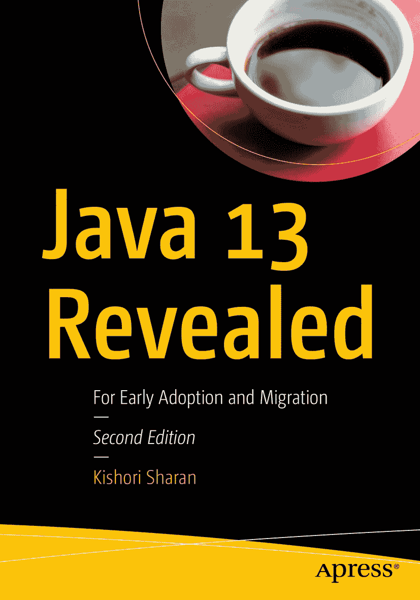

ISBN 978-1-4842-5406-6e-ISBN 978-1-4842-5407-3 [`doi.org/10.1007/978-1-4842-5407-3`](https://doi.org/10.1007/978-1-4842-5407-3) © Kishori Sharan 2019 本作品受版权保护。出版商保留所有权利，无论涉及材料的全部或部分，特别是翻译、重印、重用插图、朗诵、广播、以缩微胶片或任何其他物理方式复制，以及传输或信息存储与检索、电子改编、计算机软件，或通过目前已知或未来开发的类似或不同方法进行使用。本书中可能出现商标名称、标识和图像。我们仅在编辑风格中使用这些名称、标识和图像，以维护商标所有者的利益，并无意侵犯商标权，而非在每次出现商标名称、标识或图像时都使用商标符号。本书中使用的商品名称、商标、服务标志和类似术语，即使未明确标识，也不应被视为对其是否受专有权利保护的表达意见。尽管本书中的建议和信息在出版时被认为是真实准确的，但作者、编辑和出版商均不对可能存在的任何错误或遗漏承担法律责任。出版商对本书所含材料不作任何明示或暗示的保证。本书通过 Springer Science+Business Media New York 在全球图书贸易中发行，地址：233 Spring Street, 6th Floor, New York, NY 10013。电话：1-800-SPRINGER，传真：(201) 348-4505，电子邮件：orders-ny@springer-sbm.com，或访问 www.springeronline.com。Apress Media, LLC 是一家加利福尼亚有限责任公司，其唯一成员（所有者）是 Springer Science + Business Media Finance Inc (SSBM Finance Inc)。SSBM Finance Inc 是一家特拉华州公司。

*献给我的朋友理查德·卡斯蒂略，他在我撰写书籍的旅程中给予了不可思议的帮助。没有他的帮助，我无法出版我的三卷本《驾驭 Java 7》系列。谢谢你，我的朋友，感谢你所有的帮助。*

引言

## 第一版引言

Java 社区对模块系统和 Java Shell 最终在 JDK 9 中添加到 Java 平台感到兴奋，我也一样。毕竟，我们等了超过 10 年才看到这个模块系统付诸实践。之前的几个 JDK 版本都出现过模块系统的原型，但后来都被放弃了。JDK 9 中模块系统的引入也经历了一段坎坷的历程。它经历了多次提案和原型的迭代。我从 2016 年初开始撰写本书。我必须承认，这是一本很难写的书。我不得不与 JDK 的发布日期以及 Java 团队对模块系统所做的更改赛跑。我写了一个主题，几个月后发现 JDK 9 的最终发布日期已经改变，而我写的内容也不再有效。今天是 2016 年 2 月的最后一天，似乎尘埃终于落定——Java 团队和 Java 社区对模块系统感到满意——你将得到这本现在呈现给你的书。JDK 9 计划于 2017 年 7 月下旬发布。在撰写本文时，JDK 9 的功能已经完备。你不太可能看到本书涵盖的内容有很多无法工作的情况。然而，就软件发布而言，五个月是一段很长的时间，所以当你阅读本书时，如果某段代码无法工作，你需要稍微调整一下才能使其工作，请不要感到惊讶。

起初，这本书计划是 140 页。随着我的写作进展，我认为写一本如此短的书来涵盖 Java 平台最大的新增功能之一，是对读者的不负责任。我感谢我的出版商，从未抱怨我增加了数百页的篇幅。我用了九章（第 2 章到第 [10](https://doi.org/10.1007/978-1-4842-5407-3_10) 章）专门描述新的模块系统。第 [11](https://doi.org/10.1007/978-1-4842-5407-3_11) 章以无与伦比的细节介绍了 Java Shell (JShell)。

我花了无数时间研究这个主题。我写的是正在开发中的主题。我在互联网或书籍中找不到任何可以学习这些主题的资料。最大的挑战之一是开发阶段快速变化的 JDK 实现。我的主要研究来源是 Java 源代码、Java 增强提案 (JEP) 和 Java 规范请求 (JSR)。我还花了不少时间阅读 Java 源代码，以了解更多关于 JDK 9 中一些新主题的信息。摆弄 Java 程序总是很有趣，有时一玩就是几个小时，然后把它们添加到书中。有时，看到代码一周前还能工作，现在却不行了，这很令人沮丧。订阅所有 JDK 9 项目的邮件列表帮助我与 JDK 开发团队保持同步。有几次，我不得不仔细检查某个 JDK 主题的所有错误，以确认存在一个尚未修复的错误。

结局好，一切都好。最后，我很高兴我能够包含所有对有兴趣学习 Java SE 9 的读者来说重要的内容。我希望你喜欢阅读这本书并从中受益。

## 第二版引言

我很高兴地呈现这本名为 *Java 13 揭秘* 的第二版。距离本书第一版 *Java 9 揭秘* 出版已经大约两年半了。Java 10、11 和 12 三个版本已经发布；Java 13 计划在大约两周后，即 2019 年 9 月 17 日发布。本书的这一版涵盖了从 Java 10 到 13 中与 Java 开发者相关的所有新主题。如果你只对学习 JDK 9 特定的主题感兴趣，我建议你阅读我的 *Java 9 揭秘* 一书（ISBN: 978-1484225912），该书仅包含 JDK 9 特定的主题。

我真诚地希望本书的这一版能帮助你学习 Java 10 到 13 版本中新增的功能。

## 书籍结构

本书共包含八章，可按任意顺序阅读。若您只想学习几个新的 Java 特性，只需阅读涵盖这些特性的章节即可。

第 1 章解释了使用受限类型名 `var` 进行局部变量类型推断，该特性已添加到 Java 10 中。

Java 采用了新的基于时间的发布模式，每 6 个月发布一个特性版本，每 3 个月发布一个更新版本，每 3 年发布一个长期支持（LTS）版本。第 2 章解释了新的 Java 版本命名方案，该方案在 Java 9 中引入，并在 Java 10 中进行了更新。

第 3 章解释了 Java 11 中作为标准特性添加的 HTTP Client API，它允许您在 Java 应用程序中处理 HTTP 请求和响应。该 API 提供了用于开发带身份验证的 WebSocket 客户端端点的类和接口。

第 4 章解释了 Java 11 中为 `java` 命令添加的源文件模式。源文件模式允许您使用 `java` 命令直接运行单个 Java 源文件，而无需先编译该源文件。

第 5 章解释了 `switch` 的新语法和语义。它作为预览特性在 Java 12 中添加，并在 Java 13 中继续作为预览特性。此特性允许您将 `switch` 用作语句和表达式。

第 6 章解释了文本块，这是一种多行字符串字面量，编译器会自动对其进行转换。这是 Java 13 中添加的一个预览特性。本章还解释了为支持文本块而添加到 `String` 类中的方法。

第 7 章解释了 JDK 类和应用程序类的类数据共享（CDS），它可以加快 Java 应用程序的启动时间并减少运行时占用空间。本章涵盖了从 Java 10 到 Java 13 中 CDS 的更新。

第 8 章解释了工具的弃用和移除。它还涵盖了从 Java 10 到 Java 13 的 API 变更。本章并未涵盖所有工具和 API，仅涉及与 Java 应用程序开发者相关的部分。

## 目标读者

本书旨在帮助对 Java SE 9 有中级理解，并希望学习 Java 10 至 Java 13 新增特性的 Java 开发者。

## 如何使用本书

除第 8 章涵盖所有重要工具和 API 的变更外，每章均介绍一个 Java 新特性。您可以按任意顺序阅读各章。

### 源代码与勘误

本书的源代码和勘误可通过位于 [`www.apress.com/us/book/9781484254066`](http://www.apress.com/us/book/9781484254066) 的**下载源代码**按钮获取。

源代码包含一个 Apache NetBeans 11.1 项目。`src` 目录包含本书所有示例的源代码。您可以从 [`https://netbeans.apache.org/`](https://netbeans.apache.org/) 下载 Apache NetBeans。如果您更倾向于使用其他 IDE，可以在您的 IDE 中创建一个 Java 项目，并将提供的源代码中 `src` 目录下的源代码文件复制到您 IDE 的相应源代码目录中。许多示例程序使用了预览特性。您需要在 IDE 中启用预览特性才能编译这些程序。在随源代码提供的 Apache NetBeans 项目中已启用了预览特性。

### 问题与反馈

请将所有问题和反馈直接发送至作者邮箱：`ksharan@jdojo.com`。

致谢

当我在电脑前长时间工作撰写本书时，我的妻子 Ellen 始终耐心陪伴。我要感谢她给予的所有支持。

我要感谢我的家人和朋友们的鼓励与支持：我的母亲 Pratima Devi；我的兄长 Janki Sharan 和 Sita Sharan 博士；我的侄子 Babalu、Dablu、Gaurav 和 Saurav；我的姐姐 Ratna；我的朋友 Karthikeya Venkatesan、Preethi Vasudev、Rahul Nagpal、Ravi Datla、Vishwa Mohan，以及许多未在此提及的朋友。

我衷心感谢 Apress 的优秀团队在本书出版过程中给予的支持。感谢编辑运营经理 Mark Powers 提供的出色支持以及对我极大的耐心。特别感谢技术审校 Manuel Jordan Elera，他严谨的审校方法帮助剔除了许多技术错误。

最后但同样重要的是，衷心感谢 Apress 的首席编辑 Steve Anglin 为本书出版所付出的努力。

### 关于作者与技术审校

### 关于作者

### 关于技术审校

