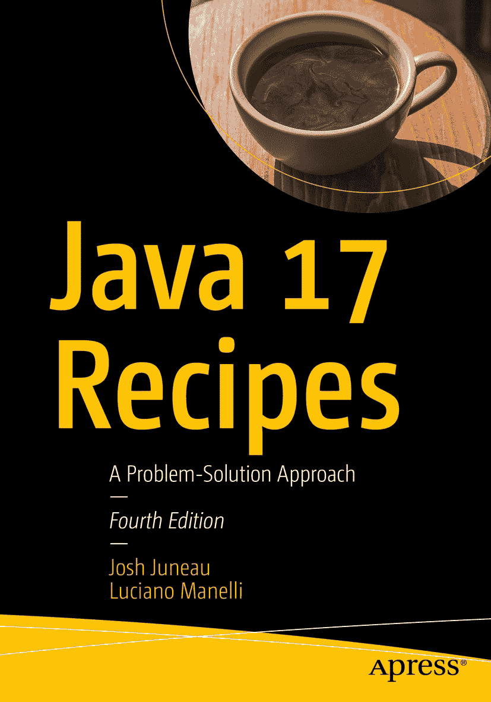

ISBN 978-1-4842-7962-5e-ISBN 978-1-4842-7963-2 [`doi.org/10.1007/978-1-4842-7963-2`](https://doi.org/10.1007/978-1-4842-7963-2) © Josh Juneau, Luciano Manelli 2022 本作品受版权保护。版权所有。所有权利均由出版商独家许可，无论涉及材料的全部或部分，特别是翻译、重印、重用插图、朗诵、广播、以缩微胶片或任何其他物理方式复制，以及传输或信息存储与检索、电子改编、计算机软件，或采用目前已知或今后开发的类似或不同方法。在本出版物中使用通用描述性名称、注册商标名称、商标、服务标志等，即使未作明确声明，也不意味着这些名称不受相关保护性法律和法规的约束，因此可自由使用。出版商、作者和编辑可以合理假设，本书中的建议和信息在出版之日是真实准确的。出版商、作者或编辑均不对本文所含材料或可能存在的任何错误或遗漏提供明示或暗示的保证。出版商对已出版地图中的管辖权主张和机构隶属关系保持中立。

本 Apress 印记由注册公司 APress Media, LLC（Springer Nature 的一部分）出版。

注册公司地址为：1 New York Plaza, New York, NY 10004, U.S.A.

*本书献给我的妻子和孩子们。*

*——乔什·朱诺*

*献给我的女儿萨拉*

*献给我的儿子马可*

*献给我的母亲安娜*

*每个人都必须始终追随自己的梦想并为之奋斗。*

*——卢西亚诺·马内利*

引言

本书教授 Java 编程语言的众多特性，从 Java 1.0 引入的特性到 Java 17 中新增的特性。Java 开发工具包（JDK）17 于 2021 年 9 月发布，是一个长期支持（LTS）版本（即稳定支持数年的版本）。Java 具有向后兼容性。即使每六个月发布一个新 Java 版本，你也不需要专门学习某个特定版本。相反，你需要扎实掌握所有语言特性，以便在应用程序中使用它们。自本书上一版以来，发生了许多改进。本书新增了涵盖 Java 9 到 Java 17 特性的示例。你实现的示例始终使用开源工具，例如 OpenJDK 和 Eclipse。

本书涵盖 Java 开发的基础知识，例如安装 JDK、编写类和运行应用程序。它深入探讨了面向对象结构的开发、异常处理、单元测试和本地化等基本主题。本书可作为解决普通 Java 开发人员可能遇到的某些问题的指南，可作为首次学习 Java 的入门起点，也可供已使用 Java 语言一段时间、希望精进 Java 开发技能的开发人员使用。它还将有助于高级 Java 应用程序开发人员了解该语言新特性的一两个要点，甚至可能偶然发现一些过去未曾使用的技术。本书讨论的主题范围广泛，所涵盖问题的解决方案简洁明了。无论你的技能水平如何，本书都是一本随手可得的参考书，用于解决日常编程中遇到的问题。

Java 编程语言由 Sun Microsystems 于 1995 年推出。Java 源自 C 和 C++等语言，其设计目标比旧语言更直观、更易用，特别是由于其简化的对象模型和自动化的内存管理等功能。当时，Java 因其面向对象、并发的架构、出色的安全性和可扩展性，以及用 Java 语言开发的应用程序可在任何包含 JVM 的操作系统上运行，而引起了开发者的兴趣。自诞生以来，Java 就被描述为一种允许开发者“一次编写，到处运行”的语言，因为代码被编译成包含字节码的类文件。生成的类文件可以在任何兼容的 JVM 上运行。这一概念使 Java 在桌面开发领域立即获得成功，后来在多年间又衍生出不同的技术解决方案，例如基于 Web 的应用程序。如今，Java 已部署在广泛的设备上，包括手机、打印机、医疗设备等。

Java 平台由一系列组件层级构成，从 JDK 开始，JDK 由 Java 运行时环境（JRE）、Java 编程语言以及开发和运行 Java 应用程序所需的平台工具组成。JRE 包含 JVM，以及有助于开发 Java 应用程序的 Java 应用程序编程接口（API）和库。JVM 是编译后的 Java 类文件运行的基础，负责解释编译后的 Java 类并执行代码。每个能够运行 Java 代码的操作系统都有自己的 JVM 版本。为此，任何运行本地 Java 桌面或独立 Java 应用程序的系统都必须安装 JRE。但这不成问题，因为大多数主流操作系统都提供了 JRE 实现。每个操作系统都可以有自己的 JRE 风格。例如，移动设备可以运行完整 JRE 的精简版本，该版本针对运行 Java 移动版（ME）和 Java SE 嵌入式应用程序进行了优化。Java 平台 API 和库是所有 Java 应用程序使用的预定义类的集合。任何在 JVM 上运行的应用程序都会使用 Java 平台 API 和库。这使得应用程序能够使用预定义并加载到 JVM 中的功能，让开发者有更多时间关注其特定应用程序的细节。构成 Java 平台 API 和库的类允许 Java 应用程序使用一组类与底层操作系统通信。因此，Java 平台负责将 Java 应用程序提供的一组指令解释为执行该应用程序的机器所需的操作系统命令。这为 Java 开发者创建了一个外观，使他们能够编写代码，开发出可以一次编写、在任何包含相关 JVM 的机器上运行的应用程序。

JVM 以及 Java 平台 API 和库在每个 Java 应用程序的生命周期中扮演着关键角色。已有整本书籍专门探讨平台和 JVM。本书侧重于用于开发 Java 应用程序的 Java 语言，尽管在需要时会引用 JVM 和 Java 平台 API 和库。Java 语言是一种健壮、安全且现代的面向对象语言，可以开发在 JVM 上运行的应用程序。Java 编程语言经过多次迭代的完善，每个新版本都变得更加强大、安全和现代。

本书的官方参考是 OpenJDK，这是 Java 平台标准版（Java SE）的一个开源实现。对于示例，你使用 Eclipse，这是一个开源的 Java 集成开发环境（IDE），用于开发软件应用程序，并带有用于 C/C++、JavaScript、PHP、HTML5、Python 和 Java 编程语言的各种插件。

我们希望你喜欢阅读本书。

## 本书读者对象

本书面向所有对学习 Java 编程语言感兴趣的人，以及虽然已经掌握该语言但希望了解 Java 特性（即使没有算法经验）的读者。尚未使用 Java 语言编程的读者可以阅读本书，并快速上手。希望用 Java 提供的最新特性更新自己技能储备的中高级 Java 开发者，也可以通过阅读本书来更新和刷新自己的技能。当然，书中还涵盖了众多其他对各类 Java 开发者都至关重要的主题。

## 本书结构

本书的结构设计使得读者无需从头到尾通读。其结构允许开发者选择他们想要阅读的主题，并直接跳转到相应章节。每个技巧都包含一个待解决的问题、一个或多个解决方案，以及解决方案的工作原理说明。本书旨在让开发者能够快速找到解决方案并付诸实践，从而准时回家吃晚饭。

## 源代码

你可以通过 `github.com/apress/java17-recipes` 访问本书的源代码。

关于作者 关于技术审校者

