# 1. Java 17 入门

本章提供了一些技巧，帮助 Java 语言新手以及有其他语言经验的程序员熟悉 Java 17。你将学习如何安装 Java 并配置集成开发环境（IDE），以便开发应用程序并试验本书提供的解决方案。出于安全原因，除非绝对必要，我们不建议安装任何东西。在没有其他选择的情况下，下载压缩版本并运行相应操作系统的相关脚本会更简单、更安全。你应该能够根据我们的说明，毫无问题地安装本书中提到的所有软件包的任何未来最新版本和发行版。你将学习 Java 的基础知识，例如创建类和接受键盘输入。文档编写常常被忽视，但在本章中，你还会快速学习如何为你的 Java 代码创建出色的文档。

注意

*《Java 17 技巧》* 并非一本完整的教程。相反，它涵盖了 Java 语言的关键概念。如果你确实是 Java 新手，你可能想阅读 Iuliana Cosmina 所著的 *《Java 17 绝对入门》*（Apress，2022 年）。

## 1.1 安装 Java

### 问题

你想安装 Java 并尝试使用该语言。

### 解决方案

安装 Java 开发工具包 17（JDK），它提供了该语言和编译器。

没有 Java，一切都无法运行。运行时环境（JRE）让你能够执行 Java。JDK 让你能够将 Java 源代码编译成可执行的类。有两个主要发行版：Oracle JDK 和 OpenJDK。我们选择了 GNU 通用公共许可证下的第二个版本，因为 Oracle JDK 的许可证在 2019 年 4 月发布的版本中发生了变化，仅允许某些免费使用。但是，你可以从 Oracle 技术网络下载 Oracle 在非开源许可证下提供的 JDK 商业构建版本。

从 [`https://jdk.java.net/17/`](https://jdk.java.net/17/) 下载适用于你平台的 OpenJDK 发行版，如图 1-1 所示，并将存档文件解压到你的 PC 上。

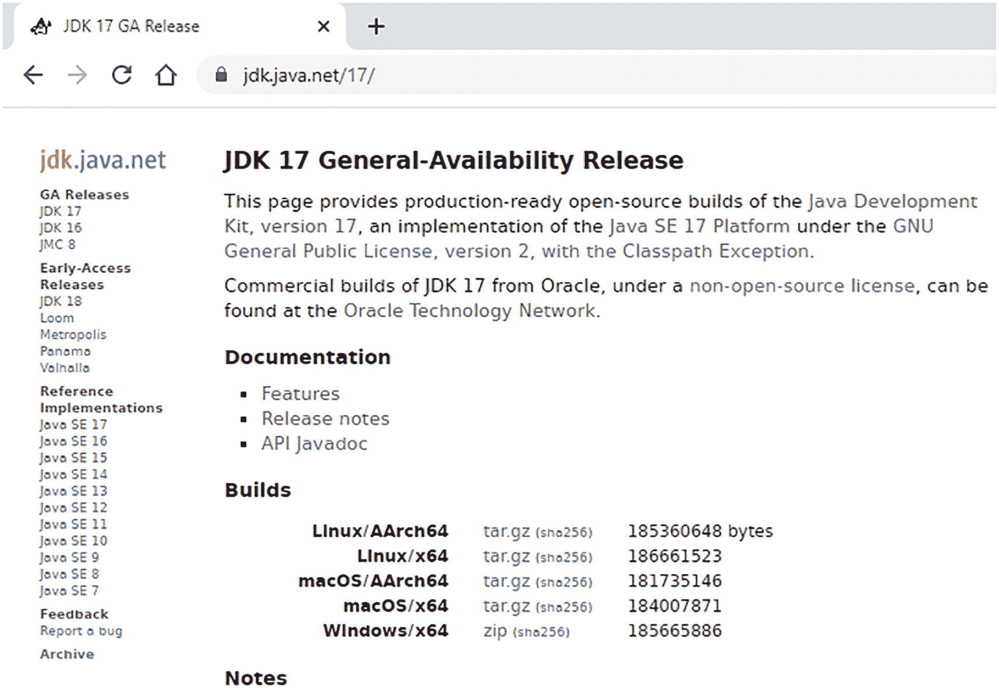

图 1-1

OpenJDK 17 主页

### 工作原理

*Java* 是 Oracle 公司拥有的商标。该语言本身是开源的，其演进由 Java 社区流程（JCP）控制。你可以在 [`www.jcp.org/en/home/index`](http://www.jcp.org/en/home/index) 上阅读相关信息。虽然 Oracle 公司不拥有该语言，但其核心开发往往由该公司主导。正是 Oracle 公司运营着 JCP 并拥有 jcp.org 域名。

Java `home` 文件夹包含 `bin` 子文件夹，它帮助你使用 Java 语言开发和执行程序（包含工具和实用程序），并支持执行用 Java 编程语言编写的程序（包含 Java 运行时环境（JRE）的实现、类库和其他文件）。从 Java 11 开始，Oracle 和 OpenJDK 团队决定只分发 JDK，并停止在 JRE 文件夹中复制 JDK 中的某些内容。

Java 有许多版本，例如移动版（ME）（[`www.oracle.com/java/technologies/javameoverview.html`](http://www.oracle.com/java/technologies/javameoverview.html)）和企业版（EE）（[`www.oracle.com/it/java/technologies/java-ee-glance.html`](http://www.oracle.com/it/java/technologies/java-ee-glance.html)）。Java SE 是标准版，代表了该语言的核心。我们为 Java SE 程序员编写了本书中的技巧。那些对开发嵌入式设备应用程序感兴趣的人可能想进一步了解 Java ME。同样，那些对开发 Web 应用程序和使用企业解决方案感兴趣的人可能想进一步了解 Java EE。

OpenJDK 和 Oracle JDK 的二进制文件是兼容且非常接近的，但存在一些差异。

*   Oracle JDK 源代码包含以下文本：“ORACLE PROPRIETARY/CONFIDENTIAL. Use is subject to license terms.” OpenJDK 则引用 GPL 许可证条款。

*   Oracle JDK 中 Java 版本的输出包含 Oracle 特定的标识符。OpenJDK 不包含 Oracle 特定的标识符。

*   Oracle JDK 使用 Java 加密扩展（JCE）代码签名证书。OpenJDK 允许未签名的第三方加密提供程序。

*   OpenJDK 仅以压缩存档形式提供。Oracle JDK 提供安装程序。

有关 Oracle JDK 的更多信息，请访问 [`www.oracle.com/java/technologies/javase/17-relnote-issues.html`](http://www.oracle.com/java/technologies/javase/17-relnote-issues.html)。

## 1.2 配置 PATH

### 问题

你想测试 Java 安装并从命令行编译 Java。

### 解决方案

将 JDK 路径添加到 PATH 环境变量中。你应该将 jdk-17 文件夹放在操作系统驱动器的根目录或自定义位置。

在 Windows 中，搜索并选择控制面板。单击高级系统设置，然后选择环境变量。在系统变量部分，找到 PATH 环境变量并选中它。在编辑系统变量字段或新建系统变量字段中，在“变量值”字段中输入文本 **C:\jdk-17\bin;**。你也可以将 JAVA_HOME 设置为 C:\jdk-17，然后在 Path 中设置值 %JAVA_HOME%\bin）。文本末尾的分号至关重要，因为它将新路径与现有路径分隔开。前后不要插入额外的空格。

在 Unix 和 Linux 系统中，你编辑环境文件并修改 PATH 变量。在这种情况下，你执行如下命令。

```
export PATH=/usr/local/jdk-17/ /bin
```

最后，要确定路径是否正确设置，请打开一个命令行窗口，进入命令提示符，并输入以下命令。

```
java -version.
```

如果你看到如图 1-2 所示的屏幕，则说明已安装正确的 Java 版本。

注意

*终端*（或在 Windows 中称为命令提示符）是一种命令行界面，允许你通过使用命令提示符来控制操作系统。

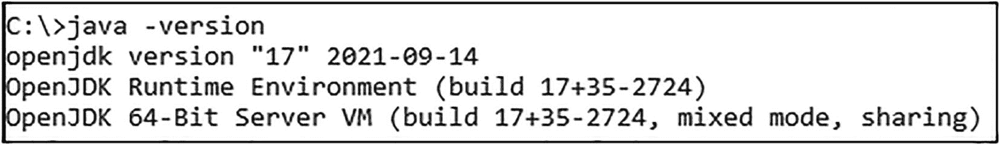

图 1-2

测试 Java 版本


### 工作原理

要编译和执行 Java 程序，必须将 JDK 路径添加到 PATH 环境变量中（在 Windows 中，该变量是一个由分号分隔的路径字符串；在 Unix 操作系统中，则由冒号分隔）。所有操作系统都使用 PATH 环境变量来确定可执行文件在系统中的位置，以便执行个人计算机上存储或下载的任何文件。该变量告诉操作系统，当用户执行文件时，要运行的程序位于何处。环境变量还可以存储应用程序或操作系统使用的信息。

PATH 包含一个由目录组成的字符串，在 Windows 中用分号分隔，在 Unix 操作系统中用冒号分隔。使用 PATH 的原因是，PATH 中列出的目录中的任何可执行文件都可以在不指定文件完整路径的情况下执行。这允许你仅通过文件名从命令行运行这些可执行文件，或者允许其他应用程序在不知道其目录路径的情况下运行这些可执行文件。

因此，当你执行一个文件时，需要指定该文件的完整路径，但如果命令不包含路径，操作系统会使用 PATH 中与你文件匹配的可执行文件。

## 1.3 测试 Java

### 问题

你想从命令行编译 Java。

### 解决方案

使用清单 1-1 中所示的小型应用程序。在此示例中，你可以使用像 Notepad++ 这样的智能编辑器或其他文本编辑器。

要创建第一个 Java 程序的源代码，必须执行以下操作。

1.  声明一个名为 Hello 的类。

2.  声明 `public static void main(String args[])` 或 `String... args` 作为主方法。

3.  输入 `System.out.println("Hello World")` 命令，在命令提示符窗口中显示“Hello World”。

```
public class Hello {
public static void main(String args[]){
System.out.println("Hello World");
}
}
清单 1-1
Hello.java
```

现在，将该文件保存为工作文件夹中的 Hello.java。打开命令窗口。切换到工作目录后，输入以下内容来编译应用程序。

```
javac Hello.java
```

它应该返回提示符，不显示任何信息。这也意味着你已正确更新了 `Path` 系统变量。如果你想了解更多关于 `javac` 编译器正在做什么的信息，请在 `javac` 和文件名之间输入 `-verbose`（`javac -verbose Hello.java`）。你会在工作目录中看到一个名为 `Hello.class` 的文件。

在命令提示符中输入以下内容来运行应用程序（参见图 1-3）。

```
java Hello
```

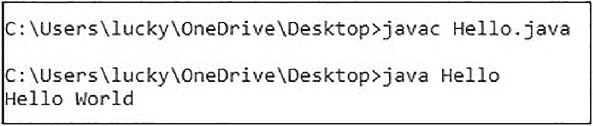

图 1-3

测试 Java 类

注意

本书中描述的所有代码都可以从 `github.com/apress/java17-recipes` 下载。在这种情况下，你可以直接输入代码；在其他情况下，你不需要重新输入。使用 Eclipse 环境提高你的编程技能非常重要，Eclipse 是一个著名的免费开源 Java IDE，包含一个用于开发应用程序的工作区，你可以从 [`www.eclipse.org`](http://www.eclipse.org) 下载。你可以在与相应章节同名的文件夹中找到这些示例。

### 工作原理

Java 是一种面向对象的编程语言，基于具有属性和方法的类和对象。类是创建对象所必需的。要创建一个 Java 程序（即 .class 文件），你必须创建一个 .java 文件。.java 文件是一个可读的文本文件，而 .class 文件是一个二进制文件，其中包含可以在 Java 虚拟机（JVM）上执行的 Java 字节码，由 Java 编译器从 .java 文件生成。

提示

你必须编译源代码。源代码保存在后缀为 `.java` 的文件中，因此你的操作系统的文件和目录路径表示法是合适的。你执行的是一个类。类是语言中的一个抽象概念，因此其点表示法是合适的（即，需要在类的实例名称后面写一个点（.），后跟要使用的方法）。请记住这个区别，以帮助自己记住何时使用哪种表示法。

#### 主程序

`public static void main(...)` 这个咒语在公共类中使用，用于表示 Java 程序的入口点。该声明开始一个名为 `main` 的可执行方法。你必须指定一个参数，该参数是一个字符串数组，通常该参数被定义为 `String[] args`。当你执行当前选定的类时，JVM 将控制权转移到 `main()` 方法，该方法调用 `System.out.println()` 来显示命令窗口中显示的 Hello World 消息。

## 1.4 安装 Eclipse

### 问题

你想安装一个合适的 IDE 来配合使用。

### 解决方案

安装 Eclipse IDE 以提供更高效的工作环境。

首先，你需要下载软件包。访问 [www.​eclipse.​org/​downloads/​packages/​](http://www.eclipse.org/downloads/packages/) 并点击 **Eclipse IDE for Java Developers**，如图 1-4 所示。

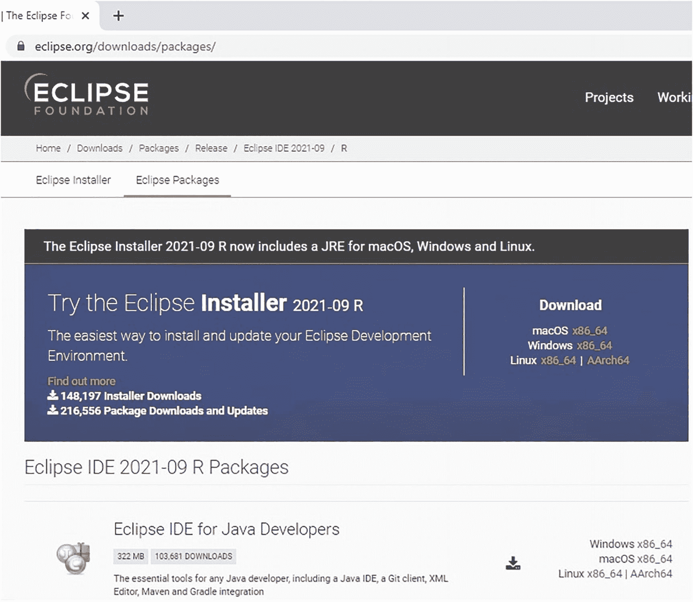

图 1-4

下载 Eclipse

网站会建议一个用于下载的镜像站点。Eclipse 的安装非常简单：将下载的文件解压到个人计算机的根目录下。当你执行 Eclipse 时，它会要求你选择一个工作区。工作区是 Eclipse 存储你开发项目的文件夹。因此，将其放在你定期备份的驱动器或目录中是合理的。在单击“确定”按钮之前，请选中**将此用作默认值并且不再询问**复选框。这会让你的生活更轻松。你可以选择根目录并使用 `eclipse-workspace` 默认文件夹，即用户的主目录。首次执行时，Eclipse 会显示一个欢迎屏幕。要进入开发界面，请单击工作台图标，如图 1-5 所示。

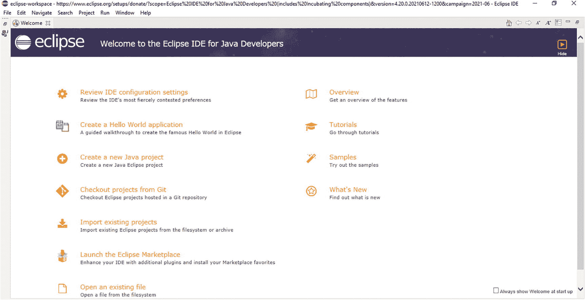

图 1-5

Eclipse – 欢迎屏幕

IDE 已准备就绪。你应该会看到一个类似于图 1-6 所示的工作区。

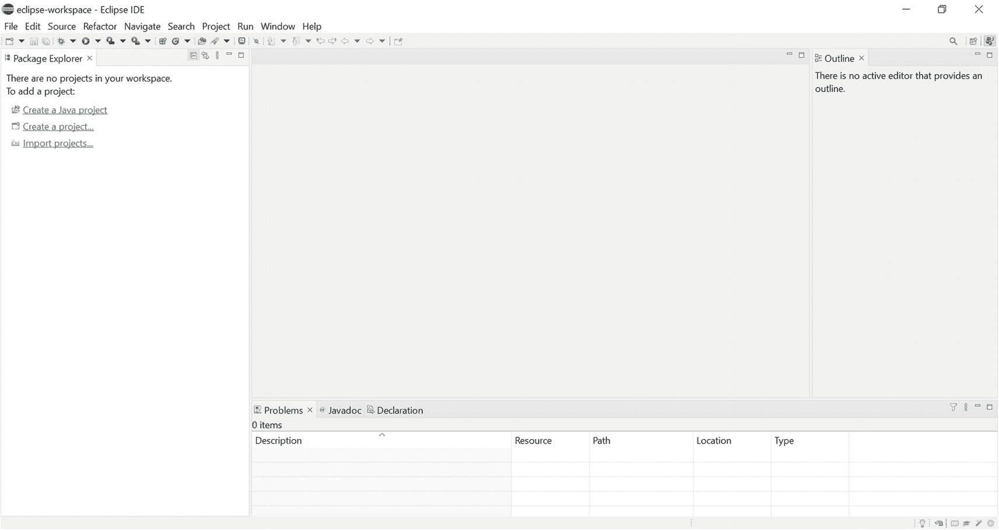

图 1-6

打开 Eclipse IDE

接下来，你需要告诉 Eclipse 要使用哪个版本的 JDK。在 Windows 操作系统中，转到“窗口”菜单并选择“首选项”。选择“Java”，然后选择“已安装的 JRE”。你会看到如图 1-7 所示的对话框。单击“编辑”并选择已安装的 JDK。

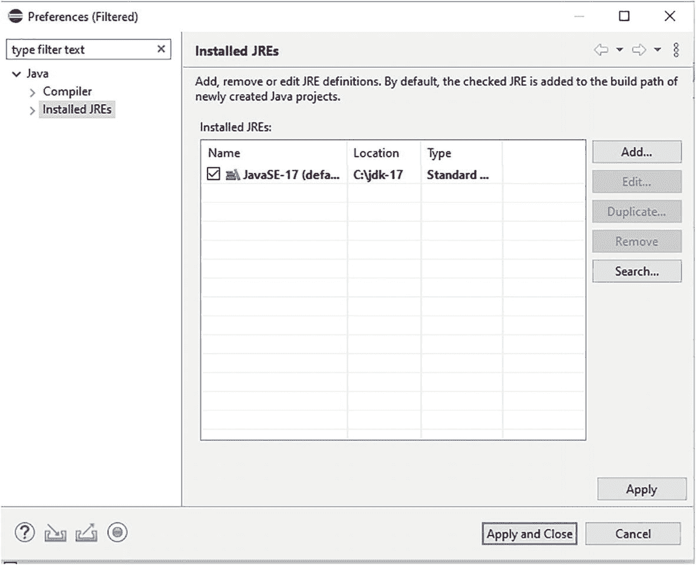

图 1-7

Eclipse – JDK 配置

你可以验证 Eclipse 是否使用了正确的 JDK。转到“帮助” ➤ “关于 Eclipse IDE”，然后单击“安装详细信息”按钮。你可以看到已安装和正在使用的 JDK 的路径和名称，如图 1-8 所示。

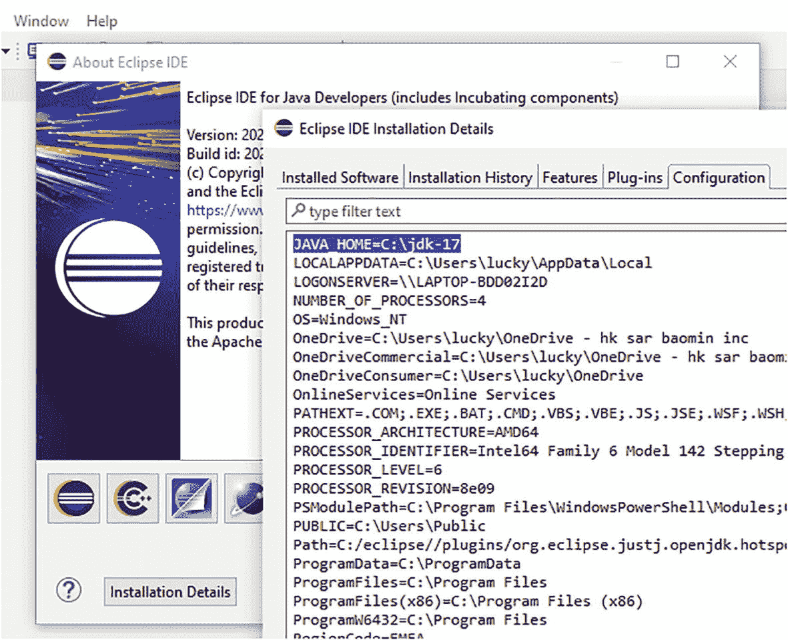

图 1-8

Eclipse 安装详细信息


### 工作原理

虽然可以通过命令行编译 Java 模块来构建 Web 应用程序，但使用 IDE 效率更高。这样，你可以专注于软件开发中更具创造性的部分，而不是修复不一致性和摆弄文件夹层次结构。

IDE 将开发软件所需的所有应用程序——从源代码编辑器和编译器，到自动化应用程序构建过程的工具和调试器——集成到一个单一的应用程序中。当使用 Java 或其他面向对象语言进行开发时，IDE 还包含用于可视化类和对象结构、继承以及包含关系的工具。使用 IDE 的另一个优点是，它能传播你对单个模块所做的更改。例如，如果你重命名一个类，IDE 可以自动更新整个项目文件中所有出现该类的地方。

随着你开发的应用程序变得越来越复杂，使用 IDE 的意义也越来越大。这就是为什么在继续下一个项目之前，我们先讨论如何安装和配置 Eclipse。

Eclipse 是一个极其强大且可扩展的 IDE，非常适合 Web 应用程序开发。由于软件行业的持续集成和交付（称为*滚动发布*），Eclipse 基金会每年发布四次新版本（分别在三月、六月、九月和十二月）。一旦你安装了 Eclipse 来开发应用程序，你也可以将它用于任何其他软件开发任务，例如通过插件开发和调试用 Java、C++、Python 编写的应用程序，或者调试在科学界广泛使用的 Fortran 语言。

此外，无论你需要执行什么与软件开发相关的任务，很可能已经有人为此开发了 Eclipse 插件。Eclipse Marketplace 网站（[`​marketplace.​eclipse.​org`](http://marketplace.eclipse.org)）列出了大约 2,000 个插件，分为数十个类别。Eclipse 由一个执行插件的核心平台，以及一系列实现其大部分功能的插件组成。因此，可从 Eclipse 网站下载的标准软件包包含数十个插件。

## 1.5 实现“Hello, World”

### 问题

你已经安装了 Java SE 17 和 Eclipse IDE。现在你想运行一个简单的 Java 程序来验证你的安装是否正常工作。

### 解决方案

首先打开 Eclipse IDE。如果你已经在 IDE 中处理过一些项目，你可能会在左侧窗格中看到一些项目。

转到“文件”菜单，选择“新建” ➤ “Java 项目”，如图 1-9 所示。

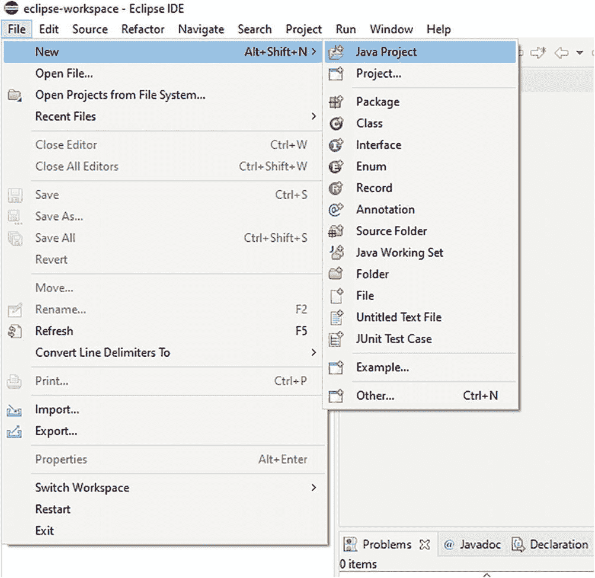

图 1-9

选择 Java 项目

弹出的对话框如图 1-10 所示。

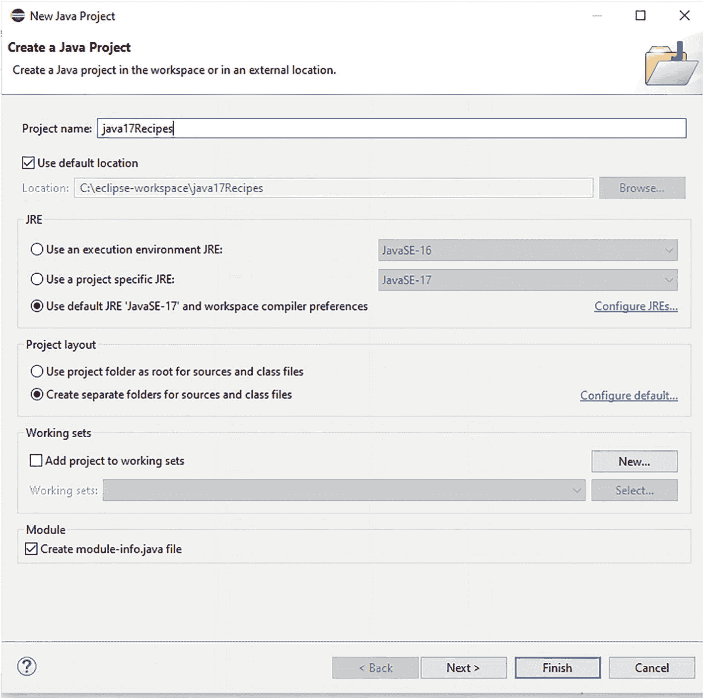

图 1-10

创建一个新的 Java 项目

将你的项目命名为 **java17Recipes**。在对话框顶部的文本框中输入项目名称，如图 1-10 所示。

在 JRE 部分，选择已安装的 JDK（即你刚刚配置的 JavaSE-17）。按“完成”按钮完成向导并创建一个骨架项目。

提示

Java 是区分大小写的。此外，按照惯例，项目名称应以小写字母开头。

现在，创建一个新的包。转到“文件”菜单，选择“新建” ➤ “包”，如图 1-11 所示。

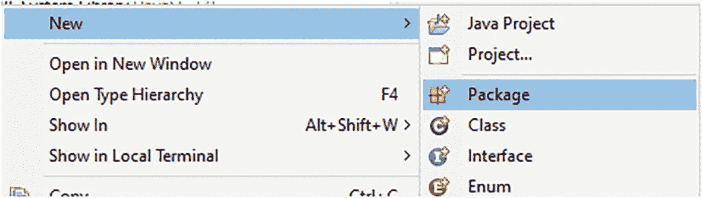

图 1-11

在 Eclipse IDE 中创建新包

将包命名为 `org.java17recipes.chapter01.recipe01_05`，如图 1-12 所示。

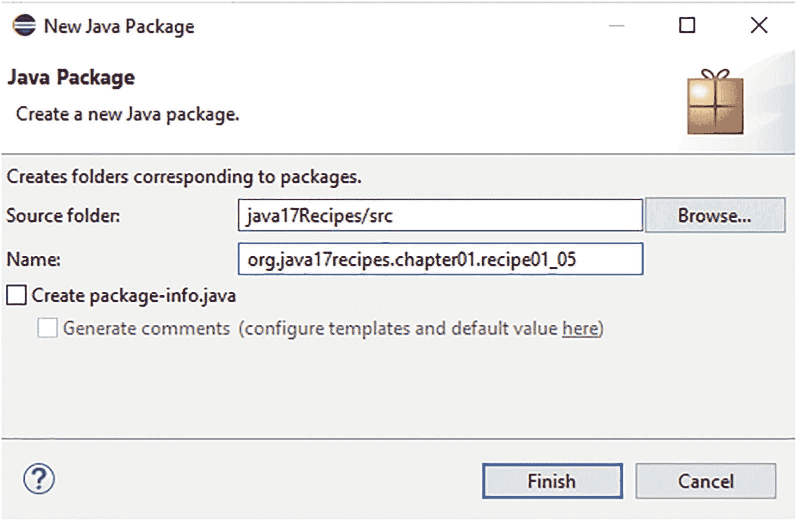

图 1-12

在 Eclipse IDE 中命名包

提示

按照惯例，包名通常以小写字母开头。

接下来，创建一个新的类。转到“文件”菜单，选择“新建” ➤ “类”，并将该类命名为 `HelloWorld`，如图 1-13 所示。

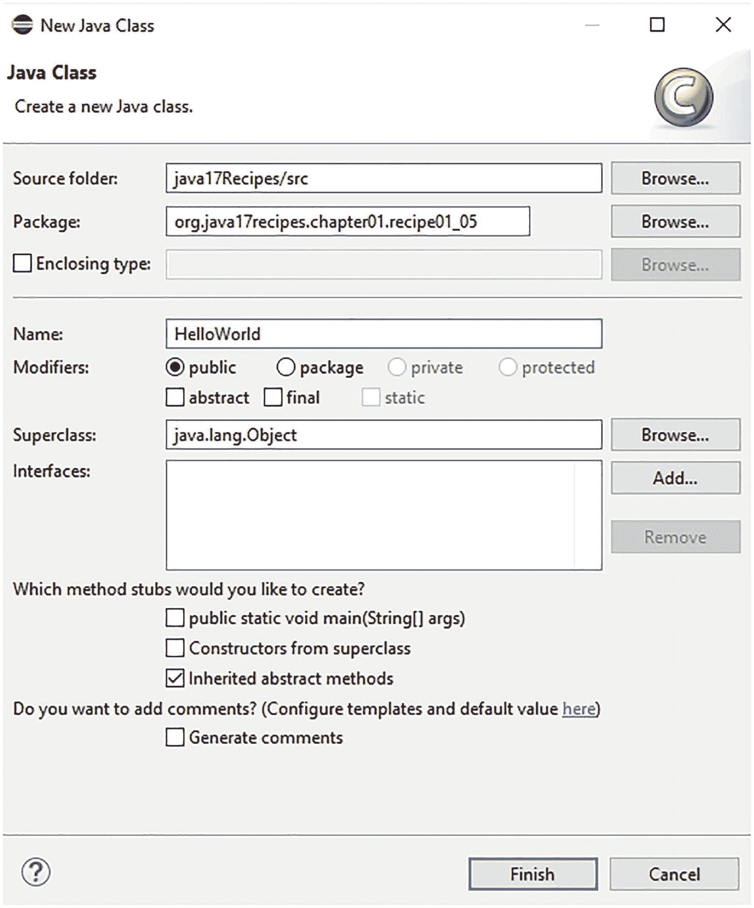

图 1-13

在 Eclipse IDE 中创建并命名一个新类

提示

你可以通过简单地创建一个新类并在“名称”字段中输入包名和类名，在同一个配置窗口中创建包和类。此外，按照惯例，类名通常以大写字母开头。

请确保你完全按照我们这里提供的方式输入项目名称、包名称和类名称，因为后续的代码依赖于你的正确输入。确保项目名称是 `java17Recipes`。确保包是 `org.java17recipes.chapter01.recipe01_05`。确保类是 `HelloWorld`。

接下来，你应该查看一个 Java 源文件。系统会为你生成骨架代码，你的 Eclipse IDE 窗口应该类似于图 1-14 所示。

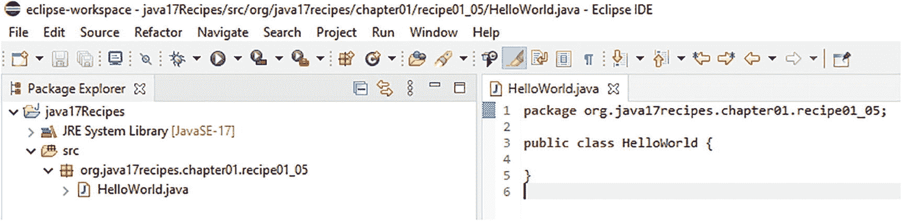

图 1-14

查看 Eclipse 生成的骨架代码

将光标放在源代码窗格中的任意位置。按 Ctrl+A 选择所有骨架代码。然后按 Delete 键将其删除。用清单 1-2 中的代码替换已删除的代码。然后，创建另一个类，将其命名为 `HelloMessage`，并从清单 1-3 中复制代码。

你可以在本书的示例下载中找到清单 1-2 和清单 1-3 中的代码。有两个文件，名为 `HelloMessage.java` 和 `HelloWorld.java`，它们位于名为 `org.java17recipes.chapter01.recipe01_05` 的 Java 包中。请注意，本书中所有实质性的解决方案都包含在该示例下载中。

该类名为 `HelloWorld`，它启动程序。

```
package org.java17recipes.chapter01.recipe01_05;
public class HelloWorld {
/* main 方法从这个类开始 */
public static void main(String[] args) {
HelloMessage hm;
hm = new HelloMessage();
System.out.println(hm.getMessage());
hm.setMessage("Hello, World");
System.out.println(hm.getMessage());
}
}
清单 1-2
一个“Hello, World”示例
```

第二个类 `HelloMessage` 是一个容器类，用于保存基于字符串的消息。

```
package org.java17recipes.chapter01.recipe01_05;
public class HelloMessage {
private String message = "";
public HelloMessage() {
this.message = "Default Message";
}
public void setMessage (String m) {
this.message = m;
}
public String getMessage () {
//它将消息转换为大写
return message.toUpperCase();
}
}
清单 1-3
一个“消息”示例
```

确保你已经粘贴（或输入）了代码。编译并运行程序。在项目中右键单击，选择“运行方式” ➤ “Java 应用程序”，如图 1-15 所示。

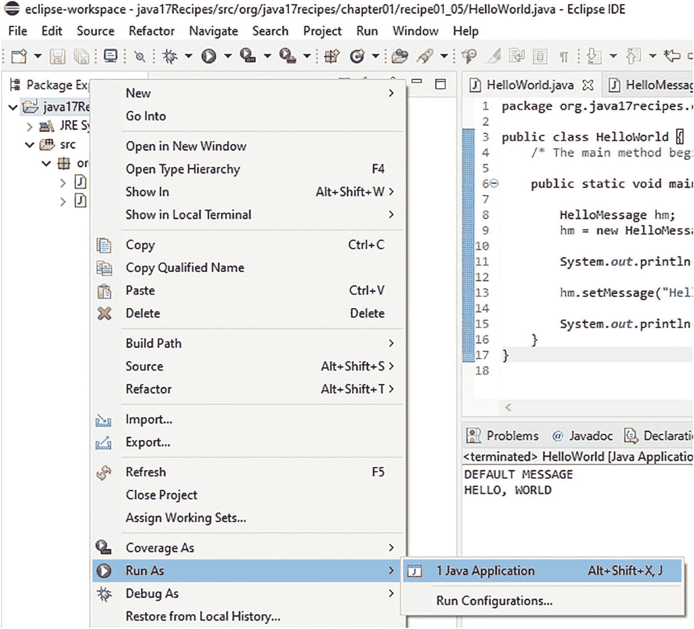

图 1-15

在 Eclipse IDE 中运行项目

现在你应该看到以下输出。

```
DEFAULT MESSAGE
HELLO, WORLD
```

此输出出现在一个名为“控制台”的新视图中，Eclipse 会在 IDE 窗口底部打开该视图，如图 1-16 所示。

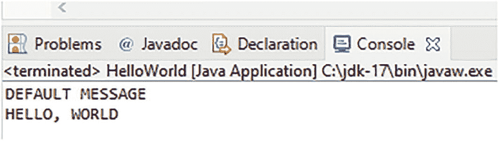

图 1-16

Eclipse IDE 中的控制台视图

### 工作原理

你可以使用本示例中展示的相同通用技术来运行本章中几乎所有的解决方案。因此，我们仅在此处展示一次分步截图。


#### 包

解决方案示例首先创建了一个 Java *包*。

```
package org.java17recipes.chapter01.recipe01_05;
```

包是一种将相关类分组到共享命名空间中的方式。其理念是通过按组织域名的逆序逐级深入，实现全局唯一性。通常也习惯将包名全部小写。

Eclipse 会创建一个目录结构来模拟你的包路径。在本例中，Eclipse 创建了以下目录路径。

```
C:\eclipse-workspace\java17Recipes\src\org\java17recipes\chapter01\recipe01_05
```

关于此路径，需要注意以下几点：

*   前半部分是 `C:\eclipse-workspace`。Eclipse 会在一个工作区目录下创建所有项目，该目录可以更改。开发者可以指定不同的路径。

*   接下来是首次出现的 `java17Recipes`。这对应着项目名称（参见图 1-10）。

*   你创建的任何源文件都放入 `src` 目录。Eclipse 在此层级还会创建其他目录。例如，Eclipse 会创建一个 `bin` 目录，其下有一个 `classes` 子目录，用于存放编译后的类文件。

*   最后是与你指定的包路径相对应的目录，在本例中为 `org\java17recipes\chapter01\recipe01_05`。当你编译代码时，`bin\classes` 目录下也会创建相同的结构。请注意，如果使用其他 IDE，创建的目录可能会有所不同。

你需要显式地创建一个包。在开发任何重要应用程序时，组织结构和审慎选择的命名约定都至关重要。

#### JavaBeans 风格的类

解决方案示例中的下一个内容是一个遵循 JavaBeans 模式的类定义。`HelloMessage` 的定义遵循了你在 Java 编程中经常遇到的一种模式，我们将其包含在内也是出于这个原因。这个类很简单，能够持有一个名为 `message` 的字符串字段。

该类中定义了三个方法。

*   `HelloMessage()`。这个方法，也称为构造器，其名称与类名相同。在本例中，它不接受任何参数。每当你创建该类的一个新对象时，它会被自动调用。请注意，这被称为无参或*无参数*构造器，因为它在类中被显式写出且不接受参数。如果你没有提供构造器，JVM 会自动提供一个默认构造器（同样不接受参数）。

*   `setMessage(String)`。这个访问器方法以单词 `set` 开头。它接受一个参数。它指定了将由对应的 `get` 方法返回的消息。

*   `getMessage()`。这个访问器方法返回当前定义的消息。在此示例中，我们选择将消息转换为大写。

注意

访问器方法在 JavaBeans 类中用于访问任何私有声明的类成员。在本例中，可以使用这些方法访问标识为 `message` 的私有变量。访问器方法通常更常被称为 getter 和 setter。

以 `set` 和 `get` 开头的方法就是 *setter* 和 *getter* 方法。IDE 会生成这些方法。`message` 变量对于该类是私有的，这意味着你无法从类外部直接访问 `message`。

你在类中看到了 `this` 关键字。它是 Java 中的一个特殊关键字，用于引用当前对象。它的使用是冗余的，但如果任何方法恰好创建了也名为 `message` 的变量，则必须使用它：由于参数名称的原因，setter 是强制性的。通常的做法是在 getter 和 setter 方法中使用 `this` 关键字来引用类成员，主要是在 setter 方法中。

在 Java 中，像我们的示例那样通过 setter 和 getter 方法来中介对类变量的访问是很常见的。这些方法代表了与其他类及主程序之间的一种契约：公共方法允许读取或写入类的状态，但外部代码并不知道映射关系。它们的好处是，你可以随心所欲地更改 `HelloMessage` 的存储实现。它的字段和状态信息可以独立于存储类型进行保存和恢复。只要保持 `setMessage()` 和 `getMessage()` 的外部行为不变，其他依赖于 `HelloMessage` 的代码就能继续正常工作。

#### 主程序

当你执行当前选中的类时，Eclipse 会将代码编译成一组二进制文件，然后将控制权转移给 `main()` 方法。Eclipse 也可以配置为在保存时重新编译，这同样会导致控制权转移给 `main()` 方法。该方法随后会执行以下操作：

1.  执行 `HelloMessage` 来创建一个名为 `hm` 的变量，该变量可以持有 `HelloMessage` 类的一个实例。此时 `hm` 变量为 null。

2.  调用 `new HelloMessage()` 来创建该类的一个对象。执行无参构造器，并将 `"Default Message"` 设置为问候文本。新对象现在存储在 `hm` 变量中。

3.  调用 `System.out.println()` 来显示对象的无参构造器确实已按预期执行。getter 将文本转换为大写并返回值。在控制台窗格中显示问候语 `"DEFAULT MESSAGE"`。

4.  将消息设置为传统的 `"Hello, World"` 文本。

5.  再次调用 `System.out.println()` 来输出刚刚设置的新消息。现在你会看到问候语 `"HELLO, WORLD"` 被添加到控制台窗格中，并且已变为大写。

解决方案中的这种模式在 Java 编程中很常见。`main()` 方法是执行的起点。定义变量，并使用 `new` 运算符创建对象。对象变量通常使用 setter 和 getter 方法进行设置和获取。

## 1.6 配置 CLASSPATH

### 问题

你想要执行一个 Java 程序，或者在你正在执行的应用程序中包含一个外部 Java 库。

### 解决方案

将 `CLASSPATH` 变量设置为你需要访问的用户自定义 Java 类或 Java 归档（JAR）文件所在的目录位置，以便执行你的应用程序。假设你有一个名为 `JAVA_DEV` 的目录，位于操作系统驱动器的根目录下，并且你的应用程序需要访问的所有文件都位于此目录中。如果是这种情况，你可以执行如下命令。

```
set CLASSPATH=C:\JAVA_DEV\some-jar.jar
```

在 Unix 和 Linux 系统中使用以下命令。

```
export CLASSPATH=/JAVA_DEV/some-jar.jar
```

或者，`javac` 命令提供了一个选项，用于指定应用程序要加载的资源的路径。在所有平台上，可以通过 `-classpath` 选项使用此技术来设置 `CLASSPATH`，如下所示。

```
javac –classpath /JAVA_DEV/some-jar.jar...
```

当然，在 Microsoft Windows 机器上，文件路径使用反斜杠（\）。

注意

可以使用 `javac –cp` 选项，而不是指定 `-classpath` 选项。


### 工作原理

Java 实现了*类路径*（classpath）的概念。这是一个目录搜索路径，你可以通过 `CLASSPATH` 环境变量在系统范围内指定它。你也可以通过 `java` 命令的 `-classpath` 选项为 JVM 的特定调用指定类路径。

在执行 Java 程序时，JVM 会按照以下搜索顺序查找并加载所需的类。

1.  Java 平台的基础类，这些类位于 Java 安装目录中
2.  位于 JDK 扩展目录中的任何包或 JAR 文件
3.  在指定类路径上某处加载的包、类、JAR 文件和库

你可能需要为一个应用程序访问多个目录或 JAR 文件。如果你的依赖项位于多个位置，就会出现这种情况。为此，只需使用操作系统的分隔符（Windows 使用 `;`，Unix 操作系统使用 `:`）作为 `CLASSPATH` 变量指定位置之间的分隔符。以下是在 Unix 和 Linux 系统的 `CLASSPATH` 环境变量中指定多个 JAR 文件的示例。

```
export CLASSPATH=/JAVA_DEV/some-jar.jar:/JAVA_LIB/myjar.jar
```

或者，你也可以通过命令行选项指定类路径。

```
javac –classpath /JAVA_DEV/some-jar.jar:/JAVA_LIB/myjar.jar...
```

在加载 Java 应用程序的资源时，JVM 会加载第一个位置中指定的所有类和包，然后是第二个位置，依此类推。这一点很重要，因为在某些情况下，加载顺序可能会影响避免相互干扰。

注意

JAR 文件将应用程序和 Java 库打包成可分发的格式。如果你没有以这种方式打包应用程序，你可以直接指定你的 `.class` 文件所在的目录。

有时你想包含指定目录中的所有 JAR 文件。可以通过在包含文件的目录后指定通配符（`*`）来实现。以下是一个示例。

```
javac –classpath /JAVA_DEV/*:/JAVA_LIB/myjar.jar...
```

指定通配符会告诉 JVM 它只应加载 JAR 文件。它不会加载使用通配符指定的目录中的类文件。如果你还需要类文件，则需要为同一目录指定一个单独的路径条目。以下是一个示例。

```
javac –classpath /JAVA_DEV/*:/JAVA_DEV
```

类路径中的子目录不会被搜索。要加载子目录中包含的文件，必须显式地在类路径中列出这些子目录和/或文件。但是，与子目录结构等效的 Java 包*会*被加载。因此，任何位于与子目录结构等效的 Java 包中的 Java 类都会被加载。

注意

组织好你的代码是个好主意；同样，在计算机上组织好代码的存放位置也是个好习惯。一个好的做法是将所有 Java 项目放在同一个目录中；这个目录可以成为你的工作区。将所有包含在 JAR 文件中的 Java 库放在同一个目录中，以便于管理。你也可以使用 Maven 和 Gradle 等工具来组织你的项目。

## 1.7 使用包组织代码

### 问题

你的应用程序由 Java 类、接口和其他类型组成。你想组织这些源文件，使其更易于维护并避免潜在的类命名冲突。

### 解决方案

创建 Java 包并将源文件放入其中。Java 包可以组织应用程序中逻辑分组的源文件。包有助于组织代码、减少不同类和其他 Java 类型文件之间的命名冲突，并提供访问控制。要创建一个包，只需在应用程序源文件夹的根目录下创建一个目录并为其命名。包通常相互嵌套，并遵循标准的命名约定。对于本方案，假设组织名为 JavaBook 并生产小部件。要组织小部件应用程序的所有代码，请创建一组符合以下目录结构的嵌套包。

```
/org/javabook
```

放在包中的任何源文件都必须将 `package` 语句作为源文件的第一行。`package` 语句列出了包含该源文件的包的名称。例如，假设小部件应用程序的主类名为 `JavaBookWidgets.java`。要将此类放入名为 `org.javabook` 的包中，请将源文件物理移动到名为 `javabook` 的目录中，该目录位于 `org` 目录内，而 `org` 目录位于应用程序源文件夹的根目录中。目录结构应如下所示。

```
/org/javabook/JavaBookWidgets.java
```

`JavaBookWidgets.java` 的源代码如下。

```
package org.javabook;
/**
* JavaBook Widgets 应用程序的主类。
* @author
*/
public class JavaBookWidgets {
public static void main(String[] args){
System.out println("欢迎使用我的应用！");
}
}
```

源文件的第一行包含 `package` 语句，该语句列出了源文件所在的包的名称。语句中列出了完整的包路径，路径中的名称用点分隔。

注意

`package` 语句必须是 Java 源文件中列出的第一条语句。但是，注释或 JavaDoc 注释可以写在 `package` 语句之前。

一个应用程序可以由任意数量的包组成。如果小部件应用程序包含几个表示小部件对象的类，它们可以放在 `org.javabook.widget` 包中。该应用程序可能具有与小部件对象交互的接口。在这种情况下，名为 `org.javabook.interfaces` 的包也可能包含任何此类接口。


### 工作原理

Java 包对于组织源文件、控制对不同类的访问以及确保没有命名冲突非常有用。包在文件系统上由一系列物理目录表示，并且可以包含任意数量的 Java 源文件。每个源文件必须在文件中的任何其他语句之前包含一个 `package` 语句。这个 `package` 语句列出了源文件所在包的名称。本节的解决方案中包含的源文件使用了以下包声明语句。

```
package org.javabook;
```

这个 `package` 语句表明源文件位于名为 `javabook` 的目录中，而该目录又位于名为 `org` 的目录中。包命名约定可能因公司或组织而异。但是，单词必须全部小写，以免与任何 Java 类文件名冲突。许多公司或组织使用其域名的反向形式进行包命名。但是，如果域名包含连字符，则应使用下划线。

注意

当一个类位于 Java 包中时，它不再仅通过类名来引用；相反，包名会被添加到类名之前，这被称为*完全限定*名称。例如，位于 `JavaBookWidgets.java` 文件中的类包含在 `org.javabook` 包中。该类使用 `org.javabook.JavaBookWidgets` 来引用，而不仅仅是 `JavaBookWidgets`。一个同名的类可以位于不同的包中（例如，`org.java17recipes.JavaBookWidgets`）。

包对于建立安全级别和组织结构非常有用。默认情况下，位于同一包中的不同类可以相互访问。如果一个源文件位于与它需要使用的另一个文件不同的包中，则必须在源文件的顶部（在 `package` 语句下方）声明一个 `import` 语句来导入该文件。并且源文件必须将类/接口/枚举元素类型声明为 **public**；否则，必须在代码中使用完全限定的 `package.class` 名称。类可以单独导入，如下面的 `import` 语句所示。

```
import org.javabook.JavaBookWidgets;
```

然而，通常可能需要使用包中的所有类和类型文件。一个使用通配符（`*`）的 `import` 语句可以导入命名包中的所有文件，如下所示。

```
import org.javabook.*;
```

尽管可以导入所有文件，但除非必要，否则不推荐这样做。包含许多使用通配符的 `import` 语句被认为是一种不良的编程实践。相反，应该单独导入类和类型文件。

将类组织到包中被证明是非常有用的。假设本节解决方案中描述的小部件应用程序为每个小部件对象包含了不同的 Java 类。每个小部件类可以分组到一个名为 `org.javabook.widgets` 的包中。类似地，每个小部件都可以扩展某个 Java 类型或接口。所有这些接口都可以组织到一个名为 `org.javabook.interfaces` 的包中。

任何重要的 Java 应用程序都包含包。你使用的任何 Java 库或应用程序编程接口（API）都包含包。当你从这些库和 API 导入类或类型时，你实际上是在导入包。

## 1.8 声明变量和访问修饰符

### 问题

你想在程序中创建一些变量并操作数据。此外，你希望某些变量仅对当前类可用，而其他变量应对所有类可用，或仅对当前包中的其他类可用。

### 解决方案

Java 实现了八种基本数据类型。`String` 类类型也有特殊支持。清单 1-4 展示了每种类型的声明示例。参考该示例来声明你自己应用程序中所需的变量。

```
package org.java17recipes.chapter01.recipe01_08;
public class DeclarationsExample {
public static void main (String[] args) {
boolean booleanVal = true;  /* 默认值为 false */
char charval = 'G';         /* Unicode UTF-16 */
charval = '\u0490';         /* 乌克兰字母 Ghe(Ґ) */
byte byteval;       /*  8 位，-127 到 127 */
short shortval;     /* 16 位，-32,768 到 32,768 */
int intval;         /* 32 位，-2147483648 到 2147483647 */
long longval;       /* 64 位，-(2⁶⁴) 到 2⁶⁴ - 1 */
float   floatval = 10.123456F;        /* 32 位 IEEE 754 */
double doubleval = 10.12345678987654; /* 64 位 IEEE 754 */
String message = "Darken the corner where you are!";
message = message.replace("Darken", "Brighten");
}
}
清单 1-4
基本类型和 String 类型的声明
```

注意

如果你对清单 1-4 中的乌克兰字母感到好奇，它是西里尔字母 *Ghe with upturn*。你可以在 [`http://en.wikipedia.org/wiki/Ghe_with_upturn`](http://en.wikipedia.org/wiki/Ghe_with_upturn) 阅读其历史。你可以在 [`www.unicode.org/charts/PDF/U0400.pdf`](http://www.unicode.org/charts/PDF/U0400.pdf) 的图表中找到其码点值。而网址 [`www.unicode.org/charts/`](http://www.unicode.org/charts/) 是当你需要查找给定字符对应的码点时的一个很好的起点。

变量受*可见性*概念的约束。清单 1-5 中创建的变量在创建后可从 `main()` 方法中可见，并在 `main()` 方法结束时被释放。它们在 `main()` 方法之外没有“生命周期”，并且无法从 `main()` 外部访问。

在类级别创建的变量则不同。这样的变量可以称为*类字段或类成员*，即*类的字段或成员*。成员的使用可以限制在其声明的类的对象或声明所在的包中，或者可以从任何包中的任何类进行访问。

```
package org.java17recipes.chapter01.recipe01_08;
class TestClass {
private long visibleOnlyInThisClass;
double visibleFromEntirePackage;
void setLong (long val) {
visibleOnlyInThisClass = val;
}
long getLong () {
return visibleOnlyInThisClass;
}
}
public class VisibilityExample {
public static void main(String[] args) {
TestClass tc = new TestClass();
tc.setLong(32768);
tc.visibleFromEntirePackage = 3.1415926535;
System.out.println(tc.getLong());
System.out.println(tc.visibleFromEntirePackage);
}
}
清单 1-5
可见性与字段的概念
```

以下是输出结果。

```

3.1415926535
```

成员通常绑定到类的对象。每个类对象都包含该类中每个成员的一个实例。但是，你也可以定义*静态*字段，这些字段只出现一次，并且具有一个由给定类的所有实例共享的单一值。清单 1-6 说明了这种区别。

```
package org.java17recipes.chapter01.recipe01_08;
class StaticDemo {
public static boolean oneValueForAllObjects = false;
}
public class StaticFieldsExample {
public static void main (String[] args) {
StaticDemo sd1 = new StaticDemo();
StaticDemo sd2 = new StaticDemo();
System.out.println(sd1.oneValueForAllObjects);
System.out.println(sd2.oneValueForAllObjects);
sd1.oneValueForAllObjects = true;
System.out.println(sd1.oneValueForAllObjects);
System.out.println(sd2.oneValueForAllObjects);
}
}
清单 1-6
静态字段
```

清单 1-6 产生以下输出。

```
false
false
true
true
```


字段 `oneValueForAllObjects` 仅对名为 `sd1` 的类实例设置为 `true`。然而，例如 `sd2` 实例中它也为 `true`。这是因为在声明该字段时使用了关键字 `static`。静态字段在其类的所有对象中只出现一次。此外，IDE 中的编译器会对此发出警告。实际上，应该通过 `StaticDemo.oneValueForAllObjects` 来使用它。

### 工作原理

清单 1-6 展示了变量声明的基本格式。

```
type variable;
```

在声明变量时进行初始化是很常见的，因此你经常会看到以下形式。

```
type variable = initialValue;
```

修饰符可以放在字段声明之前。以下是一个示例。

```
public static variable = initialValue;
protected variable;
private variable;
```

通常将可见性修饰符——`public`、`protected` 或 `private`——放在首位，但你可以按任意顺序列出修饰符。默认情况下，如果未指定任何修饰符，则该类或成员为包私有，这意味着只有同一包内的其他类才能访问该成员。

注意

如果类成员被指定为 `protected`，那么它也是包私有的，只不过其所在类的任何子类（即使位于其他包中）也可以访问。

`String` 类型在 Java 中很特殊。它是一个类类型，但在语法上你可以将其视为基本类型。每当你将一串字符括在双引号（`"..."`）内时，Java 会自动创建一个 `String` 对象。你无需调用构造函数或指定 `new` 关键字。然而 `String` 是一个类，并且该类中有一些方法可供你使用。其中一个方法就是清单 1-4 末尾展示的 `replace()` 方法。

字符串由字符组成。Java 的 `char` 类型是一个双字节结构，用于存储 Unicode UTF-16 编码中的单个字符。你可以通过两种方式生成 `char` 类型的字面量。

*   如果字符易于输入，请将其括在单引号内（例如，`'G'`）。
*   否则，请指定以 `\u` 为前缀的四位 UTF-16 *码点*值（例如，`'\u0490'`）。

某些 Unicode 码点需要五位数字。这些无法在单个 `char` 值中表示。如果你需要关于 Unicode 和国际化的更多信息，请参阅第 12 章。

避免使用任何基本类型来表示货币值。尤其要避免为此目的使用浮点类型。请转而参考第 12 章及其关于使用 Java Money API 计算货币金额的配方（配方 12-10）。当你需要精确的固定小数运算时，`BigDecimal` 也很有用。

如果你是 Java 新手，可能不熟悉示例中演示的 `String[]` 数组表示法。有关数组的更多信息，请参阅第 7 章。该章涵盖了枚举、数组和泛型数据类型。该章还包含一些示例，展示了如何编写迭代代码来处理诸如数组之类的值集合。

## 1.9 与字符串之间的转换

### 问题

你有一个存储在基本数据类型中的值，并且希望将该值表示为人类可读的字符串。或者，你想反向操作，将人类可读的字符串转换为基本数据类型。

### 解决方案

遵循清单 1-7 中的一种模式。该清单展示了从字符串到双精度浮点值的转换，并展示了两种将其转换回字符串的方法。

```
package org.java17recipes.chapter01.recipe01_09;
public class StringConversion {
public static void main (String[] args) {
double pi;
String strval;
pi = Double.parseDouble("3.14");
System.out.println(strval = String.valueOf(pi));
System.out.println(Double.toString(pi));
}
}
输出为 3.14。
清单 1-7
字符串转换的通用模式
```

### 工作原理

该解决方案展示了一些适用于所有基本类型的转换模式。首先，是将浮点数从其人类可读表示形式转换为 Java 语言用于浮点运算的 IEEE 754 格式。

```
pi = Double.parseDouble("3.14");
```

注意这个模式。你可以将 `Double` 替换为 `Float`、`Long` 或任何其他目标数据类型。每个基本类型都有一个同名的对应包装类，但首字母大写。这里的基本类型是 `double`，对应的包装类是 `Double`。包装类实现了诸如 `Double.parseDouble()`、`Long.parseLong()`、`Boolean.parseBoolean()` 等辅助方法。这些解析方法将人类可读的表示形式转换为相应类型的值。

反过来，通常最简单的方法是调用 `String.valueOf()`。`String` 类实现了此方法，并且该方法针对每种基本数据类型进行了重载。或者，包装类也实现了 `toString()` 方法，你可以调用这些方法将底层类型的值转换为其人类可读的形式。采用哪种方法取决于你的偏好。

针对数值类型的转换需要一些异常处理才能实用。通常，你需要优雅地处理这样一种情况：一个字符串值预期是有效的数值表示形式，但实际上并非如此。第 9 章详细介绍了异常处理，接下来的配方 1-10 提供了一个简单的示例供你入门。

警告

布尔类型的字面量是 `"true"` 和 `"false"`。它们是区分大小写的。当使用 `Boolean parseBoolean()` 转换方法从字符串转换时，除这两个值之外的任何值都会被静默地解释为 `false`。

## 1.10 通过命令行执行传递参数

### 问题

你想将值传递给通过 `java` 实用程序命令行调用的 Java 应用程序。

### 解决方案

使用 `java` 实用程序运行应用程序，并在应用程序名称之后指定要传递的参数。如果要传递多个参数，每个参数应用空格分隔。例如，假设你想将参数传递给清单 1-8 中创建的类。

```
public class PassingArguments {
public static void main(String[] args){
if(args.length > 0){
System.out.println("传递给程序的参数：");
for (String arg:args){
System.out.println(arg);
}
} else {
System.out.println("没有参数传递给程序。");
}
}
}
清单 1-8
访问命令行参数的示例
```

首先，确保编译程序，以便拥有一个可执行的 `.class` 文件。你可以通过命令行或终端中的 `javac` 实用程序来执行此操作。

因此，打开一个命令提示符或终端窗口来编译和执行你的 Java 类。现在发出一个 `java` 命令来执行该类，并在命令行上类名之后键入一些参数。以下示例传递了两个参数。

```
java PassingArguments Luciano Manelli
```

你应该会看到以下输出。

```
Luciano
Manelli
```

空格分隔参数。当你想传递包含空格或其他特殊字符的参数时，请将字符串括在双引号中。以下是一个示例。

```
C:\Users\lucky\OneDrive\Desktop>java PassingArguments "Luciano Manelli"
```

现在输出只显示一个参数。

```
传递给程序的参数：
Luciano Manelli
```

双引号将 `"Luciano Manelli"` 字符串转换为单个参数。


### 工作原理

所有可从命令行或终端执行的 Java 类都包含一个 `main()` 方法。查看 `main()` 方法的签名，你会发现它接受一个 `String[]` 参数。换句话说，你可以将 `String` 对象数组传递给 `main()` 方法。命令行解释器（如 Windows 命令提示符以及各种 Linux 和 Unix shell）会根据你的命令行参数构建一个字符串数组，并将该数组代你传递给 `main()` 方法。

示例中的 `main()` 方法会显示每个传递的参数。首先，它会检查名为 `args` 的数组长度是否大于零。如果大于零，该方法会遍历数组中的每个参数，执行一个 `for` 循环，并依次显示每个参数。如果没有传递任何参数，`args` 数组的长度为零，则会打印一条提示信息；否则，你会看到一条不同的消息，后跟参数列表。

命令行解释器将空格以及有时其他字符视为分隔符。通常，传递由空格分隔的数值参数是安全的，无需将每个值用引号括起来。但是，如最终解决方案示例所示，你应该养成将字符串参数用双引号括起来的习惯。这样做可以消除参数起始和结束位置上的任何歧义。

注意

Java 将所有参数视为字符串。如果你传递数值作为参数，它们会以人类可读的字符串形式进入 Java。你可以使用配方 1-9 中所示的转换方法将它们转换为适当的数值类型。

## 1.11 从键盘接受输入

### 问题

你希望编写一个从键盘接受用户输入的命令行或终端应用程序。

### 解决方案

使用 `java.io.BufferedReader` 和 `java.io.InputStreamReader` 类来读取键盘输入并将其存储到局部变量中。清单 1-9 展示了一个程序，它会持续提示输入，直到你输入一些代表有效 `long` 类型值的字符为止。

```
package org.java17recipes.chapter01.recipe01_11;
import java.io.*;
public class AcceptingInput {
public static void main(String[] args){
BufferedReader readIn = new BufferedReader(
new InputStreamReader(System.in)
);
String numberAsString = "";
long numberAsLong = 0;
boolean numberIsValid = false;
do {
/* 向用户请求一个数字。 */
System.out.println("请输入一个数字: ");
try {
numberAsString = readIn.readLine();
System.out.println("你输入了 " + numberAsString);
} catch (IOException ex){
System.out.println(ex);
}
/* 将数字转换为二进制形式。 */
try {
numberAsLong = Long.parseLong(numberAsString);
numberIsValid = true;
} catch (NumberFormatException nfe) {
System.out.println ("不是数字！");
}
} while (numberIsValid == false);
}
}
清单 1-9
键盘输入与异常处理
```

以下是该程序的一次运行示例。

```
请输入一个数字:
No
你输入了 No
不是数字！
请输入一个数字:
Yes
你输入了 Yes
不是数字！
请输入一个数字:

你输入了 75
```

前两次输入不代表 `long` 数据类型中的有效值。第三个值是有效的，运行结束。

### 工作原理

很多时候，我们的应用程序需要接受某种用户输入。诚然，如今大多数应用程序并非在命令行或终端中使用，但能够创建一个从命令行或终端读取输入的应用程序，有助于打下良好的基础，并且可能在某些应用程序或脚本中很有用。终端输入在开发你或系统管理员可能使用的管理应用程序时也很有用。

本配方的解决方案中使用了两个辅助类。它们是 `java.io.BufferedReader` 和 `java.io.InputStreamReader`。代码中使用这些类的早期部分尤其重要。

```
BufferedReader readIn = new BufferedReader(
new InputStreamReader(System.in)
);
```

此语句中最内层的对象是 `System.in`。它代表键盘。你无需声明 `System.in`。Java 的运行时环境会为你创建该对象。它可以直接使用。

`System.in` 提供对来自输入设备（在我们的示例中是键盘）的原始字节数据的访问。`InputStreamReader` 类的工作是获取这些字节并将其转换为当前字符集中的字符。`System.in` 被传递给 `InputStreamReader()` 构造函数以创建一个 `InputStreamReader` 对象。

`InputStreamReader` 了解字符，但不了解行。`BufferedReader` 类的工作是检测输入流中的换行符，并使你能够方便地一次读取一行。`BufferedReader` 还通过允许以与应用程序消耗数据时不同大小的块对输入设备进行物理读取来提高效率。当输入流是一个大文件而不是键盘时，这方面会产生影响。

以下展示了清单 1-9 中的程序如何使用 `BufferedReader` 类的一个实例（名为 `readIn`）从键盘读取一行输入。

```
numberAsString = readIn.readLine();
```

执行此语句会触发以下序列。

1.  `System.in` 返回一个字节序列。

2.  `InputStreamReader` 将这些字节转换为字符。

3.  `BufferedReader` 将字符流分解为输入行。

4.  `readLine()` 向应用程序返回一行输入。

I/O 调用必须包装在 `try-catch` 块中。这些块会捕获可能发生的任何异常。如果转换不成功，示例中的 `try` 部分会失败。失败会阻止 `numberIsValid` 标志被设置为 `true`，这会导致 `do` 循环进行另一次迭代，以便用户可以再次尝试输入有效值。要了解有关捕获异常的更多信息，请参阅第 9 章。

清单 1-9 顶部的以下语句值得注意。

```
import java.io.*;
```

此语句使 `java.io` 包中定义的类和方法可用。其中包括 `InputStreamReader` 和 `BufferedReader`。还包括第一个 `try-catch` 块中使用的 `IOException` 类。`NumberFormatException`（在第二个 `try-catch` 块中使用）属于 `java.lang` 包。

## 1.12 为代码编写文档

### 问题

你希望为一些 Java 类编写文档，以方便未来的维护工作。


### 解决方案

使用 JavaDoc 在你想要记录的包、类、方法或字段之前放置注释。要开始这样的注释，请写入字符 `/**`。然后，后续每一行都以星号（`*`）开头。最后，在末尾单独一行使用字符 `*/` 结束注释。清单 1-10 展示了一个使用 JavaDoc 注释的方法。

```
package org.java17recipes.chapter01.recipe01_12;
import java.math.BigInteger;
public class JavadocExample {
/**
* 接受无限数量的值并返回总和。
*
* @param nums 必须是 BigInteger 值的数组。
* @return 数组中所有数字的总和。
*/
public static BigInteger addNumbers(BigInteger[] nums) {
BigInteger result = new BigInteger("0");
for (BigInteger num:nums){
result = result.add(num);
}
return result;
}
/**
* 测试 addNumbers 方法。
* @param args 未使用
*/
public static void main (String[] args) {
BigInteger[] someValues = {BigInteger.TEN, BigInteger.ONE};
System.out.println(addNumbers(someValues));
}
}
清单 1-10
以 JavaDoc 形式编写的注释
```

注释可以以相同的方式添加到包、类和字段的开头。这些注释对你和维护代码的其他程序员很有帮助，其特定格式使得能够轻松生成代码的 HTML 参考文档。

通过调用 JavaDoc 工具生成 HTML 参考文档。这个命令行工具会解析指定的 Java 源文件，并根据定义的类元素和 JavaDoc 注释生成 HTML 文档。示例如下。

```
javadoc JavadocExample.java
```

此命令会生成多个 HTML 文件，其中包含包、类、方法和字段的文档。如果源代码中不存在 JavaDoc 注释，仍然会生成一些默认文档。要查看文档，请将以下文件加载到浏览器中。

```
index.html
```

该文件位于你正在记录的类或包的同一目录中。还有一个 `index-all.html` 文件，它严格按照字母顺序列出了已记录的实体。

请记住，使用 JavaDoc 工具时适用的规则与使用 `javac` 时相同。你必须位于源文件所在的同一目录中，或者在文件名前加上文件所在路径。

输出如图 1-17 所示。

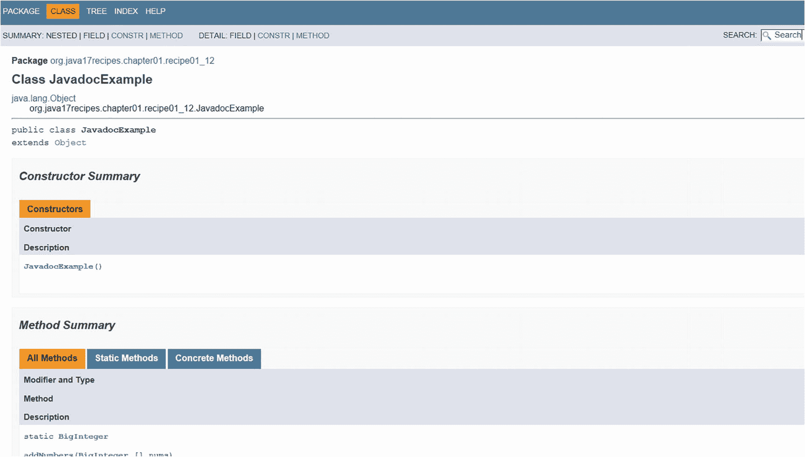

图 1-17

Eclipse IDE 中的 JavaDoc 示例

### 工作原理

从头开始为应用程序生成文档可能相当繁琐。维护文档可能更加麻烦。JDK 附带了一个名为 JavaDoc 的广泛文档系统。在源代码中放置特殊注释并运行一个简单的命令行工具，可以轻松生成有用的文档并使其保持最新。即使应用程序中的某些类、方法或字段没有被 JavaDoc 工具特别注释，也会为这些元素生成默认文档。

#### 格式化文档

要创建 JavaDoc 注释，请以字符 `/**` 开头。虽然自 Java 1.4 以来这是可选的，但常见的做法是在注释中后续每一行的第一个字符处包含一个星号。另一个好的做法是缩进注释，使其与正在记录的代码对齐。最后，使用字符 `*/` 结束注释。

JavaDoc 注释应以类或方法的简短描述开头。字段很少使用 JavaDoc 进行注释，除非它们被声明为 `public static final`（常量），在这种情况下，提供注释是一个好主意。注释可以有多行，甚至可以包含多个段落。如果你想将注释分成段落，请使用 `<p>` 标签分隔这些段落。注释可以包含多个标签，这些标签指示有关被注释的方法或类的各种详细信息。JavaDoc 标签以 `@` 符号开头，一些常见的标签如下。

```
@param: 参数的名称和描述
@return: 方法返回的内容
@see: 对另一段代码的引用
```

你也可以在 JavaDoc 中包含内联链接以引用 URL。要包含内联链接，请使用标签 `{@link My Link}`，其中 `link` 是你想要指向的实际 URL，`My Link` 是你想要显示的文本。JavaDoc 注释中还可以使用许多其他标签，包括 `{@literal}`、`{@code}`、`{@value org}` 等。

#### 执行工具

JavaDoc 工具可以针对整个包或源文件运行。只需将包名传递给 JavaDoc 工具，而不是单个源文件名。例如，如果一个应用程序包含一个名为 `org.luciano.beans` 的包，则可以通过运行该工具来记录该包中的所有源文件，如下所示。

```
javadoc org.luciano.beans
```

默认情况下，JavaDoc 工具会生成 HTML 并将其放置在与被记录代码相同的包中。如果你希望将源文件与文档分开，那么结果可能会变得混乱不堪。相反，你可以通过向 JavaDoc 工具传递 `–d` 标志来为生成的文档设置目标位置。

## 1.13 读取环境变量

### 问题

你正在开发的应用程序需要使用一些环境变量。你想要读取在操作系统级别设置的值。

### 解决方案

使用 Java `System` 类来检索任何环境变量的值。`System` 类有一个名为 `getenv()` 的方法，它接受一个与系统环境变量名称相对应的 `String` 参数。然后，该方法返回给定变量的值。如果不存在匹配的环境变量，则返回 `NULL` 值。清单 1-11 是一个示例。`ReadOneEnvVariable` 类接受一个环境变量名称作为参数，并显示在操作系统级别设置的该变量的值。

```
package org.java17recipes.chapter1.recipe1_13;
public class ReadOneEnvVariable {
public static void main(String[] args) {
if (args.length > 0) {
String value = System.getenv(args[0]);
if (value != null) {
System.out.println(args[0].toUpperCase() + " = " + value);
} else {
System.out.println("No such environment variable exists");
}
} else {
System.out.println("No arguments passed");
}
}
}
清单 1-11
读取环境变量的值
```

如果你有兴趣检索系统上定义的所有环境变量的列表，请不要向 `System.getenv()` 方法传递任何参数。你将收到一个包含所有值的 `Map` 类型对象。你可以遍历它们，如清单 1-12 所示。

```
package org.java17recipes.chapter1.recipe1_13;
import java.util.Map;
public class ReadAllEnvVariables {
public static void main(String[] args){
if(args.length > 0){
String value = System.getenv(args[0]);
if (value != null) {
System.out.println(args[0].toUpperCase() + " = " + value);
} else {
System.out.println("No such environment variable exists");
}
} else {
Map vars = System.getenv();
for(String var : vars.keySet()){
System.out.println(var + " = " + vars.get(var));
}
}
}
}
清单 1-12
遍历环境变量的 Map
```


### 工作原理

`System` 类包含许多可用于辅助应用程序开发的实用工具。其中之一是 `getenv()` 方法，它返回给定系统环境变量的值。

你也可以返回所有环境变量的值，在这种情况下，这些值会存储在一个*映射*中。映射是名称/值对的集合。第 7 章提供了关于映射的更多信息。

请注意清单 1-11 和 1-12 中用于获取环境变量值的方法。该方法已被重载，以处理解决方案中所示的两种情况。如果你想获取某个变量的值，请将变量名称作为字符串传入。如果不传入任何参数，则会返回当前设置的所有变量的名称和值。

## 1.14 小结

本章包含了一些让你能够快速开始使用 Java 的实践指南。内容涵盖了从 OpenJDK 的安装到 Eclipse IDE 的配置与使用。本章还涉及了诸如声明变量、编译代码和文档等基础知识。本书的其余部分将深入探讨 Java 语言的各个不同领域，涵盖从初学者到专家的各种主题。在阅读本书其余部分的示例时，请参考本章了解具体的配置信息。

