# 13. Java Web 应用程序

Java 开发并不仅仅局限于桌面端。如今，Web 应用程序和移动应用可被视为私人和政府组织中现代技术的基石。事实上，通过与远程服务器交互，可以找到所需信息或在线购物，总的来说，可以为工作或个人生活使用许多服务。成千上万的企业应用程序使用 Java 编写，从而能够开发复杂、健壮且安全的应用程序。

本章介绍基于 Jakarta EE（一种在应用服务器上运行的 Java 类）的 Java Servlet 和 JSP（一种动态构建网页的文件）。它展示了它们如何在 Tomcat 内协同工作以生成动态网页。

由于 Web 应用程序开发包含多个相互关联的过程，建议使用集成开发环境，如 Eclipse EE（[`www.eclipse.org/downloads/packages`](http://www.eclipse.org/downloads/packages)），以便更轻松地组织 Web 项目。本章演示了使用 Eclipse 解决一些方案的方法。但是，您可以将这些相同的基本概念应用于使用任何 Java IDE 的项目。

## 13.1 安装 Tomcat

### 问题

您希望下载并配置用于创建和配置简单 Java Web 应用程序项目的主要组件。

### 解决方案

要运行本章中的示例，您需要安装以下组件。

*   Tomcat Web 服务器

*   Eclipse 开发环境 EE

让我们安装 Tomcat。它是 Apache Tomcat 服务的 Java Web 服务器，是一个允许您运行 JSP 且 Java 代码可在其中运行的 Servlet 容器（Tomcat 10 是最新版本）。下载压缩版本并运行相应操作系统的相关脚本更简单、更安全。

Tomcat 监听您电脑的三个主要通信端口（8005、8009 和 8080）。在安装 Tomcat 之前，您应该检查是否有其他应用程序已经在监听这些端口中的一个或多个。为此，请使用 `netstat` 命令，该命令显示有关您电脑网络通信的信息。在 Windows 中，您可以打开一个终端窗口并输入 `netstat /a` 命令。它会以表格形式显示活动连接列表。表格的第二列如下所示。

```
Local Address
0.0.0.0:135
0.0.0.0:445
0.0.0.0:3306
```

端口号是冒号后的数字。安装后，如果您看到 Tomcat 使用的一个或多个端口，则必须更改它监听的端口。

以下是正确安装 Tomcat 10 的方法。

1.  访问 [`https://tomcat.apache.org/download-10.cgi`](https://tomcat.apache.org/download-10.cgi)。在“快速导航”下方，您会看到四个链接：KEYS、10.0.13、Browse 和 Archives。

2.  点击 **10.0.13** 将您带到同一页面底部一个具有相同版本号的标题处。在版本标题下方，您会看到“核心”副标题。在其下方，您会看到 zip 下载的链接，排列如下：zip (pgp, sha512) apache-tomcat-10.0.13.zip。点击 zip 链接下载 apache-tomcat-10.0.13.zip（12.2 MB）文件。

3.  将下载的文件解压到根目录。此时，您应该拥有 `C:\apache-tomcat-10.0.13` 文件夹。我们倾向于保留默认文件夹名称，以便在不混淆的情况下使用不同的服务器版本。业务场景包括不同的环境（如开发、测试和交付），因此请记住保持服务器版本之间的一致性，以防止出现错误或不同行为。

4.  在 `C:\apache-tomcat-10.0.13\bin` 文件夹中的 `setenv.bat` 文件中使用以下代码配置服务器。

    ```
    set "JRE_HOME=C:\jdk-17"
    set "JAVA_HOME=C:\jdk-17"
    exit /b 0
    ```

注意

Tomcat 10.0 需要 Java 8 或更高版本。

现在服务器已准备好启动。转到 `C:\apache-tomcat-10.0.13\bin` 并双击 startup.bat 文件。或者，打开一个命令窗口，转到 bin 文件夹，然后输入 **startup.bat**。将生成第二个窗口，其中包含我们应用程序的日志。

要检查 Tomcat 是否正常工作，请打开浏览器并输入 **localhost:8080**。您应该会看到如图 13-1 所示的页面。

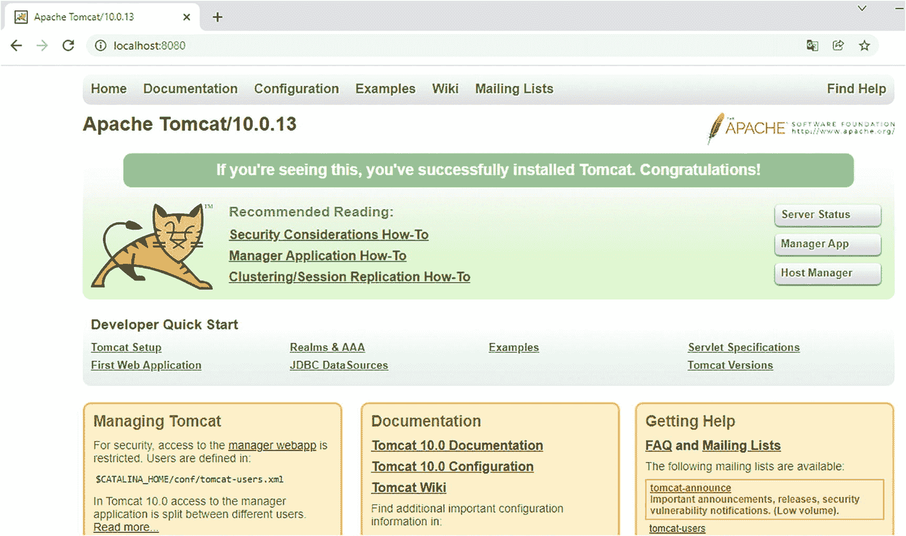

图 13-1

本地主机主页


### 工作原理

以下步骤展示了当您在浏览器中请求查看网页（例如 `http://localhost:8080/`）时发生的情况。

1.  当您在地址栏中输入诸如 [`www.website.com`](http://www.website.com) 之类的地址时，您的浏览器通常会通过询问您的互联网服务提供商（ISP）提供的域名系统（DNS）来解析出相应的互联网协议（IP）地址。然后，您的浏览器会向新找到的 IP 地址发送一个 HTTP（超文本传输协议）请求，以获取所需的内容。

2.  作为响应，Web 服务器会发送一个包含纯文本 HTML（超文本标记语言）页面的 HTTP 响应。图像和其他非文本组件（例如声音和视频剪辑）仅作为指向这些资源的超链接出现在页面上，这些资源可以存储在同一台服务器或互联网上的另一台服务器上。浏览器接收响应，解释页面中包含的 HTML 代码，从服务器请求非文本组件，并将其显示在您的屏幕上。

像 `http://localhost:8080`/ 这样的 URL 指定了在主机端，HTTP 的端口号是 8080，而不是标准的 HTTP 端口 80。这是因为 Tomcat 期望并通过端口 8080 路由 HTTP 流量。如果您打算使用 Tomcat 处理 HTML/JSP 页面的请求，并将其置于处理静态 HTTP/HTTPS 的服务器（通常是 Apache Web 服务器）之后，这样做是合适的。但是，如果您打算使用 Tomcat 直接处理 HTTP/HTTPS，则应将默认端口 8080 和 8443 分别更改为 80 和 443。

MVC（模型-视图-控制器）

应用程序开发中使用最广泛的模式是 MVC（模型-视图-控制器）。这种模式由施乐公司在八十年代末期的几份出版物中首次描述。其最重要的方面是分离为三个不同的组件。

*   **模型** 与应用程序逻辑和数据操作的持久性相关。
*   **视图** 与表示层相关，即与最终用户的界面。
*   **控制器** 与请求的处理相关。

这种分离级别对于应用程序的稳定性和安全性都很重要。在本章中，Java Web 应用程序的开发基于以下主要组件。

*   **MySQL** 是一个强大的关系数据库（RDBMS），用于为 Web 应用程序创建和管理数据库：实际上，任何非平凡的 Web 应用程序都可能需要处理数据。
*   **JavaServer Pages (JSP)** 是一种技术，通过将脚本文件转换为可执行的 Java 模块，帮助您创建此类动态生成的页面。
*   **Tomcat** 是一个服务器应用程序，可以执行您的代码并充当您的动态页面的 Web 服务器。

## 13.2 创建 HTML 页面

### 问题

您想创建一个简单的 HTML 页面。

### 解决方案

HTML 文档被组织成元素的层次结构，这些元素通常由包含在一对开始和结束标签之间的内容组成。

以下是其模式。

```
内容
```

您可以将 HTML 元素相互嵌套。实际上，没有嵌套，就不可能存在 HTML 页面。标签可以按以下方式组织（带缩进）。

```

内容 2

```

例如，`<html>` 和 `</html>` 标签界定了整个 HTML 文档。但是，有些元素是空元素，在这种情况下，您通常可以用一个斜杠替换结束标签，紧跟在开始标签的结束尖括号之前，如 ``。

您可以按以下方式插入注释。

```

每个标签都可以有带值的属性。

```

HTML 文档包含两个部分。

```
...
...
```

以下是定义。

*   粗体字符：<b>
*   下划线字符：<u>
*   斜体字符：<i>
*   换行：<br>
*   段落：`<p>`
*   `标题：从 <h1> 到 <h6>`

标题标签
为 HTML 文档定义标题。
样式标签为 HTML 文档定义样式信息。它可以
是页面某个部分的内联样式，也可以是全局样式（在这种情况下，它
定义在 HTML 页面的 head 标签中）。

清单 13-1 展示了
最简单的 HTML 页面。将代码复制到文本文档中，然后将
扩展名改为 HTML。双击该文件，HTML 页面
将在预定义的浏览器中打开。

```
页面标题

body {background-color:gray; font-size=10pt;}

粗体字符
下划线字符
斜体字符
一个换行
一个段落
一个标题

清单 13-1
basic.html
```

您可以直接打开一个页面，或者将其插入到 `apache-tomcat-10.0.13\webapps\examples`
文件夹中（见图 13-2），该图展示了
清单 13-2 的结果。

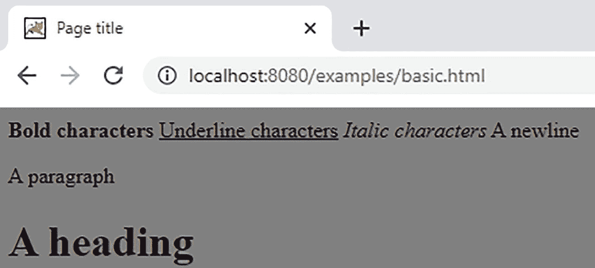

图 13-2
一个基本的 HTML 页面

本质上，一个 HTML 文档由文本、图像、音频和
视频剪辑、活动组件（如脚本和可执行文件）以及
超链接组成。然后，浏览器会按顺序解释和渲染这些组件，大多数情况下
不会在它们之间插入任何空格或换行。

以下是定义表格的标签。

*   `<table>...</table>`
    打开/关闭一个表格
*   `<tr>...</tr>`
    （表格行）创建一个行
*   `<td>...</td>`
    （表格数据）创建一个单元格

一个表格由包含文本、图像和
其他组件的行和列组成。在本书的几乎每一章中，您都会找到
表格的示例。表格是以有组织的方式呈现组件的一种简单方法。

清单 13-2 是一个示例。

```

内容 1
内容 2

内容 3
内容 4

清单 13-2
table.html
```

清单 13-2 生成了图 13-3 中所示的简单表格。

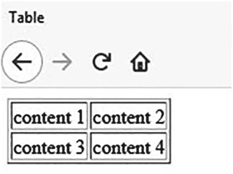

图 13-3
一个由 HTML 生成的表格

要将您的网页转变为交互式体验，您必须赋予
用户做出选择、输入或上传信息的能力（例如，
当您创建新电子邮件时，您会在在线表单中输入数据）。为了
实现这一点，您可以使用表单元素，它接受来自用户的数据
并将其发送到服务器。

本书包含大量输入表单的示例。在图 13-4 中，浏览器
是 Firefox。

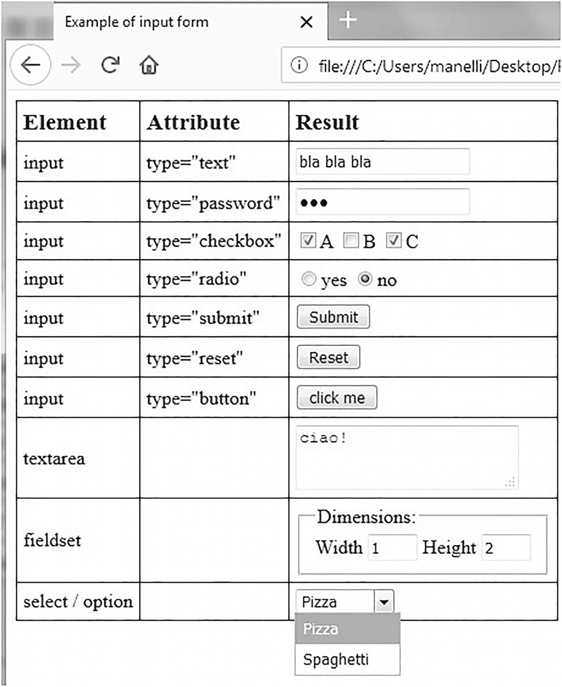

图 13-4
一个包含所有输入元素示例的 HTML 表单


各种类型的 `input` 元素允许用户输入文本字符串或密码、勾选一个或多个复选框、选择多个单选按钮之一、提交表单或重置表单字段。`textarea` 元素允许用户输入多行文本，而 `fieldset` 元素则允许你将多个输入字段分组到一个或多个标题下。要呈现多个选项，你可以使用 `select` 元素，其中包含一个 `option` 元素对应每个选项。清单 13-3 是图 13-4 的源代码。

```

输入表单示例

td.h {font-size: 120%; font-weight: bold}

元素属性
结果

inputtype="text"

inputtype="password"

inputtype="checkbox"

A
B
C

inputtype="radio"

是
否

inputtype="submit"

inputtype="reset"

inputtype="button"

textarea
默认文本

fieldset

尺寸：
宽度 
高度

select / option

披萨
意大利面

清单 13-3
form.html
```

我们高亮了两行。第一行包含 `form` 元素，显示 `action` 属性被设置为空字符串。`action` 属性定义了必须处理请求表单的页面的 URL。空字符串意味着显示表单的同一页面也处理该表单。第二行高亮显示了你如何使用 `input` 元素设置参数，而用户对此毫不知情（除非他或她偷看源代码）。

如果你填写图 13-4 中所示的表单并点击提交按钮（或按下 `Enter` 键），你会在浏览器的地址栏中看到 URL 末尾出现以下字符串（为了可读性，我们插入了换行符）。

```
?agent=007
&t=bla+bla+bla
&p=abc
&abc=a
&abc=c
&yn=n
&ta=ciao!
&w=1
&h=2
&food=pizza
```

浏览器已将每个 `input` 元素转换为一个 `参数名=参数值` 字符串。请注意，文本字段中的每个空格都被替换为加号，包括密码中的空格。另外，请注意 `abc` 参数出现了两次，因为三个可用复选框中有两个被选中。为了避免在浏览器中看到所有参数，请在 `form` 元素中使用属性 `method="POST"`。此外，POST 方法更安全，因为数据存储在 HTTP 请求体中，并且对数据长度没有限制。如需更多信息，你可以直接访问 [`www.w3schools.com`](http://www.w3schools.com)，这是 Web 开发方面最重要且最全面的网站之一。

工作原理
许多网站都解释 HTML 以及 CSS 和 JavaScript 等组件。因此，这里不会涵盖所有相关知识，而是为刚开始学习 Web 开发的人介绍几个关键概念。超文本标记语言（HTML）是用于创建 HTML 页面（扩展名为 `.htm` 或 `.html`）的标准“标签”标记语言。因此，它是 JSP 页面的基础。浏览器解释页面中包含的 HTML 代码，并从服务器请求非文本组件（如图像和视频剪辑），以在用户窗口中显示所有内容。

13.3 创建 JSP 页面

问题
你想要创建并配置一个简单的动态网页。

解决方案
JSP 是一种允许你向网页添加动态内容的技术。

清单 13-4 是一个纯 HTML 页面，它会在浏览器窗口中显示“Hello World!”。

```

Hello World 静态 HTML

Hello World!

清单 13-4
hello.html
```

创建 `%CATALINA_HOME%\webapps\ROOT\tests\` 文件夹，并将 `hello.html` 存储在其中。然后在浏览器中输入以下 URL 以查看网页。

```
http://localhost:8080/tests/hello.html
```

通常，要让浏览器检查页面语法是否符合万维网联盟（W3C）的 XHTML 标准，你需要以以下行开头页面。

你还需要将

```

替换为

```

然而，对于这个简单的示例，让我们将代码保持在必要的范围内。图 13-5 显示了该页面在浏览器中的显示效果。

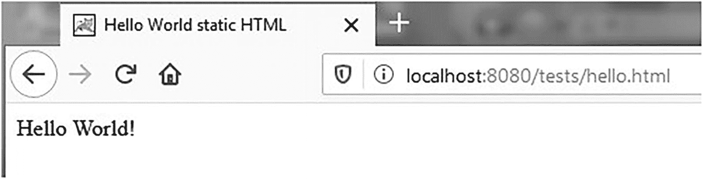

图 13-5
纯 HTML 中的“Hello World!”

如果你让浏览器显示页面源代码，毫不意外，你会看到清单 13-4 中显示的内容。要使用 JSP 页面获得相同的结果，你只需在第一行之前插入一个 JSP 指令，如清单 13-5 所示，并将文件扩展名从 `.html` 更改为 `.jsp`。

```

Hello World 动态 HTML

Hello World!

清单 13-5
“Hello World!” 在一个简单的 JSP 页面中
```

与 `hello.html` 一样，你可以通过将 `hello.jsp` 放置在 Tomcat 的 `ROOT\tests` 文件夹中来查看它。在浏览器中输入以下 URL 以查看网页（见图 13-6）。


图 13-6
JSP 中的“Hello World!”

```
http://localhost:8080/tests/hello.jsp
```

对于如此简单的页面，使用 JSP 意义不大。只有当你包含动态内容时，使用 JSP 才值得。请查看清单 13-6 以获取更丰富的内容。

```

Hello World 动态 HTML

Hello World!
user-agent " + userAgent);
%>

清单 13-6
hello.jsp
```

`<% ... %>` 对中的代码是用 Java 编写的小脚本。当 Tomcat 的 JSP 引擎解释此模块时，它会创建一个如清单 13-7 所示的 Java Servlet（已移除一些缩进和空行）。

```
out.write("\r\n");
out.write("\r\n");
out.write("Hello World 动态 HTML \r\n");
out.write("\r\n");
String userAgent = request.getHeader("user-agent");
out.println("User-agent: " + userAgent);
out.write("\r\n");
out.write("Hello World!\r\n");
out.write("\r\n");
out.write("\r\n");
清单 13-7
来自“Hello World!” JSP 页面的 Java 代码
```

工作原理
如果没有 JSP，要更新纯静态 HTML 页面的外观或内容，你必须始终手动操作。即使你只想更改日期或图片，也必须编辑 HTML 文件并输入修改内容。没有人会为你做这件事，而使用 JSP，你可以使内容依赖于许多因素，包括一天中的时间、用户提供的信息、用户与你的网站交互的历史记录，甚至用户的浏览器类型。这种能力对于提供在线服务至关重要，你可以根据查看者的偏好和要求，为每个提出请求的查看者定制响应。

以下步骤解释了 Web 服务器如何创建网页。

1.  你的浏览器向 Web 服务器发送一个 HTTP 请求。这在 JSP 中不会改变，尽管 URL 可能以 `.jsp` 结尾，而不是 `.html` 或 `.htm`。

2.  Web 服务器是一个 Java 服务器，具有识别和处理 Java Servlet 所需的扩展。Web 服务器识别出 HTTP 请求是针对 JSP 页面的，并将其转发给 JSP 引擎。

3.  JSP 引擎从磁盘加载 JSP 页面，并将其转换为 Java Servlet。从这一点开始，这个 Servlet 与任何其他直接用 Java（而非 JSP）开发的 Servlet 没有区别。然而，JSP Servlet 自动生成的 Java 代码并不总是易于阅读，你绝不应手动修改它。

4.  JSP 引擎将 Servlet 编译成可执行类，并将原始请求转发给 Web 服务器的另一部分，称为 *Servlet 引擎*。请注意，JSP 引擎仅在发现 JSP 页面自上次请求以来发生更改时，才会将 JSP 页面转换为 Java 并重新编译 Servlet。


5.  Servlet 引擎加载 Servlet 类并执行它。在执行过程中，Servlet 会生成 HTML 格式的输出，Servlet 引擎会将其放入 HTTP 响应中传递给 Web 服务器。

6.  Web 服务器将 HTTP 响应转发到您的浏览器。

7.  您的 Web 浏览器处理 HTTP 响应中动态生成的 HTML 页面，就像处理静态页面一样。实际上，静态和动态网页的格式是相同的。

到达您浏览器的是 Servlet 生成的输出（即转换并编译后的 JSP 页面），而不是 JSP 页面本身。同一个 Servlet 会根据 HTTP 请求的参数和其他因素生成不同的输出。例如，假设您正在浏览一家在线商店提供的产品。当您点击产品图片时，您的浏览器会生成一个 HTTP 请求，其中包含产品代码作为参数。结果，Servlet 会生成一个包含该产品描述的 HTML 页面。服务器无需为每个产品代码重新编译 Servlet。Servlet 会查询包含所有产品详细信息的数据库，获取您感兴趣产品的描述，并用这些数据格式化一个 HTML 页面。这就是动态 HTML 的全部意义所在！纯 HTML 无法查询数据库，但 Java 可以，而 JSP 为您提供了在 HTML 页面中包含 Java 代码片段的方法。

JSP 的一个演进是 JavaServer Faces (JSF) API，用于为 Java Web 应用程序创建基于组件的用户界面。在 MVC 应用程序架构中，JSF 扮演控制器的角色，从而调解 JSP（视图）与封装应用程序数据的模型之间的每一次交互。JSF 通过让您从一组连接到服务器端对象的标准 UI 组件创建用户界面，并提供四个自定义标签库来处理这些 UI 组件，从而简化了 Web 应用程序的开发。JSF 会透明地保存 UI 组件的状态信息，并在表单重新显示时重新填充它们。这是可能的，因为组件的状态生命周期超越了 HTTP 请求的生命周期。JSF 通过提供一个控制器 Servlet 和一个包含事件处理、服务器端验证、数据转换和组件渲染的组件模型来运作。

JSF 不会改变您从 JSP 中已经了解的基本页面生命周期：客户端发出 HTTP 请求，服务器回复一个动态生成的 HTML 页面。请注意，JSF 并不容易使用，并且需要付出不可忽视的初始努力才能让它运行起来。

有关全面的 Java Web 应用程序开发以及 JSP 和 JSF 如何在 Jakarta EE 平台（配合 Eclipse）中成为关键技术的更多信息，请参阅 Luciano Manelli 和 Giulio Zambon 所著的 *Beginning Jakarta EE Web Development*（Apress，2020 年）。

13.4 列出 HTML 请求参数

问题
您想要在 JSP 页面上列出 HTML 请求的参数。

解决方案
使用 JSP，您可以生成动态网页。这是确定的。但动态页面的实用性远不止于识别查看者使用的浏览器或在不同日期显示不同信息。根据查看者是谁以及查看者想要什么来调整网页内容才是关键所在。
每个 HTML 请求都包含一系列参数，这些参数通常是查看者在表单中输入内容后点击“提交”按钮的结果。额外的参数也可以是 URL 本身的一部分。例如，多语言网站中的页面有时会以“`?lang=en`”结尾的 URL 来告诉服务器以英文格式化所请求的页面。

清单 13-8 展示了一个简单的 JSP 页面，它列出了所有 HTML 请求参数。这是一个有用的小工具，可以轻松检查您的 HTML 页面发送给服务器的内容。

```

请求参数
映射大小 =

映射元素参数名称参数值[s]
" + k + "'" + keys[k] + "'");
for (int j = 0; j  0) out.print(", ");
out.print("'" + pars[j] + "'");
}
out.println("");
}
%>

清单 13-8
req_params.jsp
```

工作原理
有趣的部分在于以粗体突出显示的行。第一行告诉您参数存储在一个类型为 `Map` 的对象中，并向您展示如何检索参数名称列表。
第二行突出显示的行向您展示了如何通过将 Java 变量值包含在 `<%=` 和 `%>` 这对标签之间，将其直接插入到输出中（即插入到 HTML 页面中）。这与使用脚本小程序不同——在脚本小程序中，您可以使用 JSP 为网页构建动态性。

第三行突出显示的行展示了如何请求您知道名称的每个参数的值。这里使用 *values* 一词而不是 *value*，因为每个参数可以在同一个请求中出现多次。例如，将 JSP 保存在 `\apache-tomcat-10.0.13\webapps\` 中创建的 test 文件夹中。输入以下 URL 以获取图 13-7 所示的内容。

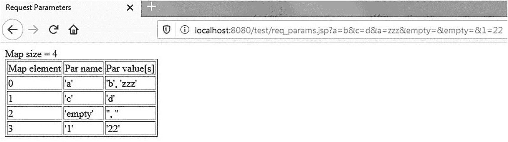

图 13-7
req_params.jsp 的输出

```
http://localhost:8080/test/req_params.jsp?a=b&c=d&a=zzz&empty=&empty=&1=22
```

请注意，恰如其名地命名为 `empty` 的参数在查询字符串中出现了两次，这导致参数映射中出现两个空字符串。另外，查看 `a` 参数，您会注意到这些值按照它们在查询字符串中出现的顺序返回。

13.5 创建和配置 Web 项目

问题
您想要创建并配置一个使用 JSP 的简单 Java Web 应用程序项目。

解决方案
创建 Web 应用程序有多种不同的项目格式。Eclipse 是一个极其强大且可扩展的 IDE，也非常适合 Web 应用程序开发。

注意

您需要从 [`www.eclipse.org/downloads/packages/`](http://www.eclipse.org/downloads/packages/) 下载适用于企业 Java 和 Web 开发人员的 Eclipse IDE，并选择您的操作系统版本，如第 1 章所述。

创建完成后，新的 `eclipseEE` 文件夹会启动 IDE。

看到工作台屏幕后，选择“服务器”选项卡，然后单击“新建服务器向导”链接，如图 13-8 所示。

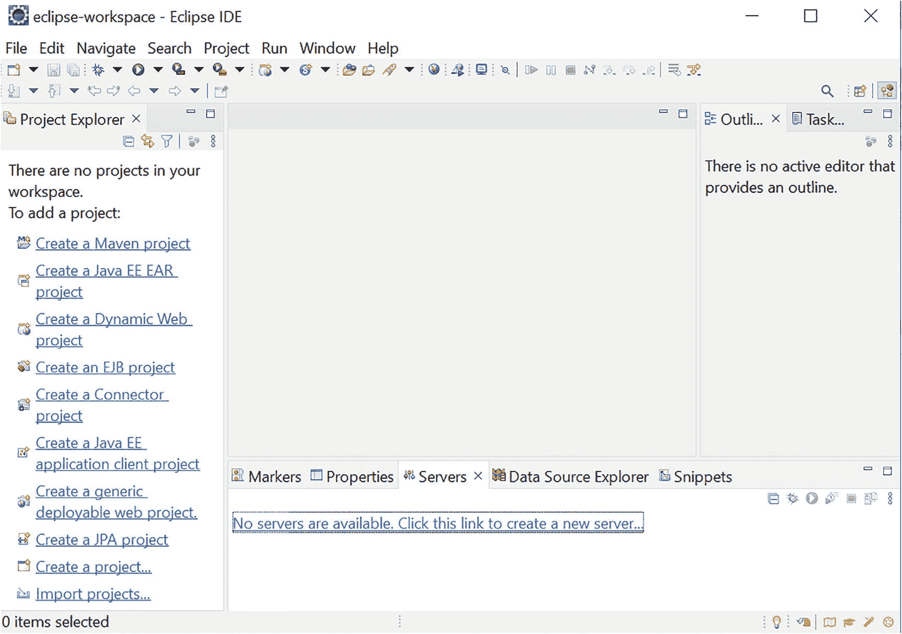

图 13-8
Eclipse – 工作台屏幕

接下来出现的屏幕是您告诉 Eclipse 使用 Tomcat 10 的地方，如图 13-9 所示。

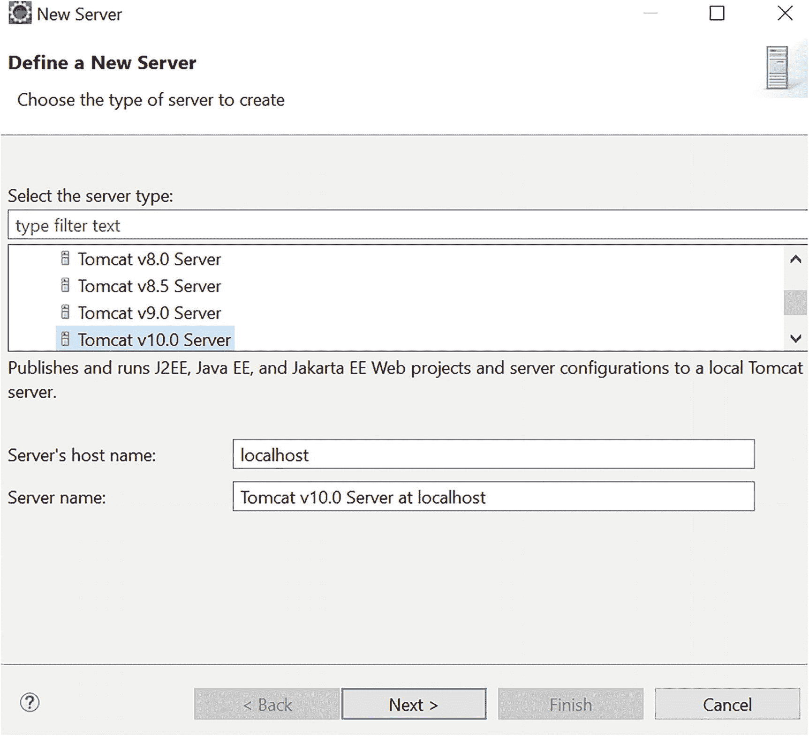

图 13-9
Eclipse – 选择 Tomcat 10 作为本地主机

接下来（也是最后一步），您需要告诉 Eclipse 在哪里找到 Tomcat 9 以及使用哪个版本的新安装的 JDK 17，如图 13-10 所示。

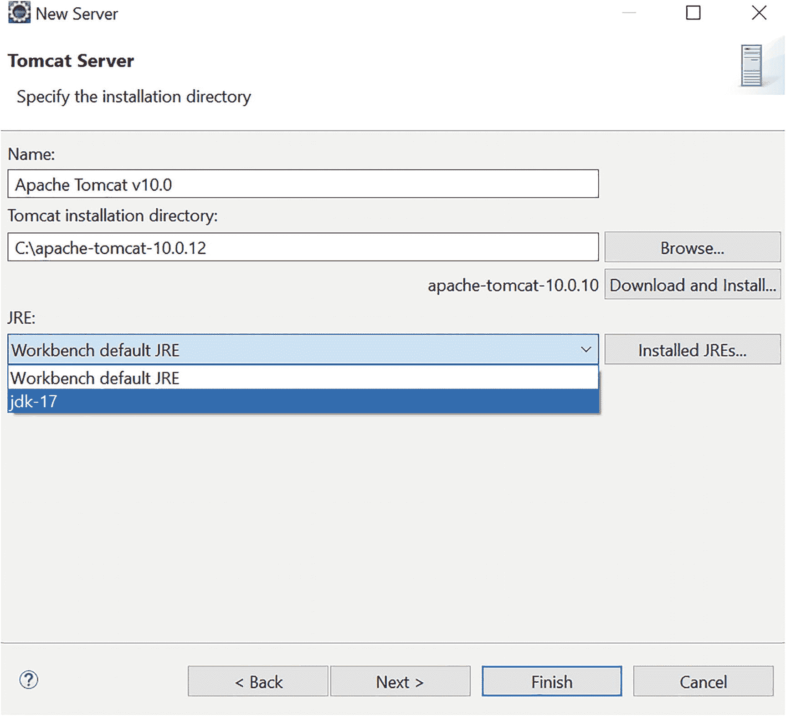

图 13-10
Eclipse – 完成 Tomcat 配置

如果您一切操作正确，Tomcat 10 应该会出现在 Eclipse 的“服务器”选项卡下（见图 13-11）。

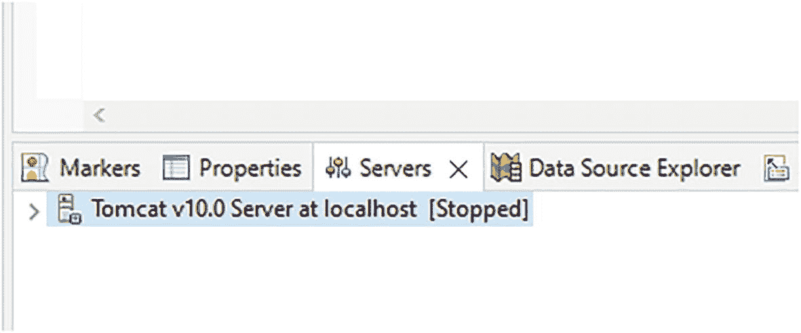

图 13-11
Eclipse 中的“服务器”选项卡

解释此配置过程是因为 Eclipse 是一个非常复杂的应用程序，很容易在众多选项中迷失方向。
在工作台的菜单栏中，选择“文件” ➤ “新建” ➤ “动态 Web 项目”，输入项目名称（例如 `java17recipe`），然后单击“下一步”按钮。在名为“Java”的新屏幕中，单击“下一步”按钮。在“Web 模块”屏幕上，单击“完成”按钮。
新项目会出现在工作台的“项目资源管理器”窗格中。
接下来，右键单击“WebContent”文件夹，然后选择“新建” ➤ “JSP 文件”。在出现的新 `JSP` 屏幕中，将默认名称 `NewFile.jsp` 替换为 `index.jsp`，然后单击“完成”按钮。


Eclipse 会在项目资源管理器窗格中显示新创建的文件，并在工作台的中央窗格中打开该文件供您编辑。清单 13-9 显示了其内容。

```

在此处插入标题

清单 13-9
java17recipe 项目 index.jsp
```

将“在此处插入标题”替换为 **我的第一个项目**（或者您喜欢的任何内容），并在 `<body>` 和 `</body>` 之间输入 **来自 Eclipse 的问候！**。然后保存文件。

注意

在 Eclipse 内部使用 Tomcat 之前，您必须在 Windows 中停止 Tomcat 服务，反之亦然。

将光标定位在项目资源管理器中显示的测试项目文件夹上，右键单击，然后选择“运行方式” ➤ “在服务器上运行”，如图 13-12 所示。

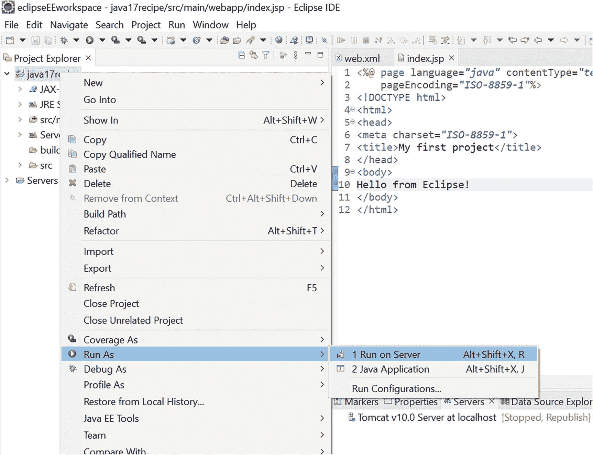

图 13-12
Eclipse——第一个项目在 Tomcat 上运行

当屏幕出现时，单击“完成”。您将看到如图 13-13 所示的结果。

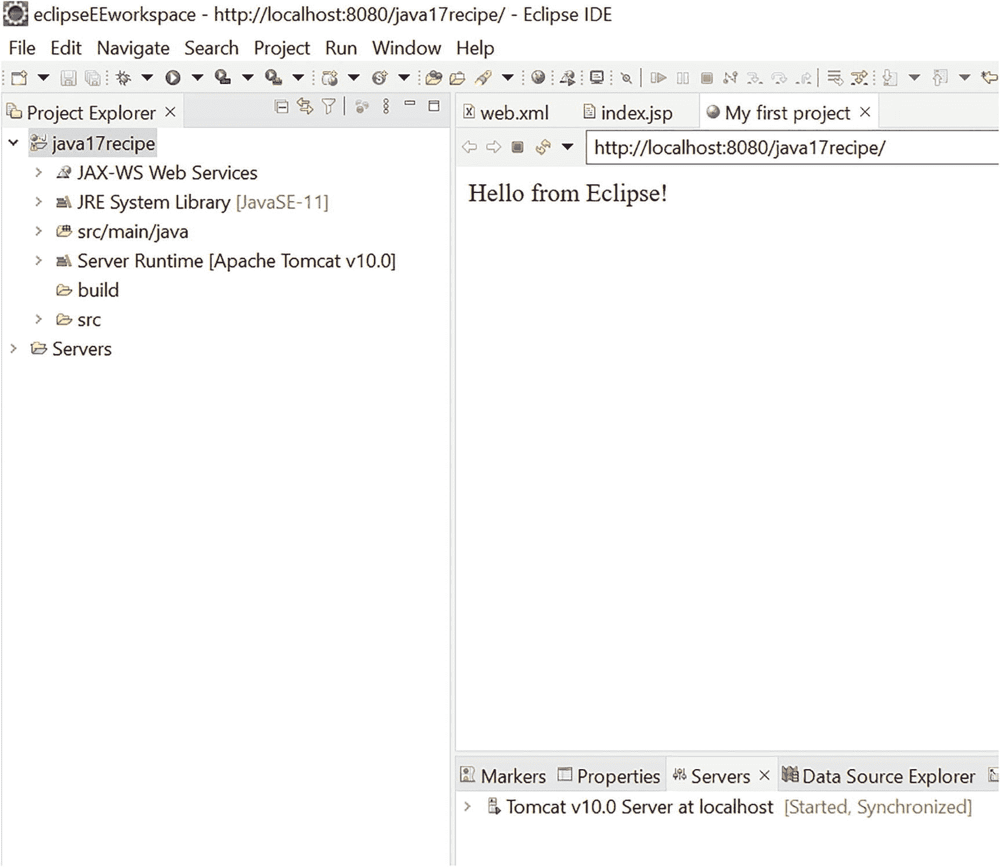

图 13-13
Eclipse——第一个项目的输出

Eclipse 能够启动 Tomcat 并在工作台内显示输出，这看起来可能非常方便。但实际上，它有几个缺点。首先，由于侧边和底部窗格的存在，中央窗格可用的空间有限。因此，大多数网页会“过于拥挤”而无法正确显示。您可以通过双击标题栏来最大化网页面板，但还有一个更重要的原因：Eclipse 并不总是显示所有内容。它应该将项目文件夹中的所有文件复制到 Tomcat 的工作目录，但它并没有！它往往会“丢失”CSS 文件和图像。这意味着，除了快速检查简单功能外，您可能还想在 Eclipse 中使用 Tomcat 配合外部浏览器。

打开浏览器并输入 `localhost:8080/test`。您应该在浏览器页面上看到相同的结果，如图 13-14 所示（示例中为 Chrome 浏览器）。

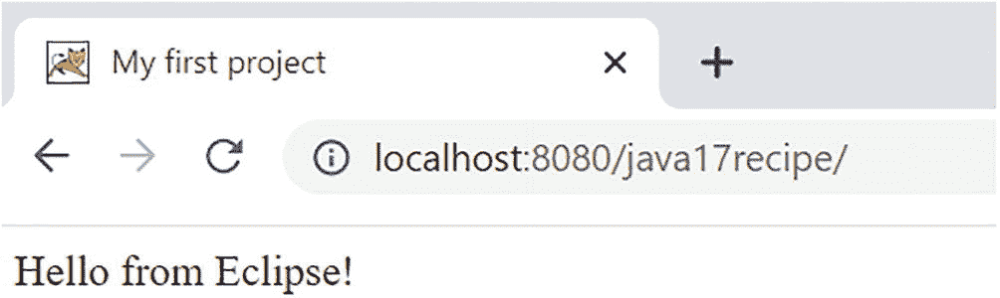

图 13-14
浏览器中的第一个项目主页

第二种选择是在外部使用 Tomcat。要在 Eclipse 外部查看 `test` 项目的输出，首先，通过右键单击工作台“服务器”选项卡下的“内部”Tomcat 并选择 `停止` 来停止它。然后，在 Windows 中启动 Tomcat 服务。
像在 Eclipse 内部启动时一样，右键单击测试项目文件夹，但这次选择“导出” ➤ “WAR 文件”。当“WAR 导出”屏幕出现时，您只需浏览并选择目标位置，该位置应为 `%CATALINA_HOME%\webapps\test.war`，然后单击“完成”。

在浏览器中，输入 `http://localhost:8080/test` 以查看项目的输出。这是可行的，因为 Tomcat 会自动解压其在 `webapps` 文件夹中发现的所有 WAR 文件，无需重新启动。并且，默认情况下，Tomcat 会查找 `index.html`、`index.htm` 和 `index.jsp`。如果您愿意，可以通过将以下元素添加到 `web.xml` 的 `web-app` 元素主体中来更改默认设置。

```
whatever.jsp

```

工作原理
Web 应用程序的开发需要协调多个不同的文件。虽然可以在不使用 IDE 的情况下开发 Java EE Web 应用程序，但使用开发环境可以使这项任务变得非常简单。在本节中，Eclipse EE IDE 负责配置 Web 应用程序。

13.6 创建 Servlet

问题
您想为 Web 应用程序项目创建一个控制器。

解决方案
通过“文件” ➤ “新建” ➤ “Servlet”创建一个 Java Servlet。在 `org.java17recipes.chapter13` 包中定义 `FirstServlet`（按照惯例，类和 servlet 名称首字母大写）。检查 servlet 中的 `init` 和 `destroy` 方法非常重要。

以下显示了新创建的 servlet 的 Java 代码。

```
package org.java17recipes.chapter13;
import java.io.IOException;
import jakarta.servlet.ServletConfig;
import jakarta.servlet.ServletException;
import jakarta.servlet.annotation.WebServlet;
import jakarta.servlet.http.HttpServlet;
import jakarta.servlet.http.HttpServletRequest;
import jakarta.servlet.http.HttpServletResponse;
/**
* Servlet implementation class FirstServlet
*/
public class FirstServlet extends HttpServlet {
private static final long serialVersionUID = 1L;
/**
* Default constructor.
*/
public FirstServlet() {
// TODO Auto-generated constructor stub
}
/**
* @see Servlet#init(ServletConfig)
*/
public void init(ServletConfig config) throws ServletException {
// TODO Auto-generated method stub
}
/**
* @see Servlet#destroy()
*/
public void destroy() {
// TODO Auto-generated method stub
}
/**
* @see HttpServlet#doGet(HttpServletRequest request, HttpServletResponse response)
*/
protected void doGet(HttpServletRequest request, HttpServletResponse response) throws ServletException, IOException {
// TODO Auto-generated method stub
response.getWriter().append("Served at: ").append(request.getContextPath());
}
/**
* @see HttpServlet#doPost(HttpServletRequest request, HttpServletResponse response)
*/
protected void doPost(HttpServletRequest request, HttpServletResponse response) throws ServletException, IOException {
// TODO Auto-generated method stub
doGet(request, response);
}
}
```

输出如图 13-15 所示，您可以在其中看到粗体行。

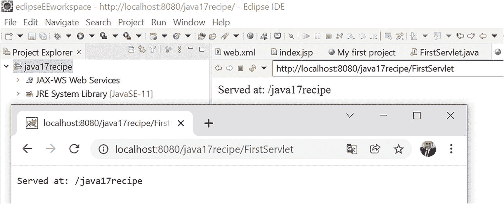

图 13-15
第一个 servlet 的浏览器输出

注意

如果您曾使用过 javax.* 包，它已重命名为 jakarta.* 包。如果您针对的是 Servlet API 5.0 或更新版本（Tomcat 10 中使用的 Jakarta EE 9 的一部分），则需要替换包才能使其编译。否则，您可能会遇到“在 Java 构建路径上未找到超类“javax.servlet.http.HttpServlet””的错误。

工作原理
Servlet 是 Java 类，它们在 *servlet* *容器*（例如，Tomcat、TomEE 9、WildFly、GlassFish）中运行，并作为标准 Web 资源公开。这些类处理来自 HTML 表单的数据，并处理一个或多个客户端的请求和响应。最新版本是 2020 年发布的 Jakarta Servlet 5.0。Servlet 对应于 MVC 架构中的控制器，并实现了许多复杂的功能。我们可以使用单个 servlet 来处理不同的行为，或者为每个行为使用多个 servlet。
简而言之，客户端向（Web 应用程序服务器中的）servlet 发送请求。Servlet 被实例化（仅第一次），启动一个线程来处理通信，并构建转发给客户端的响应。如果 servlet 已加载，它会创建一个与新客户端关联的附加线程。Servlet 内部通常没有算法代码，而是委托给其他类。请求和响应由 `jakarta.Servlet.http.HttpServletRequest`（从客户端环境获取信息）和 `jakarta.Servlet.http.HttpServletResponse`（向客户端发送响应）接口管理。另一个组件（`jakarta.Servlet.ServletContext`）用于查找应用程序上下文的引用。

Servlet 具有一个生命周期，其特征如下元素和方法。

*   Servlet 的初始化（`init()` 方法），仅由 servlet 引擎在第一次调用
*   对 POST 请求的响应（`doPost(HttpServletRequestrequest req`, `HttpServletResponseresponse res)` 方法）
*   对 GET 请求的响应（`doGet(HttpServletRequestrequest req, HttpServletResponseresponse res)` 方法）
*   Servlet 上下文的销毁（`destroy()` 方法）

让我们创建一个单一的 servlet，根据来自数据输入表单的参数实现不同的行为。这些操作是方法调用（`doGet` 方法或 `doPost` 方法）的结果。


必须使用部署描述符来调用不同的 Web 应用程序对象（监听器、Servlet 和过滤器）。部署描述符即 `web.xml` 文件。
在本例中，其内容如下。

```

FirstServlet
FirstServlet
org.java17recipes.chapter13.FirstServlet

FirstServlet
/FirstServlet

```

加粗的 `<url-pattern>`
标签是在浏览器中显示的字符串。
有关 Jakarta Servlet 5.0 的更多信息，请参阅其规范文档
[`https://jakarta.ee/specifications/servlet/5.0/`](https://jakarta.ee/specifications/servlet/5.0/)。

13.7 使用
Servlet 表示值

问题
你想使用 Servlet 和 JSP 来处理 Web 应用程序中表单的数据。

解决方案
创建一个包含表单的 JSP 页面。转到 文件 ➤ 新建 ➤ JSP 文件。
将文件命名为 `formExample.jsp`。

清单 13-10 是 Java
代码。

```

表单示例

名：

姓：

清单 13-10
Java 代码
```

这里有两个表单，分别通过两种方法（POST 和 GET）、两个
不同的输入字段以及两个提交按钮来区分。

JSP 的输出如图 13-16 所示。

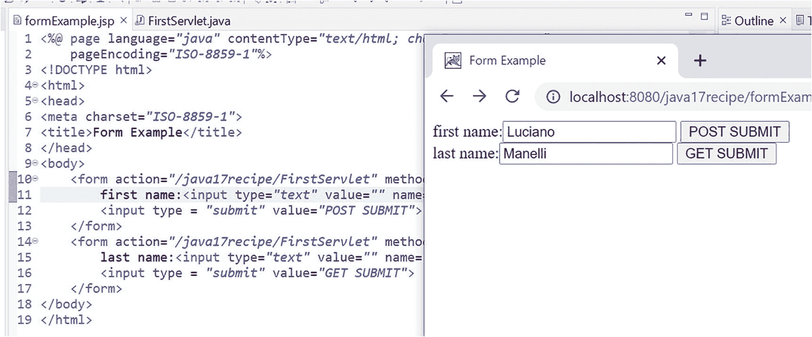

图 13-16
输出表单

以下是 `FirstServlet.java`
代码。

```
protected void doGet(HttpServletRequest request, HttpServletResponse response) throws ServletException, IOException {
// TODO Auto-generated method stub
System.out.println("GET");
String lastname = request.getParameter("lastname");
System.out.println("lastname (GET):"+lastname);
PrintWriter out = response.getWriter();
java.util.Date today = new java.util.Date();
out.println("" + today  +
" GET parameter: " + lastname + "");
response.getWriter().append("Served at: ").append(request.getContextPath());
}
protected void doPost(HttpServletRequest request, HttpServletResponse response) throws ServletException, IOException {
// TODO Auto-generated method stub
//doGet(request, response);
System.out.println("POST");
String firstname = request.getParameter("firstname");
System.out.println("firstname (POST):"+firstname);
PrintWriter out = response.getWriter();
java.util.Date today = new java.util.Date();
out.println("" + today +
" POST parameter: " + firstname+ "");
}
```

如果你点击 **GET SUBMIT** 按钮，它会向 Servlet 发送一个 GET 消息，
你将在浏览器中得到如图 13-17 所示的结果。

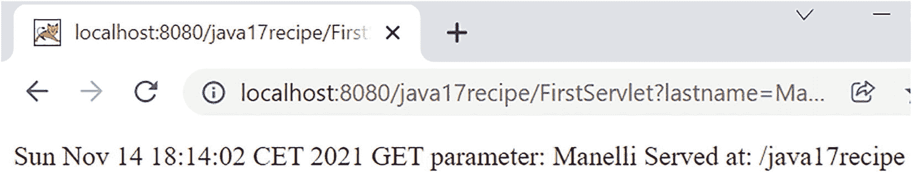

图 13-17
输出 GET

点击 **POST SUBMIT** 按钮，它会向 Servlet 发送一个 POST 消息，
在浏览器中得到如图 13-18 所示的结果。

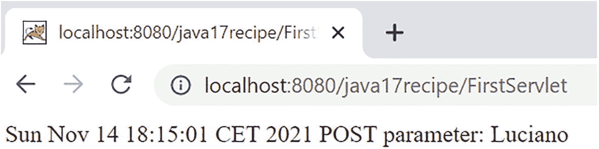

图 13-18
输出 POST

工作原理
该 Servlet 使用两个方法：`doGet` 和 `doPost`，它们管理来自请求（`HttpServletRequest`）的消息，
并使用 `request.getParameter("firstname")`
方法。如果你想查看 Servlet 成功处理的数据，只需使用 `System.out.println`
命令，它允许你在 Eclipse 控制台上查看数据。在下面的示例中，还使用了 `response.getWriter()`
方法在浏览器上显示发送的参数。

13.8 总结
在本章中，你学习了如何安装 Java、Tomcat，并检查它们是否正常工作。然后，你学习了如何安装 Eclipse EE
IDE，配置它以使用最新版本的 Java 和 Tomcat，并从零开始创建 JSP 和 Servlet。你学习了如何使用 JSP 来
显示 HTTP 请求参数，以及如何使用 Servlet 来管理 POST 和 GET 请求。

14. 电子邮件

电子邮件通知是当今企业系统不可或缺的一部分。Java 通过提供 JavaMail API 来实现电子邮件通知功能。使用此
API，你可以响应事件（例如，已完成的表单或
已完成的脚本）发送电子邮件
通信。你还可以使用 JavaMail API 来检查 IMAP
或 POP3 邮箱。
要学习本章中的技巧，请确保你已
设置好防火墙以允许电子邮件通信。大多数情况下，
防火墙允许向电子邮件服务器进行出站通信而不会出现问题。但是，如果你正在运行自己的本地 SMTP（电子邮件）服务器，
你可能需要配置防火墙以允许电子邮件服务器正常运行。

14.1 安装
JavaMail

问题
你想安装 JavaMail，以便你的
应用程序在发送电子邮件通知时使用。

解决方案
从 Oracle 的 JavaMail 网站下载 JavaMail。你需要的下载地址
在 [`https://javaee.github.io/javamail/`](https://javaee.github.io/javamail/)。
下载后，解压缩并将 `JavaMail.jar` 文件添加为
项目的依赖项。你还需要从 [`https://eclipse-ee4j.github.io/jaf/`](https://eclipse-ee4j.github.io/jaf/)
下载 JavaBeans 激活框架
作为项目的依赖项：它被 [JavaMail](https://javaee.github.io/javamail) 用于数据处理。
它允许你确定数据类型、将数据作为流或对象访问、识别数据的 MIME 类型，并实例化
适当的 bean 来执行所需和必需的操作。

工作原理
通过下载并添加依赖项，你可以访问强大的
电子邮件 API，该 API 允许你发送和接收电子邮件。

14.2 发送
电子邮件

问题
你的应用程序需要发送一封电子邮件。

解决方案

使用 `Transport()`
方法，你可以向
特定收件人发送电子邮件。在此解决方案中，构建一封电子邮件消息并通过 `smtp.somewhere.com`
服务器发送。

```
private void start() {
Properties properties = new Properties();
properties.put("mail.smtp.host", "smtp.somewhere.com");
properties.put("mail.smtp.auth", "true");
properties.put("mail.smtp.port", "465");
properties.put("mail.smtp.ssl.enable", "true")
Session session = Session.getInstance(properties, new javax.mail.Authenticator() {
protected PasswordAuthentication getPasswordAuthentication() {
return new PasswordAuthentication("username", "password");
}
});
session.setDebug(true);
Message message = new MimeMessage(session);
try {
message.setFrom(new InternetAddress("someone@somewhere.com"));
message.setRecipient(Message.RecipientType.TO, new InternetAddress("someone@somewhere.com"));
message.setSubject("Subject");
message.setContent("This is a test message", "text/plain");
Transport.send(message);
} catch (MessagingException e) {
e.printStackTrace();
}
}
main 方法是：
public static void main(String[] args) {
Recipe14_2 recipe = new Recipe14_2();
recipe.start();
}
```

在接下来的示例中，我使用了 `smtp.gmail.com` 以及一个 Gmail 用户名和密码。


工作原理
要使用 JavaMail API，首先需要创建一个 `Properties` 对象，该对象作为标准的 `Map` 对象（实际上，它继承自 `Map`）。你可以设置 JavaMail 服务可能需要的各种属性。主机名通过 `mail.smtp.host` 属性设置，如果主机需要身份验证，则必须将 `mail.smtp.auth` 属性设置为 true。对于邮件提交代理，端口号为 465。若要在连接建立时协商 TLS/SSL，请将 SSL 属性设置为 true。配置好属性对象后，获取一个 `javax.mail.Session` 来保存电子邮件的连接信息。
创建会话时，如果服务需要身份验证，你可以指定登录信息。这在连接到局域网外部的 SMTP 服务时可能是必需的。要指定登录信息，必须创建一个 `Authenticator` 对象，其中包含 `getPasswordAuthentication()` 方法。通过让 `getPasswordAuthentication()` 方法返回一个 `PasswordAuthentication` 对象，你可以指定用于 SMTP 服务的用户名/密码。你可以使用 `Session.setDebug(true)` 来调试 SMTP 问题。
`Message` 对象（`javax.mail` 包）代表一封实际的电子邮件，并公开了诸如发件人/收件人/主题和内容等电子邮件属性。设置这些属性后，调用 `Transport.send()` 静态方法来发送电子邮件。

14.3 向电子邮件附加文件

问题
你需要向电子邮件中附加一个或多个文件。

解决方案

创建包含不同部分的消息（称为*多部分消息*）允许你发送附件，例如文件和图像。你可以指定电子邮件正文和附件。包含不同部分的消息称为多用途互联网邮件扩展（MIME）消息。它们在 `javax.mail API` 中由 `MimeMessage` 类表示。以下代码创建了这样一条消息。

```
public static void main(String[] args) {
Recipe14_3 recipe = new Recipe14_3();
recipe.start();
}
private void start() {
String host = "smtp.somewhere.com";
String username = "username";
String password = "password";
String from = "someone@somewhere.com";
String to = "anotherone@somewhere.com";
Properties properties = new Properties();
properties.put("mail.smtp.host", host);
properties.put("mail.smtp.port", "465");
properties.put("mail.smtp.ssl.enable", "true");
properties.put("mail.smtp.auth", "true");
Session session = Session.getInstance(properties, new javax.mail.Authenticator() {
protected PasswordAuthentication getPasswordAuthentication() {
return new PasswordAuthentication(username, password);
}
});
session.setDebug(true);
try {
Message message = new MimeMessage(session);
message.setFrom(new InternetAddress(from));
message.setRecipient(Message.RecipientType.TO, new InternetAddress(to));
message.setSubject("Subject");
// 创建 Mime "消息" 部分
MimeBodyPart messageBodyPart = new MimeBodyPart();
messageBodyPart.setContent("This is a test message", "text/plain");
// 创建 Mime "文件" 部分
MimeBodyPart fileBodyPart = new MimeBodyPart();
fileBodyPart.attachFile(System.getProperty("user.dir")+ File.separator + "attach.txt");
MimeBodyPart fileBodyPart2 = new MimeBodyPart();
fileBodyPart2.attachFile(System.getProperty("user.dir")+ File.separator + "attach2.txt");
// 将各个正文部分组合在一起
Multipart multipart = new MimeMultipart();
multipart.addBodyPart(messageBodyPart);
multipart.addBodyPart(fileBodyPart);
// 添加另一个正文部分以提供另一个附件
multipart.addBodyPart(fileBodyPart2);
// 将消息的内容设置为 MultiPart
message.setContent(multipart);
Transport.send(message);
System.out.println("Sent message successfully....");
} catch (MessagingException | IOException e) {
e.printStackTrace();
}
}
```

工作原理
在 JavaMail API 中，你可以创建一封 MIME 电子邮件。这种类型的消息允许包含不同的正文部分。在示例中，生成了一个纯文本正文部分（包含电子邮件显示的文本），然后创建了两个包含你要发送的附件的附件正文部分。根据附件的类型，Java API 会自动为附件正文部分选择合适的编码。
创建每个正文部分后，通过创建一个 `MultiPart` 对象并添加每个部分（纯文本和附件）来将它们组合在一起。一旦 `MultiPart` 对象组装完毕并包含所有部分，它就被分配给 `MimeMessage` 的内容并发送（如配方 14-2 所示）。

14.4 发送 HTML 电子邮件

问题
你想要发送一封包含 HTML 内容的电子邮件。

解决方案

你将电子邮件的内容类型指定为 `text`/`html`，并发送一个 HTML 字符串作为消息正文。在以下示例中，使用 HTML 内容构建一封电子邮件，然后发送。

```
public static void main(String[] args) {
Recipe14_4 recipe = new Recipe14_4();
recipe.start();
}
private void start() {
String host = "smtp.gmail.com";
String username = "mymailusername";
String password = "mygmailpassword";
String from = "mygmailusername@gmail.com";
String to = "someuser@somewhere.com";
Properties properties = new Properties();
properties.put("mail.smtp.host", host);
properties.put("mail.smtp.port", "465");
properties.put("mail.smtp.auth", "true");
properties.put("mail.smtp.ssl.enable", "true");
Session session = Session.getInstance(properties, new javax.mail.Authenticator() {
protected PasswordAuthentication getPasswordAuthentication() {
return new PasswordAuthentication(username, password);
}
});
session.setDebug(true);
try {
MimeMessage message = new MimeMessage(session);
message.setFrom(new InternetAddress(from));
message.setRecipient(Message.RecipientType.TO, new InternetAddress(to));
message.setSubject("Subject Test");
// 创建 Mime 内容
MimeBodyPart messageBodyPart = new MimeBodyPart();
String html = "Important Message" +
"This is an important message..."+
"" +
"Be sure to code your Java today!" +
"It is the right thing to do!";
messageBodyPart.setContent(html, "text/html; charset=utf-8");
MimeBodyPart fileBodyPart = new MimeBodyPart();
fileBodyPart.attachFile("/path-to/attach.txt");
MimeBodyPart fileBodyPart2 = new MimeBodyPart();
fileBodyPart2.attachFile("/path-to/attach2.txt");
Multipart multipart = new MimeMultipart();
multipart.addBodyPart(messageBodyPart);
multipart.addBodyPart(fileBodyPart);
// 添加另一个正文部分以提供另一个附件
multipart.addBodyPart(fileBodyPart2);
message.setContent(multipart);
Transport.send(message);
} catch (MessagingException | IOException e) {
e.printStackTrace();
}
}
```

工作原理
发送包含 HTML 内容的电子邮件与发送标准文本的电子邮件几乎相同——唯一的区别在于内容类型。在电子邮件的消息正文部分，将内容设置为 text/HTML，以便将其视为 HTML。构建 HTML 内容有多种方式，包括链接、图片或任何其他有效的 HTML 标记。本示例中将几个基本的 HTML 标签嵌入到一个字符串中。
尽管示例代码在实际系统中可能不太有用，但生成动态 HTML 内容以包含在电子邮件中很容易。在最基本的形式中，动态生成的 HTML 可以是拼接起来形成 HTML 的文本字符串。

14.5 向一组收件人发送电子邮件

问题
你想要向多个收件人发送同一封电子邮件。

解决方案

使用 JavaMail API 中的 `setRecipients()` 方法向多个收件人发送电子邮件。`setRecipients()` 方法允许你一次指定多个收件人。以下是一个示例。


```
public static void main(String[] args) {
Recipe14_5 recipe = new Recipe14_5();
recipe.start();
}
private void start() {
List emails = getEmails();
String host = "smtp.gmail.com";
String username = "mymailusername";
String password = "mygmailpassword";
String from = "mygmailusername@gmail.com";
Properties properties = new Properties();
properties.put("mail.smtp.host", host);
properties.put("mail.smtp.port", "465");
properties.put("mail.smtp.auth", "true");
properties.put("mail.smtp.ssl.enable", "true");
Session session = Session.getInstance(properties, new javax.mail.Authenticator() {
protected PasswordAuthentication getPasswordAuthentication() {
return new PasswordAuthentication(username, password);
}
});
session.setDebug(true);
try {
MimeMessage message = new MimeMessage(session);
message.setFrom(new InternetAddress(from));
message.setRecipients(Message.RecipientType.BCC, getRecipients(emails));
message.setSubject("Subject");
message.setContent("This is a test message", "text/plain");
Transport.send(message);
} catch (MessagingException e) {
e.printStackTrace();
}
}
private Address[] getRecipients(List emails) throws AddressException {
Address[] addresses = new Address[emails.size()];
for (int i =0;i  getEmails() {
ArrayList emails = new ArrayList();
emails.add("jack@hill.com");
emails.add("jill@hill.com");
emails.add("water@hill.com");
return emails;
}
```

工作原理
通过使用 `Message` 对象的 `setRecipients()` 方法，可以在同一封邮件中指定多个收件人。`setRecipients()` 方法接受一个 `Address` 对象数组。在本方案中，由于你有一个字符串集合，因此需要创建一个与该集合大小相同的数组，并用 `InternetAddress` 对象填充该数组。使用多个电子邮件地址发送邮件（与单独发送邮件相比）效率更高，因为从你的客户端到目标邮件服务器只发送了一封邮件。然后，每个目标邮件服务器会将邮件投递到其拥有邮箱的所有收件人。例如，如果你要发送给五个不同的 Yahoo.com 账户，Yahoo.com 邮件服务器只需接收一份邮件副本，然后将其投递给邮件中指定的所有 `yahoo.com` 收件人。

提示

如果你想要发送批量邮件，建议将收件人类型指定为 BCC（密送），这样收件人收到的邮件中不会显示其他收件人。为此，请在 `setRecipients()` 方法中指定 `Message.RecipientType.BCC`。

14.6 检查电子邮件

问题
你需要检查指定电子邮件账户是否有新邮件到达。

解决方案
你可以使用 `javax.mail.Store` 来连接、查询和检索来自互联网消息访问协议（IMAP）电子邮件账户的邮件。例如，以下代码连接到一个 IMAP 账户，检索该账户中的最后五封邮件，并将这些邮件标记为“已读”。

```
public static void main(String[] args) {
Recipe14_6 recipe = new Recipe14_6();
recipe.start();
}
private void start() {
String username = "username";
String password = "password";
String folder = "Inbox";
String host = "imap.host.com";
Properties properties = new Properties();
properties.put("mail.imap.host", host);
properties.put("mail.imap.ssl.enable", "true");
properties.put("mail.imap.auth", "true");
try {
Session session = Session.getInstance(properties, new javax.mail.Authenticator() {
protected PasswordAuthentication getPasswordAuthentication() {
return new PasswordAuthentication(username, password);
}
});
session.setDebug(true);
Store store = session.getStore("imap");
store.connect(host,username,password);
System.out.println(store);
Folder inbox = store.getFolder(folder);
inbox.open(Folder.READ_WRITE);
int messageCount = inbox.getMessageCount();
int startMessage = messageCount - 10;
if (startMessage< 1) startMessage =1;
Message messages[]  = inbox.getMessages(startMessage, messageCount);
for (Message message : messages) {
boolean hasBeenRead = false;
for (Flags.Flag flag : message.getFlags().getSystemFlags()) {
if (flag == Flags.Flag.SEEN) {
hasBeenRead = true;
break;
}
}
message.setFlag(Flags.Flag.SEEN, false);
System.out.println(message.getSubject() + " "+ (hasBeenRead? "(read)" : "") + message.getContent());
}
inbox.close(true);
} catch (MessagingException | IOException e) {
e.printStackTrace();
}
}
```

工作原理
`Store` 对象允许你访问电子邮件邮箱信息。通过创建一个 `Store` 对象，然后请求 Inbox（收件箱）文件夹，你就可以访问 IMAP 账户主邮箱中的邮件。利用文件夹对象，你可以使用 `getMessages(start, end)` 方法请求下载收件箱中的邮件。收件箱还提供了一个 `getMessageCount()` 方法，用于了解收件箱中有多少封邮件。请注意，邮件的索引从 1 开始。
每封邮件都有一组标志，可以指示邮件是否已被阅读（`Flags.Flag.SEEN`）或是否已被回复（`Flags.Flag.ANSWERED`）。通过解析 `SEEN` 标志，你可以处理之前未读的邮件。
要将邮件标记为已读（或已回复），请调用 `message.setFlag()` 方法。此方法允许你设置（或重置）邮件标志。如果你要设置邮件标志，需要以 `READ_WRITE`（读写）模式打开文件夹，以便更改邮件标志。你还需要在代码末尾调用 `inbox.close(true)`，以告知 JavaMail API 将更改刷新到 IMAP 存储中。

14.7 总结
电子邮件在我们今天使用的许多系统中都扮演着重要角色。Java 语言包含了 JavaMail API，使开发人员能够在其 Java 应用程序中包含强大的电子邮件功能。本章中的方案涵盖了从安装到高级用法的 JavaMail API。

15. JSON 与 XML 处理

JSON 是用于两台或多台机器之间通信的最广泛使用的媒体格式之一。其全称是 JavaScript Object Notation（JavaScript 对象表示法）。只需包含 JSON 库（该库已包含在 Java EE 中），就可以非常轻松地处理 JSON 数据。XML API 一直对 Java 开发人员可用，通常作为第三方库提供，可以添加到运行时类路径中。你将遇到的最基本的 XML 处理任务只涉及少数几个用例：编写和读取 XML 文档、验证这些文档，以及使用 JAXB 来辅助 Java 对象的编组/解组。
本章提供了执行 XML 和 JSON 任务的方案。JSON 方案需要包含 JSON API，这可以通过向 Maven 应用程序添加依赖项来完成。在本章中，你将学习如何创建 JSON、将其写入磁盘以及执行解析。

15.1 编写 XML 文件

问题
你想要创建一个 XML 文档来存储应用程序数据。


解决方案
要编写 XML 文档，请使用 `javax.xml.stream.XMLStreamWriter` 接口。以下代码遍历 `Patient` 对象数组，并将数据写入 `.xml` 文件。要使用此 Java 类，你需要 JAXB 库，它提供了一种高效且标准的方式来实现 XML 与 Java 代码之间的映射。访问 [`https://eclipse-ee4j.github.io/jaxb-ri/`](https://eclipse-ee4j.github.io/jaxb-ri/)，下载 `jakarta.xml.bind-api.jar` 3.0.0 库，并将其复制到你的 `lib` 项目文件夹或服务器中。

此示例代码来自 `org.java17recipes.chapter15.recipe15_1.DocWriter` 示例。

```
import javax.xml.stream.XMLOutputFactory;
import javax.xml.stream.XMLStreamException;
import javax.xml.stream.XMLStreamWriter;
...
public void run(String outputFile) throws FileNotFoundException, XMLStreamException,
IOException {
List patients = new ArrayList();
Patient p1 = new Patient();
Patient p2 = new Patient();
Patient p3 = new Patient();
p1.setId(BigInteger.valueOf(1));
p1.setName("John Smith");
p1.setDiagnosis("Common Cold");
p2.setId(BigInteger.valueOf(2));
p2.setName("Jane Doe");
p2.setDiagnosis("Broken Ankle");
p3.setId(BigInteger.valueOf(3));
p3.setName("Jack Brown");
p3.setDiagnosis("Food Allergy");
patients.add(p1);
patients.add(p2);
patients.add(p3);
XMLOutputFactory factory = XMLOutputFactory.newFactory();
try (FileOutputStream fos = new FileOutputStream(outputFile)) {
XMLStreamWriter writer = factory.createXMLStreamWriter(fos, "UTF-8");
writer.writeStartDocument();
writer.writeCharacters("\n");
writer.writeStartElement("patients");
writer.writeCharacters("\n");
for (Patient p : patients) {
writer.writeCharacters("\t");
writer.writeStartElement("patient");
writer.writeAttribute("id", String.valueOf(p.getId()));
writer.writeCharacters("\n\t\t");
writer.writeStartElement("name");
writer.writeCharacters(p.getName());
writer.writeEndElement();
writer.writeCharacters("\n\t\t");
writer.writeStartElement("diagnosis");
writer.writeCharacters(p.getDiagnosis());
writer.writeEndElement();
writer.writeCharacters("\n\t");
writer.writeEndElement();
writer.writeCharacters("\n");
}
writer.writeEndElement();
writer.writeEndDocument();
writer.close();
}
}
public static void main(String[] args) {
String fileName = null;
if (args.length != 1) {
System.out.printf("Usage: java org.java17recipes.chapter15.recipe15_01.DocWriter \n");
fileName = "patients.xml";
} else {
fileName = args[0];
}
DocWriter app = new DocWriter();
try {
app.run(fileName);
} catch (FileNotFoundException|XMLStreamException ex) {
Logger.getLogger(DocWriter.class.getName()).log(Level.SEVERE, null, ex);
} catch (IOException ex) {
Logger.getLogger(DocWriter.class.getName()).log(Level.SEVERE, null, ex);
}
}
Patient 类的代码如下：
import jakarta.xml.bind.annotation.*;
public class Patient {
@XmlElement(required = true)
protected String name;
@XmlElement(required = true)
protected String diagnosis;
@XmlAttribute(name = "id", required = true)
protected BigInteger id;
public String getName() {
return name;
}
public void setName(String value) {
this.name = value;
}
public String getDiagnosis() {
return diagnosis;
}
public void setDiagnosis(String value) {
this.diagnosis = value;
}
public BigInteger getId() {
return id;
}
public void setId(BigInteger value) {
this.id = value;
}
}
```

上述代码会写入以下文件内容。

```

John Smith
Common Cold

Jane Doe
Broken ankle

Jack Brown
Food allergy

```

工作原理

Java 标准库提供了多种编写 XML 文档的方式。本方法使用了 `javax.xml.stream` 包中定义的 StAX。编写 XML 文档需要五个步骤。

1.  创建文件输出流。
2.  创建 XML 输出工厂和 XML 输出流写入器。
3.  将文件流包装到 XML 流写入器中。
4.  使用 XML 流写入器的写入方法创建文档并写入 XML 元素。
5.  关闭输出流。

使用 `java.io.FileOutputStream` 类创建文件输出流。你可以使用 `try-block` 来打开和关闭此流。
`javax.xml.stream.XMLOutputFactory` 提供了一个静态方法来创建输出工厂。使用该工厂创建一个 `javax.xml.stream.XMLStreamWriter`。

获得写入器后，将文件流对象包装到 XML 写入器实例中。你使用各种写入方法来创建 XML 文档元素和属性。最后，在完成文件写入后，只需关闭写入器即可。`XMLStreamWriter` 实例的一些更有用的方法如下。

*   `writeStartDocument()`
*   `writeStartElement()`
*   `writeEndElement()`
*   `writeEndDocument()`
*   `writeAttribute()`

创建文件和 `XMLStreamWriter` 后，应始终通过调用 `writeStartDocumentMethod()` 方法来开始文档。然后，结合使用 `writeStartElement()` 和 `writeEndElement()` 方法来写入各个元素。当然，元素可以包含嵌套元素。你需要按正确的顺序调用这些方法，以创建格式良好的文档。使用 `writeAttribute()` 方法将属性名称和值放入当前元素。应在调用 `writeStartElement()` 方法后立即调用 `writeAttribute()`。最后，使用 `writeEndDocument()` 方法标记文档结束，并关闭 `Writer` 实例。
使用 `XMLStreamWriter` 的一个有趣之处在于它不会格式化文档输出。除非你专门使用 `writeCharacters()` 方法来输出空格和换行符，否则输出流将输出为单个未格式化的行。当然，这不会使生成的 XML 文件无效，但确实会给人类阅读带来不便和困难。因此，你应该考虑使用 `writeCharacters()` 方法根据需要输出间距和换行符，以创建人类可读的文档。如果你不需要文档供人类阅读，则可以安全地忽略这种写入额外空白和换行符的方法。无论格式如何，XML 文档都将是格式良好的，因为它遵循正确的 XML 语法。

以下是此示例代码的命令行使用模式。

```
java org.java17recipes.chapter15.recipe15_1.DocWriter 
```

按以下方式调用此应用程序以创建名为 `patients.xml` 的文件。

```
java org.java17recipes.chapter15.recipe15_1.DocWriter patients.xml
```

15.2 读取 XML 文件

问题
你需要解析 XML 文档，检索已知的元素和属性。

解决方案 1

使用 `javax.xml.stream.XMLStreamReader` 接口读取文档。使用此 API，你的代码使用类似于 SQL 中游标的接口来拉取 XML 元素，以依次处理每个元素。以下来自 `org.java17recipes.DocReader` 的代码片段演示了如何读取上一个方法中生成的 `patients.xml` 文件。


```
public void cursorReader(String xmlFile)
throws FileNotFoundException, IOException, XMLStreamException {
XMLInputFactory factory = XMLInputFactory.newFactory();
try (FileInputStream fis = new FileInputStream(xmlFile)) {
XMLStreamReader reader = factory.createXMLStreamReader(fis);
boolean inName = false;
boolean inDiagnosis = false;
String id = null;
String name = null;
String diagnosis = null;
while (reader.hasNext()) {
int event = reader.next();
switch (event) {
case XMLStreamConstants.START_ELEMENT:
String elementName = reader.getLocalName();
switch (elementName) {
case "patient":
id = reader.getAttributeValue(0);
break;
case "name":
inName = true;
break;
case "diagnosis":
inDiagnosis = true;
break;
default:
break;
}
break;
case XMLStreamConstants.END_ELEMENT:
String elementname = reader.getLocalName();
if (elementname.equals("patient")) {
System.out.printf("Patient: %s\nName: %s\nDiagnosis: %s\n\n",id, name,
diagnosis);
id = name = diagnosis = null;
inName = inDiagnosis = false;
}
break;
case XMLStreamConstants.CHARACTERS:
if (inName) {
name = reader.getText();
inName = false;
} else if (inDiagnosis) {
diagnosis = reader.getText();
inDiagnosis = false;
}
break;
default:
break;
}
}
reader.close();
}
}
```

**方案 2**

使用 `XMLEventReader` 通过事件驱动的接口来读取和处理事件。该 API 也被称为*迭代器驱动* API。以下代码与方案 1 中的代码非常相似，不同之处在于它使用了事件驱动 API 而非游标驱动 API。此代码片段同样来自方案 1 中使用的 `org.java17recipes.chapter15.recipe15_1.DocReader` 类。

```
public void eventReader(String xmlFile)
throws FileNotFoundException, IOException, XMLStreamException {
XMLInputFactory factory = XMLInputFactory.newFactory();
XMLEventReader reader = null;
try(FileInputStream fis = new FileInputStream(xmlFile)) {
reader = factory.createXMLEventReader(fis);
boolean inName = false;
boolean inDiagnosis = false;
String id = null;
String name = null;
String diagnosis = null;
while(reader.hasNext()) {
XMLEvent event = reader.nextEvent();
String elementName = null;
switch(event.getEventType()) {
case XMLEvent.START_ELEMENT:
StartElement startElement = event.asStartElement();
elementName = startElement.getName().getLocalPart();
switch(elementName) {
case "patient":
id = startElement.getAttributeByName(QName.valueOf("id")).getValue();
break;
case "name":
inName = true;
break;
case "diagnosis":
inDiagnosis = true;
break;
default:
break;
}
break;
case XMLEvent.END_ELEMENT:
EndElement endElement = event.asEndElement();
elementName = endElement.getName().getLocalPart();
if (elementName.equals("patient")) {
System.out.printf("Patient: %s\nName: %s\nDiagnosis: %s\n\n",id, name, diagnosis);
id = name = diagnosis = null;
inName = inDiagnosis = false;
}
break;
case XMLEvent.CHARACTERS:
String value = event.asCharacters().getData();
if (inName) {
name = value;
inName = false;
} else if (inDiagnosis) {
diagnosis = value;
inDiagnosis = false;
}
break;
}
}
}
if(reader != null) {
reader.close();
}
}
```

`main` 方法如下：

```java
public static void main(String[] args) {
String fileName = null;
if (args.length != 1) {
System.out.printf("用法: java org.java8recipes.chapter20.recipe20_2.DocReader \n");
fileName = "patients.xml";
} else {
fileName = args[0];
}
DocReader app = new DocReader();
try {
app.run(fileName);
} catch (FileNotFoundException ex) {
ex.printStackTrace();
} catch (IOException | XMLStreamException ioex) {
ioex.printStackTrace();
}
}
public void run(String xmlFile) throws FileNotFoundException, IOException, XMLStreamException {
cursorReader(xmlFile);
eventReader(xmlFile);
}
```

XML 文件内容如下：

```xml

John Smith
Common Cold

Jane Doe
Broken Ankle

Jack Brown
Food Allergy

```

输出结果为：

```
Patient: 1
Name: John Smith
Diagnosis: Common Cold
Patient: 2
Name: Jane Doe
Diagnosis: Broken Ankle
Patient: 3
Name: Jack Brown
Diagnosis: Food Allergy
```

**工作原理**

Java 提供了多种读取 XML 文档的方式。其中一种是使用 StAX，这是一种流式模型。它优于较旧的 SAX API，因为它允许你读取和写入 XML 文档。尽管 StAX 不如 DOM API 强大，但它是一种出色且高效的 API，对内存资源的消耗较小。

StAX 提供了两种读取 XML 文档的方法：游标 API 和迭代器 API。游标驱动的 API 使用一个游标，可以从头到尾遍历 XML 文档，一次指向一个元素，并且始终向前移动。迭代器 API 将 XML 文档流表示为一组离散的事件对象，这些对象按照它们在源 XML 中被读取的顺序提供。事件驱动的迭代器 API 比游标 API 更受青睐，因为它提供了 `XMLEvent` 对象，具有以下优点。

*   `XMLEvent` 对象是不可变的，即使 StAX 解析器已经处理到后续事件，它们仍然可以持久存在。你可以将这些 `XMLEvent` 对象传递给其他进程，或者将它们存储在列表、数组和映射中。

*   你可以继承 `XMLEvent`，根据需要创建你自己的专用事件。

*   你可以通过添加或删除事件来修改传入的事件流，这比游标 API 更加灵活。

要使用 StAX 读取文档，请在文件输入流上创建一个 XML 事件读取器。使用 `hasNext()` 方法检查是否还有可用的事件，并使用 `nextEvent()` 方法读取每个事件。`nextEvent()` 方法返回特定类型的 `XMLEvent`，该事件对应于 XML 文件中的开始和结束元素、属性以及值数据。完成这些对象的操作后，请记得关闭读取器和文件流。

**15.3 转换 XML**

**问题**

你想将 XML 文档转换为其他格式，例如 HTML。

**解决方案**

使用 `javax.xml.transform` 包将 XML 文档转换为另一种文档格式。

以下代码演示了如何读取源文档、应用可扩展样式表语言（XSL）转换文件，并生成转换后的新文档。使用 `org.java17recipes.chapter15.recipe15_3.TransformXml` 类中的示例代码来读取 `patients.xml` 文件并创建 `patients.html` 文件。以下代码片段展示了该类的关键部分。

```java
import javax.xml.transform.TransformerConfigurationException;
import javax.xml.transform.TransformerException;
import javax.xml.transform.TransformerFactory;
import javax.xml.transform.Transformer;
import javax.xml.transform.Source;
import javax.xml.transform.stream.StreamResult;
import javax.xml.transform.stream.StreamSource;
...
public void run(String xmlFile, String xslFile, String outputFile)
throws FileNotFoundException, TransformerConfigurationException, TransformerException {
InputStream xslInputStream = new FileInputStream(xslFile);
Source xslSource = new StreamSource(xslInputStream);
TransformerFactory factory = TransformerFactory.newInstance();
Transformer transformer = factory.newTransformer(xslSource);
InputStream xmlInputStream = new FileInputStream(xmlFile);
StreamSource in = new StreamSource(xmlInputStream);
StreamResult out = new StreamResult(outputFile);
transformer.transform(in, out);
}
public static void main(String[] args) {
String fileName = null;
String fileName2 = null;
String fileName3 = null;
if (args.length != 3) {
System.out.printf("用法: java org.java17recipes.chapter15.recipe15_03.TransformXml   \n");
fileName = "patients.xml";
fileName2 = "patients.xsl";
fileName3 = "patients.html";
} else {
fileName = args[0];
fileName2 = args[1];
fileName3 = args[2];
}
TransformXml app = new TransformXml();
try {
app.run(fileName, fileName2, fileName3);
} catch (FileNotFoundException ex) {
ex.printStackTrace();
} catch (TransformerConfigurationException ex) {
ex.printStackTrace();
} catch (TransformerException ex) {
ex.printStackTrace();
}
}
```

输出结果为 `patients.html` 文件。


工作原理
`javax.xml.transform` 包包含了将 XML 文档转换为任何其他文档类型所需的所有类。最常见的用例是将面向数据的 XML 文档转换为用户可读的 HTML 文档。

从一种文档类型转换到另一种文档类型需要三个文件。

*   一个 XML 源文档
*   一个 XSL 转换文档，用于将 XML 元素映射到新文档元素
*   一个目标输出文件

XML 源文档当然是您的源数据文件。它通常包含易于以编程方式解析的面向数据的内容。然而，人们不容易阅读 XML 文件，尤其是复杂、数据丰富的文件。相反，人们更习惯于阅读正确渲染的 HTML 文档。
XSL 转换文档指定了 XML 文档应如何转换为不同的格式。XSL 文件通常包含一个 HTML 模板，该模板指定了保存源 XML 文件提取内容的动态字段。

在本示例的源代码中，您将找到两个源文档。

*   `chapter15/recipe15_3/patients.xml`
*   `chapter15/recipe15_3/patients.xsl`

`patients.xml` 文件很短，包含以下数据。

```

John Smith
Common Cold

Jane Doe
Broken ankle

Jack Brown
Food allergy

```

`patients.xml` 文件定义了一个名为 `patients` 的根元素。它有三个嵌套的 `patient` 元素。`patient` 元素包含三部分数据。

*   作为 `patient` 元素的 `id` 属性提供的患者标识符
*   作为 `name` 子元素提供的患者姓名
*   作为 `diagnosis` 子元素提供的患者诊断

转换 XSL 文档 (`patients.xsl`) 也很小，它只是使用 XSL 将患者数据映射为更用户可读的 HTML 格式。

```

Patients

Id
Name
Diagnosis

```

使用此样式表，示例代码将 XML 转换为包含所有患者及其数据的 HTML 表格。在浏览器中渲染时，HTML 表格应如图 15-1 所示。

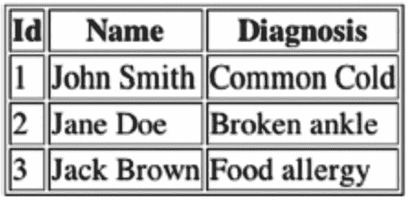

图 15-1 HTML 表格的常见渲染效果

使用此 XSL 文件将 XML 转换为 HTML 文件的过程很简单，但每个步骤都可以通过添加额外的错误检查和处理来增强。对于此示例，请参考解决方案部分中的先前代码。

以下是最基本的转换步骤。

1.  将 XSL 文档作为 `Source` 对象读入您的 Java 应用程序。
2.  创建一个 `Transformer` 实例，并提供您的 XSL `Source` 实例以供其操作期间使用。
3.  创建一个表示源 XML 内容的 `SourceStream`。
4.  为您的输出文档（本例中为 HTML 文件）创建一个 `StreamResult` 实例。
5.  使用 `Transformer` 对象的 `transform()` 方法执行转换。
6.  根据需要关闭所有相关的流和文件实例。

如果您选择执行示例代码，应使用 `patients.xml`、`patients.xsl` 和 `patients.html` 作为参数，按以下方式调用它。

```
java org.java17recipes.chapter15.recipe15_3.TransformXml 
```

15.4 验证 XML

问题
您希望确认您的 XML 是有效的——即它符合已知的文档定义或模式。

解决方案

使用 `javax.xml.validation` 包验证您的 XML 是否符合特定模式。以下来自 `org.java17recipes.chapter15.recipe15_4.ValidateXml` 的代码片段演示了如何针对 XML 模式文件进行验证。

```
import java.io.File;
import java.io.IOException;
import javax.xml.XMLConstants;
import javax.xml.transform.Source;
import javax.xml.transform.stream.StreamSource;
import javax.xml.validation.Schema;
import javax.xml.validation.SchemaFactory;
import javax.xml.validation.Validator;
import org.xml.sax.SAXException;
...
public void run(String xmlFile, String validationFile) {
boolean valid = true;
SchemaFactory sFactory =
SchemaFactory.newInstance(XMLConstants.W3C_XML_SCHEMA_NS_URI);
try {
Schema schema = sFactory.newSchema(new File(validationFile));
Validator validator = schema.newValidator();
Source source = new StreamSource(new File(xmlFile));
validator.validate(source);
} catch (SAXException | IOException | IllegalArgumentException ex) {
valid = false;
}
System.out.printf("XML file is %s.\n", valid ? "valid" : "invalid");
}
public static void main(String[] args) {
if (args.length != 2) {
System.out.println("Usage: java org.java17recipes.chapter15.recipe15_04.ValidateXml  ");
System.exit(1);
}
ValidateXml app = new ValidateXml();
app.run(args[0], args[1]);
}
```

工作原理

在使用 XML 时，对其进行验证以确保语法正确且 XML 文档是指定 XML 模式的一个实例非常重要。验证过程涉及比较模式和 XML 文档以发现任何差异。`javax.xml.validation` 包提供了可靠地针对各种模式验证 XML 文件所需的所有类。您用于 XML 验证的最常见模式在 `XMLConstants` 类中定义为常量 URI。

*   `XMLConstants.W3C_XML_SCHEMA_NS_URI`
*   `XMLConstants.RELAXNG_NS_URI`

首先为特定类型的模式定义创建一个 `SchemaFactory`。`SchemaFactory` 知道如何解析特定的模式类型，并为其验证做好准备。使用 `SchemaFactory` 实例创建一个 `Schema` 对象。`Schema` 对象是模式定义语法的内存表示。您可以使用 `Schema` 实例检索一个理解此语法的 `Validator` 实例。最后，使用 `validate()` 方法检查您的 XML。如果在验证过程中出现任何问题，该方法调用会生成多个异常。否则，`validate()` 方法会静默返回，您可以继续使用该 XML 文件。

注意

XML Schema 于 2001 年率先获得万维网联盟 (W3C) 的“推荐”状态。此后出现了竞争性的模式。一种竞争性模式是下一代正则语言 (RELAX NG) 模式。RELAX NG 可能是一种更简单的模式，其规范还定义了一种非 XML 的紧凑语法。本示例使用了 XML 模式。

使用以下命令行语法运行示例代码，最好使用作为 `resources/patients.xml` 和 `patients.xsl` 提供的示例 `.xml` 文件和验证文件，其中 XSL 如下所示。

```

Patients

Id
Name
Diagnosis

```

15.5 使用 JSON

问题
您有兴趣在 Java 应用程序中使用 JSON。

解决方案
JSON 是一种源自 JavaScript 的免费且独立的数据格式。它通常用于从 Web 服务器读取数据并在网页上显示数据，仅仅因为其格式仅为文本。有不同的库可以在您的 Java 项目中管理 JSON。从 [`https://github.com/stleary/JSON-java`](https://github.com/stleary/JSON-java) 下载 `org.json` 库，并将其作为依赖项添加到您的 Java 应用程序中。

工作原理
`org.JSON` 包实现了编码器和解码器，用于将 JSON 文档解析为 Java 对象，并从 Java 类生成 JSON 文档，还包括在 JSON 和 XML 之间进行转换的功能。通过将下载的 JAR 文件添加到 CLASSPATH 中，也很容易包含该 API。Java 中有许多 JSON 包（例如，[`https://github.com/google/gson`](https://github.com/google/gson) 上的 GSON），但 Java 社区尚未标准化其中一个。


15.6 构建一个
JSON 对象

问题
你希望在 Java 应用程序中构建一个 JSON 对象。

解决方案

利用 JSON API 来构建一个 JSON 对象。在以下代码中，构建了一个与书籍相关的 JSON 对象。

```
public class BuildingJSONObject {
public static void main(String[] args) {
JSONObject json = new JSONObject();
json.put("title", "Java 17 Recipes");
JSONObject authorName = new JSONObject();
authorName.put("firstName","Luciano");
authorName.put("lastName","Manelli");
json.put("author", authorName);
JSONObject editor1 = new JSONObject();
editor1.put("firstName", "Steve");
editor1.put("lastName", "Anglin");
JSONObject editor2 = new JSONObject();
editor2.put("firstName","Matthew");
editor2.put("lastName","Moodie");
JSONArray editors = new JSONArray();
editors.put(editor1);
editors.put(editor2);
json.put("editor", editors);
System.out.println(json.toString());
}
}
```

以下是输出结果。

```
{"editor":[{"firstName":"Steve","lastName":"Anglin"},{"firstName":"Matthew","lastName":"Moodie"}],"author":{"firstName":"Luciano","lastName":"Manelli"},"title":"Java 17 Recipes"}
```

工作原理
JSON API 使用构建器模式创建 JSON 对象。通过使用 JSON 对象，可以借助一系列 `put` 方法调用来构建 JSON 对象，这些调用相互叠加。一旦 JSON 对象构建完成，它就可以被使用或作为字符串打印出来。

在本示例中，你构建了一个提供书籍详细信息的 JSON 对象。`put` 方法用于添加更多的名称/值属性（很像 `Map` 的 `put` 方法）。因此，下面这行代码添加了一个名为 `title`、值为“Java 17 Recipes”的属性。

```
.put("title", "Java 17 Recipes")
```

对象可以相互嵌套，在一个 JSON 对象内部创建子部分的分层结构。例如，在第一次调用 `put`() 之后，可以通过调用一个新的 JSON 对象作为 `put()` 操作的值，并传入该嵌套对象的名称，将另一个对象嵌入到初始 JSON 对象中。嵌套对象也可以包含属性（`authorName`），因此要向嵌套对象添加属性，可以在该嵌套对象内部调用 `put`() 方法。JSON 对象可以根据需要包含任意数量的嵌套对象。一个 JSON 对象也可能包含一个相关子对象的数组。要添加一个子对象数组，可以调用 `JSONArray()` 方法，并将数组名称作为参数传入。数组可以由对象、对象层级结构、数组等组成。一旦创建了 JSON 对象，它就可以被使用并传递给客户端。

15.7 将 JSON 对象写入文件

问题
你已经生成或解析了一个 JSON 对象，并希望将其以文件格式存储在磁盘上。

解决方案

利用 JSON API 构建一个 JSON 对象，然后将其存储到文件系统中。该类与 `java.io.Writer` 包配合使用，使得在磁盘上创建文件并将 JSON 写入该文件成为可能。在以下示例中，使用此技术将配方 15-6 中生成的 JSON 对象写入磁盘。

```
public class BuildingJSONObject {
public static void main(String[] args) {
JSONObject json = new JSONObject();
json.put("title", "Java 17 Recipes");
JSONObject authorName = new JSONObject();
authorName.put("firstName","Luciano");
authorName.put("lastName","Manelli");
json.put("author", authorName);
JSONObject editor1 = new JSONObject();
editor1.put("firstName", "Steve");
editor1.put("lastName", "Anglin");
JSONObject editor2 = new JSONObject();
editor2.put("firstName","Matthew");
editor2.put("lastName","Moodie");
JSONArray editors = new JSONArray();
editors.put(editor1);
editors.put(editor2);
json.put("editor", editors);
try {
Writer jsonWriter = json.write(new FileWriter("Book.json")) ;
jsonWriter.flush();
} catch (IOException ex) {
System.out.println(ex);
}
}
}
```
输出结果是 Book.json 文件：
```
{"editor":[{"firstName":"Steve","lastName":"Anglin"},{"firstName":"Matthew","lastName":"Moodie"}],"author":{"firstName":"Luciano","lastName":"Manelli"},"title":"Java 17 Recipes"}
```

工作原理
`.write` 方法可用于将 JSON 对象写入 Java 的 Writer 对象。它通过将一个 `Writer` 对象作为参数传递给 `Json.write()` 方法来实例化。创建 `jsonWriter` 之后，可以调用 flush 方法来写入 JSON 文件。

15.8 解析一个 JSON 对象

问题

你创建的应用程序需要能够读取一个 JSON 对象并相应地解析它。使用以下 JSON 脚本。

```
{
"title":"Java 17 Recipes",
"author":{"firstName":"Luciano","lastName":"Manelli"},
"projectCoordinator":{"firstName":"Mark","lastName":"Powers"},
"editor":[{"firstName":"Welmoed","lastName":"Spahr"},{"firstName":"Steve","lastName":"Anglin"},{"firstName":"Matthew","lastName":"Moodie"}],
"technicalReviewer":[{"firstName":"Manuel","lastName":"Jordan"}]
}
```

解决方案

利用 `JSONObject` 类将 JSON 字符串转换为 JSON 对象，读取 JSON 对象，然后使用 `getJSONObject` 和 `getJSONArray` 方法对 JSON 数据执行操作。以下示例演示了如何解析 JSON 字符串以显示一些内容。

```
public void parseObject() {
String json = "{\"title\":\"Java EE 17 Recipes\",\"author\":{\"firstName\":\"Luciano\",\"lastName\":\"Manelli\"},\"projectCoordinator\":{\"firstName\":\"Mark\",\"lastName\":\"Powers\"},\"editor\":[{\"firstName\":\"Welmoed\",\"lastName\":\"Spahr\"},{\"firstName\":\"Steve\",\"lastName\":\"Anglin\"},{\"firstName\":\"Matthew\",\"lastName\":\"Moodie\"}],\"technicalReviewer\":[{\"firstName\":\"Manuel\",\"lastName\":\"Jordan\"}]}";
System.out.println(json);
JSONObject parserJson = new JSONObject(json);
String author = parserJson.getJSONObject("author").getString("lastName");
System.out.println("Author:"+author);
JSONArray arr = parserJson.getJSONArray("editor");
for (int i = 0; i < arr.length(); i++) {
String editor = arr.getJSONObject(i).getString("lastName");
System.out.println(editor);
}
}
```

在该示例中，JSON 字符串被解析。以下是输出结果。

```
Author:Manelli
editor:Spahr
editor:Anglin
editor:Moodie
```

工作原理
JSON 方法生成一个 JSON 对象。要执行某些任务，必须解析 JSON 对象，以仅找出当前任务所需且有用的内容。使用 JSON 解析器可以使此类工作更简单，因为解析器可以将对象分解成多个部分，以便根据需要检查每个不同的部分，从而产生所需的结果。
在本例中，我们使用了 `getJSONArray` 来遍历对象数组，并使用 `getJSONObject` 来解析对象。


15.9 小结
XML 常用于在不同应用程序之间传输数据，或将某种数据存储到文件中。因此，理解在应用程序开发平台中处理 XML 的基础知识至关重要。本章概述了如何使用 Java 执行一些处理 XML 的关键任务。本章首先介绍了 XML 读写的基础知识。此外，本章还涉及了 JSON，演示了如何生成、写入和解析 JSON 数据。

16. 网络

如今，编写一个完全不通过互联网进行通信的应用程序已十分罕见。从向另一台机器发送数据，到从远程网页抓取信息，网络在当今的计算世界中扮演着不可或缺的角色。Java 利用新的 I/O (NIO) 和 Java 平台的众多 I/O 特性 (NIO.2) API，使得通过网络进行通信变得简单。本章并不试图涵盖 Java 语言中所有的网络特性，因为这个主题非常庞大。然而，它确实提供了一些对广大开发者最为有用的实用方法。你将了解一些标准的网络概念，例如套接字，以及 Java 语言最新版本中引入的一些较新概念。如果你觉得本章内容有趣，并想了解更多关于 Java 网络的知识，可以在网上找到大量资源。

16.1 监听服务器上的连接

问题
你想要创建一个监听远程客户端连接的服务器应用程序。

解决方案

建立一个服务器端应用程序，使用 `java.net.ServerSocket` 在指定端口上监听请求。以下 Java 类代表了可部署到服务器上的典型类，它监听 `1234` 端口上的传入请求。当收到请求时，传入的消息会打印到命令行，并向客户端发送回响应。

```
import java.io.BufferedReader;
import java.io.IOException;
import java.io.InputStreamReader;
import java.io.PrintWriter;
import java.net.ServerSocket;
import java.net.Socket;
public class SocketServer {
public static void main(String a[]) {
final int httpd = 1234;
ServerSocket ssock = null;
try {
ssock = new ServerSocket(httpd);
System.out.println("have opened port 1234 locally");
Socket sock = ssock.accept();
System.out.println("client has made socket connection");
communicateWithClient(sock);
System.out.println("closing socket");
} catch (Exception e) {
System.out.println(e);
} finally {
try{
ssock.close();
} catch (IOException ex) {
System.out.println(ex);
}
}
}
public static void communicateWithClient(Socket socket) {
BufferedReader in = null;
PrintWriter out = null;
try {
in = new BufferedReader(
new InputStreamReader(socket.getInputStream()));
out = new PrintWriter(
socket.getOutputStream(), true);
String s = null;
out.println("Server received communication!");
while ((s = in.readLine()) != null) {
System.out.println("received from client: " + s);
out.flush();
break;
}
} catch (Exception e) {
e.printStackTrace();
} finally {
try {
in.close();
out.close();
} catch (IOException ex) {
ex.printStackTrace();
}
}
}
}
```

本方法需与方案 16-2 配合使用。此示例启动服务器，执行此程序仅会打印“have opened port 1234 locally”。但若与方案 16-2 中构建的客户端一起执行，则会在 `SocketServer` 中产生以下输出。

```
have opened port 1234 locally
client has made socket connection
received from client: Here is a test.
closing socket
```

注意

要使这两个方案协同工作，请先启动 SocketServer 程序（打开一个命令窗口并输入 **java SocketServer**），以便客户端能够使用服务器程序中打开的端口创建套接字。SocketServer 启动后，再启动 SocketClient（打开另一个命令窗口并输入 **java SocketClient**）程序，即可看到两者协同工作。

警告

此 SocketServer 程序会在你的机器上打开一个端口（1234）。请确保你的机器上已设置并运行防火墙；否则，你将向所有人开放 1234 端口。这可能导致你的机器受到攻击。开放的端口会为攻击者入侵机器创造漏洞，就像在你家里敞开一扇门一样。请注意，本方案中的示例攻击面很小，因为服务器只运行一次，并且在会话关闭前仅打印来自客户端的一条消息。

工作原理
服务器应用程序可以通过一个或多个客户端应用程序的直接通信来执行工作。客户端应用程序通常与服务器应用程序通信，向服务器发送消息或数据进行处理，然后断开连接。服务器应用程序通常监听客户端应用程序，并在收到并接受连接后，根据客户端请求进行处理。要使客户端应用程序连接到服务器应用程序，服务器应用程序必须正在监听连接，并以某种方式处理连接数据。你不能简单地针对任意给定的主机和端口号组合运行客户端，因为这样做很可能会导致连接被拒绝的错误。服务器端应用程序必须做三件事：打开一个端口，接受并建立客户端连接，然后以某种方式与客户端连接进行通信。在本方案的解决方案中，`SocketServer` 类完成了这三件事。

从 `main()` 方法开始，该类在 1234 端口上打开一个新的套接字。这是通过创建 `ServerSocket` 的新实例并向其传递端口号来完成的。该端口号不得与服务器上当前正在使用的任何其他端口冲突。需要注意的是，低于 1024 的端口通常保留给操作系统使用，因此请选择该范围以上的端口号。如果你尝试打开一个已被占用的端口，服务器套接字将无法成功创建，程序将失败。接下来，调用 `ServerSocket` 对象的 `accept()` 方法，该方法返回一个新的 `Socket` 对象。调用 `accept()` 方法后，在客户端尝试连接到已设置端口的服务器程序之前，该方法不会执行任何操作。`accept()` 方法会空闲等待，直到有连接请求，然后返回绑定到服务器套接字所设置端口的新 `Socket` 对象。此套接字还包含尝试连接的客户端的远程端口和主机名。它包含两个端点的信息，并唯一标识了传输控制协议 (TCP) 连接。

此时，服务器程序可以与客户端程序通信，它通过使用 `PrintWriter` 和 `BufferedReader` 对象来实现。在本方案的解决方案中，`communicateWithClient()` 方法包含了接受来自客户端程序的消息、向客户端发送回消息以及将控制权返回给关闭服务器套接字的 `main()` 方法所需的所有代码。可以通过使用套接字的输入流生成一个新的 `InputStreamReader` 实例来创建新的 `BufferedReader` 对象。类似地，可以使用套接字的输出流创建新的 `PrintWriter` 对象。请注意，如果这些对象未能成功创建，则必须将此代码包装在 `try-catch` 块中。

```
in = new BufferedReader(
new InputStreamReader(socket.getInputStream()));
out = new PrintWriter(
socket.getOutputStream(), true);
```

一旦这些对象成功创建，服务器就可以与客户端通信了。它使用一个循环来实现这一点，从 `BufferedReader` 对象（客户端输入流）读取数据，并使用 `PrintWriter` 对象将消息发送回客户端。在本方案的解决方案中，服务器通过发出 `break` 来关闭连接，这会导致循环结束。然后控制权返回到 `main()` 方法。


```
out.println("Server received communication!");
while ((s = in.readLine()) != null) {
System.out.println("received from client: " + s);
out.flush();
break;
}
```

在实际的服务器程序中，服务器通常会持续监听，而不会使用 `break` 来结束通信。每个客户端连接都会生成一个独立的线程来处理通信，以支持多个并发客户端。服务器还会对客户端通信进行有用的处理。在 HTML 服务器中，它会向客户端发回一条 HTML 消息。在 SMTP 服务器中，客户端会向服务器发送一封电子邮件，然后服务器处理该邮件并将其发送出去。套接字通信几乎用于所有 TCP 传输，客户端和服务器都会创建新的套接字以成功完成通信。

16.2 定义到服务器的网络连接

问题
你需要建立与远程服务器的连接。

解决方案
使用远程服务器的名称和端口号创建套接字连接，以监听传入的客户端请求。以下示例类创建了一个到远程服务器的套接字连接。代码随后向服务器发送一条文本消息并接收响应。在该示例中，客户端尝试联系的服务器名为 `server-name`，端口号为 1234。

提示

要连接到客户端机器上运行的本地程序，请将服务器名称设置为 127.0.0.1。本技巧的源代码列表中已包含此设置。通常，此类本地连接仅用于测试目的。

```
public class SocketClient {
public static Socket socket = null;
public static PrintWriter out;
public static BufferedReader in;
public static void main(String[] args) {
createConnection("127.0.0.1", 1234);
}
public static void createConnection(String host, int port) {
try {
//创建套接字连接
socket = new Socket(host, port);
// 获取套接字输出的句柄
out = new PrintWriter(socket.getOutputStream(),
true);
// 获取套接字输入的句柄
in = new BufferedReader(new InputStreamReader(
socket.getInputStream()));
testConnection();
System.out.println("正在关闭连接...");
out.flush();
out.close();
in.close();
socket.close();
System.exit(0);
} catch (UnknownHostException e) {
System.out.println(e);
System.exit(1);
} catch (IOException e) {
System.out.println(e);
System.exit(1);
}
}
public static void testConnection() {
String serverResponse = null;
if (socket != null && in != null && out != null) {
System.out.println("连接成功，正在测试...");
try {
// 向服务器发送数据
out.println("Here is a test.");
// 从服务器接收数据
while((serverResponse = in.readLine()) != null)
System.out.println(serverResponse);
} catch (IOException e) {
System.out.println(e);
System.exit(1);
}
}
}
}
```

如果你针对一个成功接受请求的服务器测试此客户端，你将看到以下结果。

```
连接成功，正在测试...
Server received communication!
正在关闭连接...
```

注意

此程序本身不执行任何操作。要创建一个接受此连接以进行完整测试的服务器端套接字应用程序，请参阅技巧 16-1。如果你尝试运行此类，但未指定在提供的端口上监听的服务器主机，你将收到此异常：`java.net.ConnectException: Connection refused`。

工作原理
每个客户端/服务器连接都通过一个*套接字*发生，套接字是两个不同程序之间通信链路的一个端点。套接字被分配了端口号，这些端口号作为 TCP/IP 层在尝试连接时使用的标识符。接受客户端请求的服务器程序通常在指定的端口号上监听新连接。当客户端想要向服务器发出请求时，它会利用服务器的主机名和服务器正在监听的端口创建一个新的套接字，并尝试与该套接字建立连接。如果服务器接受该套接字，则连接成功。

本技巧讨论了套接字连接的客户端部分，因此我们不会深入探讨服务器端发生的情况。然而，有关连接服务器端的更多信息将在技巧 16-1 中介绍。本技巧解决方案中的示例类展示了客户端程序如何尝试并建立与服务器端程序的连接。在本技巧中，`createConnection()` 方法执行实际的连接。它接受服务器主机名和端口号，从而创建套接字。在 `createConnection()` 方法内部，服务器主机名和端口号被传递给 `Socket` 类构造函数，创建一个新的 `Socket` 对象。接下来，使用 `Socket` 对象的输出流创建一个 `PrintWriter` 对象，并使用 `Socket` 对象的输入流创建一个 `BufferedReader` 对象。

```
//创建套接字连接
socket = new Socket(host, port);
// 获取套接字输出的句柄
out = new PrintWriter(socket.getOutputStream(),
true);
// 获取套接字输入的句柄
in = new BufferedReader(new InputStreamReader(
socket.getInputStream()));
```

创建套接字并获取套接字的输出流和输入流之后，客户端可以向 `PrintWriter` 写入数据以发送数据到服务器。同样，为了接收来自服务器的响应，客户端从 `BufferedReader` 对象读取数据。`testConnection()` 方法使用新创建的套接字模拟客户端和服务器程序之间的对话。为此，会检查 `socket`、`in` 和 `out` 变量，确保它们不等于 `null`。如果它们不等于 `null`，客户端尝试通过向输出流发送消息 `out.println("Here is a test.")` 来向服务器发送消息。然后创建一个循环，通过调用 `in.readLine()` 方法监听来自服务器的响应，直到没有更多内容接收。然后打印接收到的消息。

```
if (socket != null && in != null && out != null) {
System.out.println("连接成功，正在测试...");
try {
// 向服务器发送数据
out.println("Here is a test.");
// 从服务器接收数据
while((serverResponse = in.readLine()) != null)
System.out.println(serverResponse);
} catch (IOException e) {
System.out.println(e);
System.exit(1);
}
}
```

`java.net.Socket` 类符合 Java 编程语言的特性。它使开发人员能够针对独立于平台的 API 进行编码，以与特定于不同平台的网络协议进行通信。它向开发人员抽象了每个平台的细节，并提供了一个简单且一致的实现，用于实现客户端/服务器通信。

16.3 向一组接收者广播

问题
你想要向由单个地址标识的零个或多个主机广播数据报。

解决方案

使用 `DatagramChannel` 类进行数据报多播。`DatagramChannel` 类允许多个客户端连接到一个组并监听从服务器广播的数据报。以下代码集使用客户端/服务器方法演示了此技术。该类演示了一个多播客户端。


```
package org.java17recipes.chapter16.recipe16_4;
import java.io.IOException;
import java.net.InetAddress;
import java.net.InetSocketAddress;
import java.net.NetworkInterface;
import java.net.StandardProtocolFamily;
import java.net.StandardSocketOptions;
import java.nio.ByteBuffer;
import java.nio.channels.DatagramChannel;
import java.nio.channels.MembershipKey;
public class MulticastClient {
public MulticastClient() {
}
public static void main(String[] args) {
try {
// 获取支持的网络接口
NetworkInterface networkInterface = null;
java.util.Enumeration enumNI = NetworkInterface.getNetworkInterfaces();
java.util.Enumeration enumIA;
NetworkInterface ni;
InetAddress ia;
ILOOP:
while (enumNI.hasMoreElements()) {
ni = enumNI.nextElement();
enumIA = ni.getInetAddresses();
while (enumIA.hasMoreElements()) {
ia = enumIA.nextElement();
if (ni.isUp() && ni.supportsMulticast()
&& !ni.isVirtual() && !ni.isLoopback()
&& !ia.isSiteLocalAddress()) {
networkInterface = ni;
break ILOOP;
}
}
}
// 地址在范围内
int port = 5239;
InetAddress group = InetAddress.getByName("226.18.84.25");
final DatagramChannel client = DatagramChannel.open(StandardProtocolFamily.INET);
client.setOption(StandardSocketOptions.SO_REUSEADDR, true);
client.bind(new InetSocketAddress(port));
client.setOption(StandardSocketOptions.IP_MULTICAST_IF, networkInterface);
System.out.println("加入组: " + group + " 使用网络接口 " + networkInterface);
// 多播加入
MembershipKey key = client.join(group, networkInterface);
client.open();
// 作为客户端接收消息
final ByteBuffer buffer = ByteBuffer.allocateDirect(4096);
buffer.clear();
System.out.println("等待接收消息");
// 将客户端配置为被动且非阻塞
// client.configureBlocking(false);
client.receive(buffer);
System.out.println("客户端收到消息:");
buffer.flip();
byte[] arr = new byte[buffer.remaining()];
buffer.get(arr, 0, arr.length);
System.out.println(new String(arr));
System.out.println("断开连接...仅执行单次测试");
client.disconnect();
} catch (IOException ex) {
ex.printStackTrace();
}
}
}
```

接下来，一个服务器类向多播客户端连接的地址广播数据报。以下代码演示了一个多播服务器。

```
package org.java17recipes.chapter16.recipe16_4;
import java.io.IOException;
import java.net.InetAddress;
import java.net.InetSocketAddress;
import java.nio.ByteBuffer;
import java.nio.channels.DatagramChannel;
public class MulticastServer extends Thread {
protected ByteBuffer message = null;
public MulticastServer() {
}
public static void main(String[] args) {
MulticastServer server = new MulticastServer();
server.start();
}
@Override
public void run() {
try {
// 将响应发送到"address"和"port"指定的客户端
InetAddress address = InetAddress.getByName("226.18.84.25");
int port = 5239;
DatagramChannel server = DatagramChannel.open().bind(null);
System.out.println("向组 " + address + " 的端口 " + port + " 发送数据报包");
message = ByteBuffer.wrap("Hello to all listeners".getBytes());
server.send(message, new InetSocketAddress(address, port));
server.disconnect();
} catch (IOException e) {
e.printStackTrace();
}
}
}
```

服务器可以向组内的每个客户端广播消息。一旦服务器启动，它就会广播消息，客户端接收该消息。

在本方案中，两个类——`MulticastServer` 和 `MulticastClient`——协同工作，因此当执行 MulticastClient 时，会产生以下输出。

```
加入组: /226.18.84.25 使用网络接口名称: networkName
等待接收消息
```

MulticastClient 程序启动后，您可以执行 MulticastServer 程序来观察两者协同工作。以下是 MulticastServer 的输出。

```
向组 /226.18.84.25 的端口 5239 发送数据报包
```

MulticastClient 的输出更新如下。

```
客户端收到消息:
Hello to all listeners
```

工作原理
多播是指通过单次传输向一组监听者广播消息的能力。多播的一个很好的类比是无线电广播。成千上万的人可以收听同一个广播事件，听到相同的消息。计算机在向监听者发送消息时也可以做类似的事情。一组客户端机器可以调谐到相同的地址和端口号，以接收服务器向该地址和端口广播的消息。Java 语言通过数据报消息传递提供多播功能。数据报是独立的、不保证送达的消息，可以通过网络传递给客户端。（*不保证送达*意味着到达、到达时间和内容都是不可预测的。）与通过 TCP 发送的消息不同，发送数据报是一个非阻塞事件，发送者不会收到消息已接收的通知。数据报使用用户数据报协议（UDP）而非 TCP 发送。如果消息的顺序、可靠性和数据完整性不是关键任务，那么通过 UDP 发送多播消息的能力是相对于 TCP 的一个优势。

Java 通过 `MulticastChannel` 接口支持多播消息传递。实现 `MulticastChannel` 接口的类启用了多播功能，因此可以向组广播并接收组广播。其中一个这样的类是 `DatagramChannel`，它是一个面向数据报套接字的可选通道。在本方案的解决方案中，客户端和服务器程序都通过多播消息传递进行通信。通信双方都使用了 `DatagramChannel` 类。`DatagramChannel` 必须以特定方式配置才能用于接收多播消息。具体来说，需要在打开的 `DatagramChannel` 客户端上设置一些选项。我们稍后将讨论这些选项。创建接收多播消息的客户端需要以下步骤。

1.  打开一个数据报通道。
2.  设置多播所需的数据报通道选项。
3.  将客户端加入多播组并返回一个 `MembershipKey` 对象。
4.  打开客户端。

在本方案的解决方案中，客户端应用程序首先获取接收广播消息的网络接口的引用。多播需要设置一个 `NetworkInterface`。接下来，选择一个端口号和一个多播 IP 地址。组或已注册的监听者使用该 IP 地址监听广播。端口号必须未被占用；否则会抛出异常。对于 IPv4 多播，IP 地址必须在 224.0.0.0 到 239.255.255.255（含）范围内。此端口和 IP 地址与服务器广播消息时使用的相同。接下来，使用 `StandardProtocolFamily.INET` 打开一个新的数据报通道。打开数据报通道的选择是 `StandardProtocolFamily.INET` 或 `StandardProtocolFamily.INET6`，分别对应 IPv4 和 IPv6。在数据报通道上设置的第一个选项是 `StandardSocketOptions.SO_REUSEADDR`，并将其设置为 `true`。这表示多个客户端可以“重用”该地址或同时使用它。必须设置此选项才能进行多播。然后，客户端使用一个新的 `InetSocketAddress` 实例绑定到该端口。最后，将 `StandardSocketOptions.IP_MULTICAST_IF` 选项设置为所使用的网络接口。此选项表示数据报导向套接字发送多播数据报时的传出接口。

```
client.setOption(StandardSocketOptions.SO_REUSEADDR, true);
client.bind(new InetSocketAddress(port));
client.setOption(StandardSocketOptions.IP_MULTICAST_IF, networkInterface);
```


一旦设置了这些选项并将端口绑定到数据报通道，它就可以加入监听器组了。这可以通过调用 `DatagramChanneljoin(InetAddress, NetworkInterface)` 方法来实现，并传入客户端使用的组地址和网络接口。结果会生成一个 `java.nio.channels.MembershipKey` 对象。这是一个代表 IP 多播组成员身份的令牌。最后，调用 `DatagramChannelopen()` 方法，该方法会打开通道以监听广播。此时，客户端已准备好接收多播消息，并等待接收消息。

```
MembershipKey key = client.join(group, networkInterface);
client.open();
```

客户端接下来的几行代码负责接收来自服务器的消息。为了接收广播消息，会创建一个字节缓冲区，然后将其传递给 `DatagramChannel` 类的 `receive()` 方法。一旦调用了 `receive()` 方法，客户端就会暂停，直到收到消息。你可以通过调用 `DatagramChannel configureBlocking(boolean)` 方法并传入 `false` 值来禁用此功能。接着，`ByteBuffer` 会被转换为字符串值并打印出来，方法是使用 `flip()` 方法将缓冲区索引重置为 0，然后将从索引 0 到最后一个索引的文本提取到 `byte[]` 中。最后，请确保在完成后断开客户端连接。至此，客户端代码部分结束。

```
// 将客户端配置为被动且非阻塞
// client.configureBlocking(false);
client.receive(buffer);
// 客户端暂停，直到收到消息...在此情况下
System.out.println("客户端收到消息：");
buffer.flip();
byte[] arr = new byte[buffer.remaining()];
buffer.get(arr, 0, arr.length);
System.out.println(new String(arr));
System.out.println("正在断开连接...仅执行单次测试");
client.disconnect();
```

注意

在本技巧的示例中，仅执行单次传递，然后客户端断开连接。对于长时间监听，你需要一个带有超时机制的循环，并为结束状态提供测试。

服务器代码相当基础。你可以看到 `MulticastServer` 类继承了 `Thread`。这意味着此服务器应用程序可以在与应用程序中其他代码分离的线程中运行。如果另一个类启动了 `MulticastServer` 类的 `run()` 方法，它将在与启动它的类分离的线程中运行。任何继承 `Thread` 的类都必须包含 `run()` 方法。

服务器代码的主体部分位于 `run()` 方法中。使用客户端注册加入多播组时所用的相同 IP 地址创建一个新的 `InetAddress` 对象。服务器代码中也声明了相同的端口号。这两个对象稍后在代码块中用于发送消息。打开一个新的数据报通道并绑定到 `null`。`null` 值很重要，因为通过将 `SocketAddress` 设置为 `null`，套接字会绑定到一个自动分配的地址。接下来，创建一个包含消息的字节缓冲区，该消息将广播给所有监听器。然后使用 `DatagramChannel` 类的 `send(ByteBuffer, InetSocketAddress)` 方法发送消息。解决方案中的 `send()` 方法接受一个 `ByteBuffer` 对象作为消息，以及一个使用代码块开头声明的地址和端口创建的新 `InetSocketAddress` 实例。我们说过会回到这些内容！

```
server.send(message, new InetSocketAddress(address, port));
```

此时，客户端将收到服务器发送的消息。对于本技巧解决方案中演示的客户端，它随后会断开连接。在现实场景中，很可能由另一个类来启动服务器。其 `run()` 方法将包含一个循环，该循环会持续执行，直到所有消息都已广播或循环被指示停止。客户端可能不会断开连接，直到用户发起关闭操作。

注意

如果你的笔记本电脑或服务器使用不同于标准 IPv4 的网络协议，则结果可能会有所不同。在将代码发送到生产环境之前，请务必进行充分的测试。

16.4 生成和读取 URL

问题
你希望在应用程序中以编程方式生成 URL。创建 URL 后，你希望从中读取数据以供应用程序使用。

解决方案

使用 `java.net.URL` 类来创建 URL。根据你要处理的地址，有几种不同的生成 URL 的方法。本解决方案演示了其中一些创建 URL 对象的选项，并附有注释说明差异。创建 URL 对象后，其中一个 URL 会被读入 `BufferedReader` 并打印到命令行。

```
import java.io.BufferedReader;
import java.io.IOException;
import java.io.InputStreamReader;
import java.net.MalformedURLException;
import java.net.URL;
public class GenerateAndReadUrl {
public static void main(String[] args) {
try {
// 生成绝对 URL
URL url1 = new URL("https://openjdk.java.net");
System.out.println(url1.toString());
// 为具有共同基础的页面生成 URL
URL url2 = new URL(url1, " projects/jdk/17");
// 从不同的数据片段生成 URL
URL url3 = new URL("http", "openjdk.java.net", "projects/jdk/17");
readFromUrl(url1);
} catch (MalformedURLException ex) {
ex.printStackTrace();
}
}
/**
* 将 URL 流作为输入流打开，并将内容打印到命令行。
*
* @param url
*/
public static void readFromUrl(URL url) {
try {
BufferedReader in = new BufferedReader(
new InputStreamReader(
url.openStream()));
String inputLine;
while ((inputLine = in.readLine()) != null) {
System.out.println(inputLine);
}
in.close();
} catch (IOException ex) {
ex.printStackTrace();
}
}
}
```

运行此程序会将标识为 `url1` 的 URL 资源中的 HTML 打印到命令行，如图 16-1 所示的控制台输出。

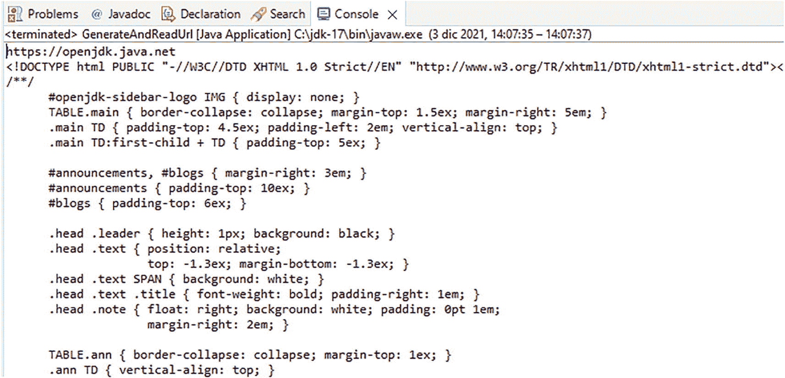

图 16-1
技巧 16-4 的输出

工作原理
得益于 `java.net.URL` 类，在 Java 代码中创建 URL 相当简单，该类完成了所有繁重的工作。URL 是一个指向互联网资源的字符串。有时，在 Java 代码中创建 URL 以读取 URL 指向的互联网资源的内容，或将内容推送到该资源是很有用的。在本技巧的解决方案中，创建了几个不同的 URL 对象，演示了可用的不同构造函数。

创建 URL 最简单的方法是将互联网上资源的标准可读 URL 字符串传递给 `java.net.URL` 类，以创建一个新的 URL 实例。在解决方案中，将一个绝对 URL 传递给构造函数以创建 `url1` 对象。

```
URL url1 = new URL("https://openjdk.java.net ");
```

另一种创建 URL 的有用方法是向 URL 构造函数传递两个参数来创建相对 URL。基于另一个 URL 的位置来创建相对 URL 非常有用。例如，如果某个特定站点有多个不同的页面，你可以创建一个指向相对于主站点 URL 的某个子页面的 URL。本技巧解决方案中的 `url2` 对象就是这种情况。

```
URL url2 = new URL(url1, "projects/jdk/17");
```


如你所见，路径 `search/node/jdk8` 是相对于名为 `url1` 的 URL 的。最终，`url2` 对象的人类可读格式表示为 [`http://www.java.net/search/node/jdk8`](http://www.java.net/search/node/jdk8)。还有几个用于创建 URL 对象的构造函数，它们接受两个以上的参数。这些构造函数如下所示。

```
new URL (String protocol, String host, String port, String path);
new URL (String protocol, String host, String path);
```

在解决方案中，演示了这两个构造函数中的第二个。资源的协议、主机名和路径被传递给构造函数以创建 `url3` 对象。当你动态生成 URL 时，这最后两个构造函数通常最有用。

16.5 解析 URL

问题
你希望以编程方式从 URL 中为你的应用程序收集信息。

解决方案

使用内置的 URL 类方法解析 URL。在下面名为 `ParseUrl` 的示例类中，创建了一个 URL 对象，然后使用内置的 URL 类方法对其进行解析，以收集有关该 URL 的信息。从 URL 检索到信息后，它会将其打印到命令行并创建另一个 URL。

```
import java.net.MalformedURLException;
import java.net.URL;
public static void main(String[] args) {
URL url1 = null;
try {
// 生成绝对 URL
url1 = new URL("https://link.springer.com/search?query=Manelli+Java");
String host = url1.getHost();
String path = url1.getPath();
String query = url1.getQuery();
String protocol = url1.getProtocol();
String authority = url1.getAuthority();
String ref = url1.getRef();
System.out.println("URL " + url1.toString() + " 解析结果如下：\n");
System.out.println("主机: " + host + "\n");
System.out.println("路径: " + path + "\n");
System.out.println("查询: " + query + "\n");
System.out.println("协议: " + protocol + "\n");
System.out.println("权限: " + authority + "\n");
System.out.println("引用: " + ref + "\n");
} catch (IOException ex) {
ex.printStackTrace();
}
}
```

当此代码执行时，将显示以下行。

```
The URL https://link.springer.com/search?query=Manelli+Java parses to the following:
Host: link.springer.com
Path: /search
Query: query=Manelli+Java
Protocol: https
Authority: link.springer.com
Reference: null
```

工作原理

在应用程序中构造和使用 URL 时，有时提取与 URL 相关的信息会很有用。使用内置的 URL 类方法可以轻松完成此操作，这些方法可以调用给定的 URL 并返回信息字符串。表 16-1 解释了 URL 类中可用于获取信息的访问器方法。

表 16-1
用于查询 URL 的访问器方法

方法 |
 返回的 URL 信息 |

| --- | --- | --- | --- | --- |

`getAuthority()` |
 权限组件 |

`getFile()` |
 文件名组件 |

`getHost()` |
 主机名组件 |

`getPath()` |
 路径组件 |

`getProtocol()` |
 协议标识符组件 |

`getRef()` |
 引用组件 |

`getQuery()` |
 查询组件 |

这些访问器方法中的每一个都返回一个字符串值，该值可用于提供信息或像示例中那样动态构造其他 URL。如果你查看本解决方案的结果，可以看到通过表 16-1 中列出的访问器方法获得的关于该 URL 的信息。大多数访问器方法都是不言自明的。然而，其中几个可能需要进一步解释。`getFile()` 方法返回 URL 的文件名。文件名等同于将 `getPath()` 返回的值与 `getQuery()` 返回的值连接起来。`getRef()` 方法可能不太直观。通过调用 `getRef()` 方法返回的引用组件指的是可能附加到 URL 末尾的“片段”。例如，片段使用井号（`#`）后跟一个通常对应于特定网页上某个子部分的字符串来表示。给定如下 URL，使用 `getRef()` 方法将返回 `recipe16_6`。

```
http://www.java17recipes.org/chapters/chapter16#recipe16_6
```

虽然并非总是需要，但解析 URL 以获取信息的能力有时会非常方便。由于 Java 语言在 `java.net.URL` 类中内置了辅助方法，这使得收集 URL 信息变得轻而易举。

16.6 小结
本章介绍了 Java 语言中一些强大且易于使用的基本网络特性，从使用套接字连接和 URL 到通过 `DatagramChannel` 类广播消息。

索引

A, B

自动资源管理 (ARM)

C

捕获异常

集合类型

alertListLegacy() 方法

数组

具体参数化类型

菱形运算符

动态数组

枚举类型

equals() 方法

外部迭代

FieldType 枚举类型

固定集合常量

泛型

GradeAnalyzer 类

智能常量

中间操作

内部迭代

isValidSwitchType() 方法

迭代

iterator() 方法

映射类 (HashMap/TreeMap)

可迭代对象

对象类型/方法

ordinal() 方法

并行执行

程序化循环

原始类型

RockPaperScissors 类

单一表达式

static 和 final 修饰符

Stock 对象

StockPortfolio 类

StockScreener main() 方法

summary() 方法

switch 表达式

SwitchTypeChecker

终端操作

类型擦除/参数

无界通配符

values() 和 valueOf(String) 方法

通配符

命令行界面 (CLI)

紧凑字符串

并发

异步

awaitTermination() 方法

后台任务

集合

CompletableFuture 对象

fulfillOrder() 方法

inventoryLock.unlock() 方法

inventoryMap/customerOrders 方法

学习任务

锁定

修改

putIfAbsent() 方法

独立线程

shutdown() 方法

startUpdatingThread() 方法

synchronizedList() 方法

ThreadPoolExecutor () 方法

线程安全对象

AtomicLong incrementAndGet() 方法

创建

DoubleAdder/LongAdder

getter/setter

不可变对象

实现

跨多个线程的值

线程同步

CountDownLatch 对象

InterruptedExceptions

processOrder() 方法

Queue<E>

Thread.join() 方法

工作流程

更新映射

创建、读取、更新和删除 (CRUD)

货币

D

数据库管理系统 (DBMS)

数据库

autoCommit() 方法

CachedRowSet 方法

连接管理

连接对象

CreateConnection 类

CRUD 操作

断开连接

DriverManager 类

executeQuery() 方法

getConnection() 方法

处理连接/SQL 异常

LocalDate 对象

MySQL

打开和关闭资源

performRead()/performUpdate() 方法

属性文件

查询过程

可滚动的 ResultSet 对象

SQL 注入

事务

try-with-resources 语法

可更新的 ResultSet 对象

数据定义语言 (DDL)

数据操作语言 (DML)

日期时间格式

applyPattern() 方法

calendar 类

compareTo() 方法

当前日期

format() 方法

getTime() 方法

时间间隔

java.util.Date 类

LocalDateTime 类

LocalTime 方法

基于机器的时间戳

对象

of() 方法

parse() 方法

一天中的时间段

SimpleDateFormat 类

时间格式


calendar 类

LocalDateTime 类

时区/偏移量类

类

数据处理

源代码

工作流程

ZoneOffset 类

年-月-日

E, F

Eclipse

“Hello, World”

类的创建/命名

控制台视图

容器类

创建

文件菜单

安装

JavaBeans 模式

main() 方法

命名包

包

项目选择

setter 和 getter 方法

骨架代码生成

源代码

工作流程

安装

JDK 配置

包下载

滚动发布

欢迎界面

工作流程

电子邮件通信

附件（文件/图片）

检查流程

HTML 格式的电子邮件

JavaMail

MimeMessage 类

发送消息

setRecipients() 方法

Transport() 方法

企业版 (EE)

企业 JavaBean (EJB) 模型

异常

包罗万象或宝可梦式异常处理器

捕获异常

已检查和未检查异常

类的创建

代码段

IOException/ClassNotFoundException

length() 方法

多个异常

抛出异常

抛出/捕获

try/catch/finally 块

try/catch 语句

try-with-resources 块

uncaughtException() 方法

竖线运算符 (|)

可扩展标记语言 (XML)

文档

元素和属性

HTML 格式

迭代器导向的 API

patients.xml 文件

需求

源代码

转换文件

验证

writeAttribute() 方法

XMLEvent 对象

XMLStreamWriter 实例

可扩展样式表语言 (XSL)

G

图形用户界面 (GUI)

H

超文本标记语言 (HTML)

basic.html 页面

组件

定义

form.html

生成

主页

输入元素

请求参数

开始和结束标签

提交按钮

table.html

标题标签

工作流程

I

输入/输出 (I/O) 操作

优势

复制文件

装饰器模式

Delete 和 Exist 方法

目录

文件元数据

未来任务

getFileAttributeView() 方法

getPath() 方法

getProperty 方法

移动文件

ObjectOutputStream 和 ObjectInputStream

路径

属性文件

序列化

SeeSerialization 方法

数据源/数据汇

套接字连接

标准属性

流

解压文件

visitFile 方法

watchEvents

集成开发环境 (IDE)

国际化

互联网消息访问协议 (IMAP)

J, K

Jakarta EE

Jakarta 服务器页面 (JSP)

动态网页

hello world

JSF 运作方式

Servlet 引擎

Web 服务器创建

工作流程

Java 9/17

always-strict 函数

文件内容

不可变集合

instanceof 运算符

接口代码

NullPointerException 函数

操作系统进程

ProcessHandle 接口

伪随机数生成器

记录类

密封类

之前和/或之后的流

switch 命令

takeWhile() 和 dropWhile()

文本块

try-with-resources 构造

var 关键字

向量计算

volumeCalc() 方法

Java 17

CLASSPATH 配置

代码组织

目录结构

Eclipse

环境变量值

getenv() 方法

主页

InputStreamReader/BufferedReader 类

安装

JavaDoc（文档）

注释

形成

HTML 文件

输出过程

工具执行

工作流程

键盘输入/异常处理

学习过程

OpenJDK/Oracle JDK 二进制文件

传递参数 vs. 命令行执行

PATH 配置

字符串转换

测试过程

变量声明/访问修饰符

类

原始数据类型

静态字段

字符串

可见性

工作流程

Java 社区进程 (JCP)

Java 数据库连接 (JDBC)

JavaScript 对象表示法 (JSON)

文件格式

构建对象

解析对象

工作流程

JavaServer Faces (JSF)

Java 虚拟机 (JVM)

L

Lambda 表达式

访问类变量

calculate() 方法

闭包

compareByGoal() 方法

条件表达式

createPlayer() 方法

双冒号 (::) 运算符

启用选项

过滤数据

forEach() 方法

函数式接口

lambdaInMethod() 方法

局部变量

方法引用

传递方法

Player 对象

简单消息

单一方法/名称

排序操作

风格语法

switch 表达式问题

Runnable 接口

VariableAccessInner CLASSA 变量

Locale

Builder 方法

forLanguageTag() 方法

匹配和过滤方法

数字/日期/时间格式

敏感类

源代码

标准控制台

日志记录操作

事件

属性文件

记录异常

轮转/清除选项

警告/错误消息

M

移动版 (ME)

模型-视图-控制器 (MVC)


多用途互联网邮件扩展（MIME）

MySQL

apressBooks 数据库

命令行界面

连接

控制台命令

数据目录

DROP 语句

初始化

安装

mysqladmin 命令

recipes 和 publications 表

服务器关闭

工作进程

N

网络

广播数据报

createConnection() 方法

DatagramChannel 类

I/O 特性

MulticastServer 类

远程连接

服务器端应用

套接字连接

testConnection() 方法

URLs 程序

访问器方法

BufferedReader 类

构造方法

getRef() 方法

解析方法

读取/生成

数字/日期

applyPattern() 方法

二进制数声明

CompactNumberInstance 方法

compareTo() 方法

比较运算符

日期

参见日期时间格式

DecimalFormat 类

浮点值

formatDouble() 方法

int 值

NumberFormat 类

POSITIVE_INFINITY/NEGATIVE_INFINITY

随机值

可读的数字字面量

浮点数/双精度浮点数舍入

setSeed() 方法

O

面向对象程序

抽象方法

访问器（getter）/修改器（setter）方法

clone() 方法

比较运算符（==）

构造实例（类/不同值）

属性

构建器实现

TeamBuilder 接口

TeamType 接口

工作流程

constructPlayer() 方法

createPlayer 方法

深拷贝

封装

equals() 和 hashCode() 方法

extends 关键字

getFullName() 方法

getInstance() 方法

内部类

实例生成

实例成员

接口

类定义

类交互

defender 方法

listPlayers() 方法

修改

TeamType 接口

对象比较

PlayerFactory 类

私有成员可访问

public/protected/private

可复用对象

shallowCopyClone() 方法

单例模式

模板

P, Q

PATH 配置

伪随机数生成器（PRNGs）

R

关系型数据库管理系统（RDBMS）

ResultSet 对象

创建

prepareStatement() 方法

可更新过程

工作流程

S

序列化方法

内置操作

跨语言兼容/人类可读

反序列化

Externalizable 接口

FileInputStream

标记接口

ProgramSetting 类

属性

readExternal/writeExternal 方法

saveSettings() 方法

transient

XMLEncoder 和 XMLDecoder

Servlet Web 应用

浏览器输出

容器

doGet 和 doPost

元素和方法

FirstServlet.java 代码

表单输出

GET 消息

Java 源代码

POST 消息

源代码

web.xml 文件

工作流程

流唯一标识符（SUID）

字符串操作

自动装箱/拆箱

Blank() 方法

字符级别

紧凑字符串

compareTo()/compareToIgnoreCase() 方法

比较操作

连接运算符

equals()/equalsIgnoreCase() 方法

equals() 方法

format() 方法

length() 和 charAt() 方法

lines() 方法

数值

parseInt() 方法

printf() 方法

repeat(int) 方法

strip() 方法

substring() 方法

文本匹配

endsWith() 方法

find() 方法

lookingAt() 方法

matches() 方法

pattern 和 matcher 类

正则表达式

replaceAll() 方法

源代码

工作流程

toCharArray() 方法

toUpperCase()/toLowerCase() 方法

去除空白

valueOf() 方法

字符串

字节数组

结构化查询语言（SQL）

executeQuery() 方法

注入

PreparedStatement 对象

工作流程

T

抛出异常

Tomcat

通信端口

组件

localhost 主页

端口号

网页浏览器

事务管理

传输控制协议（TCP）

U, V

Unicode 数字字符

字符流/缓冲区

demoComplex() 方法

enRegEx 和 jaRegEx 变量

getBytes() 方法

matches() 方法

newEncoder()/newDecoder() 方法

非 ASCII 字符

正则表达式

replaceFirst() 方法

源代码

split() 方法

静态方法

字符串方法

字符串/字节数组

工作流程

用户数据报协议（UDP）

W, X, Y, Z

Web 应用项目

配置/创建

eclipseEE 文件夹

主页

localhost

输出窗口

项目创建

Project index.jsp

服务器选项卡

Tomcat 配置

工作台屏幕

工作流程

HTML 页面

JSP 页面

请求参数-HTML

servlet

Tomcat 安装

```

```

```

```
