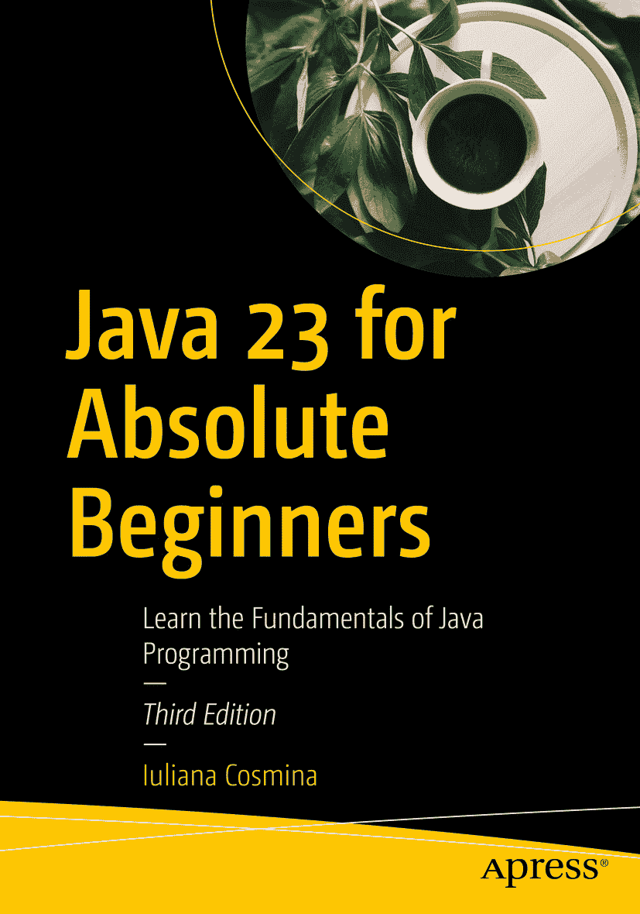

ISBN 979-8-8688-1040-4e-ISBN 979-8-8688-1041-1 [`doi.org/10.1007/979-8-8688-1041-1`](https://doi.org/10.1007/979-8-8688-1041-1) © Iuliana Cosmina 2018, 2022, 2024 本作品受版权保护。所有权利均由出版商独家许可，无论涉及材料的全部或部分，具体包括翻译、重印、重用插图、朗诵、广播、以缩微胶卷或任何其他物理方式复制，以及传输或信息存储与检索、电子改编、计算机软件，或目前已知或今后开发的类似或不同方法。本出版物中使用通用描述性名称、注册商标、商标、服务标志等，即使未作明确声明，也不意味着这些名称不受相关保护法律和法规的约束，因此可自由用于一般用途。出版商、作者和编辑可合理假定，本书中的建议和信息在出版之日是真实准确的。出版商、作者或编辑均不对本书所含材料或可能存在的任何错误或遗漏提供明示或暗示的担保。出版商对已出版地图中的管辖权主张和机构归属保持中立。

本 Apress 印记由注册公司 APress Media, LLC（Springer Nature 旗下）出版。

注册公司地址为：1 New York Plaza, New York, NY 10004, U.S.A.

*献给我所有的老师和导师。我将永远心怀感激。*

致谢

为初学者撰写书籍颇具挑战性，因为作为一名经验丰富的开发者，要找到合适的示例并以即使非技术人员也能轻松理解的方式加以解释，并非易事。因此，我衷心感谢 Apress 的优秀同仁们，他们在我撰写本书的旅程中始终相伴。他们提供了宝贵的支持和建议，使本书保持初学者水平且易于理解。特别感谢本书的技术审校 Manuel Jordan；他的建议和修正对本书的最终定稿至关重要。

Apress 出版了许多我曾阅读并用于提升专业水平的书籍。能与 Apress 合作出版本书的第三版，我深感荣幸，并且能够为“培养”新一代 Java 开发者做出贡献，这让我获得了巨大的满足感。

我感谢所有在文本和代码中发现错误、帮助我使本书这一版比前几版更完善的开发者们。

最后，我要感谢 Bogza-Vlad 一家：Monica、Tinel、Cristina 和 Stefan。你们都在我心中占据重要位置，我时常想念你们。

关于作者 关于技术审校

