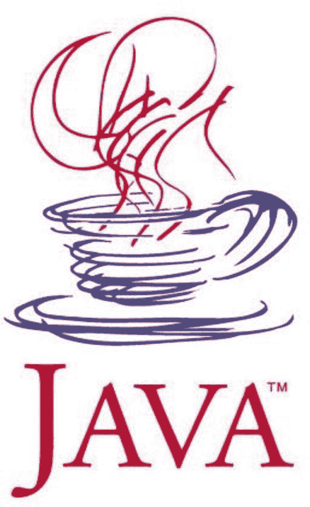
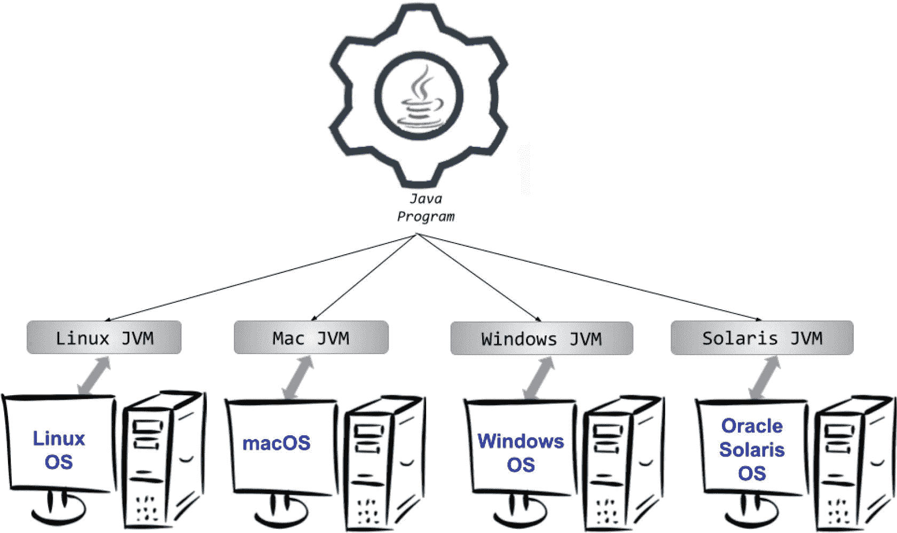
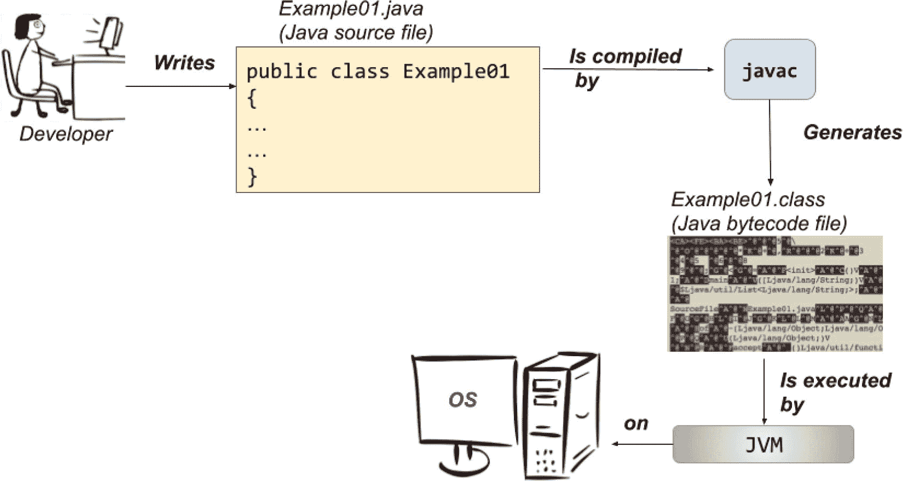
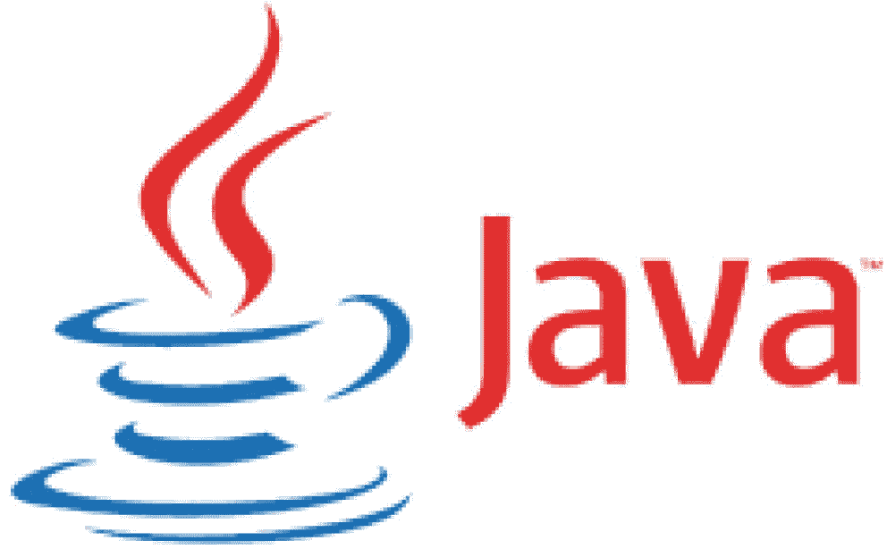

# 1. Java 及其历史简介

Java 一直稳居全球最受欢迎的十大编程语言之列，即使在 28 年后的今天，它仍然是最具影响力的语言之一。Sun Microsystems 于 1996 年正式发布 Java 1.0，它成功超越了像 C/C++这样早已确立地位的语言，成为最常用的编程语言之一。多年来，Java 的竞争对手数量不断增加，包括 C#、Groovy、Clojure、Scala 和 Kotlin 等，这些语言都曾一度被预测将取代 Java，但显然这并未发生（否则，你也不会读这本书了）。本章是关于你即将学习的这门语言的简短历史课；如果你对历史视角不感兴趣，可以随意跳到第 2 章。

## 一切是如何开始的

1990 年，Sun Microsystems 是一家引领计算机行业革命的美国公司。当世界各地的计算机开始连接到万维网时，该公司决定召集其最优秀的工程师来设计和开发一款产品，使 Sun 能够在新兴的互联网世界中成为重要参与者。这些工程师中包括詹姆斯·亚瑟·高斯林，一位加拿大计算机科学家，如今被公认为 Java 编程语言的*之父*。Sun 产品的开发经历了五年的设计和编程，并经历了一次更名（由于版权问题，从 Oak 改为 Java），最终于 1996 年 1 月 23 日^(¹)，Java 1.0 在 Linux、Solaris、Mac 和 Windows 平台上发布。

阅读技术书籍时，人们通常倾向于跳过引言章节。然而，我鼓励你阅读本章。就我个人而言，在撰写本书第一版之前，我对 Java 的历史从未有过太大兴趣。我只知道詹姆斯·高斯林被认为是 Java 的创造者，以及 Oracle 在 2010 年收购了 Sun Microsystems，仅此而已。我从未过多关心这门语言是如何演变的、灵感来自何处，或者一个版本与另一个版本有何不同。我只想编写代码并以此获得报酬。我从 1.5 版本开始学习 Java，并认为许多特性是理所当然的。随后，我被分配到一个运行在 Java 1.4 上的项目，这让我相当困惑，因为我不知道为什么我编写的部分代码无法编译。尽管 IT 行业发展非常迅速，但总会有某个客户拥有遗留应用程序，而了解每个 Java 版本的特性则是一种优势，因为你在执行迁移时会知道问题所在。

当我开始为本书做研究时，我深深着迷了。Java 的历史之所以有趣，是因为它讲述了一个技术惊人成长和成功的故事，以及管理层之间的自负冲突如何几乎扼杀了创造它的公司。目前，Java 是软件开发中最常用的技术，而创造它的公司已不复存在，这简直是一个悖论。然而，Oracle 仍在蓬勃发展，并持续投资于 Java，因此对于有志于成为 Java 程序员的人来说，前景相当不错。

本章描述了迄今为止发布的每个 Java 版本，简要追踪了该语言和 Java 虚拟机（JVM）的演变过程。


## 本书面向的读者

正如书名《Java 23 极速入门》所示，本书面向的是零基础读者。你甚至不需要知道什么是编程语言；只需熟悉操作系统，能够安装 Java 开发所需的工具即可。

大多数面向初学者的 Java 书籍都会从清单 1-1 中经典的 *Hello World!* 示例开始。

```
public class HelloWorld {
public static void main(String[] args) {
System.out.println("Hello World!");
}
}
清单 1-1
最常见的 Java 初学者代码示例
```

这段代码执行后会在控制台输出 *Hello World!*。然而，既然你正在阅读本书，我假设你希望用 Java 开发真正的应用程序，并且可能希望在申请 Java 开发职位时拥有切实的竞争力。如果你正是如此——一个渴望充分发挥这门语言强大功能的聪明初学者——那么本书就是为你准备的。基于这个假设，我会给予你足够的信任，用一个比 *Hello World!* 更复杂的示例来开启本书。

Java 是一种语法可读性强且基于英语的语言。因此，如果你具备逻辑思维能力，并且掌握基本的英语知识，那么即使不执行代码，清单 1-2 中的代码功能对你来说也应该一目了然。

```
package com.apress.ch.one.hw;
import java.util.List;
public class Example01 {
public static void main(String[] args) {
var items = List.of("1", "a", "2", "a", "3", "a");
items.forEach(item -> {
if (item.equals("a")) {
System.out.println("A");
} else {
System.out.println("Not A");
}
});
}
}
清单 1-2
聪明初学者应得的 Java 代码示例
```

在这个代码示例中，声明了一个文本值列表；然后遍历该列表，当某个文本等于“a”时，在控制台输出字母“A”；否则输出“Not A”。

如果你是完全的编程新手，本书非常适合你，尤其是因为本书附带的源代码使用了编程中常用的算法和设计模式。本书将向你介绍 Java 编程语言、核心库以及任何 Java 开发者所需的工具，并涵盖命令式和声明式编程示例。因此，如果你计划进入编程领域并学习一门高级编程语言，请阅读本书、运行示例、编写自己的代码，你将会有一个良好的开端。

如果你已经了解 Java，同样可以使用本书，因为它涵盖了截至 Java 23 的语法和底层细节，你一定会发现一些之前不知道的有用知识。

## 本书结构

你正在阅读的本章是一个介绍性章节，涵盖了 Java 历史的一小部分，展示了这门语言是如何演进的，并让你一窥其未来。此外，本章还介绍了执行 Java 应用程序的机制，为你学习**第** **2****章**做好准备，该章包含设置开发环境的说明，并向你介绍第一个简单的应用程序。

从**第** **3****章**开始，将介绍语言的基础部分：包、模块、类、接口、注解、对象、运算符、数据类型、记录、语句、流、Lambda 表达式等。

从**第** **8****章**开始，将介绍与外部数据源的交互：读写文件、序列化/反序列化对象、测试和创建用户界面、编写简单的 Web 应用程序、使用 Java HTTP 客户端与其交互，并将其打包成容器镜像。

**第** **12****章**专门介绍 Java 9 中引入的发布-订阅框架和响应式编程。

**第** **13****章**将介绍垃圾回收器。

本书清单中使用的大部分源代码（以及一些为了控制篇幅而未收录的代码）都属于一个名为 `java-23-for-absolute-beginners` 的项目。该项目按子项目（也称为*模块*）组织，因此是一个*多模块*项目，这些模块相互关联，需要通过名为 **Apache Maven** 的工具进行管理。不属于 Maven 项目的源代码则设计为单独构建。

Maven 是我们开发者称之为*构建工具*的东西，它提供了构建包含大量源代码的项目的能力。*构建*项目意味着将编写的代码转换成可执行的形式。我选择为我编写的书籍使用多模块项目，因为它们更容易构建，并且可以将公共元素分组，使项目配置保持简单且不重复。此外，通过将所有源代码组织在一个多模块项目中，如果源代码无法正常工作，你可以尽快获得反馈，从而能够通知作者进行更新。我知道引入构建工具会增加一定的复杂性，但它能让你有机会熟悉一个与 Java 开发者实际工作环境非常相似的开发环境。不过，你无需立即担心如何使用构建工具，因为**第** **2****章**会从解释如何直接运行 Java 代码开始，无需构建工具。

## 排版约定

本书使用了几种排版约定，以便于阅读。为此，书中采用了以下约定：

*   句子中的代码或概念名称显示如下：`java.util.List`

*   代码清单显示如下：

    ```
    public static void main(String[] args) {
    System.out.println("Hello World!");
    }
    ```

*   控制台输出中的日志显示如下：

    ```
    01:24:07.809 [main] INFO c.a.Application - Starting Application
    01:24:07.814 [main] DEBUG c.a.p.c.Application - Running in debug mode
    ```

*   `{xx}` 是一个占位符，其中 `xx` 值是一个伪值，提示应在命令或语句中使用的实际值。例如，`{YourVariableName}`。

*   书中通篇会出现标注为**重要**、**警告**、**提示**、**注意**和**小心**的提示框。标签名称传达了标注语句的重要性和范围。

*   **粗体**字体用于章节交叉引用和重要术语。也用于强调代码中的术语。代码中加下划线的术语也用于相同目的。

*   *斜体*字体用于较为重要的术语、幽默的比喻和表达。

至于我的写作风格，我喜欢以与同事和朋友进行技术交流的方式来写书，穿插笑话、提供生产环境示例，并与非编程场景进行类比，因为编程不过是模拟现实世界的另一种方式。


## 当 Java 属于 Sun Microsystems 时

Java 的第一个稳定版本于 1996 年发布。一个名为**Green Team**（绿色团队）的极小团队，致力于开发一款名为 Oak（橡树，由 James Gosling 以其屋前的橡树命名）的原型语言。该语言通过一个可运行的演示——一款名为 Star7 的交互式手持家庭娱乐控制器——向世界亮相。这个动画触摸屏用户界面的“明星”是一个名为**Duke**（杜克）的卡通角色，由团队中的一位图形艺术家 Joe Palrang 创作。多年来，Duke（见图 1-1）已成为 Java 技术的官方吉祥物，并且每届 JavaOne 大会（由 Oracle 每年组织一次）都有其专属的 Duke 吉祥物形象。


图 1-1

Java 官方吉祥物 Duke（图片来源：[`https://www.oracle.com`](https://www.oracle.com)）

Green Team 通过互联网将 Java 作为开源软件发布给全世界，因为这是实现广泛采用的最快方式。你可以想象，每当有人下载它时，他们都会欢呼雀跃，因为这意味着人们对它感兴趣。将软件开源的主要优势在于，可以获得来自世界各地大量人员的贡献和反馈。对于 Java 而言，开源发布是一个伟大的决定，它塑造了如今众多开发者使用的这门语言。即使在 28 年后的今天，Java 仍然位列最常用的三大编程语言之中。

Green Team 当时为一家名为 *Sun Microsystems* 的美国公司工作，该公司成立于 1982 年。它通过销售计算机、计算机部件和软件引领了计算机革命。其最伟大的成就之一便是 Java 编程语言。在图 1-2 中，你可以看到自 Java 诞生之年起，直至 2010 年被 Oracle 收购期间所使用的公司标志^(²)。


图 1-2

Sun Microsystems 标志（图片来源：[`https://en.wikipedia.org/wiki/Sun_Microsystems`](https://en.wikipedia.org/wiki/Sun_Microsystems)）

要找到关于 Java 第一个版本的信息相当困难，但那些见证了其*诞生*、当时万维网规模小得多且充满静态页面的资深开发者们，确实创建了博客并与世界分享了他们的经验。Java 凭借其能够显示与用户交互的动态内容的小程序（applets）而大放异彩，这并非难事。开发团队不断壮大，Java 也远不止是一门网络编程语言。在试图让小程序能在任何浏览器中运行的过程中，团队找到了一个常见问题的解决方案：**可移植性**。

如今的开发者在开发应能在任何操作系统上运行的软件时，面临着诸多头疼问题。而随着移动革命，情况变得尤为棘手。图 1-3 展示了一幅被认为是首个 Java 标志的抽象图。



图 1-3

首个 Java 标志，1996–2003（图片来源：[`https://www.oracle.com`](https://www.oracle.com)）

Java 1.0 是在首届 JavaOne 大会上发布的，该大会有超过 6000 名与会者。这门语言与 C++ 非常相似，专为手持设备和机顶盒设计。它演变成了 Java 的第一个版本，为开发者提供了 C++ 所不具备的以下优势：

*   **安全性**：在 Java 中，意外超出数组大小而读取虚假数据是没有风险的。

*   **自动内存管理**：Java 开发者无需检查是否有足够内存为对象分配，然后再显式释放它；这些操作由垃圾回收器自动处理。这也意味着指针并非必需。

*   **简单性**：Java 没有指针、联合体、模板或结构体。Java 中几乎所有内容都可以声明为类。此外，通过修改继承模型且不允许多重类继承，避免了使用多重继承时的混淆。

*   **支持多线程执行**：Java 从一开始就被设计为支持多线程软件的开发。

*   **可移植性**：Java 最著名的口号之一是**一次编写，到处运行**。这得益于 Java 虚拟机。

所有这些特性使 Java 对开发者极具吸引力。到 1997 年 Java 1.1 发布时，全球已有大约 40 万名 Java 开发者。那年的 JavaOne 大会有 10,000 名与会者。通往伟大的道路已然铺就。在进一步分析每个 Java 版本之前，让我们先澄清一些事情。


## Java 如何实现可移植性？

我多次提到 Java 具有可移植性，Java 程序可以在任何操作系统上运行。现在是时候解释一下这是如何实现的了。让我们从图 1-4 所示的简单示意图开始。



图 1-4

在多个平台上运行 Java 程序

Java 是一种所谓的**高级编程语言**，它允许开发者编写不依赖于特定类型计算机的程序。高级语言更易于阅读、编写和维护。然而，它们的代码必须由编译器翻译或由解释器解释成机器语言（由数字组成，人类无法阅读）才能执行，因为这是计算机唯一能理解的语言。

在图 1-4 中，请注意，在操作系统之上，需要一个 **JVM** 来执行 Java 程序。JVM 代表 **Java 虚拟机**，它是一种抽象的计算设备，能使计算机运行 Java 程序。它是一个独立于平台的执行环境，负责将 Java 代码转换为机器语言并执行。

那么，Java 和其他高级语言有什么区别呢？其他高级语言会将源代码直接编译成机器码，这些机器码是为特定的微处理器架构或操作系统（如 Windows 或 Unix）设计的。相比之下，JVM 模拟了一个 Java 处理器，使得 Java 程序可以在任何处理器上被解释为一系列操作或操作系统调用，而无需考虑底层操作系统。诚然，编译步骤使得 Java 比像 C++ 这样的纯编译语言慢，但可移植性的优势使其物有所值。此外，Java 并非 JVM 语言家族的唯一成员。Groovy、Scala、Kotlin 和 Clojure 都是非常流行的、运行在 JVM 上的编程语言。

既然提到了 Java 编译器，让我们回到 Java 1.1 版本，即使在新版本发布后，它仍被广泛使用。该版本附带了一个改进的**抽象窗口工具包**（**AWT**）图形应用程序编程接口（API，用于构建小程序的组件集合）、内部类、数据库连接类（JDBC 模型）、远程调用类（RMI）、一个名为 **JIT**（**即**时**编译**器）的专为微软平台设计的编译器、对国际化的支持以及对 Unicode 的支持。Java 1.1 被如此广泛接受的另一个原因是，在 Java 发布后不久，微软就获得了其许可，并开始使用它创建应用程序。这些反馈帮助了 Java 的进一步发展，因此 Java 1.1 得到了当时所有浏览器的支持，这也是它被如此广泛部署的原因。

信息

本入门章节中使用的许多术语现在对你来说可能很陌生，但随着你阅读本书，当你接触到更多信息并在上下文中使用这些术语时，它们会变得更有意义。

那么，开发者编写的 Java 代码在真正执行之前到底经历了什么？这个过程如图 1-5 所示。



图 1-5

从 Java 代码到机器码

Java 代码被编译并转换为字节码，然后由 JVM 在底层操作系统上进行解释和执行。这就是 Java：一种编译型且解释型的通用编程语言，具有众多使其非常适合 Web 的特性。既然我们已经介绍了 Java 代码是如何执行的，让我们再回顾一些历史。

## Sun Microsystems 的 Java 版本

Sun Microsystems 发布的第一个稳定 Java 版本可以从网站上下载，存档文件名为 **JDK**，当时的版本是 1.0.2。JDK 是 **Java 开发工具包**的缩写。这是用于开发 Java 应用程序和小程序的软件开发环境。它包括 **Java 运行时环境**（**JRE**）、解释器（加载器）、编译器、归档器、文档生成器以及其他 Java 开发所需的工具。我们将在第 2 章关于在你的计算机上安装 JDK 的部分详细介绍。

从 1998 年发布的 1.2 版本开始，Java 版本有了代号。^(³) Java 1.2 版本的非官方代号是 *Playground*。这是一个重大的版本发布，也是人们开始谈论 *Java 2 平台* 的时刻。从这个版本开始，直到 J2SE 5.0 的版本都被重新命名，*J2SE* 取代了 Java，因为 Java 平台现在由三部分组成：

*   **J2SE**（Java 2 平台，标准版），后来成为 JSE，是一个用于开发和部署桌面及服务器环境可移植代码的计算平台。
*   **J2EE**（Java 2 平台，企业版），后来成为 JEE，是一组扩展 Java SE 的规范，增加了分布式计算和 Web 服务等企业级特性。
*   **J2ME**（Java 2 平台，微型版），后来成为 JME，是一个用于开发和部署嵌入式及移动设备可移植代码的计算平台。

在此版本中，JIT 编译器成为 Sun Microsystems JVM 的一部分（这基本上意味着将代码转换为可执行代码的操作变得更快，并且生成的可执行代码得到了优化），Swing 图形 API 作为 AWT 的华丽替代品被引入（引入了用于创建华丽桌面应用程序的新组件），并且引入了 Java 集合框架（用于处理数据集）。

J2SE 1.3 于 2000 年发布，代号为 *Kestrel*（可能指的是新引入的 Java 声音类）。此版本还包含了 Java 可扩展标记语言（XML）API。

J2SE 1.4 于 2002 年发布，代号为 *Merlin*。这是 Java 社区流程成员首次参与决定版本应包含哪些功能的一年，因此该版本相当一致。这是根据 Java 社区流程作为 JSR 59^(⁴) 开发的第一个 Java 平台版本。以下是一些值得一提的特性：

*   **支持互联网协议第 6 版（IPv6）**：此特性使运行在网络上的应用程序能够使用 IPv6 网络协议进行编写和工作。
*   **非阻塞 I/O**：I/O 是 *输入-输出* 的缩写，指的是读取和写入数据——这是一种非常慢的操作。使 I/O 非阻塞意味着优化这些操作以提高运行应用程序的速度。
*   **日志记录 API**：执行的操作需要报告到文件或资源中，以便在发生故障时可以读取这些记录以确定原因并找到解决方案。这个过程称为*日志记录*，支持此操作的组件在此版本中首次引入。
*   **图像处理 API**：开发者可以使用此 API 通过 Java 代码操作图像。

Java 的咖啡杯标志于 2003 年（在 1.4 和 5.0 版本之间）在 JavaOne 大会上首次亮相。你可以在图 1-6 中看到它。



图 1-6

Java 官方标志 2003–2006（图片来源：[*https://oracle.com*](https://oracle.com)）

注意


关于 *Java* 这个名称的由来，网上有几种理论。一种理论认为，它是 Green 团队成员 James Gosling、Arthur Van Hoff 和 Andy Bechtolsheim 三人名字首字母的变体，而 Logo 的灵感则源于他们对咖啡的热爱。

J2SE 5.0 于 2004 年发布，代号为 *Tiger*。最初它遵循典型的版本命名方式，被称为 J2SE 1.5，但由于这是一个重大版本，包含了大量新特性，显著提升了 J2SE 的成熟度、稳定性、可扩展性和安全性，因此该版本被标记为 5.0 并向公众如此呈现，尽管内部仍沿用 1.5。对于这个版本及随后的两个版本，都遵循 1.x = x.0 的规则。让我们列出这些特性，因为本书大部分都会涉及：

*   **泛型（Generics）** 为集合提供了编译时（静态）类型安全支持，并消除了大多数类型转换的需要，这意味着在特定上下文中使用的类型是在应用程序运行时决定的。（**第** **4** **章**有专门一节讨论此主题）。
*   **注解（Annotations）**，也称为*元数据*，用于标记类和方法，以便支持元数据的工具可以处理它们（这意味着一个组件被标记为另一个组件能够识别并对其进行特定操作的东西）。
*   **自动装箱/拆箱（Autoboxing/unboxing）** 指的是基本类型与对应的对象类型（包装器）之间的自动转换。此特性在**第** **5** **章**中介绍。
*   **枚举（Enumerations）** 使用 `enum` 关键字定义静态的、有序的常量值集合；同样在**第** **4** **章**中介绍。
*   **可变参数（Varargs）** 为支持任意数量同类型参数的方法提供了一种简写形式。方法的最后一个参数使用类型名后跟三个点来声明（例如，`String...`），这意味着可以提供任意数量的该类型参数，它们会被放入一个数组中；在**第** **3** **章**中介绍。
*   **增强的 for each 循环** 也用于遍历集合和数组；在**第** **7** **章**中介绍。
*   **静态导入（Static imports）**，提供了一种将现有的静态方法和常量包含到代码中的方式；同样在**第** **4** **章**中介绍。
*   对 **RMI**（本书未涉及）、Swing（**第** **10** **章**）的改进，以及引入了 `Scanner` 类（**第** **11** **章**）。

J2SE 5.0 是首个可用于 Apple Mac OS X 10.4 的版本，也是 Apple Mac OS X 10.5 上默认安装的版本。然而，这个版本存在相当多的错误，针对大大小小错误的修补程序一直持续发布到 2015 年。

2006 年，*JDK 6*（代号 *Mustang*）在稍有延迟后发布。是的，又一次重命名，再次使用 JDK，因为另外两个产品并不成功。同样，在相当短的时间内又实现了大量特性。之后需要进行大量更新来修复现有问题。这是 Sun Microsystems 发布的最后一个主要 Java 版本，因为 Oracle 在 2010 年 1 月收购了这家公司。此版本中最重要的特性如下所列。

*   **核心平台性能的显著提升**：应用程序运行更快，执行所需的内存或 CPU 更少。
*   **改进的 Web 服务支持**：优化了开发 Web 应用所需的组件，例如 `HttpServer`（在**第** **10** **章**中使用）。
*   **JDBC 4.0**：优化了使用关系数据库开发应用所需的组件，在**第** **11** **章**中介绍。
*   **许多 GUI 改进**：这些包括将 `SwingWorker` 集成到 API 中、表格排序和过滤，以及真正的 Swing 双缓冲（消除了灰色区域效果）。总体而言，用于创建桌面应用界面的组件得到了改进。

不久之后（*用 Java 的术语来说*），在 2008 年 12 月，*JavaFX* 1.0 SDK 发布了。JavaFX 适用于为任何平台创建图形用户界面（GUI）。最初的版本是一种脚本语言。直到 2008 年，在 Java 中有两种创建用户界面的方式：

*   使用 AWT 组件，这些组件由底层操作系统特定的原生对等组件渲染和控制；这就是为什么 AWT 组件也被称为*重量级*组件。
*   使用 Swing 组件，这些组件被称为*轻量级*组件，因为它们不需要在操作系统的窗口工具包中分配原生资源。Swing API 是 AWT 的补充扩展。

在最初的几个版本中，从未真正明确 JavaFX 是否会有未来，以及它是否会发展壮大以取代 Swing。当时 Sun 内部的管理层动荡也无助于为这个项目规划一条清晰的路径。

## Oracle 接手

尽管 Sun Microsystems 在与微软的诉讼中胜诉，微软同意因未完全实现 Java 1.1 标准而向 Sun Microsystems 支付 2000 万美元，但在 2008 年，由于一些失败的收购举措以及错误地将重心放在 Sparc 而非 x86 架构上，该公司状况非常糟糕，以至于开始了与 IBM 和惠普的合并谈判（但最终失败）。2009 年，Oracle 和 Sun 宣布达成协议：Oracle 将以每股 9.50 美元现金收购 Sun，总价达 56 亿美元。其影响是巨大的。许多工程师离职，包括 *Java 之父* James Gosling，这使许多开发者开始质疑 Java 平台的未来。


### Java 7

注意

从该版本开始，开发者开始使用术语 **Java** 作为所有 Java 相关组件（语言、编译器和 JVM）的总称。因此，从现在开始的章节标题将遵循以下模式：**Java {版本号}**。

Oracle 开发者从 Green Team 接手后花了五年时间，但最终 Oracle 于 2011 年发布了代号为 *Dolphin* 的 JDK 7。这是 Oracle 发布的首个 Java 版本，是 Oracle 工程师与全球 Java 社区成员（如 OpenJDK 社区和 Java 社区流程 (JCP)）广泛合作的成果。它包含了许多变化，但远少于开发者的预期。考虑到两个版本之间漫长的间隔期，大家的期望值相当高。原本计划允许在 Java 中使用 lambda 表达式（这能在某些情况下显著简化语法）的 *Lambda* 项目，以及 *Jigsaw* 项目（使 JVM 和 Java 应用程序模块化；**第** **3** **章**有相关章节介绍）都被搁置了。两者都在未来的版本中发布。以下是 JDK 7 最值得注意的特性：

*   JVM 通过新的 `invokedynamic` 字节码支持动态语言。基本上，Java 代码可以使用非 Java 语言（例如 Python、Ruby、Perl、JavaScript、Groovy 等）实现的代码。
*   压缩的 64 位指针（JVM 的内部优化，从而消耗更少的内存）。
*   归入 *Coin* 项目的小型语言变更：
    *   `switch` 语句中的字符串，详见**第** **7** **章**。
    *   `try-with-resources` 语句中的自动资源管理，详见**第** **5** **章**。
    *   改进的泛型类型推断——菱形 `<>` 运算符，详见**第** **4** **章**。
    *   二进制整数字面量：整数可以直接表示为二进制数，使用形式 0b（或 0B）后跟一个或多个二进制数字（0 或 1），详见**第** **5** **章**。
    *   多项异常处理改进，详见**第** **5** **章**。
*   并发性改进。
*   新的 I/O 库（新增了用于从文件读取/向文件写入数据的类，详见**第** **11** **章**）。
*   引入 `Timsort` 算法来对对象集合和数组进行排序，以替代归并排序，因为其性能更优。更优的性能通常意味着减少消耗的资源（内存和/或 CPU）或减少执行所需的时间。

在几乎没有原始开发团队成员参与的情况下继续开发一个项目，这一定是一项非常艰巨的工作。后续发布的 161 个更新版本就证明了这一点，其中大部分更新都是为了修复安全问题和漏洞。

JavaFX 2.0 随 Java 7 一同发布。这证实了 JavaFX 项目在 Oracle 旗下仍有未来。作为一个重大变化，JavaFX 不再是一种脚本语言，而是变成了一个 Java API。这意味着掌握 Java 语言语法就足以开始用它构建图形用户界面。JavaFX 开始取代 Swing，因为它拥有名为 *Prism* 的硬件加速图形引擎，该引擎在渲染方面表现更佳。

注意

从 Java 7 开始，诞生了 OpenJDK^(⁵)，它是 Java SE 平台版的一个开源参考实现。这是 Java 开发者社区努力提供的一个不受 Oracle 许可限制的 JDK 版本，因为他们认为 Oracle 会为了盈利而对 JDK 实施更严格的许可。然而，Oracle 最终支持了 OpenJDK 社区，因为最好的想法来自对 Java 充满热情的人。

### Java 8

JDK 8，代号 *Spider*，于 2014 年发布，包含了最初计划作为 JDK 7 一部分的功能。迟到总比不到好，对吧？经过三年的开发，JDK 8 包含了以下关键特性：

*   语言语法变更：
    *   语言级别对 lambda 表达式（函数式编程特性）的支持。
    *   支持接口中的默认方法，详见**第** **4** **章**。
    *   新的日期和时间 API，详见**第** **5** **章**。
    *   使用流进行并行处理的新方式，详见**第** **8** **章**。
*   改进了与 JavaScript 的集成（Nashorn 项目）。JavaScript 是一种在开发社区中颇受欢迎的 Web 脚本语言，因此在 Java 中为其提供支持可能为 Oracle 赢得了一些新的支持者。
*   垃圾回收过程的改进。

从 Java 8 开始，Oracle 放弃了代号，以避免任何商标法方面的麻烦；取而代之的是，Oracle 采用了一种语义化版本控制方案，可以轻松区分主版本、次版本和安全更新版本^(⁶)。版本号遵循以下模式：`$MAJOR.$MINOR.$SECURITY`。

在终端中执行 `java -version` 命令时（如果你安装了 Java 8），你会看到类似于清单 1-3 所示的日志。

```
$ java -version
java version "1.8.0_381"
Java(TM) SE Runtime Environment (build 1.8.0_381-b09)
Java HotSpot(TM) 64-Bit Server VM (build 25.381-b09, mixed mode)
清单 1-3
执行 java -version 的 Java 8 日志
```

在此日志中，版本号具有以下含义：

*   1 代表主版本号，当发布包含 Java SE 平台规范新版本中规定的重要新功能的主版本时，该数字会增加。
*   8 代表次版本号，当发布可能包含兼容性错误修复、标准 API 修订和其他小功能的次更新版本时，该数字会增加。
*   0 代表安全级别，当发布包含关键修复（包括提高安全性所必需的修复）的安全更新版本时，该数字会增加。当 $MINOR 增加时，$SECURITY 不会重置为零，这使用户知道此版本是更安全的版本。
*   162 是构建编号。
*   b12 代表额外的构建信息。

这种版本控制风格在 Java 应用程序中相当常见；因此，采用这种版本控制风格是为了与行业通用实践保持一致。

警告

Java SE 8u203 及更高版本是根据新的 Java SE OTN 许可^(⁷)提供的，因此，如果你打算在生产环境中使用这些版本中的任何一个，请仔细阅读许可协议，以了解 Oracle 允许你用它做什么以及需要付出什么代价。


### Java 9

JDK 9 于 2017 年 9 月发布。期待已久的 *Jigsaw* 项目终于到来。Java 平台最终实现了模块化。

重要

Java 模块对 Java 世界来说是一个重大变革。这并非语法上的改变，也不仅仅是一些新特性，而是平台设计上的改变。我认识的一些自 Java 诞生之初就使用它的资深开发者在适应过程中遇到了困难。它旨在解决 Java 多年来一直存在的一些严重问题（详见**第** **3** **章**）。你很幸运，因为作为初学者，你从零开始，因此无需改变开发应用程序的方式。在 Java 9 之前，Java 模块化应用程序是使用诸如 OSGi^(⁸) 之类的框架开发的，这些框架使用起来很痛苦，因为它们需要额外的配置和特殊的打包方式。Jigsaw 使模块配置变得更加容易，并使其成为 Java 应用程序的一部分，而不是由 Maven 等构建工具解释的额外配置文件。

以下是 JDK 9 除引入 Java 模块外最重要的特性：

*   Java Shell 工具，一个用于评估用 Java 编写的声明、语句和表达式的交互式命令行界面，详见**第** **2** **章**
*   相当多的安全更新
*   支持接口中的 `private` 方法，详见**第** **4** **章**
*   改进的 `try-with-resources`，允许将最终变量用作资源，详见**第** **5** **章**
*   从合法标识符集合中移除 `_`（下划线），详见**第** **4** **章**
*   对 G1 垃圾回收器的增强，使其成为默认垃圾回收器，详见**第** **13** **章**
*   内部使用一种更紧凑的新 `String` 表示形式，详见**第** **5** **章**
*   并发更新（与并行执行相关，在**第** **5** **章**中提及）
*   集合的工厂方法，详见**第** **5** **章**
*   图像处理 API 的更新，优化了用于编写图像处理代码的组件

### Java 10

JDK 10（又名 Java 18.3）于 2018 年 3 月 20 日发布。Java 10 采用了 Oracle 制定的新版本命名约定：版本号遵循 $*YEAR*.$MONTH 格式^(⁹)。这种发布版本风格旨在让开发者和最终用户更容易了解某个版本的发布时间，从而判断是否应将其升级到包含最新安全修复和附加功能的新版本。

安装 JDK 10 后，在终端中运行 `java -version` 会显示类似于代码清单 1-4 的日志。

```
$ java -version
java version "10" 2018-03-20
JavaTM SE Runtime Environment 18.3 build 10+46
Java HotSpotTM 64-Bit Server VM 18.3 build 10+46, mixed mode
代码清单 1-4
执行 java -version 的 Java 10 日志
```

以下是 Java 10 最重要的特性：^(¹⁰)

*   局部变量类型推断，以增强语言能力，将类型推断扩展到局部变量（这是最受期待的特性，详见**第** **4** **章**）。
*   更多垃圾回收优化，详见**第** **13** **章**。
*   应用程序类数据共享，通过跨进程共享通用类元数据来减少内存占用（这是一个高级特性，本书不涉及）。
*   更多并发更新（与并行执行相关，在**第** **5** **章**中提及）。
*   在替代内存设备上进行堆分配。JVM 运行 Java 程序所需的内存——称为*堆内存*——可以在替代内存设备上分配，因此堆也可以在易失性和非易失性 RAM 之间拆分。（**第** **5** **章**提供了有关 Java 应用程序使用内存的更多详细信息。）

2018 年 6 月，Oracle 和 Java 生态系统的其他参与者宣布更改 Java SE 的发布节奏模型：不再计划每两到三年（通常变成三到四年）发布一个主要版本，然后附带一长串修补程序，而是采用新的六个月功能发布列车模型。

注意

对于 Java SE 8 之后的版本，Oracle 每两年指定一个版本作为**长期支持**（**LTS**）版本。使用 LTS 版本进行开发的 Oracle 客户将获得 Oracle 首要支持和定期更新版本。非 LTS 版本是对最新 LTS 版本的一系列实现增强的累积，其支持期限仅限于下一个 LTS 版本发布之前。

警告

Java 9 和 10 不是 LTS 版本，因此不建议用于生产环境。


### Java 11

JDK 11^(¹¹)（又称 Java 18.9）于 2018 年 9 月 25 日发布，包含以下特性：

*   移除了用于构建企业级 Java 应用程序的 JEE 高级组件以及 Corba（一种用于远程调用的老旧技术，允许你的应用程序与安装在其他计算机上的应用程序进行通信）模块。

*   Lambda 参数的局部变量语法允许在声明隐式类型 Lambda 表达式的形式参数时使用 `var` 关键字。

*   Epsilon，一种低开销的垃圾收集器（一种无 GC 收集器，因此基本上可以在没有 GC 的情况下运行应用程序），为垃圾收集提供了更多优化，相关内容在**第** **13** **章**中介绍。

*   引入了新的 HTTP 客户端 API。

*   更多的并发更新（与并行执行相关，在**第** **5** **章**中提及）。

*   Nashorn JavaScript 脚本引擎和 API 被标记为已弃用，并计划在未来的版本中移除。ECMAScript 语言结构发展非常迅速，因此 Nashorn 变得越来越难以维护。

除了这些变化之外，还推测应该引入一种新的版本命名变更，因为 `$YEAR.$MONTH` 格式在开发者中反响不佳。（为什么有这么多版本命名变更，对吧？这真的那么重要吗？显然是的。）提议的版本命名变更与 Java 9 中引入的类似。

安装 JDK 11 后，在终端中运行 `java -version` 会显示类似于清单 1-5 的日志。

```
$ java -version
java version "11.0.20" 2023-07-18 LTS
Java(TM) SE Runtime Environment 18.9 (build 11.0.20+9-LTS-256)
Java HotSpot(TM) 64-Bit Server VM 18.9 (build 11.0.20+9-LTS-256, mixed mode)
清单 1-5
执行 java -version 的 Java 11 日志
```

如清单 1-5 所示，JDK 11 是一个**长期支持（LTS）版本**，提供数年的支持。

与 JDK 11 的发布同时，Oracle 宣布他们将开始对 Java SE 8 许可证收费，因此试图降低软件成本的小型企业开始寻找替代方案。有两个免费选项：AdoptJDK 和 OpenJDK。AdoptOpenJDK^(¹²) 通过完全开源的构建脚本和基础设施，为多个平台提供预构建的 OpenJDK 二进制文件。

OpenJDK 拥有与 Oracle JDK 相同的代码，具体取决于你使用的提供商。OpenJDK 的另一个优势是，虽然 Oracle JDK 无法修改以适应业务应用程序的需求，但 OpenJDK 可以修改，因为它采用相当宽松的 GNU 通用公共许可证进行许可。

此外，如果资金不是问题，Amazon Corretto、Azul Zulu 和 GraalVM 都是以某种方式优化过的替代 JDK。

### Java 12

JDK 12^(¹³) 于 2019 年 3 月 29 日发布，包含以下重要特性：

*   一种名为 Shenandoah 的新实验性垃圾收集器（GC）算法，可减少 GC 暂停时间。

*   修改了 `switch` 语句的语法，使其也可以用作表达式。此外，它还消除了对 `break` 语句的需求，相关内容在**第** **7** **章**中介绍。

*   JVM 常量 API，用于对关键类文件和运行时工件的名义描述进行建模。此 API 对于操作类和方法的工具可能很有帮助。

*   对 G1 垃圾收集器的微小改进，相关内容在**第** **13** **章**中介绍。

*   类数据共享（CDS）归档，以改进 JDK 构建过程。

*   大约 100 个微基准测试^(¹⁴)被添加到 JDK 源代码中。

JDK 12 是 Oracle 自 2017 年 9 月随 JDK 9 引入的六个月发布节奏的一部分。JDK 12 是一个功能版本，支持周期较短。

### Java 13

JDK 13^(¹⁵) 于 2019 年 9 月 17 日发布，包含一些重要特性、数百项较小的增强以及数千个错误修复。此版本最重要的特性包括：

*   改进了 JDK 12 中添加的 CDS 归档支持

*   Z 垃圾收集器的增强，相关内容在**第** **13** **章**中介绍

*   传统 Socket API 的新实现

*   对 `switch` 表达式的更多改进，相关内容在**第** **7** **章**中介绍

*   支持文本块（首次预览），相关内容在**第** **5** **章**中介绍

JDK 13 也是一个支持周期较短的功能版本。

### Java 14

JDK 14^(¹⁶) 于 2020 年 3 月 17 日发布，包含一长串重要特性、增强功能和错误修复。此版本最重要的特性包括：

*   针对 `instanceof` 运算符的模式匹配，相关内容在**第** **6** **章**中介绍。

*   JFR 事件流 API，用于在 Java 应用程序和 JVM 运行时收集有关它们的性能分析和诊断数据。

*   对 G1 垃圾收集器的更多增强，相关内容在**第** **13** **章**中介绍。

*   移除了 CMS（并发标记清除）垃圾收集器。

*   支持 macOS 的 Z 垃圾收集器，相关内容在**第** **13** **章**中介绍。

*   引入了记录（Records），为声明作为浅层不可变数据的透明持有者的类提供了一种紧凑的语法，相关内容在**第** **4** **章**中介绍。

*   外部内存访问 API 为 Java 程序提供支持，使其能够安全高效地访问 Java 堆之外的外部内存。

*   改进了 `NullPointerException` 类，以提供更精确的详细信息，从而轻松识别为 `null` 的变量。

*   引入了 `jpackage` 工具，为原生打包格式提供支持，从而为最终用户提供自然的安装体验。

尽管此版本包含许多新特性，但其中大部分仅在预览模式下可用，或者被认为处于 `incubation` 阶段，这使得此版本不稳定，不适合作为长期支持版本。

### Java 15

JDK 15^(¹⁷) 于 2020 年 9 月 15 日发布，对先前版本中添加的项目进行了相当大的改进。此版本最值得注意的特性包括：

*   移除了 Nashorn JavaScript 引擎。

*   添加了密封类和隐藏类（预览），相关内容在**第** **4** **章**中介绍。

*   **文本块**增加了对多行字符串字面量的支持，避免了大多数转义序列的需要，以可预测的方式自动格式化字符串，并在需要时让开发者控制格式，相关内容在**第** **5** **章**中介绍。

*   现在支持 Edwards-Curve 数字签名算法（EdDSA）用于加密签名。

*   对传统 DatagramSocket API 的更多增强。

*   偏向锁被禁用并弃用，从而提高了多线程应用程序的性能。

*   记录（Records），第二次预览，相关内容在**第** **4** **章**中介绍。

JDK 15 只是一个短期版本，在 2021 年 3 月 JDK 16 到来之前，由 Oracle Premier Support 提供六个月的支


### Java 16

JDK 16^(¹⁸) 于 2021 年 3 月 16 日发布，是继 JDK 15 之后标准 Java 版本的参考实现，这意味着 JDK 15 中所有不稳定的内容预计在 JDK 16 中会更加稳定。除此之外，该版本最显著的特性包括：

*   引入 Vector API，用于表达向量计算，在支持的 CPU 架构上可编译为最优的向量硬件指令，从而实现比等效标量计算更卓越的性能
*   默认对 JDK 内部进行强封装（详见**第** **3****章**）
*   引入 Foreign Linker API，提供静态类型、纯 Java 方式访问本地代码
*   引入弹性元空间，能够更及时地将未使用的 HotSpot 类元数据（即元空间）内存返还给操作系统
*   增加对 C++ 14 语言特性的支持
*   最终版 Records 发布（详见**第** **4****章**）

JDK 16 只是一个短期版本，在 2021 年 9 月 JDK 17 到来之前，由 Oracle Premier Support 提供六个月的持续支持。

### Java 17

JDK 17^(¹⁹) 是下一个**长期支持**（LTS）版本，Oracle 将为其提供八年的支持。根据 Oracle 对 Java SE 版本每六个月发布一次的节奏，它于 2021 年 9 月 14 日发布。

JDK 17 的特性列表主要聚焦于 JVM 内部，以提升性能并弃用/淘汰旧 API：

*   对 JDK 16 中引入的 Vector API 进行性能和实现方面的改进
*   对密封类与密封接口的完善，详见**第** **4****章**
*   为 `switch` 表达式引入模式匹配，详见**第** **7****章**
*   macOS 专属改进
*   对伪随机数生成器（PRNG）的增强，包括引入新的 PRNG 接口和实现，其中包含可跳跃的 PRNG 以及一类新的可拆分 PRNG 算法（LXM），详见**第** **4****章**
*   对 JDK 内部封装的增强
*   Foreign Function & Memory API，合并了之前两个孵化中的 API，即 Foreign-Memory Access API 和 Foreign Linker API，允许开发者调用本地库并处理本地数据，而无需承担 JNI 的风险

安装 JDK 17 后，在终端中运行 `java -version` 会显示类似于清单 1-6 所示的日志。

```
$ java -version
java version "17.0.9" 2023-10-17 LTS
Java(TM) SE Runtime Environment (build 17.0.9+11-LTS-201)
Java HotSpot(TM) 64-Bit Server VM (build 17.0.9+11-LTS-201, mixed mode, sharing)
清单 1-6
执行 java -version 时的 Java 17 日志
```

### Java 18

JDK 18^(²⁰) 于 2022 年 3 月 22 日发布，是另一个专注于预览和孵化特性更新的短期版本：

*   Vector API 新增功能（第三次孵化）
*   **简易 Web 服务器**，一个命令行工具，用于启动仅提供静态文件的最小化 Web 服务器，详见**第** **10****章**
*   在 JavaDoc 中引入 `@snippet` 标签，以简化文档中代码的包含，详见**第** **9****章**
*   `switch` 表达式的模式匹配，第二次预览，详见**第** **7****章**
*   弃用终结机制，为移除做准备，详见**第** **13****章**

### Java 19

JDK 19^(²¹) 于 2022 年 9 月 20 日发布，是另一个专注于预览和孵化特性更新的短期版本：

*   Vector API 新增功能（第四次孵化）
*   Record 模式，第一次预览，详见**第** **6****章**
*   虚拟线程，第一次预览，详见**第** **5****章**
*   `switch` 表达式的模式匹配，第三次预览，详见**第** **7****章**
*   结构化并发（第一次孵化），详见**第** **5****章**

### Java 20

JDK 20^(²²) 于 2023 年 3 月 21 日发布，是另一个专注于预览和孵化特性更新的短期版本：

*   Vector API 新增功能（第五次孵化）
*   Record 模式，第二次预览，详见**第** **7****章**
*   虚拟线程，第二次预览，详见**第** **5****章**
*   `switch` 表达式的模式匹配，第四次预览，详见**第** **7****章**
*   结构化并发（第二次孵化），详见**第** **5****章**
*   作用域值（第一次孵化）


### Java 21

JDK 21^(²³) 是下一个**长期支持**（LTS）版本，Oracle 将为其提供八年支持。根据 Oracle 为 Java SE 版本制定的六个月发布节奏，它于 2023 年 9 月 19 日发布。

多年来，Java 特性的提议、实现和跟踪方式一直是通过 JDK 增强提案（**JEPs**）进行的。JEPs 代表单个提案，但可以根据其范围进行分类，并归入 Java *项目*中。这些项目的命名相当随意。以下列表列出了本书介绍的大多数特性所属的最重要项目：

*   **Amber** 专注于 Java 语言特性和新语法。

*   **Babylon** 专注于将 Java 的应用范围扩展到外部编程模型，例如 SQL 和机器学习。

*   **Panama** 专注于改进和丰富 Java 虚拟机与定义明确但*外部*（非 Java）API 之间的连接，包括 C 程序员常用的许多接口。

*   **Leyden** 专注于改进 Java 程序的启动时间、达到峰值性能的时间以及内存占用。

*   **Loom** 专注于探索和孵化 Java VM 特性以及基于这些特性构建的 API，用于实现轻量级用户模式线程（纤程）。

*   **Valhalla** 专注于对 Java 对象模型进行底层改进，以更高效地使用内存。

*   **ZGC** 专注于开发和完善一种可扩展的低延迟垃圾收集器，能够处理大小从 8MB 到 16TB 的堆，且最大暂停时间低于毫秒级。

*   **VisualVM** 继续开发用于监控 Java 应用程序的 VisualVM 工具。

JDK 21 的特性列表更长，因为它是一个 LTS 版本，并且包含了许多已经成熟并极大改进了 JDK 的特性。以下列表列出了 JDK 21 最重要的成熟特性和预览特性；完整列表请查看官方页面。

*   **虚拟线程** 的实现现已准备就绪，详见**第 5 章**。

*   **分代 ZGC** 也是如此，详见**第 13 章**。

*   **记录模式** 也已最终确定，详见**第 4 章**。

*   `switch` 表达式的**模式匹配**，最终实现，详见**第 4 章**。

*   **有序集合**。从一开始，Java 的集合框架就缺少一种表示具有定义相遇顺序的元素序列的集合类型。它也缺少一组适用于此类集合的统一操作。现在，通过引入 `SequencedCollection<E>` 和 `SequencedSet<E>` 接口，这个问题已经得到解决。

*   **分代 ZGC**。最初 ZGC 是非分代的。在此版本中，分代 ZGC 为年轻对象（最近分配的对象）和老对象（长期存活的对象）维护独立的分代。两代对象被独立收集，专注于快速收集年轻对象。这使得 ZGC 能够更频繁地收集年轻对象——这些对象往往存活时间短。

*   **未命名模式和变量**（预览），即 `_`（下划线）的回归。下划线在 JDK 8 之前得到支持，在 Java 9 中被移除，最终将在 JDK 21 之后的版本中重新引入，其用途类似于 GoLang（Go 编程语言）中的下划线，详见**第 4 章**。

*   **未命名类和实例主方法**（预览）。作为 JShell 的替代方案，此特性引入了 Java 语言的演进版本，使学生无需理解为大型程序设计的语言特性即可编写他们的第一个程序。这意味着能够直接运行 Java 代码而无需编译。这对于跨越多行的 Java 代码片段更为实用，这些代码不太适合 JShell，详见**第 3 章**。

*   **结构化并发**，首次预览，详见**第 5 章**。

### Java 22

JDK 22^(²⁴) 于 2024 年 3 月 21 日发布，是另一个短期版本，专注于更新先前版本中引入的预览和孵化特性：

*   **未命名变量和模式**，详见**第 4 章**。

*   **外部函数与内存 API**。

*   **super(...) 之前的语句**，首次预览，详见**第 4 章**。

*   **类文件 API**，首次预览。在底层，这是一个非常重要的变化，它将允许项目使用由旧版本 Java 编译的依赖项，只要它们使用相同的类文件 API。

*   **启动多文件源代码程序**，首次预览。Java 应用程序启动器得到增强，能够运行由多个 Java 源代码文件提供的程序。对于小型应用程序，这使得可以跳过使用构建工具，详见**第 2 章**。

*   **流收集器**，首次预览。对 Stream API 的增强，以支持自定义中间操作，详见**第 8 章**。

*   **隐式声明的类和实例主方法**，第二次预览。此特性是一项增强，旨在允许学生为单类程序编写简化的声明，然后随着技能的增长，无缝地扩展其程序以使用更高级的特性，详见**第 2 章**。它是 Java 21 中“未命名类和实例主方法”的扩展。

*   **结构化并发**，第二次预览，详见**第 5 章**。

### Java 23

JDK 23^(²⁵) 于 2024 年 9 月 17 日发布，是另一个短期版本，专注于更新先前版本中引入的预览和孵化特性。本书旨在向您介绍截至此版本最有趣的特性，即使它们仍处于预览阶段。

此版本中最有趣的特性包括：

*   **模式、`instanceof` 和 `switch` 中的原始类型**，首次预览，详见**第 6 章**。

*   **Markdown 文档注释**，详见**第 9 章**。

*   **流收集器**，第二次预览，详见**第 8 章**。

*   **ZGC：默认启用分代模式**，详见**第 13 章**。

*   **模块导入声明**，首次预览，详见**附录 A** 中的“高级模块配置”部分。

*   **隐式声明的类和实例主方法**，第三次预览，详见**第 2 章**。

*   **类文件 API**，第二次预览。再次强调，在底层，这是一个非常重要的变化，它将允许项目使用由旧版本 Java 编译的依赖项，只要它们使用相同的类文件 API。

*   **结构化并发**，第三次预览，详见**第 5 章**。

*   **灵活的构造器体**，允许在 `super(..)` 调用之前放置语句的特性第二次预览，详见**第 4 章**。

细节介绍到此为止。如果您想了解 Java 编程语言前 25 年的更多信息，可以轻松地在互联网上找到^(²⁶)。


## 前置要求

在结束本章之前，有必要告知您：要学习 Java，您需要具备网络连接，并了解以下内容：

*   熟悉操作系统的基本操作，例如 Windows、Linux 或 macOS。

*   知道如何优化搜索条件，因为本书不涵盖与您操作系统相关的信息；如果遇到问题，您需要自行解决。

如果您已经了解 Java，并且出于好奇购买了本书，那么了解 Maven 或 Gradle 这类构建工具会很有帮助，因为本书的源代码组织在一个多模块项目中，只需一个简单的命令即可完整构建。如前所述，我选择使用构建工具，是因为在当今时代，学习 Java 而不使用构建工具毫无意义；您所应聘的任何公司几乎肯定都会使用它。

除了我列出的这些前置要求，您还需要安装 JDK 和 Java 编辑器，这将在**第** **2** **章**中介绍。您不需要了解数学、算法或设计模式。实际上，读完本书后，您可能自然而然就会掌握一些。

话不多说，让我们开始吧。

## 本章小结

Java 主导行业已超过 25 年。它并非始终位居最常用开发技术的榜首，但从未跌出前五。即使有像 Node.js、React 或 TypeScript 这样的服务端 JavaScript 智能框架，繁重的工作仍然留给了 Java。像 Scala 和 Kotlin 这样的新兴编程语言运行在 JVM 上，因此 Java 编程语言或许会经历一次重大的蜕变以保持竞争力，但它仍将存在。

版本 9 引入的模块化能力为 Java 应用程序安装在更小的设备上打开了大门，因为要运行 Java 应用程序，我们不再需要整个运行时环境——只需要其核心以及应用程序构建时所用的模块。

此外，有大量应用程序是用 Java 编写的，尤其是在金融领域。因此，出于遗留原因，以及将这些庞大的应用程序迁移到其他技术是一项不可能完成的任务，Java 仍将存在。由于复杂性以及它们拥有大量也需要升级的依赖项，这些应用程序中的大多数可能仍停留在 JDK 8 上。

还有许多用 Java 编写的框架，例如 Spring、Micronaut、Helidon、Quarkus。通过采用最新版本的 Java，开发这些框架的团队确保了有动力让 JDK 保持活力并持续演进。

Java 很可能会在未来许多年内继续生存并保持领先地位。它是一个非常成熟的技术，拥有庞大的社区，这将有助于确保其经久不衰。它非常易于学习且对开发者友好，这使其仍然是大多数公司的首选。因此，您现在可能会得出结论：学习 Java 并购买本书是一项不错的投资。

本章包含大量参考文献。它们读起来很有趣，但并非理解本书内容所必需。其余章节中引用的参考文献也是如此。

脚注 1   2   3   4   5   6   7   8   9   10   11   12   13   14   15   16   17   18   19   20   21   22   23   24   25   26

