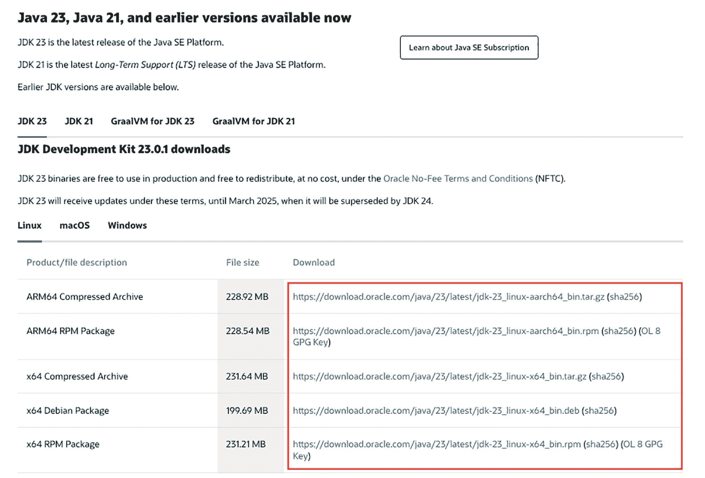
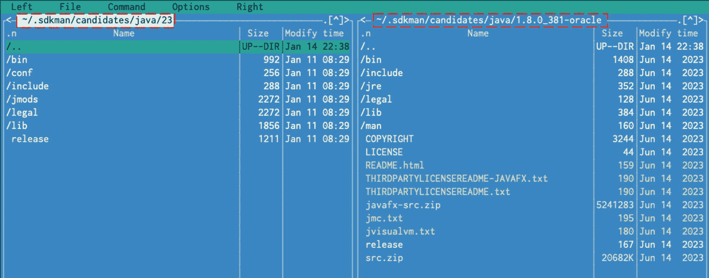
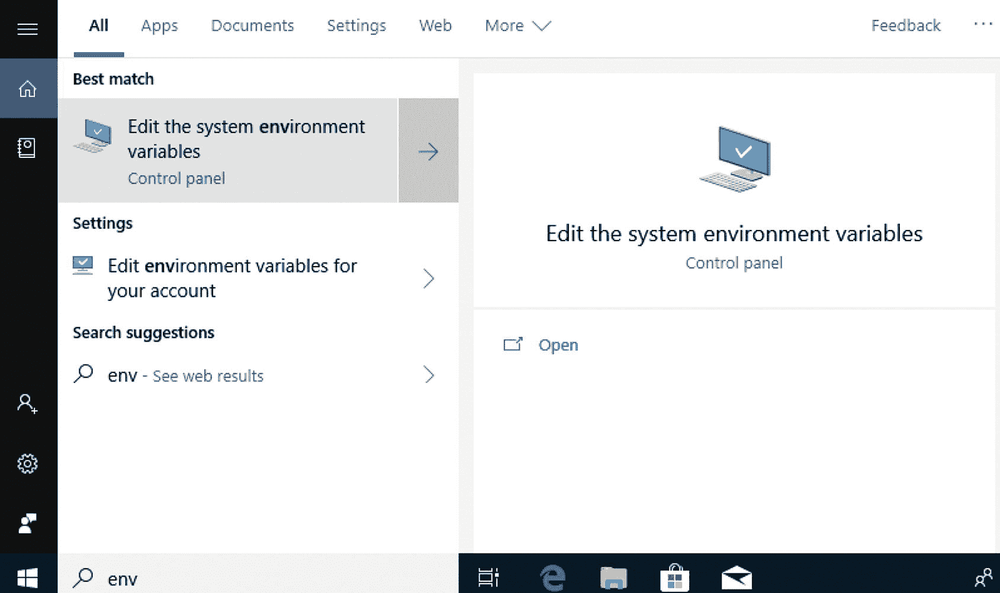
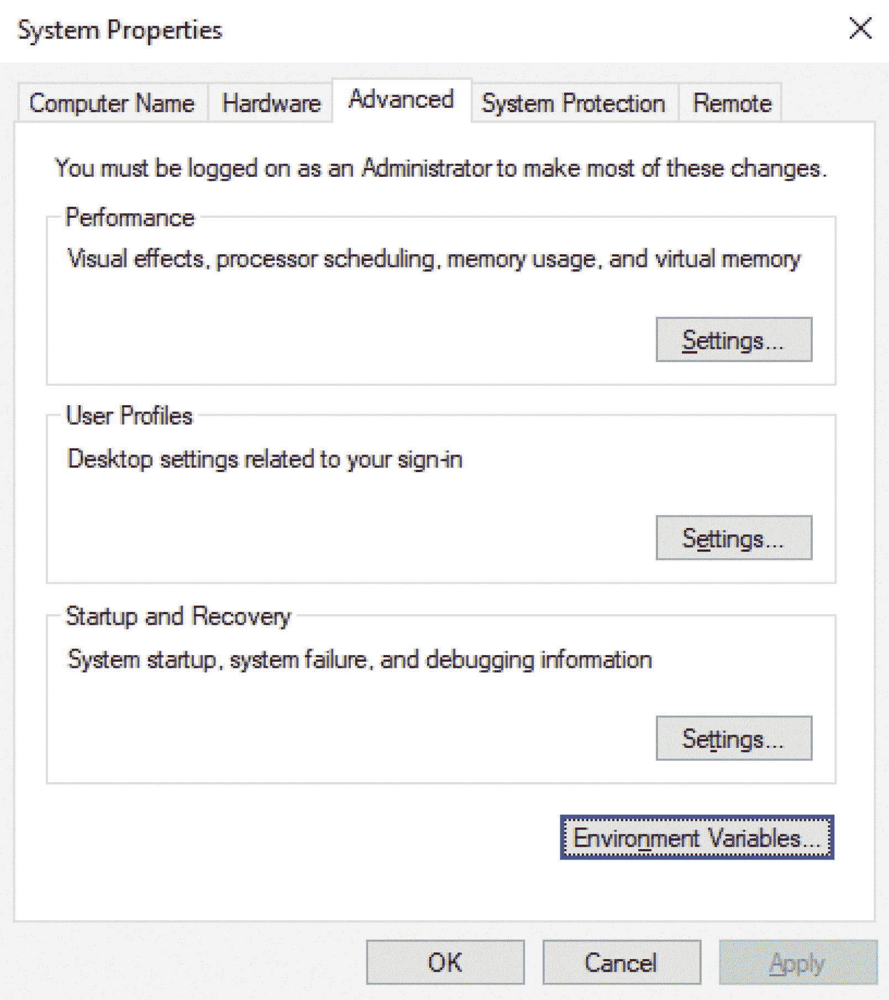
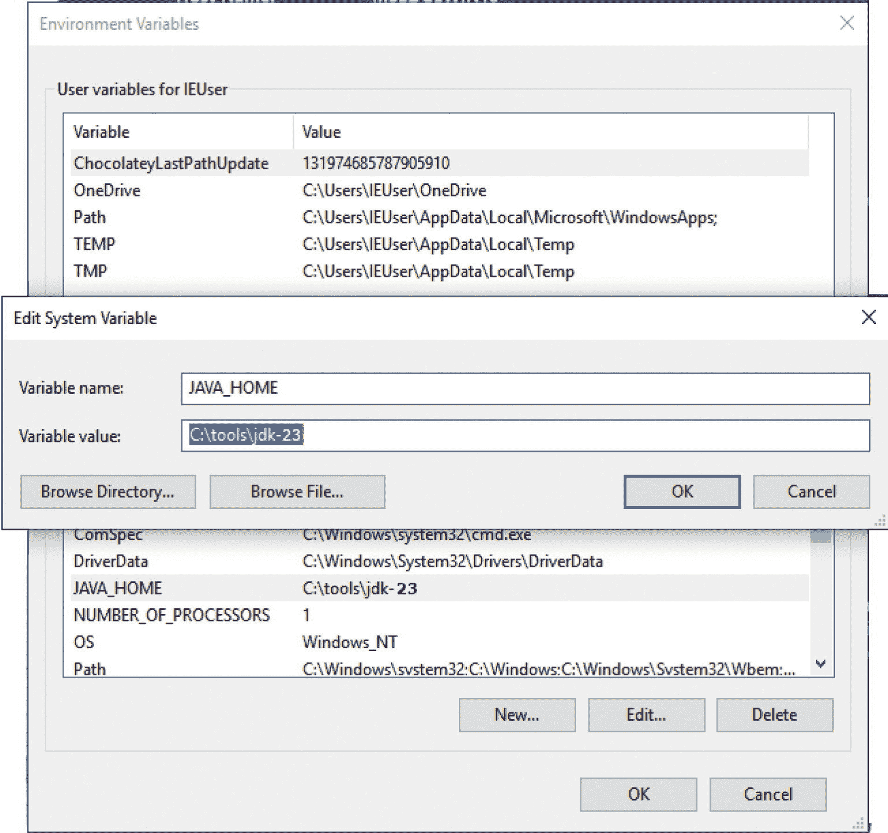
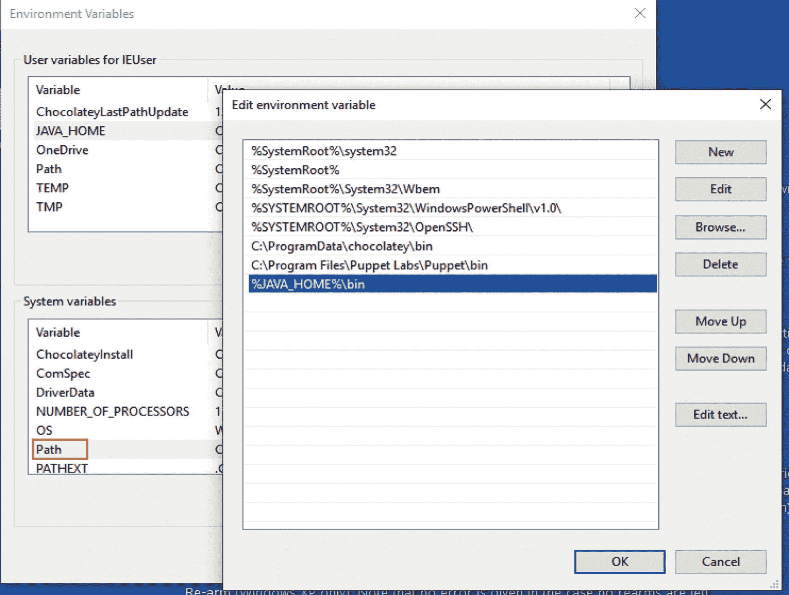
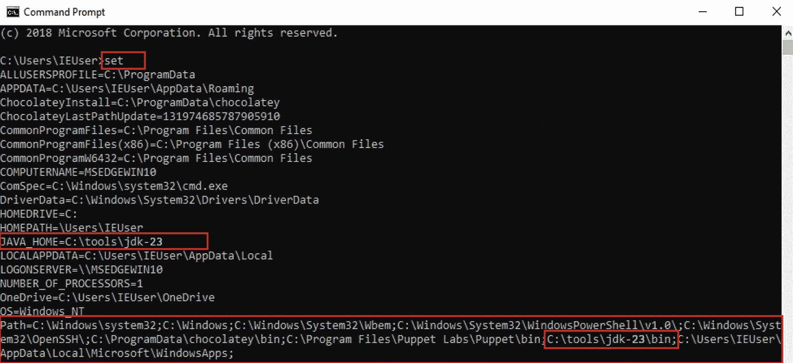

# 2. 准备你的开发环境

要开始学习 Java，你需要将计算机配置为 Java 开发机器。因此，以下是所需条件：

*   你的计算机需要**支持 Java**，这*几乎是必须的 😊。*

*   一个集成开发环境（IDE），本质上是一个用于编写代码的应用程序。IDE 能在你编写、编译和执行代码时提供帮助。
    *   本书推荐的 IDE 是 IntelliJ IDEA。你可以访问官方网站 ([`https://www.jetbrains.com/idea/`](https://www.jetbrains.com/idea/)) 获取免费的社区版，该版本足以满足本书的需求。

    *   或者，你也可以选择最流行的免费 Java 开发 IDE：Eclipse ([`https://www.eclipse.org/`](https://www.eclipse.org/))。

    *   或者，你可以尝试 Apache NetBeans，在过去，它曾是大多数初学者的默认选择，因为它与 JDK 捆绑在一起，直到版本 8。它在 Java 9 中被从 JDK 中移除，现在可以从这里下载：[`https://netbeans.apache.org`](https://netbeans.apache.org)。

*   **Apache Maven** 是一个构建工具，用于组织项目、轻松处理依赖关系，并使你在大型多模块项目中的工作更轻松。（这是必须的，因为本书中的项目都是使用 Maven 设置来组织和构建的。）

*   **Git** 是一个版本控制系统，你可以用它来获取本书的源代码，并可以对其进行实验并创建自己的版本。它是可选的，因为托管本章源代码的 GitHub 支持直接以压缩包形式下载。

注意

如今，任何正规的软件公司都会使用版本控制系统，因此在申请软件开发职位时，熟练掌握 Git 是一个重要的优势。

要编写和执行 Java 程序/应用程序，你只需要安装 **J**ava **D**evelopment **K**it。*如果你愿意，完全可以在记事本中编写 Java 代码。* 我在这里列出的所有其他工具只是为了让你工作更轻松，并让你熟悉真实的开发工作。

重要

如果你要为所有用户安装这些应用程序，你可能需要管理员权限。对于较新版本的 Windows，你甚至可能需要管理员权限才能安装必要的工具。本书提供了如何安装所有内容的说明——前提是你的用户拥有必要的权限。如果你需要更多信息，互联网可以为你提供帮助。

如果这些要求看起来设置起来很多，请不要气馁；本章包含如何安装每个工具并验证其是否正常工作的说明。让我们从确保你的计算机支持 Java 开始。


## 安装 Java

现在你面前摆着电脑，已经迫不及待想要开始编写 Java 应用程序了。但首先，你需要获取并安装一个 JDK。为此，你需要连接互联网。打开浏览器，访问 [`https://www.oracle.com/java/technologies/java-se-glance.html`](https://www.oracle.com/java/technologies/java-se-glance.html)。


图 2-1

在 Oracle 网站上导航以找到所需的 JDK

在 Oracle 网站上，你会找到最新的稳定版 Java。点击 **Downloads** 链接。你将被重定向到一个类似图 2-2 的下载页面。



图 2-2

可下载所需 JDK 的 Oracle 页面

JDK 23 适用于少数几种操作系统。你应该下载与你操作系统匹配的 JDK。在撰写本书和编写源代码时，我使用的是 macOS 电脑，这意味着我将下载扩展名为 `*.dmg` 的 JDK。

如果你想将 Java 用于开发，你需要接受许可协议。如果你好奇，可以阅读一下，但基本上它告诉你，只要你不修改其原始组件且不从中获利，你就可以使用 Java。它还告诉你，你需要对自己使用 Java 的方式负责，因此如果你用它编写或执行恶意应用程序，你将独自承担法律责任，等等。

如果你想获取尚未正式发布的早期版本 JDK，你需要访问这个页面：[`https://openjdk.org/projects/jdk`](https://openjdk.org/projects/jdk)。在撰写本章时，在该页面的 *Releases* 下，版本 24 被列为 *in development*，并且可以下载早期访问（不稳定）版本的 JDK 24。

重要

本书将涵盖截至并包括 Java 23 版本的 Java 语法和细节。不同版本之间存在一些共同的细节。这些内容将不会被审查和更改，因为唯一不同的是版本号。建议下载 JDK 23 版本，以确保源代码的完全兼容性。

下载 JDK 后，下一步是安装它。默认配置即可正常工作，因此只需双击 **Next** 直到到达最后一页，然后点击 **Finish**。这适用于 Windows 和 macOS。JDK 会安装在一个特定位置。

在 Windows 中，默认的 Java 安装路径是 `C:\Program Files\Java\jdk-23`，但你可以选择安装到其他路径，例如更简单且不含空格的路径，如 `C:\tools\jdk-23`。

在 macOS 中，默认路径是 `/Library/Java/JavaVirtualMachines/jdk-23.jdk/Contents/Home`。

在 Linux 系统上，JDK 的安装位置因发行版而异。我更喜欢的方式是从 Oracle 网站获取包含 JDK 完整内容的 `*.tar.gz` 文件，解压后将其复制到特定位置。此外，我在 Linux 上偏好的位置是 `/home/iuliana.cosmina/tools/jdk-23.jdk`。

提示

在 Linux 上使用 PPA（软件源；也称为包管理器）安装程序会自动将 JDK 文件放置到 Linux 应有的位置，并在新版本发布时使用 Linux（全局）更新工具自动更新它们。但是，如果你熟练使用 Linux，你现在可能已经明白可以跳过本节了。

在 Linux 或 Unix 系统上简化操作的另一种方法是使用 SDKMAN。这是近年来我最喜欢的 Java 安装方式，因为 SDKMAN 可以管理多个 Java 版本，并能根据名为 `.sdkmanrc` 的配置文件，在正在处理的项目之间自动切换。请从这里获取：[`https://sdkman.io`](https://sdkman.io)。

安装 Java 后，如果你进入特定于你操作系统的位置，可以查看 JDK 的内容。例如，在图 2-3 中，左侧是 JDK 23 的内容，右侧是 JDK 8 的内容。



图 2-3

JDK 8 与 JDK 23 内容对比

我选择进行此对比是因为，从 Java 9 开始，JDK 的内容组织方式有所不同。直到 Java 8，JDK 都包含一个名为 `jre` 的目录，其中包含 JDK 使用的 Java 运行时环境 (JRE)。对于只对运行 Java 应用程序感兴趣的人，可以单独下载 JRE。

`lib` 目录包含开发工具所需的 Java 库和支持文件。

从 Java 9 开始，JRE 不再独立存在于自己的目录中。从版本 11 开始，Java 已完全模块化。这意味着可以仅使用运行应用程序所需的模块来创建定制的“JRE”发行版。这也意味着从 Java 11 开始，Oracle 网站上不再有可供下载的 JRE。

关于 JDK，你需要了解的最重要的事情是，`bin` 目录包含编译、执行和审计 Java 代码所必需的可执行文件和命令行启动器。其他目录包括 `jmods` 目录（包含已编译的模块定义）和 `include` 目录（包含支持使用 Java 本地接口 (JNI) 和 Java 调试接口进行本地代码编程的 C 语言头文件）。

## `JAVA_HOME` 环境变量

JDK 中最重要的目录是 `bin` 目录，因为该目录必须添加到系统的路径中。这允许你从任何位置调用 Java 可执行文件。Java 可执行文件是在你的计算机上运行的程序，用于编译、运行和分析 Java 代码。它还允许其他应用程序无需额外的配置步骤即可调用它们。大多数用于处理（编写、分析、编译和执行）Java 代码的 IDE 都是用 Java 编写的，并且它们需要知道 JDK 的安装位置才能运行。这是通过声明一个名为 `JAVA_HOME` 的环境变量来实现的，该变量指向 JDK 目录的位置。为了使 Java 可执行文件可以从系统内的任何位置调用，你必须将 `bin` 目录添加到系统路径中。接下来的三节将解释如何在三种最常见的操作系统上执行此操作。


### Windows 系统上的 `JAVA_HOME`

要在 Windows 系统上声明 `JAVA_HOME` 环境变量，你需要打开设置系统变量的对话框窗口。在 Windows 系统中，点击**开始**按钮。在菜单中有一个搜索框。在较新的版本中，水平工具栏上也有一个搜索框，你也可以使用它。在其中输入单词 **environment**（不过，输入该单词的前三个字母就足以定位到该选项）。当 **编辑系统环境变量** 选项可用时，点击它。在 Windows 10 系统上，这些步骤如图 2-4 所示。



图 2-4

用于配置环境变量的 Windows 菜单项

点击该菜单项后，**系统属性** 对话框窗口应会打开，并显示 **高级** 选项卡，如图 2-5 所示。



图 2-5

在 Windows 上设置环境变量的第一个对话框窗口

点击 **环境变量** 按钮，打开同名的对话框窗口，该窗口分为两个部分：用户变量和系统变量。你关注的是**系统变量**，因为你要在这里声明 `JAVA_HOME`。只需点击该部分的 **新建** 按钮，就会出现一个小的 **新建系统变量** 对话框窗口，其中包含两个文本字段；顶部字段要求你输入变量名称——此处为 `JAVA_HOME`——底部字段要求你输入路径（变量值）——此处为 JDK 路径。图 2-6 显示了背景中的 **环境变量** 对话框窗口和前景中的 **编辑系统变量** 对话框窗口（我已经创建了 `JAVA_HOME`，所以显示的对话框窗口是“编辑系统变量”而不是“新建系统变量”）。



图 2-6

在 Windows 10 上将 `JAVA_HOME` 声明为系统变量

声明 `JAVA_HOME` 变量后，你需要将可执行文件添加到系统路径中。你可以通过编辑 `Path` 变量来实现。在 **环境变量** 对话框的 **系统变量** 列表中选择它，如图 2-7 左侧所示，然后点击 **编辑** 按钮打开 **编辑环境变量** 对话框（如右侧所示）。从 Windows 10 开始，`Path` 变量的每个部分都显示在不同的行上，因此你可以添加一个新行，并在其中添加 `%JAVA_HOME%\bin`。这种语法很实用，因为它会从 `JAVA_HOME` 变量包含的任何位置获取 `bin` 目录的位置。



图 2-7

在 Windows 10 上将 JDK 可执行文件目录声明为系统 `Path` 变量的一部分

在较旧的 Windows 系统上，`Path` 的内容显示在一个文本字段中。因此，你必须在 **变量值** 文本字段中添加 `%JAVA_HOME%\bin` 表达式，并使用分号 (;) 将其与现有内容分隔开。

无论你使用哪种 Windows 系统，你都可以通过打开 **命令提示符**（在搜索框中开始键入名称以轻松定位）并执行 `set` 命令来检查是否一切设置正确。这将列出所有系统变量及其值。`JAVA_HOME` 和 `Path` 应该出现在那里，并带有期望的值。对于本节提出的设置，执行 `set` 命令的输出如图 2-8 所示。



图 2-8

使用 `set` 命令列出的 Windows 10 系统变量

如果你执行了上述命令并看到了预期的输出，那么你现在可以通过在 **命令提示符** 窗口中执行 `java -version` 来测试你的 Java 安装，该命令会打印出预期的结果，类似于清单 2-1 的内容。

```
$ java –version
openjdk version "23" 2024-09-17
OpenJDK Runtime Environment (build 23+37-2369)
OpenJDK 64-Bit Server VM (build 23+37-2369, mixed mode, sharing)
清单 2-1
执行 java -version 的 Java 23 日志
```

### macOS 系统上的 `JAVA_HOME`

JDK 的安装位置是 `/Library/Java/JavaVirtualMachines/jdk-23.jdk/Contents/Home`。你的 `JAVA_HOME` 应指向此位置。要为当前用户执行此操作，你可以执行以下步骤：

*   在 `/Users/{your.user}` 目录（将 `{your.user}` 替换为你实际的系统用户名）中，创建一个名为 `.bash_profile` 的文件（如果该文件尚不存在）。

*   在此文件中，写入以下内容：

    ```
    export JAVA_HOME=$(/usr/libexec/java_home -v23)
    export PATH=$JAVA_HOME/bin:$PATH
    ```

如果你使用不同的 shell，只需在其自己的配置文件中添加相同的两行。

在 macOS 上，你可以同时安装多个 Java 版本。你可以通过调用 `/usr/libexec/java_home` 命令并将你感兴趣的 Java 版本作为参数传递，来获取所需版本的 JDK 位置，从而设置系统当前使用的版本。命令执行的结果将存储为 `JAVA_HOME` 变量的值。

在我的系统上，我安装了 JDK 8 到 23。我可以通过执行 `/usr/libexec/java_home` 命令并为每个版本提供参数来检查每个 JDK 的位置。版本 8 和 23 的命令和输出如清单 2-2 所示。

```
$ /usr/libexec/java_home -v23
/Library/Java/JavaVirtualMachines/jdk-23.jdk/Contents/Home
$ /usr/libexec/java_home -v1.8
/Library/Java/JavaVirtualMachines/jdk1.8.0_381.jdk/Contents/Home
清单 2-2
通过调用 /usr/libexec/java_home 获取的 Java 8 和 23 的位置
```

提示

通过使用 SDKMAN，可以避免手动安装 Java 和声明 `JAVA_HOME` 环境变量。

`export PATH=$JAVA_HOME/bin:$PATH` 这行代码将 JDK 位置下的 `bin` 目录的内容添加到系统路径中。这意味着我可以打开一个终端并执行其下的任何 Java 可执行文件。例如，我可以通过执行 `java –version` 来验证为用户设置的默认 Java 版本是否符合预期。

根据作为参数给出的版本，会返回不同的 JDK 位置。如果你想测试 `JAVA_HOME` 的值，`echo` 命令可以帮到你。清单 2-3 展示了 `echo` 和 `java –version` 命令的输出。

```
$ echo $JAVA_HOME
/Library/Java/JavaVirtualMachines/jdk-23.0.1/Contents/Home
$ java -version
openjdk version "23" 2024-09-17
OpenJDK Runtime Environment (build 23+37-2369)
OpenJDK 64-Bit Server VM (build 23+37-2369, mixed mode, sharing)
清单 2-3
echo 和 java -version 命令输出的 JAVA_HOME 值及已安装的 Java 版本。
```


### Linux 系统中的 `JAVA_HOME`

提示

如果你精通 Linux，那你很可能正在使用 PPA 或 SDKMAN，因此可以跳过本节。不过，如果你喜欢自行控制 JDK 的安装位置并定义自己的环境变量，请继续阅读。

Linux 系统是类 Unix 操作系统。这与基于 Unix 的 macOS 类似。根据你的 Linux 发行版，安装 Java 可以通过特定的包管理器完成，也可以直接从 Oracle 官网下载 `*.tar.gz` 格式的 JDK 归档文件。

如果通过包管理器安装 Java，必要的可执行文件通常会在安装时自动放入系统路径中。因此，本书只涵盖手动完成所有操作的情况，并选择将 Java 仅为当前用户安装到诸如 `/home/{your.user}/tools/jdk-23.jdk` 的位置，因为介绍包管理器并非本书的目的。

从 Oracle 网站下载 JDK 归档文件并将其解压到 `/home/{your.user}/tools/jdk-23.jdk` 后，你需要在用户主目录中创建一个名为 `.bashrc` 或 `.bash_profile` 的文件。在某些 Linux 发行版中，这些文件可能已经存在，此时你只需编辑它们即可。添加如代码清单 2-4 所示的行。

```
export JAVA_HOME=/home/{your.user}/tools/jdk-23.jdk
export PATH=$JAVA_HOME/bin:$PATH
代码清单 2-4
在 Linux 中为当前用户设置 JAVA_HOME
```

如你所见，其语法与 macOS 的语法类似。要检查 JDK 的位置和 Java 版本，可使用与 macOS 部分相同的命令。

## 运行 Java 代码

在指导你安装更多工具（Apache Maven、Git 等）之前，我们先运行一些 Java 代码。Java 9 引入的 JShell 等增强功能，以及 Java 21 引入并在未来版本中扩展范围（即使仍处于预览阶段）的未命名类和实例 `main` 方法，使得 Java 绝对初学者无需经过编译阶段即可直接运行 Java 代码，从而帮助他们熟悉语法并“快速体验”语言语法。

### 使用 JShell

从 Java 9 开始，想要测试 Java 语言的开发者无需创建完整的 Java 项目即可进行测试。JShell 是一个用于学习 Java 编程语言和原型化 Java 代码的交互式命令行工具。因此，你无需在类中编写代码、编译它并执行字节码，只需使用 JShell 直接执行语句即可。

JShell 的出现相当晚，因为像 Python 和 Node 这样的脚本语言多年前就引入了类似的工具，而 Scala、Clojure 和 Groovy 等 JVM 语言也紧随其后。但迟到总比没有好。

JShell 是一个读取-求值-打印循环（REPL），它会在输入声明、语句和表达式时立即对其进行求值，并立即显示结果。它非常适合快速尝试新的想法和技术，无需拥有完整的开发环境，也无需为代码执行提供完整的上下文。

JShell 是 JDK 的标准组件。启动它的可执行文件位于 JDK 安装目录的 `bin` 目录中。这意味着你只需打开一个终端（Windows 中的命令提示符）并输入 `jshell`。如果 `bin` 目录的内容已添加到系统路径中，你应该会看到一条包含系统上 JDK 版本的欢迎消息。此外，你的终端根目录会变为 `jshell>`，以提示你现在正在使用 `jshell`。

在代码清单 2-5 中，通过调用 `jshell -v` 以详细模式启动了 `jshell`，该模式会为会话结束前执行的所有语句提供详细的反馈。

```
$ jshell -v
|  欢迎使用 JShell -- 版本 23
|  如需介绍，请输入：/help intro
jshell>
代码清单 2-5
命令 jshell -v 的输出
```

如果你在阅读本书的同时执行命令，请继续输入 `/help` 以查看所有可用操作和命令的列表。假设你没有这样做，代码清单 2-6 展示了预期的输出。

```
jshell> /help
|  输入 Java 语言表达式、语句或声明。
|  或输入以下命令之一：
|  /list [|-all|-start]
|   列出你输入的源代码
|  /edit 
|   编辑源代码条目
|  /drop 
|   删除源代码条目
|  /save [-all|-history|-start] 
|   将代码片段保存到文件
...
|  /exit []
|   退出 jshell 工具
...
代码清单 2-6
在 jshell 中执行命令 /help 的输出
```

在 Java 中，值被分配给称为**变量**的字符组。（关于如何选择和使用它们，详见**第** **4** **章**。）为了开始使用 JShell，我们将声明一个名为 `six` 的变量，并将值 6 赋给它（*我知道，很聪明吧？*）。该语句和 `jshell` 的日志如代码清单 2-7 所示。

```
jshell> int six = 6;
six ==> 6
|  已创建变量 six : int
代码清单 2-7
使用 jshell 声明变量
```

如你所见，日志消息清晰明了，告诉我们命令已成功执行，并且创建了一个名为 `six` 的 `int` 类型变量。`six ==> 6` 让我们知道值 6 已分配给我们刚刚创建的变量。

你可以创建任意数量的变量，并执行数学运算、字符串拼接以及任何你需要快速执行的操作。只要 JShell 会话未关闭，这些变量就存在并且可以使用。代码清单 2-8 展示了使用 JShell 执行的一些语句及其结果。

```
jshell> int six = 6
six ==> 6
|  已修改变量 six : int
|    更新覆盖了变量 six : int
jshell> six = six + 1
six ==> 7
|  已赋值给 six : int
jshell> six +1
$14 ==> 8
|  已创建临时变量 $14 : int
jshell> System.out.println("当前值: " + six)
当前值: 7
代码清单 2-8
jshell 的各种语句及输出
```


清单 2-8 中展示的`$14 ==> 8`表示将值 8 赋给一个名为`$14`的变量。该变量由`jshell`创建。当语句的结果未被赋给开发者命名的变量时，`jshell`会生成一个临时变量，其名称由`$`（美元符号）字符和代表该变量内部索引的数字组成。文档中并未明确说明，但根据我在使用`jshell`时的观察，索引值似乎是导致该变量创建的语句编号。

重要

Java 代码最重要的构建块之一是**类**。类是模拟现实世界对象和事件的代码片段。类包含两种类型的**成员**：一种用于模拟状态，即类变量，也称为**字段**或**属性**；另一种用于模拟行为，称为**方法**。

JDK 提供了大量类，用于模拟创建大多数应用程序所需的基础组件。**第** **3** **章**将更详细地介绍类。即使现在有些概念看起来很陌生，也请耐心等待，让它们慢慢积累；之后你会更理解它们。

最重要的 JDK 类之一是`java.lang.String`，它用于表示文本对象。该类提供了丰富的方法集来操作`String`变量的值。清单 2-9 展示了对一个声明的`String`类型变量调用其中一些方法的情况。

```
jshell> String lyric = "twice as much ain't twice as good"
lyric ==> "twice as much ain't twice as good"
|  created variable lyric : String
jshell> lyric.toUpperCase()
$18 ==> "TWICE AS MUCH AIN'T TWICE AS GOOD"
|  created scratch variable $18 : String
jshell> lyric.length()
$20 ==> 33
|  created scratch variable $20 : int
清单 2-9
使用 String 变量的 jshell 方法调用示例
```

在`jshell`中使用 JDK 类型的变量编写 Java 代码可能看起来很复杂，因为你不知道该调用哪个方法，对吧？`jshell`非常有帮助，因为它会在方法不存在时告诉你。尝试调用方法时，你可以按 **Tab** 键显示可用方法列表。这称为**代码补全**，智能的 Java 编辑器也提供此功能。

在清单 2-10 中，你可以看到当你尝试调用一个不存在的方法时，`jshell`打印的错误信息，以及如何显示和过滤某个类型可用的方法。

```
jshell> lyric.toupper()
|  Error:
|  cannot find symbol
|    symbol:   method toupper()
|  lyric.toupper()
|  ^-----------^
jshell> lyric.to  # 
toCharArray()   toLowerCase(    toString()      toUpperCase(
jshell> lyric.   # 
charAt(                chars()                codePointAt(
codePointBefore(       codePointCount(        codePoints()
...
清单 2-10
使用 String 变量的更多 jshell 方法调用示例
```

JShell 非常明确地告诉我们，`String`类不知道`toupper()`方法。

在列出可能的方法时，以`()`结尾的方法不需要参数。以`(`结尾的方法接受零个或多个参数，并且有多个形式。要查看这些形式，只需在变量上输入该方法，然后再次按 **Tab** 键。清单 2-11 展示了`indexOf`方法的多种形式。

```
jshell> lyric.indexOf( # 
$1      $14     $18     $19     $2      $20     $5      $9      lyric   six
Signatures:
int String.indexOf(int ch)
int String.indexOf(int ch, int fromIndex)
int String.indexOf(String str)
int String.indexOf(String str, int fromIndex)

清单 2-11
jshell 列出 String 类中 indexOf 方法的所有形式
```

在`lyric.indexOf(`行之后，`jshell`会列出会话期间创建的变量，以便你轻松选择现有的参数。

你可以在 Java 项目中编写的任何内容，也都可以在`jshell`中编写。其优势在于，你可以将程序拆分为一系列语句，即时执行以检查结果，并根据需要进行调整。`jshell`还能为你做其他事情，其中最重要的内容将在本书中介绍。

通过执行`/vars`命令，可以列出在 JShell 会话中声明的所有变量。清单 2-12 展示了本章会话中声明的变量。

```
jshell> /vars
|    int $1 = 5
|    int $2 = 42
|    int $5 = 8
|    int $9 = 8
|    int six = 7
|    int $14 = 8
|    String lyric = "twice as much ain't twice as good"
|    String $18 = "TWICE AS MUCH AIN'T TWICE AS GOOD"
|    int $19 = 9
|    int $20 = 33
清单 2-12
jshell> /vars 小型编码会话的输出示例（第一部分）
```

现在，既然你已经充分练习了声明变量和执行数学运算，是时候编写其中最著名的程序了——一个在控制台打印 *Hello World!* 的程序。只需打开`jshell`并输入`System.out.print("Hello World!")`语句，如清单 2-13 所示。

```
jshell>
|  Welcome to JShell -- Version 23-ea
|  For an introduction type: /help intro
jshell> System.out.print("Hello World!")
Hello World!
清单 2-13
jshell> /vars 小型编码会话的输出示例（第二部分）
```


### 使用 Java 21 直接运行 Java 源文件

Java 21 通过 JEP 445^(²⁷)（*未命名类和实例 main 方法*）降低了 Java 初学者的入门门槛，使他们无需理解专为大型程序设计的语言特性即可编写第一个程序。正如 JEP 标题所示，它通过支持未命名类和实例 `main` 方法来实现这一目标。这意味着什么？Java 21 提供了直接运行 Java 代码的能力，无需显式编译（编译过程在内存中自动完成），初学者也无需使用专门的 IDE 即可编写 Java 代码。JShell 虽然早已具备此功能，但除单行命令外的其他场景并不实用。

我们来测试一下，好吗？在 `chapter02/java21-sandbox` 目录下有一个名为 `practice01.java` 的文件，其内容如代码清单 2-14 所示。

注意

Oracle 在引入此功能时给我制造了一个*先有鸡还是先有蛋*的问题。在本书的这个阶段，你尚未克隆本书的代码仓库，因此没有源代码。不过，运行本节及下一节中的示例并不需要源代码。你可以自行创建沙盒目录，并根据提供的内容创建文件。如果你想下载源代码，可以暂时跳转到**安装 Git** 一节。

```
void main() {
System.out.println("Practice01: Hello World");
}
代码清单 2-14
practice01.java 文件中的简单 main 方法
```

该方法签名非常简洁，与本书后续章节中你将看到的 `main` 方法不同。这是 Java 编程语言的一种简化方言，专为完全初学者设计。IntelliJ IDEA 能够识别并运行此文件，但如果你阅读本书时 JEP 445 仍处于预览状态，则需要为项目选择包含预览功能的**语言级别**。在撰写本文时，此功能在 Java 21 中仍为预览特性，这意味着只能通过代码清单 2-15 所示的命令来运行该文件。

```
> java --enable-preview --source 21 practice.java
# 输出
Note: practice.java uses preview features of Java SE 21.
Note: Recompile with -Xlint:preview for details.
Practice01: Hello World!
代码清单 2-15
运行 practice01.java 文件的 java 命令
```

代码清单 2-15 还展示了运行该命令后产生的输出。在常规 Java 中，方法必须包含在类中。然而，`practice01.java` 中的代码并不需要 `class` 声明；因此，可以说 `main()` 方法实际上属于一个**未命名**类。*现在 JEP 的名称是不是更有意义了？*

要使 Java 代码能够像这样直接执行，需要遵循以下规则：

*   **不允许**使用 `package` 语句。

*   没有类定义和构造函数。

*   文件中的代码必须包含在未命名类中，该类不能 `extend` 或 `implement` 其他类或接口。

*   必须存在一个 `main()` 方法，默认情况下它是 `static`（且 `public`）的——但为了不让初学者混淆类成员和实例成员等概念，这两个关键字被省略了。

*   文件只能声明静态成员（字段和方法），且静态方法只能访问其他静态成员。

*   `main()` 方法可以包含参数，并在执行文件时传递这些参数。

这些规则目前对你来说可能难以理解，因为列表中的大部分术语将在**第** **3** 章中介绍。但作为完全初学者，现在了解这些规则并非关键。如有需要，你可以稍后再回到本节。现在，让我们看看还能直接运行哪些其他代码。

我们可以直接运行带参数的 Java 代码，如代码清单 2-16 所示，该清单展示了 `practice02.java` 文件中的代码。

```
void main(String... args) {
if (args.length > 0) {
System.out.print("Practice02: Hello " + args[0] + "\n");
} else {
System.out.println("Practice02: Hello World!");
}
}
代码清单 2-16
带参数的 main 方法
```

`practice02.java` 中的代码可以带参数或不带参数运行。如果提供了参数，运行文件将输出 `Practice02: Hello {参数}`；否则输出 `Practice02: Hello World!`。代码清单 2-17 展示了带参数和不带参数运行 `practice02.java` 的情况。

```
> java --enable-preview --source 21 practice02.java Mayer
# 输出
Practice02: Hello Mayer
> java --enable-preview --source 21 practice02.java
# 输出
Practice02: Hello World
代码清单 2-17
运行 practice02.java 文件的 Java 命令
```

`java21-sandbox` 目录下还有另外两个文件。`practice03.java` 文件包含一个静态变量，当不带参数运行该文件时会打印其值。`practice04.java` 文件包含一个额外的静态方法，恰如其名 `staticMethod`。该方法在 `main` 方法中被调用，运行文件时会打印其结果。欢迎尝试运行它们。

此功能提供了立即编写并运行 Java 代码的机会，让你在深入学习高级编程概念之前，快速熟悉语言语法。

该功能的第二个预览版本出现在 Java 22 的 JEP 463^(²⁸)（*隐式声明类和实例 main 方法*）中。之所以需要另一个 JEP，是为了纳入社区反馈。JEP 标题中提到的隐式声明类放宽了 Java 21 中引入的 Java 直接可执行文件的部分规则：`main()` 方法被视为隐式包含在一个由系统决定名称的类中，并且 `main()` 方法不再是静态的。无论如何，这个 JEP 中关于内部工作机制的许多细节，在你读完本书后会更容易理解；目前，你只需要知道你可以编写简单的 Java 程序并轻松执行它们。


### 使用 Java 22 直接运行 Java 源文件

Java 22 通过 JEP 458^((29)) *启动多文件源代码程序* 进一步改进了对初学者入门 Java 的支持。该特性引入了运行具有正确 Java 语法的实际 Java 文件的可能性，而不是为完全初学者设计的简化方言。在 Java 22 中，学习 Java 的人可以编写并运行单类程序，然后随着学习的深入，逐步扩展程序以包含更多功能。

如第 1 章所述，大多数面向初学者的 Java 书籍都从典型的 *Hello World!* 示例开始，如清单 2-18 所示。

```
public class Practice01 {
public static void main(String[] args) {
System.out.println("Practice01: Hello World!");
}
}
清单 2-18
典型的 `HelloWorld` Java 示例
```

清单 2-18 中描述的代码代表了 `java22-sandbox/Practice01.java` 文件的内容。你可以直接运行此文件，如清单 2-19 所示。

```
> java Practice01.java
# 输出
Practice01: Hello World!
清单 2-19
使用 Java 22 运行 Java 文件
```

信息

请注意，不需要 `--enable-preview --source 22` 选项，因为这不是预览功能。

在上一节介绍 Java 21 时，要打印的文本是通过变量或其他方法提供的。在 Java 22 中，可以使用另一个类中的方法来提供文本。清单 2-20 显示了 `HelloProvider` 类的内容。

```
public class HelloProvider {
public static String get(){
return "Hello World from HelloProvider!";
}
}
清单 2-20
声明返回文本的方法的类
```

此类也位于 `java22-sandbox` 目录中。可以在同一目录中创建另一个名为 `Practice02` 的类，该类调用 `HelloProvider` 中的 `get()` 方法，其内容如清单 2-21 所示。

```
public class Practice02 {
public static void main(String[] args) {
System.out.println("Practice02: " + HelloProvider.get());
}
}
清单 2-21
调用 HelloProvider.get() 的类
```

此类有一个 `main(..)` 方法，因此可以使用清单 2-19 中的相同命令运行该文件。命令和输出如清单 2-22 所示。

```
> java Practice02.java
# 输出
Practice02: Hello World from HelloProvider!
清单 2-22
运行调用不同文件中不同类方法的 Java 文件
```

由于 `HelloProvider.java` 文件位于同一目录中，Java 可以轻松找到并使用它。这证明 Java 22 可以启动多个 Java 文件，而无需经过编译阶段。

Java 22 还能做更多事情。在构建 Java 项目时，你不需要总是从头开始编写所有内容，因为 Java 中有许多公开可用的库和框架，你可以将它们作为依赖项包含在你的项目中并使用它们。Java 库是已编译类的集合，可以归档到扩展名为 `jar` 的文件中。当你运行一个引用了库中某个类的类时，你需要告诉 Java 该库的位置。这种做法称为*将库添加到类路径*，通过使用 `-cp` 选项调用 `java` 扩展命令并提供库的位置作为参数来完成。

清单 2-23 显示了一个名为 `Practice03` 的类的代码，该类调用了 `HelloProvider.get()` 方法，但 `HelloProvider` 类是从类路径上的一个库中加载的。

```
public class Practice03 {
public static void main(String[] args) {
System.out.println("Practice03: " + lib.HelloProvider.get());
}
}
清单 2-23
从库中调用 HelloProvider.get() 的类
```

为了明确我们使用的是 `HelloProvider` 类的编译和归档版本，类定义包含了 `lib` 包，如清单 2-24 所示。

```
package lib;
public class HelloProvider {
public static String get(){
return "Hello World from HelloProvider in the lib jar!";
}
}
清单 2-24
调用 HelloProvider.get() 的类

你将在**第** **3** **章**中学习如何编译类并将其打包；现在，只需使用本示例提供的 `jar` 文件，该文件位于 `java22-sandbox/lib/lib-provider.jar`。运行 `Practice03.java` 文件的命令及其输出如清单 2-25 所示。

```
> java -cp "lib/*" Practice03.java
